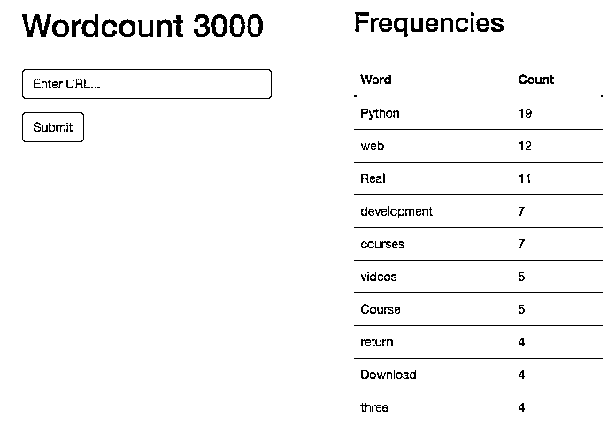

# flask by Example——使用请求、BeautifulSoup 和 NLTK 进行文本处理

> 原文：<https://realpython.com/flask-by-example-part-3-text-processing-with-requests-beautifulsoup-nltk/>

在本系列的这一部分，我们将抓取网页内容，然后处理文本以显示字数。

*更新:*

*   02/10/2020:升级到 Python 版本 [3.8.1](https://www.python.org/downloads/release/python-381/) 以及 requests、BeautifulSoup 和 nltk 的最新版本。详见下面的[。](#install-requirements)
*   03/22/2016:升级到 Python 版本 [3.5.1](https://www.python.org/downloads/release/python-351/) 以及 requests、BeautifulSoup、nltk 的最新版本。详见下面的[。](#install-requirements)
*   2015 年 2 月 22 日:添加了 Python 3 支持。

**免费奖励:** [点击此处获得免费的 Flask + Python 视频教程](https://realpython.com/bonus/discover-flask-video-tutorial/)，向您展示如何一步一步地构建 Flask web 应用程序。

* * *

记住:这是我们正在构建的——一个 Flask 应用程序，它根据来自给定 URL 的文本计算词频对。

1.  第一部分:建立一个本地开发环境，然后在 Heroku 上部署一个试运行环境和一个生产环境。
2.  第二部分:使用 SQLAlchemy 和 Alembic 建立一个 PostgreSQL 数据库来处理迁移。
3.  第三部分:添加后端逻辑，使用 requests、BeautifulSoup 和 Natural Language Toolkit (NLTK)库从网页中抓取并处理字数。(*当前* )
4.  第四部分:实现一个 Redis 任务队列来处理文本处理。
5.  [第五部分](/flask-by-example-integrating-flask-and-angularjs/):在前端设置 Angular，持续轮询后端，看请求是否处理完毕。
6.  第六部分:推送到 Heroku 上的临时服务器——建立 Redis 并详细说明如何在一个 Dyno 上运行两个进程(web 和 worker)。
7.  [第七部分](/flask-by-example-updating-the-ui/):更新前端，使其更加人性化。
8.  [第八部分](/flask-by-example-custom-angular-directive-with-d3/):使用 JavaScript 和 D3 创建一个自定义角度指令来显示频率分布图。

> 需要密码吗？从[回购](https://github.com/realpython/flask-by-example/releases)中抢过来。

## 安装要求

使用的工具:

*   requests ( [2.22.0](https://pypi.python.org/pypi/requests/2.22.0) ) -用于发送 HTTP 请求的库
*   BeautifulSoup ( [4.8.2](https://pypi.python.org/pypi/beautifulsoup4/4.8.2) ) -一个用于从网络上抓取和解析文档的工具
*   自然语言工具包( [3.4.5](https://pypi.python.org/pypi/nltk/3.4.5) ) -一个自然语言处理库

通过 [autoenv](https://pypi.python.org/pypi/autoenv/1.0.0) 导航到项目目录以激活虚拟环境，然后安装需求:

```py
$ cd flask-by-example
$ python -m pip install requests==2.22.0 beautifulsoup4==4.8.2 nltk==3.4.5
$ python -m pip freeze > requirements.txt
```

[*Remove ads*](/account/join/)

## 重构索引路径

首先，让我们去掉我们的 *app.py* 文件中索引路由的“hello world”部分，并设置路由来呈现一个接受 URL 的表单。首先，添加一个 templates 文件夹来保存我们的模板，并添加一个 index.html 的*文件到其中。*

```py
$ mkdir templates
$ touch templates/index.html
```

建立一个非常基本的 HTML 页面:

```py
<!DOCTYPE html>
<html>
  <head>
    <title>Wordcount</title>
    <meta name="viewport" content="width=device-width, initial-scale=1.0">
    <link href="//netdna.bootstrapcdn.com/bootstrap/3.3.6/css/bootstrap.min.css" rel="stylesheet" media="screen">
    <style> .container  { max-width:  1000px; } </style>
  </head>
  <body>
    <div class="container">
      <h1>Wordcount 3000</h1>
      <form role="form" method='POST' action='/'>
        <div class="form-group">
          <input type="text" name="url" class="form-control" id="url-box" placeholder="Enter URL..." style="max-width: 300px;" autofocus required>
        </div>
        
      </form>
      <br>
      
        <h4>{{ error }}</h4>
      
    </div>
    <script src="//code.jquery.com/jquery-2.2.1.min.js"></script>
    <script src="//netdna.bootstrapcdn.com/bootstrap/3.3.6/js/bootstrap.min.js"></script>
  </body>
</html>
```

我们使用了 [Bootstrap](https://getbootstrap.com/) 来增加一点风格，这样我们的页面就不会完全丑陋。然后，我们添加了一个带有文本输入框的表单，供用户输入 URL。此外，我们利用一个 [Jinja](https://realpython.com/primer-on-jinja-templating/) `for`循环来遍历一个[错误列表](https://realpython.com/python-lists-tuples/)，显示每一个错误。

更新 *app.py* 以提供模板:

```py
import os
from flask import Flask, render_template
from flask_sqlalchemy import SQLAlchemy

app = Flask(__name__)
app.config.from_object(os.environ['APP_SETTINGS'])
app.config['SQLALCHEMY_TRACK_MODIFICATIONS'] = False
db = SQLAlchemy(app)

from models import Result

@app.route('/', methods=['GET', 'POST'])
def index():
    return render_template('index.html')

if __name__ == '__main__':
    app.run()
```

为什么两种 HTTP 方法，`methods=['GET', 'POST']`？嗯，我们最终将对 GET 和 POST 请求使用相同的路径——分别服务于*index.html*页面和处理表单提交。

启动应用程序进行测试:

```py
$ python manage.py runserver
```

导航到 [http://localhost:5000/](http://localhost:5000/) ,您应该会看到表单回视着您。

## 请求

现在让我们使用[请求](https://realpython.com/python-requests/)库从提交的 URL 获取 HTML 页面。

像这样改变你的索引路线:

```py
@app.route('/', methods=['GET', 'POST'])
def index():
    errors = []
    results = {}
    if request.method == "POST":
        # get url that the user has entered
        try:
            url = request.form['url']
            r = requests.get(url)
            print(r.text)
        except:
            errors.append(
                "Unable to get URL. Please make sure it's valid and try again."
            )
    return render_template('index.html', errors=errors, results=results)
```

确保也更新导入:

```py
import os
import requests
from flask import Flask, render_template, request
from flask_sqlalchemy import SQLAlchemy
```

1.  这里，我们从 Flask 导入了`requests`库和`request`对象。前者用于发送外部 HTTP GET 请求以获取特定的用户提供的 URL，而后者用于处理 Flask 应用程序内的 GET 和 POST 请求。
2.  接下来，我们添加了[变量](https://realpython.com/python-variables/)来捕获错误和结果，并将它们传递到模板中。
3.  在视图本身中，我们检查请求是 GET 还是 POST-

    *   If POST:我们从表单中获取值(URL ),并将其分配给`url`变量。然后我们添加了一个异常来处理任何错误，如果有必要的话，将一个通用的错误消息附加到`errors`列表中。最后，我们渲染了模板，包括`errors`列表和`results`字典。
    *   If GET:我们只是渲染了模板。

**让我们来测试一下:**

```py
$ python manage.py runserver
```

你应该能够输入一个有效的网页，在终端中你会看到返回的网页文本。

> **注意:**确保你的网址包含`http://`或`https://`。否则我们的应用程序不会检测到这是一个有效的 URL。

[*Remove ads*](/account/join/)

## 文本处理

有了 HTML，现在让我们统计页面上单词的出现频率，并将它们显示给最终用户。将您在 *app.py* 中的代码更新为以下内容，然后我们将介绍一下发生了什么:

```py
import os
import requests
import operator
import re
import nltk
from flask import Flask, render_template, request
from flask_sqlalchemy import SQLAlchemy
from stop_words import stops
from collections import Counter
from bs4 import BeautifulSoup

app = Flask(__name__)
app.config.from_object(os.environ['APP_SETTINGS'])
app.config['SQLALCHEMY_TRACK_MODIFICATIONS'] = True
db = SQLAlchemy(app)

from models import Result

@app.route('/', methods=['GET', 'POST'])
def index():
    errors = []
    results = {}
    if request.method == "POST":
        # get url that the person has entered
        try:
            url = request.form['url']
            r = requests.get(url)
        except:
            errors.append(
                "Unable to get URL. Please make sure it's valid and try again."
            )
            return render_template('index.html', errors=errors)
        if r:
            # text processing
            raw = BeautifulSoup(r.text, 'html.parser').get_text()
            nltk.data.path.append('./nltk_data/')  # set the path
            tokens = nltk.word_tokenize(raw)
            text = nltk.Text(tokens)
            # remove punctuation, count raw words
            nonPunct = re.compile('.*[A-Za-z].*')
            raw_words = [w for w in text if nonPunct.match(w)]
            raw_word_count = Counter(raw_words)
            # stop words
            no_stop_words = [w for w in raw_words if w.lower() not in stops]
            no_stop_words_count = Counter(no_stop_words)
            # save the results
            results = sorted(
                no_stop_words_count.items(),
                key=operator.itemgetter(1),
                reverse=True
            )
            try:
                result = Result(
                    url=url,
                    result_all=raw_word_count,
                    result_no_stop_words=no_stop_words_count
                )
                db.session.add(result)
                db.session.commit()
            except:
                errors.append("Unable to add item to database.")
    return render_template('index.html', errors=errors, results=results)

if __name__ == '__main__':
    app.run()
```

创建一个名为 *stop_words.py* 的新文件，并添加以下列表:

```py
stops = [
    'i', 'me', 'my', 'myself', 'we', 'our', 'ours', 'ourselves', 'you',
    'your', 'yours', 'yourself', 'yourselves', 'he', 'him', 'his',
    'himself', 'she', 'her', 'hers', 'herself', 'it', 'its', 'itself',
    'they', 'them', 'their', 'theirs', 'themselves', 'what', 'which',
    'who', 'whom', 'this', 'that', 'these', 'those', 'am', 'is', 'are',
    'was', 'were', 'be', 'been', 'being', 'have', 'has', 'had', 'having',
    'do', 'does', 'did', 'doing', 'a', 'an', 'the', 'and', 'but', 'if',
    'or', 'because', 'as', 'until', 'while', 'of', 'at', 'by', 'for',
    'with', 'about', 'against', 'between', 'into', 'through', 'during',
    'before', 'after', 'above', 'below', 'to', 'from', 'up', 'down', 'in',
    'out', 'on', 'off', 'over', 'under', 'again', 'further', 'then',
    'once', 'here', 'there', 'when', 'where', 'why', 'how', 'all', 'any',
    'both', 'each', 'few', 'more', 'most', 'other', 'some', 'such', 'no',
    'nor', 'not', 'only', 'own', 'same', 'so', 'than', 'too', 'very', 's',
    't', 'can', 'will', 'just', 'don', 'should', 'now', 'id', 'var',
    'function', 'js', 'd', 'script', '\'script', 'fjs', 'document', 'r',
    'b', 'g', 'e', '\'s', 'c', 'f', 'h', 'l', 'k'
]
```

### 发生什么事了？

**文本处理**

1.  在我们的索引路径中，我们使用 beautifulsoup 通过移除 HTML 标签来清理文本，这是我们从 URL 和 nltk 得到的

    *   [标记化](https://www.nltk.org/api/nltk.tokenize.html)原始文本(将文本分解成单个单词)，以及
    *   将令牌转换成 nltk [文本对象](https://www.nltk.org/_modules/nltk/text.html)。
2.  为了让 nltk 正常工作，你需要下载[正确的](https://www.nltk.org/api/nltk.tokenize.html#module-nltk.tokenize.punkt)记号赋予器。首先，创建一个新目录- `mkdir nltk_data` -然后运行- `python -m nltk.downloader`。

    当安装窗口出现时，将“下载目录”更新为*whatever _ the _ absolute _ path _ to _ your _ app _ is/nltk _ data/*。

    然后点击“型号”选项卡，并在“标识符”栏下选择“punkt”。点击“下载”。查看官方[文档](https://www.nltk.org/data.html#command-line-installation)了解更多信息。

**去掉标点符号，统计生字**

1.  由于我们不希望在最终结果中计入标点符号，我们创建了一个[正则表达式](https://realpython.com/regex-python/)来匹配任何不在标准字母表中的内容。
2.  然后，使用[列表理解](https://realpython.com/list-comprehension-python/)，我们创建了一个没有标点符号或数字的单词列表。
3.  最后，我们使用[计数器](https://pymotw.com/3/collections/counter.html)计算每个单词在列表中出现的次数。

**停止字**

我们当前的输出包含许多我们可能不想统计的单词，例如，“我”、“我”、“the”等等。这些被称为停用词。

1.  对于`stops`列表，我们再次使用列表理解来创建不包括这些停用词的最终单词列表。
2.  接下来，我们用单词(作为键)及其相关计数(作为值)创建了一个字典。
3.  最后，我们使用[排序的](https://realpython.com/python-sort/)方法来获得字典的排序表示。现在，我们可以使用排序后的数据在列表顶部显示计数最高的单词，这意味着我们不必在 Jinja 模板中进行排序。

> 要获得更强大的停用词表，请使用 NLTK [停用词库](https://www.nltk.org/book/ch02.html)。

**保存结果**

最后，我们使用 try/except 将搜索结果和后续计数保存到数据库中。

## 显示结果

让我们更新*index.html*以便显示结果:

```py
<!DOCTYPE html>
<html>
  <head>
    <title>Wordcount</title>
    <meta name="viewport" content="width=device-width, initial-scale=1.0">
    <link href="//netdna.bootstrapcdn.com/bootstrap/3.1.1/css/bootstrap.min.css" rel="stylesheet" media="screen">
    <style> .container  { max-width:  1000px; } </style>
  </head>
  <body>
    <div class="container">
      <div class="row">
        <div class="col-sm-5 col-sm-offset-1">
          <h1>Wordcount 3000</h1>
          <br>
          <form role="form" method="POST" action="/">
            <div class="form-group">
              <input type="text" name="url" class="form-control" id="url-box" placeholder="Enter URL..." style="max-width: 300px;">
            </div>
            
          </form>
          <br>
          
            <h4>{{ error }}</h4>
          
          <br>
        </div>
        <div class="col-sm-5 col-sm-offset-1">
          
            <h2>Frequencies</h2>
            <br>
            <div id="results">
              <table class="table table-striped" style="max-width: 300px;">
                <thead>
                  <tr>
                    <th>Word</th>
                    <th>Count</th>
                  </tr>
                </thead>
                
                  <tr>
                    <td>{{ result[0] }}</td>
                    <td>{{ result[1] }}</td>
                  </tr>
                
              </table>
            </div>
          
        </div>
      </div>
    </div>
    <br><br>
    <script src="//code.jquery.com/jquery-1.11.0.min.js"></script>
    <script src="//netdna.bootstrapcdn.com/bootstrap/3.1.1/js/bootstrap.min.js"></script>
  </body>
</html>
```

这里，我们添加了一个`if`语句来查看我们的`results`字典中是否有任何内容，然后添加了一个`for`循环来对[遍历`results`](https://realpython.com/iterate-through-dictionary-python/) 并在一个表中显示它们。运行您的应用程序，您应该能够输入一个 URL，并获得页面上的字数。

```py
$ python manage.py runserver
```

如果我们想只显示前十个关键字会怎么样？

```py
results = sorted(
    no_stop_words_count.items(),
    key=operator.itemgetter(1),
    reverse=True
)[:10]
```

测试一下。

[*Remove ads*](/account/join/)

## 总结

好极了。给定一个 URL，我们可以计算页面上的字数。如果你使用一个没有大量词汇的网站，比如 https://realpython.com，处理应该会很快。但是，如果这个网站有很多 T2 单词会怎么样呢？比如试试 [https://gutenberg.ca](https://gutenberg.ca/) 。您会注意到这需要更长的处理时间。

如果你有很多用户同时访问你的网站来计算字数，并且他们中的一些人试图计算更大的页面，这可能会成为一个问题。或者，您可能决定更改功能，以便当用户输入 URL 时，我们递归地抓取整个网站，并基于每个单独的页面计算词频。有了足够的流量，这将大大降低网站的速度。

有什么解决办法？

我们不需要在每个用户发出请求后计算字数，而是需要使用一个队列在后台进行处理——这正是下一次[第四部分](/flask-by-example-implementing-a-redis-task-queue/)的出发点。

现在，提交您的代码，但是在提交 Heroku 之前，您应该删除除英语之外的所有语言标记符以及 zip 文件。这将显著减小提交的大小。请记住，如果你处理一个非英语网站，它只会处理英语单词。

```py
└── nltk_data
    └── tokenizers
        └── punkt
            ├── PY3
            │   └── english.pickle
            └── english.pickle
```

因为这个新的文本处理功能只完成了一半，所以只将其推送到暂存环境中:

```py
$ git push stage master
```

[](https://files.realpython.com/media/flask-by-example-part3-final.53a969a23826.png)

在舞台上测试一下。有问题就评论。下次见！

**免费奖励:** [点击此处获得免费的 Flask + Python 视频教程](https://realpython.com/bonus/discover-flask-video-tutorial/)，向您展示如何一步一步地构建 Flask web 应用程序。

* * *

*这是创业公司[埃德蒙顿](http://startupedmonton.com/)的联合创始人卡姆·克林和 Real Python* 的人合作的作品***