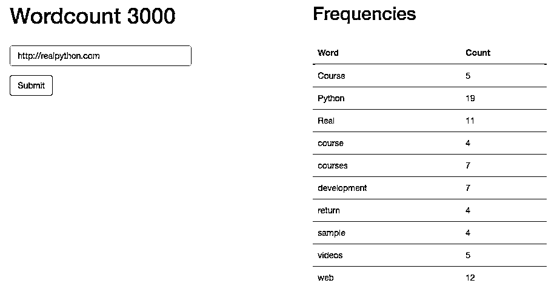

# flask by Example–更新用户界面

> 原文：<https://realpython.com/flask-by-example-updating-the-ui/>

在本教程的这一部分，我们将致力于用户界面，使其更加友好。

*更新:*

*   03/22/2016:升级到 Python 版本 [3.5.1](https://www.python.org/downloads/release/python-351/) 。
*   2015 年 2 月 22 日:添加了 Python 3 支持。

* * *

记住:这是我们正在构建的——一个 Flask 应用程序，它根据来自给定 URL 的文本计算词频对。

1.  [第一部分](/flask-by-example-part-1-project-setup/):建立一个本地[开发环境](https://realpython.com/effective-python-environment/)，然后在 Heroku 上部署 staging 和 production 环境。
2.  第二部分:使用 SQLAlchemy 和 Alembic 建立一个 PostgreSQL 数据库来处理迁移。
3.  [第三部分](/flask-by-example-part-3-text-processing-with-requests-beautifulsoup-nltk/):添加后端逻辑，使用 requests、BeautifulSoup 和[自然语言工具包(NLTK)](https://realpython.com/nltk-nlp-python/) 库从网页中抓取并处理字数。
4.  第四部分:实现一个 Redis 任务队列来处理文本处理。
5.  [第五部分](/flask-by-example-integrating-flask-and-angularjs/):在前端设置 Angular，持续轮询后端，看请求是否处理完毕。
6.  第六部分:推送到 Heroku 上的临时服务器——建立 Redis 并详细说明如何在一个 Dyno 上运行两个进程(web 和 worker)。
7.  第七部分:更新前端，使其更加人性化。(*当前* )
8.  [第八部分](/flask-by-example-custom-angular-directive-with-d3/):使用 JavaScript 和 D3 创建一个自定义角度指令来显示频率分布图。

<mark>需要代码吗？从[回购](https://github.com/realpython/flask-by-example/releases)中抢过来。</mark>

让我们看看当前的用户界面…

## 当前用户界面

在终端窗口中启动 Redis:

```py
$ redis-server
```

然后让你的员工进入另一个窗口:

```py
$ cd flask-by-example
$ python worker.py
17:11:39 RQ worker started, version 0.5.6
17:11:39
17:11:39 *** Listening on default...
```

最后，在第三个窗口中，启动应用程序:

```py
$ cd flask-by-example
$ python manage.py runserver
```

测试该应用程序，以确保它仍然工作。您应该会看到类似这样的内容:

[](https://files.realpython.com/media/current-ui.bf7b7a666eab.png)

让我们做一些改变。

1.  我们将从禁用提交按钮开始，以防止用户在等待提交的站点被计数时不断点击。
2.  接下来，当应用程序计算字数时，我们将添加一个 display[jumper](http://en.wikipedia.org/wiki/Throbber)/loading spinner，字数统计列表将向用户显示后端有活动发生。
3.  最后，如果无法访问该域，我们将显示一个错误。

[*Remove ads*](/account/join/)

## 更换按钮

将 HTML 中的按钮更改为以下内容:

```py

  <button type="submit" class="btn btn-primary"
  ng-disabled="loading">{{ submitButtonText }}</button>

```

我们添加了一个`ng-disabled` [指令](https://code.angularjs.org/1.4.9/docs/api/ng/directive/ngDisabled)，并将其附加到`loading`上。这将在`loading`评估为`true`时禁用按钮。接下来，我们添加了一个[变量](https://realpython.com/python-variables/)来显示给名为`submitButtonText`的用户。这样我们就可以将文本从`"Submit"`改为`"Loading..."`，这样用户就知道发生了什么。

然后我们将按钮包装在``和``中，这样[金贾](https://realpython.com/primer-on-jinja-templating/)就知道将其作为原始 HTML 进行评估。如果我们不这样做，Flask 将试图把`{{ submitButtonText }}`作为一个 Jinja 变量来评估，Angular 将没有机会评估它。

附带的 JavaScript 相当简单。

在 *main.js* 中的`WordcountController`顶部添加以下代码:

```py
$scope.submitButtonText  =  'Submit'; $scope.loading  =  false;
```

这会将`loading`的初始值设置为`false`，这样按钮就不会被禁用。它还将按钮的文本初始化为`"Submit"`。

将发布呼叫更改为:

```py
$http.post('/start',  {'url':  userInput}). success(function(results)  { $log.log(results); getWordCount(results); $scope.wordcounts  =  null; $scope.loading  =  true; $scope.submitButtonText  =  'Loading...'; }). error(function(error)  { $log.log(error); });
```

我们添加了三行，这设置了…

1.  `wordcounts`到`null`以便清除旧值。
2.  `loading`到`true`，这样加载按钮将通过我们添加到 HTML 中的`ng-disabled`指令被禁用。
3.  `submitButtonText`到`"Loading..."`以便用户知道为什么按钮被禁用。

接下来更新`poller`功能:

```py
var  poller  =  function()  { // fire another request $http.get('/results/'+jobID). success(function(data,  status,  headers,  config)  { if(status  ===  202)  { $log.log(data,  status); }  else  if  (status  ===  200){ $log.log(data); $scope.loading  =  false; $scope.submitButtonText  =  "Submit"; $scope.wordcounts  =  data; $timeout.cancel(timeout); return  false; } // continue to call the poller() function every 2 seconds // until the timeout is cancelled timeout  =  $timeout(poller,  2000); }); };
```

当结果成功时，我们将 loading 设置回`false`，以便按钮再次被启用，并将按钮文本更改回`"Submit"`，以便用户知道他们可以提交新的 URL。

测试一下！

## 添加微调器

接下来，让我们在字数统计部分下面添加一个微调器，这样用户就知道发生了什么。这是通过在结果`div`下面添加一个动画 gif 来实现的，如下所示:

```py
<div class="col-sm-5 col-sm-offset-1">
  <h2>Frequencies</h2>
  <br>
  <div id="results">
    <table class="table table-striped">
      <thead>
        <tr>
          <th>Word</th>
          <th>Count</th>
        </tr>
      </thead>
      <tbody>
        
          <tr ng-repeat="(key, val) in wordcounts">
            <td>{{key}}</td>
            <td>{{val}}</td>            
          </tr>
        
      </tbody>
    </table>
  </div>
  
</div>
```

一定要从[回购](https://github.com/realpython/flask-by-example/tree/master/static)中抓取 *spinner.gif* 。

你可以看到`ng-show`和`loading`是连在一起的，就像按钮一样。这样，当`loading`设置为`true`时，显示微调 gif。当`loading`设置为`false`时，例如，当字数统计过程结束时，微调器消失。

[*Remove ads*](/account/join/)

## 处理错误

最后，我们想处理用户提交了一个错误 URL 的情况。首先在表单下面添加以下 HTML:

```py
<div class="alert alert-danger" role="alert" ng-show='urlerror'>
  <span class="glyphicon glyphicon-exclamation-sign" aria-hidden="true"></span>
  <span class="sr-only">Error:</span>
  <span>There was an error submitting your URL.<br>
  Please check to make sure it is valid before trying again.</span>
</div>
```

它使用了 Bootstrap 的`alert` [类](http://getbootstrap.com/components/#alerts)来显示一个警告对话框，如果用户提交了一个错误的 URL。我们使用 Angular 的`ng-show` [指令](https://code.angularjs.org/1.4.9/docs/api/ng/directive/ngShow)只在`urlerror`为`true`时显示对话框。

最后，在`WordcountController`中将`$scope.urlerror`初始化为`false`，这样警告最初就不会出现:

```py
$scope.urlerror  =  false;
```

捕捉`poller`函数中的错误:

```py
var  poller  =  function()  { // fire another request $http.get('/results/'+jobID). success(function(data,  status,  headers,  config)  { if(status  ===  202)  { $log.log(data,  status); }  else  if  (status  ===  200){ $log.log(data); $scope.loading  =  false; $scope.submitButtonText  =  "Submit"; $scope.wordcounts  =  data; $timeout.cancel(timeout); return  false; } // continue to call the poller() function every 2 seconds // until the timeout is cancelled timeout  =  $timeout(poller,  2000); }). error(function(error)  { $log.log(error); $scope.loading  =  false; $scope.submitButtonText  =  "Submit"; $scope.urlerror  =  true; }); };
```

这将错误记录到控制台，将`loading`更改为`false`，将提交按钮的文本设置回`"Submit"`，以便用户可以再次尝试提交，并将`urlerror`更改为`true`，以便显示警告。

最后，在对`'/start'`的 POST 调用的`success`函数中，将`urlerror`设置为`false`:

```py
$scope.urlerror  =  false;
```

现在，当用户试图提交新的 url 时，警告对话框将会消失。

至此，我们对用户界面进行了一点清理，这样当我们在后台运行字数统计功能时，用户就知道发生了什么。测试一下！

## 结论

你还能增加或改变什么来改善用户体验？自己做些改变，或者在下面留下评论。完成后，请务必更新您的[试运行](http://wordcount-stage.herokuapp.com/)和[生产](http://wordcount-pro.herokuapp.com/)环境。

下次见！

*这是创业公司[埃德蒙顿](http://startupedmonton.com/)的联合创始人卡姆·克林和 Real Python* 的人合作的作品**