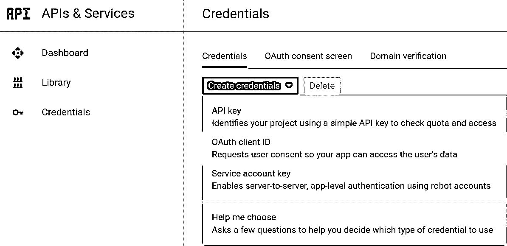

# 使用 Google 登录创建一个 Flask 应用程序

> 原文：<https://realpython.com/flask-google-login/>

*立即观看**本教程有真实 Python 团队创建的相关视频课程。和书面教程一起看，加深理解: [**用烧瓶使用 Google 登录**](/courses/using-google-login-flask/)

你可能在各种网站上看到过*谷歌登录*的选项。一些网站也有更多选项，如*脸书登录*或 *GitHub 登录*。所有这些选项都允许用户利用现有帐户来使用新服务。

在本文中，您将创建一个 [Flask](https://realpython.com/tutorials/flask/) web 应用程序。您的应用程序将允许用户使用他们的 Google 身份登录，而不是创建一个新帐户。这种用户管理方法有很多好处。这将比管理传统的用户名和密码组合更加安全和简单。

如果你已经理解了 Python 的[基础，这篇文章会更简单。了解一点 web 框架和 HTTP 请求也会有所帮助，但这并不是绝对必要的。](https://realpython.com/learning-paths/python3-introduction/)

**本文结束时，你将能够:**

*   创建一个 Flask web 应用程序，允许用户使用 Google 登录
*   创建客户端凭证以与 Google 交互
*   在 Flask 应用程序中使用 Flask-Login 进行用户会话管理
*   更好地理解 OAuth 2 和 OpenID Connect (OIDC)

您可以单击下面的框来获取您将在本文中创建的应用程序的代码:

**下载示例项目:** [单击此处下载您将在本文中构建的使用 Google 登录的 Flask 应用程序的代码。](https://realpython.com/bonus/google-login-project/)

## 为什么为你的用户使用谷歌登录？

您可能希望个人用户拥有个人资料。或者您可能希望只为某些用户提供功能。在任何情况下，您都需要知道谁在与您的应用程序交互。换句话说，您需要对用户进行身份验证，并以某种独特的方式识别他们。

传统的解决方案是使用唯一的用户名和密码。您的应用程序将存储这些信息，并在需要时请求这些信息。然而，这种解决方案也有一些缺点:

*   你必须安全地管理密码。
*   您必须实现任何与帐户相关的功能:
    *   双因素认证
    *   密码重置
*   您必须防范恶意登录尝试。
*   您的用户必须记住另一个用户名和密码。

通过为你的用户使用谷歌登录，你把所有的责任都推给了他们。您的应用程序等待用户通过身份验证。然后 Google 告诉你的应用程序关于这个用户的信息。此时，您可以有效地将它们记录到您的应用程序中。

你不必存储任何密码，谷歌处理所有的安全问题。

[*Remove ads*](/account/join/)

## 应用程序如何使用谷歌登录

有两个非常流行和重要的规范叫做 [OAuth 2](https://tools.ietf.org/html/rfc6749) 和 [OpenID Connect (OIDC)](https://openid.net/specs/openid-connect-core-1_0.html) 。OIDC 建立在 OAuth 2 之上，增加了一些新的想法和概念。

这些规范定义了第三方应用程序如何从另一个服务获取信息。这通常需要获得用户的同意。为了更好地理解这一点，让我们看看这是如何应用到您将要构建的应用程序中的。

您将要编写一个第三方应用程序，它将允许用户使用 *Google Login* 按钮登录。为此，谷歌需要了解你的应用程序。幸运的是，您可以将您的应用程序注册为 Google 的客户端。

一旦用户来到你的应用程序并按下*谷歌登录*按钮，你就可以把他们发送到谷歌。从那以后，Google 需要确保用户同意将他们的电子邮件和其他信息传递给你的应用程序。如果用户同意，Google 会向您的应用程序发回一些信息。然后，您可以存储这些信息，并在以后引用它们，有效地让用户登录。

## OpenID 连接详细信息

要代表用户请求信息，您必须成为认证服务器的`client`，也称为提供者。如果深入研究这些规范，您首先会发现有许多重叠的术语和概念。

因此，作为第三方应用程序(也称为客户端)，您希望代表用户从提供商那里获取信息。要做到这一点，需要一系列的步骤，而且这些步骤必须按照特定的顺序进行。这就是为什么你有时会听到 OAuth 2 和 OpenID Connect 被称为**握手**、**流**或**舞蹈**。

这些步骤大致如下:

1.  您将第三方应用程序注册为提供商的客户端:
    *   您将从提供商处收到唯一的客户端凭据。
    *   稍后，您将使用这些客户端凭证向提供者进行身份验证(证明您是谁)。
2.  客户端向提供者的`authorization` URL 发送请求
3.  提供商要求用户进行身份验证(证明他们是谁)
4.  提供商要求用户同意代表他们的客户端:
    *   通常这包括有限的访问权限，并且让用户清楚地知道客户要求什么。
    *   这就像你必须批准手机上的应用程序才能访问位置或联系人一样。
5.  提供商向客户端发送唯一的授权码。
6.  客户端将授权码发送回提供者的`token` URL。
7.  提供者代表用户发送客户端令牌以与其他提供者 URL 一起使用。

**注意:**以上步骤针对 OAuth 2 定义的授权代码流。

这些步骤包括到目前为止提到的两个标准。OpenID Connect (OIDC)构建在 OAuth 2 之上，增加了一些额外的特性和要求，主要涉及身份验证过程。除了上面流程中提到的认证，应用程序的重要 OIDC 概念是**提供者配置**和 **userinfo 端点**。

**提供者配置**包含关于提供者的信息，包括您需要用于 OAuth 2 流的确切 URL。在一个 OIDC 提供商那里有一个标准的 URL，你可以用它来取回一个带有[标准化字段](https://openid.net/specs/openid-connect-discovery-1_0.html#ProviderMetadata)的文档。

在您完成 OAuth 2 流程后， **[userinfo 端点](https://openid.net/specs/openid-connect-core-1_0.html#UserInfo)** 将返回关于用户的信息。这将包括他们的电子邮件和一些您将在申请中使用的基本资料信息。为了获得这些用户信息，您需要一个来自提供商的令牌，如上面流程的最后一步所述。

稍后您将看到关于如何利用提供者配置和用户信息端点的细节。

## 创建谷歌客户端

启用 *Google 登录*选项的第一步是将您的应用程序注册为 Google 的客户端。让我们来完成这些步骤。

首先，注意你需要一个谷歌账户。如果你使用 Gmail，你已经有一个了。

接下来，进入[谷歌开发者证书页面](https://console.developers.google.com/apis/credentials)。

一旦进入，您可能会被提示同意他们的服务条款。如果您同意这些，请按下一页上的*创建凭证*按钮。选择 **OAuth 客户端 ID** 的选项:

[](https://files.realpython.com/media/client_id.8c970f445c4f.png)

选择顶部的`Web application`选项。您也可以在`Name`字段中为客户端提供一个名称。当用户代表他们同意您的应用程序时，您提供的名称将显示给他们。

现在您将在本地运行您的 web 应用程序，因此您可以将`Authorized JavaScript origins`设置为`https://127.0.0.1:5000`，将`Authorized redirect URIs`设置为`https://127.0.0.1:5000/login/callback`。这将允许您的本地 Flask 应用程序与 Google 通信。

最后，点击`Create`，记下`client ID`和`client secret`。你以后会两者都需要的。

[*Remove ads*](/account/join/)

## 创建自己的网络应用程序

现在到了有趣的部分，您将应用所学的知识来创建一个实际的 web 应用程序！

让我们从心中的目标开始。您希望创建一个应用程序，让用户使用他们的 Google 帐户登录。该应用程序应该能够从谷歌检索用户的一些基本信息，如他们的电子邮件地址。那么应用程序应该在数据库中存储基本的用户信息。

不过，首先让我们看看您将使用的框架和库。

### 烧瓶

Flask 是一个轻量级的 web 框架，自称为**微框架**。它带有用于 web 应用程序将执行的基本任务的内置工具，如路由 URL 和处理 HTTP 请求。

我选择使用 Flask 作为例子，因为它既受欢迎又简单。然而，你所学到的关于 OAuth 2 和 OIDC 的东西并不是 Flask 特有的。事实上，即使是用来简化 OAuth 2 和 OIDC 的库也可以在任何 Python 代码中使用。换句话说，通过一些小的修改，您可以将您在这里学到的东西应用到您选择的另一个框架中。

### 烧瓶登录

另一个可以用来简化用户操作的工具是 [flask_login](https://flask-login.readthedocs.io/en/latest/) ，它提供了**用户会话管理**。

这个库在幕后做一些事情，并为您提供一些工具来帮助用户。也就是说，它为您提供了了解用户何时登录和注销的工具。它通过管理浏览器 cookie 中的用户会话来实现这一点。

它还处理用户的登录和注销，包括为这些用户创建数据库条目。但是从代码的角度来看，它真的让一切变得简单多了(您很快就会看到这一点)。

### OAuthLib

对于安全相关和符合标准的代码来说，有一个非常正确的常用短语:“不要重新发明轮子。”

OAuth 2 和 OpenID 连接标准很复杂。看看 RFC 和规范，你就知道了。它们很密集。一个错误意味着你可能在你的应用程序中打开了一个漏洞。

因此，您不需要编写代码来实现这些标准。您将使用根据一些非常具体的标准选择的 Python 包:

1.  这是一个受欢迎和普遍推荐的图书馆。许多其他包在内部使用这个库。
2.  它非常活跃，人们经常修补漏洞。
3.  它久经沙场，从 2012 年就有了。

有一些特定于 web 框架的包使用这个库来更紧密地集成到 Flask、Django、Pyramid 等中。然而，为了使您在这里学到的代码与框架无关，您将直接使用这个库，而不需要任何花哨的包装。

### 安装依赖关系

有许多第三方[依赖关系](https://realpython.com/courses/managing-python-dependencies/)可以让你的生活更轻松。以下是这些依赖关系的总结:

*   一个使典型的 web 应用程序任务更简单的 web 框架(Flask)
*   管理用户会话的简单方法(Flask-Login)
*   久经沙场的 OIDC 图书馆(`oauthlib`)

此外，您将使用以下内容:

*   一个数据库，用于存储登录用户的一些信息( [SQLite](https://realpython.com/python-sqlite-sqlalchemy/)
*   向 Google 发送 HTTP 请求的用户友好方式(`requests`)
*   一种在本地安全运行`https`的快速方法(pyOpenSSL)

SQLite 是标准 Python 库的一部分，但其他包不是。因此，您需要安装一些依赖项。现在，让我们一步一步地完成这个应用程序的创建。

首先，您需要安装上面提到的那些第三方依赖项。您将通过创建一个包含以下内容的`requirements.txt`文件来实现这一点:

```py
requests==2.21.0
Flask==1.0.2
oauthlib==3.0.1
pyOpenSSL==19.0.0
Flask-Login==0.4.1
```

**注意:**其他版本的包也可以工作，但是这些版本是在本文编写和测试期间使用的。

接下来，您可以使用 Python 的包安装程序`pip`来安装这些依赖项。

**注意:**如果您打算在您的计算机上安装不同 Python 应用程序的依赖项，通常建议使用虚拟环境。参见 [Python 虚拟环境:初级读本](https://realpython.com/python-virtual-environments-a-primer/)了解更多。

要从`requirements.txt`文件安装，请在终端中运行以下命令:

```py
$ pip install -r requirements.txt
```

现在你准备好摇滚了！让我们深入研究代码。

[*Remove ads*](/account/join/)

### 导入、配置和设置

首先添加一些文件来支持一些基本的数据库功能和用户管理。这些不会一节一节地描述，主要是因为深入到 [Python 数据库](https://realpython.com/tutorials/databases/)实现细节是一个兔子洞，会分散我们对目标的注意力。


这个文件将处理一些数据库功能。这几乎是来自 [Flask 的官方数据库教程](http://flask.pocoo.org/docs/1.0/tutorial/database/)的一行一行:

```py
# http://flask.pocoo.org/docs/1.0/tutorial/database/
import sqlite3

import click
from flask import current_app, g
from flask.cli import with_appcontext

def get_db():
    if "db" not in g:
        g.db = sqlite3.connect(
            "sqlite_db", detect_types=sqlite3.PARSE_DECLTYPES
        )
        g.db.row_factory = sqlite3.Row

    return g.db

def close_db(e=None):
    db = g.pop("db", None)

    if db is not None:
        db.close()

def init_db():
    db = get_db()

    with current_app.open_resource("schema.sql") as f:
        db.executescript(f.read().decode("utf8"))

@click.command("init-db")
@with_appcontext
def init_db_command():
    """Clear the existing data and create new tables."""
    init_db()
    click.echo("Initialized the database.")

def init_app(app):
    app.teardown_appcontext(close_db)
    app.cli.add_command(init_db_command)
```

现在您已经有了一些数据库实用程序，可以开始考虑模式了。您可能会注意到，这段代码正在寻找一个`schema.sql`文件，接下来您将创建这个文件。

`schema.sql`文件只是一些 SQL，它将在我们的数据库中创建一个用户表。您可以在这个文件中看到您将为每个用户存储的字段。


这里有一个单独的表`user`，它将存放一些与用户相关的东西(他们的姓名、他们登录时使用的电子邮件以及他们在 Google 上的个人资料图片):

```py
CREATE  TABLE  user  ( id  TEXT  PRIMARY  KEY, name  TEXT  NOT  NULL, email  TEXT  UNIQUE  NOT  NULL, profile_pic  TEXT  NOT  NULL );
```

`db.py`文件中的代码将实际执行这个 SQL 来创建数据库中的表。

下一个文件包含我们的`User`类，它将从数据库中存储和检索信息。姓名、电子邮件和个人资料图片都将从 Google 中检索，您将在本文后面看到。


`User`类有从数据库获取现有用户和创建新用户的方法:

```py
from flask_login import UserMixin

from db import get_db

class User(UserMixin):
    def __init__(self, id_, name, email, profile_pic):
        self.id = id_
        self.name = name
        self.email = email
        self.profile_pic = profile_pic

    @staticmethod
    def get(user_id):
        db = get_db()
        user = db.execute(
            "SELECT * FROM user WHERE id = ?", (user_id,)
        ).fetchone()
        if not user:
            return None

        user = User(
            id_=user[0], name=user[1], email=user[2], profile_pic=user[3]
        )
        return user

    @staticmethod
    def create(id_, name, email, profile_pic):
        db = get_db()
        db.execute(
            "INSERT INTO user (id, name, email, profile_pic) "
            "VALUES (?, ?, ?, ?)",
            (id_, name, email, profile_pic),
        )
        db.commit()
```

代码对数据库执行 SQL 语句，数据库是从前面的`db.py`文件的`get_db()`函数中检索的。每个新用户都会在数据库中插入一个额外的行。

从上面的代码创建了`db.py`、`schema.sql`和`user.py`文件后，您可以创建一个新的`app.py`文件。添加以下导入内容:

```py
# Python standard libraries
import json
import os
import sqlite3

# Third-party libraries
from flask import Flask, redirect, request, url_for
from flask_login import (
    LoginManager,
    current_user,
    login_required,
    login_user,
    logout_user,
)
from oauthlib.oauth2 import WebApplicationClient
import requests

# Internal imports
from db import init_db_command
from user import User
```

稍后你会用到所有这些，所以现在理解它们并不重要。您的`app.py`中的下一部分是一些配置:

```py
# Configuration
GOOGLE_CLIENT_ID = os.environ.get("GOOGLE_CLIENT_ID", None)
GOOGLE_CLIENT_SECRET = os.environ.get("GOOGLE_CLIENT_SECRET", None)
GOOGLE_DISCOVERY_URL = (
    "https://accounts.google.com/.well-known/openid-configuration"
)
```

下面是存储 Google 客户端 ID 和客户端密码的方法，您应该在本文前面创建这些内容。这些将在后面的 OIDC 流程中使用。

您的应用程序将尝试通过读取环境变量来获取客户端凭据。这有几个原因:

1.  如果以后想使用不同的凭证，不必修改代码，只需更新环境即可。
2.  你不会意外地将你的秘密凭证提交给 [GitHub](https://realpython.com/python-git-github-intro/) (或者另一个公共存储库)。

许多人不小心将秘密提交给公共存储库，造成了相当严重的安全风险。最好通过使用环境变量来防止这种情况。

**提示:**您可以使用`export GOOGLE_CLIENT_ID=your_client_id`(类似于`GOOGLE_CLIENT_SECRET`)在 Linux bash 终端和 Mac OS X 终端中将您的客户端凭证设置为环境变量。

如果你在 Windows 上，你可以在命令提示符下使用`set GOOGLE_CLIENT_ID=your_client_id`。

或者，您*可以*将字符串直接粘贴到这里，并将它们存储在这些变量中。**然而**，客户端秘密应该**而不是**被共享或提交给任何公共存储库。换句话说，如果您在这里粘贴真实的客户端凭据，请小心不要签入该文件。

最后，下面是一些带有全局变量的代码和一些简单的数据库初始化逻辑。除了数据库初始化之外，这大部分都是设置 Flask、Flask-Login 和 OAuthLib 的标准方式，您在前面已经了解过:

```py
# Flask app setup
app = Flask(__name__)
app.secret_key = os.environ.get("SECRET_KEY") or os.urandom(24)

# User session management setup
# https://flask-login.readthedocs.io/en/latest
login_manager = LoginManager()
login_manager.init_app(app)

# Naive database setup
try:
    init_db_command()
except sqlite3.OperationalError:
    # Assume it's already been created
    pass

# OAuth 2 client setup client = WebApplicationClient(GOOGLE_CLIENT_ID)

# Flask-Login helper to retrieve a user from our db
@login_manager.user_loader
def load_user(user_id):
    return User.get(user_id)
```

请注意，您已经在使用来自 Google 的客户端 ID 来初始化我们在`WebApplicationClient`中的`oauthlib`客户端。

您可以创建另一个环境变量`SECRET_KEY`，供 [Flask 和 Flask-Login 使用](http://flask.pocoo.org/docs/1.0/api/#flask.Flask.secret_key)对 cookies 和其他项目进行加密签名。

[*Remove ads*](/account/join/)

### Web 应用程序端点

现在，有趣的是。您将为您的 web 应用程序编写四个端点:

1.  一个用于主页
2.  一个用于开始用户登录过程
3.  一个是回调函数，用户登录后 Google 会重定向到这个函数
4.  一个用于注销

这些端点将由应用程序上的不同 URL 定义，并具有非常有创意的名称:

1.  **首页:** `/`
2.  **登录:** `/login`
3.  **登录回拨:** `/login/callback`
4.  **注销:** `/logout`

当然，您可能希望以后添加额外的页面和功能。这个应用程序的最终结果将是完全可扩展的，可以添加任何你想要的东西。

您将把这些端点的所有以下代码添加到`app.py`文件中。让我们一次看一个端点的代码。

#### 主页

这在视觉上没有什么特别的，但是如果用户登录，您将添加一些简洁的逻辑来显示不同的内容。当他们没有登录时，会出现一个链接，显示 *Google 登录*。

点击链接会将他们重定向到您的`/login`端点，这将启动登录流程。成功登录后，主页将同时显示用户的 Google 电子邮件和他们公开的 Google 个人资料图片！

事不宜迟，您可以开始向您的`app.py`文件添加更多代码:

```py
@app.route("/")
def index():
    if current_user.is_authenticated:
        return (
            "<p>Hello, {}! You're logged in! Email: {}</p>"
            "<div><p>Google Profile Picture:</p>"
            '</img></div>'
            '<a class="button" href="/logout">Logout</a>'.format(
                current_user.name, current_user.email, current_user.profile_pic
            )
        )
    else:
        return '<a class="button" href="/login">Google Login</a>'
```

你会注意到，你返回的 HTML 是一个字符串，Flask 能够提供这个字符串。`current_user.is_authenticated`是`Flask-Login`库的一个可爱的补充。这是确定与您的应用程序交互的当前用户是否登录的直接方法。这允许您应用条件逻辑。在这种情况下，如果用户已经登录，它将显示您保存的关于用户的一些信息。

您可以从数据库条目中为用户获取字段，只需将它们作为属性访问在`current_user`对象上，比如`current_user.email`。这是`Flask-Login`的另一个补充。

#### 登录

现在让我们来看看 OAuth 2 流。上面的 *Google 登录*按钮将重定向到这个端点。流程的第一步是找出 Google 的 OAuth 2 授权端点在哪里。

这就是 OAuth 2 和 OpenID Connect (OIDC)定义的界限开始模糊的地方。如前所述，OIDC 为一个**提供者配置**提供了一个标准端点，它包含一堆 OAuth 2 和 OIDC 信息。具有该信息的文档从任何地方的标准端点`.well-known/openid-configuration`提供。

假设您复制了前面定义`GOOGLE_DISCOVERY_URL`的代码，这里有一个快速、简单的函数来检索 Google 的提供商配置:

```py
def get_google_provider_cfg():
    return requests.get(GOOGLE_DISCOVERY_URL).json()
```

**提示:**为了使这更健壮，您应该在 Google API 调用中添加错误处理，以防 Google 的 API 返回失败而不是有效的提供者配置文档。

您需要的提供者配置文档中的字段称为`authorization_endpoint`。这将包含您需要用来从您的客户端应用程序启动 OAuth 2 流的 URL。

您可以将所有逻辑与以下代码放在一起:

```py
@app.route("/login")
def login():
    # Find out what URL to hit for Google login
    google_provider_cfg = get_google_provider_cfg()
    authorization_endpoint = google_provider_cfg["authorization_endpoint"]

    # Use library to construct the request for Google login and provide
    # scopes that let you retrieve user's profile from Google
    request_uri = client.prepare_request_uri(
        authorization_endpoint,
        redirect_uri=request.base_url + "/callback",
        scope=["openid", "email", "profile"],
    )
    return redirect(request_uri)
```

幸运的是，`oauthlib`使得对 Google 的实际请求变得更加容易。您使用了预先配置的`client`,您已经将您的 Google 客户端 ID 给了它。接下来，您提供了希望 Google 使用的重定向。最后，你问谷歌要了一些 OAuth 2 `scopes`。

您可以将每个作用域视为一条独立的用户信息。在您的情况下，您需要从 Google 获得用户的电子邮件和基本个人资料信息。当然，用户必须同意向您提供这些信息。

**注意:** `openid`是告诉 Google 启动 OIDC 流的必需范围，它将通过让用户登录来验证用户。OAuth 2 实际上并没有标准化身份验证是如何发生的，所以在这种情况下这对我们的流程是必要的。

#### 登录回拨

让我们分块来做这个，因为它比前几个端点更复杂一些。

一旦重定向到 Google 的授权端点，Google 端会发生很多事情。

应用程序上的登录端点是 Google 验证用户和请求同意的所有工作的起点。一旦用户登录 Google 并同意与您的应用程序共享他们的电子邮件和基本个人资料信息，Google 会生成一个独特的代码并发送给您的应用程序。

提醒一下，下面是你之前读过的 OIDC 步骤:

1.  您将第三方应用程序注册为提供商的客户端。
2.  客户端向提供者的`authorization` URL 发送一个请求。
3.  提供商要求用户进行身份验证(证明他们是谁)。
4.  提供商要求用户同意代表他们的客户端。
5.  提供商向客户端发送唯一的授权码
6.  客户端将授权码发送回提供商的`token` URL
7.  提供者代表用户发送客户端令牌以与其他 URL 一起使用

当 Google 发回这个唯一的代码时，它会将它发送到应用程序上的这个登录回调端点。因此，您的第一步是定义端点并获得那个`code`:

```py
@app.route("/login/callback")
def callback():
    # Get authorization code Google sent back to you
    code = request.args.get("code")
```

接下来你要做的是将代码发送回 Google 的`token`端点。在 Google 验证了您的客户端凭据之后，他们会向您发回令牌，允许您代表用户向其他 Google 端点进行身份验证，包括您之前了解到的`userinfo`端点。在您的情况下，您只要求查看基本的个人资料信息，所以这是您对令牌唯一能做的事情。

首先，你需要弄清楚 Google 的`token`端点是什么。您将再次使用提供者配置文档:

```py
# Find out what URL to hit to get tokens that allow you to ask for
# things on behalf of a user
google_provider_cfg = get_google_provider_cfg()
token_endpoint = google_provider_cfg["token_endpoint"]
```

在下一个代码块中，它几次帮了你的忙。首先，您需要构造令牌请求。一旦请求被构造，您将使用`requests`库来实际发送它。然后`oauthlib`将再次帮助您解析响应中的令牌:

```py
# Prepare and send a request to get tokens! Yay tokens!
token_url, headers, body = client.prepare_token_request(
    token_endpoint,
    authorization_response=request.url,
    redirect_url=request.base_url,
    code=code
)
token_response = requests.post(
    token_url,
    headers=headers,
    data=body,
    auth=(GOOGLE_CLIENT_ID, GOOGLE_CLIENT_SECRET),
)

# Parse the tokens!
client.parse_request_body_response(json.dumps(token_response.json()))
```

现在您已经有了获取用户个人资料信息的必要工具，您需要向 Google 请求。幸运的是，OIDC 定义了一个用户信息端点，其给定提供者的 URL 在提供者配置中是标准化的。您可以通过检查提供者配置文档中的`userinfo_endpoint`字段来获得位置。然后，您可以使用`oauthlib`将令牌添加到您的请求中，并使用`requests`将其发送出去:

```py
# Now that you have tokens (yay) let's find and hit the URL
# from Google that gives you the user's profile information,
# including their Google profile image and email
userinfo_endpoint = google_provider_cfg["userinfo_endpoint"]
uri, headers, body = client.add_token(userinfo_endpoint)
userinfo_response = requests.get(uri, headers=headers, data=body)
```

旅程的下一步是解析来自`userinfo`端点的响应。Google 使用一个可选字段`email_verified`来确认用户不仅创建了一个帐户，还验证了电子邮件地址以完成帐户创建。有条件地检查这种验证通常是安全的，因为这是 Google 提供的另一层安全性。

也就是说，您将检查这一点，如果 Google 说用户已经过验证，那么您将解析他们的信息。您将使用的 4 条基本个人资料信息是:

1.  **`sub` :** 主题，用户在 Google 中的唯一标识符
2.  **`email` :** 用户的谷歌邮箱地址
3.  **`picture` :** 用户在谷歌中的公开个人资料图片
4.  **`given_name` :** 用户在谷歌中的名字和姓氏

所有这些解析都会产生以下代码:

```py
# You want to make sure their email is verified.
# The user authenticated with Google, authorized your
# app, and now you've verified their email through Google!
if userinfo_response.json().get("email_verified"):
    unique_id = userinfo_response.json()["sub"]
    users_email = userinfo_response.json()["email"]
    picture = userinfo_response.json()["picture"]
    users_name = userinfo_response.json()["given_name"]
else:
    return "User email not available or not verified by Google.", 400
```

此回调的最后步骤是:

1.  用刚刚从 Google 获得的信息在数据库中创建一个用户
2.  通过让用户登录来开始用户会话
3.  让用户返回主页(在这里您将显示他们的公开个人资料信息)

完成这些步骤的代码如下:

```py
# Create a user in your db with the information provided
# by Google
user = User(
    id_=unique_id, name=users_name, email=users_email, profile_pic=picture
)

# Doesn't exist? Add it to the database.
if not User.get(unique_id):
    User.create(unique_id, users_name, users_email, picture)

# Begin user session by logging the user in
login_user(user)

# Send user back to homepage
return redirect(url_for("index"))
```

因此，您在这里所做的是在数据库中为用户创建一个新行，如果他们还不存在的话。然后，使用 Flask-Login 启动一个会话。

#### 注销

注销端点比最后几个端点代码少得多。你只需调用一个注销功能，并重定向回主页。完了，完了。这是:

```py
@app.route("/logout")
@login_required
def logout():
    logout_user()
    return redirect(url_for("index"))
```

在这里，`@login_required` [装饰者](https://realpython.com/primer-on-python-decorators/)是一件重要的事情。这是来自`Flask-Login`工具箱的另一个工具，它将确保只有登录的用户才能访问这个端点。如果只有登录的用户应该访问某些东西，您可以使用它。在这种情况下，只有登录的用户才能注销。

[*Remove ads*](/account/join/)

### 在本地测试您的应用程序

您可以在本地计算机上运行 Flask 应用程序，通过向`app.py`添加一些最终代码来测试登录流程:

```py
if __name__ == "__main__":
    app.run(ssl_context="adhoc")
```

您可以在终端中使用以下命令运行 Flask 应用程序:

```py
$ python app.py
```

**注意:**由于朴素的数据库初始化逻辑，第一次运行这个命令时，它会创建数据库。要启动你的应用程序，你必须再次运行同样的命令*。

Flask 应该打印到运行开发服务器的终端上。应该是`https://127.0.0.1:5000/`。

请注意，Flask 的开发服务器在本地运行*和*，使用`https`来确保与 Google 的加密连接。这是通过上面代码中的`app.run`的`ssl_context="adhoc"`参数实现的。这需要您安装软件包`PyOpenSSL`。

缺点是使用的证书是动态生成的，所以当你在浏览器中进入`https://127.0.0.1:5000/`时，它可能会给你一个很大的警告屏幕，告诉你你的连接不安全或不保密。您可以有效地忽略这些警告。

一旦越过警告屏幕，您应该会看到一个显示 *Google 登录*的按钮。按下它会把你带到谷歌的官方登录。登录后，谷歌会提示你同意“第三方应用程序”访问你的电子邮件和个人资料信息。

同意后，您将被重定向回您的 Flask 应用程序，页面将显示您的 Google 电子邮件和公开个人资料图片！最后，一个*注销*按钮允许你注销。

## 结论

允许用户使用他们现有的帐户登录您的 web 应用程序有很多好处。最重要的是，帐户管理的安全性和复杂性不必由您来承担。这让您可以自由地编写新的 web 应用程序，而不必担心双因素身份验证之类的琐碎细节。

您在本文中创建的应用程序是一个很好的起点。您可以点击下面的方框获取代码:

**下载示例项目:** [单击此处下载您将在本文中构建的使用 Google 登录的 Flask 应用程序的代码。](https://realpython.com/bonus/google-login-project/)

您的下一步可以是执行以下操作:

*   重做数据库初始化，使其与运行应用程序分开进行
*   从 Python 代码中分离出 [HTML/CSS](https://realpython.com/html-css-python/) 以便于管理:
    *   你可以使用[模板](http://flask.pocoo.org/docs/1.0/tutorial/templates/)。
    *   你也可以从其他地方加载静态文件(比如 JS 和 CSS) [。](http://flask.pocoo.org/docs/1.0/quickstart/#static-files)
*   在云中托管您的应用程序
*   购买域名
*   使用真正的 SSL 证书，摆脱讨厌的警告

在本文中，您已经了解了 OAuth 2 和 OpenID Connect 的基础知识。您已经看到了如何使用众所周知的 [Python 包](https://realpython.com/python-modules-packages/)来创建一个 web 应用程序，允许用户使用他们现有的 Google 帐户登录。最重要的是，您拥有示例代码，可以作为您下一个 [web 应用程序](https://realpython.com/python-web-applications/)的良好起点！

*立即观看**本教程有真实 Python 团队创建的相关视频课程。和书面教程一起看，加深理解: [**用烧瓶使用 Google 登录**](/courses/using-google-login-flask/)********