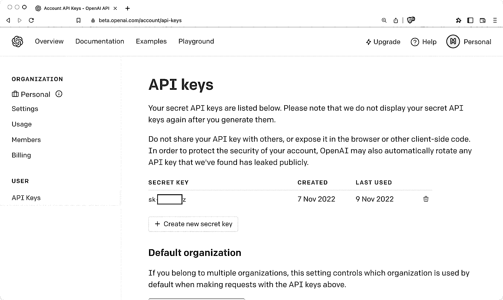
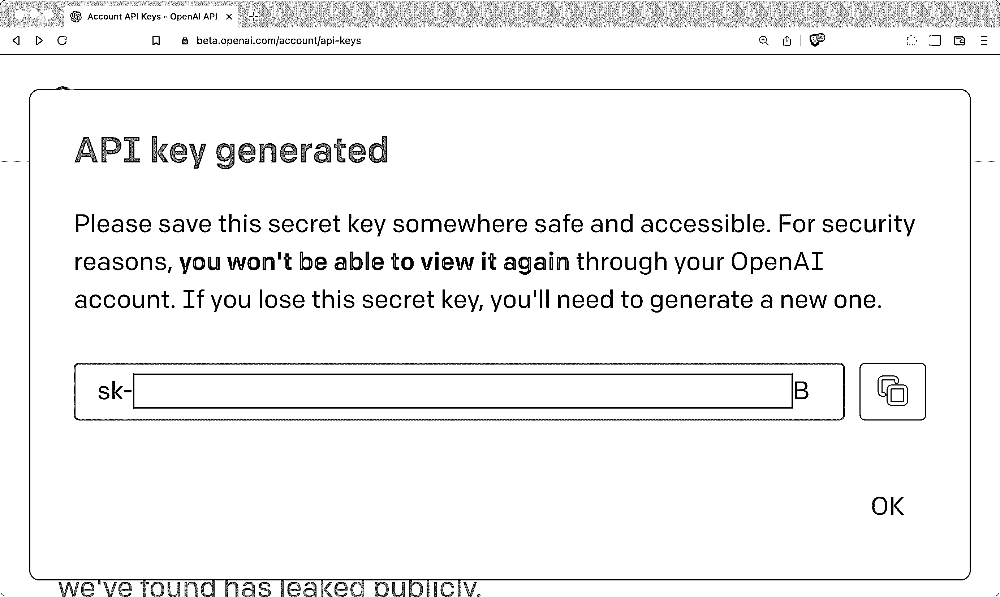

# 用 DALL E 2 和 OpenAI API 生成图像

> 原文：<https://realpython.com/generate-images-with-dalle-openai-api/>

描述任何图像，然后让计算机为您创建它。随着[神经网络](https://realpython.com/python-ai-neural-network/)和**潜在扩散模型** (LDM)的进步，几年前听起来很超前的东西已经变成了现实。**由 OpenAI** 创作的 DALL E 通过令人惊叹的[生成艺术](https://en.wikipedia.org/wiki/Generative_art)和人们用它创造的现实图像引起了轰动。

OpenAI 现在允许通过他们的 **API** 访问 DALL E，这意味着你可以将其功能整合到你的 **Python 应用**中。

**在本教程中，您将:**

*   开始使用 **OpenAI Python 库**
*   探索与**图像生成**相关的 API 调用
*   从**文本提示**创建图像
*   为您生成的图像创建**个变体**
*   **将 Base64** JSON 响应转换为 **PNG 图像**文件

您需要一些 Python、JSON 和文件操作的经验来轻松完成本教程。你也可以边走边研究这些主题，因为你会在整篇文章中找到相关的链接。

如果你以前没有玩过 DALL E 的 web 用户界面(UI ),那么在回来学习如何用 Python 编程之前，先尝试一下。

**源代码:** [点击这里下载免费的源代码](https://realpython.com/bonus/generate-images-with-dalle-openai-api-code/)，你将使用 DALL E 2 和 OpenAI API 来生成令人惊叹的图像。

## 完成设置要求

如果您已经看到了 DALL E 所能做的事情，并且渴望将其功能融入到您的 Python 应用程序中，那么您就找对了地方！在第一部分中，您将快速浏览在自己的代码中开始使用 DALL E 的图像创建功能需要做的事情。

### 安装 OpenAI Python 库

确认[运行 Python 版本](https://realpython.com/intro-to-pyenv/#specifying-your-python-version) 3.7.1 或更高版本，创建并激活[虚拟环境](https://realpython.com/python-virtual-environments-a-primer/)，安装 [OpenAI Python 库](https://github.com/openai/openai-python):

*   [*视窗*](#windows-1)
**   [**Linux + macOS**](#linux-macos-1)*

```py
PS> python --version
Python 3.11.0
PS> python -m venv venv
PS> .\venv\Scripts\activate
(venv) PS> python -m pip install openai
```

```py
$ python --version
Python 3.11.0
$ python -m venv venv
$ source venv/bin/activate
(venv) $ python -m pip install openai
```

这个`openai`包让你可以访问完整的 [OpenAI API](https://beta.openai.com/docs/api-reference?lang=python) 。在本教程中，您将关注于`Image`类，您可以用它来与 DALL E 交互，从文本提示中创建和编辑图像。

### 获取您的 OpenAI API 密钥

您需要一个 API 密钥来进行成功的 API 调用。注册 OpenAI API 并创建一个新的 API 密钥，方法是点击您个人资料上的下拉菜单并[选择*查看 API 密钥*T3:](https://beta.openai.com/account/api-keys)

[](https://files.realpython.com/media/openai-api-key-page.5aa1e51f6ba2.png)

在这个页面上，您可以管理您的 API 密钥，这些密钥允许您通过 API 访问 OpenAI 提供的服务。您可以创建和删除密钥。

点击*创建新的密钥*创建新的 API 密钥，并复制弹出窗口中显示的值:

[](https://files.realpython.com/media/openai-secret-key-generated.8da038285fed.png)

永远保持这个密钥的秘密！复制此项的值，以便以后在项目中使用。你只会看到键值一次。

### 将 API 密钥保存为环境变量

保存 API 密钥并使其对 Python 脚本可用的一个快速方法是将其保存为一个**环境变量**。选择您的操作系统，了解如何:

*   [*视窗*](#windows-2)
**   [**Linux + macOS**](#linux-macos-2)*

```py
(venv) PS> $ENV:OPENAI_API_KEY = "<your-key-value-here>"
```

```py
(venv) $ export OPENAI_API_KEY="<your-key-value-here>"
```
******  *****

加入我们，访问数以千计的教程和 Pythonistas 专家社区。

[*解锁本文*](/account/join/?utm_source=rp_article_preview&utm_content=generate-images-with-dalle-openai-api)

*已经是会员了？[签到](/account/login/)


全文仅供会员阅读。加入我们，访问数以千计的教程和 Pythonistas 专家社区。

[*解锁本文*](/account/join/?utm_source=rp_article_preview&utm_content=generate-images-with-dalle-openai-api)

*已经是会员了？[签到](/account/login/)*******