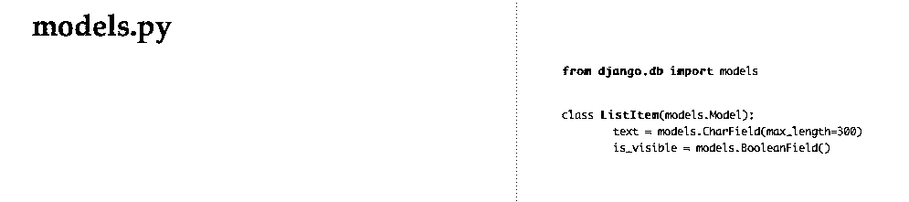
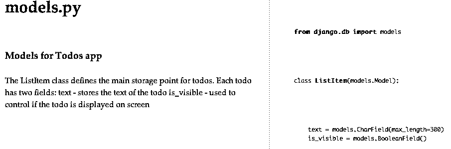
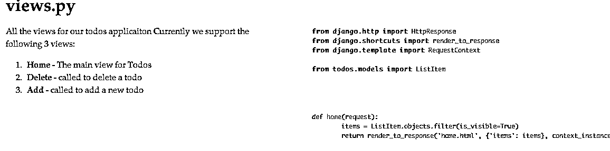
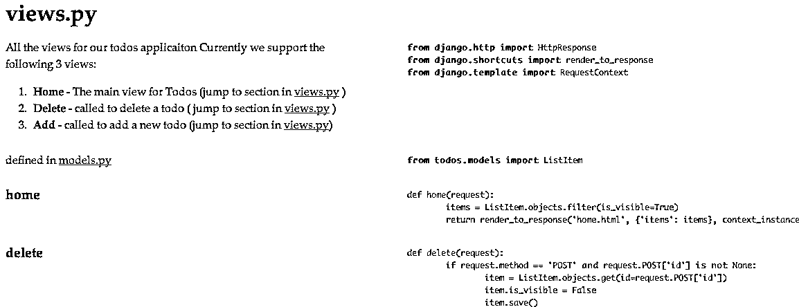

# 用 Pycco 生成代码文档

> 原文：<https://realpython.com/generating-code-documentation-with-pycco/>

作为开发人员，我们喜欢编写代码，尽管当时这对我们来说是有意义的，但我们必须为我们的受众着想。必须有人阅读、使用和/或维护所述代码。可能是另一个开发者，一个客户，或者三个月后我们未来的自己。

即使像 Python 这样漂亮的语言有时也很难理解。所以作为关心我们的程序员同事的优秀编程公民(或者更可能是因为我们的老板希望我们这样)，我们应该[写一些文档](https://realpython.com/documenting-python-code/)。

但是有规则:

1.  写文档一定不能糟糕(例如，我们不能使用 MS Word)。
2.  编写文档必须尽可能轻松。
3.  编写文档不能要求我们离开我们最喜欢的文本编辑器/ IDE。
4.  写文档不能要求我们做任何格式化或者关心最终的演示。

这就是 [Pycco](https://pypi.python.org/pypi/Pycco/0.1) 的用武之地:

> “Pycco”是 Docco 的 Python 移植:原始的快速、肮脏、长达一百行、有文化的编程风格的文档生成器。它生成 HTML，在你的代码旁边显示你的注释。注释通过 Markdown 和 SmartyPants 传递，而代码通过 Pygments 传递以突出语法。

所以基本上这意味着 Pycco 可以为我们自动生成看起来不错的代码文档。Pycco 还遵守上述代码文档的四个规则。那么有什么不爱呢？让我们来看一些如何使用它的例子。

对于这篇文章，我从一个用 [Django](https://realpython.com/tutorials/django/) 编写的简单的 TODO 应用程序开始，你可以从 [repo](https://github.com/mjhea0/django-todo) 中获得它。该应用程序允许用户向列表中添加项目，并在完成后删除它们。这个应用程序可能不会为我赢得一个 Webby，但它应该服务于本文的目的。

> 请注意，回购中的文件已经包含最终代码，已经记录在案。不过，您仍然可以创建单独的文档文件，所以请随意克隆回购并跟随我。

## 项目设置

克隆回购:

```py
$ git clone git@github.com:mjhea0/django-todo.git
```

Setup virtualenv:

```py
$ cd django-todo
$ virtualenv --no-site-packages venv
$ source venv/bin/activate
```

安装要求:

```py
$ pip install -r requirements.txt
```

同步数据库:

```py
$ cd todo
$ python manage.py syncdb
```

[*Remove ads*](/account/join/)

## 生成一些单据

开始很简单:

```py
$ pip install pycco
```

然后，您可以使用如下命令来运行它:

```py
$ pycco todos/*.py
```

注意，这样您可以指定单个文件或文件目录。在我们的 TODO repo 上执行上述命令会生成以下结果:

```py
pycco = todo/todos/__init__.py -> docs/__init__.html
pycco = todo/todos/models.py -> docs/models.html
pycco = todo/todos/tests.py -> docs/tests.html
pycco = todo/todos/views.py -> docs/views.html
```

换句话说，它生成 html 文件(每个 python 文件一个)并将它们全部转储到“docs”目录中。对于较大的项目，您可能希望使用-p 选项来保留原始文件路径。

例如:

```py
pyccoo todo/todos/*.py -p
```

将生成:

```py
pycco = todo/todos/__init__.py -> docs/todo/todos/__init__.html
pycco = todo/todos/models.py -> docs/todo/todos/models.html
pycco = todo/todos/tests.py -> docs/todo/todos/tests.html
pycco = todo/todos/views.py -> docs/todo/todos/views.html
```

> 请注意，它将 todos 应用程序的文档存储在“docs/todo/todos”子文件夹下。这样做的话，对于一个大型项目来说，浏览文档将会更加容易，因为文档结构将会与代码结构相匹配。

## 生成的单据

pycco 的目的是生成一个两列文档，左边是注释，右边是后续代码。因此，在还没有注释的 *models.py* 类上调用 pycco 将生成如下所示的页面:

[](https://files.realpython.com/media/pycco-simple-model-docs.12366a10ee35.png)

您会注意到左边的栏(应该是注释的地方)是空白的，右边显示的是代码。我们可以通过添加一个 [docstring](https://realpython.com/documenting-python-code/#documenting-your-python-code-base-using-docstrings) 来改变 *models.py* ，通过向 *models.py* 添加以下代码来获得更有趣的文档。

```py
from django.db import models

# === Models for Todos app ===

class ListItem(models.Model):
    """
 The ListItem class defines the main storage point for todos.
 Each todo has two fields:
 text - stores the text of the todo
 is_visible - used to control if the todo is displayed on screen
 """

    text = models.CharField(max_length=300)
    is_visible = models.BooleanField()
```

在上面的代码片段中，pycco 找到了这一行:

```py
# === Models for Todos app ===
```

然后在文档中生成一个标题。

文档字符串:

```py
"""
The ListItem class defines the main storage point for todos.
Each todo has two fields:
text - stores the text of the todo
is_visible - used to control if the todo is displayed on screen
"""
```

Pycco 使用 docstring 来生成文档。再次运行 pycco 后的最终结果将是:

[](https://files.realpython.com/media/pycco-model-docs-with-comments.2401c5fa4aca.png)

如您所见，左边的文档与右边的代码很好地结合在一起。这使得审查代码和理解发生了什么变得非常容易。

Pycco 还识别代码中以`#`开头的单行注释来生成文档。

[*Remove ads*](/account/join/)

## 让它变得别致

但是 pycco 并没有就此止步。它还允许使用 markdown 定制注释格式。例如，让我们在 *views.py* 文件中添加一些注释。首先，让我们在*视图的顶部放一个 docstring:*

```py
"""
All the views for our todos application
Currently we support the following 3 views:

1\. **Home** - The main view for Todos
2\. **Delete** - called to delete a todo
3\. **Add** - called to add a new todo

"""

from django.http import HttpResponse
from django.shortcuts import render_to_response
from django.template import RequestContext

from todos.models import ListItem

def home(request):
    items = ListItem.objects.filter(is_visible=True)
    return render_to_response('home.html', {'items': items}, context_instance = RequestContext(request))

# ... code omitted for brevity ...
```

这将生成如下报告:

[](https://files.realpython.com/media/pycco-docs-with-markdown.0b781b87c17c.png)

我们还可以在文件之间甚至在同一个文件内部添加链接。可以通过使用`[[filename.py]]`或`[[filename.py#section]]`添加链接，它们将呈现为带有文件名的链接。让我们更新一下 *views.py* ，在列表中的每一项末尾添加一些链接:

```py
"""
All the views for our todos application
Currently we support the following 3 views:

1\. **Home** - The main view for Todos (jump to section in [[views.py#home]] )
2\. **Delete** - called to delete a todo ( jump to section in [[views.py#delete]] )
3\. **Add** - called to add a new todo (jump to section in [[views.py#add]])
"""

from django.http import HttpResponse
from django.shortcuts import render_to_response
from django.template import RequestContext

# defined in [[models.py]]
from todos.models import ListItem

# === home ===
def home(request):
    items = ListItem.objects.filter(is_visible=True)
    return render_to_response('home.html', {'items': items}, context_instance = RequestContext(request))

# === delete ===
def delete(request):

# ... code omitted for brevity ...
```

正如你所看到的，建立链接有两个组成部分。首先，我们必须在文档中定义一个部分。你可以看到我们已经用代码`# === home ===`定义了 home 部分。一旦创建了这个部分，我们就可以用代码`[[views.py#home]]`链接到它。我们还插入了一个到模型文档文件的链接，代码如下:

```py
# defined in [[models.py]]
```

最终结果是如下所示的文档:

[](https://files.realpython.com/media/pycco-docs-with-links.668a8b899a72.png)

请记住，因为 pycco 允许标记语法，所以您也可以使用完整的 html。所以去疯吧:)

## 为整个项目自动生成文档

如何使用 pycco 为整个项目生成文档可能并不明显，但如果您使用 bash 或 zsh 或任何支持 globing 的 sh，它实际上非常简单，您只需运行如下命令:

```py
$ pycco todo/**/*.py -p
```

这将为 todo 的任何/所有子目录中的所有`.py`文件生成文档。如果你用的是 windows，你应该可以用 cygwin，git bash 或者 power sh 来完成。

## 非 Python 文件的文档

Pycco 还支持其他几种文件类型，这对经常使用多种文件类型的 web 项目很有帮助。截至本文撰写之时，受支持文件的完整列表如下:

*   `.coffee` -咖啡脚本
*   `.pl`珠光宝气
*   `.sql` - SQL
*   `.c` - C
*   `.cpp` - C++
*   `.js` - JavaScript
*   `.rb` -红宝石
*   `.py` -蟒蛇
*   `.scm` -方案
*   `.lua` -卢阿
*   `.erl` -二郎
*   `.tcl` - Tcl
*   哈斯克尔

这应该可以满足您的文档需求。所以请记住写一些注释，让 pycco 轻松地为您生成好看的代码文档。

[*Remove ads*](/account/join/)

## 项目级文档怎么样？

项目通常有额外的需求，而不仅仅是代码文档——比如自述文件、安装文档、部署文档等等。使用 pycco 来生成文档也不错，这样我们就可以始终坚持使用一种工具。现在，pycco 将只处理带有上面列表中扩展名的文件。但是没有什么可以阻止你创建一个 *readme.py* 或 *installation.py* 文件，并使用 pycco 生成文档。你所要做的就是把你的文档放在一个 docstring 中，然后 pycco 会生成它，并给你完全的 markdown 支持。想象一下，如果在项目目录的底部有一个名为`project_docs`的文件夹，其中包含:

*   `install_docs.py`
*   `project_readme.py`
*   `deployment.py`

然后，您可以运行以下命令:

```py
$ pycco project_docs/*.py -p
```

这将在“docs/project_docs 目录”中添加适当的 html 文件。当然，这可能有点笨拙，但是它确实允许您使用一个工具来为您的项目生成所有的文档。

## 再生

Pycco 还有一个锦囊妙计:自动文档再生。换句话说，您可以让 pycco 监视您的源文件，并在每次保存源文件时自动重新生成必要的文档。如果你想在你的评论中加入一些自定义的 markdown / html，并想确保它能正确呈现，这真的很有用。随着自动文档重新生成的运行，您只需进行更改，保存您的文件并刷新您的浏览器，不需要在中间重新运行 pycco 命令。为此，您需要安装一个监视程序:

```py
$ pip install watchdog
```

看门狗是监听文件更改的模块。安装完成后，只需执行如下命令:

```py
$ pycco todo/**/*.py -p --watch
```

它将运行 pycco 并保持运行，直到您用 `Ctrl` + `C` 停止它。只要它还在运行，它就会对源文件的每一次更改重新生成文档。这样便于记录怎么样？

Pycoo 是我见过的最简单、最直接的 python 代码文档工具。有人用其他东西吗？给我们留言，让我们知道你的想法。干杯！***