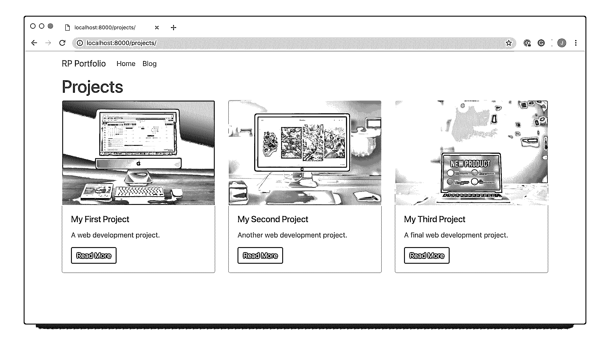

# Django 入门第 1 部分:构建投资组合应用程序

> 原文：<https://realpython.com/get-started-with-django-1/>

*立即观看**本教程有真实 Python 团队创建的相关视频课程。和文字教程一起看，加深理解:[**Django 入门:建立作品集 App**](/courses/django-portfolio-project/)

Django 是一个功能齐全的 Python web 框架，可用于构建复杂的 web 应用程序。在本教程中，你将通过例子来学习 Django。您将按照步骤创建一个功能完整的 web 应用程序，并在此过程中学习该框架的一些最重要的特性以及它们是如何协同工作的。

在本系列的后续文章中，您将会看到如何使用比本教程更多的 Django 特性来构建更复杂的网站。

**本教程结束时，您将能够:**

*   理解 Django 是什么，为什么它是一个伟大的 web 框架
*   理解 Django 站点的架构，以及它与其他框架的比较
*   设置新的 Django 项目和应用程序
*   用 Django 建立一个个人作品集网站

**免费奖励:** [点击此处获取免费的 Django 学习资源指南(PDF)](#) ，该指南向您展示了构建 Python + Django web 应用程序时要避免的技巧和窍门以及常见的陷阱。

## 为什么你应该学习 Django

有无穷无尽的 web 开发框架，那么你为什么要学习 Django 而不是其他的呢？首先，它是用 Python 编写的，Python 是目前可读性最强、对初学者最友好的编程语言之一。

**注意:**本教程假设读者对 Python 语言有一定的了解。如果你是 Python 编程的新手，可以看看我们的[初学者教程](https://realpython.com/tutorials/basics/)或[入门课程](https://realpython.com/products/real-python-course/)。

您应该学习 Django 的第二个原因是它的特性范围。如果需要搭建网站，选择 Django 就不需要依赖任何外部库或包。这意味着您不需要学习如何使用其他任何东西，并且语法是无缝的，因为您只使用一个框架。

还有一个额外的好处是，你不必担心更新一个库或框架会使你安装的其他库或框架变得无用。

如果您发现自己需要添加额外的功能，有一系列外部库可以用来增强您的站点。

Django 框架的一大优点是它的[深度文档](https://www.djangoproject.com/)。它有关于 Django 各个方面的详细文档，也有很好的例子，甚至还有一个教程可以帮助你入门。

还有一个 Django 开发者的奇妙社区，所以如果你遇到困难，几乎总有一个方法可以解决，要么查看文档，要么[询问社区](https://stackoverflow.com/questions/tagged/django)。

Django 是一个高级 web 应用程序框架，具有很多特性。由于它出色的文档，对任何 web 开发新手来说都是很棒的，尤其是如果你也熟悉 Python 的话。

[*Remove ads*](/account/join/)

## Django 网站的结构

Django 网站由一个单独的**项目**组成，这个项目被分成几个独立的**应用**。这个想法是每个应用程序处理一个网站需要执行的独立功能。举个例子，想象一个像 Instagram 这样的应用。需要执行几个不同的功能:

*   **用户管理**:登录、注销、注册等
*   **图像馈送**:上传、编辑和显示图像
*   **私人消息**:用户和通知之间的私人消息

这些都是独立的功能，所以如果这是一个 Django 站点，那么每个功能都应该是一个 Django 项目中不同的 Django 应用程序。

Django 项目包含一些适用于整个项目的配置，比如项目设置、URL、共享模板和静态文件。每个应用程序都可以有自己的数据库，并有自己的函数来控制数据如何在 HTML 模板中显示给用户。

每个应用程序都有自己的 URL，自己的 HTML 模板和静态文件，比如 JavaScript 和 CSS。

Django 应用程序的结构是逻辑分离的。它支持模型-视图-控制器模式，这是大多数 web 框架所基于的架构。基本原则是，在每个应用程序中都有三个单独的文件，分别处理三个主要的逻辑部分:

*   **模型**定义了数据结构。这通常是一个数据库，是应用程序的基础层。
*   **视图**用 [HTML 和 CSS](https://realpython.com/html-css-python/) 向用户显示部分或全部数据。
*   **控制器**处理数据库和视图如何交互。

如果你想了解更多关于 MVC 模式的知识，那么看看[模型-视图-控制器(MVC)解释——用乐高](https://realpython.com/the-model-view-controller-mvc-paradigm-summarized-with-legos/)。

在 Django，建筑略有不同。尽管基于 MVC 模式，Django 自己处理控制器部分。不需要定义数据库和视图如何交互。都给你做好了！

Django 使用的模式被称为模型-视图-模板(MVT)模式。MVT 模式中的视图和模板组成了 MVC 模式中的视图。您所需要做的就是添加一些 URL 配置来映射视图，Django 会处理剩下的事情！

Django 站点从一个项目开始，由许多应用程序组成，每个应用程序处理不同的功能。每个应用程序都遵循模型-视图-模板模式。现在您已经熟悉了 Django 站点的结构，让我们看看您将要构建什么！

## 你要建造什么

在开始任何 web 开发项目之前，最好想出一个你要构建什么的计划。在本教程中，我们将构建一个具有以下特性的应用程序:

*   一个功能齐全的博客:如果你想展示你的编程能力，博客是一个很好的方式。在这个应用程序中，您将能够创建、更新和删除博客文章。文章将有类别，可以用来排序。最后，用户可以在帖子上发表评论。

*   **作品集**:你可以在这里展示之前的[网页开发](https://realpython.com/tutorials/web-dev/)项目。您将构建一个图库样式页面，其中包含指向您已经完成的项目的可点击链接。

**注意:**在你开始之前，你可以拉下[源代码](https://github.com/realpython/materials/tree/master/rp-portfolio)，跟着教程走。

如果您喜欢自己编写代码，不要担心。我从头到尾都引用了源代码的相关部分，所以你可以回头参考。

在本教程中，我们不会使用任何外部 Python 库。Django 的一个优点是它有如此多的特性，以至于你不需要依赖外部库。但是，我们将在模板中添加 [Bootstrap 4](https://getbootstrap.com/) 样式。

通过构建这两个应用程序，您将学习 Django 模型、视图函数、表单、模板和 Django 管理页面的基础知识。有了这些特性的知识，您就能够构建更多的应用程序。您还将拥有学习更多知识和构建复杂 Django 站点的工具。

## 你好，世界！

现在您已经知道了 Django 应用程序的结构，以及您将要构建的内容，我们将经历在 Django 中创建应用程序的过程。稍后您将把它扩展到您的个人投资组合应用程序中。

[*Remove ads*](/account/join/)

### 设置您的开发环境

每当您开始一个新的 web 开发项目时，首先设置您的开发环境是一个好主意。为您的项目创建一个新目录，并进入其中:

```py
$ mkdir rp-portfolio
$ cd rp-portfolio
```

一旦进入主目录，创建一个[虚拟环境](https://realpython.com/python-virtual-environments-a-primer/)来管理依赖项是个好主意。有许多不同的方法来设置虚拟环境，但是这里您将使用`venv`:

```py
$ python3 -m venv venv
```

该命令将在您的工作目录中创建一个文件夹`venv`。在这个目录中，您将找到几个文件，包括 Python 标准库的副本。稍后，当您安装新的依赖项时，它们也将存储在此目录中。接下来，您需要通过运行以下命令来激活虚拟环境:

```py
$ source venv/bin/activate
```

**注意:**如果你没有使用 bash shell，你可能需要使用一个[不同的命令](https://docs.python.org/3/library/venv.html#creating-virtual-environments)来激活你的虚拟环境。例如，在 windows 上，您需要以下命令:

```py
C:\> venv\Scripts\activate.bat
```

您将知道您的虚拟环境已经被激活，因为您在终端中的控制台提示符将会改变。它应该是这样的:

```py
(venv) $
```

**注意:**你的虚拟环境目录不一定要叫`venv`。如果您想以不同的名称创建一个，例如`my_venv`，只需将第二个`venv`替换为`my_venv`。

然后，当激活您的虚拟环境时，再次用`my_venv`替换`venv`。提示符现在也将以`(my_venv)`为前缀。

现在您已经创建了一个虚拟环境，是时候安装 Django 了。您可以使用`pip`来完成此操作:

```py
(venv) $ pip install Django
```

一旦设置好虚拟环境并安装了 Django，现在就可以开始创建应用程序了。

### 创建 Django 项目

正如您在上一节中看到的，Django web 应用程序由一个项目和它的组成应用程序组成。确保您在`rp_portfolio`目录中，并且您已经激活了您的虚拟环境，运行以下命令来创建项目:

```py
$ django-admin startproject personal_portfolio
```

这将创建一个新目录`personal_portfolio`。如果你`cd`进入这个新目录，你会看到*另一个*目录叫做`personal_portfolio`和一个文件叫做`manage.py`。您的目录结构应该如下所示:

```py
rp-portfolio/
│
├── personal_portfolio/
│   ├── personal_portfolio/
│   │   ├── __init__.py
│   │   ├── settings.py
│   │   ├── urls.py
│   │   └── wsgi.py
│   │
│   └── manage.py
│
└── venv/
```

你所做的大部分工作都在第一个`personal_portfolio`目录中。为了避免每次处理项目时不得不浏览几个目录，通过将所有文件上移一个目录来稍微重新排序会有所帮助。当您在`rp-portfolio`目录中时，运行以下命令:

```py
$ mv personal_portfolio/manage.py ./
$ mv personal_portfolio/personal_portfolio/* personal_portfolio
$ rm -r personal_portfolio/personal_portfolio/
```

您应该会得到这样的结果:

```py
rp-portfolio/
│
├── personal_portfolio/
│   ├── __init__.py
│   ├── settings.py
│   ├── urls.py
│   └── wsgi.py
│
├── venv/
│
└── manage.py
```

一旦建立了文件结构，现在就可以启动服务器并检查设置是否成功。在控制台中，运行以下命令:

```py
$ python manage.py runserver
```

然后，在您的浏览器中转至`localhost:8000`，您应该会看到以下内容:

[](https://files.realpython.com/media/Screenshot_2018-12-09_at_17.58.16.20be0c5d3f1e.png)

恭喜你，你已经创建了一个 Django 网站！这部分教程的源代码可以在 [GitHub](https://github.com/realpython/materials/tree/a639f1c2f85032334fbb4dca88f3e8dc88397f6d/rp-portfolio) 上找到。下一步是创建应用程序，这样您就可以向您的站点添加视图和功能。

[*Remove ads*](/account/join/)

### 创建 Django 应用程序

对于教程的这一部分，我们将创建一个名为`hello_world`的应用程序，您随后将删除它，因为它对于我们的个人作品集网站是不必要的。

要创建应用程序，请运行以下命令:

```py
$ python manage.py startapp hello_world
```

这将创建另一个名为`hello_world`的目录，其中包含几个文件:

*   **`__init__.py`** 告诉 Python 把目录当作一个 Python 包。
*   **`admin.py`** 包含 Django 管理页面的设置。
*   **`apps.py`** 包含对应用程序配置的设置。
*   **`models.py`** 包含了 Django 的 ORM 转换成数据库表的一系列类。
*   **`tests.py`** 包含测试类。
*   **`views.py`** 包含处理在 HTML 模板中显示什么数据的函数和类。

创建应用程序后，需要将其安装到项目中。在`rp-portfolio/personal_portfolio/settings.py`中，在`INSTALLED_APPS`下添加以下代码行:

```py
INSTALLED_APPS = [
    'django.contrib.admin',
    'django.contrib.auth',
    'django.contrib.contenttypes',
    'django.contrib.sessions',
    'django.contrib.messages',
    'django.contrib.staticfiles',
 'hello_world', ]
```

这一行代码意味着您的项目现在知道您刚刚创建的应用程序存在。下一步是创建一个视图，这样就可以向用户显示一些内容。

### 创建视图

Django 中的视图是应用程序目录中的`views.py`文件中的函数或类的集合。每次访问不同的 URL 时，每个函数或类都会处理被处理的逻辑。

导航到`hello_world`目录中的`views.py`文件。已经有一行代码导入了`render()`。添加以下代码:

```py
from django.shortcuts import render

def hello_world(request):
 return render(request, 'hello_world.html', {})
```

在这段代码中，您定义了一个名为`hello_world()`的**视图函数**。当这个函数被调用时，它将呈现一个名为`hello_world.html`的 HTML 文件。该文件尚不存在，但我们很快会创建它。

view 函数接受一个参数`request`。这个对象是一个`HttpRequestObject`,每当页面被加载时都会被创建。它包含关于请求的信息，比如方法，它可以取几个值，包括`GET`和`POST`。

现在您已经创建了视图函数，您需要创建 HTML 模板来显示给用户。`render()`在您的应用程序目录中的一个名为`templates`的目录中查找 HTML 模板。创建这个目录，然后在里面创建一个名为`hello_world.html`的文件:

```py
$ mkdir hello_world/templates/
$ touch hello_world/templates/hello_world.html
```

将下列 HTML 行添加到文件中:

```py
<h1>Hello, World!</h1>
```

现在，您已经创建了一个函数来处理您的视图和模板，以便向用户显示。最后一步是连接你的 URL，这样你就可以访问你刚刚创建的页面。您的项目有一个名为`urls.py`的模块，您需要在其中包含一个用于`hello_world`应用程序的 URL 配置。在`personal_portfolio/urls.py`内，添加以下内容:

```py
from django.contrib import admin
from django.urls import path, include 
urlpatterns = [
    path('admin/', admin.site.urls),
 path('', include('hello_world.urls')), ]
```

它在`hello_world`应用程序中寻找一个名为`urls.py`的模块，并注册在那里定义的任何 URL。每当您访问您的 URL 的根路径(`localhost:8000`)时，`hello_world`应用程序的 URL 将被注册。`hello_world.urls`模块还不存在，所以您需要创建它:

```py
$ touch hello_world/urls.py
```

在这个模块中，我们需要导入 path 对象以及我们应用程序的`views`模块。然后，我们希望创建一个 URL 模式列表，这些模式对应于各种视图功能。目前，我们只创建了一个视图函数，所以我们只需要创建一个 URL:

```py
from django.urls import path
from hello_world import views

urlpatterns = [
    path('', views.hello_world, name='hello_world'),
]
```

现在，当您重启服务器并访问`localhost:8000`时，您应该能够看到您创建的 HTML 模板:

[](https://files.realpython.com/media/Screenshot_2018-12-09_at_17.57.22.f3c9ea711bd4.png)

再次祝贺你！您已经创建了您的第一个 Django 应用程序，并将其连接到您的项目。不要忘记查看本节和上一节的[源代码](https://github.com/realpython/materials/tree/754bf43a150b818f73e6508fd937eefee997cc6c/rp-portfolio)。现在唯一的问题就是看起来不太好看。在下一节中，我们将为您的项目添加引导样式，使其更加美观！

[*Remove ads*](/account/join/)

### 将引导程序添加到您的应用程序

如果你不添加任何样式，那么你创建的应用程序看起来不会太好。在本教程中，我们不讨论 CSS 样式，我们只讨论如何在你的项目中添加引导样式。这将使我们无需太多的努力就能改善网站的外观。

在我们开始使用引导样式之前，我们将创建一个基础模板，我们可以将它导入到每个后续视图中。这个模板是我们随后添加引导样式导入的地方。

创建另一个名为`templates`的目录，这次在`personal_portfolio`中，并在新目录中创建一个名为`base.html`的文件:

```py
$ mkdir personal_portfolio/templates/
$ touch personal_portfolio/templates/base.html
```

我们创建这个额外的模板目录来存储 HTML 模板，这些模板将在项目的每个 Django 应用程序中使用。正如您之前看到的，每个 Django 项目可以包含多个处理独立逻辑的应用程序，每个应用程序都包含自己的`templates`目录来存储与应用程序相关的 HTML 模板。

这个应用程序结构很适合后端逻辑，但我们希望我们的整个网站在前端看起来一致。我们可以创建一个或一组由所有应用共享的模板，而不必将引导样式导入每个应用。只要 Django 知道在这个新的共享目录中寻找模板，它就可以保存许多重复的样式。

在这个新文件(`personal_portfolio/templates/base.html`)中，添加以下代码行:

```py

```

现在，在`hello_world/templates/hello_world.html`中，我们可以扩展这个基础模板:

```py
 
 <h1>Hello, World!</h1>

```

这里发生的事情是，`page_content`块中的任何 HTML 都被添加到了`base.html`中的同一个块中。

要在你的应用中安装 Bootstrap，你将使用 [Bootstrap CDN](https://getbootstrap.com/docs/4.1/getting-started/introduction/#quick-start) 。这是一种非常简单的安装 Bootstrap 的方法，只需要在`base.html`中添加几行代码。查看[源代码](https://github.com/realpython/materials/blob/1ea78b8bb71e685c476d6fd98e829b6ad0a42123/rp-portfolio/personal_portfolio/templates/base.html)，了解如何将 CDN 链接添加到您的项目中。

我们将来创建的所有模板都将扩展`base.html`，这样我们就可以在每个页面上包含引导样式，而不必再次导入样式。

在我们看到新样式的应用程序之前，我们需要告诉 Django 项目`base.html`的存在。默认设置在每个应用程序中注册`template`目录，但不在项目目录本身中注册。在`personal_portfolio/settings.py`中，更新`TEMPLATES`:

```py
TEMPLATES = [
    {
        "BACKEND": "django.template.backends.django.DjangoTemplates",
 "DIRS": ["personal_portfolio/templates/"],        "APP_DIRS": True,
        "OPTIONS": {
            "context_processors": [
                "django.template.context_processors.debug",
                "django.template.context_processors.request",
                "django.contrib.auth.context_processors.auth",
                "django.contrib.messages.context_processors.messages",
            ]
        },
    }
]
```

现在，当您访问`localhost:8000`时，您应该会看到页面的格式略有不同:

[](https://files.realpython.com/media/Screenshot_2018-12-09_at_19.46.23.cd4783f33899.png)

每当您想要创建模板或导入脚本以在项目中的所有 Django 应用程序中使用时，您可以将它们添加到这个项目级目录中，并在您的应用程序模板中扩展它们。

添加模板是构建你的 *Hello，World 的最后一步！*姜戈遗址。您了解了 Django 模板引擎是如何工作的，以及如何创建可以由 Django 项目中的所有应用程序共享的项目级模板。

在本节中，您学习了如何创建一个简单的 *Hello，World！* Django 站点，使用单个应用程序创建项目。在下一节中，您将创建另一个应用程序来展示 web 开发项目，并且您将在 Django 中学习所有关于模型的知识！

这一部分的源代码可以在 [GitHub](https://github.com/realpython/materials/tree/1ea78b8bb71e685c476d6fd98e829b6ad0a42123/rp-portfolio/hello_world) 上找到。

[*Remove ads*](/account/join/)

## 展示您的项目

任何希望创建作品集的 web 开发人员都需要一种方式来展示他们参与过的项目。这就是你现在要建造的。您将创建另一个名为`projects`的 Django 应用程序，它将保存一系列将向用户显示的示例项目。用户可以点击项目，看到更多关于你的工作的信息。

在我们构建`projects`应用之前，让我们先删除`hello_world`应用。您需要做的就是删除`hello_world`目录，并从`settings.py`中的`INSTALLED_APPS`中删除行`"hello_world",`:

```py
INSTALLED_APPS = [
    'django.contrib.admin',
    'django.contrib.auth',
    'django.contrib.contenttypes',
    'django.contrib.sessions',
    'django.contrib.messages',
    'django.contrib.staticfiles',
 'hello_world',  # Delete this line ]
```

最后，您需要删除在`personal_portfolio/urls.py`中创建的 URL 路径:

```py
from django.contrib import admin
from django.urls import path, include

urlpatterns = [
    path('admin/', admin.site.urls),
 path('', include('hello_world.urls')),  # Delete this line ]
```

现在您已经删除了`hello_world`应用程序，我们可以创建`projects`应用程序了。确保您在`rp-portfolio`目录中，在您的控制台中运行以下命令:

```py
$ python manage.py startapp projects
```

这将创建一个名为`projects`的目录。创建的文件与我们设置`hello_world`应用程序时创建的文件相同。为了连接我们的应用程序，我们需要将它添加到`settings.py`中的`INSTALLED_APPS`:

```py
INSTALLED_APPS = [
    'django.contrib.admin',
    'django.contrib.auth',
    'django.contrib.contenttypes',
    'django.contrib.sessions',
    'django.contrib.messages',
    'django.contrib.staticfiles',
 'projects', ]
```

在 GitHub 上查看这一部分的[源代码](https://github.com/realpython/materials/tree/4de6ebd8baebec950357d4f479fcc0de962e6ae4/rp-portfolio)。我们现在还不需要担心这个应用程序的 URL。相反，我们将专注于构建一个`Project`模型。

### 项目应用:模型

如果你想存储数据并显示在网站上，那么你需要一个数据库。通常，如果您想要创建一个包含表和这些表中的列的数据库，您需要使用 [SQL](https://realpython.com/python-sql-libraries/) 来管理数据库。但是当你使用 Django 的时候，你不需要学习一门新的语言，因为它有一个内置的对象关系映射器(ORM)。

ORM 是一个允许你创建对应于数据库表的类的程序。类属性对应于列，类的实例对应于数据库中的行。因此，不用学习一种全新的语言来创建我们的数据库和它的表，我们可以只写一些 Python 类。

当你使用 ORM 时，你构建的代表数据库表的类被称为**模型**。在 Django 中，它们生活在每个 Django 应用的`models.py`模块中。

在您的项目应用程序中，您只需要一个表来存储您将向用户显示的不同项目。这意味着您只需要在`models.py`中创建一个模型。

您将创建的模型将被称为`Project`，并将具有以下字段:

*   **`title`** 将用一个短字符串字段来保存你的项目名称。
*   **`description`** 将一个更大的字符串字段用来容纳一段更长的文本。
*   **`technology`** 将是一个字符串字段，但是它的内容将被限制为一个选择的数量。
*   **`image`** 将是一个图像字段，保存存储图像的文件路径。

为了创建这个模型，我们将在`models.py`中创建一个新类，并在我们的字段中添加以下内容:

```py
from django.db import models

class Project(models.Model):
    title = models.CharField(max_length=100)
    description = models.TextField()
    technology = models.CharField(max_length=20)
    image = models.FilePathField(path="/img")
```

Django 模型带有许多内置的模型字段类型。我们在这个模型中只使用了三个。`CharField`用于短字符串，指定最大长度。

`TextField`与`CharField`相似，但可用于更长的格式文本，因为它没有最大长度限制。最后，`FilePathField`也保存一个字符串，但是必须指向一个文件路径名。

现在我们已经创建了我们的`Project`类，我们需要 Django 来创建数据库。默认情况下，Django ORM 在 [SQLite](https://realpython.com/python-sqlite-sqlalchemy/) 中创建数据库，但是您可以通过 Django ORM 使用其他使用 SQL 语言的数据库，比如 PostgreSQL 或者 [MySQL](https://realpython.com/python-mysql/) 。

为了开始创建我们的数据库，我们需要创建一个**迁移**。一个[迁移](https://realpython.com/django-migrations-a-primer/)是一个包含一个`Migration`类的文件，这个类的规则告诉 Django 需要对数据库做什么改变。要创建迁移，请在控制台中键入以下命令，确保您位于`rp-portfolio`目录中:

```py
$ python manage.py makemigrations projects
Migrations for 'projects':
 projects/migrations/0001_initial.py
 - Create model Project
```

您应该看到在项目应用程序中创建了一个文件`projects/migrations/0001_initial.py`。检查一下[源代码](https://github.com/realpython/materials/blob/0091ee5421f8107e8629f1f22687ff224850b889/rp-portfolio/projects/migrations/0001_initial.py)中文件，确保您的迁移是正确的。

现在您已经创建了一个迁移文件，您需要应用迁移文件中设置的迁移，并使用`migrate`命令创建您的数据库:

```py
$ python manage.py migrate projects
Operations to perform:
 Apply all migrations: projects
Running migrations:
 Applying projects.0001_initial... OK
```

**注意:**当运行`makemigrations`和`migrate`命令时，我们在命令中添加了`projects`。这告诉 Django 只查看`projects`应用中的模型和迁移。Django 附带了几个已经创建好的模型。

如果您在没有`projects`标志的情况下运行`makemigrations`和`migrate`，那么您的 Django 项目中所有默认模型的所有迁移都将被创建和应用。这不是问题，但是对于本节来说，它们是不需要的。

您还应该看到在您的项目的根目录下已经创建了一个名为`db.sqlite3`的文件。现在您的数据库已经设置好了，可以开始运行了。现在，您可以在表格中创建行，这些行是您想要在您的投资组合站点上显示的各种项目。

为了创建我们的`Project`类的实例，我们将不得不使用 Django shell。Django shell 类似于 Python shell，但是允许您访问数据库和创建条目。为了访问 Django shell，我们使用另一个 Django 管理命令:

```py
$ python manage.py shell
```

一旦您访问了 shell，您会注意到命令提示符将从`$`变为`>>>`。然后您可以导入您的模型:

>>>

```py
>>> from projects.models import Project
```

我们首先要创建一个具有以下属性的新项目:

*   **`name` :** `My First Project`
*   **`description` :** `A web development project.`
*   **`technology` :** `Django`
*   **`image` :** `img/project1.png`

为此，我们在 Django shell 中创建了一个项目类的实例:

>>>

```py
>>> p1 = Project(
...     title='My First Project',
...     description='A web development project.',
...     technology='Django',
...     image='img/project1.png'
... )
>>> p1.save()
```

这将在项目表中创建一个新条目，并将其保存到数据库中。现在您已经创建了一个可以在您的作品集网站上显示的项目。

本节的最后一步是创建另外两个示例项目:

>>>

```py
>>> p2 = Project(
...     title='My Second Project',
...     description='Another web development project.',
...     technology='Flask',
...     image='img/project2.png'
... )
>>> p2.save()
>>> p3 = Project(
...     title='My Third Project',
...     description='A final development project.',
...     technology='Django',
...     image='img/project3.png'
... )
>>> p3.save()
```

干得好，完成了本节的结尾！现在您已经知道了如何在 Django 中创建模型和构建迁移文件，以便将这些模型类转换成数据库表。您还使用 Django shell 创建了模型类的三个实例。

在下一节中，我们将使用您创建的这三个项目，并创建一个视图函数，在 web 页面上向用户显示它们。你可以在 GitHub 上找到本节教程的[源代码](https://github.com/realpython/materials/tree/0091ee5421f8107e8629f1f22687ff224850b889/rp-portfolio)。

[*Remove ads*](/account/join/)

### 项目应用程序:视图

现在您已经创建了要在您的 portfolio 站点上显示的项目，您将需要创建视图函数来将数据从数据库发送到 HTML 模板。

在`projects`应用程序中，您将创建两个不同的视图:

1.  显示每个项目信息片段的索引视图
2.  显示特定主题更多信息的详细视图

让我们从索引视图开始，因为逻辑稍微简单一些。在`views.py`中，您将需要从`models.py`导入`Project`类，并创建一个函数`project_index()`来呈现一个名为`project_index.html`的模板。在这个函数的主体中，您将创建一个 Django ORM 查询来选择`Project`表中的所有对象:

```py
 1from django.shortcuts import render
 2from projects.models import Project
 3
 4def project_index(request):
 5    projects = Project.objects.all()
 6    context = {
 7        'projects': projects
 8    }
 9    return render(request, 'project_index.html', context)
```

这个代码块中发生了很多事情，所以让我们来分解一下。

在**第 5 行**，你执行一个**查询**。查询只是一个命令，允许您在数据库中创建、检索、更新或删除对象(或行)。在本例中，您正在检索`projects`表中的所有对象。

数据库查询返回与查询匹配的所有对象的集合，称为**查询集**。在这种情况下，您需要表中的所有对象，因此它将返回所有项目的集合。

在上面代码块的**第 6 行**中，我们定义了一个字典`context`。字典只有一个条目`projects`，我们将包含所有项目的 Queryset 分配给它。上下文字典用于向我们的模板发送信息。您创建的每个视图函数都需要有一个上下文字典。

在**的第 9 行**中，`context`作为参数添加到`render()`中。只要将`context`参数传递给`render()`，模板中就可以使用`context`字典中的任何条目。您需要创建一个上下文字典，并在您创建的每个视图函数中将其传递给`render`。

我们还渲染了一个名为`project_index.html`的模板，这个模板还不存在。现在不要担心那个。在下一节中，您将为这些视图创建模板。

接下来，您需要创建`project_detail()`视图函数。这个函数需要一个额外的参数:正在查看的项目的 id。

否则，逻辑是相似的:

```py
13def project_detail(request, pk):
14    project = Project.objects.get(pk=pk)
15    context = {
16        'project': project
17    }
18    return render(request, 'project_detail.html', context)
```

在**的第 14 行**，我们执行另一个查询。该查询检索主键`pk`等于函数参数中主键的项目。然后，我们在我们的`context`字典中分配这个项目，并将其传递给`render()`。同样，还有一个模板`project_detail.html`，我们还没有创建它。

一旦创建了视图函数，我们需要将它们连接到 URL。我们将首先创建一个文件`projects/urls.py`来保存应用程序的 URL 配置。该文件应包含以下代码:

```py
 1from django.urls import path
 2from . import views
 3
 4urlpatterns = [
 5    path("", views.project_index, name="project_index"),
 6    path("<int:pk>/", views.project_detail, name="project_detail"),
 7]
```

在**第 5 行**，我们将应用程序的根 URL 连接到`project_index`视图。连接`project_detail`视图稍微复杂一些。为此，我们希望 URL 是`/1`，或`/2`，依此类推，这取决于项目的`pk`。

URL 中的`pk`值与传递给 view 函数的`pk`值相同，因此您需要根据您想要查看的项目动态生成这些 URL。为此，我们使用了`<int:pk>`符号。这只是告诉 Django，URL 中传递的值是一个整数，它的变量名是`pk`。

现在已经设置好了，我们需要将这些 URL 连接到项目 URL。在`personal_portfolio/urls.py`中，添加以下突出显示的代码行:

```py
from django.contrib import admin
from django.urls import path, include

urlpatterns = [
    path("admin/", admin.site.urls),
 path("projects/", include("projects.urls")), ]
```

这一行代码包含了项目应用程序中的所有 URL，但意味着它们在以`projects/`为前缀时被访问。我们的项目现在可以访问两个完整的 URL:

*   **`localhost:8000/projects` :** 项目索引页面
*   **`localhost:8000/projects/3` :** 带`pk=3`的项目详图

这些网址仍然不能正常工作，因为我们没有任何 HTML 模板。但是我们的视图和逻辑已经建立并运行，所以剩下要做的就是创建那些模板。如果你想检查你的代码，看看本节的[源代码](https://github.com/realpython/materials/tree/d49c624500e4470107bb258642d2744eeeeefc5a/rp-portfolio)。

[*Remove ads*](/account/join/)

### 项目应用程序:模板

唷！有了这个应用程序，你就快成功了。我们的最后一步是创建两个模板:

1.  `project_index`模板
2.  `project_detail`模板

由于我们已经在应用程序中添加了引导样式，我们可以使用一些预样式的组件来使视图看起来更好。让我们从`project_index`模板开始。

对于`project_index`模板，您将创建一个由[自举卡](https://getbootstrap.com/docs/4.1/components/card/)组成的网格，每个卡显示项目的细节。当然，我们不知道会有多少项目。从理论上讲，可能有数百个要展示。

我们不希望必须创建 100 个不同的引导卡，并在每个项目的所有信息中进行硬编码。相反，我们将使用 Django 模板引擎的一个特性: [**用于循环**](https://realpython.com/python-for-loop/) 。

使用这个特性，您将能够遍历所有的项目，并为每个项目创建一个卡片。Django 模板引擎中的 for 循环语法如下:

```py

{# Do something... #}

```

现在您已经知道了 for 循环是如何工作的，您可以将下面的代码添加到名为`projects/templates/project_index.html`的文件中:

```py
 1
 2
 3
 4<h1>Projects</h1>
 5<div class="row">
 6
 7    <div class="col-md-4">
 8        <div class="card mb-2">
 9            
10            <div class="card-body">
11                <h5 class="card-title">{{ project.title }}</h5>
12                <p class="card-text">{{ project.description }}</p>
13                <a href=""
14                   class="btn btn-primary">
15                    Read More
16                </a>
17            </div>
18        </div>
19    </div>
20    
21</div>
22
```

这里有很多引导 HTML，这不是本教程的重点。如果您有兴趣了解更多信息，请随意复制和粘贴，并查看引导文档。在这个代码块中，有几件事情需要强调，而不是关注引导程序。

在**第 1 行**中，我们扩展了`base.html`，就像我们在 *Hello，World 中所做的那样！* app 教程。我给这个文件添加了更多样式，包括一个[导航栏](https://getbootstrap.com/docs/4.1/components/navbar/)，这样所有内容都包含在一个[引导容器](https://getbootstrap.com/docs/4.1/layout/overview/#containers)中。对`base.html`的改动可以在 GitHub 上的[源代码](https://github.com/realpython/materials/blob/get-started-with-django-part-1/rp-portfolio/personal_portfolio/templates/base.html)中看到。

在**的第 2** 行，我们添加了一个``标签来包含静态文件，比如图像。还记得在 Django 模型的部分，当您创建`Project`模型时。它的属性之一是文件路径。这个文件路径是我们将要为每个项目存储实际图像的地方。

Django 自动注册存储在每个应用程序中名为`static/`的目录中的静态文件。我们的图像文件路径名的结构是:`img/<photo_name>.png`。

当加载静态文件时，Django 在`static/`目录中查找与`static/`中给定文件路径匹配的文件。因此，我们需要创建一个名为`static/`的目录，其中包含另一个名为`img/`的目录。在`img/`里面，你可以复制 GitHub 上[源代码](https://github.com/realpython/materials/tree/7909f5a682a88d8488167bc6fe9b64a5b294f99a/rp-portfolio/projects/static/img)的图片。

在**第 6 行**，我们开始 for 循环，遍历由`context`字典传入的所有项目。

在这个 for 循环中，我们可以访问每个单独的项目。要访问项目的属性，您可以在双花括号内使用点符号。例如，要访问项目的标题，可以使用`{{ project.title }}`。同样的符号可以用来访问项目的任何属性。

在**9 号线**，我们展示了我们的项目形象。在`src`属性中，我们添加了代码``。这告诉 Django 在静态文件中查找匹配`project.image`的文件。

我们需要强调的最后一点是**13 号线**的链接。这是我们`project_detail`页面的链接。在 Django 中访问 URL 类似于访问静态文件。URL 的代码具有以下形式:

```py

```

在本例中，我们正在访问一个名为`project_detail`的 URL 路径，它接受与项目的`pk`号相对应的整数参数。

有了所有这些，如果您启动 Django 服务器并访问`localhost:8000/projects`，那么您应该会看到类似这样的内容:

[](https://files.realpython.com/media/Screenshot_2018-12-16_at_16.46.36.a71c744f096a.png)

有了`project_index.html`模板，就该创建`project_detail.html`模板了。该模板的代码如下:

```py




<h1>{{ project.title }}</h1>
<div class="row">
    <div class="col-md-8">
        
    </div>
    <div class="col-md-4">
        <h5>About the project:</h5>
        <p>{{ project.description }}</p>
        <br>
        <h5>Technology used:</h5>
        <p>{{ project.technology }}</p>
    </div>
</div>

```

该模板中的代码与`project_index.html`模板中的每个项目卡具有相同的功能。唯一的区别是引入了一些引导列。

如果您访问`localhost:8000/projects/1`，您应该会看到您创建的第一个项目的详细页面:

[](https://files.realpython.com/media/Screenshot_2018-12-16_at_16.50.59.43297d79452f.png)

在本节中，您学习了如何使用模型、视图和模板为您的个人投资组合项目创建一个功能齐全的应用程序。在 GitHub 上查看这一部分的[源代码](https://github.com/realpython/materials/tree/7909f5a682a88d8488167bc6fe9b64a5b294f99a/rp-portfolio)。

在下一节中，您将为您的站点构建一个功能完整的博客，您还将了解 Django 管理页面和表单。

[*Remove ads*](/account/join/)

## 用博客分享你的知识

博客是任何个人作品集网站的绝佳补充。无论你是每月还是每周更新，这都是一个分享你所学知识的好地方。在本节中，您将构建一个功能完整的博客，它将允许您执行以下任务:

*   创建、更新和删除博客文章
*   以索引视图或详细视图的形式向用户显示帖子
*   给帖子分配类别
*   允许用户对帖子发表评论

您还将学习如何使用 Django 管理界面，在这里您可以根据需要创建、更新和删除帖子和类别。

在开始构建网站这一部分的功能之前，创建一个名为`blog`的新 Django 应用程序。不要删除`projects`。您会希望 Django 项目中包含这两个应用程序:

```py
$ python manage.py startapp blog
```

这可能对你来说很熟悉，因为这是你第三次这么做。不要忘记在`personal_porfolio/settings.py`中将`blog`添加到`INSTALLED_APPS`中:

```py
INSTALLED_APPS = [
    "django.contrib.admin",
    "django.contrib.auth",
    "django.contrib.contenttypes",
    "django.contrib.sessions",
    "django.contrib.messages",
    "django.contrib.staticfiles",
    "projects",
 "blog", ]
```

暂时不要连接 URL。与`projects`应用程序一样，您将从添加您的模型开始。

### 博客应用:模特

这个 app 里的`models.py`文件比`projects` app 里的复杂多了。

博客需要三个独立的数据库表:

1.  `Post`
2.  `Category`
3.  `Comment`

这些表需要相互关联。这变得更容易，因为 Django 模型带有专门用于此目的的字段。

以下是`Category`和`Post`型号的代码:

```py
 1from django.db import models
 2
 3class Category(models.Model):
 4    name = models.CharField(max_length=20)
 5
 6class Post(models.Model):
 7    title = models.CharField(max_length=255)
 8    body = models.TextField()
 9    created_on = models.DateTimeField(auto_now_add=True)
10    last_modified = models.DateTimeField(auto_now=True)
11    categories = models.ManyToManyField('Category', related_name='posts')
```

`Category`模型很简单。我们只需要一个`CharField`来存储类别的名称。

`Post`模型上的`title`和`body`字段与您在`Project`模型中使用的字段类型相同。我们只需要一个`title`的`CharField`,因为我们只想要一个简短的文章标题字符串。正文需要是一个长格式的文本，所以我们使用一个`TextField`。

接下来的两个字段`created_on`和`last_modified`是姜戈`DateTimeFields`。它们分别存储一个 [`datetime`](https://docs.python.org/3.7/library/datetime.html) 对象，包含文章创建和修改的日期和时间。

在**的第 9 行**上，`DateTimeField`接受一个参数`auto_now_add=True`。每当创建该类的实例时，都会将当前日期和时间分配给该字段。

在第 10 行的**上，`DateTimeField`接受一个参数`auto_now=True`。每当保存该类的实例时，都会将当前日期和时间分配给该字段。这意味着每当你编辑这个类的一个实例时，`date_modified`就会被更新。**

post 模型上的最后一个字段是最有趣的。我们希望以这样一种方式链接我们的类别和帖子模型，即*多个*类别可以分配给*多个*帖子。幸运的是，Django 通过提供一个`ManytoManyField`字段类型让我们更容易做到这一点。该字段链接了`Post`和`Category`模型，并允许我们在两个表之间创建一个关系。

`ManyToManyField`有两个参数。第一个是关系的模型，在这个例子中是它的`Category`。第二个允许我们从一个`Category`对象访问关系，即使我们没有在那里添加一个字段。通过添加一个`posts`的`related_name`，我们可以访问`category.posts`来给出该类别的帖子列表。

我们需要添加的第三个也是最后一个模型是`Comment`。我们将使用另一个关系字段，类似于关联`Post`和`Category`的`ManyToManyField`。然而，我们只希望关系是单向的:一个帖子应该有许多评论。

在我们定义了`Comment`类之后，您将看到这是如何工作的:

```py
16class Comment(models.Model):
17    author = models.CharField(max_length=60)
18    body = models.TextField()
19    created_on = models.DateTimeField(auto_now_add=True)
20    post = models.ForeignKey('Post', on_delete=models.CASCADE)
```

这个模型的前三个字段应该看起来很熟悉。有一个供用户添加姓名或别名的`author`字段，一个用于评论正文的`body`字段，以及一个与`Post`模型上的`created_on`字段相同的`created_on`字段。

在**的第 20 行**，我们使用了另一个关系字段，即`ForeignKey`字段。这与`ManyToManyField`类似，但是定义了一个**多对一**关系。这背后的原因是，许多评论可以分配给一个帖子。但是你不能有一个评论对应很多帖子。

`ForeignKey`字段有两个参数。第一个是关系中的另一个模型，在本例中是`Post`。第二个告诉 Django 当一个帖子被删除时该做什么。如果一个帖子被删除了，那么我们不希望与它相关的评论到处都是。因此，我们也想删除它们，所以我们添加了参数`on_delete=models.CASCADE`。

一旦您创建了模型，您就可以使用`makemigrations`创建迁移文件:

```py
$ python manage.py makemigrations blog
```

最后一步是迁移表。这一次，不要添加特定于应用程序的标志。稍后，您将需要 Django 为您创建的`User`模型:

```py
$ python manage.py migrate
```

现在您已经创建了模型，我们可以开始添加一些帖子和类别。您不会像在项目中那样从命令行完成这项工作，因为在命令行中键入一整篇博客文章至少会令人不愉快！

相反，您将学习如何使用 Django Admin，它将允许您在一个漂亮的 web 界面中创建模型类的实例。

不要忘记，在进入下一节之前，您可以在 GitHub 上查看本节的[源代码](https://github.com/realpython/materials/tree/6fdccb8ae85c5792e3639c406be09abc2d4803d8/rp-portfolio)。

[*Remove ads*](/account/join/)

### 博客应用:Django Admin

Django Admin 是一个非常棒的工具，也是使用 Django 的最大好处之一。因为你是唯一一个将要写博客和创建类别的人，所以没有必要创建一个用户界面来做这些。

另一方面，您不希望必须在命令行中写博文。这就是管理员介入的地方。它允许您创建、更新和删除模型类的实例，并为此提供了一个很好的界面。

在访问管理员之前，您需要将自己添加为超级用户。这就是为什么在上一节中，您在项目范围内应用了迁移，而不是仅仅针对应用程序。Django 带有内置的用户模型和一个[用户管理系统](https://realpython.com/django-user-management/)，允许你登录管理员。

首先，您可以使用以下命令将自己添加为超级用户:

```py
$ python manage.py createsuperuser
```

然后，系统会提示您输入用户名，然后输入您的电子邮件地址和密码。一旦您输入了所需的详细信息，您将被通知超级用户已经创建。如果你犯了错误，不要担心，因为你可以重新开始:

```py
Username (leave blank to use 'jasmine'): jfiner
Email address: jfiner@example.com
Password:
Password (again):
Superuser created successfully.
```

导航到`localhost:8000/admin`并使用您刚刚用来创建超级用户的凭证登录。您将看到一个类似于下图的页面:

[](https://files.realpython.com/media/Screenshot_2018-12-16_at_19.18.42.ee6fb5185d8a.png)

用户和组模型应该会出现，但是您会注意到没有对您自己创建的模型的引用。那是因为你需要在管理员里面注册它们。

在`blog`目录中，打开文件`admin.py`并键入以下代码行:

```py
 1from django.contrib import admin
 2from blog.models import Post, Category
 3
 4class PostAdmin(admin.ModelAdmin):
 5    pass
 6
 7class CategoryAdmin(admin.ModelAdmin):
 8    pass
 9
10admin.site.register(Post, PostAdmin)
11admin.site.register(Category, CategoryAdmin)
```

在第 2 行的**上，您导入想要在管理页面上注册的模型。**

**注意:**我们不会向管理员添加评论。这是因为通常不需要自己编辑或创建评论。

如果您想添加一个评论被审核的特性，那么继续添加评论模型。这样做的步骤是完全一样的！

在**4 线**和**7 线**上，定义空班`PostAdmin`和`CategoryAdmin`。出于本教程的目的，您不需要向这些类添加任何属性或方法。它们用于定制管理页面上显示的内容。对于本教程，默认配置就足够了。

最后两行是最重要的。这些向管理类注册模型。如果你现在访问`localhost:8000/admin`，那么你应该看到`Post`和`Category`模型现在是可见的:

[](https://files.realpython.com/media/Screenshot_2018-12-16_at_19.19.20.297b0ccfe2f3.png)

如果你点击进入*帖子*或*类别*，你应该能够添加两个模型的新实例。我喜欢通过使用 [lorem ipsum](https://www.lipsum.com/) 虚拟文本来添加虚假博客文章的文本。

在进入下一部分之前，创建几个虚假的帖子，并给它们分配虚假的类别。这样，当我们创建模板时，您就可以查看帖子了。

在继续为我们的应用构建视图之前，不要忘记查看本部分的[源代码](https://github.com/realpython/materials/tree/86c5009b84ef207c6dd1873ec9dc25afbe725347/rp-portfolio)。

[*Remove ads*](/account/join/)

### 博客应用:浏览量

您需要在`blog`目录下的`views.py`文件中创建三个视图函数:

*   **`blog_index`** 会显示你所有帖子的列表。
*   **`blog_detail`** 将显示完整的帖子以及评论和一个允许用户创建新评论的表单。
*   **`blog_category`** 将与`blog_index`类似，但是所查看的帖子将仅属于用户选择的特定类别。

最简单的视图函数是`blog_index()`。这将非常类似于你的`project`应用程序中的`project_index()`视图。您只需查询`Post`模型并检索它的所有对象:

```py
 1from django.shortcuts import render
 2from blog.models import Post, Comment
 3
 4def blog_index(request):
 5    posts = Post.objects.all().order_by('-created_on')
 6    context = {
 7        "posts": posts,
 8    }
 9    return render(request, "blog_index.html", context)
```

在**第 2 行**中，您导入了`Post`和`Comment`模型，在**第 5 行**的视图函数中，您获得了一个包含数据库中所有文章的查询集。`order_by()`根据给定的参数对查询集进行排序。减号告诉 Django 从最大值开始，而不是从最小值开始。我们使用这个方法，因为我们希望文章从最近的文章开始排序。

最后，定义`context`字典并呈现模板。先不要担心创建它。您将在下一节开始创建它们。

接下来，您可以开始创建`blog_category()`视图。view 函数将需要一个类别名称作为参数，并查询`Post`数据库中所有已被分配给给定类别的帖子:

```py
13def blog_category(request, category):
14    posts = Post.objects.filter( 15        categories__name__contains=category 16    ).order_by( 17        '-created_on' 18    ) 19    context = {
20        "category": category,
21        "posts": posts
22    }
23    return render(request, "blog_category.html", context)
```

在**第 14 行**，您使用了 [Django Queryset 过滤器](https://docs.djangoproject.com/en/2.1/topics/db/queries/#retrieving-specific-objects-with-filters)。过滤器的参数告诉 Django 要检索一个对象需要满足什么条件。在这种情况下，我们只希望帖子的类别包含与 view 函数的参数中给出的名称相对应的类别。同样，您使用`order_by()`从最近的文章开始排序。

然后，我们将这些帖子和类别添加到`context`字典中，并呈现我们的模板。

最后添加的查看功能是`blog_detail()`。这就更复杂了，因为我们要包含一个表单。在添加表单之前，只需设置视图功能来显示一篇特定的文章，并附上相关的评论。该功能将几乎等同于`projects`应用中的`project_detail()`查看功能:

```py
21def blog_detail(request, pk):
22    post = Post.objects.get(pk=pk)
23    comments = Comment.objects.filter(post=post)
24    context = {
25        "post": post,
26        "comments": comments,
27    }
28
29    return render(request, "blog_detail.html", context)
```

view 函数将一个`pk`值作为参数，在**的第 22 行**上，用给定的`pk`检索对象。

在第 23 行的**上，我们再次使用 Django 过滤器检索分配给给定帖子的所有评论。**

最后，将`post`和`comments`添加到`context`字典中，并呈现模板。

要向页面添加表单，您需要在`blog`目录中创建另一个名为`forms.py`的文件。Django 表单与模型非常相似。表单由一个类组成，其中类属性是表单字段。Django 附带了一些内置的表单字段，可以用来快速创建所需的表单。

对于这个表单，您需要的唯一字段是`author`，它应该是一个`CharField`和`body`，它也可以是一个`CharField`。

**注意:**如果你的表单的`CharField`对应一个型号`CharField`，确保两者有相同的`max_length`值。

`blog/forms.py`应包含以下代码:

```py
from django import forms

class CommentForm(forms.Form):
    author = forms.CharField(
        max_length=60,
        widget=forms.TextInput(attrs={
            "class": "form-control",
            "placeholder": "Your Name"
        })
    )
    body = forms.CharField(widget=forms.Textarea(
        attrs={
            "class": "form-control",
            "placeholder": "Leave a comment!"
        })
    )
```

您还会注意到一个参数`widget`被传递给了这两个字段。`author`字段有一个`forms.TextInput`小部件。这告诉 Django 将这个字段作为 HTML 文本输入元素加载到模板中。`body`字段使用了一个`forms.TextArea`小部件，因此该字段被呈现为一个 HTML 文本区域元素。

这些小部件还带有一个参数`attrs`，这是一个字典，允许我们指定一些 CSS 类，这将有助于以后格式化这个视图的模板。它还允许我们添加一些占位符文本。

当一个表单被发布时，一个`POST`请求被发送到服务器。因此，在 view 函数中，我们需要检查是否收到了一个`POST`请求。然后，我们可以从表单字段创建注释。Django 的表单上有一个方便的`is_valid()`,所以我们可以检查所有的字段是否输入正确。

一旦你从表单中创建了评论，你需要使用`save()`保存它，然后查询数据库中分配给给定文章的所有评论。您的视图函数应该包含以下代码:

```py
21def blog_detail(request, pk):
22    post = Post.objects.get(pk=pk)
23
24    form = CommentForm() 25    if request.method == 'POST': 26        form = CommentForm(request.POST) 27        if form.is_valid(): 28            comment = Comment( 29                author=form.cleaned_data["author"], 30                body=form.cleaned_data["body"], 31                post=post 32            ) 33            comment.save() 34
35    comments = Comment.objects.filter(post=post)
36    context = {
37        "post": post,
38        "comments": comments,
39        "form": form, 40    }
41    return render(request, "blog_detail.html", context)
```

在第 24 行的**上，我们创建了一个表单类的实例。不要忘记在文件开头导入表单:**

```py
from .forms import CommentForm
```

然后，我们继续检查是否收到了`POST`请求。如果有，那么我们创建一个新的表单实例，用输入表单的数据填充。

然后使用`is_valid()`验证该表单。如果表单有效，就会创建一个新的`Comment`实例。您可以使用`form.cleaned_data`(一个字典)从表单中访问数据。

字典的键对应于表单字段，所以您可以使用`form.cleaned_data['author']`访问作者。创建评论时，不要忘记将当前文章添加到评论中。

**注意:**提交表单的生命周期可能有点复杂，所以这里有一个关于它如何工作的概述:

1.  当用户访问包含表单的页面时，他们向服务器发送一个`GET`请求。在本例中，表单中没有输入任何数据，所以我们只想呈现并显示表单。
2.  当用户输入信息并点击*提交*按钮时，一个包含随表单提交的数据的`POST`请求被发送到服务器。此时，必须处理数据，可能会发生两件事:
    *   表单有效，用户被重定向到下一页。
    *   表单无效，再次显示空表单。用户返回到步骤 1，并重复该过程。

Django 表单模块将输出一些错误，您可以将这些错误显示给用户。这超出了本教程的范围，但是您可以在 Django 文档中阅读更多关于[呈现表单错误消息](https://docs.djangoproject.com/en/2.1/topics/forms/#rendering-form-error-messages)的内容。

在**的第 33** 行，保存注释并继续将`form`添加到`context`字典中，这样您就可以访问 HTML 模板中的表单。

在你开始创建模板并真正看到这个博客开始运行之前，最后一步是连接 URL。您需要在`blog/`中创建另一个`urls.py`文件，并添加三个视图的 URL:

```py
# blog/urls.py

from django.urls import path
from . import views

urlpatterns = [
    path("", views.blog_index, name="blog_index"),
    path("<int:pk>/", views.blog_detail, name="blog_detail"),
    path("<category>/", views.blog_category, name="blog_category"),
]
```

一旦特定于博客的 URL 就位，您需要使用`include()`将它们添加到`personal_portfolio/urls.py`中的项目 URL 配置中:

```py
# personal_portfolio/urls.py

from django.contrib import admin
from django.urls import path, include

urlpatterns = [
    path("admin/", admin.site.urls),
    path("projects/", include("projects.urls")),
 path("blog/", include("blog.urls")), ]
```

这样设置后，所有博客的 URL 都将以`blog/`为前缀，您将拥有以下 URL 路径:

*   **`localhost:8000/blog` :** 博客索引
*   **`localhost:8000/blog/1` :** 与`pk=1`博客的博客详细视图
*   **`localhost:8000/blog/python` :** 类别为`python`的所有帖子的博客索引视图

这些 URL 还不能工作，因为您仍然需要创建模板。

在本节中，您为您的博客应用程序创建了所有的视图。您了解了如何在进行查询时使用过滤器，以及如何创建 Django 表单。用不了多久，你就可以看到你的博客应用程序在运行了！

和往常一样，不要忘记您可以在 GitHub 上查看本节的[源代码](https://github.com/realpython/materials/tree/8ae8693470e7126a233f5d49685ad65bce3cb537/rp-portfolio)。

### 博客应用:模板

我们博客应用的最后一部分是模板。在本节结束时，你将创建一个功能齐全的博客。

您会注意到模板中包含了一些引导元素，使界面更加美观。这些都不是本教程的重点，所以我忽略了它们的功能，但是请查看 [Bootstrap 文档](https://getbootstrap.com/docs/4.1/getting-started/introduction/)以了解更多信息。

您将创建的第一个模板是用于新文件`blog/templates/blog_index.html`中的博客索引。这将非常类似于项目索引视图。

您将使用一个 for 循环来遍历所有的帖子。对于每篇文章，您将显示标题和正文片段。和往常一样，您将扩展基本模板`personal_porfolio/templates/base.html`，它包含我们的导航栏和一些额外的格式:

```py
 1
 2
 3<div class="col-md-8 offset-md-2">
 4    <h1>Blog Index</h1>
 5    <hr>
 6    
 7    <h2><a href="">{{ post.title }}</a></h2>
 8    <small>
 9        {{ post.created_on.date }} |&nbsp;
10        Categories:&nbsp;
11        
12        <a href="">
13            {{ category.name }}
14        </a>&nbsp;
15        
16    </small>
17    <p>{{ post.body | slice:":400" }}...</p>
18    
19</div>
20
```

在**第 7 行**，我们有文章标题，这是一个超链接。该链接是一个 Django 链接，我们指向名为`blog_detail`的 URL，它以一个整数作为参数，应该对应于帖子的`pk`值。

在标题下面，我们将显示文章的`created_on`属性及其类别。在**第 11 行**，我们使用另一个 for 循环来遍历分配给文章的所有类别。

在**第 17 行**上，我们使用一个**模板过滤器** [`slice`](https://docs.djangoproject.com/en/2.1/ref/templates/builtins/#slice) 将帖子正文截掉 400 个字符，这样博客索引更具可读性。

一旦准备就绪，您应该能够通过访问`localhost:8000/blog`访问该页面:

[](https://files.realpython.com/media/Screenshot_2018-12-17_at_23.50.45.fedcaa17e99d.png)

接下来，创建另一个 HTML 文件`blog/templates/blog_category.html`,你的`blog_category`模板将存放在这里。这应该与`blog_index.html`相同，除了在`h1`标签内的类别名称而不是`Blog Index`:

```py
 1
 2
 3<div class="col-md-8 offset-md-2">
 4    <h1>{{ category | title }}</h1> 5    <hr>
 6    
 7        <h2><a href="">{{ post.title }}</a></h2>
 8        <small>
 9            {{ post.created_on.date }} |&nbsp;
10            Categories:&nbsp;
11            
12            <a href="">
13                {{ category.name }}
14            </a>&nbsp;
15            
16        </small>
17        <p>{{ post.body | slice:":400" }}...</p>
18    
19</div>
20
```

这个模板的大部分与前面的模板相同。唯一的区别是在第 4 行的**上，我们使用了另一个 Django 模板过滤器 [`title`](https://docs.djangoproject.com/en/2.1/ref/templates/builtins/#title) 。这会将 titlecase 应用于字符串，并使单词以大写字符开头。**

模板完成后，您将能够访问您的类别视图。如果您定义了一个名为`python`的类别，您应该能够访问`localhost:8000/blog/python`并看到该类别的所有帖子:

[](https://files.realpython.com/media/Screenshot_2018-12-17_at_23.50.51.08dadaa185fc.png)

最后创建的模板是`blog_detail`模板。在这个模板中，您将显示文章的标题和正文。

在文章的标题和正文之间，您将显示文章的创建日期和任何类别。在此之下，您将包括一个评论表单，以便用户可以添加新的评论。在这下面，会有一个已经留下的评论列表:

```py
 1
 2
 3<div class="col-md-8 offset-md-2">
 4    <h1>{{ post.title }}</h1>
 5    <small>
 6        {{ post.created_on.date }} |&nbsp;
 7        Categories:&nbsp;
 8        
 9        <a href="">
10            {{ category.name }}
11        </a>&nbsp;
12        
13    </small>
14    <p>{{ post.body | linebreaks }}</p>
15    <h3>Leave a comment:</h3>
16    <form action="/blog/{{ post.pk }}/" method="post">
17        
18        <div class="form-group">
19            {{ form.author }}
20        </div>
21        <div class="form-group">
22            {{ form.body }}
23        </div>
24        
25    </form>
26    <h3>Comments:</h3>
27    
28    <p>
29        On {{comment.created_on.date }}&nbsp;
30        <b>{{ comment.author }}</b> wrote:
31    </p>
32    <p>{{ comment.body }}</p>
33    <hr>
34    
35</div>
36
```

模板的前几行显示文章标题、日期和类别，其逻辑与前面的模板相同。这一次，在渲染帖子正文时，使用了 [`linebreaks`](https://docs.djangoproject.com/en/2.1/ref/templates/builtins/#linebreaks) 模板滤镜。该标签将换行符注册为新段落，这样正文就不会显示为一个很长的文本块。

在帖子下面的**第 16 行**，你将显示你的表单。表单动作指向页面的 URL 路径，您要将`POST`请求发送到该页面。在这种情况下，它与当前正在访问的页面相同。然后添加一个`csrf_token`，它提供安全性并呈现表单的 body 和 author 字段，后跟一个提交按钮。

为了在 author 和 body 字段上获得引导样式，您需要将`form-control`类添加到文本输入中。

因为 Django 会在包含`{{ form.body }}`和`{{ form.author }}`时为您呈现输入，所以您不能在模板中添加这些类。这就是为什么您在前一节中向表单小部件添加了属性。

在表单下面，还有另一个 for 循环，它循环遍历给定帖子上的所有评论。注释、`body`、`author`和`created_on`属性都被显示。

一旦模板准备就绪，你应该可以访问`localhost:8000/blog/1`并查看你的第一篇文章:

[](https://files.realpython.com/media/Screenshot_2018-12-17_at_23.51.17.8849893e9b69.png)

您还应该能够通过在`blog_index`视图中点击文章标题来访问文章详细信息页面。

最后的点睛之笔是在`base.html`中添加一个`blog_index`到导航栏的链接。这样，当你点击导航栏中的*博客*，你就可以访问这个博客了。查看源代码中对`base.html`的更新，看看如何添加那个链接。

现在，你的个人作品集网站已经完成，你已经创建了你的第一个 Django 网站。包含所有特性的[源代码](https://github.com/realpython/materials/tree/4dd5d79634efbffeb8999052a9e94b3dba4b25ba/rp-portfolio)最终版本可以在 GitHub 上找到，快来看看吧！在网站周围点击一下，看看所有的功能，并尝试在你的帖子上留下一些评论！

你可能会发现一些你认为需要改进的地方。去把它们整理好。了解这个 web 框架的最好方法是通过实践，所以试着扩展这个项目，让它变得更好！如果你不确定从哪里开始，我在下面的结论中为你留下了一些想法！

## 结论

恭喜你，你已经到达教程的结尾！我们已经讲了很多，所以请确保继续练习和构建。你构建得越多，它就会变得越简单，你也就越少需要参考这篇文章或者[文档](https://docs.djangoproject.com/en/2.1/)。您将很快构建出复杂的 web 应用程序。

在本教程中，您已经看到:

*   如何创建 Django **项目**和**应用**
*   如何添加带有**视图**和**模板**的网页
*   如何用**表单**获取用户输入
*   如何将您的视图和模板与 **URL** 配置联系起来
*   如何通过 Django 的**对象关系映射器**使用关系数据库向您的站点添加数据
*   如何使用 **Django Admin** 来管理你的模型

此外，您还了解了 Django web 应用程序的 MVT 结构，以及为什么 Django 是 web 开发的最佳选择。

如果您想了解更多关于 Django 的知识，请务必阅读[文档](https://docs.djangoproject.com/en/2.1/),并确保阅读本系列的第 2 部分！

[Get Started With Django Part 1: Build a Portfolio App](#)[Get Started With Django Part 2: Django User Management »](https://realpython.com/django-user-management/)

*立即观看**本教程有真实 Python 团队创建的相关视频课程。和文字教程一起看，加深理解:[**Django 入门:建立作品集 App**](/courses/django-portfolio-project/)************