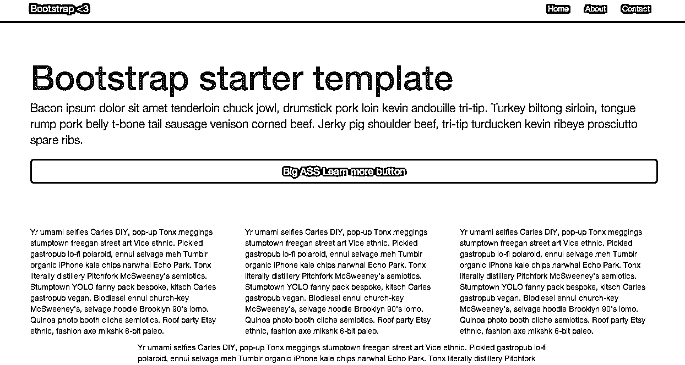
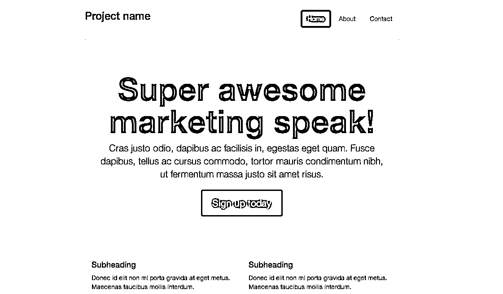
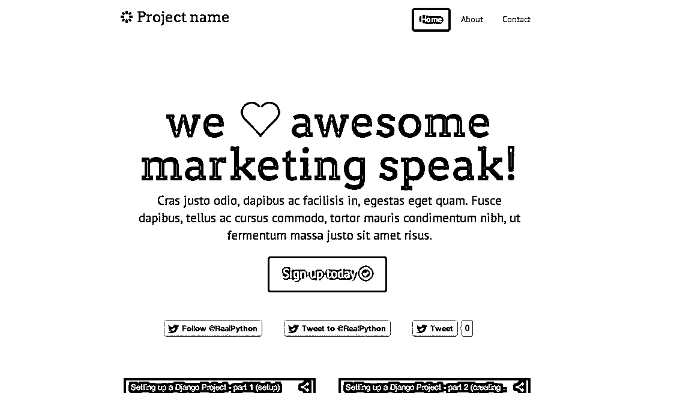

# Bootstrap 3 入门

> 原文：<https://realpython.com/getting-started-with-bootstrap-3/>

尽管给自己贴上后端开发者的标签，我已经越来越多地涉足前端设计，也就是因为 [JavaScript](https://realpython.com/python-vs-javascript/) 模糊了两者之间的界限。在我的上一个项目中，我用 [HTML 和 CSS](https://realpython.com/html-css-python/) 开发了一些响应式风格——这可能很痛苦。

令人欣慰的是，Bootstrap(以前称为 Twitter Bootstrap)这样的框架使得这样的设计请求变得相当简单——在 Bootstrap 3 的新版本中甚至更简单。

让我们来看看。

> 这是一个由 3 部分组成的系列。在第一部分中，我们将只关注 Bootstrap 3 以及如何使用 HTML 和 CSS 定制它。在第二部分，我们将看看如何建立一个有效的销售登录页面。点击查看[。最后，在最后一部分，我们将使用 Flask + Bootstrap 3 将 Python 加入到构建登陆页面的组合中。](https://realpython.com/an-effective-sales-page-with-bootstrap-3/)

你可以从这个[报告](https://github.com/mjhea0/bootstrap3)中获得最终的样式/页面。

## 创建一个最小的网站布局

从官方[网站](http://getbootstrap.com/)下载 Bootstrap 开始。打开 zip 文件并获取 dist 目录。这将是我们这个小项目的根文件夹。请务必将`assets/js`中的`jquery.js`添加到`dist/js`中。

```py
.
├── css
│   ├── bootstrap-theme.css
│   ├── bootstrap-theme.min.css
│   ├── bootstrap.css
│   └── bootstrap.min.css
├── fonts
│   ├── glyphicons-halflings-regular.eot
│   ├── glyphicons-halflings-regular.svg
│   ├── glyphicons-halflings-regular.ttf
│   └── glyphicons-halflings-regular.woff
├── index.html
└── js
    ├── bootstrap.js
    ├── bootstrap.min.js
    └── jquery.js
```

添加包含以下内容的 index.html 文件:

```py
<!DOCTYPE html>
<html>
  <head>
    <title>Bootstrap Template</title>
    <meta name="viewport" content="width=device-width, initial-scale=1.0">
    <link href="css/bootstrap.min.css" rel="stylesheet" media="screen">

    <!-- HTML5 shim and Respond.js IE8 support of HTML5 elements and media queries -->
    <!--[if lt IE 9]>
 <script src="../../assets/js/html5shiv.js"></script>
 <script src="../../assets/js/respond.min.js"></script>
 <![endif]-->
  </head>
  <body>
    <div class ="container">
      <h1>Hello, world!</h1>
    </div>
  </body>
</html>
```

添加一个导航条(现在总是有响应的)、一个容器、大屏幕、一些 [ipsum 文本](https://dgtl.link/QuickLoremIpsum)和一个按钮:

```py
<!DOCTYPE html>
<html>
  <head>
    <title>Bootstrap Template</title>
    <meta name="viewport" content="width=device-width, initial-scale=1.0">
    <link href="css/bootstrap.min.css" rel="stylesheet" media="screen">

    <!-- HTML5 shim and Respond.js IE8 support of HTML5 elements and media queries -->
    <!--[if lt IE 9]>
 <script src="../../assets/js/html5shiv.js"></script>
 <script src="../../assets/js/respond.min.js"></script>
 <![endif]-->
  </head>
  <body>
    <div class="navbar navbar-inverse navbar-fixed-top">
    <div class="container">
      <div class="navbar-header">
        <button type="button" class="navbar-toggle" data-toggle="collapse" data-target=".navbar-collapse">
          <span class="icon-bar"></span>
          <span class="icon-bar"></span>
          <span class="icon-bar"></span>
        </button>
        <a class="navbar-brand" href="#">Bootstrap <3</a>
      </div>
      <div class="collapse navbar-collapse">
        <ul class="nav navbar-nav navbar-right">
          <li class="active"><a href="#">Home</a></li>
          <li><a href="#about">About</a></li>
          <li><a href="#contact">Contact</a></li>
        </ul>
      </div><!--/.nav-collapse -->
    </div>
  </div>

  <div class="jumbotron">
    <div class="container">
      <h1>Bootstrap starter template</h1>
      <p class="lead">Bacon ipsum dolor sit amet tenderloin chuck jowl, drumstick pork loin kevin andouille tri-tip. Turkey biltong sirloin, tongue rump pork belly t-bone tail sausage venison corned beef. Jerky pig shoulder beef, tri-tip turducken kevin ribeye prosciutto spare ribs.</p>
      <a class="btn btn-primary btn-lg btn-block">Big ASS Learn more button</a>
    </div>
  </div>

  </body>
</html>
```

在头部添加以下样式:

```py
<style> body  {padding-top:  50px;} </style>
```

最后，为了增加完整的响应，在`</body>`标签之前添加以下脚本:

```py
<script src="js/jquery.js"></script>
<script src="js/bootstrap.min.js"></script>
```

乍一看，你可以看到所有组件都是平的。如果你不喜欢平面设计，还有一个可供选择的主题。通过调整浏览器大小来调整响应速度。看起来不错。在 Bootstrap 3 中，响应能力现在是默认的——所以现在你没有选择:你必须首先为移动开发。

[*Remove ads*](/account/join/)

### 电网系统

网格系统现在更容易使用了。默认情况下，它最多可扩展到 12 列，可以针对四种设备进行更改——大型台式机、台式机、平板电脑和手机。你很快就会看到，默认情况下它也是可变的。

在结束的大屏幕 div 后添加一行、一个基本的网格系统和更多的 ipsum 文本:

```py
<div class="container">
  <div class="row">
    <div class="col-md-4">
      <p>Yr umami selfies Carles DIY, pop-up Tonx meggings stumptown freegan street art Vice ethnic. Pickled gastropub lo-fi polaroid, ennui selvage meh Tumblr organic iPhone kale chips narwhal Echo Park. Tonx literally distillery Pitchfork McSweeney's semiotics. Stumptown YOLO fanny pack bespoke, kitsch Carles gastropub vegan. Biodiesel ennui church-key McSweeney's, selvage hoodie Brooklyn 90's lomo. Quinoa photo booth cliche semiotics. Roof party Etsy ethnic, fashion axe mlkshk 8-bit paleo.</p>
    </div>
    <div class="col-md-4">
      <p>Yr umami selfies Carles DIY, pop-up Tonx meggings stumptown freegan street art Vice ethnic. Pickled gastropub lo-fi polaroid, ennui selvage meh Tumblr organic iPhone kale chips narwhal Echo Park. Tonx literally distillery Pitchfork McSweeney's semiotics. Stumptown YOLO fanny pack bespoke, kitsch Carles gastropub vegan. Biodiesel ennui church-key McSweeney's, selvage hoodie Brooklyn 90's lomo. Quinoa photo booth cliche semiotics. Roof party Etsy ethnic, fashion axe mlkshk 8-bit paleo.</p>
    </div>
    <div class="col-md-4">
      <p>Yr umami selfies Carles DIY, pop-up Tonx meggings stumptown freegan street art Vice ethnic. Pickled gastropub lo-fi polaroid, ennui selvage meh Tumblr organic iPhone kale chips narwhal Echo Park. Tonx literally distillery Pitchfork McSweeney's semiotics. Stumptown YOLO fanny pack bespoke, kitsch Carles gastropub vegan. Biodiesel ennui church-key McSweeney's, selvage hoodie Brooklyn 90's lomo. Quinoa photo booth cliche semiotics. Roof party Etsy ethnic, fashion axe mlkshk 8-bit paleo.</p>
    </div>
  </div>
</div>
```

> 由于每行有 12 个单位，我们做了三列，每列 4 个单位。请记住，所有列的总和必须是 12。尝试一下:尝试将第一列更改为 2 个单位，将最后一列更改为 8 个单位，或者用另一组列一起添加一个新行(或者等到下一步)。

用下面的网格在旧行下面添加一个新行(确保它在`container`元素内):

```py
<div class="col-md-8 col-md-offset-2">
  <p>Yr umami selfies Carles DIY, pop-up Tonx meggings stumptown freegan street art Vice ethnic. Pickled gastropub lo-fi polaroid, ennui selvage meh Tumblr organic iPhone kale chips narwhal Echo Park. Tonx literally distillery Pitchfork McSweeney's semiotics. Stumptown YOLO fanny pack bespoke, kitsch Carles gastropub vegan. Biodiesel ennui church-key McSweeney's, selvage hoodie Brooklyn 90's lomo. Quinoa photo booth cliche semiotics. Roof party Etsy ethnic, fashion axe mlkshk 8-bit paleo.</p>
</div>
```

> 这里，我们使用了`offset`，它将列向右移动，使其居中。本质上，我们移动了 2 个单位，然后使用了一个 8 单位的列，之后留下另外 2 个单位，等于 12: 2 + 8 + 2 = 12。

因为 Bootstrap 3 中的网格系统响应迅速，所以可以将一行嵌套在另一行中(这是另一个新特性)。内部行(例如行内的行)将有 12 列。把这个拖出来可能会有帮助。在看我的例子之前，先自己尝试一下。

```py
<div class="row">
  <div class="col-md-4">
    <div class="row">
      <div class="col-md-6">
        <p>Yr umami selfies Carles DIY, pop-up Tonx meggings stumptown freegan street art Vice ethnic.</p>
      </div>
      <div class="col-md-6">
        <p>Stumptown YOLO fanny pack bespoke, kitsch Carles gastropub vegan.</p>
      </div>
    </div>
    <div class="row">
      <div class="col-md-6">
        <p>Pickled gastropub lo-fi polaroid, ennui selvage meh Tumblr organic iPhone kale chips narwhal Echo Park.</p>
      </div>

      <div class="col-md-6">
        <p>Biodiesel ennui church-key McSweeney's, selvage hoodie Brooklyn 90's lomo.</p>
      </div>
    </div>
  </div>
  <div class="col-md-4">
    <p>Yr umami selfies Carles DIY, pop-up Tonx meggings stumptown freegan street art Vice ethnic. Pickled gastropub lo-fi polaroid, ennui selvage meh Tumblr organic iPhone kale chips narwhal Echo Park. Tonx literally distillery Pitchfork McSweeney's semiotics. Stumptown YOLO fanny pack bespoke, kitsch Carles gastropub vegan. Biodiesel ennui church-key McSweeney's, selvage hoodie Brooklyn 90's lomo. Quinoa photo booth cliche semiotics. Roof party Etsy ethnic, fashion axe mlkshk 8-bit paleo.</p>
  </div>
  <div class="col-md-4">
    <p>
      <ul class="list-group">
        <li class="list-group-item"><span class="badge">14</span>Quinoa photo booth</li>
        <li class="list-group-item"><span class="badge">10</span>iPhone kale chips</li>
        <li class="list-group-item"><span class="badge">6</span>fanny pack bespoke</li>
        <li class="list-group-item"><span class="badge">4</span>lo-fi polaroid</li>
        <li class="list-group-item"><span class="badge">2</span>Tonx meggings stumptown</li>
      </ul>
    </p>
  </div>
</div>
```

> 因此，我们采用跨度为 4 的第一列，并对其进行嵌套，使其具有四个大小相等的盒子。此外，您可能注意到了最右边一列中的列表。这是 Bootstrap 3 中的另一个新特性，叫做[列表组](http://getbootstrap.com/components/#list-group)。

您还可以用`<div class="list-group">`替换无序列表，然后使用锚标记来显示链接，而不是列表项:

```py
<div class="list-group">
  <a href="#" class="list-group-item"><span class="badge">14</span>Quinoa photo booth</a>
  <a href="#" class="list-group-item"><span class="badge">10</span>iPhone kale chips</a>
  <a href="#" class="list-group-item active"><span class="badge">6</span>fanny pack bespoke</a>
  <a href="#" class="list-group-item"><span class="badge">4</span>lo-fi polaroid</a>
  <a href="#" class="list-group-item"><span class="badge">2</span>Tonx meggings stumptown</a>
</div>
```

测试一下。找点乐子吧。尝试通过添加图像、渐变甚至基本颜色来改变大屏幕的背景颜色。

这样的小变化可以产生很大的不同。确保你的页面看起来像我的页面。

[](https://files.realpython.com/media/bootstrap3-index.24c5a8e016b8.png)

## 一个例子:狭义营销自举 3

让我们更进一步，创建一个工作示例。Bootstrap 2 中我最喜欢的一个例子是[狭义营销模板](http://getbootstrap.com/2.3.2/examples/marketing-narrow.html)，遗憾的是，它不属于 Bootstrap 3 中的[示例](http://getbootstrap.com/getting-started/#examples)。所以我们自己从头开始创造吧。

从基础页面开始。

```py
<!DOCTYPE html>
<html>
  <head>
    <title>Bootstrap Template</title>
    <meta name="viewport" content="width=device-width, initial-scale=1.0">
    <link href="css/bootstrap.min.css" rel="stylesheet" media="screen">

    <!-- HTML5 shim and Respond.js IE8 support of HTML5 elements and media queries -->
    <!--[if lt IE 9]>
 <script src="../../assets/js/html5shiv.js"></script>
 <script src="../../assets/js/respond.min.js"></script>
 <![endif]-->
  </head>
  <style> body  {padding-top:  50px;} </style>
  <body>

  <div class="container">

     <h1>Nothing to see .. yet.<h1>

  </div>

  <script src="js/jquery.js"></script>
  <script src="js/bootstrap.min.js"></script>
  </body>
</html>
```

添加导航栏并更新样式:

```py
<style> body  { padding-top:  20px; padding-bottom:  20px; } .container-narrow  { margin:  0  auto; max-width:  700px; } .container-narrow  >  hr  { margin:  40px  0  0  0; } </style>

<body>

<div class="container-narrow">
  <ul class="nav nav-pills pull-right">
    <li class="active"><a href="#">Home</a></li>
    <li><a href="#">About</a></li>
    <li><a href="#">Contact</a></li>
  </ul>
  <h3 class="text-muted">Project name</h3>
  <hr>
```

大屏幕。先添加样式，然后在`<hr>`下面添加大屏幕。

```py
.jumbotron {
  margin: 5px 0;
  text-align: center;
  background-color:white;
}
.jumbotron h1 {
  font-size: 72px;
  line-height: 1;
  font-weight: bold;
}
.jumbotron .btn {
  font-size: 21px;
  padding: 14px 24px;
}

...

<div class="jumbotron">
  <h1>Super awesome marketing speak!</h1>
  <p class="lead">Cras justo odio, dapibus ac facilisis in, egestas eget quam. Fusce dapibus, tellus ac cursus commodo, tortor mauris condimentum nibh, ut fermentum massa justo sit amet risus.</p>
  <a class="btn btn-large btn-success" href="#">Sign up today</a>
</div>
```

营销科。同样，首先添加样式，然后移除`<container></container>`元素并添加到 marketing 行中。

```py
.marketing {
  margin: 40px 0;
}

.marketing p + h4 {
  margin-top: 28px;
}

...

<div class="row marketing">
  <div class="col-md-6">
    <h4>Subheading</h4>
    <p>Donec id elit non mi porta gravida at eget metus. Maecenas faucibus mollis interdum.</p>

    <h4>Subheading</h4>
    <p>Morbi leo risus, porta ac consectetur ac, vestibulum at eros. Cras mattis consectetur purus sit amet fermentum.</p>

    <h4>Subheading</h4>
    <p>Maecenas sed diam eget risus varius blandit sit amet non magna.</p>
  </div>

  <div class="col-md-6">
    <h4>Subheading</h4>
    <p>Donec id elit non mi porta gravida at eget metus. Maecenas faucibus mollis interdum.</p>

    <h4>Subheading</h4>
    <p>Morbi leo risus, porta ac consectetur ac, vestibulum at eros. Cras mattis consectetur purus sit amet fermentum.</p>

    <h4>Subheading</h4>
    <p>Maecenas sed diam eget risus varius blandit sit amet non magna.</p>
  </div>
</div>
```

页脚。注意多余的`</div>`。这应该会关闭`<div class="container-narrow">`。

```py
<div class="footer">
  <p>&copy; Company 2013</p>
</div>
</div>
```

就是这样。将这个[版本](https://realpython.com/files/bootstrap3/marketing-narrow-bootstrap3.html)与 Bootstrap 2 [版本](http://getbootstrap.com/2.3.2/examples/marketing-narrow.html)进行比较。类似。但是很平。

[](https://files.realpython.com/media/marketing-narrow-bootstrap3.dcad5d590dce.png)[*Remove ads*](/account/join/)

## 让它成为你自己的

让我们看看一些快速定制这个例子的方法，让它看起来不那么“自举”。

首先，添加一个名为`main.css`的新样式表，并向其中添加嵌入的样式。不要忘记将新样式表添加到第一个样式表下面的`head`中。此外，添加以下谷歌字体以及一个链接到字体真棒风格:

```py
<link href="css/main.css" rel="stylesheet" media="screen">
<link href="http://fonts.googleapis.com/css?family=Arvo" rel="stylesheet" type="text/css">
<link href="http://fonts.googleapis.com/css?family=PT+Sans" rel="stylesheet" type="text/css">
<link href="//netdna.bootstrapcdn.com/font-awesome/3.2.1/css/font-awesome.css" rel="stylesheet">
```

让我们使用这些新字体:

```py
h1, h2, h3, h4, h5, h6 {
  font-family: 'Arvo', Georgia, Times, serif;
}

p, div {
  font-family: 'PT Sans', Helvetica, Arial, sans-serif;
}
```

> 你可能知道，很难找到两种字体搭配起来好看。幸运的是，有很多好的资源——比如这里的和这里的。

纹理可以产生很大的不同，这就是为什么我喜欢[微妙的图案](http://subtlepatterns.com/)。用下面的代码更新`body`类。确保大屏幕也是透明的。

```py
body {
  padding-top: 10px;
  padding-bottom: 20px;
  background: url(http://subtlepatterns.com/patterns/lightpaperfibers.png) repeat 0 0;
}

...

.jumbotron {
  margin: 5px 0;
  text-align: center;
  background-color:transparent;
}
```

更新 Marketing 部分，以便只有一行三列(每列跨越 4 个单元)。让我们也使用[新的](http://getbootstrap.com/components/#glyphicons)雕刻图标。或者你可以使用[字体，因为我们添加了样式表。](http://fortawesome.github.io/Font-Awesome/)

```py
<div class="row marketing">
  <div class="col-md-4">
    <h3><span class="glyphicon glyphicon-info-sign" style="color:#428bca;"></span> Subheading</h3>
     <p>Donec id elit non mi porta gravida at eget metus. Maecenas faucibus mollis interdum.</p>
  </div>
  <div class="col-md-4">
    <h3><span class="glyphicon glyphicon-info-sign" style="color:#428bca;"></span> Subheading</h3>
    <p>Morbi leo risus, porta ac consectetur ac, vestibulum at eros. Cras mattis consectetur purus sit amet fermentum.</p>
  </div>
  <div class="col-md-4">
    <h3><span class="glyphicon glyphicon-info-sign" style="color:#428bca;"></span> Subheading</h3>
    <p>Maecenas sed diam eget risus varius blandit sit amet non magna.</p>
  </div>
</div>
```

在营销部分的上方，让我们添加一个新的包含两个视频的行，希望与您的产品或服务有关(或者至少解释了您的网站存在的原因)。

```py
<div class="row">
  <div class="col-md-6">
    <center><iframe width="320" height="240" style="max-width:100%" src="http://www.youtube.com/embed/D0MoGRZRtcA?rel=0" frameborder="0" allowfullscreen></iframe>
  </div>
  <div class="col-md-6">
    <iframe width="320" height="240" style="max-width:100%" src="http://www.youtube.com/embed/EuOJRop5aBE?rel=0" frameborder="0" allowfullscreen></iframe></center>
  </div>
</div>
```

> 顺便说一下，我在几个月前录制了这些视频，其中详细介绍了如何开始一个 Django 项目。将它们签出，创建一个基本项目，然后添加一些样式。:)

更新大屏幕，增加一些社交分享按钮和图标。<3

```py
<div class="jumbotron">
  <h1>we <span class="glyphicon glyphicon-heart" style="color:#428bca;"></span> awesome marketing speak!</h1>
  <p class="lead">Cras justo odio, dapibus ac facilisis in, egestas eget quam. Fusce dapibus, tellus ac cursus commodo, tortor mauris condimentum nibh, ut fermentum massa justo sit amet risus.</p>
  <a class="btn btn-large btn-success" href="#">Sign up today <span class="glyphicon glyphicon-ok-circle"></span></a>
  <br/><br/>
  <a href="https://twitter.com/RealPython" class="twitter-follow-button" data-show-count="false" data-size="large">Follow @RealPython</a>
  <script>!function(d,s,id){var  js,fjs=d.getElementsByTagName(s)[0],p=/^http:/.test(d.location)?'http':'https';if(!d.getElementById(id)){js=d.createElement(s);js.id=id;js.src=p+'://platform.twitter.com/widgets.js';fjs.parentNode.insertBefore(js,fjs);}}(document,  'script',  'twitter-wjs'); </script>
  &nbsp;&nbsp;&nbsp;&nbsp;
  <a href="https://twitter.com/intent/tweet?screen_name=RealPython" class="twitter-mention-button" data-size="large">Tweet to @RealPython</a>
  <script>!function(d,s,id){var  js,fjs=d.getElementsByTagName(s)[0],p=/^http:/.test(d.location)?'http':'https';if(!d.getElementById(id)){js=d.createElement(s);js.id=id;js.src=p+'://platform.twitter.com/widgets.js';fjs.parentNode.insertBefore(js,fjs);}}(document,  'script',  'twitter-wjs'); </script>
  &nbsp;&nbsp;&nbsp;&nbsp;
  <a href="https://twitter.com/share" class="twitter-share-button" data-url="https://realpython.com" data-text="RealPython yo -" data-size="large">Tweet</a>
  <script>!function(d,s,id){var  js,fjs=d.getElementsByTagName(s)[0],p=/^http:/.test(d.location)?'http':'https';if(!d.getElementById(id)){js=d.createElement(s);js.id=id;js.src=p+'://platform.twitter.com/widgets.js';fjs.parentNode.insertBefore(js,fjs);}}(document,  'script',  'twitter-wjs'); </script>
</div>
```

最后，从导航栏中删除`text-mute`类，并添加一个图标:

```py
<h3><span class="glyphicon glyphicon-asterisk" style="color:#5cb85c"></span> Project name</h3>
```

这里是最终的[版本](https://realpython.com/files/bootstrap3/marketing-narrow-bootstrap3-updated.html)。

[](https://files.realpython.com/media/marketing-narrow-bootstrap3-updated.0e5be2fd107e.png)

好吗？至少，有了这些基本的改变——花了整整五分钟——你现在已经开始着手一个通用的主题，并使它变得更加专业。干杯。

准备好了吗？查看这三部分系列中的第二部分[部分](https://realpython.com/an-effective-sales-page-with-bootstrap-3/)。哦——看看[这些](http://startbootstrap.com/)入门模板，快速入门。只需添加新的字体、颜色和一些纹理…**