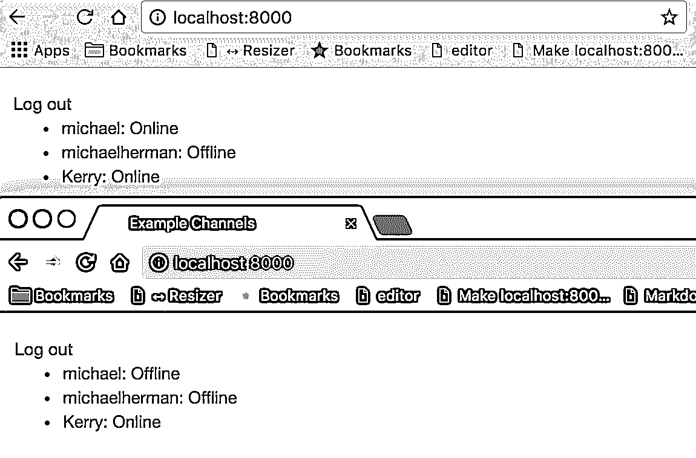

# Django 频道入门

> 原文：<https://realpython.com/getting-started-with-django-channels/>

在本教程中，我们将使用 [Django Channels](https://channels.readthedocs.io/) 创建一个实时应用程序，在用户登录和退出时更新用户列表。

使用 WebSockets(通过 Django 通道)管理客户端和服务器之间的通信，每当用户通过身份验证时，就会向所有其他连接的用户广播一个事件。每个用户的屏幕会自动改变，而不需要他们重新加载浏览器。

> **注意:**我们建议你在开始本教程之前有一些使用 [Django](https://docs.djangoproject.com/en/1.10/) 的经验。另外，你应该熟悉 [WebSockets](https://developer.mozilla.org/en-US/docs/Web/API/WebSockets_API) 的概念。

**免费奖励:** [点击此处获取免费的 Django 学习资源指南(PDF)](#) ，该指南向您展示了构建 Python + Django web 应用程序时要避免的技巧和窍门以及常见的陷阱。

我们的应用程序使用:

*   python(3 . 6 . 0 版)
*   django(1 . 10 . 5 版)
*   Django 频道(1.0.3 版)
*   Redis (v3.2.8)

## 目标

本教程结束时，您将能够…

1.  通过 Django 通道向 Django 项目添加 Web 套接字支持
2.  在 Django 和 Redis 服务器之间建立一个简单的连接
3.  实施基本用户身份验证
4.  利用 Django 信号在用户登录或退出时采取行动

[*Remove ads*](/account/join/)

## 开始使用

首先，创建一个新的[虚拟环境](https://realpython.com/python-virtual-environments-a-primer/)来隔离我们项目的依赖关系:

```py
$ mkdir django-example-channels
$ cd django-example-channels
$ python3.6 -m venv env
$ source env/bin/activate
(env)$
```

安装 [Django](https://realpython.com/get-started-with-django-1/) ，Django 频道， [ASGI Redis](https://github.com/django/asgi_redis) ，然后创建一个新的 Django 项目和 app:

```py
(env)$ pip install django==1.10.5 channels==1.0.2 asgi_redis==1.0.0
(env)$ django-admin.py startproject example_channels
(env)$ cd example_channels
(env)$ python manage.py startapp example
(env)$ python manage.py migrate
```

> **注意:**在本教程中，我们将创建各种不同的文件和文件夹。如果你卡住了，请参考项目的[库](https://github.com/realpython/django-example-channels)中的文件夹结构。

接下来，下载并安装 [Redis](https://redis.io/download) 。如果你在苹果电脑上，我们建议你使用[自制软件](http://brew.sh/):

```py
$ brew install redis
```

在新的终端窗口中启动 Redis 服务器，并确保它运行在默认端口 6379 上。当我们告诉 Django 如何与 Redis 通信时，端口号将非常重要。

通过更新项目的 *settings.py* 文件中的`INSTALLED_APPS`来完成设置:

```py
INSTALLED_APPS = [
    'django.contrib.admin',
    'django.contrib.auth',
    'django.contrib.contenttypes',
    'django.contrib.sessions',
    'django.contrib.messages',
    'django.contrib.staticfiles',
    'channels',
    'example',
]
```

然后通过设置默认后端和路由来配置`CHANNEL_LAYERS`:

```py
CHANNEL_LAYERS = {
    'default': {
        'BACKEND': 'asgi_redis.RedisChannelLayer',
        'CONFIG': {
            'hosts': [('localhost', 6379)],
        },
        'ROUTING': 'example_channels.routing.channel_routing',
    }
}
```

这使用了生产中也需要的 [Redis 后端](http://channels.readthedocs.io/en/stable/backends.html#redis)。

## WebSockets 101

通常，Django 使用 HTTP 在客户机和服务器之间进行通信:

1.  客户端向服务器发送一个 HTTP 请求。
2.  Django 解析请求，提取一个 URL，然后将其匹配到一个视图。
3.  视图处理请求并向客户机返回 HTTP 响应。

与 HTTP 不同，WebSockets 协议允许双向通信，这意味着服务器可以将数据推送到客户端，而无需用户提示。对于 HTTP，只有发出请求的客户端会收到响应。使用 WebSockets，服务器可以同时与多个客户端通信。正如我们将在本教程后面看到的，我们使用前缀`ws://`发送 WebSockets 消息，而不是`http://`。

> **注意:**在开始之前，快速回顾一下[渠道概念](https://channels.readthedocs.io/en/stable/concepts.html)文档。

## 消费者和团体

让我们创建第一个[消费者](https://channels.readthedocs.io/en/stable/generics.html)，它处理客户机和服务器之间的基本连接。创建一个名为*的新文件 example _ channels/example/consumers . py*:

```py
from channels import Group

def ws_connect(message):
    Group('users').add(message.reply_channel)

def ws_disconnect(message):
    Group('users').discard(message.reply_channel)
```

消费者是 Django 观点的对应者。任何连接到我们的应用程序的用户都将被添加到“用户”组，并将接收服务器发送的消息。当客户端与我们的应用断开连接时，该频道将从群中删除，用户将停止接收消息。

接下来，让我们通过将以下代码添加到名为*example _ channels/routing . py*的新文件来设置路由，其工作方式与 Django URL 配置几乎相同:

```py
from channels.routing import route
from example.consumers import ws_connect, ws_disconnect

channel_routing = [
    route('websocket.connect', ws_connect),
    route('websocket.disconnect', ws_disconnect),
]
```

所以，我们定义了`channel_routing`而不是`urlpatterns`，定义了`route()`而不是`url()`。请注意，我们将消费者函数链接到了 WebSockets。

[*Remove ads*](/account/join/)

### 模板

让我们写一些可以通过 WebSocket 与服务器通信的 HTML。在“示例”中创建一个“模板”文件夹，然后在“模板”-“示例 _ 频道/示例/模板/示例”中添加一个“示例”文件夹。

添加一个 *_base.html* 文件:

```py
<!doctype html>
<html lang="en">
<head>
  <meta charset="utf-8">
  <meta name="viewport" content="width=device-width, user-scalable=no, initial-scale=1.0, maximum-scale=1.0, minimum-scale=1.0">
  <meta http-equiv="X-UA-Compatible" content="ie=edge">
  <link href="//maxcdn.bootstrapcdn.com/bootstrap/3.3.7/css/bootstrap.min.css" rel="stylesheet">
  <title>Example Channels</title>
</head>
<body>
  <div class="container">
    <br>
    
  </div>
  <script src="//code.jquery.com/jquery-3.1.1.min.js"></script>
  
</body>
</html>
```

以及 *user_list.html* :

```py





  <script> var  socket  =  new  WebSocket('ws://'  +  window.location.host  +  '/users/'); socket.onopen  =  function  open()  { console.log('WebSockets connection created.'); }; if  (socket.readyState  ==  WebSocket.OPEN)  { socket.onopen(); } </script>

```

现在，当客户机使用 WebSocket 成功打开与服务器的连接时，我们将看到一条确认消息打印到控制台。

### 视图

在*example _ channels/example/views . py*中设置一个支持 Django 视图来呈现我们的模板:

```py
from django.shortcuts import render

def user_list(request):
    return render(request, 'example/user_list.html')
```

将 URL 添加到*example _ channels/example/URLs . py*:

```py
from django.conf.urls import url
from example.views import user_list

urlpatterns = [
    url(r'^$', user_list, name='user_list'),
]
```

更新*example _ channels/example _ channels/URLs . py*中的项目 URL:

```py
from django.conf.urls import include, url
from django.contrib import admin

urlpatterns = [
    url(r'^admin/', admin.site.urls),
    url(r'^', include('example.urls', namespace='example')),
]
```

### 测试

准备测试了吗？

```py
(env)$ python manage.py runserver
```

> **注意:**您可以在两个不同的终端中交替运行`python manage.py runserver --noworker`和`python manage.py runworker`，作为两个独立的进程来测试接口和工作服务器。两种方法都管用！

当您访问 [http://localhost:8000/](http://localhost:8000/) 时，您应该看到打印到终端的连接消息:

```py
[2017/02/19 23:24:57] HTTP GET / 200 [0.02, 127.0.0.1:52757]
[2017/02/19 23:24:58] WebSocket HANDSHAKING /users/ [127.0.0.1:52789]
[2017/02/19 23:25:03] WebSocket DISCONNECT /users/ [127.0.0.1:52789]
```

[*Remove ads*](/account/join/)

## 用户认证

既然我们已经证明了我们可以打开一个连接，我们的下一步就是处理用户认证。请记住:我们希望用户能够登录到我们的应用程序，并看到所有其他用户谁订阅了该用户组的列表。首先，我们需要一种用户创建帐户和登录的方法。首先创建一个简单的登录页面，允许用户使用用户名和密码进行身份验证。

在“example _ channels/example/templates/example”中创建一个名为 *log_in.html* 的新文件:

```py



  <form action="" method="post">
    
    
      <div>
        {{ field.label_tag }}
        {{ field }}
      </div>
    
    
  </form>
  <p>Don't have an account? <a href="">Sign up!</a></p>

```

接下来，像这样更新*example _ channels/example/views . py*:

```py
from django.contrib.auth import login, logout
from django.contrib.auth.forms import AuthenticationForm
from django.core.urlresolvers import reverse
from django.shortcuts import render, redirect

def user_list(request):
    return render(request, 'example/user_list.html')

def log_in(request):
    form = AuthenticationForm()
    if request.method == 'POST':
        form = AuthenticationForm(data=request.POST)
        if form.is_valid():
            login(request, form.get_user())
            return redirect(reverse('example:user_list'))
        else:
            print(form.errors)
    return render(request, 'example/log_in.html', {'form': form})

def log_out(request):
    logout(request)
    return redirect(reverse('example:log_in'))
```

Django 带有支持通用认证功能的表单。我们可以使用`AuthenticationForm`来处理用户登录。该表单检查所提供的用户名和密码，如果找到有效的用户，则返回一个`User`对象。我们登录通过验证的用户，并将他们重定向到我们的主页。用户还应该能够注销应用程序，因此我们创建了一个提供该功能的注销视图，然后将用户带回到登录屏幕。

然后更新*example _ channels/example/URLs . py*:

```py
from django.conf.urls import url
from example.views import log_in, log_out, user_list

urlpatterns = [
    url(r'^log_in/$', log_in, name='log_in'),
    url(r'^log_out/$', log_out, name='log_out'),
    url(r'^$', user_list, name='user_list')
]
```

我们还需要一种创造新用户的方式。通过将名为 *sign_up.html* 的新文件添加到“example _ channels/example/templates/example”中，以与登录相同的方式创建一个注册页面:

```py



  <form action="" method="post">
    
    
      <div>
        {{ field.label_tag }}
        {{ field }}
      </div>
    
    
    <p>Already have an account? <a href="">Log in!</a></p>
  </form>

```

请注意，登录页面有一个指向注册页面的链接，注册页面有一个指向登录页面的链接。

向视图添加以下函数:

```py
def sign_up(request):
    form = UserCreationForm()
    if request.method == 'POST':
        form = UserCreationForm(data=request.POST)
        if form.is_valid():
            form.save()
            return redirect(reverse('example:log_in'))
        else:
            print(form.errors)
    return render(request, 'example/sign_up.html', {'form': form})
```

我们使用另一个内置表单来创建用户。表单验证成功后，我们重定向到登录页面。

确保导入表单:

```py
from django.contrib.auth.forms import AuthenticationForm, UserCreationForm
```

再次更新*example _ channels/example/URLs . py*:

```py
from django.conf.urls import url
from example.views import log_in, log_out, sign_up, user_list

urlpatterns = [
    url(r'^log_in/$', log_in, name='log_in'),
    url(r'^log_out/$', log_out, name='log_out'),
    url(r'^sign_up/$', sign_up, name='sign_up'),
    url(r'^$', user_list, name='user_list')
]
```

此时，我们需要创建一个用户。运行服务器并在浏览器中访问`http://localhost:8000/sign_up/`。使用有效的用户名和密码填写表单，并提交以创建我们的第一个用户。

> **注意:**尝试使用`michael`作为用户名，`johnson123`作为密码。

`sign_up`视图将我们重定向到`log_in`视图，从那里我们可以验证我们新创建的用户。

登录后，我们可以测试新的身份验证视图。

使用注册表单创建几个新用户，为下一部分做准备。

[*Remove ads*](/account/join/)

## 登录提醒

我们有基本的用户认证工作，但我们仍然需要显示一个用户列表，我们需要服务器告诉组，当一个用户登录和退出。我们需要编辑我们的消费者函数，以便它们在客户端连接之后和客户端断开之前发送消息。消息数据将包括用户的用户名和连接状态。

更新*example _ channels/example/consumers . py*如下:

```py
import json
from channels import Group
from channels.auth import channel_session_user, channel_session_user_from_http

@channel_session_user_from_http
def ws_connect(message):
    Group('users').add(message.reply_channel)
    Group('users').send({
        'text': json.dumps({
            'username': message.user.username,
            'is_logged_in': True
        })
    })

@channel_session_user
def ws_disconnect(message):
    Group('users').send({
        'text': json.dumps({
            'username': message.user.username,
            'is_logged_in': False
        })
    })
    Group('users').discard(message.reply_channel)
```

注意，我们在函数中添加了 decorators 来从 Django 会话中获取用户。此外，所有消息都必须是 JSON 可序列化的，所以我们[将数据转储到一个 JSON 字符串中。](https://realpython.com/python-json/)

接下来，更新*example _ channels/example/templates/example/user _ list . html*:

```py



  <a href="">Log out</a>
  <br>
  <ul>
    
      <!-- NOTE: We escape HTML to prevent XSS attacks. -->
      <li data-username="{{ user.username|escape }}">
        {{ user.username|escape }}: {{ user.status|default:'Offline' }}
      </li>
    
  </ul>



  <script> var  socket  =  new  WebSocket('ws://'  +  window.location.host  +  '/users/'); socket.onopen  =  function  open()  { console.log('WebSockets connection created.'); }; socket.onmessage  =  function  message(event)  { var  data  =  JSON.parse(event.data); // NOTE: We escape JavaScript to prevent XSS attacks. var  username  =  encodeURI(data['username']); var  user  =  $('li').filter(function  ()  { return  $(this).data('username')  ==  username; }); if  (data['is_logged_in'])  { user.html(username  +  ': Online'); } else  { user.html(username  +  ': Offline'); } }; if  (socket.readyState  ==  WebSocket.OPEN)  { socket.onopen(); } </script>

```

在我们的主页上，我们展开用户列表以显示用户列表。我们将每个用户的用户名存储为一个数据属性，以便于在 DOM 中找到用户条目。我们还向 WebSocket 添加了一个事件监听器，它可以处理来自服务器的消息。当我们收到消息时，我们解析 JSON 数据，找到给定用户的`<li>`元素，并更新该用户的状态。

Django 不跟踪用户是否登录，所以我们需要创建一个简单的模型来完成这项工作。在*example _ channels/example/models . py*中创建一个与我们的`User`模型一对一连接的`LoggedInUser`模型:

```py
from django.conf import settings
from django.db import models

class LoggedInUser(models.Model):
    user = models.OneToOneField(
        settings.AUTH_USER_MODEL, related_name='logged_in_user')
```

我们的 app 会在用户登录时创建一个`LoggedInUser`实例，用户注销时 app 会删除该实例。

进行[模式迁移](https://realpython.com/django-migrations-a-primer/)，然后迁移我们的数据库以应用更改。

```py
(env)$ python manage.py makemigrations
(env)$ python manage.py migrate
```

接下来，在*example _ channels/example/views . py*中更新我们的用户列表视图，以检索要呈现的用户列表:

```py
from django.contrib.auth import get_user_model, login, logout
from django.contrib.auth.decorators import login_required
from django.contrib.auth.forms import AuthenticationForm, UserCreationForm
from django.core.urlresolvers import reverse
from django.shortcuts import render, redirect

User = get_user_model()

@login_required(login_url='/log_in/')
def user_list(request):
    """
 NOTE: This is fine for demonstration purposes, but this should be
 refactored before we deploy this app to production.
 Imagine how 100,000 users logging in and out of our app would affect
 the performance of this code!
 """
    users = User.objects.select_related('logged_in_user')
    for user in users:
        user.status = 'Online' if hasattr(user, 'logged_in_user') else 'Offline'
    return render(request, 'example/user_list.html', {'users': users})

def log_in(request):
    form = AuthenticationForm()
    if request.method == 'POST':
        form = AuthenticationForm(data=request.POST)
        if form.is_valid():
            login(request, form.get_user())
            return redirect(reverse('example:user_list'))
        else:
            print(form.errors)
    return render(request, 'example/log_in.html', {'form': form})

@login_required(login_url='/log_in/')
def log_out(request):
    logout(request)
    return redirect(reverse('example:log_in'))

def sign_up(request):
    form = UserCreationForm()
    if request.method == 'POST':
        form = UserCreationForm(data=request.POST)
        if form.is_valid():
            form.save()
            return redirect(reverse('example:log_in'))
        else:
            print(form.errors)
    return render(request, 'example/sign_up.html', {'form': form})
```

如果用户有关联的`LoggedInUser`，那么我们记录用户的状态为“在线”，如果没有，则用户为“离线”。我们还在用户列表和注销视图中添加了一个`@login_required`装饰器，将访问权限仅限于注册用户。

也添加导入:

```py
from django.contrib.auth import get_user_model, login, logout
from django.contrib.auth.decorators import login_required
```

此时，用户可以登录和退出，这将触发服务器向客户端发送消息，但我们没有办法知道用户第一次登录时有哪些用户登录。当另一个用户的状态改变时，该用户只能看到更新。这就是`LoggedInUser`发挥作用的地方，但是我们需要一种方法在用户登录时创建一个`LoggedInUser`实例，然后在用户注销时删除它。

Django 库包含一个被称为[信号](https://docs.djangoproject.com/en/1.10/topics/signals/)的特性，当某些动作发生时，它会广播通知。应用程序可以监听这些通知，然后根据它们采取行动。我们可以利用两个有用的内置信号(`user_logged_in`和`user_logged_out`)来处理我们的`LoggedInUser`行为。

在“示例 _ 通道/示例”中，添加一个名为 *signals.py* 的新文件:

```py
from django.contrib.auth import user_logged_in, user_logged_out
from django.dispatch import receiver
from example.models import LoggedInUser

@receiver(user_logged_in)
def on_user_login(sender, **kwargs):
    LoggedInUser.objects.get_or_create(user=kwargs.get('user'))

@receiver(user_logged_out)
def on_user_logout(sender, **kwargs):
    LoggedInUser.objects.filter(user=kwargs.get('user')).delete()
```

我们必须在应用配置中提供信号，*example _ channels/example/apps . py*:

```py
from django.apps import AppConfig

class ExampleConfig(AppConfig):
    name = 'example'

    def ready(self):
        import example.signals
```

更新*example _ channels/example/_ _ init _ _。py* 也一样:

```py
default_app_config = 'example.apps.ExampleConfig'
```

[*Remove ads*](/account/join/)

## 健全性检查

现在，我们已经完成了编码，并准备好连接到我们的多用户服务器来测试我们的应用程序。

运行 Django 服务器，以用户身份登录，访问主页。我们应该看到应用程序中所有用户的列表，每个用户的状态都是“离线”。接下来，打开一个新的匿名窗口，以不同的用户身份登录，观看两个屏幕。当我们登录时，常规浏览器会将用户状态更新为“在线”。从我们的匿名窗口，我们看到登录的用户也有一个“在线”的状态。我们可以通过不同用户在不同设备上登录和退出来测试 WebSockets。

[](https://files.realpython.com/media/django-channels-in-action.5dccd8179248.png)

观察客户机上的开发人员控制台和我们终端中的服务器活动，我们可以确认当用户登录时正在形成 WebSocket 连接，而当用户注销时则被破坏。

```py
[2017/02/20 00:15:23] HTTP POST /log_in/ 302 [0.07, 127.0.0.1:55393]
[2017/02/20 00:15:23] HTTP GET / 200 [0.04, 127.0.0.1:55393]
[2017/02/20 00:15:23] WebSocket HANDSHAKING /users/ [127.0.0.1:55414]
[2017/02/20 00:15:23] WebSocket CONNECT /users/ [127.0.0.1:55414]
[2017/02/20 00:15:25] HTTP GET /log_out/ 302 [0.01, 127.0.0.1:55393]
[2017/02/20 00:15:26] HTTP GET /log_in/ 200 [0.02, 127.0.0.1:55393]
[2017/02/20 00:15:26] WebSocket DISCONNECT /users/ [127.0.0.1:55414]
```

> **注意**:您也可以使用 [ngrok](https://ngrok.com) 将本地服务器安全地暴露给互联网。这样做将允许您从各种设备(如手机或平板电脑)访问本地服务器。

## 结束语

我们在本教程中讨论了很多内容——Django 通道、WebSockets、用户认证、信号和一些前端开发。主要的收获是:Channels 扩展了传统 Django 应用程序的功能，允许我们通过 WebSockets 从服务器向用户组推送消息。

这是强大的东西！

想想其中的一些应用。我们可以创建聊天室、多人游戏和协作应用，让用户能够实时交流。即使是平凡的任务也可以通过 WebSockets 得到改善。例如，服务器可以在任务完成时向客户端推送状态更新，而不是定期轮询服务器来查看长时间运行的任务是否已经完成。

本教程也只是触及了 Django 通道的皮毛。浏览 [Django Channels](https://channels.readthedocs.io/en/stable/) 文档，看看你还能创造什么。

**免费奖励:** [点击此处获取免费的 Django 学习资源指南(PDF)](#) ，该指南向您展示了构建 Python + Django web 应用程序时要避免的技巧和窍门以及常见的陷阱。

从[django-example-channels](https://github.com/realpython/django-example-channels)repo 中获取最终代码。干杯！*****