# 在 Python 中使用 ggplot:使用 plotnine 可视化数据

> 原文:# t0]https://realython . com/ggplot-python/

*立即观看**本教程有真实 Python 团队创建的相关视频课程。配合文字教程一起看，加深理解: [**用 Python 和 ggplot**](/courses/graph-data-with-python-and-ggplot/) 绘制你的数据

在本教程中，您将学习如何使用 Python 中的`ggplot`来创建数据可视化，使用图形的**语法。图形语法是一个高级工具，它允许您以高效和一致的方式创建数据图。它抽象了大多数底层细节，让您专注于为数据创建有意义且漂亮的可视化效果。**

有几个 Python 包提供了图形语法。本教程主要讲述**的剧情，因为它是最成熟的一个。plotnine 基于来自 R 编程语言的 [`ggplot2`](https://ggplot2.tidyverse.org/) ，所以如果你有 R 方面的背景，那么你可以考虑将 plotnine 作为 Python 中`ggplot2`的等价物。**

**在本教程中，您将学习如何:**

*   安装 **plotnine** 和 **Jupyter 笔记本**
*   组合图形的**语法的不同元素**
*   使用 plotnine 以高效一致的方式**创建可视化效果**
*   **将**您的数据可视化导出到文件中

本教程假设你已经对 Python 有了一些经验，并且至少对 T2 的 Jupyter 笔记本和 T4 的熊猫有了一些了解。要快速了解这些主题，请查看 [Jupyter 笔记本:使用 Pandas 和 Python 探索数据集](https://realpython.com/jupyter-notebook-introduction/)的介绍和[。](https://realpython.com/pandas-python-explore-dataset/)

**免费下载:** [从 Python 技巧中获取一个示例章节:这本书](https://realpython.com/bonus/python-tricks-sample-pdf/)用简单的例子向您展示了 Python 的最佳实践，您可以立即应用它来编写更漂亮的+Python 代码。

## 设置您的环境

在本节中，您将学习如何设置您的环境。您将涉及以下主题:

1.  创建虚拟环境
2.  安装绘图线
3.  安装 jupiter 笔记本

**虚拟环境**使您能够在隔离的环境中安装软件包。当您想尝试一些包或项目而不影响系统范围的安装时，它们非常有用。你可以在 [Python 虚拟环境:初级读本](https://realpython.com/python-virtual-environments-a-primer/)中了解更多。

运行以下命令创建一个名为`data-visualization`的目录，并在其中创建一个虚拟环境:

```py
$ mkdir data-visualization
$ cd data-visualization
$ python3 -m venv venv
```

运行以上命令后，您将在`data-visualization`目录中找到您的虚拟环境。运行以下命令来激活虚拟环境并开始使用它:

```py
$ source ./venv/bin/activate
```

激活虚拟环境时，您安装的任何软件包都将安装在该环境中，而不会影响系统范围的安装。

接下来，您将使用 [`pip`软件包安装程序](https://realpython.com/what-is-pip/)在虚拟环境中安装 plotnine。

通过运行以下命令安装 plotnine:

```py
$ python -m pip install plotnine
```

执行上面的命令使`plotnine`包在您的虚拟环境中可用。

最后，您将安装 Jupyter 笔记本。虽然这对于使用 plotnine 不是绝对必要的，但是您会发现 Jupyter Notebook 在处理数据和构建可视化时非常有用。如果你以前从未使用过这个程序，那么你可以在 [Jupyter 笔记本:简介](https://realpython.com/jupyter-notebook-introduction/)中了解更多。

要安装 Jupyter Notebook，请使用以下命令:

```py
$ python -m pip install jupyter
```

恭喜您，您现在拥有了一个安装了 plotnine 和 Jupyter 笔记本的虚拟环境！有了这个设置，您将能够运行本教程中介绍的所有代码示例。

[*Remove ads*](/account/join/)

## 用`ggplot`和 Python 构建你的第一个地块

在本节中，您将学习如何使用 Python 中的`ggplot`构建您的第一个数据可视化。您还将学习如何检查和使用 plotnine 中包含的示例数据集。

当您熟悉 plotnine 的特性时，示例数据集非常方便。每个数据集都以一个 [pandas DataFrame](https://realpython.com/pandas-dataframe/) 的形式提供，这是一个用来保存数据的二维表格数据结构。

在本教程中，您将使用以下数据集:

*   **`economics`** :美国经济数据的时间序列
*   **`mpg`** :一系列车辆的燃油经济性数据
*   **`huron`** :休伦湖在 1875 年至 1972 年间的水位

您可以在 [plotnine 参考](https://plotnine.readthedocs.io/en/stable/api.html#datasets)中找到示例数据集的完整列表。

您可以使用 Jupyter Notebook 检查任何数据集。使用以下命令启动 Jupyter 笔记本:

```py
$ source ./venv/bin/activate
$ jupyter-notebook
```

然后，进入 Jupyter Notebook 后，运行以下代码查看`economics`数据集中的原始数据:

```py
from plotnine.data import economics

economics
```

代码从`plotnine.data`导入`economics`数据集，并将其显示在一个表格中:

```py
 date      pce      pop   psavert uempmed  unemploy
0   1967-07-01  507.4   198712  12.5    4.5     2944
1   1967-08-01  510.5   198911  12.5    4.7     2945
... ...         ...     ...     ...     ...     ...
572 2015-03-01  12161.5 320707  5.2     12.2    8575
573 2015-04-01  12158.9 320887  5.6     11.7    8549
```

如您所见，该数据集包括 1967 年至 2015 年间每个月的经济信息。每一行都有以下字段:

*   **`date`** :收集数据的月份
*   **`pce`** :个人消费支出(以十亿美元计)
*   **`pop`** :总人口(以千计)
*   **`psavert`** :个人储蓄率
*   **`uempmed`** :失业持续时间中位数(周)
*   **`unemploy`** :失业人数(以千计)

现在，使用 plotnine，您可以创建一个图表来显示这些年来人口的演变:

```py
 1from plotnine.data import economics
 2from plotnine import ggplot, aes, geom_line
 3
 4(
 5    ggplot(economics)  # What data to use
 6    + aes(x="date", y="pop")  # What variable to use
 7    + geom_line()  # Geometric object to use for drawing
 8)
```

这个简短的代码示例从`economics`数据集创建了一个图。这里有一个快速分类:

1.  **第 1 行:**您导入了`economics`数据集。

2.  **第二行:**你从`plotnine`、`aes()`和`geom_line()`中导入`ggplot()`类以及一些有用的函数。

3.  **第 5 行:**使用`ggplot()`创建一个绘图对象，将`economics`数据帧传递给构造函数。

4.  **第 6 行:**添加`aes()`来设置每个轴使用的变量，在本例中是`date`和`pop`。

5.  **第 7 行:**您添加了`geom_line()`来指定图表应该绘制为折线图。

运行上述代码会产生以下输出:

[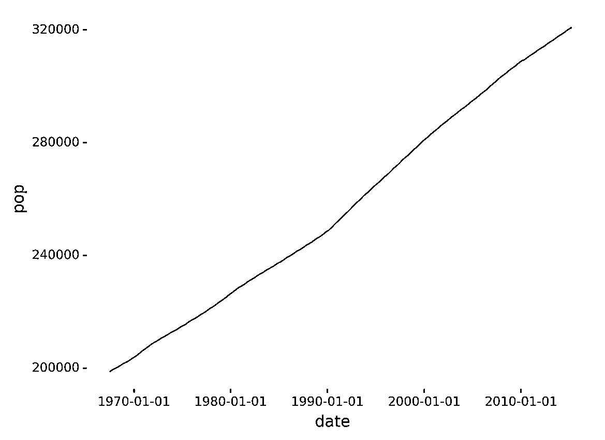](https://files.realpython.com/media/out.0e289e826965.png)

您刚刚创建了一个显示人口随时间演变的图表！

在本节中，您看到了在使用图形语法时需要指定的三个必需组件:

1.  您想要绘制的数据
2.  要在每个轴上使用的变量
3.  用于绘图的几何对象

您还看到了使用 **`+`** 操作符组合不同的组件。

在接下来的几节中，您将更深入地了解图形语法以及如何使用 plotnine 创建数据可视化。

[*Remove ads*](/account/join/)

## 理解图形的语法

图形语法是一种高级工具，允许您描述图形的组成部分，将您从画布上实际绘制像素的低级细节中抽象出来。

它被称为**语法**，因为它定义了一组组件以及将它们组合起来创建图形的规则，就像语言语法定义了如何将单词和标点符号组合成句子一样。你可以在 Leland Wilkinson 的书[](https://realpython.com/asins/0387245448/)*中了解更多关于图形语法的基础知识。

有许多不同的图形语法，它们使用的组件和规则也不同。plotnine 实现的图形语法是基于 R 编程语言的`ggplot2`。这种特定的语法出现在 Hadley Wickham 的论文[“图形的分层语法”中](http://vita.had.co.nz/papers/layered-grammar.pdf)

下面，您将了解 plotnine 图形语法的主要组件和规则，以及如何使用它们来创建数据可视化。首先，您将回顾创建情节所需的三个**要素**:

1.  **数据**是创建绘图时使用的信息。

2.  **美学(`aes` )** 提供底层绘图系统使用的数据变量和美学或图形变量之间的映射。在上一节中，您将`date`和`pop`数据变量映射到 x 轴和 y 轴美学变量。

3.  **几何对象(`geoms` )** 定义图形中使用的几何对象的类型。您可以使用点、线、条和许多其他元素。

没有这三个组件中的任何一个，plotnine 都不知道如何绘制图形。

您还将了解您可以使用的**可选组件**:

*   **统计转换**指定在绘制数据之前应用于数据的计算和聚合。

*   **Scales** 在从数据到美学的映射过程中应用一些转换。例如，有时您可以使用[对数标度](https://en.wikipedia.org/wiki/Logarithmic_scale)来更好地反映数据的某些方面。

*   **Facets** 允许您根据一些属性将数据分组，然后在同一图形中将每个组绘制到单独的面板中。

*   **坐标系**将物体的位置映射到图形中的 2D 图形位置。例如，您可以选择翻转垂直轴和水平轴，如果这对您构建的可视化更有意义的话。

*   **主题**允许您控制视觉属性，如颜色、字体和形状。

如果您现在没有完全理解每个组件是什么，也不要担心。在本教程中，您将了解更多关于它们的内容。

## 使用 Python 和`ggplot`和绘制数据

在本节中，您将了解使用 plotnine 创建数据可视化所需的三个组件的更多信息:

1.  数据
2.  美学
3.  几何对象

您还将看到它们是如何结合起来从数据集创建绘图的。

### 数据:信息的来源

创建数据可视化的第一步是指定要绘制的数据。在 plotnine 中，通过创建一个`ggplot`对象并将想要使用的数据集传递给构造函数来实现这一点。

以下代码使用 plotnine 的燃油经济性示例数据集`mpg`创建了一个`ggplot`对象:

```py
from plotnine.data import mpg
from plotnine import ggplot

ggplot(mpg)
```

这段代码使用`mpg`数据集创建了一个属于类`ggplot`的对象。请注意，由于您还没有指定美学或几何对象，上面的代码将生成一个空白图。接下来，您将一点一点地构建情节。

正如您之前看到的，您可以使用以下代码从 Jupyter Notebook 检查数据集:

```py
from plotnine.data import mpg

mpg
```

这两行代码导入并显示数据集，显示以下输出:

```py
 manufacturer  model  displ  year  cyl  trans      drv  cty  hwy  fl  class
0 audi          a4      1.8   1999  4    auto(l5)   f    18   29   p  compact
1 audi          a4      1.8   1999  4    manual(m5) f    21   29   p  compact
2 audi          a4      2.0   2008  4    manual(m6) f    20   31   p  compact
...
```

输出是一个包含 1999 年到 2008 年 234 辆汽车燃料消耗数据的表格。排量(`displ`)字段是发动机的大小，单位为升。`cty`和`hwy`是城市和公路驾驶的燃油经济性，单位为每加仑英里数。

在下面几节中，您将学习使用 plotnine 将这些原始数据转换成图形的步骤。

[*Remove ads*](/account/join/)

### 美学:为每个轴定义变量

指定要可视化的数据后，下一步是定义要用于绘图中每个轴的变量。数据帧中的每一行可以包含许多字段，所以你必须告诉 plotnine 你想在图形中使用哪些变量。

美学将数据变量映射到图形属性，比如 2D 位置和颜色。例如，下面的代码创建了一个图形，该图形在 x 轴上显示车辆类别，在 y 轴上显示公路油耗:

```py
from plotnine.data import mpg
from plotnine import ggplot, aes

ggplot(mpg) + aes(x="class", y="hwy")
```

使用前一节中的`ggplot`对象作为可视化的基础，代码将车辆的`class`属性映射到水平图形轴，将`hwy`的燃油经济性映射到垂直轴。

但是生成的绘图仍然是空白的，因为它缺少表示每个数据元素的几何对象。

### 几何对象:选择不同的绘图类型

在定义了您想要在图形中使用的数据和属性之后，您需要指定一个几何对象来告诉 plotnine 应该如何绘制数据点。

plotnine 提供了许多可以开箱即用的几何对象，如线、点、条、多边形等等。所有可用几何对象的列表可在 [plotnine 的`geoms` API 参考](https://plotnine.readthedocs.io/en/stable/api.html#geoms)中找到。

以下代码说明了如何使用点几何对象来绘制数据:

```py
from plotnine.data import mpg
from plotnine import ggplot, aes, geom_point

ggplot(mpg) + aes(x="class", y="hwy") + geom_point()
```

在上面的代码中，`geom_point()`选择了点几何对象。运行代码会产生以下输出:

[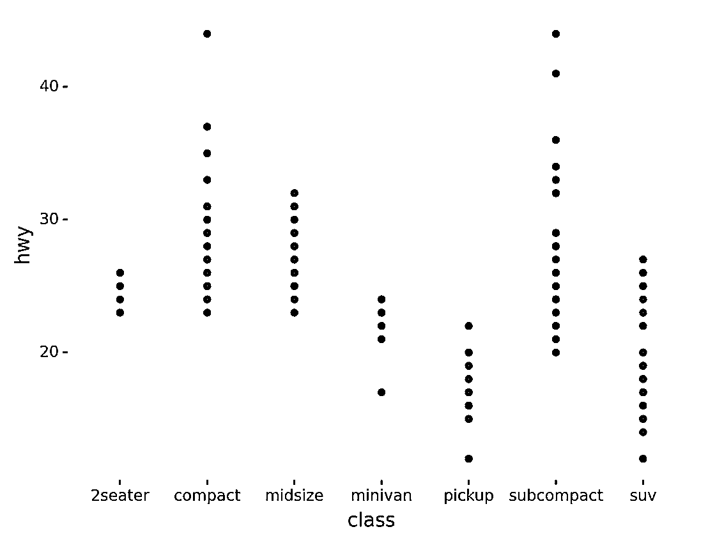](https://files.realpython.com/media/out.c5d0061c249c.png)

如您所见，生成的数据可视化对于数据集中的每辆车都有一个点。轴显示车辆等级和公路燃油经济性。

还有许多其他几何对象可用于可视化同一数据集。例如，下面的代码使用 bar 几何对象来显示每个类的车辆数:

```py
from plotnine.data import mpg
from plotnine import ggplot, aes, geom_bar

ggplot(mpg) + aes(x="class") + geom_bar()
```

在这里，`geom_bar()`将几何对象设置为条形。由于代码没有为 y 轴指定任何属性，`geom_bar()`隐式地按照用于 x 轴的属性对数据点进行分组，然后使用 y 轴的每个组中的点数。

运行代码，您将看到以下输出:

[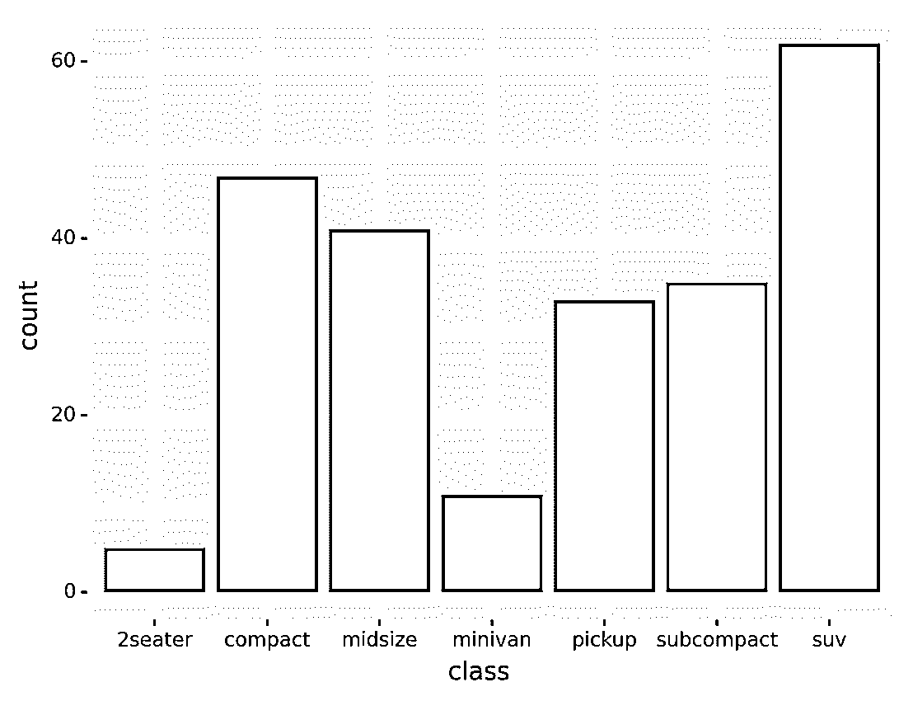](https://files.realpython.com/media/out.289239291260.png)

图中每个条形的高度代表属于相应车辆类别的车辆数量。在后面的章节中，您将了解更多关于数据聚合和分组的内容。

在本节中，您了解了创建数据可视化时必须指定的三个必备组件:

1.  数据
2.  美学
3.  几何对象

您还学习了如何使用`+`操作符组合它们。

在接下来的几节中，您将了解一些可选组件，它们可以用来创建更复杂、更漂亮的图形。

[*Remove ads*](/account/join/)

## 使用额外的 Python 和`ggplot`特性来增强数据可视化

在本节中，您将了解在使用 plotnine 构建数据可视化时可以使用的可选组件。这些组件可以分为五类:

1.  统计变换
2.  天平
3.  坐标系统
4.  面状
5.  主题

你可以用它们来创造更丰富、更美好的情节。

### 统计转换:汇总和转换您的数据

统计转换在绘制数据之前对其进行一些计算，例如显示一些统计指标而不是原始数据。plotnine 包括几个你可以使用的统计转换。

假设您想要创建一个**直方图**来显示从 1875 年到 1975 年[休伦湖](https://en.wikipedia.org/wiki/Lake_Huron)的水位分布。该数据集包含在 plotnine 中。您可以使用以下代码检查 Jupyter Notebook 中的数据集并了解其格式:

```py
# Import our example dataset with the levels of Lake Huron 1875–1975
from plotnine.data import huron

huron
```

代码导入并显示数据集，产生以下输出:

```py
 year  level   decade
0   1875  580.38  1870
1   1876  581.86  1870
...
96  1971  579.89  1970
97  1972  579.96  1970
```

如您所见，数据集包含三列:

1.  `year`
2.  `level`
3.  `decade`

现在，您可以分两步构建直方图:

1.  将液位测量值分组到箱中。
2.  使用条形图显示每个箱中的测量数量。

以下代码显示了如何在 plotnine 中完成这些步骤:

```py
from plotnine.data import huron
from plotnine import ggplot, aes, stat_bin, geom_bar

ggplot(huron) + aes(x="level") + stat_bin(bins=10) + geom_bar()
```

在上面的代码中，`stat_bin()`将`level`的范围分成十个大小相等的区间。然后，使用条形图绘制落入每个箱中的测量值的数量。

运行该代码会生成下图:

[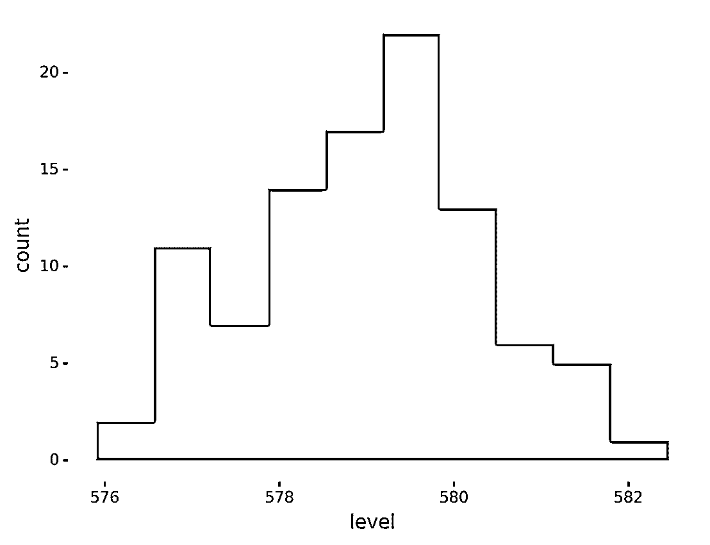](https://files.realpython.com/media/out.75fe06db7321.png)

该图显示了每个湖泊水位范围的测量次数。正如你所看到的，大部分时间水平在`578`和`580`之间。

对于大多数常见的任务，如构建直方图，plotnine 包括非常方便的函数，使代码更加简洁。例如，使用`geom_histogram()`，您可以像这样构建上面的直方图:

```py
from plotnine.data import huron
from plotnine import ggplot, aes, geom_histogram

ggplot(huron) + aes(x="level") + geom_histogram(bins=10)
```

使用`geom_histogram()`与使用`stats_bin()`然后使用`geom_bar()`是一样的。运行这段代码会生成与上面相同的图形。

现在让我们来看另一个统计转换的例子。**箱线图**是一种非常流行的统计工具，用于显示数据集中的最小值、最大值、样本中值、第一个和第三个四分位数以及异常值。

假设您想要基于相同的数据集构建可视化，以显示每十年的液位测量值的箱线图。您可以分两步构建该图:

1.  将测量值按十进制分组。
2.  为每个组创建一个箱线图。

您可以使用美学规范中的 **`factor()`** 完成第一步。`factor()`将指定属性具有相同值的所有数据点组合在一起。

然后，一旦你将数据按十年分组，你就可以用`geom_boxplot()`为每一组画一个方框图。

以下代码使用上述步骤创建一个图:

```py
from plotnine.data import huron
from plotnine import ggplot, aes, geom_boxplot

(
  ggplot(huron)
  + aes(x="factor(decade)", y="level")
  + geom_boxplot()
)
```

代码使用`factor()`按十进制对数据行进行分组，然后使用`geom_boxplot()`创建盒状图。

正如您在前面的示例中看到的，一些几何对象具有隐式统计变换。这真的很方便，因为它使你的代码更加简洁。使用`geom_boxplot()`意味着`stat_boxplot()`，它负责计算四分位数和异常值。

运行上述代码，您将获得下图:

[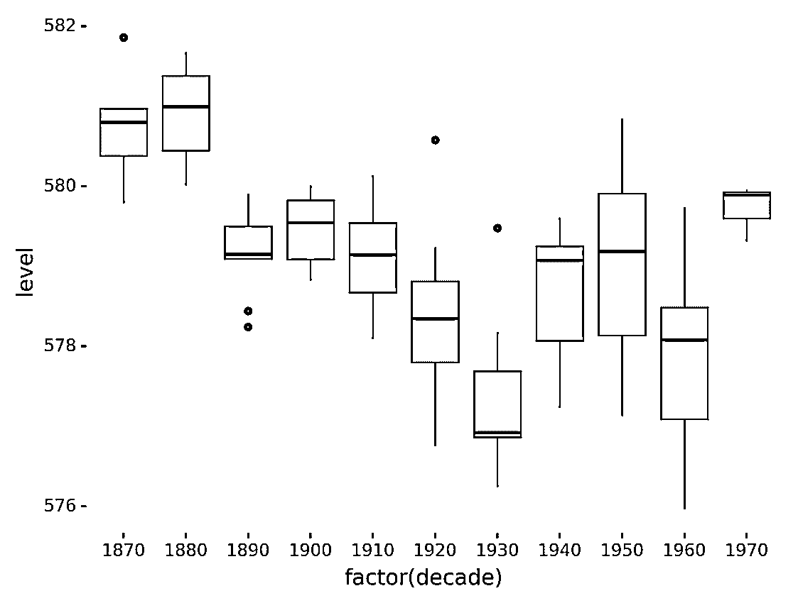](https://files.realpython.com/media/out.8bb67d6a085b.png)

该图使用箱线图显示了每十年的水位分布。

使用 Python 中的`ggplot`,还可以使用其他统计转换来构建数据可视化。你可以在 [plotnine 的 stats API 文档](https://plotnine.readthedocs.io/en/stable/api.html#stats)中了解它们。

[*Remove ads*](/account/join/)

### 标度:根据其含义改变数据标度

在从数据到美学的映射过程中，比例是您可以应用的另一种转换。它们有助于让你的可视化更容易理解。

在本教程开始时，您看到了一个显示自 1970 年以来每年人口的图。以下代码显示了如何使用刻度来显示自 1970 年以来经过的年份，而不是原始日期:

```py
from plotnine.data import economics
from plotnine import ggplot, aes, scale_x_timedelta, labs, geom_line

(
    ggplot(economics)
    + aes(x="date", y="pop")
    + scale_x_timedelta(name="Years since 1970")
    + labs(title="Population Evolution", y="Population")
    + geom_line()
)
```

使用`scale_x_timedelta()`通过计算每个点与数据集中最早日期的差异来转换每个点的 x 值。注意，代码还使用`labs()`为 y 轴和标题设置了一个更具描述性的标签。

运行代码显示了这个图:

[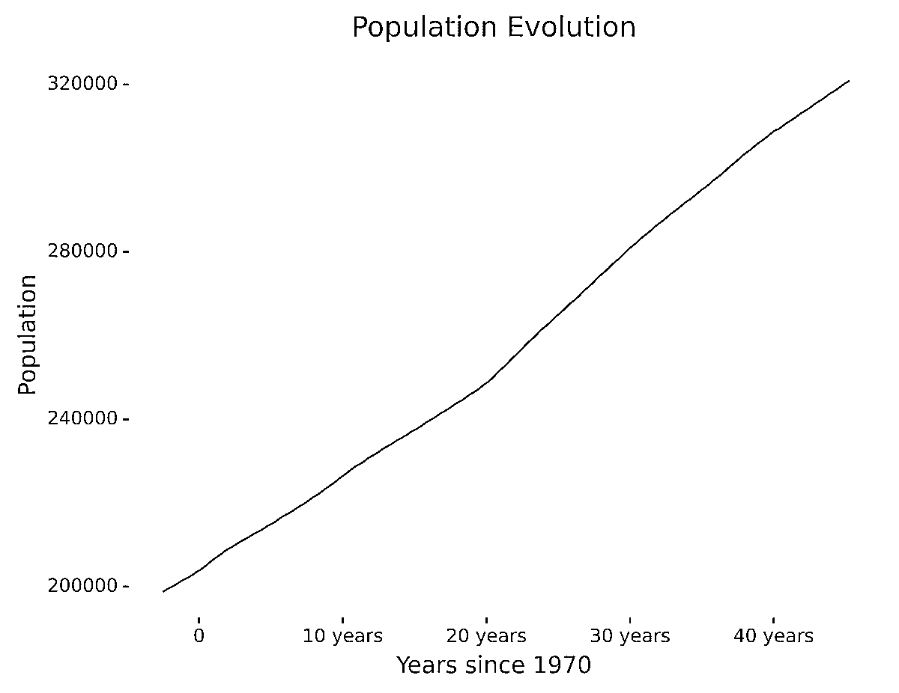](https://files.realpython.com/media/p.f9ea35893ea1.png)

在不改变数据的情况下，您已经使可视化更容易理解，对读者更友好。如您所见，该图现在有了更好的描述，x 轴显示了自 1970 年以来经过的时间，而不是日期。

plotnine 提供了大量的标度变换供您选择，包括对数标度和其他非线性标度。你可以在 [plotnine 的 scales API 参考](https://plotnine.readthedocs.io/en/stable/api.html#scales)中了解它们。

### 坐标系:将数据值映射到 2D 空间

坐标系定义了如何将数据点映射到图中的 2D 图形位置。你可以把它想象成从数学变量到图形位置的映射。选择正确的坐标系可以提高数据可视化的可读性。

让我们重温一下之前的条形图示例，以计算属于不同类别的车辆。您使用以下代码创建了该图:

```py
from plotnine.data import mpg
from plotnine import ggplot, aes, geom_bar

ggplot(mpg) + aes(x="class") + geom_bar()
```

代码使用`geom_bar()`为每个车辆类别绘制一个条形。因为没有设置特定的坐标系，所以使用默认坐标系。

运行代码会生成以下图形:

[](https://files.realpython.com/media/out.289239291260.png)

图中每个条形的高度代表一类车辆的数量。

虽然上图没有问题，但是同样的信息可以通过翻转坐标轴以显示水平条而不是垂直条来更好地可视化。

plotnine 提供了几个允许您修改坐标系的功能。您可以使用`coord_flip()`翻转轴:

```py
from plotnine.data import mpg
from plotnine import ggplot, aes, geom_bar, coord_flip

ggplot(mpg) + aes(x="class") + geom_bar() + coord_flip()
```

代码使用`coord_flip()`翻转 x 轴和 y 轴。运行代码，您将看到下图:

[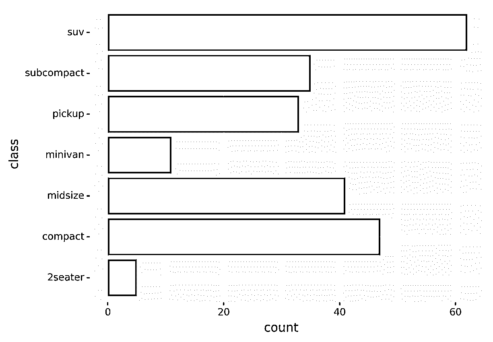](https://files.realpython.com/media/out.05725fd5dbf8.png)

此图显示了您在之前的图中看到的相同信息，但是通过翻转轴，您可能会发现更容易理解和比较不同的条形图。

哪个坐标系更好没有硬性规定。您应该选择最适合您的问题和数据的方法。给他们一个机会，做一些实验来了解每种情况下的工作原理。你可以在 [plotnine 的坐标 API 参考](https://plotnine.readthedocs.io/en/stable/api.html#coordinates)中找到更多关于其他坐标系的信息。

[*Remove ads*](/account/join/)

### 面:将数据子集绘制到同一个图中的面板上

在这一节中，你将了解到 **facets** ，plotnine 最酷的特性之一。刻面允许您按某些属性对数据进行分组，然后在同一图像中单独绘制每个组。当您想要在同一个图形中显示两个以上的变量时，这尤其有用。

例如，假设您想要获取燃油经济性数据集(`mpg`)并构建一个图表，显示每种发动机规格(`displacement`)每种车辆类别每年的每加仑英里数。在这种情况下，您的绘图需要显示来自四个变量的信息:

1.  **`hwy`** :每加仑英里数
2.  **`displ`** :发动机尺寸
3.  **`class`** :车辆类
4.  **`year`** :年款

这是一个挑战，因为你有比图形尺寸更多的变量。如果你必须显示三个变量，你可以使用 3D 透视图，但是四维图形甚至难以想象。

面对这个问题，你可以用一个两步走的技巧:

1.  首先将数据分成组，其中一个组中的所有数据点共享某些属性的相同值。

2.  单独绘制每个组，仅显示分组中未使用的属性。

回到这个例子，您可以按类别和年份对车辆进行分组，然后绘制每组的图表以显示排量和每加仑英里数。以下可视化是使用这种技术生成的:

[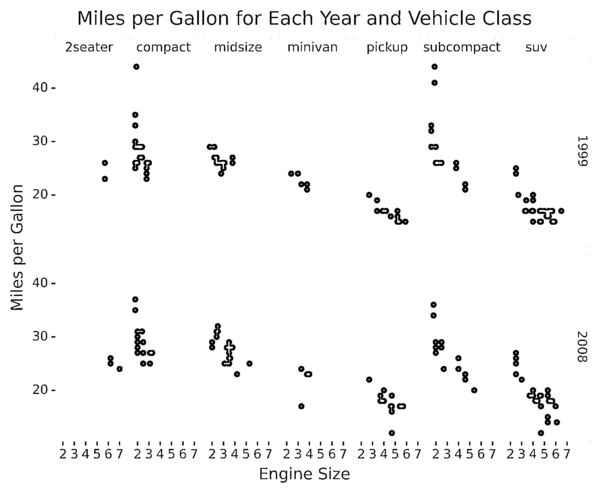](https://files.realpython.com/media/p.932e2cb71bd8.png)

如上图所示，每个组都有一个**面板**。每个面板显示属于该车辆类别和年份的不同发动机排量的每加仑英里数。

该数据可视化是使用以下代码生成的:

```py
from plotnine.data import mpg
from plotnine import ggplot, aes, facet_grid, labs, geom_point

(
    ggplot(mpg)
    + facet_grid(facets="year~class")
    + aes(x="displ", y="hwy")
    + labs(
        x="Engine Size",
        y="Miles per Gallon",
        title="Miles per Gallon for Each Year and Vehicle Class",
    )
    + geom_point()
)
```

代码使用`facet_grid()`按年份和车辆类别对数据进行分区，并向其传递用于使用`facets="year~class"`进行分区的属性。对于每个数据分区，这个图是使用您在前面章节中看到的组件构建的，比如美学、几何对象和`labs()`。

`facet_grid()`在网格中显示分区，对行使用一个属性，对列使用另一个属性。plotnine 提供了其他分面方法，您可以使用两个以上的属性对数据进行分区。你可以在 [plotnine 的 facets API 参考](https://plotnine.readthedocs.io/en/stable/api.html#facets)中了解更多。

### 主题:改善你的视觉效果

另一个改善数据可视化表示的好方法是选择一个非默认主题来突出您的绘图，使它们更漂亮、更有活力。

plotnine 包括几个主题，你可以从中挑选。以下代码生成了与您在上一节中看到的图形相同的图形，但是使用了深色主题:

```py
from plotnine.data import mpg
from plotnine import ggplot, aes, facet_grid, labs, geom_point, theme_dark

(
    ggplot(mpg)
    + facet_grid(facets="year~class")
    + aes(x="displ", y="hwy")
    + labs(
        x="Engine Size",
        y="Miles per Gallon",
        title="Miles per Gallon for Each Year and Vehicle Class",
    )
    + geom_point()
    + theme_dark()
)
```

在上面的代码中，指定`theme_dark()`告诉 plotnine 使用深色主题绘制绘图。下面是这段代码生成的图形:

[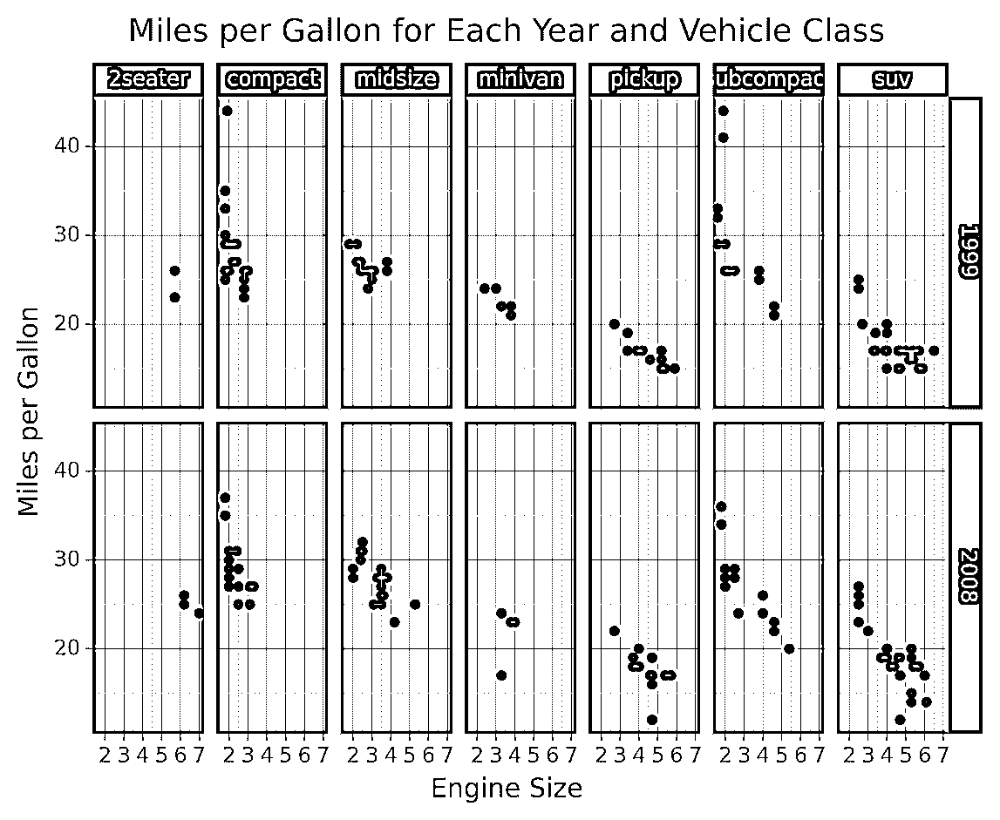](https://files.realpython.com/media/p.b7357b288a35.png)

正如您在图像中看到的，设置主题会影响颜色、字体和形状样式。

是另一个值得一提的主题，因为它给你一个非常酷的漫画般的外观。它让你的数据可视化看起来像 [xkcd 漫画](https://xkcd.com/):

[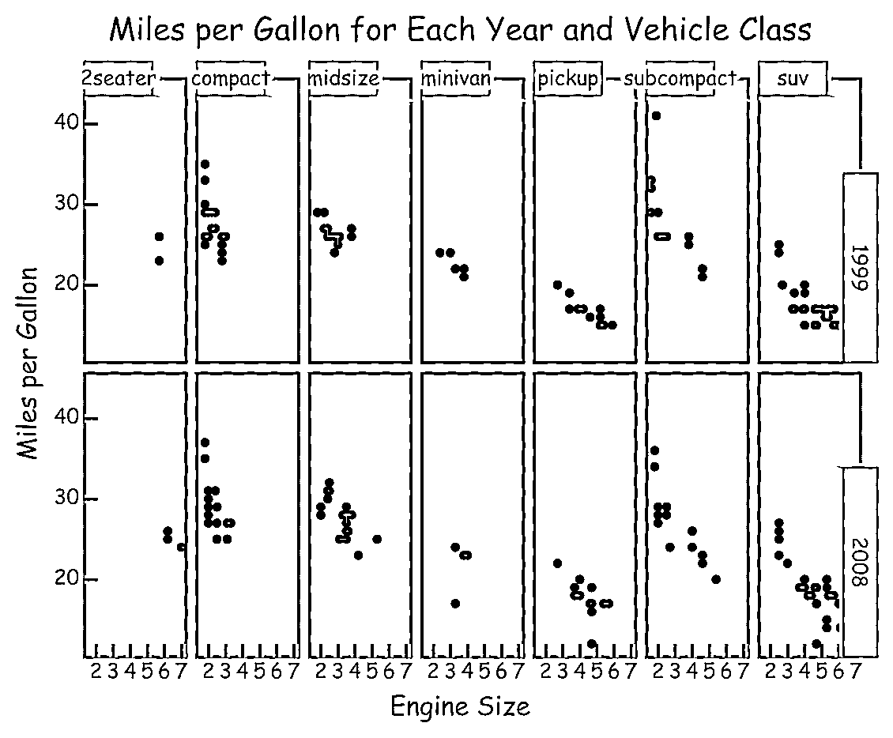](https://files.realpython.com/media/p.a892c8f63455.png)

选择合适的主题可以帮助你吸引并留住观众的注意力。你可以在 [plotnine 的主题 API 参考](https://plotnine.readthedocs.io/en/stable/api.html#themes)中看到可用主题的列表。

在前面的章节中，您已经了解了图形语法最重要的方面，以及如何使用 plotnine 构建数据可视化。在 Python 中使用`ggplot`可以让你逐步构建可视化**，首先关注你的数据，然后添加和调整组件来改善它的图形表示。*

*在下一节中，您将学习如何使用颜色以及如何导出可视化效果。

[*Remove ads*](/account/join/)

## 可视化多维数据

正如您在关于方面的部分中看到的，显示具有两个以上变量的数据存在一些挑战。在本节中，您将学习如何同时显示三个变量，使用颜色来表示值。

例如，回到燃油经济性数据集(`mpg`)，假设您想要可视化发动机气缸数和燃油效率之间的关系，但是您还想要在同一个图中包括关于车辆类别的信息。

作为刻面的替代方法，您可以使用颜色来表示第三个变量的值。为了实现这一点，您必须将发动机气缸数映射到 x 轴，将每加仑英里数映射到 y 轴，然后使用不同的颜色来表示车辆类别。

以下代码创建了所描述的数据可视化:

```py
from plotnine.data import mpg
from plotnine import ggplot, aes, labs, geom_point

(
    ggplot(mpg)
    + aes(x="cyl", y="hwy", color="class")
    + labs(
        x="Engine Cylinders",
        y="Miles per Gallon",
        color="Vehicle Class",
        title="Miles per Gallon for Engine Cylinders and Vehicle Classes",
    )
    + geom_point()
)
```

通过在美学定义中传递`color="class"`，车辆类别被映射到图形颜色。

运行代码会显示以下图形:

[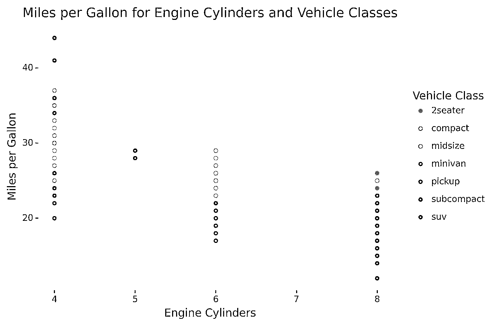](https://files.realpython.com/media/p.945c7fd363d4.png)

如您所见，根据车辆所属的类别，这些点具有不同的颜色。

在本节中，您学习了使用 Python 中的`ggplot`在图形中显示两个以上变量的另一种方法。当您有三个变量时，您应该根据哪种方法使数据可视化更容易理解，在使用面和颜色之间进行选择。

## 将图导出到文件

在某些情况下，您需要以编程方式将生成的图保存到图像文件中，而不是在 Jupyter Notebook 中显示它们。

plotnine 提供了一个非常方便的`save()`方法，您可以使用该方法将绘图导出为图像并保存到文件中。例如，下一段代码显示了如何将本教程开始时看到的图形保存到名为`myplot.png`的文件中:

```py
from plotnine.data import economics
from plotnine import ggplot, aes, geom_line

myPlot = ggplot(economics) + aes(x="date", y="pop") + geom_line()
myPlot.save("myplot.png", dpi=600)
```

在这段代码中，您将数据可视化对象存储在`myPlot`中，然后调用`save()`将图形导出为图像并存储为`myplot.png`。

使用`save()`时，您可以调整一些图像设置，例如每英寸图像点数(`dpi`)。当您需要在演示文稿或文章中包含高质量的图像时，这非常有用。

plotnine 还包括一个在单个 [PDF 文件](https://realpython.com/creating-modifying-pdf/)中保存各种图的方法。你可以了解它，并在 [plotnine 的 save_as_pdf_pages 文档](https://plotnine.readthedocs.io/en/stable/generated/plotnine.ggplot.save_as_pdf_pages.html#plotnine.ggplot.save_as_pdf_pages)中看到一些很酷的例子。

能够导出您的数据可视化打开了许多可能性。您不仅可以在交互式 Jupyter Notebook 中查看数据，还可以生成图形并将其导出以供以后分析或处理。

## 结论

在 Python 中使用`ggplot`允许您以非常简洁和一致的方式构建数据可视化。如您所见，使用 plotnine，只需几行代码就可以制作出复杂而美丽的情节。

**在本教程中，您已经学会了如何:**

*   安装 **plotnine** 和 **Jupyter 笔记本**
*   组合图形的**语法的不同元素**
*   使用 plotnine 以高效一致的方式**创建可视化效果**
*   **将**您的数据可视化导出到文件中

本教程使用 plotnine 中包含的示例数据集，但是您可以使用所学的任何内容从任何其他数据创建可视化。要了解如何将您的数据加载到 pandas data frames(plot nine 使用的数据结构)中，请使用 Pandas 和 Python 查看您的数据集。

最后，看看 [plotnine 的文档](https://plotnine.readthedocs.io/en/stable/index.html#)继续你的 Python 之旅`ggplot`，也可以访问 [plotnine 的画廊](https://plotnine.readthedocs.io/en/stable/gallery.html)获得更多的想法和灵感。

还有其他值得一提的 Python 数据可视化包，比如 [Altair](https://altair-viz.github.io/) 和 [HoloViews](http://holoviews.org/) 。在为您的下一个项目选择工具之前，看一看它们。然后使用你所学的一切来构建一些惊人的数据可视化，帮助你和其他人更好地理解数据！

*立即观看**本教程有真实 Python 团队创建的相关视频课程。配合文字教程一起看，加深理解: [**用 Python 和 ggplot**](/courses/graph-data-with-python-and-ggplot/) 绘制你的数据************