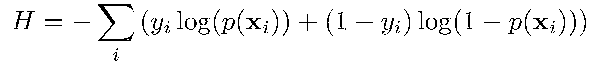
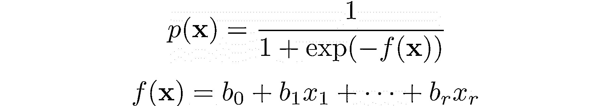
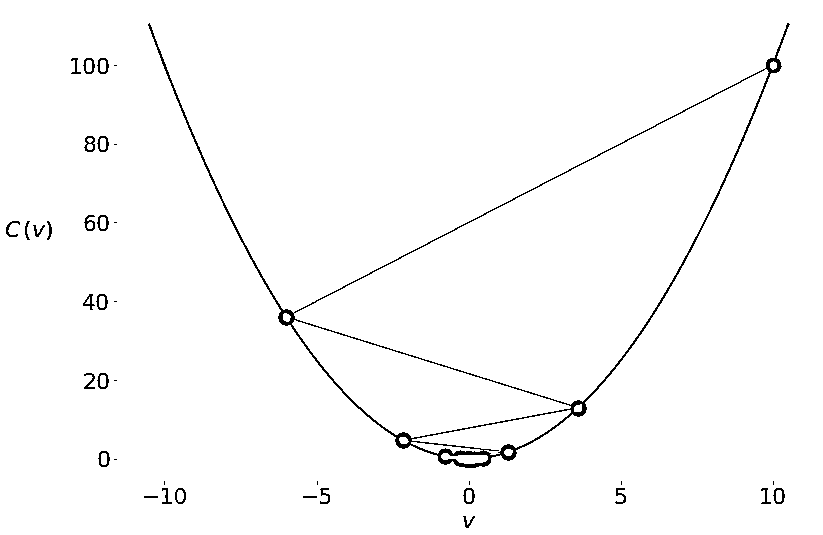
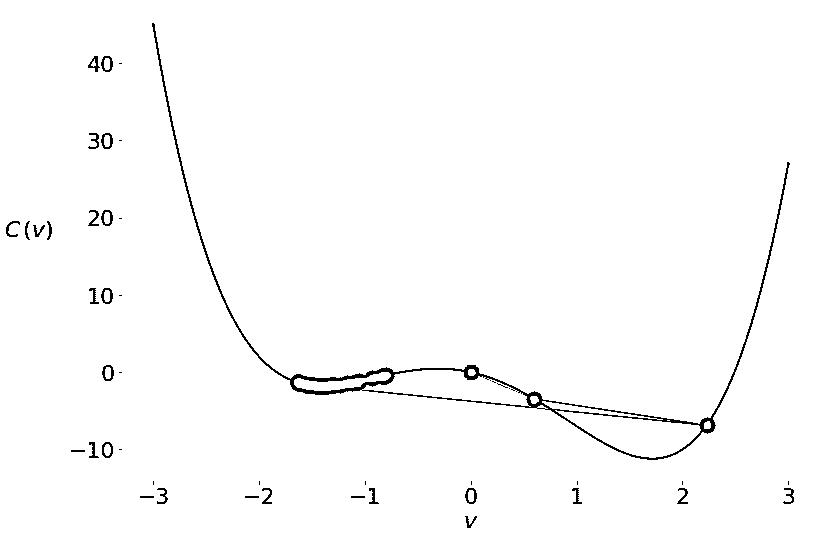
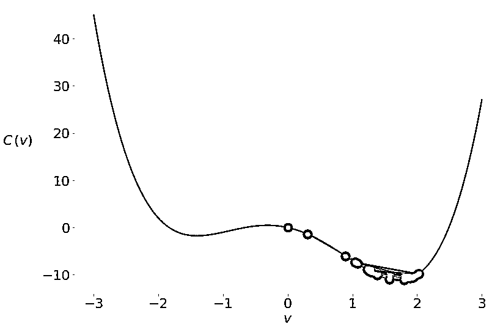

# 基于 Python 和 NumPy 的随机梯度下降算法

> 原文：<https://realpython.com/gradient-descent-algorithm-python/>

[**随机梯度下降**](https://en.wikipedia.org/wiki/Stochastic_gradient_descent) 是一种优化算法，常用于机器学习应用中，以找到对应于预测和实际输出之间最佳拟合的模型参数。这是一种不精确但强大的技术。

随机梯度下降广泛用于机器学习应用中。结合[反向传播](https://brilliant.org/wiki/backpropagation/)，在[神经网络](https://realpython.com/python-keras-text-classification/#a-primer-on-deep-neural-networks)训练应用中占主导地位。

在本教程中，您将学习:

*   **梯度下降**和**随机梯度下降**算法如何工作
*   如何将梯度下降和随机梯度下降应用于**最小化机器学习中的损失函数**
*   什么是**学习率**，为什么它很重要，以及它如何影响结果
*   如何**为随机梯度下降写自己的函数**

**免费奖励:** [掌握 Python 的 5 个想法](https://realpython.com/bonus/python-mastery-course/)，这是一个面向 Python 开发者的免费课程，向您展示将 Python 技能提升到下一个水平所需的路线图和心态。

## 基本梯度下降算法

[梯度下降算法](https://en.wikipedia.org/wiki/Gradient_descent)是[数学优化](https://en.wikipedia.org/wiki/Mathematical_optimization)的一种近似迭代方法。你可以用它来逼近任何一个[可微函数](https://en.wikipedia.org/wiki/Differentiable_function)的最小值。

**注:**数学规划有很多优化方法和[子领域。如果你想学习如何在 Python 中使用它们中的一些，那么看看](https://en.wikipedia.org/wiki/Mathematical_optimization#Major_subfields)[科学 Python:使用 SciPy 进行优化](https://realpython.com/python-scipy-cluster-optimize/)和[动手线性编程:用 Python 进行优化](https://realpython.com/linear-programming-python/)。

虽然梯度下降有时会陷入局部最小值或 T2 鞍点，而不是找到全局最小值，但它在实践中被广泛使用。[数据科学](https://realpython.com/learning-paths/data-science-python-core-skills/)和[机器学习](https://realpython.com/learning-paths/machine-learning-python/)方法经常在内部应用它来优化模型参数。例如，神经网络通过梯度下降找到[权重和偏差](https://docs.paperspace.com/machine-learning/wiki/weights-and-biases)。

[*Remove ads*](/account/join/)

### 成本函数:优化的目标

**成本函数**或[损失函数](https://en.wikipedia.org/wiki/Loss_function)，是通过改变决策变量来最小化(或最大化)的函数。许多机器学习方法在表面下解决优化问题。他们倾向于通过调整模型参数(如[神经网络](https://en.wikipedia.org/wiki/Artificial_neural_network)的权重和偏差、[随机森林](https://en.wikipedia.org/wiki/Random_forest)或[梯度推进](https://en.wikipedia.org/wiki/Gradient_boosting)的决策规则等)来最小化实际和预测输出之间的差异。

在一个[回归问题](https://realpython.com/linear-regression-in-python/#regression)中，你通常有输入变量𝐱 = (𝑥₁，…，𝑥ᵣ)和实际输出𝑦.的向量您希望找到一个模型，将𝐱映射到预测响应𝑓(𝐱，以便𝑓(𝐱尽可能接近𝑦.例如，您可能希望在给定输入(如某人在公司的年数或受教育程度)的情况下预测一个输出(如某人的工资)。

您的目标是最小化预测𝑓(𝐱和实际数据𝑦.之间的差异这个差值称为**残差**。

在这种类型的问题中，您希望最小化所有观测值的[残差平方和(SSR)](https://en.wikipedia.org/wiki/Residual_sum_of_squares) ，其中 SSR =σᵢ(𝑦ᵢ𝑓(𝐱ᵢ)】𝑖= 1，…，𝑛，其中𝑛是观测值的总数。或者，你可以使用[均方误差](https://en.wikipedia.org/wiki/Mean_squared_error) (MSE = SSR / 𝑛)来代替 SSR。

SSR 和 MSE 都使用实际输出和预测输出之差的平方。差异越小，预测就越准确。差值为零表示预测值等于实际数据。

通过调整模型参数来最小化 SSR 或 MSE。比如在[线性回归](https://realpython.com/linear-regression-in-python/)中，你想求函数𝑓(𝐱) = 𝑏₀ + 𝑏₁𝑥₁ + ⋯ + 𝑏ᵣ𝑥ᵣ，那么你需要确定使 SSR 或 MSE 最小化的权重𝑏₀，𝑏₁，…，𝑏ᵣ。

在[分类问题](https://realpython.com/logistic-regression-python/#classification)中，输出𝑦是[分类的](https://en.wikipedia.org/wiki/Categorical_variable)，通常为 0 或 1。例如，您可能试图预测一封电子邮件是否是垃圾邮件。在二进制输出的情况下，最小化[交叉熵函数](https://en.wikipedia.org/wiki/Cross_entropy)是方便的，它也取决于实际输出𝑦ᵢ和相应的预测𝑝(𝐱ᵢ):

[](https://files.realpython.com/media/mmst-gda-eqs-1.119ab87cc186.png)

在经常用于解决分类问题的[逻辑回归](https://realpython.com/logistic-regression-python/)中，函数𝑝(𝐱和𝑓(𝐱定义如下:

[](https://files.realpython.com/media/mmst-gda-eqs-2.76aa15da2cc0.png)

同样，你需要找到权重𝑏₀，𝑏₁，…，𝑏ᵣ，但这一次他们应该最小化交叉熵函数。

### 函数的梯度:微积分复习器

在微积分中，一个函数的[导数](https://www.mathsisfun.com/calculus/derivatives-introduction.html)显示了当你修改它的参数(或多个参数)时，一个值改变了多少。导数对于优化很重要，因为[零导数](http://sofia.nmsu.edu/~breakingaway/ebookofcalculus/MeaningOfDerivativesAndIntegrals/WhatDoesItMeanThatTheDerivativeOfAFunctionEquals0/WhatDoesItMeanThatTheDerivativeOfAFunctionEquals0.html)可能表示最小值、最大值或鞍点。

多个自变量的函数𝐶的[梯度](https://en.wikipedia.org/wiki/Gradient)𝑣₁，…，𝑣ᵣ用∇𝐶(𝑣₁，…，𝑣ᵣ表示)定义为𝐶的[偏导数](https://en.wikipedia.org/wiki/Partial_derivative)相对于每个自变量的向量函数:∇𝐶 = (∂𝐶/∂𝑣₁，…，≈3/3)。∇这个符号叫做[纳布拉](https://en.wikipedia.org/wiki/Nabla_symbol)。

函数𝐶在给定点的梯度的非零值定义了𝐶.最快增长的方向和速率使用梯度下降时，您会对成本函数中最快的*下降*的方向感兴趣。这个方向由负梯度−∇𝐶.决定

### 梯度下降背后的直觉

为了理解梯度下降算法，想象一滴水从碗的侧面滑下或者一个球从山上滚下。水滴和球趋向于向下降最快的方向运动，直到它们到达底部。随着时间的推移，他们会获得动力并加速前进。

梯度下降背后的思想是类似的:你从一个任意选择的点或向量𝐯 = (𝑣₁，…，𝑣ᵣ)的位置开始，并在成本函数下降最快的方向上迭代移动它。如前所述，这是负梯度矢量−∇𝐶.的方向

一旦你有了一个随机的起点𝐯 = (𝑣₁，…，𝑣ᵣ)，你**更新**它，或者把它移到负梯度方向的一个新位置:𝐯→𝐯𝜂∇𝐶，其中𝜂(读作“ee-tah”)是一个小的正值，叫做**学习率**。

学习率决定了更新或移动步长的大小。这是一个非常重要的参数。如果𝜂太小，那么算法可能收敛得非常慢。大的𝜂值还会导致收敛问题或使算法发散。

[*Remove ads*](/account/join/)

### 基本梯度下降的实现

现在您已经知道了基本的梯度下降是如何工作的，您可以用 Python 实现它了。您将只使用普通 Python 和 [NumPy](https://numpy.org/) ，这使您能够在处理数组(或向量)时编写[简明代码](https://realpython.com/numpy-array-programming/)，并获得[性能提升](https://realpython.com/numpy-tensorflow-performance/)。

这是该算法的一个基本实现，从任意点`start`开始，迭代地将它移向最小值，[返回](https://realpython.com/python-return-statement/)一个有希望达到或接近最小值的点:

```py
 1def gradient_descent(gradient, start, learn_rate, n_iter):
 2    vector = start
 3    for _ in range(n_iter):
 4        diff = -learn_rate * gradient(vector)
 5        vector += diff
 6    return vector
```

`gradient_descent()`需要四个参数:

1.  **`gradient`** 是[函数](https://realpython.com/defining-your-own-python-function/)或任何 Python [可调用对象](https://docs.python.org/3/reference/datamodel.html#emulating-callable-objects)，它接受一个向量并返回你试图最小化的函数的梯度。
2.  **`start`** 是算法开始搜索的点，以序列([元组、列表](https://realpython.com/python-lists-tuples/)、 [NumPy 数组](https://numpy.org/doc/stable/reference/generated/numpy.ndarray.html)等)或标量(在一维问题的情况下)的形式给出。
3.  **`learn_rate`** 是控制向量更新幅度的学习速率。
4.  **`n_iter`** 是迭代的次数。

这个函数的功能与上面中描述的[完全相同:它取一个起点(第 2 行)，根据学习率和梯度值迭代更新它(第 3 到 5 行)，最后返回找到的最后一个位置。](#intuition-behind-gradient-descent)

在应用`gradient_descent()`之前，您可以添加另一个终止标准:

```py
 1import numpy as np 2
 3def gradient_descent(
 4    gradient, start, learn_rate, n_iter=50, tolerance=1e-06 5):
 6    vector = start
 7    for _ in range(n_iter):
 8        diff = -learn_rate * gradient(vector)
 9        if np.all(np.abs(diff) <= tolerance): 10            break 11        vector += diff
12    return vector
```

现在您有了额外的参数`tolerance`(第 4 行)，它指定了每次迭代中允许的最小移动。您还定义了`tolerance`和`n_iter`的默认值，因此您不必在每次调用`gradient_descent()`时都指定它们。

如果当前迭代中的向量更新小于或等于`tolerance`，第 9 行和第 10 行使`gradient_descent()`能够停止迭代并在到达`n_iter`之前返回结果。这通常发生在最小值附近，这里的梯度通常很小。不幸的是，它也可能发生在局部最小值或鞍点附近。

第 9 行使用方便的 NumPy 函数 [`numpy.all()`](https://numpy.org/doc/stable/reference/generated/numpy.all.html) 和 [`numpy.abs()`](https://numpy.org/doc/stable/reference/generated/numpy.absolute.html) 在一条语句中比较`diff`和`tolerance`的[绝对值](https://realpython.com/python-absolute-value)。这就是为什么你在 1 号线上的`import numpy`。

现在你已经有了第一个版本的`gradient_descent()`，是时候测试你的功能了。你将从一个小例子开始，找到函数 [𝐶 = 𝑣](https://www.wolframalpha.com/input/?i=v**2) 的最小值。

这个函数只有一个自变量(𝑣)，它的梯度是导数 2𝑣.这是一个可微的[凸函数](https://en.wikipedia.org/wiki/Convex_function)，寻找其最小值的分析方法很简单。然而，在实践中，解析微分可能是困难的，甚至是不可能的，并且通常用[数值方法](https://en.wikipedia.org/wiki/Numerical_method)来近似。

您只需要一条语句来测试您的梯度下降实现:

>>>

```py
>>> gradient_descent(
...     gradient=lambda v: 2 * v, start=10.0, learn_rate=0.2
... )
2.210739197207331e-06
```

你使用[λ函数](https://realpython.com/python-lambda/) `lambda v: 2 * v`来提供𝑣的梯度。您从值`10.0`开始，并将学习率设置为`0.2`。你会得到一个非常接近于零的结果，这是正确的最小值。

下图显示了解决方案在迭代过程中的移动:

[](https://files.realpython.com/media/gd-1.25c5ef2aed4e.png)

你从最右边的绿点(𝑣 = 10)开始，向最小值(𝑣 = 0)移动。因为梯度(和斜率)的值较高，所以更新一开始较大。当你接近最小值时，它们变得更低。

[*Remove ads*](/account/join/)

### 学习率影响

学习率是算法的一个非常重要的参数。不同的学习率值会显著影响梯度下降的行为。考虑前面的例子，但是学习率是 0.8 而不是 0.2:

>>>

```py
>>> gradient_descent(
...     gradient=lambda v: 2 * v, start=10.0, learn_rate=0.8
... )
-4.77519666596786e-07
```

你会得到另一个非常接近于零的解，但是算法的内部行为是不同的。这就是𝑣的价值在迭代中发生的情况:

[](https://files.realpython.com/media/gd-3.ff9f92989807.png)

在这种情况下，您再次从𝑣 = 10 开始，但是由于学习率较高，𝑣发生了很大的变化，转到了最佳值的另一侧，变成了 6。在稳定在零点附近之前，它还会越过零点几次。

小的学习率会导致收敛速度非常慢。如果迭代次数有限，则算法可能会在找到最小值之前返回。否则，整个过程可能会花费不可接受的大量时间。为了说明这一点，再次运行`gradient_descent()`,这一次学习率小得多，为 0.005:

>>>

```py
>>> gradient_descent(
...     gradient=lambda v: 2 * v, start=10.0, learn_rate=0.005
... )
6.050060671375367
```

现在的结果是`6.05`，它离真正的最小值零很远。这是因为由于学习率小，向量的变化非常小:

[](https://files.realpython.com/media/gd-4.9a5c436570fd.png)

像以前一样，搜索过程从𝑣 = 10 开始，但是它不能在五十次迭代中到达零。然而，经过 100 次迭代，误差会小得多，经过 1000 次迭代，误差会非常接近于零:

>>>

```py
>>> gradient_descent(
...     gradient=lambda v: 2 * v, start=10.0, learn_rate=0.005,
...     n_iter=100
... )
3.660323412732294
>>> gradient_descent(
...     gradient=lambda v: 2 * v, start=10.0, learn_rate=0.005,
...     n_iter=1000
... )
0.0004317124741065828
>>> gradient_descent(
...     gradient=lambda v: 2 * v, start=10.0, learn_rate=0.005,
...     n_iter=2000
... )
9.952518849647663e-05
```

非凸函数可能有局部极小值或鞍点，算法可能会陷入其中。在这种情况下，您对学习速率或起点的选择可以决定找到局部最小值还是找到全局最小值。

考虑函数 [𝑣⁴ - 5𝑣 - 3𝑣](https://www.wolframalpha.com/input/?i=v**4+-+5+*+v**2+-+3+*+v) 。它在𝑣有一个全局最小值≈ 1.7，在𝑣有一个局部最小值≈1.42。这个函数的梯度是 4𝑣10𝑣3。让我们看看`gradient_descent()`在这里是如何工作的:

>>>

```py
>>> gradient_descent(
...     gradient=lambda v: 4 * v**3 - 10 * v - 3, start=0,
...     learn_rate=0.2
... )
-1.4207567437458342
```

你这次从零开始，算法在局部最小值附近结束。下面是引擎盖下发生的事情:

[](https://files.realpython.com/media/gd-7.67e03e9337db.png)

在前两次迭代中，你的向量向全局最小值移动，但之后它越过另一边，停留在局部最小值。你可以用较小的学习率来防止这种情况:

>>>

```py
>>> gradient_descent(
...     gradient=lambda v: 4 * v**3 - 10 * v - 3, start=0,
...     learn_rate=0.1
... )
1.285401330315467
```

当你将学习率从`0.2`降低到`0.1`时，你会得到一个非常接近全局最小值的解。记住梯度下降是一种近似的方法。这一次，你避免跳到另一边:

[](https://files.realpython.com/media/gd-8.f055cad0b634.png)

较低的学习率防止向量进行大的跳跃，在这种情况下，向量保持更接近全局最优。

调整学习速度是很棘手的。你无法预先知道最佳值。有许多技术和试探法试图对此有所帮助。此外，机器学习实践者经常在模型选择和评估期间调整学习率。

除了学习速度之外，起点也会显著影响解，尤其是对于非凸函数。

[*Remove ads*](/account/join/)

## 梯度下降算法的应用

在本节中，您将看到两个使用梯度下降的简短示例。您还将了解到它可以用于现实生活中的机器学习问题，如线性回归。在第二种情况下，您需要修改`gradient_descent()`的代码，因为您需要来自观察的数据来计算梯度。

### 简短示例

首先，您将把`gradient_descent()`应用于另一个一维问题。取函数[𝑣log(𝑣)](https://www.wolframalpha.com/input/?i=v+-+log%28v%29)。该函数的梯度为 1 1/𝑣.有了这些信息，你可以找到它的最小值:

>>>

```py
>>> gradient_descent(
...     gradient=lambda v: 1 - 1 / v, start=2.5, learn_rate=0.5
... )
1.0000011077232125
```

利用提供的一组参数，`gradient_descent()`正确地计算出该函数在𝑣 = 1 时具有最小值。你可以用学习率和起点的其他值来试试。

您也可以将`gradient_descent()`用于多个变量的函数。应用程序是相同的，但是您需要以向量或数组的形式提供渐变和起始点。例如，您可以找到具有梯度向量(2𝑣₁，4𝑣₂)的函数 [𝑣₁ + 𝑣₂⁴](https://www.wolframalpha.com/input/?i=v_1**2+%2B+v_2**4) 的最小值:

>>>

```py
>>> gradient_descent(
...     gradient=lambda v: np.array([2 * v[0], 4 * v[1]**3]),
...     start=np.array([1.0, 1.0]), learn_rate=0.2, tolerance=1e-08
... )
array([8.08281277e-12, 9.75207120e-02])
```

在这种情况下，你的梯度函数返回一个数组，开始值是一个数组，所以你得到一个数组作为结果。得到的值几乎等于零，所以你可以说`gradient_descent()`正确地发现了这个函数的最小值在𝑣₁ = 𝑣₂ = 0。

### 普通最小二乘法

正如你已经知道的，线性回归和普通最小二乘法从输入𝐱 = (𝑥₁，…，𝑥ᵣ)和输出𝑦.的观察值开始他们定义了一个线性函数𝑓(𝐱) = 𝑏₀ + 𝑏₁𝑥₁ + ⋯ + 𝑏ᵣ𝑥ᵣ，尽可能接近𝑦.

这是一个优化问题。它会找到最小化残差平方和 SSR =σᵢ(𝑦ᵢ𝑓(𝐱ᵢ)或均方误差 MSE = SSR / 𝑛.的权重值𝑏₀、𝑏₁、…、𝑏ᵣ这里，𝑛是观测值的总数，𝑖 = 1，…，𝑛.

也可以使用成本函数𝐶 = SSR / (2𝑛)，这在数学上比 SSR 或 MSE 更方便。

线性回归最基本的形式是[简单线性回归](https://realpython.com/linear-regression-in-python/#simple-linear-regression)。它只有一组输入𝑥和两个权重:𝑏₀和𝑏₁.回归线的方程是𝑓(𝑥) = 𝑏₀ + 𝑏₁𝑥.虽然𝑏₀和𝑏₁的最佳值可以通过分析计算得到，但是您将使用梯度下降法来确定它们。

首先，你需要微积分来寻找成本函数𝐶=σᵢ(𝑦ᵢ𝑏₀𝑏₁𝑥ᵢ)/(2𝑛).)的梯度因为你有两个决策变量，𝑏₀和𝑏₁，梯度∇𝐶是一个向量有两个组成部分:

1.  ∂𝐶/∂𝑏₀ = (1/𝑛) Σᵢ(𝑏₀ + 𝑏₁𝑥ᵢ − 𝑦ᵢ) = mean(𝑏₀ + 𝑏₁𝑥ᵢ − 𝑦ᵢ)
2.  ∂𝐶/∂𝑏₁ = (1/𝑛) Σᵢ(𝑏₀ + 𝑏₁𝑥ᵢ − 𝑦ᵢ) 𝑥ᵢ = mean((𝑏₀ + 𝑏₁𝑥ᵢ − 𝑦ᵢ) 𝑥ᵢ)

你需要𝑥和𝑦的值来计算这个成本函数的梯度。梯度函数的输入不仅包括𝑏₀和𝑏₁，还包括𝑥和𝑦.这可能是它看起来的样子:

```py
def ssr_gradient(x, y, b):
    res = b[0] + b[1] * x - y
    return res.mean(), (res * x).mean()  # .mean() is a method of np.ndarray
```

`ssr_gradient()`获取数组`x`和`y`，它们包含观察输入和输出，以及保存决策变量𝑏₀和𝑏₁.的当前值的数组`b`该函数首先计算每个观测值的残差数组(`res`)，然后返回∂𝐶/∂𝑏₀和∂𝐶/∂𝑏₁.的一对值

在这个例子中，您可以使用方便的 NumPy 方法 [`ndarray.mean()`](https://numpy.org/doc/stable/reference/generated/numpy.ndarray.mean.html) ，因为您将 NumPy 数组作为参数传递。

`gradient_descent()`需要两个小调整:

1.  在第 4 行增加`x`和`y`作为`gradient_descent()`的参数。
2.  将`x`和`y`提供给渐变函数，并确保在第 8 行将渐变元组转换为 NumPy 数组。

以下是`gradient_descent()`对这些变化的看法:

```py
 1import numpy as np
 2
 3def gradient_descent(
 4    gradient, x, y, start, learn_rate=0.1, n_iter=50, tolerance=1e-06 5):
 6    vector = start
 7    for _ in range(n_iter):
 8        diff = -learn_rate * np.array(gradient(x, y, vector)) 9        if np.all(np.abs(diff) <= tolerance):
10            break
11        vector += diff
12    return vector
```

`gradient_descent()`现在接受观察输入`x`和输出`y`，并可以使用它们来计算梯度。将`gradient(x, y, vector)`的输出转换成一个 NumPy 数组，使得梯度元素可以按元素乘以学习率，这在单变量函数的情况下是不必要的。

现在应用你的新版本的`gradient_descent()`来寻找`x`和`y`的任意值的回归线:

>>>

```py
>>> x = np.array([5, 15, 25, 35, 45, 55])
>>> y = np.array([5, 20, 14, 32, 22, 38])

>>> gradient_descent(
...     ssr_gradient, x, y, start=[0.5, 0.5], learn_rate=0.0008,
...     n_iter=100_000
... )
array([5.62822349, 0.54012867])
```

结果是一个数组，其中有两个值对应于决策变量:𝑏₀ = 5.63，𝑏₁ = 0.54。最佳回归线是𝑓(𝑥) = 5.63 + 0.54𝑥.和前面的例子一样，这个结果很大程度上取决于学习速度。学习率太低或太高，你都可能得不到这么好的结果。

这个例子并不完全是随机的——它摘自 Python 中的教程[线性回归。好消息是，您已经获得了与来自 scikit-learn](https://realpython.com/linear-regression-in-python/#simple-linear-regression-with-scikit-learn) 的[线性回归器几乎相同的结果。数据和回归结果显示在](https://scikit-learn.org/stable/modules/generated/sklearn.linear_model.LinearRegression.html)[简单线性回归](https://realpython.com/linear-regression-in-python/#simple-linear-regression)部分。

[*Remove ads*](/account/join/)

### 代码的改进

您可以在不修改其核心功能的情况下使`gradient_descent()`更加健壮、全面和美观:

```py
 1import numpy as np
 2
 3def gradient_descent(
 4    gradient, x, y, start, learn_rate=0.1, n_iter=50, tolerance=1e-06,
 5    dtype="float64"
 6):
 7    # Checking if the gradient is callable
 8    if not callable(gradient):
 9        raise TypeError("'gradient' must be callable")
10
11    # Setting up the data type for NumPy arrays
12    dtype_ = np.dtype(dtype)
13
14    # Converting x and y to NumPy arrays
15    x, y = np.array(x, dtype=dtype_), np.array(y, dtype=dtype_)
16    if x.shape[0] != y.shape[0]:
17        raise ValueError("'x' and 'y' lengths do not match")
18
19    # Initializing the values of the variables
20    vector = np.array(start, dtype=dtype_)
21
22    # Setting up and checking the learning rate
23    learn_rate = np.array(learn_rate, dtype=dtype_)
24    if np.any(learn_rate <= 0):
25        raise ValueError("'learn_rate' must be greater than zero")
26
27    # Setting up and checking the maximal number of iterations
28    n_iter = int(n_iter)
29    if n_iter <= 0:
30        raise ValueError("'n_iter' must be greater than zero")
31
32    # Setting up and checking the tolerance
33    tolerance = np.array(tolerance, dtype=dtype_)
34    if np.any(tolerance <= 0):
35        raise ValueError("'tolerance' must be greater than zero")
36
37    # Performing the gradient descent loop
38    for _ in range(n_iter):
39        # Recalculating the difference
40        diff = -learn_rate * np.array(gradient(x, y, vector), dtype_)
41
42        # Checking if the absolute difference is small enough
43        if np.all(np.abs(diff) <= tolerance):
44            break
45
46        # Updating the values of the variables
47        vector += diff
48
49    return vector if vector.shape else vector.item()
```

`gradient_descent()`现在接受一个额外的`dtype`参数，该参数定义了函数中 NumPy 数组的数据类型。关于 NumPy 类型的更多信息，请参见[关于数据类型的官方文档](https://numpy.org/doc/stable/user/basics.types.html)。

在大多数应用程序中，您不会注意到 32 位和 64 位浮点数之间的差异，但是当您处理大型数据集时，这可能会显著影响内存使用，甚至可能会影响[处理速度](https://stackoverflow.com/questions/15340781/python-numpy-data-types-performance)。例如，虽然 NumPy 默认使用 64 位浮点数， [TensorFlow 经常使用 32 位十进制数](https://www.tensorflow.org/guide/tensor)。

除了考虑数据类型，上面的代码还引入了一些与类型检查和确保 NumPy 功能的使用相关的修改:

*   **第 8 行和第 9 行**检查`gradient`是否是 Python 的可调用对象，以及是否可以作为函数使用。如果没有，那么该功能会抛出一个 [`TypeError`](https://docs.python.org/3/library/exceptions.html#TypeError) 。

*   **第 12 行**设置了一个 [`numpy.dtype`](https://numpy.org/doc/stable/reference/generated/numpy.dtype.html) 的实例，该实例将在整个函数中用作所有数组的数据类型。

*   **第 15 行**接受参数`x`和`y`并产生具有所需数据类型的 NumPy 数组。参数`x`和`y`可以是列表、元组、数组或其他序列。

*   **第 16 行和第 17 行**比较`x`和`y`的尺寸。这很有用，因为您希望确保两个数组具有相同数量的观察值。如果没有，那么这个函数会抛出一个 [`ValueError`](https://docs.python.org/3/library/exceptions.html#ValueError) 。

*   **第 20 行**将参数`start`转换成一个 NumPy 数组。这是一个有趣的技巧:如果`start`是一个 Python 标量，那么它将被转换成一个相应的 NumPy 对象(一个只有一个元素和零维的数组)。如果你传递一个序列，那么它将变成一个具有相同数量元素的常规 NumPy 数组。

*   第 23 行对学习率做了同样的事情。这非常有用，因为它使您能够通过向`gradient_descent()`传递一个列表、元组或 NumPy 数组来为每个决策变量指定不同的学习率。

*   **第 24 和 25 行**检查学习率值(或所有变量的值)是否大于零。

*   **第 28 行到第 35 行**同样设置`n_iter`和`tolerance`并检查它们是否大于零。

*   **第 38 行到第 47 行**和之前差不多。唯一的区别是第 40 行的渐变数组的类型。

*   如果有几个决策变量，第 49 行方便地返回结果数组；如果只有一个变量，则返回 Python 标量。

您的`gradient_descent()`现在已经完成。随意添加一些额外的功能或抛光。本教程的下一步是使用你到目前为止学到的知识来实现梯度下降的随机版本。

## 随机梯度下降算法

**随机梯度下降算法**是对梯度下降的一种修改。在随机梯度下降中，只使用随机的一小部分观测值而不是全部观测值来计算梯度。在某些情况下，这种方法可以减少计算时间。

**在线随机梯度下降**是随机梯度下降的一种变体，在这种方法中，您可以估计每次观察的成本函数的梯度，并相应地更新决策变量。这可以帮助您找到全局最小值，尤其是在目标函数是凸的情况下。

**批量随机梯度下降**介于普通梯度下降和在线方法之间。计算梯度，并用所有观察值的子集迭代更新决策变量，称为**小批**。这种变体在训练神经网络方面非常流行。

您可以将在线算法想象成一种特殊的批处理算法，其中每个小批只有一个观察值。经典梯度下降是另一种特殊情况，其中只有一批包含所有观测值。

### 随机梯度下降中的小批量

与普通梯度下降的情况一样，随机梯度下降从决策变量的初始向量开始，并通过几次迭代来更新它。两者的区别在于迭代内部发生了什么:

*   随机梯度下降随机地将观察值集分成小批。
*   对于每个小批次，计算梯度并移动向量。
*   一旦所有的迷你批次都被使用，你就说迭代，或者说**纪元**已经完成，并开始下一个。

该算法随机选择小批次的观察值，因此您需要模拟这种随机(或伪随机)行为。你可以通过[随机数生成](https://realpython.com/python-random/)来做到这一点。Python 内置了 [`random`](https://docs.python.org/3/library/random.html) 模块，NumPy 自带[随机生成器](https://numpy.org/doc/stable/reference/random/generator.html)。当您使用数组时，后者更方便。

您将创建一个名为`sgd()`的新函数，它与`gradient_descent()`非常相似，但是使用随机选择的小块在搜索空间中移动:

```py
 1import numpy as np
 2
 3def sgd(
 4    gradient, x, y, start, learn_rate=0.1, batch_size=1, n_iter=50, 5    tolerance=1e-06, dtype="float64", random_state=None 6):
 7    # Checking if the gradient is callable
 8    if not callable(gradient):
 9        raise TypeError("'gradient' must be callable")
10
11    # Setting up the data type for NumPy arrays
12    dtype_ = np.dtype(dtype)
13
14    # Converting x and y to NumPy arrays
15    x, y = np.array(x, dtype=dtype_), np.array(y, dtype=dtype_)
16    n_obs = x.shape[0] 17    if n_obs != y.shape[0]:
18        raise ValueError("'x' and 'y' lengths do not match")
19    xy = np.c_[x.reshape(n_obs, -1), y.reshape(n_obs, 1)] 20
21    # Initializing the random number generator
22    seed = None if random_state is None else int(random_state) 23    rng = np.random.default_rng(seed=seed) 24
25    # Initializing the values of the variables
26    vector = np.array(start, dtype=dtype_)
27
28    # Setting up and checking the learning rate
29    learn_rate = np.array(learn_rate, dtype=dtype_)
30    if np.any(learn_rate <= 0):
31        raise ValueError("'learn_rate' must be greater than zero")
32
33    # Setting up and checking the size of minibatches
34    batch_size = int(batch_size) 35    if not 0 < batch_size <= n_obs: 36        raise ValueError( 37            "'batch_size' must be greater than zero and less than " 38            "or equal to the number of observations" 39        ) 40
41    # Setting up and checking the maximal number of iterations
42    n_iter = int(n_iter)
43    if n_iter <= 0:
44        raise ValueError("'n_iter' must be greater than zero")
45
46    # Setting up and checking the tolerance
47    tolerance = np.array(tolerance, dtype=dtype_)
48    if np.any(tolerance <= 0):
49        raise ValueError("'tolerance' must be greater than zero")
50
51    # Performing the gradient descent loop
52    for _ in range(n_iter):
53        # Shuffle x and y
54        rng.shuffle(xy) 55
56        # Performing minibatch moves
57        for start in range(0, n_obs, batch_size): 58            stop = start + batch_size 59            x_batch, y_batch = xy[start:stop, :-1], xy[start:stop, -1:] 60
61            # Recalculating the difference
62            grad = np.array(gradient(x_batch, y_batch, vector), dtype_) 63            diff = -learn_rate * grad 64
65            # Checking if the absolute difference is small enough
66            if np.all(np.abs(diff) <= tolerance):
67                break
68
69            # Updating the values of the variables
70            vector += diff
71
72    return vector if vector.shape else vector.item()
```

这里有一个新参数。使用`batch_size`，您可以指定每个迷你批次中的观察次数。这是随机梯度下降的一个重要参数，会显著影响性能。第 34 到 39 行确保`batch_size`是一个不大于观察总数的正整数。

另一个新参数是`random_state`。它在第 22 行定义了随机数发生器的种子。第 23 行的种子被用作 [`default_rng()`](https://numpy.org/doc/stable/reference/random/generator.html#numpy.random.default_rng) 的参数，它创建了一个 [`Generator`](https://numpy.org/doc/stable/reference/random/generator.html#numpy.random.Generator) 的实例。

如果您为`random_state`传递参数 [`None`](https://realpython.com/null-in-python/) ，那么随机数生成器将在每次实例化时返回不同的数字。如果您希望生成器的每个实例以完全相同的方式运行，那么您需要指定`seed`。最简单的方法是提供一个任意整数。

第 16 行用`x.shape[0]`减去观察次数。如果`x`是一维数组，那么这就是它的大小。如果`x`是二维的，那么`.shape[0]`就是行数。

在第 19 行，您使用 [`.reshape()`](https://numpy.org/doc/stable/reference/generated/numpy.ndarray.reshape.html#numpy.ndarray.reshape) 来确保`x`和`y`都成为具有`n_obs`行的二维数组，并且`y`正好有一列。 [`numpy.c_[]`](https://numpy.org/doc/stable/reference/generated/numpy.ndarray.reshape.html#numpy.ndarray.reshape) 方便的将`x`和`y`的列串联成一个数组`xy`。这是使数据适合随机选择的一种方法。

最后，在第 52 到 70 行，你实现了随机梯度下降的 [`for`循环](https://realpython.com/python-for-loop/)。与`gradient_descent()`不同。在第 54 行，您使用随机数生成器及其方法 [`.shuffle()`](https://numpy.org/doc/stable/reference/random/generated/numpy.random.Generator.shuffle.html#numpy.random.Generator.shuffle) 来打乱观察结果。这是随机选择迷你批次的方法之一。

每个迷你批次都重复内部`for`循环。与普通梯度下降的主要区别在于，在第 62 行，梯度是针对小批量的观察值(`x_batch`和`y_batch`)计算的，而不是针对所有观察值(`x`和`y`)。

在第 59 行，`x_batch`成为`xy`的一部分，包含当前迷你批处理的行(从`start`到`stop`)和对应于`x`的列。`y_batch`保存与`xy`相同的行，但只保存最后一列(输出)。有关 NumPy 中索引如何工作的更多信息，请参见关于索引的官方文档。

现在，您可以测试您的随机梯度下降实现了:

>>>

```py
>>> sgd(
...     ssr_gradient, x, y, start=[0.5, 0.5], learn_rate=0.0008,
...     batch_size=3, n_iter=100_000, random_state=0
... )
array([5.63093736, 0.53982921])
```

结果和你用`gradient_descent()`得到的差不多。如果你省略了`random_state`或者使用了`None`，那么每次运行`sgd()`时你会得到稍微不同的结果，因为随机数发生器会以不同的方式洗牌`xy`。

[*Remove ads*](/account/join/)

### 随机梯度下降中的动量

正如你已经看到的，学习率对梯度下降的结果有很大的影响。在算法执行期间，您可以使用几种不同的策略来调整学习率。你也可以将**动量**应用到你的算法中。

你可以用动量来修正学习率的影响。其思想是记住向量的前一次更新，并在计算下一次更新时应用它。你不需要精确地在负梯度的方向上移动矢量，但是你也倾向于保持前一次移动的方向和大小。

称为**衰减率**或**衰减因子**的参数定义了先前更新的贡献有多强。要包括动量和衰减率，您可以通过添加参数`decay_rate`来修改`sgd()`，并使用它来计算矢量更新的方向和大小(`diff`):

```py
 1import numpy as np
 2
 3def sgd(
 4    gradient, x, y, start, learn_rate=0.1, decay_rate=0.0, batch_size=1, 5    n_iter=50, tolerance=1e-06, dtype="float64", random_state=None
 6):
 7    # Checking if the gradient is callable
 8    if not callable(gradient):
 9        raise TypeError("'gradient' must be callable")
10
11    # Setting up the data type for NumPy arrays
12    dtype_ = np.dtype(dtype)
13
14    # Converting x and y to NumPy arrays
15    x, y = np.array(x, dtype=dtype_), np.array(y, dtype=dtype_)
16    n_obs = x.shape[0]
17    if n_obs != y.shape[0]:
18        raise ValueError("'x' and 'y' lengths do not match")
19    xy = np.c_[x.reshape(n_obs, -1), y.reshape(n_obs, 1)]
20
21    # Initializing the random number generator
22    seed = None if random_state is None else int(random_state)
23    rng = np.random.default_rng(seed=seed)
24
25    # Initializing the values of the variables
26    vector = np.array(start, dtype=dtype_)
27
28    # Setting up and checking the learning rate
29    learn_rate = np.array(learn_rate, dtype=dtype_)
30    if np.any(learn_rate <= 0):
31        raise ValueError("'learn_rate' must be greater than zero")
32
33    # Setting up and checking the decay rate
34    decay_rate = np.array(decay_rate, dtype=dtype_) 35    if np.any(decay_rate < 0) or np.any(decay_rate > 1): 36        raise ValueError("'decay_rate' must be between zero and one") 37
38    # Setting up and checking the size of minibatches
39    batch_size = int(batch_size)
40    if not 0 < batch_size <= n_obs:
41        raise ValueError(
42            "'batch_size' must be greater than zero and less than "
43            "or equal to the number of observations"
44        )
45
46    # Setting up and checking the maximal number of iterations
47    n_iter = int(n_iter)
48    if n_iter <= 0:
49        raise ValueError("'n_iter' must be greater than zero")
50
51    # Setting up and checking the tolerance
52    tolerance = np.array(tolerance, dtype=dtype_)
53    if np.any(tolerance <= 0):
54        raise ValueError("'tolerance' must be greater than zero")
55
56    # Setting the difference to zero for the first iteration
57    diff = 0 58
59    # Performing the gradient descent loop
60    for _ in range(n_iter):
61        # Shuffle x and y
62        rng.shuffle(xy)
63
64        # Performing minibatch moves
65        for start in range(0, n_obs, batch_size):
66            stop = start + batch_size
67            x_batch, y_batch = xy[start:stop, :-1], xy[start:stop, -1:]
68
69            # Recalculating the difference
70            grad = np.array(gradient(x_batch, y_batch, vector), dtype_)
71            diff = decay_rate * diff - learn_rate * grad 72
73            # Checking if the absolute difference is small enough
74            if np.all(np.abs(diff) <= tolerance):
75                break
76
77            # Updating the values of the variables
78            vector += diff
79
80    return vector if vector.shape else vector.item()
```

在这个实现中，您在第 4 行添加了`decay_rate`参数，在第 34 行将其转换为所需类型的 NumPy 数组，并在第 35 和 36 行检查它是否介于 0 和 1 之间。在第 57 行，在迭代开始之前初始化`diff`,以确保它在第一次迭代中可用。

最重要的变化发生在第 71 行。你用学习率和梯度重新计算`diff`，但也加上衰减率和旧值`diff`的乘积。现在`diff`有两个组成部分:

1.  **`decay_rate * diff`** 是气势，或冲击前人的举动。
2.  **`-learn_rate * grad`** 是当前渐变的影响。

衰减率和学习率用作定义两者贡献的权重。

### 随机起始值

与普通的梯度下降相反，随机梯度下降的起点通常不那么重要。对于用户来说，这也可能是一个不必要的困难，尤其是当你有很多决策变量的时候。为了得到一个概念，想象一下如果你需要手动初始化一个有数千个偏差和权重的神经网络的值！

在实践中，可以从一些小的任意值开始。您将使用随机数生成器来获取它们:

```py
 1import numpy as np
 2
 3def sgd(
 4    gradient, x, y, n_vars=None, start=None, learn_rate=0.1, 5    decay_rate=0.0, batch_size=1, n_iter=50, tolerance=1e-06,
 6    dtype="float64", random_state=None
 7):
 8    # Checking if the gradient is callable
 9    if not callable(gradient):
10        raise TypeError("'gradient' must be callable")
11
12    # Setting up the data type for NumPy arrays
13    dtype_ = np.dtype(dtype)
14
15    # Converting x and y to NumPy arrays
16    x, y = np.array(x, dtype=dtype_), np.array(y, dtype=dtype_)
17    n_obs = x.shape[0]
18    if n_obs != y.shape[0]:
19        raise ValueError("'x' and 'y' lengths do not match")
20    xy = np.c_[x.reshape(n_obs, -1), y.reshape(n_obs, 1)]
21
22    # Initializing the random number generator
23    seed = None if random_state is None else int(random_state)
24    rng = np.random.default_rng(seed=seed)
25
26    # Initializing the values of the variables
27    vector = ( 28        rng.normal(size=int(n_vars)).astype(dtype_) 29        if start is None else 30        np.array(start, dtype=dtype_) 31    ) 32
33    # Setting up and checking the learning rate
34    learn_rate = np.array(learn_rate, dtype=dtype_)
35    if np.any(learn_rate <= 0):
36        raise ValueError("'learn_rate' must be greater than zero")
37
38    # Setting up and checking the decay rate
39    decay_rate = np.array(decay_rate, dtype=dtype_)
40    if np.any(decay_rate < 0) or np.any(decay_rate > 1):
41        raise ValueError("'decay_rate' must be between zero and one")
42
43    # Setting up and checking the size of minibatches
44    batch_size = int(batch_size)
45    if not 0 < batch_size <= n_obs:
46        raise ValueError(
47            "'batch_size' must be greater than zero and less than "
48            "or equal to the number of observations"
49        )
50
51    # Setting up and checking the maximal number of iterations
52    n_iter = int(n_iter)
53    if n_iter <= 0:
54        raise ValueError("'n_iter' must be greater than zero")
55
56    # Setting up and checking the tolerance
57    tolerance = np.array(tolerance, dtype=dtype_)
58    if np.any(tolerance <= 0):
59        raise ValueError("'tolerance' must be greater than zero")
60
61    # Setting the difference to zero for the first iteration
62    diff = 0
63
64    # Performing the gradient descent loop
65    for _ in range(n_iter):
66        # Shuffle x and y
67        rng.shuffle(xy)
68
69        # Performing minibatch moves
70        for start in range(0, n_obs, batch_size):
71            stop = start + batch_size
72            x_batch, y_batch = xy[start:stop, :-1], xy[start:stop, -1:]
73
74            # Recalculating the difference
75            grad = np.array(gradient(x_batch, y_batch, vector), dtype_)
76            diff = decay_rate * diff - learn_rate * grad
77
78            # Checking if the absolute difference is small enough
79            if np.all(np.abs(diff) <= tolerance):
80                break
81
82            # Updating the values of the variables
83            vector += diff
84
85    return vector if vector.shape else vector.item()
```

现在有了新的参数`n_vars`，它定义了问题中决策变量的数量。参数`start`是可选的，默认值为`None`。第 27 到 31 行初始化决策变量的初始值:

*   如果您提供了一个`start`值而不是`None`，那么它将被用作起始值。
*   如果`start`是`None`，那么您的随机数生成器使用[标准正态分布](https://en.wikipedia.org/wiki/Normal_distribution#Standard_normal_distribution)和 NumPy 方法 [`.normal()`](https://numpy.org/doc/stable/reference/random/generated/numpy.random.Generator.normal.html) 创建起始值。

现在给`sgd()`一个机会:

>>>

```py
>>> sgd(
...     ssr_gradient, x, y, n_vars=2, learn_rate=0.0001,
...     decay_rate=0.8, batch_size=3, n_iter=100_000, random_state=0
... )
array([5.63014443, 0.53901017])
```

你会再次得到相似的结果。

你已经学会了如何编写实现梯度下降和随机梯度下降的函数。上面的代码可以变得更加健壮和完善。你也可以在著名的机器学习库中找到这些方法的不同实现。

## Keras 和张量流中的梯度下降

随机梯度下降被广泛用于训练神经网络。神经网络的库通常具有基于随机梯度下降的优化算法的不同变体，例如:

*   圣经》和《古兰经》传统中）亚当（人类第一人的名字
*   阿达格拉德
*   阿达德尔塔
*   RMSProp

这些优化库通常在神经网络软件训练时内部调用。但是，您也可以独立使用它们:

>>>

```py
>>> import tensorflow as tf

>>> # Create needed objects
>>> sgd = tf.keras.optimizers.SGD(learning_rate=0.1, momentum=0.9)
>>> var = tf.Variable(2.5)
>>> cost = lambda: 2 + var ** 2

>>> # Perform optimization
>>> for _ in range(100):
...     sgd.minimize(cost, var_list=[var])

>>> # Extract results
>>> var.numpy()
-0.007128528
>>> cost().numpy()
2.0000508
```

在本例中，您首先导入`tensorflow`，然后创建优化所需的对象:

*   **`sgd`** 是随机梯度下降优化器的一个实例，学习速率为`0.1`，动量为`0.9`。
*   **`var`** 是决策变量的实例，初始值为`2.5`。
*   **`cost`** 是成本函数，在本例中是平方函数。

代码的主要部分是一个`for`循环，它反复调用`.minimize()`并修改`var`和`cost`。一旦循环结束，您可以使用`.numpy()`获得决策变量和成本函数的值。

你可以在 [Keras](https://keras.io/api/optimizers/) 和 [TensorFlow](https://www.tensorflow.org/api_docs/python/tf/keras/optimizers/) 文档中找到关于这些算法的更多信息。文章[梯度下降优化算法概述](https://ruder.io/optimizing-gradient-descent/)提供了梯度下降变量的综合解释列表。

[*Remove ads*](/account/join/)

## 结论

你现在知道什么是**梯度下降**和**随机梯度下降**算法，以及它们如何工作。它们广泛用于人工神经网络的应用程序中，并在 Keras 和 TensorFlow 等流行的库中实现。

**在本教程中，您已经学习了:**

*   如何**为梯度下降和随机梯度下降编写自己的函数**
*   如何**应用你的函数**解决优化问题
*   梯度下降的**关键特征和概念**是什么，比如学习速率或动量，以及它的局限性

您已经使用梯度下降和随机梯度下降找到几个函数的最小值，并拟合线性回归问题中的回归线。您还看到了如何应用 TensorFlow 中用于训练神经网络的类`SGD`。

如果你有任何问题或意见，请写在下面的评论区。*******