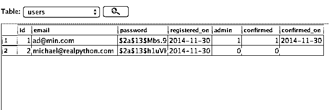
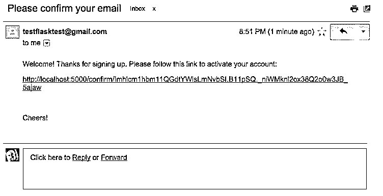

# 在 Flask 中注册期间处理电子邮件确认

> 原文：<https://realpython.com/handling-email-confirmation-in-flask/>

本教程详细介绍了如何在用户注册时验证电子邮件地址。

**2015 年 4 月 30 日更新**:新增 Python 3 支持。

* * *

在工作流程方面，用户注册新账户后，会发送一封确认邮件。用户帐户被标记为“未确认”，直到用户通过电子邮件中的说明“确认”帐户。这是大多数 web 应用程序遵循的简单工作流。

需要考虑的一件重要事情是未经确认的用户可以做什么。换句话说，他们对您的应用程序有完全访问权限、有限/受限访问权限还是根本没有访问权限？对于本教程中的应用程序，未经确认的用户可以登录，但他们会立即被重定向到一个页面，提醒他们在访问应用程序之前需要确认他们的帐户。

> 在开始之前，我们将要添加的大部分功能都是 [Flask-User](http://pythonhosted.org/Flask-User/) 和 [Flask-Security](https://pythonhosted.org/Flask-Security/) 扩展的一部分——这就引出了一个问题，为什么不直接使用这些扩展呢？首先，这是一个学习的机会。此外，这两种扩展都有局限性，比如支持的数据库。例如，如果你想使用 [RethinkDB](http://www.rethinkdb.com/) 呢？

我们开始吧。

## 烧瓶基本注册

我们将从包含基本用户注册的 Flask 样板文件开始。从[库](https://github.com/mjhea0/flask-basic-registration)中获取代码。创建并激活 virtualenv 后，运行以下命令快速入门:

```py
$ pip install -r requirements.txt
$ export APP_SETTINGS="project.config.DevelopmentConfig"
$ python manage.py create_db
$ python manage.py db init
$ python manage.py db migrate
$ python manage.py create_admin
$ python manage.py runserver
```

> 查看[自述文件](https://github.com/mjhea0/flask-basic-registration#quickstart)了解更多信息。

在应用程序运行的情况下，导航到[http://localhost:5000/register](http://localhost:5000/register)并注册一个新用户。请注意，注册后，应用程序会自动让您登录，并将您重定向到主页。四处看看，然后运行代码——特别是“用户”[蓝图](https://realpython.com/flask-blueprint/)。

完成后杀死服务器。

[*Remove ads*](/account/join/)

## 更新当前应用

### 型号

首先，让我们将`confirmed`字段添加到*项目/models.py* 中的`User`模型中:

```py
class User(db.Model):

    __tablename__ = "users"

    id = db.Column(db.Integer, primary_key=True)
    email = db.Column(db.String, unique=True, nullable=False)
    password = db.Column(db.String, nullable=False)
    registered_on = db.Column(db.DateTime, nullable=False)
    admin = db.Column(db.Boolean, nullable=False, default=False)
    confirmed = db.Column(db.Boolean, nullable=False, default=False)
    confirmed_on = db.Column(db.DateTime, nullable=True)

    def __init__(self, email, password, confirmed,
                 paid=False, admin=False, confirmed_on=None):
        self.email = email
        self.password = bcrypt.generate_password_hash(password)
        self.registered_on = datetime.datetime.now()
        self.admin = admin
        self.confirmed = confirmed
        self.confirmed_on = confirmed_on
```

注意这个字段是如何默认为“False”的。我们还添加了一个`confirmed_on`字段，它是一个[`datetime`](https://real python . com/python-datetime/)。我也喜欢包括这个字段，以便使用[群组分析](http://mherman.org/blog/2012/11/16/the-benefits-of-performing-a-cohort-analysis-in-determining-engagement-over-time/#.VJS2tcADA)来分析`registered_on`和`confirmed_on`日期之间的差异。

让我们从数据库和迁移开始。因此，继续删除数据库， *dev.sqlite* ，以及“migrations”文件夹。

### 管理命令

接下来，在 *manage.py* 中，更新`create_admin`命令以考虑新的数据库字段:

```py
@manager.command
def create_admin():
    """Creates the admin user."""
    db.session.add(User(
        email="ad@min.com",
        password="admin",
        admin=True,
        confirmed=True,
        confirmed_on=datetime.datetime.now())
    )
    db.session.commit()
```

确保导入`datetime`。现在，继续运行以下命令:

```py
$ python manage.py create_db
$ python manage.py db init
$ python manage.py db migrate
$ python manage.py create_admin
```

### `register()`查看功能

最后，在我们再次注册用户之前，我们需要对*项目/用户/视图. py* 中的`register()`视图功能进行快速更改…

改变:

```py
user = User(
    email=form.email.data,
    password=form.password.data
)
```

收件人:

```py
user = User(
    email=form.email.data,
    password=form.password.data,
    confirmed=False
)
```

有道理吗？想想为什么我们要将`confirmed`默认为`False`。

好吧。再次运行应用程序。导航到[http://localhost:5000/register](http://localhost:5000/register)，再次注册一个新用户。如果您在 SQLite 浏览器中打开您的 [SQLite 数据库](https://realpython.com/python-sqlite-sqlalchemy/)，您应该会看到:

[](https://files.realpython.com/media/user_registration.f90168b9f24e.png)

所以，我注册的新用户`michael@realpython.com`没有被确认。让我们改变这一点。

[*Remove ads*](/account/join/)

## 添加电子邮件确认

### 生成确认令牌

电子邮件确认应该包含一个唯一的网址，用户只需点击确认他/她的帐户。理想情况下，URL 应该是这样的- `http://yourapp.com/confirm/<id>`。这里的关键是`id`。我们将使用[危险的](http://pythonhosted.org/itsdangerous/)包在`id`中对用户电子邮件(以及时间戳)进行编码。

创建一个名为 *project/token.py* 的文件，并添加以下代码:

```py
# project/token.py

from itsdangerous import URLSafeTimedSerializer

from project import app

def generate_confirmation_token(email):
    serializer = URLSafeTimedSerializer(app.config['SECRET_KEY'])
    return serializer.dumps(email, salt=app.config['SECURITY_PASSWORD_SALT'])

def confirm_token(token, expiration=3600):
    serializer = URLSafeTimedSerializer(app.config['SECRET_KEY'])
    try:
        email = serializer.loads(
            token,
            salt=app.config['SECURITY_PASSWORD_SALT'],
            max_age=expiration
        )
    except:
        return False
    return email
```

因此，在`generate_confirmation_token()`函数中，我们使用用户注册期间获得的电子邮件地址，使用`URLSafeTimedSerializer`来生成一个令牌。*实际的*电子邮件被编码在令牌中。然后，为了确认令牌，在`confirm_token()`函数中，我们可以使用`loads()`方法，该方法将令牌和有效期(有效期为 1 小时(3600 秒))作为参数。只要令牌没有过期，它就会返回一封电子邮件。

请务必将`SECURITY_PASSWORD_SALT`添加到您的应用程序的配置(`BaseConfig()`):

```py
SECURITY_PASSWORD_SALT = 'my_precious_two'
```

### 更新`register()`查看功能

现在让我们从*项目/用户/视图. py* 再次更新`register()`视图函数:

```py
@user_blueprint.route('/register', methods=['GET', 'POST'])
def register():
    form = RegisterForm(request.form)
    if form.validate_on_submit():
        user = User(
            email=form.email.data,
            password=form.password.data,
            confirmed=False
        )
        db.session.add(user)
        db.session.commit()

        token = generate_confirmation_token(user.email)
```

此外，请确保更新导入:

```py
from project.token import generate_confirmation_token, confirm_token
```

### 处理电子邮件确认

接下来，让我们添加一个新视图来处理电子邮件确认:

```py
@user_blueprint.route('/confirm/<token>')
@login_required
def confirm_email(token):
    try:
        email = confirm_token(token)
    except:
        flash('The confirmation link is invalid or has expired.', 'danger')
    user = User.query.filter_by(email=email).first_or_404()
    if user.confirmed:
        flash('Account already confirmed. Please login.', 'success')
    else:
        user.confirmed = True
        user.confirmed_on = datetime.datetime.now()
        db.session.add(user)
        db.session.commit()
        flash('You have confirmed your account. Thanks!', 'success')
    return redirect(url_for('main.home'))
```

将此添加到*项目/用户/视图. py* 。此外，请确保更新导入:

```py
import datetime
```

这里，我们调用`confirm_token()`函数，传入令牌。如果成功，我们更新用户，将`email_confirmed`属性更改为`True`，并将`datetime`设置为确认发生的时间。此外，如果用户已经通过了确认过程——并且被确认了——那么我们会提醒用户这一点。

### 创建电子邮件模板

接下来，让我们添加一个基本的电子邮件模板:

```py
<p>Welcome! Thanks for signing up. Please follow this link to activate your account:</p>
<p><a href="{{ confirm_url }}">{{ confirm_url }}</a></p>
<br>
<p>Cheers!</p>
```

将此另存为“项目/模板/用户”中的【activate.html】T2。这需要一个名为`confirm_url`的变量，它将在`register()`视图函数中创建。

[*Remove ads*](/account/join/)

### 发送电子邮件

让我们在 [Flask-Mail](https://pythonhosted.org/flask-mail/) 的帮助下为[发送邮件](https://realpython.com/python-send-email/)创建一个基本功能，这个功能已经在`project/__init__.py`中安装并设置好了。

创建名为 *email.py* 的文件:

```py
# project/email.py

from flask.ext.mail import Message

from project import app, mail

def send_email(to, subject, template):
    msg = Message(
        subject,
        recipients=[to],
        html=template,
        sender=app.config['MAIL_DEFAULT_SENDER']
    )
    mail.send(msg)
```

将它保存在“项目”文件夹中。

因此，我们只需要传递一个收件人列表、一个主题和一个模板。我们稍后将处理邮件配置设置。

### 更新 project/user/views.py 中的`register()`视图函数(再次！)

```py
@user_blueprint.route('/register', methods=['GET', 'POST'])
def register():
    form = RegisterForm(request.form)
    if form.validate_on_submit():
        user = User(
            email=form.email.data,
            password=form.password.data,
            confirmed=False
        )
        db.session.add(user)
        db.session.commit()

        token = generate_confirmation_token(user.email)
        confirm_url = url_for('user.confirm_email', token=token, _external=True)
        html = render_template('user/activate.html', confirm_url=confirm_url)
        subject = "Please confirm your email"
        send_email(user.email, subject, html)

        login_user(user)

        flash('A confirmation email has been sent via email.', 'success')
        return redirect(url_for("main.home"))

    return render_template('user/register.html', form=form)
```

还添加以下导入:

```py
from project.email import send_email
```

在这里，我们将所有东西放在一起。该功能基本上充当整个过程的控制器(直接或间接):

*   处理初始注册，
*   生成令牌和确认 URL，
*   发送确认电子邮件，
*   闪光确认，
*   登录用户，然后
*   重定向用户。

你注意到`_external=True`的争论了吗？在我们的例子中，这将添加包含主机名和端口的完整绝对 URL([http://localhost:5000](http://localhost:5000))。)

在我们测试这个之前，我们需要设置我们的邮件设置。

### 邮件

首先更新 *project/config.py* 中的`BaseConfig()`:

```py
class BaseConfig(object):
    """Base configuration."""

    # main config
    SECRET_KEY = 'my_precious'
    SECURITY_PASSWORD_SALT = 'my_precious_two'
    DEBUG = False
    BCRYPT_LOG_ROUNDS = 13
    WTF_CSRF_ENABLED = True
    DEBUG_TB_ENABLED = False
    DEBUG_TB_INTERCEPT_REDIRECTS = False

    # mail settings
    MAIL_SERVER = 'smtp.googlemail.com'
    MAIL_PORT = 465
    MAIL_USE_TLS = False
    MAIL_USE_SSL = True

    # gmail authentication
    MAIL_USERNAME = os.environ['APP_MAIL_USERNAME']
    MAIL_PASSWORD = os.environ['APP_MAIL_PASSWORD']

    # mail accounts
    MAIL_DEFAULT_SENDER = 'from@example.com'
```

> 查看[官方烧瓶邮件文档](https://pythonhosted.org/flask-mail/#configuring-flask-mail)了解更多信息。

如果您已经有一个 GMAIL 帐户，那么您可以使用它或注册一个测试 GMAIL 帐户。然后在当前 shell 会话中临时设置环境变量:

```py
$ export APP_MAIL_USERNAME="foo"
$ export APP_MAIL_PASSWORD="bar"
```

> 如果你的 GMAIL 账户有[两步认证](https://support.google.com/accounts/topic/28786?hl=en&ref_topic=3382253)，谷歌会阻止这一尝试。

现在我们来测试一下！

[*Remove ads*](/account/join/)

## 首次测试

启动应用程序，导航到[http://localhost:5000/register](http://localhost:5000/register)。然后使用您可以访问的电子邮件地址进行注册。如果一切顺利，您的收件箱中应该会有一封类似如下的电子邮件:

[](https://files.realpython.com/media/email_confirmation.6cc723ab291c.png)

点击网址，你应该被带到 [http://localhost:5000/](http://localhost:5000/) 。确保用户在数据库中，“已确认”字段是`True`，并且有一个`datetime`与`confirmed_on`字段关联。

不错！

## 处理权限

如果你还记得，在本教程的开始，我们决定“未经确认的用户可以登录，但他们应该立即被重定向到一个页面——让我们称之为路由`/unconfirmed`——提醒用户在他们可以访问应用程序之前需要确认他们的帐户”。

所以，我们需要-

1.  添加`/unconfirmed`路线
2.  添加一个*unconfirmed.html*模板
3.  更新`register()`视图功能
4.  创建一个装饰器
5.  更新*navigation.html*模板

### 添加`/unconfirmed`路线

将以下路径添加到*项目/用户/视图. py* :

```py
@user_blueprint.route('/unconfirmed')
@login_required
def unconfirmed():
    if current_user.confirmed:
        return redirect('main.home')
    flash('Please confirm your account!', 'warning')
    return render_template('user/unconfirmed.html')
```

您以前见过类似的代码，所以让我们继续。

### 添加*unconfirmed.html*模板

```py




<h1>Welcome!</h1>
<br>
<p>You have not confirmed your account. Please check your inbox (and your spam folder) - you should have received an email with a confirmation link.</p>
<p>Didn't get the email? <a href="/">Resend</a>.</p>


```

将此另存为“项目/模板/用户”中的*unconfirmed.html*。同样，这应该很简单。目前，我们只是在中添加了一个虚拟 URL，用于重新发送确认电子邮件。我们将进一步解决这个问题。

### 更新`register()`视图功能

现在只需改变:

```py
return redirect(url_for("main.home"))
```

收件人:

```py
return redirect(url_for("user.unconfirmed"))
```

因此，在发送确认电子邮件后，用户现在被重定向到`/unconfirmed`路线。

[*Remove ads*](/account/join/)

### 创建一个装饰器*

```py
# project/decorators.py
from functools import wraps

from flask import flash, redirect, url_for
from flask.ext.login import current_user

def check_confirmed(func):
    @wraps(func)
    def decorated_function(*args, **kwargs):
        if current_user.confirmed is False:
            flash('Please confirm your account!', 'warning')
            return redirect(url_for('user.unconfirmed'))
        return func(*args, **kwargs)

    return decorated_function
```

这里我们有一个基本的功能来检查一个用户是否未经确认。如果未确认，用户将被重定向到`/unconfirmed`路线。在“项目”目录下保存这个文件为 *decorators.py* 。

现在，装饰一下`profile()`视图函数:

```py
@user_blueprint.route('/profile', methods=['GET', 'POST'])
@login_required
@check_confirmed
def profile():
    # ... snip ...
```

确保导入装饰器:

```py
from project.decorators import check_confirmed
```

### 更新*navigation.html*模板

最后，更新*navigation.html*模板的以下部分-

改变:

```py
<ul class="nav navbar-nav">
  
    <li><a href="{{ url_for('user.profile') }}">Profile</a></li>
  
</ul>
```

收件人:

```py
<ul class="nav navbar-nav">
  
    <li><a href="{{ url_for('user.profile') }}">Profile</a></li>
  
    <li><a href="{{ url_for('user.unconfirmed') }}">Confirm</a></li>
  
</ul>
```

再次测试的时间到了！

## 第二次测试

启动应用程序，使用您可以访问的电子邮件地址再次注册。(请随意从数据库中删除您之前注册的旧用户，以便再次使用。)现在你注册后应该会被重定向到[http://localhost:5000/unconfirmed](http://localhost:5000/unconfirmed)。

一定要测试[http://localhost:5000/profile](http://localhost:5000/profile)路由。这应该会将你重定向到[http://localhost:5000/unconfirmed](http://localhost:5000/unconfirmed)。

继续确认电子邮件，您将可以访问所有页面。嘣！

## 重新发送电子邮件

最后，让我们让重新发送链接工作。向*项目/用户/视图. py* 添加以下视图函数:

```py
@user_blueprint.route('/resend')
@login_required
def resend_confirmation():
    token = generate_confirmation_token(current_user.email)
    confirm_url = url_for('user.confirm_email', token=token, _external=True)
    html = render_template('user/activate.html', confirm_url=confirm_url)
    subject = "Please confirm your email"
    send_email(current_user.email, subject, html)
    flash('A new confirmation email has been sent.', 'success')
    return redirect(url_for('user.unconfirmed'))
```

现在更新*unconfirmed.html*模板:

```py




<h1>Welcome!</h1>
<br>
<p>You have not confirmed your account. Please check your inbox (and your spam folder) - you should have received an email with a confirmation link.</p>
<p>Didn't get the email? <a href="{{ url_for('user.resend_confirmation') }}">Resend</a>.</p>


```

[*Remove ads*](/account/join/)

## 第三次测试

你知道该怎么做。这次确保重新发送一封新的确认邮件并测试链接。应该能行。

最后，如果给自己发几个确认链接会怎么样？每个都有效吗？测试一下。注册一个新用户，然后发送几封新的确认电子邮件。试着用第一封邮件确认。成功了吗？应该的。这样可以吗？如果有新的邮件发出，你认为其他的邮件应该过期吗？

在这方面做一些研究。并测试您使用的其他 web 应用程序。他们如何处理这种行为？

## 更新测试套件

好吧。这就是它的主要功能。不如我们更新一下当前的测试套件，因为它已经坏了。

[运行测试](https://realpython.com/python-testing/):

```py
$ python manage.py test
```

您应该会看到以下错误:

```py
TypeError: __init__() takes at least 4 arguments (3 given)
```

要纠正这一点，我们只需要更新 *project/util.py* 中的`setUp()`方法:

```py
def setUp(self):
    db.create_all()
    user = User(email="ad@min.com", password="admin_user", confirmed=False)
    db.session.add(user)
    db.session.commit()
```

现在再做一次测试。都应该过去！

## 结论

显然，我们还可以做更多的事情:

1.  富文本邮件和纯文本邮件——我们应该同时发送。
2.  重置密码电子邮件-这些邮件应该发送给忘记密码的用户。
3.  用户管理-我们应该允许用户更新他们的电子邮件和密码，当一个电子邮件被更改时，应该再次确认。
4.  测试——我们需要编写更多的测试来覆盖新的特性。

从 [Github 库](https://github.com/realpython/flask-registration)下载完整的源代码。带着问题在下面评论。查看[第二部](https://realpython.com/the-minimum-viable-test-suite/)。

节日快乐！******