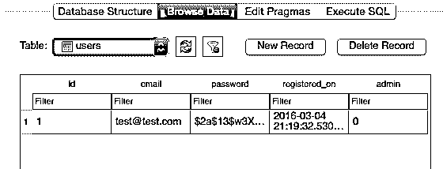

# 使用 Angular 和 Flask 处理用户验证

> 原文：<https://realpython.com/handling-user-authentication-with-angular-and-flask/>

这篇文章为“我如何用 AngularJS 和 Flask 处理用户认证”这个问题提供了一个解决方案

*更新:*

*   04/17/2016:更新至 Python ( [3.5.1](https://www.python.org/downloads/release/python-351/) )和 AngularJS ( [1.4.10](https://code.angularjs.org/1.4.10/docs/api) )的最新版本；添加了有关持久登录的部分。

在开始之前，请记住，这不是手头问题的唯一解决方案，甚至可能不是适合您情况的正确解决方案。无论您实施哪种解决方案，重要的是要注意到*由于最终用户完全控制浏览器以及访问前端代码，因此存储在服务器端 API 中的敏感数据必须是安全的。换句话说，确保在服务器端实现身份验证策略，以保护敏感的 API 端点。*

也就是说，我们需要启用以下工作流:

1.  当客户端访问主路由时，会提供一个索引页面，此时 Angular 接管，处理客户端的所有路由。
2.  Angular 应用程序会立即“询问”服务器是否有用户登录。
3.  假设服务器指示用户未登录，则客户端会立即被要求登录。
4.  一旦登录，Angular 应用程序就会跟踪用户的登录状态。

## 开始使用

首先，从 [repo](https://github.com/realpython/flask-angular-auth/releases/tag/v1.1) 中获取样板代码，激活一个[虚拟环境](https://realpython.com/python-virtual-environments-a-primer/)，并安装需求。

然后创建初始迁移:

```py
$ python manage.py create_db
$ python manage.py db init
$ python manage.py db migrate
```

[测试应用](https://realpython.com/python-testing/):

```py
$ python manage.py runserver
```

导航到 [http://localhost:5000/](http://localhost:5000/) ，您应该会看到一条简单的欢迎消息——“欢迎！”。欣赏完主页后，关闭服务器，浏览“项目”文件夹中的代码:

```py
├── __init__.py
├── config.py
├── models.py
└── static
    ├── app.js
    ├── index.html
    └── partials
        └── home.html
```

没什么特别的。大部分后端代码/逻辑驻留在 *__init__。py* 文件，而 Angular 应用程序驻留在“静态”目录中。

> 关于这个结构的更多信息，请查看真正的 Python 课程。

[*Remove ads*](/account/join/)

## 构建登录 API

让我们从后端的 [API](https://realpython.com/api-integration-in-python/) 开始…

### 用户注册

更新 *__init__ 中的`register()`函数。py* :

```py
@app.route('/api/register', methods=['POST'])
def register():
    json_data = request.json
    user = User(
        email=json_data['email'],
        password=json_data['password']
    )
    try:
        db.session.add(user)
        db.session.commit()
        status = 'success'
    except:
        status = 'this user is already registered'
    db.session.close()
    return jsonify({'result': status})
```

这里，我们将与 POST 请求(来自客户端)一起发送的有效负载设置为`json_data`，然后用它来创建一个`User`实例。然后，我们尝试将用户添加到数据库中，并提交更改。如果成功，就添加了一个用户，然后我们通过带有“成功”的`status`的`jsonify` [方法](http://flask.pocoo.org/docs/0.10/api/#flask.json.jsonify)返回一个 JSON 响应。如果失败，会话将关闭，并发送错误响应“此用户已注册”。

确保还添加了以下导入:

```py
from flask import request, jsonify
from project.models import User
```

> 后一个导入必须在我们创建了`db`实例之后导入——例如`db = SQLAlchemy(app)`——以避免循环依赖。

让我们通过 curl 测试一下。启动服务器，然后在新的终端窗口中运行以下命令:

```py
$ curl -H "Accept: application/json" \
-H "Content-type: application/json" -X POST \
-d '{"email": "test@test.com", "password": "test"}' \
http://localhost:5000/api/register
```

您应该会看到一条成功消息:

```py
{ "result":  "success" }
```

再试一次，您应该会看到一个错误:

```py
{ "result":  "this user is already registered" }
```

最后，在 [SQLite 数据库浏览器](http://sqlitebrowser.org/)中打开数据库，确保用户确实插入了表中:

[](https://files.realpython.com/media/sqlite-database-browser-added-user.33cf2fa7ffce.png)

登录后…

### 用户登录

更新 *__init__ 中的`login()`函数。py* :

```py
@app.route('/api/login', methods=['POST'])
def login():
    json_data = request.json
    user = User.query.filter_by(email=json_data['email']).first()
    if user and bcrypt.check_password_hash(
            user.password, json_data['password']):
        session['logged_in'] = True
        status = True
    else:
        status = False
    return jsonify({'result': status})
```

我们查询数据库，根据有效负载中发送的电子邮件查看用户是否存在，如果存在，则验证密码。将返回适当的响应。

确保更新导入:

```py
from flask import Flask, request, jsonify, session
```

在服务器运行的情况下，用 curl-再次测试

```py
$ curl -H "Accept: application/json" \
-H "Content-type: application/json" -X POST \
-d '{"email": "test@test.com", "password": "test"}' \
http://localhost:5000/api/login
```

-你应该看到:

```py
{ "result":  true }
```

用 curl 再次测试，发送错误的用户凭证，您应该看到:

```py
{ "result":  false }
```

完美！

[*Remove ads*](/account/join/)

### 用户注销

像这样更新`logout()`函数，以便更新`session`:

```py
@app.route('/api/logout')
def logout():
    session.pop('logged_in', None)
    return jsonify({'result': 'success'})
```

这应该很简单，您大概可以猜到对这个 curl 请求的响应——但是如果您愿意，可以再测试一次。完成后，让我们转向客户端！

## 开发角度应用程序

> 需要上一节的代码吗？从[回购](https://github.com/realpython/flask-angular-auth/releases/tag/v2.1)中抢过来。

现在，事情变得有点棘手了。同样，由于最终用户可以完全访问浏览器以及 [DevTools](https://developer.chrome.com/devtools) 和客户端代码，所以不仅要限制对服务器端敏感端点的访问，而且不要在客户端存储敏感数据，这一点非常重要。当您向自己的应用程序堆栈添加身份验证功能时，请记住这一点。

让我们通过创建一个[服务](https://code.angularjs.org/1.4.10/docs/guide/services)来处理认证。

### 认证服务

从这个服务的基本结构开始，将以下代码添加到“static”目录中一个名为 *services.js* 的新文件中:

```py
angular.module('myApp').factory('AuthService', ['$q',  '$timeout',  '$http', function  ($q,  $timeout,  $http)  { // create user variable var  user  =  null; // return available functions for use in controllers return  ({ isLoggedIn:  isLoggedIn, login:  login, logout:  logout, register:  register }); }]);
```

在这里，我们定义了服务名`AuthService`，并注入了我们将要使用的依赖项——`$q`、`$timeout`、`$http`——然后返回了在服务外部使用的函数。

确保将脚本添加到*index.html*文件中:

```py
<script src="static/services.js" type="text/javascript"></script>
```

让我们创建每个函数…

**T2`isLoggedIn()`**

```py
function  isLoggedIn()  { if(user)  { return  true; }  else  { return  false; } }
```

如果`user`的计算结果为`true`，这个函数将返回`true`，例如，一个用户已经登录，否则它将返回 false。

**T2`login()`**

```py
function  login(email,  password)  { // create a new instance of deferred var  deferred  =  $q.defer(); // send a post request to the server $http.post('/api/login',  {email:  email,  password:  password}) // handle success .success(function  (data,  status)  { if(status  ===  200  &&  data.result){ user  =  true; deferred.resolve(); }  else  { user  =  false; deferred.reject(); } }) // handle error .error(function  (data)  { user  =  false; deferred.reject(); }); // return promise object return  deferred.promise; }
```

这里，我们使用了 [$q](https://code.angularjs.org/1.4.10/docs/api/ng/service/$q) 服务来建立一个[承诺](https://developer.mozilla.org/en-US/docs/Web/JavaScript/Reference/Global_Objects/Promise)，我们将在未来的控制器中访问它。我们还利用了 [$http](https://code.angularjs.org/1.4.10/docs/api/ng/service/$http) 服务向已经在后端 Flask 应用程序中设置好的`/api/login`端点发送 AJAX 请求。

基于返回的响应，我们或者[解析](https://code.angularjs.org/1.4.10/docs/api/ng/service/$q#usage)或者[拒绝](https://code.angularjs.org/1.4.10/docs/api/ng/service/$q#usage)对象，并将`user`的值设置为`true`或`false`。

**T2`logout()`**

```py
function  logout()  { // create a new instance of deferred var  deferred  =  $q.defer(); // send a get request to the server $http.get('/api/logout') // handle success .success(function  (data)  { user  =  false; deferred.resolve(); }) // handle error .error(function  (data)  { user  =  false; deferred.reject(); }); // return promise object return  deferred.promise; }
```

这里，我们遵循了与`login()`函数相同的公式，除了我们发送了 GET 请求而不是 POST，并且为了谨慎起见，如果用户不存在，我们没有发送错误，而是将用户注销。

**T2`register()`**

```py
function  register(email,  password)  { // create a new instance of deferred var  deferred  =  $q.defer(); // send a post request to the server $http.post('/api/register',  {email:  email,  password:  password}) // handle success .success(function  (data,  status)  { if(status  ===  200  &&  data.result){ deferred.resolve(); }  else  { deferred.reject(); } }) // handle error .error(function  (data)  { deferred.reject(); }); // return promise object return  deferred.promise; }
```

同样，我们遵循类似于`logout()`函数的公式。你能看出发生了什么吗？

服务到此为止。请记住，我们仍然没有“使用”这项服务。为了做到这一点，我们只需要将其注入 Angular 应用程序中的必要组件。在我们的例子中，这将是控制器，每个控制器都与不同的路线相关联…

[*Remove ads*](/account/join/)

### 客户端路由

将客户端路线的剩余部分添加到 *app.js* 文件中:

```py
myApp.config(function  ($routeProvider)  { $routeProvider .when('/',  { templateUrl:  'static/partials/home.html' }) .when('/login',  { templateUrl:  'static/partials/login.html', controller:  'loginController' }) .when('/logout',  { controller:  'logoutController' }) .when('/register',  { templateUrl:  'static/partials/register.html', controller:  'registerController' }) .when('/one',  { template:  '<h1>This is page one!</h1>' }) .when('/two',  { template:  '<h1>This is page two!</h1>' }) .otherwise({ redirectTo:  '/' }); });
```

在这里，我们创建了五条新路线。现在我们可以添加后续的模板和控制器。

### 模板和控制器

回顾我们的路线，我们需要设置两个部分/模板和三个控制器:

```py
.when('/login',  { templateUrl:  'static/partials/login.html', controller:  'loginController' }) .when('/logout',  { controller:  'logoutController' }) .when('/register',  { templateUrl:  'static/partials/register.html', controller:  'registerController' })
```

**登录**

首先，将以下 HTML 添加到名为*login.html*的新文件中:

```py
<div class="col-md-4">
  <h1>Login</h1>
  <div ng-show="error" class="alert alert-danger">{{errorMessage}}</div>
  <form class="form" ng-submit="login()">
    <div class="form-group">
      <label>Email</label>
      <input type="text" class="form-control" name="email" ng-model="loginForm.email" required>
    </div>
    <div class="form-group">
      <label>Password</label>
        <input type="password" class="form-control" name="password" ng-model="loginForm.password" required>
      </div>
      <div>
        
      </div>
  </form>
</div>
```

将该文件添加到“partials”目录中。

请注意表格。我们在每个输入上使用了 [ng-model](https://code.angularjs.org/1.4.10/docs/api/ng/directive/ngModel) 指令，这样我们就可以在控制器中捕获这些值。同样，当提交表单时， [ng-submit](https://code.angularjs.org/1.4.10/docs/api/ng/directive/ngSubmit) 指令通过触发`login()`函数来处理事件。

接下来，在“静态”文件夹中添加一个名为 *controllers.js* 的新文件。是的，这将持有我们所有的 Angular 应用程序的控制器。务必将脚本添加到 index.html 的*文件中:*

```py
<script src="static/controllers.js" type="text/javascript"></script>
```

现在，让我们添加第一个控制器:

```py
angular.module('myApp').controller('loginController', ['$scope',  '$location',  'AuthService', function  ($scope,  $location,  AuthService)  { $scope.login  =  function  ()  { // initial values $scope.error  =  false; $scope.disabled  =  true; // call login from service AuthService.login($scope.loginForm.email,  $scope.loginForm.password) // handle success .then(function  ()  { $location.path('/'); $scope.disabled  =  false; $scope.loginForm  =  {}; }) // handle error .catch(function  ()  { $scope.error  =  true; $scope.errorMessage  =  "Invalid username and/or password"; $scope.disabled  =  false; $scope.loginForm  =  {}; }); }; }]);
```

因此，当触发`login()`函数时，我们设置一些初始值，然后从`AuthService`调用`login()`，传递用户输入的电子邮件和密码作为参数。然后处理后续的成功或错误，并适当地更新 DOM/视图/模板。

准备好测试第一次往返了吗- *客户端到服务器，然后再回到客户端*？

启动服务器，在浏览器中导航到[http://localhost:5000/#/log in](http://localhost:5000/#/login)。首先，尝试使用之前注册时使用的用户凭证登录——例如，`test@test.com`和`test`。如果一切顺利，您应该会被重定向到主 URL。接下来，尝试使用无效凭证登录。您应该会看到错误信息闪烁，“无效的用户名和/或密码”。

**注销**

添加控制器:

```py
angular.module('myApp').controller('logoutController', ['$scope',  '$location',  'AuthService', function  ($scope,  $location,  AuthService)  { $scope.logout  =  function  ()  { // call logout from service AuthService.logout() .then(function  ()  { $location.path('/login'); }); }; }]);
```

在这里，我们调用了`AuthService.logout()`,然后在承诺解决后将用户重定向到`/login`路由。

给*home.html*添加一个按钮:

```py
<div ng-controller="logoutController">
  <a ng-click='logout()' class="btn btn-default">Logout</a>
</div>
```

然后再测试一次。

**寄存器**

将名为*register.html*的新文件添加到“partials”文件夹中，并添加以下 HTML:

```py
<div class="col-md-4">
  <h1>Register</h1>
  <div ng-show="error" class="alert alert-danger">{{errorMessage}}</div>
  <form class="form" ng-submit="register()">
    <div class="form-group">
      <label>Email</label>
      <input type="text" class="form-control" name="email" ng-model="registerForm.email" required>
    </div>
    <div class="form-group">
      <label>Password</label>
        <input type="password" class="form-control" name="password" ng-model="registerForm.password" required>
      </div>
      <div>
        
      </div>
  </form>
</div>
```

接下来，添加控制器:

```py
angular.module('myApp').controller('registerController', ['$scope',  '$location',  'AuthService', function  ($scope,  $location,  AuthService)  { $scope.register  =  function  ()  { // initial values $scope.error  =  false; $scope.disabled  =  true; // call register from service AuthService.register($scope.registerForm.email, $scope.registerForm.password) // handle success .then(function  ()  { $location.path('/login'); $scope.disabled  =  false; $scope.registerForm  =  {}; }) // handle error .catch(function  ()  { $scope.error  =  true; $scope.errorMessage  =  "Something went wrong!"; $scope.disabled  =  false; $scope.registerForm  =  {}; }); }; }]);
```

您以前已经见过这种情况，所以让我们直接进入测试。

启动服务器，在[http://localhost:5000/#/register](http://localhost:5000/#/register)注册一个新用户。请确保使用该新用户进行登录测试。

好了，这就是模板和控制器。我们现在需要添加功能来检查用户是否在每次更改路线时登录。

[*Remove ads*](/account/join/)

### 路线变更

将以下代码添加到 *app.js* 中:

```py
myApp.run(function  ($rootScope,  $location,  $route,  AuthService)  { $rootScope.$on('$routeChangeStart',  function  (event,  next,  current)  { if  (AuthService.isLoggedIn()  ===  false)  { $location.path('/login'); $route.reload(); } }); });
```

[$routeChangeStart](https://code.angularjs.org/1.4.10/docs/api/ngRoute/service/$route) 事件发生在实际的路由更改发生之前。因此，无论何时访问路由，在提供视图之前，我们都要确保用户已经登录。测试一下！

### 保护某些路线

现在，所有客户端路由都需要用户登录。如果您希望限制某些路线，而开放其他路线，该怎么办？您可以向每个路由处理程序添加以下代码，对于您不想限制的路由，用`false`替换`true`:

```py
access:  {restricted:  true}
```

在我们的例子中，像这样更新路由:

```py
myApp.config(function  ($routeProvider)  { $routeProvider .when('/',  { templateUrl:  'static/partials/home.html', access:  {restricted:  true} }) .when('/login',  { templateUrl:  'static/partials/login.html', controller:  'loginController', access:  {restricted:  false} }) .when('/logout',  { controller:  'logoutController', access:  {restricted:  true} }) .when('/register',  { templateUrl:  'static/partials/register.html', controller:  'registerController', access:  {restricted:  false} }) .when('/one',  { template:  '<h1>This is page one!</h1>', access:  {restricted:  true} }) .when('/two',  { template:  '<h1>This is page two!</h1>', access:  {restricted:  false} }) .otherwise({ redirectTo:  '/' }); });
```

现在只需更新 *main.js* 中的`$routeChangeStart`代码:

```py
myApp.run(function  ($rootScope,  $location,  $route,  AuthService)  { $rootScope.$on('$routeChangeStart',  function  (event,  next,  current)  { if  (next.access.restricted  &&  AuthService.isLoggedIn()  ===  false)  { $location.path('/login'); $route.reload(); } }); });
```

测试每条路线！

## 持续登录

最后，页面刷新时会发生什么？试试看。

用户已注销，对吗？为什么？因为控制器和服务被再次调用，将`user`变量设置为`null`。这是一个问题，因为用户仍然在客户端登录。

幸运的是，修复很简单:在`$routeChangeStart`中，我们需要始终检查用户是否登录。现在，它正在检查`isLoggedIn()`是否是`false`。让我们添加一个新函数`getUserStatus()`，它在后端检查用户状态:

```py
function  getUserStatus()  { return  $http.get('/api/status') // handle success .success(function  (data)  { if(data.status){ user  =  true; }  else  { user  =  false; } }) // handle error .error(function  (data)  { user  =  false; }); }
```

确保也返回该函数:

```py
return  ({ isLoggedIn:  isLoggedIn, login:  login, logout:  logout, register:  register, getUserStatus:  getUserStatus });
```

然后在客户端添加路由处理程序:

```py
@app.route('/api/status')
def status():
    if session.get('logged_in'):
        if session['logged_in']:
            return jsonify({'status': True})
    else:
        return jsonify({'status': False})
```

最后，更新`$routeChangeStart`:

```py
myApp.run(function  ($rootScope,  $location,  $route,  AuthService)  { $rootScope.$on('$routeChangeStart', function  (event,  next,  current)  { AuthService.getUserStatus() .then(function(){ if  (next.access.restricted  &&  !AuthService.isLoggedIn()){ $location.path('/login'); $route.reload(); } }); }); });
```

试试吧！

[*Remove ads*](/account/join/)

## 结论

就是这样。有问题吗？下面评论。

您应该注意的一点是，只要在 AJAX 请求中正确设置了端点，Angular 应用程序就可以用于各种框架。因此，你可以很容易地把角的部分添加到你的 Django 或 Pyramid 或 NodeJS 应用程序中。试试看！

从[回购](https://github.com/realpython/flask-angular-auth)中抓取最终代码。干杯！*****