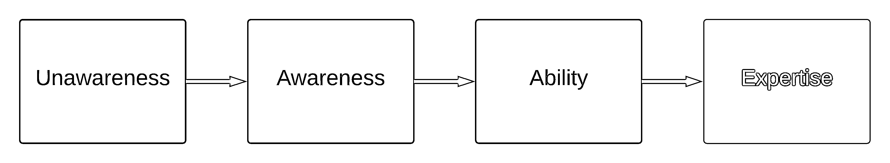

# 学习 Python 需要多长时间？

> 原文：<https://realpython.com/how-long-does-it-take-to-learn-python/>

你可能已经找到了至少一篇博客文章，作者透露他们在几天内学会了 Python，并很快过渡到一份高薪工作。这些故事中有些可能是真的，但它们并不能帮助你为一场稳定的学习马拉松做好准备。那么，学习 Python*真的需要*多长时间，值得你的时间投入吗？

在这篇文章中，你将了解到:

*   “学习 Python”意味着什么，以及如何**衡量自己的进步**
*   学习 Python 有哪些不同的**原因**
*   哪些**背景因素**影响你的学习方法和结果
*   **在**不同的技能水平**下，你想要投入多少时间**来学习 Python
*   哪些**资源**可以用来改善你的学习过程

首先，您将了解人们想学习 Python 编程的一些不同原因。记住你的个人动机，并确定你的位置。你学习 Python 的原因将影响你的方法和你需要留出的时间。

**免费下载:** [从 Python 技巧中获取一个示例章节:这本书](https://realpython.com/bonus/python-tricks-sample-pdf/)用简单的例子向您展示了 Python 的最佳实践，您可以立即应用它来编写更漂亮的+Python 代码。

## 你为什么要学 Python？

你可能完全是编程新手，还在犹豫是否应该花时间学习 Python。在第一部分，您将考虑人们想要学习这种编程语言的不同原因。记下你最认同的一个:

*   职业和工作机会:也许你想开始一份软件开发员的新工作。也许你想继续在目前的公司工作，并过渡到一个更具技术性的角色，如数据分析。精通编程是对你已有技能的极好补充。一旦你掌握了你需要的 Python 技能，你就可以通过你的 [Python 编码面试](https://realpython.com/learning-paths/python-interview/)来获得你梦想中的工作。

*   自动化: Python 可以帮助你自动化你在工作和私人生活中经常做的重复性工作。你可以学习用 [Excel 电子表格](https://realpython.com/openpyxl-excel-spreadsheets-python/)、[来自动化你的工作，构建一个网络抓取器](https://realpython.com/beautiful-soup-web-scraper-python/)来访问互联网上的公共数据，创建[命令行界面](https://realpython.com/command-line-interfaces-python-argparse/)，或者为 [Twitter](https://realpython.com/twitter-bot-python-tweepy/) 或 [Discord](https://realpython.com/how-to-make-a-discord-bot-python/) 构建机器人来减轻你的负担。

*   **好奇心:**数码产品无处不在，你可能日常都会用到。你可能想知道你的数字温度计是如何工作的，一个受欢迎的网站是如何建立的，或者你最喜欢的电脑游戏如果用数字方式拆开会是什么样子。

*   创意:你可能对自己的游戏有一些奇妙的想法，你可以用[街机](https://realpython.com/platformer-python-arcade/)、 [Pygame](https://realpython.com/asteroids-game-python/) 或另一个[游戏引擎](https://realpython.com/top-python-game-engines/)来构建它们。或者你可能想从用于家庭自动化、物联网(IoT)的[编程硬件](https://realpython.com/micropython/)或[嵌入式游戏开发](https://realpython.com/embedded-python/)开始。

所有这些都是进入编程的好理由！你开始这段旅程的个人动机将影响你学习 Python 的速度和深度。它还会影响语言的哪些方面需要你的关注。如果你正在寻找解决问题的灵感，那么你可以阅读一下[你可以用 Python](https://realpython.com/what-can-i-do-with-python/) 做什么。

[*Remove ads*](/account/join/)

## “学习 Python”是什么意思？

学习 Python 不仅仅意味着学习 Python 编程语言。你需要知道的不仅仅是一门编程语言的细节，这样才能用你的编程技能做一些有用的事情。同时，你不需要理解 Python 的每一个方面来提高效率。

学习 Python 就是学习如何用 Python 编程完成实际任务。这是一套你可以用来为自己或雇主构建项目的技能。

## 如何衡量自己的学习进度？

通常很难说在什么时候你已经完全学到了一些东西。知道 Python 的语法就知道 Python 了吗？当你知道如何使用一个流行的库而不用在网上查找时，你学会了吗？还是需要了解 Python 生态系统的所有来龙去脉，才能说自己学过 Python？

实际上，您可能永远也学不会关于 Python 生态系统的所有知识。要知道的太多了！因此，将你的旅程分成不同的部分是有帮助的。这种方法让你更容易朝着正确的方向前进。

当您考虑不同的技能水平时，您可能会想到三个传统类别:

1.  新手
2.  中间的
3.  专家

然而，很难定义什么时候某人不再是初学者，即使是有经验的程序员也往往不认为自己是专家。另一方面，一些能力低下的程序员可能认为自己是专家，这种认知偏差被称为[邓宁-克鲁格效应](https://en.wikipedia.org/wiki/Dunning–Kruger_effect)。记住这一点，按照这种传统的分类来规划你的进步可能对你没什么用。

### 能力的四个阶段

相反，你将使用一个不同的框架来评估你的学习进度，该框架遵循[能力的四个阶段](https://en.wikipedia.org/wiki/Four_stages_of_competence):

为了使能力的四个阶段更容易理解，您将看到以下简称来指代四个阶段中的每一个:

1.  **不知情**为**无意识的无能**
2.  **觉悟**为**自觉无能**
3.  **能力**为**意识能力**
4.  **专长**为**无意识能力**

您可以在本节中进一步了解每个阶段的含义。当您在本文后面了解学习 Python 的时间估计时，您将使用能力的四个阶段作为框架。但是有一个转折！你将把你的注意力转移到发生在不同阶段之间的学习过程中，并专注于把你从一个阶段带到下一个阶段的思维转变。您将了解如何从:

1.  [不知不觉](#from-unawareness-to-awareness)
2.  [意识到能力](#from-awareness-to-ability)
3.  [专业知识能力](#from-ability-to-expertise)

你会发现，四个能力阶段的每一个都涵盖了与经典的初级-中级-专家模式相似的领域。然而，这种替代框架使你更容易找到你现在的进展，这可以给你提供关于如何从无知走向专业的可操作的洞察力:

为了确定你何时从一个阶段进入下一个阶段，你应该主要依靠你对自己进步的自我评估。时间估计可以在这方面支持你，但是你不应该把它们作为严格的规则。许多因素影响着每个人的学习进度，在本文的部分，你将会看到其中的一些因素[。](#what-factors-influence-your-learning-journey)

为了稍微改进时间估计，你会发现一个额外的基于你已经完成的项目数量的进度测量方法。试着结合你花费的时间和完成的项目数量来评估你从一个学习阶段到下一个学习阶段的进展。

请记住，这些只是估计。你可能会看到自己比描述的走得更快或更慢。作为你最终的自我评估，专注于记录你思想状态的转变，这可以表明从一个阶段到另一个阶段的转换。最后，重要的是你要继续做项目，记录你的进展，并在做的时候享受其中。你会看到你的技能随着时间而增长。

[*Remove ads*](/account/join/)

### 第一阶段:无意识的无能(无意识)

对于每一项对你来说新的技能，你都将从无意识的无能阶段开始。这个词听起来可能不太令人鼓舞。然而，一旦你阅读了维基百科对这个阶段的定义，你会发现这只是一个描述熟悉的精神状态的实用术语:

> 个人不理解或不知道如何做某事，也不一定认识到不足。他们可能会否认技能的有用性。在进入下一阶段之前，个人必须认识到自己的无能和新技能的价值。一个人在这个阶段花费的时间长短取决于学习刺激的强度。([来源](https://en.wikipedia.org/wiki/Four_stages_of_competence#Stages))

你不知道你不知道什么。如果你不接受你不知道的事实，你就不会学到东西，你也可能不会理解你不想学的东西。

从这第一阶段毕业可能只需要几分钟。然而，这是学习任何新东西的关键一步，而且经常得不到足够的重视。

### 阶段 2:有意识的无能(觉知)

一旦你意识到 Python 是一种你想了解更多的编程语言，你的积极时间投入就开始了。在这一点上，你处于有意识的无能阶段:

> 虽然个人不理解或不知道如何做某事，但他们认识到不足，以及解决不足的新技能的价值。在这个阶段，犯错是学习过程中不可或缺的一部分。([来源](https://en.wikipedia.org/wiki/Four_stages_of_competence#Stages))

通过这个阶段需要时间和努力。这种投资是人们在谈论学习新东西时经常想到的。

### 第三阶段:自觉能力

如果你认为你已经成功地从能力的四个阶段中的前一个阶段毕业，那么你已经达到了有意识的能力:

> 个人理解或知道如何做某事。然而，展示技能或知识需要专注。它可以被分解成几个步骤，并且在执行新技能的过程中需要大量的有意识的参与。([来源](https://en.wikipedia.org/wiki/Four_stages_of_competence#Stages))

在这个阶段，您将具备 Python 的工作能力，这可能已经足够满足您的需求了。您可以应用编程知识来改进当前工作的工作流程，或者构建自己的项目。你可能有足够的 Python 知识来获得软件开发人员的初级职位。虽然用 Python 编程仍然需要你付出很多有意识的努力，但你可以让事情运转起来。

然而，在这个阶段，你没有足够的练习来达到流利和熟练。转移到 Python 的无意识能力将需要你更多的时间和努力。

### 第四阶段:无意识能力(专长)

一旦你达到了无意识能力，你就能毫不费力地使用你的工具。在这个阶段，你可以像一个伟大的音乐家使用他们的乐器一样使用 Python。一个熟练的吉他手不会专注于握吉他，而是专注于他们创作的音乐。他们可以准确而有趣地使用他们的乐器。

一旦你能把你正在使用的工具移到背景中，并且意识到你的注意力主要集中在创造上，你就获得了无意识的能力:

> 个人对一项技能有太多的练习，以至于它已经成为“第二天性”,可以很容易地完成。因此，该技能可以在执行另一个任务时执行。个人也许能够把它教给其他人，这取决于如何以及何时学会它。([来源](https://en.wikipedia.org/wiki/Four_stages_of_competence#Stages))

真正的 Python 编程专业知识可能会让你觉得离你现在的位置很远。那完全正常，没问题！没有音乐家一开始是乐器的专家。专业知识需要多年的持续训练。甚至一旦他们在一个主题上达到专业水平，许多人会回到四个能力阶段的前一个阶段去发展他们在另一个领域的技能。

当一些程序员谈论他们如何从未停止学习时，他们描述的是他们在工作的一个领域从能力到专业知识的进步。虽然您可能最终在使用 Python 的一个领域获得了专业知识，但是在更多的领域，您将继续工作，并从能力上慢慢进步。

[*Remove ads*](/account/join/)

## 哪些因素影响你的学习之旅？

现在你知道了如何将你的学习路径分成不同的步骤，你可能想知道你在这四个阶段之间移动的具体时间。你可以在下面找到一些时间估计，但是记住学习是一个个人的过程。多种因素决定了学习 Python 需要花费*你*多少时间和精力。以下是一些需要考虑的个别因素:

1.  背景:你以前有什么经验？如果你英语很好，如果你以前用另一种语言编程过，或者如果你有数理逻辑和[语言学习的经验](https://www.nature.com/articles/s41598-020-60661-8)，那么你可能会进步得更快。

2.  **动机:**你想用 Python 做什么，有多迫切想学？如果你有一个明确的目标，比如一个你想要解决的特定挑战，那么保持专注和动力会更简单，你可能会进步得更快。

3.  **目标:**你的目标是什么技能水平，学习 Python 希望达到什么目标？假设你计划获得一份 Python 开发人员的全职工作。如果你打算把完成一个个人项目作为业余爱好，你可能需要更深入地钻研这门语言的更多方面。

4.  **可用性:**学习 Python 可以投入多少时间？你是学生还是在待业中？你能每天花大量时间学习编程吗？你有全职工作吗，意味着你只能在工作之外学习吗？你照顾小孩或其他人吗？如果你有更多的时间投资，那么你会进步得更快。

5.  **导师:**你有可以教你的人吗？和一个知识渊博的朋友或导师在一起，你会学得更快，他们自己也经历过这个过程，并愿意和你分享他们的知识。你可以从工作场所或网上的专职导师那里获得指导支持。如果你心中没有导师，试着加入一个[学习社区](https://realpython.com/community/)。

6.  **学习资源:**你能获得优质的学习资源吗？他们可以帮助你决定先学什么以及如何继续。如果你的学习资源有很高的教学质量和准确性，那么你会更快地学到正确的东西。

这个列表并不详尽，可能还有其他因素会影响你的学习之旅。然而，如果你彻底考虑了这些额外的因素，并考虑了你的个人情况，你就能更好地准确评估你需要的时间。

## 学习 Python 需要多长时间？

你现在知道了[“学习 Python”意味着什么](#what-does-learning-python-mean)以及[你可以使用什么样的学习框架](#how-can-you-measure-your-learning-progress)来将学习过程分成几个阶段。你还了解了影响你学习旅程的[背景因素](#what-factors-influence-your-learning-journey)。在本节中，您将熟悉一些指导原则，这些原则可以帮助您计划在不同的技能水平下学习 Python 需要多长时间。

### 从无意识到有意识

要从无意识步入有意识，你需要接受你还不了解 Python，并且你希望 T1 了解它。您需要准备好投入时间和精力来研究 Python 生态系统:

|   |   |
| --- | --- |
| **目标** | 接受你不知道 Python 并且你想学习它的事实 |
| **时间要求** | 可能几秒或几分钟 |
| **工作量** | 共同的好奇心 |

好消息是你已经迈出了这一步。你已经知道 Python 的存在，并且你想投资学习它，你也知道[为什么你应该学习 Python](#why-would-you-learn-python) 。因此，你很可能会发现自己在四个能力阶段的下一步中处于某个位置。

### 从意识到能力

要从意识到能力，你需要学习在线教程和课程，理解许多新概念，并向自己介绍编程世界和 Python 生态系统。这包括思考、阅读、倾听、构建、创造，通常还包括在没有多少直接回报的情况下，在键盘上辛勤地敲打。培养您的 Python 能力需要决心和专注。

然而，Python 可以帮助你相对快速地上手，因为它是一种初学者友好的语言，读起来与英语相似。如果你精通英语，你可以在几天内开始编写基本的 Python 代码逻辑。

您不会在短短几天内构建成熟的程序，但是您可能能够运行您自己编写的小脚本。然而此时你还没到**能力**的阶段。为此，您需要至少理解以下 Python 编程概念:

*   [Python 的语法](https://realpython.com/python-first-steps/#the-basic-python-syntax)
*   [数据类型](https://realpython.com/python-data-types/)
*   流控制结构，如 [`for`循环](https://realpython.com/python-for-loop/)、 [`while`循环](https://realpython.com/python-while-loop/)和[条件语句](https://realpython.com/python-conditional-statements/)
*   [功能](https://realpython.com/defining-your-own-python-function/)和[范围](https://realpython.com/python-scope-legb-rule/)
*   [装饰器](https://realpython.com/primer-on-python-decorators/)、[生成器](https://realpython.com/introduction-to-python-generators/)和迭代器
*   类和[面向对象编程](https://realpython.com/learning-paths/object-oriented-programming-oop-python/)
*   编写 Pythonic 代码的最佳实践
*   [标准库中的热门包](https://docs.python.org/3/library/)，比如 [`pathlib`](https://realpython.com/python-pathlib/) 和 [`collections`](https://realpython.com/python-collections-module/)

如果你想构建功能性程序或申请工作，你需要学习的不仅仅是 Python。您需要了解一些基本的软件开发原则，以及如何在 Python 中使用它们。

您应该知道如何:

*   [设置您的 Python 开发环境](https://realpython.com/learning-paths/perfect-your-python-development-setup/)
*   [管理 Python 依赖关系](https://realpython.com/products/managing-python-dependencies/)
*   [调试您的代码](https://realpython.com/python-debug-idle/)以查找并修复错误
*   写入并处理[异常](https://realpython.com/python-exceptions/)
*   [测试您的 Python 应用](https://realpython.com/learning-paths/test-your-python-apps/)
*   了解[模块和包](https://realpython.com/python-modules-packages/)以及如何在 Python 广泛的第三方生态系统中使用[流行包](https://realpython.com/python-packages/)

处理所有这些主题和理解这些概念需要大量的培训和时间投入。确切的数字很难说，每个人都不一样。作为一个指导方针，你可以在大约四个月的时间里每天至少四个小时的持续专注学习中达到目标:

|   |   |
| --- | --- |
| **目标** | 学习 Python 的语法和基本的编程和软件开发概念 |
| **时间要求** | 大约四个月，每天四小时 |
| **工作量** | 大约十个大型项目 |

从学习 Python 的语法和基本编程概念开始，然后专注于解决挑战所需的特定库。有一个特定的任务要处理可以帮助你保持你的方向，始终如一地实践你正在学习的东西，并且更快地从意识走向 Python 能力。

如果你在网上看到有人很快就学会了 Python，那么他们很可能是在说这个阶段。根据您之前的经验，您可以相对较快地学习足够多的 Python，从而具备使用该语言的能力。获得这种能力后，您将进入下一个阶段，这是大多数程序员花费大部分时间的地方。

[*Remove ads*](/account/join/)

### 从能力到专长

从能力到专业知识的转变需要大量的时间和实践，成为“Python 专家”的想法有点误导。你可能永远不会成为 Python 的所有专家，这没关系！大多数经验丰富的 Python 开发人员只是特定领域的专家:

*   [网页开发](https://realpython.com/learning-paths/become-python-web-developer/)
*   [REST API 编程](https://realpython.com/flask-connexion-rest-api/)
*   [数据科学](https://realpython.com/learning-paths/data-science-python-core-skills/)
*   [机器学习](https://realpython.com/learning-paths/machine-learning-python/)
*   [GUI 编程](https://realpython.com/learning-paths/python-gui-programming/)
*   [Pygame 游戏开发](https://realpython.com/pygame-a-primer/)
*   [DevOps](https://realpython.com/learning-paths/python-devops/)
*   [嵌入式编程](https://realpython.com/embedded-python/)

这个列表并不详尽，对于每个领域，都有很多东西需要学习。你从能力到专业知识的进展在每个领域都是不同的。你可以成为其中任何一个主题的专家，但在另一个领域却完全是个初学者。

不断练习你所选领域需要的库和概念，可以让你成为那个领域的专家。

举例来说，Django 专家对框架的熟练程度足以编写应用程序，而不需要查阅文档，或者他们可能只需要搜索特定的主题。其他领域也是如此。

这种流利程度的编码需要大量的练习。通过练习，这种技能会成为你的第二天性，而你正在使用的 Python 语法、代码逻辑和库将会退居幕后。一旦你到了那里，你就可以把你的认知努力集中在解决手头的问题上，而不需要考虑你用来解决问题的工具。

坚持练习你最感兴趣的东西，训练你认为对你的任务最有帮助的编程概念和 Python 库。采取一种心态，朝着使用 Python 的一个领域的专业方向努力，并接受永远有更多东西需要学习的想法:

|   |   |
| --- | --- |
| **目标** | 在使用 Python 的一个领域变得非常擅长 |
| **时间要求** | 多年的持续实践 |
| **工作量** | 大约二十个大型项目 |

学习 Python 时，您的学习之旅永无止境。你可能想在能力的四个阶段中的这个阶段让自己感到舒服，因为你可能会在这里花很多时间。

## 哪些资源可以帮助你更快的学习 Python？

一旦你知道你为什么要学习 Python，你的目标是什么技能水平，以及如何考虑你的个人背景，那么你就可以考虑让你的学习过程更有趣、更有效。

好消息是你有很多可以利用的帮助！下面，你会发现一个你可以尝试的学习辅助工具的列表:

*   **学习资源:**你可以从网上学习内容，包括[教程](https://realpython.com)、[视频课程](https://realpython.com/courses/)、[测验](https://realpython.com/quizzes/)和[项目](https://realpython.com/tutorials/projects/)。如果你心中有一个特定的项目，你可以[找到现有的教程](https://realpython.com/search)，或者如果你遵循一个关于你感兴趣的主题的[学习路径](https://realpython.com/learning-paths/)，那么在线内容是最有帮助的。你会找到标有[基础](https://realpython.com/tutorials/basics/)、[中级](https://realpython.com/tutorials/intermediate/)和[高级](https://realpython.com/tutorials/advanced/)的*真实 Python* 内容，帮助你找到适合你技能水平的最佳学习资源。

*   **书籍:**有许多[伟大的 Python 书籍](https://realpython.com/best-python-books/)可以帮助你学习不同深度和复杂程度的语言。如果你刚刚开始，看看 [Python 基础书籍](https://realpython.com/products/python-basics-book/)。如果你已经在编写 Python 程序并希望提高你的语言技能，那么你可能会喜欢上 [Python 技巧](https://realpython.com/products/python-tricks-book/)。

*   **挑战:**你可能喜欢用代码示例挑战自己，并在排行榜上竞争。在 [CodingBat](https://codingbat.com/) 、 [HackerRank](https://www.hackerrank.com/auth/signup) 、 [LeetCode](https://leetcode.com/) 或[coding game](https://www.codingame.com/start)完成谜题并继续训练你的编码技能。另一个伟大的发现是代码的[出现，真正的 Python 有一个指南，让](https://adventofcode.com/)[解决你的谜题](https://realpython.com/python-advent-of-code/)快乐而明亮。

*   **社区:**许多人在社会交往中学习得更好。一个好的学习社区可以让你保持参与和负责。你可以在 [*真实蟒蛇*](https://realpython.com/account/join/) 或[蟒蛇](https://www.pythonistacafe.com)加入一个友好的专家社区。你也可以在 Twitter 上关注 [*Real Python* ，利用平台与其他开发者保持联系。收听](https://twitter.com/realpython)[真正的 Python 播客](https://realpython.com/podcasts/rpp/)并注册[时事通讯](https://realpython.com/newsletter/)，让自己了解 Python 世界的最新发展。

所有这些不同类型的资源都可以在网上找到。花些时间挑选对你个人来说最有吸引力和最有效的是值得的。也就是说，在学习任何新东西时，有两个基本因素是不可回避的:

1.  时间投资
2.  一贯的做法

最重要的方面是不断出现，并使编程成为一致的例行程序的一部分。学习任何水平的 Python，你都需要投入时间和精力。

## 结论

您了解了学习 Python 的不同阶段。你考虑了你想学习编程的原因，以及在这个过程中你可能会经历哪些阶段。

虽然你只需学习几天就可以开始用 Python 编写[小脚本](https://realpython.com/run-python-scripts/)，但你可能要花大约四个月的时间来获得用 Python 编程的基本能力。你将不得不花费数年时间和[构建许多项目](https://realpython.com/tutorials/projects/)来成为哪怕只是一个领域的 Python 专家。

**在本文中，您学习了:**

*   “学习 Python”意味着什么，以及如何**衡量自己的进步**
*   学习 Python 有哪些不同的**原因**
*   哪些外部**因素**影响你学习 Python 的速度
*   为什么在**不同的技能等级**学习 Python 需要不同的**时间和精力**
*   哪些**资源**可以用来改善你的学习过程

学习 Python 编程是对你时间的一项极好的投资。如果你不断出现，让自己感到兴奋和有趣，那么你就更有可能找到将它融入你的常规习惯的方法。如果你正在寻找更多关于你的第一步的建议，看看 [11 个学习 Python 编程的初学者技巧](https://realpython.com/python-beginner-tips/)。****