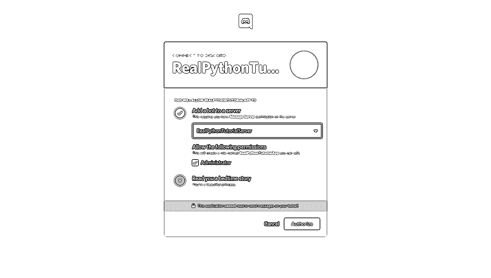
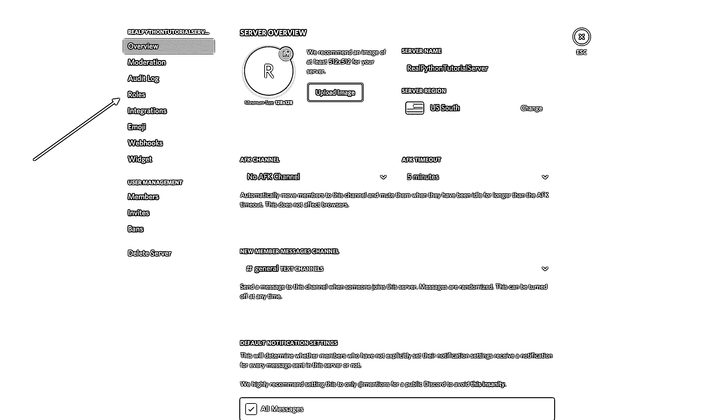
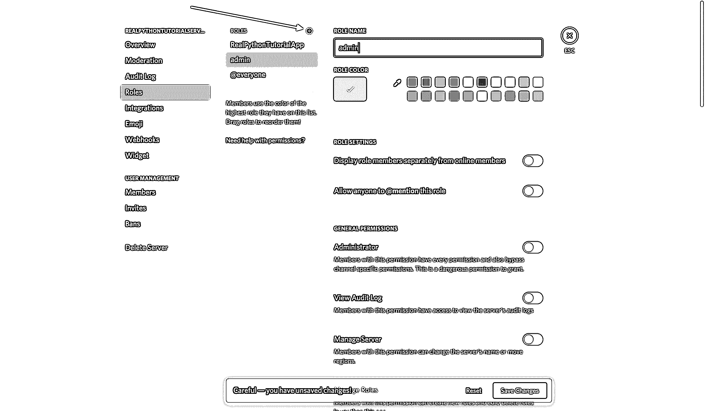

# 如何用 Python 制作不和谐机器人

> 原文：<https://realpython.com/how-to-make-a-discord-bot-python/>

*立即观看**本教程有真实 Python 团队创建的相关视频课程。配合文字教程一起看，加深理解: [**用 Python 创建不和谐机器人**](/courses/discord-bot-python/)

在一个视频游戏对许多人如此重要的世界里，围绕游戏的交流和社区是至关重要的。Discord 在一个精心设计的包中提供了这两种功能以及更多功能。在本教程中，你将学习如何用 Python 制作一个不和谐机器人，这样你就可以充分利用这个奇妙的平台。

到本文结束时，您将了解到:

*   什么是不和谐，为什么它如此有价值
*   如何通过开发者门户制作不和谐机器人
*   如何创建不和谐的连接
*   如何处理事件
*   如何接受命令和验证假设
*   如何与各种不和谐 API 交互

你将从学习什么是不和谐以及它为什么有价值开始。

## 什么是不和谐？

[Discord](https://discordapp.com/) 是一个面向游戏玩家的语音和文字交流平台。

玩家、飘带和开发者使用 Discord 来讨论游戏、回答问题、边玩边聊天等等。它甚至有一个游戏商店，提供评论和订阅服务。它几乎是游戏社区的一站式商店。

虽然使用 Discord 的[API](https://discordapp.com/developers/docs/intro)可以构建很多东西，但本教程将关注一个特定的学习成果:如何用 Python 制作 Discord 机器人。

[*Remove ads*](/account/join/)

## 什么是机器人？

不和越来越普遍。因此，自动化流程，如禁止不适当的用户和响应用户请求，对于社区的繁荣和发展至关重要。

外观和行为都像用户，并自动响应 Discord 上的事件和命令的自动化程序被称为 **bot 用户**。Discord bot 用户(或者仅仅是**bot**)拥有几乎[无限的应用](https://discordbots.org)。

例如，假设你正在管理一个新的 Discord 公会，一个用户第一次加入。兴奋之余，你可能会亲自接触到那个用户，欢迎他们加入你的社区。你也可以告诉他们你的渠道，或者请他们介绍自己。

用户感到受欢迎，喜欢在你的公会中进行讨论，反过来，他们会邀请朋友。

随着时间的推移，你的社区变得越来越大，以至于不再可能亲自接触每个新成员，但你仍然希望给他们发送一些东西，以承认他们是公会的新成员。

有了机器人，就有可能自动对新成员加入你的公会做出反应。您甚至可以基于上下文定制它的行为，并控制它如何与每个新用户交互。

这很棒，但这只是一个机器人如何有用的小例子。一旦你知道如何制作机器人，你就有很多机会去创造它们。

**注意:**虽然 Discord 允许你创建处理语音通信的机器人，但本文将坚持服务的文本方面。

创建机器人有两个关键步骤:

1.  在 Discord 上创建机器人用户，并向公会注册。
2.  编写使用 Discord 的 API 并实现你的机器人行为的代码。

在下一节中，您将学习如何在 Discord 的[开发者门户](https://discordapp.com/developers/applications)中制作一个 Discord 机器人。

## 如何在开发者门户制作不和谐机器人

在您可以深入任何 Python 代码来处理事件和创建令人兴奋的自动化之前，您需要首先创建一些 Discord 组件:

1.  一个账户
2.  一份申请
3.  一个机器人
4.  一个行会

在接下来的几节中，您将了解到关于每一部分的更多信息。

一旦你创建了所有这些组件，你就可以通过向你的公会注册你的机器人来把它们连接在一起。

你可以从前往 Discord 的[开发者门户](http://discordapp.com/developers/applications)开始。

### 创建不一致账户

您首先看到的是一个登录页面，如果您有一个现有帐户，您需要在该页面上登录，或者创建一个新帐户:

[](https://files.realpython.com/media/discord-bot-register-user.41a9c2bc4db9.png)

如果您需要创建一个新账户，那么点击*下方的*注册*按钮，登录*，输入您的账户信息。

**重要提示:**你需要验证你的电子邮件，然后才能继续。

完成后，您将被重定向到开发人员门户主页，在那里您将创建自己的应用程序。

[*Remove ads*](/account/join/)

### 创建应用程序

一个**应用程序**允许您通过提供认证令牌、指定权限等方式与 Discord 的 API 进行交互。

要创建新应用程序，选择*新应用程序*:

[](https://files.realpython.com/media/discord-bot-new-app.40b4a51bb57d.png)

接下来，系统会提示您命名应用程序。选择一个名称，点击*创建*:

[](https://files.realpython.com/media/discord-bot-name-application.8ccfc8a69cb5.png)

恭喜你！你提出了不和谐的申请。在出现的屏幕上，您可以看到关于您的应用程序的信息:

[](https://files.realpython.com/media/discord-bot-app-info.146a24d590a6.png)

请记住，任何与 Discord APIs 交互的程序都需要 Discord 应用程序，而不仅仅是 bot。与 Bot 相关的 API 只是 Discord 总接口的一个子集。

然而，由于本教程是关于如何制作一个不和谐机器人，导航到左侧导航列表中的*机器人*选项卡。

### 创建一个机器人

正如您在前面几节中了解到的，bot 用户是一个在 Discord 上监听并自动对某些事件和命令做出反应的用户。

为了让您的代码在 Discord 上实际显示出来，您需要创建一个 bot 用户。为此，选择*添加机器人*:

[](https://files.realpython.com/media/discord-bot-add-bot.4735c88ff16b.png)

确认要将 bot 添加到应用程序后，您将在门户中看到新的 bot 用户:

[](https://files.realpython.com/media/discord-bot-created.fbdf4a021810.png)

注意，默认情况下，您的 bot 用户将继承您的应用程序的名称。取而代之的是，将用户名更新为更像机器人的东西，比如`RealPythonTutorialBot`和*保存更改*:

[](https://files.realpython.com/media/discord-bot-rename-bot.008fd6ed6354.png)

现在，机器人已经准备好了，但是去哪里呢？

如果一个机器人用户不与其他用户互动，它就没有用。接下来，您将创建一个公会，以便您的机器人可以与其他用户进行交互。

[*Remove ads*](/account/join/)

### 创建公会

一个**公会**(或者一个**服务器**，因为它经常被称为 Discord 的用户界面)是一组用户聚集聊天的特定频道。

**注意:**虽然**公会**和**服务器**是可以互换的，但本文将使用术语**公会**，主要是因为 API 坚持使用相同的术语。术语**服务器**只会在图形用户界面中提到公会时使用。

例如，假设你想创建一个空间，让用户可以聚在一起讨论你的最新游戏。你可以从创建一个行会开始。然后，在你的公会中，你可以有多个频道，例如:

*   **一般讨论:**一个让用户畅所欲言的渠道
*   **剧透，当心:**一个让已经完成你的游戏的用户谈论所有游戏结局的渠道
*   **公告:**一个让你宣布游戏更新和用户讨论的渠道

一旦你创建了你的公会，你会邀请其他用户来填充它。

所以，要创建一个公会，前往你的不和谐[主页](https://discordapp.com/channels/@me)页面:

[](https://files.realpython.com/media/discord-bot-homepage.f533b989cedd.png)

从这个主页，你可以查看和添加朋友，直接消息和公会。在这里，选择网页左侧的 *+* 图标，向*添加服务器*:

[](https://files.realpython.com/media/discord-bot-add-server.bd5a5a58c50c.png)

这将出现两个选项，*创建服务器*和*加入服务器*。在这种情况下，选择*创建服务器*并输入你的公会名称:

[](https://files.realpython.com/media/discord-bot-create-server.922dba753792.png)

一旦你创建完你的公会，你将会在右边看到用户，在左边看到频道:

[](https://files.realpython.com/media/discord-bot-server.cba61f3781cf.png)

Discord 的最后一步是在你的新公会中注册你的机器人。

### 向公会添加机器人

机器人不能像普通用户一样接受邀请。相反，您将使用 OAuth2 协议添加您的 bot。

**技术细节:** [OAuth2](https://oauth.net/2/) 是一个处理授权的协议，其中服务可以根据应用程序的凭证和允许的范围授予客户端应用程序有限的访问权限。

为此，请返回到[开发者门户](http://discordapp.com/developers/applications)并从左侧导航中选择 OAuth2 页面:

[](https://files.realpython.com/media/discord-bot-oauth2.7c000bfe571b.png)

在这个窗口中，您将看到 OAuth2 URL 生成器。

这个工具会生成一个授权 URL，该 URL 会点击 Discord 的 OAuth2 API，并使用您的应用程序的凭证来授权 API 访问。

在这种情况下，您需要使用应用程序的 OAuth2 凭证授予应用程序的 bot 用户对 Discord APIs 的访问权。

为此，向下滚动并从*范围*选项中选择*机器人*，从*机器人权限*中选择*管理员*:

[](https://files.realpython.com/media/discord-bot-scopes.ee333b7a5987.png)

现在，Discord 已经用选定的范围和权限生成了您的应用程序的授权 URL。

**免责声明:**当我们在本教程中使用*管理员*时，在现实世界的应用程序中授予权限时，您应该尽可能地细化。

选择为您生成的 URL 旁边的*复制*，将其粘贴到您的浏览器中，并从下拉选项中选择您的公会:

[](https://files.realpython.com/media/discord-bot-select-server.3cd1af626256.png)

点击*授权*，大功告成！

注意:在继续前进之前，你可能会得到一个 [reCAPTCHA](https://en.wikipedia.org/wiki/ReCAPTCHA) 。如果是这样，你需要证明你是一个人。

如果你回到你的公会，你会看到机器人已经被添加:

[](https://files.realpython.com/media/discord-bot-added-to-guild.4a6b4477bc1e.png)

总之，您已经创建了:

*   一个**应用程序**，你的机器人将使用它来验证 Discord 的 API
*   一个**机器人**用户，你将使用它与你的公会中的其他用户和事件进行互动
*   一个**公会**，你的用户帐号和你的机器人用户将在其中活动
*   一个 **Discord** 账号，你用它创建了所有其他东西，并且你将使用它与你的机器人进行交互

现在，你知道如何使用开发者门户制作一个不和谐机器人。接下来是有趣的事情:用 Python 实现你的机器人！

[*Remove ads*](/account/join/)

## 如何用 Python 制作不和谐机器人

既然你正在学习如何用 Python 制作一个不和谐机器人，你将使用`discord.py`。

[`discord.py`](https://discordpy.readthedocs.io/en/latest/index.html) 是一个 Python 库，它以高效的 Python 方式详尽地实现了 Discord 的 API。这包括利用 Python 实现的[异步 IO](https://realpython.com/async-io-python/) 。

从用 [`pip`](https://realpython.com/what-is-pip/) 安装`discord.py`开始:

```py
$ pip install -U discord.py
```

现在您已经安装了`discord.py`，您将使用它来创建您与 Discord 的第一个连接！

## 创建不和谐连接

实现您的 bot 用户的第一步是创建一个到 Discord 的连接。使用`discord.py`，您可以通过创建`Client`的一个实例来实现这一点:

```py
# bot.py
import os

import discord
from dotenv import load_dotenv

load_dotenv()
TOKEN = os.getenv('DISCORD_TOKEN')

client = discord.Client()

@client.event
async def on_ready():
    print(f'{client.user} has connected to Discord!')

client.run(TOKEN)
```

一个`Client`是一个代表与不和谐的联系的对象。一个`Client`处理事件，跟踪状态，通常与 Discord APIs 交互。

这里，您已经创建了一个`Client`并实现了它的`on_ready()`事件处理程序，当`Client`已经建立了到 Discord 的连接并且已经准备好 Discord 发送的数据，比如登录状态、公会和频道数据等等时，它将处理该事件。

换句话说，一旦`client`准备好进一步的操作，就会调用`on_ready()`(并打印您的消息)。在本文的后面，您将了解更多关于事件处理程序的内容。

当您处理像 Discord token 这样的秘密时，从一个环境变量将它读入您的程序是一个很好的实践。使用环境变量有助于您:

*   避免将秘密放入源代码控制中
*   在开发和生产环境中使用不同的变量，而无需更改代码

虽然您可以`export DISCORD_TOKEN={your-bot-token}`，但是一个更简单的解决方案是在所有运行这段代码的机器上保存一个`.env`文件。这不仅更容易，因为你不必每次清除外壳时都`export`你的令牌，而且它还保护你不将秘密存储在外壳的历史中。

在与`bot.py`相同的目录下创建一个名为`.env`的文件:

```py
# .env
DISCORD_TOKEN={your-bot-token}
```

你需要用你的机器人令牌替换`{your-bot-token}`，这可以通过返回到[开发者门户](http://discordapp.com/developers/applications)上的*机器人*页面并点击*令牌*部分下的*复制*来获得:

[](https://files.realpython.com/media/discord-bot-copy-token.1228e6cb6cba.png)

回头看一下`bot.py`代码，您会注意到一个名为 [`dotenv`](https://github.com/theskumar/python-dotenv) 的库。这个库对于处理`.env`文件很方便。`load_dotenv()`将环境变量从一个`.env`文件加载到您的 shell 的环境变量中，这样您就可以在您的代码中使用它们。

用`pip`安装`dotenv`:

```py
$ pip install -U python-dotenv
```

最后，`client.run()`使用您的机器人令牌运行您的`Client`。

现在您已经设置了`bot.py`和`.env`，您可以运行您的代码了:

```py
$ python bot.py
RealPythonTutorialBot#9643 has connected to Discord!
```

太好了！您的`Client`已经使用您的机器人令牌连接到 Discord。在下一节中，您将通过与更多的 Discord APIs 交互来构建这个`Client`。

[*Remove ads*](/account/join/)

## 与不和谐 API 交互

使用一个`Client`，你可以访问各种各样的 Discord APIs。

例如，假设您想将注册 bot 用户的公会的名称和标识符写入控制台。

首先，您需要添加一个新的环境变量:

```py
# .env
DISCORD_TOKEN={your-bot-token}
DISCORD_GUILD={your-guild-name}
```

不要忘记，您需要用实际值替换这两个占位符:

1.  `{your-bot-token}`
2.  `{your-guild-name}`

请记住，一旦`Client`建立了连接并准备好数据，Discord 就会调用您之前使用过的`on_ready()`。所以，你可以依靠`on_ready()`内部可用的公会数据:

```py
# bot.py
import os

import discord
from dotenv import load_dotenv

load_dotenv()
TOKEN = os.getenv('DISCORD_TOKEN')
GUILD = os.getenv('DISCORD_GUILD')

client = discord.Client()

@client.event
async def on_ready():
    for guild in client.guilds:
        if guild.name == GUILD:
            break

    print(
        f'{client.user} is connected to the following guild:\n'
        f'{guild.name}(id: {guild.id})'
    )

client.run(TOKEN)
```

这里你循环了一下 Discord 已经发来的公会数据`client`，也就是`client.guilds`。然后，你找到名字匹配的公会，打印一个[格式的字符串](https://realpython.com/python-f-strings/)到`stdout`。

**注意:**尽管在教程的这一点上你可以相当自信地认为你的机器人只连接到一个公会(所以`client.guilds[0]`会更简单)，但重要的是要认识到一个机器人用户可以连接到许多公会。

因此，一个更健壮的解决方案是遍历`client.guilds`来找到您正在寻找的那个。

运行程序以查看结果:

```py
$ python bot.py
RealPythonTutorialBot#9643 is connected to the following guild:
RealPythonTutorialServer(id: 571759877328732195)
```

太好了！您可以看到 bot 的名称、服务器的名称以及服务器的标识号。

另一个有趣的数据是你可以从一个公会中获取的，这个公会的用户列表:

```py
# bot.py
import os

import discord
from dotenv import load_dotenv

load_dotenv()
TOKEN = os.getenv('DISCORD_TOKEN')
GUILD = os.getenv('DISCORD_GUILD')

client = discord.Client()

@client.event
async def on_ready():
    for guild in client.guilds:
        if guild.name == GUILD:
            break

    print(
        f'{client.user} is connected to the following guild:\n'
        f'{guild.name}(id: {guild.id})\n'
    )

    members = '\n - '.join([member.name for member in guild.members])
    print(f'Guild Members:\n - {members}')

client.run(TOKEN)
```

通过循环浏览`guild.members`，你调出了公会所有成员的名字，并用一个格式化的字符串打印出来。

当你运行这个程序时，你应该至少能看到你创建公会时使用的账号名称和机器人用户本身的名称:

```py
$ python bot.py
RealPythonTutorialBot#9643 is connected to the following guild:
RealPythonTutorialServer(id: 571759877328732195)

Guild Members:
 - aronq2
 - RealPythonTutorialBot
```

这些例子仅仅触及了 Discord 上可用 API 的皮毛，请务必查看它们的[文档](https://discordpy.readthedocs.io/en/latest/api.html#)以了解它们所能提供的一切。

接下来，您将了解一些实用函数以及它们如何简化这些示例。

[*Remove ads*](/account/join/)

## 使用实用功能

让我们再来看一下上一节中的例子，在这个例子中，您打印了机器人公会的名称和标识符:

```py
# bot.py
import os

import discord
from dotenv import load_dotenv

load_dotenv()
TOKEN = os.getenv('DISCORD_TOKEN')
GUILD = os.getenv('DISCORD_GUILD')

client = discord.Client()

@client.event
async def on_ready():
    for guild in client.guilds:
        if guild.name == GUILD:
            break

    print(
        f'{client.user} is connected to the following guild:\n'
        f'{guild.name}(id: {guild.id})'
    )

client.run(TOKEN)
```

您可以使用`discord.py`中的一些实用函数来清理这些代码。

[`discord.utils.find()`](https://discordpy.readthedocs.io/en/latest/api.html#discord.utils.find) 是一个实用程序，它可以通过用一个直观的抽象函数替换`for`循环来提高代码的简单性和可读性:

```py
# bot.py
import os

import discord
from dotenv import load_dotenv

load_dotenv()
TOKEN = os.getenv('DISCORD_TOKEN')
GUILD = os.getenv('DISCORD_GUILD')

client = discord.Client()

@client.event
async def on_ready():
    guild = discord.utils.find(lambda g: g.name == GUILD, client.guilds)
    print(
        f'{client.user} is connected to the following guild:\n'
        f'{guild.name}(id: {guild.id})'
    )

client.run(TOKEN)
```

`find()`接受一个名为**谓词**的函数，它标识了您正在寻找的 iterable 中元素的一些特征。这里，您使用了一种特殊类型的匿名函数，称为[λ](https://realpython.com/python-lambda/)，作为谓词。

在这种情况下，您试图找到与您存储在`DISCORD_GUILD`环境变量中的名称相同的公会。一旦`find()`在 iterable 中找到满足谓词的元素，它将返回该元素。这基本上相当于上一个例子中的`break`语句，但是更清晰。

`discord.py`甚至用 [`get()`实用程序](https://discordpy.readthedocs.io/en/latest/api.html#discord.utils.get)进一步抽象了这个概念:

```py
# bot.py
import os

import discord
from dotenv import load_dotenv

load_dotenv()
TOKEN = os.getenv('DISCORD_TOKEN')
GUILD = os.getenv('DISCORD_GUILD')

client = discord.Client()

@client.event
async def on_ready():
    guild = discord.utils.get(client.guilds, name=GUILD)
    print(
        f'{client.user} is connected to the following guild:\n'
        f'{guild.name}(id: {guild.id})'
    )

client.run(TOKEN)
```

`get()`接受 iterable 和一些关键字参数。关键字参数表示 iterable 中元素的属性，所有这些属性都必须满足，`get()`才能返回元素。

在本例中，您已经将`name=GUILD`标识为必须满足的属性。

**技术细节:**在幕后，`get()`实际上使用了`attrs`关键字参数来构建一个谓词，然后用它来调用`find()`。

既然您已经学习了与 API 交互的基本知识，那么您将更深入地研究一下您一直用来访问它们的函数:`on_ready()`。

## 响应事件

你已经知道`on_ready()`是一个事件。事实上，您可能已经注意到，它在代码中是由`client.event` [装饰器](https://realpython.com/primer-on-python-decorators/)标识的。

但是什么是事件呢？

一个**事件**是不一致时发生的事情，你可以用它来触发代码中的反应。您的代码将侦听并响应事件。

使用您已经看到的例子，`on_ready()`事件处理程序处理`Client`已经连接到 Discord 并准备其响应数据的事件。

因此，当 Discord 触发一个事件时，`discord.py`会将事件数据路由到您连接的`Client`上相应的事件处理程序。

`discord.py`中有两种方法来柠檬一个事件处理程序:

1.  使用`client.event`装饰器
2.  创建`Client`的子类并覆盖它的处理方法

您已经看到了使用装饰器的实现。接下来，看看如何子类化`Client`:

```py
# bot.py
import os

import discord
from dotenv import load_dotenv

load_dotenv()
TOKEN = os.getenv('DISCORD_TOKEN')

class CustomClient(discord.Client):
    async def on_ready(self):
        print(f'{self.user} has connected to Discord!')

client = CustomClient()
client.run(TOKEN)
```

这里，就像前面一样，您已经创建了一个`client`变量，并用您的 Discord 令牌调用了`.run()`。然而，实际的`Client`是不同的。没有使用普通的基类，`client`是`CustomClient`的一个实例，它有一个被覆盖的`on_ready()`函数。

事件的两种实现风格没有区别，但是本教程将主要使用装饰器版本，因为它看起来与您实现`Bot`命令的方式相似，这是您稍后将涉及的主题。

**技术细节:**不管你如何实现你的事件处理程序，有一点必须是一致的:`discord.py`中的所有事件处理程序必须是[协程](https://realpython.com/async-io-python/#the-asyncawait-syntax-and-native-coroutines)。

现在，您已经学习了如何创建事件处理程序，让我们来看一些您可以创建的处理程序的不同示例。

[*Remove ads*](/account/join/)

### 欢迎新成员

之前，您看到了响应成员加入公会事件的示例。在这个例子中，你的机器人用户可以向他们发送消息，欢迎他们加入你的 Discord 社区。

现在，您将使用事件处理程序在您的`Client`中实现该行为，并在 Discord 中验证其行为:

```py
# bot.py
import os

import discord
from dotenv import load_dotenv

load_dotenv()
TOKEN = os.getenv('DISCORD_TOKEN')

client = discord.Client()

@client.event
async def on_ready():
    print(f'{client.user.name} has connected to Discord!')

@client.event
async def on_member_join(member):
    await member.create_dm()
    await member.dm_channel.send(
        f'Hi {member.name}, welcome to my Discord server!'
    )

client.run(TOKEN)
```

像以前一样，您通过在格式化字符串中打印 bot 用户名来处理`on_ready()`事件。然而，新的是`on_member_join()`事件处理程序的实现。

`on_member_join()`顾名思义，处理新成员加入公会的事件。

在这个例子中，您使用了`member.create_dm()`来创建一个直接消息通道。然后，您使用该渠道向新成员发送直接消息。

**技术细节:**注意`member.create_dm()`和`member.dm_channel.send()`前的`await`关键词。

暂停周围协程的执行，直到每个协程的执行完成。

现在，让我们测试你的机器人的新行为。

首先，运行新版本的`bot.py`，等待`on_ready()`事件触发，将您的消息记录到`stdout`:

```py
$ python bot.py
RealPythonTutorialBot has connected to Discord!
```

现在，前往 [Discord](https://discordapp.com/) ，登录，并通过在屏幕左侧选择公会来导航至您的公会:

[](https://files.realpython.com/media/discord-bot-navigate-to-server.dfef0364630f.png)

选择您选择的公会列表旁边的*邀请人*。勾选*框，将此链接设置为永不过期*，并复制链接:

[](https://files.realpython.com/media/discord-bot-copy-invite.0dd6b229c819.png)

现在，复制了邀请链接后，创建一个新帐户并使用您的邀请链接加入公会:

[](https://files.realpython.com/media/discord-bot-accept-invite.4b33a1ba7062.png)

首先，你会看到 Discord 默认用一条自动消息把你介绍给公会。更重要的是，请注意屏幕左侧的标记，它会通知您有新消息:

[](https://files.realpython.com/media/discord-bot-direct-message-notification.95e423f72678.png)

当您选择它时，您会看到一条来自您的 bot 用户的私人消息:

[](https://files.realpython.com/media/discord-bot-direct-message.7f49832b7bb7.png)

完美！你的机器人用户现在用最少的代码与其他用户交互。

接下来，您将学习如何在聊天中回复特定的用户消息。

[*Remove ads*](/account/join/)

### 回复信息

让我们通过处理`on_message()`事件来添加您的机器人的先前功能。

在你的机器人可以访问的频道中发布消息时发生。在这个例子中，您将使用电视节目[中的一行程序来响应消息`'99!'`:](https://www.nbc.com/brooklyn-nine-nine)

```
@client.event
async def on_message(message):
    if message.author == client.user:
        return

    brooklyn_99_quotes = [
        'I\'m the human form of the 💯 emoji.',
        'Bingpot!',
        (
            'Cool. Cool cool cool cool cool cool cool, '
            'no doubt no doubt no doubt no doubt.'
        ),
    ]

    if message.content == '99!':
        response = random.choice(brooklyn_99_quotes)
        await message.channel.send(response)
```py

这个事件处理程序的主体查看`message.content`，检查它是否等于`'99!'`，如果等于，就向消息的通道发送一个随机引用作为响应。

另一部分很重要:

```
if message.author == client.user:
    return
```py

因为`Client`不能区分机器人用户和普通用户帐户，所以你的`on_message()`处理程序应该防止潜在的[递归](https://realpython.com/python-recursion/)情况，在这种情况下，机器人发送它自己可能处理的消息。

举例来说，假设你想让你的机器人监听用户之间的对话`'Happy Birthday'`。您可以像这样实现您的`on_message()`处理程序:

```
@client.event
async def on_message(message):
    if 'happy birthday' in message.content.lower():
        await message.channel.send('Happy Birthday! 🎈🎉')
```py

除了这个事件处理程序潜在的垃圾性质之外，它还有一个毁灭性的副作用。机器人响应的消息包含了它将要处理的相同的消息！

因此，如果频道中的一个人对另一个人说“生日快乐”，那么机器人也会附和……一遍又一遍……一遍又一遍:

[](https://files.realpython.com/media/discord-bot-happy-birthday-repetition.864acfe23979.png)

这就是为什么比较`message.author`和`client.user`(你的机器人用户)很重要，并且忽略它自己的任何信息。

所以，我们来修正一下`bot.py`:

```
# bot.py
import os
import random

import discord
from dotenv import load_dotenv

load_dotenv()
TOKEN = os.getenv('DISCORD_TOKEN')

client = discord.Client()

@client.event
async def on_ready():
    print(f'{client.user.name} has connected to Discord!')

@client.event
async def on_member_join(member):
    await member.create_dm()
    await member.dm_channel.send(
        f'Hi {member.name}, welcome to my Discord server!'
    )

@client.event
async def on_message(message):
    if message.author == client.user:
        return

    brooklyn_99_quotes = [
        'I\'m the human form of the 💯 emoji.',
        'Bingpot!',
        (
            'Cool. Cool cool cool cool cool cool cool, '
            'no doubt no doubt no doubt no doubt.'
        ),
    ]

    if message.content == '99!':
        response = random.choice(brooklyn_99_quotes)
        await message.channel.send(response)

client.run(TOKEN)
```py

不要忘记模块顶部的`import random`，因为`on_message()`处理器利用了`random.choice()`。

运行程序:

```
$ python bot.py
RealPythonTutorialBot has connected to Discord!
```py

最后，前往 Discord 进行测试:

[](https://files.realpython.com/media/discord-bot-brooklyn-99-quotes.e934592e025e.png)

太好了！现在，您已经看到了处理一些常见不和谐事件的几种不同方法，您将学习如何处理事件处理程序可能引发的错误。

[*Remove ads*](/account/join/)

### 处理异常

正如你已经看到的，`discord.py`是一个事件驱动的系统。这种对事件的关注甚至延伸到了例外。当一个事件处理程序[引发一个`Exception`](https://realpython.com/python-exceptions/) 时，不和调用`on_error()`。

`on_error()`的默认行为是将错误消息和堆栈跟踪写入`stderr`。为了测试这一点，向`on_message()`添加一个特殊的消息处理程序:

```
# bot.py
import os
import random

import discord
from dotenv import load_dotenv

load_dotenv()
TOKEN = os.getenv('DISCORD_TOKEN')

client = discord.Client()

@client.event
async def on_ready():
    print(f'{client.user.name} has connected to Discord!')

@client.event
async def on_member_join(member):
    await member.create_dm()
    await member.dm_channel.send(
        f'Hi {member.name}, welcome to my Discord server!'
    )

@client.event
async def on_message(message):
    if message.author == client.user:
        return

    brooklyn_99_quotes = [
        'I\'m the human form of the 💯 emoji.',
        'Bingpot!',
        (
            'Cool. Cool cool cool cool cool cool cool, '
            'no doubt no doubt no doubt no doubt.'
        ),
    ]

    if message.content == '99!':
        response = random.choice(brooklyn_99_quotes)
        await message.channel.send(response)
 elif message.content == 'raise-exception': raise discord.DiscordException 
client.run(TOKEN)
```py

新的`raise-exception`消息处理程序允许你发出一个`DiscordException` on 命令。

运行程序并在不和谐频道中键入`raise-exception`:

[](https://files.realpython.com/media/discord-bot-raise-exception.7fcae85fb06e.png)

您现在应该可以在控制台中看到由您的`on_message()`处理程序引发的`Exception`:

```
$ python bot.py
RealPythonTutorialBot has connected to Discord!
Ignoring exception in on_message
Traceback (most recent call last):
 File "/Users/alex.ronquillo/.pyenv/versions/discord-venv/lib/python3.7/site-packages/discord/client.py", line 255, in _run_event
 await coro(*args, **kwargs)
 File "bot.py", line 42, in on_message
 raise discord.DiscordException
discord.errors.DiscordException
```py

该异常被默认的错误处理程序捕获，因此输出包含消息`Ignoring exception in on_message`。让我们通过处理这个特定的错误来解决这个问题。为此，您将捕获`DiscordException`并由[将其写入文件](https://realpython.com/working-with-files-in-python/)。

`on_error()`事件处理程序将`event`作为第一个参数。在这种情况下，我们期望`event`是`'on_message'`。它还接受`*args`和`**kwargs`作为传递给原始事件处理程序的灵活的位置和关键字参数。

因此，由于`on_message()`采用单个参数`message`，我们期望`args[0]`是用户在 Discord 信道中发送的`message`:

```
@client.event
async def on_error(event, *args, **kwargs):
    with open('err.log', 'a') as f:
        if event == 'on_message':
            f.write(f'Unhandled message: {args[0]}\n')
        else:
            raise
```py

如果`Exception`起源于`on_message()`事件处理程序，你`.write()`一个格式化的字符串到文件`err.log`。如果另一个事件引发了一个`Exception`，那么我们只是希望我们的处理程序重新引发异常来调用默认行为。

运行`bot.py`并再次发送`raise-exception`消息，查看`err.log`中的输出:

```
$ cat err.log
Unhandled message: <Message id=573845548923224084 pinned=False author=<Member id=543612676807327754 name='alexronquillo' discriminator='0933' bot=False nick=None guild=<Guild id=571759877328732195 name='RealPythonTutorialServer' chunked=True>>>
```py

不仅仅是一个堆栈跟踪，您还有一个更具信息性的错误，显示了导致`on_message()`提高`DiscordException`的`message`，并保存到一个文件中，以便更持久地保存。

**技术细节:**如果你想在向`err.log`写错误信息时考虑实际的`Exception`，那么你可以使用来自`sys`的函数，比如 [`exc_info()`](https://docs.python.org/library/sys.html#sys.exc_info) 。

现在，您已经有了一些处理不同事件和与 Discord APIs 交互的经验，您将了解一个名为`Bot`的`Client`子类，它实现了一些方便的、特定于 bot 的功能。

## 连接机器人

一个`Bot`是一个`Client`的子类，它增加了一点额外的功能，这在你创建机器人用户时很有用。例如，`Bot`可以处理事件和命令，调用验证检查，等等。

在进入`Bot`特有的特性之前，先把`bot.py`转换成使用`Bot`而不是`Client`:

```
# bot.py
import os
import random
from dotenv import load_dotenv

# 1
from discord.ext import commands

load_dotenv()
TOKEN = os.getenv('DISCORD_TOKEN')

# 2
bot = commands.Bot(command_prefix='!')

@bot.event
async def on_ready():
    print(f'{bot.user.name} has connected to Discord!')

bot.run(TOKEN)
```py

如您所见，`Bot`可以像`Client`一样处理事件。然而，请注意`Client`和`Bot`的区别:

1.  `Bot`是从`discord.ext.commands`模块导入的。
2.  `Bot`初始化器需要一个`command_prefix`，这将在下一节中详细介绍。

扩展库`ext`提供了几个有趣的组件来帮助你创建一个 Discord `Bot`。其中一个这样的组件就是 [`Command`](https://discordpy.readthedocs.io/en/latest/ext/commands/commands.html) 。

[*Remove ads*](/account/join/)

### 使用`Bot`命令

一般来说，**命令**是用户给机器人的命令，让它做一些事情。命令不同于事件，因为它们是:

*   任意定义的
*   由用户直接调用
*   灵活，就其界面而言

用技术术语来说， **`Command`** 是一个对象，它包装了一个由文本命令调用的函数。文本命令必须以由`Bot`对象定义的`command_prefix`开始。

让我们来看看一件旧事，以便更好地理解这是怎么回事:

```
# bot.py
import os
import random

import discord
from dotenv import load_dotenv

load_dotenv()
TOKEN = os.getenv('DISCORD_TOKEN')

client = discord.Client()

@client.event
async def on_message(message):
    if message.author == client.user:
        return

    brooklyn_99_quotes = [
        'I\'m the human form of the 💯 emoji.',
        'Bingpot!',
        (
            'Cool. Cool cool cool cool cool cool cool, '
            'no doubt no doubt no doubt no doubt.'
        ),
    ]

    if message.content == '99!':
        response = random.choice(brooklyn_99_quotes)
        await message.channel.send(response)

client.run(TOKEN)
```py

在这里，您创建了一个`on_message()`事件处理程序，它接收`message`字符串并将其与预定义的选项`'99!'`进行比较。

使用`Command`，您可以将此示例转换得更具体:

```
# bot.py
import os
import random

from discord.ext import commands
from dotenv import load_dotenv

load_dotenv()
TOKEN = os.getenv('DISCORD_TOKEN')

bot = commands.Bot(command_prefix='!')

@bot.command(name='99')
async def nine_nine(ctx):
    brooklyn_99_quotes = [
        'I\'m the human form of the 💯 emoji.',
        'Bingpot!',
        (
            'Cool. Cool cool cool cool cool cool cool, '
            'no doubt no doubt no doubt no doubt.'
        ),
    ]

    response = random.choice(brooklyn_99_quotes)
    await ctx.send(response)

bot.run(TOKEN)
```py

关于使用`Command`，有几个重要的特征需要理解:

1.  不像以前那样使用`bot.event`，而是使用`bot.command()`，传递调用命令(`name`)作为它的参数。

2.  现在只有在聊天中提到`!99`时才会调用该功能。这不同于`on_message()`事件，后者在用户发送消息时执行，而不管内容如何。

3.  该命令必须以感叹号(`!`)为前缀，因为那是您在`Bot`的初始化器中定义的`command_prefix`。

4.  任何`Command`函数(技术上称为`callback`)必须接受至少一个参数，称为`ctx`，它是围绕被调用`Command`的 [`Context`](https://discordpy.readthedocs.io/en/latest/ext/commands/commands.html#invocation-context) 。

一个`Context`保存用户调用`Command`的频道和公会等数据。

运行程序:

```
$ python bot.py
```py

随着你的机器人运行，你现在可以前往 Discord 来尝试你的新命令:

[](https://files.realpython.com/media/discord-bot-brooklyn-99-command.f01b21540756.png)

从用户的角度来看，实际的区别在于前缀有助于形式化命令，而不是简单地对特定的`on_message()`事件做出反应。

这也带来了其他巨大的好处。例如，您可以调用`!help`命令来查看您的`Bot`处理的所有命令:

[](https://files.realpython.com/media/discord-bot-help-command.a2ec772cc910.png)

如果你想给你的命令添加一个描述，让`help`消息提供更多信息，只需将一个`help`描述传递给`.command()`装饰器:

```
# bot.py
import os
import random

from discord.ext import commands
from dotenv import load_dotenv

load_dotenv()
TOKEN = os.getenv('DISCORD_TOKEN')

bot = commands.Bot(command_prefix='!')

@bot.command(name='99', help='Responds with a random quote from Brooklyn 99')
async def nine_nine(ctx):
    brooklyn_99_quotes = [
        'I\'m the human form of the 💯 emoji.',
        'Bingpot!',
        (
            'Cool. Cool cool cool cool cool cool cool, '
            'no doubt no doubt no doubt no doubt.'
        ),
    ]

    response = random.choice(brooklyn_99_quotes)
    await ctx.send(response)

bot.run(TOKEN)
```py

现在，当用户调用`!help`命令时，您的机器人将呈现您的命令的描述:

[](https://files.realpython.com/media/discord-bot-help-description.7f710c984c66.png)

请记住，所有这些功能只存在于`Bot`子类，而不是`Client`超类。

`Command`还有另一个有用的功能:使用`Converter`来改变其参数类型的能力。

### 自动转换参数

使用命令的另一个好处是能够用**转换**参数。

有时，您需要一个特定类型的参数，但是默认情况下，`Command`函数的参数是字符串。一个 [`Converter`](https://discordpy.readthedocs.io/en/latest/ext/commands/commands.html#converters) 让你把那些参数转换成你期望的类型。

例如，如果您想为您的 bot 用户构建一个`Command`来模拟掷骰子(知道您目前所学的)，您可以这样定义它:

```
@bot.command(name='roll_dice', help='Simulates rolling dice.')
async def roll(ctx, number_of_dice, number_of_sides):
    dice = [
        str(random.choice(range(1, number_of_sides + 1)))
        for _ in range(number_of_dice)
    ]
    await ctx.send(', '.join(dice))
```py

您定义了`roll`来接受两个参数:

1.  掷骰子的数目
2.  每个骰子的边数

然后，用`.command()`修饰它，这样就可以用`!roll_dice`命令调用它。最后，你把`.send()`的结果用消息传回了`channel`。

虽然这看起来是正确的，但事实并非如此。不幸的是，如果您运行`bot.py`，并在 Discord 通道中调用`!roll_dice`命令，您将看到以下错误:

```
$ python bot.py
Ignoring exception in command roll_dice:
Traceback (most recent call last):
 File "/Users/alex.ronquillo/.pyenv/versions/discord-venv/lib/python3.7/site-packages/discord/ext/commands/core.py", line 63, in wrapped
 ret = await coro(*args, **kwargs)
 File "bot.py", line 40, in roll
 for _ in range(number_of_dice)
TypeError: 'str' object cannot be interpreted as an integer

The above exception was the direct cause of the following exception:

Traceback (most recent call last):
 File "/Users/alex.ronquillo/.pyenv/versions/discord-venv/lib/python3.7/site-packages/discord/ext/commands/bot.py", line 860, in invoke
 await ctx.command.invoke(ctx)
 File "/Users/alex.ronquillo/.pyenv/versions/discord-venv/lib/python3.7/site-packages/discord/ext/commands/core.py", line 698, in invoke
 await injected(*ctx.args, **ctx.kwargs)
 File "/Users/alex.ronquillo/.pyenv/versions/discord-venv/lib/python3.7/site-packages/discord/ext/commands/core.py", line 72, in wrapped
 raise CommandInvokeError(exc) from exc
discord.ext.commands.errors.CommandInvokeError: Command raised an exception: TypeError: 'str' object cannot be interpreted as an integer
```py

换句话说， [`range()`](https://realpython.com/python-range/) 不能接受一个`str`作为实参。相反，它必须是一个`int`。虽然您可以将每个值转换为一个`int`，但是有一个更好的方法:您可以使用一个`Converter`。

在`discord.py`中，使用 Python 3 的[函数注释](https://realpython.com/python-type-checking/#annotations)定义了一个`Converter`:

```
@bot.command(name='roll_dice', help='Simulates rolling dice.')
async def roll(ctx, number_of_dice: int, number_of_sides: int):
    dice = [
        str(random.choice(range(1, number_of_sides + 1)))
        for _ in range(number_of_dice)
    ]
    await ctx.send(', '.join(dice))
```py

您向两个类型为`int`的参数添加了`: int`注释。再次尝试该命令:

[](https://files.realpython.com/media/discord-bot-roll-dice.0255e76f078e.png)

只需小小的改变，你的命令就能发挥作用！不同之处在于，您现在将命令参数转换为`int`，这使得它们与您的函数逻辑兼容。

**注意:** A `Converter`可以是任何可调用的，而不仅仅是数据类型。参数将被传递给 callable，返回值将被传递给`Command`。

接下来，您将了解`Check`对象以及它如何改进您的命令。

### 检查命令谓词

`Check`是一个谓词，在执行`Command`之前对其进行评估，以确保围绕`Command`调用的`Context`有效。

在前面的示例中，您做了类似的事情来验证发送由机器人处理的消息的用户不是机器人用户本身:

```
if message.author == client.user:
    return
```py

`commands`扩展为执行这种检查提供了更干净、更有用的机制，即使用`Check`对象。

为了演示这是如何工作的，假设您想要支持一个创建新通道的命令`!create-channel <channel_name>`。但是，您只想让管理员能够使用该命令创建新通道。

首先，您需要在 admin 中创建一个新的成员角色。进入不和谐公会，选择*{服务器名称} →服务器设置*菜单:

[](https://files.realpython.com/media/discord-bot-server-settings.1eb7e71e881b.png)

然后，从左侧导航列表中选择*角色*:

[](https://files.realpython.com/media/discord-bot-roles.bdc21374afa9.png)

最后选择*角色*旁边的 *+* 符号，输入姓名`admin`，选择*保存更改*:

[](https://files.realpython.com/media/discord-bot-new-role.7e8d95291d0d.png)

现在，您已经创建了一个可以分配给特定用户的`admin`角色。接下来，在允许用户启动命令之前，您将把`bot.py`更新为`Check`用户角色:

```
# bot.py
import os

import discord
from discord.ext import commands
from dotenv import load_dotenv

load_dotenv()
TOKEN = os.getenv('DISCORD_TOKEN')

bot = commands.Bot(command_prefix='!')

@bot.command(name='create-channel')
@commands.has_role('admin')
async def create_channel(ctx, channel_name='real-python'):
    guild = ctx.guild
    existing_channel = discord.utils.get(guild.channels, name=channel_name)
    if not existing_channel:
        print(f'Creating a new channel: {channel_name}')
        await guild.create_text_channel(channel_name)

bot.run(TOKEN)
```py

在`bot.py`中，你有一个新的`Command`函数，叫做`create_channel()`，它接受一个可选的`channel_name`并创建那个通道。`create_channel()`还装饰有一个`Check`，叫做`has_role()`。

您还可以使用`discord.utils.get()`来确保不会创建与现有通道同名的通道。

如果您运行这个程序，并在您的 Discord 频道中键入`!create-channel`,那么您将会看到下面的错误消息:

```
$ python bot.py
Ignoring exception in command create-channel:
Traceback (most recent call last):
 File "/Users/alex.ronquillo/.pyenv/versions/discord-venv/lib/python3.7/site-packages/discord/ext/commands/bot.py", line 860, in invoke
 await ctx.command.invoke(ctx)
 File "/Users/alex.ronquillo/.pyenv/versions/discord-venv/lib/python3.7/site-packages/discord/ext/commands/core.py", line 691, in invoke
 await self.prepare(ctx)
 File "/Users/alex.ronquillo/.pyenv/versions/discord-venv/lib/python3.7/site-packages/discord/ext/commands/core.py", line 648, in prepare
 await self._verify_checks(ctx)
 File "/Users/alex.ronquillo/.pyenv/versions/discord-venv/lib/python3.7/site-packages/discord/ext/commands/core.py", line 598, in _verify_checks
 raise CheckFailure('The check functions for command {0.qualified_name} failed.'.format(self))
discord.ext.commands.errors.CheckFailure: The check functions for command create-channel failed.
```py

这个`CheckFailure`表示`has_role('admin')`失败。不幸的是，这个错误只打印到`stdout`。最好是在通道中向用户报告这一情况。为此，添加以下事件:

```
@bot.event
async def on_command_error(ctx, error):
    if isinstance(error, commands.errors.CheckFailure):
        await ctx.send('You do not have the correct role for this command.')
```

该事件处理来自命令的错误事件，并将信息性错误消息发送回被调用的`Command`的原始`Context`。

再次尝试，您应该会在 Discord 通道中看到一个错误:

[](https://files.realpython.com/media/discord-bot-role-error-message.adfe85fe76a9.png)

太好了！现在，要解决这个问题，您需要给自己一个*管理员*角色:

[](https://files.realpython.com/media/discord-bot-role-granted.081c0c317834.png)

使用*管理员*角色，您的用户将通过`Check`并能够使用该命令创建频道。

**注意:**请记住，为了分配角色，您的用户必须拥有正确的权限。确保这一点的最简单的方法是用你创建公会的用户登录。

当您再次键入`!create-channel`时，您将成功创建通道 *real-python* :

[](https://files.realpython.com/media/discord-bot-new-channel.43cd2889446c.png)

另外，请注意，您可以传递可选的`channel_name`参数来命名您想要的通道！

在最后这个例子中，您组合了一个`Command`、一个事件、一个`Check`，甚至还有一个`get()`实用程序来创建一个有用的 Discord bot！

## 结论

恭喜你！现在，你已经学会了如何用 Python 制作一个不和谐机器人。你可以在自己创建的公会中创建与用户互动的机器人，甚至是其他用户可以邀请与他们的社区互动的机器人。你的机器人将能够响应信息和命令以及许多其他事件。

在本教程中，您学习了创建自己的不和谐机器人的基础知识。你现在知道了:

*   什么是不和谐
*   为什么`discord.py`如此珍贵
*   如何在开发者门户制作不和谐机器人
*   如何在 Python 中创建不和谐连接
*   如何处理事件
*   如何创建一个`Bot`连接
*   如何使用 bot 命令、检查和转换器

要阅读更多关于强大的`discord.py`库的信息并让你的机器人更上一层楼，通读它们广泛的[文档](https://discordapp.com/developers/docs/intro)。此外，既然您已经熟悉了 Discord APIs，那么您就有了构建其他类型的 Discord 应用程序的更好基础。

您还可以探索[聊天机器人](https://realpython.com/build-a-chatbot-python-chatterbot/)、 [Tweepy](https://realpython.com/twitter-bot-python-tweepy/) 、 [InstaPy](https://realpython.com/instagram-bot-python-instapy/) 和 [Alexa Skills](hhttps://realpython.com/alexa-python-skill/) 的可能性，以了解如何使用 Python 为不同平台制作机器人。

*立即观看**本教程有真实 Python 团队创建的相关视频课程。配合文字教程一起看，加深理解: [**用 Python 创建不和谐机器人**](/courses/discord-bot-python/)************