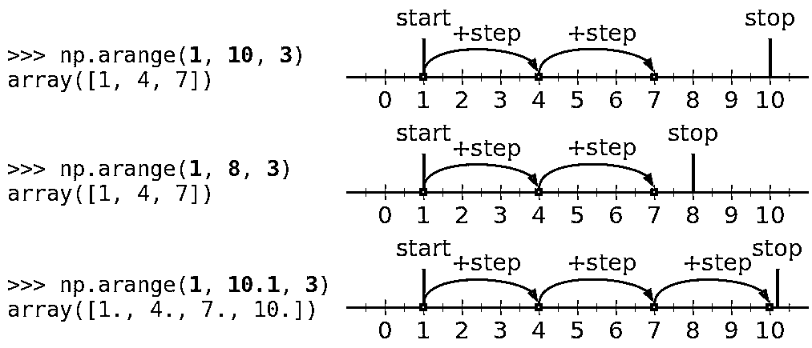
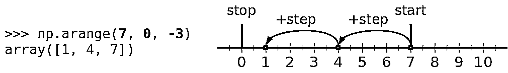

# NumPy arange():如何使用 np.arange()

> 原文：<https://realpython.com/how-to-use-numpy-arange/>

*立即观看**本教程有真实 Python 团队创建的相关视频课程。配合文字教程一起看，加深理解: [**有效使用 NumPy 的 NP . arange()**](/courses/numpy-arange/)

**NumPy** 是数值计算的基本 Python 库。它最重要的类型是一个叫做`ndarray`的**数组类型**。NumPy 为不同的环境提供了许多[数组创建例程](https://docs.scipy.org/doc/numpy/reference/routines.array-creation.html)。`arange()`是一个基于**数值范围**的函数。它通常被称为`np.arange()`，因为`np`是 NumPy 的一个广泛使用的缩写。

当您使用依赖 NumPy 数组的其他 Python 库时，创建 NumPy 数组是很重要的，比如 [SciPy](https://realpython.com/python-scipy-cluster-optimize/) 、 [Pandas](https://realpython.com/pandas-python-explore-dataset/) 、 [Matplotlib](https://realpython.com/python-matplotlib-guide/) 、scikit-learn 等等。NumPy 适合创建和使用数组，因为它提供了[有用的例程](https://docs.scipy.org/doc/numpy/reference/routines.html)，使[的性能提升](https://realpython.com/numpy-tensorflow-performance/)，并允许您编写[简洁的代码](https://realpython.com/numpy-array-programming/)。

到本文结束时，你会知道:

*   什么是`np.arange()`
*   如何使用`np.arange()`
*   `np.arange()`与 Python 内置类 [`range`](https://realpython.com/python-range/) 相比如何
*   哪些套路和`np.arange()`类似

让我们看看`np.arange()`的行动吧！

**免费奖励:** [点击此处获取免费的 NumPy 资源指南](#)，它会为您指出提高 NumPy 技能的最佳教程、视频和书籍。

## `np.arange()`的返回值和参数

NumPy `arange()`是一个基于数值范围的数组创建例程。它创建一个具有*等间距值*的`ndarray`实例，并返回对它的引用。

您可以使用四个参数`arange()`定义数组中包含的值的间隔、它们之间的空间以及它们的类型:

```py
numpy.arange([start, ]stop, [step, ], dtype=None) -> numpy.ndarray
```

前三个参数确定值的范围，而第四个参数指定元素的类型:

1.  **`start`** 是定义数组中第一个值的[数字](https://realpython.com/python-numbers/)(整数或小数)。
2.  **`stop`** 是定义数组结尾的数字，不包含在数组中。
3.  **`step`** 是定义数组中每两个连续值之间的间距(差)的数字，默认为`1`。
4.  **`dtype`** 是输出数组的元素类型，默认为 [`None`](https://realpython.com/null-in-python/) 。

`step`不能为零。否则你会得到一个`ZeroDivisionError`。如果增量或减量是`0`，你就不能离开`start`的任何地方。

如果省略`dtype`，`arange()`将尝试从`start`，`stop`，`step`的类型中推导出数组元素的类型。

你可以在[官方文档](https://docs.scipy.org/doc/numpy/reference/generated/numpy.arange.html)中找到更多关于`arange()`的参数和返回值的信息。

[*Remove ads*](/account/join/)

## `np.arange()`的范围参数

定义数组中包含的值的 NumPy `arange()`的自变量对应于数字参数`start`、`stop`和`step`。你必须通过*至少其中一门*。

下面的例子将向您展示`arange()`如何根据参数的数量和它们的值进行操作。

### 提供所有范围参数

使用 NumPy 例程时，必须先导入 NumPy:

>>>

```py
>>> import numpy as np
```

现在，您已经导入了 NumPy，并准备应用`arange()`。

让我们看看如何使用 NumPy `arange()`的第一个例子:

>>>

```py
>>> np.arange(start=1, stop=10, step=3)
array([1, 4, 7])
```

在这个例子中，`start`就是`1`。因此，获得的数组的第一个元素是`1`。`step`是`3`，这就是为什么你的第二个值是 1+3，也就是`4`，而数组中的第三个值是 4+3，等于`7`。

按照这种模式，下一个值将是`10` (7+3)，但是计数必须在到达 `stop`之前结束*，所以这个不包括在内。*

您也可以将`start`、`stop`和`step`作为位置参数传递:

>>>

```py
>>> np.arange(1, 10, 3)
array([1, 4, 7])
```

此代码示例等效于，但比前一个更简洁。

`stop`的值不包含在数组中。这就是为什么您可以用不同的`stop`值获得相同的结果:

>>>

```py
>>> np.arange(1, 8, 3)
array([1, 4, 7])
```

此代码示例返回与前两个值相同的数组。任何一个`stop`值严格大于`7`小于等于`10`都可以得到相同的结果。

但是，如果您使`stop`大于`10`，那么计数将在达到`10`后结束:

>>>

```py
>>> np.arange(1, 10.1, 3)
array([ 1.,  4.,  7., 10.])
```

在这种情况下，您将获得包含四个元素的数组，其中包括`10`。

请注意，这个示例创建了一个浮点数数组，这与上一个示例不同。那是因为你还没有定义`dtype`，是`arange()`给你推导出来的。在本文的后面，您将了解到更多这方面的内容。

您可以在下图中看到这三个示例的图形表示:

[](https://files.realpython.com/media/fig-1.1d8bc9379e87.png)

`start`显示为绿色，`stop`显示为红色，而`step`和数组中包含的值显示为蓝色。

从上图可以看出，前两个例子有三个值(`1`、`4`和`7`)。他们不允许`10`被包括在内。在第三个例子中，`stop`大于`10`，它包含在结果数组中。

[*Remove ads*](/account/join/)

### 提供两个范围参数

可以省略`step`。在这种情况下，`arange()`使用其默认值`1`。以下两个语句是等效的:

>>>

```py
>>> np.arange(start=1, stop=10, step=1)
array([1, 2, 3, 4, 5, 6, 7, 8, 9])
>>> np.arange(start=1, stop=10)
array([1, 2, 3, 4, 5, 6, 7, 8, 9])
```

第二个语句更短。`step`，默认为`1`，通常是直觉预期的。

将`arange()`与增量`1`一起使用在实践中是非常常见的情况。同样，您可以用位置参数`start`和`stop`更简洁地编写前面的例子:

>>>

```py
>>> np.arange(1, 10)
array([1, 2, 3, 4, 5, 6, 7, 8, 9])
```

这是调用`arange()`的一种直观而简洁的方式。在这个例子中使用关键字参数并没有真正提高可读性。

**注意:**如果你提供两个位置参数，那么第一个是`start`，第二个是`stop`。

### 提供一个范围参数

你必须给*提供至少一个*到`arange()`的参数。更准确的说，你得提供`start`。

但是如果省略`stop`会怎么样呢？`arange()`怎么知道什么时候停止计数？在这种情况下，数组从`0`开始，在到达`start`的值之前结束！同样，`step`的默认值是`1`。

换句话说，`arange()`假设你已经提供了`stop`(而不是`start`)，并且`start`是`0`，`step`是`1`。

让我们看一个例子，你想用`0`开始一个数组，增加`1`的值，并在`10`之前停止:

>>>

```py
>>> np.arange(start=0, stop=10, step=1)
array([0, 1, 2, 3, 4, 5, 6, 7, 8, 9])
>>> np.arange(0, 10, 1)
array([0, 1, 2, 3, 4, 5, 6, 7, 8, 9])
>>> np.arange(start=0, stop=10)
array([0, 1, 2, 3, 4, 5, 6, 7, 8, 9])
>>> np.arange(0, 10)
array([0, 1, 2, 3, 4, 5, 6, 7, 8, 9])
```

这些代码示例没问题。它们的工作方式如前面的示例所示。有一种更短、更简洁但仍然直观的方法来做同样的事情。您可以只提供一个位置参数:

>>>

```py
>>> np.arange(10)  # Stop is 10, start is 0, and step is 1!
array([0, 1, 2, 3, 4, 5, 6, 7, 8, 9])
```

这是创建 NumPy 数组的最常用方法，该数组从零开始，增量为 1。

**注意:**单个参数定义了计数停止的位置。输出数组从`0`开始，增量为`1`。

如果你试图显式地提供没有`start`的`stop`，那么你将得到一个`TypeError`:

>>>

```py
>>> np.arange(stop=10)
Traceback (most recent call last):
  File "<stdin>", line 1, in <module>
TypeError: arange() missing required argument 'start' (pos 1)
```

你得到这个错误是因为`arange()`不允许你*显式*避开对应于`start`的第一个参数。如果你提供一个参数，那么它必须是`start`，但是`arange()`将使用它来定义计数停止的位置。

[*Remove ads*](/account/join/)

### 提供否定的论据

如果您为`start`或`start`和`stop`都提供负值，并且有一个正的`step`，那么`arange()`将以与所有正参数相同的方式工作:

>>>

```py
>>> np.arange(-5, -1)
array([-5, -4, -3, -2])
>>> np.arange(-8, -2, 2)
array([-8, -6, -4])
>>> np.arange(-5, 6, 4)
array([-5, -1,  3])
```

这种行为与前面的例子完全一致。计数从`start`的值开始，重复递增`step`，并在达到`stop`之前结束。

### 倒数计时

有时你会希望数组的值从左到右递减。在这种情况下，您可以使用负值的`step`和大于`stop`的`start`:

>>>

```py
>>> np.arange(5, 1, -1)
array([5, 4, 3, 2])
>>> np.arange(7, 0, -3)
array([7, 4, 1])
```

在这个例子中，请注意下面的模式:获得的数组从第一个参数的值开始，并朝着第二个参数的值递减`step`。

在最后一个语句中，`start`是`7`，得到的数组以这个值开始。`step`是`-3`所以第二个值是 7+(3)，也就是`4`。第三个值是 4+(3)，即`1`。计数在此停止，因为在下一个值(`-2`)之前到达了`stop` ( `0`)。

您可以在下图中看到此示例的图形表示:

[](https://files.realpython.com/media/fig-2.fce8dbe92f85.png)

同样，`start`显示为绿色，`stop`显示为红色，而`step`和数组中包含的值显示为蓝色。

这一次，箭头显示的是从右向左的方向。那是因为`start`大于`stop`，`step`是负数，你基本上是在倒着算。

前面的示例产生了与下面相同的结果:

>>>

```py
>>> np.arange(1, 8, 3)[::-1]
array([7, 4, 1])
>>> np.flip(np.arange(1, 8, 3))
array([7, 4, 1])
```

不过，`step`为负值的变体更优雅简洁。

### 获取空数组

在一些极端情况下，您可以使用`arange()`获得空的 NumPy 数组。这些是没有任何元素的常规实例。

如果您为`start`和`stop`提供相等的值，那么您将得到一个空数组:

>>>

```py
>>> np.arange(2, 2)
array([], dtype=int64)
```

这是因为计数在达到`stop`的值之前就结束了。因为`start`的值等于`stop`，所以不能到达它，也不能包含在结果数组中。

一种不常见的情况是当`start`大于`stop`并且`step`为正时，或者当`start`小于`stop`并且`step`为负时:

>>>

```py
>>> np.arange(8, 2, 1)
array([], dtype=int64)
>>> np.arange(2, 8, -1)
array([], dtype=int64)
```

正如你所看到的，这些例子导致空数组，*而不是*出现错误。

[*Remove ads*](/account/join/)

## `np.arange()`的数据类型

NumPy 数组中元素的类型是使用它们的一个重要方面。使用`arange()`时，可以用参数`dtype`指定元素的类型。

**注意:**下面是关于 NumPy 数组中包含的元素类型的几个要点:

*   NumPy 数组中的所有元素都属于同一类型，称为**dtype**(**数据类型**的简称)。
*   NumPy dtypes 比 Python 的内置数字类型允许更细的粒度。
*   在某些情况下，NumPy dtypes 的别名对应于 Python 内置类型的名称。
*   通常，NumPy 例程可以接受 Python 数字类型，反之亦然。
*   一些 NumPy 数据类型具有依赖于平台的定义。

如果你想了解更多关于 NumPy 数组的 dtypes，那么请阅读官方文档。

你可以随意省略`dtype`。在这种情况下，`arange()`将尝试推导出结果数组的 dtype。这取决于`start`、`stop`和`step`的类型，如下例所示:

>>>

```py
>>> x = np.arange(5)
>>> x
array([0, 1, 2, 3, 4])
>>> x.dtype
dtype('int64')
>>> x.itemsize  # In bytes
8
```

这里，有一个参数(`5`)定义了值的范围。它的类型是`int`。这就是为什么数组`x`的 dtype 会是 NumPy 提供的整数类型之一。在这种情况下，NumPy 默认选择`int64` dtype。这是一个 64 位(8 字节)整数类型。

上一个示例中的数组相当于这个数组:

>>>

```py
>>> x = np.arange(5, dtype=int)
>>> x
array([0, 1, 2, 3, 4])
>>> x.dtype
dtype('int64')
```

`dtype=int` *的说法*不是指 Python `int`。它被翻译成 NumPy `int64`或简单的`np.int`。

NumPy 提供了几种固定大小的整数数据类型，它们在内存和限制方面有所不同:

*   **`np.int8` :** 8 位有符号整数(从`-128`到`127`
*   **`np.uint8` :** 8 位无符号整数(从`0`到`255`
*   **`np.int16` :** 16 位有符号整数(从`-32768`到`32767`
*   **`np.uint16` :** 16 位无符号整数(从`0`到`65535`
*   **`np.int32` :** 32 位有符号整数(从`-2**31`到`2**31-1`
*   **`np.uint32` :** 32 位无符号整数(从`0`到`2**32-1`
*   **`np.int64` :** 64 位有符号整数(从`-2**63`到`2**63-1`
*   **`np.uint64` :** 64 位无符号整数(从`0`到`2**64-1`

如果您希望数组的元素使用其他整数类型，那么只需指定`dtype`:

>>>

```py
>>> x = np.arange(5, dtype=np.int32)
>>> x
array([0, 1, 2, 3, 4], dtype=int32)
>>> x.dtype
dtype('int32')
>>> x.itemsize  # In bytes
4
```

现在得到的数组具有与前一个例子相同的值，但是元素的类型和大小不同。参数`dtype=np.int32`(或`dtype='int32'`)强制`x`的每个元素的大小为 32 位(4 字节)。

当您的参数是十进制数而不是整数时，dtype 将是某种 NumPy 浮点类型，在本例中为`float64`:

>>>

```py
>>> y = np.arange(5.0)
>>> y
array([0., 1., 2., 3., 4.])
>>> y.dtype
dtype('float64')
```

在最后四个例子中，元素的值是相同的，但是数据类型不同。

通常，当您向`arange()`提供至少一个浮点参数时，得到的数组将具有浮点元素，即使其他参数是整数:

>>>

```py
>>> np.arange(1, 5.1)
array([1., 2., 3., 4., 5.])
>>> np.arange(1, 5.1).dtype
dtype('float64')
>>> np.arange(0, 9, 1.5)
array([0\. , 1.5, 3\. , 4.5, 6\. , 7.5])
>>> np.arange(0, 9, 1.5).dtype
dtype('float64')
```

在上面的例子中，`start`是一个整数，但是 dtype 是`np.float64`，因为`stop`或`step`是浮点数。

如果您指定了`dtype`，那么`arange()`将尝试使用所提供的数据类型的元素生成一个数组:

>>>

```py
>>> y = np.arange(5, dtype=float)
>>> y
array([0., 1., 2., 3., 4.])
>>> y.dtype
dtype('float64')
```

这里的参数`dtype=float`翻译成 NumPy `float64`，也就是`np.float`。它*不是*指 Python `float`。`float64`的固定大小别名是`np.float64`和`np.float_`。

当需要精度和大小(以字节为单位)较低的浮点数据类型时，可以显式指定:

>>>

```py
>>> z = np.arange(5, dtype=np.float32)
>>> z
array([0., 1., 2., 3., 4.], dtype=float32)
>>> z.dtype
dtype('float32')
```

使用`dtype=np.float32`(或`dtype='float32'`)使数组`z`的每个元素变大 32 位(4 字节)。`y`每个元素的大小为 64 位(8 字节):

>>>

```py
>>> y.itemsize  # In bytes
8
>>> z.itemsize  # In bytes
4
```

`y`和`z`的元素之间的区别，以及一般而言`np.float64`和`np.float32`之间的区别，是所使用的内存和精度:前者比后者更大、更精确。

很多情况下，你不会注意到这种区别。然而，有时这很重要。比如 [TensorFlow](https://www.tensorflow.org/) 使用 [`float32`和`int32`](https://www.tensorflow.org/guide/tensors) 。同样，当你处理图像时，甚至使用[较小的字体，如`uint8`](https://scikit-image.org/docs/dev/user_guide/data_types.html)。

当`step`不是整数时，由于浮点运算的[限制，结果可能不一致。](https://docs.python.org/3/tutorial/floatingpoint.html)

[*Remove ads*](/account/join/)

## 用`np.arange()`超越简单范围

您可以方便地将`arange()`与运算符(如`+`、`-`、`*`、`/`、`**`等)和其他 NumPy 例程(如[、`abs()`、](https://docs.scipy.org/doc/numpy/reference/generated/numpy.absolute.html)或[、`sin()`、](https://docs.scipy.org/doc/numpy/reference/generated/numpy.sin.html))组合起来，产生输出值的范围:

>>>

```py
>>> x = np.arange(5)
>>> x
array([0, 1, 2, 3, 4])
>>> 2**x
array([ 1,  2,  4,  8, 16])
>>> y = np.arange(-1, 1.1, 0.5)
>>> y
array([-1\. , -0.5,  0\. ,  0.5,  1\. ])
>>> np.abs(y)
array([1\. , 0.5, 0\. , 0.5, 1\. ])
>>> z = np.arange(10)
>>> np.sin(z)
array([ 0\.        ,  0.84147098,  0.90929743,  0.14112001, -0.7568025 ,
 -0.95892427, -0.2794155 ,  0.6569866 ,  0.98935825,  0.41211849])
```

当你想在 Matplotlib 中[创建一个绘图时，这是特别合适的。](https://matplotlib.org/gallery/lines_bars_and_markers/simple_plot.html)

如果你需要一个多维数组，那么你可以结合`arange()`与 [`.reshape()`](https://docs.scipy.org/doc/numpy/reference/generated/numpy.ndarray.reshape.html#numpy.ndarray.reshape) 或者类似的函数和方法:

>>>

```py
>>> a = np.arange(6).reshape((2, 3))
>>> a
array([[0, 1, 2],
 [3, 4, 5]])
>>> a.shape
(2, 3)
>>> a.ndim
2
```

这就是如何获得包含元素`[0, 1, 2, 3, 4, 5]`的`ndarray`实例，并将其整形为二维数组。

## `range`和`np.arange()`的比较

Python 有一个内置的类`range`，某种程度上类似于 NumPy `arange()`。`range`和`np.arange()`在应用和性能方面有重要区别。你会看到他们的不同和相似之处。

两者的主要区别在于`range`是内置的 Python 类，而`arange()`是属于第三方库(NumPy)的函数。

另外，他们的目的不一样！一般来说，当你需要使用 [Python `for`循环](https://realpython.com/python-for-loop/)来**迭代**时，`range`更合适。如果你想创建一个 NumPy 数组，并在幕后应用快速循环，那么`arange()`是一个更好的解决方案。

### 参数和输出

`range`和`arange()`具有相同的参数，这些参数定义了所获得数字的范围:

*   `start`
*   `stop`
*   `step`

即使在`start`和`stop`相等的情况下，您也可以类似地应用这些参数。

然而，在使用`range`时:

*   您必须提供整数参数。否则，你会得到一个`TypeError`。
*   您不能指定生成的数字的类型。总是`int`。

`range`和`arange()`的返回类型也不同:

*   **`range`** 创建该类的一个实例，该实例具有与其他序列(如 [`list`和`tuple`](https://realpython.com/python-lists-tuples/) )相同的特性，如成员、连接、重复、切片、比较、长度检查等等。
*   **`arange()`** 返回 NumPy `ndarray`的一个实例。

### 创建序列

您可以应用`range`来创建一个`list`或`tuple`的实例，在预定义的范围内均匀分布数字。你可能会发现[理解](https://realpython.com/lessons/writing-your-first-list-comprehension/)特别适合这个目的。

然而，创建和操作 NumPy 数组通常比处理列表或元组更快，更 T2，更优雅。

让我们比较一下使用理解力创建一个`list`和使用`arange()`创建一个等价的 NumPy `ndarray`的性能:

>>>

```py
>>> import timeit
>>> n = 1
>>> timeit.timeit(f'x = [i**2 for i in range({n})]')
>>> timeit.timeit(f'x = np.arange({n})**2', setup='import numpy as np')
```

对不同的`n`值重复这段代码，在我的机器上产生了以下结果:

| 尺寸:`n` | 每循环时间:`range` | 每循环时间:`arange()` | 比例 |
| --- | --- | --- | --- |
| one | 497 纳秒 | 1.14 秒 | Zero point four one |
| Ten | 2.24 秒 | 1.28 秒 | One point seven four |
| One hundred | 20.0 秒 | 1.37 秒 | Fourteen point six |
| One thousand | 211 s | 2.92 秒 | Seventy-two point three |

这些结果可能会有所不同，但是很明显，创建 NumPy 数组比创建 list 要快得多，除了长度非常短的序列。(应用程序通常会带来额外的性能优势！)

这是因为 NumPy 在 C 层执行许多操作，包括循环。此外，NumPy 为处理向量进行了优化，避免了一些与 Python 相关的开销。

[*Remove ads*](/account/join/)

### Python `for`循环

如果您需要在 Python `for`循环中迭代值，那么`range`通常是更好的解决方案。根据官方 Python 文档:

> 与常规的`list`或`tuple`相比，`range`类型的优势在于,`range`对象将总是占用相同(少量)的内存，无论它所代表的范围大小如何(因为它只存储根据需要计算单个项目和子范围的`start`、`stop`和`step`值)。([来源](https://docs.python.org/3/library/stdtypes.html#range))

在 Python 的`for`循环中使用时，`range`通常比`arange()`快，尤其是当循环有可能很快中断的时候。这是因为`range`在需要的时候以惰性方式生成数字，一次一个。

相比之下，`arange()`在开头生成所有的数字。

更多关于`range`的信息，可以查看[Python range()函数(指南)](https://realpython.com/python-range/)和[官方文档](https://docs.python.org/3/library/stdtypes.html#range)。

## 基于数值范围的其他程序

除了`arange()`之外，您还可以应用其他基于数值范围的 NumPy 数组创建例程:

*   [**`linspace()`**](https://realpython.com/np-linspace-numpy/) 与`arange()`相似，都是返回等间距的数字。但是您可以指定要生成的值的数量，以及是否包括端点和是否一次创建多个数组。
*   **[`logspace()`](https://docs.scipy.org/doc/numpy/reference/generated/numpy.logspace.html) 和 [`geomspace()`](https://docs.scipy.org/doc/numpy/reference/generated/numpy.geomspace.html)** 与`linspace()`类似，只是返回的数字在对数刻度上是均匀分布的。
*   **[`meshgrid()`](https://docs.scipy.org/doc/numpy/reference/generated/numpy.meshgrid.html) ， [`ogrid()`](https://docs.scipy.org/doc/numpy/reference/generated/numpy.ogrid.html) ， [`mgrid()`](https://docs.scipy.org/doc/numpy/reference/generated/numpy.mgrid.html)** 返回以数组表示的网格点。

所有这些功能都有自己的特点和使用案例。可以根据自己的需求选择合适的。

正如您已经看到的，NumPy 包含了更多的[例程来创建`ndarray`](https://docs.scipy.org/doc/numpy/reference/routines.array-creation.html) 的实例。

## 快速总结

要使用 NumPy `arange()`，需要先导入`numpy`:

>>>

```py
>>> import numpy as np
```

这里有一个表格，其中有几个例子总结了如何使用 NumPy `arange()`。记住各种用法可能会有帮助:

| 例子 | 结果 |
| --- | --- |
| `np.arange(start=1, stop=10, step=3)` | `array([1, 4, 7])` |
| `np.arange(1, 10, 3)` | `array([1, 4, 7])` |
| `np.arange(1, 10, 3, dtype=float)` | `array([1., 4., 7.])` |
| `np.arange(1.0, 10, 3)` | `array([1., 4., 7.])` |
| `np.arange(0, 1.1, 0.5)` | `array([0\. , 0.5, 1\. ])` |
| `np.arange(2, 6)` | `array([2, 3, 4, 5])` |
| `np.arange(5)` | `array([0, 1, 2, 3, 4])` |
| `np.arange(-8, -2, 2)` | `array([-8, -6, -4])` |
| `np.arange(7, 0, -3)` | `array([7, 4, 1])` |
| `np.arange(8, 2)` | `array([])` |

不要忘记，您还可以通过用参数`dtype`指定 NumPy dtypes 来影响用于数组的内存。

## 结论

你现在知道如何使用 NumPy `arange()`。函数`np.arange()`是基本的 NumPy 例程之一，通常用于创建 NumPy `ndarray`的实例。它有四个论点:

1.  **`start` :** 数组的第一个值
2.  **`stop` :** 数组结束的地方
3.  **`step` :** 增量或减量
4.  **`dtype` :** 数组的元素的类型

您还了解了在创建序列和生成要迭代的值时，NumPy `arange()`与 Python 内置类`range`的比较。

您看到了还有其他基于数值范围的 NumPy 数组创建例程，比如`linspace()`、`logspace()`、`meshgrid()`等等。

如果你有任何问题或意见，请写在下面的评论区。

*立即观看**本教程有真实 Python 团队创建的相关视频课程。配合文字教程一起看，加深理解: [**有效使用 NumPy 的 NP . arange()**](/courses/numpy-arange/)********