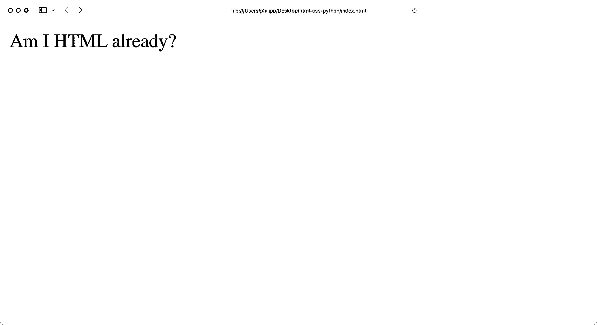
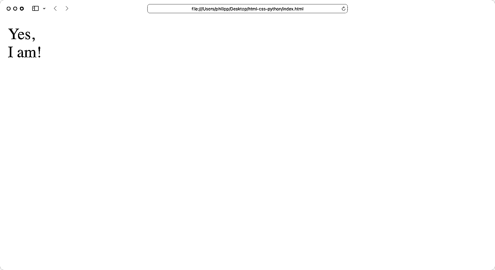
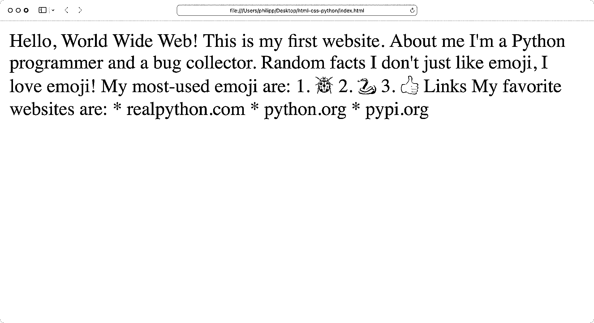
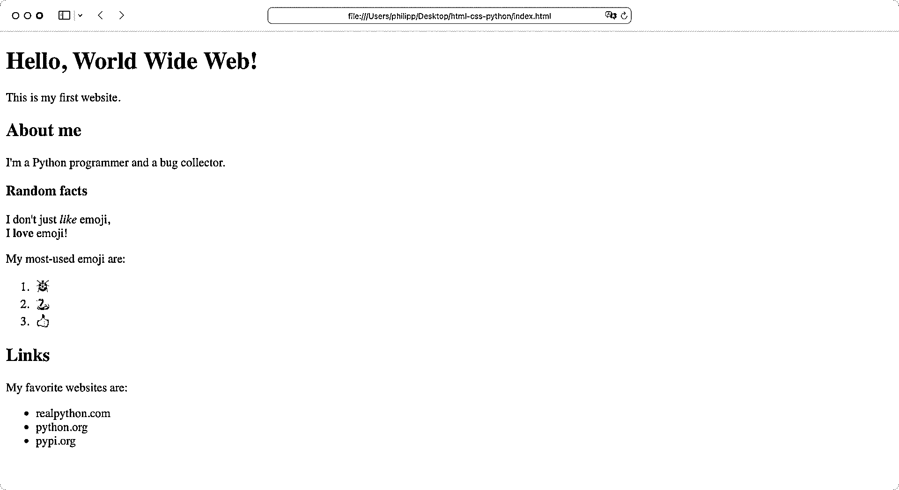
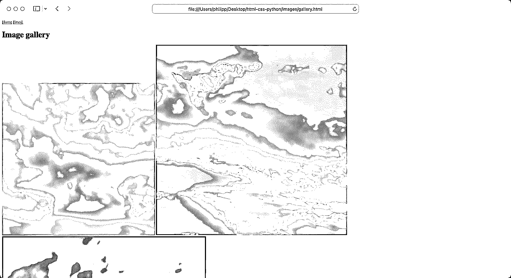
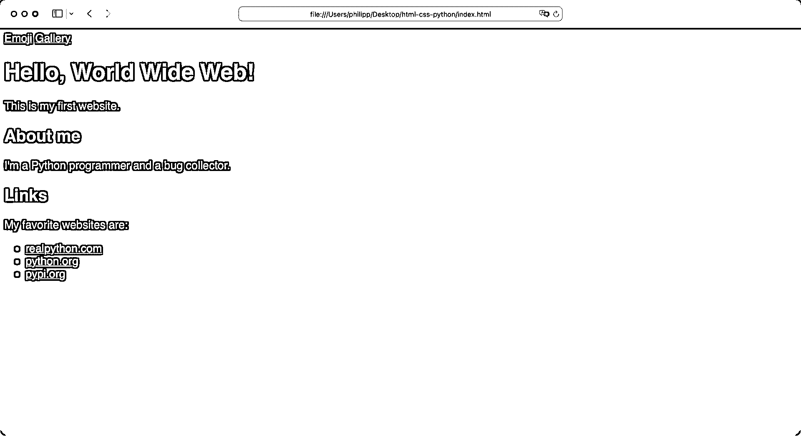
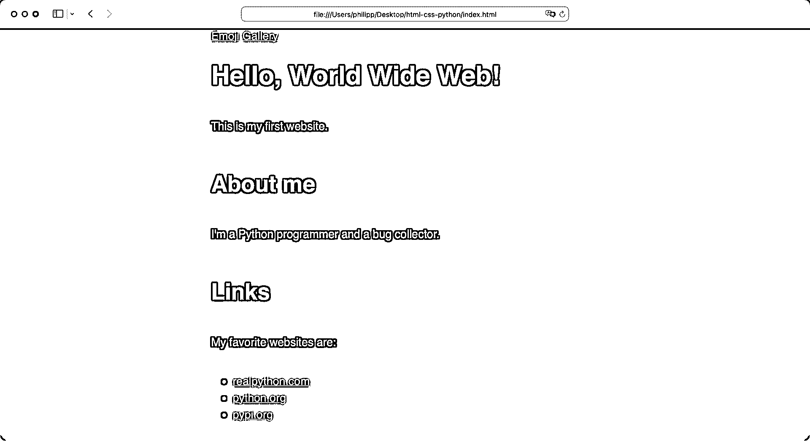
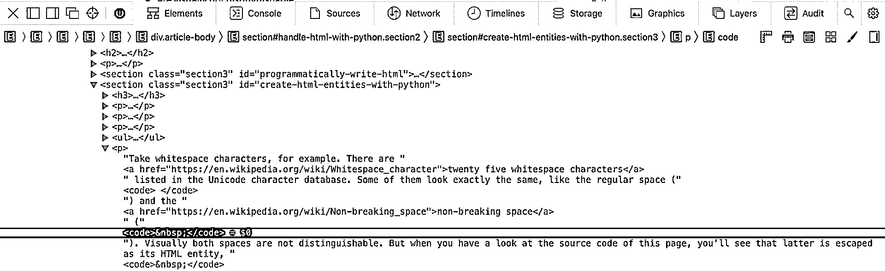
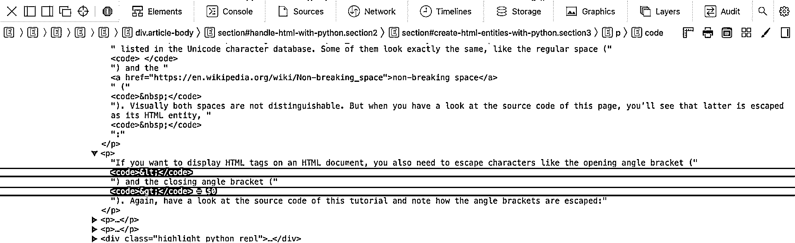

# 面向 Python 开发者的 HTML 和 CSS

> 原文：<https://realpython.com/html-css-python/>

当你想作为一个 Python 程序员来构建网站时，没有办法绕开 HTML 和 CSS。几乎互联网上的每个网站都是用 HTML 标记来构建页面的。为了让网站看起来漂亮，你可以用 **CSS** 来设计 HTML 的样式。

如果你对使用 Python 进行 web 开发感兴趣，那么了解 HTML 和 CSS 将有助于你更好地理解像 **Django** 和 **Flask** 这样的 web 框架。但是，即使你刚刚开始使用 Python，HTML 和 CSS 也能让你创建小网站来打动你的朋友。

**在本教程中，您将学习如何:**

*   构建一个基本的 **HTML** 文件
*   在您的**浏览器**中查看和检查 HTML
*   插入**图片**和页面**链接**
*   用 **CSS** 设计一个网站
*   考虑到**可访问性**来格式化 HTML
*   使用 Python 编写和解析 HTML 代码

您将获得 HTML 和 CSS 的介绍，您可以跟随。在本教程中，您将构建一个包含三个页面和 CSS 样式的网站:

[https://player.vimeo.com/video/740468859?background=1](https://player.vimeo.com/video/740468859?background=1)

在创建 web 项目时，您将创建一个样板 HTML 文档，您可以在即将到来的 web 项目中使用它。您可能会发现，当您从事未来的项目时，源代码会派上用场。您可以从这里下载:

**免费奖励:** [点击这里下载本教程](https://realpython.com/bonus/html-css-python-code/)的补充资料，包括一个省时的 HTML 模板文件。

在学习了 HTML 和 CSS 的基础知识之后，你会在教程的最后找到如何继续你的旅程的想法。

## 创建你的第一个 HTML 文件

想一想你最近访问过的任何网站。也许你看了一些新闻，和朋友聊了聊，或者看了一段视频。不管它是什么样的网站，你可以打赌它的源代码在开头有一个基本的`<html>`标签。

HTML 代表**超文本标记语言**。HTML 是由[蒂姆·伯纳斯·李](https://en.wikipedia.org/wiki/Tim_Berners-Lee)创造的，作为万维网的发明者[，他的名字可能也让你想起来了。](https://en.wikipedia.org/wiki/World_Wide_Web)

HTML 的**超文本**部分指的是在不同的 HTML 页面之间建立连接。有了超链接，你就可以在网页之间跳转，在网上冲浪。

您使用**标记**来组织文档中的内容。与格式相反，标记定义了内容的含义，而不是内容的外观。在本节中，您将了解 HTML 元素及其角色。

编写**语义** HTML 代码将使你的文档**能够被广泛的访问者**访问。毕竟，你想让每个人都能消费你的内容，不管他们是用浏览器还是用[屏幕阅读](https://en.wikipedia.org/wiki/Screen_reader)工具访问你的页面。

对于每个 HTML 元素，都有一个定义其预期用途的标准。今天，HTML 的标准是由 [Web 超文本应用技术工作组(WHATWG)](https://whatwg.org) 定义的。WHATWG 对 HTML 的作用类似于 [Python 指导委员会](https://github.com/python/steering-council)对 Python 的作用。

大约 95%的网站使用 HTML ，所以如果你想用 Python 做任何网络开发工作，你将很难避免它。

在本节中，您将从创建第一个 HTML 文件开始。您将学习如何构建您的 HTML 代码，使其对您的浏览器和人类可读。

[*Remove ads*](/account/join/)

### HTML 文档

在本节中，您将创建一个基本的 HTML 文件。HTML 文件将包含大多数网站的基本结构。

首先，创建一个名为`index.html`的文件，其中包含一些文本:

```py
 1<!-- index.html -->
 2
 3Am I HTML already?
```

传统上，你网站的第一个文件叫做`index.html`。您可以将`index.html`页面视为类似于 Python 项目中的`main.py`或`app.py`文件。

**注意:**除非你的服务器配置不同，`index.html`是当你访问根 URL 时服务器试图加载的文件。这就是为什么你可以访问[https://www.example.com/](https://www.example.com/)而不是输入完整的[https://www.example.com/index.html](https://www.example.com/index.html)地址。

到目前为止，`index.html`的唯一内容是一个普通的`Am I HTML already?`字符串。您还没有添加任何 HTML 语法，除了第 1 行的一个 **HTML 注释**。类似于 Python 解释器不执行你的 Python 代码中的注释，浏览器不会呈现你的 [HTML 注释](https://html.com/tags/comment-tag/)的内容。尽管如此，请在浏览器中打开`index.html`:

[](https://files.realpython.com/media/01-index-no-html.70cf522ce5ff.png)

你的浏览器显示文本时没有抱怨。看起来浏览器可以处理 HTML 文件，即使它的唯一提示是扩展名。知道这一点很好，但这种行为也有不好的一面。

浏览器总是试图呈现 HTML 文档，即使文档的 HTML 语法无效。很少，浏览器本身会显示类似于[语法错误](https://realpython.com/invalid-syntax-python/)的东西，类似于当你试图运行无效代码时 Python 所做的。这意味着您可能不会注意到您是否发布了无效代码，这可能会给网站访问者带来问题。

**注意:**如果你想验证你写的 HTML 代码，那么你可以上传你的 HTML 文件到 [W3C 标记验证服务](https://validator.w3.org)。这个[林挺工具](https://realpython.com/python-code-quality/#linters)分析你的代码并指出错误。

更新`index.html`并通过添加以下代码创建一个最小有效的 HTML 文档:

```py
 1<!-- index.html -->
 2
 3<!DOCTYPE html>
 4<html lang="en">
 5<head>
 6    <meta charset="utf-8">
 7    <title>Am I HTML already?</title>
 8</head>
 9</html>
```

这段代码是你能得到的最简单有效的 HTML 文档。严格地说，您甚至可以删除第 4 行中的`lang` **属性**。但是建议添加正确的**语言子标签**来声明您的文档包含哪种自然语言。

**注意:**在本教程中，您将坚持使用英语并使用`en`语言标签。你可以访问[官方语言子标签注册表](https://www.iana.org/assignments/language-subtag-registry/language-subtag-registry)来查找所有其他语言标签。

语言属性使翻译工具更容易使用您的网站，并使您的网站更容易访问。屏幕阅读器特别依赖 HTML 文档的语言声明来选择正确的语言模式来合成内容。

从根本上说，您构建的任何 HTML 文档都可能遵循上面示例的结构。但是缺少了一个重要的 HTML 元素。打开`index.html`，在`<head>`下面增加`<body>`:

```py
 1<!-- index.html -->
 2
 3<!DOCTYPE html>
 4<html lang="en">
 5<head>
 6    <meta charset="utf-8">
 7    <title>Am I HTML already?</title>
 8</head>
 9<body> 10Yes,<br>I am! 11</body> 12</html>
```

任何有效的 HTML 文件都必须以一个 **doctype** 声明开始。在本教程中，您将使用`<!DOCTYPE html>`，它告诉浏览器文档包含 **HTML5** 代码，应该以标准模式呈现您的页面:

> 如果浏览器在页面开始处发现一个过时的、不完整的或丢失的 doctype，他们使用“怪癖模式”，这种模式更向后兼容旧的实践和旧的浏览器。([来源](https://www.w3.org/wiki/Doctypes_and_markup_styles))

在 doctype 声明之后，有一个开始的`<html>`标记。在第 12 行，您可以找到相应的结束标签`</html>`。HTML 中的大多数元素都有一个**开始标签**，中间有一些内容，最后有一个**结束标签**。这些部分甚至可以在同一行，像第 7 行中的`<title>`元素。

其他元素，比如第 6 行的`<meta>`，没有匹配的结束标记，所以它们不包含任何内容。这些**空元素**就是所谓的[空元素](https://www.w3.org/TR/2011/WD-html-markup-20110113/syntax.html#void-element)。它们独立存在，甚至可能不包含属性。第 10 行中的`<br>`就是这样一个例子，它创建了一个换行符。

HTML 标签以尖括号(`<`)开始，以尖括号(`>`)结束。尖括号中的标签名通常是非常描述性的，说明了 HTML 元素的含义。一个很好的例子是第 7 行的`<title>`，其中的内容定义了页面的标题。

`<body>`块包含了你的大部分内容。您可以将`<body>`视为 HTML 文档的一部分，您可以在浏览器中与之交互。

有时候标签名是缩写的，比如第 10 行的换行符`<br>`。要获得其他 HTML 标签名称的概述，请访问 Mozilla 的 [HTML 元素参考](https://developer.mozilla.org/en-US/docs/Web/HTML/Element)。

一旦你熟悉了你的 HTML 文档的结构，在你的浏览器中重新加载`index.html`并检查你的网站看起来如何:

[](https://files.realpython.com/media/02-index-html.3618468cc2e7.png)

太棒了，你现在正在显示你的第一个正式网站的内容！

您很有可能会以类似于本节中构建的结构开始任何 web 项目。为了在将来节省一些工作，您可以通过单击下面的链接下载 HTML 样板代码:

**免费奖励:** [点击这里下载本教程](https://realpython.com/bonus/html-css-python-code/)的补充资料，包括一个省时的 HTML 模板文件。

在下一节中，您将改进到目前为止已经创建的基础结构。为了探究为什么 HTML 被称为标记语言，您将向您的网站添加内容和结构。

[*Remove ads*](/account/join/)

### 空白和文本格式

到目前为止，HTML 文档仅有的标记是网站的基本框架。现在是时候深入研究并构建一些真正的内容了。要使用某些内容，请将以下文本添加到`index.html`的`<body>`块中:

```
 1<!-- index.html -->
 2
 3<!DOCTYPE html>
 4<html lang="en">
 5<head>
 6    <meta charset="utf-8">
 7    <title>Am I HTML already?</title>
 8</head>
 9<body>
10Hello, World Wide Web! 11This is my first website. 12 13About me 14 15I'm a Python programmer and a bug collector. 16 17Random facts 18 19I don't just like emoji, 20I love emoji! 21 22My most-used emoji are: 23    1\. 🐞 24    2\. 🐍 25    3\. 👍 26 27Links 28 29My favorite websites are: 30    * realpython.com 31    * python.org 32    * pypi.org 33</body>
34</html>
```py

当您在浏览器中打开网站时，浏览器似乎根本没有识别任何空格。尽管您在`<body>`中将内容分布在多行上，但浏览器将所有内容显示为一个连续的行:

[](https://files.realpython.com/media/03-index-whitespace.1920593829ce.png)

作为一名 Python 开发人员，您知道空白是编写漂亮的 Python 代码的重要组成部分。Python 代码的缩进会影响 Python 执行代码的方式。

无需任何额外的调整，浏览器将多个空格、换行符或缩进折叠成一个空格字符。要以不同的方式设置内容的格式，您必须向浏览器提供进一步的信息。继续通过向您的内容添加 HTML 标签来构建`index.html`:

```
 1<!-- index.html -->
 2
 3<!DOCTYPE html>
 4<html lang="en">
 5<head>
 6    <meta charset="utf-8">
 7    <title>Am I HTML already?</title>
 8</head>
 9<body>
10<h1>Hello, World Wide Web!</h1> 11<p>This is my first website.</p> 12 13<h2>About me</h2> 14<p>I'm a Python programmer and a bug collector.</p> 15 16<h3>Random facts</h3> 17<p>I don't just <em>like</em> emoji,<br> 18I <strong>love</strong> emoji!</p> 19<p>My most-used emoji are:</p> 20<ol> 21    <li>🐞</li> 22    <li>🐍</li> 23    <li>👍</li> 24</ol> 25 26<h2>Links</h2> 27<p>My favorite websites are:</p> 28<ul> 29    <li>realpython.com</li> 30    <li>python.org</li> 31    <li>pypi.org</li> 32</ul> 33</body>
34</html>
```py

通过将文本包装在 HTML 块中，可以向浏览器提供关于内容意图的附加信息。首先，看看包装大块文本的 HTML 元素:

| 线条 | HTML 元素 | 描述 |
| --- | --- | --- |
| Ten | `<h1>` | 你网站的主要标题 |
| Eleven | `<p>` | 段落，用于组织文本和相关内容 |
| Thirteen | `<h2>` | 二级标题，嵌套在`<h1>`下面 |
| Sixteen | `<h3>` | 第三级标题，嵌套在`<h2>`下面 |
| Twenty | `<ol>` | 有序列表，通常呈现为编号列表 |
| Twenty-eight | `<ul>` | 无序列表，通常用项目符号(`•`)呈现 |

标题元素可以嵌套六层。虽然你通常只有一个`<h1>`元素，但你可能有多个`<h2>`到`<h6>`标签。标题元素是 HTML 文档的一部分，对于屏幕阅读器来说非常重要。例如，读者可能想从一个标题跳到另一个标题来浏览你的内容。

要编写有效且可访问的 HTML，您必须确保在代码中不跳过标题级别。你可以把标题标签想象成打开一栋建筑不同楼层的门。一个楼层可以有多个出口通往其他楼层。但是记住，如果你还没有第二层，你就不能建第三层。换句话说，除非您首先声明了`<h2>`，否则页面上永远不会有`<h3>`元素。

您在上面使用的一些 HTML 元素只包含文本。其他包含额外的 HTML 元素，进一步组织内容:

| 线条 | HTML 元素 | 描述 |
| --- | --- | --- |
| Seventeen | `<em>` | 强调内容 |
| Eighteen | `<strong>` | 表示重要内容 |
| Twenty-one | `<li>` | 列表项必须包含在列表元素中 |

所有的 HTML 标签都传达意义。因此，仔细选择用于部分内容的标记非常重要。当你使用正确的语义时，你就能让每个人以你想要的方式消费你的内容。您让所有人都可以访问您的网站:

> 网络基本上是为所有人而设计的，不管他们的硬件、软件、语言、位置或能力如何。当网络满足这一目标时，具有不同听觉、运动、视觉和认知能力的人都可以访问它。([来源](https://www.w3.org/WAI/fundamentals/accessibility-intro/))

一些 HTML 元素非常简单。对于段落，你使用`<p>`。其他元素有点难以理解:


Kushagra Gour 在他的博客条目 [Strong vs Em](https://kushagra.dev/blog/strong-vs-em/) 中提供了一个很好的总结:

> 如果只是视觉重要性，你要`strong`。如果它改变了句子的意思，使用`em`。

换句话说，`em`意味着你在说话时会强调这个词。例如，如果有人说，“你看起来不像 T2 那么坏，”你可能会想，“但是我闻起来像 T4 吗？”强调的位置是句子意思的关键。

例如，如果你只是想把读者的注意力吸引到一个词汇上，那么你可能会想用`strong`来代替。

如果有疑问，不要犹豫，在网上搜索 HTML 名称。你可以找到关于任何 HTML 元素的讨论和用法说明。

此外，浏览器的默认 HTML 样式通过对元素进行不同的样式化，可以给人一种不错的印象:

[](https://files.realpython.com/media/04-index-default-styling.ba56dcefe632.png)

有了标记，你就可以给网站内容增加意义。编写语义正确的 HTML 对于理解你的内容很重要。

在 HTML 文档中使用正确的语义不仅对浏览器有帮助。它还使使用[文本到语音转换](https://en.wikipedia.org/wiki/Speech_synthesis)软件的用户可以访问呈现的 HTML 页面。

如果你想了解更多关于现代 HTML 的知识，那么 [HTML5 Doctor](https://html5doctor.com) 是一个很好的资源。要了解更多关于可访问性的信息，你可以查看谷歌关于让所有人都能访问网络[的课程。](https://web.dev/accessible/)

[*Remove ads*](/account/join/)

### 链接、图像和表格

从一个网站跳到另一个网站是互联网的重要组成部分。这些引用被称为**超链接**，通常被称为**链接**。如果没有链接，网站就会孤立存在，只有知道网址才能访问。

此外，如果没有连接页面的链接，您将无法在网站的多个页面之间导航。要连接到目前为止已经创建的 HTML 文档，请在 HTML 源代码中添加一个导航菜单:

```
<!-- index.html-->

<!DOCTYPE html>
<html lang="en">
<head>
    <meta charset="utf-8">
    <title>Am I HTML already?</title>
</head>
<body>
<nav>
 <a href="emoji.html">Emoji</a> </nav> <!-- ... -->
</body>
</html>
```py

使用`<nav>`元素，您可以声明一个提供导航的部分。在`<nav>`中，您添加了一个带有`<a>`标签的链接，这是 anchor 的缩写。`href`属性代表**超文本链接**，包含链接的目标。

通过**相对链接**，你可以引用你的[目录树](https://realpython.com/directory-tree-generator-python/)中的文件。当你有一个链接时，你可能希望看到一个 URL，但是相对链接不是这样。

在这种情况下，您链接到一个名为`emoji.html`的文件。浏览器明白可以在同一个目录下找到`emoji.html`，为你完成完整的 URL。这样，当您决定在某个时候[部署您的 web 项目](https://realpython.com/python-web-applications/)时，您不需要担心改变任何绝对路径。

到目前为止，`emoji.html`还不存在。要解决这个问题，在`index.html`旁边创建一个名为`emoji.html`的新文件:

```
<!-- emoji.html-->

<!DOCTYPE html>
<html lang="en">
<head>
    <meta charset="utf-8">
    <title>My favorite emoji</title>
</head>
<body>
<nav>
    <a href="index.html">Home</a>
</nav>
<h1>My favorite emoji</h1>
<p>I don't just <em>like</em> emoji,<br>
I <strong>love</strong> emoji!</p>
<p>Here's a list of my most-used emoji:</p>
<ol>
    <li>🐞</li>
    <li>🐍</li>
    <li>👍</li>
</ol>
</body>
</html>
```py

`emoji.html`的结构和`index.html`类似。`emoji.html`中的`<body>`的内容与`index.html`的随机事实部分几乎相同，除了你改变了标题并将其上移一级为`<h1>`。

在`<body>`的顶部，你还有一个`<nav>`元素。然而，这一次，你链接到了`index.html`。

接下来，在项目目录中创建一个名为`images/`的新文件夹，并添加一个名为`gallery.html`的文件:

```
 1<!-- images/gallery.html -->
 2
 3<!DOCTYPE html>
 4<html lang="en">
 5<head>
 6    <meta charset="utf-8">
 7    <title>Image gallery</title>
 8</head>
 9<body>
10<nav>
11    <a href="../index.html">Home</a>
12    <a href="../emoji.html">Emoji</a>
13</nav>
14<h1>Image gallery</h1>
15</body>
16</html>
```py

一会儿你会给`gallery.html`添加一些图片。但是首先，看一下第 11 行和第 12 行，在那里你链接到你的其他页面。

因为`index.html`和`emoji.html`是`gallery.html`上面的一个文件夹，所以必须在链接目标的前面加上两个点(`..`和一个斜线(`/`)。

为了更方便地访问，您还可以在`index.html`的导航菜单中添加您的图库链接:

```
<!-- index.html -->

<!DOCTYPE html>
<html lang="en">
<head>
    <meta charset="utf-8">
    <title>Am I HTML already?</title>
</head>
<body>
<nav>
    <a href="emoji.html">Emoji</a>
 <a href="images/gallery.html">Gallery</a> </nav>
<!-- ... -->
```py

您也可以在`emoji.html`中链接到您的图库:

```
<!-- emoji.html -->

<!DOCTYPE html>
<html lang="en">
<head>
    <meta charset="utf-8">
    <title>My favorite emoji</title>
</head>
<body>
<nav>
    <a href="index.html">Home</a>
 <a href="images/gallery.html">Gallery</a> </nav>
<!-- ... -->
```py

如果你添加一个链接到一个 HTML 页面，那么你必须考虑从你现在所在的文件导航到那里。`gallery.html`文件是`index.html`下一个目录中的一个名为`images/`的文件夹。所以当你链接到`gallery.html`时，你需要在链接中包含子文件夹，你已经在上面做了。

相对链接对于链接你网站的页面很有用。当你想添加外部链接时，你可以使用**绝对链接**:

```
<!-- index.html -->

<!-- ... --->
<h2>Links</h2>
<p>My favorite websites are:</p>
<ul>
 <li><a href="https://www.realpython.com">realpython.com</a></li> <li><a href="https://www.python.org">python.org</a></li> <li><a href="https://www.pypi.org">pypi.org</a></li> </ul>
<!-- ... --->
```py

你不是链接到 HTML 文件，而是链接到你最喜欢的网站列表中的绝对网址。这些链接与你在浏览器地址栏中输入的链接相同。

跳到浏览器，使用您刚刚添加的链接浏览您的网站:

[https://player.vimeo.com/video/740468915?background=1](https://player.vimeo.com/video/740468915?background=1)

链接不仅仅是连接网站页面的便利工具，它们还是互联网基础设施的重要组成部分。如果你想了解更多关于链接的知识，那么看看这个 [HTML 锚教程](https://html.com/anchors-links/)。

网络的另一个重要元素是图像。如果没有分享假期照片和猫咪 gif 的能力，互联网将会变得索然无味。

您使用包含一个`src`属性的``元素将图像附加到您的 HTML 文档中。就像链接中的`href`一样，你在`src`中引用图像源。此外，您应该始终使用`alt`属性来添加描述图像的可选文本。这样，使用屏幕阅读器的人就可以访问您的网站。

更新`gallery.html`并链接到三个图像:

```
<!-- images/gallery.html -->

<!DOCTYPE html>
<html lang="en">
<head>
    <meta charset="utf-8">
    <title>Image Gallery</title>
</head>
<body>
<nav>
    <a href="../index.html">Home</a>
    <a href="../emoji.html">Emoji</a>
</nav>
<h1>Image Gallery</h1>
   </body>
</html>
```py

点击下面的代码下载材料后，您会在`images/`文件夹中找到天空图像:

**免费奖励:** [点击这里下载本教程](https://realpython.com/bonus/html-css-python-code/)的补充资料，包括一个省时的 HTML 模板文件。

如果您使用自己的图像，那么您需要相应地调整文件名。不要忘记也更新描述图片内容的`alt`文本到[使你的图片可访问](https://www.w3.org/WAI/tutoriaimg/)。

`alt`文本大致相当于 Python 中的[文档字符串。docstring 可以描述对象的用途，而`alt`文本描述图像的内容。就像 docstring 一样，`alt`文本应该以点(`.`)结尾。](https://realpython.com/documenting-python-code/#documenting-your-python-code-base-using-docstrings)

给你的图片添加额外的信息是额外的工作，但是值得一做。如果照片里有一只可爱的狗，每个人都应该知道照片里有一只可爱的狗。如果你需要任何令人信服的东西，请前往 axess 实验室的 [Alt-texts:终极指南](https://axesslab.com/alt-texts/)。

当你在浏览器中打开`gallery.html`时，你的页面应该看起来像这样:

[](https://files.realpython.com/media/06-gallery-no-styling.e19041073914.png)

图片是让你的网站更具视觉吸引力的好方法。然而，图片库有点杂乱无章，没有任何额外的样式，网站看起来相当老派。是时候改变这种状况了！

在下一节中，您将向 HTML 添加样式规则，并更好地控制网站元素的外观。

[*Remove ads*](/account/join/)

## 用 CSS 设计你的内容

当您在浏览器中打开一个普通的 HTML 文件时，默认情况下浏览器会添加一些样式。这就是为什么您能够区分上一节中的元素，尽管您自己没有添加任何样式。

这基本上是一种从浏览器到人类的服务。但是严格来说，你写 HTML 的时候，只是定义了你网站的标记。纯 HTML 不为页面上的元素提供任何样式。要设计元素的样式，您需要添加 CSS。

CSS 代表**级联样式表**。稍后您将看到，您可以组合和嵌套您的 CSS 样式规则，因此命名为*级联*样式表。

就像 HTML 一样，它是互联网的基石技术。它可以帮助你将网站的外观与实际内容区分开来:

> 除了具有良好的语义和吸引人的布局之外，您的内容应该在其源代码顺序中具有逻辑意义——您可以在以后使用 CSS 将其放置在您想要的位置，但是您应该从源代码顺序开始，这样屏幕阅读器用户向他们读出的内容才会有意义。([来源](https://developer.mozilla.org/en-US/docs/Learn/Accessibility/HTML#page_layouts))

在这一节中，你将学习如何通过添加 CSS 来控制你的网站的样式。

### 为你的网站增添色彩

到目前为止，你只使用了浏览器来*加载*你的 HTML 文件。但是网络浏览器是强大的工具，当你开发一个网站时，它们能给你极大的帮助。

您可以使用浏览器的[开发者工具窗格调查任何网站。尤其是当您使用 CSS 时，浏览器的开发工具会派上用场:](https://developer.mozilla.org/en-US/docs/Learn/Common_questions/What_are_browser_developer_tools)

[https://player.vimeo.com/video/740478263?background=1](https://player.vimeo.com/video/740478263?background=1)

请注意，您的开发人员工具中的更改不会持续。当您重新加载页面时，所有更改都将消失。因此，一旦您对样式调整感到满意，就需要将代码复制并粘贴到 HTML 文件的`<style>`标签中。

打开`index.html`，在`<head>`中添加`<style>`元素:

```
<!-- index.html -->

<!DOCTYPE html>
<html lang="en">
<head>
    <meta charset="utf-8">
    <title>Am I HTML already?</title>
 <style>  body  {  background-color:  rgb(20,  40,  60);  color:  rgb(240,  248,  255);  }    a  {  color:  rgb(255,  111,  111);  }  </style> </head>

<body>
    <!-- ... -->
</body>
</html>
```py

使用`<style>`元素，您可以将 CSS 代码添加到 HTML 文档中。尽管浏览器对此并不严格，但你应该只将`<style>`元素放在`<head>`中。否则，浏览器可能会试图在应用任何 CSS 规则之前呈现元素，这可能会导致无样式内容的[闪现。](https://en.wikipedia.org/wiki/Flash_of_unstyled_content)

`<style>`的内容不是 HTML 代码，而是 CSS。使用 CSS，您可以定义如何在页面上设置元素样式的规则。

用**选择器**，你定义你想要的目标元素，然后是**声明块**。在上面的 CSS 代码中，使用了[类型选择器](https://developer.mozilla.org/en-US/docs/Web/CSS/Type_selectors)来定位`<body>`和所有`<a>`元素。在本教程的后面，您将使用一些其他类型的 CSS 选择器。如果你想学习更多关于 CSS 选择器的知识，那么去 Mozilla 的 [CSS 选择器](https://developer.mozilla.org/en-US/docs/Web/CSS/CSS_Selectors)页面。

声明块由左大括号(`{`)和右大括号(`}`)分隔。用分号(`;`)分隔块内的声明。宣言本身由两部分组成:

1.  **属性:**定义特征的标识符
2.  **值:**应该如何处理特征的描述

属性和值由冒号(`:`)分隔。在上面的例子中，通过指定[的 RGB 值](https://realpython.com/image-processing-with-the-python-pillow-library/#bands-and-modes-of-an-image-in-the-python-pillow-library)，你将`<body>`的背景色改为深蓝色，文本改为非常浅的灰色。在第二个 CSS 规则集中，你用现代的鲑鱼色调给所有的链接着色。

颜色是控制网站外观和感觉的重要部分。在 CSS 中，你有多种方式来描述颜色。你可以看看 Smashing 杂志的[现代 CSS 颜色指南](https://www.smashingmagazine.com/2021/11/guide-modern-css-colors/)来扩展你关于 CSS 中颜色使用的知识。

**注意:**有超过一个[上百种不同的属性](https://developer.mozilla.org/en-US/docs/Web/CSS/Reference)可以使用，并且有大量的值可以分配给它们。但是就像 Python 一样，你写的 CSS 越多，你就越了解它的功能、特点和一般语法。

除了颜色的选择，你还可以用字体改变网站的外观。您已经更改了文本的颜色。接下来，用`font-size`属性调整`body`的文本大小:

```
<!-- index. html -->

<!-- ... -->
<style> body  { background-color:  rgb(20,  40,  60); color:  rgb(240,  248,  255); font-size:  1.3em;   } a  { color:  rgb(255,  111,  111); } </style>
<!-- ... -->
```py

使用`font-size: 1.3em;`,您告诉浏览器显示比父元素字体大`1.3`倍的文本。`<body>`的父元素是`<html>`，所以在浏览器中显示的文本会比默认字体大`1.3`倍。默认的字体大小通常是 16 像素，所以文本将以大约 21 像素的大小显示。

你可以直接用像素来定义字体大小。然而，通常使用百分比或`em`来表示文本大小:

> em 单位以字母“M”命名，在印刷术中有着悠久的传统，它被用来测量水平宽度。([来源](https://www.w3.org/Style/LieBos3e/em))

当你不得不把 T2 字母铸进金属块时，字母 M 通常占据了铸块的整个水平宽度。在 CSS 中，您也可以使用`em`来表示垂直长度，这是创建可伸缩设计的好单位。这意味着你的用户可以在不破坏设计的情况下放大你的网站。当用户希望增加字体大小以更好地阅读您的内容时，或者当他们从移动设备访问您的网站时，这一点非常重要。

像素和`em`只是 CSS 中可以使用的[多种长度单位中的两种。当你开始专注于设计你的网站时，看看这些单元并尝试不同类型的单元是值得的。](https://www.w3.org/Style/Examples/007/units.en.html)

除了文本的大小，显示文本的字体是另一个对网站设计有巨大影响的因素。

[*Remove ads*](/account/join/)

### 改变字体

字体是改变文档字符的绝佳工具。在网站上使用字体时，您有两种选择:

1.  依靠你的访问者在他们的系统上安装的字体。
2.  从您的服务器或外部资源加载自定义 web 字体。

无论哪种选择，定义一个**字体堆栈**都是一个好主意。当您为`font-family`列出多种字体时，浏览器会尝试从左至右加载字体:

```
<!-- index. html -->

<!-- ... -->
<style> body  { background-color:  rgb(20,  40,  60); color:  rgb(240,  248,  255); font-family:  "Helvetica",  "Arial",  sans-serif;   font-size:  1.3em; } a  { color:  rgb(255,  111,  111); } </style>
<!-- ... -->
```py

当你如上所示声明一个字体堆栈时，浏览器首先尝试加载 [Helvetica 字体](https://en.wikipedia.org/wiki/Helvetica)。如果浏览器在字体堆栈中找不到字体，它会继续加载下一个**备用字体**。在这种情况下，如果 Helvetica 和 Arial 都不存在，浏览器将加载任何 T4 无衬线字体。

为你的项目选择合适的字体是让你的内容易于理解的良好开端。但是请记住，除了字体之外，还有其他因素会影响文本的易读性。你可以通过调整字体大小、行高和颜色来改变[网页排版](https://www.toptal.com/designers/typography/web-typography-infographic)的外观和感觉。你的文本可读性越强，每个人就越容易理解！

注意:你可以按照你喜欢的任何方式对你的 CSS 属性进行排序。从长远来看，字母顺序更易于维护，而按功能对属性进行分组可能更易于编写。一些 CSS 开发人员甚至按照长度对他们的 CSS 属性[进行排序。](https://css-tricks.com/poll-results-how-do-you-order-your-css-properties/)

在浏览器中打开`index.html`,看看显示的是哪种字体:

[](https://files.realpython.com/media/07-index-first-styling.12974b80bb2a.png)

您可以使用浏览器的开发工具[调查加载了哪种字体](https://developer.chrome.com/blog/devtools-answers-what-font-is-that/)。如果不是 Helvetica 或阿里亚呢？跳到下面的评论，让真正的 Python 社区知道你的系统加载的是哪种字体！

如果你想对显示的字体有更多的控制，那么你需要加载自定义的网络字体。如何在 CSS 中使用@ font-face 是在你的网站上实现自定义网页字体的一个很好的指南。

使用你添加到 HTML 中的 CSS，你只是在设计你的网站。用 CSS 来设计你的内容几乎有无数种方式。如果你想深入了解，那么你可以查看 Mozilla 的 CSS 参考资料。

### 分开你的顾虑

在`<style>`元素的帮助下，您将前一节中的 CSS 代码直接添加到了`index.html`中。如果你想以同样的方式设计`emoji.html`，那么你需要复制并粘贴代码。

作为 Python 开发人员，您知道复制和粘贴代码不是最好的主意。您最终会在两个地方得到相同的代码，这使得更新代码变得很麻烦。

在你的 Python 代码中，你可以[导入模块](https://realpython.com/python-modules-packages/)以防止重复。HTML 提供了类似的功能来将外部资源加载到 HTML 代码中。这允许你加载一个外部 CSS 文件，并从你的 HTML 文件中引用这个**样式表**。

在`index.html`和`emoji.html`旁边创建一个名为`style.css`的新文件。然后，将`index.html`中`<style>`的内容剪切下来，粘贴到`style.css`中:

```
 1/* style.css */ 2
 3body  { 4  background-color:  rgb(20,  40,  60); 5  color:  rgb(240,  248,  255); 6  font-family:  "Helvetica",  "Arial",  sans-serif; 7  font-size:  1.3em; 8} 9
10a  { 11  color:  rgb(255,  111,  111); 12}
```py

请注意，您的 CSS 文件只包含 CSS 声明。在 CSS 文件中，您不需要在`index.html`中用来包装 CSS 代码的`<style>`标签。

另外，注意第 1 行中 **CSS 注释**的语法。后跟星号(`/*`)的正斜杠表示注释的开始。你可以在多行中分发一个 [CSS 注释](https://developer.mozilla.org/en-US/docs/Web/CSS/Comments)。用另一个星号加上一个正斜杠(`*/`)来结束注释。

现在你可以在你的`index.html`文件的头中引用`style.css`:

```
<!-- index.html -->

<!DOCTYPE html>
<html lang="en">
<head>
    <meta charset="utf-8">
    <title>Am I HTML already?</title>
 <link rel="stylesheet" href="style.css"> <!-- Removed: <style> ... </style> --> </head>

<!-- ... -->
```py

`<link>`元素类似于锚标记(`<a>`)。它还包含一个定义链接的`href`属性。然而，它是一个只包含属性的空元素，不会呈现一个可点击的超链接。

将`stylesheet`链接也添加到`emoji.html`:

```
<!-- emoji.html -->

<!DOCTYPE html>
<html lang="en">
<head>
    <meta charset="utf-8">
    <title>My favorite emoji</title>
 <link rel="stylesheet" href="style.css"> </head>

<!-- ... -->
```py

为了反映`gallery.html`中的变化，向`style.css`添加相对链接:

```
 1<!-- gallery.html -->
 2
 3<!DOCTYPE html>
 4<html lang="en">
 5<head>
 6    <meta charset="utf-8">
 7    <title>Image Gallery</title>
 8    <link rel="stylesheet" href="../style.css"> 9</head>
10
11<!-- ... -->
```py

记住`style.css`是`gallery.html`上面的一个目录，在你的`images/`目录里。所以不要只是链接到`style.css`，你必须链接到`../style.css`。

一旦更新了 CSS 引用，请在浏览器中查看您的页面:

[https://player.vimeo.com/video/740468952?background=1](https://player.vimeo.com/video/740468952?background=1)

现在，您所有的页面都共享相同的样式。当您在`style.css`中更改 CSS 代码时，您可以看到所有页面上出现的更改。

作为一名 Python web 开发人员，您可能需要在 web 项目中自己编写一点 HTML。然而，对于 CSS 来说，使用外部的 **CSS 框架**来照顾你的设计是相当常见的。

CSS 框架为你提供了现成的 CSS 代码。为了充分发挥 CSS 框架的优势，您可能需要调整 HTML 代码以符合其规则集。但是一旦你习惯了 CSS 框架，从长远来看，它可以省去你显式设计 HTML 元素的工作。

最流行的 CSS 框架之一是 [Bootstrap](https://getbootstrap.com) 。你还会遇到 [Simple.css](https://simplecss.org) 或[布尔玛](https://bulma.io)，包括在真正的 Python 教程中[管理你的待办事项列表](https://realpython.com/django-todo-lists/)和[创建抽认卡应用](https://realpython.com/django-flashcards-app/)。

**注意:**如果你想从头开始你的 CSS 设计，你也可以加载一个外部的**重置样式表**。通过在加载你的样式之前添加一个[重置样式表](https://en.wikipedia.org/wiki/Reset_style_sheet)，你重置了浏览器的所有默认样式。这使您可以完全控制页面上任何 HTML 元素的样式。

您可以添加外部的非本地 CSS 样式表，就像您的带有`<link>`元素的本地样式表一样。如果你在网站上引用了不止一个样式表，顺序很重要。稍后您将研究这种行为。

首先，继续向 HTML 页面添加另一个样式表链接。下面是`index.html`的示例代码:

```
<!-- index.html -->

<!DOCTYPE html>
<html lang="en">
<head>
    <meta charset="utf-8">
    <title>Am I HTML already?</title>
 <link rel="stylesheet" href="https://cdn.simplecss.org/simple.css">    <link rel="stylesheet" href="style.css">
</head>

<!-- ... -->
```py

正如 CSS 中的 C 所暗示的，你也可以层叠样式表。当您在浏览器中打开`index.html`时，您可以看到设计已经改变:

[](https://files.realpython.com/media/09-external-css.a2eac66b17bd.png)

您组合了本地`style.css`和外部`simple.css`的样式规则。尝试加载外部样式表的顺序。当你重新加载你的页面时，你会发现你的网站外观发生了变化。

类似于在 Python 中覆盖变量，CSS 属性互相覆盖。一般来说，应用于元素的最后一个值胜出。

在本节中，您了解到可以使用外部样式表来代替`<style>`元素。甚至还有第三种方法将 CSS 规则添加到 HTML 中。您可以使用一个`style` HTML 属性来直接设计 HTML 元素的样式。这被称为**内联 CSS 样式**。

**注意:**内联 CSS 样式有它的用例。但是当你开始学习 HTML 和 CSS 的时候，尽量不要使用它。一般来说，添加[内联 CSS 被认为是不好的做法](https://stackoverflow.com/questions/2612483/whats-so-bad-about-in-line-css)。

更加明确地将 CSS 声明与特定的 HTML 元素连接起来，可以让您获得完善设计所需的控制。在下一节中，您将学习如何使用 CSS 类更灵活地设计元素的样式。

[*Remove ads*](/account/join/)

### 使用类以获得更大的灵活性

到目前为止，您设置的 CSS 规则只针对一般的 HTML 元素。但是，当您为 HTML 属性设置规则时，您可以更具体地使用 CSS 代码。

给 HTML 元素添加一个`class`属性可以让你使用 **CSS 类选择器**根据元素的类值来设计元素的样式。

CSS 类的一个基本特征是，它们允许你将公共元素分组，并一次性对所有元素应用一组规则，然后在保持风格一致的同时潜在地更新它们。

例如，您可以定义一个将圆角应用于图像的类。但是，您可以只为那些应该有圆角的图像分配一个类，而不是使用`img`名称来定位所有的图像元素。这为您提供了一个额外的优势，即可以通过给其他元素添加相同的类来给它们添加圆角。

要了解 CSS 类选择器是如何工作的，调整`gallery.html`中的代码，使其看起来像这样:

```
 1<!-- images/gallery.html -->
 2
 3<!-- ... -->
 4<head>
 5    <meta charset="utf-8">
 6    <title>Image Gallery</title>
 7    <link rel="stylesheet" href="https://cdn.simplecss.org/simple.css"> 8    <link rel="stylesheet" href="../style.css"> 9</head>
10
11<!-- ... -->
12
13<h1>Image Gallery</h1>
14<div class="gallery rounded"> 15     16     17     18</div> 19<!-- ... -->
```py

首先，记得添加一个到外部样式表的链接。不要忘记在前面添加两个点来链接到`../style.css`，因为样式表在`gallery.html`之上一个文件夹。

然后，将``元素包装在`<div>`块中。`<div>`元素是构建页面的通用元素。它不包含任何语义，只有当没有其他 HTML 标签更适合使用时，才应该使用它。

您还可以向 HTML 元素添加`class`属性。在第 14 行，您甚至在一个空格分隔的列表中链接类。这意味着您将两个 CSS 类应用于`<div>`元素。相比之下，第 15 到 17 行中的``元素只包含一个 CSS 类。

要创建类，请转到`style.css`并添加以下 CSS 代码:

```
 1/* style.css */ 2
 3/* ... */ 4
 5.gallery  { 6  background:  rgba(255,  255,  255,  0.2); 7  padding:  1em; 8} 9
10.rounded  { 11  border-radius:  15px; 12} 13
14.gallery  img  { 15  margin-right:  0.2em; 16  width:  150px; 17}
```py

你在 HTML `class`属性中引用 CSS 类，不带点(`.`)。然而，在你的 CSS 代码中，你必须在一个选择器的开头添加一个点来指定你的目标是`class`属性。如果你想阅读更多关于 CSS 选择器的内容，那么去 Mozilla 的 [CSS 选择器](https://developer.mozilla.org/en-US/docs/Learn/CSS/Building_blocks/Selectors)文档。

在第 6 行和第 7 行中，您为`.gallery`设置了规则，比如一个部分透明的背景和一个`1em`填充来增加 gallery 元素内部所有边的空间。

使用`.rounded`选择器，给所有包含这个类的 HTML 元素一个半径为 15 像素的圆角。

您甚至可以像在第 14 行那样链接您的 CSS 选择器。使用空格分隔的选择器列表`.gallery img`，您为带有类`gallery`的 HTML 元素中的所有`img`元素添加了一个规则。通过第 15 行和第 16 行的 CSS 声明，使用`margin-right`在右侧给它们留出一些空间，并使图库图像为 150 像素宽。

使用`padding`、`margin`和`border`属性，您可以定义 CSS 元素的间距。你可以把这些元素想象成盒子，它们周围有一定的空间，里面有存储内容的空间。这个概念被称为**箱式模型**:

> CSS 中的每样东西都有一个方框，理解这些方框是用 CSS 创建更复杂布局的关键，也是将项目与其他项目对齐的关键。([来源](https://developer.mozilla.org/en-US/docs/Learn/CSS/Building_blocks/The_box_model))

如果你想更深入地研究 CSS，那么学习盒子模型是关键。你可以跟随 Mozilla 的[学习如何使用 CSS](https://developer.mozilla.org/en-US/docs/Learn/CSS) 来设计 HTML 的风格，以便更好地理解 CSS 包含的所有构件。

您可以从这里出发，探索 HTML 和 CSS 提供的标记和设计世界。但是特别是对于 HTML，你很快就会注意到它是一种非常冗长的语言，而且手写起来很麻烦。这是您作为 Python 开发人员可以大放异彩的地方。

在下一节中，您将了解 Python 如何帮助您更有效地处理 HTML 文件。

[*Remove ads*](/account/join/)

## 用 Python 处理 HTML】

作为一名 Python 开发人员，您知道 Python 是一个很好的工具，可以将原本需要手工完成的任务自动化。尤其是在处理大型 HTML 文件时，Python 的强大功能可以帮您节省一些工作。

### 以编程方式编写 HTML

有了所有的开始和结束标签，HTML 可能很难写。幸运的是，Python 非常适合帮助您以编程方式创建大型 HTML 文件。

在这一部分，您将扩展`emoji.html`来显示更多关于您最喜欢的表情符号的信息。用表格替换有序列表:

```
 1<!-- emoji.html -->
 2
 3<!-- ... -->
 4<h1>My favorite emoji</h1>
 5<p>I don't just <em>like</em> emoji,<br>
 6I <strong>love</strong> emoji!</p>
 7<p>Here's a table of my most-used emoji:</p> 8 9<table> 10    <thead> 11        <tr> 12            <th>#</th> 13            <th>Emoji</th> 14            <th>Name</th> 15        </tr> 16    </thead> 17    <tbody> 18        <tr> 19            <td>1.</td> 20            <td>🐞</td> 21            <td>Lady Beetle</td> 22        </tr> 23        <tr> 24            <td>2.</td> 25            <td>🐍</td> 26            <td>Snake</td> 27        </tr> 28        <tr> 29            <td>3.</td> 30            <td>👍</td> 31            <td>Thumbs Up Sign</td> 32        </tr> 33    </tbody> 34</table> 35<!-- ... -->
```py

您用`<table>`元素定义一个 HTML 表格，用`<tr>`定义表格行。就像电子表格中的表格一样，HTML 表格可以有表头和表体。虽然使用`<thead>`和`<tbody>`并不是表格工作的必要条件，但是将它们添加到表格标记中是一个很好的做法。

在表头中，通过向第一行添加三个`<th>`元素来定义三个表列。

表体包含相同数量的列和一行或多行。对于表格数据单元格，使用与表格标题中相同的`<td>`元素。

表情符号表列出了你最喜欢的三个表情符号及其 Unicode 描述。当然，没有人只有三个最喜欢的表情符号！

即使只有 12 个最喜欢的表情符号，手动创建 HTML 表格也很烦人。所以你把 Python 加入到这个组合中！

在项目目录中创建一个名为`emoji_table.py`的新 Python 文件，让 Python 为您完成这项工作:

```
# emoji_table.py

import unicodedata

all_emoji = "🐞🐍👍🎉🤩😂🐶🍿😎✨💬😘"
columns = ["#", "Emoji", "Name"]

table_head = f"<thead>\n<tr><th>{'</th><th>'.join(columns)}</th></tr>\n</thead>"

table_body = "\n<tbody>\n"
for i, emoji in enumerate(all_emoji, start=1):
    emoji_data = [f"{i}.", emoji, unicodedata.name(emoji).title()]
    table_body += f"<tr><td>{'</td><td>'.join(emoji_data)}</td></tr>\n"
table_body += "</tbody>\n"

print(f"<table>\n{table_head}{table_body}</table>")
```py

借助内置的 [`unicodedata`](https://docs.python.org/3/library/unicodedata.html#module-unicodedata) 模块和 [`enumerate()`](https://realpython.com/python-enumerate/) ，Python 可以通过编程的方式为你构建一个表情表。

**注意:**字符串中的换行符(`\n`)是可选的。浏览器会忽略任何多于一个空格的空白。但是使用`\n`会让你的 HTML 代码更漂亮一点。

在您的终端中运行`emoji_table.py`，复制 HTML 代码，并将其粘贴到`emoji.html`:

```
 1<!-- emoji.html -->
 2
 3<!-- ... -->
 4<h1>My favorite emoji</h1>
 5<p>I don't just <em>like</em> emoji,<br>
 6I <strong>love</strong> emoji!</p>
 7<p>Here's a table of my most-used emoji:</p>
 8
 9<table> 10<thead> 11<tr><th>#</th><th>Emoji</th><th>Name</th></tr> 12</thead> 13<tbody> 14<tr><td>1.</td><td>🐞</td><td>Lady Beetle</td></tr> 15<tr><td>2.</td><td>🐍</td><td>Snake</td></tr> 16<tr><td>3.</td><td>👍</td><td>Thumbs Up Sign</td></tr> 17<tr><td>4.</td><td>🎉</td><td>Party Popper</td></tr> 18<tr><td>5.</td><td>🤩</td><td>Grinning Face With Star Eyes</td></tr> 19<tr><td>6.</td><td>😂</td><td>Face With Tears Of Joy</td></tr> 20<tr><td>7.</td><td>🐶</td><td>Dog Face</td></tr> 21<tr><td>8.</td><td>🍿</td><td>Popcorn</td></tr> 22<tr><td>9.</td><td>😎</td><td>Smiling Face With Sunglasses</td></tr> 23<tr><td>10.</td><td>✨</td><td>Sparkles</td></tr> 24<tr><td>11.</td><td>💬</td><td>Speech Balloon</td></tr> 25<tr><td>12.</td><td>😘</td><td>Face Throwing A Kiss</td></tr> 26</tbody> 27</table> 28<!-- ... -->
```py

有了`emoji_table.py`，你现在可以扩展你的 HTML 表情表来包含所有你喜欢的表情。

如果您想让您的表格看起来更好一点，那么您可以使用`style.css`中的 [`:nth-child()`伪类](https://developer.mozilla.org/en-US/docs/Web/CSS/:nth-child)添加额外的样式:

```
/* style.css */ /* ... */ th,  tr:nth-child(even)  { background-color:  rgba(255,  255,  255,  0.2); } td:nth-child(1)  { text-align:  right; } td:nth-child(2)  { text-align:  center; }
```py

HTML 表格是在你的网站上组织表格数据的好方法。你可以查看 Mozilla 关于 HTML 表格和[样式表格](https://developer.mozilla.org/en-US/docs/Learn/HTML/Tables)的文档，了解更多关于使用 HTML 表格的信息。

虽然`emoji_table.py`可以帮助你构建更大的表，但这仍然是一个复杂的过程。目前，您需要将终端输出复制到 HTML 文件中。那不理想。

但是现在是时候探索 Python 可以帮助您处理 HTML 代码的其他方法了。

[*Remove ads*](/account/join/)

### 用 Python 创建 HTML 实体

HTML 附带了一个很大的[命名字符引用列表](https://html.spec.whatwg.org/multipage/named-characters.html#named-character-references)，你可以用它在 HTML 中编码你的文本。因此，举例来说，你可以把欧元符号写成 **HTML 实体** `&euro;`而不是 **UTF-8** `€`字符。

在过去，像这样对字符进行编码很重要，因为没有办法直接输入它们。随着 [UTF-8 字符编码](https://en.wikipedia.org/wiki/UTF-8)的出现，你可以使用真正的 UTF-8 字符来代替。大多数时候，这甚至被推荐，因为它更具可读性。

尽管如此，有些情况下 HTML 编码是更好的选择。根据经验，当字符出现以下情况时，可以使用 HTML 实体:

*   视觉上无法区分
*   干扰 HTML 语法

以空白字符为例。Unicode 字符数据库中列出了 25 个空白字符。有些看起来一模一样，像正规空格()和[非断空格](https://en.wikipedia.org/wiki/Non-breaking_space) ( )。视觉上，空间是不可区分的。但是当你看一下这个页面的源代码，你会发现后者被转义为它的 HTML 实体，`&nbsp;`:

[](https://files.realpython.com/media/12-nbsp.64c38a7ec439.png)

如果要在 HTML 文档上显示 HTML 标签，还需要对像开尖括号(`<`)和闭尖括号(`>`)这样的字符进行转义。同样，看看本教程的源代码，注意尖括号是如何转义的:

[](https://files.realpython.com/media/13-angle-brackets.56f9b437fc93.png)

左尖括号转义为`&lt;`。右尖括号转义为`&gt;`。

要查看 HTML 实体的完整列表，您可以利用 Python 内置的 [`html`](https://docs.python.org/3.10/library/html.html) 模块:

>>>

```
>>> import html
>>> html.entities.html5
{'Aacute': 'Á', 'aacute': 'á', 'Aacute;': 'Á', 'aacute;': 'á',
...
'zscr;': '𝓏', 'zwj;': '\u200d', 'zwnj;': '\u200c'}
```py

`html`的`entities`模块定义了四个字典。其中之一是`html5`，它将 HTML 命名的字符引用映射到对应的 Unicode 字符。

用`html.entities.codepoint2name`你可以找到一个字符的 HTML 实体名:

>>>

```
>>> import html
>>> code_point = ord("€")
>>> code_point
8364

>>> html.entities.codepoint2name[cp]
'euro'
```py

欧元(`€`)的代码点是`8364`。对于`8364`，`codepoint2name`字典返回`'euro'`。要在 HTML 代码中使用这个名称，必须在名称前加一个&符号(`&`)并在名称后加一个分号(`;`)，以获得有效的`&euro;` HTML 实体。

您可以让 Python 来帮助您，而不是自己记忆和编写 HTML 实体。Python 的`html`模块还附带了一个解析器，当您想要解析 HTML 文档时，这个解析器非常方便。

### 用 Python 解析 HTML】

当您需要从 HTML 文件中读取数据时，Python 也可以使用内置的`html`模块来帮助您。在本节中，您将使用`html.parser`构建一个原始的 HTML **解析器**。您将要编写的脚本将引用您在本教程前面创建的`gallery.html`文件。您可以[重温教程的那一部分](#links-images-and-tables)或者点击下面的链接下载所有文件:

**免费奖励:** [点击这里下载本教程](https://realpython.com/bonus/html-css-python-code/)的补充资料，包括一个省时的 HTML 模板文件。

在`gallery.html`旁边，创建一个名为`parse_image_links.py`的新 Python 文件:

```
# images/parse_image_links.py

from html.parser import HTMLParser

class ImageParser(HTMLParser):
    def handle_starttag(self, tag, attrs):
        for attr, val in attrs:
            if attr == "src" and tag == "img":
                print(f"Found Image: {val!r}")

with open("gallery.html", mode="r", encoding="utf-8") as html_file:
    html_content = html_file.read()

parser = ImageParser()
parser.feed(html_content)
```py

当您向 Python 的`HTMLParser`实例提供 HTML 数据时，如果找到标记元素，该实例将调用其处理程序方法。在上面的例子中，您创建了一个`HTMLParser`的**子类**，在`gallery.html`的代码中寻找任何具有`src`属性的``元素。

对于`gallery.html`文件，输出如下所示:

```
Found Image: 'sky_1.png'
Found Image: 'sky_2.png'
Found Image: 'sky_3.png'
```

对于您的本地文件，您可以在您的编辑器中查找，这可能不是一个大问题。但是想象一下，如果您调整上面的脚本来从任何给定的 URL 读取代码，会有什么样的可能性！

如果 Python 的`html`模块激发了你的兴趣，那么阅读[Python](https://realpython.com/python-web-scraping-practical-introduction/)的网络抓取实用介绍是一个不错的下一步。对于一个更实际的方法，你也可以[用漂亮的汤](https://realpython.com/beautiful-soup-web-scraper-python/)建造一个网络刮刀。

在开始解析之前，先看看本教程最后一节中的其他步骤。

[*Remove ads*](/account/join/)

## 继续使用 Python 中的 HTML 和 CSS

你可以用基本的 HTML 和 CSS 完成很多事情。当您将 Python 这样的编程语言融入其中时，使用 HTML 和 CSS 会变得更加有趣。

在这一节中，您将对可以利用您的 HTML 和 CSS 知识的技术进行概述。

### JavaScript

正如你在本教程中学到的，HTML 提供了一个网站的结构。使用 CSS，您可以添加格式和布局。这是创建网站的一个很好的基础。

然而，如果不提到 JavaScript，那么对 HTML 和 CSS 的介绍就不完整。JavaScript 是一种对现代网站至关重要的[解释编程语言](https://en.wikipedia.org/wiki/List_of_programming_languages_by_type#Interpreted_languages)。

使用 JavaScript，您可以向 web 项目添加功能。例如，当用户与您的网站交互时，您可以动态更新 HTML 和 CSS。

对于任何想从事 web 开发的程序员来说，学习 JavaScript 都是一个不错的选择。要更深入地研究 JavaScript，请前往 Mozilla 的 JavaScript 学习区。

如果你想从 Python 程序员的角度探索 JavaScript，那么看看[Python vs JavaScript for Python istas](https://realpython.com/python-vs-javascript/)。

### 金贾

在本教程中，您将 HTML 标记存储在 [Python 字符串](https://realpython.com/python-strings/)中，以动态创建 HTML 代码。当您的 web 项目发展时，HTML 和 Python 的混合会变得复杂。

为了分离关注点，使用**模板**是一个好主意。使用模板，您可以为大型网站创建构建块，而无需复制前端代码。这样，您可以将 HTML 标记保存在模板文件中，并用 Python 填充它们。Python 的首选**模板引擎**是 [Jinja](https://jinja.palletsprojects.com) 。

使用 Python 和 Jinja，您可以动态创建 HTML 代码。但你不必就此止步。任何时候你想创建带有编程内容的文本文件，Jinja 都可以帮你。

如果你想学习如何用 Jinja 构建丰富的模板，那么看看 Real Python 的关于 Jinja 模板化的[入门。](https://realpython.com/primer-on-jinja-templating/)

### 烧瓶

有了 HTML 和 CSS 的基础知识，你就可以构建你的第一个真正的 web 应用程序了。HTML 和 CSS 负责用户交互的前端。要从服务器加载内容，您需要某种后端。这就是 web 框架发挥作用的地方。

[Flask](https://flask.palletsprojects.com/) 是一个流行的 Python web 框架，非常适合从头开始构建 web 应用程序。在安装了带有 [`pip`](https://realpython.com/what-is-pip/) 的`flask`包之后，您就可以通过创建一个只有几行代码的 Python 文件来启动一个 Flask 项目。换句话说，你从小处着手，按照你自己的步调一步一步地增强你的项目。

您可以遵循 [Flask by Example](https://realpython.com/learning-paths/flask-by-example/) 学习路径，探索使用 Flask 微框架进行 Python web 开发的基础知识。

### 姜戈

Django 是另一个流行的 Python web 框架。与 Flask 相比，当您开始一个新的 Django 项目时，Django 为您提供了一个项目结构。不用自己添加太多代码，你就可以马上使用[管理后端](https://realpython.com/customize-django-admin-python/)和[数据库](https://realpython.com/python-sql-libraries/)。Django 的强大功能可以让您在更大的 web 项目中领先一步，但是对于初学者来说，浏览所有的文件可能会有些力不从心。

幸运的是，你可以找到大量关于真正 Python 的 [Django 教程来指导你。你可以通过](https://realpython.com/tutorials/django/)[开发一个文件夹应用](https://realpython.com/get-started-with-django-1/)或者[开发一个个人日记网络应用](https://realpython.com/django-diary-project-python/)来开始使用 Django。如果你想建立一个更大的项目，那么 [Django 社交网络系列](https://realpython.com/django-social-network-1/)非常适合你。

[*Remove ads*](/account/join/)

### PyScript

PyScript 是一个新的框架，允许你在网络浏览器中运行 Python。但是不要将其与 Flask 或 Django 等 web 框架混淆:

> PyScript 只是 HTML，只是稍微强大一点(好吧，可能强大很多)，这要归功于 Python 库的丰富且可访问的生态系统。([来源](https://pyscript.net))

如果你感兴趣，那么在 Web 浏览器中让[先看看 PyScript: Python。](https://realpython.com/pyscript-python-in-browser/)

## 结论

无论你选择哪种方式成为 Python web 开发人员，HTML 和 CSS 都是不可避免的。这两种技术都是创建网站的基础。

在本教程中，您构建了一个样本 HTML 文档，为您即将开始的 web 项目提供了一个良好的开端。

**一路走来，你学会了如何:**

*   构建一个基本的 **HTML** 文件
*   显示**图片**和**链接**到页面
*   用 **CSS** 设计一个网站
*   考虑到**可访问性**来格式化 HTML
*   使用 Python 编写和解析 HTML 代码

Python、HTML 和 CSS 是一个强大的三重奏，使您能够创建小的 HTML 文档和大的 web 项目。但是，即使你的目标不是 web 开发人员，了解一两件关于 HTML 和 CSS 的事情也会帮助你更好地理解 Web。

**免费奖励:** [点击这里下载本教程](https://realpython.com/bonus/html-css-python-code/)的补充资料，包括一个省时的 HTML 模板文件。**********