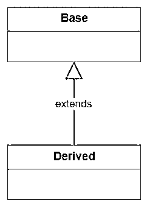
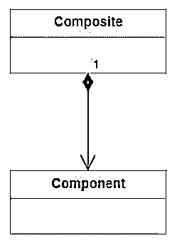
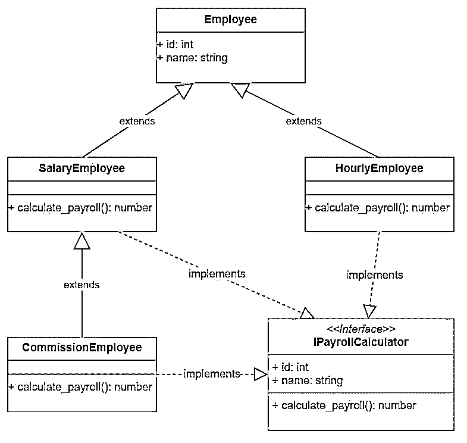
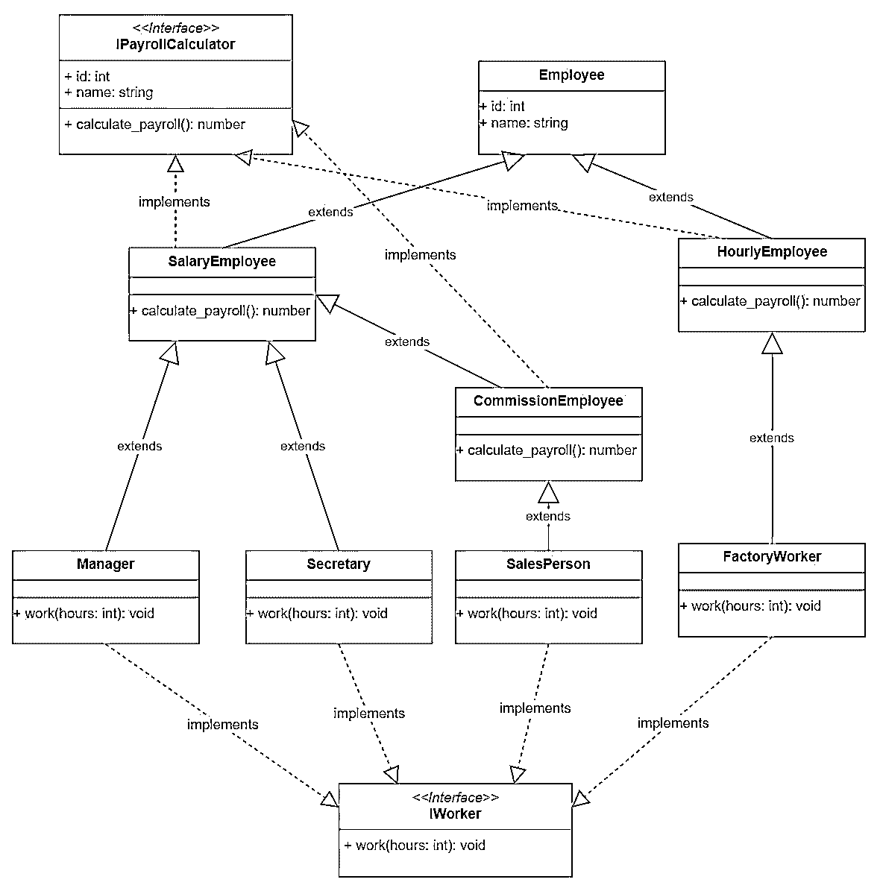
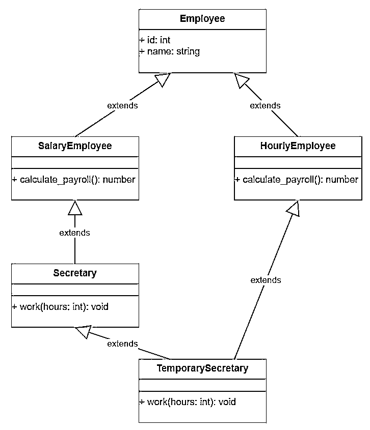
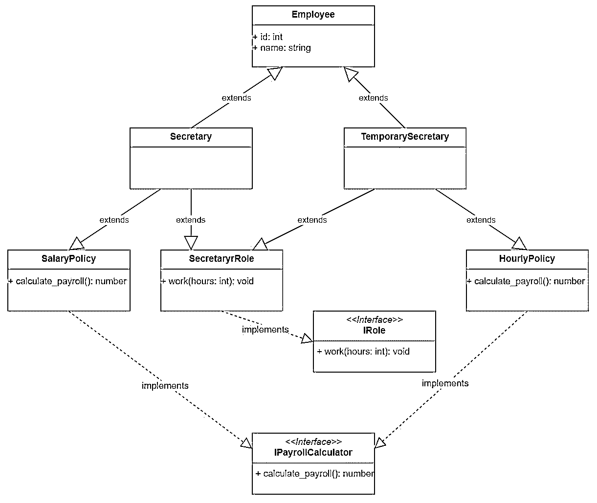
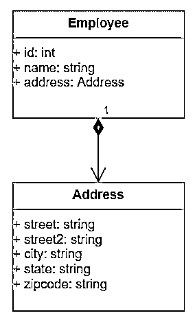
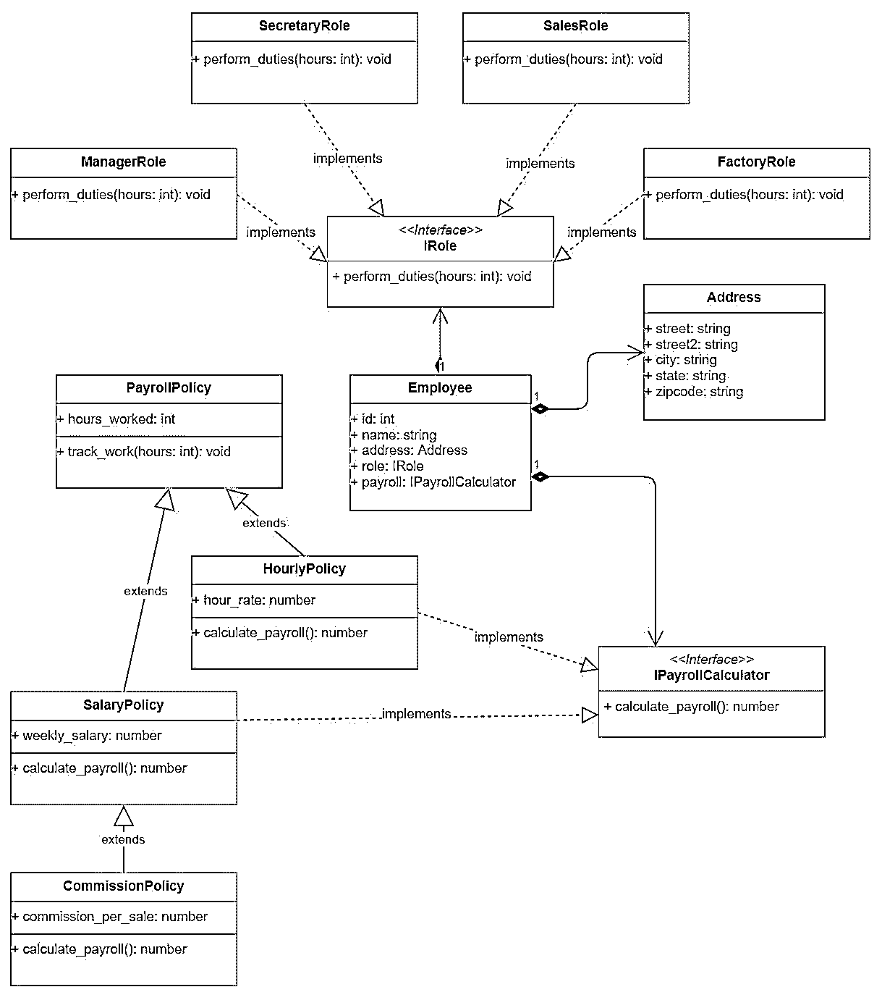

# 继承和组合:Python OOP 指南

> 原文：<https://realpython.com/inheritance-composition-python/>

*立即观看**本教程有真实 Python 团队创建的相关视频课程。和文字教程一起看，加深理解: [**继承与构成:一个 Python OOP 指南**](/courses/inheritance-composition-python/)

在本文中，您将探索 Python 中的**继承**和**组合**。[继承](https://en.wikipedia.org/wiki/Inheritance_(object-oriented_programming))和[组合](https://en.wikipedia.org/wiki/Object_composition)是面向对象编程中的两个重要概念，它们对两个类之间的关系进行建模。它们是[面向对象设计](https://realpython.com/python3-object-oriented-programming/)的构建模块，它们帮助程序员编写可重用的代码。

**在本文结束时，你将知道如何**:

*   在 Python 中使用继承
*   使用继承对类层次结构建模
*   在 Python 中使用多重继承并理解它的缺点
*   使用合成来创建复杂的对象
*   通过应用组合重用现有代码
*   通过合成在运行时改变应用程序行为

**免费奖励:** [点击此处获取免费的 Python OOP 备忘单](https://realpython.com/bonus/python-oop/)，它会为你指出最好的教程、视频和书籍，让你了解更多关于 Python 面向对象编程的知识。

## 什么是继承和构成？

继承和 T2 是面向对象编程中的两个主要概念，它们模拟了两个类之间的关系。它们驱动应用程序的设计，并确定应用程序应该如何随着新功能的添加或需求的变化而发展。

它们都支持代码重用，但是它们以不同的方式实现。

[*Remove ads*](/account/join/)

### 什么是遗传？

**继承**模型所谓的**就是**关系。这意味着当你有一个继承自`Base`类的`Derived`类时，你创建了一个关系，其中`Derived` **是`Base`的**特殊版本。

使用统一建模语言或 UML 以如下方式表示继承:

[](https://files.realpython.com/media/ic-basic-inheritance.f8dc9ffee4d7.jpg)

类被表示为顶部带有类名的方框。继承关系由从派生类指向基类的箭头表示。单词**延伸**通常加在箭头上。

**注意:**在继承关系中:

*   从另一个继承的类称为派生类、子类或子类型。
*   从其派生出其他类的类称为基类或超类。
*   派生类被称为派生、继承或扩展基类。

假设你有一个基类`Animal`，你从它派生出一个`Horse`类。继承关系声明一个`Horse`T8 是一个 T3。这意味着`Horse`继承了[接口](https://realpython.com/python-interface/)和`Animal`的实现，并且`Horse`对象可以用来替换应用中的`Animal`对象。

这就是所谓的[利斯科夫替代原理](https://en.wikipedia.org/wiki/Liskov_substitution_principle)。该原则声明“在一个计算机程序中，如果`S`是`T`的一个子类型，那么`T`类型的对象可以被`S`类型的对象替换，而不会改变程序的任何期望属性”。

在本文中，您将看到为什么在创建类层次结构时应该始终遵循 Liskov 替换原则，以及如果不这样做将会遇到的问题。

### 作文是什么？

**组合**是一个概念，模型**有一个**关系。它允许通过组合其他类型的对象来创建复杂类型。这意味着一个类`Composite`可以包含另一个类`Component`的对象。这种关系意味着一个`Composite`T8 有一个 T3。

UML 表示组合如下:

[](https://files.realpython.com/media/ic-basic-composition.8a15876f7db2.jpg)

Composition 通过一条线来表示，在 composite 类处有一个菱形，指向 component 类。复合方可以表达关系的基数。基数表示`Composite`类将包含的`Component`实例的数量或有效范围。

在上图中，`1`表示`Composite`类包含一个类型为`Component`的对象。基数可以用以下方式表示:

*   **数字**表示包含在`Composite`中的`Component`实例的数量。
*   ***符号**表示`Composite`类可以包含数量可变的`Component`实例。
*   **一个范围 1..4** 表示`Composite`类可以包含一系列`Component`实例。该范围用最小和最大实例数表示，或像 **1 中那样用最小和许多实例表示..*** 。

**注意:**包含其他类的对象的类通常被称为复合类，其中用于创建更复杂类型的类被称为组件。

例如，您的`Horse`类可以由另一个类型为`Tail`的对象组成。构图允许你通过说一个`Horse` **有一个** `Tail`来表达这种关系。

组合使您能够通过向其他对象添加对象来重用代码，而不是继承其他类的接口和实现。`Horse`和`Dog`类都可以通过组合来利用`Tail`的功能，而不需要从一个类派生另一个类。

## Python 中继承的概述

Python 中的一切都是对象。模块是对象，类定义和函数是对象，当然，从类创建的对象也是对象。

继承是每一种面向对象编程语言的必备特性。这意味着 Python 支持继承，正如您稍后将看到的，它是少数支持多重继承的语言之一。

当你使用类编写 Python 代码时，即使你不知道你在使用继承，你也在使用它。让我们来看看这意味着什么。

[*Remove ads*](/account/join/)

### 对象超类

在 Python 中看到继承的最简单的方法是跳到 [Python 交互式 shell](https://realpython.com/interacting-with-python/#using-the-python-interpreter-interactively) 中，写一点代码。您将从编写尽可能简单的类开始:

>>>

```py
>>> class MyClass:
...     pass
...
```

你声明了一个类`MyClass`,它并没有做很多事情，但是它将阐明最基本的继承概念。现在您已经声明了类，您可以使用`dir()`函数来列出它的成员:

>>>

```py
>>> c = MyClass()
>>> dir(c)
['__class__', '__delattr__', '__dict__', '__dir__', '__doc__', '__eq__',
'__format__', '__ge__', '__getattribute__', '__gt__', '__hash__', '__init__',
'__init_subclass__', '__le__', '__lt__', '__module__', '__ne__', '__new__',
'__reduce__', '__reduce_ex__', '__repr__', '__setattr__', '__sizeof__',
'__str__', '__subclasshook__', '__weakref__']
```

[`dir()`](https://docs.python.org/3/library/functions.html#dir) 返回指定对象中所有成员的列表。您没有在`MyClass`中声明任何成员，那么列表从何而来？您可以使用交互式解释器找到答案:

>>>

```py
>>> o = object()
>>> dir(o)
['__class__', '__delattr__', '__dir__', '__doc__', '__eq__', '__format__',
'__ge__', '__getattribute__', '__gt__', '__hash__', '__init__',
'__init_subclass__', '__le__', '__lt__', '__ne__', '__new__', '__reduce__',
'__reduce_ex__', '__repr__', '__setattr__', '__sizeof__', '__str__',
'__subclasshook__']
```

如您所见，这两个列表几乎完全相同。在`MyClass`中有一些额外的成员，比如`__dict__`和`__weakref__`，但是`object`类的每个成员都出现在`MyClass`中。

这是因为您在 Python 中创建的每个类都是从`object`隐式派生的。你可以更明确地写`class MyClass(object):`，但这是多余和不必要的。

**注意:**在 Python 2 中，由于超出本文范围的原因，您必须显式地从`object`派生，但是您可以在 Python 2 文档的[新样式和经典类](https://docs.python.org/2/reference/datamodel.html#new-style-and-classic-classes)部分中了解到这一点。

### 例外就是例外

您在 Python 中创建的每个类都将隐式地从`object`派生。该规则的例外是用于通过引发[异常](https://realpython.com/courses/python-exceptions-101/)来指示错误的类。

使用 Python 交互式解释器可以看出问题所在:

>>>

```py
>>> class MyError:
...     pass
...
>>> raise MyError()

Traceback (most recent call last):
  File "<stdin>", line 1, in <module>
TypeError: exceptions must derive from BaseException
```

您创建了一个新类来指示一种错误。然后你试图用它来引发一个异常。出现了一个异常，但是输出声明该异常的类型是`TypeError`而不是`MyError`，并且所有的`exceptions must derive from BaseException`。

`BaseException`是为所有错误类型提供的基类。要创建新的错误类型，您必须从`BaseException`或它的一个派生类中派生您的类。Python 中的约定是从`Exception`中派生出您的定制错误类型，而后者又从`BaseException`中派生出来。

定义错误类型的正确方法如下:

>>>

```py
>>> class MyError(Exception):
...     pass
...
>>> raise MyError()

Traceback (most recent call last):
  File "<stdin>", line 1, in <module>
__main__.MyError
```

如您所见，当您引发`MyError`时，输出正确地陈述了所引发的错误类型。

### 创建类层次结构

继承是用来创建相关类的层次结构的机制。这些相关的类将共享一个将在基类中定义的公共接口。派生类可以通过提供适用的特定实现来专门化接口。

在本节中，您将开始对人力资源系统进行建模。该示例将演示继承的使用以及派生类如何提供基类接口的具体实现。

人力资源系统需要处理公司员工的工资单，但是根据员工工资单的计算方式不同，员工的类型也不同。

首先实现一个处理工资单的`PayrollSystem`类:

```py
# In hr.py

class PayrollSystem:
    def calculate_payroll(self, employees):
        print('Calculating Payroll')
        print('===================')
        for employee in employees:
            print(f'Payroll for: {employee.id} - {employee.name}')
            print(f'- Check amount: {employee.calculate_payroll()}')
            print('')
```

`PayrollSystem`实现了一个`.calculate_payroll()`方法，该方法获取一组雇员，[打印](https://realpython.com/python-print/)他们的`id`、`name`，并使用每个雇员对象上公开的`.calculate_payroll()`方法检查金额。

现在，您实现了一个基类`Employee`,它处理每个雇员类型的公共接口:

```py
# In hr.py

class Employee:
    def __init__(self, id, name):
        self.id = id
        self.name = name
```

`Employee`是所有雇员类型的基类。它由一个`id`和一个`name`构成。你所说的是每个`Employee`必须有一个`id`和一个名字。

HR 系统要求每个被处理的`Employee`必须提供一个`.calculate_payroll()`接口，返回员工的周工资。该接口的实现因`Employee`的类型而异。

例如，行政人员的工资是固定的，所以每周他们的工资都是一样的:

```py
# In hr.py

class SalaryEmployee(Employee):
    def __init__(self, id, name, weekly_salary):
        super().__init__(id, name)
        self.weekly_salary = weekly_salary

    def calculate_payroll(self):
        return self.weekly_salary
```

您创建了一个继承了`Employee`的派生类`SalaryEmployee`。该类用基类所需的`id`和`name`初始化，您使用`super()`初始化基类的成员。你可以在[用 Python super()](https://realpython.com/python-super/) 增强你的类中阅读关于`super()`的所有内容。

`SalaryEmployee`还需要一个`weekly_salary`初始化参数，表示雇员每周的收入。

该类提供了人力资源系统所需的`.calculate_payroll()`方法。该实现只返回存储在`weekly_salary`中的金额。

该公司还雇佣按小时计酬的制造工人，因此您向 HR 系统添加了一个`HourlyEmployee`:

```py
# In hr.py

class HourlyEmployee(Employee):
    def __init__(self, id, name, hours_worked, hour_rate):
        super().__init__(id, name)
        self.hours_worked = hours_worked
        self.hour_rate = hour_rate

    def calculate_payroll(self):
        return self.hours_worked * self.hour_rate
```

像基类一样，`HourlyEmployee`类用`id`和`name`初始化，加上计算工资所需的`hours_worked`和`hour_rate`。`.calculate_payroll()`方法通过返回工作时间乘以小时费率来实现。

最后，公司雇佣销售助理，他们的工资是固定的，外加基于销售额的佣金，所以您创建了一个`CommissionEmployee`类:

```py
# In hr.py

class CommissionEmployee(SalaryEmployee):
    def __init__(self, id, name, weekly_salary, commission):
        super().__init__(id, name, weekly_salary)
        self.commission = commission

    def calculate_payroll(self):
        fixed = super().calculate_payroll()
        return fixed + self.commission
```

您从`SalaryEmployee`派生`CommissionEmployee`，因为两个类都有一个`weekly_salary`需要考虑。同时，`CommissionEmployee`用一个基于雇员销售额的`commission`值初始化。

`.calculate_payroll()`利用基类的实现来检索`fixed`薪水并添加佣金值。

因为`CommissionEmployee`是从`SalaryEmployee`派生的，所以您可以直接访问`weekly_salary`属性，并且您可以使用该属性的值来实现`.calculate_payroll()`。

直接访问属性的问题是，如果`SalaryEmployee.calculate_payroll()`的实现改变了，那么你也必须改变`CommissionEmployee.calculate_payroll()`的实现。最好依赖基类中已经实现的方法，并根据需要扩展功能。

您为系统创建了第一个类层次结构。这些类的 UML 图如下所示:

[](https://files.realpython.com/media/ic-initial-employee-inheritance.b5f1e65cb8d1.jpg)

该图显示了类的继承层次结构。派生类实现了`PayrollSystem`所需要的`IPayrollCalculator`接口。`PayrollSystem.calculate_payroll()`实现要求传递的`employee`对象包含一个`id`、`name`和`calculate_payroll()`实现。

接口的表示类似于类，在接口名上面有单词 **interface** 。接口名称通常以大写字母`I`为前缀。

应用程序创建其员工，并将他们传送到工资单系统以处理工资单:

```py
# In program.py

import hr

salary_employee = hr.SalaryEmployee(1, 'John Smith', 1500)
hourly_employee = hr.HourlyEmployee(2, 'Jane Doe', 40, 15)
commission_employee = hr.CommissionEmployee(3, 'Kevin Bacon', 1000, 250)
payroll_system = hr.PayrollSystem()
payroll_system.calculate_payroll([
    salary_employee,
    hourly_employee,
    commission_employee
])
```

您可以在命令行中运行该程序并查看结果:

```py
$ python program.py

Calculating Payroll
===================
Payroll for: 1 - John Smith
- Check amount: 1500

Payroll for: 2 - Jane Doe
- Check amount: 600

Payroll for: 3 - Kevin Bacon
- Check amount: 1250
```

该程序创建三个 employee 对象，每个派生类一个。然后，它创建工资系统，并将雇员列表传递给它的`.calculate_payroll()`方法，该方法计算每个雇员的工资并打印结果。

注意`Employee`基类没有定义`.calculate_payroll()`方法。这意味着如果你要创建一个普通的`Employee`对象并将其传递给`PayrollSystem`，那么你会得到一个错误。您可以在 Python 交互式解释器中尝试一下:

>>>

```py
>>> import hr
>>> employee = hr.Employee(1, 'Invalid')
>>> payroll_system = hr.PayrollSystem()
>>> payroll_system.calculate_payroll([employee])

Payroll for: 1 - Invalid
Traceback (most recent call last):
  File "<stdin>", line 1, in <module>
  File "/hr.py", line 39, in calculate_payroll
    print(f'- Check amount: {employee.calculate_payroll()}')
AttributeError: 'Employee' object has no attribute 'calculate_payroll'
```

虽然您可以实例化一个`Employee`对象，但是这个对象不能被`PayrollSystem`使用。为什么？因为它不能为了一只`Employee`而`.calculate_payroll()`。为了满足`PayrollSystem`的要求，您需要将`Employee`类(目前是一个具体类)转换成一个抽象类。这样，没有一个员工仅仅是一个`Employee`，而是一个实现`.calculate_payroll()`的员工。

[*Remove ads*](/account/join/)

### Python 中的抽象基类

上面例子中的`Employee`类就是所谓的抽象基类。抽象基类的存在是为了被继承，而不是被实例化。Python 提供了`abc`模块来定义抽象基类。

您可以在类名中使用[前导下划线](https://dbader.org/blog/meaning-of-underscores-in-python)来表明不应该创建该类的对象。下划线提供了一种友好的方式来防止你的代码被滥用，但是它们不能阻止热切的用户创建该类的实例。

Python 标准库中的 [`abc`模块](https://docs.python.org/3/library/abc.html#module-abc)提供了防止从抽象基类创建对象的功能。

您可以修改`Employee`类的实现以确保它不能被实例化:

```py
# In hr.py

from abc import ABC, abstractmethod

class Employee(ABC):
    def __init__(self, id, name):
        self.id = id
        self.name = name

    @abstractmethod
    def calculate_payroll(self):
        pass
```

您从`ABC`派生出`Employee`，使其成为一个抽象基类。然后，你用`@abstractmethod` [装饰器](https://realpython.com/primer-on-python-decorators/)装饰`.calculate_payroll()`方法。

这种变化有两个好的副作用:

1.  你告诉模块的用户不能创建类型为`Employee`的对象。
2.  你告诉其他在`hr`模块上工作的开发人员，如果他们从`Employee`派生，那么他们必须覆盖`.calculate_payroll()`抽象方法。

您可以看到类型`Employee`的对象不能使用交互式解释器创建:

>>>

```py
>>> import hr
>>> employee = hr.Employee(1, 'abstract')

Traceback (most recent call last):
  File "<stdin>", line 1, in <module>
TypeError: Can't instantiate abstract class Employee with abstract methods 
calculate_payroll
```

输出显示该类不能被实例化，因为它包含一个抽象方法`calculate_payroll()`。派生类必须重写方法，以允许创建其类型的对象。

### 实现继承 vs 接口继承

当您从一个类派生另一个类时，派生类将继承这两个类:

1.  **基类接口:**派生类继承了基类的所有方法、属性、特性。

2.  **基类实现:**派生类继承实现类接口的代码。

大多数时候，你会想要继承一个类的实现，但是你会想要实现多个接口，这样你的对象就可以在不同的情况下使用。

现代编程语言是根据这个基本概念设计的。它们允许您从单个类继承，但是您可以实现多个接口。

在 Python 中，不必显式声明接口。任何实现所需接口的对象都可以用来代替另一个对象。这就是所谓的 [**鸭式打字**](https://realpython.com/python-type-checking/#duck-typing) 。鸭子打字通常解释为“如果它的行为像鸭子，那么它就是鸭子。”

为了说明这一点，您现在将向上面的示例添加一个不是从`Employee`派生的`DisgruntledEmployee`类:

```py
# In disgruntled.py

class DisgruntledEmployee:
    def __init__(self, id, name):
        self.id = id
        self.name = name

    def calculate_payroll(self):
        return 1000000
```

`DisgruntledEmployee`类不是从`Employee`派生的，但是它公开了`PayrollSystem`所需的相同接口。`PayrollSystem.calculate_payroll()`需要实现以下接口的对象列表:

*   返回雇员 id 的 **`id`** 属性
*   代表雇员姓名的 **`name`** 属性或特性
*   一个 **`.calculate_payroll()`** 方法，它不接受任何参数并返回要处理的工资总额

所有这些要求都被`DisgruntledEmployee`类满足了，所以`PayrollSystem`仍然可以计算它的工资单。

您可以修改程序以使用`DisgruntledEmployee`类:

```py
# In program.py

import hr
import disgruntled

salary_employee = hr.SalaryEmployee(1, 'John Smith', 1500)
hourly_employee = hr.HourlyEmployee(2, 'Jane Doe', 40, 15)
commission_employee = hr.CommissionEmployee(3, 'Kevin Bacon', 1000, 250)
disgruntled_employee = disgruntled.DisgruntledEmployee(20000, 'Anonymous')
payroll_system = hr.PayrollSystem()
payroll_system.calculate_payroll([
    salary_employee,
    hourly_employee,
    commission_employee,
    disgruntled_employee
])
```

程序创建一个`DisgruntledEmployee`对象，并将其添加到由`PayrollSystem`处理的列表中。现在，您可以运行程序并查看其输出:

```py
$ python program.py

Calculating Payroll
===================
Payroll for: 1 - John Smith
- Check amount: 1500

Payroll for: 2 - Jane Doe
- Check amount: 600

Payroll for: 3 - Kevin Bacon
- Check amount: 1250

Payroll for: 20000 - Anonymous
- Check amount: 1000000
```

如您所见，`PayrollSystem`仍然可以处理新对象，因为它满足了所需的接口。

因为你不需要从一个特定的类中派生出你的对象来被程序重用，你可能会问为什么你应该使用继承而不是仅仅实现你想要的接口。以下规则可能对您有所帮助:

*   使用继承来重用一个实现:你的派生类应该利用它们的大部分基类实现。他们还必须模拟一种**是**的关系。一个`Customer`类可能也有一个`id`和一个`name`，但是一个`Customer`不是一个`Employee`，所以你不应该使用继承。

*   **实现一个可重用的接口:**当你希望你的类被你的应用程序的特定部分重用时，你在你的类中实现所需的接口，但你不需要提供一个基类，或者从另一个类继承。

现在，您可以清理上面的示例，进入下一个主题。您可以删除`disgruntled.py`文件，然后将`hr`模块修改为其原始状态:

```py
# In hr.py

class PayrollSystem:
    def calculate_payroll(self, employees):
        print('Calculating Payroll')
        print('===================')
        for employee in employees:
            print(f'Payroll for: {employee.id} - {employee.name}')
            print(f'- Check amount: {employee.calculate_payroll()}')
            print('')

class Employee:
    def __init__(self, id, name):
        self.id = id
        self.name = name

class SalaryEmployee(Employee):
    def __init__(self, id, name, weekly_salary):
        super().__init__(id, name)
        self.weekly_salary = weekly_salary

    def calculate_payroll(self):
        return self.weekly_salary

class HourlyEmployee(Employee):
    def __init__(self, id, name, hours_worked, hour_rate):
        super().__init__(id, name)
        self.hours_worked = hours_worked
        self.hour_rate = hour_rate

    def calculate_payroll(self):
        return self.hours_worked * self.hour_rate

class CommissionEmployee(SalaryEmployee):
    def __init__(self, id, name, weekly_salary, commission):
        super().__init__(id, name, weekly_salary)
        self.commission = commission

    def calculate_payroll(self):
        fixed = super().calculate_payroll()
        return fixed + self.commission
```

您移除了模块`abc`的导入，因为`Employee`类不需要是抽象的。您还从其中移除了抽象的`calculate_payroll()`方法，因为它不提供任何实现。

基本上，你在你的派生类中继承了`Employee`类的`id`和`name`属性的实现。因为`.calculate_payroll()`只是`PayrollSystem.calculate_payroll()`方法的一个接口，所以不需要在`Employee`基类中实现它。

注意`CommissionEmployee`类是如何从`SalaryEmployee`派生出来的。这意味着`CommissionEmployee`继承了`SalaryEmployee`的实现和接口。您可以看到`CommissionEmployee.calculate_payroll()`方法如何利用基类实现，因为它依赖来自`super().calculate_payroll()`的结果来实现自己的版本。

[*Remove ads*](/account/join/)

### 班级爆炸问题

如果不小心的话，继承会导致一个巨大的类层次结构，很难理解和维护。这就是所谓的**级爆炸问题**。

您开始构建由`PayrollSystem`用来计算工资的`Employee`类型的类层次结构。现在，你需要给这些类添加一些功能，这样它们就可以和新的`ProductivitySystem`一起使用了。

`ProductivitySystem`根据员工角色跟踪生产力。有不同的员工角色:

*   经理们:他们走来走去，对着告诉他们该做什么的人大喊大叫。他们是领薪水的雇员，赚更多的钱。
*   秘书:他们为经理做所有的文书工作，并确保每件事都按时收到账单和付款。他们也是受薪雇员，但挣的钱更少。
*   销售人员:他们打很多电话推销产品。他们有工资，但也有销售提成。
*   工厂工人:他们为公司生产产品。他们按小时计酬。

有了这些需求，你开始看到`Employee`和它的派生类可能属于除了`hr`模块之外的某个地方，因为现在它们也被`ProductivitySystem`使用。

您创建一个`employees`模块并将类移到那里:

```py
# In employees.py

class Employee:
    def __init__(self, id, name):
        self.id = id
        self.name = name

class SalaryEmployee(Employee):
    def __init__(self, id, name, weekly_salary):
        super().__init__(id, name)
        self.weekly_salary = weekly_salary

    def calculate_payroll(self):
        return self.weekly_salary

class HourlyEmployee(Employee):
    def __init__(self, id, name, hours_worked, hour_rate):
        super().__init__(id, name)
        self.hours_worked = hours_worked
        self.hour_rate = hour_rate

    def calculate_payroll(self):
        return self.hours_worked * self.hour_rate

class CommissionEmployee(SalaryEmployee):
    def __init__(self, id, name, weekly_salary, commission):
        super().__init__(id, name, weekly_salary)
        self.commission = commission

    def calculate_payroll(self):
        fixed = super().calculate_payroll()
        return fixed + self.commission
```

实现保持不变，但是您将类移动到了`employee`模块。现在，您更改您的程序来支持这一更改:

```py
# In program.py

import hr
import employees

salary_employee = employees.SalaryEmployee(1, 'John Smith', 1500)
hourly_employee = employees.HourlyEmployee(2, 'Jane Doe', 40, 15)
commission_employee = employees.CommissionEmployee(3, 'Kevin Bacon', 1000, 250)
payroll_system = hr.PayrollSystem()
payroll_system.calculate_payroll([
    salary_employee,
    hourly_employee,
    commission_employee
])
```

您运行该程序，并验证它仍然工作:

```py
$ python program.py

Calculating Payroll
===================
Payroll for: 1 - John Smith
- Check amount: 1500

Payroll for: 2 - Jane Doe
- Check amount: 600

Payroll for: 3 - Kevin Bacon
- Check amount: 1250
```

一切就绪后，您开始添加新的类:

```py
# In employees.py

class Manager(SalaryEmployee):
    def work(self, hours):
        print(f'{self.name} screams and yells for {hours} hours.')

class Secretary(SalaryEmployee):
    def work(self, hours):
        print(f'{self.name} expends {hours} hours doing office paperwork.')

class SalesPerson(CommissionEmployee):
    def work(self, hours):
        print(f'{self.name} expends {hours} hours on the phone.')

class FactoryWorker(HourlyEmployee):
    def work(self, hours):
        print(f'{self.name} manufactures gadgets for {hours} hours.')
```

首先，添加一个从`SalaryEmployee`派生的`Manager`类。该类公开了一个将被生产力系统使用的方法`work()`。该方法采用员工工作的`hours`。

然后你添加`Secretary`、`SalesPerson`和`FactoryWorker`，然后实现`work()`接口，这样它们就可以被生产力系统使用了。

现在，您可以添加`ProductivitySytem`类:

```py
# In productivity.py

class ProductivitySystem:
    def track(self, employees, hours):
        print('Tracking Employee Productivity')
        print('==============================')
        for employee in employees:
            employee.work(hours)
        print('')
```

该类在`track()`方法中跟踪雇员，该方法采用雇员列表和要跟踪的小时数。现在，您可以将生产力系统添加到您的程序中:

```py
# In program.py

import hr
import employees
import productivity

manager = employees.Manager(1, 'Mary Poppins', 3000)
secretary = employees.Secretary(2, 'John Smith', 1500)
sales_guy = employees.SalesPerson(3, 'Kevin Bacon', 1000, 250)
factory_worker = employees.FactoryWorker(2, 'Jane Doe', 40, 15)
employees = [
    manager,
    secretary,
    sales_guy,
    factory_worker,
]
productivity_system = productivity.ProductivitySystem()
productivity_system.track(employees, 40)
payroll_system = hr.PayrollSystem()
payroll_system.calculate_payroll(employees)
```

该程序创建了一个不同类型的员工列表。员工名单被发送到生产力系统以跟踪他们 40 小时的工作。然后，相同的雇员列表被发送到工资系统来计算他们的工资。

您可以运行该程序来查看输出:

```py
$ python program.py

Tracking Employee Productivity
==============================
Mary Poppins screams and yells for 40 hours.
John Smith expends 40 hours doing office paperwork.
Kevin Bacon expends 40 hours on the phone.
Jane Doe manufactures gadgets for 40 hours.

Calculating Payroll
===================
Payroll for: 1 - Mary Poppins
- Check amount: 3000

Payroll for: 2 - John Smith
- Check amount: 1500

Payroll for: 3 - Kevin Bacon
- Check amount: 1250

Payroll for: 4 - Jane Doe
- Check amount: 600
```

该程序显示员工通过生产力系统工作 40 小时。然后，它计算并显示每个雇员的工资。

程序按预期工作，但是您必须添加四个新的类来支持这些变化。随着新需求的出现，您的类层次结构将不可避免地增长，导致类爆炸问题，您的层次结构将变得如此之大，以至于难以理解和维护。

下图显示了新的类层次结构:

[](https://files.realpython.com/media/ic-class-explosion.a3d42b8c9b91.jpg)

该图显示了类层次结构是如何增长的。额外的需求可能会对这种设计的类的数量产生指数效应。

[*Remove ads*](/account/join/)

### 继承多个类

Python 是少数支持多重继承的现代编程语言之一。多重继承是同时从多个基类派生一个类的能力。

多重继承名声不好，以至于大多数现代编程语言都不支持它。相反，现代编程语言支持接口的概念。在这些语言中，您从单个基类继承，然后实现多个接口，因此您的类可以在不同的情况下重用。

这种方法给你的设计带来了一些限制。您只能通过直接从一个类派生来继承它的实现。可以实现多个接口，但是不能继承多个类的实现。

这种约束对于软件设计来说是很好的，因为它迫使你设计的类相互之间的依赖更少。您将在本文后面看到，您可以通过组合利用多个实现，这使得软件更加灵活。然而，这一节是关于多重继承的，所以让我们看看它是如何工作的。

事实证明，当有太多文书工作要做时，有时会雇用临时秘书。在`ProductivitySystem`的上下文中，`TemporarySecretary`类执行`Secretary`的角色，但是出于工资的目的，它是一个`HourlyEmployee`。

你看看你的班级设计。它已经成长了一点点，但你仍然可以理解它是如何工作的。看来你有两个选择:

1.  **从`Secretary`派生:**你可以从`Secretary`派生来继承角色的`.work()`方法，然后重写`.calculate_payroll()`方法实现为`HourlyEmployee`。

2.  **从`HourlyEmployee`派生:**你可以从`HourlyEmployee`派生继承`.calculate_payroll()`方法，然后重写`.work()`方法实现为`Secretary`。

然后，您记得 Python 支持多重继承，所以您决定从`Secretary`和`HourlyEmployee`中派生:

```py
# In employees.py

class TemporarySecretary(Secretary, HourlyEmployee):
    pass
```

Python 允许你从两个不同的类继承，方法是在类声明的括号中指定它们。

现在，您修改程序以添加新的临时秘书员工:

```py
import hr
import employees
import productivity

manager = employees.Manager(1, 'Mary Poppins', 3000)
secretary = employees.Secretary(2, 'John Smith', 1500)
sales_guy = employees.SalesPerson(3, 'Kevin Bacon', 1000, 250)
factory_worker = employees.FactoryWorker(4, 'Jane Doe', 40, 15)
temporary_secretary = employees.TemporarySecretary(5, 'Robin Williams', 40, 9) company_employees = [
    manager,
    secretary,
    sales_guy,
    factory_worker,
 temporary_secretary, ]
productivity_system = productivity.ProductivitySystem()
productivity_system.track(company_employees, 40)
payroll_system = hr.PayrollSystem()
payroll_system.calculate_payroll(company_employees)
```

您运行程序来测试它:

```py
$ python program.py

Traceback (most recent call last):
 File ".\program.py", line 9, in <module>
 temporary_secretary = employee.TemporarySecretary(5, 'Robin Williams', 40, 9)
TypeError: __init__() takes 4 positional arguments but 5 were given
```

你得到一个 [`TypeError`](https://docs.python.org/3/library/exceptions.html#TypeError) 异常，说`4`位置参数在预期的地方，但是`5`被给出。

这是因为你首先从`Secretary`派生`TemporarySecretary`，然后从`HourlyEmployee`派生，所以解释器试图使用`Secretary.__init__()`来初始化对象。

好吧，让我们颠倒一下:

```py
class TemporarySecretary(HourlyEmployee, Secretary):
    pass
```

现在，再次运行程序，看看会发生什么:

```py
$ python program.py

Traceback (most recent call last):
 File ".\program.py", line 9, in <module>
 temporary_secretary = employee.TemporarySecretary(5, 'Robin Williams', 40, 9)
 File "employee.py", line 16, in __init__
 super().__init__(id, name)
TypeError: __init__() missing 1 required positional argument: 'weekly_salary'
```

现在看起来您缺少一个`weekly_salary`参数，这是初始化`Secretary`所必需的，但是这个参数在`TemporarySecretary`的上下文中没有意义，因为它是一个`HourlyEmployee`。

也许实施`TemporarySecretary.__init__()`会有所帮助:

```py
# In employees.py

class TemporarySecretary(HourlyEmployee, Secretary):
    def __init__(self, id, name, hours_worked, hour_rate):
        super().__init__(id, name, hours_worked, hour_rate)
```

试试看:

```py
$ python program.py

Traceback (most recent call last):
 File ".\program.py", line 9, in <module>
 temporary_secretary = employee.TemporarySecretary(5, 'Robin Williams', 40, 9)
 File "employee.py", line 54, in __init__
 super().__init__(id, name, hours_worked, hour_rate)
 File "employee.py", line 16, in __init__
 super().__init__(id, name)
TypeError: __init__() missing 1 required positional argument: 'weekly_salary'
```

那也没用。好了，是时候让你深入 Python 的**方法解析顺序** (MRO)看看到底是怎么回事了。

当一个类的方法或属性被访问时，Python 使用类 [MRO](https://www.python.org/download/releases/2.3/mro/) 来找到它。MRO 也被`super()`用来决定调用哪个方法或属性。你可以在[用 Python super()](https://realpython.com/python-super/)super charge 你的类中了解更多关于`super()`的内容。

您可以使用交互式解释器评估`TemporarySecretary`级 MRO:

>>>

```py
>>> from employees import TemporarySecretary
>>> TemporarySecretary.__mro__

(<class 'employees.TemporarySecretary'>,
 <class 'employees.HourlyEmployee'>,
 <class 'employees.Secretary'>,
 <class 'employees.SalaryEmployee'>,
 <class 'employees.Employee'>,
 <class 'object'>
)
```

MRO 显示了 Python 查找匹配属性或方法的顺序。在示例中，这是我们创建`TemporarySecretary`对象时发生的情况:

1.  调用了`TemporarySecretary.__init__(self, id, name, hours_worked, hour_rate)`方法。

2.  `super().__init__(id, name, hours_worked, hour_rate)`呼叫匹配`HourlyEmployee.__init__(self, id, name, hour_worked, hour_rate)`。

3.  `HourlyEmployee`调用`super().__init__(id, name)`，MRO 将要匹配的`Secretary.__init__()`，继承自`SalaryEmployee.__init__(self, id, name, weekly_salary)`。

因为参数不匹配，所以引发了一个`TypeError`异常。

您可以通过颠倒继承顺序并直接调用`HourlyEmployee.__init__()`来绕过 MRO，如下所示:

```py
class TemporarySecretary(Secretary, HourlyEmployee):
    def __init__(self, id, name, hours_worked, hour_rate):
        HourlyEmployee.__init__(self, id, name, hours_worked, hour_rate)
```

这解决了创建对象的问题，但是当您试图计算工资单时，会遇到类似的问题。您可以运行程序来查看问题:

```py
$ python program.py

Tracking Employee Productivity
==============================
Mary Poppins screams and yells for 40 hours.
John Smith expends 40 hours doing office paperwork.
Kevin Bacon expends 40 hours on the phone.
Jane Doe manufactures gadgets for 40 hours.
Robin Williams expends 40 hours doing office paperwork.

Calculating Payroll
===================
Payroll for: 1 - Mary Poppins
- Check amount: 3000

Payroll for: 2 - John Smith
- Check amount: 1500

Payroll for: 3 - Kevin Bacon
- Check amount: 1250

Payroll for: 4 - Jane Doe
- Check amount: 600

Payroll for: 5 - Robin Williams
Traceback (most recent call last):
 File ".\program.py", line 20, in <module>
 payroll_system.calculate_payroll(employees)
 File "hr.py", line 7, in calculate_payroll
 print(f'- Check amount: {employee.calculate_payroll()}')
 File "employee.py", line 12, in calculate_payroll
 return self.weekly_salary
AttributeError: 'TemporarySecretary' object has no attribute 'weekly_salary'
```

现在的问题是，因为您颠倒了继承顺序，MRO 在找到`HourlyEmployee`中的方法之前找到了`SalariedEmployee`的`.calculate_payroll()`方法。您需要覆盖`TemporarySecretary`中的`.calculate_payroll()`，并从中调用正确的实现:

```py
class TemporarySecretary(Secretary, HourlyEmployee):
    def __init__(self, id, name, hours_worked, hour_rate):
        HourlyEmployee.__init__(self, id, name, hours_worked, hour_rate)

    def calculate_payroll(self):
        return HourlyEmployee.calculate_payroll(self)
```

`calculate_payroll()`方法直接调用`HourlyEmployee.calculate_payroll()`来确保得到正确的结果。您可以再次运行该程序来查看它的工作情况:

```py
$ python program.py

Tracking Employee Productivity
==============================
Mary Poppins screams and yells for 40 hours.
John Smith expends 40 hours doing office paperwork.
Kevin Bacon expends 40 hours on the phone.
Jane Doe manufactures gadgets for 40 hours.
Robin Williams expends 40 hours doing office paperwork.

Calculating Payroll
===================
Payroll for: 1 - Mary Poppins
- Check amount: 3000

Payroll for: 2 - John Smith
- Check amount: 1500

Payroll for: 3 - Kevin Bacon
- Check amount: 1250

Payroll for: 4 - Jane Doe
- Check amount: 600

Payroll for: 5 - Robin Williams
- Check amount: 360
```

程序现在按预期工作，因为您通过明确地告诉解释器我们想要使用哪个方法来强制方法解析顺序。

正如你所看到的，多重继承可能会令人困惑，尤其是当你遇到[钻石问题](https://en.wikipedia.org/wiki/Multiple_inheritance#The_diamond_problem)的时候。

下图显示了类层次结构中的菱形问题:

[](https://files.realpython.com/media/ic-diamond-problem.8e685f12d3c2.jpg)

图表显示了当前类设计中的菱形问题。`TemporarySecretary`使用多重继承从两个类派生，这两个类最终也从`Employee`派生。这会导致两条路径到达`Employee`基类，这是您在设计中想要避免的。

当你使用多重继承并从两个有共同基类的类派生时，菱形问题就出现了。这可能会导致调用错误版本的方法。

正如您所见，Python 提供了一种强制调用正确方法的方式，分析 MRO 可以帮助您理解问题。

尽管如此，当你遇到钻石问题时，最好重新考虑一下设计。现在您将做一些改变来利用多重继承，避免菱形问题。

`Employee`派生类由两个不同的系统使用:

1.  跟踪员工生产力的生产力系统。

2.  **计算员工工资的工资系统**。

这意味着与生产力相关的一切都应该在一个模块中，与工资相关的一切都应该在另一个模块中。您可以开始对生产力模块进行更改:

```py
# In productivity.py

class ProductivitySystem:
    def track(self, employees, hours):
        print('Tracking Employee Productivity')
        print('==============================')
        for employee in employees:
            result = employee.work(hours)
            print(f'{employee.name}: {result}')
        print('')

class ManagerRole:
    def work(self, hours):
        return f'screams and yells for {hours} hours.'

class SecretaryRole:
    def work(self, hours):
        return f'expends {hours} hours doing office paperwork.'

class SalesRole:
    def work(self, hours):
        return f'expends {hours} hours on the phone.'

class FactoryRole:
    def work(self, hours):
        return f'manufactures gadgets for {hours} hours.'
```

`productivity`模块实现了`ProductivitySystem`类，以及它所支持的相关角色。这些类实现了系统所需的`work()`接口，但它们不是从`Employee`派生的。

您可以对`hr`模块进行同样的操作:

```py
# In hr.py

class PayrollSystem:
    def calculate_payroll(self, employees):
        print('Calculating Payroll')
        print('===================')
        for employee in employees:
            print(f'Payroll for: {employee.id} - {employee.name}')
            print(f'- Check amount: {employee.calculate_payroll()}')
            print('')

class SalaryPolicy:
    def __init__(self, weekly_salary):
        self.weekly_salary = weekly_salary

    def calculate_payroll(self):
        return self.weekly_salary

class HourlyPolicy:
    def __init__(self, hours_worked, hour_rate):
        self.hours_worked = hours_worked
        self.hour_rate = hour_rate

    def calculate_payroll(self):
        return self.hours_worked * self.hour_rate

class CommissionPolicy(SalaryPolicy):
    def __init__(self, weekly_salary, commission):
        super().__init__(weekly_salary)
        self.commission = commission

    def calculate_payroll(self):
        fixed = super().calculate_payroll()
        return fixed + self.commission
```

`hr`模块实现了`PayrollSystem`，它计算雇员的工资。它还实现了工资单的策略类。如您所见，策略类不再从`Employee`派生。

现在您可以向`employee`模块添加必要的类:

```py
# In employees.py

from hr import (
    SalaryPolicy,
    CommissionPolicy,
    HourlyPolicy
)
from productivity import (
    ManagerRole,
    SecretaryRole,
    SalesRole,
    FactoryRole
)

class Employee:
    def __init__(self, id, name):
        self.id = id
        self.name = name

class Manager(Employee, ManagerRole, SalaryPolicy):
    def __init__(self, id, name, weekly_salary):
        SalaryPolicy.__init__(self, weekly_salary)
        super().__init__(id, name)

class Secretary(Employee, SecretaryRole, SalaryPolicy):
    def __init__(self, id, name, weekly_salary):
        SalaryPolicy.__init__(self, weekly_salary)
        super().__init__(id, name)

class SalesPerson(Employee, SalesRole, CommissionPolicy):
    def __init__(self, id, name, weekly_salary, commission):
        CommissionPolicy.__init__(self, weekly_salary, commission)
        super().__init__(id, name)

class FactoryWorker(Employee, FactoryRole, HourlyPolicy):
    def __init__(self, id, name, hours_worked, hour_rate):
        HourlyPolicy.__init__(self, hours_worked, hour_rate)
        super().__init__(id, name)

class TemporarySecretary(Employee, SecretaryRole, HourlyPolicy):
    def __init__(self, id, name, hours_worked, hour_rate):
        HourlyPolicy.__init__(self, hours_worked, hour_rate)
        super().__init__(id, name)
```

`employees`模块从其他模块导入策略和角色，并实现不同的`Employee`类型。您仍然使用多重继承来继承工资政策类和生产力角色的实现，但是每个类的实现只需要处理初始化。

注意，您仍然需要在构造函数中显式初始化工资策略。你可能看到了`Manager`和`Secretary`的初始化是相同的。另外，`FactoryWorker`和`TemporarySecretary`的初始化是相同的。

您不希望在更复杂的设计中出现这种代码重复，所以在设计类层次结构时必须小心。

这是新设计的 UML 图:

[](https://files.realpython.com/media/ic-inheritance-policies.0a0de2d42a25.jpg)

图表显示了使用多重继承定义`Secretary`和`TemporarySecretary`的关系，但是避免了菱形问题。

您可以运行该程序，看看它是如何工作的:

```py
$ python program.py

Tracking Employee Productivity
==============================
Mary Poppins: screams and yells for 40 hours.
John Smith: expends 40 hours doing office paperwork.
Kevin Bacon: expends 40 hours on the phone.
Jane Doe: manufactures gadgets for 40 hours.
Robin Williams: expends 40 hours doing office paperwork.

Calculating Payroll
===================
Payroll for: 1 - Mary Poppins
- Check amount: 3000

Payroll for: 2 - John Smith
- Check amount: 1500

Payroll for: 3 - Kevin Bacon
- Check amount: 1250

Payroll for: 4 - Jane Doe
- Check amount: 600

Payroll for: 5 - Robin Williams
- Check amount: 360
```

您已经看到了 Python 中的继承和多重继承是如何工作的。现在可以探讨作文这个话题了。

[*Remove ads*](/account/join/)

## Python 中的合成

**组合**是一个面向对象的设计概念，它模拟了**与**的关系。在组合中，一个名为**复合**的类包含另一个名为**组件**的类的对象。换句话说，复合类**有另一个类的**组件。

组合允许复合类重用它包含的组件的实现。复合类不继承组件类接口，但是它可以利用它的实现。

两个类之间的组合关系被认为是松散耦合的。这意味着对组件类的更改很少影响复合类，对复合类的更改也不会影响组件类。

这为变化提供了更好的适应性，并允许应用程序在不影响现有代码的情况下引入新的需求。

当观察两个相互竞争的软件设计时，一个基于继承，另一个基于组合，组合解决方案通常是最灵活的。你现在可以看看构图是如何工作的。

你已经在我们的例子中使用了复合。如果你看一下`Employee`类，你会发现它包含两个属性:

1.  **`id`** 标识一个员工。
2.  **`name`** 包含员工的姓名。

这两个属性是`Employee`类拥有的对象。所以你可以说一个`Employee` **有一个**`id`**有一个**的名字。

`Employee`的另一个属性可能是`Address`:

```py
# In contacts.py

class Address:
    def __init__(self, street, city, state, zipcode, street2=''):
        self.street = street
        self.street2 = street2
        self.city = city
        self.state = state
        self.zipcode = zipcode

    def __str__(self):
        lines = [self.street]
        if self.street2:
            lines.append(self.street2)
        lines.append(f'{self.city}, {self.state}  {self.zipcode}')
        return '\n'.join(lines)
```

您实现了一个基本的 address 类，它包含了地址的常用组件。您将`street2`属性设为可选属性，因为并非所有地址都有该组件。

您实现了`__str__()`来提供一个`Address`的漂亮表示。您可以在交互式解释器中看到这个实现:

>>>

```py
>>> from contacts import Address
>>> address = Address('55 Main St.', 'Concord', 'NH', '03301')
>>> print(address)

55 Main St.
Concord, NH 03301
```

当你`print()`变量`address`时，特殊方法`__str__()`被调用。因为您重载了该方法以返回一个格式化为地址的字符串，所以您得到了一个很好的、可读的表示。[自定义 Python 类中的运算符和函数重载](https://realpython.com/operator-function-overloading/)很好地概述了类中可用的特殊方法，可以实现这些方法来自定义对象的行为。

现在可以通过组合将`Address`添加到`Employee`类中:

```py
# In employees.py

class Employee:
    def __init__(self, id, name):
        self.id = id
        self.name = name
        self.address = None
```

现在，您可以将`address`属性初始化为`None`，使其成为可选属性，但是通过这样做，您现在可以将一个`Address`分配给一个`Employee`。还要注意在`employee`模块中没有对`contacts`模块的引用。

组合是一种松散耦合的关系，通常不需要复合类了解组件。

表示`Employee`和`Address`之间关系的 UML 图如下所示:

[](https://files.realpython.com/media/ic-employee-address.240e806b1101.jpg)

图表显示了`Employee`和`Address`之间的基本组成关系。

您现在可以修改`PayrollSystem`类来利用`Employee`中的`address`属性:

```py
# In hr.py

class PayrollSystem:
    def calculate_payroll(self, employees):
        print('Calculating Payroll')
        print('===================')
        for employee in employees:
            print(f'Payroll for: {employee.id} - {employee.name}')
            print(f'- Check amount: {employee.calculate_payroll()}')
 if employee.address: print('- Sent to:') print(employee.address)            print('')
```

检查`employee`对象是否有地址，如果有，就打印出来。现在，您可以修改程序，为员工分配一些地址:

```py
# In program.py

import hr
import employees
import productivity
import contacts

manager = employees.Manager(1, 'Mary Poppins', 3000)
manager.address = contacts.Address(
    '121 Admin Rd', 
    'Concord', 
    'NH', 
    '03301'
)
secretary = employees.Secretary(2, 'John Smith', 1500)
secretary.address = contacts.Address(
    '67 Paperwork Ave.', 
    'Manchester', 
    'NH', 
    '03101'
)
sales_guy = employees.SalesPerson(3, 'Kevin Bacon', 1000, 250)
factory_worker = employees.FactoryWorker(4, 'Jane Doe', 40, 15)
temporary_secretary = employees.TemporarySecretary(5, 'Robin Williams', 40, 9)
employees = [
    manager,
    secretary,
    sales_guy,
    factory_worker,
    temporary_secretary,
]
productivity_system = productivity.ProductivitySystem()
productivity_system.track(employees, 40)
payroll_system = hr.PayrollSystem()
payroll_system.calculate_payroll(employees)
```

您向`manager`和`secretary`对象添加了几个地址。当您运行该程序时，您将看到打印的地址:

```py
$ python program.py

Tracking Employee Productivity
==============================
Mary Poppins: screams and yells for {hours} hours.
John Smith: expends {hours} hours doing office paperwork.
Kevin Bacon: expends {hours} hours on the phone.
Jane Doe: manufactures gadgets for {hours} hours.
Robin Williams: expends {hours} hours doing office paperwork.

Calculating Payroll
===================
Payroll for: 1 - Mary Poppins
- Check amount: 3000
- Sent to:
121 Admin Rd
Concord, NH 03301

Payroll for: 2 - John Smith
- Check amount: 1500
- Sent to:
67 Paperwork Ave.
Manchester, NH 03101

Payroll for: 3 - Kevin Bacon
- Check amount: 1250

Payroll for: 4 - Jane Doe
- Check amount: 600

Payroll for: 5 - Robin Williams
- Check amount: 360
```

注意`manager`和`secretary`对象的工资输出是如何显示支票的发送地址的。

`Employee`类利用了`Address`类的实现，而不知道什么是`Address`对象或者它是如何表示的。这种类型的设计非常灵活，你可以改变`Address`类而不会对`Employee`类产生任何影响。

[*Remove ads*](/account/join/)

### 灵活的组合设计

组合比继承更灵活，因为它模拟了一种松散耦合的关系。对组件类的更改对复合类的影响很小或没有影响。基于构图的设计更适合改变。

通过提供实现这些行为的新组件来改变行为，而不是在层次结构中添加新的类。

看一下上面的多重继承例子。想象一下新的工资政策将如何影响设计。试着想象一下如果需要新的角色，类的层次结构会是什么样子。正如你之前看到的，过于依赖继承会导致类爆炸。

最大的问题不在于设计中的类的数量，而在于这些类之间的关系有多紧密。当引入变化时，紧密耦合的类会相互影响。

在本节中，您将使用组合来实现一个更好的设计，它仍然符合`PayrollSystem`和`ProductivitySystem`的需求。

您可以从实现`ProductivitySystem`的功能开始:

```py
# In productivity.py

class ProductivitySystem:
    def __init__(self):
        self._roles = {
            'manager': ManagerRole,
            'secretary': SecretaryRole,
            'sales': SalesRole,
            'factory': FactoryRole,
        }

    def get_role(self, role_id):
        role_type = self._roles.get(role_id)
        if not role_type:
            raise ValueError('role_id')
        return role_type()

    def track(self, employees, hours):
        print('Tracking Employee Productivity')
        print('==============================')
        for employee in employees:
            employee.work(hours)
        print('')
```

`ProductivitySystem`类使用映射到实现角色的角色类的字符串标识符来定义一些角色。它公开了一个`.get_role()`方法，给定一个角色标识符，该方法返回角色类型对象。如果找不到该角色，则会引发一个`ValueError`异常。

它还公开了`.track()`方法中以前的功能，给定一个雇员列表，它跟踪这些雇员的生产率。

现在，您可以实现不同的角色类:

```py
# In productivity.py

class ManagerRole:
    def perform_duties(self, hours):
        return f'screams and yells for {hours} hours.'

class SecretaryRole:
    def perform_duties(self, hours):
        return f'does paperwork for {hours} hours.'

class SalesRole:
    def perform_duties(self, hours):
        return f'expends {hours} hours on the phone.'

class FactoryRole:
    def perform_duties(self, hours):
        return f'manufactures gadgets for {hours} hours.'
```

您实现的每一个角色都公开了一个`.perform_duties()`,它接受工作的`hours`的数量。这些方法返回一个表示职责的字符串。

角色类彼此独立，但是它们公开相同的接口，所以它们是可互换的。稍后您将看到它们是如何在应用程序中使用的。

现在，您可以为应用程序实现`PayrollSystem`:

```py
# In hr.py

class PayrollSystem:
    def __init__(self):
        self._employee_policies = {
            1: SalaryPolicy(3000),
            2: SalaryPolicy(1500),
            3: CommissionPolicy(1000, 100),
            4: HourlyPolicy(15),
            5: HourlyPolicy(9)
        }

    def get_policy(self, employee_id):
        policy = self._employee_policies.get(employee_id)
        if not policy:
            return ValueError(employee_id)
        return policy

    def calculate_payroll(self, employees):
        print('Calculating Payroll')
        print('===================')
        for employee in employees:
            print(f'Payroll for: {employee.id} - {employee.name}')
            print(f'- Check amount: {employee.calculate_payroll()}')
            if employee.address:
                print('- Sent to:')
                print(employee.address)
            print('')
```

`PayrollSystem`为每个员工保留一个工资政策的内部数据库。它公开了一个`.get_policy()`，给定一个雇员`id`，返回其工资政策。如果指定的`id`在系统中不存在，那么该方法会引发一个`ValueError`异常。

`.calculate_payroll()`的实现和以前一样工作。它获取雇员列表，计算工资单，并打印结果。

现在，您可以实施工资单策略类:

```py
# In hr.py

class PayrollPolicy:
    def __init__(self):
        self.hours_worked = 0

    def track_work(self, hours):
        self.hours_worked += hours

class SalaryPolicy(PayrollPolicy):
    def __init__(self, weekly_salary):
        super().__init__()
        self.weekly_salary = weekly_salary

    def calculate_payroll(self):
        return self.weekly_salary

class HourlyPolicy(PayrollPolicy):
    def __init__(self, hour_rate):
        super().__init__()
        self.hour_rate = hour_rate

    def calculate_payroll(self):
        return self.hours_worked * self.hour_rate

class CommissionPolicy(SalaryPolicy):
    def __init__(self, weekly_salary, commission_per_sale):
        super().__init__(weekly_salary)
        self.commission_per_sale = commission_per_sale

    @property
    def commission(self):
        sales = self.hours_worked / 5
        return sales * self.commission_per_sale

    def calculate_payroll(self):
        fixed = super().calculate_payroll()
        return fixed + self.commission
```

首先实现一个`PayrollPolicy`类，作为所有工资政策的基类。这个类跟踪所有工资政策通用的`hours_worked`。

其他策略类源自`PayrollPolicy`。我们在这里使用继承，因为我们想利用`PayrollPolicy`的实现。还有，`SalaryPolicy`、`HourlyPolicy`、`CommissionPolicy`、T6 都是一个、`PayrollPolicy`。

`SalaryPolicy`用一个`weekly_salary`值初始化，然后在`.calculate_payroll()`中使用。`HourlyPolicy`用`hour_rate`初始化，通过利用基类`hours_worked`实现`.calculate_payroll()`。

`CommissionPolicy`类派生自`SalaryPolicy`,因为它想要继承它的实现。它是用`weekly_salary`参数初始化的，但是它也需要一个`commission_per_sale`参数。

`commission_per_sale`用于计算`.commission`，它被实现为一个属性，因此在被请求时被计算。在这个例子中，我们假设每工作 5 小时就有一笔销售,`.commission`是销售数量乘以`commission_per_sale`值。

`CommissionPolicy`通过首先利用`SalaryPolicy`中的实现来实现`.calculate_payroll()`方法，然后添加计算出的佣金。

您现在可以添加一个`AddressBook`类来管理员工地址:

```py
# In contacts.py

class AddressBook:
    def __init__(self):
        self._employee_addresses = {
            1: Address('121 Admin Rd.', 'Concord', 'NH', '03301'),
            2: Address('67 Paperwork Ave', 'Manchester', 'NH', '03101'),
            3: Address('15 Rose St', 'Concord', 'NH', '03301', 'Apt. B-1'),
            4: Address('39 Sole St.', 'Concord', 'NH', '03301'),
            5: Address('99 Mountain Rd.', 'Concord', 'NH', '03301'),
        }

    def get_employee_address(self, employee_id):
        address = self._employee_addresses.get(employee_id)
        if not address:
            raise ValueError(employee_id)
        return address
```

`AddressBook`类为每个雇员保存一个内部的`Address`对象数据库。它公开了一个返回指定雇员`id`地址的`get_employee_address()`方法。如果雇员`id`不存在，那么它引发一个`ValueError`。

`Address`类的实现和以前一样:

```py
# In contacts.py

class Address:
    def __init__(self, street, city, state, zipcode, street2=''):
        self.street = street
        self.street2 = street2
        self.city = city
        self.state = state
        self.zipcode = zipcode

    def __str__(self):
        lines = [self.street]
        if self.street2:
            lines.append(self.street2)
        lines.append(f'{self.city}, {self.state}  {self.zipcode}')
        return '\n'.join(lines)
```

该类管理地址组件，并提供一个漂亮的地址表示。

到目前为止，新的类已经被扩展以支持更多的功能，但是对以前的设计没有重大的改变。这将随着`employees`模块及其类的设计而改变。

您可以从实现一个`EmployeeDatabase`类开始:

```py
# In employees.py

from productivity import ProductivitySystem
from hr import PayrollSystem
from contacts import AddressBook

class EmployeeDatabase:
    def __init__(self):
        self._employees = [
            {
                'id': 1,
                'name': 'Mary Poppins',
                'role': 'manager'
            },
            {
                'id': 2,
                'name': 'John Smith',
                'role': 'secretary'
            },
            {
                'id': 3,
                'name': 'Kevin Bacon',
                'role': 'sales'
            },
            {
                'id': 4,
                'name': 'Jane Doe',
                'role': 'factory'
            },
            {
                'id': 5,
                'name': 'Robin Williams',
                'role': 'secretary'
            },
        ]
        self.productivity = ProductivitySystem()
        self.payroll = PayrollSystem()
        self.employee_addresses = AddressBook()

    @property
    def employees(self):
        return [self._create_employee(**data) for data in self._employees]

    def _create_employee(self, id, name, role):
        address = self.employee_addresses.get_employee_address(id)
        employee_role = self.productivity.get_role(role)
        payroll_policy = self.payroll.get_policy(id)
        return Employee(id, name, address, employee_role, payroll_policy)
```

`EmployeeDatabase`记录公司所有的员工。对于每个雇员，它跟踪`id`、`name`和`role`。它**有一个`ProductivitySystem`、`PayrollSystem`和`AddressBook`的**实例。这些实例用于创建员工。

它公开了一个返回雇员列表的`.employees`属性。对象是在内部方法`._create_employee()`中创建的。注意你没有不同类型的`Employee`类。你只需要实现一个单独的`Employee`类:

```py
# In employees.py

class Employee:
    def __init__(self, id, name, address, role, payroll):
        self.id = id
        self.name = name
        self.address = address
        self.role = role
        self.payroll = payroll

    def work(self, hours):
        duties = self.role.perform_duties(hours)
        print(f'Employee {self.id} - {self.name}:')
        print(f'- {duties}')
        print('')
        self.payroll.track_work(hours)

    def calculate_payroll(self):
        return self.payroll.calculate_payroll()
```

用`id`、`name`和`address`属性初始化`Employee`类。它还要求员工的生产力`role`和`payroll`政策。

该类公开了一个获取工作时间的`.work()`方法。该方法首先从`role`中检索`duties`。换句话说，它委托给`role`对象来执行它的任务。

同样，它委托给`payroll`对象来跟踪工作`hours`。如你所见，如果需要的话，`payroll`使用这些时间来计算工资。

下图显示了所使用的组合设计:

[](https://files.realpython.com/media/ic-policy-based-composition.6e78bdb5824f.jpg)

该图显示了基于组合的策略的设计。有一个单独的`Employee`，它由其他数据对象组成，如`Address`，并依赖于`IRole`和`IPayrollCalculator`接口来委托工作。这些接口有多种实现。

现在，您可以在程序中使用这种设计:

```py
# In program.py

from hr import PayrollSystem
from productivity import ProductivitySystem
from employees import EmployeeDatabase

productivity_system = ProductivitySystem()
payroll_system = PayrollSystem()
employee_database = EmployeeDatabase()
employees = employee_database.employees
productivity_system.track(employees, 40)
payroll_system.calculate_payroll(employees)
```

您可以运行该程序来查看其输出:

```py
$ python program.py

Tracking Employee Productivity
==============================
Employee 1 - Mary Poppins:
- screams and yells for 40 hours.

Employee 2 - John Smith:
- does paperwork for 40 hours.

Employee 3 - Kevin Bacon:
- expends 40 hours on the phone.

Employee 4 - Jane Doe:
- manufactures gadgets for 40 hours.

Employee 5 - Robin Williams:
- does paperwork for 40 hours.

Calculating Payroll
===================
Payroll for: 1 - Mary Poppins
- Check amount: 3000
- Sent to:
121 Admin Rd.
Concord, NH 03301

Payroll for: 2 - John Smith
- Check amount: 1500
- Sent to:
67 Paperwork Ave
Manchester, NH 03101

Payroll for: 3 - Kevin Bacon
- Check amount: 1800.0
- Sent to:
15 Rose St
Apt. B-1
Concord, NH 03301

Payroll for: 4 - Jane Doe
- Check amount: 600
- Sent to:
39 Sole St.
Concord, NH 03301

Payroll for: 5 - Robin Williams
- Check amount: 360
- Sent to:
99 Mountain Rd.
Concord, NH 03301
```

这种设计被称为[基于策略的设计](https://en.wikipedia.org/wiki/Modern_C%2B%2B_Design#Policy-based_design)，其中类由策略组成，它们委托这些策略来完成工作。

在《现代 C++设计》一书中介绍了基于策略的设计，它使用 C++中的模板元编程来实现结果。

Python 不支持模板，但是您可以使用合成获得类似的结果，正如您在上面的示例中看到的。

随着需求的变化，这种类型的设计为您提供了所需的所有灵活性。假设您需要在运行时更改对象的工资计算方式。

[*Remove ads*](/account/join/)

### 使用合成自定义行为

如果你的设计依赖于继承，你需要找到一种改变对象类型的方法来改变它的行为。有了组合，你只需要改变对象使用的策略。

想象一下，我们的`manager`突然变成了按小时计酬的临时雇员。您可以在程序执行过程中以下列方式修改对象:

```py
# In program.py

from hr import PayrollSystem, HourlyPolicy
from productivity import ProductivitySystem
from employees import EmployeeDatabase

productivity_system = ProductivitySystem()
payroll_system = PayrollSystem()
employee_database = EmployeeDatabase()
employees = employee_database.employees
manager = employees[0]
manager.payroll = HourlyPolicy(55)

productivity_system.track(employees, 40)
payroll_system.calculate_payroll(employees)
```

该程序从`EmployeeDatabase`中获取雇员列表，并检索第一个雇员，也就是我们想要的经理。然后它创建一个新的`HourlyPolicy`,初始化为每小时 55 美元，并将其分配给 manager 对象。

新策略现在被`PayrollSystem`用来修改现有的行为。您可以再次运行该程序来查看结果:

```py
$ python program.py

Tracking Employee Productivity
==============================
Employee 1 - Mary Poppins:
- screams and yells for 40 hours.

Employee 2 - John Smith:
- does paperwork for 40 hours.

Employee 3 - Kevin Bacon:
- expends 40 hours on the phone.

Employee 4 - Jane Doe:
- manufactures gadgets for 40 hours.

Employee 5 - Robin Williams:
- does paperwork for 40 hours.

Calculating Payroll
===================
Payroll for: 1 - Mary Poppins
- Check amount: 2200
- Sent to:
121 Admin Rd.
Concord, NH 03301

Payroll for: 2 - John Smith
- Check amount: 1500
- Sent to:
67 Paperwork Ave
Manchester, NH 03101

Payroll for: 3 - Kevin Bacon
- Check amount: 1800.0
- Sent to:
15 Rose St
Apt. B-1
Concord, NH 03301

Payroll for: 4 - Jane Doe
- Check amount: 600
- Sent to:
39 Sole St.
Concord, NH 03301

Payroll for: 5 - Robin Williams
- Check amount: 360
- Sent to:
99 Mountain Rd.
Concord, NH 03301
```

我们的经理玛丽·波平斯的支票现在是 2200 美元，而不是她每周 3000 美元的固定工资。

请注意我们是如何在不改变任何现有类的情况下将业务规则添加到程序中的。考虑一下继承设计需要什么样的改变。

您必须创建一个新的类，并更改经理雇员的类型。你不可能在运行时改变策略。

## 在 Python 中选择继承还是组合

到目前为止，您已经看到了 Python 中的继承和组合是如何工作的。您已经看到派生类继承了它们的基类的接口和实现。您还看到了组合允许您重用另一个类的实现。

您对同一个问题实现了两种解决方案。第一个解决方案使用多重继承，第二个使用组合。

您还看到了 Python 的 duck typing 允许您通过实现所需的接口在程序的现有部分中重用对象。在 Python 中，不需要从基类派生就可以重用你的类。

此时，您可能会问在 Python 中什么时候使用继承而不是组合。它们都支持代码重用。继承和组合可以解决 Python 程序中类似的问题。

一般的建议是使用在两个类之间产生较少依赖的关系。这种关系就是构图。尽管如此，还是会有继承更有意义的时候。

以下部分提供了一些指导方针，帮助您在 Python 中的继承和组合之间做出正确的选择。

### 继承到模型“是”的关系

继承应该只用于建模一个**是一个**关系。利斯科夫的替换原则说，继承自`Base`的`Derived`类型的对象可以替换`Base`类型的对象，而不会改变程序的期望属性。

Liskov 的替代原则是决定继承是否是合适的设计解决方案的最重要的指导方针。然而，答案可能不是在所有情况下都是直截了当的。幸运的是，有一个简单的测试可以用来确定你的设计是否遵循了 Liskov 的替代原理。

假设您有一个类`A`，它提供了您想要在另一个类`B`中重用的实现和接口。您最初的想法是，您可以从`A`派生出`B`，并继承接口和实现。为了确保这是正确的设计，请遵循以下步骤:

1.  **评价`B`是一个`A` :** 想一想这段关系，为它正名。有意义吗？

2.  **评价`A`是个`B` :** 颠倒关系，自圆其说。这也有意义吗？

如果您可以证明这两种关系，那么您就不应该从另一个继承这些类。让我们看一个更具体的例子。

您有一个类`Rectangle`，它公开了一个`.area`属性。你需要一个类`Square`，它也有一个`.area`。看起来一个`Square`是一个特殊类型的`Rectangle`，所以也许你可以从它派生并利用接口和实现。

在开始实现之前，您使用 Liskov 的替代原则来评估这种关系。

一个`Square` **是一个** `Rectangle`，因为它的面积是由它的`height`乘以它的`length`的乘积计算出来的。约束条件是`Square.height`和`Square.length`必须相等。

有道理。你可以证明这种关系，并解释为什么一个`Square` **是一个** `Rectangle`。我们把关系倒过来，看看有没有道理。

一个`Rectangle` **是一个** `Square`，因为它的面积是由它的`height`乘以它的`length`的乘积计算出来的。不同的是`Rectangle.height`和`Rectangle.width`可以独立变化。

也有道理。您可以证明这种关系，并描述每个类的特殊约束。这是一个很好的迹象，表明这两个类不应该相互派生。

您可能已经看到了从`Rectangle`派生出`Square`来解释继承的其他例子。你可能会怀疑你刚刚做的小测试。很公平。让我们写一个程序来说明从`Rectangle`派生`Square`的问题。

首先，你实现`Rectangle`。您甚至要[封装](https://en.wikipedia.org/wiki/Encapsulation_(computer_programming))属性，以确保满足所有约束:

```py
# In rectangle_square_demo.py

class Rectangle:
    def __init__(self, length, height):
        self._length = length
        self._height = height

    @property
    def area(self):
        return self._length * self._height
```

用一个`length`和一个`height`初始化`Rectangle`类，它提供一个返回区域的`.area`属性。`length`和`height`被封装以避免直接改变它们。

现在，您从`Rectangle`派生`Square`，并覆盖必要的接口以满足`Square`的约束:

```py
# In rectangle_square_demo.py

class Square(Rectangle):
    def __init__(self, side_size):
        super().__init__(side_size, side_size)
```

用一个`side_size`初始化`Square`类，它用于初始化基类的两个组件。现在，您编写一个小程序来测试行为:

```py
# In rectangle_square_demo.py

rectangle = Rectangle(2, 4)
assert rectangle.area == 8

square = Square(2)
assert square.area == 4

print('OK!')
```

程序创建一个`Rectangle`和一个`Square`，并断言它们的`.area`计算正确。您可以运行该程序，看到目前为止一切都是`OK`:

```py
$ python rectangle_square_demo.py

OK!
```

程序正确执行，所以看起来`Square`只是一个`Rectangle`的特例。

稍后，您需要支持调整`Rectangle`对象的大小，因此您对该类进行了适当的更改:

```py
# In rectangle_square_demo.py

class Rectangle:
    def __init__(self, length, height):
        self._length = length
        self._height = height

    @property
    def area(self):
        return self._length * self._height

    def resize(self, new_length, new_height):
        self._length = new_length
        self._height = new_height
```

`.resize()`以`new_length`和`new_width`为对象。您可以将以下代码添加到程序中，以验证它是否正常工作:

```py
# In rectangle_square_demo.py

rectangle.resize(3, 5)
assert rectangle.area == 15

print('OK!')
```

调整 rectangle 对象的大小，并断言新区域是正确的。您可以运行程序来验证该行为:

```py
$ python rectangle_square_demo.py

OK!
```

断言通过，您会看到程序正确运行。

那么，如果你调整一个正方形的大小会发生什么？修改程序，并尝试修改`square`对象:

```py
# In rectangle_square_demo.py

square.resize(3, 5)
print(f'Square area: {square.area}')
```

您将与使用`rectangle`相同的参数传递给`square.resize()`，并打印该区域。当您运行该程序时，您会看到:

```py
$ python rectangle_square_demo.py

Square area: 15
OK!
```

程序显示新区域是像`rectangle`对象一样的`15`。现在的问题是，`square`对象不再满足`length`和`height`必须相等的`Square`类约束。

你如何解决这个问题？你可以尝试几种方法，但所有的方法都会很尴尬。你可以覆盖`square`中的`.resize()`并忽略`height`参数，但这将会让那些查看程序其他部分的人感到困惑，在这些部分中`rectangles`被调整了大小，其中一些没有得到预期的区域，因为它们实际上是`squares`。

在像这样的小程序中，可能很容易发现奇怪行为的原因，但是在更复杂的程序中，问题就更难发现了。

事实是，如果你能够双向证明两个类之间的继承关系，你就不应该从一个类派生另一个类。

在例子中，`Square`从`Rectangle`继承了`.resize()`的接口和实现是没有意义的。这并不意味着`Square`对象不能调整大小。这意味着接口是不同的，因为它只需要一个`side_size`参数。

这种接口上的差异证明了不像上面建议的测试那样从`Rectangle`派生`Square`。

[*Remove ads*](/account/join/)

### 用 Mixin 类混合特性

Python 中多重继承的用途之一是通过 [mixins](https://en.wikipedia.org/wiki/Mixin) 扩展一个类的特性。一个 **mixin** 是一个向其他类提供方法的类，但不被认为是基类。

mixin 允许其他类重用它的接口和实现，而不会成为超类。它们实现了一个独特的行为，可以聚合到其他不相关的类中。它们类似于作文，但它们创造了更强的关系。

假设您想将应用程序中某些类型的对象转换成对象的[字典](https://realpython.com/python-dicts/)表示。你可以在每个类中提供一个`.to_dict()`方法来支持这个特性，但是`.to_dict()`的实现看起来非常相似。

这可能是一个很好的混音候选。从稍微修改合成示例中的`Employee`类开始:

```py
# In employees.py

class Employee:
    def __init__(self, id, name, address, role, payroll):
        self.id = id
        self.name = name
        self.address = address
 self._role = role self._payroll = payroll 

    def work(self, hours):
        duties = self._role.perform_duties(hours)
        print(f'Employee {self.id} - {self.name}:')
        print(f'- {duties}')
        print('')
        self._payroll.track_work(hours)

    def calculate_payroll(self):
        return self._payroll.calculate_payroll()
```

变化很小。您只是通过在名称中添加一个前导下划线，将`role`和`payroll`属性更改为内部属性。你很快就会明白你为什么要做出这样的改变。

现在，您添加了`AsDictionaryMixin`类:

```py
# In representations.py

class AsDictionaryMixin:
    def to_dict(self):
        return {
            prop: self._represent(value)
            for prop, value in self.__dict__.items()
            if not self._is_internal(prop)
        }

    def _represent(self, value):
        if isinstance(value, object):
            if hasattr(value, 'to_dict'):
                return value.to_dict()
            else:
                return str(value)
        else:
            return value

    def _is_internal(self, prop):
        return prop.startswith('_')
```

`AsDictionaryMixin`类公开了一个`.to_dict()`方法，该方法将自身的表示作为一个字典返回。该方法被实现为一个 [`dict`理解](https://www.python.org/dev/peps/pep-0274/)，它说:“如果`prop`不是内部的，为`self.__dict__.items()`中的每一项创建一个映射`prop`到`value`的字典。”

**注意:**这就是为什么我们把 role 和 payroll 属性放在`Employee`类的内部，因为我们不想在字典中表示它们。

正如您在开始时看到的，创建一个类从`object`继承一些成员，其中一个成员是`__dict__`，它基本上是一个对象中所有属性到它们的值的映射。

您遍历`__dict__`中的所有条目，并使用`._is_internal()`过滤掉名称以下划线开头的条目。

`._represent()`检查指定值。如果值**是一个** `object`，那么它会查看它是否也有一个`.to_dict()`成员，并使用它来表示对象。否则，它返回一个字符串表示形式。如果这个值不是一个`object`，那么它只是返回这个值。

您可以修改`Employee`类来支持这个 mixin:

```py
# In employees.py

from representations import AsDictionaryMixin

class Employee(AsDictionaryMixin):
    def __init__(self, id, name, address, role, payroll):
        self.id = id
        self.name = name
        self.address = address
        self._role = role
        self._payroll = payroll

    def work(self, hours):
        duties = self._role.perform_duties(hours)
        print(f'Employee {self.id} - {self.name}:')
        print(f'- {duties}')
        print('')
        self._payroll.track_work(hours)

    def calculate_payroll(self):
        return self._payroll.calculate_payroll()
```

你所要做的就是继承`AsDictionaryMixin`来支持这个功能。最好在`Address`类中支持相同的功能，因此`Employee.address`属性以相同的方式表示:

```py
# In contacts.py

from representations import AsDictionaryMixin

class Address(AsDictionaryMixin):
    def __init__(self, street, city, state, zipcode, street2=''):
        self.street = street
        self.street2 = street2
        self.city = city
        self.state = state
        self.zipcode = zipcode

    def __str__(self):
        lines = [self.street]
        if self.street2:
            lines.append(self.street2)
        lines.append(f'{self.city}, {self.state}  {self.zipcode}')
        return '\n'.join(lines)
```

您将 mixin 应用到`Address`类来支持这个特性。现在，您可以编写一个小程序来测试它:

```py
 # In program.py

 import json
 from employees import EmployeeDatabase

 def print_dict(d):
    print(json.dumps(d, indent=2))

for employee in EmployeeDatabase().employees:
    print_dict(employee.to_dict())
```

该程序实现了一个`print_dict()`，使用缩进将字典转换成一个 [JSON](http://json.org/) 字符串，这样输出看起来更好。

然后，它遍历所有雇员，打印由`.to_dict()`提供的字典表示。您可以运行该程序来查看其输出:

```py
 $ python program.py

 {
 "id": "1",
 "name": "Mary Poppins",
 "address": {
 "street": "121 Admin Rd.",
 "street2": "",
 "city": "Concord",
 "state": "NH",
 "zipcode": "03301"
 }
}
{
 "id": "2",
 "name": "John Smith",
 "address": {
 "street": "67 Paperwork Ave",
 "street2": "",
 "city": "Manchester",
 "state": "NH",
 "zipcode": "03101"
 }
}
{
 "id": "3",
 "name": "Kevin Bacon",
 "address": {
 "street": "15 Rose St",
 "street2": "Apt. B-1",
 "city": "Concord",
 "state": "NH",
 "zipcode": "03301"
 }
}
{
 "id": "4",
 "name": "Jane Doe",
 "address": {
 "street": "39 Sole St.",
 "street2": "",
 "city": "Concord",
 "state": "NH",
 "zipcode": "03301"
 }
}
{
 "id": "5",
 "name": "Robin Williams",
 "address": {
 "street": "99 Mountain Rd.",
 "street2": "",
 "city": "Concord",
 "state": "NH",
 "zipcode": "03301"
 }
}
```

你在`Employee`和`Address`类中都利用了`AsDictionaryMixin`的实现，即使它们并不相关。因为`AsDictionaryMixin`只提供行为，所以很容易与其他类重用而不会导致问题。

[*Remove ads*](/account/join/)

### 构图与模型“有”的关系

构图模型 a **有一个**关系。通过组合，一个类`Composite` **拥有一个类`Component`的**实例，并且可以利用它的实现。`Component`类可以在与`Composite`完全无关的其他类中重用。

在上面的合成示例中，`Employee`类**有一个** `Address`对象。`Address`实现了处理地址的所有功能，并且可以被其他类重用。

其他类像`Customer`或`Vendor`可以重用`Address`而不与`Employee`相关。他们可以利用相同的实现，确保在整个应用程序中一致地处理地址。

使用组合时可能会遇到的一个问题是，一些类可能会因为使用多个组件而开始增长。您的类可能需要在构造函数中有多个参数，只是为了传入组成它们的组件。这可能会使您的类难以使用。

避免这个问题的一个方法是使用[工厂方法](https://realpython.com/factory-method-python/)来构造你的对象。你在作文的例子中已经做到了。

如果你看一下`EmployeeDatabase`类的实现，你会注意到它使用`._create_employee()`来构造一个带有正确参数的`Employee`对象。

这种设计是可行的，但是理想情况下，你应该能够通过指定一个`id`来构造一个`Employee`对象，例如`employee = Employee(1)`。

以下更改可能会改进您的设计。您可以从`productivity`模块开始:

```py
# In productivity.py

class _ProductivitySystem:
    def __init__(self):
        self._roles = {
            'manager': ManagerRole,
            'secretary': SecretaryRole,
            'sales': SalesRole,
            'factory': FactoryRole,
        }

    def get_role(self, role_id):
        role_type = self._roles.get(role_id)
        if not role_type:
            raise ValueError('role_id')
        return role_type()

    def track(self, employees, hours):
        print('Tracking Employee Productivity')
        print('==============================')
        for employee in employees:
            employee.work(hours)
        print('')

# Role classes implementation omitted

_productivity_system = _ProductivitySystem()

def get_role(role_id):
    return _productivity_system.get_role(role_id)

def track(employees, hours):
    _productivity_system.track(employees, hours)
```

首先，将`_ProductivitySystem`类设为内部，然后向模块提供一个`_productivity_system`内部变量。您正在向其他开发人员传达，他们不应该直接创建或使用`_ProductivitySystem`。相反，您提供了两个函数，`get_role()`和`track()`，作为模块的公共接口。这是其他模块应该使用的。

你所说的是`_ProductivitySystem`是一个[单例](https://en.wikipedia.org/wiki/Singleton_pattern)，并且应该只有一个从它创建的对象。

现在，您可以用`hr`模块做同样的事情:

```py
# In hr.py

class _PayrollSystem:
    def __init__(self):
        self._employee_policies = {
            1: SalaryPolicy(3000),
            2: SalaryPolicy(1500),
            3: CommissionPolicy(1000, 100),
            4: HourlyPolicy(15),
            5: HourlyPolicy(9)
        }

    def get_policy(self, employee_id):
        policy = self._employee_policies.get(employee_id)
        if not policy:
            return ValueError(employee_id)
        return policy

    def calculate_payroll(self, employees):
        print('Calculating Payroll')
        print('===================')
        for employee in employees:
            print(f'Payroll for: {employee.id} - {employee.name}')
            print(f'- Check amount: {employee.calculate_payroll()}')
            if employee.address:
                print('- Sent to:')
                print(employee.address)
            print('')

# Policy classes implementation omitted

_payroll_system = _PayrollSystem()

def get_policy(employee_id):
    return _payroll_system.get_policy(employee_id)

def calculate_payroll(employees):
    _payroll_system.calculate_payroll(employees)
```

同样，您使`_PayrollSystem`成为内部的，并为它提供一个公共接口。该应用程序将使用公共接口来获取策略和计算工资。

现在，您将对`contacts`模块进行同样的操作:

```py
# In contacts.py

class _AddressBook:
    def __init__(self):
        self._employee_addresses = {
            1: Address('121 Admin Rd.', 'Concord', 'NH', '03301'),
            2: Address('67 Paperwork Ave', 'Manchester', 'NH', '03101'),
            3: Address('15 Rose St', 'Concord', 'NH', '03301', 'Apt. B-1'),
            4: Address('39 Sole St.', 'Concord', 'NH', '03301'),
            5: Address('99 Mountain Rd.', 'Concord', 'NH', '03301'),
        }

    def get_employee_address(self, employee_id):
        address = self._employee_addresses.get(employee_id)
        if not address:
            raise ValueError(employee_id)
        return address

# Implementation of Address class omitted

_address_book = _AddressBook()

def get_employee_address(employee_id):
    return _address_book.get_employee_address(employee_id)
```

你基本上是说应该只有一个`_AddressBook`、一个`_PayrollSystem`和一个`_ProductivitySystem`。同样，这种设计模式被称为 [Singleton](https://en.wikipedia.org/wiki/Singleton_pattern) 设计模式，这对于应该只有一个实例的类来说非常方便。

现在，您可以在`employees`模块上工作了。您还将从`_EmployeeDatabase`中创建一个 Singleton，但是您将做一些额外的更改:

```py
# In employees.py

from productivity import get_role
from hr import get_policy
from contacts import get_employee_address
from representations import AsDictionaryMixin

class _EmployeeDatabase:
    def __init__(self):
        self._employees = {
            1: {
                'name': 'Mary Poppins',
                'role': 'manager'
            },
            2: {
                'name': 'John Smith',
                'role': 'secretary'
            },
            3: {
                'name': 'Kevin Bacon',
                'role': 'sales'
            },
            4: {
                'name': 'Jane Doe',
                'role': 'factory'
            },
            5: {
                'name': 'Robin Williams',
                'role': 'secretary'
            }
        }

    @property
    def employees(self):
        return [Employee(id_) for id_ in sorted(self._employees)]

    def get_employee_info(self, employee_id):
        info = self._employees.get(employee_id)
        if not info:
            raise ValueError(employee_id)
        return info

class Employee(AsDictionaryMixin):
    def __init__(self, id):
        self.id = id
        info = employee_database.get_employee_info(self.id)
        self.name = info.get('name')
        self.address = get_employee_address(self.id)
        self._role = get_role(info.get('role'))
        self._payroll = get_policy(self.id)

    def work(self, hours):
        duties = self._role.perform_duties(hours)
        print(f'Employee {self.id} - {self.name}:')
        print(f'- {duties}')
        print('')
        self._payroll.track_work(hours)

    def calculate_payroll(self):
        return self._payroll.calculate_payroll()

employee_database = _EmployeeDatabase()
```

首先从其他模块导入相关的函数和类。`_EmployeeDatabase`是内部的，在底部，您创建一个实例。这个实例是公共的，是接口的一部分，因为您将希望在应用程序中使用它。

您将`_EmployeeDatabase._employees`属性更改为一个字典，其中键是雇员`id`，值是雇员信息。您还公开了一个`.get_employee_info()`方法来返回指定雇员`employee_id`的信息。

`_EmployeeDatabase.employees`属性现在对键进行排序，以返回按其`id`排序的雇员。您用对`Employee`初始化器的直接调用替换了构造`Employee`对象的方法。

`Employee`类现在用`id`初始化，并使用其他模块中公开的公共函数来初始化它的属性。

现在，您可以更改程序来测试这些更改:

```py
# In program.py

import json

from hr import calculate_payroll
from productivity import track
from employees import employee_database, Employee

def print_dict(d):
    print(json.dumps(d, indent=2))

employees = employee_database.employees

track(employees, 40)
calculate_payroll(employees)

temp_secretary = Employee(5)
print('Temporary Secretary:')
print_dict(temp_secretary.to_dict())
```

您从`hr`和`productivity`模块以及`employee_database`和`Employee`类中导入相关函数。该程序更简洁，因为您公开了所需的接口并封装了对象的访问方式。

请注意，您现在可以使用`id`直接创建一个`Employee`对象。您可以运行该程序来查看其输出:

```py
$ python program.py

Tracking Employee Productivity
==============================
Employee 1 - Mary Poppins:
- screams and yells for 40 hours.

Employee 2 - John Smith:
- does paperwork for 40 hours.

Employee 3 - Kevin Bacon:
- expends 40 hours on the phone.

Employee 4 - Jane Doe:
- manufactures gadgets for 40 hours.

Employee 5 - Robin Williams:
- does paperwork for 40 hours.

Calculating Payroll
===================
Payroll for: 1 - Mary Poppins
- Check amount: 3000
- Sent to:
121 Admin Rd.
Concord, NH 03301

Payroll for: 2 - John Smith
- Check amount: 1500
- Sent to:
67 Paperwork Ave
Manchester, NH 03101

Payroll for: 3 - Kevin Bacon
- Check amount: 1800.0
- Sent to:
15 Rose St
Apt. B-1
Concord, NH 03301

Payroll for: 4 - Jane Doe
- Check amount: 600
- Sent to:
39 Sole St.
Concord, NH 03301

Payroll for: 5 - Robin Williams
- Check amount: 360
- Sent to:
99 Mountain Rd.
Concord, NH 03301

Temporary Secretary:
{
 "id": "5",
 "name": "Robin Williams",
 "address": {
 "street": "99 Mountain Rd.",
 "street2": "",
 "city": "Concord",
 "state": "NH",
 "zipcode": "03301"
 }
}
```

该程序的工作原理和以前一样，但是现在您可以看到一个单独的`Employee`对象可以从它的`id`中创建并显示它的字典表示。

仔细看看`Employee`类:

```py
# In employees.py

class Employee(AsDictionaryMixin):
    def __init__(self, id):
        self.id = id
        info = employee_database.get_employee_info(self.id)
        self.name = info.get('name')
        self.address = get_employee_address(self.id)
        self._role = get_role(info.get('role'))
        self._payroll = get_policy(self.id)

    def work(self, hours):
        duties = self._role.perform_duties(hours)
        print(f'Employee {self.id} - {self.name}:')
        print(f'- {duties}')
        print('')
        self._payroll.track_work(hours)

    def calculate_payroll(self):
        return self._payroll.calculate_payroll()
```

`Employee`类是一个包含多个提供不同功能的对象的组合。它包含一个`Address`,实现所有与员工居住地相关的功能。

`Employee`还包含由`productivity`模块提供的生产力角色，以及由`hr`模块提供的工资政策。这两个对象提供了被`Employee`类用来在`.work()`方法中跟踪工作和在`.calculate_payroll()`方法中计算工资的实现。

你以两种不同的方式使用构图。`Address`类向`Employee`提供额外的数据，其中角色和工资对象提供额外的行为。

尽管如此，`Employee`和这些对象之间的关系是松散耦合的，这提供了一些有趣的功能，您将在下一节看到。

### 改变运行时行为的组合

与组合相反，继承是一种紧密耦合关系。对于继承，只有一种方法可以改变和定制行为。方法重写是自定义基类行为的唯一方式。这造成了难以改变的僵化设计。

另一方面，组合提供了一种松散耦合的关系，支持灵活的设计，并可用于在运行时改变行为。

假设您在计算工资时需要支持长期残疾(LTD)保险。该政策规定，假设雇员工作 40 小时，应向其支付 60%的周薪。

对于继承设计，这可能是一个非常难以支持的需求。将它添加到合成示例中要容易得多。让我们从添加策略类开始:

```py
# In hr.py

class LTDPolicy:
    def __init__(self):
        self._base_policy = None

    def track_work(self, hours):
        self._check_base_policy()
        return self._base_policy.track_work(hours)

    def calculate_payroll(self):
        self._check_base_policy()
        base_salary = self._base_policy.calculate_payroll()
        return base_salary * 0.6

    def apply_to_policy(self, base_policy):
        self._base_policy = base_policy

    def _check_base_policy(self):
        if not self._base_policy:
            raise RuntimeError('Base policy missing')
```

注意`LTDPolicy`没有继承`PayrollPolicy`，但是实现了相同的接口。这是因为实现完全不同，所以我们不想继承任何`PayrollPolicy`的实现。

`LTDPolicy`将`_base_policy`初始化为`None`，并提供一个内部的`._check_base_policy()`方法，如果`._base_policy`没有被应用，该方法将引发一个异常。然后，它提供了一个`.apply_to_policy()`方法来分配`_base_policy`。

公共接口首先检查是否已经应用了`_base_policy`，然后根据基本策略实现功能。`.track_work()`方法只是委托给基本策略，`.calculate_payroll()`用它来计算`base_salary`，然后返回 60%。

现在您可以对`Employee`类做一个小小的修改:

```py
# In employees.py

class Employee(AsDictionaryMixin):
    def __init__(self, id):
        self.id = id
        info = employee_database.get_employee_info(self.id)
        self.name = info.get('name')
        self.address = get_employee_address(self.id)
        self._role = get_role(info.get('role'))
        self._payroll = get_policy(self.id)

    def work(self, hours):
        duties = self._role.perform_duties(hours)
        print(f'Employee {self.id} - {self.name}:')
        print(f'- {duties}')
        print('')
        self._payroll.track_work(hours)

    def calculate_payroll(self):
        return self._payroll.calculate_payroll()

    def apply_payroll_policy(self, new_policy):
        new_policy.apply_to_policy(self._payroll)
        self._payroll = new_policy
```

您添加了一个`.apply_payroll_policy()`方法，将现有的工资政策应用到新政策中，然后替换它。现在您可以修改程序，将策略应用到一个`Employee`对象:

```py
# In program.py

from hr import calculate_payroll, LTDPolicy
from productivity import track
from employees import employee_database

employees = employee_database.employees

sales_employee = employees[2]
ltd_policy = LTDPolicy()
sales_employee.apply_payroll_policy(ltd_policy)

track(employees, 40)
calculate_payroll(employees)
```

程序访问位于索引`2`的`sales_employee`，创建`LTDPolicy`对象，并将策略应用于雇员。当`.calculate_payroll()`被调用时，变化被反映出来。您可以运行程序来评估输出:

```py
$ python program.py

Tracking Employee Productivity
==============================
Employee 1 - Mary Poppins:
- screams and yells for 40 hours.

Employee 2 - John Smith:
- Does paperwork for 40 hours.

Employee 3 - Kevin Bacon:
- Expends 40 hours on the phone.

Employee 4 - Jane Doe:
- Manufactures gadgets for 40 hours.

Employee 5 - Robin Williams:
- Does paperwork for 40 hours.

Calculating Payroll
===================
Payroll for: 1 - Mary Poppins
- Check amount: 3000
- Sent to:
121 Admin Rd.
Concord, NH 03301

Payroll for: 2 - John Smith
- Check amount: 1500
- Sent to:
67 Paperwork Ave
Manchester, NH 03101

Payroll for: 3 - Kevin Bacon
- Check amount: 1080.0
- Sent to:
15 Rose St
Apt. B-1
Concord, NH 03301

Payroll for: 4 - Jane Doe
- Check amount: 600
- Sent to:
39 Sole St.
Concord, NH 03301

Payroll for: 5 - Robin Williams
- Check amount: 360
- Sent to:
99 Mountain Rd.
Concord, NH 03301
```

销售人员凯文·贝肯的支票金额现在是 1080 美元，而不是 1800 美元。那是因为`LTDPolicy`已经应用到工资上了。

如您所见，您可以通过添加新策略和修改几个接口来支持这些变化。这就是基于组合的策略设计给你的灵活性。

### 在 Python 中选择继承还是组合

Python 作为一种面向对象的编程语言，同时支持继承和组合。您看到了继承最适合用于建模一个**是一个**关系，而组合建模一个**有一个**关系。

有时，很难看出两个类之间应该是什么关系，但是您可以遵循以下准则:

*   **在 Python 中使用复合继承**来建模一个清晰的**是一个**关系。首先，证明派生类和它的基类之间的关系。然后，颠倒关系，试图自圆其说。如果你能证明两个方向的关系，那么你就不应该在它们之间使用继承。

*   **在 Python 中使用复合继承**来平衡基类的接口和实现。

*   在 Python 中使用复合继承来为几个不相关的类提供 **mixin** 特性，当这个特性只有一个实现时。

*   **在 Python** 中使用复合而非继承来建模**具有利用组件类实现的**关系。

*   **在 Python 中使用复合而非继承**来创建可由 Python 应用程序中的多个类重用的组件。

*   **使用 Python 中的复合继承**来实现一组行为和策略，这些行为和策略可以互换地应用于其他类来定制它们的行为。

*   **使用 Python 中的复合继承**来实现运行时行为的改变，而不影响现有的类。

## 结论

您探索了 Python 中的**继承和组合。您了解了继承和组合创建的关系类型。您还通过一系列练习了解了继承和组合是如何在 Python 中实现的。**

在本文中，您学习了如何:

*   用继承来表达一个**是两个类之间的一个**关系
*   评估继承是否是正确的关系
*   在 Python 中使用多重继承，并评估 Python 的 MRO 来解决多重继承问题
*   用 mixins 扩展类并重用它们的实现
*   用组合来表达一个**类和两个**类之间有关系
*   使用组合提供灵活的设计
*   通过基于组合的策略设计重用现有代码

## 推荐阅读

这里有一些书籍和文章进一步探讨了面向对象的设计，可以帮助您理解 Python 或其他语言中继承和组合的正确使用:

*   [设计模式:可重用面向对象软件的元素](https://realpython.com/asins/B000SEIBB8/)
*   [头脑优先设计模式:一个对大脑友好的指南](https://realpython.com/asins/B00AA36RZY/)
*   [干净代码:敏捷软件技术手册](https://realpython.com/asins/B001GSTOAM/)
*   [坚实的原则](https://en.wikipedia.org/wiki/SOLID)
*   [利斯科夫替代原理](https://en.wikipedia.org/wiki/Liskov_substitution_principle)

*立即观看**本教程有真实 Python 团队创建的相关视频课程。和文字教程一起看，加深理解: [**继承与构成:一个 Python OOP 指南**](/courses/inheritance-composition-python/)************