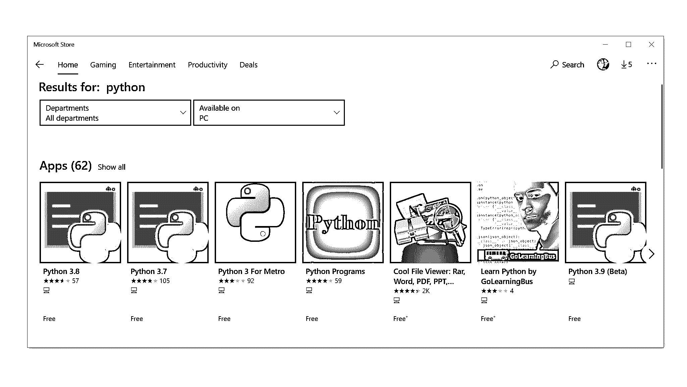
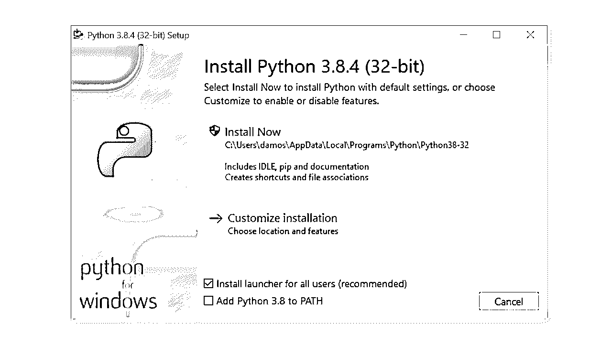
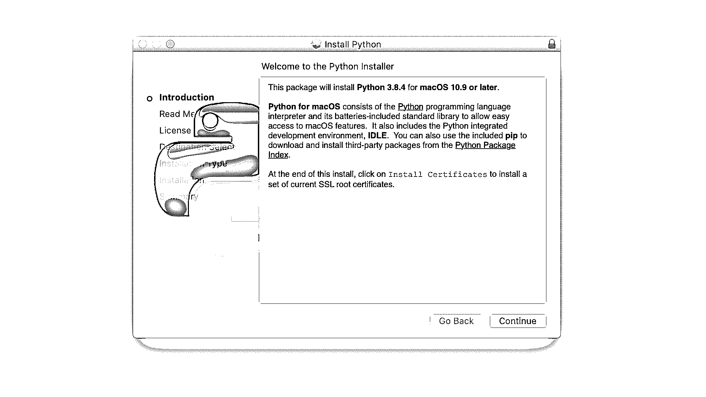

# Python 3 安装和设置指南

> 原文：<https://realpython.com/installing-python/>

*立即观看**本教程有真实 Python 团队创建的相关视频课程。和文字教程一起看，加深理解: [**Python 基础知识:设置 Python**](/courses/setting-up-python/)

在电脑上安装或更新 Python 是成为 Python 程序员的第一步。有多种安装方法:你可以从 Python.org 下载官方的 Python 发行版，从包管理器安装，甚至为科学计算、物联网和嵌入式系统安装专门的发行版。

本教程主要关注官方发行版，因为它们通常是开始学习 Python 编程的最佳选择。

在本教程中，你将学习如何:

*   检查您的机器上安装了哪个版本的 Python
*   在 **Windows** 、 **macOS** 和 **Linux** 上安装或更新 Python
*   在手机或平板电脑等移动设备上使用 Python
*   通过**在线解释器**在网络上使用 Python

无论你在什么操作系统上，本教程都涵盖了你。在下面找到您的操作系统，然后开始学习吧！

**免费奖励:** 并学习 Python 3 的基础知识，如使用数据类型、字典、列表和 Python 函数。

## 如何在 Windows 上安装 Python

Windows 上有三种安装方法:

1.  微软商店
2.  完整安装程序
3.  用于 Linux 的 Windows 子系统

在本节中，您将了解如何检查您的 Windows 计算机上安装了哪个版本的 Python(如果有的话)。您还将了解应该使用三种安装方法中的哪一种。要获得更全面的指南，请查看[您在 Windows 上的 Python 编码环境:设置指南](https://realpython.com/python-coding-setup-windows/)。

[*Remove ads*](/account/join/)

### 如何在 Windows 上检查你的 Python 版本

要检查您的 Windows 机器上是否已经安装了 Python，首先打开一个命令行应用程序，比如 PowerShell。

**提示:**以下是打开 PowerShell 的方法:

1.  按下 `Win` 键。
2.  类型`PowerShell`。
3.  按下 `Enter` 。

或者，您可以右键单击*开始*按钮，选择 *Windows PowerShell* 或 *Windows PowerShell(管理)*。

也可以使用`cmd.exe`或 [Windows 终端](https://www.microsoft.com/en-us/p/windows-terminal/9n0dx20hk701?activetab=pivot:overviewtab)。

在命令行打开的情况下，键入以下命令并按下 `Enter` :

```py
C:\> python --version
Python 3.8.4
```

使用`--version`开关将显示已安装的版本。或者，您可以使用`-V`开关:

```py
C:\> python -V
Python 3.8.4
```

在这两种情况下，如果您看到一个低于`3.8.4`的版本，这是撰写本文时的最新版本，那么您将需要升级您的安装。

**注意:**如果您的系统上没有 Python 版本，那么上述两个命令将启动 Microsoft Store，并将您重定向到 Python 应用程序页面。在下一节中，您将看到如何从 Microsoft Store 完成安装。

如果您对安装的位置感兴趣，那么您可以使用`cmd.exe`或 PowerShell 中的`where.exe`命令:

```py
C:\> where.exe python
C:\Users\mertz\AppData\Local\Programs\Python\Python37-32\python.exe
```

请注意，只有为您的用户帐户安装了 Python 之后，`where.exe`命令才会起作用。

### 你有什么选择

如前所述，在 Windows 上安装官方 Python 发行版有三种方式:

1.  **Microsoft Store 软件包:**Windows 上最简单的安装方法是从 Microsoft Store 应用程序安装。这是推荐给初学 Python 的用户的，他们正在寻找一种易于设置的交互体验。

2.  **完整安装:**这种方法包括直接从 Python.org[网站](https://www.python.org/)下载 Python。对于在安装过程中需要更多控制的中级和高级开发人员，建议这样做。

3.  **Linux 的 Windows 子系统(WSL):**WSL 允许您直接在 Windows 中运行 Linux 环境。通过阅读[Windows 10](https://docs.microsoft.com/en-us/windows/wsl/install-win10)的 Windows 子系统 for Linux 安装指南，可以了解如何启用 WSL。

在本节中，我们将只关注前两个选项，它们是 Windows 环境中最流行的安装方法。

如果你想在 WSL 中安装，那么在你安装了你选择的 Linux 发行版之后，你可以阅读本教程的第[节。](#how-to-install-python-on-linux)

**注意:**你也可以使用其他发行版在 Windows 上完成安装，比如 [Anaconda](https://www.anaconda.com/) ，但是本教程只涵盖官方发行版。

Anaconda 是一个用 Python 进行科学计算和数据科学的流行平台。要了解如何在 Windows 上安装 Anaconda，请查看[在 Windows 上为机器学习设置 Python](https://realpython.com/python-windows-machine-learning-setup/)。

Windows 的两个官方 Python 安装程序并不相同。Microsoft Store 包有一些重要的限制。

#### 微软商店包的局限性

官方 Python 文档是这样描述微软商店包的:

> Microsoft Store 包是一个易于安装的 Python 解释器，主要供交互式使用，例如，供学生使用。([来源](https://docs.python.org/3/using/windows.html#the-microsoft-store-package))

这里关键的一点是微软商店包“主要用于交互使用”也就是说，Microsoft Store 包是为学生和第一次学习使用 Python 的人设计的。

除了面向初级 Pythonistas 之外，Microsoft Store 包还有一些限制，使其不适合专业开发环境。特别是，它[没有对共享位置](https://docs.python.org/3/using/windows.html#known-issues)如`TEMP`或注册表的完全写访问权。

#### Windows 安装程序建议

如果您是 Python 的新手，并且主要关注于学习语言而不是构建专业软件，那么您应该从 Microsoft Store 包中安装。这提供了最短和最简单的途径，以最少的麻烦开始。

另一方面，如果你是一个有经验的开发者，想在 Windows 环境下开发专业软件，那么官方的 Python.org 安装程序是正确的选择。您的安装将不会受到微软商店政策的限制，您可以控制可执行文件的安装位置，甚至在必要时[将 Python 添加到`PATH`](https://realpython.com/add-python-to-path/) 。

[*Remove ads*](/account/join/)

### 如何从微软商店安装

如果您是 Python 的新手，并且希望快速入门，那么 Microsoft Store 包是轻松入门的最佳方式。您可以分两步从 Microsoft Store 安装。

#### 第一步:在微软商店打开 Python 应用页面

打开微软商店应用，搜索`Python`。

您可能会看到可以选择安装的多个版本:

[](https://files.realpython.com/media/Screen_Shot_2020-07-16_at_11.06.17_AM.4b41c401c5aa.png)

选择 *Python 3.8* ，或者你在应用中看到的最高版本号，打开安装页面。

**警告:**确保您选择的 Python 应用程序是由 **Python 软件基金会**创建的。

微软官方商店的软件包将永远是免费的，所以如果应用程序需要花钱，那么它就是**错误的**应用程序。

或者，您可以打开 PowerShell 并键入以下命令:

```py
C:\> python
```

如果您的系统上还没有 Python 的版本，那么当您按下 `Enter` 时，微软商店将自动启动并带您进入商店中最新版本的 Python。

#### 第二步:安装 Python 应用

选择要安装的版本后，按照以下步骤完成安装:

1.  点击*获取*。

2.  等待应用程序下载。下载完成后，*获取*按钮将被一个显示*在我的设备上安装*的按钮取代。

3.  点击*在我的设备上安装*并选择您想要完成安装的设备。

4.  点击*立即安装*，然后点击*确定*开始安装。

5.  如果安装成功，您将在 Microsoft Store 页面的顶部看到消息“此产品已安装”。

恭喜你！你现在已经可以接触到 Python 了，包括 [`pip`](https://realpython.com/what-is-pip/) 和[闲](https://realpython.com/python-idle/)！

### 如何从完整安装程序安装

对于需要全功能 Python 开发环境的专业开发人员来说，从完整安装程序安装是正确的选择。与从 Microsoft 商店安装相比，它提供了更多的自定义和对安装的控制。

您可以分两步从完整安装程序进行安装。

#### 步骤 1:下载完整的安装程序

按照以下步骤下载完整的安装程序:

1.  打开浏览器窗口，导航至 Windows 的 Python.org[下载页面。](https://www.python.org/downloads/windows/)

2.  在“Python Releases for Windows”标题下，单击*最新 Python 3 版本- Python 3.x.x* 的链接。在撰写本文时，最新版本是 Python 3.8.4。

3.  滚动到底部，选择 64 位的 *Windows x86-64 可执行安装程序或 32 位*的 *Windows x86 可执行安装程序。*

如果您不确定是选择 32 位还是 64 位安装程序，那么您可以展开下面的框来帮助您做出决定。


对于 Windows，您可以选择 32 位或 64 位安装程序。这两者的区别如下:

*   如果您的系统有 32 位处理器，那么您应该选择 32 位安装程序。如果您试图在 32 位处理器上安装 64 位版本，那么您将在开始时得到一个错误，并且安装将失败。

*   在 64 位系统上，这两种安装程序都可以满足大多数用途。32 位版本通常使用较少的内存，但 64 位版本对于计算密集型应用程序来说性能更好。

如果您不确定选择哪个版本，请选择 64 位版本。

如果你有一个 64 位系统，想从 64 位 Python 切换到 32 位(反之亦然)，那么你可以卸载 Python，然后通过从[Python.org](https://python.org)下载另一个安装程序来重新安装。

安装程序下载完成后，继续下一步。

#### 第二步:运行安装程序

一旦你选择并下载了一个安装程序，双击下载的文件运行它。将出现如下所示的对话框:

[](https://files.realpython.com/media/Screen_Shot_2020-07-16_at_11.19.15_AM.6e62bfc6eede.png)

关于此对话框，有四点需要注意:

1.  默认安装路径在当前 Windows 用户的 [`AppData/`目录](https://superuser.com/questions/656003/why-is-python-for-windows-not-installed-in-programfiles-c-program-files)下。

2.  *定制安装*按钮可用于定制安装位置以及安装哪些附加功能，包括`pip`和 IDLE。

3.  默认选中*为所有用户安装启动器(推荐)*复选框。这意味着机器上的每个用户都可以访问 [`py.exe`启动器](https://docs.python.org/3/using/windows.html#launcher)。您可以取消选中此框，将 Python 限制为当前 Windows 用户。

4.  默认情况下，*将 Python 3.8 添加到`PATH`* 复选框未选中。有几个[原因](https://discuss.python.org/t/could-we-add-python-to-system-path-by-default/3067)让你可能不希望 Python 出现在`PATH`上，所以在你勾选这个框之前，确保你理解其中的含义。

完整安装程序让您可以完全控制安装过程。

**警告:**如果你不知道什么是 [`PATH`](https://realpython.com/add-python-to-path/) ，那么强烈建议你**不要**安装完整的安装程序。请改用[微软商店包](#how-to-install-from-the-microsoft-store)。

使用对话框中的可用选项自定义安装以满足您的需求。然后点击*立即安装*。这就是全部了！

祝贺您——您现在已经在 Windows 机器上安装了最新版本的 Python 3！

[*Remove ads*](/account/join/)

## 如何在 macOS 上安装 Python

Python 2 预装在旧版本的 macOS 上。从 macOS Catalina 开始，[MAC OS 的当前版本不再如此。](https://developer.apple.com/documentation/macos-release-notes/macos-catalina-10_15-release-notes#Scripting-Language-Runtimes)

macOS 上有两种安装方法:

1.  官方安装人员
2.  家酿软件包管理器

在本节中，您将了解如何检查 macOS 设备上安装了哪个版本的 Python(如果有)。您还将了解应该使用这两种安装方法中的哪一种。

### 如何在 Mac 上检查你的 Python 版本

要检查 Mac 上的 Python 版本，首先打开命令行应用程序，如“终端”。

**提示:**以下是打开终端的方法:

1.  按下 `Cmd` + `Space` 键。
2.  类型`Terminal`。
3.  按下 `Enter` 。

或者，您可以打开 Finder 并导航至*应用程序→实用程序→终端*。

在命令行打开的情况下，键入以下命令:

```py
# Check the system Python version
$ python --version

# Check the Python 2 version
$ python2 --version

# Check the Python 3 version
$ python3 --version
```

如果您的系统上有 Python，那么这些命令中的一个或多个应该响应一个版本号。

例如，如果您的计算机上已经安装了 Python 3.6.10，那么`python3`命令将显示该版本号:

```py
$ python3 --version
Python 3.6.10
```

You’ll want to get the latest version of Python if any of these conditions is true:

*   以上命令都不会返回版本号。
*   您看到显示的唯一版本是 Python 2。x 系列。
*   您拥有的 Python 3 版本不是最新的，在撰写本文时是 3.8.4 版本。

### 你有什么选择

在 macOS 上安装官方 Python 发行版有两种方法:

1.  **官方安装程序:**这种方法包括从 Python.org 网站下载官方安装程序，并在你的机器上运行。

2.  **家酿软件包管理器:**这种方法包括下载并安装[家酿软件包管理器](https://brew.sh/)(如果你还没有安装的话)，然后在终端应用程序中键入命令。

官方安装程序和家酿软件包管理器都可以工作，但是只有官方安装程序由 Python 软件基金会维护。

**注意:**你也可以使用替代发行版在 macOS 上完成安装，比如 [Anaconda](https://www.anaconda.com/) ，但是本教程只涵盖官方发行版。

Anaconda 是一个用 Python 进行科学计算和数据科学的流行平台。要了解如何在 macOS 上安装 Anaconda，请查看 Anaconda 官方文档中的 [macOS 安装指南](https://docs.anaconda.com/anaconda/install/mac-os/)。

官方安装程序和家酿软件包管理器安装的发行版并不相同。从自制软件安装有一些限制。

#### 从自制软件安装的限制

Homebrew 上可用的 MAC OS Python 发行版[不包括 Tkinter 模块所需的 Tcl/Tk 依赖关系](https://github.com/Homebrew/homebrew-core/pull/34424)。Tkinter 是用 Python 开发[图形用户界面的标准库模块，实际上是](https://realpython.com/python-gui-tkinter/) [Tk GUI 工具包](https://www.tcl.tk/)的接口，它不是 Python 的一部分。

Homebrew 不安装 Tk GUI 工具包依赖项。相反，它依赖于系统上安装的现有版本。Tcl/Tk 的系统版本可能已经过时或完全丢失，这可能会阻止您导入 Tkinter 模块。

#### macOS 安装程序建议

家酿软件包管理器是在 macOS 上安装 Python 的一种流行方法，因为它很容易从命令行管理，并且提供了升级 Python 的命令，而不必访问网站。因为 Homebrew 是一个命令行实用程序，所以可以用 bash 脚本实现自动化。

然而，由 Homebrew 提供的 Python 发行版不受 Python 软件基金会的控制，可能会随时改变。macOS 上最可靠的方法是使用官方安装程序，尤其是如果你打算用 Tkinter 进行 [Python GUI 编程。](https://realpython.com/python-gui-tkinter/)

[*Remove ads*](/account/join/)

### 如何从官方安装程序安装

从官方安装程序安装 Python 是 macOS 上最可靠的安装方式。它包括用 Python 开发应用程序所需的所有系统依赖。

您可以分两步从官方安装程序安装。

#### 第一步:下载官方安装程序

按照以下步骤下载完整的安装程序:

1.  打开浏览器窗口，导航至 macOS 的 Python.org[下载页面。](https://www.python.org/downloads/mac-osx/)

2.  在“适用于 Mac OS X 的 Python 版本”标题下，单击*最新 Python 3 版本- Python 3.x.x* 的链接。在撰写本文时，最新版本是 Python 3.8.4。

3.  滚动到底部，点击 *macOS 64 位安装程序*开始下载。

安装程序下载完成后，继续下一步。

#### 第二步:运行安装程序

双击下载的文件运行安装程序。您应该会看到以下窗口:

[](https://files.realpython.com/media/Screen_Shot_2020-07-15_at_8.31.24_AM.2e5b82dbc195.png)

按照以下步骤完成安装:

1.  按几次*继续*,直到要求您同意软件许可协议。然后点击*同意*。

2.  你会看到一个窗口，告诉你安装的目的地和需要多少空间。你很可能不想改变默认位置，所以继续点击 *Install* 开始安装。

3.  当安装程序完成文件复制后，点击*关闭*关闭安装程序窗口。

祝贺您——您现在已经在 macOS 计算机上安装了最新版本的 Python 3！

### 如何从自制软件安装

对于需要从命令行安装的用户，尤其是那些不会使用 Python 来开发带有 Tkinter 模块的图形用户界面的用户，Homebrew package manager 是一个不错的选择。您可以分两步从 Homebrew 软件包管理器安装。

#### 第一步:安装自制软件

如果你已经安装了自制软件，那么你可以跳过这一步。如果您没有安装 Homebrew，请使用以下步骤安装 Homebrew:

1.  打开浏览器，导航至[http://brew.sh/](http://brew.sh/)。

2.  您应该在页面顶部的“安装自制软件”标题下看到一个安装自制软件的命令该命令类似于以下内容:

    ```py
    $ /bin/bash -c "$(curl -fsSL https://raw.githubusercontent.com/Homebrew/install/master/install.sh)"` 
    ```

    用光标高亮显示该命令，并按下 `Cmd` + `C` 将其复制到剪贴板。

3.  打开一个终端窗口，粘贴命令，然后按 `Enter` 。这将开始家酿安装。

4.  出现提示时，输入您的 macOS 用户密码。

根据您的互联网连接，可能需要几分钟来下载所有家酿所需的文件。安装完成后，您将回到终端窗口中的 shell 提示符处。

**注意:**如果你在全新安装的 macOS 上这么做，你可能会得到一个弹出提示，要求你**安装苹果的命令行开发工具。**这些工具是安装所必需的，点击*安装*可以确认对话框。

开发者工具安装完成后，你需要按 `Enter` 继续安装自制软件。

既然已经安装了 Homebrew，就可以安装 Python 了。

#### 第二步:安装 Python

按照以下步骤完成自制软件的安装:

1.  打开终端应用程序。

2.  键入以下命令来升级 Homebrew:

    ```py
    $ brew update && brew upgrade` 
    ```

用 Homebrew 安装现在就像运行命令`brew install python3`一样简单。这将在您的机器上下载并设置最新版本的 Python。

您可以通过测试是否可以从终端访问 Python 来确保一切正常:

1.  打开一个终端。

2.  键入`pip3`并按下 `Enter` 。

3.  你应该看到来自 [Python 的`pip`包管理器](https://realpython.com/what-is-pip/)的帮助文本。如果您在运行`pip3`时得到一个错误消息，那么再次执行安装步骤以确保您有一个工作的安装。

祝贺您——您现在已经在 macOS 系统上安装了 Python！

[*Remove ads*](/account/join/)

## 如何在 Linux 上安装 Python

Linux 上有两种安装方法:

1.  使用操作系统的软件包管理器
2.  从源代码构建 Python

在这一节中，您将学习如何检查 Linux 计算机上的 Python 版本(如果有的话)。您还将了解应该使用这两种安装方法中的哪一种。

### 如何在 Linux 上检查你的 Python 版本

许多 Linux 发行版都打包了 Python，但它可能不是最新版本，甚至可能是 Python 2 而不是 Python 3。你应该检查版本以确保。

要找出您使用的 Python 版本，请打开终端窗口并尝试以下命令:

```py
# Check the system Python version
$ python --version

# Check the Python 2 version
$ python2 --version

# Check the Python 3 version
$ python3 --version
```

如果您的机器上有 Python，那么这些命令中的一个或多个应该用版本号来响应。

例如，如果您的计算机上已经安装了 Python 3.6.10，那么`python3 --version`命令将显示该版本号:

```py
$ python3 --version
Python 3.6.10
```

如果您的当前版本是 Python 2，那么您将希望获得 Python 的最新版本。x 系列或不是 Python 3 的最新版本，在撰写本文时是 3.8.4。

### 你有什么选择

在 Linux 上安装官方 Python 发行版有两种方法:

1.  **从软件包管理器安装:**这是大多数 Linux 发行版上最常见的安装方法。它涉及到从命令行运行命令。

2.  **从源代码构建:**这种方法比使用包管理器更难。它包括从命令行运行一系列命令，以及确保安装了正确的依赖项来编译 Python 源代码。

不是每个 Linux 发行版都有包管理器，也不是每个包管理器的包存储库中都有 Python。根据您的操作系统，从源代码构建 Python 可能是您唯一的选择。

**注意:**您也可以使用其他发行版在 Linux 上完成安装，比如 [Anaconda](https://www.anaconda.com/) ，但是本教程只涵盖官方发行版。

Anaconda 是一个用 Python 进行科学计算和数据科学的流行平台。要了解如何在 Linux 上安装 Anaconda，请查看 Anaconda 官方文档中的 [Linux 安装指南](https://docs.anaconda.com/anaconda/install/linux/)。

您使用哪种安装方法主要归结于您的 Linux OS 是否有包管理器，以及您是否需要控制安装的细节。

#### Linux 安装建议

在 Linux 上安装 Python 最流行的方法是使用操作系统的包管理器，这对大多数用户来说是个不错的选择。然而，根据您的 Linux 发行版，Python 可能无法通过包管理器获得。在这种情况下，您需要从源代码构建 Python。

选择从源代码构建 Python 有三个主要原因:

1.  不能从操作系统的包管理器下载 Python。

2.  您需要控制 Python 的编译方式，比如当您想要降低嵌入式系统的内存占用时。

3.  您希望在正式发布之前试用测试版，并发布最新最好版本的候选版本。

要在您的 Linux 机器上完成安装，请在下面找到您的 Linux 发行版，并按照提供的步骤操作。

[*Remove ads*](/account/join/)

### 如何在 Ubuntu 和 Linux Mint 上安装

在本节中，您将学习如何使用 Ubuntu 的`apt`包管理器安装 Python。如果你想从源代码构建 Python，请跳到[如何从源代码构建 Python](#how-to-build-python-from-source-code)一节。

**注意:** Linux Mint 用户可以跳到“Linux Mint 和 Ubuntu 17 及以下”一节。

根据您运行的 Ubuntu 发行版的版本，在您的系统上设置 Python 的过程会有所不同。您可以通过运行以下命令来确定您的本地 Ubuntu 版本:

```py
$ lsb_release -a
No LSB modules are available.
Distributor ID: Ubuntu
Description:    Ubuntu 16.04.4 LTS
Release:        16.04
Codename:       xenial
```

遵循以下与您在控制台输出中的`Release`下看到的版本号相匹配的说明:

*   **Ubuntu 18.04，Ubuntu 20.04 及以上:**Ubuntu 18.04 及以上默认没有 Python 3.8，但在 Universe 库中有。要安装 3.8 版，请打开终端应用程序并键入以下命令:

    ```py
    $ sudo apt-get update
    $ sudo apt-get install python3.8 python3-pip` 
    ```

    安装完成后，您可以用`python3.8`命令运行 Python 3.8，用`pip3`命令运行`pip`。

*   **Linux Mint 和 Ubuntu 17 及以下:** Python 3.8 不在 Universe 库中，所以你需要从个人包存档(PPA)中获取。例如，要从[“死蛇”PPA](https://launchpad.net/~deadsnakes/+archive/ubuntu/ppa) 安装，请使用以下命令:

    ```py
    $ sudo add-apt-repository ppa:deadsnakes/ppa
    $ sudo apt-get update
    $ sudo apt-get install python3.8 python3-pip` 
    ```

    安装完成后，您可以用`python3.8`命令运行 Python 3.8，用`pip3`命令运行`pip`。

恭喜你！现在，您的机器上已经安装了 Python 3！

### 如何在 Debian Linux 上安装

在 Debian 上安装 Python 3.8 之前，您需要安装`sudo`命令。要安装它，请在终端中执行以下命令:

```py
$ su
$ apt-get install sudo
$ sudo vim /etc/sudoers
```

之后，使用`sudo vim`命令或您喜欢的文本编辑器打开`/etc/sudoers`文件。将下面一行文本添加到文件的末尾，用您实际的用户名替换`your_username`:

```py
your_username ALL=(ALL) ALL
```

现在您可以跳到[如何从源代码构建 Python](#how-to-build-python-from-source-code)部分来完成 Python 的安装。

### 如何在 openSUSE 上安装

从源代码构建是在 openSUSE 上设置 Python 最可靠的方式。为此，您需要安装开发工具，这可以通过菜单或使用`zypper`在`YaST`中完成:

```py
$ sudo zypper install -t pattern devel_C_C
```

这可能需要一段时间才能完成，因为它安装了超过 150 个软件包。一旦完成，就跳到[如何从源代码构建 Python](#how-to-build-python-from-source-code)部分。

### 如何在 CentOS 和 Fedora 上安装

CentOS 和 Fedora 库中没有 Python 3.8，所以您必须从源代码构建 Python。但是，在编译 Python 之前，您需要确保您的系统已经准备好了。

首先，更新 [`yum`包管理器](http://yum.baseurl.org/):

```py
$ sudo yum -y update
```

一旦`yum`完成更新，您可以使用以下命令安装必要的构建依赖项:

```py
$ sudo yum -y groupinstall "Development Tools"
$ sudo yum -y install gcc openssl-devel bzip2-devel libffi-devel
```

安装完成后，请跳到[如何从源代码构建 Python](#how-to-build-python-from-source-code)部分。

[*Remove ads*](/account/join/)

### 如何在 Arch Linux 上安装

Arch Linux 在跟上 Python 版本方面相当勤奋。很可能您已经有了最新版本。如果没有，请使用以下命令更新 Python:

```py
$ packman -S python
```

当 Python 完成更新时，您应该已经准备好了！

### 如何从源代码构建 Python

有时您的 Linux 发行版没有最新版本的 Python，或者您可能只想自己构建最新、最好的版本。以下是从源代码构建 Python 所需的步骤:

#### 第一步:下载源代码

首先，您需要获得 Python 源代码。Python.org 让这变得相当简单。如果你进入[下载](https://www.python.org/downloads/source/)页面，你会在顶部看到 Python 3 的最新源代码。只要确保你没有抓住传统的 Python，Python 2！

当您选择 Python 3 版本时，您会在页面底部看到“文件”部分。选择*gzip source tarball*并下载到你的机器上。如果您喜欢命令行方法，您可以使用`wget`将文件下载到您的当前目录:

```py
$ wget https://www.python.org/ftp/python/3.8.4/Python-3.8.4.tgz
```

当 tarball 完成下载后，您需要做一些事情来为构建 Python 准备您的系统。

#### 步骤 2:准备您的系统

从头开始构建 Python 需要几个特定于发行版的步骤。每个步骤的目标在所有发行版上都是一样的，但是如果发行版不使用`apt-get`，您可能需要翻译成您的发行版:

1.  首先，更新您的软件包管理器并升级您的软件包:

    ```py
    $ sudo apt-get update
    $ sudo apt-get upgrade` 
    ```

2.  接下来，确保您已经安装了所有的构建需求:

    ```py
    # For apt-based systems (like Debian, Ubuntu, and Mint)
    $ sudo apt-get install -y make build-essential libssl-dev zlib1g-dev \
           libbz2-dev libreadline-dev libsqlite3-dev wget curl llvm \
           libncurses5-dev libncursesw5-dev xz-utils tk-dev

    # For yum-based systems (like CentOS)
    $ sudo yum -y groupinstall "Development Tools"
    $ sudo yum -y install gcc openssl-devel bzip2-devel libffi-devel` 
    ```

    如果您的系统上已经安装了一些需求，这是没问题的。您可以执行上述命令，任何现有的包都不会被覆盖。

既然您的系统已经准备就绪，是时候开始构建 Python 了！

#### 步骤 3:构建 Python

1.  一旦有了先决条件和 TAR 文件，就可以将源代码解压到一个目录中。请注意，以下命令将在您所在的目录下创建一个名为`Python-3.8.3`的新目录:

    ```py
    $ tar xvf Python-3.8.4.tgz
    $ cd Python-3.8.4` 
    ```

2.  现在您需要运行`./configure`工具来准备构建:

    ```py
    $ ./configure --enable-optimizations --with-ensurepip=install` 
    ```

    `enable-optimizations`标志将启用 Python 中的一些优化，使其运行速度提高大约 10%。这样做可能会增加二三十分钟的编译时间。`with-ensurepip=install`标志将安装与本次安装捆绑在一起的`pip`。

3.  接下来，使用`make`构建 Python。`-j`选项只是告诉`make`将建筑分割成平行的步骤，以加快编译速度。即使是并行构建，这一步也需要几分钟:

    ```py
    $ make -j 8` 
    ```

4.  最后，您需要安装新版本的 Python。这里您将使用`altinstall`目标来避免覆盖系统 Python。因为您正在安装到`/usr/bin`中，所以您需要以 root 用户身份运行:

    ```py
    $ sudo make altinstall` 
    ```

完成安装可能需要一段时间。一旦完成，您就可以验证 Python 的设置是否正确。

#### 步骤 4:验证您的安装

测试`python3.8 --version`命令是否返回最新版本:

```py
$ python3.8 --version
Python 3.8.4
```

如果你看到`Python 3.8.4`，那么你就一切就绪了！

如果你有多余的时间，你也可以运行[测试套件](https://devguide.python.org/runtests/)来确保你的系统一切正常。

要运行测试套件，请键入以下命令:

```py
$ python3.8 -m test
```

你可能想暂时找点别的事情做，因为你的计算机将运行测试一段时间。如果所有测试都通过了，那么您就可以确信您的全新 Python 版本正在按预期工作！

[*Remove ads*](/account/join/)

## 如何在 iOS 上安装 Python

用于 iOS 的 [Pythonista 应用](http://omz-software.com/pythonista/)是一个成熟的 Python 开发环境，你可以在你的 iPhone 或 iPad 上运行。它将 Python 编辑器、技术文档和解释器整合到一个应用程序中。

Pythonista 使用起来非常有趣。当你被困在没有笔记本电脑的地方，想要在旅途中学习 Python 技能时，这是一个非常棒的小工具。它附带了完整的 Python 3 标准库，甚至包括可以离线浏览的完整文档。

要设置 Pythonista，你需要[从 iOS 应用商店](https://geo.itunes.apple.com/us/app/pythonista-3/id1085978097?ls=1&mt=8&at=1000lqsw)下载。

## 如何在 Android 上安装 Python

如果您有一台 Android 平板电脑或手机，并且想在旅途中练习 Python，有几个选项可供选择。我们发现最可靠地支持 Python 3.8 的是 [Pydroid 3](https://play.google.com/store/apps/details?id=ru.iiec.pydroid3) 。

Pydroid 3 具有一个解释器，可以用于 REPL 会话，还允许编辑、保存和执行 Python 代码。

你可以从 Google Play 商店下载并安装 Pydroid 3。有一个免费版本和一个付费的高级版本，支持代码预测和代码分析。

## 在线 Python 解释器

如果您想尝试本教程中的示例，而不在您的机器上设置 Python，那么有几个网站提供在线 Python 解释器:

*   [Python.org 在线控制台](https://www.python.org/shell)
*   [Repl.it](https://repl.it)
*   [蟒蛇拨弄](http://pythonfiddle.com)
*   [小饰品](https://trinket.io)
*   [Python Anywhere](https://www.pythonanywhere.com/)

这些基于云的 Python 解释器可能无法执行本教程中一些更复杂的例子，但是它们足以运行大多数代码，并且可能是一个不错的入门方式。关于使用这些站点的更多信息将在本系列的下一篇教程中介绍。

## 结论

恭喜你！您现在可以访问适用于您的系统的最新版本的 Python。您的 Python 之旅才刚刚开始。

**在本教程中，你已经学会了如何:**

*   检查 Python 的哪个**版本，如果有的话，安装在您的系统上**
*   在 **Windows** 、 **macOS** 和 **Linux** 上安装最新版本的 Python
*   在手机或平板电脑等移动设备上使用 Python
*   通过**在线解释器**在网络上使用 Python

现在，您已经准备好开始使用 Python 编程了！请务必在下面的评论中分享你的进步和任何问题。

[« Introduction to Python](https://realpython.com/python-introduction/)[Installing Python](#)[Interacting with Python »](https://realpython.com/interacting-with-python/)

*立即观看**本教程有真实 Python 团队创建的相关视频课程。和文字教程一起看，加深理解: [**Python 基础知识:设置 Python**](/courses/setting-up-python/)**********