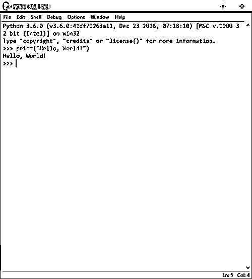
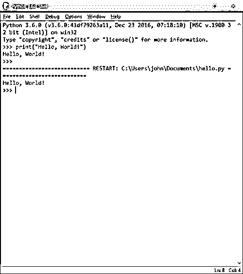

# 与 Python 交互

> 原文：<https://realpython.com/interacting-with-python/>

此时，您应该已经有了一个可用的 Python 3 解释器。如果你需要正确设置 Python 的帮助，请参考本教程系列的[前一节](https://realpython.com/installing-python/)。

**下面是您将在本教程中学到的内容:**现在您已经有了一个可以工作的 Python 设置，您将看到如何实际执行 Python 代码和运行 Python 程序。在本文结束时，您将知道如何:

*   通过直接在解释器中键入代码来交互式地使用 Python
*   从命令行执行脚本文件中包含的代码
*   在 Python 集成开发环境(IDE)中工作

是时候写点 Python 代码了！

## 你好，世界！

在计算机编程领域有一个由来已久的习惯，用新安装的语言编写的第一个代码是一个简短的程序，它只是向控制台显示字符串`Hello, World!`。

注意:这是一个历史悠久的传统，可以追溯到 20 世纪 70 年代。参见[你好，世界！](https://en.wikipedia.org/wiki/%22Hello,_World!%22_program)简史。如果你不遵守这个习俗，你很可能会扰乱宇宙的*气*。

显示`Hello, World!`的最简单的 Python 3 代码是:

```py
print("Hello, World!")
```

下面您将探索几种不同的方法来执行这段代码。

[*Remove ads*](/account/join/)

## 交互式使用 Python 解释器

开始与 Python 对话最直接的方式是在交互式[读取-评估-打印循环(REPL)](https://en.wikipedia.org/wiki/Read%E2%80%93eval%E2%80%93print_loop) 环境中。这仅仅意味着启动解释器并直接向它输入命令。口译员:

*   朗读你输入的命令
*   **E** 评估并执行命令
*   将输出(如果有的话)打印到控制台
*   L 返回并重复这个过程

会话以这种方式继续，直到您指示解释器终止。本系列教程中的大多数示例代码都是以 REPL 交互的形式呈现的。

### 启动解释器

在 GUI 桌面环境中，安装过程可能会在桌面上放置一个图标，或者在启动 Python 的桌面菜单系统中放置一个项目。

例如，在 Windows 中，**开始**菜单中可能会有一个名为 **Python 3.x** 的程序组，在它下面会有一个名为 **Python 3.x (32 位)、**或类似的菜单项，这取决于您选择的特定安装。

单击该项将启动 Python 解释器:

[](https://files.realpython.com/media/python-interpreter-window.24c17cb2fd60.png)

<figcaption class="figure-caption text-center">The Python interpreter (REPL) running inside a terminal window.</figcaption>

或者，您可以打开一个终端窗口，从命令行运行解释器。如何打开终端窗口取决于您使用的操作系统:

*   在 Windows 中，它被称为**命令提示符**。
*   在 macOS 或者 Linux 里面应该叫**终端**。

用你操作系统的搜索功能在 Windows 中搜索“command”或者在 macOS 或者 Linux 中搜索“terminal”应该能找到。

一旦终端窗口打开，如果 Python 安装过程已经正确设置了路径，您应该能够只输入`python`。然后，您应该会看到来自 Python 解释器的响应。

此示例来自 Windows 命令提示符窗口:

```py
C:\Users\john>python
Python 3.6.0 (v3.6.0:41df79263a11, Dec 23 2016, 07:18:10) [MSC v.1900 32 bit (Intel)] on win32
Type "help", "copyright", "credits" or "license" for more information.
>>>
```

**技术提示:**如果你在 Linux 系统上，并且安装了 Python 3，那么可能 Python 2 和 Python 3 都被安装了。在这种情况下，在提示符下键入`python`可能会启动 Python 2。启动 Python 3 可能需要输入其他东西，比如`python3`。

如果您安装了比发行版中包含的版本更新的 Python 3 版本，您甚至可能需要特别指定您安装的版本——例如`python3.6`。

如果您没有看到`>>>`提示符，那么您没有与 Python 解释器对话。这可能是因为 Python 没有安装或者不在您的终端窗口会话的路径中。也有可能您只是没有找到正确的命令来执行它。你可以参考我们的[安装 Python 教程](https://realpython.com/installing-python/)寻求帮助。

### 执行 Python 代码

如果您看到了提示，那么您已经开始运行了！下一步是执行向控制台显示`Hello, World!`的语句:

1.  确保显示`>>>`提示符，并且光标位于其后。
2.  完全按照所示键入命令`print("Hello, World!")`。
3.  按下 `Enter` 键。

解释器的响应应该出现在下一行。您可以看出这是控制台输出，因为没有`>>>`提示符:

>>>

```py
>>> print("Hello, World!")
Hello, World!
```

如果您的会话看起来如上，那么您已经执行了您的第一个 Python 代码！花点时间庆祝一下。

[](https://files.realpython.com/media/celebration.e98e35f3e140.png)

<figcaption class="figure-caption text-center">Congratulations!</figcaption>

出了什么问题吗？也许你犯了这些错误中的一个:

*   您忘记了将要打印的字符串用引号括起来:

    >>>

    ```py
    >>> print(Hello, World!)
      File "<stdin>", line 1
        print(Hello, World!)
                          ^
    SyntaxError: invalid syntax` 
    ```

*   你记住了开始的引号，但忘记了结束的引号:

    >>>

    ```py
    >>> print("Hello, World!)
      File "<stdin>", line 1
        print("Hello, World!)
                            ^
    SyntaxError: EOL while scanning string literal` 
    ```

*   您使用了不同的左引号和右引号:

    >>>

    ```py
    >>> print("Hello, World!')
      File "<stdin>", line 1
        print("Hello, World!')
                             ^
    SyntaxError: EOL while scanning string literal` 
    ```

*   你忘了括号:

    >>>

    ```py
    >>> print "Hello, World!"
      File "<stdin>", line 1
        print "Hello, World!"
                            ^
    SyntaxError: Missing parentheses in call to 'print'` 
    ```

*   您在命令前输入了额外的空白字符:

    >>>

    ```py
    >>>     print("Hello, World!")
      File "<stdin>", line 1
        print("Hello, World!")
        ^
    IndentationError: unexpected indent` 
    ```

(您将在接下来的章节中看到这一点的重要性。)

如果您得到了某种错误消息，请返回并验证您是否完全按照上面显示的方式键入了命令。

[*Remove ads*](/account/join/)

### 退出解释器

当您完成与解释器的交互后，您可以通过几种方式退出 REPL 会话:

*   键入`exit()`并按下 `Enter` :

    >>>

    ```py
    >>> exit()

    C:\Users\john>` 
    ```

*   在 Windows 中，输入 `Ctrl` + `Z` ，按 `Enter` :

    >>>

    ```py
    >>> ^Z
    C:\Users\john>` 
    ```

*   在 Linux 或 macOS 中，输入 `Ctrl` + `D` 。解释器立即终止；不需要按 `Enter` 。

*   如果所有这些都失败了，你可以简单地关闭解释器窗口。这不是最好的方法，但能完成任务。

## 从命令行运行 Python 脚本

以交互方式向 Python 解释器输入命令对于快速测试和探索特性或功能非常有用。

但是，最终，随着您创建更复杂的应用程序，您将开发更长的代码体，您将希望编辑并重复运行这些代码。您显然不想每次都在解释器中重新输入代码！这是您想要创建脚本文件的地方。

Python 脚本是一组可重用的代码。它本质上是一个包含在文件中的 Python 程序——一系列 Python 指令。您可以通过向解释器指定脚本文件的名称来运行程序。

Python 脚本只是纯文本，因此您可以使用任何文本编辑器编辑它们。如果你[有一个最喜欢的操作文本文件的程序员编辑器](https://realpython.com/python-ides-code-editors-guide/)，用起来应该没问题。如果没有，通常会在各自的操作系统中本机安装以下软件:

*   Windows:记事本
*   Unix/Linux: vi 还是 vim
*   macOS: TextEdit

使用您选择的任何编辑器，创建一个名为`hello.py`的脚本文件，包含以下内容:

```py
print("Hello, World!")
```

现在保存文件，跟踪您选择保存到的目录或文件夹。

启动命令提示符或终端窗口。如果当前的工作目录与您保存文件的位置相同，您可以简单地将文件名指定为 Python 解释器的一个命令行参数:`python hello.py`

例如，在 Windows 中，它看起来像这样:

```py
C:\Users\john\Documents\test>dir
 Volume in drive C is JFS
 Volume Serial Number is 1431-F891

 Directory of C:\Users\john\Documents\test

05/20/2018  01:31 PM    <DIR>          .
05/20/2018  01:31 PM    <DIR>          ..
05/20/2018  01:31 PM                24 hello.py
 1 File(s)             24 bytes
 2 Dir(s)  92,557,885,440 bytes free

C:\Users\john\Documents\test>python hello.py
Hello, World!
```

如果脚本不在当前工作目录中，您仍然可以运行它。您只需指定它的路径名:

```py
C:\>cd
C:\

C:\>python c:\Users\john\Documents\test\hello.py
Hello, World!
```

在 Linux 或 macOS 中，您的会话可能看起来更像这样:

```py
jfs@jfs-xps:~$ pwd
/home/jfs

jfs@jfs-xps:~$ ls
hello.py

jfs@jfs-xps:~$ python hello.py
Hello, World!
```

脚本文件不需要有`.py`扩展名。只要您在命令行上正确指定文件名，Python 解释器就会运行该文件，不管它的名称是什么:

```py
jfs@jfs-xps:~$ ls
hello.foo

jfs@jfs-xps:~$ cat hello.foo
print("Hello, World!")

jfs@jfs-xps:~$ python hello.foo
Hello, World!
```

但是给 Python 文件一个`.py`扩展名是一个有用的约定，因为这使得它们更容易识别。在面向桌面的文件夹/图标环境中，如 Windows 和 macOS，这通常也允许设置适当的文件关联，这样您只需单击图标就可以运行脚本。

[*Remove ads*](/account/join/)

## 通过 IDE 与 Python 交互

集成开发环境(IDE)是一个应用程序，它或多或少地结合了您到目前为止看到的所有功能。ide 通常提供 REPL 功能以及一个编辑器，您可以用它来创建和修改代码，然后提交给解释器执行。

您可能还会发现一些很酷的功能，例如:

*   **语法突出显示**:ide 经常给代码中不同的语法元素着色，以便于阅读。
*   上下文相关帮助:高级 ide 可以显示 Python 文档中的相关信息，甚至是常见代码错误的修复建议。
*   **代码完成**:一些 ide 可以为您完成部分键入的代码(比如函数名)——这是一个非常节省时间和方便的特性。
*   **调试**:调试器允许你一步一步地运行代码，并在运行过程中检查程序数据。当你试图确定一个程序为什么行为不正常时，这是非常宝贵的，因为这是不可避免的。

### 空闲

大多数 Python 安装都包含一个名为 [IDLE](https://realpython.com/python-idle/) 的基本 IDE。这个名字表面上代表集成开发和学习环境，但是 Monty Python 团队的一个成员被命名为[埃里克·艾多尔](https://en.wikipedia.org/wiki/Eric_Idle)，这看起来不像是巧合。

运行 IDLE 的过程因操作系统而异。

#### 在 Windows 中开始空闲

进入开始菜单，选择**所有程序**或**所有应用**。应该会有一个标注为 **IDLE (Python 3.x 32 位)**或者类似的程序图标。这在 Win 7、8 和 10 之间会略有不同。空闲图标可能在名为 **Python 3.x** 的程序组文件夹中。您也可以从开始菜单使用 Windows 搜索工具并输入`IDLE`来找到空闲程序图标。

点击图标开始空闲。

#### 在 macOS 中开始空闲

打开 Spotlight 搜索。键入 `Cmd` + `Space` 是实现这一点的几种方法之一。在搜索框中，输入`terminal`，按 `Enter` 。

在终端窗口中，键入`idle3`并按下 `Enter` 。

#### 在 Linux 中开始空闲

Python 3 发行版提供了 IDLE，但默认情况下可能没有安装。要查明是否如此，请打开终端窗口。这取决于 Linux 发行版，但是您应该能够通过使用桌面搜索功能和搜索`terminal`找到它。在终端窗口中，键入`idle3`并按下 `Enter` 。

如果你得到一个错误消息说`command not found`或者类似的话，那么 IDLE 显然没有安装，所以你需要安装它。

安装应用程序的方法也因 Linux 发行版的不同而不同。比如用 Ubuntu Linux，安装 IDLE 的命令是`sudo apt-get install idle3`。许多 Linux 发行版都有基于 GUI 的应用程序管理器，您也可以用它来安装应用程序。

遵循适合您的发行版的任何过程来安装 IDLE。然后，在终端窗口中键入`idle3`，按 `Enter` 运行。您的安装过程可能还在桌面上的某个位置设置了一个程序图标，也可以开始空闲。

咻！

#### 使用空闲

一旦安装了 IDLE 并且成功启动了它，您应该会看到一个标题为 **Python 3.x.x Shell** 的窗口，其中 3.x.x 对应于您的 Python 版本:

[](https://files.realpython.com/media/idle-1.ad05cbe1e2f7.png)

提示应该看起来很熟悉。您可以交互地键入 REPL 命令，就像从控制台窗口启动解释器一样。忌惮宇宙的*之气*，再次施展`Hello, World!`:

[](https://files.realpython.com/media/idle-2.c0a65df087ef.png)

解释器的行为与您直接从控制台运行它时大致相同。IDLE 界面增加了以不同颜色显示不同语法元素的额外功能，使内容更具可读性。

它还提供上下文相关的帮助。例如，如果您键入`print(`而没有键入 print 函数的任何参数或右括号，那么应该会出现一个浮动文本，指定`print()`函数的用法信息。

IDLE 提供的另一个特性是语句回调:

*   如果你输入了几条语句，在 Windows 或 Linux 中可以用 `Alt` + `P` 和 `Alt` + `N` 来回忆。
*   `Alt` + `P` 循环返回之前执行的语句； `Alt` + `N` 循环前进。
*   调用语句后，您可以使用键盘上的编辑键对其进行编辑，然后再次执行。macOS 中对应的命令有`Cmd`+`P``Cmd`+`N`。

您也可以创建脚本文件并在空闲时运行它们。从 Shell 窗口菜单中，选择**文件→新文件**。这将打开一个额外的编辑窗口。键入要执行的代码:

[](https://files.realpython.com/media/idle-3.104282dbe280.png)

在该窗口的菜单中，选择**文件→保存**或**文件→另存为…** ，将文件保存到磁盘。然后选择**运行→运行模块**。输出应该出现在解释器 Shell 窗口中:

[](https://files.realpython.com/media/idle-4.4a4d4399093f.png)

好了，大概够了`Hello, World!`。宇宙的*气*应该是安全的。

两个窗口都打开后，您可以来回切换，在一个窗口中编辑代码，在另一个窗口中运行代码并显示其输出。这样，IDLE 提供了一个基本的 Python 开发平台。

尽管它有些基础，但它支持相当多的附加功能，包括代码完成、代码格式化和调试器。更多细节参见[空闲文档](https://docs.python.org/3/library/idle.html)。

[*Remove ads*](/account/join/)

### 汤妮

Thonny 是由爱沙尼亚塔尔图大学计算机科学研究所开发和维护的免费 Python IDE。它是专门针对 Python 初学者的，所以界面简单而整洁，易于理解并很快适应。

像 IDLE 一样，Thonny 支持 REPL 交互以及脚本文件编辑和执行:

[](https://files.realpython.com/media/thonny-REPL.ffb0d0a0d58d.png) [](https://files.realpython.com/media/thonny-editor.fc8d59bbcaa7.png)

Thonny 除了提供一个分步调试器之外，还执行语法突出显示和代码完成。对学习 Python 的人特别有帮助的一个特性是，在您单步执行代码时，调试器会在表达式中显示求值结果:

[](https://files.realpython.com/media/thonny-expr.d833fc5e3562.png)

Thonny 特别容易上手，因为它内置了 Python 3.6。因此，您只需要执行一次安装，就可以开始了！

版本适用于 Windows、macOS 和 Linux。Thonny 网站有下载和安装说明。

IDLE 和 Thonny 当然不是唯一的游戏。还有许多其他 ide 可用于 Python 代码编辑和开发。查看我们的[Python ide 和代码编辑器指南](https://realpython.com/python-ides-code-editors-guide/)获取更多建议。

## 在线 Python REPL 网站

正如您在上一节中看到的，有一些可用的[网站](https://realpython.com/installing-python/#online-python-interpreters)可以为您提供对在线 Python 解释器的交互式访问，而无需您在本地安装任何东西。

对于本教程中一些更复杂或更长的例子来说，这种方法可能并不令人满意。但是对于简单的 REPL 会话，它应该工作得很好。

Python 软件基金会在其网站上提供了一个交互式外壳。在[主页](https://www.python.org)上，点击看起来像以下按钮之一的按钮:

[](https://files.realpython.com/media/psf-shell1.5e8e53654e7a.png) [](https://files.realpython.com/media/psf-shell2.dea07e54567d.png)

或者直接去[https://www.python.org/shell](https://www.python.org/shell)。

您应该得到一个带有类似如下窗口的页面:

[](https://files.realpython.com/media/psf-shell3.6e56026f9512.png)

熟悉的`>>>`提示符显示您正在与 Python 解释器对话。

以下是其他几个提供 Python REPL 的站点:

*   [PythonFiddle](http://pythonfiddle.com)
*   [repl.it](https://repl.it)
*   [小饰品](https://trinket.io)

[*Remove ads*](/account/join/)

## 结论

较大的应用程序通常包含在脚本文件中，这些文件被传递给 Python 解释器来执行。

但是解释语言的一个优点是你可以运行解释器并交互地执行命令。Python 以这种方式使用起来很容易，而且这是一种让您尝试学习这种语言如何工作的好方法。

本教程中的示例是通过与 Python 解释器的直接交互生成的，但是如果您选择使用 IDLE 或其他一些可用的 IDE，这些示例应该仍然可以正常工作。

继续下一节，您将开始探索 Python 语言本身的元素。

[« Installing Python](https://realpython.com/installing-python/)[Interacting with Python](#)[Basic Data Types »](https://realpython.com/python-data-types/)*****