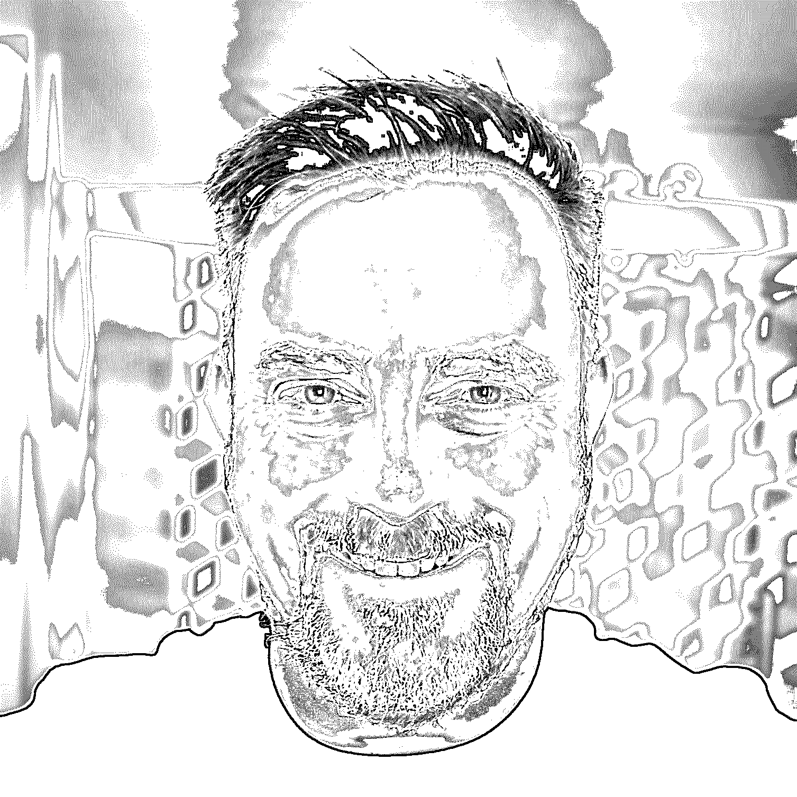

# Python 社区采访克里斯托弗·贝利

> 原文：<https://realpython.com/interview-christopher-bailey/>

今天我和[真正的 Python 播客](https://realpython.com/podcasts/rpp/)的主持人[克里斯托弗·贝利](https://twitter.com/digiglean)交谈。我们挖掘他在音乐和视频制作方面的过去，以及他制作在线视频内容的方法。Christopher 还提供了一些有用的提示和技巧，供任何希望创建自己的第一个编码视频教程的初露头角的内容创作者参考。

克里斯多夫，谢谢你加入我的节目，欢迎来到采访台的另一边。让我们像对待所有客人一样开始:你是如何开始编程的，你是什么时候开始使用 Python 的？

克里斯托弗:谢谢你邀请我。我是在一个朋友家开始编程的，那家有一台 Apple II。我们输入一本杂志上的代码来创造一个文本冒险。我记不清具体细节了，但是在 Ultima 的会议间隙，我们尝试了一些基础的东西。

我的下一个重大经历是省下所有送报的钱，为自己买了一台 ColecoVision。然后，我的父母给了我一个惊喜，买了一台附带的亚当电脑。它基本上是一个苹果 II 克隆版，配有一个可怕的菊花轮式打印机和一个“高速”磁带机。我自学了 BASIC，制作了几个简单的游戏和一个龙与地下城角色生成器。

快进到大学，我在亚利桑那州立大学学习电子工程。我在一个巨大的 Unix 实验室里学了一些 C 和 Fortran。第二年就退学了，一直没拿到学位。我沉浸在音乐场景中，组建乐队，尽我所能学习关于家庭录音和 MIDI(乐器数字接口)的一切。

我一直有学习软件和电子硬件的诀窍。它总是有意义的。我把它变成了一份在乐器店的工作，这让我可以做一对一的咨询，教人们如何使用他们的音乐硬件。那变成了作为韦曼·蒂斯戴尔的技术人员的巡回演出。后来，我成了萨克拉门托一家录音室的录音工程师，在那里，我为泰瑞斯·吉布森的第一张专辑制作了一张白金唱片。

当我离开加州搬回亚利桑那州时，一位前同事问我是否想在一所录音工程师学校教书。我在录音艺术与科学学院教了十年书。我教授从 MIDI 到数字音频、环绕声、视频游戏音频、专业工具和逻辑的所有内容。之后，我搬到了我妻子出生的夏威夷，我在苹果公司做培训师，然后做维修技师。

我要感谢我的妻子，是她让我重新回到了编程的道路上。她在一家银行工作，他们需要一个能创建 SQL 查询的人。我利用尽可能多的资源自学:琳达在线培训、*艰难地学习 SQL*、SQLZoo.net。

在我工作的第一天，我的任务是基于程序中所有表的原始导出重新创建一个抵押贷款数据库工具。我拥有的工具是 Microsoft SQL Server 和报表生成器。我没有关系图，只有原始数据和要重新创建的表单类型的示例。我很快学会了很多关于抵押贷款和 SQL 的知识！

最终，夏威夷的另一家银行出现了另一份工作，但他们正在寻找会使用 Python 的人。面试前，我又一次尽可能地死记硬背。在那里我找到了真正的 Python 和丹的书， [*Python 的招数*](https://realpython.com/products/python-tricks-book/) 。我在“Python 对我说”播客上听过他的演讲。我亲自做了一个简短的编码测试，还有一个带回家的测试。我得到了这份工作，成为他们市场部的数据分析师。

你有一个兼收并蓄的背景，但有一点引起了我的注意，那就是你所担任的各种教学和培训角色。你现在是真正的 Python 的视频课程作者之一。你以前的经历对你第一次创作视频内容有什么帮助？对于那些想录制自己第一个教程视频的人，你有什么建议吗？

克里斯托弗:当我在音乐学院工作时，我迷上了数码视频。这真的是非线性编辑器的黎明，成本不到几千美元。苹果最近收购了 Macromedia，并发布了 Final Cut Pro，重点是 DV 和 FireWire。

很长一段时间以来，我一直在制作器乐，并试图与一些当地的视频制作人合作项目。我最终为费尔蒙特酒店的斯科茨代尔公主度假村的宣传活动创作了定制音乐。

我开始向学校的朋友展示成品，他们认为我已经完成了所有的东西。所以他们突然想让我为学校做广告。我雇人帮我拍摄，并自学如何在 Final Cut 中编辑视频。

我迷上了这个 bug，开始创作大量视频。我买了一台 DV 摄像机，开始推动自己，参加了几个 24 小时或 48 小时的电影制作比赛。这个想法是你在周五晚上见面，给你一个特定的主题或类型，一行对话，以及一个需要在电影成品中使用的道具。你赶着写剧本，拍摄，编辑，最后在周日晚上的最后期限前交付完成的 DVD。

我教妻子如何记录和捕捉录像带，这样我就可以在开始剪辑前睡上几个小时。没有比被截止日期逼着学习更好的方法了。

我创建了一个 YouTube 频道，在那里我分享关于音频、视频和其他创意项目的知识。我还试着为 Skillshare 制作内容，在那里我创建了一个教程，介绍如何使用一个叫做 Actionbound 的工具制作一个数字寻宝游戏。

当丹打算组建视频团队时，我收到了他们发出的简讯，心想，真是太合适了。我热爱教学，有很好的视频制作背景。我和他分享了我的一些工作，他让我加入了这个团队。此外，我仍然在深入研究 Python，我认为这是我学习更多知识的好方法。如果你想学好某样东西，试着把它教给别人。

我认为学习如何制作你的第一个教程的最好方法之一是通过在 REPL 工作来交流。当丹向我展示 bpython 时，我坠入了爱河。这是一个很好的工具，可以向学生展示你需要提及的内容。

在 Real Python，视频课程的创建者拥有建立在现有文章之上的优势。接下来的步骤包括将材料翻译成几大块，它们将成为本课程的内容。我一直在寻找给文章添加更多内容的方法，比如额外的例子和潜在的陷阱。我不喜欢跳过步骤，我想确保学生能跟上。

当我为自己的课程创建材料时，我会从一个大纲开始。我试图确保所有的步骤都在那里，以便学生能够重新创建代码。我总是试图展示可能犯的错误以及如何避免它们。我还认为举例说明这些技术或代码可以应用到哪里也很重要。

就硬件而言，我认为最重要的是声音。当然基于我的背景我完全有偏见。但是没有什么能让我更快地关掉电视。你需要一个像样的麦克风。几乎任何东西都比电脑的内置麦克风好。甚至使用一套带麦克风的耳塞，比如手机自带的耳塞，也会有所帮助。

一个[启动器 USB 麦克风](https://realpython.com/asins/B07ZPBFVKK/)大约 90 美元。买一副像样的耳机，确保真的听你的录音，并想办法改进它们。你不一定需要一个有声学泡沫的华丽工作室，但是你应该尽量减少你周围环境的反射。录音时在周围放一些枕头、被子或其他柔软的东西有助于限制回声。

此外，不要害怕站在麦克风前。这会让你听起来更好。你可能需要一个挡风玻璃或塞子，但是如果你没有足够的资金购买，这可能是一个简单的 DIY 项目。

对于截屏，我用的是 Mac，它附带了 QuickTime，这让截屏变得相当容易。我最近改用了一个叫 iShowU Instant 的工具，这个工具更容易配置，并且允许我的捕获的屏幕尺寸保持一致。

有许多工具可供选择。如果你想变得有趣并做一些编辑，DaVinci Resolve 可以免费用于 1080p 及以下的项目。这是一个非常专业的编辑器，适用于 Mac 和 Windows。我最近一直在做 4k 的东西，所以我必须购买它才能得到那个输出。

编辑的优势是巨大的。它可以让你修改音频以修复小错误，对现有视频再做一遍，或者将多个视频粘在一起。达芬奇网站上有一些非常好的入门教程。我喜欢在键入代码或放映幻灯片时录制画外音，但我知道有几个人会分别完成这些步骤。

里奇: *我想祝贺你最近推出了由你主持的真正的 Python 播客。我们已经谈到了一点，但是以你在音频技术方面的广泛背景，这些技能是如何转移到播客制作领域的呢？你从制作播客中学到了什么，可以带回你的音乐或 Python 编程吗？*

克里斯托弗:我在录制和编辑播客时运用了我作为音频工程师的许多技能。我在过去花了一点时间做法医音频修复，修复嘈杂的声源，以挽救他们的修复项目或审判。有很多非常棒的工具可以帮助你。

我不认为每个人都需要用这个来做播客，但我喜欢 iZotope 的一套工具，叫做 RX 7。我买的那个版本有工具可以消除混响、嘴巴咔哒声和数字爆音，还能降低呼吸噪音和减弱咝咝声。使用它们需要一些技巧，但我对结果真的很满意。

录制播客时，我想让我的客人尽可能轻松，因为他们中的许多人可能没有花哨的麦克风或安静的地方来录制。所以我希望我能让它听起来尽可能接近面对面的对话。

我不确定我是否会把许多技能带回到音乐制作中，但它激励我重新回到录音中。主题曲是我做的，丹很喜欢草稿版，我马上就用上了。我想将来我可能会在节目中加入一些更短的音乐过渡。

至于把东西带回 Python，我学到了很多。我可以写问题，邀请客人。我学到了很多。我希望与大家分享我所学到的一切，不仅在播客中，而且在我未来的视频课程中。如果您有任何想在播客中听到的问题或话题，[请告诉我们](https://realpython.com/podcast-question)。

我曾有幸采访过其他 Python 播客的主持人(即 Michael Kennedy、Brian Okken、Kelly Paredes 和 Sean Tibor)。你对这个播客有什么计划，它和 Python 领域其他成功的播客有什么不同？

克里斯托弗:我想我会给这个领域带来不同层次的体验。我非常渴望学习更多关于 Python 的知识，我还处于中级水平。我希望向这些专家嘉宾提出独特的问题，我的目标是让一些更复杂的话题变得更容易理解。

在播客上尝试这样做是可行的。比如说，它和教程有很大的不同。首先，没有可视化组件，看到代码确实有助于学习。此外，这些客人需要在谈论话题时感到舒适，而不是感觉像在讲课。这真的需要一次对话。

但我的工作是尝试问一些有助于揭示和简化概念的问题。我在未来一年左右的主要工作是成为一名熟练的面试官，这对我来说是全新的。

我一直在努力确保每集都有资源来帮助我的客人们开启所有额外的学习途径，而这些途径是我们在一起的短暂时间内无法发现的。我有很多其他演讲、文章、GitHub 库以及更多内容的链接供听众探索。

我还为所有涉及的主题输入了时间码，这样听众就可以回去重新听一个特定的主题，或者如果他们愿意的话可以直接跳到前面。对于专用的 podcast 播放器，如 covery、Apple Podcasts 或 Pocket Casts，可以直接在播放器中访问章节、节目注释和链接。

在我们结束之前，问几个小问题:你在业余时间还做些什么？除了 Python 和编程，你还有什么其他的爱好和兴趣？

克里斯托弗:我有两只非常活跃的狗。我喜欢带他们在科罗拉多徒步旅行。我的妻子和我继续寻找这么多伟大的地点，与他们一起探索。我喜欢烹饪，并一直在努力提高这些技能。我们去年从夏威夷搬走了，我在新家有一个漂亮的厨房。我喜欢玩电子游戏，我妻子也喜欢。我们喜欢在《命运》或《战争机器》这样的游戏中合作。

我期待着设置我的音乐设备和录制一些新歌。我用 Tripnet 这个名字创作器乐。它可以在 Spotify、Apple Music 和大多数其他流媒体服务上使用。它是西古尔·罗斯、彼特·加布埃尔、非洲凯尔特音响系统、后摇滚或配乐的风格。

如果你更喜欢硬摇滚或垃圾摇滚，我在 90 年代参加了一个叫 Beats the Hell Out of Me 的乐队。本人涉猎电子，希望在未来的一些项目中结合 Python 和音乐创作。

* * *

克里斯托弗，今天和你聊天很愉快。如果你想和克里斯托弗打招呼，或者为即将到来的播客节目推荐一位播客嘉宾，那么你可以在 [Twitter](https://twitter.com/digiglean) 上找到他，或者给播客留一条[语音信息](https://realpython.com/podcast-question)。你可以查看[在 Real Python 上的个人资料](https://realpython.com/team/cbailey/)，获取他所有视频课程的列表。

一如既往，如果你想让我在未来采访某人，请在下面的评论中联系我，或者在 Twitter 上给我发消息。编码快乐！