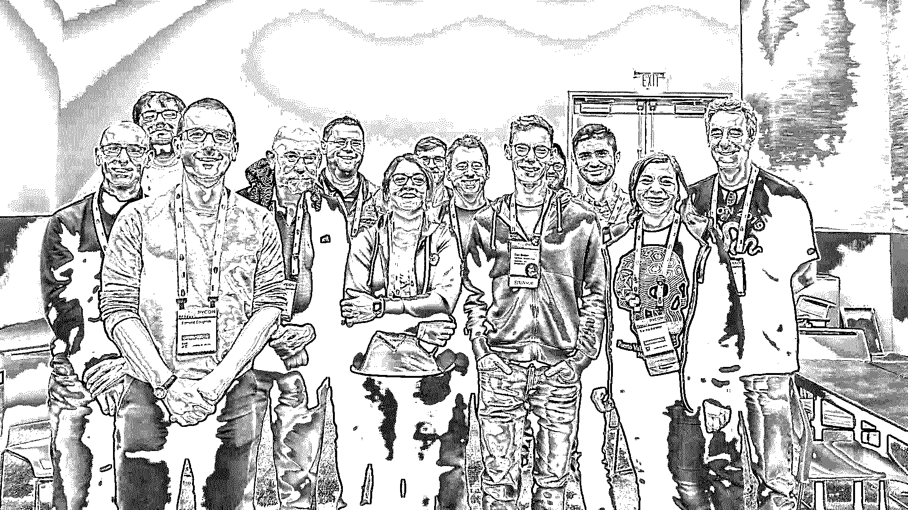

# Python 社区采访 Katrina Durance

> 原文：<https://realpython.com/interview-katrina-durance/>

随着 PyCon US 2019 的结束，我决定追上第一次参加 PyCon 的人 [Katrina Durance](https://twitter.com/katdurance) 。我很好奇她是如何找到这次经历的，她的亮点是什么。我还想了解参加像 PyCon 这样的会议对她的编程能力有何影响。

瑞奇: *让我们从我问所有客人的相同问题开始。你是怎么进入编程的？你是什么时候开始用 Python 的？*

**Katrina:** Python 是我 2013 年在研究生院学习的第一门编程课程。还学了 R 和 SQL。我毕业后从事的两份工作都是完全以 SQL 为中心的，所以 Python 和 R 就半途而废了。

因为我在芝加哥的一所艺术学院(芝加哥哥伦比亚学院)工作，所以我可以免费上课。我们有一个游戏程序，所以我们所有的编程课程都与游戏相关。因为我是一个游戏玩家，也是一个非常视觉化的学习者，所以我决定参加一个 C#课程，在那里我们一起构建小游戏。我喜欢它。

当我第一次学习 Python 时，我真的很纠结，但是在可视化环境中使用编程语言开始让我明白了很多概念。在那门课程之后，我知道我想提高自己的技能，以便进入全职编程领域。我最终想出了一个学习计划，并决定在今年年初回到我的 Python 根源。

**Ricky:** *今年你第一次参加了美国皮肯大会。我很好奇为什么今年是你的第一年。是什么改变了你，让你这次想去？*

真正让我下定决心的是，我知道将会有一个来自[的 Python safe](https://www.pythonistacafe.com/)团队，以及一个来自[的 Chicago Python 用户组](https://www.chipy.org/)的大型代表团在那里聚会。所以我知道我会看到一些友好的面孔。我不觉得我是一个人在做这件事。

**瑞奇:** *每个人的 PyCon 体验都不一样。我想知道你今年是否有突出的时刻？有没有一件事会让你想起你第一次参加 PyCon 的经历？*

Katrina: 辅导短跑对我来说很重要。我最终在一个工具([假设](https://pypi.org/project/hypothesis/))上解决了一个我不理解的问题，因为我还没有学到多少关于测试的知识。

我感到沮丧，担心一切都会超出我的能力范围。但是我们的导师非常了不起，非常鼓舞人心，他向我展示了我正在学习的一系列东西，并让我坚持到了最后。现在我有了一个关于软件的封闭问题，上面有我的名字，这很酷。

**里基:** *我们当然在周末见过几次面。但最引人注目的是皮托尼斯塔卡费露天广场。你的户外体验如何？你学到什么新东西了吗，或者有什么可行的建议吗？*

**Katrina:** 我对 PythonistaCafe 开放空间感到兴奋，因为我有机会见到一些我在论坛上接触过或刚刚见过的人，我没有失望。

我为像我这样自学成才的程序员开设了一个开放空间。当 30 多岁的人出现时，我惊呆了。我尽了最大努力去管理它，并得到了一些积极的反馈和有益的建议。

PyCon Africameetup 非常有启发性，因为我了解到我们还没有看到非洲创新热潮的原因是互联网在房间里的每个国家都非常昂贵。不管它是政府监管的还是私有的。我很乐意帮助找出解决这个问题的方法。

<figcaption class="figure-caption text-center">PythonistaCafe Members Coming Together at a PyCon Open Space</figcaption>

瑞奇: *在 PyCon 上要做的事情太多了，根本没有足够的时间全部做完。那么，有没有什么事情是你希望自己做过的，或者错过了什么演讲，希望自己没有错过？下次你有什么不同的做法吗？*

老实说，我第一次觉得 PyCon 是我所希望的样子。明年我想留下来参加短跑比赛，人们一直告诉我这很棒。

对于那些正在阅读这篇文章但还没有参加第一次 PyCon 的人来说，这可能是最重要的问题……参加 PyCon 对你今后如何编写 Python 代码有什么影响？

卡特里娜:我不得不谈谈我的代码。当你自学的时候，你不会有很多机会来讨论你的代码。通过我在 PyCon 上的谈话，我被鼓励更加慎重地利用我的 Slack 和本地 Python 社区来练习那些交流技巧。

换句话说，我需要鼓起勇气，不要担心我没有很好地编码或解释它。我只需要继续编码和解释。

最后但同样重要的是，你在业余时间还会做些什么？除了 Python 和编码，你还有什么其他的爱好和兴趣？你想插什么？

卡特里娜:我喜欢所有科幻和怪异的东西:电影、电视剧、书籍等。我是一个乐高爱好者，出于对 H. P. Lovecraft 故事的热爱，我对建造失落的神庙情有独钟。我真的很喜欢 VR，喜欢在我的 Oculus Go 上玩游戏。我也用毛毡、拾到的物品甚至乐高积木制作珠宝。

如果你想和 Katrina 聊聊天，说声*嗨*，在[推特上给她留言](https://twitter.com/katdurance)。

如果你想采访 Python 社区的某个人，请在下面留下评论，让我知道。