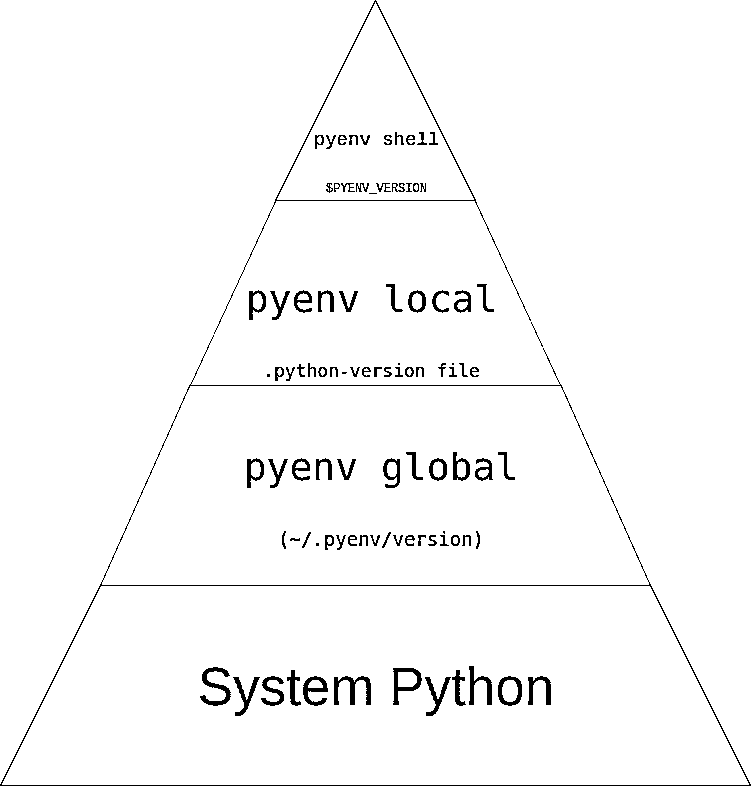

# 使用 pyenv 管理多个 Python 版本

> 原文：<https://realpython.com/intro-to-pyenv/>

*立即观看**本教程有真实 Python 团队创建的相关视频课程。和书面教程一起看，加深理解: [**用 pyenv**](/courses/start-with-pyenv/) 开始管理多个 Python 版本

你是否曾经想要为一个支持多个版本 Python 的项目做贡献，但是不确定如何轻松地[测试](https://realpython.com/python-testing/)所有版本？你有没有对 Python 最新最棒的版本感到好奇？也许你想尝试这些新特性，但是你不想担心搞乱你的[开发环境](https://realpython.com/effective-python-environment/)。幸运的是，如果您使用`pyenv`，管理多个版本的 Python 不会令人困惑。

本文将为您提供一个很好的概述，介绍如何最大化您在项目上花费的时间，以及如何最小化在尝试使用正确版本的 Python 上花费的时间。

**在这篇文章中，你将学习如何:**

1.  安装多个版本的 Python
2.  安装 Python 的最新开发版本
3.  在已安装的版本之间切换
4.  通过`pyenv`使用虚拟环境
5.  自动激活不同的 Python 版本和虚拟环境

**免费下载:** [从 Python 技巧中获取一个示例章节:这本书](https://realpython.com/bonus/python-tricks-sample-pdf/)用简单的例子向您展示了 Python 的最佳实践，您可以立即应用它来编写更漂亮的+Python 代码。

## 为什么要用`pyenv`？

`pyenv`是一个管理多个 Python 版本的优秀工具。即使您已经在系统上安装了 Python，安装`pyenv`也是值得的，这样您就可以轻松地尝试新的语言特性，或者为不同版本 Python 上的项目做出贡献。使用`pyenv`也是[安装 Python](https://realpython.com/python-pre-release/) 预发布版本的一个好方法，这样你就可以测试它们是否有 bug。

[*Remove ads*](/account/join/)

### 为什么不用系统 Python？

“系统 Python”是安装在操作系统上的 Python。如果你在 Mac 或 Linux 上，那么默认情况下，当你在终端上输入`python`时，你会得到一个漂亮的 Python REPL。

那么，为什么不用呢？看待它的一种方式是，这个 Python 实际上*属于操作系统的*。毕竟它是随操作系统一起安装的。这甚至会在您运行`which`时反映出来:

```py
$ which python
/usr/bin/python
```

这里，`python`对所有用户可用，如其位置`/usr/bin/python`所示。很可能，这也不是您想要的 Python 版本:

```py
$ python -V
Pyhton 2.7.12
```

要将包安装到您的系统 Python 中，您必须运行`sudo pip install`。这是因为您正在全局安装 Python 包，如果另一个用户想安装稍微旧一点版本的包，这将是一个真正的问题。

同一个包的多个版本的问题往往会在你最意想不到的时候悄悄靠近你并咬你一口。这个问题出现的一个常见方式是，一个流行且稳定的软件包突然在您的系统上行为失常。经过数小时的故障排除和谷歌搜索，你可能会发现你安装了错误版本的[依赖关系](https://realpython.com/courses/managing-python-dependencies/)，这毁了你的一天。

即使您的 Python 版本安装在`/usr/local/bin/python3`中，您仍然不安全。您将遇到上述相同的权限和灵活性问题。

此外，对于在您的操作系统上安装什么版本的 Python，您实际上没有多少控制权。如果你想使用 Python 中的最新特性，比如你正在使用 Ubuntu，你可能就没那么幸运了。默认版本可能太旧了，这意味着你只能等待新操作系统的出现。

最后，有些操作系统其实是用打包的 Python 进行操作的。以`yum`为例，它大量使用 Python 来完成工作。如果你安装了一个新版本的 Python，并且不小心把它安装到你的用户空间，你可能会严重损害你使用操作系统的能力。

### 包经理呢？

下一个合乎逻辑的地方是包管理器。像`apt`、`yum`、`brew`或`port`这样的程序是典型的下一个选项。毕竟，这是你安装大多数[软件包](https://realpython.com/python-modules-packages/)到你的系统的方式。不幸的是，在使用包管理器时，您会发现一些同样的问题。

默认情况下，包管理器倾向于将他们的包安装到全局系统空间，而不是用户空间。同样，这些系统级的包污染了您的开发环境，使您很难与其他人共享一个工作空间。

同样，您仍然无法控制可以安装哪个版本的 Python。的确，有些存储库给了你更多的选择，但是默认情况下，你看到的是你的特定供应商在某一天发布的 Python 版本。

即使您确实从包管理器安装了 Python，也要考虑如果您正在编写一个包并想要在 Python 3.4 - 3.7 上支持和测试会发生什么。

当你输入`python3`时，你的系统会发生什么？你如何在不同版本之间快速切换？您当然可以这样做，但是这很繁琐，而且容易出错。如果你想要 [PyPy](https://realpython.com/pypy-faster-python/) 、Jython 或者 Miniconda，那么你可能只是不太喜欢你的软件包管理器。

考虑到这些限制，让我们回顾一下让您轻松灵活地安装和管理 Python 版本的标准:

1.  在您的用户空间中安装 Python
2.  安装多个版本的 Python
3.  指定您想要的确切 Python 版本
4.  在已安装的版本之间切换

让您可以做所有这些事情，甚至更多。

[*Remove ads*](/account/join/)

## 安装`pyenv`

在安装`pyenv`本身之前，您将需要一些特定于操作系统的依赖项。这些依赖项主要是用 C 编写的开发工具，并且是必需的，因为`pyenv`通过从源代码构建来安装 Python。对于构建依赖的更详细的分解和解释，你可以查看[官方文档。](https://devguide.python.org/setup/#build-dependencies)在本教程中，您将看到安装这些依赖项的最常见方式。

**注:** `pyenv`原本不支持 Windows。然而，最近开始活跃的 [pyenv-win](https://github.com/pyenv-win/pyenv-win) 项目似乎获得了一些基本支持。如果您使用 Windows，请随意查看。

### 构建依赖关系

`pyenv`从源代码构建 Python，这意味着您将需要构建依赖项来实际使用`pyenv`。构建依赖关系因平台而异。如果你在 **Ubuntu/Debian** 上并且想要安装构建依赖，你可以使用下面的:

```py
$ sudo apt-get install -y make build-essential libssl-dev zlib1g-dev \
libbz2-dev libreadline-dev libsqlite3-dev wget curl llvm libncurses5-dev \
libncursesw5-dev xz-utils tk-dev libffi-dev liblzma-dev python-openssl
```

这使用 [Apt](https://wiki.debian.org/Apt) 来安装所有的构建依赖项。让它运行起来，你就可以准备好使用 Debian 系统了。

如果您使用 **Fedora/CentOS/RHEL** ，您可以使用`yum`来安装您的构建依赖项:

```py
$ sudo yum install gcc zlib-devel bzip2 bzip2-devel readline-devel sqlite \
sqlite-devel openssl-devel xz xz-devel libffi-devel
```

该命令将使用`yum`安装 Python 的所有构建依赖项。

**macOS** 用户可以使用以下命令:

```py
$ brew install openssl readline sqlite3 xz zlib
```

这个命令依赖于[自制软件](https://brew.sh/)，并为 macOS 用户安装一些依赖项。

**提示:**运行 Mojave 或更高版本(10.14+)时，您还需要安装[附加 SDK 头文件](https://developer.apple.com/documentation/xcode_release_notes/xcode_10_release_notes#3035624):

```py
$ sudo installer -pkg /Library/Developer/CommandLineTools/Packages/macOS_SDK_headers_for_macOS_10.14.pkg -target /
```

感谢罗德里戈·维耶拉的更新。

如果你使用的是 openSUSE ,那么你可以运行下面的代码:

```py
$ zypper in zlib-devel bzip2 libbz2-devel libffi-devel \
libopenssl-devel readline-devel sqlite3 sqlite3-devel xz xz-devel
```

同样，这个命令会为您的系统安装所有 Python 构建依赖项。

最后，对于 **Alpine** 用户，可以这样使用:

```py
$ apk add libffi-dev ncurses-dev openssl-dev readline-dev \
tk-dev xz-dev zlib-dev
```

该命令使用 [`apk`](https://wiki.alpinelinux.org/wiki/Alpine_Linux_package_management) 作为包管理器，并将在 Alpine 上安装 Python 的所有构建依赖项。

[*Remove ads*](/account/join/)

### 使用 pyenv 安装程序

安装完构建依赖项后，就可以安装`pyenv`本身了。我推荐使用 [pyenv-installer 项目](https://github.com/pyenv/pyenv-installer):

```py
$ curl https://pyenv.run | bash
```

这将安装`pyenv`以及一些有用的插件:

1.  **`pyenv`** :实际的`pyenv`应用
2.  **`pyenv-virtualenv`** :用于`pyenv`和虚拟环境的插件
3.  **`pyenv-update`** :更新`pyenv`的插件
4.  **`pyenv-doctor`** :验证`pyenv`和构建依赖项是否安装的插件
5.  **`pyenv-which-ext`** :自动查找系统命令的插件

**注意:**上述命令与下载 [pyenv-installer 脚本](https://github.com/pyenv/pyenv-installer/blob/master/bin/pyenv-installer)并在本地运行相同。所以如果你想知道你到底在运行什么，你可以自己查看这个文件。或者，如果你真的不想运行脚本，你可以查看[手册的安装说明。](https://github.com/pyenv/pyenv#basic-github-checkout)

运行结束时，您应该会看到类似这样的内容:

```py
WARNING: seems you still have not added 'pyenv' to the load path.

Load pyenv automatically by adding
the following to ~/.bashrc:

export PATH="$HOME/.pyenv/bin:$PATH"
eval "$(pyenv init -)"
eval "$(pyenv virtualenv-init -)"
```

输出将基于您的 shell。但是你应该按照说明将`pyenv`添加到你的路径中，并初始化`pyenv` / `pyenv-virtualenv`自动完成。一旦完成了这些，您需要重新加载您的 shell:

```py
$ exec "$SHELL" # Or just restart your terminal
```

就是这样。你现在已经安装了`pyenv`和四个有用的插件。

## 使用`pyenv`安装 Python

既然已经安装了`pyenv`，下一步就是安装 Python。您有许多 Python 版本可供选择。如果您想查看所有可用的 [CPython](https://realpython.com/cpython-source-code-guide/) 3.6 到 3.8，您可以这样做:

```py
$ pyenv install --list | grep " 3\.[678]"
 3.6.0
 3.6-dev
 3.6.1
 3.6.2
 3.6.3
 3.6.4
 3.6.5
 3.6.6
 3.6.7
 3.6.8
 3.7.0
 3.7-dev
 3.7.1
 3.7.2
 3.8-dev
```

上面显示了`pyenv`知道的所有匹配正则表达式的 Python 版本。在本例中，这是所有可用的 CPython 版本 3.6 到 3.8。同样，如果您想查看所有的 Jython 版本，您可以这样做:

```py
$ pyenv install --list | grep "jython"
 jython-dev
 jython-2.5.0
 jython-2.5-dev
 jython-2.5.1
 jython-2.5.2
 jython-2.5.3
 jython-2.5.4-rc1
 jython-2.7.0
 jython-2.7.1
```

同样，您可以看到`pyenv`提供的所有 Jython 版本。如果您想要查看所有版本，您可以执行以下操作:

```py
$ pyenv install --list
...
# There are a lot
```

一旦找到您想要的版本，您可以用一个命令安装它:

```py
$ pyenv install -v 3.7.2
/tmp/python-build.20190208022403.30568 ~
Downloading Python-3.7.2.tar.xz...
-> https://www.python.org/ftp/python/3.7.2/Python-3.7.2.tar.xz
Installing Python-3.7.2...
/tmp/python-build.20190208022403.30568/Python-3.7.2 /tmp/python-build.20190208022403.30568 ~
[...]
Installing collected packages: setuptools, pip
Successfully installed pip-18.1 setuptools-40.6.2
Installed Python-3.7.2 to /home/realpython/.pyenv/versions/3.7.2
```

**有问题？**[`pyenv`文档](https://github.com/pyenv/pyenv)有很棒的安装说明以及有用的 [FAQ](https://github.com/pyenv/pyenv/wiki) 和[常见构建问题](https://github.com/pyenv/pyenv/wiki/Common-build-problems)。

这将需要一段时间，因为`pyenv`正在从源代码构建 Python，但是一旦完成，您将可以在本地机器上使用 Python 3.7.2。如果您不想看到所有的输出，只需移除`-v`标志。甚至可以安装 CPython 的开发版本:

```py
$ pyenv install 3.8-dev
```

**专业提示:**如果你使用`pyenv`有一段时间了，没有看到你要找的版本，你可能需要运行`pyenv update`来更新工具，并确保你可以获得最新版本。

对于本教程的其余部分，示例假设您已经安装了`3.6.8`和`2.7.15`，但是您可以自由地用这些值替换您实际安装的 Python 版本。还要注意例子中的系统 Python 版本是`2.7.12`。

[*Remove ads*](/account/join/)

### 安装位置

如前所述，`pyenv`的工作原理是从源代码构建 Python。您安装的每个版本都位于您的`pyenv`根目录中:

```py
$ ls ~/.pyenv/versions/
2.7.15  3.6.8  3.8-dev
```

您的所有版本都将位于此处。这很方便，因为删除这些版本很简单:

```py
$ rm -rf ~/.pyenv/versions/2.7.15
```

当然`pyenv`也提供了卸载特定 Python 版本的命令:

```py
$ pyenv uninstall 2.7.15
```

### 使用您的新 Python

现在您已经安装了几个不同的 Python 版本，让我们看看如何使用它们的一些基础知识。首先，检查您有哪些版本的 Python 可用:

```py
$ pyenv versions
* system (set by /home/realpython/.pyenv/version)
 2.7.15
 3.6.8
 3.8-dev
```

`*`表示`system` Python 版本当前是活动的。您还会注意到这是由您的根`pyenv`目录中的一个文件设置的。这意味着，默认情况下，您仍在使用您的系统 Python:

```py
$ python -V
Python 2.7.12
```

如果您尝试使用`which`来确认这一点，您会看到:

```py
$ which python
/home/realpython/.pyenv/shims/python
```

这可能令人惊讶，但这就是`pyenv`的工作方式。`pyenv`插入到你的 [`PATH`](https://realpython.com/add-python-to-path/) 中，从你的操作系统的角度来看*是*被调用的可执行文件。如果您想查看实际路径，可以运行以下命令:

```py
$ pyenv which python
/usr/bin/python
```

例如，如果您想使用版本 2.7.15，那么您可以使用`global`命令:

```py
$ pyenv global 2.7.15
$ python -V
Python 2.7.15

$ pyenv versions
 system
* 2.7.15 (set by /home/realpython/.pyenv/version)
 3.6.8
 3.8-dev
```

**专业提示:**运行内置测试套件是确保您刚刚安装的 Python 版本工作正常的一个好方法:

```py
$ pyenv global 3.8-dev
$ python -m test
```

这将启动大量的内部 Python 测试来验证您的安装。你可以放松下来，看着考试通过。

如果您想回到 Python 的默认系统版本，您可以运行以下命令:

```py
$ pyenv global system
$ python -V
Python 2.7.12
```

现在，您可以轻松地在不同版本的 Python 之间切换。这只是开始。如果您想要在多个版本之间进行切换，那么一致地输入这些命令是很乏味的。本节讲述了基础知识，但是在[使用多种环境中描述了一个更好的工作流程。](#working-with-multiple-environments)

[*Remove ads*](/account/join/)

## 探索`pyenv`命令

`pyenv`提供了许多命令。您可以看到所有可用命令的完整列表，如下所示:

```py
$ pyenv commands
activate
commands
completions
deactivate
...
virtualenvs
whence
which
```

这将输出所有命令名。每个命令都有一个`--help`标志，可以提供更详细的信息。例如，如果您想查看关于`shims`命令的更多信息，您可以运行以下命令:

```py
$ pyenv shims --help
Usage: pyenv shims [--short]

List existing pyenv shims
```

帮助消息描述了该命令的用途以及可以与该命令结合使用的任何选项。在接下来的几节中，您将找到最常用命令的快速、高层次概述。

### `install`

您已经看到了上面的`install`命令。此命令可用于安装特定版本的 Python。例如，如果你想安装`3.6.8`，你可以使用这个:

```py
$ pyenv install 3.6.8
```

输出向我们展示了`pyenv`下载和安装 Python。您可能希望使用的一些常见标志如下:

| 旗 | 描述 |
| --- | --- |
| `-l/--list` | 列出所有可供安装的 Python 版本 |
| `-g/--debug` | 构建 Python 的调试版本 |
| `-v/--verbose` | 详细模式:将编译状态打印到标准输出 |

### `versions`

`versions`命令显示所有当前安装的 Python 版本:

```py
$ pyenv versions
* system (set by /home/realpython/.pyenv/version)
 2.7.15
 3.6.8
 3.8-dev
```

这个输出不仅显示了`2.7.15`、`3.6.8`、`3.8-dev`和您的`system` Python 已经安装，还显示了`system` Python 是活动的。如果您只关心当前的活动版本，可以使用以下命令:

```py
$ pyenv version
system (set by /home/realpython/.pyenv/version)
```

该命令类似于`versions`，但只显示当前活动的 Python 版本。

### `which`

`which`命令有助于确定系统可执行文件的完整路径。因为`pyenv`通过使用垫片来工作，这个命令允许你看到可执行文件`pyenv`运行的完整路径。例如，如果您想查看 [`pip`](https://realpython.com/courses/what-is-pip/) 安装在哪里，您可以运行:

```py
$ pyenv which pip
/home/realpython/.pyenv/versions/3.6.8/bin/pip
```

输出显示了`pip`的完整系统路径。当您已经安装了命令行应用程序时，这可能会很有帮助。

[*Remove ads*](/account/join/)

### `global`

`global`命令设置全局 Python 版本。这可以用其他命令覆盖，但对于确保默认使用特定的 Python 版本非常有用。如果您想默认使用`3.6.8`，那么您可以运行:

```py
$ pyenv global 3.6.8
```

该命令将`~/.pyenv/version`设置为`3.6.8`。有关更多信息，请参见关于指定您的 Python 版本的[一节。](#specifying-your-python-version)

### `local`

`local`命令通常用于设置特定于应用程序的 Python 版本。您可以使用它将版本设置为`2.7.15`:

```py
$ pyenv local 2.7.15
```

该命令在当前目录下创建一个`.python-version`文件。如果您的环境中有活动的`pyenv`，这个文件将自动为您激活这个版本。

### `shell`

`shell`命令用于设置特定于 shell 的 Python 版本。例如，如果您想测试 Python 的`3.8-dev`版本，您可以这样做:

```py
$ pyenv shell 3.8-dev
```

该命令激活通过设置`PYENV_VERSION`环境变量指定的版本。此命令会覆盖您可能拥有的任何应用程序或全局设置。如果您想停用该版本，您可以使用`--unset`标志。

## 指定您的 Python 版本

`pyenv`最令人困惑的部分之一是`python`命令是如何被解析的，以及哪些命令可以用来修改它。正如命令中提到的，有 3 种方法可以修改你正在使用的`python`的版本。那么，所有这些命令是如何相互作用的呢？解决顺序看起来有点像这样:

[](https://files.realpython.com/media/pyenv-pyramid.d2f35a19ded9.png)

这个金字塔应该从上到下阅读。`pyenv`可以找到的第一个选项是它将使用的选项。让我们看一个简单的例子:

```py
$ pyenv versions
* system (set by /home/realpython/.pyenv/version)
 2.7.15
 3.6.8
 3.8-dev
```

这里，您的`system` Python 被使用，如`*`所示。要练习下一个最全局的设置，您可以使用`global`:

```py
$ pyenv global 3.6.8
$ pyenv versions
 system
 2.7.15
* 3.6.8 (set by /home/realpython/.pyenv/version)
 3.8-dev
```

你可以看到现在`pyenv`想用`3.6.8`作为我们的 Python 版本。它甚至指出找到的文件的位置。该文件确实存在，您可以列出其内容:

```py
$ cat ~/.pyenv/version
3.6.8
```

现在，让我们用`local`创建一个`.python-version`文件:

```py
$ pyenv local 2.7.15
$ pyenv versions
 system
* 2.7.15 (set by /home/realpython/.python-version)
 3.6.8
 3.8-dev
$ ls -a
.  ..  .python-version
$ cat .python-version
2.7.15
```

这里，`pyenv`再次表明它将如何解析我们的`python`命令。这次它来自`~/.python-version`。注意对`.python-version`的搜索是递归的:

```py
$ mkdir subdirectory
$ cd subdirectory
$ ls -la # Notice no .python-version file
. ..
$ pyenv versions
 system
* 2.7.15 (set by /home/realpython/.python-version)
 3.6.8
 3.8-dev
```

即使`subdirectory`中没有`.python-version`，版本仍然被设置为`2.7.15`，因为`.python-version`存在于父目录中。

最后，可以用`shell`设置 Python 版本:

```py
$ pyenv shell 3.8-dev
$ pyenv versions
 system
 2.7.15
 3.6.8
* 3.8-dev (set by PYENV_VERSION environment variable)
```

所有这些只是设置了`$PYENV_VERSION`环境变量:

```py
$ echo $PYENV_VERSION
3.8-dev
```

如果你对这些选项感到不知所措，那么关于使用多种环境的章节回顾了一个自以为是的管理这些文件的过程，主要是使用`local`。

[*Remove ads*](/account/join/)

## 虚拟环境和`pyenv`

虚拟环境是管理 Python 安装和应用程序的重要部分。如果你以前没有听说过虚拟环境，你可以看看 [Python 虚拟环境:初级读本](https://realpython.com/python-virtual-environments-a-primer/)。

虚拟环境和`pyenv`是天作之合。`pyenv`有一个名为 [`pyenv-virtualenv`](https://github.com/pyenv/pyenv-virtualenv) 的奇妙插件，使得使用多个 Python 版本*和*多个虚拟环境变得轻而易举。如果你想知道`pyenv`、`pyenv-virtualenv`和像`virtualenv`或`venv`这样的工具之间的区别，那么不要担心。你并不孤单。

你需要知道的是:

*   **pyenv** 管理 Python 本身的多个版本。
*   **virtualenv/venv** 管理特定 Python 版本的虚拟环境。
*   pyenv-virtualenv 管理不同版本 Python 的虚拟环境。

如果你是一个死忠的`virtualenv`或`venv`用户，不要担心:`pyenv`与任何一个都玩得很好。事实上，如果你愿意的话，你可以保留原来的工作流，尽管我认为当你在需要不同 Python 版本的多个环境之间切换时,`pyenv-virtualenv`会带来更好的体验。

好消息是，既然您使用了`pyenv-installer`脚本来安装`pyenv`，那么您已经安装了`pyenv-virtualenv`并准备好了。

### 创建虚拟环境

创建虚拟环境是一个简单的命令:

```py
$ pyenv virtualenv <python_version> <environment_name>
```

从技术上讲，`<python_version>`是可选的，但是您应该考虑总是指定它，这样您就可以确定您使用的是哪个 Python 版本。

`<environment_name>`只是一个名称，用于帮助您保持环境的独立性。一个好的做法是将您的环境命名为与您的项目相同的名称。例如，如果您正在开发`myproject`,并且想要针对 Python 3.6.8 进行开发，那么您应该运行以下代码:

```py
$ pyenv virtualenv 3.6.8 myproject
```

输出包括显示安装了几个额外的 [Python 包](https://realpython.com/python-modules-packages/)，即 [`wheel`](https://realpython.com/python-wheels/) 、 [`pip`](https://realpython.com/what-is-pip/) 和`setuptools`的消息。这完全是为了方便，只是为您的每个虚拟环境设置了一个功能更全面的环境。

### 激活您的版本

既然您已经创建了虚拟环境，下一步就是使用它。通常，您应该通过运行以下命令来激活您的环境:

```py
$ pyenv local myproject
```

您以前见过`pyenv local`命令，但是这一次，您没有指定 Python 版本，而是指定了一个环境。这将在您当前的工作目录中创建一个`.python-version`文件，因为您在您的环境中运行了`eval "$(pyenv virtualenv-init -)"`，所以该环境将自动被激活。

您可以通过运行以下命令来验证这一点:

```py
$ pyenv which python
/home/realpython/.pyenv/versions/myproject/bin/python
```

您可以看到已经创建了一个名为`myproject`的新版本，并且`python`可执行文件指向该版本。如果您查看该环境提供的任何可执行文件，您会看到同样的情况。就拿`pip`来说吧:

```py
$ pyenv which pip
/home/realpython/.pyenv/versions/myproject/bin/pip
```

如果您没有将`eval "$(pyenv virtualenv-init -)"`配置为在您的 shell 中运行，您可以使用以下命令手动激活/停用您的 Python 版本:

```py
$ pyenv activate <environment_name>
$ pyenv deactivate
```

以上是`pyenv-virtualenv`在进入或退出一个包含`.python-version`文件的目录时所做的事情。

[*Remove ads*](/account/join/)

## 使用多种环境

将你所学的一切放在一起，你可以在多种环境下有效地工作。假设您安装了以下版本:

```py
$ pyenv versions
* system (set by /home/realpython/.pyenv/version)
 2.7.15
 3.6.8
 3.8-dev
```

现在您想要处理两个不同的、名称恰当的项目:

1.  **project1** 支持 Python 2.7 和 3.6。
2.  **project2** 支持 Python 3.6，实验用 3.8-dev。

您可以看到，默认情况下，您使用的是系统 Python，这由`pyenv versions`输出中的`*`表示。首先，为第一个项目创建一个虚拟环境:

```py
$ cd project1/
$ pyenv which python
/usr/bin/python
$ pyenv virtualenv 3.6.8 project1
...
$ pyenv local project1
$ python -V
/home/realpython/.pyenv/versions/project1/bin/python
```

最后，请注意，当您`cd`离开目录时，您默认回到系统 Python:

```py
$ cd $HOME
$ pyenv which python
/usr/bin/python
```

您可以按照上面的步骤为 project2 创建一个虚拟环境:

```py
$ cd project2/
$ pyenv which python
/usr/bin/python
$ pyenv virtualenv 3.8-dev project2
...
$ pyenv local 3.8-dev
$ pyenv which python
/home/realpython/.pyenv/versions/3.8-dev/bin/python
```

这些是项目的一次性步骤。现在，当您在项目之间`cd`时，您的环境将自动激活:

```py
$ cd project2/
$ python -V
Python 3.8.0a0
$ cd ../project1
$ python -V
Python 3.6.8
```

不再需要记住激活环境:你可以在所有项目之间切换，并且`pyenv`会自动激活正确的 Python 版本*和*正确的虚拟环境。

## 同时激活多个版本

如上例所述，`project2`使用 3.8 中的实验特征。假设您想要确保您的代码仍然在 Python 3.6 上工作。如果你试着运行`python3.6`，你会得到这个:

```py
$ cd project2/
$ python3.6 -V
pyenv: python3.6: command not found

The `python3.6' command exists in these Python versions:
 3.6.8
 3.6.8/envs/project1
 project1
```

`pyenv`通知您，虽然 Python 3.6 在当前活动环境中不可用，但它在其他环境中可用。`pyenv`为您提供了一种使用熟悉的命令同时激活多个环境的方法:

```py
$ pyenv local project2 3.6.8
```

这向`pyenv`表明您希望使用虚拟环境`project2`作为第一选项。因此，如果一个命令，例如`python`，可以在两种环境中被解析，它将在`3.6.8`之前选择`project2`。让我们看看如果你运行这个会发生什么:

```py
$ python3.6 -V
Python 3.6.8
```

这里，`pyenv`试图找到`python3.6`命令，因为它在一个活动的环境中找到了它，所以它允许该命令执行。这对于像 [tox](https://tox.readthedocs.io/en/latest/) 这样需要在你的`PATH`上有多个版本的 Python 才能执行的工具来说非常有用。

**专业提示:**如果你正在使用 tox 和`pyenv`，你应该检查一下 [tox-pyenv](https://pypi.org/project/tox-pyenv/) 包装。

假设在上面的例子中，您发现了库的兼容性问题，并且想要做一些本地测试。测试要求您安装所有的依赖项。您应该按照以下步骤创建新环境:

```py
$ pyenv virtualenv 3.6.8 project2-tmp
$ pyenv local project2-tmp
```

一旦您对本地测试感到满意，您就可以轻松地切换回您的默认环境:

```py
$ pyenv local project2 3.6.8
```

[*Remove ads*](/account/join/)

## 结论

现在，您可以更轻松地为想要支持多种环境的项目做出贡献。您还可以更容易地测试最新和最棒的 Python 版本，而不必担心搞乱您的开发机器，所有这些都有一个很棒的工具:`pyenv`。

您已经看到了`pyenv`如何帮助您:

*   安装多个版本的 Python
*   在已安装的版本之间切换
*   通过`pyenv`使用虚拟环境
*   自动激活不同的 Python 版本和虚拟环境

如果你还有问题，请在评论区或 Twitter 上联系我们。此外， [pyenv 文档](https://github.com/pyenv/pyenv)是一个很好的资源。

## 奖励:在你的命令提示符下显示你的环境名

如果你像我一样，经常在各种虚拟环境和 Python 版本之间切换，很容易弄不清哪个版本是当前活动的。我使用 [oh-my-zsh](https://github.com/robbyrussell/oh-my-zsh) 和[不可知论者主题](https://github.com/agnoster/agnoster-zsh-theme)，默认情况下，我的提示如下所示:

[](https://files.realpython.com/media/agnoster-no-pyenv-prompt.01f0966b78d7.png)

一看就不知道哪个 Python 版本是活动的。为了找出答案，我必须运行`python -V`或`pyenv version`。为了帮助减少我花在弄清楚我的活动 Python 环境上的时间，我将我正在使用的`pyenv`虚拟环境添加到我的提示中:

[](https://files.realpython.com/media/ljones-agnoster-pyenv-prompt.0b24a4a8f077.png)

在这种情况下，我的 Python 版本是`project1-venv`，并立即显示在提示符的开头。这让我可以很快看到我正在使用的 Python 版本。如果你也想用这个，你可以用我的 [agnoster-pyenv 主题](https://gist.github.com/loganasherjones/bd9b7614f80b96cf700fd60e9e256f41)。

*立即观看**本教程有真实 Python 团队创建的相关视频课程。和书面教程一起看，加深理解: [**用 pyenv**](/courses/start-with-pyenv/) 开始管理多个 Python 版本***********