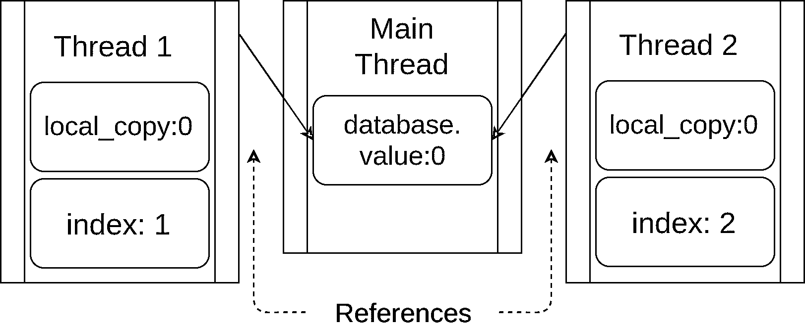
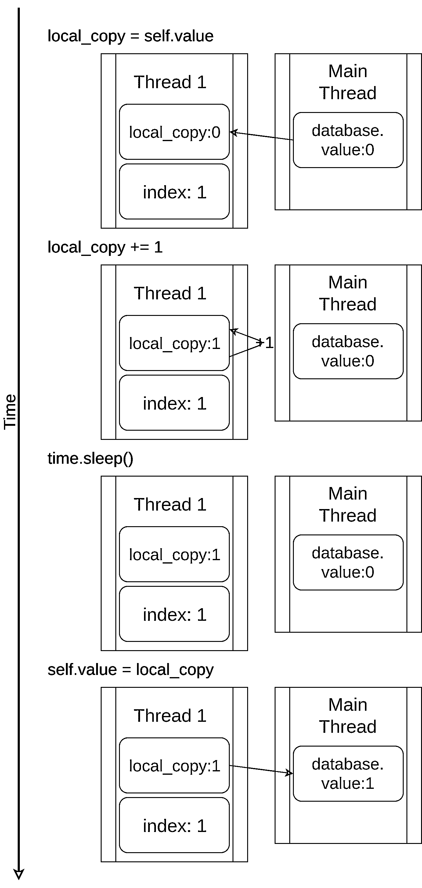
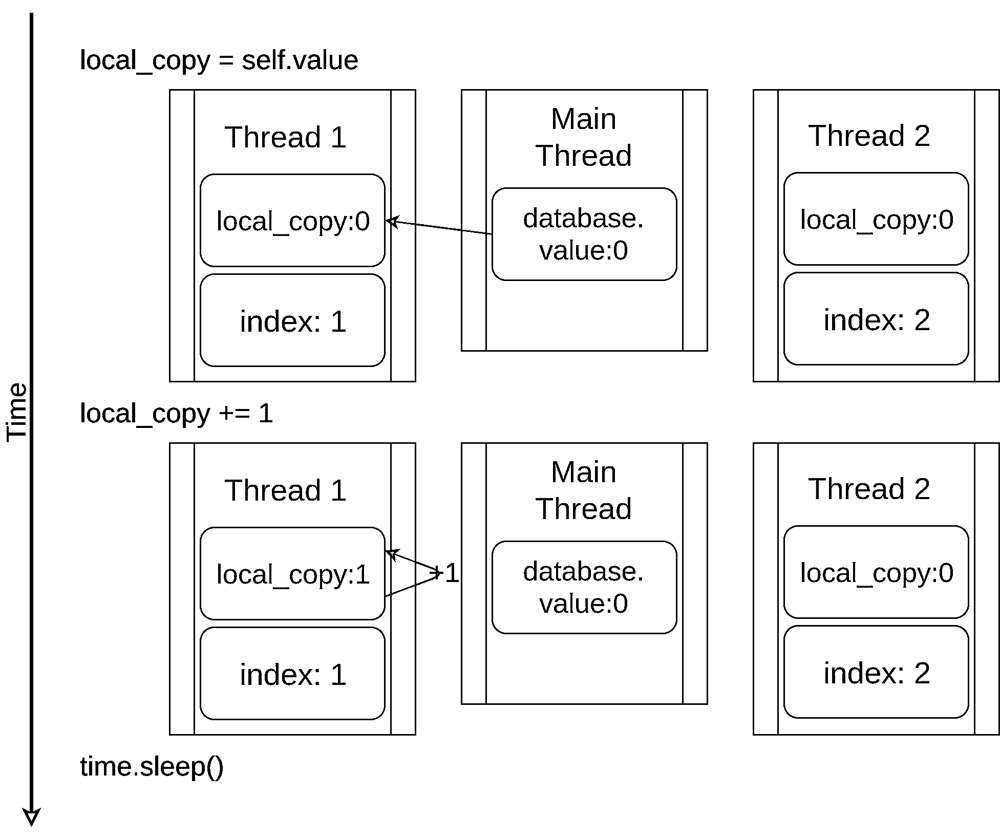
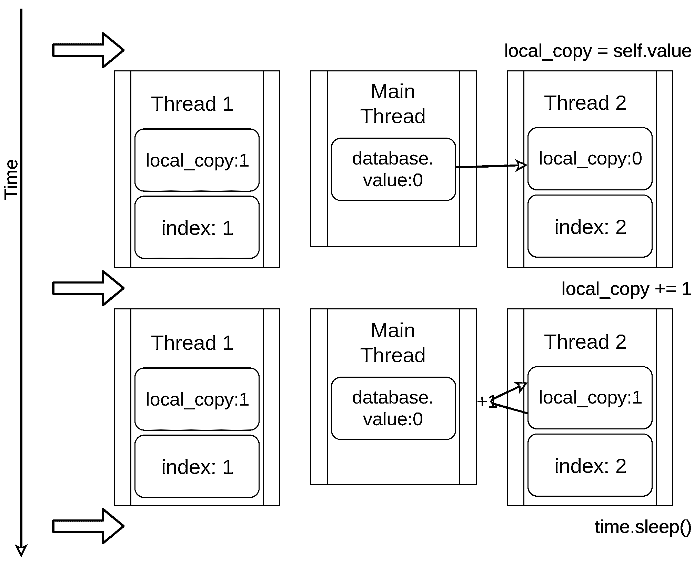
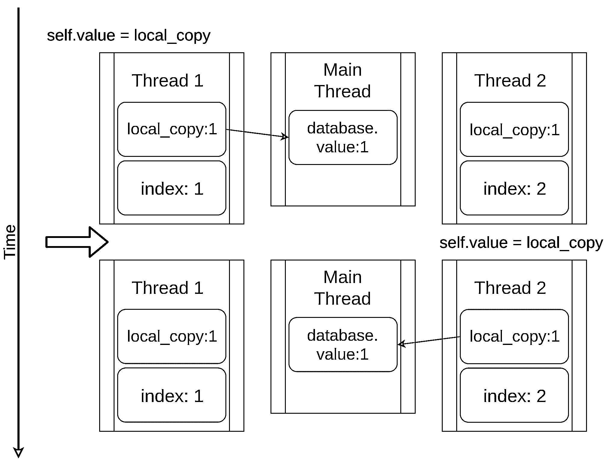

# Python 中的线程介绍

> 原文：<https://realpython.com/intro-to-python-threading/>

*立即观看**本教程有真实 Python 团队创建的相关视频课程。配合文字教程一起看，加深理解:[**Python 中的线程**](/courses/threading-python/)

Python 线程化允许您同时运行程序的不同部分，并且可以简化您的设计。如果你有一些 Python 的经验，并且想用线程加速你的程序，那么这个教程就是为你准备的！

在这篇文章中，你将了解到:

*   什么是线程
*   如何创建线程并等待它们完成
*   如何使用`ThreadPoolExecutor`
*   如何避免竞态条件
*   如何使用 Python `threading`提供的常用工具

本文假设您已经很好地掌握了 Python 基础知识，并且正在使用至少 3.6 版本来运行这些示例。如果你需要复习，你可以从 [Python 学习路径](https://realpython.com/learning-paths/)开始，快速上手。

如果你不确定是否要使用 Python `threading`、`asyncio`或`multiprocessing`，那么你可以看看[用并发](https://realpython.com/python-concurrency/)加速你的 Python 程序。

本教程中使用的所有源代码都可以在[*Real Python*GitHub repo](https://github.com/realpython/materials/tree/master/intro-to-threading)中找到。

**免费奖励:** [掌握 Python 的 5 个想法](https://realpython.com/bonus/python-mastery-course/)，这是一个面向 Python 开发者的免费课程，向您展示将 Python 技能提升到下一个水平所需的路线图和心态。

***参加测验:****通过我们的交互式“Python 线程”测验来测试您的知识。完成后，您将收到一个分数，以便您可以跟踪一段时间内的学习进度:*

*[参加测验](/quizzes/python-threading/)

## 什么是线程？

线程是一个独立的执行流。这意味着你的程序将同时发生两件事。但是对于大多数 Python 3 实现来说，不同的线程实际上并不同时执行:它们只是看起来像。

很容易将线程化想象成在程序上运行两个(或更多)不同的处理器，每个处理器同时执行独立的任务。那几乎是正确的。线程可能运行在不同的处理器上，但是它们一次只能运行一个。

让多个任务同时运行需要 Python 的非标准实现，用不同的语言编写一些代码，或者使用带来一些额外开销的`multiprocessing`。

由于 Python 的 CPython 实现的工作方式，线程化可能不会加速所有任务。这是因为与 [GIL](https://realpython.com/python-gil/) 的交互本质上限制了一次只能运行一个 Python 线程。

花费大量时间等待外部事件的任务通常很适合线程化。需要大量 CPU 计算和花费很少时间等待外部事件的问题可能根本不会运行得更快。

对于用 Python 编写并在标准 CPython 实现上运行的代码来说，情况确实如此。如果你的线程是用 C 写的，它们就有能力释放 GIL 并同时运行。如果您在不同的 Python 实现上运行，请查阅文档，了解它是如何处理线程的。

如果你正在运行一个标准的 Python 实现，只用 Python 编写，并且有一个 CPU 绑定的问题，你应该检查一下`multiprocessing`模块。

构建使用线程的程序还可以提高设计的清晰度。您将在本教程中了解的大多数示例并不一定会运行得更快，因为它们使用了线程。在它们中使用线程有助于使设计更简洁，更容易推理。

所以，我们不要再说线程了，开始用吧！

[*Remove ads*](/account/join/)

## 开始线程

现在你已经知道什么是线了，让我们来学习如何制作线。Python 标准库提供了 [`threading`](https://docs.python.org/3/library/threading.html) ，其中包含了您将在本文中看到的大多数原语。在这个模块中，很好地封装了线程，提供了一个干净的接口来处理它们。

要启动一个单独的线程，您需要创建一个`Thread`实例，然后告诉`.start()`:

```py
 1import logging
 2import threading
 3import time
 4
 5def thread_function(name):
 6    logging.info("Thread %s: starting", name)
 7    time.sleep(2)
 8    logging.info("Thread %s: finishing", name)
 9
10if __name__ == "__main__":
11    format = "%(asctime)s: %(message)s"
12    logging.basicConfig(format=format, level=logging.INFO,
13                        datefmt="%H:%M:%S")
14
15    logging.info("Main    : before creating thread")
16    x = threading.Thread(target=thread_function, args=(1,))
17    logging.info("Main    : before running thread")
18    x.start()
19    logging.info("Main    : wait for the thread to finish")
20    # x.join()
21    logging.info("Main    : all done")
```

如果您查看一下[日志](https://realpython.com/python-logging/)语句，您可以看到`main`部分正在创建和启动线程:

```py
x = threading.Thread(target=thread_function, args=(1,))
x.start()
```

当您创建一个`Thread`时，您向它传递一个函数和一个包含该函数参数的列表。在这种情况下，你告诉`Thread`运行`thread_function()`并把它作为参数传递给`1`。

在本文中，您将使用连续整数作为线程的名称。还有`threading.get_ident()`，它为每个线程返回一个唯一的名称，但是这些通常既不短也不容易阅读。

`thread_function()`本身没多大作用。它只是记录一些消息，在它们之间有一个 [`time.sleep()`](https://realpython.com/python-sleep/) 。

当您按原样运行这个程序(第二十行被注释掉)时，输出将如下所示:

```py
$ ./single_thread.py
Main    : before creating thread
Main    : before running thread
Thread 1: starting
Main    : wait for the thread to finish
Main    : all done
Thread 1: finishing
```

您会注意到代码的`Thread`部分在`Main`部分之后结束。在下一节中，你将回到为什么会这样，并谈论神秘的第二十行。

### 守护线程

在计算机科学中， [`daemon`](https://en.wikipedia.org/wiki/Daemon_(computing)) 是在后台运行的进程。

Python `threading`对`daemon`有更具体的含义。当程序退出时，一个`daemon`线程将立即关闭。考虑这些定义的一种方式是将`daemon`线程视为在后台运行的线程，而不用担心关闭它。

如果一个程序正在运行不是`daemons`的`Threads`，那么该程序将在终止前等待那些线程完成。`Threads`那些*是*守护进程，然而，当程序退出时，无论它们在哪里都会被杀死。

让我们更仔细地看看上面程序的输出。最后两行是有趣的部分。当你运行程序时，你会注意到在 [`__main__`](https://realpython.com/python-main-function/) 打印完它的`all done`消息后，线程结束前有一个暂停(大约 2 秒)。

这个暂停是 Python 等待非后台线程完成。当 Python 程序结束时，关闭过程的一部分是清理线程例程。

如果你查看 Python `threading` 的[源代码，你会看到`threading._shutdown()`遍历所有正在运行的线程，并在每个没有设置`daemon`标志的线程上调用`.join()`。](https://github.com/python/cpython/blob/df5cdc11123a35065bbf1636251447d0bfe789a5/Lib/threading.py#L1263)

所以你的程序等待退出，因为线程本身在睡眠中等待。一旦完成并打印出信息，`.join()`将返回，程序可以退出。

通常，这种行为是您想要的，但是我们还有其他选择。让我们先用一个`daemon`线程重复这个程序。您可以通过改变构造`Thread`的方式，添加`daemon=True`标志来实现:

```py
x = threading.Thread(target=thread_function, args=(1,), daemon=True)
```

当您现在运行该程序时，您应该会看到以下输出:

```py
$ ./daemon_thread.py
Main    : before creating thread
Main    : before running thread
Thread 1: starting
Main    : wait for the thread to finish
Main    : all done
```

这里的区别是输出的最后一行丢失了。`thread_function()`没有机会完成。这是一个`daemon`线程，所以当`__main__`到达它的代码末尾，程序想要结束时，守护进程被杀死。

[*Remove ads*](/account/join/)

### `join()`一根线

守护线程很方便，但是当您想等待线程停止时怎么办呢？当你想这样做而又不想退出程序的时候呢？现在让我们回到原来的程序，看看注释掉的第二十行:

```py
# x.join()
```

要让一个线程等待另一个线程完成，可以调用`.join()`。如果取消注释该行，主线程将暂停并等待线程`x`完成运行。

你用守护线程还是普通线程在代码上测试了这个吗？事实证明，这并不重要。如果你`.join()`一个线程，该语句将一直等待，直到任一种线程结束。

## 使用多个线程

到目前为止，示例代码只使用了两个线程:主线程和一个用`threading.Thread`对象启动的线程。

通常，您会希望启动多个线程，并让它们完成有趣的工作。让我们从比较难的方法开始，然后你会转向比较容易的方法。

启动多线程的更难的方法是您已经知道的:

```py
import logging
import threading
import time

def thread_function(name):
    logging.info("Thread %s: starting", name)
    time.sleep(2)
    logging.info("Thread %s: finishing", name)

if __name__ == "__main__":
    format = "%(asctime)s: %(message)s"
    logging.basicConfig(format=format, level=logging.INFO,
                        datefmt="%H:%M:%S")

    threads = list()
    for index in range(3):
        logging.info("Main    : create and start thread %d.", index)
        x = threading.Thread(target=thread_function, args=(index,))
        threads.append(x)
        x.start()

    for index, thread in enumerate(threads):
        logging.info("Main    : before joining thread %d.", index)
        thread.join()
        logging.info("Main    : thread %d done", index)
```

这段代码使用与上面相同的机制来启动一个线程，创建一个`Thread`对象，然后调用`.start()`。这个程序保存了一个`Thread`对象的列表，这样它就可以在以后使用`.join()`来等待它们。

多次运行这段代码可能会产生一些有趣的结果。这是我的机器输出的一个例子:

```py
$ ./multiple_threads.py
Main    : create and start thread 0.
Thread 0: starting
Main    : create and start thread 1.
Thread 1: starting
Main    : create and start thread 2.
Thread 2: starting
Main    : before joining thread 0.
Thread 2: finishing
Thread 1: finishing
Thread 0: finishing
Main    : thread 0 done
Main    : before joining thread 1.
Main    : thread 1 done
Main    : before joining thread 2.
Main    : thread 2 done
```

如果您仔细查看输出，您会看到所有三个线程都按照您预期的顺序开始，但是在这种情况下，它们以相反的顺序结束！多次运行将产生不同的排序。寻找`Thread x: finishing`消息来告诉你每个线程什么时候完成。

线程运行的顺序由操作系统决定，很难预测。它可能(并且很可能)会随着运行的不同而不同，所以当您设计使用线程的算法时，您需要意识到这一点。

幸运的是，Python 为您提供了几个原语，稍后您将看到这些原语有助于协调线程并让它们一起运行。在此之前，让我们看看如何使管理一组线程变得更容易一些。

## 使用`ThreadPoolExecutor`

有一种比上面看到的更简单的方法来启动一组线程。它叫做`ThreadPoolExecutor`，是 [`concurrent.futures`](https://docs.python.org/3/library/concurrent.futures.html) (从 Python 3.2 开始)中标准库的一部分。

创建它最简单的方法是作为上下文管理器，使用 [`with`语句](https://realpython.com/python-with-statement/)来管理池的创建和销毁。

下面是上一个例子中的`__main__`被改写成使用一个`ThreadPoolExecutor`:

```py
import concurrent.futures

# [rest of code]

if __name__ == "__main__":
    format = "%(asctime)s: %(message)s"
    logging.basicConfig(format=format, level=logging.INFO,
                        datefmt="%H:%M:%S")

    with concurrent.futures.ThreadPoolExecutor(max_workers=3) as executor:
        executor.map(thread_function, range(3))
```

代码创建一个`ThreadPoolExecutor`作为上下文管理器，告诉它池中需要多少工作线程。然后，它使用`.map()`遍历一个可迭代的对象，在您的例子中是`range(3)`，将每个对象传递给池中的一个线程。

`with`块的结尾导致`ThreadPoolExecutor`对池中的每个线程进行`.join()`。强烈建议您尽可能使用`ThreadPoolExecutor`作为上下文管理器，这样您就不会忘记`.join()`线程。

**注意:**使用`ThreadPoolExecutor`会导致一些令人困惑的错误。

例如，如果您调用一个不带参数的函数，但是您在`.map()`中给它传递了参数，线程将抛出一个异常。

不幸的是，`ThreadPoolExecutor`将隐藏该异常，并且(在上面的例子中)程序终止，没有输出。一开始调试起来可能会很混乱。

运行更正后的示例代码将产生如下所示的输出:

```py
$ ./executor.py
Thread 0: starting
Thread 1: starting
Thread 2: starting
Thread 1: finishing
Thread 0: finishing
Thread 2: finishing
```

同样，请注意`Thread 1`是如何在`Thread 0`之前完成的。线程的调度是由操作系统完成的，并不遵循一个容易理解的计划。

[*Remove ads*](/account/join/)

## 竞赛条件

在继续学习 Python `threading`中隐藏的一些其他特性之前，让我们先来谈谈编写线程程序时会遇到的一个更困难的问题:[竞争条件](https://en.wikipedia.org/wiki/Race_condition)。

一旦您了解了什么是竞争条件，并且看到了一个正在发生的情况，您将继续学习标准库提供的一些原语来防止竞争条件的发生。

当两个或多个线程访问共享的数据或资源时，可能会发生争用情况。在本例中，您将创建一个每次都会发生的大型竞争条件，但是请注意，大多数竞争条件并没有这么明显。通常，它们很少发生，并且会产生令人困惑的结果。可以想象，这使得它们很难调试。

幸运的是，这种竞争情况每次都会发生，您将详细地了解它，解释发生了什么。

对于本例，您将编写一个更新数据库的类。好吧，你不会真的有一个数据库:你只是要伪造它，因为这不是本文的重点。

您的`FakeDatabase`将有`.__init__()`和`.update()`方法:

```py
class FakeDatabase:
    def __init__(self):
        self.value = 0

    def update(self, name):
        logging.info("Thread %s: starting update", name)
        local_copy = self.value
        local_copy += 1
        time.sleep(0.1)
        self.value = local_copy
        logging.info("Thread %s: finishing update", name)
```

`FakeDatabase`正在跟踪单个号码:`.value`。这将是共享数据，您将在上面看到竞争情况。

`.__init__()`简单地将`.value`初始化为零。到目前为止，一切顺利。

`.update()`看起来有些奇怪。它模拟从数据库中读取一个值，对其进行一些计算，然后将新值写回数据库。

在这种情况下，从数据库读取只是意味着将`.value`复制到一个局部变量。计算只是在值上加 1，然后再加一点点`.sleep()`。最后，它通过将本地值复制回`.value`来写回值。

下面是你如何使用这个`FakeDatabase`:

```py
if __name__ == "__main__":
    format = "%(asctime)s: %(message)s"
    logging.basicConfig(format=format, level=logging.INFO,
                        datefmt="%H:%M:%S")

    database = FakeDatabase()
    logging.info("Testing update. Starting value is %d.", database.value)
    with concurrent.futures.ThreadPoolExecutor(max_workers=2) as executor:
        for index in range(2):
            executor.submit(database.update, index)
    logging.info("Testing update. Ending value is %d.", database.value)
```

程序创建一个有两个线程的`ThreadPoolExecutor`，然后在每个线程上调用`.submit()`，告诉它们运行`database.update()`。

`.submit()`的签名允许将位置和命名参数传递给线程中运行的函数:

```py
.submit(function, *args, **kwargs)
```

在上面的用法中，`index`作为第一个也是唯一一个位置参数传递给`database.update()`。在本文的后面，您将看到可以用类似的方式传递多个参数。

因为每个线程运行`.update()`，并且`.update()`给`.value`加 1，所以当最后打印出来的时候，你可能期望`database.value`是`2`。但是如果是这样的话，你就不会看这个例子了。如果运行上述代码，输出如下所示:

```py
$ ./racecond.py
Testing unlocked update. Starting value is 0.
Thread 0: starting update
Thread 1: starting update
Thread 0: finishing update
Thread 1: finishing update
Testing unlocked update. Ending value is 1.
```

您可能已经预料到会发生这种情况，但是让我们来看看这里到底发生了什么，因为这将使这个问题的解决方案更容易理解。

[*Remove ads*](/account/join/)

### 一个线程

在深入讨论这个关于两个线程的问题之前，让我们后退一步，谈一谈线程如何工作的一些细节。

你不会在这里深入所有的细节，因为这在这个层次上并不重要。我们还将简化一些东西，虽然在技术上不太准确，但会让你对正在发生的事情有一个正确的概念。

当你告诉你的`ThreadPoolExecutor`运行每个线程时，你告诉它运行哪个函数，传递什么参数给它:`executor.submit(database.update, index)`。

这样做的结果是池中的每个线程都将调用`database.update(index)`。注意，`database`是对在`__main__`中创建的一个`FakeDatabase`对象的引用。在该对象上调用`.update()`会调用该对象上的一个[实例方法](https://realpython.com/instance-class-and-static-methods-demystified/)。

每个线程都将有一个对同一个`FakeDatabase`对象`database`的引用。每个线程还将有一个唯一的值`index`，使日志记录语句更容易阅读:

[](https://files.realpython.com/media/intro-threading-shared-database.267a5d8c6aa1.png)

当线程开始运行`.update()`时，它有自己版本的所有数据**本地**到函数。在`.update()`的情况下，这是`local_copy`。这绝对是好事。否则，运行同一个函数的两个线程总是会互相混淆。这意味着所有作用于函数的变量都是线程安全的。

现在，您可以开始浏览如果您用单线程和对`.update()`的单个调用运行上面的程序会发生什么。

如果只运行一个线程，下图显示了`.update()`的执行过程。该语句显示在左侧，后面是一个图表，显示线程的`local_copy`和共享的`database.value`中的值:

[](https://files.realpython.com/media/intro-threading-single-thread.6a11288bc199.png)

图表的布局使得时间随着你从上到下的移动而增加。它从`Thread 1`创建时开始，到终止时结束。

当`Thread 1`启动时，`FakeDatabase.value`为零。方法中的第一行代码`local_copy = self.value`将值零复制到局部变量。接下来，它用`local_copy += 1`语句增加`local_copy`的值。你可以看到`Thread 1`中的`.value`被设置为 1。

接下来`time.sleep()`被调用，使得当前线程暂停，允许其他线程运行。因为在这个例子中只有一个线程，所以这没有影响。

当`Thread 1`醒来并继续时，它将新值从`local_copy`复制到`FakeDatabase.value`，然后线程完成。你可以看到`database.value`被设置为 1。

到目前为止，一切顺利。你跑了一次`.update()`，`FakeDatabase.value`加 1。

### 两个线程

回到竞争条件，两个线程将并发运行，但不是同时运行。他们每个人都有自己版本的`local_copy`，并且都指向同一个`database`。正是这个共享的`database`对象将会导致问题。

程序从`Thread 1`运行`.update()`开始:

[](https://files.realpython.com/media/intro-threading-two-threads-part1.c1c0e65a8481.png)

当`Thread 1`调用`time.sleep()`时，它允许另一个线程开始运行。这就是事情变得有趣的地方。

`Thread 2`启动并执行相同的操作。它还将`database.value`复制到它的私有`local_copy`中，这个共享的`database.value`还没有更新:

[](https://files.realpython.com/media/intro-threading-two-threads-part2.df42d4fbfe21.png)

当`Thread 2`最终休眠时，共享的`database.value`仍未修改为零，两个私有版本的`local_copy`的值都为 1。

`Thread 1`现在醒来并保存它的版本`local_copy`，然后终止，给`Thread 2`最后一次运行的机会。`Thread 2`不知道`Thread 1`在它睡觉的时候运行并更新了`database.value`。它将*的`local_copy`版本*存储到`database.value`中，并将其设置为 1:

[](https://files.realpython.com/media/intro-threading-two-threads-part3.18576920f88f.png)

这两个线程交叉访问单个共享对象，覆盖彼此的结果。当一个线程在另一个线程完成访问之前释放内存或关闭文件句柄时，也会出现类似的争用情况。

[*Remove ads*](/account/join/)

### 为什么这不是一个愚蠢的例子

上面的例子是为了确保每次运行程序时都会出现竞争情况。因为操作系统可以在任何时候换出一个线程，所以在它已经读取了`x`的值之后，但是在它写回增加的值之前，有可能中断像`x = x + 1`这样的语句。

这是如何发生的细节非常有趣，但在本文的其余部分并不需要，所以可以跳过这个隐藏的部分。


上面的代码并不像您最初想象的那样普遍。它被设计成在每次运行时强制一个竞争条件，但是这使得它比大多数竞争条件更容易解决。

当考虑竞争条件时，有两件事要记住:

1.  甚至像`x += 1`这样的操作也需要处理器很多步骤。这些步骤中的每一步对处理器来说都是单独的指令。

2.  操作系统可以在任何时候交换哪个线程正在运行*。在这些小指令之后，一个线程可以被换出。这意味着可以让一个线程休眠，让另一个线程在 Python 语句的*中间*运行。*

我们来详细看看这个。下面的 REPL 显示了一个采用参数并递增参数的函数:

>>>

```py
>>> def inc(x):
...    x += 1
...
>>> import dis
>>> dis.dis(inc)
 2           0 LOAD_FAST                0 (x)
 2 LOAD_CONST               1 (1)
 4 INPLACE_ADD
 6 STORE_FAST               0 (x)
 8 LOAD_CONST               0 (None)
 10 RETURN_VALUE
```

REPL 的例子使用 Python 标准库中的 [`dis`](https://docs.python.org/3/library/dis.html) 来展示处理器实现您的功能的较小步骤。它对数据值`x`执行`LOAD_FAST`，执行`LOAD_CONST 1`，然后使用`INPLACE_ADD`将这些值相加。

我们在这里停下来是有特殊原因的。这是上面`.update()`中`time.sleep()`强制线程切换的地方。即使没有`sleep()`，操作系统也完全有可能每隔一段时间就在那个点切换线程，但是对`sleep()`的调用使得每次都发生这种情况。

如上所述，操作系统可以在任何时候交换线程。您已经沿着这个列表走到了标记为`4`的语句。如果操作系统换出这个线程并运行一个不同的线程来修改`x`，那么当这个线程恢复时，它会用一个不正确的值覆盖`x`。

从技术上讲，这个例子不会有竞争条件，因为`x`对于`inc()`是局部的。但是，它确实说明了在一个 Python 操作中线程是如何被中断的。相同的加载、修改、存储操作集也发生在全局值和共享值上。你可以用`dis`模块探索并证明自己。

像这样的竞争情况很少发生，但是请记住，一个不经常发生的事件在经过数百万次迭代后很可能会发生。这些竞争条件的罕见性使得它们比普通的错误更难调试。

现在回到你的常规教程！

既然您已经看到了实际运行中的竞争条件，那么让我们来看看如何解决它们吧！

## 基本同步使用`Lock`

有许多方法可以避免或解决竞态条件。你不会在这里看到所有的，但有几个是经常使用的。先说`Lock`。

为了解决上面的竞争情况，您需要找到一种方法，一次只允许一个线程进入代码的读-修改-写部分。最常见的方法是在 Python 中调用`Lock`。在其他一些语言中，同样的想法被称为`mutex`。互斥来自互斥，这正是`Lock`所做的。

一个`Lock`是一个类似于大厅通行证的物体。一次只有一个线程可以拥有`Lock`。任何其他需要`Lock`的线程必须等到`Lock`的所有者放弃它。

实现这一点的基本函数是`.acquire()`和`.release()`。一个线程将调用`my_lock.acquire()`来获得锁。如果锁已经被持有，调用线程将等待直到它被释放。这里有很重要的一点。如果一个线程得到了锁，但没有归还，你的程序就会被卡住。稍后你会读到更多相关内容。

幸运的是，Python 的`Lock`也将作为上下文管理器运行，因此您可以在`with`语句中使用它，并且当`with`块出于任何原因退出时，它会自动释放。

让我们看看添加了一个`Lock`的`FakeDatabase`。调用函数保持不变:

```py
class FakeDatabase:
    def __init__(self):
        self.value = 0
        self._lock = threading.Lock()

    def locked_update(self, name):
        logging.info("Thread %s: starting update", name)
        logging.debug("Thread %s about to lock", name)
        with self._lock:
            logging.debug("Thread %s has lock", name)
            local_copy = self.value
            local_copy += 1
            time.sleep(0.1)
            self.value = local_copy
            logging.debug("Thread %s about to release lock", name)
        logging.debug("Thread %s after release", name)
        logging.info("Thread %s: finishing update", name)
```

除了添加一些调试日志以便您可以更清楚地看到锁定之外，这里最大的变化是添加了一个名为`._lock`的成员，它是一个`threading.Lock()`对象。该`._lock`在解锁状态下初始化，并由`with`语句锁定和释放。

这里值得注意的是，运行这个函数的线程将保持这个`Lock`，直到它完全完成更新数据库。在这种情况下，这意味着当它复制、更新、休眠，然后将值写回数据库时，它将保存`Lock`。

如果您在日志设置为警告级别的情况下运行此版本，您将看到以下内容:

```py
$ ./fixrace.py
Testing locked update. Starting value is 0.
Thread 0: starting update
Thread 1: starting update
Thread 0: finishing update
Thread 1: finishing update
Testing locked update. Ending value is 2.
```

看那个。你的程序终于成功了！

在`__main__`中配置日志记录输出后，您可以通过添加以下语句将级别设置为`DEBUG`来打开完整日志记录:

```py
logging.getLogger().setLevel(logging.DEBUG)
```

在打开`DEBUG`日志记录的情况下运行该程序，如下所示:

```py
$ ./fixrace.py
Testing locked update. Starting value is 0.
Thread 0: starting update
Thread 0 about to lock
Thread 0 has lock
Thread 1: starting update
Thread 1 about to lock
Thread 0 about to release lock
Thread 0 after release
Thread 0: finishing update
Thread 1 has lock
Thread 1 about to release lock
Thread 1 after release
Thread 1: finishing update
Testing locked update. Ending value is 2.
```

在这个输出中，您可以看到`Thread 0`获得了锁，并且在它进入睡眠状态时仍然持有锁。`Thread 1`然后启动并尝试获取同一个锁。因为`Thread 0`还拿着它，`Thread 1`还要等。这是一个`Lock`提供的互斥。

本文剩余部分中的许多例子都有`WARNING`和`DEBUG`级别的日志记录。我们通常只显示`WARNING`级别的输出，因为`DEBUG`日志可能会很长。尝试打开日志记录的程序，看看它们会做什么。

[*Remove ads*](/account/join/)

## 死锁

在继续之前，你应该看看使用`Locks`时的一个常见问题。如您所见，如果已经获得了`Lock`，那么对`.acquire()`的第二次调用将会等到持有`Lock`的线程调用`.release()`时。运行这段代码时，您认为会发生什么:

```py
import threading

l = threading.Lock()
print("before first acquire")
l.acquire()
print("before second acquire")
l.acquire()
print("acquired lock twice")
```

当程序第二次调用`l.acquire()`时，它挂起等待`Lock`被释放。在本例中，您可以通过移除第二个调用来修复死锁，但是死锁通常是由以下两种微妙情况之一引起的:

1.  一个实现错误，其中一个`Lock`没有被正确释放
2.  一个设计问题，其中一个实用函数需要被已经有或者没有`Lock`的函数调用

第一种情况有时会发生，但是使用一个`Lock`作为上下文管理器会大大减少发生的频率。建议尽可能使用上下文管理器来编写代码，因为它们有助于避免出现异常跳过`.release()`调用的情况。

在某些语言中，设计问题可能有点棘手。幸运的是，Python 线程有第二个对象，叫做`RLock`，就是为这种情况设计的。它允许一个线程在调用`.release()`之前多次调用`.acquire()`一个`RLock`。那个线程仍然被要求调用`.release()`和它调用`.acquire()`的次数一样多，但是无论如何它都应该这样做。

`Lock`和`RLock`是线程编程中用来防止竞态条件的两个基本工具。还有一些其他的工作方式不同。在你看它们之前，让我们转移到一个稍微不同的问题领域。

## 生产者-消费者线程

[生产者-消费者问题](https://en.wikipedia.org/wiki/Producer%E2%80%93consumer_problem)是一个标准的计算机科学问题，用于研究线程或进程同步问题。您将看到它的一个变体，以了解 Python `threading`模块提供了哪些原语。

对于这个例子，你可以想象一个程序需要从网络上读取信息并把它们写到磁盘上。程序在需要时不会请求消息。它必须监听并接受传入的信息。这些信息不会以固定的速度出现，而是以突发的方式出现。节目的这一部分叫制作人。

另一方面，一旦有了消息，就需要将其写入数据库。数据库访问很慢，但足够快，可以跟上消息的平均速度。当大量信息进来时，它的速度不够快，跟不上。这部分是消费者。

在生产者和消费者之间，您将创建一个`Pipeline`,当您了解不同的同步对象时，这个部分将发生变化。

这是基本布局。让我们看一个使用`Lock`的解决方案。它不能完美地工作，但是它使用了您已经知道的工具，所以它是一个很好的起点。

### 生产者-消费者使用`Lock`

因为这是一篇关于 Python `threading`的文章，并且因为你刚刚阅读了关于`Lock`原语的文章，所以让我们尝试使用一个或两个`Lock`用两个线程来解决这个问题。

一般的设计是，有一个`producer`线程从伪网络中读取，并将消息放入一个`Pipeline`:

```py
import random 

SENTINEL = object()

def producer(pipeline):
    """Pretend we're getting a message from the network."""
    for index in range(10):
        message = random.randint(1, 101)
        logging.info("Producer got message: %s", message)
        pipeline.set_message(message, "Producer")

    # Send a sentinel message to tell consumer we're done
    pipeline.set_message(SENTINEL, "Producer")
```

为了生成假消息，`producer`得到一个 1 到 100 之间的随机数。它调用`pipeline`上的`.set_message()`将其发送给`consumer`。

在发送了十个值之后，`producer`还使用一个`SENTINEL`值来通知消费者停止。这有点尴尬，但是不要担心，在你完成这个例子之后，你会看到去掉这个`SENTINEL`值的方法。

`pipeline`的另一边是消费者:

```py
def consumer(pipeline):
    """Pretend we're saving a number in the database."""
    message = 0
    while message is not SENTINEL:
        message = pipeline.get_message("Consumer")
        if message is not SENTINEL:
            logging.info("Consumer storing message: %s", message)
```

`consumer`从`pipeline`读取一条消息，并将其写入一个假数据库，在这种情况下，该数据库只是将其打印到显示器上。如果它得到了`SENTINEL`值，它从函数中返回，这将终止线程。

在看真正有趣的部分`Pipeline`之前，这里是`__main__`部分，它产生了这些线程:

```py
if __name__ == "__main__":
    format = "%(asctime)s: %(message)s"
    logging.basicConfig(format=format, level=logging.INFO,
                        datefmt="%H:%M:%S")
    # logging.getLogger().setLevel(logging.DEBUG)

    pipeline = Pipeline()
    with concurrent.futures.ThreadPoolExecutor(max_workers=2) as executor:
        executor.submit(producer, pipeline)
        executor.submit(consumer, pipeline)
```

这看起来应该很熟悉，因为它与前面例子中的`__main__`代码很接近。

请记住，您可以打开`DEBUG`日志来查看所有的日志消息，方法是取消对该行的注释:

```py
# logging.getLogger().setLevel(logging.DEBUG)
```

浏览`DEBUG`日志消息来查看每个线程获取和释放锁的确切位置是值得的。

现在让我们看看从`producer`向`consumer`传递消息的`Pipeline`:

```py
class Pipeline:
    """
 Class to allow a single element pipeline between producer and consumer.
 """
    def __init__(self):
        self.message = 0
        self.producer_lock = threading.Lock()
        self.consumer_lock = threading.Lock()
        self.consumer_lock.acquire()

    def get_message(self, name):
        logging.debug("%s:about to acquire getlock", name)
        self.consumer_lock.acquire()
        logging.debug("%s:have getlock", name)
        message = self.message
        logging.debug("%s:about to release setlock", name)
        self.producer_lock.release()
        logging.debug("%s:setlock released", name)
        return message

    def set_message(self, message, name):
        logging.debug("%s:about to acquire setlock", name)
        self.producer_lock.acquire()
        logging.debug("%s:have setlock", name)
        self.message = message
        logging.debug("%s:about to release getlock", name)
        self.consumer_lock.release()
        logging.debug("%s:getlock released", name)
```

哇哦。代码太多了。其中很大一部分只是记录语句，以便在运行时更容易看到发生了什么。下面是删除了所有日志记录语句的相同代码:

```py
class Pipeline:
    """
 Class to allow a single element pipeline between producer and consumer.
 """
    def __init__(self):
        self.message = 0
        self.producer_lock = threading.Lock()
        self.consumer_lock = threading.Lock()
        self.consumer_lock.acquire()

    def get_message(self, name):
        self.consumer_lock.acquire()
        message = self.message
        self.producer_lock.release()
        return message

    def set_message(self, message, name):
        self.producer_lock.acquire()
        self.message = message
        self.consumer_lock.release()
```

这似乎更容易管理。这个版本的代码中的`Pipeline`有三个成员:

1.  **`.message`** 商店传递消息。
2.  **`.producer_lock`** 是一个`threading.Lock`对象，限制`producer`线程对消息的访问。
3.  **`.consumer_lock`** 也是一个`threading.Lock`，限制`consumer`线程对消息的访问。

`__init__()`初始化这三个成员，然后在`.consumer_lock`上调用`.acquire()`。这是你想要开始的状态。允许`producer`添加新的消息，但是`consumer`需要等到消息出现。

`.get_message()`和`.set_messages()`几乎是对立的。`.get_message()`在`consumer_lock`上呼唤`.acquire()`。这个调用将使`consumer`等待消息准备好。

一旦`consumer`获得了`.consumer_lock`，它就复制出`.message`中的值，然后调用`.producer_lock`上的`.release()`。释放该锁允许`producer`将下一条消息插入到`pipeline`中。

在你进入`.set_message()`之前，在`.get_message()`中有些微妙的事情很容易被忽略。去掉`message`并让函数以`return self.message`结束似乎很诱人。在继续前进之前，看看你是否能弄清楚为什么你不想那样做。

下面是答案。一旦`consumer`调用`.producer_lock.release()`，它就可以被换出，`producer`就可以开始运行。那可能发生在`.release()`回来之前！这意味着当函数返回`self.message`时，有一点可能性，那实际上可能是生成的下一个消息*，所以你会丢失第一个消息。这是另一个竞争条件的例子。*

转到`.set_message()`，您可以看到交易的另一面。`producer`将调用这个消息。它将获取`.producer_lock`，设置`.message`，然后`consumer_lock`调用`.release()`，这将允许`consumer`读取该值。

让我们运行将日志设置为`WARNING`的代码，看看它是什么样子的:

```py
$ ./prodcom_lock.py
Producer got data 43
Producer got data 45
Consumer storing data: 43
Producer got data 86
Consumer storing data: 45
Producer got data 40
Consumer storing data: 86
Producer got data 62
Consumer storing data: 40
Producer got data 15
Consumer storing data: 62
Producer got data 16
Consumer storing data: 15
Producer got data 61
Consumer storing data: 16
Producer got data 73
Consumer storing data: 61
Producer got data 22
Consumer storing data: 73
Consumer storing data: 22
```

起初，您可能会觉得奇怪，生产者在消费者运行之前就收到两条消息。如果你回头看一下`producer`和`.set_message()`，你会注意到它唯一会等待`Lock`的地方是当它试图将消息放入管道时。这是在`producer`获得消息并记录它拥有该消息之后完成的。

当`producer`试图发送第二条消息时，它将第二次调用`.set_message()`并阻塞。

操作系统可以在任何时候交换线程，但是它通常会让每个线程在交换之前有一段合理的时间来运行。这就是为什么`producer`通常会运行，直到它在第二次调用`.set_message()`时被阻塞。

然而，一旦一个线程被阻塞，操作系统总是会将它换出，并找到一个不同的线程来运行。在这种情况下，唯一有所作为的线程是`consumer`。

`consumer`调用`.get_message()`，T1 读取消息并调用`.producer_lock`上的`.release()`，从而允许`producer`在下一次线程交换时再次运行。

注意，第一条消息是`43`，这正是`consumer`读取的内容，尽管`producer`已经生成了`45`消息。

虽然它适用于这个有限的测试，但对于一般的生产者-消费者问题，它并不是一个很好的解决方案，因为它一次只允许管道中有一个值。当`producer`收到大量消息时，它将无处可放。

让我们用一个更好的方法来解决这个问题，使用一个`Queue`。

[*Remove ads*](/account/join/)

### 生产者-消费者使用`Queue`

如果您希望能够在管道中一次处理多个值，那么您将需要一个管道数据结构，它允许数量随着数据从`producer`开始备份而增长和收缩。

Python 的标准库有一个`queue`模块，该模块又有一个`Queue`类。让我们把`Pipeline`改成使用一个`Queue`，而不仅仅是一个受`Lock`保护的变量。您还将使用不同的方式来停止工作线程，方法是使用 Python 中不同的原语`threading`，即`Event`。

让我们从`Event`开始。`threading.Event`对象允许一个线程发出一个`event`信号，而许多其他线程可以等待那个`event`发生。这段代码的主要用途是，等待事件的线程不一定需要停止它们正在做的事情，它们可以只是偶尔检查一下`Event`的状态。

事件的触发可以是许多事情。在这个例子中，主线程将简单地休眠一会儿，然后`.set()`它:

```py
 1if __name__ == "__main__":
 2    format = "%(asctime)s: %(message)s"
 3    logging.basicConfig(format=format, level=logging.INFO,
 4                        datefmt="%H:%M:%S")
 5    # logging.getLogger().setLevel(logging.DEBUG)
 6
 7    pipeline = Pipeline()
 8    event = threading.Event()
 9    with concurrent.futures.ThreadPoolExecutor(max_workers=2) as executor:
10        executor.submit(producer, pipeline, event)
11        executor.submit(consumer, pipeline, event)
12
13        time.sleep(0.1)
14        logging.info("Main: about to set event")
15        event.set()
```

这里唯一的变化是在第 8 行创建了`event`对象，在第 10 行和第 11 行将`event`作为参数传递，在第 13 行到第 15 行的最后一部分，它休眠一秒钟，记录一条消息，然后在事件上调用`.set()`。

`producer`也没有改变太多:

```py
 1def producer(pipeline, event):
 2    """Pretend we're getting a number from the network."""
 3    while not event.is_set():
 4        message = random.randint(1, 101)
 5        logging.info("Producer got message: %s", message)
 6        pipeline.set_message(message, "Producer")
 7
 8    logging.info("Producer received EXIT event. Exiting")
```

它现在将循环，直到看到事件设置在第 3 行。它也不再将`SENTINEL`值放入`pipeline`中。

`consumer`不得不多改一点:

```py
 1def consumer(pipeline, event):
 2    """Pretend we're saving a number in the database."""
 3    while not event.is_set() or not pipeline.empty():
 4        message = pipeline.get_message("Consumer")
 5        logging.info(
 6            "Consumer storing message: %s (queue size=%s)",
 7            message,
 8            pipeline.qsize(),
 9        )
10
11    logging.info("Consumer received EXIT event. Exiting")
```

当您取出与`SENTINEL`值相关的代码时，您确实需要做一个稍微复杂一些的`while`条件。它不仅循环直到`event`被置位，而且还需要保持循环直到`pipeline`被清空。

确保在消费者结束之前队列是空的可以防止另一个有趣的问题。如果`consumer`确实退出了，而`pipeline`中有消息，那么会发生两件坏事。首先是您丢失了那些最终的消息，但是更严重的是`producer`在试图将一条消息添加到一个满队列中时会被发现，并且永远不会返回。

如果在`producer`检查了`.is_set()`条件之后，调用`pipeline.set_message()`之前`event`被触发，就会发生这种情况。

如果发生这种情况，消费者可能会在队列仍然完全填满的情况下醒来并退出。然后,`producer`将调用`.set_message()`,它将等待直到队列中有空间容纳新消息。`consumer`已经退出，所以这不会发生，`producer`也不会退出。

其余的`consumer`应该看着眼熟。

然而,`Pipeline`发生了巨大的变化:

```py
 1class Pipeline(queue.Queue):
 2    def __init__(self):
 3        super().__init__(maxsize=10)
 4
 5    def get_message(self, name):
 6        logging.debug("%s:about to get from queue", name)
 7        value = self.get()
 8        logging.debug("%s:got %d from queue", name, value)
 9        return value
10
11    def set_message(self, value, name):
12        logging.debug("%s:about to add %d to queue", name, value)
13        self.put(value)
14        logging.debug("%s:added %d to queue", name, value)
```

可以看到`Pipeline`是`queue.Queue`的子类。`Queue`有一个可选参数，在初始化时指定队列的最大大小。

如果给`maxsize`一个正数，它会将队列限制在这个元素数，导致`.put()`阻塞，直到少于`maxsize`个元素。如果不指定`maxsize`，那么队列将增长到计算机内存的极限。

`.get_message()`和`.set_message()`变小了很多。他们基本上是把`.get()`和`.put()`包在`Queue`上。您可能想知道所有防止线程引起争用情况的锁定代码都到哪里去了。

编写标准库的核心开发人员知道`Queue`经常在多线程环境中使用，并且将所有的锁定代码合并到了`Queue`本身中。`Queue`是线程安全的。

运行该程序如下所示:

```py
$ ./prodcom_queue.py
Producer got message: 32
Producer got message: 51
Producer got message: 25
Producer got message: 94
Producer got message: 29
Consumer storing message: 32 (queue size=3)
Producer got message: 96
Consumer storing message: 51 (queue size=3)
Producer got message: 6
Consumer storing message: 25 (queue size=3)
Producer got message: 31

[many lines deleted]

Producer got message: 80
Consumer storing message: 94 (queue size=6)
Producer got message: 33
Consumer storing message: 20 (queue size=6)
Producer got message: 48
Consumer storing message: 31 (queue size=6)
Producer got message: 52
Consumer storing message: 98 (queue size=6)
Main: about to set event
Producer got message: 13
Consumer storing message: 59 (queue size=6)
Producer received EXIT event. Exiting
Consumer storing message: 75 (queue size=6)
Consumer storing message: 97 (queue size=5)
Consumer storing message: 80 (queue size=4)
Consumer storing message: 33 (queue size=3)
Consumer storing message: 48 (queue size=2)
Consumer storing message: 52 (queue size=1)
Consumer storing message: 13 (queue size=0)
Consumer received EXIT event. Exiting
```

如果您通读我的例子中的输出，您可以看到一些有趣的事情发生。在顶部，您可以看到`producer`创建了五条消息，并将其中四条放在队列中。它在放置第五个之前就被操作系统换出了。

然后,`consumer`运行并完成了第一条消息。它打印出该消息以及当时的队列长度:

```py
Consumer storing message: 32 (queue size=3)
```

这就是你如何知道第五条消息还没有进入`pipeline`的原因。删除一条消息后，队列的大小减少到三。您也知道`queue`可以容纳十条消息，所以`producer`线程没有被`queue`阻塞。它被操作系统换出。

**注意:**你的输出会不一样。每次运行时，您的输出都会发生变化。这就是使用线程的乐趣所在！

当程序开始结束时，你能看到生成`event`的主线程导致`producer`立即退出吗？`consumer`还有一堆工作要做，所以它会继续运行，直到它清理完`pipeline`。

尝试在`producer`或`consumer`中使用不同的队列大小和对`time.sleep()`的调用来分别模拟更长的网络或磁盘访问时间。即使对程序的这些元素稍作改动，也会使你的结果有很大的不同。

对于生产者-消费者问题，这是一个更好的解决方案，但是你可以进一步简化它。这个问题真的不需要`Pipeline`。一旦你拿走了日志，它就变成了一个`queue.Queue`。

下面是直接使用`queue.Queue`的最终代码:

```py
import concurrent.futures
import logging
import queue
import random
import threading
import time

def producer(queue, event):
    """Pretend we're getting a number from the network."""
    while not event.is_set():
        message = random.randint(1, 101)
        logging.info("Producer got message: %s", message)
        queue.put(message)

    logging.info("Producer received event. Exiting")

def consumer(queue, event):
    """Pretend we're saving a number in the database."""
    while not event.is_set() or not queue.empty():
        message = queue.get()
        logging.info(
            "Consumer storing message: %s (size=%d)", message, queue.qsize()
        )

    logging.info("Consumer received event. Exiting")

if __name__ == "__main__":
    format = "%(asctime)s: %(message)s"
    logging.basicConfig(format=format, level=logging.INFO,
                        datefmt="%H:%M:%S")

    pipeline = queue.Queue(maxsize=10)
    event = threading.Event()
    with concurrent.futures.ThreadPoolExecutor(max_workers=2) as executor:
        executor.submit(producer, pipeline, event)
        executor.submit(consumer, pipeline, event)

        time.sleep(0.1)
        logging.info("Main: about to set event")
        event.set()
```

这更容易阅读，并展示了如何使用 Python 的内置原语来简化复杂的问题。

`Lock`和`Queue`是解决并发问题的便利类，但是标准库还提供了其他类。在您结束本教程之前，让我们快速浏览一下其中的一些。

[*Remove ads*](/account/join/)

## 线程对象

Python `threading`模块提供了更多的原语。虽然在上面的例子中您不需要这些，但是它们在不同的用例中会派上用场，所以熟悉它们是有好处的。

### 旗语

要查看的第一个 Python `threading`对象是`threading.Semaphore`。一个`Semaphore`是一个有一些特殊属性的计数器。第一个是计数是原子的。这意味着可以保证操作系统不会在递增或递减计数器的过程中换出线程。

内部计数器在您调用`.release()`时递增，在您调用`.acquire()`时递减。

下一个特殊属性是，如果一个线程在计数器为零时调用`.acquire()`，那么这个线程将会阻塞，直到另一个线程调用`.release()`并将计数器加 1。

信号量经常用于保护容量有限的资源。例如，如果您有一个连接池，并希望将该池的大小限制为一个特定的数字。

### 小时数

一个`threading.Timer`是一种在一定的时间过去后安排一个函数被调用的方法。您通过传入等待的秒数和要调用的函数来创建一个`Timer`:

```py
t = threading.Timer(30.0, my_function)
```

你通过调用`.start()`来启动`Timer`。该函数将在指定时间后的某个时刻在新线程上被调用，但请注意，不能保证它会在您希望的时间被调用。

如果您想要停止已经开始的`Timer`，您可以通过调用`.cancel()`来取消它。在`Timer`触发后调用`.cancel()`不会做任何事情，也不会产生异常。

一个`Timer`可以用来在一段特定的时间后提示用户采取行动。如果用户在`Timer`到期前做了这个动作，就可以调用`.cancel()`。

### 屏障

一个`threading.Barrier`可以用来保持固定数量的线程同步。当创建一个`Barrier`时，调用者必须指定有多少线程将在其上同步。每个线程在`Barrier`上调用`.wait()`。它们都将保持阻塞状态，直到指定数量的线程正在等待，然后同时全部释放。

请记住，线程是由操作系统调度的，因此，即使所有线程同时被释放，它们也将被调度为一次运行一个线程。

`Barrier`的一个用途是允许线程池初始化自己。让线程在初始化后等待一个`Barrier`将确保在所有线程完成初始化之前没有线程开始运行。

## 结论:Python 中的线程

现在您已经看到了 Python `threading`所提供的大部分内容，以及一些如何构建线程化程序和它们所解决的问题的例子。您还看到了编写和调试线程化程序时出现的一些问题。

如果您想探索 Python 中并发性的其他选项，请查看[使用并发性加速您的 Python 程序](https://realpython.com/python-concurrency/)。

如果你对深入研究`asyncio`模块感兴趣，去读一下[Python 中的异步 IO:完整演练](https://realpython.com/async-io-python/)。

无论您做什么，现在您都有了使用 Python 线程编写程序所需的信息和信心！

特别感谢读者 JL·迪亚兹帮助清理引言。

***参加测验:****通过我们的交互式“Python 线程”测验来测试您的知识。完成后，您将收到一个分数，以便您可以跟踪一段时间内的学习进度:*

*[参加测验](/quizzes/python-threading/)

*立即观看**本教程有真实 Python 团队创建的相关视频课程。配合文字教程一起看，加深理解:[**Python 中的线程**](/courses/threading-python/)************