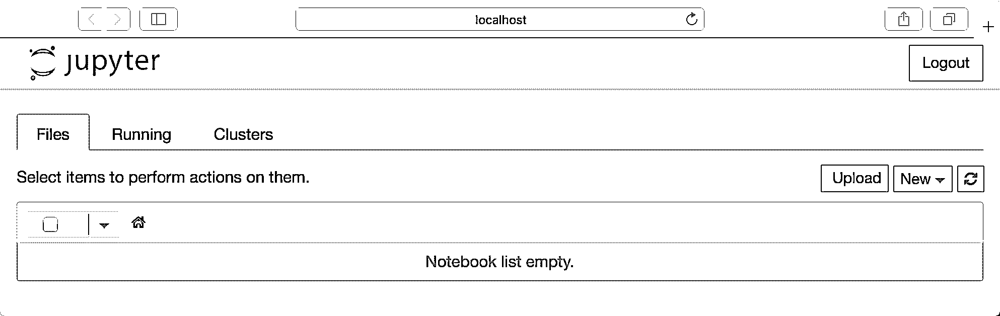
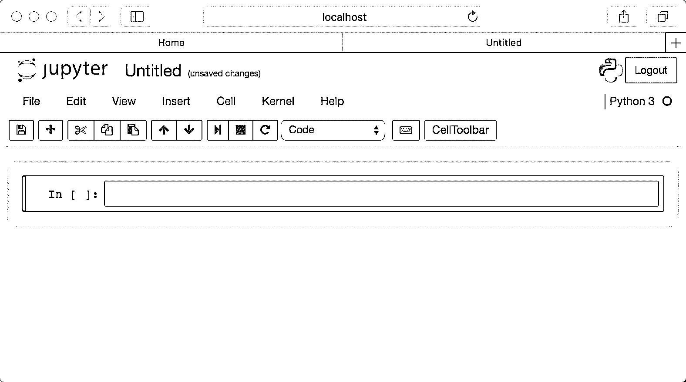
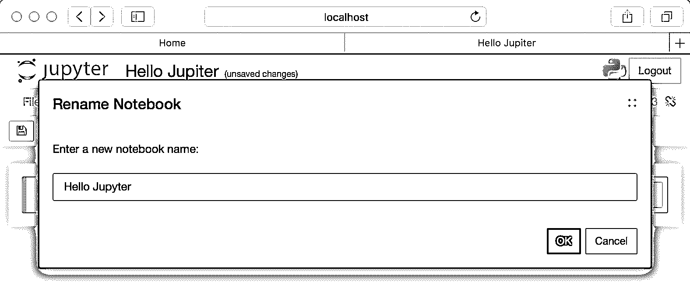
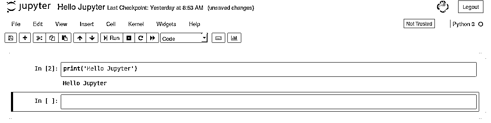
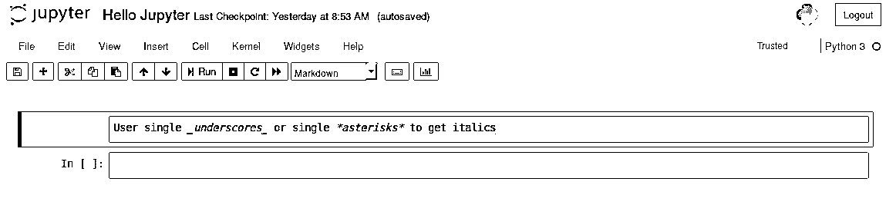
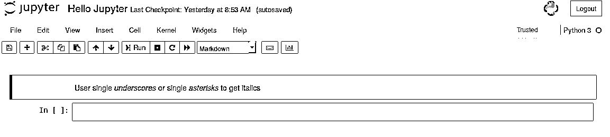
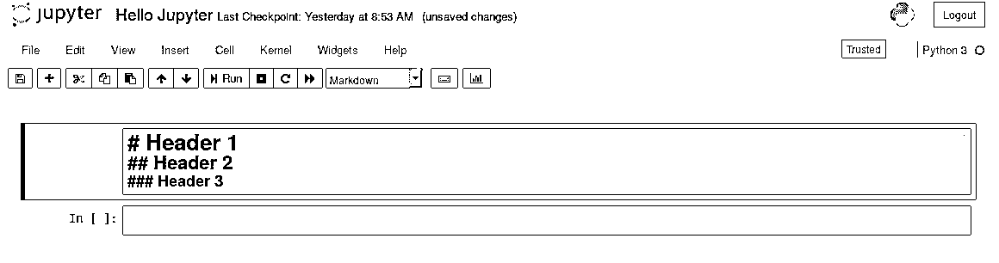
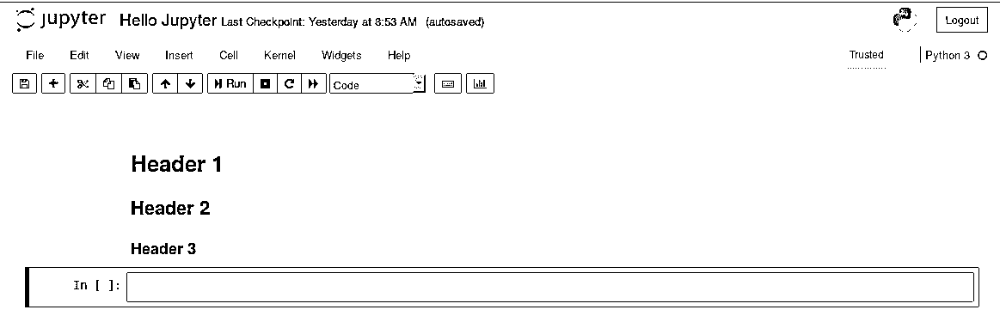
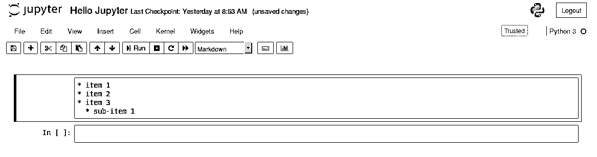
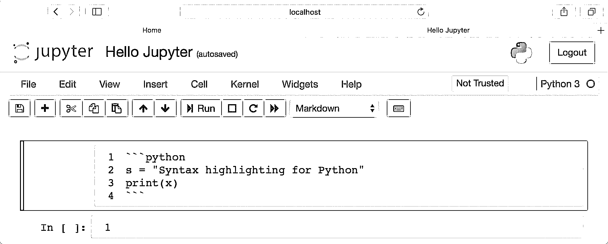

# 朱庇特笔记本:简介

> 原文：<https://realpython.com/jupyter-notebook-introduction/>

*立即观看**本教程有真实 Python 团队创建的相关视频课程。和文字教程一起看，加深理解: [**使用 Jupyter 笔记本**](/courses/using-jupyter-notebooks/)

Jupyter Notebook 是一个开源的 web 应用程序，可以用来创建和共享包含实时代码、公式、可视化和文本的文档。Jupyter 笔记本由 Jupyter 项目的人员维护。

Jupyter 笔记本是 IPython 项目的一个分拆项目，这个项目本身曾经有一个 IPython 笔记本项目。Jupyter 这个名字来自它所支持的核心编程语言:Julia、Python 和 r。Jupyter 附带了 IPython 内核，它允许您用 Python 编写程序，但目前还有 100 多种其他内核可供您使用。

**免费奖励:** [掌握 Python 的 5 个想法](https://realpython.com/bonus/python-mastery-course/)，这是一个面向 Python 开发者的免费课程，向您展示将 Python 技能提升到下一个水平所需的路线图和心态。

## 使用 Jupyter 笔记本开始运行

Python 中不包含 Jupyter 笔记本，所以如果您想试用它，您需要安装 Jupyter。

Python 语言有许多发行版。为了安装 Jupyter Notebook，本文将只关注其中的两个。最流行的是 [CPython](https://realpython.com/cpython-source-code-guide/) ，这是 Python 的参考版本，你可以从他们的[网站](https://www.python.org/)上获得。还假设你用的是 **Python 3** 。

[*Remove ads*](/account/join/)

### 安装

如果是这样，那么您可以使用 Python 附带的一个名为 **pip** 的便利工具来安装 Jupyter Notebook，如下所示:

```py
$ pip install jupyter
```

Python 的下一个最受欢迎的发行版是 Anaconda。Anaconda 有自己的安装工具，叫做 **conda** ，你可以用它来安装第三方的软件包。然而，Anaconda 预装了许多科学库，包括 Jupyter Notebook，所以除了安装 Anaconda 本身，您实际上不需要做任何事情。

### 启动 Jupyter 笔记本服务器

现在你已经安装了 Jupyter，让我们来学习如何使用它。要开始，您需要做的就是打开您的终端应用程序，并转到您选择的文件夹。我建议从你的文档文件夹开始，创建一个名为*笔记本*的子文件夹，或者其他容易记住的东西。

然后，只需转到终端中的该位置，运行以下命令:

```py
$ jupyter notebook
```

这将启动 Jupyter，您的默认浏览器应该会启动(或打开一个新标签)到以下 URL:[http://localhost:8888/tree](http://localhost:8888/tree)

您的浏览器现在应该看起来像这样:

[](https://files.realpython.com/media/01_initial_notebook_screen.cb2ea87d9679.png)

请注意，现在您实际上不是在运行笔记本电脑，而是在运行笔记本电脑服务器。现在让我们实际创建一个笔记本吧！

## 创建笔记本

既然您已经知道了如何启动笔记本服务器，那么您应该学习如何创建一个实际的笔记本文档。

你所需要做的就是点击*新*按钮(右上角)，它会打开一个选择列表。在我的机器上，我碰巧安装了 Python 2 和 Python 3，所以我可以创建一个使用其中任何一个的笔记本。为简单起见，我们选择 Python 3。

您的网页现在应该看起来像这样:

[](https://files.realpython.com/media/02_new_notebook.015b2f84bb60.png)

### 命名

你会注意到在页面的顶部是单词*无标题*。这是页面的标题和笔记本的名称。因为这不是一个很有描述性的名字，让我们改变它！

只需将鼠标移动到无标题的单词上，点击文本。你现在应该会看到一个名为*重命名笔记本*的浏览器内对话框。让我们把这个重新命名为*你好 Jupyter* :

[](https://files.realpython.com/media/03_hello_jupyter.96024ca79ae6.png)[*Remove ads*](/account/join/)

### 运行单元

当你第一次创建一个笔记本时，笔记本的单元默认使用代码，并且该单元使用你在启动笔记本时选择的内核。

在这种情况下，您开始使用 Python 3 作为您的内核，所以这意味着您可以在您的代码单元中编写 Python 代码。由于你最初的笔记本只有一个空单元格，笔记本实际上什么也做不了。

因此，为了验证一切都正常工作，您可以向单元格添加一些 Python 代码，并尝试运行其内容。

让我们尝试将以下代码添加到该单元格中:

```py
print('Hello Jupyter!')
```

运行一个单元格意味着您将执行单元格的内容。要执行某个单元格，您只需选择该单元格，然后单击顶部按钮行中的*运行*按钮。它朝着中间。如果你喜欢使用键盘，你可以按下 `Shift` + `Enter` 。

当我运行上面的代码时，输出如下所示:

[](https://files.realpython.com/media/04_cell_run.73e945f90bb1.png)

如果您的笔记本中有多个单元格，并且您按顺序运行这些单元格，那么您可以跨单元格共享变量和导入。这使得将代码分成逻辑块变得容易，而不需要重新导入库或在每个单元中重新创建变量或函数。

当你运行一个单元格时，你会注意到单元格左边的中的单词*旁边有一些方括号。方括号将自动填充一个数字，表示您运行单元格的顺序。例如，如果您打开一个新的笔记本并运行笔记本顶部的第一个单元格，方括号将填充数字 *1* 。*

### 菜单

Jupyter 笔记本有几个菜单，您可以使用它们与笔记本进行交互。菜单沿着笔记本的顶部运行，就像其他应用程序中的菜单一样。以下是当前菜单的列表:

*   *文件*
*   *编辑*
*   *视图*
*   *插入*
*   *单元格*
*   *内核*
*   *Widgets*
*   *帮助*

让我们一个一个地看菜单。本文不会详细讨论每一个菜单中的每一个选项，而是将重点放在笔记本应用程序特有的项目上。

第一个菜单是文件菜单。在其中，您可以创建一个新的笔记本或打开一个现有的笔记本。这也是您重命名笔记本的地方。我认为最有趣的菜单项是*保存和检查点*选项。这允许您创建检查点，如果需要，可以回滚到这些检查点。

接下来是*编辑*菜单。您可以在这里剪切、复制和粘贴单元格。如果您想要删除、拆分或合并单元格，这也是您要去的地方。您也可以在这里重新排列单元格。

请注意，此菜单中的一些项目是灰色的。原因是它们不适用于当前选定的单元格。例如，code 单元格不能插入图像，但 Markdown 单元格可以。如果您看到灰色的菜单项，请尝试更改单元格的类型，并查看该项是否可用。

*视图*菜单对于切换标题和工具栏的可见性非常有用。您还可以打开或关闭单元格内的*行号*。如果您想摆弄单元格的工具栏，这也是您应该去的地方。

*插入*菜单仅用于在当前选中单元格的上方或下方插入单元格。

*单元*菜单允许您运行一个单元、一组单元或所有单元。你也可以在这里改变一个单元格的类型，虽然我个人觉得工具栏更直观。

这个菜单中另一个方便的特性是清除单元格输出的能力。如果您计划与其他人共享您的笔记本，您可能希望首先清除输出，以便下一个人可以自己运行单元。

*内核*单元用于处理在后台运行的内核。在这里你可以重启内核，重新连接，关闭，甚至改变你的笔记本使用的内核。

你可能不会经常使用内核，但是当你调试笔记本的时候，你会发现你需要重启内核。当这种情况发生时，这就是你要去的地方。

*微件*菜单用于保存和清除微件状态。小部件基本上是 [JavaScript](https://realpython.com/python-vs-javascript/) 小部件，您可以将它们添加到单元格中，使用 Python(或另一个内核)制作动态内容。

最后是*帮助*菜单，在这里你可以了解笔记本的键盘快捷键、用户界面浏览和大量参考资料。

[*Remove ads*](/account/join/)

### 启动终端和其他东西

Jupyter Notebook 还能让你开始不仅仅是笔记本。您也可以在浏览器中创建文本文件、文件夹或终端。回到您在`http://localhost:8888/tree`第一次启动 Jupyter 服务器时打开的主页。转到*新*按钮，选择其他选项之一。

终端可能是最有趣的，因为它在浏览器中运行你的操作系统终端。这允许您在浏览器中运行 bash、Powershell 等，并运行您可能需要的任何 shell 命令。

### 查看正在运行的内容

Jupyter 服务器(`http://localhost:8888/tree`)的主页上还有另外两个选项卡:*运行*和*集群*。

*运行*标签会告诉你当前运行的是哪些笔记本和终端。当您想要关闭服务器，但需要确保保存了所有数据时，这很有用。幸运的是，笔记本自动保存非常频繁，所以你很少会丢失数据。但是能够在需要的时候看到正在运行的东西是件好事。

这个标签的另一个好处是，你可以浏览正在运行的应用程序，并在那里关闭它们。

## 添加丰富的内容

Jupyter Notebook 支持向其单元格添加丰富的内容。在本节中，您将大致了解使用标记和代码可以对单元格做的一些事情。

### 细胞类型

从技术上讲，有四种单元格类型:代码、降价、原始 NBConvert 和标题。

不再支持标题单元格类型，将会显示一个对话框来说明这一点。相反，你应该对你的标题使用 Markdown。

原始 NBConvert 单元格类型仅用于使用`nbconvert`命令行工具时的特殊用例。基本上，当从一个笔记本转换到另一种格式时，它允许你以一种非常特殊的方式控制格式。

您将使用的主要单元格类型是代码和降价单元格类型。你已经知道了代码单元格是如何工作的，所以让我们来学习如何用 Markdown 设计你的文本样式。

### 设计文本样式

Jupyter Notebook 支持 Markdown，这是一种标记语言，是 HTML 的超集。本教程将涵盖一些你可以用 Markdown 做什么的基础知识。

将一个新单元格设置为 Markdown，然后向该单元格添加以下文本:

[](https://files.realpython.com/media/05_italic.e9e16a1040f5.png)

运行该单元时，输出应该如下所示:

[](https://files.realpython.com/media/06_italic_ran.63ba240b2492.png)

如果你想加粗你的文本，使用双下划线或双星号。

[*Remove ads*](/account/join/)

### 标题

在 Markdown 中创建标题也很简单。你只需要使用谦逊的英镑符号。您使用的井号越多，页眉就越小。朱庇特笔记本甚至为你预览了一下:

[](https://files.realpython.com/media/07_headers.dc5aa8999b03.png)

然后，当您运行单元格时，您将得到一个格式良好的标题:

[](https://files.realpython.com/media/08_headers.9cfb98853821.png)

### 创建列表

您可以使用破折号、加号或星号来创建列表(项目符号)。这里有一个例子:

[](https://files.realpython.com/media/09_list.bb44656fd178.png)

### 代码和语法高亮显示

如果您想插入一个不希望最终用户实际运行的代码示例，可以使用 Markdown 来插入它。对于内联代码突出显示，只需用反斜杠将代码括起来。如果要插入一段代码，可以使用三个反斜线并指定编程语言:

[](https://files.realpython.com/media/syntax_highlighting_markdown.7e65e64cbf42.png)

## 导出笔记本

当你使用 Jupyter 笔记本时，你会发现你需要与非技术人员分享你的成果。出现这种情况时，您可以使用 Jupyter Notebook 附带的`nbconvert`工具将您的笔记本转换或导出为以下格式之一:

*   超文本标记语言
*   乳液
*   便携文档格式
*   RevealJS
*   降价
*   重组后的文本
*   可执行脚本

`nbconvert`工具使用 [Jinja 模板](https://realpython.com/primer-on-jinja-templating/)将你的笔记本文件(`.ipynb`)转换成其他格式。

[Jinja](http://jinja.pocoo.org/) 是一个为 Python 制作的模板引擎。还要注意的是，`nbconvert`也依赖于 [Pandoc](https://pandoc.org/) 和 TeX 来导出上述所有格式。如果您没有其中的一个或多个，某些导出类型可能无法工作。要了解更多信息，您应该查看[文档](https://nbconvert.readthedocs.io/en/latest/)。

### 如何使用`nbconvert`

`nbconvert`命令不带太多参数，这使得学习如何使用它变得更加容易。打开终端，导航到包含要转换的笔记本的文件夹。基本转换命令如下所示:

```py
$ jupyter nbconvert <input notebook> --to <output format>
```

### 用法示例

让我们假设你有一个名为`py_examples.ipynb`的笔记本，你想把它转换成 PDF。下面是您可以使用的命令:

```py
$ jupyter nbconvert py_examples.ipynb --to pdf
```

当您运行这个命令时，您应该会看到一些输出，告诉您转换过程。如果有警告和错误，将显示。假设一切都按计划进行，现在您的文件夹中会有一个`py_examples.pdf`文件。

其他文件类型的转换过程非常相似。你只需要告诉`nbconvert`要转换成什么类型(PDF、Markdown、HTML 等等)。

[*Remove ads*](/account/join/)

### 使用菜单

您也可以通过进入*文件*菜单并选择*下载为*选项来导出您当前运行的笔记本。

此选项允许您下载`nbconvert`支持的所有格式。使用菜单的好处是，如果你不想学的话，你根本不需要学`nbconvert`。不过我建议这样做，因为你可以使用`nbconvert`一次导出多个笔记本，这是菜单不支持的。

## 笔记本扩展

虽然 Jupyter 笔记本内置了许多功能，但您可以通过扩展添加新功能。Jupyter 实际上支持四种类型的扩展:

*   核心
*   IPython 内核
*   笔记本
*   笔记本服务器

本教程将重点介绍笔记本扩展。

### 什么是扩展？

笔记本扩展(`nbextension`)是一个 JavaScript 模块，可以加载到笔记本前端的大多数视图中。如果您精通 JavaScript，您甚至可以编写自己的扩展。扩展可以访问页面的 DOM 和 Jupyter JavaScript API。

### 我在哪里得到分机？

你可以使用谷歌或者搜索 Jupyter 笔记本扩展。实际上有很多。最受欢迎的扩展集之一叫做**jupyter _ contrib _ nb extensions**，你可以从 [GitHub](https://github.com/ipython-contrib/jupyter_contrib_nbextensions) 获得。这实际上是一个由 Jupyter 社区提供并随`pip`一起安装的扩展集合。

### 我如何安装它们？

大多数 Jupyter 笔记本扩展可以使用 Python 的`pip`工具安装。如果您发现一个扩展不能用`pip`安装，那么您可能必须使用以下命令:

```py
$ jupyter nbextension install EXTENSION_NAME
```

这只会安装扩展，而不会激活它。安装扩展后，您需要通过运行以下命令来启用它:

```py
$ jupyter nbextension enable EXTENSION_NAME
```

您可能需要重新启动 Jupyter 笔记本内核来查看扩展。

有一个很好的元扩展叫做**Jupyter nb extensions Configurator**,值得用来管理其他扩展。它允许您在 Jupyter 笔记本的用户界面中启用和禁用您的扩展，还显示所有当前安装的扩展。

## 结论

Jupyter Notebook 不仅对于学习和教授 Python 这样的编程语言非常有用，而且对于共享数据也非常有用。

你可以把你的笔记本变成幻灯片，或者用 GitHub 在线分享。如果你想共享一个笔记本而不要求你的用户安装任何东西，你可以使用 [binder](https://mybinder.org/) 来实现。

谷歌和微软都有自己的笔记本版本，你可以分别在[谷歌联合实验室](https://colab.research.google.com)和[微软 Azure 笔记本](https://notebooks.azure.com/)创建和分享你的笔记本。你也可以在那里浏览非常有趣的笔记本。

Project Jupyter 最近推出了他们的最新产品 [JupyterLab](https://jupyterlab.readthedocs.io/en/stable/) 。JupyterLab 将 Jupyter Notebook 合并到一个集成的开发类型编辑器中，您可以在浏览器中运行该编辑器。你可以把 JupyterLab 看作是 Jupyter 笔记本的高级版本。除了笔记本之外，JupyterLab 还允许您在浏览器中运行终端、文本编辑器和代码控制台。

一如既往，最好是自己试用一款新软件，看看它是否适合自己，是否值得使用。我鼓励你给 Jupyter 笔记本或 JupyterLab 一个旋转，看看你怎么想！

[*Remove ads*](/account/join/)

## 延伸阅读

如果你想了解更多关于 Jupyter Notebook 的知识，你可以花点时间阅读他们优秀的[文档](https://jupyter-notebook.readthedocs.io/en/stable/)。

有关集成开发环境的更多信息，您可能希望查阅以下文章:

*   [Python ide 和代码编辑器(指南)](https://realpython.com/python-ides-code-editors-guide/)
*   [Thonny:初学者友好的 Python 编辑器](https://realpython.com/python-thonny/)

*立即观看**本教程有真实 Python 团队创建的相关视频课程。和文字教程一起看，加深理解: [**使用 Jupyter 笔记本**](/courses/using-jupyter-notebooks/)********