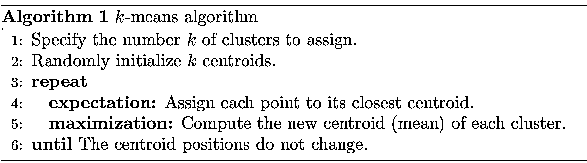
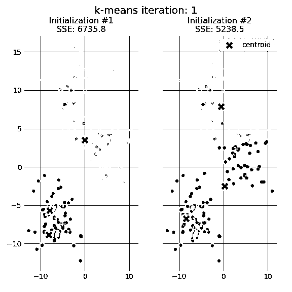
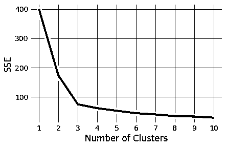
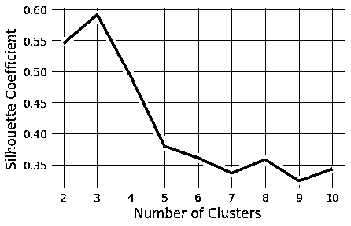
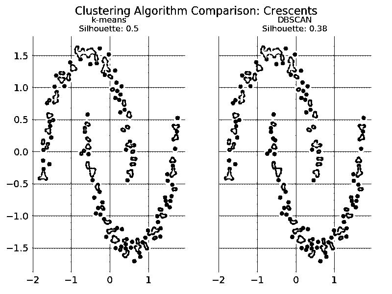
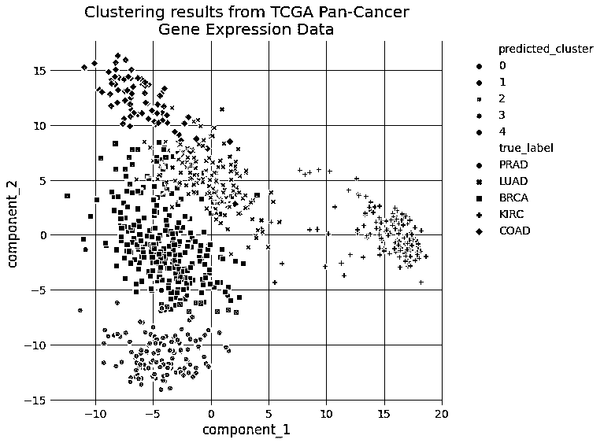
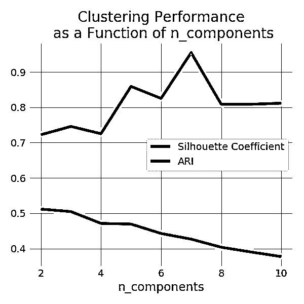

# Python 中的 K-Means 聚类:实用指南

> 原文：<https://realpython.com/k-means-clustering-python/>

***k*-均值聚类**方法是一种[无监督机器学习](https://en.wikipedia.org/wiki/Unsupervised_learning)技术，用于识别数据集中数据对象的聚类。有许多不同类型的聚类方法，但 *k* -means 是最古老和最容易使用的方法之一。这些特性使得用 Python 实现集群变得相当简单，即使对于编程新手和数据科学家来说也是如此。

如果您有兴趣了解如何以及何时实现*k*——意思是 Python 中的集群，那么这里是合适的地方。您将浏览一个端到端的例子*k*——意味着使用 Python 进行集群，从预处理数据到评估结果。

在本教程中，您将学习:

*   什么是***k*-均值聚类**是
*   何时使用*k*-意味着聚类到**分析你的数据**
*   如何实现*k*-用 **scikit 在 Python 中表示集群-学习**
*   如何选择一个**有意义的**个数的集群

单击下面的链接下载代码，您将使用这些代码来遵循本教程中的示例，并实现您自己的 *k* -means 集群管道:

**下载示例代码:** [单击此处获取代码，您将在本教程中使用](https://realpython.com/bonus/K-Means-Clustering/)来学习如何编写 k-means 聚类管道。

## 什么是集群？

聚类是一组用于将数据划分成组或簇的技术。**集群**被宽泛地定义为数据对象组，这些数据对象组与它们集群中的其他对象的相似性高于它们与其他集群中的数据对象的相似性。在实践中，聚类有助于识别两种质量的数据:

1.  富有意义
2.  有用

**有意义的**集群扩展领域知识。例如，在医学领域，研究人员将聚类应用于基因表达实验。聚类结果确定了对药物治疗有不同反应的患者组。

**另一方面，有用的**簇充当[数据管道](https://en.wikipedia.org/wiki/Pipeline_(computing))的中间步骤。例如，企业使用聚类进行客户细分。聚类结果将客户划分为具有相似购买历史的群体，然后企业可以使用这些群体来创建有针对性的广告活动。

**注:**在本教程中，你将了解到**无监督机器学习**技术。如果你有兴趣了解更多关于**监督机器学习**技术的信息，那么看看 Python 中的[逻辑回归。](https://realpython.com/logistic-regression-python/)

聚类还有很多其他的[应用，比如文档聚类，社交网络分析。这些应用程序几乎与每个行业都相关，这使得聚类成为任何领域中处理数据的专业人员的一项宝贵技能。](https://en.wikipedia.org/wiki/Cluster_analysis#Applications)

[*Remove ads*](/account/join/)

### 聚类技术概述

您可以使用许多不同的方法来执行聚类—事实上，方法如此之多，以至于有各种各样的聚类算法。这些类别中的每一个都有其独特的优势和劣势。这意味着某些聚类算法将根据输入数据产生更自然的聚类分配。

**注意:**如果你对学习本节没有提到的聚类算法感兴趣，那么请查看[对聚类算法的全面调查](https://link.springer.com/content/pdf/10.1007/s40745-015-0040-1.pdf)以获得对流行技术的精彩回顾。

由于可供选择的方法很多，为数据集选择合适的聚类算法通常很困难。影响这一决定的一些重要因素包括聚类的特征、数据集的特征、离群值的数量以及数据对象的数量。

通过查看三种流行的聚类算法类别，您将了解这些因素如何帮助确定哪种方法最合适:

1.  分割聚类
2.  分层聚类
3.  基于密度的聚类

在直接进入 *k* 手段之前，有必要回顾一下这些类别。您将了解每个类别的优点和缺点，为 *k* -means 如何适应聚类算法的环境提供背景。

### 分区聚类

**分区聚类**将数据对象分成不重叠的组。换句话说，任何对象都不能是多个集群的成员，并且每个集群必须至少有一个对象。

这些技术要求用户指定簇的数量，由[变量](https://realpython.com/python-variables/) *k* 表示。许多分区聚类算法通过迭代过程将数据点子集分配到 *k* 个聚类中。划分聚类算法的两个例子是 *k* -means 和 *k* -medoids。

这些算法都是**不确定的**，这意味着它们可以从两次单独的运行中产生不同的结果，即使运行是基于相同的输入。

划分聚类方法有几个**优势**:

*   当星系团具有球形形状时，它们工作得很好。
*   就算法复杂性而言，它们是可扩展的。

他们也有几个弱点:

*   它们不太适合具有复杂形状和不同大小的集群。
*   当用于不同密度的簇时，它们会分解。

### 层次聚类

**层次聚类**通过构建层次来确定聚类分配。这可以通过自下而上或自上而下的方法实现:

*   **凝聚聚类**是自底向上的方法。它合并最相似的两个点，直到所有点都被合并成一个单独的聚类。

*   **分裂聚类**是自上而下的方法。它从所有点作为一个聚类开始，并在每一步分裂最不相似的聚类，直到只剩下单个数据点。

这些方法产生了一个基于树的点层次结构，称为 [**树状图**](https://en.wikipedia.org/wiki/Dendrogram) 。类似于分区聚类，在分层聚类中，聚类的数量( *k* )通常由用户预先确定。通过在指定深度切割树状图来分配聚类，这导致更小的树状图的 *k* 组。

与许多分区聚类技术不同，层次聚类是一个**确定性**过程，这意味着当您对相同的输入数据运行两次算法时，聚类分配不会改变。

层次聚类方法的**优势**包括以下几点:

*   它们经常揭示数据对象之间的关系的细节。
*   他们提供了一个**可解释的树状图**。

层次聚类方法的**弱点**包括以下几点:

*   就算法复杂性而言，它们**在计算上是昂贵的**。
*   他们对 [**噪声**](https://en.wikipedia.org/wiki/Noisy_data) 和 [**异常值**](https://en.wikipedia.org/wiki/Outlier) 很敏感。

[*Remove ads*](/account/join/)

### 基于密度的聚类

**基于密度的聚类**根据区域中数据点的密度确定聚类分配。在由低密度区域分隔的高密度数据点处分配聚类。

与其他聚类类别不同，这种方法不需要用户指定聚类的数量。相反，有一个基于距离的参数充当可调阈值。该阈值决定了必须有多近的点才能被视为聚类成员。

基于密度的聚类算法的例子包括基于密度的具有噪声的应用的空间聚类，或者 [**DBSCAN**](https://scikit-learn.org/stable/modules/generated/sklearn.cluster.DBSCAN.html) ，以及用于识别聚类结构的排序点，或者 [**光学**](https://scikit-learn.org/stable/modules/generated/sklearn.cluster.OPTICS.html#sklearn.cluster.OPTICS) 。

基于密度的聚类方法的**优势**包括:

*   他们擅长识别非球形的星团。
*   他们对异常值有抵抗力。

基于密度的聚类方法的缺点包括:

*   它们不太适合在**高维空间** 中[聚类。](https://en.wikipedia.org/wiki/Clustering_high-dimensional_data)
*   他们很难识别不同密度的集群。

## 如何在 Python 中执行 K-Means 聚类

在本节中，您将一步一步地浏览传统版本的 *k* -means 算法。理解算法的细节是编写你的 *k* 过程中的一个基本步骤——在 Python 中的意思是集群管道。你在这一节学到的东西将帮助你决定 *k* -means 是否是解决你的聚类问题的正确选择。

### 理解 K-Means 算法

传统的方法只需要几个步骤。第一步是随机选择 *k* 个质心，其中 *k* 等于你选择的聚类数。**质心**是代表一个聚类中心的数据点。

该算法的主要元素通过称为**期望最大化**的两步过程来工作。**期望**步骤将每个数据点分配到其最近的质心。然后，**最大化**步骤计算每个聚类所有点的平均值，并设置新的质心。下面是传统版本的 *k* -means 算法的样子:

[](https://files.realpython.com/media/kmeans-algorithm.a94498a7ecd2.png)

在质心**收敛**之后，通过计算误差平方和(SSE) 的 [**来确定聚类分配的质量，或者匹配先前迭代的分配。SSE 定义为每个点到其最近质心的平方欧几里德距离之和。因为这是一个误差的度量，所以 *k* -means 的目标是尝试最小化这个值。**](https://en.wikipedia.org/wiki/Residual_sum_of_squares)

下图显示了在同一数据集上两次不同运行的 *k* -means 算法的前五次迭代中的质心和 SSE 更新:

[](https://files.realpython.com/media/centroids_iterations.247379590275.gif)

此图的目的是表明质心的初始化是一个重要的步骤。它还强调了使用 SSE 作为集群性能的衡量标准。在选择了多个聚类和初始质心之后，重复期望最大化步骤，直到质心位置达到收敛并且不变。

随机初始化步骤导致 *k* -means 算法成为**不确定性**，这意味着如果在同一个数据集上运行相同的算法两次，聚类分配将会发生变化。研究人员通常运行整个 *k* 均值算法的若干次初始化，并从具有最低 SSE 的初始化中选择聚类分配。

### 用 Python 编写第一个 K-Means 集群代码

幸运的是，有一个健壮的实现*k*——意思是来自流行的机器学习包 [scikit-learn](https://scikit-learn.org/stable/) 的 Python 中的集群。您将学习如何使用算法的 [scikit-learn 版本编写 *k* 均值算法的实际实现。](https://scikit-learn.org/stable/modules/generated/sklearn.cluster.KMeans.html#sklearn.cluster.KMeans)

**注:**如果你有兴趣深入了解如何用 Python 编写自己的 *k* -means 算法，那么就去查阅一下 [Python 数据科学手册](https://jakevdp.github.io/PythonDataScienceHandbook/05.11-k-means.html)。

本教程中的代码需要一些流行的外部 [Python 包](https://realpython.com/python-modules-packages/)，并假设您已经用 Anaconda 安装了 Python。有关在 Windows 中为机器学习设置 Python 环境的更多信息，请通读[在 Windows 上为机器学习设置 Python](https://realpython.com/python-windows-machine-learning-setup/)。

否则，您可以从安装所需的软件包开始:

```py
(base) $ conda install matplotlib numpy pandas seaborn scikit-learn ipython
(base) $ conda install -c conda-forge kneed
```

代码被呈现出来，这样你就可以在`ipython`控制台或 Jupyter 笔记本上跟随。单击每个代码块右上角的提示(`>>>`)来查看为复制-粘贴而格式化的代码。您也可以点击下面的链接下载本文中使用的源代码:

**下载示例代码:** [单击此处获取代码，您将在本教程中使用](https://realpython.com/bonus/K-Means-Clustering/)来学习如何编写 k-means 聚类管道。

这一步将导入本节中所有代码所需的模块:

>>>

```py
In [1]: import matplotlib.pyplot as plt
 ...: from kneed import KneeLocator
 ...: from sklearn.datasets import make_blobs
 ...: from sklearn.cluster import KMeans
 ...: from sklearn.metrics import silhouette_score
 ...: from sklearn.preprocessing import StandardScaler
```

您可以使用`make_blobs()`从上面的 GIF 中生成数据，这是 scikit-learn 中用于生成合成聚类的一个方便的函数。`make_blobs()`使用这些参数:

*   **`n_samples`** 是要生成的样本总数。
*   **`centers`** 是生成的中心数。
*   **`cluster_std`** 是标准差。

`make_blobs()`返回两个值的元组:

1.  一个二维 NumPy 数组，包含每个样本的 x 和 y 值
2.  包含每个样本的**分类标签**的一维 NumPy 数组

**注意:**许多 scikit-learn 算法在实现中严重依赖 NumPy。如果你想了解更多关于 NumPy 数组的知识，请查看 [Look Ma，No For-Loops:Array Programming With NumPy](https://realpython.com/numpy-array-programming/)。

生成合成数据和标签:

>>>

```py
In [2]: features, true_labels = make_blobs(
 ...:    n_samples=200,
 ...:    centers=3,
 ...:    cluster_std=2.75,
 ...:    random_state=42
 ...: )
```

像 *k* -means 这样的非确定性机器学习算法很难重现。`random_state`参数被设置为一个整数值，因此您可以遵循教程中提供的数据。实际上，最好将`random_state`保留为默认值`None`。

下面看一下由`make_blobs()`返回的每个变量的前五个元素:

>>>

```py
In [3]: features[:5]
Out[3]:
array([[  9.77075874,   3.27621022],
 [ -9.71349666,  11.27451802],
 [ -6.91330582,  -9.34755911],
 [-10.86185913, -10.75063497],
 [ -8.50038027,  -4.54370383]])

In [4]: true_labels[:5]
Out[4]: array([1, 0, 2, 2, 2])
```

数据集通常包含以不同单位测量的数字特征，如身高(英寸)和体重(磅)。机器学习算法会认为体重比身高更重要，只是因为体重的值更大，并且因人而异。

机器学习算法需要考虑公平竞争环境中的所有特征。这意味着所有要素的值必须转换为相同的比例。

转换数字特征以使用相同比例的过程称为**特征缩放**。对于大多数基于距离的机器学习算法来说，这是一个重要的数据**预处理**步骤，因为它会对算法的性能产生重大影响。

有几种实现特征缩放的方法。确定哪种技术适合您的数据集的一个好方法是阅读 scikit-learn 的[预处理文档](https://scikit-learn.org/stable/modules/preprocessing.html)。

在这个例子中，您将使用`StandardScaler`类。这个类实现了一种叫做**标准化**的特性缩放。标准化对数据集中每个数值要素的值进行缩放或移位，使要素的平均值为 0，标准差为 1:

>>>

```py
In [5]: scaler = StandardScaler()
 ...: scaled_features = scaler.fit_transform(features)
```

看看`scaled_features`中的值是如何缩放的:

>>>

```py
In [6]: scaled_features[:5]
Out[6]:
array([[ 2.13082109,  0.25604351],
 [-1.52698523,  1.41036744],
 [-1.00130152, -1.56583175],
 [-1.74256891, -1.76832509],
 [-1.29924521, -0.87253446]])
```

现在，数据已经准备好进行聚类了。scikit-learn 中的`KMeans`估计器类是在将估计器拟合到数据之前设置算法参数的地方。scikit-learn 实现非常灵活，提供了几个可以调整的参数。

以下是本例中使用的参数:

*   **`init`** 控制着初始化技术。标准版本的 *k* 均值算法通过将`init`设置为`"random"`来实现。将此设置为`"k-means++"`采用了一种高级技巧来加速收敛，稍后您将使用这种技巧。

*   **`n_clusters`** 为聚类步骤设置 *k* 。这是 *k* 最重要的参数——手段。

*   **`n_init`** 设置要执行的初始化次数。这很重要，因为两次运行可以在不同的集群分配上收敛。scikit-learn 算法的默认行为是执行十次 *k* 均值运行，并返回 SSE 最低的结果。

*   **`max_iter`** 设置 *k* 均值算法每次初始化的最大迭代次数。

用以下参数实例化`KMeans`类:

>>>

```py
In [7]: kmeans = KMeans(
 ...:    init="random",
 ...:    n_clusters=3,
 ...:    n_init=10,
 ...:    max_iter=300,
 ...:    random_state=42
 ...: )
```

参数名与本教程前面用来描述 *k* 均值算法的语言相匹配。既然 *k* -means 类已经准备好了，下一步就是让它适合`scaled_features`中的数据。这将对您的数据执行十次 *k* 均值算法，每次最多迭代`300`次:

>>>

```py
In [8]: kmeans.fit(scaled_features)
Out[8]:
KMeans(init='random', n_clusters=3, random_state=42)
```

在调用`.fit()`之后，来自具有最低 SSE 的初始化运行的统计数据作为`kmeans`的属性可用:

>>>

```py
In [9]: # The lowest SSE value
 ...: kmeans.inertia_
Out[9]: 74.57960106819854

In [10]: # Final locations of the centroid
 ...: kmeans.cluster_centers_
Out[10]:
array([[ 1.19539276,  0.13158148],
 [-0.25813925,  1.05589975],
 [-0.91941183, -1.18551732]])

In [11]: # The number of iterations required to converge
 ...: kmeans.n_iter_
Out[11]: 6
```

最后，集群分配作为一维 NumPy 数组存储在`kmeans.labels_`中。以下是前五个预测标签:

>>>

```py
In [12]: kmeans.labels_[:5]
Out[12]: array([0, 1, 2, 2, 2], dtype=int32)
```

注意，前两个数据对象的分类标签的顺序被颠倒了。顺序是`true_labels`中的`[1, 0]`，但是`kmeans.labels_`中的`[0, 1]`，即使这些数据对象仍然是它们在`kmeans.lables_`中的原始集群的成员。

这种行为是正常的，因为分类标签的排序取决于初始化。第一次运行的聚类 0 在第二次运行中可以被标记为聚类 1，反之亦然。这不会影响集群评估指标。

[*Remove ads*](/account/join/)

### 选择适当数量的集群

在本节中，您将看到两种常用于评估适当集群数量的方法:

1.  **肘法**
2.  **轮廓系数**

这些通常被用作补充评估技术，而不是一个优于另一个。为了执行**肘方法**，运行几个 *k* -means，每次迭代增加`k`，并记录 SSE:

>>>

```py
In [13]: kmeans_kwargs = {
 ...:    "init": "random",
 ...:    "n_init": 10,
 ...:    "max_iter": 300,
 ...:    "random_state": 42,
 ...: }
 ...:
 ...: # A list holds the SSE values for each k
 ...: sse = []
 ...: for k in range(1, 11):
 ...:    kmeans = KMeans(n_clusters=k, **kmeans_kwargs)
 ...:    kmeans.fit(scaled_features)
 ...:    sse.append(kmeans.inertia_)
```

前面的代码块利用了 Python 的字典解包操作符(`**`)。要了解关于这个强大的 Python 操作符的更多信息，请查看[如何在 Python](https://realpython.com/iterate-through-dictionary-python/#using-the-dictionary-unpacking-operator) 中迭代字典。

当您绘制 SSE 作为集群数量的函数时，请注意 SSE 会随着您增加`k`而继续减少。随着更多质心的添加，每个点到其最近质心的距离将减少。

上证综指曲线开始弯曲的地方有一个最佳点，称为**拐点**。该点的 x 值被认为是误差和聚类数之间的合理权衡。在本例中，肘部位于`x=3`:

>>>

```py
In [14]:  plt.style.use("fivethirtyeight")
 ...: plt.plot(range(1, 11), sse)
 ...: plt.xticks(range(1, 11))
 ...: plt.xlabel("Number of Clusters")
 ...: plt.ylabel("SSE")
 ...: plt.show()
```

上面的代码产生了下面的图:

[](https://files.realpython.com/media/elbow_method.f10515cf445d.png)

确定上证综指曲线的拐点并不总是那么简单。如果您在选择曲线的肘点时遇到困难，那么您可以使用 Python 包 [kneed](https://github.com/arvkevi/kneed) ，以编程方式识别肘点:

>>>

```py
In [15]: kl = KneeLocator(
 ...:    range(1, 11), sse, curve="convex", direction="decreasing"
 ...: )

In [16]: kl.elbow
Out[16]: 3
```

**剪影系数**是集群内聚和分离的度量。它基于两个因素来量化数据点适合其分配的聚类的程度:

1.  数据点与聚类中其他点的接近程度
2.  数据点离其他聚类中的点有多远

轮廓系数值的范围在`-1`和`1`之间。较大的数字表示样本与其类的距离比与其他类的距离更近。

在剪影系数的 scikit-learn [实现中，所有样本的平均剪影系数被总结为一个分数。`silhouette score()`函数最少需要两个集群，否则会引发异常。](https://scikit-learn.org/stable/modules/generated/sklearn.metrics.silhouette_score.html)

再次循环通过`k`的值。这一次，不计算 SSE，而是计算轮廓系数:

>>>

```py
In [17]: # A list holds the silhouette coefficients for each k
 ...: silhouette_coefficients = []
 ...:
 ...: # Notice you start at 2 clusters for silhouette coefficient
 ...: for k in range(2, 11):
 ...:    kmeans = KMeans(n_clusters=k, **kmeans_kwargs)
 ...:    kmeans.fit(scaled_features)
 ...:    score = silhouette_score(scaled_features, kmeans.labels_)
 ...:    silhouette_coefficients.append(score)
```

绘制每个`k`的平均轮廓分数表明`k`的最佳选择是`3`，因为它的分数最高:

>>>

```py
In [18]: plt.style.use("fivethirtyeight")
 ...: plt.plot(range(2, 11), silhouette_coefficients)
 ...: plt.xticks(range(2, 11))
 ...: plt.xlabel("Number of Clusters")
 ...: plt.ylabel("Silhouette Coefficient")
 ...: plt.show()
```

上面的代码产生了下面的图:

[](https://files.realpython.com/media/silhouette_scores.9e4e63c679ef.png)

最终，您应该根据领域知识和集群评估指标来决定要使用的集群数量。

[*Remove ads*](/account/join/)

### 使用高级技术评估集群性能

肘方法和轮廓系数在不使用**基础事实标签**的情况下评估聚类性能。基本事实标签根据人工分配或现有算法将数据点分类成组。这些类型的度量尽最大努力建议正确的集群数量，但在没有上下文的情况下使用时可能具有欺骗性。

**注意:**在实践中，很少会遇到带有事实标签的数据集。

当将 *k* -means 与基于密度的方法在非球形集群上进行比较时，肘方法和轮廓系数的结果很少符合人类的直觉。这个场景强调了为什么高级聚类评估技术是必要的。要可视化示例，请导入以下附加模块:

>>>

```py
In [19]: from sklearn.cluster import DBSCAN
 ...: from sklearn.datasets import make_moons
 ...: from sklearn.metrics import adjusted_rand_score
```

这一次，使用`make_moons()`生成新月形状的合成数据:

>>>

```py
In [20]: features, true_labels = make_moons(
 ...:    n_samples=250, noise=0.05, random_state=42
 ...: )
 ...: scaled_features = scaler.fit_transform(features)
```

将一个 *k* 均值和一个 DBSCAN 算法用于新数据，并通过用 [Matplotlib](https://realpython.com/python-matplotlib-guide/) 绘制聚类分配图来直观地评估性能:

>>>

```py
In [21]: # Instantiate k-means and dbscan algorithms
 ...: kmeans = KMeans(n_clusters=2)
 ...: dbscan = DBSCAN(eps=0.3)
 ...:
 ...: # Fit the algorithms to the features
 ...: kmeans.fit(scaled_features)
 ...: dbscan.fit(scaled_features)
 ...:
 ...: # Compute the silhouette scores for each algorithm
 ...: kmeans_silhouette = silhouette_score(
 ...:    scaled_features, kmeans.labels_
 ...: ).round(2)
 ...: dbscan_silhouette = silhouette_score(
 ...:   scaled_features, dbscan.labels_
 ...: ).round (2)
```

打印两种算法的轮廓系数，并进行比较。较高的轮廓系数表示较好的聚类，这在这种情况下具有误导性:

>>>

```py
In [22]: kmeans_silhouette
Out[22]: 0.5

In [23]: dbscan_silhouette
Out[23]: 0.38
```

对于 *k* -means 算法，轮廓系数更高。DBSCAN 算法似乎根据数据的形状找到了更多的自然聚类:

[](https://files.realpython.com/media/crescent_comparison.7938c8cf29d1.png)

这表明您需要一种更好的方法来比较这两种聚类算法的性能。

如果你感兴趣，你可以通过展开下面的方框找到上面的代码。


要了解更多关于使用 Matplotlib 和 Python 绘图的信息，请查看 [Python 使用 Matplotlib 绘图(指南)](https://realpython.com/python-matplotlib-guide/)。在新月的例子中，你可以这样比较这两种算法:

>>>

```py
In [24]: # Plot the data and cluster silhouette comparison
 ...: fig, (ax1, ax2) = plt.subplots(
 ...:    1, 2, figsize=(8, 6), sharex=True, sharey=True
 ...: )
 ...: fig.suptitle(f"Clustering Algorithm Comparison: Crescents", fontsize=16)
 ...: fte_colors = {
 ...:    0: "#008fd5",
 ...:    1: "#fc4f30",
 ...: }
 ...: # The k-means plot
 ...: km_colors = [fte_colors[label] for label in kmeans.labels_]
 ...: ax1.scatter(scaled_features[:, 0], scaled_features[:, 1], c=km_colors)
 ...: ax1.set_title(
 ...:    f"k-means\nSilhouette: {kmeans_silhouette}", fontdict={"fontsize": 12}
 ...: )
 ...:
 ...: # The dbscan plot
 ...: db_colors = [fte_colors[label] for label in dbscan.labels_]
 ...: ax2.scatter(scaled_features[:, 0], scaled_features[:, 1], c=db_colors)
 ...: ax2.set_title(
 ...:    f"DBSCAN\nSilhouette: {dbscan_silhouette}", fontdict={"fontsize": 12}
 ...: )
 ...: plt.show()
```

由于基本事实标签是已知的，因此可以使用一个聚类度量来评估标签。您可以使用一个通用指标的 [scikit-learn 实现](https://scikit-learn.org/stable/modules/generated/sklearn.metrics.adjusted_rand_score.html#sklearn.metrics.adjusted_rand_score)，该指标被称为**调整后的兰德指数(ARI)** 。与轮廓系数不同，ARI 使用真实聚类分配来测量真实标签和预测标签之间的相似性。

比较 DBSCAN 和 *k* 的聚类结果——意味着使用 ARI 作为性能指标:

>>>

```py
In [25]: ari_kmeans = adjusted_rand_score(true_labels, kmeans.labels_)
 ...: ari_dbscan = adjusted_rand_score(true_labels, dbscan.labels_)

In [26]: round(ari_kmeans, 2)
Out[26]: 0.47

In [27]: round(ari_dbscan, 2)
Out[27]: 1.0
```

ARI 输出值范围在`-1`和`1`之间。接近`0.0`的分数表示随机分配，接近`1`的分数表示完全标记的聚类。

根据上面的输出，您可以看到轮廓系数是误导性的。ARI 表明，与 *k* -means 相比，DBSCAN 是合成新月形示例的最佳选择。

有几个度量标准可以评估聚类算法的质量。通读[sci kit-learn](https://scikit-learn.org/stable/modules/classes.html#clustering-metrics)中的实现将帮助您选择合适的集群评估指标。

[*Remove ads*](/account/join/)

## 如何用 Python 构建 K-Means 聚类管道

现在，您已经对*k*-在 Python 中表示聚类有了基本的了解，是时候执行*k*-表示在真实数据集上进行聚类了。这些数据包含来自[癌症基因组图谱](https://www.cancer.gov/about-nci/organization/ccg/research/structural-genomics/tcga) (TCGA)泛癌分析项目调查人员撰写的手稿中的基因表达值。

有代表五种不同癌症亚型的`881`个样本(行)。每个样本都有`20,531`基因的基因表达值(列)。[数据集](https://archive.ics.uci.edu/ml/machine-learning-databases/00401/TCGA-PANCAN-HiSeq-801x20531.tar.gz)可从[加州大学欧文分校机器学习库](https://archive.ics.uci.edu/ml/index.php)获得，但您可以使用下面的 Python 代码以编程方式获取数据。

要了解下面的示例，您可以通过单击以下链接下载源代码:

**下载示例代码:** [单击此处获取代码，您将在本教程中使用](https://realpython.com/bonus/K-Means-Clustering/)来学习如何编写 k-means 聚类管道。

在本节中，您将构建一个健壮的 *k* -means 集群管道。因为您将对原始输入数据执行多种转换，所以您的管道也将作为一个实用的集群框架。

### 构建 K 均值聚类管道

假设您想从一个新的[名称空间](https://realpython.com/python-scope-legb-rule/#python-scope-vs-namespace)开始，导入构建和评估管道所需的所有模块，包括用于更高级可视化的[熊猫](https://pandas.pydata.org/docs/getting_started/overview.html)和[海博恩](https://seaborn.pydata.org/):

>>>

```py
In [1]: import tarfile
 ...: import urllib
 ...:
 ...: import numpy as np
 ...: import matplotlib.pyplot as plt
 ...: import pandas as pd
 ...: import seaborn as sns
 ...:
 ...: from sklearn.cluster import KMeans
 ...: from sklearn.decomposition import PCA
 ...: from sklearn.metrics import silhouette_score, adjusted_rand_score
 ...: from sklearn.pipeline import Pipeline
 ...: from sklearn.preprocessing import LabelEncoder, MinMaxScaler
```

从 UCI 下载并提取 TCGA 数据集:

>>>

```py
In [2]: uci_tcga_url = "https://archive.ics.uci.edu/ml/machine-learning-databases/00401/"
 ...: archive_name = "TCGA-PANCAN-HiSeq-801x20531.tar.gz"

 ...: # Build the url
 ...: full_download_url = urllib.parse.urljoin(uci_tcga_url, archive_name)
 ...:
 ...: # Download the file
 ...: r = urllib.request.urlretrieve (full_download_url, archive_name)

 ...: # Extract the data from the archive
 ...: tar = tarfile.open(archive_name, "r:gz")
 ...: tar.extractall()
 ...: tar.close()
```

下载和解压缩完成后，您应该有一个如下所示的目录:

```py
TCGA-PANCAN-HiSeq-801x20531/
|
├── data.csv
└── labels.csv
```

scikit-learn 中的`KMeans`类需要一个 NumPy 数组作为参数。NumPy 包有一个**助手函数**，用于将文本文件中的数据作为 NumPy 数组加载到内存中:

>>>

```py
In [3]: datafile = "TCGA-PANCAN-HiSeq-801x20531/data.csv"
 ...: labels_file = "TCGA-PANCAN-HiSeq-801x20531/labels.csv"
 ...:
 ...: data = np.genfromtxt(
 ...:    datafile,
 ...:    delimiter=",",
 ...:    usecols=range(1, 20532),
 ...:    skip_header=1
 ...: )
 ...:
 ...: true_label_names = np.genfromtxt(
 ...:    labels_file,
 ...:    delimiter=",",
 ...:    usecols=(1,),
 ...:    skip_header=1,
 ...:    dtype="str"
 ...: )
```

检查前五个样本的前三列数据以及前五个样本的标签:

>>>

```py
In [4]: data[:5, :3]
Out[4]:
array([[0\.        , 2.01720929, 3.26552691],
 [0\.        , 0.59273209, 1.58842082],
 [0\.        , 3.51175898, 4.32719872],
 [0\.        , 3.66361787, 4.50764878],
 [0\.        , 2.65574107, 2.82154696]])

In [5]: true_label_names[:5]
Out[5]: array(['PRAD', 'LUAD', 'PRAD', 'PRAD', 'BRCA'], dtype='<U4')
```

`data`变量包含来自`20,531`基因的所有基因表达值。`true_label_names`是每个`881`样本的癌症类型。`data`中的第一条记录对应于`true_labels`中的第一个标签。

标签是包含癌症类型缩写的字符串:

*   **`BRCA`** :乳腺浸润癌
*   **`COAD`** :结肠腺癌
*   **`KIRC`** :肾透明细胞癌
*   **`LUAD`** :肺腺癌
*   **`PRAD`** :前列腺癌

要在评估方法中使用这些标签，首先需要用`LabelEncoder`将缩写转换成整数:

>>>

```py
In [6]: label_encoder = LabelEncoder()

In [7]: true_labels = label_encoder.fit_transform(true_label_names)

In [8]: true_labels[:5]
Out[8]: array([4, 3, 4, 4, 0])
```

由于`label_encoder`已经被拟合到数据中，您可以看到使用`.classes_`表示的独特的类。将数组的长度存储到变量`n_clusters`中以备后用:

>>>

```py
In [9]: label_encoder.classes_
Out[9]: array(['BRCA', 'COAD', 'KIRC', 'LUAD', 'PRAD'], dtype='<U4')

In [10]: n_clusters = len(label_encoder.classes_)
```

在实际的机器学习管道中，数据在进入聚类算法之前通常要经历多次转换。在本教程的前面部分，您已经了解了其中一个变换步骤(要素缩放)的重要性。一种同样重要的数据转换技术是**维度缩减**，它通过移除或合并数据集中的要素来减少它们的数量。

降维技术有助于解决机器学习算法的一个问题，即所谓的[维数灾难](https://en.wikipedia.org/wiki/Curse_of_dimensionality)。简而言之，随着特征数量的增加，**特征空间**变得稀疏。这种稀疏性使得算法很难在高维空间中找到彼此相邻的数据对象。由于基因表达数据集有超过`20,000`个特征，它是降维的一个很好的候选。

**主成分分析(PCA)** 是众多降维技术中的一种。PCA 通过将输入数据投影到称为**分量**的较低维数来转换输入数据。这些组件通过输入数据特征的线性组合来捕捉输入数据的可变性。

**注意:**PCA 的完整描述超出了本教程的范围，但是您可以在 [scikit-learn 用户指南](https://scikit-learn.org/stable/modules/decomposition.html#principal-component-analysis-pca)中了解更多信息。

下一个代码块向您介绍了 [scikit-learn pipelines](https://scikit-learn.org/stable/modules/compose.html#pipeline) 的概念。scikit-learn `Pipeline`类是机器学习管道的抽象思想的具体实现。

您的基因表达数据不是针对`KMeans`类的最佳格式，因此您需要构建一个**预处理管道**。流水线将实现一个名为`MinMaxScaler`的`StandardScaler`类的替代品，用于功能缩放。当*不*假设所有特征的形状都遵循正态分布时，可以使用`MinMaxScaler`。

预处理管道的下一步将实现 [`PCA`](https://scikit-learn.org/stable/modules/generated/sklearn.decomposition.PCA.html) 类来执行降维:

>>>

```py
In [11]: preprocessor = Pipeline(
 ...:    [
 ...:        ("scaler", MinMaxScaler()),
 ...:        ("pca", PCA(n_components=2, random_state=42)),
 ...:    ]
 ...: )
```

既然您已经构建了一个管道来处理数据，那么您将构建一个单独的管道来执行 *k* -means 集群。您将覆盖`KMeans`类的以下默认参数:

*   **init:** 你将使用`"k-means++"`而不是`"random"`来确保质心被初始化，它们之间有一定的距离。在大多数情况下，这将是对`"random"`的改进。

*   **n_init:** 你将增加初始化的次数，以确保找到一个稳定的解。

*   **max_iter:** 您将增加每次初始化的迭代次数，以确保 *k* -means 会收敛。

在`KMeans`构造函数中使用用户定义的参数构建 *k* -means 集群管道:

>>>

```py
In [12]: clusterer = Pipeline(
 ...:   [
 ...:       (
 ...:           "kmeans",
 ...:           KMeans(
 ...:               n_clusters=n_clusters,
 ...:               init="k-means++",
 ...:               n_init=50,
 ...:               max_iter=500,
 ...:               random_state=42,
 ...:           ),
 ...:       ),
 ...:   ]
 ...: )
```

可以将`Pipeline`类链接起来形成一个更大的管道。通过将`"preprocessor"`和`"clusterer"`管道传递到`Pipeline`，建立端到端的 *k* -means 集群管道；

>>>

```py
In [13]: pipe = Pipeline(
 ...:    [
 ...:        ("preprocessor", preprocessor),
 ...:        ("clusterer", clusterer)
 ...:    ]
 ...: )
```

以`data`为参数调用`.fit()`，在`data`上执行所有流水线步骤:

>>>

```py
In [14]: pipe.fit(data)
Out[14]:
Pipeline(steps=[('preprocessor',
 Pipeline(steps=[('scaler', MinMaxScaler()),
 ('pca',
 PCA(n_components=2, random_state=42))])),
 ('clusterer',
 Pipeline(steps=[('kmeans',
 KMeans(max_iter=500, n_clusters=5, n_init=50,
 random_state=42))]))])
```

流水线执行所有必要的步骤来执行*k*——意思是对基因表达数据进行聚类！根据您的 Python REPL，`.fit()`可能会打印管道摘要。管道内定义的对象可以使用它们的步骤名进行访问。

通过计算轮廓系数来评估性能:

>>>

```py
In [15]: preprocessed_data = pipe["preprocessor"].transform(data)

In [16]: predicted_labels = pipe["clusterer"]["kmeans"].labels_

In [17]: silhouette_score(preprocessed_data, predicted_labels)
Out[17]: 0.5118775528450304
```

也计算 ARI，因为地面实况聚类标签是可用的:

>>>

```py
In [18]: adjusted_rand_score(true_labels, predicted_labels)
Out[18]: 0.722276752060253
```

如前所述，这些集群性能指标的范围从-1 到 1。轮廓系数为 0 表示聚类彼此明显重叠，轮廓系数为 1 表示聚类分离良好。ARI 值为 0 表示聚类标签是随机分配的，ARI 值为 1 表示真实标签和预测标签形成相同的聚类。

因为您在 *k* 均值聚类管道的 PCA 步骤中指定了`n_components=2`，所以您还可以在真实标签和预测标签的上下文中可视化数据。使用 pandas 数据框架和 seaborn 绘图库绘制结果:

>>>

```py
In [19]: pcadf = pd.DataFrame(
 ...:    pipe["preprocessor"].transform(data),
 ...:    columns=["component_1", "component_2"],
 ...: )
 ...:
 ...: pcadf["predicted_cluster"] = pipe["clusterer"]["kmeans"].labels_
 ...: pcadf["true_label"] = label_encoder.inverse_transform(true_labels)

In [20]: plt.style.use("fivethirtyeight")
 ...: plt.figure(figsize=(8, 8))
 ...:
 ...: scat = sns.scatterplot(
 ...:    "component_1",
 ...:    "component_2",
 ...:    s=50,
 ...:    data=pcadf,
 ...:    hue="predicted_cluster",
 ...:    style="true_label",
 ...:    palette="Set2",
 ...: )
 ...:
 ...: scat.set_title(
 ...:    "Clustering results from TCGA Pan-Cancer\nGene Expression Data"
 ...: )
 ...: plt.legend(bbox_to_anchor=(1.05, 1), loc=2, borderaxespad=0.0)
 ...:
 ...: plt.show()
```

这是剧情的样子:

[](https://files.realpython.com/media/pca_gene_exp.abb635ea6e72.png)

聚类的可视化表示确认了两个聚类评估度量的结果。你的管道表现很好。这些聚类只有轻微的重叠，聚类分配比随机分配好得多。

[*Remove ads*](/account/join/)

### 调整 K 均值聚类流水线

您的第一个*k*-意味着集群管道表现良好，但仍有改进的空间。这就是为什么您经历了构建管道的麻烦:您可以调整参数以获得最理想的集群结果。

**参数调整**的过程包括顺序改变算法参数的一个输入值并记录结果。在参数调优过程的最后，您将得到一组性能分数，对于给定参数的每个新值都有一个性能分数。参数调整是从集群管道中最大化性能的强大方法。

通过设置`PCA`参数`n_components=2`，你将所有的特征压缩成两个部分，或尺寸。该值便于在二维图上可视化。但是只使用两个分量意味着 PCA 步骤不会捕获输入数据的所有**解释的方差**。

解释方差测量 PCA 转换的数据和实际输入数据之间的差异。`n_components`和被解释的方差之间的[关系可以在图中可视化，以向您显示在您的 PCA 中需要多少组件来捕获输入数据中的某个百分比的方差。您还可以使用集群性能指标来评估需要多少组件才能获得满意的集群结果。](https://jakevdp.github.io/PythonDataScienceHandbook/05.09-principal-component-analysis.html#Choosing-the-number-of-components)

在本例中，您将使用集群性能指标来确定 PCA 步骤中适当数量的组件。在这种情况下,`Pipeline`类是强大的。它允许您使用 [`for`回路](https://realpython.com/python-for-loop/)进行基本参数调谐。

迭代一系列`n_components`并记录每次迭代的评估指标:

>>>

```py
In [21]: # Empty lists to hold evaluation metrics
 ...: silhouette_scores = []
 ...: ari_scores = []
 ...: for n in range(2, 11):
 ...:    # This set the number of components for pca,
 ...:    # but leaves other steps unchanged
 ...:    pipe["preprocessor"]["pca"].n_components = n
 ...:    pipe.fit(data)
 ...:
 ...:    silhouette_coef = silhouette_score(
 ...:        pipe["preprocessor"].transform(data),
 ...:        pipe["clusterer"]["kmeans"].labels_,
 ...:    )
 ...:    ari = adjusted_rand_score(
 ...:        true_labels,
 ...:        pipe["clusterer"]["kmeans"].labels_,
 ...:    )
 ...:
 ...:    # Add metrics to their lists
 ...:    silhouette_scores.append(silhouette_coef)
 ...:    ari_scores.append(ari)
```

将评估指标绘制为`n_components`的函数，以可视化添加组件和 *k* 的性能之间的关系——均值聚类结果:

>>>

```py
In [22]: plt.style.use("fivethirtyeight")
 ...: plt.figure(figsize=(6, 6))
 ...: plt.plot(
 ...:    range(2, 11),
 ...:    silhouette_scores,
 ...:    c="#008fd5",
 ...:    label="Silhouette Coefficient",
 ...: )
 ...: plt.plot(range(2, 11), ari_scores, c="#fc4f30", label="ARI")
 ...:
 ...: plt.xlabel("n_components")
 ...: plt.legend()
 ...: plt.title("Clustering Performance as a Function of n_components")
 ...: plt.tight_layout()
 ...: plt.show()
```

上面的代码生成了一个图，显示了作为`n_components`函数的性能指标:

[](https://files.realpython.com/media/performance_n_components.668b4b15a78f.png)

从这个图中可以看出两点:

1.  **轮廓系数**线性减小。轮廓系数取决于点与点之间的距离，因此随着维数的增加，稀疏度也增加。

2.  随着组件的增加，ARI 会显著提高。在`n_components=7`之后，它似乎开始变小，因此这将是用于呈现来自该管道的最佳聚类结果的值。

像大多数机器学习决策一样，您必须平衡优化聚类评估指标与聚类任务的目标。在聚类标签可用的情况下，如本教程中使用的癌症数据集，ARI 是一个合理的选择。ARI 量化了您的管道重新分配分类标签的准确性。

另一方面，轮廓系数对于探索性聚类是一个很好的选择，因为它有助于识别子聚类。这些分组需要额外的调查，这可以导致新的和重要的见解。

## 结论

您现在知道如何执行*k*——在 Python 中是集群的意思。你最后的*k*——意味着聚类管道能够使用真实世界的基因表达数据对不同癌症类型的患者进行聚类。您可以使用在这里学到的技术对自己的数据进行聚类，了解如何获得最佳的聚类结果，并与他人分享见解。

**在本教程中，您学习了:**

*   什么是流行的**聚类技术**以及何时使用它们
*   算法中的 ***k* 是什么意思**
*   如何实现***k*——在 Python 中表示聚类**
*   如何评估聚类算法的性能
*   如何构建和调优一个健壮的***k*——Python 中的集群流水线**
*   如何**分析并呈现 *k* 均值算法的**聚类结果

您还参观了 scikit-learn，这是一个可访问和可扩展的工具，用于实现 Python 中的集群。如果你想重现上面看到的例子，请点击下面的链接下载源代码:

**下载示例代码:** [单击此处获取代码，您将在本教程中使用](https://realpython.com/bonus/K-Means-Clustering/)来学习如何编写 k-means 聚类管道。

您现在已经准备好执行*k*——意思是对您感兴趣的数据集进行聚类。一定要在下面的评论中分享你的成果！

**注意:**本教程中使用的数据集来自 UCI 机器学习知识库。Dua d .和 Graff c .(2019 年)。 [UCI 机器学习知识库](http://archive.ics.uci.edu/ml)。加州欧文:加州大学信息与计算机科学学院。

[原始数据集](https://synapse.org#!Synapse:syn4301332)由癌症基因组图谱泛癌分析项目维护。******