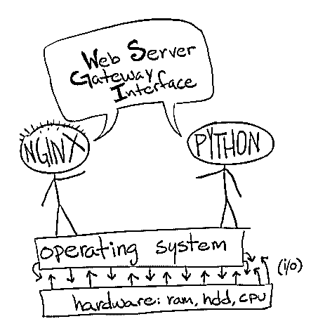
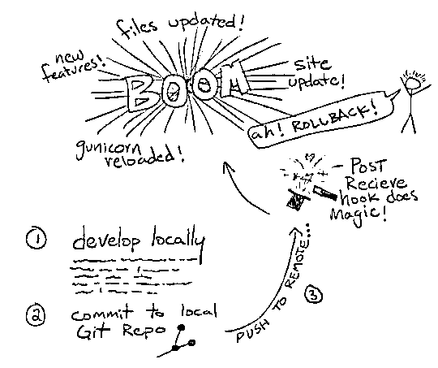

# Ubuntu 上的 kickstarting Flask–设置和部署

> 原文：<https://realpython.com/kickstarting-flask-on-ubuntu-setup-and-deployment/>

本教程详细介绍了如何在运行 Ubuntu 的服务器上安装 Flask 应用程序。

由于这一过程可能会很困难，因为有许多可移动的部分，我们将从多个部分来看这个过程，从最基本的配置开始，逐步向上:

1.  第 1 部分:设置基本配置
2.  第 2 部分:添加主管
3.  第 3 部分:用 Git 挂钩简化部署
4.  第 4 部分:用 Fabric 实现自动化(*)和一个示例视频！*)

*更新:*

*   2014 年 10 月 28 日:添加了如何在 Ubuntu 上添加新用户的信息
*   2015 年 4 月 16 日:更新 nginx 配置

* * *

我们将特别使用:

1.  Ubuntu 14.04
2.  nginx 1.4.6
3.  gunicorn 19.1.1
4.  Python 2.7.8
5.  [Pip 1.5.4](https://realpython.com/what-is-pip/)
6.  virtualenv 1.11.4
7.  烧瓶 0.10.1
8.  主管 3.0b2

假设您已经有了一个运行 Ubuntu 操作系统的 VPS，我们需要在操作系统之上建立一个 web 服务器来为最终用户提供静态文件——比如样式表、JavaScript 文件和图像。我们将使用 nginx 作为我们的网络服务器。由于 web 服务器不能直接与 Flask 通信(错误 Python)，我们将使用 [gunicorn](http://gunicorn.org/) 作为服务器和 Python/Flask 之间的媒介。

等等，为什么我们需要*两台*服务器？想象一下，如果 Gunicorn 作为*应用* web 服务器，将运行在 nginx——前端 web 服务器之后。Gunicorn 与 WSGI 兼容。它可以与其他支持 WSGI 的应用程序对话，比如 Flask 或 Django。

[](https://files.realpython.com/media/flask-nginx-gunicorn-architecture.012eb1c10f5e.jpg)

> 需要访问网络服务器？查看[数字海洋](https://www.digitalocean.com/)、[利诺德](https://www.linode.com/)，或者[亚马逊 EC2](http://aws.amazon.com/ec2/) 。或者，您可以使用[vagger](https://www.vagrantup.com/)来模拟 Linux 环境。该设置在 Digital Ocean 和 Linode 上进行了测试。

最终目标:HTTP 请求从 web 服务器被路由到 Flask，Flask 对其进行适当的处理，然后响应被发送回 web 服务器，最后返回给最终用户。正确实现 Web 服务器网关接口(WSGI)对我们的成功至关重要。

[](https://files.realpython.com/media/flask-wsgi-diagram.4ac512ffe2f6.jpg)

我们开始吧。

## 第 1 部分-设置

让我们进行基本的配置设置。

[*Remove ads*](/account/join/)

### 添加新用户

以“root”用户身份登录服务器后，运行:

```py
$ adduser newuser
$ adduser newuser sudo
```

创建具有“sudo”权限的新用户。

### 安装要求

使用新用户 SSH 进入服务器，然后安装以下软件包:

```py
$ sudo apt-get update
$ sudo apt-get install -y python python-pip python-virtualenv nginx gunicorn
```

### 设置烧瓶

首先创建一个新目录“/home/www”来存储项目:

```py
$ sudo mkdir /home/www && cd /home/www
```

然后创建并激活一个虚拟设备:

```py
$ sudo virtualenv env
$ source env/bin/activate
```

安装要求:

```py
$ sudo pip install Flask==0.10.1
```

现在设置您的项目:

```py
$ sudo mkdir flask_project && cd flask_project
$ sudo vim app.py
```

将以下代码添加到 *app.py* 中:

```py
from flask import Flask, jsonify

app = Flask(__name__)

@app.route('/')
def index():
    return 'Flask is running!'

@app.route('/data')
def names():
    data = {"names": ["John", "Jacob", "Julie", "Jennifer"]}
    return jsonify(data)

if __name__ == '__main__':
    app.run()
```

> 在 VIM 中，按 `I` 进入插入模式。添加代码，然后按 `Esc` 离开插入模式进入命令模式。最后键入“:wq”保存并退出 VIM。

建立一个静态目录-

```py
$ sudo mkdir static
```

-然后用下面的 html 添加一个*index.html*(`sudo vim static/index.html`)文件:

```py
<h1>Test!</h1>
```

[*Remove ads*](/account/join/)

### 配置 nginx

启动 nginx:

```py
$ sudo /etc/init.d/nginx start
```

然后:

```py
$ sudo rm /etc/nginx/sites-enabled/default
$ sudo touch /etc/nginx/sites-available/flask_project
$ sudo ln -s /etc/nginx/sites-available/flask_project /etc/nginx/sites-enabled/flask_project
```

这里，我们删除默认的 nginx 配置，创建一个新的配置文件(名为 *flask_project* )，最后，设置一个指向我们刚刚创建的配置文件的符号链接，以便 nginx 在启动时加载它。

现在，让我们将配置设置添加到 *flask_project* :

```py
$ sudo vim /etc/nginx/sites-enabled/flask_project
```

添加:

```py
server {
    location / {
        proxy_pass http://localhost:8000;
        proxy_set_header Host $host;
        proxy_set_header X-Real-IP $remote_addr;
    }
    location /static {
        alias  /home/www/flask_project/static/;
    }
}
```

因此，到达`/`端点的 HTTP 请求将被“[”反向代理](http://en.wikipedia.org/wiki/Reverse_proxy)到`127.0.0.1`上的端口 8000(或“回环 ip”或“本地主机”)。这是 gunicorn 将使用的相同 IP 和端口。

我们还指出，我们希望 nginx 直接服务于“/home/www/flask _ project/static/”目录中的静态文件，而不是通过 gunicorn/WSGI 路由请求。这将加快我们网站的加载时间，因为 nginx 知道直接服务于该目录。

重启 nginx:

```py
$ sudo /etc/init.d/nginx restart
```

### 利润！

```py
$ cd /home/www/flask_project/
$ gunicorn app:app -b localhost:8000
```

后一个命令在本地主机端口 8000 上手动运行 gunicorn。

打开浏览器，导航至[http://your _ domain _ name _ or _ IP _ address](http://your_domain_name_or_ip_address)。

同样，您应该看到“烧瓶正在运行！”消息。同样测试另一个 URL，`/data`。如果你导航到[http://your _ domain _ name _ or _ IP _ address/static](http://your_domain_name_or_ip_address/static)，你应该会看到“测试！”，表明我们正在正确地提供静态文件。

## 第 2 部分-主管

所以，我们有一个工作瓶应用程序；然而，有一个问题:每次我们对应用程序进行更改时，我们都必须手动(重新)启动 gunicorn。我们可以通过[主管](http://supervisord.org/)来实现自动化。

[*Remove ads*](/account/join/)

### 配置主管

SSH 进入您的服务器，然后安装 Supervisor:

```py
$ sudo apt-get install -y supervisor
```

现在创建一个配置文件:

```py
$ sudo vim /etc/supervisor/conf.d/flask_project.conf
```

添加:

```py
[program:flask_project]
command = gunicorn app:app -b localhost:8000
directory = /home/www/flask_project
user = newuser
```

### 利润！

停止 gunicorn:

```py
$ sudo pkill gunicorn
```

与主管一起启动 gunicorn:

```py
$ sudo supervisorctl reread
$ sudo supervisorctl update
$ sudo supervisorctl start flask_project
```

确保您的应用仍在运行于[http://your _ domain _ name _ or _ IP _ address](http://your_domain_name_or_ip_address)。查看管理员[文档](http://supervisord.org/index.html)了解定制配置信息。

## 第 3 部分-部署

在这最后一部分，我们将看看如何使用 post-receive [Git 钩子](http://git-scm.com/book/en/Customizing-Git-Git-Hooks)和 Git，当然，是为了简化部署过程。

[](https://files.realpython.com/media/git-hooks-diagram.82dd88e5fab2.jpg)

### 配置 Git

再次，SSH 到远程服务器。然后安装 Git:

```py
$ sudo apt-get install -y git
```

现在运行以下命令来设置一个我们可以推送的裸 Git repo:

```py
$ sudo mkdir /home/git && cd /home/git
$ sudo mkdir flask_project.git && cd flask_project.git
$ sudo git init --bare
```

> 快速提示:在提示符下显示 git 分支将有助于提醒您在终端中的位置。
> 
> 考虑将它添加到您的 bash 生产配置文件中:
> 
> ```py
> `parse_git_branch() {
>     git branch 2> /dev/null | sed -e '/^[^*]/d' -e 's/* \(.*\)/ (\1)/'
> }
> 
> export PS1="\u@\h \W\[\033[32m\]\$(parse_git_branch)\[\033[00m\] $ "` 
> ```

[*Remove ads*](/account/join/)

### 配置接收后挂钩*

```py
$ sudo vim hooks/post-receive
```

添加:

```py
#!/bin/sh
GIT_WORK_TREE=/home/www/flask_project git checkout -f
```

现在，每次推送时，新文件都会复制到应用程序目录“/home/www/flask_project”。

然后使文件可执行:

```py
$ sudo chmod +x hooks/post-receive
```

### 利润！

回到您的本地 Flask 目录(“flask_project”)，添加一个新的 Git repo 以及以下远程:

```py
$ git init
$ git remote add production root@<your_ip_or_domain>:/home/git/flask_project.git
```

> 确保更新 IP 或域名。

对 *app.py* 文件中的代码进行一些修改:

```py
@app.route('/data')
def names():
    data = {
        "first_names": ["John", "Jacob", "Julie", "Jennifer"],
        "last_names": ["Connor", "Johnson", "Cloud", "Ray"]
    }
    return jsonify(data)
```

提交您的本地更改，然后按:

```py
$ git add -A
$ git commit -am "initial"
$ git push production master
```

SSH 进入您的服务器，并通过 Supervisor 重启 gunicorn:

```py
$ sudo supervisorctl restart flask_project
```

在[http://your _ domain _ name _ or _ IP _ address/data](http://your_domain_name_or_ip_address/data)查看您的更改。

## 第 4 部分-自动化

您真的想要手动配置服务器吗？当然，它对学习很有帮助，但正如你所知，它超级乏味。幸运的是，我们已经用 [Fabric](http://www.fabfile.org/) 自动化了这个过程。除了设置 nginx、gunicorn、Supervisor 和 Git 之外，该脚本还创建了一个基本的 Flask 应用程序，它特定于我们正在处理的项目。您可以轻松地对其进行定制，以满足您自己的特定需求。

> 您应该从文件中删除用户名和密码，并将它们放在不受版本控制的单独的配置文件中，或者在远程服务器上设置 SSH 密钥，这样您就不需要密码来登录了。另外，一定要将`env.hosts`变量更新为您的 IP 或域名。

[*Remove ads*](/account/join/)

### 设置

为了测试这个脚本( *fabfile.py* )，克隆 [repo](https://github.com/realpython/flask-deploy) 并从一个干净的、刚刚安装了 Ubuntu 14.04 的服务器开始。然后导航到“flask-deploy”目录。要在远程服务器和您的应用程序上设置基本配置，请运行以下命令:

```py
$ fab create
```

您的应用程序现在应该是活动的。在你的浏览器中测试一下。

### 部署

想用 Git 挂钩设置部署吗？初始化 Flask 项目目录中的本地 repo(如果需要)。然后对 Flask 应用程序进行一些本地更改，并运行以下命令进行部署:

```py
$ fab deploy
```

在浏览器中再次检查你的应用。确保您的更改显示出来。

### 状态检查

最后，您可以使用以下命令检查监管进程是否正确运行，以确保您的应用程序是活动的:

```py
$ fab status
```

同样，这个脚本特定于您手头的项目。您可以根据自己的需要对其进行定制，方法是更新 config 部分并根据需要修改任务。

### 回滚

犯错是人之常情…

一旦你有了生产代码，事情肯定会不时出错。在您的本地开发环境中，一切可能都很好，只是在生产中崩溃了。因此，制定一个策略来快速恢复 Git 提交非常重要。快速浏览一下 *fabfile.py* 中的`rollback`任务，它允许你快速恢复更改以备份一个工作应用。

通过故意破坏您的代码来测试它，然后部署到生产环境中，然后运行:

```py
$ fab rollback
```

然后，您可以在本地更新您的代码来修复错误，然后重新部署。

## 示例视频

只需按播放:

[https://www.youtube.com/embed/VmcGuKPpWH8?autoplay=1&modestbranding=1&rel=0&showinfo=0&origin=https://realpython.com](https://www.youtube.com/embed/VmcGuKPpWH8?autoplay=1&modestbranding=1&rel=0&showinfo=0&origin=https://realpython.com)

[*Remove ads*](/account/join/)

## 结论和后续步骤

想让这个工作流程更上一层楼吗？

1.  出于测试目的，在组合中添加一台生产前(试运行)服务器。首先部署到此服务器，它应该是您的生产环境的精确副本，以便在部署到生产环境之前进行测试。
2.  利用持续集成和交付，通过自动化测试进一步消除错误和退化，并减少部署应用所需的时间。

请在下面留下问题和评论。一定要从[回购](https://github.com/realpython/flask-deploy)中抓取代码。******