# Python 中的 k 近邻算法

> 原文：<https://realpython.com/knn-python/>

在本教程中，您将全面了解 Python 中的 k 近邻(kNN)算法。kNN 算法是最著名的[机器学习](https://realpython.com/learning-paths/machine-learning-python/)算法之一，也是你机器学习工具箱中绝对必备的。Python 是机器学习的首选编程语言，那么还有什么比使用 Python 著名的包 [NumPy](https://realpython.com/numpy-tutorial/) 和 [scikit-learn](https://scikit-learn.org/stable/) 更好的方法来发现 kNN 呢！

下面，您将从理论和实践两方面探索 kNN 算法。虽然许多教程跳过了理论部分，只关注库的使用，但你不想依赖自动化包来进行机器学习。了解机器学习算法的机制以理解它们的潜力和局限性是很重要的。

同时，理解如何在实践中使用一个算法是很重要的。记住这一点，在本教程的第二部分，您将重点关注在 Python 库 scikit-learn 中使用 kNN，以及将性能提升到最高的高级技巧。

**在本教程中，您将学习如何:**

*   从直观和数学的角度解释 kNN 算法
*   使用 **NumPy** 从头开始用 Python **实现 kNN**
*   在 Python 中使用 kNN 和 **scikit-learn**
*   使用`GridSearchCV`调整 kNN 的**超参数**
*   将**打包**添加到 kNN 以获得更好的性能

**免费奖励:** [点击此处获取免费的 NumPy 资源指南](#)，它会为您指出提高 NumPy 技能的最佳教程、视频和书籍。

## 机器学习的基础知识

为了让你参与进来，有必要后退一步，做一个关于**机器学习**的总体快速调查。在本节中，您将了解机器学习背后的基本思想，并且您将看到 kNN 算法如何与其他机器学习工具相关联。

机器学习的总体思想是获得一个模型，从任何主题的历史数据中学习趋势，并能够在未来的可比数据上重现这些趋势。这是一个概述基本机器学习过程的图表:

[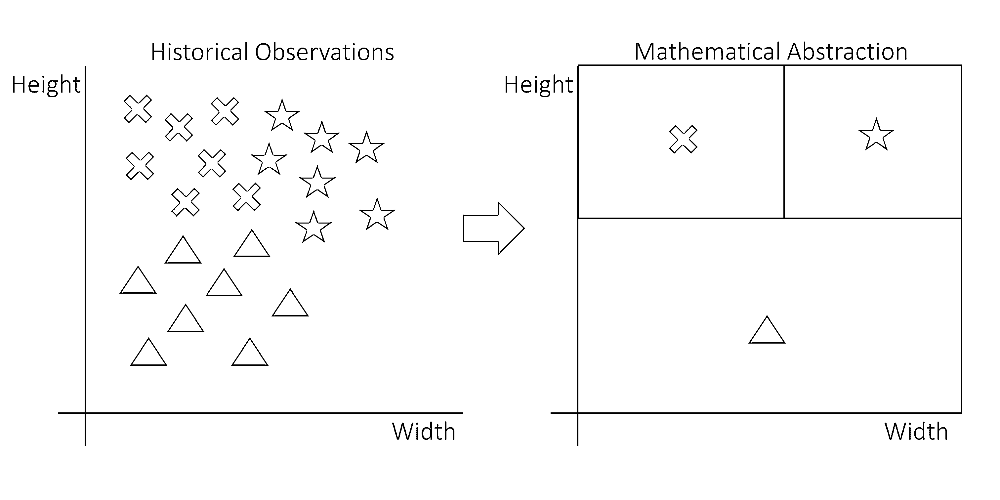](https://files.realpython.com/media/knn_01_MLgeneral_wide.74e5e2dc1094.png)

该图是拟合历史数据的机器学习模型的可视化表示。左边是具有三个变量的原始观测值:高度、宽度和形状。形状有星形、十字形和三角形。

这些形状位于图表的不同区域。在右边，您可以看到那些原始的观察结果是如何被转化为决策规则的。对于新的观察，您需要知道宽度和高度，以确定它落在哪个方块中。反过来，它所在的正方形决定了它最有可能具有的形状。

许多不同的模型可以用于这项任务。**模型**是一个数学公式，可以用来描述数据点。一个例子是[线性模型](https://en.wikipedia.org/wiki/Linear_model)，它使用由公式`y = ax + b`定义的[线性函数](https://en.wikipedia.org/wiki/Linear_function)。

如果你估算，或者说**拟合**，一个模型，你就可以用某种算法找到固定参数的最优值。在线性模型中，参数为`a`和`b`。幸运的是，你不必发明这样的估算算法来开始。他们已经被伟大的数学家发现了。

一旦模型被估计出来，它就变成了一个数学公式，在这个公式中你可以填入自变量的值来预测目标变量。从一个高层次的角度来看，这就是所发生的一切！

[*Remove ads*](/account/join/)

## kNN 的区别特征

既然你理解了机器学习背后的基本思想，下一步就是理解为什么会有这么多可用的模型。你刚才看到的线性模型叫做[线性回归](https://realpython.com/linear-regression-in-python/)。

线性回归在某些情况下有效，但并不总能做出非常精确的预测。这就是为什么数学家提出了许多可供选择的机器学习模型，你可以使用。k 近邻算法就是其中之一。

所有这些模型都有其独特之处。如果你从事机器学习，你应该对它们都有深刻的理解，这样你才能在正确的情况下使用正确的模型。为了理解为什么以及何时使用 kNN，接下来您将看看 kNN 与其他机器学习模型相比如何。

### kNN 是一种有监督的机器学习算法

机器学习算法的第一个决定性属性是**监督的**和**非监督的**模型之间的分裂。有监督和无监督模型的区别在于**问题陈述**。

在监督模型中，您同时有两种类型的变量:

1.  一个**目标变量**，也称为因变量或`y`变量。
2.  **自变量**，又称`x`变量或解释变量。

目标变量是您想要预测的变量。它取决于独立变量，这不是你事先知道的。自变量是你提前知道的变量。你可以把它们代入一个方程来预测目标变量。这样的话，就比较类似于`y = ax + b`的案例了。

在您之前看到的图表以及本节的后续图表中，目标变量是数据点的形状，自变量是高度和宽度。您可以在下图中看到监督学习背后的思想:

[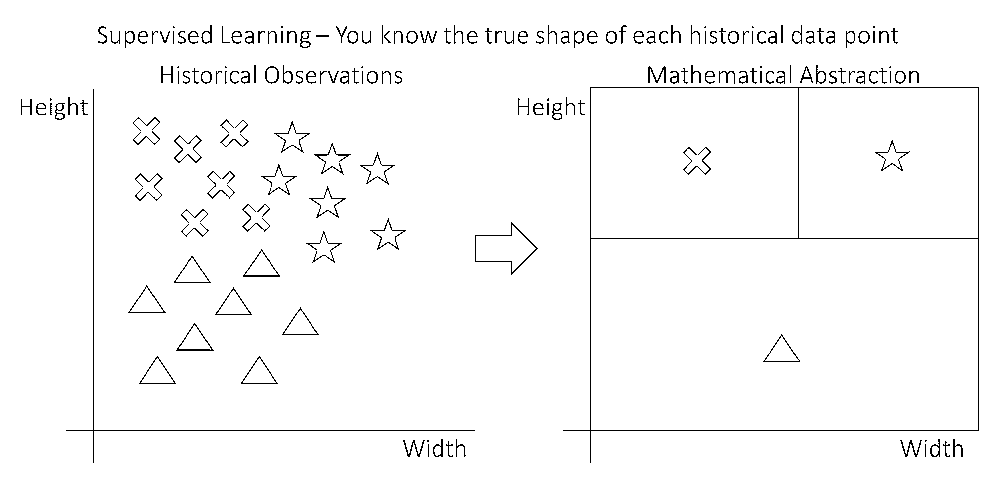](https://files.realpython.com/media/knn_02_MLsupervised_wide.aa50e6348ca4.png)

在该图中，每个数据点都具有高度、宽度和形状。有十字形、星形和三角形。右边是机器学习模型可能已经学会的决策规则。

在这种情况下，标有叉号的观测值高但不宽。星星又高又宽。三角形很短，但可以很宽或很窄。本质上，该模型已经学习了一个判定规则，仅基于其高度和宽度来判定一个观察值更可能是十字形、星形还是三角形。

在无监督的模型中，目标变量和自变量之间没有分割。无监督学习试图通过评估数据点的相似性来对其进行分组。

正如您在示例中看到的，您永远无法确定分组后的数据点从根本上属于同一个组，但是只要分组有意义，它在实践中就非常有价值。您可以在下图中看到无监督学习背后的想法:

[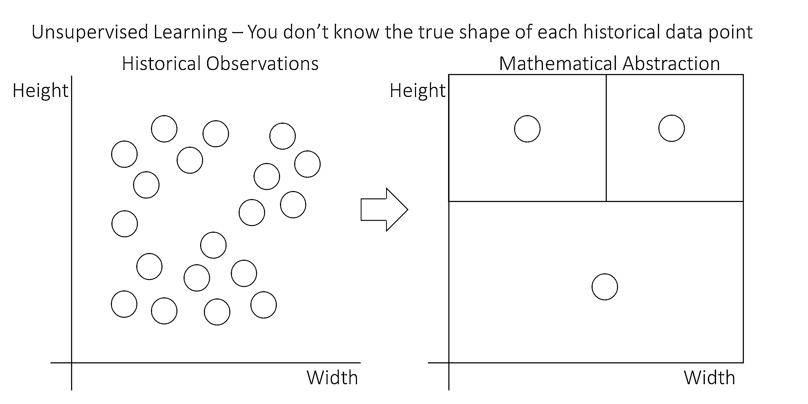](https://files.realpython.com/media/knn_03_MLunsupervised_wide.a6fd142b42de.png)

在这张图中，观察值不再有不同的形状。都是圈子。然而，它们仍然可以根据点与点之间的距离分为三组。在这个特定的示例中，有三个点簇可以根据它们之间的空白空间进行分离。

kNN 算法是一种受监督的机器学习模型。这意味着它使用一个或多个独立变量来预测目标变量。

要了解更多关于无监督机器学习模型的信息，请查看[Python 中的 K-Means 聚类:实用指南](https://realpython.com/k-means-clustering-python/)。

### kNN 是一种非线性学习算法

在机器学习算法中造成巨大差异的第二个属性是模型是否可以估计**非线性关系**。

**线性模型**是使用直线或[超平面](https://en.wikipedia.org/wiki/Hyperplane)进行预测的模型。在图像中，模型被描绘为在点之间绘制的线。模型`y = ax + b`是线性模型的经典例子。您可以在下面的示意图中看到线性模型如何拟合示例数据:

[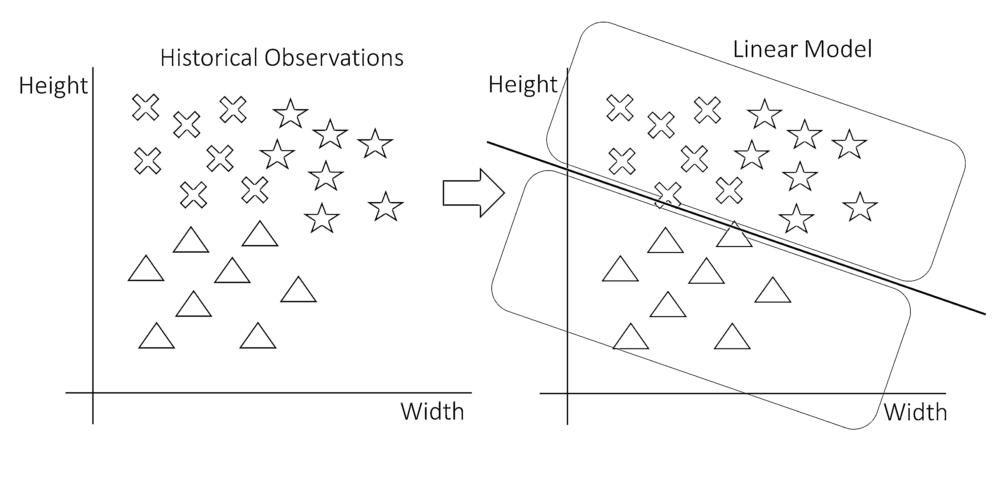](https://files.realpython.com/media/knn_04_MLlinear_wide.05d1160927c7.png)

在此图中，数据点在左侧用星形、三角形和十字形表示。右边是一个线性模型，可以把三角形和非三角形分开。决定是一条线。线上的每一点都是非三角形，线下的一切都是三角形。

如果您想要将另一个独立变量添加到前面的图形中，您需要将它绘制为一个额外的维度，从而创建一个立方体，其中包含这些形状。然而，一条线不可能把一个立方体分成两部分。线的多维对应物是**超平面**。因此，线性模型由超平面表示，在二维空间的情况下，超平面恰好是一条线。

**非线性模型**是使用除直线之外的任何方法来分离案例的模型。一个众所周知的例子是**决策树**，它基本上是一长串 if … else 语句。在非线性图中，if … else 语句允许你画正方形或任何你想画的其他形状。下图描述了应用于示例数据的非线性模型:

[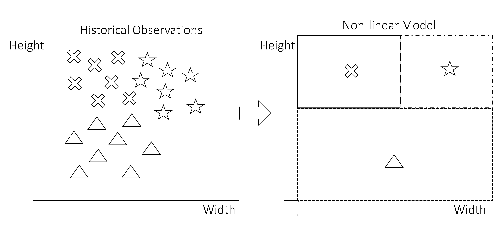](https://files.realpython.com/media/knn_05_MLnonlinear_wide.5f554e71c368.png)

这张图显示了决策是如何非线性的。决策规则由三个方块组成。新数据点所在的方框将定义其预测形状。请注意，使用一条线不可能一次安装完毕:需要两条线。可以使用 if … else 语句重新创建此模型，如下所示:

*   如果数据点的高度很低，那么它就是一个三角形。
*   否则，如果数据点的宽度较低，则它是一个十字。
*   否则，如果以上都不成立，那就是明星。

kNN 是非线性模型的一个例子。在本教程的后面，您将回到计算模型的确切方式。

[*Remove ads*](/account/join/)

### kNN 是分类和回归的监督学习器

监督机器学习算法可以根据它们可以预测的目标变量的类型分为两组:

1.  **分类**是一个带有*分类*目标变量的预测任务。分类模型学习如何对任何新的观察结果进行分类。这个分配的类可以是对的，也可以是错的，不能介于两者之间。分类的一个经典例子是[虹膜数据集](https://en.wikipedia.org/wiki/Iris_flower_data_set)，其中你使用植物的物理测量来预测它们的种类。可以用于分类的一个著名算法是[逻辑回归](https://realpython.com/logistic-regression-python/)。

2.  **回归**是目标变量为*数值*的预测任务。一个著名的回归例子是卡格尔上的[房价挑战。在这场机器学习竞赛中，参与者试图根据众多独立变量来预测房屋的销售价格。](https://www.kaggle.com/c/house-prices-advanced-regression-techniques)

在下图中，您可以使用前面的示例来查看回归和分类的情况:

[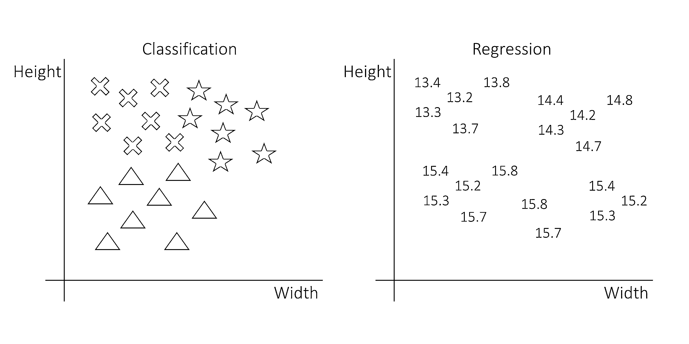](https://files.realpython.com/media/knn_06_MLclassificationregression.6029d11323aa.png)

这张图片的左边部分是一个分类。目标变量是观察的形状，这是一个分类变量。右边部分是一个回归。目标变量是数字。对于这两个例子，决策规则可能完全相同，但是它们的解释是不同的。

对于单个预测，分类要么是对的，要么是错的，而回归在连续的尺度上有误差。拥有一个数值误差度量更为实际，因此许多分类模型不仅预测类别，还预测属于任一类别的概率。

有的模型只能做回归，有的只能做分类，有的两者都可以。kNN 算法无缝地适应分类和回归。在本教程的下一部分中，您将确切地了解这是如何工作的。

### kNN 快速且可解释

作为表征机器学习模型的最后一个标准，你需要考虑**模型的复杂性**。机器学习，尤其是[人工智能](https://realpython.com/python-ai-neural-network/)，目前正在蓬勃发展，并被用于许多复杂的任务，如理解文本、图像和语音，或用于无人驾驶汽车。

像[神经网络](https://realpython.com/pytorch-vs-tensorflow/)这样更先进和复杂的模型可能可以学习 k-最近邻模型可以学习的任何东西。毕竟那些高级模特都是很强的学习者。但是，要知道这种复杂性也是有代价的。为了使模型符合您的预测，您通常会在开发上花费更多的时间。

你还需要更多的数据来适应更复杂的模型，而数据并不总是可用的。最后但同样重要的是，更复杂的模型对我们人类来说更难解释，有时这种解释可能非常有价值。

这就是 kNN 模型的力量所在。它允许用户理解和解释模型内部发生的事情，并且开发速度非常快。这使得 kNN 成为许多不需要高度复杂技术的机器学习用例的伟大模型。

### kNN 的缺点

诚实地承认 kNN 算法的缺点也是公平的。如前所述，kNN 的真正缺点是它适应自变量和因变量之间高度复杂关系的能力。kNN 不太可能在高级任务上表现良好，如计算机视觉和自然语言处理。

你可以试着尽可能地提高 kNN 的性能，潜在地通过添加机器学习的其他技术。在本教程的最后一部分，您将看到一种叫做 **bagging** 的技术，这是一种提高预测性能的方法。然而，在某种复杂程度上，无论如何调整，kNN 都可能不如其他模型有效。

## 用 kNN 预测海蛞蝓的年龄

为了跟随编码部分，您将在本教程的剩余部分看到一个示例数据集——鲍鱼数据集。该数据集包含大量鲍鱼的年龄测量值。仅供参考，这是鲍鱼的样子:

[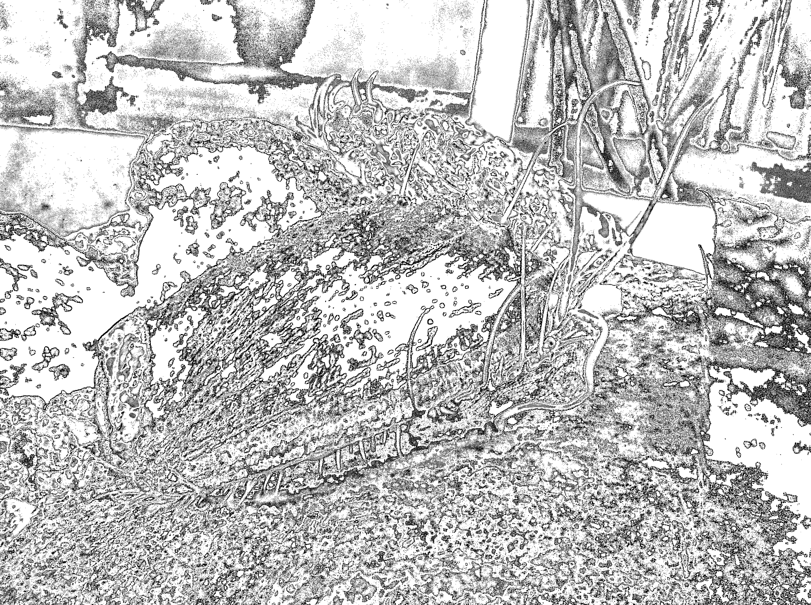](https://files.realpython.com/media/LivingAbalone.b5330a55f159.jfif)

<figcaption class="figure-caption text-center">[Image source](https://en.wikipedia.org/wiki/File:LivingAbalone.JPG)</figcaption>

鲍鱼是小海螺，看起来有点像贻贝。如果你想了解更多，你可以查看鲍鱼维基百科页面获取更多信息。

[*Remove ads*](/account/join/)

### 鲍鱼问题声明

切开鲍鱼的壳，数一下壳上的年轮数，就可以知道鲍鱼的年龄。在鲍鱼数据集中，您可以找到大量鲍鱼的年龄测量值以及许多其他物理测量值。

该项目的目标是开发一个模型，可以完全基于其他物理测量来预测鲍鱼的年龄。这将允许研究人员估计鲍鱼的年龄，而不必切开它的壳和数年轮。

您将应用 kNN 来找到最接近的预测分数。

### 导入鲍鱼数据集

在本教程中，您将使用[鲍鱼数据集](https://archive.ics.uci.edu/ml/datasets/abalone)。你可以下载它并使用 [pandas](https://realpython.com/learning-paths/pandas-data-science/) 将数据导入 Python，但是让 pandas 直接为你导入数据会更快。

为了遵循本教程中的代码，建议安装带有 [Anaconda](https://anaconda.com/) 的 Python。Anaconda 发行版附带了许多重要的数据科学包。要获得更多关于设置环境的帮助，你可以查看[在 Windows 上设置 Python 进行机器学习](https://realpython.com/python-windows-machine-learning-setup/)。

您可以使用 pandas 导入数据，如下所示:

>>>

```py
>>> import pandas as pd
>>> url = (
...     "https://archive.ics.uci.edu/ml/machine-learning-databases"
...     "/abalone/abalone.data"
... )
>>> abalone = pd.read_csv(url, header=None)
```

在这段代码中，首先[导入](https://realpython.com/python-import/) pandas，然后用它来读取数据。您将路径指定为 URL，这样就可以通过 Internet 直接获取文件。

为了确保您正确导入了数据，您可以进行如下快速检查:

>>>

```py
>>> abalone.head()
 0      1      2      3       4       5       6      7   8
0  M  0.455  0.365  0.095  0.5140  0.2245  0.1010  0.150  15
1  M  0.350  0.265  0.090  0.2255  0.0995  0.0485  0.070   7
2  F  0.530  0.420  0.135  0.6770  0.2565  0.1415  0.210   9
3  M  0.440  0.365  0.125  0.5160  0.2155  0.1140  0.155  10
4  I  0.330  0.255  0.080  0.2050  0.0895  0.0395  0.055   7
```

这应该会显示鲍鱼数据集的前五行，在 Python 中作为熊猫[数据帧](https://realpython.com/pandas-dataframe/)导入。您可以看到列名仍然缺失。你可以在 UCI 机器学习库的 [`abalone.names`](https://archive.ics.uci.edu/ml/machine-learning-databases/abalone/) 文件中找到这些名字。您可以将它们添加到您的`DataFrame`中，如下所示:

>>>

```py
>>> abalone.columns = [
...     "Sex",
...     "Length",
...     "Diameter",
...     "Height",
...     "Whole weight",
...     "Shucked weight",
...     "Viscera weight",
...     "Shell weight",
...     "Rings",
... ]
```

导入的数据现在应该更容易理解了。但是还有一件你应该做的事情:你应该删除`Sex`列。当前练习的目标是使用物理测量来预测鲍鱼的年龄。因为性不是一个纯粹的物理测量，你应该把它从数据集中删除。您可以使用`.drop`删除`Sex`列:

>>>

```py
>>> abalone = abalone.drop("Sex", axis=1)
```

使用这段代码，您删除了`Sex`列，因为它在建模中没有附加值。

### 鲍鱼数据集的描述性统计数据

在进行机器学习时，你需要对你正在处理的数据有一个概念。在不深入研究的情况下，让我们看看一些探索性的统计数据和图表。

这个练习的目标变量是`Rings`，可以从那个开始。一个[直方图](https://realpython.com/python-histograms/)将会给你一个快速而有用的年龄范围概览:

>>>

```py
>>> import matplotlib.pyplot as plt
>>> abalone["Rings"].hist(bins=15)
>>> plt.show()
```

这段代码使用 [pandas 绘图功能](https://realpython.com/pandas-plot-python/)来生成一个包含 15 个条块的直方图。使用 15 个箱的决定是基于几次试验。当定义箱的数量时，通常要尽量使每个箱的观测值既不太多也不太少。太少的面元会隐藏某些图案，而太多的面元会使直方图缺乏平滑度。您可以在下图中看到直方图:

[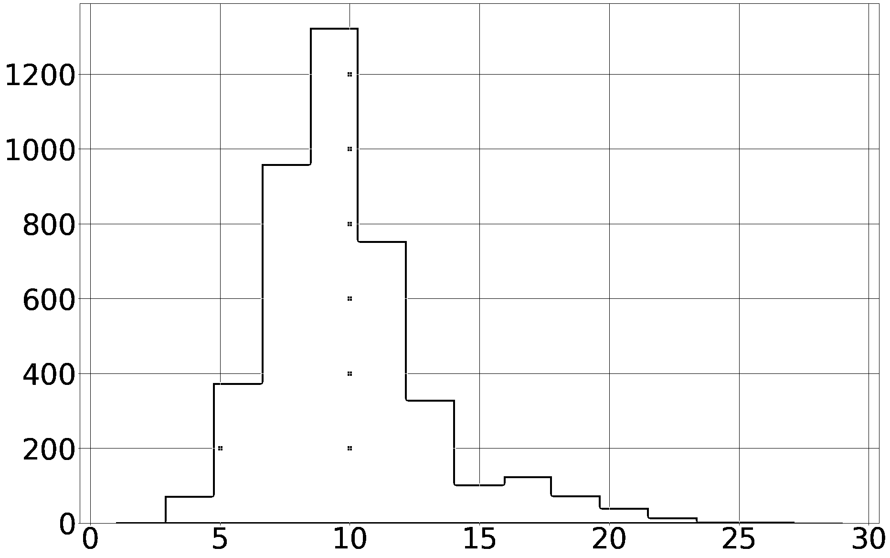](https://files.realpython.com/media/rings_histogram.5b9d67ebae30.png)

直方图显示，数据集中的大多数鲍鱼有 5 到 15 个环，但也有可能达到 25 个环。较老的鲍鱼在这个数据集中代表性不足。这看起来很直观，因为年龄分布通常由于自然过程而像这样偏斜。

第二个相关的探索是找出哪些变量(如果有的话)与年龄有很强的相关性。自变量和你的目标变量之间的强相关性是一个好的迹象，因为这将证实身体测量和年龄是相关的。

在`correlation_matrix`中可以观察到完整的相关矩阵。最重要的相关性是与目标变量`Rings`的相关性。你可以得到这样的关联:

>>>

```py
>>> correlation_matrix = abalone.corr()
>>> correlation_matrix["Rings"]
Length            0.556720
Diameter          0.574660
Height            0.557467
Whole weight      0.540390
Shucked weight    0.420884
Viscera weight    0.503819
Shell weight      0.627574
Rings             1.000000
Name: Rings, dtype: float64
```

现在看看`Rings`与其他变量的相关系数。离`1`越近，相关性越大。

你可以得出结论，成年鲍鱼的身体测量和它们的年龄之间至少有一些相关性，但也不是很高。非常高的相关性意味着你可以期待一个简单的建模过程。在这种情况下，您必须尝试看看使用 kNN 算法可以获得什么结果。

使用熊猫进行数据探索有更多的可能性。要了解更多关于熊猫的数据探索，请查看[使用熊猫和 Python 探索您的数据集](https://realpython.com/pandas-python-explore-dataset/)。

[*Remove ads*](/account/join/)

## Python 中从头开始的一步一步的 kNN

在教程的这一部分，你将会发现 kNN 算法是如何工作的。这个算法有两个你需要理解的主要数学部分。为了热身，您将从 kNN 算法的简单英语演练开始。

### kNN 算法的简单英语演练

与其他机器学习算法相比，kNN 算法有点不典型。正如你之前看到的，每个机器学习模型都有其特定的公式需要估计。k-最近邻算法的特殊性在于，该公式不是在拟合时计算的，而是在预测时计算的。这不是大多数其他模型的情况。

当一个新的数据点到达时，kNN 算法，顾名思义，将从寻找这个新数据点的最近邻居开始。然后，它获取这些邻居的值，并将它们用作新数据点的预测。

作为一个直观的例子，想想你的邻居。你的邻居往往和你比较相似。他们可能和你在同一个社会经济阶层。也许他们和你是一个类型的工作，也许他们的孩子和你上同一所学校，等等。但是对于某些任务，这种方法并不那么有用。例如，通过观察你邻居最喜欢的颜色来预测你的颜色是没有任何意义的。

kNN 算法基于这样一个概念，即您可以根据相邻数据点的特征来预测数据点的特征。在某些情况下，这种预测方法可能会成功，而在其他情况下，它可能不会成功。接下来，您将了解数据点“最近”的数学描述，以及将多个相邻点合并到一个预测中的方法。

### 使用距离的数学定义定义“最近的”

要找到最接近您需要预测的点的数据点，您可以使用距离的数学定义，称为[欧几里德距离](https://en.wikipedia.org/wiki/Euclidean_distance)。

为了得到这个定义，你应该首先理解两个向量的**差**是什么意思。这里有一个例子:

[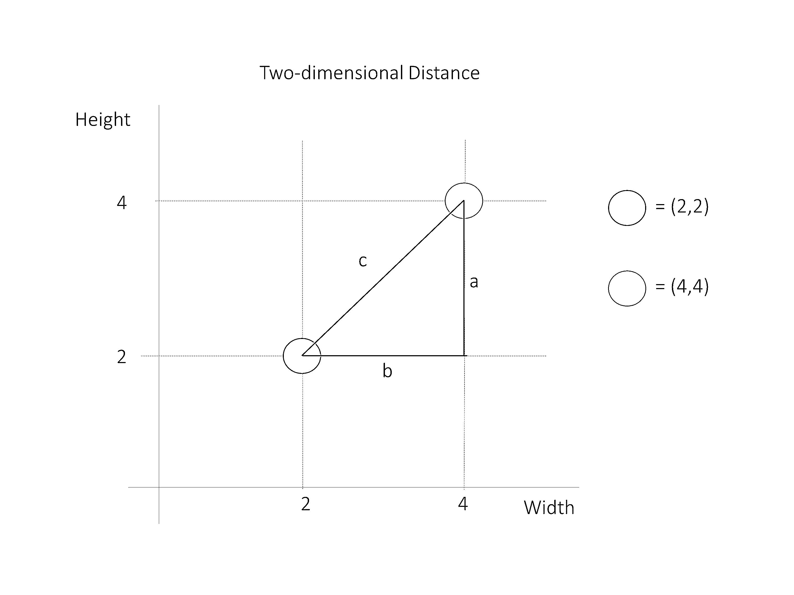](https://files.realpython.com/media/knn_pytagoras.78c35cf28a3d.png)

在这张图片中，您可以看到两个数据点:蓝色在(2，2)，绿色在(4，4)。要计算它们之间的距离，可以从添加两个向量开始。向量`a`从点(4，2)到点(4，4)，向量`b`从点(4，2)到点(2，2)。他们的头用彩色点表示。请注意，它们呈 90 度角。

这些向量之间的差就是向量`c`，它从向量`a`的头部到向量`b`的头部。向量`c`的长度代表你的两个数据点之间的距离。

向量的长度叫做**范数**。范数是一个正值，表示向量的大小。您可以使用欧几里得公式计算向量的范数:

[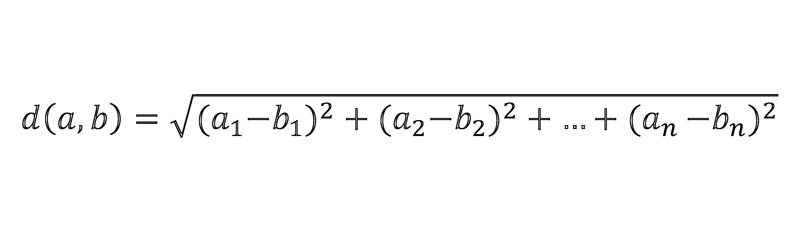](https://files.realpython.com/media/euclidean_distance.5b5fe10e9fa0.png)

在这个公式中，距离是通过计算每个维度的平方差，然后计算这些值之和的[平方根](https://realpython.com/python-square-root-function/)来计算的。在这种情况下，您应该计算差向量`c`的范数，以获得数据点之间的距离。

现在，要将它应用到您的数据中，您必须理解您的数据点实际上是向量。然后，您可以通过计算差向量的范数来计算它们之间的距离。

您可以使用 NumPy 中的`linalg.norm()`在 Python 中进行计算。这里有一个例子:

>>>

```py
>>> import numpy as np
>>> a = np.array([2, 2])
>>> b = np.array([4, 4])
>>> np.linalg.norm(a - b)
2.8284271247461903
```

在这个代码块中，您将数据点定义为向量。然后计算两个数据点之间的差值`norm()`。这样，你就直接获得了两个多维点之间的距离。即使这些点是多维的，它们之间的距离仍然是一个标量，或者说是一个单一的值。

如果你想获得更多数学上的细节，你可以看看[勾股定理](https://en.wikipedia.org/wiki/Pythagorean_theorem)来了解欧几里德距离公式是如何推导出来的。

[*Remove ads*](/account/join/)

### 找到最近的邻居

既然您已经有了一种计算任意点到任意点的距离的方法，那么您就可以使用这种方法来查找您想要进行预测的点的最近邻。

你需要找到一些邻居，这个数字由`k`给出。`k`的最小值是`1`。这意味着只使用一个邻居进行预测。最大值是您拥有的数据点的数量。这意味着使用所有邻居。`k`的值是用户定义的。优化工具可以帮助你做到这一点，你会在本教程的最后一部分看到。

现在，要查找 NumPy 中的最近邻，请返回鲍鱼数据集。正如您所看到的，您需要在独立变量的向量上定义距离，因此您应该首先使用`.values`属性将 pandas 数据帧放入一个 NumPy 数组:

>>>

```py
>>> X = abalone.drop("Rings", axis=1)
>>> X = X.values
>>> y = abalone["Rings"]
>>> y = y.values
```

这个代码块生成了两个包含您的数据的对象:`X`和`y`。`X`是模型的自变量，`y`是模型的因变量。请注意，`X`用大写字母，而`y`用小写字母。这通常在机器学习代码中完成，因为数学符号通常使用大写字母表示矩阵，小写字母表示向量。

现在，您可以对具有以下物理测量值的新鲍鱼应用具有`k` = 3 的 kNN:

| 可变的 | 价值 |
| --- | --- |
| 长度 | 0.569552 |
| 直径 | 0.446407 |
| 高度 | 0.154437 |
| 整体重量 | 1.016849 |
| 震惊重量 | 0.439051 |
| 内脏重量 | 0.222526 |
| 外壳重量 | 0.291208 |

您可以为该数据点创建 NumPy 数组，如下所示:

>>>

```py
>>> new_data_point = np.array([
...     0.569552,
...     0.446407,
...     0.154437,
...     1.016849,
...     0.439051,
...     0.222526,
...     0.291208,
... ])
```

下一步是使用以下代码计算这个新数据点和鲍鱼数据集中每个数据点之间的距离:

>>>

```py
>>> distances = np.linalg.norm(X - new_data_point, axis=1)
```

现在你有了一个距离向量，你需要找出哪三个是最近的邻居。为此，您需要找到最小距离的 id。您可以使用名为`.argsort()`的方法从最低到最高对数组进行排序，并且您可以获取第一个`k`元素来获得`k`最近邻居的索引:

>>>

```py
>>> k = 3
>>> nearest_neighbor_ids = distances.argsort()[:k]
>>> nearest_neighbor_ids
array([4045, 1902, 1644], dtype=int32)
```

这会告诉你哪三个邻居离你的`new_data_point`最近。在下一段中，您将看到如何在估算中转换这些邻居。

### 多个邻居的投票或平均

确定了年龄未知的鲍鱼的三个最近邻居的指数后，现在需要将这些邻居合并到新数据点的预测中。

作为第一步，你需要找到这三个邻居的基本事实:

>>>

```py
>>> nearest_neighbor_rings = y[nearest_neighbor_ids]
>>> nearest_neighbor_rings
array([ 9, 11, 10])
```

现在您已经有了这三个相邻点的值，您可以将它们组合成新数据点的预测。对于回归和分类而言，将邻域合并到预测中的工作方式不同。

[*Remove ads*](/account/join/)

### 回归平均值

在回归问题中，目标变量是数字。通过取目标变量的平均值，可以将多个邻居组合成一个预测。您可以这样做:

>>>

```py
>>> prediction = nearest_neighbor_rings.mean()
```

你将得到`prediction`的值`10`。这意味着新数据点的 3-最近邻预测是`10`。你可以为你想要的任何数量的新鲍鱼做同样的事情。

### 分类模式

在分类问题中，目标变量是明确的。如前所述，你不能对分类变量取平均值。例如，三个预测的汽车品牌的平均值是多少？那是不可能说的。你不能对班级预测进行平均。

相反，在分类的情况下，你采取**模式**。众数是最常出现的值。这意味着您统计了所有邻居的类，并且您保留了最常见的类。预测是在邻居中最常出现的值。

如果有多种模式，就有多种可能的解决方案。你可以从获胜者中随机选择一个最终的获胜者。您也可以根据相邻点的距离做出最终决定，在这种情况下，将保留最近相邻点的模式。

您可以使用 [SciPy](https://realpython.com/python-scipy-cluster-optimize/) `mode()`函数计算模式。由于鲍鱼示例不是分类的例子，下面的代码显示了如何计算玩具示例的模式:

>>>

```py
>>> import scipy.stats
>>> class_neighbors = np.array(["A", "B", "B", "C"])
>>> scipy.stats.mode(class_neighbors)
ModeResult(mode=array(['B'], dtype='<U1'), count=array([2]))
```

如您所见，本例中的模式是`"B"`，因为它是输入数据中出现频率最高的值。

## 使用 scikit-learn 在 Python 中拟合 kNN

虽然从零开始编写算法对于学习来说是很好的，但在处理机器学习任务时通常不太实际。在本节中，您将探索 scikit-learn 中使用的 kNN 算法的实现，sci kit-learn 是 Python 中最全面的机器学习包之一。

### 将数据分为训练集和测试集，用于模型评估

在本节中，您将评估鲍鱼 kNN 模型的质量。在前面的部分中，您有一个技术焦点，但是现在您将有一个更加务实和以结果为导向的观点。

评估模型有多种方法，但最常用的是训练测试分割。当使用训练测试分割进行模型评估时，将数据集分割为两部分:

1.  **训练数据**用于拟合模型。对于 kNN 来说，这意味着训练数据将被用作邻居。
2.  **测试数据**用于评估模型。这意味着你将预测测试数据中每只鲍鱼的环数，并将这些结果与已知的真实环数进行比较。

您可以使用 [scikit-learn 的内置`train_test_split()`](https://realpython.com/train-test-split-python-data/) 在 Python 中将数据分成训练集和测试集:

>>>

```py
>>> from sklearn.model_selection import train_test_split
>>> X_train, X_test, y_train, y_test = train_test_split(
...     X, y, test_size=0.2, random_state=12345
... )
```

`test_size`指的是您想要放入训练数据和测试数据中的观察值的数量。如果您指定一个`0.2`的`test_size`，那么您的`test_size`将是原始数据的 20 %,因此剩下的 80%作为训练数据。

`random_state`是一个参数，允许您在每次运行代码时获得相同的结果。`train_test_split()`对数据进行随机分割，这对于重现结果是有问题的。因此，使用`random_state`是很常见的。`random_state`中值的选择是任意的。

在上面的代码中，您将数据分为定型数据和测试数据。这是客观模型评估所需要的。现在，您可以使用 scikit-learn 在训练数据上拟合 kNN 模型。

[*Remove ads*](/account/join/)

### 将 scikit-learn 中的 kNN 回归拟合到鲍鱼数据集

要适应 scikit-learn 中的模型，首先要创建正确类的模型。此时，您还需要选择超参数的值。对于 kNN 算法，您需要选择`k`的值，这在 scikit-learn 实现中称为`n_neighbors`。以下是在 Python 中实现这一点的方法:

>>>

```py
>>> from sklearn.neighbors import KNeighborsRegressor
>>> knn_model = KNeighborsRegressor(n_neighbors=3)
```

您用`knn_model`创建了一个不适合的模型。该模型将使用三个最近邻来预测未来数据点的值。若要将数据放入模型中，您可以将模型放入定型数据集:

>>>

```py
>>> knn_model.fit(X_train, y_train)
```

使用`.fit()`，你让模型从数据中学习。此时，`knn_model`包含了对新的鲍鱼数据点进行预测所需的一切。这就是使用 Python 拟合 kNN 回归所需的全部代码！

### 使用 scikit-learn 检查模型拟合度

然而，仅仅拟合一个模型是不够的。在这一节中，您将看到一些可以用来评估适合度的函数。

有许多评估指标可用于回归，但您将使用最常见的一个，即[均方根误差(RMSE)](https://en.wikipedia.org/wiki/Root-mean-square_deviation) 。预测的 RMSE 计算如下:

1.  计算每个数据点的实际值和预测值之间的差异。
2.  对于每个差值，取这个差值的平方。
3.  对所有的平方差求和。
4.  取总和的平方根。

首先，您可以评估训练数据的预测误差。这意味着你用训练数据进行预测，所以你知道结果应该是比较好的。您可以使用下面的代码来获取 RMSE:

>>>

```py
>>> from sklearn.metrics import mean_squared_error
>>> from math import sqrt
>>> train_preds = knn_model.predict(X_train)
>>> mse = mean_squared_error(y_train, train_preds)
>>> rmse = sqrt(mse)
>>> rmse
1.65
```

在这段代码中，您使用您在前面的代码块中安装的`knn_model`来计算 RMSE。你现在根据训练数据计算 RMSE。为了获得更真实的结果，您应该评估模型中未包含的数据的性能。这就是你现在保持测试集独立的原因。您可以使用与之前相同的功能在测试集上评估预测性能:

>>>

```py
>>> test_preds = knn_model.predict(X_test)
>>> mse = mean_squared_error(y_test, test_preds)
>>> rmse = sqrt(mse)
>>> rmse
2.37
```

在这个代码块中，您评估模型尚不知道的数据上的错误。这个更加真实的 RMSE 比以前稍微高了一点。RMSE 测量的是预测年龄的平均误差，所以你可以把它理解为平均误差为`1.65`年。从`2.37`年到`1.65`年的改善是好是坏取决于具体情况。至少你越来越接近正确估计年龄了。

到目前为止，您只使用了开箱即用的 scikit-learn 算法。您还没有对超参数进行任何调整，也没有对`k`进行随机选择。您可以观察到训练数据上的 RMSE 和测试数据上的 RMSE 之间存在相对较大的差异。这意味着该模型在训练数据上受到[过度拟合](https://en.wikipedia.org/wiki/Overfitting)的影响:它不能很好地概括。

这一点没什么好担心的。在下一部分中，您将看到如何使用各种调优方法来优化**预测误差**或测试误差。

### 绘制模型的拟合图

在开始改进模型之前，最后要看的是模型的实际拟合度。要了解模型所了解的内容，您可以使用 Matplotlib 可视化您的预测:

>>>

```py
>>> import seaborn as sns
>>> cmap = sns.cubehelix_palette(as_cmap=True)
>>> f, ax = plt.subplots()
>>> points = ax.scatter(
...     X_test[:, 0], X_test[:, 1], c=test_preds, s=50, cmap=cmap
... )
>>> f.colorbar(points)
>>> plt.show()
```

在这个代码块中，您使用 [Seaborn](https://seaborn.pydata.org/) 通过子集化数组`X_test[:,0]`和`X_test[:,1]`来创建第一列和第二列`X_test`的散点图。请记住，前两列是`Length`和`Diameter`。正如你在相关表中看到的，它们有很强的相关性。

您使用`c`来指定预测值(`test_preds`)应该被用作颜色条。参数`s`用于指定散点图中点的大小。你使用`cmap`来指定`cubehelix_palette`颜色图。要了解更多关于使用 Matplotlib 绘图的信息，请查看 [Python 使用 Matplotlib 绘图](https://realpython.com/python-matplotlib-guide/)。

使用上面的代码，您将得到下图:

[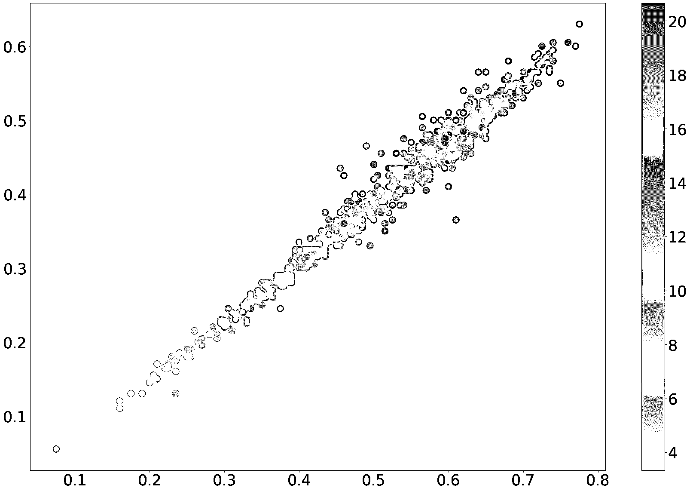](https://files.realpython.com/media/first_scatter.dd9e9b8454b9.png)

在该图中，每个点是来自测试组的鲍鱼，其实际长度和实际直径分别在 X 轴和 Y 轴上。点的颜色反映了预测的年龄。你可以看到鲍鱼越长越大，它的预测年龄就越高。这是符合逻辑的，也是积极的信号。这意味着你的模型正在学习一些看起来正确的东西。

要确认这种趋势是否存在于实际鲍鱼数据中，您可以通过简单地替换用于`c`的变量来对实际值进行同样的操作:

>>>

```py
>>> cmap = sns.cubehelix_palette(as_cmap=True)
>>> f, ax = plt.subplots()
>>> points = ax.scatter(
...     X_test[:, 0], X_test[:, 1], c=y_test, s=50, cmap=cmap
>>> )
>>> f.colorbar(points)
>>> plt.show()
```

这段代码使用 Seaborn 创建了一个带有彩条的散点图。它会生成以下图形:

[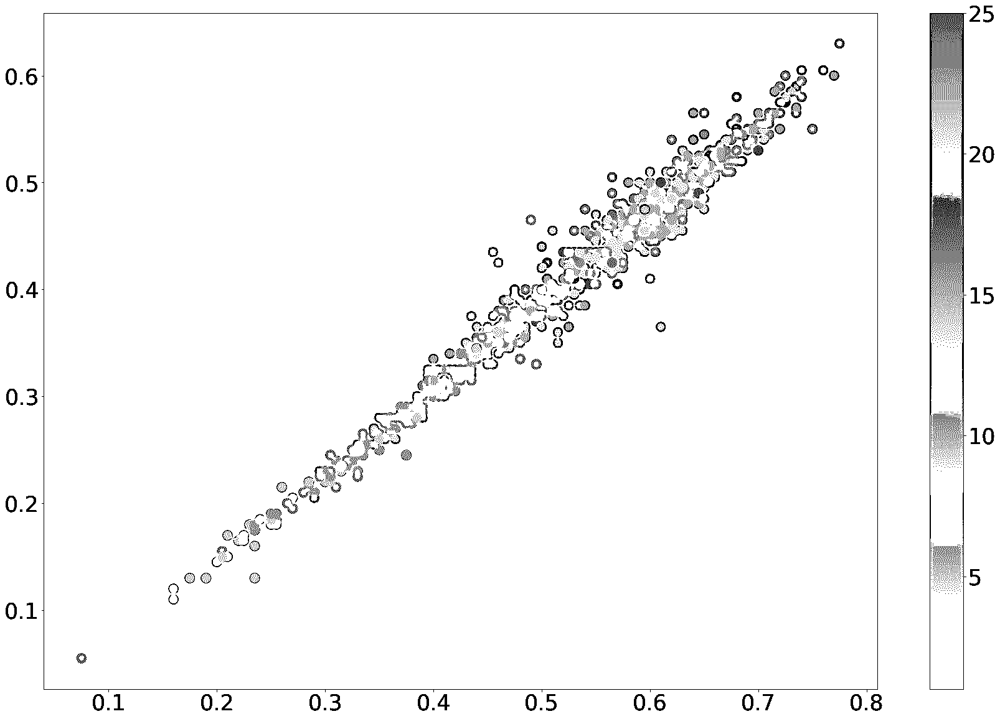](https://files.realpython.com/media/second_scatter.8124c6a8d55d.png)

这证实了你的模型正在学习的趋势确实有意义。

你可以为七个独立变量的每个组合提取一个可视化。对于本教程来说，这可能太长了，但请不要犹豫尝试一下。唯一要更改的是散点图中指定的列。

这些可视化是七维数据集的二维视图。如果你和它们一起玩，它会给你一个很好的理解模型正在学习什么，也许，它没有学习什么或者学习错了什么。

[*Remove ads*](/account/join/)

## 使用 scikit-learn 调优和优化 Python 中的 kNN

有许多方法可以提高你的预测分数。可以通过使用[数据辩论](https://en.wikipedia.org/wiki/Data_wrangling)处理输入数据来进行一些改进，但是在本教程中，重点是 kNN 算法。接下来，您将看到改进建模管道的算法部分的方法。

### 提高 scikit 中的 kNN 性能-使用`GridSearchCV` 学习

到目前为止，您一直在 kNN 算法中使用`k=3`，但是`k`的最佳值是您需要根据经验为每个数据集找到的。

当您使用较少的邻域时，您的预测将比使用较多的邻域时更加多变:

*   如果仅使用一个邻居，预测可能会从一个点强烈地改变到另一个点。当你想到你自己的邻居时，其中一个可能与其他邻居大不相同。如果你住在一个离群值旁边，你的 1-NN 预测将是错误的。

*   如果你有多个数据点，一个非常不同的邻居的影响会小得多。

*   如果使用太多的邻居，每个点的预测都有非常接近的风险。假设您使用所有邻居进行预测。在这种情况下，每个预测都是一样的。

为了找到`k`的最佳值，您将使用一个叫做`GridSearchCV`的工具。这是一个经常用于调整机器学习模型的超参数的工具。在您的情况下，它会自动为您的数据集找到最佳的`k`值。

`GridSearchCV`在 scikit-learn 中提供，其优点是使用方式几乎与 scikit-learn 模型完全相同:

>>>

```py
>>> from sklearn.model_selection import GridSearchCV
>>> parameters = {"n_neighbors": range(1, 50)}
>>> gridsearch = GridSearchCV(KNeighborsRegressor(), parameters)
>>> gridsearch.fit(X_train, y_train)
GridSearchCV(estimator=KNeighborsRegressor(),
 param_grid={'n_neighbors': range(1, 50),
 'weights': ['uniform', 'distance']})
```

这里，您使用`GridSearchCV`来拟合模型。简而言之，`GridSearchCV`在一部分数据上重复拟合 kNN 回归器，并在其余部分数据上测试性能。重复这样做将产生对每个`k`值的预测性能的可靠估计。在这个例子中，您测试从`1`到`50`的值。

最终，它将保留`k`的最佳性能值，您可以使用`.best_params_`访问该值:

>>>

```py
>>> gridsearch.best_params_
{'n_neighbors': 25, 'weights': 'distance'}
```

在这段代码中，您打印了具有最低错误分数的参数。使用`.best_params_`，您可以看到选择`25`作为`k`的值将产生最佳的预测性能。现在您已经知道了`k`的最佳值，您可以看到它是如何影响您的训练和测试性能的:

>>>

```py
>>> train_preds_grid = gridsearch.predict(X_train)
>>> train_mse = mean_squared_error(y_train, train_preds_grid)
>>> train_rmse = sqrt(train_mse)
>>> test_preds_grid = gridsearch.predict(X_test)
>>> test_mse = mean_squared_error(y_test, test_preds_grid)
>>> test_rmse = sqrt(test_mse)
>>> train_rmse
2.0731294674202143
>>> test_rmse
2.1700197339962175
```

使用这段代码，您可以根据训练数据拟合模型，并评估测试数据。你可以看到训练误差比以前差，但是测试误差比以前好。这意味着您的模型不太符合训练数据。使用`GridSearchCV`找到`k`的值减少了训练数据过拟合的问题。

### 根据距离添加邻居的加权平均值

使用`GridSearchCV`，你将测试 RMSE 从`2.37`减少到`2.17`。在本节中，您将看到如何进一步提高性能。

下面，您将测试使用加权平均值而不是常规平均值进行预测时，模型的性能是否会更好。这意味着距离较远的邻居对预测的影响较小。

可以通过将`weights`超参数设置为`"distance"`的值来实现。但是，设置这个加权平均值可能会对`k`的最佳值产生影响。因此，您将再次使用`GridSearchCV`来告诉您应该使用哪种类型的平均:

>>>

```py
>>> parameters = {
...     "n_neighbors": range(1, 50),
...     "weights": ["uniform", "distance"],
... }
>>> gridsearch = GridSearchCV(KNeighborsRegressor(), parameters)
>>> gridsearch.fit(X_train, y_train)
GridSearchCV(estimator=KNeighborsRegressor(),
 param_grid={'n_neighbors': range(1, 50),
 'weights': ['uniform', 'distance']})
>>> gridsearch.best_params_
{'n_neighbors': 25, 'weights': 'distance'}
>>> test_preds_grid = gridsearch.predict(X_test)
>>> test_mse = mean_squared_error(y_test, test_preds_grid)
>>> test_rmse = sqrt(test_mse)
>>> test_rmse
2.163426558494748
```

在这里，您使用`GridSearchCV`测试使用不同的称重是否有意义。应用加权平均而不是常规平均将预测误差从`2.17`降低到`2.1634`。虽然这不是一个巨大的改进，但它仍然更好，这使得它是值得的。

[*Remove ads*](/account/join/)

### 进一步改进 scikit 中的 kNN 用 Bagging 学习

作为 kNN 调优的第三步，您可以使用**打包**。Bagging 是一种**集成方法**，或者是一种采用相对简单的机器学习模型并拟合大量这些模型的方法，每次拟合都有轻微的变化。Bagging 经常使用决策树，但是 kNN 也工作得很好。

集成方法通常比单一模型更有效。一个模型有时会出错，但一百个模型的平均值出错的频率应该会更低。不同的单个模型的误差可能会相互抵消，从而导致预测的可变性更小。

您可以使用 scikit-learn 通过以下步骤将 bagging 应用到您的 kNN 回归中。首先，用从`GridSearchCV`中得到的`k`和`weights`的最佳选择创建`KNeighborsRegressor`:

>>>

```py
>>> best_k = gridsearch.best_params_["n_neighbors"]
>>> best_weights = gridsearch.best_params_["weights"]
>>> bagged_knn = KNeighborsRegressor(
...     n_neighbors=best_k, weights=best_weights
... )
```

然后从 scikit-learn 导入`BaggingRegressor`类，并使用`bagged_knn`模型创建一个带有`100`估算器的新实例:

>>>

```py
>>> from sklearn.ensemble import BaggingRegressor
>>> bagging_model = BaggingRegressor(bagged_knn, n_estimators=100)
```

现在，您可以进行预测并计算 RMSE，看看它是否有所改善:

>>>

```py
>>> test_preds_grid = bagging_model.predict(X_test)
>>> test_mse = mean_squared_error(y_test, test_preds_grid)
>>> test_rmse = sqrt(test_mse)
>>> test_rmse
2.1616
```

袋装 kNN 的预测误差为`2.1616`，比您之前获得的误差略小。执行起来确实需要多一点时间，但是对于这个例子来说，这不成问题。

### 四款车型对比

在三个增量步骤中，您推动了算法的预测性能。下表概述了不同型号及其性能:

| 模型 | 错误 |
| --- | --- |
| 任意`k` | Two point three seven |
| `GridSearchCV`为`k` | Two point one seven |
| `GridSearchCV`为`k`和`weights` | 2.1634 |
| 装袋和`GridSearchCV` | 2.1616 |

在这张表中，您可以看到从最简单到最复杂的四种模型。复杂度的顺序对应于误差度量的顺序。带有随机`k`的模型表现最差，带有装袋和`GridSearchCV`的模型表现最好。

鲍鱼预测可能有更多的改进。例如，可以寻找不同的方式来处理数据，或者寻找其他外部数据源。

## 结论

现在您已经了解了 kNN 算法的所有内容，您已经准备好开始用 Python 构建高性能预测模型了。从一个基本的 kNN 模型到一个完全调优的模型需要几个步骤，但是性能的提高是完全值得的！

**在本教程中，您学习了如何:**

*   理解 **kNN 算法**背后的数学基础
*   从 **NumPy** 中的开始编写 kNN 算法
***   使用 **scikit-learn** 实现用最少的代码量来适应一个 kNN*   使用`GridSearchCV`找到最佳 kNN **超参数***   使用**装袋**将 kNN 推向其最大性能*

*关于模型调整工具的一个伟大的事情是，它们中的许多不仅适用于 kNN 算法，而且也适用于许多其他的机器学习算法。要继续您的机器学习之旅，请查看[机器学习学习路径](https://realpython.com/learning-paths/machine-learning-python/)，并随时留下评论来分享您可能有的任何问题或评论。***********