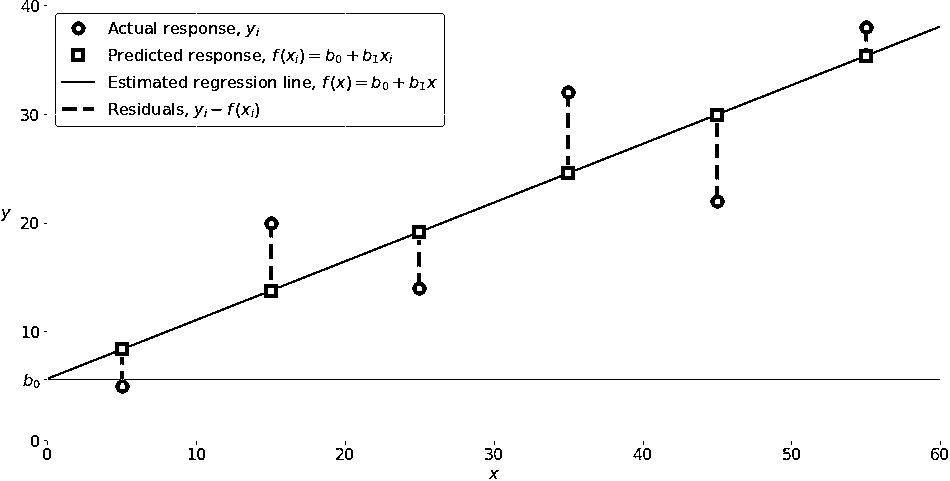
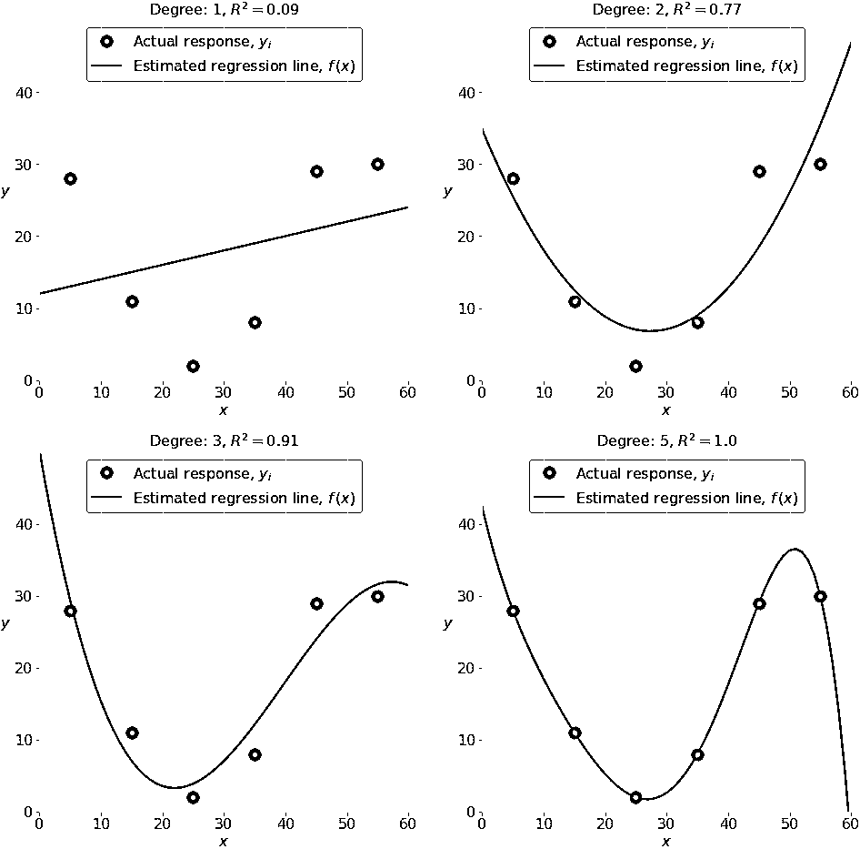

# Python 中的线性回归

> 原文：<https://realpython.com/linear-regression-in-python/>

*立即观看**本教程有真实 Python 团队创建的相关视频课程。和写好的教程一起看，加深理解: [**从 Python 中的线性回归开始**](/courses/python-linear-regression/)

你生活在一个拥有大量数据、强大的计算机和人工智能的时代。这只是开始。[数据科学](https://realpython.com/data-science-podcasts/)和机器学习正在推动图像识别、自动驾驶汽车的开发、金融和能源领域的决策、医学的进步、社交网络的兴起等等。线性回归是其中重要的一部分。

线性回归是基本的统计和机器学习技术之一。无论你是想做[统计](https://realpython.com/python-statistics/)、[机器学习](https://realpython.com/tutorials/machine-learning/)，还是[科学计算](https://realpython.com/what-can-i-do-with-python/#scientific-computing)，很有可能你会需要它。最好先建立一个坚实的基础，然后再向更复杂的方法前进。

到本文结束时，您将已经学会:

*   什么是线性回归**是**
*   **用于什么线性回归**
*   线性回归**如何工作**
*   如何**在 Python 中一步步实现**线性回归

**免费奖励:** [点击此处获取免费的 NumPy 资源指南](#)，它会为您指出提高 NumPy 技能的最佳教程、视频和书籍。

***参加测验:****通过我们的交互式“Python 中的线性回归”测验来测试您的知识。完成后，您将收到一个分数，以便您可以跟踪一段时间内的学习进度:*

*[参加测验](/quizzes/linear-regression-in-python/)

## 回归

回归分析是统计学和机器学习中最重要的领域之一。有许多可用的回归方法。线性回归就是其中之一。

[*Remove ads*](/account/join/)

### 什么是回归？

回归搜索**变量**之间的关系。例如，你可以观察一些公司的几名员工，并试图了解他们的工资如何取决于他们的**特征**，如经验、教育水平、角色、就业城市等等。

这是一个回归问题，其中与每个员工相关的数据代表一个**观察值**。假设是经验、教育、角色和城市是独立的特征，而工资取决于它们。

同样，你可以尝试建立房价对面积、卧室数量、到市中心的距离等等的数学依赖关系。

一般来说，在回归分析中，你会考虑一些感兴趣的现象，并有一些观察结果。每个观察值有两个或多个特征。假设至少有一个特性依赖于其他特性，您试图在它们之间建立一种关系。

换句话说，您需要找到一个**函数，将一些特性或变量充分地映射到其他的**。

相关特征称为**因变量**、**输出**或**响应**。独立特征称为**独立变量**、**输入**、**回归变量**或**预测器**。

回归问题通常有一个连续无界的因变量。然而，输入可以是连续的、离散的、甚至是分类的数据，例如性别、国籍或品牌。

通常的做法是用𝑦表示输出，用𝑥.表示输入如果有两个或更多的独立变量，那么它们可以表示为向量𝐱 = (𝑥₁，…，𝑥ᵣ)，其中𝑟是输入的数量。

### 什么时候需要回归？

通常，你需要回归来回答某个现象是否以及如何影响另一个现象，或者几个变量如何相关。例如，你可以用它来确定【T2 是否】和*经验或性别在多大程度上影响薪水。*

当你想用一组新的预测因子来预测一个反应时，回归也是有用的。例如，在给定室外温度、一天中的时间以及一个家庭中的居民人数的情况下，您可以尝试预测该家庭下一个小时的用电量。

回归被用于许多不同的领域，包括经济学、计算机科学和社会科学。随着大量数据的可用性和对数据实用价值认识的提高，它的重要性与日俱增。

## 线性回归

线性回归可能是最重要和最广泛使用的回归技术之一。这是最简单的回归方法之一。它的主要优点之一是易于解释结果。

### 问题表述

当对自变量集𝐱 = (𝑥₁，…，𝑥ᵣ)上的某个因变量𝑦进行线性回归时，其中𝑟是预测值的数量，假设𝑦和𝐱: 𝑦之间存在线性关系这个方程就是**回归方程**。𝛽₀、𝛽₁、…、𝛽ᵣ为**回归系数**，𝜀为**随机误差**。

线性回归计算回归系数的**估计量**或简单的**预测权重**，用𝑏₀、𝑏₁、…、𝑏ᵣ.表示这些估计器定义了**估计回归函数** 𝑓(𝐱) = 𝑏₀ + 𝑏₁𝑥₁ + ⋯ + 𝑏ᵣ𝑥ᵣ.这个函数应该能够很好地捕捉输入和输出之间的依赖关系。

每次观测的**估计**或**预测响应**，𝑓(𝐱ᵢ)，𝑖 = 1，…，𝑛，应尽可能接近相应的**实际响应** 𝑦ᵢ.所有观测值的𝑦ᵢ - 𝑓(𝐱ᵢ差𝑖 = 1，…，𝑛，称为**残差**。回归是关于确定**最佳预测权重**——即对应于最小残差的权重。

为了得到最好的权重，你通常**最小化所有观测值的残差平方和(SSR)** ，𝑖 = 1，…，𝑛: SSR =σᵢ(𝑦ᵢ-𝑓(𝐱ᵢ)。这种方法被称为普通最小二乘法的**方法。**

[*Remove ads*](/account/join/)

### 回归性能

实际响应的变化𝑦ᵢ，𝑖 = 1，…，𝑛，部分是由于对预测值𝐱ᵢ.的依赖然而，还有一个额外的输出固有方差。

**决定系数**，表示为𝑅，使用特定的回归模型，告诉你𝑦的变化量可以通过对𝐱的依赖来解释。较大的𝑅表明拟合较好，意味着模型可以更好地解释不同输入下的输出变化。

值𝑅 = 1 对应于 SSR = 0。这就是**完美拟合**，因为预测和实际响应的值彼此完全吻合。

### 简单线性回归

简单或单变量线性回归是线性回归最简单的情况，因为它只有一个独立变量，𝐱 = 𝑥.

下图说明了简单的线性回归:

[](https://files.realpython.com/media/fig-lin-reg.a506035b654a.png)

<figcaption class="figure-caption text-center">Example of simple linear regression</figcaption>

实施简单线性回归时，通常从一组给定的输入输出(𝑥-𝑦)对开始。这些对是您的观察，在图中显示为绿色圆圈。例如，最左边的观察值的输入𝑥 = 5，实际输出或响应𝑦 = 5。下一个是𝑥 = 15，𝑦 = 20，以此类推。

由黑线表示的估计回归函数具有等式𝑓(𝑥) = 𝑏₀ + 𝑏₁𝑥.您的目标是计算最小化 SSR 的预测权重𝑏₀和𝑏₁的最优值，并确定估计的回归函数。

𝑏₀的值，也称为**截距**，显示了估计回归线穿过𝑦轴的点。它是𝑥 = 0 时估计响应𝑓(𝑥的值。𝑏₁的值决定了估计回归线的**斜率**。

显示为红色方块的预测响应是回归线上对应于输入值的点。例如，对于输入𝑥 = 5，预测响应为𝑓(5 = 8.33，最左边的红色方块表示。

垂直的灰色虚线表示残差，可以计算为𝑦ᵢ - 𝑓(𝐱ᵢ) = 𝑦ᵢ - 𝑏₀ - 𝑏₁𝑥ᵢ，𝑖 = 1，…，𝑛.它们是绿色圆圈和红色方块之间的距离。当您实施线性回归时，您实际上是在尝试最小化这些距离，并使红色方块尽可能接近预定义的绿色圆圈。

### 多元线性回归

多重或多元线性回归是具有两个或多个独立变量的线性回归。

如果只有两个独立变量，那么估计的回归函数是𝑓(𝑥₁，𝑥₂) = 𝑏₀ + 𝑏₁𝑥₁ + 𝑏₂𝑥₂.它表示三维空间中的回归平面。回归的目标是确定𝑏₀、𝑏₁和𝑏₂的权重值，使得该平面尽可能接近实际响应，同时产生最小的 SSR。

两个以上独立变量的情况类似，但更普遍。估计回归函数为𝑓(𝑥₁，…，𝑥ᵣ) = 𝑏₀ + 𝑏₁𝑥₁ + ⋯ +𝑏ᵣ𝑥ᵣ，当输入数为𝑟.时有𝑟 + 1 个权重待定

### 多项式回归

你可以把多项式回归看作线性回归的一种推广情况。假设输出和输入之间存在多项式相关性，因此，多项式估计回归函数。

换句话说，除了像𝑏₁𝑥₁这样的线性项，您的回归函数𝑓还可以包括非线性项，如𝑏₃𝑥₁𝑏₂𝑥₁，甚至𝑏₅𝑥₁𝑥₂.𝑏₄𝑥₁𝑥₂

多项式回归最简单的例子是只有一个自变量，估计的回归函数是二次多项式:𝑓(𝑥) = 𝑏₀ + 𝑏₁𝑥 + 𝑏₂𝑥。

现在，请记住，您要计算𝑏₀、𝑏₁和𝑏₂，以最小化 SSR。这些都是你的未知数！

记住这一点，将前面的回归函数与用于线性回归的函数𝑓(𝑥₁，𝑥₂) = 𝑏₀ + 𝑏₁𝑥₁ + 𝑏₂𝑥₂进行比较。它们看起来非常相似，都是未知数𝑏₀、𝑏₁和𝑏₂.的线性函数这就是为什么你可以将**多项式回归问题**作为**线性问题**来解决，其中𝑥项被视为输入变量。

在两个变量和二次多项式的情况下，回归函数具有这种形式:𝑓(𝑥₁，𝑥₂)=𝑏₀+𝑏₁𝑥₁+𝑏₂𝑥₂+𝑏₃𝑥₁+𝑏₄𝑥₁𝑥₂+𝑏₅𝑥₂。

解决这个问题的程序与前一种情况相同。您对五个输入值应用线性回归:𝑥₁、𝑥₂、𝑥₁、𝑥₁𝑥₂和𝑥₂。作为回归的结果，您得到了使 SSR 最小化的六个权重值:𝑏₀、𝑏₁、𝑏₂、𝑏₃、𝑏₄和𝑏₅.

当然还有更一般的问题，但这应该足够说明问题了。

[*Remove ads*](/account/join/)

### 欠配合和过配合

当您实现多项式回归时，可能会出现一个非常重要的问题，这个问题与多项式回归函数的**最佳次数**的选择有关。

做这件事没有简单的规则。这要看情况。然而，你应该意识到学位选择可能带来的两个问题:**欠拟合**和**过拟合**。

当一个模型不能准确捕捉数据之间的依赖关系时，就会出现欠拟合，这通常是由于模型本身的简单性。在已知数据的情况下，它通常会产生较低的𝑅，而在应用新数据时，它的泛化能力较差。

**过度拟合**发生在模型既学习数据依赖性又学习随机波动的时候。换句话说，模型对现有数据的学习太好了。具有许多特征或术语的复杂模型通常容易过度拟合。当应用于已知数据时，这种模型通常产生高𝑅。然而，当与新数据一起使用时，它们通常不能很好地概括，并且具有明显较低的𝑅。

下图显示了拟合不足、拟合良好和拟合过度的模型:

[](https://files.realpython.com/media/poly-reg.5790f47603d8.png)

<figcaption class="figure-caption text-center">Example of underfitted, well-fitted and overfitted models</figcaption>

左上角的图显示了一条𝑅较低的线性回归线。同样重要的是，一条直线不能考虑这样一个事实，当𝑥从 25 点向 0 点移动时，实际的反应会增加。这可能是一个不适合的例子。

右上角的图说明了次数等于 2 的多项式回归。在这种情况下，这可能是对该数据建模的最佳程度。该模型的𝑅值在许多情况下是令人满意的，并且很好地显示了趋势。

左下角的图表示次数等于 3 的多项式回归。𝑅的价值高于前面的情况。与以前的模型相比，该模型在已知数据的情况下表现更好。然而，它显示了一些过度拟合的迹象，特别是对于接近 sixy 的输入值，线开始下降，尽管实际数据没有显示这一点。

最后，在右下角的图中，你可以看到完美的拟合:六个点和五次(或更高)的多项式线产生𝑅 = 1。每个实际响应等于其相应的预测。

在某些情况下，这可能正是您正在寻找的。然而，在许多情况下，这是一个过度拟合的模型。对于看不见的数据，尤其是输入大于 50 的数据，很可能表现不佳。

例如，它假设，在没有任何证据的情况下，𝑥的回答在 50 岁以上有显著下降，𝑦在𝑥接近 60 岁时达到零。这种行为是过度努力学习和适应现有数据的结果。

有很多资源可以让你找到更多关于回归的信息，尤其是线性回归。维基百科上的[回归分析页面](https://en.wikipedia.org/wiki/Regression_analysis)、[维基百科的线性回归条目](https://en.wikipedia.org/wiki/Linear_regression)、[可汗学院的线性回归文章](https://www.khanacademy.org/math/statistics-probability/describing-relationships-quantitative-data/introduction-to-trend-lines/a/linear-regression-review)都是很好的起点。

## 用于线性回归的 Python 包

是时候开始在 Python 中实现线性回归了。为此，您将应用适当的包及其函数和类。

NumPy 是一个基本的 Python 科学包，允许对一维或多维数组进行许多高性能操作。它还提供了许多数学例程。当然，它是开源的。

如果你不熟悉 NumPy，你可以使用官方的 [NumPy 用户指南](https://docs.scipy.org/doc/numpy/user/)并阅读 [NumPy 教程:你进入 Python 数据科学的第一步](https://realpython.com/numpy-tutorial/)。另外，【看马，No For-Loops:数组编程用 NumPy 和[纯 Python vs NumPy vs TensorFlow 性能比较](https://realpython.com/numpy-tensorflow-performance/)可以让你很好的了解应用 NumPy 时可以达到的性能增益。

包 **scikit-learn** 是一个广泛用于机器学习的 Python 库，构建在 NumPy 和其他一些包之上。它提供了预处理数据、降低维数、实现回归、分类、聚类等方法。和 NumPy 一样，scikit-learn 也是开源的。

您可以查看 [scikit-learn 网站](https://scikit-learn.org/)上的页面[广义线性模型](https://scikit-learn.org/stable/modules/linear_model.html)，以了解更多关于线性模型的信息，并更深入地了解该软件包是如何工作的。

如果您想要实现线性回归，并且需要 scikit-learn 范围之外的功能，您应该考虑 **statsmodels** 。这是一个强大的 Python 包，用于统计模型的估计、执行测试等等。它也是开源的。

你可以在[的官方网站](https://www.statsmodels.org/)上找到更多关于 statsmodels 的信息。

现在，按照本教程，您应该将所有这些包安装到一个虚拟环境中:

```py
(venv) $ python -m pip install numpy scikit-learn statsmodels
```

这将安装 NumPy、scikit-learn、statsmodels 及其依赖项。

[*Remove ads*](/account/join/)

## 使用 scikit-learn 进行简单的线性回归

您将从最简单的情况开始，这是简单的线性回归。实施线性回归有五个基本步骤:

1.  导入您需要的包和类。
2.  提供数据，并最终进行适当的转换。
3.  创建一个回归模型，并用现有数据进行拟合。
4.  检查模型拟合的结果，以了解模型是否令人满意。
5.  应用模型进行预测。

这些步骤对大多数回归方法和实现或多或少是通用的。在本教程的其余部分中，您将学习如何针对几种不同的场景执行这些步骤。

**步骤 1:导入包和类**

第一步是从`sklearn.linear_model`导入包`numpy`和类`LinearRegression`:

>>>

```py
>>> import numpy as np
>>> from sklearn.linear_model import LinearRegression
```

现在，您已经拥有了实现线性回归所需的所有功能。

NumPy 的基本数据类型是名为`numpy.ndarray`的数组类型。本教程的其余部分使用术语**数组**来指代类型`numpy.ndarray`的实例。

您将使用类`sklearn.linear_model.LinearRegression`来执行线性和多项式回归，并做出相应的预测。

**第二步:提供数据**

第二步是定义要使用的数据。输入(回归量，𝑥)和输出(响应，𝑦)应该是数组或类似的对象。这是为回归提供数据的最简单方法:

>>>

```py
>>> x = np.array([5, 15, 25, 35, 45, 55]).reshape((-1, 1))
>>> y = np.array([5, 20, 14, 32, 22, 38])
```

现在，您有两个数组:输入数组`x`和输出数组`y`。你应该在`x`上调用`.reshape()`，因为这个数组必须是**二维的**，或者更准确地说，它必须有**一列**和**尽可能多的行**。这正是`.reshape()`中的`(-1, 1)`所指出的。

这是`x`和`y`现在的样子:

>>>

```py
>>> x
array([[ 5],
 [15],
 [25],
 [35],
 [45],
 [55]])

>>> y
array([ 5, 20, 14, 32, 22, 38])
```

你可以看到，`x`有两个维度，`x.shape`是`(6, 1)`，而`y`有一个维度，`y.shape`是`(6,)`。

**第三步:创建一个模型并进行拟合**

下一步是创建一个线性回归模型，并使用现有数据进行拟合。

创建类`LinearRegression`的一个实例，它将代表回归模型:

>>>

```py
>>> model = LinearRegression()
```

该语句创建[变量](https://realpython.com/python-variables/) `model`作为`LinearRegression`的实例。您可以向`LinearRegression`提供几个可选参数:

*   **`fit_intercept`** 是一个[布尔型](https://realpython.com/python-boolean/)，如果`True`，则决定计算截距𝑏₀，如果`False`，则认为其等于零。默认为`True`。
*   **`normalize`** 是一个布尔值，如果`True`，则决定对输入变量进行规范化。它默认为`False`，在这种情况下，它不会规范化输入变量。
*   **`copy_X`** 是决定是复制(`True`)还是覆盖输入变量(`False`)的布尔值。默认是`True`。
*   **`n_jobs`** 要么是整数，要么是`None`。它表示并行计算中使用的作业数量。默认为`None`，通常指一份工作。`-1`表示使用所有可用的处理器。

上面定义的`model`使用所有参数的默认值。

是时候开始使用模型了。首先，你需要在`model`上调用`.fit()`:

>>>

```py
>>> model.fit(x, y)
LinearRegression()
```

通过`.fit()`，使用现有的输入和输出`x`和`y`作为参数，计算权重𝑏₀和𝑏₁的最优值。换句话说，`.fit()` **符合模型**。它返回`self`，也就是变量`model`本身。这就是为什么您可以用下面的语句替换最后两个语句:

>>>

```py
>>> model = LinearRegression().fit(x, y)
```

这条语句的作用与前两条相同。只是短了点。

**第四步:获取结果**

一旦你有你的模型拟合，你可以得到的结果来检查模型是否令人满意的工作，并解释它。

你可以通过调用`model`的`.score()`得到决定系数𝑅:

>>>

```py
>>> r_sq = model.score(x, y)
>>> print(f"coefficient of determination: {r_sq}")
coefficient of determination: 0.7158756137479542
```

当你应用`.score()`时，参数也是预测值`x`和响应值`y`，返回值是𝑅。

`model`的属性有`.intercept_`，代表系数𝑏₀，`.coef_`，代表𝑏₁:

>>>

```py
>>> print(f"intercept: {model.intercept_}")
intercept: 5.633333333333329

>>> print(f"slope: {model.coef_}")
slope: [0.54]
```

上面的代码演示了如何获得𝑏₀和𝑏₁.你可以注意到`.intercept_`是一个标量，而`.coef_`是一个数组。

**注意:**在 scikit-learn 中，按照[惯例](https://scikit-learn.org/stable/developers/develop.html#estimated-attributes)，尾随的下划线表示一个属性是估计的。在该示例中，`.intercept_`和`.coef_`是估计值。

𝑏₀的值大约是 5.63。这说明当𝑥为零时，你的模型预测响应为 5.63。值𝑏₁ = 0.54 意味着当𝑥增加 1 时，预测响应增加 0.54。

您会注意到，您也可以将`y`作为二维数组提供。在这种情况下，您会得到类似的结果。这可能是它看起来的样子:

>>>

```py
>>> new_model = LinearRegression().fit(x, y.reshape((-1, 1)))
>>> print(f"intercept: {new_model.intercept_}")
intercept: [5.63333333]

>>> print(f"slope: {new_model.coef_}")
slope: [[0.54]]
```

正如您所看到的，这个示例与上一个非常相似，但是在这个示例中，`.intercept_`是一个包含单个元素𝑏₀的一维数组，`.coef_`是一个包含单个元素𝑏₁.的二维数组

**第五步:预测反应**

一旦你有了一个满意的模型，你就可以用它来预测现有的或新的数据。要获得预测的响应，使用`.predict()`:

>>>

```py
>>> y_pred = model.predict(x)
>>> print(f"predicted response:\n{y_pred}")
predicted response:
[ 8.33333333 13.73333333 19.13333333 24.53333333 29.93333333 35.33333333]
```

应用`.predict()`时，将回归量作为自变量传递，得到相应的预测响应。这是一种几乎相同的预测反应的方法:

>>>

```py
>>> y_pred = model.intercept_ + model.coef_ * x
>>> print(f"predicted response:\n{y_pred}")
predicted response:
[[ 8.33333333]
 [13.73333333]
 [19.13333333]
 [24.53333333]
 [29.93333333]
 [35.33333333]]
```

在这种情况下，您将`x`的每个元素乘以`model.coef_`，并将`model.intercept_`加到乘积上。

这里的输出与上一个示例的不同之处仅在于维度。预测的响应现在是一个二维数组，而在以前的情况下，它只有一维。

如果你把`x`的维数减少到一，那么这两种方法会产生相同的结果。你可以通过将`x`乘以`model.coef_`时用`x.reshape(-1)`、`x.flatten()`或`x.ravel()`来代替`x`来实现。

在实践中，回归模型经常用于预测。这意味着您可以使用拟合模型根据新的输入来计算输出:

>>>

```py
>>> x_new = np.arange(5).reshape((-1, 1))
>>> x_new
array([[0],
 [1],
 [2],
 [3],
 [4]])

>>> y_new = model.predict(x_new)
>>> y_new
array([5.63333333, 6.17333333, 6.71333333, 7.25333333, 7.79333333])
```

这里`.predict()`被应用于新的回归变量`x_new`并产生响应`y_new`。这个例子方便地使用来自`numpy`的 [`arange()`](https://realpython.com/how-to-use-numpy-arange/) 来生成一个数组，数组中的元素从 0(包括 0)到 5(不包括 5)，即`0`、`1`、`2`、`3`和`4`。

你可以在[官方文档页面](https://scikit-learn.org/stable/modules/generated/sklearn.linear_model.LinearRegression.html)上找到更多关于`LinearRegression`的信息。

[*Remove ads*](/account/join/)

## 使用 scikit-learn 进行多元线性回归

您可以按照与简单回归相同的步骤来实现多元线性回归。主要的区别是您的`x`数组现在将有两列或更多列。

**步骤 1 和 2:导入包和类，并提供数据**

首先，导入`numpy`和`sklearn.linear_model.LinearRegression`，并提供已知的输入和输出:

>>>

```py
>>> import numpy as np
>>> from sklearn.linear_model import LinearRegression

>>> x = [
...   [0, 1], [5, 1], [15, 2], [25, 5], [35, 11], [45, 15], [55, 34], [60, 35]
... ]
>>> y = [4, 5, 20, 14, 32, 22, 38, 43]
>>> x, y = np.array(x), np.array(y)
```

这是定义输入`x`和输出`y`的简单方法。你可以把`x`和`y`打印出来，看看他们现在的样子:

>>>

```py
>>> x
array([[ 0,  1],
 [ 5,  1],
 [15,  2],
 [25,  5],
 [35, 11],
 [45, 15],
 [55, 34],
 [60, 35]])

>>> y
array([ 4,  5, 20, 14, 32, 22, 38, 43])
```

在多元线性回归中，`x`是至少有两列的二维数组，而`y`通常是一维数组。这是多元线性回归的一个简单例子，而`x`正好有两列。

**第三步:创建一个模型并进行拟合**

下一步是创建回归模型作为`LinearRegression`的实例，并用`.fit()`来拟合它:

>>>

```py
>>> model = LinearRegression().fit(x, y)
```

该语句的结果是变量`model`引用类型`LinearRegression`的对象。它表示用现有数据拟合的回归模型。

**第四步:获取结果**

您可以通过与简单线性回归相同的方式获得模型的属性:

>>>

```py
>>> r_sq = model.score(x, y)
>>> print(f"coefficient of determination: {r_sq}")
coefficient of determination: 0.8615939258756776

>>> print(f"intercept: {model.intercept_}")
intercept: 5.52257927519819

>>> print(f"coefficients: {model.coef_}")
coefficients: [0.44706965 0.25502548]
```

使用`.score()`获得𝑅的值，使用`.intercept_`和`.coef_`获得回归系数的估计值。同样，`.intercept_`保存偏向𝑏₀，而现在`.coef_`是一个包含𝑏₁和𝑏₂.的数组

在这个例子中，截距约为 5.52，这是当𝑥₁ = 𝑥₂ = 0 时的预测响应值。𝑥₁增加 1 会导致预测响应增加 0.45。类似地，当𝑥₂增长 1 时，响应增加 0.26。

**第五步:预测反应**

预测的工作方式与简单线性回归的情况相同:

>>>

```py
>>> y_pred = model.predict(x)
>>> print(f"predicted response:\n{y_pred}")
predicted response:
[ 5.77760476  8.012953   12.73867497 17.9744479  23.97529728 29.4660957
 38.78227633 41.27265006]
```

预测响应通过`.predict()`获得，相当于:

>>>

```py
>>> y_pred = model.intercept_ + np.sum(model.coef_ * x, axis=1)
>>> print(f"predicted response:\n{y_pred}")
predicted response:
[ 5.77760476  8.012953   12.73867497 17.9744479  23.97529728 29.4660957
 38.78227633 41.27265006]
```

通过将输入的每一列乘以适当的权重，对结果求和，然后将截距加到和上，可以预测输出值。

您也可以将此模型应用于新数据:

>>>

```py
>>> x_new = np.arange(10).reshape((-1, 2))
>>> x_new
array([[0, 1],
 [2, 3],
 [4, 5],
 [6, 7],
 [8, 9]])

>>> y_new = model.predict(x_new)
>>> y_new
array([ 5.77760476,  7.18179502,  8.58598528,  9.99017554, 11.3943658 ])
```

这是使用线性回归模型的预测。

[*Remove ads*](/account/join/)

## 用 scikit-learn 进行多项式回归

用 scikit-learn 实现多项式回归与线性回归非常相似。只有一个额外的步骤:您需要转换输入数组，以包括非线性项，如𝑥。

**步骤 1:导入包和类**

除了`numpy`和`sklearn.linear_model.LinearRegression`，你还应该从`sklearn.preprocessing`导入`PolynomialFeatures`类:

>>>

```py
>>> import numpy as np
>>> from sklearn.linear_model import LinearRegression
>>> from sklearn.preprocessing import PolynomialFeatures
```

导入现在已经完成，您已经拥有了需要使用的所有东西。

**步骤 2a:提供数据**

这一步定义了输入和输出，与线性回归的情况相同:

>>>

```py
>>> x = np.array([5, 15, 25, 35, 45, 55]).reshape((-1, 1))
>>> y = np.array([15, 11, 2, 8, 25, 32])
```

现在，您已经有了合适格式的输入和输出。请记住，您需要输入一个二维数组**。所以才用`.reshape()`。*

***步骤 2b:转换输入数据**

这是您需要为多项式回归实现的**新步骤**！

正如您之前所了解的，在实现多项式回归时，您需要将𝑥(或许还有其他项)作为附加特征包括在内。出于这个原因，您应该转换输入数组`x`以包含任何具有𝑥值的附加列，并最终包含更多的特性。

有几种方法可以转换输入数组，比如使用来自`numpy`的`insert()`。但是`PolynomialFeatures`类对于这个目的来说非常方便。继续创建该类的一个实例:

>>>

```py
>>> transformer = PolynomialFeatures(degree=2, include_bias=False)
```

变量`transformer`指的是`PolynomialFeatures`的一个实例，您可以用它来转换输入`x`。

您可以向`PolynomialFeatures`提供几个可选参数:

*   **`degree`** 是表示多项式回归函数次数的整数(默认为`2`)。
*   **`interaction_only`** 是一个布尔型(`False`默认)，决定是只包含交互特性(`True`)还是包含所有特性(`False`)。
*   **`include_bias`** 是一个布尔值(默认为`True`)，它决定是否包含偏差或截距列的`1`值(`True`)或`False`)。

本例使用除`include_bias`之外的所有参数的默认值。有时您会想试验一下函数的阶数，无论如何，提供这个参数对可读性是有好处的。

在应用`transformer`之前，您需要安装`.fit()`:

>>>

```py
>>> transformer.fit(x)
PolynomialFeatures(include_bias=False)
```

一旦`transformer`安装完毕，就可以创建一个新的修改过的输入数组了。您可以应用`.transform()`来实现这一点:

>>>

```py
>>> x_ = transformer.transform(x)
```

那就是用`.transform()`对输入数组的变换。它将输入数组作为参数，并返回修改后的数组。

您也可以使用`.fit_transform()`只用一个语句替换前面的三个语句:

>>>

```py
>>> x_ = PolynomialFeatures(degree=2, include_bias=False).fit_transform(x)
```

使用`.fit_transform()`，您可以在一条语句中拟合和转换输入数组。这个方法也接受输入数组，并有效地做与按顺序调用的`.fit()`和`.transform()`相同的事情。它还返回修改后的数组。新的输入数组如下所示:

>>>

```py
>>> x_
array([[   5.,   25.],
 [  15.,  225.],
 [  25.,  625.],
 [  35., 1225.],
 [  45., 2025.],
 [  55., 3025.]])
```

修改后的输入数组包含两列:一列是原始输入，另一列是它们的平方。你可以在[官方文档页面](https://scikit-learn.org/stable/modules/generated/sklearn.preprocessing.PolynomialFeatures.html)上找到更多关于`PolynomialFeatures`的信息。

**第三步:创建一个模型并进行拟合**

这一步也与线性回归的情况相同。创建并拟合模型:

>>>

```py
>>> model = LinearRegression().fit(x_, y)
```

回归模型现在已经创建并拟合好了。已经可以应用了。你要记住，`.fit()`的第一个参数是*修改后的输入数组* `x_`而不是原来的`x`。

**第四步:获取结果**

您可以通过与线性回归相同的方式获得模型的属性:

>>>

```py
>>> r_sq = model.score(x_, y)
>>> print(f"coefficient of determination: {r_sq}")
coefficient of determination: 0.8908516262498563

>>> print(f"intercept: {model.intercept_}")
intercept: 21.372321428571436

>>> print(f"coefficients: {model.coef_}")
coefficients: [-1.32357143  0.02839286]
```

再次，`.score()`返回𝑅。它的第一个参数也是修改后的输入`x_`，而不是`x`。权重值与`.intercept_`和`.coef_`相关联。这里，`.intercept_`代表𝑏₀，而`.coef_`引用包含𝑏₁和𝑏₂.的数组

使用不同的转换和回归参数可以获得非常相似的结果:

>>>

```py
>>> x_ = PolynomialFeatures(degree=2, include_bias=True).fit_transform(x)
```

如果您用默认参数`include_bias=True`调用`PolynomialFeatures`，或者如果您忽略它，那么您将获得新的输入数组`x_`，其中最左边的一列只包含`1`的值。该列对应于截距。在这种情况下，修改后的输入数组如下所示:

>>>

```py
>>> x_
array([[1.000e+00, 5.000e+00, 2.500e+01],
 [1.000e+00, 1.500e+01, 2.250e+02],
 [1.000e+00, 2.500e+01, 6.250e+02],
 [1.000e+00, 3.500e+01, 1.225e+03],
 [1.000e+00, 4.500e+01, 2.025e+03],
 [1.000e+00, 5.500e+01, 3.025e+03]])
```

`x_`的第一列包含 1，第二列包含`x`的值，而第三列包含`x`的平方。

截距已经包含在最左边的一列中，在创建`LinearRegression`的实例时不需要再次包含它。因此，您可以提供`fit_intercept=False`。下面是下一条语句:

>>>

```py
>>> model = LinearRegression(fit_intercept=False).fit(x_, y)
```

变量`model`再次对应于新的输入数组`x_`。因此，`x_`应该作为第一个参数传递，而不是`x`。

这种方法会产生以下结果，与前一种情况类似:

>>>

```py
>>> r_sq = model.score(x_, y)
>>> print(f"coefficient of determination: {r_sq}")
coefficient of determination: 0.8908516262498564

>>> print(f"intercept: {model.intercept_}")
intercept: 0.0

>>> print(f"coefficients: {model.coef_}")
coefficients: [21.37232143 -1.32357143  0.02839286]
```

你看到现在`.intercept_`是零，但是`.coef_`实际上包含𝑏₀作为它的第一个元素。其他都一样。

**第五步:预测反应**

如果你想得到预测的响应，就用`.predict()`，但是记住参数应该是修改后的输入`x_`而不是旧的`x`:

>>>

```py
>>> y_pred = model.predict(x_)
>>> print(f"predicted response:\n{y_pred}")
predicted response:
[15.46428571  7.90714286  6.02857143  9.82857143 19.30714286 34.46428571]
```

如您所见，预测的工作方式几乎与线性回归的情况相同。它只需要修改后的输入，而不是原来的输入。

如果你有几个输入变量，你可以应用相同的程序。您将拥有一个包含多列的输入数组，但是其他的都是一样的。这里有一个例子:

>>>

```py
>>> # Step 1: Import packages and classes
>>> import numpy as np
>>> from sklearn.linear_model import LinearRegression
>>> from sklearn.preprocessing import PolynomialFeatures

>>> # Step 2a: Provide data
>>> x = [
...   [0, 1], [5, 1], [15, 2], [25, 5], [35, 11], [45, 15], [55, 34], [60, 35]
... ]
>>> y = [4, 5, 20, 14, 32, 22, 38, 43]
>>> x, y = np.array(x), np.array(y)

>>> # Step 2b: Transform input data
>>> x_ = PolynomialFeatures(degree=2, include_bias=False).fit_transform(x)

>>> # Step 3: Create a model and fit it
>>> model = LinearRegression().fit(x_, y)

>>> # Step 4: Get results
>>> r_sq = model.score(x_, y)
>>> intercept, coefficients = model.intercept_, model.coef_

>>> # Step 5: Predict response
>>> y_pred = model.predict(x_)
```

该回归示例产生以下结果和预测:

>>>

```py
>>> print(f"coefficient of determination: {r_sq}")
coefficient of determination: 0.9453701449127822

>>> print(f"intercept: {intercept}")
intercept: 0.8430556452395876

>>> print(f"coefficients:\n{coefficients}")
coefficients:
[ 2.44828275  0.16160353 -0.15259677  0.47928683 -0.4641851 ]

>>> print(f"predicted response:\n{y_pred}")
predicted response:
[ 0.54047408 11.36340283 16.07809622 15.79139    29.73858619 23.50834636
 39.05631386 41.92339046]
```

在这种情况下，有六个回归系数，包括截距，如估计回归函数所示𝑓(𝑥₁，𝑥₂)=𝑏₀+𝑏₁𝑥₁+𝑏₂𝑥₂+𝑏₃𝑥₁+𝑏₄𝑥₁𝑥₂+𝑏₅𝑥₂。

您还可以注意到，对于相同的问题，多项式回归比多元线性回归产生了更高的决定系数。起初，你可能认为获得如此大的𝑅是一个很好的结果。可能是吧。

然而，在现实世界的情况下，有一个复杂的模型和𝑅非常接近，也可能是一个过度拟合的迹象。要检查模型的性能，您应该使用新数据对其进行测试，也就是说，使用未用于拟合或训练模型的观察值。要了解如何将数据集分割成训练和测试子集，请查看使用 scikit-learn 的 train_test_split() 分割数据集。

[*Remove ads*](/account/join/)

## 带 statsmodels 的高级线性回归

您也可以通过使用 statsmodels 包在 Python 中实现线性回归。通常，当您需要更详细的结果时，这是可取的。

该过程类似于 scikit-learn 的过程。

**第一步:导入包**

首先你需要做一些进口。除了`numpy`，还需要导入`statsmodels.api`:

>>>

```py
>>> import numpy as np
>>> import statsmodels.api as sm
```

现在您已经有了您需要的包。

**步骤 2:提供数据并转换输入**

您可以像使用 scikit-learn 时一样提供输入和输出:

>>>

```py
>>> x = [
...   [0, 1], [5, 1], [15, 2], [25, 5], [35, 11], [45, 15], [55, 34], [60, 35]
... ]
>>> y = [4, 5, 20, 14, 32, 22, 38, 43]
>>> x, y = np.array(x), np.array(y)
```

输入和输出数组已经创建，但是工作还没有完成。

如果您希望 statsmodels 计算截距𝑏₀.，则需要将 1 的列添加到输入中默认情况下，它不考虑𝑏₀。这只是一个函数调用:

>>>

```py
>>> x = sm.add_constant(x)
```

这就是用`add_constant()`将一列 1 加到`x`的方法。它将输入数组`x`作为参数，并返回一个新数组，在该数组的开头插入一列 1。这是`x`和`y`现在的样子:

>>>

```py
>>> x
array([[ 1.,  0.,  1.],
 [ 1.,  5.,  1.],
 [ 1., 15.,  2.],
 [ 1., 25.,  5.],
 [ 1., 35., 11.],
 [ 1., 45., 15.],
 [ 1., 55., 34.],
 [ 1., 60., 35.]])

>>> y
array([ 4,  5, 20, 14, 32, 22, 38, 43])
```

你可以看到修改后的`x`有三列:第一列是 1，对应于𝑏₀和替换截距，还有两列是原来的特性。

**第三步:创建一个模型并进行拟合**

基于普通最小二乘法的回归模型是类`statsmodels.regression.linear_model.OLS`的一个实例。这是你如何获得一个:

>>>

```py
>>> model = sm.OLS(y, x)
```

你在这里要小心！注意，第一个参数是输出，后面是输入。这与相应的 scikit-learn 功能的顺序相反。

还有几个可选参数。要找到更多关于这个类的信息，你可以访问官方文档页面。

一旦你的模型被创建，你就可以对它应用`.fit()`:

>>>

```py
>>> results = model.fit()
```

通过调用`.fit()`，您获得了变量`results`，它是类`statsmodels.regression.linear_model.RegressionResultsWrapper`的一个实例。该对象保存了大量关于回归模型的信息。

**第四步:获取结果**

变量`results`是指包含关于线性回归结果的详细信息的对象。解释这些结果远远超出了本教程的范围，但是您将在这里学习如何提取它们。

您可以调用`.summary()`来获得线性回归结果的表格:

>>>

```py
>>> print(results.summary())
OLS Regression Results
=============================================================================
Dep. Variable:                     y   R-squared:                       0.862
Model:                           OLS   Adj. R-squared:                  0.806
Method:                Least Squares   F-statistic:                     15.56
Date:               Thu, 12 May 2022   Prob (F-statistic):            0.00713
Time:                       14:15:07   Log-Likelihood:                -24.316
No. Observations:                  8   AIC:                             54.63
Df Residuals:                      5   BIC:                             54.87
Df Model:                          2
Covariance Type:           nonrobust
=============================================================================
 coef    std err          t      P>|t|      [0.025      0.975]
-----------------------------------------------------------------------------
const         5.5226      4.431      1.246      0.268      -5.867      16.912
x1            0.4471      0.285      1.567      0.178      -0.286       1.180
x2            0.2550      0.453      0.563      0.598      -0.910       1.420
=============================================================================
Omnibus:                       0.561   Durbin-Watson:                   3.268
Prob(Omnibus):                 0.755   Jarque-Bera (JB):                0.534
Skew:                          0.380   Prob(JB):                        0.766
Kurtosis:                      1.987   Cond. No.                         80.1
=============================================================================

Warnings:
[1] Standard Errors assume that the covariance matrix of the errors is
 correctly specified.
```

这张表很全面。您可以找到许多与线性回归相关的统计值，包括𝑅、𝑏₀、𝑏₁和𝑏₂.

在这种特殊情况下，您可能会得到一个警告消息`kurtosistest only valid for n>=20`。这是因为示例中提供的观察值数量很少。

您可以从上表中提取任何值。这里有一个例子:

>>>

```py
>>> print(f"coefficient of determination: {results.rsquared}")
coefficient of determination: 0.8615939258756776

>>> print(f"adjusted coefficient of determination: {results.rsquared_adj}")
adjusted coefficient of determination: 0.8062314962259487

>>> print(f"regression coefficients: {results.params}")
regression coefficients: [5.52257928 0.44706965 0.25502548]
```

这就是你如何获得一些线性回归的结果:

1.  **`.rsquared`** 掌握着𝑅。
2.  **`.rsquared_adj`** 表示调整后的𝑅——即根据输入特征的数量修正的𝑅。
3.  **`.params`** 谓阵中有𝑏₀、𝑏₁和𝑏₂.

您还可以注意到，这些结果与针对相同问题使用 scikit-learn 获得的结果相同。

欲了解更多关于线性回归结果的信息，请访问官方文档页面。

**第五步:预测反应**

您可以使用`.fittedvalues`或`.predict()`获得用于创建模型的输入值的预测响应，并将输入数组作为参数:

>>>

```py
>>> print(f"predicted response:\n{results.fittedvalues}")
predicted response:
[ 5.77760476  8.012953   12.73867497 17.9744479  23.97529728 29.4660957
 38.78227633 41.27265006]

>>> print(f"predicted response:\n{results.predict(x)}")
predicted response:
[ 5.77760476  8.012953   12.73867497 17.9744479  23.97529728 29.4660957
 38.78227633 41.27265006]
```

这是已知输入的预测响应。如果您想要使用新的回归变量进行预测，您也可以使用新数据作为参数来应用`.predict()`:

>>>

```py
>>> x_new = sm.add_constant(np.arange(10).reshape((-1, 2)))
>>> x_new
array([[1., 0., 1.],
 [1., 2., 3.],
 [1., 4., 5.],
 [1., 6., 7.],
 [1., 8., 9.]])

>>> y_new = results.predict(x_new)
>>> y_new
array([ 5.77760476,  7.18179502,  8.58598528,  9.99017554, 11.3943658 ])
```

您可以注意到，对于相同的问题，预测的结果与使用 scikit-learn 获得的结果相同。

[*Remove ads*](/account/join/)

## 超越线性回归

线性回归有时并不合适，尤其是对于高度复杂的非线性模型。

幸运的是，对于线性回归效果不佳的情况，还有其他适合的回归技术。其中一些是支持向量机、决策树、随机森林和神经网络。

有许多 Python 库可以使用这些技术进行回归。其中大多数都是免费和开源的。这也是 Python 成为机器学习的主要编程语言之一的原因之一。

scikit-learn 包提供了使用其他回归技术的方法，与您所看到的非常相似。它包含了[支持向量机](https://scikit-learn.org/stable/modules/svm.html)、[决策树](https://scikit-learn.org/stable/modules/tree.html)、[随机森林](https://scikit-learn.org/stable/modules/ensemble.html#forests-of-randomized-trees)等等的类，方法有`.fit()`、`.predict()`、`.score()`等等。

## 结论

现在您知道了什么是线性回归，以及如何用 Python 和三个开源包实现它:NumPy、scikit-learn 和 statsmodels。您使用 NumPy 来处理数组。线性回归通过以下方式实现:

*   如果您不需要详细的结果，并且希望使用与其他回归技术一致的方法，请使用 scikit-learn
*   **statsmodels** 如果你需要一个模型的高级统计参数

这两种方法都值得学习如何使用和进一步探索。本文中的链接对此非常有用。

**在本教程中，您已经学习了在 Python 中执行线性回归的以下步骤:**

1.  导入您需要的**包和类**
2.  **提供数据**进行处理，最终**进行适当的转换**
3.  创建一个**回归模型**并**用现有数据拟合它**
4.  检查模型拟合的**结果**以了解模型是否令人满意
5.  应用模型进行**预测**

就这样，你可以走了！如果你有任何问题或意见，请写在下面的评论区。

***参加测验:****通过我们的交互式“Python 中的线性回归”测验来测试您的知识。完成后，您将收到一个分数，以便您可以跟踪一段时间内的学习进度:*

*[参加测验](/quizzes/linear-regression-in-python/)

*立即观看**本教程有真实 Python 团队创建的相关视频课程。和写好的教程一起看，加深理解: [**从 Python 中的线性回归开始**](/courses/python-linear-regression/)**************