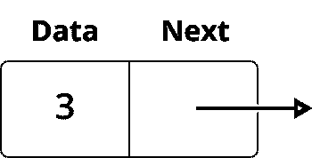
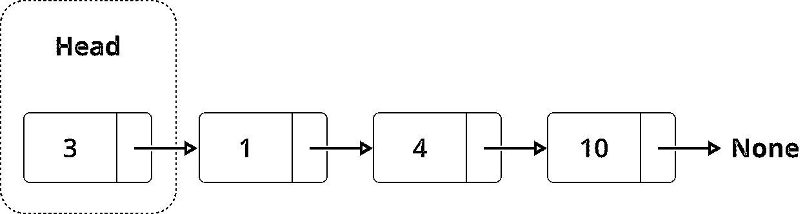
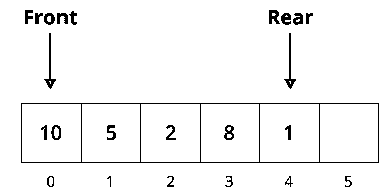
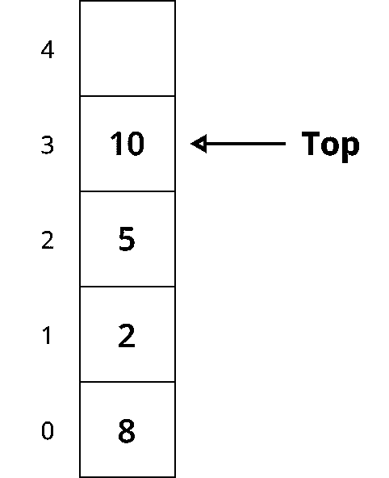
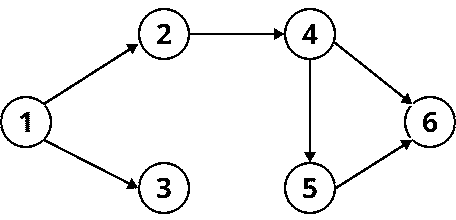
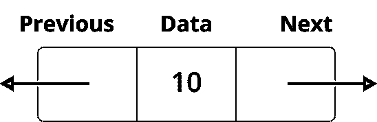
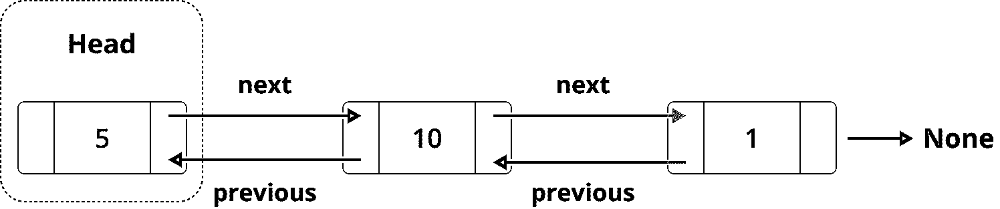
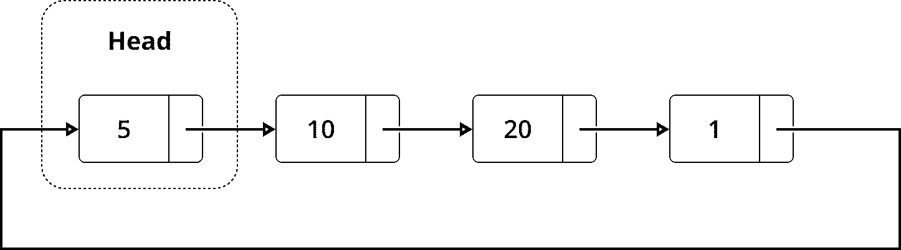

# Python 中的链表:简介

> 原文：<https://realpython.com/linked-lists-python/>

*立即观看**本教程有真实 Python 团队创建的相关视频课程。和书面教程一起看，加深理解: [**用 Python 处理链表**](/courses/working-linked-lists-python/)

**链表**就像是[链表](https://realpython.com/python-lists-tuples/)的一个鲜为人知的表亲。它们既不流行也不酷，你甚至可能不记得算法课上的它们。但在合适的背景下，他们真的可以大放异彩。

在这篇文章中，你将了解到:

*   什么是链表，什么时候应该使用它们
*   如何使用`collections.deque`来满足你所有的链表需求
*   如何实现你自己的链表
*   其他类型的链表是什么，它们可以用来做什么

如果你想为一次[工作面试](https://realpython.com/python-coding-interview-tips/)提高你的编码技能，或者如果你想学习更多关于 [Python 数据结构](https://realpython.com/python-data-structures/)的知识，除了通常的[字典](https://realpython.com/python-dicts/)和[列表](https://realpython.com/python-lists-tuples/)，那么你来对地方了！

您可以通过下载下面链接中的源代码来学习本教程中的示例:

**获取源代码:** [点击此处获取源代码，您将使用](https://realpython.com/bonus/linked-lists/)在本教程中学习链表。

## 理解链表

链表是对象的有序集合。那么是什么让它们不同于普通的列表呢？链表与列表的不同之处在于它们在内存中存储元素的方式。列表使用连续的内存块来存储对其数据的引用，而链表将引用存储为其自身元素的一部分。

[*Remove ads*](/account/join/)

### 主要概念

在深入了解什么是链表以及如何使用它们之前，您应该首先了解它们是如何构造的。链表的每个元素称为一个**节点**，每个节点有两个不同的字段:

1.  **数据**包含要存储在节点中的值。
2.  **Next** 包含对列表中下一个节点的引用。

典型的节点如下所示:

[](https://files.realpython.com/media/Group_12_2.0ded5fffe97a.png)

<figcaption class="figure-caption text-center">Node</figcaption>

链表是节点的集合。第一个节点叫做 **`head`** ，它被用作遍历列表的起点。最后一个节点必须有其指向 [`None`](https://realpython.com/null-in-python/) 的`next`引用来确定列表的结尾。它看起来是这样的:

[](https://files.realpython.com/media/Group_14.27f7c4c6ec02.png)

<figcaption class="figure-caption text-center">Linked List</figcaption>

现在您已经知道了链表是如何构造的，您已经准备好查看它的一些实际用例了。

### 实际应用

链表在现实世界中有多种用途。它们可以用来实现(*剧透警报！*)队列或[栈](https://realpython.com/how-to-implement-python-stack/)以及图形。它们对于更复杂的任务也很有用，比如操作系统应用程序的生命周期管理。

#### 队列或堆栈

队列和堆栈的区别仅在于检索元素的方式。对于一个队列，您使用一种**先进/先出** (FIFO)方法。这意味着插入列表的第一个元素是第一个被检索的元素:

[](https://files.realpython.com/media/Group_6_3.67b18836f065.png)

<figcaption class="figure-caption text-center">Queue</figcaption>

在上图中，你可以看到队列的**前**和**后**元素。当你把新元素添加到队列中时，它们会被放到队列的最后。当您检索元素时，它们将从队列的前面取出。

对于堆栈，使用**后进/先出** (LIFO)方法，这意味着插入到列表中的最后一个元素首先被检索:

[](https://files.realpython.com/media/Group_7_5.930e25fcf2a0.png)

<figcaption class="figure-caption text-center">Stack</figcaption>

在上图中，你可以看到堆栈中插入的第一个元素(索引`0`)在底部，插入的最后一个元素在顶部。因为堆栈使用 LIFO 方法，最后插入的元素(在顶部)将首先被取出。

由于从队列和堆栈的边缘插入和检索元素的方式，链表是实现这些数据结构的最方便的方式之一。在本文的后面，您将看到这些实现的例子。

#### 图表

图形可用于显示对象之间的关系或表示不同类型的网络。例如，一个图形的可视化表示(比如有向无环图(DAG))可能如下所示:

[](https://files.realpython.com/media/Group_20.32afe2d011b9.png)

<figcaption class="figure-caption text-center">Directed Acyclic Graph</figcaption>

有不同的方法来实现上面这样的图，但是最常用的方法之一是使用一个**邻接表**。本质上，邻接表是一个链表的列表，其中图的每个顶点都存储在连接的顶点的集合旁边:

| 顶点 | 顶点链表 |
| --- | --- |
| one | 2 → 3 →无 |
| Two | 4 →无 |
| three | 没有人 |
| four | 5 → 6 →无 |
| five | 6 →无 |
| six | 没有人 |

在上表中，左栏列出了图形的每个顶点。右列包含一系列链表，这些链表存储了与左列中相应顶点相连接的其他顶点。这个邻接表也可以用代码表示，使用一个`dict`:

>>>

```py
>>> graph = {
...     1: [2, 3, None],
...     2: [4, None],
...     3: [None],
...     4: [5, 6, None],
...     5: [6, None],
...     6: [None]
... }
```

这个字典的键是源顶点，每个键的值是一个列表。这个列表通常被实现为一个链表。

**注意:**在上面的例子中，你可以避免存储`None`值，但是为了清晰和与后面的例子保持一致，我们在这里保留了它们。

就速度和内存而言，与**邻接矩阵**相比，使用邻接表实现图是非常有效的。这就是链表对于图形实现如此有用的原因。

[*Remove ads*](/account/join/)

### 性能比较:列表与链表

在大多数编程语言中，链表和数组在内存中的存储方式有明显的不同。然而，在 Python 中，列表是动态数组。这意味着链表和链表的内存使用非常相似。

**延伸阅读:** Python 的动态数组的[实现非常有趣，绝对值得一读。一定要看一看，并利用这些知识在下次公司聚会上脱颖而出！](http://www.laurentluce.com/posts/python-list-implementation/)

由于链表和链表在内存使用上的差异是如此的微不足道，所以当涉及到[时间复杂度](https://www.bigocheatsheet.com/)时，如果你关注它们的性能差异会更好。

#### 元素的插入和删除

在 Python 中，可以使用`.insert()`或 [`.append()`](https://realpython.com/python-append/) 将元素插入到列表中。要从列表中删除元素，可以使用它们的对应物:`.remove()`和`.pop()`。

这些方法之间的主要区别在于，您使用`.insert()`和`.remove()`在列表中的特定位置插入或移除元素，但是您使用`.append()`和`.pop()`仅在列表的末尾插入或移除元素。

现在，关于 Python 列表，您需要知道的是，在列表末尾插入或删除不是的*元素需要在后台进行一些元素移动，这使得操作在时间上更加复杂。你可以阅读上面提到的关于[列表如何在 Python](http://www.laurentluce.com/posts/python-list-implementation/) 中实现的文章，以更好地理解`.insert()`、`.remove()`、`.append()`和`.pop()`的实现如何影响它们的性能。*

考虑到这一点，即使使用`.append()`或`.insert()`在列表末尾插入元素会有固定的时间， *O* (1)，当您尝试在更靠近列表或列表开头的位置插入元素时，平均时间复杂度会随着列表的大小而增加: *O* ( *n* )。

另一方面，当在列表的开头或结尾插入和删除元素时，链表要简单得多，因为它们的时间复杂度总是恒定的: *O* (1)。

由于这个原因，当实现队列(FIFO)时，链表比普通的链表具有更好的性能，在队列中，元素在链表的开头不断地插入和删除。但是在实现栈(LIFO)时，它们的表现类似于链表，在栈中，元素在链表的末尾被插入和删除。

#### 元素检索

当涉及到元素查找时，列表的性能比链表好得多。当你知道你想要访问哪个元素时，列表可以在 *O* (1)时间内执行这个操作。尝试对一个链表做同样的事情需要花费 *O* ( *n* )因为你需要遍历整个链表来找到元素。

然而，在搜索特定元素时，链表和链表的表现非常相似，时间复杂度为 *O* ( *n* )。在这两种情况下，您都需要遍历整个列表来找到您正在寻找的元素。

## `collections.deque`简介

在 Python 中，`collections`模块中有一个可以用于链表的特定对象，名为 [**德克**](https://docs.python.org/3.7/library/collections.html#collections.deque) (读作“deck”)，代表**双端队列**。

`collections.deque`使用了一个链表的实现，在这个链表中，你可以在不变的 *O* (1)性能下访问、插入或移除列表开头或结尾的元素。

### 如何使用`collections.deque`

默认情况下，有相当多的[方法](https://docs.python.org/2/library/collections.html#collections.deque)带有一个`deque`对象。然而，在本文中，您将只触及其中的一些，主要是添加或删除元素。

首先，您需要创建一个链表。您可以使用下面这段代码通过`deque`来做到这一点:

>>>

```py
>>> from collections import deque
>>> deque()
deque([])
```

上面的代码将创建一个空的链表。如果您想在创建时填充它，那么您可以给它一个 **iterable** 作为输入:

>>>

```py
>>> deque(['a','b','c'])
deque(['a', 'b', 'c'])

>>> deque('abc')
deque(['a', 'b', 'c'])

>>> deque([{'data': 'a'}, {'data': 'b'}])
deque([{'data': 'a'}, {'data': 'b'}])
```

当初始化一个`deque`对象时，您可以将任何 iterable 作为输入传递，比如一个字符串(也是 iterable)或者一个对象列表。

现在您已经知道如何创建一个`deque`对象，您可以通过添加或删除元素来与它交互。你可以创建一个`abcde`链表并添加一个新元素`f`，如下所示:

>>>

```py
>>> llist = deque("abcde")
>>> llist
deque(['a', 'b', 'c', 'd', 'e'])

>>> llist.append("f")
>>> llist
deque(['a', 'b', 'c', 'd', 'e', 'f'])

>>> llist.pop()
'f'

>>> llist
deque(['a', 'b', 'c', 'd', 'e'])
```

`append()`和`pop()`都在链表的右侧添加或移除元素。但是，您也可以使用`deque`快速添加或删除列表左侧的元素，或使用`head`:

>>>

```py
>>> llist.appendleft("z")
>>> llist
deque(['z', 'a', 'b', 'c', 'd', 'e'])

>>> llist.popleft()
'z'

>>> llist
deque(['a', 'b', 'c', 'd', 'e'])
```

使用`deque`对象在列表两端添加或删除元素非常简单。现在您已经准备好学习如何使用`collections.deque`来实现队列或堆栈。

[*Remove ads*](/account/join/)

### 如何实现队列和堆栈

正如您在上面了解到的，队列和堆栈之间的主要区别在于您从两者中检索元素的方式。接下来，您将了解如何使用`collections.deque`来实现这两种数据结构。

#### 队列

对于队列，您希望向列表中添加值(`enqueue`)，当时机合适时，您希望删除列表中最长的元素(`dequeue`)。例如，想象一下在一家时尚且客满的餐厅排队。如果您试图实现一个为客人安排座位的公平系统，那么您应该从创建一个队列并在客人到达时添加人员开始:

>>>

```py
>>> from collections import deque
>>> queue = deque()
>>> queue
deque([])

>>> queue.append("Mary")
>>> queue.append("John")
>>> queue.append("Susan")
>>> queue
deque(['Mary', 'John', 'Susan'])
```

现在你有玛丽、约翰和苏珊在排队。记住，因为队列是先进先出的，所以第一个进入队列的人应该第一个出来。

现在想象一段时间过去了，有几张桌子空了出来。在此阶段，您希望以正确的顺序从队列中删除人员。你应该这样做:

>>>

```py
>>> queue.popleft()
'Mary'

>>> queue
deque(['John', 'Susan'])

>>> queue.popleft()
'John'

>>> queue
deque(['Susan'])
```

每次调用`popleft()`时，您都从链表中移除 head 元素，模拟现实生活中的队列。

#### 堆栈

如果您想[创建一个堆栈](https://realpython.com/how-to-implement-python-stack/)呢？这个想法和排队差不多。唯一的区别是堆栈使用 LIFO 方法，这意味着堆栈中插入的最后一个元素应该首先被移除。

假设您正在创建一个 web 浏览器的历史功能，其中存储了用户访问的每个页面，以便他们可以轻松地回到过去。假设这些是随机用户在其浏览器上采取的操作:

1.  访问[真实 Python 的网站](https://realpython.com/)
2.  导航到[熊猫:如何读写文件](https://realpython.com/pandas-read-write-files/)
3.  点击链接[在 Python 中读写 CSV 文件](https://realpython.com/python-csv/)

如果您想将此行为映射到堆栈中，那么您可以这样做:

>>>

```py
>>> from collections import deque
>>> history = deque()

>>> history.appendleft("https://realpython.com/")
>>> history.appendleft("https://realpython.com/pandas-read-write-files/")
>>> history.appendleft("https://realpython.com/python-csv/")
>>> history
deque(['https://realpython.com/python-csv/',
 'https://realpython.com/pandas-read-write-files/',
 'https://realpython.com/'])
```

在这个例子中，您创建了一个空的`history`对象，每次用户访问一个新站点时，您使用`appendleft()`将它添加到您的`history`变量中。这样做确保了每个新元素都被添加到链表的`head`中。

现在假设用户阅读了两篇文章后，他们想返回到真正的 Python 主页去挑选一篇新文章来阅读。知道您有一个堆栈并想使用 LIFO 删除元素，您可以执行以下操作:

>>>

```py
>>> history.popleft()
'https://realpython.com/python-csv/'

>>> history.popleft()
'https://realpython.com/pandas-read-write-files/'

>>> history
deque(['https://realpython.com/'])
```

这就对了。使用`popleft()`，从链表的`head`中移除元素，直到到达真正的 Python 主页。

从上面的例子中，您可以看到在您的工具箱中有`collections.deque`是多么有用，所以下次您有基于队列或堆栈的挑战需要解决时，一定要使用它。

[*Remove ads*](/account/join/)

## 实现你自己的链表

既然你已经知道了如何使用`collections.deque`来处理链表，你可能想知道为什么你要在 Python 中实现你自己的链表。这样做有几个原因:

1.  练习您的 Python 算法技能
2.  学习数据结构理论
3.  准备工作面试

如果您对以上任何内容都不感兴趣，或者您已经成功地用 Python 实现了自己的链表，请随意跳过下一节。不然就该实现一些链表了！

### 如何创建链表

首先，创建一个[类](https://realpython.com/lessons/classes-python/)来表示你的链表:

```py
class LinkedList:
    def __init__(self):
        self.head = None
```

你需要为一个链表存储的唯一信息是链表的起始位置(链表的`head`)。接下来，创建另一个类来表示链表的每个节点:

```py
class Node:
    def __init__(self, data):
        self.data = data
        self.next = None
```

在上面的类定义中，你可以看到每个单个节点的两个主要元素: **`data`** 和 **`next`** 。您还可以在两个类中添加一个`__repr__`,以便更好地表示对象:

```py
class Node:
    def __init__(self, data):
        self.data = data
        self.next = None

    def __repr__(self):
        return self.data

class LinkedList:
    def __init__(self):
        self.head = None

    def __repr__(self):
        node = self.head
        nodes = []
        while node is not None:
            nodes.append(node.data)
            node = node.next
        nodes.append("None")
        return " -> ".join(nodes)
```

看一个使用上面的类快速创建一个有三个节点的链表的例子:

>>>

```py
>>> llist = LinkedList()
>>> llist
None

>>> first_node = Node("a")
>>> llist.head = first_node
>>> llist
a -> None

>>> second_node = Node("b")
>>> third_node = Node("c")
>>> first_node.next = second_node
>>> second_node.next = third_node
>>> llist
a -> b -> c -> None
```

通过定义节点的`data`和`next`值，您可以非常快速地创建一个链表。这些`LinkedList`和`Node`类是我们实现的起点。从现在开始，一切都是为了增加他们的功能。

这里对链表的`__init__()`做了一个小小的改变，让你可以快速创建一些数据的链表:

```py
def __init__(self, nodes=None):
    self.head = None
    if nodes is not None:
        node = Node(data=nodes.pop(0))
        self.head = node
        for elem in nodes:
            node.next = Node(data=elem)
            node = node.next
```

通过上面的修改，创建下面例子中使用的链表将会快得多。

### 如何遍历链表

你对链表做的最常见的事情之一就是**遍历**它。遍历意味着遍历每一个节点，从链表的`head`开始，到`next`值为`None`的节点结束。

遍历只是迭代的一种更好的说法。因此，记住这一点，创建一个`__iter__`来向链表添加与普通列表相同的行为:

```py
def __iter__(self):
    node = self.head
    while node is not None:
        yield node
        node = node.next
```

上面的方法遍历列表，[产生每个节点的](https://realpython.com/introduction-to-python-generators/)。关于这个`__iter__`要记住的最重要的事情是，你需要始终验证当前的`node`不是`None`。当条件为`True`时，意味着已经到达链表的末尾。

在生成当前节点后，您希望移动到列表中的下一个节点。这就是你加`node = node.next`的原因。下面是一个遍历随机列表并打印每个节点的例子:

>>>

```py
>>> llist = LinkedList(["a", "b", "c", "d", "e"])
>>> llist
a -> b -> c -> d -> e -> None

>>> for node in llist:
...     print(node)
a
b
c
d
e
```

在其他文章中，您可能会看到遍历被定义到一个名为`traverse()`的特定方法中。然而，使用 Python 的[内置方法](https://realpython.com/lessons/operators-and-built-functions/)来实现上述行为，使得这个链表的实现更加[Python 化](https://realpython.com/learning-paths/writing-pythonic-code/)。

[*Remove ads*](/account/join/)

### 如何插入新节点

将新节点插入链表有不同的方法，每种方法都有自己的实现和复杂程度。这就是为什么你会看到它们被分成特定的方法，用于在列表的开头、结尾或节点之间插入。

#### 在开头插入

在列表的开头插入一个新的节点可能是最直接的插入方式，因为你不需要遍历整个列表。这都是关于创建一个新节点，然后将列表的`head`指向它。

看看下面这个类`LinkedList`的`add_first()`实现:

```py
def add_first(self, node):
    node.next = self.head
    self.head = node
```

在上面的例子中，您将`self.head`设置为新节点的`next`引用，以便新节点指向旧的`self.head`。之后，您需要声明列表的新`head`是插入的节点。

下面是它在示例列表中的表现:

>>>

```py
>>> llist = LinkedList()
>>> llist
None

>>> llist.add_first(Node("b"))
>>> llist
b -> None

>>> llist.add_first(Node("a"))
>>> llist
a -> b -> None
```

如您所见，`add_first()`总是将节点添加到列表的`head`中，即使列表之前是空的。

#### 在末尾插入

在列表末尾插入一个新节点会迫使您首先遍历整个链表，并在到达末尾时添加新节点。你不能像普通链表那样追加到末尾，因为在链表中你不知道哪个节点是最后一个。

下面是一个在链表末尾插入节点的函数的实现示例:

```py
def add_last(self, node):
    if self.head is None:
        self.head = node
        return
    for current_node in self:
        pass
    current_node.next = node
```

首先，你要遍历整个列表，直到到达末尾(也就是说，直到 [`for`循环](https://realpython.com/python-for-loop/)引发一个`StopIteration`异常)。接下来，您希望将`current_node`设置为列表中的最后一个节点。最后，您希望添加新节点作为那个`current_node`的`next`值。

这里有一个`add_last()`的例子:

>>>

```py
>>> llist = LinkedList(["a", "b", "c", "d"])
>>> llist
a -> b -> c -> d -> None

>>> llist.add_last(Node("e"))
>>> llist
a -> b -> c -> d -> e -> None

>>> llist.add_last(Node("f"))
>>> llist
a -> b -> c -> d -> e -> f -> None
```

在上面的代码中，首先创建一个包含四个值的列表(`a`、`b`、`c`和`d`)。然后，当您使用`add_last()`添加新节点时，您可以看到这些节点总是被追加到列表的末尾。

#### 在两个节点之间插入

在两个节点之间插入又增加了一层复杂性，因为有两种不同的方法可以使用:

1.  在现有节点后插入
**   在现有节点之前插入

*将它们分成两个方法可能看起来很奇怪，但是链表的行为不同于普通的链表，每种情况都需要不同的实现。

下面是一个方法，它在具有特定数据值的现有节点后添加一个节点*:*

```py
def add_after(self, target_node_data, new_node):
    if self.head is None:
        raise Exception("List is empty")

    for node in self:
        if node.data == target_node_data:
            new_node.next = node.next
            node.next = new_node
            return

    raise Exception("Node with data '%s' not found" % target_node_data)
```

在上面的代码中，您正在遍历链表，寻找带有数据的节点，该数据指示您想要插入新节点的位置。当您找到您正在寻找的节点时，您将在它之后立即插入新节点，并重新连接`next`引用以保持列表的一致性。

唯一的例外是列表为空，使得无法在现有节点后插入新节点，或者列表不包含要搜索的值。以下是几个关于`add_after()`行为的例子:

>>>

```py
>>> llist = LinkedList()
>>> llist.add_after("a", Node("b"))
Exception: List is empty

>>> llist = LinkedList(["a", "b", "c", "d"])
>>> llist
a -> b -> c -> d -> None

>>> llist.add_after("c", Node("cc"))
>>> llist
a -> b -> c -> cc -> d -> None

>>> llist.add_after("f", Node("g"))
Exception: Node with data 'f' not found
```

试图在空列表上使用`add_after()`会导致[异常](https://realpython.com/courses/introduction-python-exceptions/)。当您试图在一个不存在的节点后添加时，也会发生同样的情况。其他一切都按预期运行。

现在，如果你想实现`add_before()`，那么它看起来会像这样:

```py
 1def add_before(self, target_node_data, new_node):
 2    if self.head is None: 3        raise Exception("List is empty")
 4
 5    if self.head.data == target_node_data: 6        return self.add_first(new_node)
 7
 8    prev_node = self.head
 9    for node in self: 10        if node.data == target_node_data:
11            prev_node.next = new_node
12            new_node.next = node
13            return
14        prev_node = node
15
16    raise Exception("Node with data '%s' not found" % target_node_data)
```

在实现上述内容时，有一些事情需要记住。首先，和`add_after()`一样，如果链表是空的(第 2 行)或者您正在寻找的节点不存在(第 16 行)，您希望确保引发一个异常。

其次，如果您试图在列表的头部(第 5 行)之前添加一个新节点，那么您可以重用`add_first()`，因为您插入的节点将是列表的新`head`。

最后，对于任何其他情况(第 9 行)，您应该使用`prev_node`变量跟踪最后检查的节点。然后，当您找到目标节点时，您可以使用那个`prev_node`变量来重新连接`next`值。

再说一次，一个例子胜过千言万语:

>>>

```py
>>> llist = LinkedList()
>>> llist.add_before("a", Node("a"))
Exception: List is empty

>>> llist = LinkedList(["b", "c"])
>>> llist
b -> c -> None

>>> llist.add_before("b", Node("a"))
>>> llist
a -> b -> c -> None

>>> llist.add_before("b", Node("aa"))
>>> llist.add_before("c", Node("bb"))
>>> llist
a -> aa -> b -> bb -> c -> None

>>> llist.add_before("n", Node("m"))
Exception: Node with data 'n' not found
```

有了`add_before()`，您现在拥有了在列表中任意位置插入节点所需的所有方法。

[*Remove ads*](/account/join/)

### 如何删除一个节点

要从链表中删除一个节点，首先需要遍历链表，直到找到要删除的节点。找到目标后，您希望链接它的上一个和下一个节点。这种重新链接是从列表中删除目标节点的原因。

这意味着在遍历列表时，需要跟踪上一个节点。请看一个示例实现:

```py
 1def remove_node(self, target_node_data):
 2    if self.head is None: 3        raise Exception("List is empty")
 4
 5    if self.head.data == target_node_data: 6        self.head = self.head.next
 7        return
 8
 9    previous_node = self.head
10    for node in self: 11        if node.data == target_node_data:
12            previous_node.next = node.next
13            return
14        previous_node = node
15
16    raise Exception("Node with data '%s' not found" % target_node_data)
```

在上面的代码中，您首先检查您的列表是否为空(第 2 行)。如果是，那么您将引发一个异常。之后，检查要删除的节点是否是列表的当前`head`(第 5 行)。如果是，那么您希望列表中的下一个节点成为新的`head`。

如果上述情况都没有发生，那么您开始遍历列表，寻找要删除的节点(第 10 行)。如果您找到了它，那么您需要更新它的前一个节点以指向它的下一个节点，自动从列表中删除找到的节点。最后，如果遍历整个列表，却没有找到要删除的节点(第 16 行)，那么就会引发一个异常。

注意在上面的代码中，你如何使用`previous_node`来跟踪上一个节点。这样做可以确保当您找到要删除的正确节点时，整个过程会简单得多。

下面是一个使用列表的示例:

>>>

```py
>>> llist = LinkedList()
>>> llist.remove_node("a")
Exception: List is empty

>>> llist = LinkedList(["a", "b", "c", "d", "e"])
>>> llist
a -> b -> c -> d -> e -> None

>>> llist.remove_node("a")
>>> llist
b -> c -> d -> e -> None

>>> llist.remove_node("e")
>>> llist
b -> c -> d -> None

>>> llist.remove_node("c")
>>> llist
b -> d -> None

>>> llist.remove_node("a")
Exception: Node with data 'a' not found
```

就是这样！现在，您已经知道了如何实现一个链表，以及遍历、插入和删除节点的所有主要方法。如果你对你所学的感到满意，并且渴望更多，那么请随意选择下面的一个挑战:

1.  创建一个方法从特定的位置检索元素:`get(i)`甚至`llist[i]`。
2.  创建反转链表的方法:`llist.reverse()`。
3.  用`enqueue()`和`dequeue()`方法创建一个继承这篇文章的链表的`Queue()`对象。

除了是很好的练习，自己做一些额外的挑战也是吸收你所获得的所有知识的有效方法。如果您想重用本文中的所有源代码，那么您可以从下面的链接下载您需要的所有内容:

**获取源代码:** [点击此处获取源代码，您将使用](https://realpython.com/bonus/linked-lists/)在本教程中学习链表。

## 使用高级链表

到目前为止，你已经学习了一种叫做**单链表**的特定类型的链表。但是有更多类型的链表可以用于稍微不同的目的。

### 如何使用双向链表

双向链表不同于单向链表，因为它们有两个引用:

1.  `previous`字段引用前一个节点。
2.  `next`字段引用下一个节点。

最终结果如下所示:

[](https://files.realpython.com/media/Group_23.a9df781f6087.png)

<figcaption class="figure-caption text-center">Node (Doubly Linked List)</figcaption>

如果您想要实现上述内容，那么您可以对现有的`Node`类进行一些更改，以便包含一个`previous`字段:

```py
class Node:
    def __init__(self, data):
        self.data = data
        self.next = None
        self.previous = None
```

这种实现将允许您双向遍历列表，而不仅仅是使用`next`来遍历。你可以用`next`前进，用`previous`后退。

就结构而言，双向链表应该是这样的:

[](https://files.realpython.com/media/Group_21.7139fd0c8abb.png)

<figcaption class="figure-caption text-center">Doubly Linked List</figcaption>

您之前了解到`collections.deque`使用链表作为其数据结构的一部分。这就是它使用的那种[链表](https://github.com/python/cpython/blob/master/Modules/_collectionsmodule.c#L33)。使用双向链表，`deque`能够在队列的两端插入或删除元素，并且具有恒定的 *O* (1)性能。

[*Remove ads*](/account/join/)

### 如何使用循环链表

**循环链表**是最后一个节点指向链表的`head`而不是指向`None`的一种链表。这就是为什么它们是圆形的。循环链表有很多有趣的用例:

*   在多人游戏中，每个玩家轮流玩
*   管理给定操作系统的应用程序生命周期
*   实现一个[斐波那契堆](https://en.wikipedia.org/wiki/Fibonacci_heap)

循环链表是这样的:

[](https://files.realpython.com/media/Group_22.cee69a15dbe3.png)

<figcaption class="figure-caption text-center">Circular Linked List</figcaption>

循环链表的优点之一是可以从任意节点开始遍历整个链表。由于最后一个节点指向列表的`head`，所以需要确保在到达起点时停止遍历。否则，你会陷入无限循环。

在实现方面，循环链表和单链表非常相似。唯一的区别是，您可以在遍历列表时定义起点:

```py
class CircularLinkedList:
    def __init__(self):
        self.head = None

    def traverse(self, starting_point=None):
        if starting_point is None:
            starting_point = self.head
        node = starting_point
        while node is not None and (node.next != starting_point):
            yield node
            node = node.next
        yield node

    def print_list(self, starting_point=None):
        nodes = []
        for node in self.traverse(starting_point):
            nodes.append(str(node))
        print(" -> ".join(nodes))
```

现在遍历列表会收到一个额外的参数`starting_point`，用于定义迭代过程的开始和结束(因为列表是循环的)。除此之外，大部分代码和我们在`LinkedList`类中的一样。

作为最后一个例子的总结，看看当你给它一些数据时，这种新类型的列表是如何表现的:

>>>

```py
>>> circular_llist = CircularLinkedList()
>>> circular_llist.print_list()
None

>>> a = Node("a")
>>> b = Node("b")
>>> c = Node("c")
>>> d = Node("d")
>>> a.next = b
>>> b.next = c
>>> c.next = d
>>> d.next = a
>>> circular_llist.head = a
>>> circular_llist.print_list()
a -> b -> c -> d

>>> circular_llist.print_list(b)
b -> c -> d -> a

>>> circular_llist.print_list(d)
d -> a -> b -> c
```

你有它！您会注意到在遍历列表时不再有`None`。这是因为循环列表没有特定的结尾。您还可以看到，选择不同的起始节点将呈现相同列表的稍微不同的表示。

## 结论

在这篇文章中，你学到了不少东西！最重要的是:

*   什么是链表，什么时候应该使用它们
*   如何使用`collections.deque`实现队列和堆栈
*   如何实现你自己的链表和节点类，以及相关的方法
*   其他类型的链表是什么，它们可以用来做什么

如果你想了解更多关于链表的知识，那么看看 [Vaidehi Joshi 的博文](https://medium.com/basecs/whats-a-linked-list-anyway-part-1-d8b7e6508b9d)中一个漂亮的视觉解释。如果你对更深入的指南感兴趣，那么[维基百科文章](https://en.wikipedia.org/wiki/Linked_list)相当全面。最后，如果你对当前实现`collections.deque`背后的推理感到好奇，那么看看[雷蒙德·赫廷格的线程](https://mail.python.org/pipermail/python-dev/2007-November/075244.html)。

您可以点击以下链接下载本教程中使用的源代码:

**获取源代码:** [点击此处获取源代码，您将使用](https://realpython.com/bonus/linked-lists/)在本教程中学习链表。

欢迎在下面留下任何问题或评论。快乐的蟒蛇！

*立即观看**本教程有真实 Python 团队创建的相关视频课程。和书面教程一起看，加深理解: [**用 Python 处理链表**](/courses/working-linked-lists-python/)***********