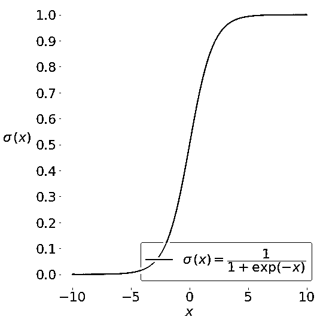
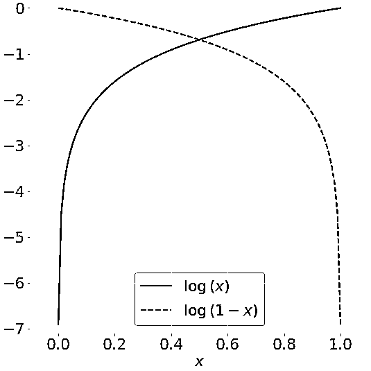
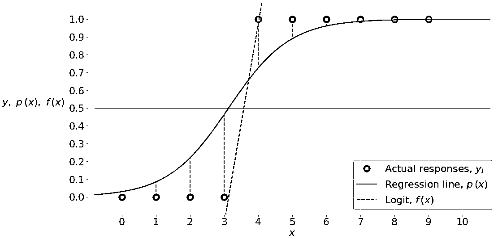
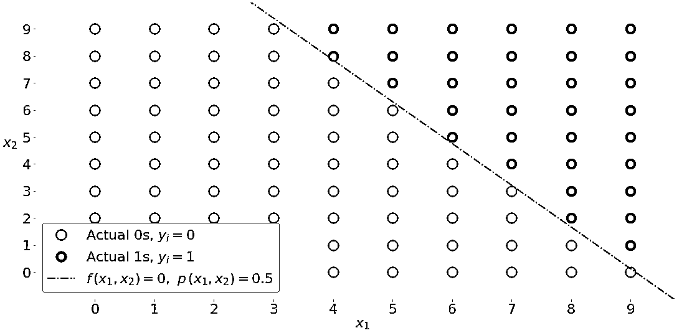
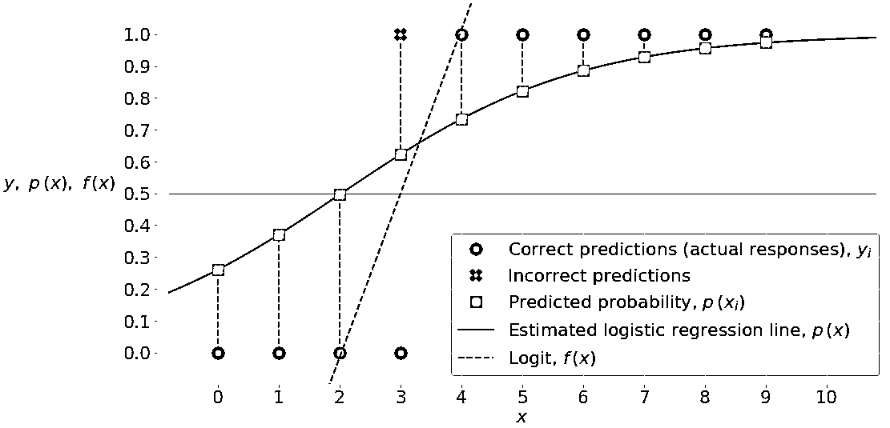
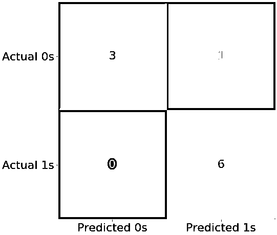
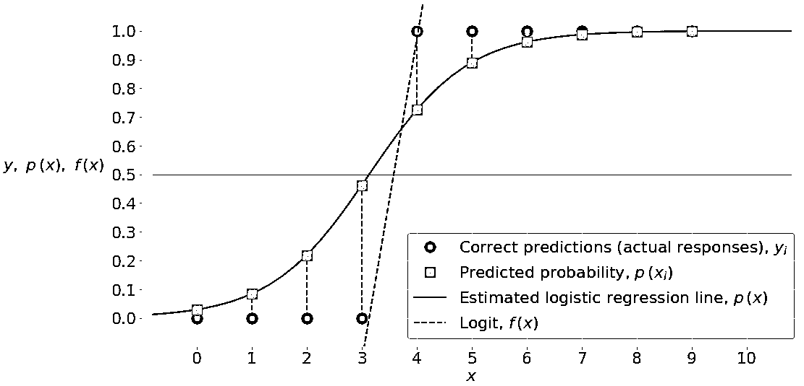
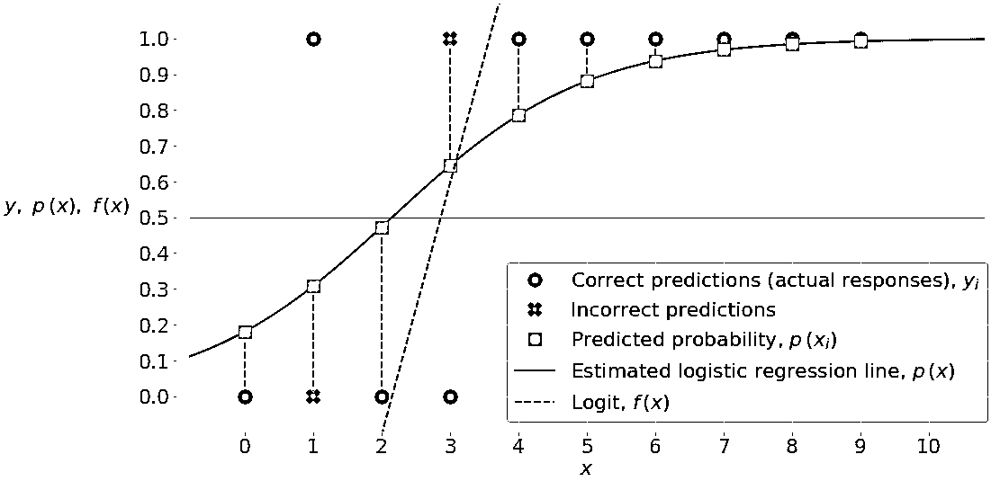
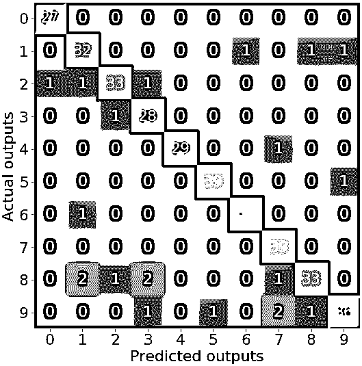

# Python 中的逻辑回归

> 原文：<https://realpython.com/logistic-regression-python/>

随着可用数据的数量、计算能力的强度和算法改进的数量不断上升，[数据科学](https://realpython.com/tutorials/data-science/)和[机器学习](https://realpython.com/tutorials/machine-learning/)的重要性也在增加。**分类**是机器学习最重要的领域之一，而**逻辑回归**是其基本方法之一。到本教程结束时，您将已经学习了分类的一般知识，特别是逻辑回归的基础知识，以及如何在 Python 中实现逻辑回归。

在本教程中，您将学习:

*   什么是逻辑回归
*   逻辑回归有什么用
*   逻辑回归如何工作
*   如何在 Python 中逐步实现逻辑回归

**免费奖励:** [点击此处获取免费的 NumPy 资源指南](#)，它会为您指出提高 NumPy 技能的最佳教程、视频和书籍。

## 分类

[分类](https://en.wikipedia.org/wiki/Statistical_classification)是[监督机器学习](https://en.wikipedia.org/wiki/Supervised_learning)的一个非常重要的领域。大量重要的机器学习问题都属于这个领域。分类方法有很多种，logistic 回归是其中一种。

[*Remove ads*](/account/join/)

### 什么是分类？

监督机器学习算法定义了捕捉数据之间关系的模型。**分类**是监督机器学习的一个领域，它试图根据某个实体的特征来预测它属于哪个类或类别。

例如，你可能会分析某个公司的员工，并试图建立对**特征**或**变量**的依赖关系，如教育水平、在当前职位上的年数、年龄、工资、晋升机会等等。与单个雇员相关的数据集是一个**观察**。特征或[变量](https://realpython.com/python-variables/)可以采取两种形式之一:

1.  **独立变量**，也称为输入或预测值，不依赖于其他感兴趣的特征(或者至少你假设是为了分析)。
2.  **因变量**，也称为输出或响应，取决于自变量。

在上面分析员工的例子中，您可能假设教育水平、在当前职位上的时间和年龄是相互独立的，并将它们视为输入。工资和晋升机会可能是依赖于投入的产出。

**注:**有监督的机器学习算法分析大量的观察值，并试图用数学方式表达输入和输出之间的依赖关系。这些依赖关系的数学表示就是**模型**。

因变量的性质区分了[回归](https://realpython.com/linear-regression-in-python/#regression)和分类问题。**回归**问题有连续且通常无界的输出。一个例子是当你根据经验和教育水平来估算工资时。另一方面，**分类**问题具有离散且有限的输出，称为**类**或**类**。例如，预测一个员工是否将被提升(对或错)是一个分类问题。

分类问题主要有两种类型:

1.  **二进制**或**二项式分类:**正好两个类别可供选择(通常是 0 和 1，真和假，或正和负)
2.  **多类**或**多项分类:**三类或更多类的输出可供选择

如果只有一个输入变量，那么通常用𝑥.表示对于多个输入，您通常会看到向量符号𝐱 = (𝑥₁，…，𝑥ᵣ)，其中𝑟是预测值(或独立特征)的数量。输出变量通常用𝑦表示，取值为 0 或 1。

### 什么时候需要分类？

你可以在很多科技领域应用分类。例如，文本分类算法用于区分合法和垃圾邮件，以及正面和负面评论。您可以查看使用 Python 和 Keras 的[实用文本分类来深入了解这个主题。其他例子包括医疗应用、生物分类、信用评分等等。](https://realpython.com/python-keras-text-classification/)

图像识别任务通常被表示为分类问题。例如，你可能会问一幅图像是否描绘了一张人脸，或者它是一只老鼠还是一只大象，或者它代表 0 到 9 中的哪一个数字，等等。要了解更多这方面的内容，请查看用 Python 实现的[传统人脸检测](https://realpython.com/traditional-face-detection-python/)和用 Python 实现的[人脸识别，不到 25 行代码](https://realpython.com/face-recognition-with-python/)。

## 逻辑回归概述

逻辑回归是一种基本的分类技术。属于 **[线性分类器](https://en.wikipedia.org/wiki/Linear_classifier)** 的一组，有点类似于多项式和 [**线性回归**](https://realpython.com/linear-regression-in-python/) 。逻辑回归快速且相对简单，便于你解读结果。尽管它本质上是一种二元分类的方法，但它也可以应用于多类问题。

### 数学先决条件

为了理解什么是逻辑回归以及它是如何工作的，你需要理解 sigmoid 函数 T1 和 T2 自然对数函数 T3。

此图显示了一些可变𝑥:的 s 形函数(或 s 形曲线)

[](https://files.realpython.com/media/log-reg-1.e32deaa7cbac.png)

在 sigmoid 函数的大部分范围内，其值非常接近 0 或 1。这一事实使它适合应用于分类方法。

此图描绘了某个变量𝑥的自然对数 log(𝑥，𝑥值在 0 和 1 之间:

[](https://files.realpython.com/media/log-reg-4.81e9806a86fa.png)

当𝑥接近零时，𝑥的自然对数向负无穷大下降。当𝑥 = 1 时，log(𝑥)是 0。对数(1 𝑥).)则相反

注意，你经常会发现在中用**表示的自然对数，而不是 **log** 。在 Python 中，`math.log(x)`和`numpy.log(x)`代表`x`的自然对数，所以在本教程中您将遵循这种符号。**

[*Remove ads*](/account/join/)

### 问题表述

在本教程中，您将看到对应用于二元分类的逻辑回归的常见情况的解释。当你在自变量集𝐱 = (𝑥₁，…，𝑥ᵣ)上实现某因变量𝑦的逻辑回归时，其中𝑟是预测器(或输入)的数量，你从预测器的已知值𝐱ᵢ和每个观测值对应的实际响应(或输出)𝑦ᵢ开始𝑖 = 1，…，1。

你的目标是找到**逻辑回归函数** 𝑝(𝐱)使得**预测响应** 𝑝(𝐱ᵢ)尽可能接近每次观察的**实际响应**𝑦ᵢ𝑖= 1，…，𝑛.记住，在二进制分类问题中，实际响应只能是 0 或 1！这意味着每个𝑝(𝐱ᵢ)应该接近 0 或 1。这就是为什么使用 sigmoid 函数很方便。

一旦你有了逻辑回归函数𝑝(𝐱，你就可以用它来预测新的和未知的输入的输出，假设基本的数学依赖关系不变。

### 方法学

逻辑回归是一个线性分类器，因此您将使用一个线性函数𝑓(𝐱) = 𝑏₀ + 𝑏₁𝑥₁ + ⋯ + 𝑏ᵣ𝑥ᵣ，也称为 **logit** 。变量𝑏₀、𝑏₁、…、𝑏ᵣ是回归系数的**估计量**，也称为**预测权重**或简称为**系数**。

逻辑回归函数𝑝(𝐱)是𝑓(𝐱): 𝑝(𝐱的 sigmoid 函数)= 1 / (1 + exp(−𝑓(𝐱)).因此，它通常接近 0 或 1。函数𝑝(𝐱)通常被解释为给定𝐱的输出等于 1 的预测概率。因此，1𝑝(𝑥)是输出为 0 的概率。

逻辑回归确定最佳预测权重𝑏₀、𝑏₁、…、𝑏ᵣ，使得函数𝑝(𝐱尽可能接近所有实际响应𝑦ᵢ、𝑖 = 1、…、𝑛，其中𝑛是观察次数。使用可用观测值计算最佳权重的过程被称为**模型训练**或**拟合**。

为了得到最好的权重，你通常最大化所有观测值的**对数似然函数(llf)**𝑖= 1，…，𝑛.这种方法被称为**最大似然估计**，由等式 llf =σᵢ(𝑦ᵢlog(𝑝(𝐱ᵢ)+(1𝑦ᵢ)对数(1 𝑝(𝐱ᵢ))).)表示

当𝑦ᵢ = 0 时，相应观测值的 LLF 等于 log(1 𝑝(𝐱ᵢ)).如果𝑝(𝐱ᵢ)接近𝑦ᵢ = 0，那么 log(1𝑝(𝐱ᵢ))接近 0。这就是你想要的结果。如果𝑝(𝐱ᵢ)远离 0，则 log(1𝑝(𝐱ᵢ)显著下降。你不想要那个结果，因为你的目标是获得最大的 LLF。类似地，当𝑦ᵢ = 1 时，该观察的 LLF 是𝑦ᵢ log(𝑝(𝐱ᵢ)).如果𝑝(𝐱ᵢ)接近𝑦ᵢ = 1，那么 log(𝑝(𝐱ᵢ))接近 0。如果𝑝(𝐱ᵢ)远离 1，那么 log(𝑝(𝐱ᵢ)是一个大的负数。

有几种数学方法可以计算最大 LLF 对应的最佳权重，但这超出了本教程的范围。现在，您可以将这些细节留给您将在这里学习使用的逻辑回归 Python 库！

一旦确定了定义函数𝑝(𝐱的最佳权重，就可以得到任何给定输入𝐱ᵢ.的预测输出𝑝(𝐱ᵢ对于每个观察值𝑖 = 1，…，𝑛，如果𝑝(𝐱ᵢ) > 0.5，预测输出为 1，否则为 0。阈值不一定是 0.5，但通常是 0.5。如果更适合您的情况，您可以定义一个较低或较高的值。

𝑝(𝐱)和𝑓(𝐱)之间还有一个更重要的关系，那就是 log(𝑝(𝐱)/(1𝑝(𝐱)))= 𝑓(𝐱).这个等式解释了为什么𝑓(𝐱是逻辑。这意味着当𝑓(𝐱= 0 时，𝑝(𝐱= 0.5，如果𝑓(𝐱为 0，则预测输出为 1，否则为 0。

### 分类性能

二元分类有四种可能的[类型的结果](https://developers.google.com/machine-learning/crash-course/classification/true-false-positive-negative):

1.  **真否定:**正确预测的否定(零)
2.  **真阳性:**正确预测阳性(个)
3.  **假阴性:**错误预测的阴性(零)
4.  **假阳性:**错误预测的阳性(个)

您通常通过比较实际输出和预测输出并计算正确和不正确的预测来评估分类器的性能。

**分类精度**最直观的指标是正确预测数与预测(或观测)总数的比值。二元分类器的其他指标包括:

*   **[阳性预测值](https://en.wikipedia.org/wiki/Positive_and_negative_predictive_values#Positive_predictive_value)** 是真阳性数量与真阳性和假阳性数量之和的比值。
*   **[阴性预测值](https://en.wikipedia.org/wiki/Positive_and_negative_predictive_values#Negative_predictive_value)** 是真阴性数量与真阴性和假阴性数量之和的比值。
*   (也称为回忆或真阳性率)是真阳性的数量与实际阳性的数量之比。
*   (或真阴性率)是真阴性数与实际阴性数之比。

最合适的指标取决于兴趣问题。在本教程中，您将使用最简单的分类精度形式。

[*Remove ads*](/account/join/)

### 单变量逻辑回归

**单变量逻辑回归**是逻辑回归最直接的例子。自变量(或特征)只有一个，就是𝐱 = 𝑥.下图说明了单变量逻辑回归:

[](https://files.realpython.com/media/log-reg-2.e88a21607ba3.png)

这里，您有一组给定的输入输出(或𝑥-𝑦)对，用绿色圆圈表示。这些是你的观察。记住𝑦只能是 0 或 1。例如，最左边的绿色圆圈的输入𝑥 = 0，实际输出𝑦 = 0。最右边的观察结果是𝑥 = 9，𝑦 = 1。

逻辑回归找到对应于最大 LLF 的权重𝑏₀和𝑏₁。这些权重定义了 logit 𝑓(𝑥) = 𝑏₀ + 𝑏₁𝑥，这是黑色虚线。他们还定义了预测概率𝑝(𝑥) = 1 / (1 + exp(−𝑓(𝑥))，这里显示为黑色实线。在这种情况下，阈值𝑝(𝑥) = 0.5 和𝑓(𝑥) = 0 对应于略高于 3 的𝑥值。该值是预测输出为 0 和 1 的输入之间的界限。

### 多变量逻辑回归

**多变量逻辑回归**有多个输入变量。该图显示了具有两个独立变量的分类，𝑥₁和𝑥₂:

[](https://files.realpython.com/media/log-reg-3.b1634d335c4f.png)

该图与单变量图不同，因为两个轴都代表输入。输出的颜色也不同。白色圆圈表示分类为零的观察值，而绿色圆圈表示分类为一的观察值。

逻辑回归确定使 LLF 最大化的𝑏₀、𝑏₁和𝑏₂的权重。一旦你有了𝑏₀、𝑏₁和𝑏₂，你就能得到:

*   **the logit**𝑥₂𝑓(𝑥₁)=𝑏₀+𝑏₁𝑥₁+𝑏₂𝑥₂
*   **概率** 𝑝(𝑥₁，𝑥₂) = 1 / (1 + exp(−𝑓(𝑥₁，𝑥₂))

虚线黑线将两个类别线性分开。这条线对应于𝑥₂的𝑝(𝑥₁)= 0.5 和𝑥₂的𝑓(𝑥₁)= 0。

### 正规化

[](https://realpython.com/linear-regression-in-python/#underfitting-and-overfitting)**过拟合是机器学习中最严重的问题之一。当模型对训练数据学习得太好时，就会发生这种情况。然后，该模型不仅学习数据之间的关系，还学习数据集中的噪声。过度拟合的模型在用于拟合它们的数据(训练数据)下往往具有良好的性能，但是在未看到的数据(或测试数据，即未用于拟合模型的数据)下表现不佳。*

*过度拟合通常发生在复杂模型中。**正则化**通常试图降低或惩罚模型的复杂性。应用逻辑回归的正则化技术大多倾向于惩罚大系数𝑏₀，𝑏₁，…，𝑏ᵣ:

*   **L1 正则化**用加权绝对值的缩放和惩罚 llf:|𝑏₀|+|𝑏₁|+⋯+|𝑏ᵣ|.
*   **L2 正则化**用权重的缩放平方和惩罚 llf:𝑏₀+𝑏₁+⋯+𝑏ᵣ。
*   **弹性网正则化**是 L1 和 L2 正则化的线性组合。

正则化可以显著提高对不可见数据的建模性能。

## Python 中的逻辑回归

现在您已经理解了基本原理，您已经准备好应用适当的[包](https://realpython.com/python-modules-packages/)以及它们的函数和类来执行 Python 中的逻辑回归。在本节中，您将看到以下内容:

*   **用于逻辑回归的 Python 包**概述(NumPy、scikit-learn、StatsModels 和 Matplotlib)
*   **用 scikit-learn 求解逻辑回归的两个示例**
*   **用 StatsModels 解决的一个概念示例**
*   **一个手写数字分类的真实例子**

让我们开始用 Python 实现逻辑回归吧！

[*Remove ads*](/account/join/)

### 逻辑回归 Python 包

Python 中的逻辑回归需要几个包。它们都是免费和开源的，有很多可用的资源。首先，您需要 **NumPy** ，这是 Python 中科学和数值计算的基础包。NumPy 很有用，也很受欢迎，因为它支持在一维或多维数组上进行高性能操作。

NumPy 有许多有用的数组例程。它允许您编写优雅而简洁的代码，并且可以很好地与许多 Python 包一起工作。如果你想学习 NumPy，那么你可以从官方的[用户指南](https://docs.scipy.org/doc/numpy/user/index.html)开始。 [NumPy 参考文献](https://docs.scipy.org/doc/numpy/reference/)也提供了关于其函数、类和方法的全面文档。

**注意:**要了解更多关于 NumPy 性能及其提供的其他好处，请查看[Pure Python vs NumPy vs tensor flow 性能比较](https://realpython.com/numpy-tensorflow-performance/)和 [Look Ma，No For-Loops:Array Programming With NumPy](https://realpython.com/numpy-array-programming/)。

您将使用的另一个 Python 包是 **scikit-learn** 。这是最受欢迎的[数据科学](https://realpython.com/tutorials/data-science/)和[机器学习](https://realpython.com/tutorials/machine-learning/)库。您可以使用 scikit-learn 执行各种功能:

*   **预处理**数据
*   **降低**问题的维度
*   **验证**模型
*   **选择**最合适的型号
*   **解决**回归和分类问题
*   **实现**聚类分析

你可以在 scikit-learn 官方网站上找到有用的信息，在那里你可能想要阅读关于[广义线性模型](https://scikit-learn.org/stable/modules/linear_model.html)和[逻辑回归实现](https://scikit-learn.org/stable/modules/linear_model.html#logistic-regression)的内容。如果您需要 scikit-learn 无法提供的功能，那么您可能会发现 **StatsModels** 很有用。这是一个用于统计分析的强大 Python 库。你可以在官方[网站](https://www.statsmodels.org/stable/index.html)找到更多信息。

最后，您将使用 **Matplotlib** 来可视化您的分类结果。这是一个全面的 Python 库，广泛用于高质量的绘图。更多信息，可以查看官方[网站](https://matplotlib.org/)和[用户指南](https://matplotlib.org/users/index.html)。有几个学习 Matplotlib 的资源可能对你有用，比如官方的[教程](https://matplotlib.org/tutorials/index.html)，Matplotlib 的[剖析](https://github.com/matplotlib/AnatomyOfMatplotlib)，以及 [Python 使用 Matplotlib 绘图(指南)](https://realpython.com/python-matplotlib-guide/)。

### 用 scikit-learn 实现 Python 中的逻辑回归:示例 1

第一个例子与单变量二元分类问题有关。这是最简单的分类问题。在准备分类模型时，您将采取几个常规步骤:

1.  **导入**包、函数和类
2.  **获取**要处理的数据，如果合适的话，对其进行转换
3.  **创建**一个分类模型，并用现有数据训练(或拟合)它
4.  评估你的模型，看看它的性能是否令人满意

您定义的足够好的模型可用于对新的、未知的数据进行进一步的预测。上述过程对于分类和回归是相同的。

#### 步骤 1:导入包、函数和类

首先，你必须[为可视化导入](https://realpython.com/absolute-vs-relative-python-imports/) Matplotlib，为数组操作导入 NumPy。您还需要 scikit-learn 中的`LogisticRegression`、`classification_report()`和`confusion_matrix()`:

```py
import matplotlib.pyplot as plt
import numpy as np
from sklearn.linear_model import LogisticRegression
from sklearn.metrics import classification_report, confusion_matrix
```

现在您已经用 scikit 在 Python 中导入了逻辑回归所需的所有东西——学习！

#### 第二步:获取数据

在实践中，您通常会有一些数据要处理。出于本例的目的，让我们只为输入(𝑥)和输出(𝑦)值创建数组:

```py
x = np.arange(10).reshape(-1, 1)
y = np.array([0, 0, 0, 0, 1, 1, 1, 1, 1, 1])
```

输入和输出应该是 NumPy 数组(类`numpy.ndarray`的实例)或类似的对象。`numpy.arange()`在给定范围内创建一个连续的等距值数组。关于这个函数的更多信息，请查看官方[文档](https://docs.scipy.org/doc/numpy/reference/generated/numpy.arange.html)或 [NumPy arange():如何使用 np.arange()](https://realpython.com/how-to-use-numpy-arange/) 。

要求数组`x`为**二维**。每个输入应该有一列，行数应该等于观察数。为了使`x`二维化，您可以应用带有参数`-1`的`.reshape()`来获得所需的多行，应用`1`来获得一列。更多关于`.reshape()`的信息，可以查看官方[文档](https://docs.scipy.org/doc/numpy/reference/generated/numpy.ndarray.reshape.html)。下面是`x`和`y`现在的样子:

>>>

```py
>>> x
array([[0],
 [1],
 [2],
 [3],
 [4],
 [5],
 [6],
 [7],
 [8],
 [9]])
>>> y
array([0, 0, 0, 0, 1, 1, 1, 1, 1, 1])
```

`x`有两个维度:

1.  **一列**用于单次输入
2.  **十行**，每一行对应一次观测

`y`是有十个项目的一维。同样，每个项目对应一个观察。它只包含 0 和 1，因为这是一个二进制分类问题。

#### 第三步:创建一个模型并训练它

一旦您准备好了输入和输出，您就可以创建和定义您的分类模型。您将使用类`LogisticRegression`的实例来表示它:

```py
model = LogisticRegression(solver='liblinear', random_state=0)
```

上面的语句创建了一个`LogisticRegression`的实例，并将其引用绑定到变量`model`。`LogisticRegression`有几个可选参数定义模型和方法的行为:

*   **`penalty`** 是一个[字符串](https://realpython.com/python-strings/)(默认为`'l2'`)决定是否有正则化以及使用哪种方法。其他选项有`'l1'`、`'elasticnet'`和`'none'`。

*   **`dual`** 是一个[布尔](https://realpython.com/python-boolean/)(默认为`False`)决定是使用 primal(当`False`)还是对偶公式化(当`True`)。

*   **`tol`** 是一个浮点数(默认为`0.0001`)，定义了停止程序的公差。

*   **`C`** 是一个正浮点数(默认为`1.0`，定义正则化的相对强度。较小的值表示较强的正则化。

*   **`fit_intercept`** 是一个布尔值(默认为`True`)，决定是计算截距𝑏₀(当`True`时)还是将其视为等于零(当`False`时)。

*   **`intercept_scaling`** 是一个浮点数(默认为`1.0`)，定义了截距𝑏₀.的缩放比例

*   **`class_weight`** 是一个字典，`'balanced'`或`None`(默认)定义了与每个类相关的权重。当`None`时，所有类的权重都是 1。

*   **`random_state`** 是一个整数，`numpy.RandomState`的一个实例，或者`None`(默认)定义使用什么伪随机数发生器。

*   **`solver`** 是一个字符串(默认为`'liblinear'`)，决定使用什么解算器来拟合模型。其他选项有`'newton-cg'`、`'lbfgs'`、`'sag'`和`'saga'`。

*   **`max_iter`** 是一个整数(默认为`100`)，用于定义模型拟合过程中求解器的最大迭代次数。

*   **`multi_class`** 是一个字符串(默认为`'ovr'`)，决定了处理多个类的方法。其他选项有`'multinomial'`和`'auto'`。

*   **`verbose`** 是一个非负整数(默认为`0`)，定义了`'liblinear'`和`'lbfgs'`解算器的详细程度。

*   **`warm_start`** 是一个布尔型(`False`默认)，决定是否重用之前得到的解。

*   **`n_jobs`** 是一个整数或`None`(默认值)，定义了要使用的并行进程的数量。`None`通常是指使用一个内核，而`-1`是指使用所有可用的内核。

*   **`l1_ratio`** 要么是 0 到 1 之间的浮点数，要么是`None`(默认)。它定义了弹性网正则化中 L1 部分的相对重要性。

出于以下几个原因，您应该仔细匹配求解器和正则化方法:

*   没有正则化，规划求解无法工作。
*   `'newton-cg'`、`'sag'`、`'saga'`、`'lbfgs'`不支持 L1 正则化。
*   `'saga'`是唯一支持弹性网正则化的求解器。

一旦创建了模型，您需要拟合(或训练)它。模型拟合是确定对应于成本函数最佳值的系数𝑏₀、𝑏₁、…、𝑏ᵣ的过程。你用`.fit()`拟合模型:

```py
model.fit(x, y)
```

`.fit()`取`x`、`y`，可能还有与观察相关的权重。然后，它拟合模型并返回模型实例本身:

```py
LogisticRegression(C=1.0, class_weight=None, dual=False, fit_intercept=True,
                   intercept_scaling=1, l1_ratio=None, max_iter=100,
                   multi_class='warn', n_jobs=None, penalty='l2',
                   random_state=0, solver='liblinear', tol=0.0001, verbose=0,
                   warm_start=False)
```

这是获得的拟合模型的字符串表示。

您可以利用`.fit()`返回模型实例的事实，并将最后两条语句链接起来。它们相当于下面一行代码:

```py
model = LogisticRegression(solver='liblinear', random_state=0).fit(x, y)
```

至此，您已经定义了分类模型。

你可以快速得到你的模型的属性。例如，属性`.classes_`表示`y`采用的不同值的数组:

>>>

```py
>>> model.classes_
array([0, 1])
```

这是二元分类的例子，`y`可以是`0`也可以是`1`，如上图所示。

您还可以获得线性函数𝑓的斜率𝑏₁和截距𝑏₀的值，如下所示:

>>>

```py
>>> model.intercept_
array([-1.04608067])
>>> model.coef_
array([[0.51491375]])
```

如你所见，𝑏₀在一维数组中，而𝑏₁在二维数组中。您使用属性`.intercept_`和`.coef_`来获得这些结果。

#### 步骤 4:评估模型

一旦定义了一个模型，您可以用`.predict_proba()`来检查它的性能，它会返回预测输出等于零或一的概率矩阵:

>>>

```py
>>> model.predict_proba(x)
array([[0.74002157, 0.25997843],
 [0.62975524, 0.37024476],
 [0.5040632 , 0.4959368 ],
 [0.37785549, 0.62214451],
 [0.26628093, 0.73371907],
 [0.17821501, 0.82178499],
 [0.11472079, 0.88527921],
 [0.07186982, 0.92813018],
 [0.04422513, 0.95577487],
 [0.02690569, 0.97309431]])
```

在上面的矩阵中，每行对应一个观察值。第一列是预测输出为零的概率，即 1 - 𝑝(𝑥).第二列是输出为 1 或𝑝(𝑥).的概率

你可以得到实际的预测，基于概率矩阵和𝑝(𝑥的值)，用`.predict()`:

>>>

```py
>>> model.predict(x)
array([0, 0, 0, 1, 1, 1, 1, 1, 1, 1])
```

该函数以一维数组的形式返回预测的输出值。

下图说明了输入、输出和分类结果:

[](https://files.realpython.com/media/log-reg-5.1e0f3f7e733a.png)

绿色圆圈代表实际响应和正确预测。红色×表示不正确的预测。黑色实线是估计的逻辑回归直线𝑝(𝑥).灰色方块是这条线上对应于𝑥和概率矩阵第二列中的值的点。黑色虚线是罗吉特𝑓(𝑥).

略高于 2 的𝑥值对应于阈值𝑝(𝑥)=0.5，即𝑓(𝑥)=0.𝑥的这个值是被分类为 0 的点和被预测为 1 的点之间的边界。

例如，第一个点具有输入𝑥=0、实际输出𝑦=0、概率𝑝=0.26 和预测值 0。第二点有𝑥=1、𝑦=0、𝑝=0.37，预测值为 0。只有第四个点有实际输出𝑦=0，概率大于 0.5(在𝑝=0.62)，所以被错误归类为 1。所有其他值都预测正确。

当十个观察值中有九个被正确分类时，您的模型的精度等于 9/10=0.9，这可以通过`.score()`获得:

>>>

```py
>>> model.score(x, y)
0.9
```

`.score()`将输入和输出作为参数，并返回正确预测数与观察数之比。

你可以用一个**混淆矩阵**获得更多关于模型准确性的信息。在二进制分类的情况下，混淆矩阵显示下列数字:

*   左上角位置的**真底片**
*   **左下位置的假阴性**
*   右上角位置的**误报**
*   **右下位置的真阳性**

要创建混淆矩阵，您可以使用`confusion_matrix()`并提供实际和预测输出作为参数:

>>>

```py
>>> confusion_matrix(y, model.predict(x))
array([[3, 1],
 [0, 6]])
```

获得的矩阵显示了以下内容:

*   **三个真否定预测:**前三个观测值是正确预测的零。
*   **无假阴性预测:**这些是被错误预测为零的。
*   **一次误报预测:**第四次观测是一个被误预测为一的零。
*   **六个真正预测:**最后六个观测值是预测正确的。

可视化混乱矩阵通常是有用的。您可以使用 Matplotlib 中的`.imshow()`来实现，它接受混淆矩阵作为参数:

```py
cm = confusion_matrix(y, model.predict(x))

fig, ax = plt.subplots(figsize=(8, 8))
ax.imshow(cm)
ax.grid(False)
ax.xaxis.set(ticks=(0, 1), ticklabels=('Predicted 0s', 'Predicted 1s'))
ax.yaxis.set(ticks=(0, 1), ticklabels=('Actual 0s', 'Actual 1s'))
ax.set_ylim(1.5, -0.5)
for i in range(2):
    for j in range(2):
        ax.text(j, i, cm[i, j], ha='center', va='center', color='red')
plt.show()
```

上面的代码创建了一个代表混淆矩阵的**热图**:

[](https://files.realpython.com/media/log-reg-6.e2d5854f3bee.png)

在这个图中，不同的颜色代表不同的数字，相似的颜色代表相似的数字。热图是表示矩阵的一种既好又方便的方式。要了解更多信息，请查看 Matplotlib 文档中关于[创建带注释的热图](https://matplotlib.org/3.1.0/gallery/images_contours_and_fields/image_annotated_heatmap.html)和 [`.imshow()`](https://matplotlib.org/3.1.0/api/_as_gen/matplotlib.axes.Axes.imshow.html#matplotlib.axes.Axes.imshow) 的内容。

您可以使用`classification_report()`获得更全面的分类报告:

>>>

```py
>>> print(classification_report(y, model.predict(x)))
 precision    recall  f1-score   support

 0       1.00      0.75      0.86         4
 1       0.86      1.00      0.92         6

 accuracy                           0.90        10
 macro avg       0.93      0.88      0.89        10
weighted avg       0.91      0.90      0.90        10
```

该函数也将实际和预测输出作为参数。如果您提供了`output_dict=True`或者一个字符串，它将返回一个关于分类的报告，作为一个[字典](https://realpython.com/courses/dictionaries-python/)。

**注意:**通常用你**没有用**训练的数据来评估你的模型更好。这就是避免偏差和检测过度拟合的方法。在本教程的后面，您将看到一个示例。

更多关于`LogisticRegression`的信息，请查看官方[文档](https://scikit-learn.org/stable/modules/generated/sklearn.linear_model.LogisticRegression.html)。另外，scikit-learn 提供了一个类似的类 [LogisticRegressionCV](https://scikit-learn.org/stable/modules/generated/sklearn.linear_model.LogisticRegressionCV.html) ，更适合[交叉验证](https://scikit-learn.org/stable/modules/cross_validation.html)。你也可以查阅官方文档来了解更多关于[分类报告](https://scikit-learn.org/stable/modules/generated/sklearn.metrics.classification_report.html)和[混淆矩阵](https://scikit-learn.org/stable/modules/generated/sklearn.metrics.confusion_matrix.html)的信息。

#### 改进模型

您可以通过设置不同的参数来改进您的模型。例如，让我们使用等于`10.0`的正则化强度`C`，而不是默认值`1.0`:

```py
model = LogisticRegression(solver='liblinear', C=10.0, random_state=0)
model.fit(x, y)
```

现在你有了另一个不同参数的模型。它还会有一个不同的概率矩阵，一组不同的系数和预测:

>>>

```py
>>> model.intercept_
array([-3.51335372])
>>> model.coef_
array([[1.12066084]])
>>> model.predict_proba(x)
array([[0.97106534, 0.02893466],
 [0.9162684 , 0.0837316 ],
 [0.7810904 , 0.2189096 ],
 [0.53777071, 0.46222929],
 [0.27502212, 0.72497788],
 [0.11007743, 0.88992257],
 [0.03876835, 0.96123165],
 [0.01298011, 0.98701989],
 [0.0042697 , 0.9957303 ],
 [0.00139621, 0.99860379]])
>>> model.predict(x)
array([0, 0, 0, 0, 1, 1, 1, 1, 1, 1])
```

如你所见，截距𝑏₀和系数𝑏₁的绝对值[更大。这是因为较大的`C`值意味着较弱的正则化，或者与𝑏₀和𝑏₁.的高值相关的较弱的惩罚](https://realpython.com/python-absolute-value)

𝑏₀和𝑏₁的不同值意味着逻辑𝑓(𝑥的变化，概率𝑝(𝑥的不同值，回归线的不同形状，以及其他预测输出和分类性能的可能变化。现在𝑝(𝑥)=0.5 和𝑓(𝑥)=0 的𝑥边界值比较高。3 以上。在这种情况下，您将获得所有真实预测，如准确性、混淆矩阵和分类报告所示:

>>>

```py
>>> model.score(x, y)
1.0
>>> confusion_matrix(y, model.predict(x))
array([[4, 0],
 [0, 6]])
>>> print(classification_report(y, model.predict(x)))
 precision    recall  f1-score   support

 0       1.00      1.00      1.00         4
 1       1.00      1.00      1.00         6

 accuracy                           1.00        10
 macro avg       1.00      1.00      1.00        10
weighted avg       1.00      1.00      1.00        10
```

混淆矩阵左下和右上字段中的分数(或准确度)1 和零表示实际输出和预测输出是相同的。下图也显示了这一点:

[](https://files.realpython.com/media/log-reg-7.9141027bd736.png)

该图说明了估计的回归线现在具有不同的形状，并且第四个点被正确分类为 0。没有红×，所以没有预测错。

[*Remove ads*](/account/join/)

### 使用 scikit-learn 在 Python 中进行逻辑回归:示例 2

让我们解决另一个分类问题。它与前一个类似，只是第二个值的输出不同。代码类似于前一种情况:

```py
# Step 1: Import packages, functions, and classes
import numpy as np
from sklearn.linear_model import LogisticRegression
from sklearn.metrics import classification_report, confusion_matrix

# Step 2: Get data
x = np.arange(10).reshape(-1, 1)
y = np.array([0, 1, 0, 0, 1, 1, 1, 1, 1, 1])

# Step 3: Create a model and train it
model = LogisticRegression(solver='liblinear', C=10.0, random_state=0)
model.fit(x, y)

# Step 4: Evaluate the model
p_pred = model.predict_proba(x)
y_pred = model.predict(x)
score_ = model.score(x, y)
conf_m = confusion_matrix(y, y_pred)
report = classification_report(y, y_pred)
```

此分类代码示例生成以下结果:

>>>

```py
>>> print('x:', x, sep='\n')
x:
[[0]
 [1]
 [2]
 [3]
 [4]
 [5]
 [6]
 [7]
 [8]
 [9]]
>>> print('y:', y, sep='\n', end='\n\n')
y:
[0 1 0 0 1 1 1 1 1 1]

>>> print('intercept:', model.intercept_)
intercept: [-1.51632619]
>>> print('coef:', model.coef_, end='\n\n')
coef: [[0.703457]]

>>> print('p_pred:', p_pred, sep='\n', end='\n\n')
p_pred:
[[0.81999686 0.18000314]
 [0.69272057 0.30727943]
 [0.52732579 0.47267421]
 [0.35570732 0.64429268]
 [0.21458576 0.78541424]
 [0.11910229 0.88089771]
 [0.06271329 0.93728671]
 [0.03205032 0.96794968]
 [0.0161218  0.9838782 ]
 [0.00804372 0.99195628]]

>>> print('y_pred:', y_pred, end='\n\n')
y_pred: [0 0 0 1 1 1 1 1 1 1]

>>> print('score_:', score_, end='\n\n')
score_: 0.8

>>> print('conf_m:', conf_m, sep='\n', end='\n\n')
conf_m:
[[2 1]
 [1 6]]

>>> print('report:', report, sep='\n')
report:
 precision    recall  f1-score   support

 0       0.67      0.67      0.67         3
 1       0.86      0.86      0.86         7

 accuracy                           0.80        10
 macro avg       0.76      0.76      0.76        10
weighted avg       0.80      0.80      0.80        10
```

在这种情况下，分数(或准确度)是 0.8。有两个观察分类不正确。其中一个是假阴性，而另一个是假阳性。

下图显示了这个有八个正确预测和两个错误预测的示例:

[](https://files.realpython.com/media/log-reg-8.3d1dab72e105.png)

该图揭示了这个例子的一个重要特征。和上一个不同，这个问题是**不线性可分**。这意味着你不能找到一个𝑥的值，然后画一条直线来区分𝑦=0 和𝑦=1.的观测值没有这条线。请记住，逻辑回归本质上是一个线性分类器，所以在这种情况下，理论上您无法制作精度为 1 的逻辑回归模型。

### 带 StatsModels 的 Python 中的逻辑回归:示例

您还可以使用 StatsModels 包在 Python 中实现逻辑回归。通常，当您需要与模型和结果相关的更多统计细节时，您会希望这样。该过程类似于 scikit-learn 的过程。

#### 第一步:导入包

你只需要[导入](https://realpython.com/python-import/)NumPy 和`statsmodels.api`:

```py
import numpy as np
import statsmodels.api as sm
```

现在您已经有了您需要的包。

#### 第二步:获取数据

您可以像使用 scikit-learn 一样获得输入和输出。然而，StatsModels 没有考虑截距𝑏₀，您需要在`x`中包含额外的 1 列。你用`add_constant()`来做:

```py
x = np.arange(10).reshape(-1, 1)
y = np.array([0, 1, 0, 0, 1, 1, 1, 1, 1, 1])
x = sm.add_constant(x)
```

`add_constant()`将数组`x`作为参数，并返回一个新的数组，其中包含一列 1。这是`x`和`y`的样子:

>>>

```py
>>> x
array([[1., 0.],
 [1., 1.],
 [1., 2.],
 [1., 3.],
 [1., 4.],
 [1., 5.],
 [1., 6.],
 [1., 7.],
 [1., 8.],
 [1., 9.]])
>>> y
array([0, 1, 0, 0, 1, 1, 1, 1, 1, 1])
```

这是你的数据。`x`的第一列对应于截距𝑏₀.第二列包含`x`的原始值。

#### 第三步:创建一个模型并训练它

您的逻辑回归模型将是类`statsmodels.discrete.discrete_model.Logit`的一个实例。您可以这样创建一个:

>>>

```py
>>> model = sm.Logit(y, x)
```

注意这里第一个参数是`y`，后面是`x`。

现在，您已经创建了模型，应该用现有数据来拟合它。你可以用`.fit()`来做，或者，如果你想应用 L1 正则化，用`.fit_regularized()`:

>>>

```py
>>> result = model.fit(method='newton')
Optimization terminated successfully.
 Current function value: 0.350471
 Iterations 7
```

模型现在已经准备好了，变量`result`保存了有用的数据。例如，您可以用`.params`获得𝑏₀和𝑏₁的值:

>>>

```py
>>> result.params
array([-1.972805  ,  0.82240094])
```

获得的数组的第一个元素是截距𝑏₀，而第二个元素是斜率𝑏₁.更多信息，可以看看官方关于 [`Logit`](https://www.statsmodels.org/dev/generated/statsmodels.discrete.discrete_model.Logit.html) 的文档，还有[`.fit()`](https://www.statsmodels.org/stable/generated/statsmodels.discrete.discrete_model.Logit.fit.html)[`.fit_regularized()`](https://www.statsmodels.org/stable/generated/statsmodels.discrete.discrete_model.Logit.fit.html)。

#### 步骤 4:评估模型

您可以使用`results`获得预测输出等于 1 的概率:

>>>

```py
>>> result.predict(x)
array([0.12208792, 0.24041529, 0.41872657, 0.62114189, 0.78864861,
 0.89465521, 0.95080891, 0.97777369, 0.99011108, 0.99563083])
```

这些概率是用`.predict()`计算出来的。您可以使用它们的值来获得实际的预测输出:

>>>

```py
>>> (result.predict(x) >= 0.5).astype(int)
array([0, 0, 0, 1, 1, 1, 1, 1, 1, 1])
```

获得的数组包含预测的输出值。如您所见，𝑏₀、𝑏₁以及通过 scikit-learn 和 StatsModels 获得的概率是不同的。这是应用不同的迭代和近似程序和参数的结果。然而，在这种情况下，您将获得与使用 scikit-learn 时相同的预测输出。

您可以用`.pred_table()`获得混淆矩阵:

>>>

```py
>>> result.pred_table()
array([[2., 1.],
 [1., 6.]])
```

这个例子与您使用 scikit-learn 时的例子相同，因为预测的输出是相等的。使用 StatsModels 和 scikit-learn 获得的混淆矩阵的元素类型不同(浮点数和整数)。

`.summary()`和`.summary2()`获取在某些情况下可能有用的输出数据:

>>>

```py
>>> result.summary()
<class 'statsmodels.iolib.summary.Summary'>
"""
 Logit Regression Results 
==============================================================================
Dep. Variable:                      y   No. Observations:                   10
Model:                          Logit   Df Residuals:                        8
Method:                           MLE   Df Model:                            1
Date:                Sun, 23 Jun 2019   Pseudo R-squ.:                  0.4263
Time:                        21:43:49   Log-Likelihood:                -3.5047
converged:                       True   LL-Null:                       -6.1086
 LLR p-value:                   0.02248
==============================================================================
 coef    std err          z      P>|z|      [0.025      0.975]
------------------------------------------------------------------------------
const         -1.9728      1.737     -1.136      0.256      -5.377       1.431
x1             0.8224      0.528      1.557      0.119      -0.213       1.858
==============================================================================
"""
>>> result.summary2()
<class 'statsmodels.iolib.summary2.Summary'>
"""
 Results: Logit
===============================================================
Model:              Logit            Pseudo R-squared: 0.426 
Dependent Variable: y                AIC:              11.0094
Date:               2019-06-23 21:43 BIC:              11.6146
No. Observations:   10               Log-Likelihood:   -3.5047
Df Model:           1                LL-Null:          -6.1086
Df Residuals:       8                LLR p-value:      0.022485
Converged:          1.0000           Scale:            1.0000 
No. Iterations:     7.0000 
-----------------------------------------------------------------
 Coef.    Std.Err.      z      P>|z|     [0.025   0.975]
-----------------------------------------------------------------
const    -1.9728     1.7366   -1.1360   0.2560   -5.3765   1.4309
x1        0.8224     0.5281    1.5572   0.1194   -0.2127   1.8575
===============================================================

"""
```

这些是带有值的详细报告，您可以通过适当的方法和属性获得这些值。欲了解更多信息，请查看与 [`LogitResults`](https://www.statsmodels.org/stable/generated/statsmodels.discrete.discrete_model.LogitResults.html) 相关的官方文档。

[*Remove ads*](/account/join/)

### Python 中的逻辑回归:手写识别

前面的例子说明了逻辑回归在 Python 中的实现，以及与该方法相关的一些细节。下一个例子将向您展示如何使用逻辑回归来解决现实世界中的分类问题。这种方法与您已经看到的非常相似，但是有一个更大的数据集和几个额外的问题。

这个例子是关于**图像识别**的。更准确地说，您将致力于手写数字的识别。您将使用包含 1797 个观察值的数据集，每个观察值都是一个手写数字的图像。每张图片 64 px，宽 8 px，高 8 px。

**注意:**要了解关于这个数据集的更多信息，请查看官方的[文档](https://scikit-learn.org/stable/datasets/index.html#digits-dataset)。

**输入(𝐱)** 是具有 64 个维度或值的向量。每个输入向量描述一幅图像。64 个值中的每一个代表图像的一个像素。输入值是 0 到 16 之间的整数，取决于相应像素的灰度。每次观察的**输出(𝑦)** 为 0 到 9 之间的整数，与图像上的数字一致。总共有十个类，每个类对应一个图像。

#### 第一步:导入包

您需要从 scikit-learn 导入 Matplotlib、NumPy 和几个函数和类:

```py
import matplotlib.pyplot as plt
import numpy as np
from sklearn.datasets import load_digits
from sklearn.linear_model import LogisticRegression
from sklearn.metrics import classification_report, confusion_matrix
from sklearn.model_selection import train_test_split
from sklearn.preprocessing import StandardScaler
```

就是这样！您拥有执行分类所需的所有功能。

#### 步骤 2a:获取数据

您可以使用`load_digits()`直接从 scikit-learn 获取数据集。它返回输入和输出的元组:

```py
x, y = load_digits(return_X_y=True)
```

现在你有了数据。这是`x`和`y`的样子:

>>>

```py
>>> x
array([[ 0.,  0.,  5., ...,  0.,  0.,  0.],
 [ 0.,  0.,  0., ..., 10.,  0.,  0.],
 [ 0.,  0.,  0., ..., 16.,  9.,  0.],
 ...,
 [ 0.,  0.,  1., ...,  6.,  0.,  0.],
 [ 0.,  0.,  2., ..., 12.,  0.,  0.],
 [ 0.,  0., 10., ..., 12.,  1.,  0.]])
>>> y
array([0, 1, 2, ..., 8, 9, 8])
```

这就是你要处理的数据。`x`是一个 1797 行 64 列的多维数组。它包含从 0 到 16 的整数。`y`是一个一维数组，包含 1797 个 0 到 9 之间的整数。

#### 步骤 2b:分割数据

将您正在处理的数据集分成两个子集是一种很好且被广泛采用的做法。这些是**训练集**和**测试集**。这种分割通常是随机进行的。您应该使用训练集来适应您的模型。一旦模型被拟合，您就可以用测试集来评估它的性能。重要的是不要在拟合模型的过程中使用测试集。这种方法能够对模型进行公正的评估。

将数据集分成训练集和测试集的一种方法是[应用`train_test_split()`](https://realpython.com/train-test-split-python-data/) :

```py
x_train, x_test, y_train, y_test =\
    train_test_split(x, y, test_size=0.2, random_state=0)
```

[`train_test_split()`](https://scikit-learn.org/stable/modules/generated/sklearn.model_selection.train_test_split.html) 接受`x`和`y`。它还需要`test_size`来确定测试集的大小，以及`random_state`来定义伪随机数发生器的状态，以及其他可选参数。该函数返回一个包含四个数组的列表[:](https://realpython.com/courses/lists-tuples-python/)

1.  **`x_train`:**`x`中用于拟合模型的部分
2.  **`x_test`:**`x`中用于评估模型的部分
3.  **`y_train`:**`y`中对应`x_train`的部分
4.  **`y_test`:**`y`中对应`x_test`的部分

一旦你的数据被分割，你可以忘记`x_test`和`y_test`直到你定义你的模型。

#### 步骤 2c:标度数据

**标准化**是以某种方式转换数据，使每一列的均值变得等于零，每一列的标准差为一的过程。这样，所有列的比例都相同。采取以下步骤来标准化您的数据:

1.  **计算**每列的平均值和标准偏差。
2.  **从每个元素中减去**对应的平均值。
3.  **将**得到的差值除以对应的标准差。

将用于逻辑回归的输入数据标准化是一个很好的做法，尽管在许多情况下这是不必要的。标准化可能会提高算法的性能。如果您需要比较和解释权重，这会很有帮助。这在应用惩罚时很重要，因为算法实际上是对大的权重值进行惩罚。

您可以通过创建一个 [`StandardScaler`](https://scikit-learn.org/stable/modules/generated/sklearn.preprocessing.StandardScaler.html) 的实例并在其上调用`.fit_transform()`来标准化您的输入:

```py
scaler = StandardScaler()
x_train = scaler.fit_transform(x_train)
```

`.fit_transform()`使`StandardScaler`的实例适合作为参数传递的数组，转换该数组，并返回新的标准化数组。现在，`x_train`是一个标准化的输入数组。

#### 第三步:创建一个模型并训练它

这一步与前面的例子非常相似。唯一的区别是您使用`x_train`和`y_train`子集来拟合模型。同样，您应该创建一个`LogisticRegression`的实例，并在其上调用`.fit()`:

```py
model = LogisticRegression(solver='liblinear', C=0.05, multi_class='ovr',
                           random_state=0)
model.fit(x_train, y_train)
```

当您处理两个以上类的问题时，您应该指定`LogisticRegression`的`multi_class`参数。它决定了如何解决问题:

*   **`'ovr'`** 说要使二进制适合各个阶层。
*   **`'multinomial'`** 表示应用多项损失拟合。

最后一条语句产生以下输出，因为`.fit()`返回模型本身:

```py
LogisticRegression(C=0.05, class_weight=None, dual=False, fit_intercept=True,
                   intercept_scaling=1, l1_ratio=None, max_iter=100,
                   multi_class='ovr', n_jobs=None, penalty='l2', random_state=0,
                   solver='liblinear', tol=0.0001, verbose=0, warm_start=False)
```

这些是你的模型的参数。现在已经定义好了，可以开始下一步了。

#### 步骤 4:评估模型

您应该像在前面的例子中那样评估您的模型，区别在于您将主要使用`x_test`和`y_test`，它们是不用于训练的子集。如果你已经决定标准化`x_train`，那么获得的模型依赖于缩放后的数据，所以`x_test`也应该用`StandardScaler`的同一个实例进行缩放:

```py
x_test = scaler.transform(x_test)
```

这就是你如何获得一个新的，适当比例的`x_test`。在这种情况下，您使用`.transform()`，它只转换参数，而不安装缩放器。

您可以通过`.predict()`获得预测的输出:

```py
y_pred = model.predict(x_test)
```

变量`y_pred`现在被绑定到预测输出的数组。注意，这里使用了`x_test`作为参数。

您可以通过`.score()`获得精度:

>>>

```py
>>> model.score(x_train, y_train)
0.964509394572025
>>> model.score(x_test, y_test)
0.9416666666666667
```

实际上，您可以获得两个精度值，一个是通过训练集获得的，另一个是通过测试集获得的。比较这两者可能是一个好主意，因为训练集准确性高得多的情况可能表明过度拟合。测试集的准确性与评估未知数据的性能更相关，因为它没有偏见。

用`confusion_matrix()`可以得到混淆矩阵:

>>>

```py
>>> confusion_matrix(y_test, y_pred)
array([[27,  0,  0,  0,  0,  0,  0,  0,  0,  0],
 [ 0, 32,  0,  0,  0,  0,  1,  0,  1,  1],
 [ 1,  1, 33,  1,  0,  0,  0,  0,  0,  0],
 [ 0,  0,  1, 28,  0,  0,  0,  0,  0,  0],
 [ 0,  0,  0,  0, 29,  0,  0,  1,  0,  0],
 [ 0,  0,  0,  0,  0, 39,  0,  0,  0,  1],
 [ 0,  1,  0,  0,  0,  0, 43,  0,  0,  0],
 [ 0,  0,  0,  0,  0,  0,  0, 39,  0,  0],
 [ 0,  2,  1,  2,  0,  0,  0,  1, 33,  0],
 [ 0,  0,  0,  1,  0,  1,  0,  2,  1, 36]])
```

获得的混淆矩阵很大。在这种情况下，它有 100 个数字。在这种情况下，将它可视化可能会非常有用:

```py
cm = confusion_matrix(y_test, y_pred)

fig, ax = plt.subplots(figsize=(8, 8))
ax.imshow(cm)
ax.grid(False)
ax.set_xlabel('Predicted outputs', fontsize=font_size, color='black')
ax.set_ylabel('Actual outputs', fontsize=font_size, color='black')
ax.xaxis.set(ticks=range(10))
ax.yaxis.set(ticks=range(10))
ax.set_ylim(9.5, -0.5)
for i in range(10):
    for j in range(10):
        ax.text(j, i, cm[i, j], ha='center', va='center', color='white')
plt.show()
```

上面的代码生成了下图的混淆矩阵:

[](https://files.realpython.com/media/log-reg-9.65eb08059e5b.png)

这是一张热图，用数字和颜色说明了混淆矩阵。您可以看到紫色阴影代表小数字(如 0、1 或 2)，而绿色和黄色代表大得多的数字(27 及以上)。

主对角线上的数字(27，32，…，36)显示了测试集中正确预测的数量。例如，有 27 个图像的值为 0，32 个图像的值为 1，依此类推，这些图像被正确分类。其他数字对应不正确的预测。例如，第三行第一列中的数字 1 显示有一个数字 2 被错误地分类为 0 的图像。

最后，您可以使用`classification_report()`获得字符串或字典形式的分类报告:

>>>

```py
>>> print(classification_report(y_test, y_pred))
 precision    recall  f1-score   support

 0       0.96      1.00      0.98        27
 1       0.89      0.91      0.90        35
 2       0.94      0.92      0.93        36
 3       0.88      0.97      0.92        29
 4       1.00      0.97      0.98        30
 5       0.97      0.97      0.97        40
 6       0.98      0.98      0.98        44
 7       0.91      1.00      0.95        39
 8       0.94      0.85      0.89        39
 9       0.95      0.88      0.91        41

 accuracy                           0.94       360
 macro avg       0.94      0.94      0.94       360
weighted avg       0.94      0.94      0.94       360
```

该报告显示了附加信息，如对每个数字进行分类的支持和精度。

[*Remove ads*](/account/join/)

## 超越 Python 中的逻辑回归

逻辑回归是一种基本的分类技术。这是一个相对简单的线性分类器。尽管逻辑回归简单且受欢迎，但在某些情况下(尤其是高度复杂的模型),逻辑回归并不奏效。在这种情况下，您可以使用其他分类技术:

*   k-最近邻
*   朴素贝叶斯分类器
*   支持向量机
*   决策树
*   随机森林
*   神经网络

幸运的是，有几个全面的用于机器学习的 Python 库实现了这些技术。例如，您在这里看到的运行中的软件包 scikit-learn 实现了上述所有技术，但神经网络除外。

对于所有这些技术，scikit-learn 提供了合适的类，包括`model.fit()`、`model.predict_proba()`、`model.predict()`、`model.score()`等方法。您可以将它们与`train_test_split()`、`confusion_matrix()`、`classification_report()`等组合使用。

神经网络(包括深度神经网络)对于分类问题已经变得非常流行。像 [TensorFlow、PyTorch](https://realpython.com/pytorch-vs-tensorflow/) 或 [Keras](https://keras.io/) 这样的库为这些类型的模型提供了合适的、 [performant](https://realpython.com/numpy-tensorflow-performance/) 和强大的支持。

## 结论

你现在知道什么是逻辑回归，以及如何用 Python 实现 T2 分类。您已经使用了许多开源包，包括 NumPy，来处理数组和 Matplotlib 以可视化结果。您还使用了 scikit-learn 和 StatsModels 来创建、拟合、评估和应用模型。

通常，Python 中的逻辑回归有一个简单且用户友好的实现。它通常由以下步骤组成:

1.  **导入**包、函数和类
2.  **获取**要处理的数据，如果合适的话，对其进行转换
3.  **创建**分类模型，并用现有数据对其进行训练(或拟合)
4.  评估你的模型，看看它的性能是否令人满意
5.  应用你的模型进行预测

在理解机器学习最重要的领域之一方面，你已经走了很长的路！如果你有任何问题或意见，请写在下面的评论区。*********