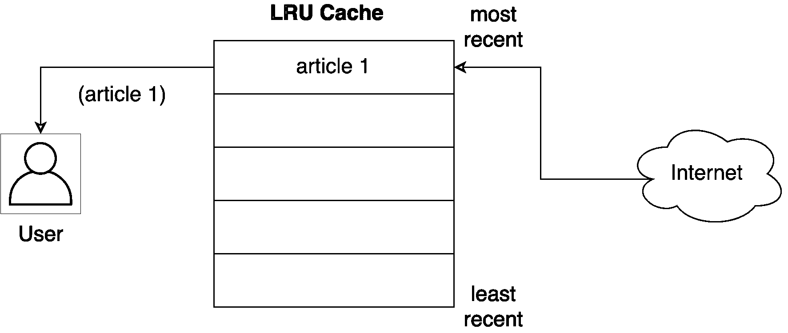
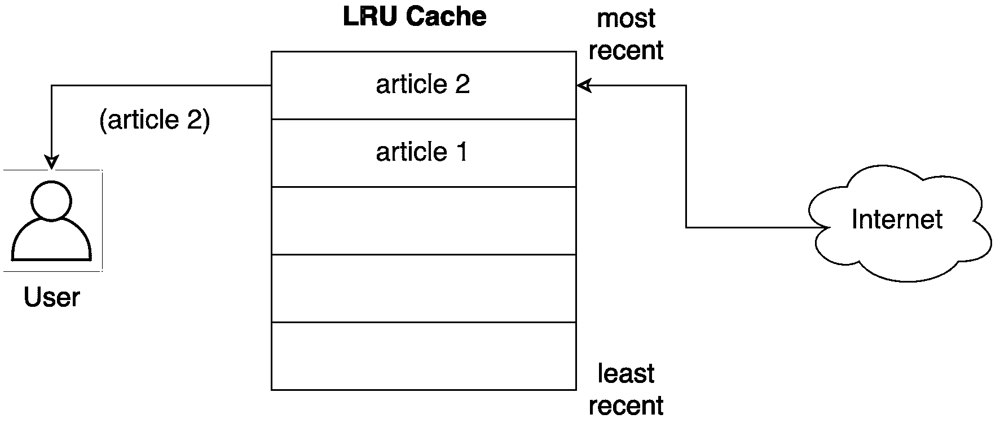
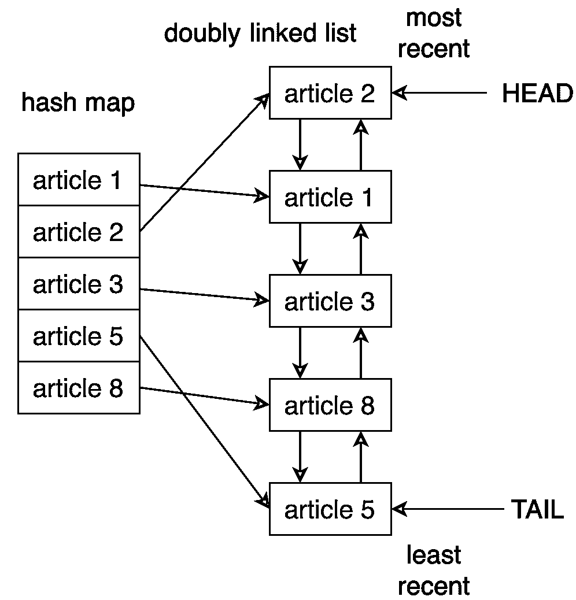
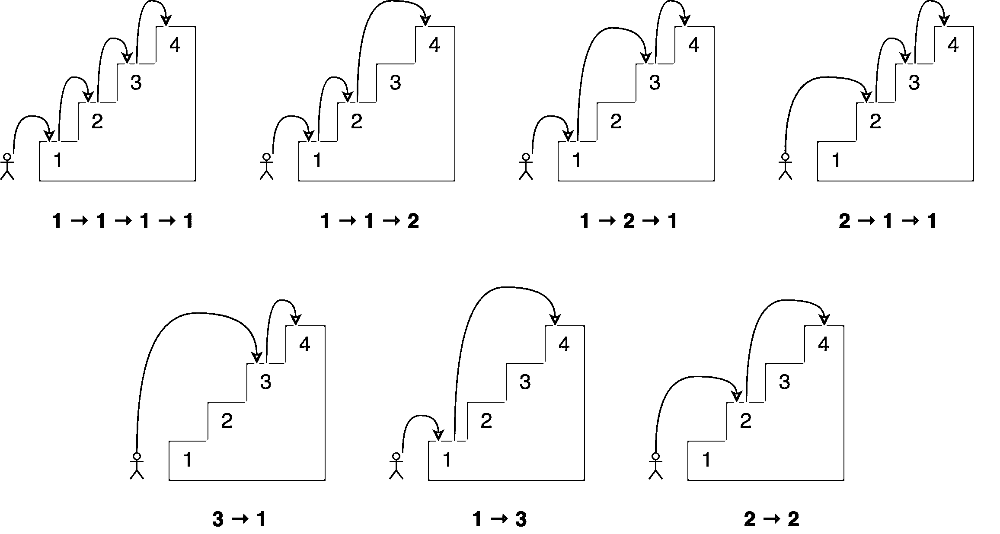
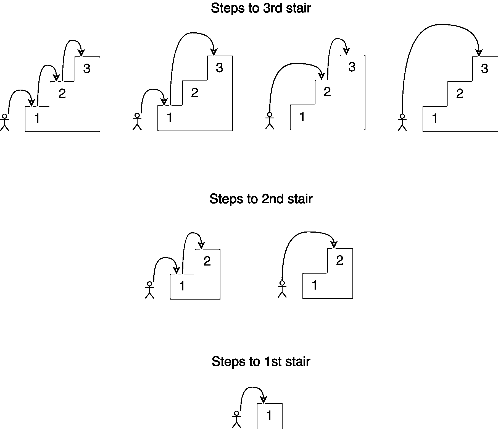
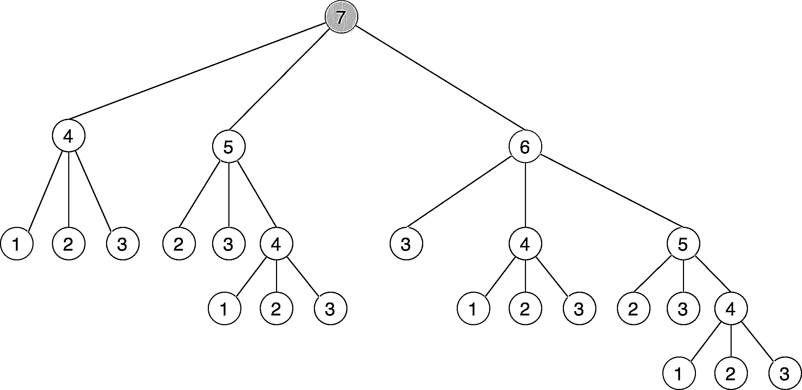

# 使用 LRU 缓存策略在 Python 中进行缓存

> 原文：<https://realpython.com/lru-cache-python/>

*立即观看**本教程有真实 Python 团队创建的相关视频课程。配合文字教程一起看，加深理解: [**用 lru_cache**](/courses/caching-python-lru/) 在 Python 中缓存

有许多方法可以实现快速响应的应用程序。**缓存**是一种方法，当正确使用时，可以使事情变得更快，同时减少计算资源的负载。Python 的 [`functools`模块](https://docs.python.org/3/library/functools.html)带有 [`@lru_cache`装饰器](https://docs.python.org/3/library/functools.html#functools.lru_cache)，它让你能够使用**最近最少使用(LRU)策略**缓存函数的结果。这是一种简单而强大的技术，可以用来在代码中利用缓存的力量。

在本教程中，您将学习:

*   有哪些**缓存策略**可用，以及如何使用**Python decorator**实现它们
*   什么是 **LRU 战略**以及它是如何运作的
*   如何通过使用 **`@lru_cache`装饰器**进行缓存来提高性能
*   如何扩展`@lru_cache`装饰器的功能，并使其在特定时间后**过期**

在本教程结束时，您将对缓存的工作原理以及如何在 Python 中利用缓存有更深的理解。

**免费奖励:** [掌握 Python 的 5 个想法](https://realpython.com/bonus/python-mastery-course/)，这是一个面向 Python 开发者的免费课程，向您展示将 Python 技能提升到下一个水平所需的路线图和心态。

## 缓存及其用途

**缓存**是一种优化技术，您可以在应用程序中使用，将最近或经常使用的数据保存在访问速度更快或计算成本更低的内存位置。

假设您正在构建一个新闻阅读器应用程序，它从不同的来源获取最新的新闻。当用户在列表中导航时，您的应用程序下载文章并在屏幕上显示它们。

如果用户决定在几篇新闻文章之间反复来回移动，会发生什么？除非您缓存数据，否则您的应用程序每次都必须获取相同的内容！这将使你的用户系统运行缓慢，并给托管文章的服务器带来额外的压力。

更好的方法是在获取每篇文章后将内容存储在本地。然后，下一次用户决定打开一篇文章时，您的应用程序可以从本地存储的副本中打开内容，而不是返回到源代码。在计算机科学中，这种技术被称为**缓存**。

[*Remove ads*](/account/join/)

### 使用 Python 字典实现缓存

您可以使用[字典](https://realpython.com/python-dicts/)在 Python 中实现缓存解决方案。

以新闻阅读器为例，您可以检查缓存中是否有内容，如果没有，就返回服务器，而不是每次需要下载文章时都直接去服务器。您可以将文章的 URL 用作键，将其内容用作值。

下面是这种缓存技术的一个例子:

```py
 1import requests
 2
 3cache = dict()
 4
 5def get_article_from_server(url):
 6    print("Fetching article from server...")
 7    response = requests.get(url)
 8    return response.text
 9
10def get_article(url):
11    print("Getting article...")
12    if url not in cache:
13        cache[url] = get_article_from_server(url)
14
15    return cache[url]
16
17get_article("https://realpython.com/sorting-algorithms-python/")
18get_article("https://realpython.com/sorting-algorithms-python/")
```

将这段代码保存到一个`caching.py`文件中，[安装](https://realpython.com/what-is-pip/#installing-packages-with-pip)[库](https://realpython.com/python-requests/)，然后运行脚本:

```py
$ pip install requests
$ python caching.py
Getting article...
Fetching article from server...
Getting article...
```

请注意，尽管在第 17 行和第 18 行调用了两次`get_article()`,您还是一次打印了字符串`"Fetching article from server..."`。发生这种情况是因为，在第一次访问文章后，您将它的 URL 和内容放在了`cache`字典中。第二次，代码不需要再次从服务器获取项目。

### 缓存策略

这种缓存实现有一个大问题:字典的内容将无限增长！随着用户下载更多的文章，应用程序将继续将它们存储在内存中，最终导致应用程序崩溃。

要解决这个问题，您需要一个策略来决定哪些文章应该保留在内存中，哪些应该删除。这些缓存策略是专注于管理缓存信息和选择丢弃哪些项目以便为新项目腾出空间的算法。

有几种不同的策略可以用来从缓存中逐出项目，并防止其超出最大大小。以下是五个最受欢迎的选项，并解释了每个选项何时最有用:

| 战略 | 驱逐政策 | 用例 |
| --- | --- | --- |
| 先进先出(FIFO) | 驱逐最旧的条目 | 较新的条目最有可能被重用 |
| 后进先出法 | 驱逐最新的条目 | 旧条目最有可能被重用 |
| 最近最少使用(LRU) | 驱逐最近最少使用的条目 | 最近使用的条目最有可能被重用 |
| 最近使用的(MRU) | 驱逐最近使用的条目 | 最近最少使用的条目最有可能被重用 |
| 最不常用(LFU) | 驱逐最不经常访问的条目 | 命中次数多的条目更有可能被重用 |

在下面的小节中，您将仔细研究 LRU 策略，以及如何使用 Python 的`functools`模块中的`@lru_cache`装饰器来实现它。

### 进入最近最少使用的(LRU)缓存策略

使用 LRU 策略实现的缓存按照使用顺序组织其项目。每次你访问一个条目，LRU 算法会把它移动到缓存的顶部。这样，该算法可以通过查看列表的底部来快速识别最长时间未使用的条目。

下图显示了用户从网络请求文章后的一个假设的缓存表示:

[](https://files.realpython.com/media/lru_cache_1_1.2eb80a8b24a3.png)

请注意，在将文章提供给用户之前，缓存是如何将文章存储在最近的槽中的。下图显示了当用户请求第二篇文章时会发生什么:

[](https://files.realpython.com/media/lru_cache_2_1.8c4f225e79d0.png)

第二篇文章占据最近的位置，将第一篇文章在列表中向下推。

LRU 策略假设一个对象最近被使用的次数越多，将来被需要的可能性就越大，因此它会尽量将该对象在缓存中保留最长的时间。

[*Remove ads*](/account/join/)

### 窥视 LRU 高速缓存的幕后

用 Python 实现 LRU 缓存的一种方法是使用一个[双向链表](https://realpython.com/linked-lists-python/#how-to-use-doubly-linked-lists)和一个[哈希映射](https://realpython.com/python-data-structures/#dictionaries-maps-and-hash-tables)的组合。双向链表的**头元素**将指向最近使用的条目，而**尾元素**将指向最近最少使用的条目。

下图显示了幕后 LRU 缓存实现的潜在结构:

[](https://files.realpython.com/media/cache_internal_representation_1.6fdd3a39fa28.png)

使用散列映射，通过将每个条目映射到双向链表中的特定位置，可以确保访问缓存中的每个条目。

这个策略非常快。访问最近最少使用的项和更新缓存是运行时间为 *O* (1)的操作。

**注:**为了更深入的了解[大 O 记法](https://realpython.com/sorting-algorithms-python/#measuring-efficiency-with-big-o-notation)，结合 Python 中的几个实际例子，查看[大 O 记法及算法分析结合 Python 实例](https://stackabuse.com/big-o-notation-and-algorithm-analysis-with-python-examples/)。

从版本 3.2 开始，Python 已经包含了用于实现 LRU 策略的`@lru_cache`装饰器。您可以使用这个装饰器来包装函数，并将它们的结果缓存到最大条目数。

## 使用@lru_cache 在 Python 中实现 lru 缓存

就像您之前实现的缓存解决方案一样，`@lru_cache`在幕后使用字典。它将函数的结果缓存在一个由函数调用组成的键下，包括提供的参数。这很重要，因为这意味着这些参数必须是**可哈希的**，装饰器才能工作。

### 玩楼梯

想象一下，你想通过一次跳一个、两个或三个楼梯来确定到达楼梯中特定楼梯的所有不同方式。到第四个楼梯有几条路？以下是所有不同的组合:

[](https://files.realpython.com/media/7_ways_to_make_it_to_4th_stair.2dea6527a4b7.png)

你可以为这个问题设计一个解决方案，你可以从下面的一级、二级或三级楼梯跳下，到达你现在的楼梯。将到达每一个点的跳跃组合数加起来，你就得到到达当前位置的可能方式的总数。

例如，到达第四级楼梯的组合数等于到达第三级、第二级和第一级楼梯的不同方式的总数:

[](https://files.realpython.com/media/combination-jumps-to-7th-stair-lru-cache_1.385e09435b81.png)

如图所示，有七种不同的方式到达第四个楼梯。注意给定楼梯的解决方案是如何建立在更小的子问题的答案之上的。在这种情况下，要确定到达第四个楼梯的不同路径，您可以将到达第三个楼梯的四种方式、到达第二个楼梯的两种方式和到达第一个楼梯的一种方式相加。

这种方法被称为**递归**。如果你想了解更多，那么请查看[Python 中的递归思维](https://realpython.com/python-thinking-recursively/)以获得对该主题的介绍。

下面是一个实现这种递归的函数:

```py
 1def steps_to(stair):
 2    if stair == 1:
 3        # You can reach the first stair with only a single step
 4        # from the floor.
 5        return 1
 6    elif stair == 2:
 7        # You can reach the second stair by jumping from the
 8        # floor with a single two-stair hop or by jumping a single
 9        # stair a couple of times.
10        return 2
11    elif stair == 3:
12        # You can reach the third stair using four possible
13        # combinations:
14        # 1\. Jumping all the way from the floor
15        # 2\. Jumping two stairs, then one
16        # 3\. Jumping one stair, then two
17        # 4\. Jumping one stair three times
18        return 4
19    else:
20        # You can reach your current stair from three different places:
21        # 1\. From three stairs down
22        # 2\. From two stairs down
23        # 2\. From one stair down
24        #
25        # If you add up the number of ways of getting to those
26        # those three positions, then you should have your solution.
27        return (
28            steps_to(stair - 3)
29            + steps_to(stair - 2)
30            + steps_to(stair - 1)
31        )
32
33print(steps_to(4))
```

将此代码保存到名为`stairs.py`的文件中，并使用以下命令运行它:

```py
$ python stairs.py
7
```

太好了！代码适用于`4`楼梯，但是计算有多少级才能到达楼梯中更高的地方呢？将第 33 行中的楼梯号改为`30`，然后重新运行脚本:

```py
$ python stairs.py
53798080
```

哇，5300 多万种组合！跳得真多！

[*Remove ads*](/account/join/)

### 为您的代码计时

找到第三十级楼梯的解决方案时，脚本花了相当多的时间才完成。要获得基线，您可以测量代码运行需要多长时间。

要完成这个，你可以使用 Python 的 [`timeit`模块](https://docs.python.org/3/library/timeit.html)。在第 33 行后添加以下几行:

```py
35setup_code = "from __main__ import steps_to"
36stmt = "steps_to(30)"
37times = repeat(setup=setup_code, stmt=stmt, repeat=3, number=10)
38print(f"Minimum execution time: {min(times)}")
```

你还需要[导入](https://realpython.com/python-import/)代码顶部的`timeit`模块:

```py
 1from timeit import repeat
```

以下是对这些附加功能的逐行解释:

*   **第 35 行**导入了`steps_to()`的名字，以便`timeit.repeat()`知道如何调用。
*   **第 36 行**准备调用带有您想要到达的楼梯号的函数，在本例中是`30`。这是将要执行和计时的语句。
*   **第 37 行**用设置代码和语句调用`timeit.repeat()`。这将调用函数`10`次，返回每次执行花费的秒数。
*   **第 38 行**标识并打印返回的最短时间。

**注意:**一个常见的误解是，你应该找到函数每次运行的平均时间，而不是选择最短的时间。

时间测量有噪声，因为系统同时运行其他进程。最短的时间总是噪音最小的，这使得它成为函数运行时的最佳表示。

现在再次运行脚本:

```py
$ python stairs.py
53798080
Minimum execution time: 40.014977024000004
```

您将看到的秒数取决于您的具体硬件。在我的系统上，这个脚本花了 40 秒，对于仅仅 30 级楼梯来说是相当慢的！

**注:**你可以在[官方 Python 文档](https://docs.python.org/3/library/timeit.html)中了解更多关于`timeit`模块的内容。

需要这么长时间的解决方案是一个问题，但是您可以使用记忆化来改进它。

### 使用记忆来改进解决方案

这种递归实现通过将问题分解成相互依赖的小步骤来解决问题。下图显示了一个树，其中每个节点代表对`steps_to()`的一个特定调用:

[](https://files.realpython.com/media/tree.3ebda400089a.png)

注意你需要用相同的参数多次调用`steps_to()`。例如，`steps_to(5)`计算两次，`steps_to(4)`计算四次，`steps_to(3)`计算七次，`steps_to(2)`计算六次。多次调用同一个函数会增加不必要的计算周期，结果总是一样的。

要解决这个问题，你可以使用一种叫做**记忆**的技术。这种方法通过将结果存储在内存中，并在以后需要时引用它，确保函数不会对相同的输入运行多次。这个场景听起来是使用 Python 的`@lru_cache`装饰器的绝佳机会！

**注意:**关于**记忆化**和使用`@lru_cache`实现它的更多信息，请查看 Python 中的[记忆化](https://towardsdatascience.com/memoization-in-python-57c0a738179a)。

只需做两处更改，就可以显著提高算法的运行时间:

1.  从`functools`模块导入`@lru_cache`装饰器。
2.  用`@lru_cache`来装饰`steps_to()`。

这是经过两次更新后脚本顶部的样子:

```py
 1from functools import lru_cache 2from timeit import repeat
 3
 4@lru_cache 5def steps_to(stair):
 6    if stair == 1:
```

运行更新后的脚本会产生以下结果:

```py
$ python stairs.py
53798080
Minimum execution time: 7.999999999987184e-07
```

缓存函数的结果将运行时间从 40 秒减少到 0.0008 毫秒！这是一个了不起的进步！

**注意:**在 [Python 3.8](https://realpython.com/python38-new-features/) 和更高版本中，如果没有指定任何参数，可以使用不带括号的`@lru_cache`装饰器。在以前的版本中，可能需要包含圆括号:`@lru_cache()`。

记住，在幕后，`@lru_cache`装饰器为每个不同的输入存储`steps_to()`的结果。每次代码使用相同的参数调用函数时，它都直接从内存中返回正确的结果，而不是重新计算答案。这解释了使用`@lru_cache`时性能的巨大提高。

[*Remove ads*](/account/join/)

### 拆开@lru_cache 的功能

有了`@lru_cache`装饰器，您可以将每个呼叫和应答存储在内存中，以便以后再次被请求时访问。但是，在内存耗尽之前，您可以节省多少通话时间呢？

Python 的`@lru_cache` decorator 提供了一个`maxsize`属性，该属性定义了缓存开始驱逐旧项目之前的最大条目数。默认情况下，`maxsize`设置为`128`。如果您将`maxsize`设置为`None`，那么缓存将无限增长，并且不会有条目被驱逐。如果您在内存中存储了大量不同的呼叫，这可能会成为一个问题。

下面是一个使用`maxsize`属性的`@lru_cache`的例子:

```py
 1from functools import lru_cache
 2from timeit import repeat
 3
 4@lru_cache(maxsize=16) 5def steps_to(stair):
 6    if stair == 1:
```

在这种情况下，您将缓存限制为最多有`16`个条目。当一个新的调用进来时，装饰器的实现将驱逐现有的`16`条目中最近最少使用的条目，为新条目腾出空间。

要查看这个新代码会发生什么，您可以使用由`@lru_cache`装饰器提供的`cache_info()`，来检查**命中**和**未命中**的数量以及缓存的当前大小。为了清楚起见，删除了计算函数运行时间的代码。以下是所有修改后的最终脚本:

```py
 1from functools import lru_cache
 2from timeit import repeat
 3
 4@lru_cache(maxsize=16)
 5def steps_to(stair):
 6    if stair == 1:
 7        # You can reach the first stair with only a single step
 8        # from the floor.
 9        return 1
10    elif stair == 2:
11        # You can reach the second stair by jumping from the
12        # floor with a single two-stair hop or by jumping a single
13        # stair a couple of times.
14        return 2
15    elif stair == 3:
16        # You can reach the third stair using four possible
17        # combinations:
18        # 1\. Jumping all the way from the floor
19        # 2\. Jumping two stairs, then one
20        # 3\. Jumping one stair, then two
21        # 4\. Jumping one stair three times
22        return 4
23    else:
24        # You can reach your current stair from three different places:
25        # 1\. From three stairs down
26        # 2\. From two stairs down
27        # 2\. From one stair down
28        #
29        # If you add up the number of ways of getting to those
30        # those three positions, then you should have your solution.
31        return (
32            steps_to(stair - 3)
33            + steps_to(stair - 2)
34            + steps_to(stair - 1)
35        )
36
37print(steps_to(30))
38
39print(steps_to.cache_info())
```

如果您再次调用该脚本，那么您将看到以下结果:

```py
$ python stairs.py
53798080
CacheInfo(hits=52, misses=30, maxsize=16, currsize=16)
```

您可以使用`cache_info()`返回的信息来了解缓存的性能，并对其进行微调，以找到速度和存储之间的适当平衡。

下面是由`cache_info()`提供的属性分类:

*   **`hits=52`** 是`@lru_cache`因为存在于缓存中而直接从内存返回的调用数。

*   **`misses=30`** 是不是来自记忆和计算的呼叫数。因为您试图找到到达第三十级楼梯的步数，所以这些调用在第一次调用时都没有命中缓存是有道理的。

*   **`maxsize=16`** 是您用装饰器的`maxsize`属性定义的缓存大小。

*   **`currsize=16`** 是缓存的当前大小。在这种情况下，它显示您的缓存已满。

如果需要从缓存中移除所有条目，那么可以使用由`@lru_cache`提供的`cache_clear()`。

## 添加缓存过期时间

假设您想开发一个脚本来监控真正的 Python 并打印任何包含单词`python`的文章中的字符数。

*Real Python* 提供了一个 [Atom 提要](https://en.wikipedia.org/wiki/Atom_(Web_standard))，因此您可以像以前一样使用`feedparser`库解析提要，使用`requests`库加载文章内容。

下面是监视器脚本的一个实现:

```py
 1import feedparser
 2import requests
 3import ssl
 4import time
 5
 6if hasattr(ssl, "_create_unverified_context"):
 7    ssl._create_default_https_context = ssl._create_unverified_context
 8
 9def get_article_from_server(url):
10    print("Fetching article from server...")
11    response = requests.get(url)
12    return response.text
13
14def monitor(url):
15    maxlen = 45
16    while True:
17        print("\nChecking feed...")
18        feed = feedparser.parse(url)
19
20        for entry in feed.entries[:5]:
21            if "python" in entry.title.lower():
22                truncated_title = (
23                    entry.title[:maxlen] + "..."
24                    if len(entry.title) > maxlen
25                    else entry.title
26                )
27                print(
28                    "Match found:",
29                    truncated_title,
30                    len(get_article_from_server(entry.link)),
31                )
32
33        time.sleep(5)
34
35monitor("https://realpython.com/atom.xml")
```

将这个脚本保存到一个名为`monitor.py`的文件中，安装`feedparser`和`requests`库，然后运行这个脚本。它将持续运行，直到您在终端窗口中按下 `Ctrl` + `C` 将其停止:

```py
$ pip install feedparser requests
$ python monitor.py

Checking feed...
Fetching article from server...
The Real Python Podcast – Episode #28: Using ... 29520
Fetching article from server...
Python Community Interview With David Amos 54256
Fetching article from server...
Working With Linked Lists in Python 37099
Fetching article from server...
Python Practice Problems: Get Ready for Your ... 164888
Fetching article from server...
The Real Python Podcast – Episode #27: Prepar... 30784

Checking feed...
Fetching article from server...
The Real Python Podcast – Episode #28: Using ... 29520
Fetching article from server...
Python Community Interview With David Amos 54256
Fetching article from server...
Working With Linked Lists in Python 37099
Fetching article from server...
Python Practice Problems: Get Ready for Your ... 164888
Fetching article from server...
The Real Python Podcast – Episode #27: Prepar... 30784
```

下面是对代码的逐步解释:

*   **第 6 行和第 7 行**:这是当`feedparser`试图访问 [HTTPS](https://realpython.com/python-https/) 上提供的内容时的一个问题的变通办法。有关更多信息，请参见下面的注释。
*   **第 16 行** : `monitor()`将无限循环。
*   **第 18 行**:使用`feedparser`，代码加载并解析来自*真实 Python* 的提要。
*   **第 20 行**:循环遍历列表中的前`5`个条目。
*   **第 21 到 31 行**:如果单词`python`是标题的一部分，那么代码会将它和文章的长度一起打印出来。
*   **第 33 行**:代码[在继续之前休眠](https://realpython.com/python-sleep/)秒`5`。
*   **第 35 行**:该行通过将*真实 Python* 提要的 URL 传递给`monitor()`来启动监控过程。

每当脚本加载一篇文章时，消息`"Fetching article from server..."`被打印到控制台。如果您让脚本运行足够长的时间，那么您将会看到这条消息是如何重复出现的，即使是在加载相同的链接时。

**注意:**关于`feedparser`访问通过 HTTPS 提供的内容的更多信息，请查看`feedparser`存储库上的[第 84 期](https://github.com/kurtmckee/feedparser/issues/84)。 [PEP 476](https://www.python.org/dev/peps/pep-0476/) 描述了 Python 如何开始为`stdlib` HTTP 客户端默认启用证书验证，这是这个错误的根本原因。

这是一个缓存文章内容并避免每五秒钟访问一次网络的绝佳机会。您可以使用`@lru_cache`装饰器，但是如果文章的内容被更新了会发生什么呢？

第一次访问文章时，装饰器将存储其内容，以后每次都返回相同的数据。如果 post 被更新，那么 monitor 脚本将永远不会意识到这一点，因为它将提取存储在缓存中的旧副本。要解决这个问题，您可以将缓存条目设置为过期。

[*Remove ads*](/account/join/)

### 基于时间和空间驱逐缓存条目

只有当没有更多空间来存储新的列表时，装饰器才会驱逐现有的条目。有了足够的空间，缓存中的条目将永远存在，永远不会刷新。

这对您的监控脚本提出了一个问题，因为您永远不会获取为以前缓存的文章发布的更新。要解决这个问题，您可以更新缓存实现，使其在特定时间后过期。

您可以将这个想法实现到一个扩展了`@lru_cache`的新装饰器中。如果调用者试图访问一个已经过期的条目，那么缓存不会返回它的内容，迫使调用者从网络上获取文章。

**注:**更多关于 Python 装饰者的信息，查看[Python 装饰者入门](https://realpython.com/primer-on-python-decorators/)和 [Python 装饰者 101](https://realpython.com/courses/python-decorators-101/) 。

下面是这个新装饰器的一个可能实现:

```py
 1from functools import lru_cache, wraps
 2from datetime import datetime, timedelta
 3
 4def timed_lru_cache(seconds: int, maxsize: int = 128):
 5    def wrapper_cache(func):
 6        func = lru_cache(maxsize=maxsize)(func)
 7        func.lifetime = timedelta(seconds=seconds)
 8        func.expiration = datetime.utcnow() + func.lifetime
 9
10        @wraps(func)
11        def wrapped_func(*args, **kwargs):
12            if datetime.utcnow() >= func.expiration:
13                func.cache_clear()
14                func.expiration = datetime.utcnow() + func.lifetime
15
16            return func(*args, **kwargs)
17
18        return wrapped_func
19
20    return wrapper_cache
```

下面是这种实现的分类:

*   **第 4 行**:`@timed_lru_cache`装饰器将支持缓存中条目的生命周期(以秒为单位)和缓存的最大大小。
*   **第 6 行**:代码用`lru_cache`装饰器包装被装饰的函数。这允许您使用已经由`lru_cache`提供的缓存功能。
*   **第 7 行和第 8 行**:这两行用两个属性来表示修饰函数，这两个属性分别代表缓存的生命周期和它到期的实际日期。
*   **第 12 行到第 14 行**:在访问缓存中的条目之前，装饰器检查当前日期是否超过了到期日期。如果是这种情况，那么它清除缓存并重新计算生存期和到期日期。

请注意，当一个条目过期时，这个装饰器如何清除与该函数相关的整个缓存。生存期适用于整个缓存，而不是单个项目。这种策略的一个更复杂的实现是基于条目各自的生命周期来驱逐它们。

### 用新装饰器缓存文章

现在，您可以使用新的`@timed_lru_cache`装饰器和`monitor`脚本来防止每次访问文章时获取内容。

为简单起见，将代码放在一个脚本中，最终会得到以下结果:

```py
 1import feedparser
 2import requests
 3import ssl
 4import time
 5
 6from functools import lru_cache, wraps
 7from datetime import datetime, timedelta
 8
 9if hasattr(ssl, "_create_unverified_context"):
10    ssl._create_default_https_context = ssl._create_unverified_context
11
12def timed_lru_cache(seconds: int, maxsize: int = 128):
13    def wrapper_cache(func):
14        func = lru_cache(maxsize=maxsize)(func)
15        func.lifetime = timedelta(seconds=seconds)
16        func.expiration = datetime.utcnow() + func.lifetime
17
18        @wraps(func)
19        def wrapped_func(*args, **kwargs):
20            if datetime.utcnow() >= func.expiration:
21                func.cache_clear()
22                func.expiration = datetime.utcnow() + func.lifetime
23
24            return func(*args, **kwargs)
25
26        return wrapped_func
27
28    return wrapper_cache
29
30@timed_lru_cache(10)
31def get_article_from_server(url):
32    print("Fetching article from server...")
33    response = requests.get(url)
34    return response.text
35
36def monitor(url):
37    maxlen = 45
38    while True:
39        print("\nChecking feed...")
40        feed = feedparser.parse(url)
41
42        for entry in feed.entries[:5]:
43            if "python" in entry.title.lower():
44                truncated_title = (
45                    entry.title[:maxlen] + "..."
46                    if len(entry.title) > maxlen
47                    else entry.title
48                )
49                print(
50                    "Match found:",
51                    truncated_title,
52                    len(get_article_from_server(entry.link)),
53                )
54
55        time.sleep(5)
56
57monitor("https://realpython.com/atom.xml")
```

注意第 30 行是如何用`@timed_lru_cache`修饰`get_article_from_server()`并指定`10`秒的有效性的。任何试图在获取后的`10`秒内从服务器访问同一篇文章的行为都将从缓存中返回内容，并且永远不会影响网络。

运行脚本并查看结果:

```py
$ python monitor.py

Checking feed...
Fetching article from server...
Match found: The Real Python Podcast – Episode #28: Using ... 29521
Fetching article from server...
Match found: Python Community Interview With David Amos 54254
Fetching article from server...
Match found: Working With Linked Lists in Python 37100
Fetching article from server...
Match found: Python Practice Problems: Get Ready for Your ... 164887
Fetching article from server...
Match found: The Real Python Podcast – Episode #27: Prepar... 30783

Checking feed...
Match found: The Real Python Podcast – Episode #28: Using ... 29521
Match found: Python Community Interview With David Amos 54254
Match found: Working With Linked Lists in Python 37100
Match found: Python Practice Problems: Get Ready for Your ... 164887
Match found: The Real Python Podcast – Episode #27: Prepar... 30783

Checking feed...
Match found: The Real Python Podcast – Episode #28: Using ... 29521
Match found: Python Community Interview With David Amos 54254
Match found: Working With Linked Lists in Python 37100
Match found: Python Practice Problems: Get Ready for Your ... 164887
Match found: The Real Python Podcast – Episode #27: Prepar... 30783

Checking feed...
Fetching article from server...
Match found: The Real Python Podcast – Episode #28: Using ... 29521
Fetching article from server...
Match found: Python Community Interview With David Amos 54254
Fetching article from server...
Match found: Working With Linked Lists in Python 37099
Fetching article from server...
Match found: Python Practice Problems: Get Ready for Your ... 164888
Fetching article from server...
Match found: The Real Python Podcast – Episode #27: Prepar... 30783
```

注意代码第一次访问匹配的文章时是如何打印消息`"Fetching article from server..."`的。之后，根据您的网络速度和计算能力，脚本将在再次访问服务器之前从缓存中检索一次或两次文章。

脚本每隔`5`秒尝试访问文章，缓存每隔`10`秒到期。对于实际的应用程序来说，这些时间可能太短了，所以您可以通过调整这些配置来获得显著的改进。

## 结论

缓存是提高任何软件系统性能的基本优化技术。理解缓存的工作原理是将它有效地集成到应用程序中的基本步骤。

**在本教程中，您学习了:**

*   有哪些不同的**缓存策略**以及它们是如何工作的
*   如何使用 Python 的 **`@lru_cache`** 装饰器
*   如何**创建一个新的装饰器**来扩展`@lru_cache`的功能
*   如何使用`timeit`模块测量代码的**运行时间**
*   什么是**递归**以及如何使用它解决问题
*   **记忆化**如何通过在内存中存储中间结果来提高运行时间

在应用程序中实现不同缓存策略的下一步是查看 [`cachetools`](https://github.com/tkem/cachetools/) 模块。这个库提供了几个集合和装饰器，涵盖了一些最流行的缓存策略，您可以立即开始使用。

*立即观看**本教程有真实 Python 团队创建的相关视频课程。配合文字教程一起看，加深理解: [**用 lru_cache**](/courses/caching-python-lru/) 在 Python 中缓存*******