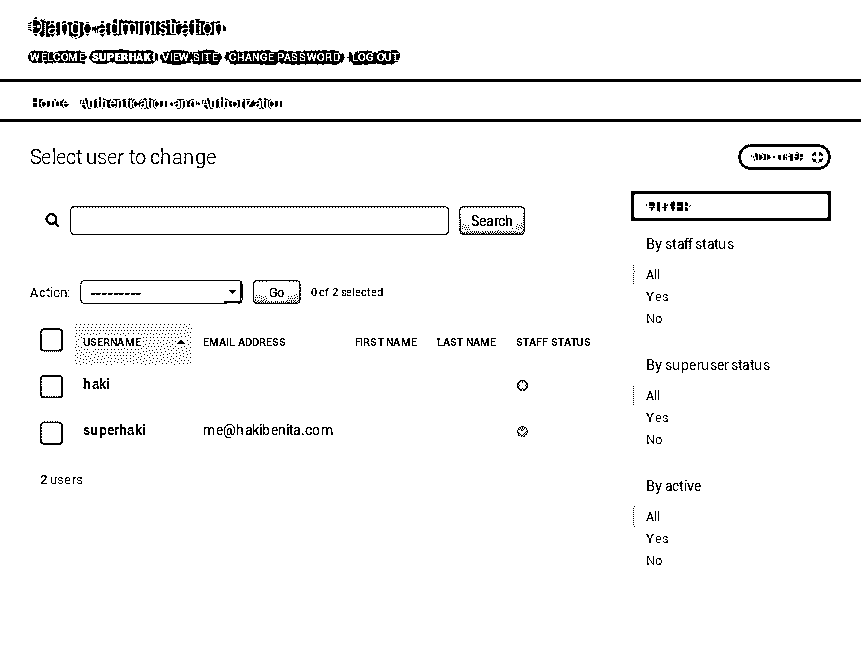

# 在 Django Admin 中管理用户需要知道什么

> 原文：<https://realpython.com/manage-users-in-django-admin/>

Django admin 中的用户管理是一个棘手的问题。如果您强制实施太多权限，那么您可能会干扰日常操作。如果您允许在没有监督的情况下自由授予权限，那么您就将您的系统置于危险之中。

Django 提供了一个很好的认证框架，与 Django admin 紧密集成。开箱即用，Django admin 不会对用户 admin 进行特殊限制。这可能会导致危及系统安全的危险情况。

您知道在管理员中管理其他用户的员工用户可以编辑他们自己的权限吗？你知道他们也可以让自己成为超级用户吗？Django admin 中没有阻止这一点，所以这取决于你！

本教程结束时，您将知道如何保护您的系统:

*   **通过阻止用户编辑自己的权限来防止权限升级**
*   **通过强制用户仅使用组来管理权限，保持权限整洁和可维护**
*   **通过明确实施必要的权限，防止权限通过自定义操作**泄露

**跟随:**

按照本教程，最好设置一个小项目来玩。如果你不确定如何去做，那么看看 Django 的[入门。](https://realpython.com/get-started-with-django-1/#hello-world)

本教程还假设对 Django 中的用户管理有基本的了解。如果您对此不熟悉，请查看[Django 第 2 部分:Django 用户管理](https://realpython.com/django-user-management/)。

**免费奖励:** [点击此处获取免费的 Django 学习资源指南(PDF)](#) ，该指南向您展示了构建 Python + Django web 应用程序时要避免的技巧和窍门以及常见的陷阱。

## 模型权限

权限是很棘手的。如果您不[设置权限](https://realpython.com/django-view-authorization/)，那么您将您的系统置于入侵者、数据泄露和人为错误的风险之中。如果您滥用权限或过度使用权限，那么您就有可能干扰日常操作。

Django 自带一个内置的[认证系统](https://docs.djangoproject.com/en/2.2/topics/auth/)。身份验证系统包括用户、组和权限。

当一个模型被创建时，Django 将自动为以下操作创建四个[默认权限](https://docs.djangoproject.com/en/2.2/topics/auth/default/#default-permissions):

1.  **`add` :** 有此权限的用户可以添加模型的实例。
2.  **`delete` :** 有此权限的用户可以删除模型的实例。
3.  **`change` :** 拥有此权限的用户可以更新模型的实例。
4.  **`view` :** 拥有该权限的用户可以查看该模型的实例。这是一个备受期待的许可，它最终被添加到了 Django 2.1 中。

权限名称遵循一个非常特殊的命名约定:`<app>.<action>_<modelname>`。

让我们来分解一下:

*   **`<app>`** 是 app 的名称。例如，`User`模型是从`auth` app ( `django.contrib.auth`)导入的。
*   **`<action>`** 是上述动作之一(`add`、`delete`、`change`或`view`)。
*   **`<modelname>`** 是型号的名称，全是小写字母。

了解这种命名约定可以帮助您更容易地管理权限。例如，更改用户的权限名称是`auth.change_user`。

[*Remove ads*](/account/join/)

### 如何检查权限

模型权限被授予用户或组。要检查用户是否具有特定权限，您可以执行以下操作:

>>>

```py
>>> from django.contrib.auth.models import User
>>> u = User.objects.create_user(username='haki')
>>> u.has_perm('auth.change_user') False
```

值得一提的是， [`.has_perm()`对于活动超级用户总是会返回`True`](https://github.com/django/django/blob/bf9e0e342da3ed2f74ee0ec34e75bdcbedde40a9/django/contrib/auth/models.py#L255) ，即使权限并不真正存在:

>>>

```py
>>> from django.contrib.auth.models import User
>>> superuser = User.objects.create_superuser(
...     username='superhaki',
...     email='me@hakibenita.com',
...     password='secret',
)
>>> superuser.has_perm('does.not.exist') True
```

如您所见，当您检查超级用户的权限时，并没有真正检查权限。

### 如何实施权限

Django 模型本身并不强制许可。默认情况下，唯一强制执行开箱即用权限的地方是 Django Admin。

模型不强制权限的原因是，通常，模型不知道用户执行的操作。在 [Django apps](https://realpython.com/courses/django-portfolio-project/) 中，用户通常是从请求中获得的。这就是为什么大多数情况下，权限是在视图层执行的。

例如，要防止对`User`模型没有查看权限的用户访问显示用户信息的视图，请执行以下操作:

```py
from django.core.exceptions import PermissionDenied

def users_list_view(request):
    if not request.user.has_perm('auth.view_user'):
        raise PermissionDenied()
```

如果发出请求的用户登录并通过了身份验证，那么 [`request.user`](https://docs.djangoproject.com/en/2.2/ref/request-response/#django.http.HttpRequest.user) 将持有`User`的一个实例。如果用户没有登录，那么`request.user`将是 [`AnonymousUser`](https://docs.djangoproject.com/en/2.2/ref/contrib/auth/#anonymoususer-object) 的一个实例。这是 Django 使用的一个特殊对象，用于指示未经身份验证的用户。在`AnonymousUser`上使用`has_perm`将总是返回`False`。

如果发出请求的用户没有`view_user`权限，那么您将引发一个`PermissionDenied`异常，一个状态为`403`的响应被返回给客户端。

为了更容易在视图中实施权限，Django 提供了一个快捷方式 [decorator](https://realpython.com/primer-on-python-decorators/) 称为 [`permission_required`](https://docs.djangoproject.com/en/2.2/topics/auth/default/#the-permission-required-decorator) 来做同样的事情:

```py
from django.contrib.auth.decorators import permission_required

@permission_required('auth.view_user')
def users_list_view(request):
    pass
```

为了在模板中实施权限，您可以通过一个名为 [`perms`](https://docs.djangoproject.com/en/2.2/topics/auth/default/#permissions) 的特殊模板变量来访问当前用户权限。例如，如果希望只向具有删除权限的用户显示“删除”按钮，请执行下列操作:

```py



```

一些流行的第三方应用，如 Django rest 框架(T1)也提供了与 Django 模型权限(T3)的有用集成(T2)。

### Django 管理和模型权限

Django admin 与内置认证系统有非常紧密的集成，尤其是模型权限。开箱即用，Django admin 正在实施模型权限:

*   如果用户对模型没有权限，那么他们将无法在管理中看到或访问它。
*   如果用户拥有模型的查看和更改权限，那么他们将能够查看和更新实例，但不能添加新实例或删除现有实例。

有了适当的权限，管理员用户就不太可能犯错，入侵者也更难造成伤害。

[*Remove ads*](/account/join/)

## 在 Django Admin 中实现自定义业务角色

每个应用程序中最容易受到攻击的地方之一是认证系统。在 Django apps 中，这是`User`模型。因此，为了更好地保护您的应用程序，您将从`User`模型开始。

首先，您需要控制`User`模型管理页面。Django 已经提供了一个非常好的管理页面来管理用户。为了利用这项伟大的工作，您将扩展内置的`User`管理模型。

### 设置:自定义用户管理员

要为`User`模型提供一个[定制管理](https://realpython.com/customize-django-admin-python/)，您需要注销 Django 提供的现有模型管理，并注册一个您自己的模型管理:

```py
from django.contrib import admin
from django.contrib.auth.models import User
from django.contrib.auth.admin import UserAdmin

# Unregister the provided model admin
admin.site.unregister(User)

# Register out own model admin, based on the default UserAdmin
@admin.register(User)
class CustomUserAdmin(UserAdmin):
    pass
```

你的`CustomUserAdmin`是在扩展 Django 的`UserAdmin`。您这样做是为了利用 Django 开发人员已经完成的所有工作。

此时，如果您在`http://127.0.0.1:8000/admin/auth/user`登录您的 Django admin，您应该看到用户 admin 没有改变:

[](https://files.realpython.com/media/django-bare-boned-user-admin.4ac55297d529.png)

通过扩展`UserAdmin`，您可以使用 Django admin 提供的所有内置特性。

### 防止更新字段

无人管理的表单很容易出现可怕的错误。员工用户可以通过管理员以应用程序没有想到的方式轻松更新模型实例。大多数时候，用户甚至不会注意到有问题。这种错误通常很难追踪和修复。

为了防止这样的错误发生，您可以防止管理员用户修改模型中的某些字段。

如果要防止任何用户(包括超级用户)更新字段，可以将该字段标记为只读。例如，当用户注册时设置字段`date_joined`。任何用户都不应更改此信息，因此您将其标记为只读:

```py
from django.contrib import admin
from django.contrib.auth.models import User
from django.contrib.auth.admin import UserAdmin

@admin.register(User)
class CustomUserAdmin(UserAdmin):
    readonly_fields = [
        'date_joined',
    ]
```

当一个字段被添加到`readonly_fields`时，它在管理默认变更表单中不可编辑。当一个字段被标记为只读时，Django 会将 input 元素显示为禁用。

但是，如果您只想阻止某些用户更新字段，该怎么办呢？

### 有条件地阻止字段更新

有时直接在 admin 中更新字段是很有用的。但是您不想让任何用户做这件事:您想只允许超级用户做这件事。

假设您想要阻止非超级用户更改用户的用户名。为此，您需要修改 Django 生成的变更表单，并根据当前用户禁用用户名字段:

```py
from django.contrib import admin
from django.contrib.auth.models import User
from django.contrib.auth.admin import UserAdmin

@admin.register(User)
class CustomUserAdmin(UserAdmin):
    def get_form(self, request, obj=None, **kwargs):
        form = super().get_form(request, obj, **kwargs)
        is_superuser = request.user.is_superuser

 if not is_superuser: form.base_fields['username'].disabled = True 
        return form
```

让我们来分解一下:

*   要对表单进行调整，您可以覆盖 [`get_form()`](https://docs.djangoproject.com/en/2.1/ref/contrib/admin/#django.contrib.admin.ModelAdmin.get_form) 。Django 使用这个函数为模型生成一个默认的变更表单。
*   要有条件地禁用该字段，首先要获取 Django 生成的默认表单，然后如果用户不是超级用户，禁用 username 字段。

现在，当非超级用户试图编辑用户时，用户名字段将被禁用。任何通过 Django Admin 修改用户名的尝试都将失败。当超级用户尝试编辑用户时，用户名字段将可编辑并按预期运行。

[*Remove ads*](/account/join/)

### 防止非超级用户授予超级用户权限

超级用户是一个非常强的权限，不应该轻易授予。然而，任何对`User`模型拥有变更权限的用户都可以让任何用户成为超级用户，包括他们自己。这违背了许可制度的整个目的，所以你想堵住这个洞。

根据前面的示例，为了防止非超级用户成为超级用户，您添加了以下限制:

```py
from typing import Set

from django.contrib import admin
from django.contrib.auth.models import User
from django.contrib.auth.admin import UserAdmin

@admin.register(User)
class CustomUserAdmin(UserAdmin):
    def get_form(self, request, obj=None, **kwargs):
        form = super().get_form(request, obj, **kwargs)
        is_superuser = request.user.is_superuser
        disabled_fields = set()  # type: Set[str]

        if not is_superuser:
            disabled_fields |= {
                'username',
 'is_superuser',            }

        for f in disabled_fields:
            if f in form.base_fields:
                form.base_fields[f].disabled = True

        return form
```

除了前面的示例，您还添加了以下内容:

1.  您初始化了一个空集`disabled_fields`，它将保存要禁用的字段。`set`是保存唯一值的数据结构。在这种情况下使用 set 是有意义的，因为您只需要禁用一个字段一次。操作员`|=`用于执行就地`OR`更新。有关集合的更多信息，请查看 Python 中的[集合。](https://realpython.com/python-sets/)

2.  接下来，如果用户是超级用户，您将向集合中添加两个字段(前面示例中的`username`和`is_superuser`)。他们将阻止非超级用户使自己成为超级用户。

3.  最后，遍历集合中的字段，将所有字段标记为禁用，然后返回表单。

**Django 用户管理两步表单**

当您在 Django admin 中创建一个新用户时，您需要通过一个两步表单。在第一个表单中，您填写用户名和密码。在第二个表单中，您更新其余的字段。

这个两步过程是`User`模型所独有的。为了适应这种独特的过程，您必须在尝试禁用该字段之前验证它是否存在。否则，你可能会得到一个`KeyError`。如果您自定义其他模型管理员，这是不必要的。关于`KeyError`的更多信息，请查看 [Python KeyError 异常以及如何处理它们](https://realpython.com/python-keyerror/)。

### 仅使用组授予权限

管理权限的方式因团队、产品和公司而异。我发现在组中管理权限更容易。在我自己的项目中，我为支持、内容编辑、分析师等等创建组。我发现在用户级别管理权限非常麻烦。当添加新的模型时，或者当业务需求改变时，更新每个单独的用户是乏味的。

要仅使用组来管理权限，您需要防止用户向特定用户授予权限。相反，您希望只允许将用户与组相关联。为此，对所有非超级用户禁用字段`user_permissions`:

```py
from typing import Set

from django.contrib import admin
from django.contrib.auth.models import User
from django.contrib.auth.admin import UserAdmin

@admin.register(User)
class CustomUserAdmin(UserAdmin):
    def get_form(self, request, obj=None, **kwargs):
        form = super().get_form(request, obj, **kwargs)
        is_superuser = request.user.is_superuser
        disabled_fields = set()  # type: Set[str]

        if not is_superuser:
            disabled_fields |= {
                'username',
                'is_superuser',
 'user_permissions',            }

        for f in disabled_fields:
            if f in form.base_fields:
                form.base_fields[f].disabled = True

        return form
```

您使用了与前几节完全相同的技术来实现另一个业务规则。在接下来的部分中，您将实现更复杂的业务规则来保护您的系统。

### 防止非超级用户编辑他们自己的权限

强大的用户往往是一个弱点。它们拥有很强的权限，它们可能造成的潜在损害是巨大的。为了防止入侵情况下的权限升级，您可以防止用户编辑他们自己的权限:

```py
from typing import Set

from django.contrib import admin
from django.contrib.auth.models import User
from django.contrib.auth.admin import UserAdmin

@admin.register(User)
class CustomUserAdmin(UserAdmin):
    def get_form(self, request, obj=None, **kwargs):
        form = super().get_form(request, obj, **kwargs)
        is_superuser = request.user.is_superuser
        disabled_fields = set()  # type: Set[str]

        if not is_superuser:
            disabled_fields |= {
                'username',
                'is_superuser',
                'user_permissions',
            }

        # Prevent non-superusers from editing their own permissions
        if (
 not is_superuser and obj is not None and obj == request.user        ):
            disabled_fields |= {
                'is_staff',
                'is_superuser',
                'groups',
                'user_permissions',
            }

        for f in disabled_fields:
            if f in form.base_fields:
                form.base_fields[f].disabled = True

        return form
```

参数`obj`是您当前操作的对象的实例:

*   **当`obj`为无**时，该表单用于创建新用户。
*   **当`obj`不是`None`** 时，该表单用于编辑现有用户。

为了检查发出请求的用户是否正在操作他们自己，您比较了`request.user`和`obj`。因为这是用户 admin，`obj`要么是`User`的实例，要么是 [`None`](https://realpython.com/pbjt/blog/post/335/change/) 。当发出请求的用户`request.user`等于`obj`时，则意味着用户正在更新自己。在这种情况下，您禁用所有可用于获取权限的敏感字段。

基于对象定制表单的能力非常有用。它可以用来实现复杂的业务角色。

[*Remove ads*](/account/join/)

### 覆盖权限

完全覆盖 Django admin 中的权限有时会很有用。一种常见的情况是，当您在其他地方使用权限时，您不希望 staff 用户在 admin 中进行更改。

Django 为四个内置权限使用[钩子。在内部，挂钩使用当前用户的权限来做出决定。您可以忽略这些挂钩，并提供不同的决策。](https://docs.djangoproject.com/en/2.1/ref/contrib/admin/#django.contrib.admin.ModelAdmin.has_view_permission)

要防止 staff 用户删除模型实例，不管他们的权限如何，您可以执行以下操作:

```py
from django.contrib import admin
from django.contrib.auth.models import User
from django.contrib.auth.admin import UserAdmin

@admin.register(User)
class CustomUserAdmin(UserAdmin):
 def has_delete_permission(self, request, obj=None): return False
```

与`get_form()`一样，`obj`是您当前操作的实例:

*   **当`obj`为`None`** 时，用户请求列表查看。
*   **当`obj`不是`None`** 时，用户请求了特定实例的变更视图。

在这个钩子中拥有对象的实例对于实现不同类型操作的对象级权限非常有用。以下是其他使用案例:

*   防止在营业时间进行更改
*   实现对象级权限

### 限制对自定义动作的访问

[自定义管理操作](https://docs.djangoproject.com/en/2.2/ref/contrib/admin/actions/#adding-actions-to-the-modeladmin)需要特别注意。Django 不熟悉它们，所以它不能默认限制对它们的访问。对模型拥有任何权限的任何管理员用户都可以访问自定义操作。

举例来说，添加一个方便的管理操作来将多个用户标记为活动用户:

```py
from django.contrib import admin
from django.contrib.auth.models import User
from django.contrib.auth.admin import UserAdmin

@admin.register(User)
class CustomUserAdmin(UserAdmin):
    actions = [
        'activate_users',
    ]

    def activate_users(self, request, queryset):
        cnt = queryset.filter(is_active=False).update(is_active=True)
        self.message_user(request, 'Activated {} users.'.format(cnt))
    activate_users.short_description = 'Activate Users'  # type: ignore
```

使用此操作，员工用户可以标记一个或多个用户，并一次激活所有用户。这在各种情况下都很有用，比如注册过程中出现了错误，需要批量激活用户。

此操作会更新用户信息，因此您希望只有具有更改权限的用户才能使用它。

Django admin 使用一个内部函数来获取动作。要对没有更改权限的用户隐藏`activate_users()`，请覆盖`get_actions()`:

```py
from django.contrib import admin
from django.contrib.auth.models import User
from django.contrib.auth.admin import UserAdmin

@admin.register(User)
class CustomUserAdmin(UserAdmin):
    actions = [
        'activate_users',
    ]

    def activate_users(self, request, queryset):
        assert request.user.has_perm('auth.change_user')
        cnt = queryset.filter(is_active=False).update(is_active=True)
        self.message_user(request, 'Activated {} users.'.format(cnt))
    activate_users.short_description = 'Activate Users'  # type: ignore

    def get_actions(self, request):
        actions = super().get_actions(request)
 if not request.user.has_perm('auth.change_user'): del actions['activate_users']        return actions
```

`get_actions()`返回一个 [`OrderedDict`](https://realpython.com/python-ordereddict/) 。键是动作的名称，值是动作函数。要调整返回值，您可以覆盖该函数，获取原始值，并根据用户权限，从`dict`中移除自定义动作`activate_users`。为了安全起见，您还在操作中断言用户权限。

对于没有`change_user()`权限的员工用户，动作`activate_users`不会出现在动作下拉列表中。

## 结论

Django admin 是管理 Django 项目的一个很好的工具。许多团队依靠 it 来保持日常运营的高效性。如果您使用 Django admin 对模型执行操作，那么了解权限是很重要的。本文中描述的技术对任何模型管理员都有用，不仅仅是对`User`模型。

在本教程中，您通过在 Django Admin 中进行以下调整来保护您的系统:

*   您**通过阻止用户编辑他们自己的权限来防止权限升级**。
*   您**通过强制用户只使用组来管理权限，保持了权限的整洁和可维护性**。
*   您**通过明确实施必要的权限，防止了权限通过自定义操作**泄露。

你的模型管理员现在比你开始时安全多了！****