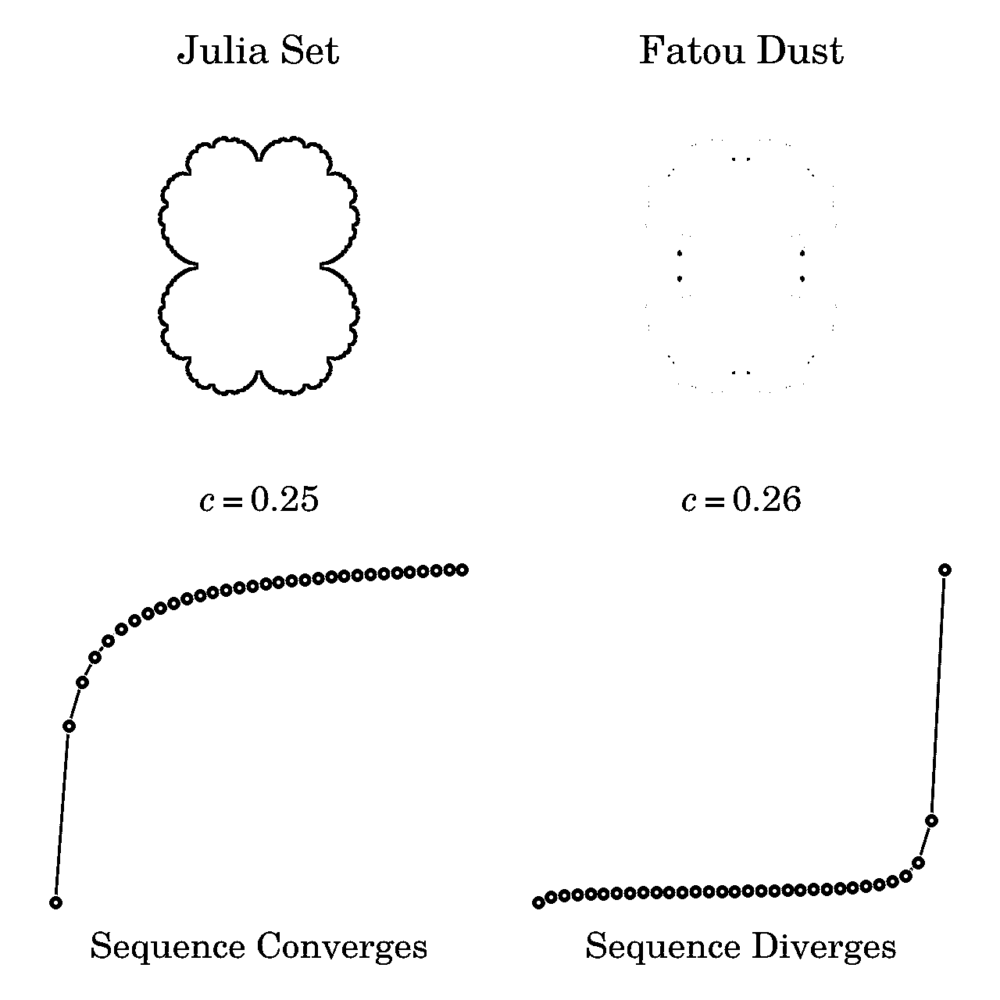
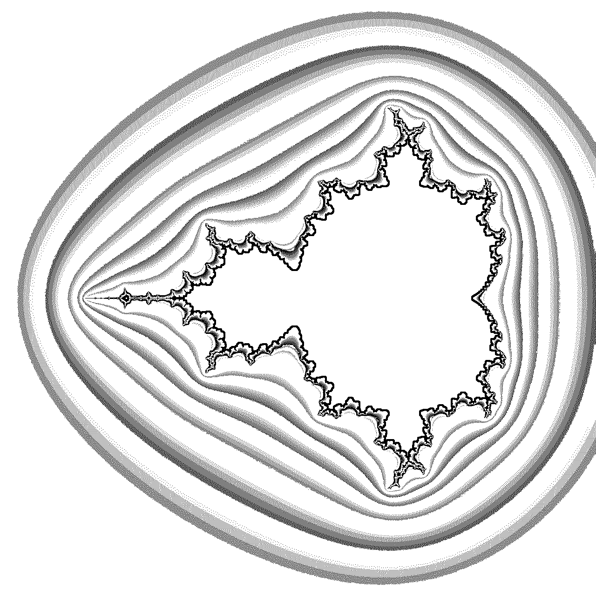

# 用 Python 绘制 Mandelbrot 集

> 原文：<https://realpython.com/mandelbrot-set-python/>

本教程将指导您完成一个有趣的项目，该项目涉及 Python 中的[复数。您将学习分形，并通过使用 Python 的 Matplotlib 和 Pillow 库绘制 **Mandelbrot 集合**来创建一些真正令人惊叹的艺术。在这个过程中，您将了解这个著名的分形是如何被发现的，它代表什么，以及它与其他分形的关系。](https://realpython.com/python-complex-numbers/)

了解[面向对象编程](https://realpython.com/python3-object-oriented-programming/)原则和[递归](https://realpython.com/python-recursion/)将使你能够充分利用 Python 富于表现力的语法来编写清晰的代码，读起来几乎像数学公式。为了理解制作分形的算法细节，你还应该熟悉[复数](https://en.wikipedia.org/wiki/Complex_number)、[对数](https://en.wikipedia.org/wiki/Logarithm)、[集合论](https://en.wikipedia.org/wiki/Set_theory)和[迭代函数](https://en.wikipedia.org/wiki/Iterated_function)。但是不要让这些先决条件把你吓跑，因为无论如何你都将能够跟随并创造艺术！

**在本教程中，您将学习如何:**

*   将复数应用于实际问题
*   找到**曼德尔布罗**和**茱莉亚**集合的成员
*   使用 **Matplotlib** 和 **Pillow** 将这些集合绘制成**分形**
*   制作一个丰富多彩的分形艺术图

要下载本教程中使用的源代码，请单击下面的链接:

**获取源代码:** [点击此处获取您将使用](https://realpython.com/bonus/mandelbrot-set-python-project-code/)绘制 Mandelbrot 集合的源代码。

## 理解曼德尔布罗集合

在你尝试绘制分形之前，理解相应的 Mandelbrot 集合代表什么以及如何确定它的成员会有所帮助。如果你已经熟悉了基本理论，那么请随意跳到下面的[绘图部分](#plotting-the-mandelbrot-set-using-pythons-matplotlib)。

[*Remove ads*](/account/join/)

### 分形几何的图标

即使这个名字对你来说是新的，你可能已经看过 Mandelbrot 集合的一些迷人的可视化。这是一组**复数**，当描绘在[复平面](https://en.wikipedia.org/wiki/Complex_plane)上时，它们的边界形成了一个独特而复杂的图案。这种模式可以说是最著名的[分形](https://en.wikipedia.org/wiki/Fractal)，在 20 世纪末催生了**分形几何**:

[](https://files.realpython.com/media/wikimedia_Mandel_zoom_00_mandelbrot_set.54d99530ad68.jpg)

<figcaption class="figure-caption text-center">Mandelbrot Set (Source: Wikimedia, Created by Wolfgang Beyer, CC BY-SA 3.0)</figcaption>

由于技术的进步，曼德勃罗集的发现成为可能。这归功于一位名叫 benot Mandelbrot 的数学家。他在 IBM 工作，能够接触到一台在当时要求很高的计算机。今天，您可以在家中舒适地探索分形，只需使用 Python！

分形是在**不同尺度**上无限重复图案的**。虽然哲学家们已经争论了几个世纪关于无限的存在，分形在现实世界中确实有一个类比。这是自然界中相当普遍的现象。例如，这种罗曼斯科花椰菜是有限的，但具有[自相似](https://en.wikipedia.org/wiki/Self-similarity)结构，因为蔬菜的每个部分看起来都像整体，只是更小:**

[](https://files.realpython.com/media/cauliflower.422e79018866.jpg)

<figcaption class="figure-caption text-center">Fractal Structure of a Romanesco Cauliflower</figcaption>

自相似性通常可以用数学上的[递归](https://realpython.com/python-thinking-recursively/)来定义。Mandelbrot 集合并不是完全自相似的，因为它在更小的尺度上包含了略微不同的自身副本。尽管如此，它仍然可以用复域中的递归函数来描述。

### 迭代稳定性的边界

形式上，Mandelbrot 集合是复数的集合， *c* ，对于这个集合，一个无穷数列，*z<sub>0</sub>T5， *z <sub>1</sub>* ，…， *z <sub>n</sub>* ，…，保持[有界](https://en.wikipedia.org/wiki/Bounded_function)。换句话说，序列中每个复数的大小都有一个极限，永远不会超过这个极限。Mandelbrot 序列由以下递归公式给出:*


简单地说，要判断某个复数 *c* 是否属于 Mandelbrot 集合，必须将该数输入上面的公式。从现在开始，当你迭代序列时，数字 *c* 将保持不变。序列的第一个元素， *z <sub>0</sub>* ，总是等于零。为了计算下一个元素， *z <sub>n+1</sub>* ，您将在一个反馈循环中保持**平方**最后一个元素， *z <sub>n</sub>* ，**加上**您的初始数字， *c* 。

通过观察得到的数字序列的行为，您将能够将您的复数 *c* 归类为 Mandelbrot 集合成员或不是成员。序列是无限的，但是你必须在某个点停止计算它的元素。做出这样的选择有些武断，取决于你接受的信心水平，因为更多的元素将提供对 *c* 更准确的裁决。

**注意:**当在复平面上描绘时，整个 Mandelbrot 集合适合于半径为 2 的圆。这是一个方便的事实，可以让你跳过许多不必要的计算，因为这些点肯定不属于这个集合。

对于复数，您可以在二维空间中直观地想象这个迭代过程，但是现在为了简单起见，您可以只考虑实数。如果您要用 Python 实现上面的等式，那么它可能看起来像这样:

>>>

```py
>>> def z(n, c):
...     if n == 0:
...         return 0
...     else:
...         return z(n - 1, c) ** 2 + c
```

您的`z()`函数返回序列的第 n 个元素，这就是它期望元素的索引`n`作为第一个参数的原因。第二个参数，`c`，是一个你正在测试的固定数字。由于递归，这个函数会无限地调用自己。然而，为了打破**递归**调用的链条，一个条件检查具有立即已知的解的基本情况——零。

尝试使用您的新函数来查找 *c* = 1 的序列的前十个元素，看看会发生什么:

>>>

```py
>>> for n in range(10):
...     print(f"z({n}) = {z(n, c=1)}")
...
z(0) = 0
z(1) = 1
z(2) = 2
z(3) = 5
z(4) = 26
z(5) = 677
z(6) = 458330
z(7) = 210066388901
z(8) = 44127887745906175987802
z(9) = 1947270476915296449559703445493848930452791205
```

请注意这些序列元素的快速增长率。它告诉你一些关于 *c* = 1 的成员关系。具体来说，*不*属于曼德勃罗集合，因为相应的序列增长没有界限。

有时候，**迭代**方法可能比递归方法更有效。下面是一个等价函数，它为指定的输入值`c`创建一个无限序列:

>>>

```py
>>> def sequence(c):
...     z = 0
...     while True:
...         yield z
...         z = z ** 2 + c
```

`sequence()`函数返回一个[生成器对象](https://realpython.com/introduction-to-python-generators/)，在一个循环中不断产生序列的连续元素。因为它不返回相应的元素索引，所以您可以[枚举](https://realpython.com/python-enumerate/)它们，并在给定的迭代次数后停止循环:

>>>

```py
>>> for n, z in enumerate(sequence(c=1)):
...     print(f"z({n}) = {z}")
...     if n >= 9:
...         break
...
z(0) = 0
z(1) = 1
z(2) = 2
z(3) = 5
z(4) = 26
z(5) = 677
z(6) = 458330
z(7) = 210066388901
z(8) = 44127887745906175987802
z(9) = 1947270476915296449559703445493848930452791205
```

结果和以前一样，但是 generator 函数让您通过使用[惰性求值](https://en.wikipedia.org/wiki/Lazy_evaluation)更有效地计算序列元素。除此之外，迭代消除了对已经计算的序列元素的冗余函数调用。结果，你不再冒触及[最大递归极限](https://realpython.com/python-recursion/#recursion-in-python)的风险。

大多数数字会使这个数列发散到无穷大。然而，有些人会通过将序列收敛到一个值或者保持在一个有界的范围内来保持它的稳定。其他人将通过在相同的几个值之间来回循环来使序列**周期性稳定**。稳定值和周期性稳定值构成了 Mandelbrot 集。

例如，插入 *c* = 1 使序列像你刚刚学到的那样无限制地增长，但是 *c* = -1 使它在 0 和-1 之间反复跳跃，而 *c* = 0 给出一个由单个值组成的序列:

| 元素 | c = -1 | c = 0 | c = 1 |
| --- | --- | --- | --- |
| z <sub>0</sub> | Zero | Zero | Zero |
| z <sub>1</sub> | -1 | Zero | one |
| z <sub>2</sub> | Zero | Zero | Two |
| z <sub>3</sub> | -1 | Zero | five |
| z <sub>4</sub> | Zero | Zero | Twenty-six |
| z <sub>5</sub> | -1 | Zero | Six hundred and seventy-seven |
| z <sub>6</sub> | Zero | Zero | Four hundred and fifty-eight thousand three hundred and thirty |
| z <sub>7</sub> | -1 | Zero | Two hundred and ten billion sixty-six million three hundred and eighty-eight thousand nine hundred and one |

哪些数字是稳定的，哪些是不稳定的，这并不明显，因为公式对测试值的微小变化都很敏感。如果你在复平面上标记稳定的数字，那么你会看到下面的模式出现:

[](https://files.realpython.com/media/plot_mandelbrot_with_circle.ad8b99d3ee01.png)

<figcaption class="figure-caption text-center">Depiction of the Mandelbrot Set on the Complex Plane</figcaption>

这个图像是通过对每个像素运行 20 次递归公式生成的，每个像素代表某个 *c* 值。当得到的复数的[大小](https://en.wikipedia.org/wiki/Magnitude_(mathematics))在所有迭代之后仍然相当小时，则相应的像素被涂成黑色。然而，一旦幅度超过半径 2，迭代就停止并跳过当前像素。

**趣闻:**Mandelbrot 集对应的分形有一个有限的**面积**估计为 1.506484 平方单位。数学家们还没有确定确切的数字，也不知道它是否合理。另一方面，曼德布洛特集合的**周长**是无限的。看看[海岸线悖论](https://en.wikipedia.org/wiki/Coastline_paradox)来了解现实生活中这一怪异事实的有趣相似之处。

你可能会惊讶地发现，一个只涉及加法和乘法的相对简单的公式可以产生如此复杂的结构。但这还不是全部。原来你可以拿同一个公式，用它生成无限多的独特分形！你想看看是怎么回事吗？

[*Remove ads*](/account/join/)

### 朱丽亚的地图集

谈到曼德勃罗集合，很难不提到朱莉亚集合，这是法国数学家 T2·加斯顿·朱莉亚在几十年前在没有计算机帮助的情况下发现的。Julia 集和 Mandelbrot 集密切相关，因为您可以通过相同的递归公式获得它们，只是起始条件不同。

虽然只有一个 Mandelbrot 集，但有无限多个 Julia 集。到目前为止，你总是从*z<sub>0</sub>T3】= 0 开始序列，并系统地测试一些任意的复数 *c* 的成员数。另一方面，要找出一个数是否属于 Julia 集，您必须使用该数作为序列的起点，并为 *c* 参数选择另一个值。*

根据您正在研究的器械包，下面是公式术语的快速比较:

| 学期 | 曼德尔布罗集合 | 朱莉娅集 |
| --- | --- | --- |
| z <sub>0</sub> | Zero | 候选值 |
| c | 候选值 | 不变常数 |

在第一种情况下， *c* 表示 Mandelbrot 集合的潜在成员，并且是唯一需要的输入值，因为*z<sub>0</sub>T5】保持固定为零。但是，当您在 Julia 模式下使用该公式时，每个术语的含义都会发生变化。现在， *c* 作为一个参数，决定了整个 Julia 集的形状和形式，而 *z <sub>0</sub>* 成为你的兴趣点。与以前不同，Julia 集的公式期望不是一个而是两个输入值。*

您可以修改之前定义的一个函数，使其更加通用。这样，您可以创建从任意点开始的无限序列，而不是总是从零开始:

```py
def sequence(c, z=0):
    while True:
        yield z
        z = z ** 2 + c
```

感谢高亮行中的默认参数值，您仍然可以像以前一样使用这个函数，因为`z`是可选的。同时，您可以更改序列的起点。在为 Mandelbrot 和 Julia 集定义包装函数后，您可能会有更好的想法:

```py
def mandelbrot(candidate):
    return sequence(z=0, c=candidate)

def julia(candidate, parameter):
    return sequence(z=candidate, c=parameter)
```

每个函数都返回一个生成器对象，并根据您想要的启动条件进行微调。确定候选值是否属于 Julia 集的原则类似于您之前看到的 Mandelbrot 集。简而言之，您必须迭代序列，并观察其随时间的行为。

事实上，benot Mandelbrot 在他的科学研究中正在研究 Julia sets。他特别感兴趣的是找到那些产生所谓的[连通](https://en.wikipedia.org/wiki/Connected_space) Julia 集的 *c* 值，而不是它们的非连通对应物。后者被称为 [Fatou 集合](https://en.wikipedia.org/wiki/Fatou_set)，当在复平面上可视化时，它们看起来像是由无数碎片组成的尘埃:

[](https://files.realpython.com/media/plot_julia_fatou.e0eee824ae2d.png)

<figcaption class="figure-caption text-center">Connected Julia Set vs Fatou Dust</figcaption>

左上角的图像代表从 *c* = 0.25 导出的连通 Julia 集，属于 Mandelbrot 集。你知道将 Mandelbrot 集合的一个成员插入递归公式会产生一个收敛的复数序列。在这种情况下，数字收敛到 0.5。然而，对 *c* 的轻微改变会突然将你的 Julia 集变成不相连的尘埃，并使相应的序列发散到无穷大。

巧合的是，连通的 Julia 集对应于生成上面递归公式的稳定序列的 *c* 值。因此，你可能会说 benot Mandelbrot 正在寻找迭代稳定性的**边界**，或者所有 Julia 集的地图，它将显示这些集在哪里相连，它们在哪里是灰尘。

观察在复平面上为参数 *c* 选择不同的点如何影响最终的 Julia 集:

[https://player.vimeo.com/video/599523806?background=1](https://player.vimeo.com/video/599523806?background=1)

移动的红色小圆圈表示 *c* 的值。只要它停留在左边显示的 Mandelbrot 集合内，右边描述的相应 Julia 集合就保持连接。否则，朱莉娅集就像一个泡沫一样破裂成无数尘埃碎片。

你有没有注意到茱莉亚组合是如何改变形状的？事实证明，特定的 Julia 集与 Mandelbrot 集的特定区域共享共同的视觉特征，该特定区域用于播种 *c* 的值。当你通过放大镜观察时，这两种分形看起来有些相似。

好了，理论到此为止。是时候绘制你的第一个曼德尔布罗集了！

[*Remove ads*](/account/join/)

## 使用 Python 的 Matplotlib 绘制 Mandelbrot 集合

Python 中有很多可视化 Mandelbrot 集合的方法。如果你习惯使用 [NumPy](https://realpython.com/numpy-tutorial/) 和 [Matplotlib](https://realpython.com/python-matplotlib-guide/) ，那么这两个库将一起提供一个最简单的绘制分形的方法。它们很方便地让你不必在世界坐标和像素坐标之间转换。

**注:**世界坐标对应复平面上数的连续谱，延伸至无穷远。另一方面，像素坐标是离散的，并且受到屏幕有限尺寸的限制。

要生成初始的一组**候选值**，您可以利用 [np.linspace()](https://realpython.com/np-linspace-numpy/) ，它在给定的范围内创建均匀分布的数字:

```py
 1import numpy as np
 2
 3def complex_matrix(xmin, xmax, ymin, ymax, pixel_density):
 4    re = np.linspace(xmin, xmax, int((xmax - xmin) * pixel_density))
 5    im = np.linspace(ymin, ymax, int((ymax - ymin) * pixel_density))
 6    return re[np.newaxis, :] + im[:, np.newaxis] * 1j
```

上面的函数将返回一个包含在由四个参数给出的矩形区域中的二维复数数组。`xmin`和`xmax`参数指定水平方向的边界，而`ymin`和`ymax`指定垂直方向的边界。第五个参数`pixel_density`，决定了每单位所需的像素数。

现在，你可以用复数的矩阵[和](https://en.wikipedia.org/wiki/Matrix_(mathematics))通过众所周知的递归公式，看看哪些数字保持稳定，哪些不稳定。由于 NumPy 的[矢量化](https://realpython.com/numpy-array-programming/#what-is-vectorization)，您可以将矩阵作为单个参数`c`传递，并对每个元素执行计算，而不必编写显式循环:

```py
 8def is_stable(c, num_iterations):
 9    z = 0
10    for _ in range(num_iterations):
11        z = z ** 2 + c 12    return abs(z) <= 2
```

高亮显示的行中的代码在每次迭代中为矩阵`c`的所有元素*执行。因为`z`和`c`最初的尺寸不同，NumPy 使用[广播](https://realpython.com/numpy-array-programming/#broadcasting)来巧妙地扩展前者，以便两者最终具有兼容的形状。最后，该函数在结果矩阵`z`上创建布尔值的二维[掩码](https://realpython.com/numpy-tutorial/#masking-and-filtering)。每个值对应于序列在该点的稳定性。*

**注意:**为了利用矢量化计算，代码示例中的循环会无条件地平方和相加数字，而不管它们已经有多大。这并不理想，因为在许多情况下，数字在早期就发散到无穷大，使得大部分计算都是浪费的。

此外，快速增长的数字通常会导致溢出错误。NumPy 检测到这种溢出，并在[标准错误流(stderr)](https://en.wikipedia.org/wiki/Standard_streams#Standard_error_(stderr)) 上发出警告。如果您想取消这样的警告，那么您可以在调用函数之前定义一个相关的过滤器:

```py
 1import numpy as np
 2
 3np.warnings.filterwarnings("ignore")
```

忽略这些溢出是无害的，因为您感兴趣的不是具体的数量，而是它们是否符合给定的阈值。

在选定次数的迭代之后，矩阵中每个复数的幅度将保持在阈值 2 以内或超过阈值 2。那些足够小的可能是 Mandelbrot 集合的成员。现在您可以使用 Matplotlib 将它们可视化。

### 低分辨率散点图

直观显示 Mandelbrot 集合的一种快速而肮脏的方法是通过[散点图](https://realpython.com/visualizing-python-plt-scatter/)，它说明了成对变量之间的关系。因为复数是成对的**实数**和**虚数**分量，你可以将它们分解成单独的数组，这将很好地处理散点图。

但是首先，你需要把你的布尔稳定性掩码转换成初始复数，它是序列的种子。你可以借助 NumPy 的**屏蔽过滤**来做到这一点:

```py
16def get_members(c, num_iterations):
17    mask = is_stable(c, num_iterations)
18    return c[mask]
```

该函数将返回一个一维数组，该数组只包含那些稳定的复数，因此属于 Mandelbrot 集。当您组合到目前为止定义的函数时，您将能够使用 Matplotlib 显示散点图。不要忘记在文件的开头添加必要的导入语句:

```py
 1import matplotlib.pyplot as plt 2import numpy as np
 3
 4np.warnings.filterwarnings("ignore")
```

这会将绘图界面带到您的当前名称空间。现在，您可以计算数据并绘制图表:

```py
21c = complex_matrix(-2, 0.5, -1.5, 1.5, pixel_density=21)
22members = get_members(c, num_iterations=20)
23
24plt.scatter(members.real, members.imag, color="black", marker=",", s=1)
25plt.gca().set_aspect("equal")
26plt.axis("off")
27plt.tight_layout()
28plt.show()
```

对`complex_matrix()`的调用准备了一个 x 方向范围为-2 到 0.5，y 方向范围为-1.5 到 1.5 的复数矩形数组。对`get_members()`的后续调用只传递那些属于 Mandelbrot 集合的数字。最后，`plt.scatter()`绘制布景，`plt.show()`揭示这个画面:

[](https://files.realpython.com/media/scatter_plot.3bf6d13aaa58.png)

<figcaption class="figure-caption text-center">Visualization of the Mandelbrot Set in a Scatter Plot</figcaption>

它包含 749 个点，类似于 benot Mandelbrot 自己几十年前在点阵打印机上制作的原始 ASCII 打印输出。你在重温数学史！通过调整像素密度和迭代次数来观察它们对结果的影响。

[*Remove ads*](/account/join/)

### 高分辨率黑白可视化

要获得更详细的黑白 Mandelbrot 集的可视化效果，您可以不断增加散点图的像素密度，直到各个点变得难以分辨。或者，你可以使用 Matplotlib 的 [`plt.imshow()`](https://matplotlib.org/stable/api/_as_gen/matplotlib.pyplot.imshow.html) 函数和二进制[色图](https://matplotlib.org/stable/tutorials/colors/colormaps.html)来绘制你的布尔稳定性遮罩。

在您现有的代码中只需要做一些调整:

```py
21c = complex_matrix(-2, 0.5, -1.5, 1.5, pixel_density=512) 22plt.imshow(is_stable(c, num_iterations=20), cmap="binary") 23plt.gca().set_aspect("equal")
24plt.axis("off")
25plt.tight_layout()
26plt.show()
```

提高你的像素密度到一个足够大的值，比如 512。然后，删除对`get_members()`的调用，用`plt.imshow()`替换散点图，将数据显示为图像。如果一切顺利，那么您应该会看到这张 Mandelbrot 集合的图片:

[](https://files.realpython.com/media/hi_res_plot.832200ce2275.png)

<figcaption class="figure-caption text-center">High-Resolution Visualization of the Mandelbrot Set in Black and White</figcaption>

要放大分形的特定区域，请相应地更改复杂矩阵的边界，并将迭代次数增加 10 倍或更多。您还可以尝试 Matplotlib 提供的不同颜色的地图。然而，要真正释放你内心的艺术家，你可能想试试 Python 最受欢迎的图像库 [Pillow](https://realpython.com/image-processing-with-the-python-pillow-library/) 。

## 用枕头画曼德尔布罗集合

这一节将需要更多的努力，因为您将做一些 NumPy 和 Matplotlib 以前为您做的工作。但是对可视化过程进行更细粒度的控制将让您以更有趣的方式描绘 Mandelbrot 集合。在这个过程中，您将学习一些有用的概念，并遵循最佳的[python 式](https://realpython.com/learning-paths/writing-pythonic-code/)实践。

NumPy 与 Pillow 一起工作就像它与 Matplotlib 一起工作一样好。您可以使用 [`np.asarray()`](https://numpy.org/doc/stable/reference/generated/numpy.asarray.html) 或反过来使用 [`Image.fromarray()`](https://pillow.readthedocs.io/en/stable/reference/Image.html#PIL.Image.fromarray) 将枕头图像转换为 NumPy 数组。由于这种兼容性，您可以通过将 Matplotlib 的`plt.imshow()`替换为对 Pillow 的工厂方法的非常相似的调用，来更新前一节中的绘图代码:

```py
21c = complex_matrix(-2, 0.5, -1.5, 1.5, pixel_density=512)
22image = Image.fromarray(~is_stable(c, num_iterations=20)) 23image.show()
```

注意在稳定性矩阵前面使用了**位非运算符** ( `~`),它反转所有的布尔值。这使得 Mandelbrot 集在白色背景上以黑色显示，因为 Pillow 默认采用黑色背景。

如果 NumPy 是您熟悉的首选工具，那么您可以在本节中自由地使用它。它的执行速度将比您将要看到的纯 Python 代码快得多，因为 NumPy 经过了高度优化，并且依赖于编译后的机器代码。然而，从零开始实现绘图代码将会给你最终的控制权和对所涉及的各个步骤的深刻理解。

**有趣的事实:**Pillow imaging library 附带了一个方便的函数，可以在一行 Python 代码中生成 Mandelbrot 集的图像:

```py
from PIL import Image
Image.effect_mandelbrot((512, 512), (-3, -2.5, 2, 2.5), 100).show()
```

传递给该函数的第一个参数是一个元组，包含结果图像的宽度和高度(以像素为单位)。下一个参数将边界框定义为左下角和右上角。第三个参数是图像质量，范围从 0 到 100。

如果你对函数如何工作感兴趣，可以看看 GitHub 上相应的 [C 源代码](https://github.com/python-pillow/Pillow/blob/e122e8f3a663efe0fcdf604f189b5695ef9bf227/src/libImaging/Effects.c#L23)。

在本节的其余部分，您将自己完成这项艰巨的工作，不走任何捷径。

### 寻找集合的收敛元素

之前，您使用 NumPy 的矢量化构建了一个稳定性矩阵，以确定哪些给定的复数属于 Mandelbrot 集。您的函数对公式迭代了固定的次数，并返回了一个布尔值的二维数组。使用 pure Python，您可以修改此函数，使其适用于单个数字，而不是整个矩阵:

>>>

```py
>>> def is_stable(c, max_iterations):
...     z = 0
...     for _ in range(max_iterations):
...         z = z ** 2 + c
...         if abs(z) > 2:
...             return False
...     return True
```

它看起来很像 NumPy 以前的版本。然而，有几个重要的区别。值得注意的是，`c`参数表示单个复数，函数返回一个标量布尔值。其次，在循环体中有一个 if 条件，一旦结果数达到一个已知的阈值，就会提前终止迭代。

**注:**其中一个函数参数从`num_iterations`重命名为`max_iterations`，以反映迭代次数不再是固定的，而是可以在测试值之间变化。

您可以使用您的新函数来确定一个复数是否创建了一个稳定的序列，即**是否收敛于**。这直接转化为 Mandelbrot 集合成员。但是，结果可能取决于所请求的最大迭代次数:

>>>

```py
>>> is_stable(0.26, max_iterations=20)
True
>>> is_stable(0.26, max_iterations=30)
False
```

例如，数字 *c* = 0.26 靠近分形的边缘，所以迭代次数太少会得到错误的答案。增加最大迭代次数可以更精确，显示可视化的更多细节。

调用函数没有错，但是利用 Python 的`in`和`not in`操作符不是更好吗？将这段代码转换成一个 [Python 类](https://realpython.com/python3-object-oriented-programming/)将允许您覆盖那些操作符，并利用一个更干净、更 Python 化的语法。此外，通过将状态封装在对象中，您将能够在多次函数调用中保持最大的迭代次数。

您可以利用[数据类](https://realpython.com/python-data-classes/)来避免定义定制的构造函数。下面是相同代码的一个等价的基于类的实现:

```py
# mandelbrot.py

from dataclasses import dataclass

@dataclass
class MandelbrotSet:
    max_iterations: int

    def __contains__(self, c: complex) -> bool:
        z = 0
        for _ in range(self.max_iterations):
            z = z ** 2 + c
            if abs(z) > 2:
                return False
        return True
```

除了实现了**特殊方法** [`.__contains__()`](https://docs.python.org/3/reference/datamodel.html?#object.__contains__) ，添加了一些[类型提示](https://realpython.com/python-type-checking/)，并将`max_iterations`参数从函数的签名中移出，其余代码保持不变。假设您将它保存在一个名为`mandelbrot.py`的文件中，您可以在同一个目录中启动一个交互式 Python 解释器会话并导入您的类:

>>>

```py
>>> from mandelbrot import MandelbrotSet
>>> mandelbrot_set = MandelbrotSet(max_iterations=30)
>>> 0.26 in mandelbrot_set
False
>>> 0.26 not in mandelbrot_set
True
```

太棒了。这正是制作曼德尔布洛特集合的黑白可视化所需的信息。稍后，您将了解用 Pillow 绘制像素的一种不太冗长的方法，但这里有一个简单的例子供初学者使用:

>>>

```py
>>> from mandelbrot import MandelbrotSet
>>> mandelbrot_set = MandelbrotSet(max_iterations=20)

>>> width, height = 512, 512
>>> scale = 0.0075
>>> BLACK_AND_WHITE = "1"

>>> from PIL import Image
>>> image = Image.new(mode=BLACK_AND_WHITE, size=(width, height))
>>> for y in range(height):
...     for x in range(width):
...         c = scale * complex(x - width / 2, height / 2 - y)
...         image.putpixel((x, y), c not in mandelbrot_set)
...
>>> image.show()
```

从库中导入 [`Image`](https://pillow.readthedocs.io/en/stable/reference/Image.html) 模块后，您创建了一个新的枕头图像，具有黑白[像素模式](https://pillow.readthedocs.io/en/stable/handbook/concepts.html#concept-modes)，大小为 512 x 512 像素。然后，在迭代像素行和像素列时，将每个点从像素坐标缩放和转换到世界坐标。最后，当相应的复数*不属于 Mandelbrot 集合时，你打开一个像素，保持分形的内部黑色。*

**注意:**`.putpixel()`方法在这个特定的像素模式中期望一个数值 1 或 0。然而，在上面的代码片段中，一旦布尔表达式被求值为`True`或`False`，Python 将分别用 1 或 0 来代替它。它像预期的那样工作，因为 Python 的`bool`数据类型实际上是 integer 的一个子类。

当您执行这段代码时，您会立即注意到它比前面的例子运行得慢得多。如前所述，这部分是因为 NumPy 和 Matplotlib 为高度优化的 C 代码提供了 Python 绑定，而您只是在纯 Python 中实现了最关键的部分。除此之外，你有嵌套循环，你调用一个函数成千上万次！

反正不用担心性能。你的目标是学习用 Python 绘制 Mandelbrot 集合的基础知识。接下来，您将通过揭示更多信息来改进分形可视化。

[*Remove ads*](/account/join/)

### 用逃逸计数测量发散度

好的，你知道如何判断一个复数是否使 Mandelbrot 序列收敛，这反过来让你以黑白的形式可视化 Mandelbrot 集合。你能通过从二进制图像到每像素超过两个强度等级的灰度级来增加一点深度吗？答案是肯定的！

试着从不同的角度看这个问题。您可以量化位于 Mandelbrot 集合之外的点使递归公式发散到无穷大的速度，而不是找到分形的锐边。有些会很快变得不稳定，而另一些可能需要数十万次迭代才能变得不稳定。一般来说，靠近分形边缘的点比远离边缘的点更稳定。

通过足够多的迭代，不间断地遍历所有这些迭代将表明被测试的数字很可能是集合成员，因为相关的序列元素保持稳定。另一方面，在达到最大迭代次数之前中断循环只会在序列明显发散时发生。检测发散所需的迭代次数被称为**逸出计数**。

**注意:**用迭代的方法来测试给定点的稳定性只是实际 Mandelbrot 集合的*近似*。对于某些点，你将需要比你的最大迭代次数多得多的迭代来知道它们是否稳定，这在实践中可能是不可行的。

您可以使用逸出计数来引入多个灰度级。然而，处理规范化转义计数通常更方便，因为不管最大迭代次数是多少，它们的值都在从 0 到 1 的范围内。为了计算给定点的这种**稳定性度量**，使用做出决策所需的实际迭代次数与无条件退出的最大次数之间的比率。

让我们修改您的`MandelbrotSet`类来计算转义数。首先，相应地重命名您的特殊方法，并使它返回迭代次数而不是布尔值:

```py
# mandelbrot.py

from dataclasses import dataclass

@dataclass
class MandelbrotSet:
    max_iterations: int

 def escape_count(self, c: complex) -> int:        z = 0
 for iteration in range(self.max_iterations):            z = z ** 2 + c
            if abs(z) > 2:
 return iteration return self.max_iterations
```

注意这个循环是如何声明一个变量`iteration`来计算迭代次数的。接下来，将稳定性定义为逸出计数与最大迭代次数之比:

```py
# mandelbrot.py

from dataclasses import dataclass

@dataclass
class MandelbrotSet:
    max_iterations: int

 def stability(self, c: complex) -> float: return self.escape_count(c) / self.max_iterations 
    def escape_count(self, c: complex) -> int:
        z = 0
        for iteration in range(self.max_iterations):
            z = z ** 2 + c
            if abs(z) > 2:
                return iteration
        return self.max_iterations
```

最后，带回被移除的特殊方法，成员测试操作符`in`委托给它。然而，您将使用一个建立在稳定性之上的略有不同的实现:

```py
# mandelbrot.py

from dataclasses import dataclass

@dataclass
class MandelbrotSet:
    max_iterations: int

 def __contains__(self, c: complex) -> bool: return self.stability(c) == 1 
    def stability(self, c: complex) -> float:
        return self.escape_count(c) / self.max_iterations

    def escape_count(self, c: complex) -> int:
        z = 0
        for iteration in range(self.max_iterations):
            z = z ** 2 + c
            if abs(z) > 2:
                return iteration
        return self.max_iterations
```

只有当稳定性等于 1 或 100%时，成员测试操作符才会返回`True`。否则，你会得到一个`False`值。您可以通过以下方式检查具体的逸出计数和稳定性值:

>>>

```py
>>> from mandelbrot import MandelbrotSet
>>> mandelbrot_set = MandelbrotSet(max_iterations=30)

>>> mandelbrot_set.escape_count(0.25)
30
>>> mandelbrot_set.stability(0.25)
1.0
>>> 0.25 in mandelbrot_set
True

>>> mandelbrot_set.escape_count(0.26)
29
>>> mandelbrot_set.stability(0.26)
0.9666666666666667
>>> 0.26 in mandelbrot_set
False
```

对于 *c* = 0.25，观察到的迭代次数与声明的最大迭代次数相同，使得稳定性等于 1。相比之下，选择 *c* = 0.26 会产生稍微不同的结果。

`MandelbrotSet`类的更新实现允许灰度可视化，这将像素强度与稳定性联系起来。您可以重用上一节中的大部分绘图代码，但是您需要将像素模式更改为`L`，它代表[亮度](https://en.wikipedia.org/wiki/Luminance)。在这种模式下，每个像素取 0 到 255 之间的整数值，因此您还需要适当地缩放分数稳定性:

>>>

```py
>>> from mandelbrot import MandelbrotSet
>>> mandelbrot_set = MandelbrotSet(max_iterations=20)

>>> width, height = 512, 512
>>> scale = 0.0075
>>> GRAYSCALE = "L" 
>>> from PIL import Image
>>> image = Image.new(mode=GRAYSCALE, size=(width, height)) >>> for y in range(height):
...     for x in range(width):
...         c = scale * complex(x - width / 2, height / 2 - y)
...         instability = 1 - mandelbrot_set.stability(c) ...         image.putpixel((x, y), int(instability * 255)) ...
>>> image.show()
```

同样，要用黑色绘制 Mandelbrot 集，同时只照亮它的外部，您必须通过从 1 中减去它来反转稳定性。当一切按计划进行时，您将看到下图的大致描述:

[](https://files.realpython.com/media/grayscale.896a1123f893.png)

<figcaption class="figure-caption text-center">Pillow's Rendering of the Mandelbrot Set in Grayscale</figcaption>

哇哦。这已经看起来更有趣了。不幸的是，稳定性值以明显离散的级别出现[量化](https://en.wikipedia.org/wiki/Color_quantization)，因为逸出计数是一个整数。增加最大迭代次数有助于缓解这种情况，但只是在一定程度上。此外，增加更多的迭代将过滤掉很多噪声，留下更少的内容在这个放大级别上看到。

在下一小节中，您将了解消除带状伪像的更好方法。

[*Remove ads*](/account/join/)

### 消除带状工件

从 Mandelbrot 集合的外部去掉[色带](https://en.wikipedia.org/wiki/Colour_banding)可以归结为使用**分数逃逸计数**。插值中间值的一种方法是使用对数。基础数学非常复杂，所以让我们相信数学家的话，更新代码:

```py
# mandelbrot.py

from dataclasses import dataclass
from math import log 
@dataclass
class MandelbrotSet:
    max_iterations: int
 escape_radius: float = 2.0 
    def __contains__(self, c: complex) -> bool:
        return self.stability(c) == 1

 def stability(self, c: complex, smooth=False) -> float: return self.escape_count(c, smooth) / self.max_iterations 
 def escape_count(self, c: complex, smooth=False) -> int | float:        z = 0
        for iteration in range(self.max_iterations):
            z = z ** 2 + c
 if abs(z) > self.escape_radius: if smooth: return iteration + 1 - log(log(abs(z))) / log(2)                return iteration
        return self.max_iterations
```

从 [`math`](https://realpython.com/python-math-module/) 模块导入`log()`函数后，您可以添加一个可选的布尔标志来控制方法的平滑。当您打开平滑时，数学的魔力就开始了，它将迭代次数与发散数的空间信息结合起来，产生一个浮点数。

**注:**上面的数学公式是基于逃逸半径趋近于无穷大的假设，所以不能再硬编码了。这就是为什么您的类现在定义了一个可选的默认值为 2 的`escape_radius`字段，您可以在创建`MandelbrotSet`的新实例时随意覆盖它。

请注意，由于平滑转义计数公式中的对数，相关的稳定性可能会超过甚至变为负值！这里有一个简单的例子来说明这一点:

>>>

```py
>>> from mandelbrot import MandelbrotSet
>>> mandelbrot_set = MandelbrotSet(max_iterations=30)

>>> mandelbrot_set.stability(-1.2039 - 0.1996j, smooth=True)
1.014794475165942

>>> mandelbrot_set.stability(42, smooth=True)
-0.030071301713066417
```

大于 1 且小于 0 的数字将导致像素强度在允许的最大和最小水平附近波动。所以，在点亮一个像素之前，不要忘记用 [`max()`和`min()`](https://realpython.com/python-min-and-max/) 箝位你的缩放像素值:

```py
# mandelbrot.py

from dataclasses import dataclass
from math import log

@dataclass
class MandelbrotSet:
    max_iterations: int
    escape_radius: float = 2.0

    def __contains__(self, c: complex) -> bool:
        return self.stability(c) == 1

 def stability(self, c: complex, smooth=False, clamp=True) -> float: value = self.escape_count(c, smooth) / self.max_iterations return max(0.0, min(value, 1.0)) if clamp else value 
    def escape_count(self, c: complex, smooth=False) -> int | float:
        z = 0
        for iteration in range(self.max_iterations):
            z = z ** 2 + c
            if abs(z) > self.escape_radius:
                if smooth:
                    return iteration + 1 - log(log(abs(z))) / log(2)
                return iteration
        return self.max_iterations
```

计算稳定性时，默认启用箝位，但让最终用户决定如何处理溢出和下溢。一些丰富多彩的可视化效果可能会利用这种包装来产生有趣的效果。这由上面的`.stability()`方法中的`clamp`标志控制。在后面的部分中，您将体验可视化。

下面是如何将更新后的`MandelbrotSet`类投入使用的方法:

>>>

```py
>>> from mandelbrot import MandelbrotSet
>>> mandelbrot_set = MandelbrotSet(max_iterations=20, escape_radius=1000) 
>>> width, height = 512, 512
>>> scale = 0.0075
>>> GRAYSCALE = "L"

>>> from PIL import Image
>>> image = Image.new(mode=GRAYSCALE, size=(width, height))
>>> for y in range(height):
...     for x in range(width):
...         c = scale * complex(x - width / 2, height / 2 - y)
...         instability = 1 - mandelbrot_set.stability(c, smooth=True) ...         image.putpixel((x, y), int(instability * 255))
...
>>> image.show()
```

通过打开稳定性计算的`smooth`标志来启用平滑。然而，仅仅这样做仍然会产生一点带状，所以你也可以将逃逸半径增加到一个相对较大的值，比如一千。最后，你会看到一张外表如丝般光滑的 Mandelbrot 套装图片:

[](https://files.realpython.com/media/grayscale_smooth.feebc80bc370.png)

<figcaption class="figure-caption text-center">Pillow's Rendering of the Mandelbrot Set in Grayscale (Smoothed)</figcaption>

在你的指尖有分数逃逸计数打开了有趣的可能性，在你的 Mandelbrot 集合可视化周围玩颜色。您将在后面探索它们，但是首先，您可以改进和简化绘图代码，使其更加健壮和优雅。

### 在集合元素和像素之间平移

到目前为止，你的可视化已经描绘了分形的静态图像，但它还没有让你**放大特定区域的**或**平移**以显示更多细节。与以前的对数不同，缩放和平移图像的数学运算并不十分困难。然而，它增加了一点代码复杂性，这是值得在继续之前抽象成助手类的。

在高层次上，绘制 Mandelbrot 集可以分为三个步骤:

1.  将像素坐标转换成复数。
2.  检查该复数是否属于 Mandelbrot 集合。
3.  根据像素的稳定性为其指定颜色。

您可以构建一个**智能像素**数据类型，它将封装坐标系之间的转换，考虑缩放，并处理颜色。对于 Pillow 和你的像素之间的集成层，你可以设计一个 **[viewport](https://en.wikipedia.org/wiki/Viewport)** 类来负责平移和缩放。

`Pixel`和`Viewport`类的代码将很快发布，但是一旦它们实现，您将能够用几行 Python 代码重写绘图代码:

>>>

```py
>>> from PIL import Image
>>> from mandelbrot import MandelbrotSet
>>> from viewport import Viewport

>>> mandelbrot_set = MandelbrotSet(max_iterations=20)

>>> image = Image.new(mode="1", size=(512, 512), color=1)
>>> for pixel in Viewport(image, center=-0.75, width=3.5):
...     if complex(pixel) in mandelbrot_set:
...         pixel.color = 0
...
>>> image.show()
```

就是这样！`Viewport`类包装枕头图像的一个实例。它根据世界单位中的**中心点**和视窗的**宽度**计算出相关的比例因子、偏移量和世界坐标的垂直范围。作为一个[可迭代的](https://docs.python.org/3/glossary.html#term-iterable)，它还提供了`Pixel`对象，您可以通过这些对象进行循环。像素知道如何将自己转换成复数，并且它们是由视口包装的图像实例的朋友。

**注意:**传递给枕头图像的构造函数的第三个参数让您设置背景颜色，默认为黑色。在这种情况下，您需要一个白色背景，它对应于二进制像素模式中等于 1 的像素强度。

您可以通过用`@dataclass` decorator 注释来实现视口，就像您之前用`MandelbrotSet`类所做的那样:

```py
# viewport.py

from dataclasses import dataclass
from PIL import Image

@dataclass
class Viewport:
    image: Image.Image
    center: complex
    width: float

    @property
    def height(self):
        return self.scale * self.image.height

    @property
    def offset(self):
        return self.center + complex(-self.width, self.height) / 2

    @property
    def scale(self):
        return self.width / self.image.width

    def __iter__(self):
        for y in range(self.image.height):
            for x in range(self.image.width):
                yield Pixel(self, x, y)
```

视口将图像实例、表示为复数的中心点和世界坐标的水平跨度作为参数。它还从这三个参数中派生出一些只读属性[和](https://realpython.com/python-property/)，像素稍后会用到这些属性。最后，该类实现了一个特殊的方法`.__iter__()`，它是 Python 中**迭代器协议**的一部分，使得定制类的迭代成为可能。

通过查看上面的代码块，您可能已经猜到了，`Pixel`类接受一个`Viewport`实例和像素坐标:

```py
# viewport.py (continued)

# ...

@dataclass
class Pixel:
    viewport: Viewport
    x: int
    y: int

    @property
    def color(self):
        return self.viewport.image.getpixel((self.x, self.y))

    @color.setter
    def color(self, value):
        self.viewport.image.putpixel((self.x, self.y), value)

    def __complex__(self):
        return (
                complex(self.x, -self.y)
                * self.viewport.scale
                + self.viewport.offset
        )
```

这里只定义了一个属性，但是它包含了像素颜色的 getter 和 setter，这两个属性通过视口委托给 Pillow。特殊方法`.__complex__()`负责将像素转换成世界单位中的相关复数。它沿着垂直轴翻转像素坐标，将它们转换为复数，然后利用复数运算来缩放和移动它们。

继续尝试你的新代码。Mandelbrot 集合包含了几乎无限的复杂结构，只有在极大的放大倍数下才能看到。一些地区的特点是螺旋形和之字形，类似海马、章鱼或大象。放大时，不要忘记增加最大迭代次数以显示更多细节:

>>>

```py
>>> from PIL import Image
>>> from mandelbrot import MandelbrotSet
>>> from viewport import Viewport

>>> mandelbrot_set = MandelbrotSet(max_iterations=256, escape_radius=1000)

>>> image = Image.new(mode="L", size=(512, 512))
>>> for pixel in Viewport(image, center=-0.7435 + 0.1314j, width=0.002):
...     c = complex(pixel)
...     instability = 1 - mandelbrot_set.stability(c, smooth=True)
...     pixel.color = int(instability * 255)
...
>>> image.show()
```

视口跨越 0.002 个世界单位，并以-0.7435 + 0.1314j 为中心，靠近产生美丽螺旋的 [Misiurewicz 点](https://en.wikipedia.org/wiki/Misiurewicz_point)。根据迭代次数的不同，您将获得细节程度不同的较暗或较亮的图像。如果你喜欢，可以用枕头来增加亮度:

>>>

```py
>>> from PIL import ImageEnhance
>>> enhancer = ImageEnhance.Brightness(image)
>>> enhancer.enhance(1.25).show()
```

这将使图像变亮 25%,并显示以下螺旋:

[](https://files.realpython.com/media/spiral.9756b76ed96d.png)

<figcaption class="figure-caption text-center">The Mandelbrot Set Centered At a Misiurewicz Point</figcaption>

你可以找到更多独特的点产生如此壮观的结果。维基百科上有一个完整的图片库,里面有值得探究的曼德尔布罗集的各种细节。

如果你已经开始检查不同的点，那么你可能也会注意到**渲染时间**对你当前正在查看的区域高度敏感。远离分形的像素更快地发散到无穷大，而那些靠近分形的像素往往需要更多的迭代。因此，特定区域的内容越多，解析这些像素是稳定还是不稳定所需的时间就越长。

您可以使用一些选项来提高 Python 中 Mandelbrot 集的渲染性能。然而，它们超出了本教程的范围，所以如果您有兴趣的话，可以自己探索一下。现在是时候给你的分形加点颜色了。

[*Remove ads*](/account/join/)

## 对曼德尔布罗集合进行艺术再现

既然你已经可以用灰色阴影画出分形，添加更多的颜色应该不会太难。如何将像素的稳定性映射到色调中完全取决于您。虽然有许多[算法可以用美观的方式绘制曼德尔布罗集合](https://en.wikipedia.org/wiki/Plotting_algorithms_for_the_Mandelbrot_set)，但你的想象力是唯一的限制！

如果您还没有跟上，那么您可以通过单击下面的链接下载附带的代码:

**获取源代码:** [点击此处获取您将使用](https://realpython.com/bonus/mandelbrot-set-python-project-code/)绘制 Mandelbrot 集合的源代码。

在继续之前，您需要对上一节中的绘图代码进行一些调整。具体来说，您将切换到更丰富的颜色模式，并定义一些可重用的辅助函数来使您的生活更轻松。

### 调色板

自古以来，艺术家们就在一块叫做调色板的物理板上混合颜料。在计算中，一个[调色板](https://en.wikipedia.org/wiki/Palette_(computing))代表一个**颜色查找表**，这是一种无损压缩的形式。它通过对每个单独的颜色进行一次索引，然后在所有关联的像素中引用它来减少图像的内存占用。

这种技术相对简单，计算速度也快。同样，你可以用一个预定义的调色板来绘制你的分形。但是，您可以使用[转义计数](#measuring-divergence-with-the-escape-count)作为调色板的索引，而不是使用像素坐标来查找相应的颜色。事实上，你早期的可视化已经通过应用 256 [单色](https://en.wikipedia.org/wiki/Monochrome)灰色调色板做到了这一点，只是没有将它们缓存在查找表中。

要使用更多的颜色，你需要首先在 **RGB 模式**下创建你的图像，这将为每个像素分配 24 位:

```py
image = Image.new(mode="RGB", size=(width, height))
```

从现在开始，Pillow 将把每个像素表示为一个由红、绿、蓝(RGB) **颜色通道**组成的[元组](https://realpython.com/python-lists-tuples/)。每种原色都可以取 0 到 255 之间的整数，总共有 1670 万种独特的颜色。然而，在迭代次数附近，你的调色板通常会包含比这少得多的*。*

**注意:**调色板中的颜色数量不一定等于最大迭代次数。毕竟，在运行递归公式之前，不知道会有多少个稳定性值。启用平滑时，小数转义计数的数量可以大于迭代次数！

如果您想测试几个不同的调色板，那么引入一个助手函数来避免一遍又一遍地重复输入相同的命令可能会很方便:

>>>

```py
>>> from PIL import Image
>>> from mandelbrot import MandelbrotSet
>>> from viewport import Viewport

>>> def paint(mandelbrot_set, viewport, palette, smooth):
...     for pixel in viewport:
...         stability = mandelbrot_set.stability(complex(pixel), smooth)
...         index = int(min(stability * len(palette), len(palette) - 1))
...         pixel.color = palette[index % len(palette)]
```

该函数将一个`MandelbrotSet`实例作为参数，后跟一个`Viewport`，一个调色板和一个平滑标志。调色板必须是 Pillow 期望的具有红色、绿色和蓝色通道值的元组列表。请注意，一旦您计算了当前像素的浮点稳定性，您必须在将它用作调色板中的整数索引之前对其进行缩放和箝位。

Pillow 只能识别颜色通道的 0 到 255 之间的整数。然而，使用 0 到 1 之间的标准化分数值通常可以防止大脑过度疲劳。您可以定义另一个函数来反转规范化过程，以使 Pillow 库满意:

>>>

```py
>>> def denormalize(palette):
...     return [
...         tuple(int(channel * 255) for channel in color)
...         for color in palette
...     ]
```

此函数将分数颜色值缩放为整数。例如，它会将一个类似于`(0.13, 0.08, 0.21)`的数字元组转换为另一个由以下通道强度组成的元组:`(45, 20, 53)`。

巧合的是，Matplotlib 库包括[几个带有这种标准化颜色通道的颜色图](https://matplotlib.org/stable/gallery/color/colormap_reference.html)。一些色彩映射表是固定的颜色列表，而另一些能够插入作为参数给出的值。您现在可以将其中一个应用到 Mandelbrot 集合可视化中:

>>>

```py
>>> import matplotlib.cm
>>> colormap = matplotlib.cm.get_cmap("twilight").colors
>>> palette = denormalize(colormap)

>>> len(colormap)
510
>>> colormap[0]
[0.8857501584075443, 0.8500092494306783, 0.8879736506427196]
>>> palette[0]
(225, 216, 226)
```

颜色图是 510 种颜色的列表。在上面调用`denormalize()`之后，你会得到一个适合你绘画功能的调色板。在调用它之前，您需要再定义几个变量:

>>>

```py
>>> mandelbrot_set = MandelbrotSet(max_iterations=512, escape_radius=1000)
>>> image = Image.new(mode="RGB", size=(512, 512))
>>> viewport = Viewport(image, center=-0.7435 + 0.1314j, width=0.002)
>>> paint(mandelbrot_set, viewport, palette, smooth=True)
>>> image.show()
```

这将产生与之前相同的螺旋，但具有更吸引人的外观:

[](https://files.realpython.com/media/spiral_color.301b4a918c79.png)

<figcaption class="figure-caption text-center">A Spiral Visualized Using the Twilight Color Palette</figcaption>

请随意尝试 Matplotlib 中包含的其他调色板或他们在文档中提到的某个第三方库中的调色板。此外，Matplotlib 允许您通过在色彩映射表的名称后添加`_r`后缀来反转颜色顺序。您也可以从头开始创建调色板，如下所示。

假设你想要强调**分形的边缘**。在这种情况下，您可以将分形分为三个部分，并为每个部分指定不同的颜色:

>>>

```py
>>> exterior = [(1, 1, 1)] * 50
>>> interior = [(1, 1, 1)] * 5
>>> gray_area = [(1 - i / 44,) * 3 for i in range(45)]
>>> palette = denormalize(exterior + gray_area + interior)
```

为调色板选择一个整数，比如 100 种颜色，会简化公式。然后，你可以分割颜色，使 50%的颜色进入**外部**，5%进入**内部**，剩下的 45%进入中间的**灰色区域**。通过将 RGB 通道设置为完全饱和，您希望外部和内部都保持白色。但是，中间的地面应该逐渐由白变黑。

不要忘记将视口的中心点设置为-0.75，宽度设置为 3.5 个单位，以覆盖整个分形。在这个缩放级别，您还需要减少迭代次数:

>>>

```py
>>> mandelbrot_set = MandelbrotSet(max_iterations=20, escape_radius=1000)
>>> viewport = Viewport(image, center=-0.75, width=3.5)
>>> paint(mandelbrot_set, viewport, palette, smooth=True)
>>> image.show()
```

当您调用`paint()`并再次显示图像时，您将看到 Mandelbrot 集合的清晰边界:

[](https://files.realpython.com/media/edge.cbc8e09d80af.png)

<figcaption class="figure-caption text-center">A Custom Color Palette To Bring Out The Edge Of The Fractal</figcaption>

从白色到黑色的连续过渡，然后突然跳到纯白色，产生了模糊的浮雕效果，突出了分形的边缘。您的调色板将一些固定的颜色与称为**颜色渐变**的平滑颜色渐变结合在一起，您将在接下来探索这一点。

[*Remove ads*](/account/join/)

### 颜色渐变

你可以把渐变想象成一个连续的调色板。最常见的[颜色渐变](https://en.wikipedia.org/wiki/Color_gradient)是**线性渐变**，它使用线性插值来寻找两种或多种颜色之间最接近的值。你刚刚看到了一个例子，当你混合黑色和白色来投射阴影的时候。

现在，你可以计算出你想要使用的每个渐变的数学公式，或者建立一个通用渐变工厂。此外，如果你想以非线性方式分配你的颜色，那么 [SciPy](https://realpython.com/python-scipy-cluster-optimize/) 就是你的朋友。该库附带线性、二次和三次插值方法，以及其他一些方法。你可以这样利用它:

>>>

```py
>>> import numpy as np
>>> from scipy.interpolate import interp1d

>>> def make_gradient(colors, interpolation="linear"):
...     X = [i / (len(colors) - 1) for i in range(len(colors))]
...     Y = [[color[i] for color in colors] for i in range(3)]
...     channels = [interp1d(X, y, kind=interpolation) for y in Y]
...     return lambda x: [np.clip(channel(x), 0, 1) for channel in channels]
```

您的新工厂函数接受定义为浮点值三元组的颜色列表和一个可选字符串，该字符串带有 SciPy 公开的插值算法的名称。大写的`X`变量包含基于颜色数量的 0 到 1 之间的标准化值。大写的`Y`变量保存每种颜色的 R、G 和 B 值的三个序列，而`channels`变量具有每个通道的插值函数。

当你在一些颜色上调用`make_gradient()`时，你会得到一个新的函数，让你插入中间值:

>>>

```py
>>> black = (0, 0, 0)
>>> blue = (0, 0, 1)
>>> maroon = (0.5, 0, 0)
>>> navy = (0, 0, 0.5)
>>> red = (1, 0, 0)

>>> colors = [black, navy, blue, maroon, red, black]
>>> gradient = make_gradient(colors, interpolation="cubic")

>>> gradient(0.42)
[0.026749999999999954, 0.0, 0.9435000000000001]
```

请注意，渐变颜色(如上面示例中的黑色)可以以任何顺序重复出现。要将渐变与您的调色板感知绘画函数挂钩，您必须决定相应调色板中的颜色数量，并将**渐变函数**转换为非规格化元组的固定大小列表:

>>>

```py
>>> num_colors = 256
>>> palette = denormalize([
...     gradient(i / num_colors) for i in range(num_colors)
... ])
...
>>> len(palette)
256
>>> palette[127]
(46, 0, 143)
```

您可能想直接对稳定性值使用梯度函数。不幸的是，这在计算上代价太高，会让你的耐心达到极限。您希望预先计算所有已知颜色的插值，而不是每个像素。

最后，在构建渐变工厂、制作渐变函数和反规格化颜色之后，您可以使用渐变调色板绘制 Mandelbrot 集合:

>>>

```py
>>> mandelbrot_set = MandelbrotSet(max_iterations=20, escape_radius=1000)
>>> paint(mandelbrot_set, viewport, palette, smooth=True)
>>> image.show()
```

这将产生一个发光的霓虹灯效果:

[](https://files.realpython.com/media/neon.2c3107295c68.png)

<figcaption class="figure-caption text-center">The Mandelbrot Set Visualized With a Color Gradient</figcaption>

不断增加迭代次数，直到您对图像的平滑程度和细节数量感到满意。然而，看看接下来会有什么最好的结果和最直观的方法来处理颜色。

### 颜色模型

到目前为止，您一直在红、绿、蓝(RGB)组件领域工作，这不是考虑颜色的最自然的方式。幸运的是，有替代的[颜色模型](https://en.wikipedia.org/wiki/Color_model)让你表达同样的概念。一种是**色相、饱和度、亮度(HSB)** 颜色模型，也称为色相、饱和度、明度(HSV)。

注意:不要将 HSB 或 HSV 与另一种颜色模型混淆:色调、饱和度、亮度(HSL)。

像 RGB 一样，HSB 模型也有三个分量，但它们不同于红色、绿色和蓝色通道。您可以将 RGB 颜色想象为三维立方体中的一个点。但是同一点在 HSB 中有[柱坐标](https://en.wikipedia.org/wiki/Cylindrical_coordinate_system):

[](https://files.realpython.com/media/hsb_256.67b909e67a4e.png)

<figcaption class="figure-caption text-center">Hue Saturation Brightness Cylinder</figcaption>

三个 HSB 坐标是:

*   **色调:**逆时针测量的角度，在 0°和 360°之间
*   **饱和度:**圆柱体的半径在 0%和 100%之间
*   **亮度:**圆柱体的高度在 0%和 100%之间

要在 Pillow 中使用这样的坐标，您必须将它们转换为一个 RGB 值元组，范围为 0 到 255:

>>>

```py
>>> from PIL.ImageColor import getrgb

>>> def hsb(hue_degrees: int, saturation: float, brightness: float):
...     return getrgb(
...         f"hsv({hue_degrees % 360},"
...         f"{saturation * 100}%,"
...         f"{brightness * 100}%)"
...     )

>>> hsb(360, 0.75, 1)
(255, 64, 64)
```

Pillow 已经提供了可以委托给它的`getrgb()`辅助函数，但是它需要一个带有编码的 HSB 坐标的特殊格式的字符串。另一方面，您的包装函数将`hue`作为度数，将`saturation`和`brightness`都作为规格化的浮点值。这使得你的函数兼容 0 到 1 之间的稳定性值。

有几种方法可以将稳定性与 HSB 颜色联系起来。例如，您可以通过将稳定性缩放到 360 度来使用整个颜色光谱，使用稳定性来调制饱和度，并将亮度设置为 100%，这由下面的 1 表示:

>>>

```py
>>> mandelbrot_set = MandelbrotSet(max_iterations=20, escape_radius=1000)
>>> for pixel in Viewport(image, center=-0.75, width=3.5):
...     stability = mandelbrot_set.stability(complex(pixel), smooth=True)
...     pixel.color = (0, 0, 0) if stability == 1 else hsb(
...         hue_degrees=int(stability * 360),
...         saturation=stability,
...         brightness=1,
...     )
...
>>> image.show()
```

要将内部涂成黑色，您需要检查像素的稳定性是否正好为 1，并将所有三个颜色通道设置为零。对于小于 1 的稳定性值，外部将具有随着与分形的距离而褪色的饱和度和遵循 HSB 圆柱体的角度维度的色调:

[](https://files.realpython.com/media/hsb.c837a5d610c1.png)

<figcaption class="figure-caption text-center">The Mandelbrot Set Visualized Using the HSB Color Model</figcaption>

随着您越来越接近分形，角度越来越大，颜色从黄色变为绿色、青色、蓝色和洋红色。你看不到红色，因为分形的内部总是涂成黑色，而外部最远的部分几乎没有饱和度。请注意，将圆柱体旋转 120°可让您在其底部找到三原色(红色、绿色和蓝色)中的每一种。

不要犹豫，尝试用不同的方法计算 HSB 坐标，看看会发生什么！

[*Remove ads*](/account/join/)

## 结论

现在你知道如何使用 Python 来绘制 benot Mandelbrot 发现的著名分形了。你已经学会了用彩色、灰度、黑白等各种方式来形象化它。您还看到了一个实例，展示了复数如何帮助用 Python 优雅地表达数学公式。

**在本教程中，您学习了如何:**

*   将复数应用于实际问题
*   找到**曼德尔布罗**和**茱莉亚**集合的成员
*   使用 **Matplotlib** 和 **Pillow** 将这些集合绘制成**分形**
*   制作一个丰富多彩的分形艺术图

您可以通过单击下面的链接下载本教程中使用的完整源代码:

**获取源代码:** [点击此处获取您将使用](https://realpython.com/bonus/mandelbrot-set-python-project-code/)绘制 Mandelbrot 集合的源代码。*********