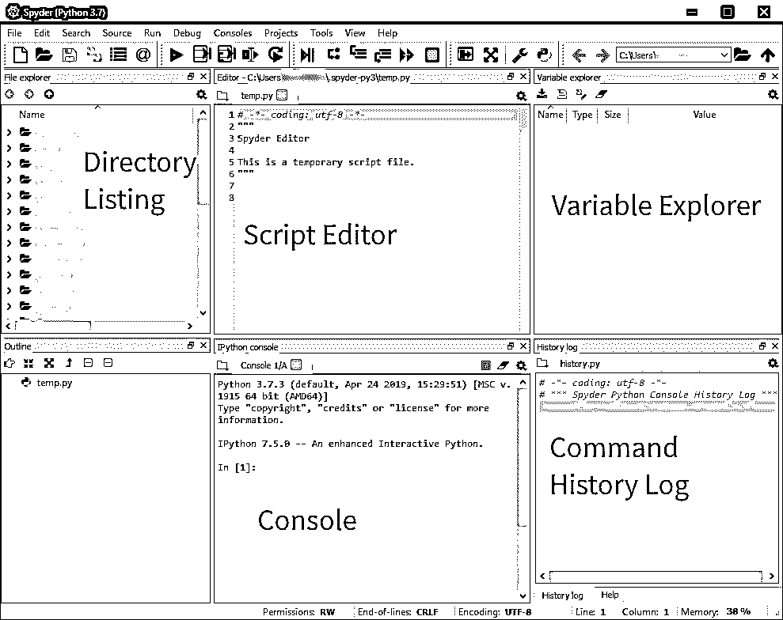

# MATLAB 与 Python:为什么以及如何进行转换

> 原文：<https://realpython.com/matlab-vs-python/>

MATLAB 是众所周知的高质量环境，适用于任何涉及数组、矩阵或线性代数的工作。Python 对于这个领域来说是较新的，但是对于类似的任务来说正变得越来越流行。正如您将在本文中看到的，Python 拥有 MATLAB 对于科学任务的所有计算能力，这使得开发健壮的应用程序变得快速而简单。然而，在比较 MATLAB 和 Python 时，有一些重要的不同之处，你需要了解它们才能有效地转换。

**在这篇文章中，你将学习如何:**

*   评估使用 MATLAB 和 Python 的区别
*   为 Python 设置一个复制大多数 MATLAB 函数的环境
*   将脚本从 MATLAB 转换为 Python
*   避免从 MATLAB 切换到 Python 时可能遇到的常见问题
*   编写外观和感觉都像 Python 的代码

**免费奖励:** [点击此处获取免费的 NumPy 资源指南](#)，它会为您指出提高 NumPy 技能的最佳教程、视频和书籍。

## MATLAB vs Python:比较特性和原理

Python 是一种高级的通用编程语言，旨在方便人们完成各种任务。Python 由吉多·范·罗苏姆创建，并于 20 世纪 90 年代初首次发布。Python 是一种成熟的语言，由全球数百名合作者开发。

Python 被从事小型个人项目的开发人员一直使用到世界上一些最大的互联网公司。不仅 Python 运行 [Reddit](https://redditblog.com/2005/12/05/on-lisp/) 和 [Dropbox](https://anvilventures.com/blog/looking-inside-the-box.html) ，而且[原 Google 算法](https://stackoverflow.com/questions/2560310/heavy-usage-of-python-at-google/2561008#2561008)都是用 Python 写的。此外，基于 Python 的 Django 框架运行 Instagram 和许多其他网站。在科学和工程方面，创建黑洞的 [2019 照片的数据是用 Python](https://www.sciencenews.org/article/black-hole-first-picture-event-horizon-telescope) 处理的[，像](https://github.com/achael/eht-imaging)[网飞这样的大公司在他们的数据分析工作中使用 Python](https://medium.com/netflix-techblog/python-at-netflix-86b6028b3b3e) 。

在 MATLAB 和 Python 的比较中还有一个重要的哲学差异。 **MATLAB** 是**专有的、闭源的**软件。对于大多数人来说，使用 MATLAB 的许可证相当昂贵，这意味着如果你有 MATLAB 代码，那么只有买得起许可证的人才能运行它。此外，用户为扩展 MATLAB 的基本功能而安装的每个额外工具箱都要付费。抛开成本不谈，MATLAB 语言是由 Mathworks 独家开发的。如果 Mathworks 倒闭了，那么 MATLAB 将不再能够被开发，并可能最终停止运行。

另一方面， **Python** 是**免费开源**软件。您不仅可以免费下载 Python，还可以下载、查看和修改源代码。这对 Python 来说是一个很大的优势，因为这意味着如果当前的开发人员由于某种原因无法继续下去，任何人都可以继续开发这种语言。

如果你是一名研究人员或科学家，那么使用开源软件有一些相当大的好处。2018 年诺贝尔经济学奖得主保罗·罗默(Paul Romer)最近也迷上了 Python。据他估计，转向开源软件，尤其是 Python，为他的研究带来了更大的完整性和责任性。这是因为所有的代码都可以被任何感兴趣的读者共享和运行。罗默教授写了一篇很好的文章， [Jupyter，Mathematica 和研究论文的未来](https://paulromer.net/jupyter-mathematica-and-the-future-of-the-research-paper/)，讲述了他使用开源软件的经历。

此外，因为 Python 是免费的，所以更广泛的受众可以使用您开发的代码。正如您将在本文后面看到的，Python 有一个很棒的社区，可以帮助您开始学习这种语言并提高您的知识。有成千上万的教程、文章和书籍都是关于 Python 软件开发的。这里有几个让你开始:

*   [Python 3 简介](https://realpython.com/python-introduction/)
*   [Python 中的基本数据类型](https://realpython.com/learning-paths/python3-introduction/#)
*   [Python 3 基础知识学习路径](https://realpython.com/learning-paths/python3-introduction/)

此外，由于社区中有如此多的开发人员，有成千上万的免费软件包来完成您想用 Python 完成的许多任务。在本文的后面，您将了解更多关于如何获得这些包的信息。

像 **MATLAB** ， **Python** 是一种**解释的**语言。这意味着 Python 代码可以在所有主要的操作系统平台和 CPU 架构之间移植，不同平台只需要做很小的改动。有针对台式机和笔记本电脑 CPU 以及像 Adafruit 这样的微控制器的 Python 发行版。Python 还可以通过一个简单的编程接口与其他微控制器如 Arduino 进行对话，这个接口几乎与任何主机操作系统都相同。

出于所有这些原因，以及更多原因，Python 是取代 MATLAB 成为编程语言的绝佳选择。既然你已经被说服试用 Python 了，那么继续读下去，看看如何在你的计算机上安装它，以及如何从 MATLAB 切换过来！

**注** : [GNU Octave](https://www.gnu.org/software/octave/) 是 MATLAB 的免费开源克隆。从这个意义上来说，GNU Octave 在代码可复制性和软件访问方面拥有与 Python 相同的哲学优势。

Octave 的语法大部分与 MATLAB 语法兼容，因此它为希望使用开源软件的 MATLAB 开发人员提供了一个较短的学习曲线。然而，Octave 无法与 Python 的社区或 Python 可以服务的不同种类的应用程序的数量相匹配，所以我们明确建议您将 whole hog 切换到 Python。

况且这个网站叫*真 Python* ，不是*真八度*😀

[*Remove ads*](/account/join/)

## 为 Python 设置环境

在本节中，您将学习:

*   如何在你的电脑上安装 Python 以便从 MATLAB 无缝过渡
*   如何安装 MATLAB 集成开发环境的替代产品
*   如何在你的电脑上使用 MATLAB 的替代品

### 通过 Anaconda 获得 Python

Python 可以从许多不同的来源下载，称为**发行版**。例如，你可以从[官方 Python 网站](https://python.org)下载的 Python 就是一个发行版。另一个非常流行的 Python 发行版，特别是对于数学、科学、工程和数据科学应用程序，是 [Anaconda 发行版](https://anaconda.com)。

Anaconda 如此受欢迎有两个主要原因:

1.  Anaconda 为 Windows、macOS 和 Linux 分发预构建的包，这意味着安装过程非常简单，并且对于所有三个主要平台都是一样的。

2.  Anaconda 在一个安装程序中包含了工程和数据科学类型工作负载的所有最流行的包。

为了创建一个非常类似于 MATLAB 的环境，您应该下载并[安装 Anaconda](https://anaconda.com/download) 。在撰写本文时，Python 有两个主要版本:Python 2 和 Python 3。您肯定应该为 Python 3 安装 Anaconda 版本，因为 Python 2 在 2020 年 1 月 1 日之后将不再受支持。在撰写本文时，Python 3.7 是最新版本，但是 [Python 3.8](https://realpython.com/python38-new-features/) 应该会在本文发表后几个月发布。3.7 或 3.8 对你来说都一样，所以尽可能选择最新的版本。

一旦您下载了 Anaconda 安装程序，您就可以根据您的平台遵循默认的设置过程。您应该将 Anaconda 安装在一个不需要管理员权限就可以修改的目录中，这是安装程序中的默认设置。

安装了 Anaconda 之后，您应该了解一些特定的程序。启动应用程序最简单的方法是使用 Anaconda Navigator。在 Windows 上，你可以在开始菜单中找到它，在 macOS 上，你可以在 Launchpad 中找到它。以下是 Windows 上 Anaconda Navigator 的屏幕截图:

[](https://files.realpython.com/media/anaconda-navigator.bff710edb0a0.png)

在截图中，你可以看到几个已安装的应用程序，包括 **JupyterLab** 、 **Jupyter Notebook** 和 **Spyder** ，你将在本教程的后面了解更多。

在 Windows 上，还有一个您应该知道的应用程序。这被称为 **Anaconda 提示符**，它是一个专门为 Windows 上的`conda`设置的命令提示符。如果您想在终端中键入`conda`命令，而不是使用 Navigator GUI，那么您应该在 Windows 上使用 Anaconda 提示符。

在 macOS 上，您可以使用任何终端应用程序，如默认的 Terminal.app 或 iTerm2，从命令行访问`conda`。在 Linux 上，您可以使用自己选择的终端模拟器，具体安装哪个模拟器取决于您的 Linux 发行版。

**术语注释:**你可能会对`conda`和 Anaconda 有点困惑。这种区别很微妙但很重要。Anaconda 是 Python 的一个发行版，它包含了许多用于各种科学工作的必要包。 **`conda`** 是一个跨平台的包管理软件，包含在 Python 的 Anaconda 发行版中。`conda`是您用来构建、安装和删除 Anaconda 发行版中的软件包的软件。

你可以在[中阅读所有关于如何使用`conda`在 Windows](https://realpython.com/python-windows-machine-learning-setup/) 上设置 Python 进行机器学习的内容。尽管该教程关注的是 Windows，但是`conda`命令在 Windows、macOS 和 Linux 上是相同的。

Python 还包括另一种安装包的方式，叫做`pip`。如果您正在使用 Anaconda，您应该总是尽可能地使用`conda`来安装软件包。不过，有时一个包只对`pip`可用，对于那些情况，你可以阅读[什么是 Pip？新蟒蛇指南](https://realpython.com/what-is-pip/)。

### 获得集成开发环境

MATLAB 的一大优势是它包含了软件的开发环境。这是您最可能习惯使用的窗口。中间有一个控制台，你可以在那里输入命令，右边是一个[变量](https://realpython.com/python-variables/)浏览器，左边是一个目录列表。

与 MATLAB 不同，Python 本身没有默认的开发环境。这取决于每个用户找到一个适合他们的需求。幸运的是，Anaconda 提供了两种不同的集成开发环境(IDE ),它们类似于 MATLAB IDE，可以让您无缝切换。这些被称为 Spyder 和 JupyterLab。在接下来的两节中，您将看到 Spyder 的详细介绍和 JupyterLab 的简要概述。

### Spyder

Spyder 是专门为科学 Python 工作开发的 Python IDE。Spyder 的一个真正的优点是，它有一个专门为像您这样从 MATLAB 转换到 Python 的人设计的模式。稍后你会看到这一点。

首先你要打开 Spyder。如果您遵循了上一节中的说明，那么您可以使用 Anaconda Navigator 打开 Spyder。找到 Spyder 图标，点击*启动*按钮。如果您使用 Windows，也可以从“开始”菜单启动 Spyder 如果您使用 macOS，则可以从 Launchpad 启动 Spyder。

#### 在 Spyder 中更改默认窗口布局

Spyder 中的默认窗口如下图所示。这是针对运行在 Windows 10 上的 Spyder 3 . 3 . 4 版本的。它在 macOS 或 Linux 上看起来应该非常相似:

[](https://files.realpython.com/media/spyder-default.0ad112e1eb06.png)

在浏览用户界面之前，您可以让界面看起来更像 MATLAB。在*视图→窗口布局*菜单中选择 *MATLAB 布局。*这将自动改变窗口，使其具有你在 MATLAB 中习惯的相同区域，如下图所示:

[](https://files.realpython.com/media/spyder-matlab-view.c9e6fbfcffe4.png)

在窗口的左上方是*文件浏览器*或**目录列表**。在此窗格中，您可以找到要编辑的文件，或者创建要使用的新文件和文件夹。

顶部中间是一个文件编辑器。在这个编辑器中，您可以处理想要保存以便以后重新运行的 Python 脚本。默认情况下，编辑器会打开一个名为`temp.py`的文件，该文件位于 Spyder 的配置目录中。这个文件是一个临时的地方，在你把它们保存到你电脑上的其他地方之前，你可以在这里尝试一下。

底部中间是控制台。像在 MATLAB 中一样，控制台是您可以运行命令来查看它们做了什么，或者当您想要调试一些代码时。如果您关闭 Spyder 并再次打开它，在控制台中创建的变量不会被保存。默认情况下，控制台在技术上运行的是 [IPython](https://ipython.org/) 。

您在控制台中键入的任何命令都将记录到窗口右下窗格的历史文件中。此外，您在控制台中创建的任何变量都将显示在右上方窗格的变量资源管理器中。

请注意，您可以调整任何窗格的大小，方法是将鼠标放在窗格之间的分隔线上，单击并拖动边缘到所需的大小。您可以通过点击窗格顶部的 *x* 来关闭任何窗格。

您还可以通过单击窗格顶部看起来像两个窗口的按钮，将任何窗格从主窗口中分离出来，该按钮就在关闭窗格的 *x* 的旁边。当一个窗格脱离主窗口时，你可以拖动它，并随意重新排列。如果你想把窗格放回主窗口，用鼠标拖动它，这样会出现一个透明的蓝色或灰色背景，相邻的窗格会调整大小，然后松开鼠标，窗格会自动就位。

一旦你完全按照你想要的方式排列了窗格，你可以让 Spyder 保存布局。进入*视图*菜单，再次找到*窗口布局*弹出按钮。然后点击*保存当前布局*并命名。如果某个东西被意外更改，这可以让您随时重置为您喜欢的布局。您也可以从该菜单重置为默认配置之一。

#### 在 Spyder 控制台中运行语句

在这一节中，您将编写一些简单的 Python 命令，但是如果您还没有完全理解它们的意思，请不要担心。在本文的稍后部分，您将了解到更多关于 Python 语法的知识。你现在想做的是了解 Spyder 的界面与 MATLAB 界面有何相似和不同之处。

在本文中，您将大量使用 Spyder 控制台，因此您应该了解它是如何工作的。在控制台中，您将看到以`In [1]:`开头的一行，表示输入行 1。Spyder(实际上是 IPython 控制台)对您输入的所有输入行进行编号。因为这是您键入的第一个输入，所以行号是 1。在本文的其余部分，您将看到对“输入行 X”的引用，其中 X 是方括号中的数字。

我喜欢对刚接触 Python 的人做的第一件事就是向他们展示 Python 的[](https://www.python.org/dev/peps/pep-0020/)*禅。这首小诗让你了解了 Python 是什么，以及如何使用 Python。

要了解 Python 的*禅，在输入行 1 输入`import this`，然后按 `Enter` 运行代码。您将看到如下输出:*

>>>

```py
In [1]: import this
The Zen of Python, by Tim Peters

Beautiful is better than ugly.
Explicit is better than implicit.
Simple is better than complex.
Complex is better than complicated.
Flat is better than nested.
Sparse is better than dense.
Readability counts.
Special cases aren't special enough to break the rules.
Although practicality beats purity.
Errors should never pass silently.
Unless explicitly silenced.
In the face of ambiguity, refuse the temptation to guess.
There should be one-- and preferably only one --obvious way to do it.
Although that way may not be obvious at first unless you're Dutch.
Now is better than never.
Although never is often better than *right* now.
If the implementation is hard to explain, it's a bad idea.
If the implementation is easy to explain, it may be a good idea.
Namespaces are one honking great idea -- let's do more of those!
```

该代码在输入行 1 上有`import this`。运行`import this`的输出是将 Python 的 *Zen 打印到控制台上。我们将在文章的后面回到这首诗的几个小节。*

在本文的许多代码块中，您会在代码块的右上角看到三个大于号(`>>>`)。如果您单击它，它将删除输入提示和任何输出行，因此您可以将代码复制并粘贴到您的控制台中。

许多蟒蛇保持着健康的幽默感。这在这门语言的很多地方都有体现，包括 Python 的*Zen*。对于另一个，在 Spyder 控制台中，键入以下代码，然后按 `Enter` 运行它:

>>>

```py
In [2]: import antigravity
```

这句话将打开你的网络浏览器，看到名为 *XKCD* 的网络漫画，特别是漫画 [#353](https://xkcd.com/353) ，作者发现 Python 赋予了他飞翔的能力！

现在，您已经成功运行了前两条 Python 语句！恭喜😃🎉

如果查看历史日志，您应该会看到您在控制台中键入的前两个命令(`import this`和`import antigravity`)。现在让我们定义一些变量，做一些基本的算术。在控制台中，键入以下语句，在每个语句后按 `Enter` :

>>>

```py
In [3]: var_1 = 10
In [4]: var_2 = 20
In [5]: var_3 = var_1 + var_2
In [6]: var_3
Out[6]: 30
```

在这段代码中，您定义了 3 个变量:`var_1`、`var_2`和`var_3`。你给`var_1`赋值 10，`var_2`赋值 20，给`var_3`赋值`var_1`和`var_2`之和。然后，您通过将变量`var_3`的值写为输入行上唯一的内容来显示它。该语句的输出显示在下一个`Out`行，`Out`行上的数字与相关的`In`行相匹配。

在这些命令中，您需要注意两点:

1.  如果一条语句不包含赋值(带有一个`=`)，它将被打印到一个`Out`行上。在 MATLAB 中，你需要包含一个分号来抑制赋值语句的输出，但是在 Python 中这是不必要的。

2.  在输入行 3、4 和 5，右上角窗格中的*变量浏览器*被更新。

运行这三个命令后，您的*变量浏览器*应该看起来像下图:

[](https://files.realpython.com/media/spyder-variable-explorer.bed4ebb8ed14.png)

在此图中，您可以看到一个包含四列的表格:

1.  ***名称*** 显示您给`var_1`、`var_2`、`var_3`起的名字。
2.  ***类型*** 显示了变量的 Python 类型，在本例中，`int`全部为整数数字。
3.  ***大小*** 显示数据存储变量的大小，对于[列表](https://realpython.com/python-lists-tuples/)和其他[数据结构](https://realpython.com/python-data-structures/)比较有用。
4.  ***值*** 显示变量的当前值。

#### 在 Spyder 的文件中运行代码

在 Spyder 界面的简短旅程中，最后一站是文件编辑器窗格。在此窗格中，您可以创建和编辑 Python 脚本，并使用控制台运行它们。默认情况下，Spyder 会创建一个名为`temp.py`的临时文件，用于在将命令移动或保存到另一个文件之前临时存储命令。

让我们在`temp.py`文件中写一些代码，看看如何运行它。该文件以下面的代码开始，您可以保留它:

```py
 1# -*- coding: utf-8 -*-
 2"""
 3Spyder Editor
 4
 5This is a temporary script file.
 6"""
```

在这段代码中，您可以看到两种 Python 语法结构:

*   第 1 行有一个注释。在 Python 中，注释字符是散列或井号(`#`)。MATLAB 使用百分号(`%`)作为注释字符。该行散列后面的任何内容都是注释，通常会被 Python 解释器忽略。

*   从第 2 行开始是一个字符串，它为文件的内容提供了一些上下文。这通常简称为**文档串**或[文档串](https://realpython.com/documenting-python-code/#documenting-your-python-code-base-using-docstrings)。在稍后的章节的[中，您将了解到更多关于 docstrings 的内容。](#comments-start-with-in-python)

现在，您可以开始向该文件添加代码了。从`temp.py`中的第 8 行开始，输入与您已经在控制台中输入的代码相似的代码:

```py
 8var_4 = 10
 9var_5 = 20
10var_6 = var_4 + var_5
```

那么，有三种方法可以运行代码:

1.  你可以使用 `F5` 快捷键来运行文件，就像在 MATLAB 中一样。
2.  你可以点击菜单栏中向右的绿色三角形，就在*编辑器*和*文件浏览器*窗格的上方。
3.  您可以使用*运行→运行*菜单选项。

第一次运行文件时，Spyder 会打开一个对话框，要求您确认要使用的选项。对于这个测试，默认选项是好的，您可以单击对话框底部的*运行*:

[](https://files.realpython.com/media/spyder-run-settings.784e177e3ab9.png)

这将在控制台中自动执行以下代码:

>>>

```py
In [7]: runfile('C:/Users/Eleanor/.spyder-py3/temp.py',
 ...:        wdir='C:/Users/Eleanor/.spyder-py3')
```

这段代码将运行您正在处理的文件。注意，运行该文件向变量浏览器中添加了三个变量:`var_4`、`var_5`和`var_6`。这是您在文件中定义的三个变量。您还会看到`runfile()`被添加到历史日志中。

在 Spyder 中，您还可以创建可以单独运行的代码单元。要创建一个代码单元，在编辑器中打开的文件中添加一行以`# %%`开头的代码:

```py
11# %% This is a code cell
12var_7 = 42
13var_8 = var_7 * 2
14
15# %% This is a second code cell
16print("This code will be executed in this cell")
```

在这段代码中，您在第 11 行用`# %%`代码创建了第一个代码单元格。后面是一行注释，被 Python 忽略。在第 12 行，你给`var_7`赋值 42，然后第 13 行给`var_8`赋值为`var_7`乘以 2。第 15 行开始另一个代码单元，它可以与第一个代码单元分开执行。

要执行代码单元格，单击*运行当前单元格*或*运行当前单元格，并转至工具栏中通用*运行*按钮旁边的下一个*按钮。您也可以使用键盘快捷键 `Ctrl` + `Enter` 来运行当前单元格并保持选中状态，或者 `Shift` + `Enter` 来运行当前单元格并选择下一个单元格。

Spyder 还提供了易于使用的调试功能，就像在 MATLAB 中一样。您可以双击*编辑器*中的任意行号，在您的代码中设置断点。您可以使用工具栏上带有两条垂直线的蓝色向右三角形，或者使用 `Ctrl` + `F5` 键盘快捷键，在调试模式下运行代码。这将在您指定的任何断点处暂停执行，并在控制台中打开`ipdb`调试器，这是运行 Python 调试器`pdb`的 IPython 增强方式。你可以在 [Python 调试与 pdb](https://realpython.com/python-debugging-pdb/) 中了解更多。

#### 总结你在 Spyder 的经历

现在您已经有了使用 Spyder 作为 MATLAB 集成开发环境的替代品的基本工具。您知道如何在控制台中运行代码或在文件中键入代码并运行该文件。您还知道在哪里可以看到您的目录和文件、您定义的变量以及您键入的命令的历史记录。

一旦您准备好开始将代码组织成模块和包，您就可以查阅以下资源:

*   [Python 模块和包——简介](https://realpython.com/python-modules-packages/)
*   [如何将开源 Python 包发布到 PyPI](https://realpython.com/pypi-publish-python-package/)
*   [如何将自己的 Python 包发布到 PyPI](https://realpython.com/courses/how-to-publish-your-own-python-package-pypi/)

Spyder 是一个非常大的软件，而你仅仅触及了它的表面。通过阅读[官方文档](https://docs.spyder-ide.org/index.html)、[故障排除和常见问题指南](https://github.com/spyder-ide/spyder/wiki/Troubleshooting-Guide-and-FAQ)和 [Spyder wiki](https://github.com/spyder-ide/spyder/wiki) ，你可以了解更多关于 Spyder 的信息。

[*Remove ads*](/account/join/)

### JupyterLab

JupyterLab 是由 Project Jupyter 开发的 IDE。你可能听说过 Jupyter 笔记本，特别是如果你是一个数据科学家。嗯，JupyterLab 是 Jupyter 笔记本的下一个版本。虽然在撰写本文时，JupyterLab 仍处于测试阶段，但 Jupyter 项目预计 JupyterLab 最终将取代当前的笔记本服务器接口。然而，JupyterLab 完全兼容现有的笔记本电脑，因此过渡应该是相当无缝的。

JupyterLab 预装了 Anaconda，因此您可以从 Anaconda Navigator 启动它。找到 JupyterLab 盒子，点击*发射*。这将打开您的网络浏览器，进入地址`http://localhost:8888/lab`。

JupyterLab 的主窗口如下图所示:

[](https://files.realpython.com/media/jupyterlab-main-window.d9420a33f736.png)

该界面有两个主要部分:

1.  左边是一个*文件浏览器*，可以让你从电脑上打开文件。
2.  窗口的右侧是如何打开创建新的笔记本文件，在 IPython 控制台或系统终端中工作，或者创建新的文本文件。

如果你有兴趣了解更多关于 JupyterLab 的信息，你可以在宣布 beta 版本的[博客文章](https://blog.jupyter.org/jupyterlab-is-ready-for-users-5a6f039b8906)或 [JupyterLab 文档](https://jupyterlab.readthedocs.io/en/stable/)中阅读更多关于笔记本下一步发展的信息。您还可以在 [Jupyter 笔记本:简介](https://realpython.com/jupyter-notebook-introduction/)和[使用 Jupyter 笔记本](https://realpython.com/courses/using-jupyter-notebooks/)课程中了解笔记本界面。Jupyter 笔记本风格文档的一个优点是，您在 Spyder 中创建的代码单元格与 Jupyter 笔记本中的代码单元格非常相似。

## 了解 Python 的数学库

现在你的计算机上有了 Python，你有了一个让你感觉像在家里一样的 IDE。那么，如何学习如何在 Python 中实际完成一项任务呢？有了 MATLAB，你可以使用搜索引擎，只需在查询中包含`MATLAB`就可以找到你要找的主题。使用 Python，如果您在查询中比仅仅包含`Python`更具体一点，通常会得到更好的搜索结果。

在这一节中，您将通过了解 Python 功能是如何被分成几个库的，从而更好地掌握 Python。您还将了解每个库是做什么的，这样您就可以通过搜索获得一流的结果！

Python 有时被称为包含**电池的**语言。这意味着当你[安装 Python](https://realpython.com/installing-python/) 时，你需要的大部分重要功能都已经包含在内了。例如，Python 内置了包含基本操作的`math`和`statistics`库。

但是，有时你想做一些语言中没有的事情。Python 的一大优势是，其他人可能已经完成了您需要做的任何事情，并发布了完成该任务的代码。有几十万个公开可用的免费软件包，你可以很容易地安装它们来执行各种任务。这些范围从[处理 PDF 文件](https://realpython.com/creating-modifying-pdf/)到建立和托管一个互动网站到使用高度优化的数学和科学功能。

使用数组或矩阵、[优化](https://realpython.com/linear-programming-python/)或绘图需要安装额外的库。幸运的是，如果您使用 Anaconda 安装程序安装 Python，这些库是预安装的，您不必担心。即使您没有使用 Anaconda，对于大多数操作系统来说，它们通常也很容易安装。

您需要从 MATLAB 切换的一组重要库通常被称为 **SciPy 栈**。堆栈的基础是提供基本数组和矩阵运算( **NumPy** )、积分、优化、[信号处理](https://realpython.com/python-scipy-fft/)和[线性代数](https://realpython.com/python-scipy-linalg/)函数( **SciPy** )和绘图( **Matplotlib** )的库。其他基于这些来提供更高级功能的库包括 [**Pandas**](https://realpython.com/pandas-python-explore-dataset/) ， **scikit-learn** ， **SymPy** 等等。

### NumPy(数字 Python)

NumPy 可能是 Python 中科学计算最基本的包。它提供了一个高效的界面来创建多维数组并与之交互。几乎所有在 [SciPy](https://realpython.com/python-scipy-cluster-optimize/) 栈中的其他包都以某种方式使用或集成了 NumPy。

NumPy 数组相当于 MATLAB 中的基本数组数据结构。使用 NumPy 数组，您可以进行内积和外积、转置和元素操作。NumPy 还包含许多有用的方法，用于读取文本和二进制数据文件、拟合多项式函数、许多数学函数(正弦、余弦、平方根等)以及生成随机数。

NumPy 对性能敏感的部分都是用 C 语言写的，所以速度非常快。NumPy 还可以利用优化的线性代数库，如英特尔的 MKL 或 OpenBLAS，进一步提高性能。

**注:**

*真正的 Python* 有[几篇文章](https://realpython.com/tutorials/numpy/)讲述了如何使用 NumPy 来加速你的 Python 代码:

*   [看 Ma，无 For 循环:用 NumPy 进行数组编程](https://realpython.com/numpy-array-programming/)
*   [NumPy arange():如何使用 np.arange()](https://realpython.com/how-to-use-numpy-arange/)
*   [Python 直方图绘制:NumPy，Matplotlib，Pandas & Seaborn](https://realpython.com/python-histograms/)

[*Remove ads*](/account/join/)

### SciPy(科学巨蟒)

SciPy 包(不同于 SciPy 栈)是一个为科学应用程序提供大量有用功能的库。如果您需要做需要优化、线性代数或稀疏线性代数、离散傅立叶变换、信号处理、物理常数、图像处理或数值积分的工作，那么 SciPy 就是您的库！由于 SciPy 实现了这么多不同的特性，这就像是在一个包中访问了一堆 MATLAB 工具箱。

SciPy 非常依赖 NumPy 数组来完成它的工作。和 NumPy 一样，SciPy 中的很多算法都是用 C 或 Fortran 实现的，所以速度也很快。与 NumPy 一样，SciPy 可以利用优化的线性代数库来进一步提高性能。

### Matplotlib(类 MATLAB 绘图库)

[Matplotlib](https://matplotlib.org) 是一个产生高质量和交互式二维图的库。Matplotlib 旨在提供一个类似于 MATLAB 中的`plot()`函数的绘图接口，所以从 MATLAB 切换过来的人应该会觉得有些熟悉。尽管 Matplotlib 中的核心功能是用于二维数据绘图，但也有可用的扩展，允许使用 [mplot3d](https://matplotlib.org/3.1.0/api/toolkits/mplot3d.html) 包进行三维绘图，使用 [cartopy](https://scitools.org.uk/cartopy/docs/latest/) 绘制地理数据，以及在 [Matplotlib 文档](https://matplotlib.org/3.1.0/thirdpartypackages/index.html)中列出的更多功能。

**注:**

以下是 Matplotlib 上的更多资源:

*   [使用 Matplotlib 进行 Python 绘图(指南)](https://realpython.com/python-matplotlib-guide/)
*   [Matplotlib 示例](https://matplotlib.org/tutorials/introductory/sample_plots.html)
*   [Matplotlib 图库](https://matplotlib.org/gallery/index.html)

### 其他重要的 Python 库

使用 NumPy、SciPy 和 Matplotlib，您可以将许多 MATLAB 代码切换到 Python。但是，了解更多的库可能会有所帮助。

*   [**熊猫**](https://pandas.pydata.org/) 提供了一个[数据帧](https://realpython.com/pandas-dataframe/)，一个能够命名行和列以便于访问的数组。
*   [**SymPy**](https://www.sympy.org/en/index.html) 提供了符号数学和计算机代数系统。
*   [**scikit-learn**](https://scikit-learn.org/stable/index.html) 提供了许多与机器学习任务相关的功能。
*   [**scikit-image**](https://scikit-image.org/) 提供与图像处理相关的功能，兼容 SciPy 中的类似库。
*   [**Tensorflow**](https://www.tensorflow.org/) 为许多机器学习任务提供了一个通用平台。
*   [**Keras**](https://keras.io/) 提供了生成神经网络的库。
*   [**多处理**](https://docs.python.org/3/library/multiprocessing.html) 提供了一种执行基于多进程的并行性的方法。它内置于 Python 中。
*   [**Pint**](https://pint.readthedocs.io) 提供单位库，进行物理单位制之间的自动转换。
*   [**PyTables**](http://www.pytables.org/) 为 HDF5 格式文件提供了读写器。
*   [**PyMC3**](http://docs.pymc.io/) 提供贝叶斯统计建模和概率机器学习功能。

## MATLAB 和 Python 的语法差异

在本节中，您将学习如何将 MATLAB 代码转换成 Python 代码。您将了解 MATLAB 和 Python 之间的主要语法差异，了解基本数组操作的概述以及它们在 MATLAB 和 Python 之间的区别，并了解一些尝试自动转换代码的方法。

MATLAB 和 Python 最大的技术区别是，在 MATLAB 中，一切都被当作数组，而在 Python 中一切都是更一般的对象。例如，在 MATLAB 中，字符串是字符数组或字符串数组，而在 Python 中，字符串有自己的对象类型，称为`str`。正如您将在下面看到的，这对您如何使用每种语言进行编码有着深远的影响。

说完了，让我们开始吧！为了帮助您，下面的部分根据您遇到该语法的可能性进行了分组。

### 你可能会看到这个语法

本节中的示例代表了您很可能在野外看到的代码。这些例子还展示了一些更基本的 Python 语言特性。在继续之前，您应该确保已经很好地掌握了这些示例。

#### Python 中的注释以`#`开头

在 MATLAB 中，注释是一行中跟在百分号(`%`)后面的任何东西。在 Python 中，注释是跟在散列或井号(`#`)后面的任何东西。在前面关于 Spyder 的章节中，您已经看到了 Python 注释。一般来说，Python 解释器会忽略注释的内容，就像 MATLAB 解释器一样，所以你可以在注释中写任何你想写的内容。Python 中这个规则的一个例外是您在前面关于 Spyder 的部分看到的例子:

```py
# -*- coding: utf-8 -*-
```

当 Python 解释器读取这一行时，它将设置用来读取文件其余部分的编码。该注释必须出现在文件的前两行之一才有效。

MATLAB 和 Python 的另一个区别是如何编写内联文档。在 MATLAB 中，文档被写在注释中函数[的开始处，如下面的代码示例:](https://www.mathworks.com/help/matlab/matlab_prog/add-help-for-your-program.html)

```py
function  [total]  =  addition(num_1,num_2) % ADDITION  Adds two numbers together %   TOTAL = ADDITION(NUM_1,NUM_2) adds NUM_1 and NUM_2 together % %   See also SUM and PLUS
```

然而，Python 并没有以这种方式使用注释。相反，Python 有一个想法，简称为**文档字符串**或[T3】文档字符串 T5。在 Python 中，您可以像这样记录如上所示的 MATLAB 函数:](https://www.python.org/dev/peps/pep-0257/)

```py
def addition(num_1, num_2):
    """Adds two numbers together.

 Example
 -------
 >>> total = addition(10, 20)
 >>> total
 30

 """
```

请注意，在这段代码中，docstring 位于两组三个引号字符(`"""`)之间。这允许 docstring 运行在多行上，并保留空白和换行符。三重引号字符是 [**字符串文字**](https://docs.python.org/3/tutorial/introduction.html#strings) 的特例。现在还不要太担心定义函数的语法。在后面的章节中你会看到更多关于那个[的内容。](#function-definitions-start-with-def-and-return-values-in-python)

#### 在 Python 中，行首的空白很重要

当你在 MATLAB 中写代码时，像 [`if`语句](https://realpython.com/python-conditional-statements/)、 [`for`](https://realpython.com/python-for-loop/) 和 [`while`循环](https://realpython.com/python-while-loop/)这样的块，函数定义都是用`end`关键字结束的。在 MATLAB 中，通常认为在块内缩进代码是一种好的做法，这样代码可以直观地组合在一起，但这在语法上并不是必需的。

例如，以下两个代码块在 MATLAB 中的功能是等效的:

```py
 1num  =  10; 2
 3if  num  ==  10 4disp("num is equal to 10") 5else 6disp("num is not equal to 10") 7end 8
 9disp("I am now outside the if block")
```

在这段代码中，首先创建`num`来存储值 10，然后检查`num`的值是否等于 10。如果是，您将从第 2 行开始在控制台上显示短语`num is equal to 10`。否则，`else`条款将生效并显示`num is not equal to 10`。当然，如果你运行这段代码，你会看到`num is equal to 10`输出，然后是`I am now outside the if block`。

现在，您应该修改您的代码，使其看起来像下面的示例:

```py
 1num  =  10; 2
 3if  num  ==  10 4  disp("num is equal to 10")  5else 6  disp("num is not equal to 10")  7end 8
 9disp("I am now outside the if block")
```

在这段代码中，您只修改了第 3 行和第 5 行，在这一行的前面添加了一些空格或缩进。代码将与前面的示例代码执行相同，但是有了缩进，就更容易区分哪些代码在语句的`if`部分，哪些代码在语句的`else`部分。

在 Python 中，行首的缩进用来分隔类和函数定义、`if`语句、`for`和`while`循环的开始和结束。Python 中没有`end`关键字。这意味着缩进在 Python 中非常重要！

此外，在 Python 中，`if/else/elif`语句、`for`或`while`循环、函数或类的定义行以冒号结尾。在 MATLAB 中，冒号不用来结束一行。

考虑这个代码示例:

```py
 1num = 10
 2
 3if num == 10:
 4    print("num is equal to 10")
 5else:
 6    print("num is not equal to 10")
 7
 8print("I am now outside the if block")
```

在第一行，您定义了`num`，并将其值设置为 10。在第 2 行，写`if num == 10:`测试`num`相对于 10 的值。注意行尾的冒号。

接下来，在 Python 的语法中，第 3 行*必须*缩进。在那一行，您使用`print()`向控制台显示一些输出，类似于 MATLAB 中的`disp()`。在后面的章节中，你会读到更多关于`print()`对`disp()`T6 的内容。

在第 4 行，您正在启动`else`程序块。注意，`else`关键字中的`e`与`if`关键字中的`i`垂直对齐，并且该行以冒号结束。因为第 3 行的`else`是相对于`print()`定向的，并且因为它与`if`关键字对齐，Python 知道块的`if`部分中的代码已经完成，而`else`部分正在开始。第 5 行缩进一级，因此它构成了当满足`else`语句时要执行的代码块。

最后，在第 6 行，您打印了一条来自`if` / `else`块外部的语句。不管`num`的值是多少，都将打印该声明。注意`print()`中的`p`与`if`中的`i`和`else`中的`e`垂直对齐。Python 就是这样知道`if` / `else`块中的代码已经结束的。如果运行上面的代码，Python 将显示`num is equal to 10`，后面跟着`I am now outside the if block`。

现在，您应该修改上面的代码来删除缩进，看看会发生什么。如果您尝试在 Spyder/IPython 控制台中键入不带缩进的代码，您将得到一个`IndentationError`:

>>>

```py
In [1]: num = 10
In [2]: if num == 10:
 ...: print("num is equal to 10")
 File "<ipython-input-2-f453ffd2bc4f>", line 2
    print("num is equal to 10")
        ^
IndentationError: expected an indented block
```

在这段代码中，首先将`num`的值设置为 10，然后尝试编写没有缩进的`if`语句。事实上，IPython 控制台是智能的，它会自动缩进`if`语句后的行，所以您必须删除缩进才能产生这个错误。

当你缩进你的代码时，官方的 Python 风格指南 [PEP 8](#there-is-an-official-guide-to-writing-good-code-in-python) 推荐使用 4 个空格字符代表一个缩进级别。如果您按下键盘上的 `Tab` 键，大多数设置为处理 Python 文件的文本编辑器会自动插入 4 个空格。如果你愿意，你可以选择在你的代码中使用制表符，但是你不应该混合制表符和空格，否则如果缩进变得不匹配，你可能会以一个`TabError`结束。

#### Python 中的条件语句使用`elif`

在 MATLAB 中，可以用`if`、`elseif`、`else`构造[条件语句](https://www.mathworks.com/help/matlab/ref/if.html)。这些类型的语句允许你控制程序的流程来响应不同的条件。

您应该用下面的代码来尝试这个想法，然后比较 MATLAB 和 Python 的条件语句示例:

```py
 1num  =  10; 2if  num  ==  10 3  disp("num is equal to 10") 4elseif  num  ==  20  5  disp("num is equal to 20") 6else 7  disp("num is neither 10 nor 20") 8end
```

在这个代码块中，您将`num`定义为等于 10。然后检查`num`的值是否为 10，如果是，使用`disp()`将输出打印到控制台。如果`num`是 20，您将打印一个不同的报表，如果`num`既不是 10 也不是 20，您将打印第三个报表。

在 Python 中，`elseif`关键字被替换为`elif`:

```py
 1num = 10
 2if num == 10:
 3    print("num is equal to 10")
 4elif num == 20: 5    print("num is equal to 20")
 6else:
 7    print("num is neither 10 nor 20")
```

这个代码块在功能上等同于前面的 MATLAB 代码块。有两个主要区别。在第 4 行，`elseif`被替换为`elif`，并且没有结束该块的`end`语句。相反，当在`else`之后找到下一行代码时，`if`块结束。您可以在 [Python 文档](https://docs.python.org/3/tutorial/controlflow.html#if-statements)中阅读更多关于`if`语句的内容。

#### 在 Python 中调用函数和索引序列使用不同的括号

在 MATLAB 中，当你想调用一个函数或者当你想索引一个数组时，你使用圆括号(`()`)，有时也称为括号。方括号(`[]`)用于创建数组。

您可以使用下面的示例代码来测试 MATLAB 与 Python 的区别:

>>>

```py
>> arr  =  [10,  20,  30]; >> arr(1) ans =

 10

>> sum(arr) ans =

 60
```

在这段代码中，首先使用等号右边的方括号创建一个数组。然后，使用圆括号作为索引操作符，通过`arr(1)`检索第一个元素的值。在第三个输入行上，您调用`sum()`并使用圆括号来指示应该传递给`sum()`的参数，在本例中只是`arr`。MATLAB 计算`arr`中元素的总和并返回结果。

Python 使用不同的语法来调用函数和索引序列。在 Python 中，使用圆括号意味着应该执行一个函数，而使用方括号将索引一个序列:

>>>

```py
In [1]: arr = [10, 20, 30]
In [2]: arr[0]
Out[2]: 10

In [3]: sum(arr)
Out[3]: 60
```

在这段代码中，您将在输入行 1 上定义一个 Python 列表。Python 列表与 MATLAB 中的数组和 NumPy 包中的数组有一些重要的区别。您可以在[列表中阅读更多关于 Python 列表的内容，在 Python](https://realpython.com/python-lists-tuples/) 中阅读更多关于元组的内容，并且您将在后面的章节[中了解更多关于 NumPy 数组的内容。](#an-overview-of-basic-array-operations)

在第 2 行输入中，使用方括号显示了索引操作中列表第一个元素的值。在输入行 3 上，使用圆括号调用`sum()`，并传入存储在`arr`中的列表。这导致列表元素的总和显示在最后一行。注意 Python 使用方括号来索引列表，使用圆括号来调用函数。

#### Python 中序列的第一个索引是 0

在 MATLAB 中，使用`1`作为索引，可以从数组中获取第一个值。这种样式遵循自然的编号惯例，并从如何计算序列中的项目数开始。您可以通过这个例子来尝试 MATLAB 与 Python 的区别:

>>>

```py
>> arr  =  [10,  20,  30]; >> arr(1) ans =

 10

>> arr(0) Array indices must be positive integers or logical values.
```

在这段代码中，您将创建一个包含三个数字的数组:`10`、`20`和`30`。然后显示索引为`1`的第一个元素的值，即`10`。试图访问第零个元素会导致 MATLAB 出错，如最后两行所示。

在 Python 中，序列中第一个元素的索引是 0，而不是 1:

>>>

```py
In [1]: arr = [10, 20, 30]
In [2]: arr[0]
Out[2]: 10

In [3]: arr[1]
Out[3]: 20

In [4]: a_string = "a string"
In [5]: a_string[0]
Out[5]: 'a'

In [6]: a_string[1]
Out[6]: ' '
```

在这段代码中，您将`arr`定义为一个 Python 列表，在输入行 1 上有三个元素。在输入行 2 上，显示了列表中第一个元素的值，索引为 0。然后显示列表的第二个元素，索引为 1。

在输入行 4、5 和 6 上，您用内容`"a string"`定义了`a_string`，然后获得了字符串的第一个和第二个元素。请注意，字符串的第二个元素(字符)是一个空格。这演示了一个通用的 Python 特性，许多变量类型作为序列操作，并且可以被索引，包括列表、元组、字符串和数组。

#### 序列的最后一个元素在 Python 中的索引为`-1`

在 MATLAB 中，你可以用 [`end`](https://www.mathworks.com/help/matlab/ref/end.html) 作为索引，从一个数组中得到最后一个值。当你不知道一个数组有多长时，这真的很有用，所以你不知道用什么数字来访问最后一个值。

通过以下示例尝试 MATLAB 与 Python 的区别:

>>>

```py
>> arr  =  [10,  20,  30]; >> arr(end) ans =

 30
```

在这段代码中，您将创建一个包含三个数字的数组，`10`、`20`和`30`。然后显示索引为`end`的最后一个元素的值，即`30`。

在 Python 中，可以使用索引`-1`来检索序列中的最后一个值:

>>>

```py
In [1]: arr = [10, 20, 30]
In [2]: arr[-1]
Out[2]: 30
```

在这段代码中，您将在输入行 1 上定义一个包含三个元素的 Python 列表。在输入行 2 上，您正在显示列表的最后一个元素的值，它的索引为`-1`，值为 30。

事实上，通过使用负数作为索引值，您可以反向遍历序列:

>>>

```py
In [3]: arr[-2]
Out[3]: 20

In [4]: arr[-3]
Out[4]: 10
```

在这段代码中，您将从列表中检索倒数第二个和倒数第三个元素，它们的值分别为`20`和`10`。

#### 在 Python 中用`**`做取幂运算

在 MATLAB 中，当你想计算一个数的幂时，你可以使用[插入符](https://www.mathworks.com/help/matlab/ref/mpower.html) ( `^`)。脱字符操作符是一个接受两个数字的二元操作符**。其他二元运算符包括加法(`+`)、减法(`-`)、乘法(`*`)和除法(`/`)等等。插入符号左边的数字是基数，右边的数字是指数。**

通过下面的例子尝试一下 MATLAB 和 Python 的区别:

>>>

```py
>> 10^2 ans =

 100
```

在这段代码中，您使用脱字符号将 10 的 2 次方乘方，得到的结果是 100。

在 Python 中，当您想要对一个数字进行幂运算时，可以使用两个星号(`**`):

>>>

```py
In [1]: 10 ** 2
Out[1]: 100
```

在这段代码中，您使用两个星号将 10 的 2 次方提升到 100。请注意，在星号两边包含空格没有任何影响。在 Python 中，典型的风格是在二元运算符的两边都有空格。

#### 用 Python 中的`len()`找到一个序列的长度

在 MATLAB 中，可以用 [`length()`](https://www.mathworks.com/help/matlab/ref/length.html) 得到一个数组的长度。该函数将一个数组作为参数，并返回数组中最大维度的大小。通过这个例子，您可以看到这个函数的基本原理:

>>>

```py
>> length([10,  20,  30]) ans =

 3

>> length("a string") ans =

 1
```

在这段代码中，在第一个输入行中，您将找到一个包含 3 个元素的数组的长度。不出所料，`length()`返回的答案是 3。在第二个输入行，您会发现包含一个元素的字符串数组的长度。请注意，MATLAB 隐式创建了一个字符串数组，即使您没有使用方括号来表示它是一个数组。

在 Python 中，可以用`len()`得到一个序列的长度:

>>>

```py
In [1]: len([10, 20, 30])
Out[1]: 3

In [2]: len("a string")
Out[2]: 8
```

在这段代码中，在第 1 行输入中，您会发现一个包含 3 个元素的列表的长度。正如所料，`len()`返回的长度为 3。在第 2 行输入中，您将找到一个字符串的长度作为输入。在 Python 中，字符串是序列，`len()`计算字符串中的字符数。在这种情况下，`a string`有 8 个字符。

#### 在 Python 中，控制台输出显示为`print()`

在 MATLAB 中，可以使用`disp()`、`fprintf()`和`sprintf()`将变量值和其他输出打印到控制台。在 Python 中，`print()`的功能与`disp()`相似。与`disp()`不同，`print()`可以将其输出发送到类似于`fprintf()`的文件中。

Python 的`print()`将显示传递给它的任意数量的参数，在输出中用空格分隔它们。这与 MATLAB 中的`disp()`不同，它只接受一个参数，尽管该参数可以是一个有多个值的数组。下面的例子展示了 Python 的`print()`如何接受任意数量的参数，并且在输出中每个参数由一个空格分隔:

>>>

```py
In [1]: val_1 = 10
In [2]: val_2 = 20
In [3]: str_1 = "any number of arguments"
In [4]: print(val_1, val_2, str_1)
10 20 any number of arguments
```

在这段代码中，输入行 1、2、3 定义了`val_1`、`val_2`和`str_1`，其中`val_1`和`val_1`是整数，`str_1`是一串文本。在输入行 4 上，使用`print()`打印三个变量。这一行下面的输出三个变量的值显示在控制台输出中，用空格分隔。

您可以通过使用`sep`关键字参数来控制`print()`参数之间的输出中使用的分隔符:

>>>

```py
In [5]: print(val_1, val_2, str_1, sep="; ")
10; 20; any number of arguments
```

在这段代码中，您打印了同样的三个变量，但是将分隔符设置为分号后跟一个空格。此分隔符打印在第一个和第二个以及第二个和第三个参数之间，但不在第三个参数之后。要控制在最后一个值之后打印的字符，您可以使用`end`关键字参数到`print()`:

>>>

```py
In [6]: print(val_1, val_2, str_1, sep="; ", end=";")
10; 20; any number of arguments;
```

在这段代码中，您将`end`关键字参数添加到了`print()`，设置它在最后一个值后打印一个分号。这显示在输入下方的第行输出中。

和 MATLAB 的`disp()`一样，`print()`不能直接控制变量的输出格式，要靠你来做格式化。如果你想要更多的控制输出的格式，你应该使用 [f 弦](https://realpython.com/python-f-strings/)或者 [`str.format()`](https://realpython.com/python-formatted-output/) 。在这些字符串中，您可以使用与 MATLAB 中的`fprintf()`非常相似的格式样式代码来格式化数字:

>>>

```py
In [7]: print(f"The value of val_1 = {val_1:8.3f}")
The value of val_1 =   10.000

In [8]: # The following line will only work in Python 3.8

In [9]: print(f"The value of {val_1=} and {val_2=}")
The value of val_1=10, and val_2=20
```

在这段代码中，输入行 7 包含一个 f 字符串，由开始字符串的`f`指示。这意味着 Python 将替换它在字符串中遇到的`{}`或花括号之间的任何变量的值。你可以看到，在输出中，Python 用一个浮点数代替了`{val_1:8.3f}`，输出中有 8 列，精度为 3 位数。

输入行 9 展示了 Python 3.8 中的一个新特性。如果变量名后面紧跟着一个大括号内的等号，变量名和值将被自动打印出来。

你可以通过查看[Python 打印的终极指南](https://realpython.com/python-print/)来深入了解 Python 的`print()`。

[*Remove ads*](/account/join/)

### 你可能会看到这些，但是你可以在需要的时候学习它们

在这一节中，您将找到一些您可能会在野外看到的代码示例，但是如果您愿意，您可以等一会儿来理解它们。这些例子使用了 Python 中的一些中间特性，但仍然是 Python 工作方式的核心。就像上一节一样，您将看到 MATLAB 与 Python 语法差异的比较。

#### Python 中的函数定义以`def`和`return`值开始

在 MATLAB 中，你可以通过在行首放置关键字`function`来[定义一个函数](https://www.mathworks.com/help/matlab/ref/function.html)。其后是任何输出变量的名称、等号(`=`)符号，然后是函数的名称和括号中的任何输入参数。在函数中，您必须将您在定义行中指定的任何变量赋值为输出。下面是一个简单的 MATLAB 函数示例:

```py
 1function  [total]  =  addition(num_1,num_2) 2total  =  num_1  +  num_2; 3end
```

在这段代码中，您可以在第 1 行看到`function`的定义。这个函数只有一个输出变量，称为`total`。这个函数的名字是`addition`,它有两个参数，在函数体中分别被命名为`num_1`和`num_2`。第 2 行是函数的实现。`total`的值被设置为等于`num_1`和`num_2`的和。函数的最后一行是`end`关键字，告诉 MATLAB 解释器函数的定义已经完成。

要在 MATLAB 中使用这个函数，应该将它保存在一个名为`addition.m`的文件中，与函数的名称相匹配。或者，如果函数定义是文件中的最后一项，并且文件是名为`addition.m`的*而不是*，那么它可以和其他命令一起放在文件中。然后，您可以通过在 MATLAB 控制台中键入以下代码来运行该函数:

>>>

```py
>> var_1  =  20; >> var_2  =  10; >> sum_of_vars  =  addition(var_1,var_2) sum_of_vars =

 30
```

在这段代码中，您定义了两个名为`var_1`和`var_2`的变量，分别保存值 20 和 10。然后，您创建了第三个名为`sum_of_vars`的变量，它存储来自`addition()`的输出。检查一下*变量浏览器*，你会看到`sum_of_vars`的值是 30，和预期的一样。注意名称`sum_of_vars`不必与函数定义中使用的输出变量名称相同，即`total`。

MATLAB 不需要函数来提供输出值。在这种情况下，您可以从函数定义中删除输出变量和等号。修改您的`addition.m`文件，使代码看起来像这样:

```py
 1function  addition(num_1,num_2)  2total  =  num_1  +  num_2; 3end
```

这段代码与之前代码的唯一不同之处是您删除了第 1 行的`[total] =`,其他行完全相同。现在，如果您尝试将调用此函数的结果赋给一个变量，MATLAB 将在控制台中生成一个错误:

>>>

```py
>> var_1  =  20; >> var_2  =  10; >> sum_of_vars  =  addition(var_1,var_2); Error using addition
Too many output arguments.
```

在这段代码中，您定义了与之前相同的两个变量`var_1`和`var_2`，并以与之前相同的方式调用了`addition()`。然而，由于`addition()`不再指定输出变量，MATLAB 生成一个错误消息，指出输出参数太多。点击单词`addition`将打开函数的定义，供您编辑或查看源代码以修复问题。

在 Python 中，`def`关键字启动一个函数定义。`def`关键字后面必须跟函数名和括号内的函数参数，类似于 MATLAB。带有`def`的行必须以冒号(`:`)结束。

从下一行开始，应该作为函数的一部分执行的代码必须缩进一级。在 Python 中，当一行代码开始于与第一行的`def`关键字相同的缩进级别时，函数定义结束。

如果您的函数向调用者返回一些输出，Python 不要求您为输出变量指定名称。相反，您使用 [`return`语句](https://realpython.com/python-return-statement/)来发送函数的输出值。

Python 中一个与第一个带有输出变量的`addition()`示例等价的函数如下所示:

```py
 1def addition(num_1, num_2):
 2    total = num_1 + num_2
 3    return total
```

在这段代码中，您会在第 1 行看到`def`关键字，后跟函数名和两个参数`num_1`和`num_2`。在第 2 行你可以看到创建了一个新变量`total`来存储`num_1`和`num_2`的和，在第 3 行`total`的值被返回到这个函数被调用的地方。注意，第 2 行和第 3 行缩进了 4 个空格，因为它们构成了函数体。

存储`num_1`和`num_2`之和的变量可以有任何名字，不一定要叫`total`。事实上，你根本不需要在那里创建一个变量。您可以通过删除`total`并简单地返回`num_1 + num_2`的值来简化之前的函数定义:

```py
 1def addition(num_1, num_2):
 2    return num_1 + num_1
```

这段代码中的第 1 行和以前一样，您只修改了第 2 行，删除了第 3 行。第 2 行现在计算`num_1 + num_2`的值，并将该值返回给函数的调用者。第 2 行缩进 4 个空格，因为它构成了函数体。

要在 Python 中使用这个函数，不需要用特殊的名称将其保存在文件中。您可以将函数定义放在任何 Python 文件中的任何位置。没有限制函数定义必须在最后。事实上，您甚至可以直接从控制台定义函数，这在 MATLAB 中是不可能的。

打开 Spyder，在控制台窗格中键入:

>>>

```py
In [1]: def addition(num_1, num_2):
```

在这一行代码中，您正在创建函数定义。在 Spyder/IPython 控制台中，一旦开始一个函数定义并按下 `Enter` ，该行的开始变成三个点，光标自动缩进。现在，您可以键入函数定义的剩余部分。您需要按两次 `Enter` 来完成定义:

>>>

```py
In [1]: def addition(num_1, num_2):
 ...:    return num_1 + num_2
 ...:
```

在这段代码中，函数的定义在第一行，函数体在第二行。控制台自动在这些行的开头添加`...:`,表示这些是应用于函数定义的**延续行**。

一旦您完成了定义，您也可以从控制台执行该功能。您应该键入以下代码:

>>>

```py
In [2]: var_1 = 20
In [3]: var_2 = 10
In [4]: sum_of_vars = addition(var_1, var_2)
In [5]: sum_of_vars
Out[5]: 30
```

在这段代码中，首先创建两个变量`var_1`和`var_2`，它们存储要相加的值。然后，在输入行 4 上，将`sum_of_vars`赋给从`addition()`返回的结果。在第 5 行输入中，您将`sum_of_vars`的值输出到控制台屏幕。这将显示 30，即 10 和 20 之和。

在 Python 中，如果你不显式地放置一个`return`语句，你的函数将隐式地返回特殊值`None`。您应该更改您的 Python 对`addition()`的定义，看看这是如何工作的。在 Spyder/IPython 控制台中，键入以下内容:

>>>

```py
In [6]: def addition(num_1, num_2):
 ...:    total = num_1 + num_2 ...:
```

在这段代码中，输入行 6 上有相同的`def`行。您更改了第一个延续行，将加法的结果赋给`total`，而不是返回。现在，您应该看到当我们执行这个修改后的函数时会发生什么:

>>>

```py
In [7]: sum_of_vars = addition(var_1, var_2)
In [8]: sum_of_vars
In [9]:
```

在这段代码中，在第 7 行输入中，你将`sum_of_vars`指定为`addition()`的返回值。然后，在第 8 行输入，你在控制台屏幕上显示`sum_of_vars`的值，就像之前一样。但是这一次，没有输出！默认情况下，Python 在输出一个值为`None`的变量时不打印任何东西。你可以通过查看*变量浏览器*来仔细检查`sum_of_vars`变量的值。在*类型*栏，应该会列出`NoneType`，告诉你`sum_of_vars`是特殊的`None`值。

#### Python 中的函数接受位置和关键字参数

在 MATLAB 中，函数的输入参数在第一行的`function`定义中指定。在 MATLAB 中调用函数时，可以传递从 0 到指定数目的参数。在函数体中，您可以检查调用者实际传递来执行不同代码的输入参数的数量。当您希望不同的参数具有不同的含义时，这很有用，如下例所示:

```py
 1function  [result]  =  addOrSubtract(num_1,num_2,subtract) 2% ADDORSUBTRACT  Add or subtract two value 3%   RESULT = addOrSubtract(NUM_1,NUM_2) adds NUM_1 and NUM_2 together 4% 5%   RESULT = addOrSubtract(NUM_1,NUM_2,true) subtracts NUM_2 from NUM_1 6
 7  switch  nargin 8  case  2 9  result  =  num_1  +  num_2; 10  case  3 11  result  =  num_1  -  num_2; 12  otherwise 13  result  =  0; 14  end 15end
```

在这段代码中，您定义了一个具有三个可能的输入参数的函数。在第 7 行，您正在启动一个`switch` / `case`块，它通过使用[特殊变量`nargin`](https://www.mathworks.com/help/matlab/ref/nargin.html) 来确定有多少输入参数被传递给函数。该变量存储调用者传递给函数的实际参数数量。

在上面的代码中，您定义了三种情况:

1.  如果输入参数的数量是 2，那么您将把`num_1`和`num_2`加在一起。
2.  如果输入参数的数量是 3，则从`num_1`中减去`num_2`。
3.  如果传递的参数少于 2 个，输出将是`0`。

如果传递的参数超过 3 个，MATLAB 将引发错误。

现在您应该试验一下这个函数。将上面的代码保存到一个名为`addOrSubtract.m`的文件中，然后在 MATLAB 控制台上，尝试带有两个输入参数的版本:

>>>

```py
>> addOrSubtract(10,20) ans =
 30
```

在这段代码中，您用两个参数调用`addOrSubtract()`，因此参数被加在一起，结果得到一个答案`30`。接下来，尝试用三个参数调用`addOrSubtract()`:

>>>

```py
>> addOrSubtract(10,20,true) ans =
 -10
```

在这段代码中，您使用了三个输入参数，并发现第二个参数从第一个参数中减去，得到了答案`-10`。第三，尝试用一个参数调用`addOrSubtract()`:

>>>

```py
>> addOrSubtract(10) ans =
 0
```

在这段代码中，您使用了一个输入参数，发现答案是 0，因为 MATLAB 只找到了函数的一个参数，并且使用了`otherwise`的情况。最后，尝试用四个参数调用`addOrSubtract()`:

>>>

```py
>> addOrSubtract(10,20,true,30) Error using addOrSubtract
Too many input arguments.
```

在这段代码中，您发现 MATLAB 引发了一个错误，因为传递的输入参数比在`function`行中定义的多。

从 MATLAB 的这个例子中有四个关键点:

1.  函数定义中只有一种自变量。
2.  代码中参数的含义由其在函数定义中的位置决定。
3.  可以传递给函数的最大参数数量由函数定义中指定的参数数量决定。
4.  调用者可以传递最多任意数量的参数。

在 Python 中，定义函数时可以指定两种参数。这些是**必需的**和**可选的**参数。这两者的主要区别在于，调用函数时必须传递必需的参数，而可选参数在函数定义中被赋予默认值。

在下一个示例中，您可以看到这两种风格之间的差异:

```py
 1def add_or_subtract(num_1, num_2, subtract=False):
 2    """Add or subtract two numbers, depending on the value of subtract."""
 3    if subtract:
 4        return num_1 - num_2
 5    else:
 6        return num_1 + num_2
```

在这段代码中，您定义了一个名为`add_or_subtract()`的函数，它有三个参数:`num_1`、`num_2`和`subtract`。在函数定义中，您可以看到两种类型的参数。前两个参数`num_1`和`num_2`是必需的参数。

第三个参数`subtract`通过在函数定义中的等号后面指定一个值，被赋予一个默认值。这意味着当函数被调用时，为`subtract`传递一个值是可选的。如果没有传递值，将使用函数定义行中定义的默认值。在这种情况下，默认值是`False`。

在函数体中，您正在用`if`语句测试`subtract`的值，以确定应该执行加法还是减法。如果`subtract`是`True`，那么`num_1`会减去`num_2`。否则，如果`subtract`是`False`，那么`num_1`就会加到`num_2`上。无论哪种情况，算术运算的结果都将返回给调用者。

除了当**定义**一个函数时可以使用的两种类型的参数之外，当**调用**一个函数时，还有两种类型的参数可以指定。这些被称为**位置**和 [**关键字**](https://docs.python.org/3/tutorial/controlflow.html#keyword-arguments) 自变量。您可以在下面的示例中看到这两者之间的区别。首先，尝试只向函数传递两个参数:

>>>

```py
In [1]: add_or_subtract(10, 20)
Out[1]: 30
```

在这段代码中，您只向`add_or_subtract()`、`10`和`20`传递了两个参数。在这种情况下，您将这些值作为位置参数传递，参数的含义由它们在函数调用中的位置定义。

由于只传递了两个必需的参数，`subtract`将采用默认值`False`。因此，10 和 20 将被加在一起，这可以在输出行上看到。接下来，尝试为`subtract`传递一个值:

>>>

```py
In [2]: add_or_subtract(10, 20, False)
Out[2]: 30
In [3]: add_or_subtract(10, 20, True)
Out[3]: -10
```

在这段代码中，您向`add_or_subtract()`传递了三个参数，`subtract`参数有两个不同的值。首先，您在输入行 2 通过了`False`。结果是 10 和 20 相加。然后，你在输入行 3 上通过了`True`，结果是 10 和 20 的差，或者说-10。

在这些例子中，您看到了在 Python 中为函数的参数定义默认值是可能的。这意味着当您调用该函数时，任何带有默认值的参数都是可选的，不必传递。如果没有为任何默认参数传递值，将使用默认值。然而，您*必须*为每个没有默认值的参数传递一个值。否则，Python 将引发一个错误:

>>>

```py
In [4]: add_or_subtract(10)
Traceback (most recent call last):

 File "<ipython-input-4-f9d1f2ae4494>", line 1, in <module>
 add_or_subtract(10)

TypeError: add_or_subtract() missing 1 required positional argument: 'num_2'
```

在这段代码中，您只向`add_or_subtract()`传递了两个必需参数中的一个，因此 Python 引发了一个`TypeError`。错误消息告诉您没有为`num_2`传递值，因为它没有默认值。

在最后三个例子中，您使用了**位置**参数，因此哪个参数被分配给函数中的变量取决于它们被传递的顺序。在 Python 中还有另一种向函数传递参数的方法，叫做**关键字**参数。若要使用关键字参数，请在函数调用中指定参数的名称:

>>>

```py
In [5]: add_or_subtract(num_1=10, num_2=20, subtract=True)
Out[5]: -10
```

在这段代码中，您对`add_or_subtract()`的三个参数都使用了关键字参数。关键字参数是通过说明参数名、等号和参数值来指定的。关键字参数的一个很大的优点是它们使你的代码更加清晰。(正如 Python 的*禅所说，显式比隐式好。)但是，它们会使代码变得更长，所以何时使用关键字参数取决于您的判断。*

关键字参数的另一个好处是它们可以以任何顺序指定:

>>>

```py
In [6]: add_or_subtract(subtract=True, num_2=20, num_1=10)
Out[6]: -10
```

在这段代码中，您已经将`add_or_subtract()`的三个参数指定为关键字参数，但是顺序与函数定义中的不同。尽管如此，Python 将正确的变量连接在一起，因为它们被指定为关键字，而不是位置参数。

也可以在同一个函数调用中混合位置参数和关键字参数。如果位置参数和关键字参数混合在一起，位置参数*必须在任何关键字参数之前首先指定*:

>>>

```py
In [7]: add_or_subtract(10, 20, subtract=True)
Out[7]: -10
```

在这段代码中，您已经使用位置参数指定了`num_1`和`num_2`的值，并使用关键字参数指定了`subtract`的值。这可能是使用关键字参数最常见的情况，因为它在显式和简洁之间提供了一个很好的平衡。

最后，使用关键字参数和默认值还有最后一个好处。Spyder 和其他 ide 提供了函数定义的内省。这将告诉您所有已定义函数参数的名称，哪些有默认参数，以及默认参数的值。这可以节省您的时间，并使您的代码更容易和更快地阅读。

#### Python 中没有`switch` / `case`块

在 MATLAB 中，你可以使用 [`switch` / `case`块](https://www.mathworks.com/help/matlab/ref/switch.html)来执行代码，方法是检查一个变量的值是否与一些常量相等。当您知道想要处理一些离散的情况时，这种类型的语法非常有用。用这个例子试一试`switch` / `case`积木:

```py
num  =  10; switch  num case  10 disp("num is 10") case  20 disp("num is 20") otherwise disp("num is neither 10 nor 20") end
```

在这段代码中，首先定义`num`并将其设置为 10，然后在接下来的代码行中测试`num`的值。这段代码将导致控制台上显示输出`num is 10`，因为`num`等于 10。

这个语法是 MATLAB 和 Python 的有趣对比，因为 Python 没有类似的语法。相反，你应该使用一个`if` / `elif` / `else`块:

```py
num = 10
if num == 10:
    print("num is 10")
elif num == 20:
    print("num is 20")
else:
    print("num is neither 10 nor 20")
```

在这段代码中，首先定义`num`，并将其设置为等于`10`。在接下来的几行中，您将编写一个`if` / `elif` / `else`块来检查您感兴趣的不同值。

#### 名称空间是 Python 中一个非常棒的想法

在 MATLAB 中，所有的函数都在一个作用域中。MATLAB 有一个[定义的搜索顺序](https://www.mathworks.com/help/matlab/matlab_prog/function-precedence-order.html)，用于在当前范围内查找函数。如果你为 MATLAB 已经包含的东西定义你自己的函数，你可能会得到意想不到的行为。

正如您在 Python 的*禅中看到的那样，[名称空间](https://realpython.com/python-namespaces-scope/)是一个非常棒的想法。**名称空间**是一种为函数、类和变量的名字提供不同作用域的方式。这意味着你必须告诉 Python 哪个库有你想要使用的函数。这是一件好事，尤其是在多个库提供相同功能的情况下。*

例如，内置的`math`库提供了一个[平方根函数](https://realpython.com/python-square-root-function/)，更高级的 NumPy 库也是如此。如果没有名称空间，就很难告诉 Python 您想要使用哪个平方根函数。

要告诉 Python 函数的位置，首先必须`import`库，这将为该库的代码创建名称空间。然后，当您想要使用库中的函数时，您可以告诉 Python 在哪个名称空间中查找:

>>>

```py
In [1]: import math
In [2]: math.sqrt(4)
Out[2]: 2.0
```

在这段代码中，在输入行 1 上，您导入了 Python 内置的`math`库。然后，输入行 2 使用`math`库中的平方根函数计算 4 的平方根。`math.sqrt()`一行应该读作“从`math`内部，找到`sqrt()`”

默认情况下，`import`关键字搜索命名的库并将名称空间绑定到与库相同的名称。你可以在 [Python 模块和包中阅读更多关于 Python 如何搜索库的内容——简介](https://realpython.com/python-modules-packages/)。

您还可以告诉 Python 应该为一个库使用什么名称。例如，用下面的代码将`numpy`缩短为`np`是很常见的:

>>>

```py
In [3]: import numpy as np
In [4]: np.sqrt(4)
Out[4]: 2.0
```

在这段代码中，输入行 3 导入 NumPy 并告诉 Python 将库放入`np`名称空间。然后，每当您想要使用 NumPy 中的一个函数时，您可以使用`np`缩写来查找该函数。在第 4 行输入中，您再次计算 4 的平方根，但是这次使用了`np.sqrt()`。`np.sqrt()`应该读作“从 NumPy 内部，找到`sqrt()`”

使用名称空间时，有两个主要的注意事项需要小心:

1.  您不应该使用与 Python 内置函数相同的名称来命名变量。您可以在 [Python 文档](https://docs.python.org/3/library/functions.html)中找到这些函数的完整列表。最常见的也是内置函数，不应该使用的变量名有`dir`、`id`、`input`、`list`、`max`、`min`、`sum`、`str`、`type`、`vars`。

2.  您不应该将 Python 文件(扩展名为`.py`的文件)命名为与您已安装的库同名。换句话说，您不应该创建名为`math.py`的 Python 文件。这是因为 Python 在尝试导入库时会首先搜索当前的工作目录。如果你有一个名为`math.py`的文件，这个文件会在内置的`math`库之前被找到，你可能会看到一个`AttributeError`。

#### 最近未赋值的结果在 Python 中以`_`的形式提供

MATLAB 控制台使用 [`ans`](https://www.mathworks.com/help/matlab/ref/ans.html) 来存储最近一次计算的结果，如果该结果没有被赋给变量的话。当你忘记把计算结果赋给一个变量，或者你只想把几个简单的计算串在一起时，这真的很有用。要了解 MATLAB 与 Python 之间的差异，请尝试以下示例:

>>>

```py
>> sum([10,  20,  30]) ans =

 60

>> ans  +  10 ans =

 70
```

在这段代码中，您使用`sum()`来计算数组的总和。由于左边没有变量名的等号，MATLAB 将`sum()`的输出分配给`ans`。然后，您可以在进一步的计算中使用该变量，就像您在这里所做的那样，将最后一个结果加 10。注意，这只在 MATLAB 控制台中有效，在脚本文件中无效。

在 Python 控制台(包括 IPython/Spyder 控制台)中，最近计算的输出存储在`_`(下划线字符)中。尝试以下代码:

>>>

```py
In [1]: sum([10, 20, 30])
Out[1]: 60

In [2]: _ + 10
Out[2]: 70
```

在这段代码中，您使用`sum()`来计算列表的总和。由于变量名的左边没有等号，Python 将来自`sum()`的输出赋值给下划线(`_`)，并将其打印在输出行上。然后，您可以在进一步的计算中使用该变量，就像您在这里所做的那样，将最后一个结果加 10。请注意，这只适用于 Python 控制台，不适用于脚本文件。

在 IPython 控制台中，启用了一个附加功能。您可以在下划线后附加一个数字来检索前面任何一行的结果。尝试以下代码:

>>>

```py
In [3]: _1 + 20
Out[3]: 80

In [4]: _2 + 20
Out[4]: 90
```

在输入行 3 的代码中，您使用`_1`来表示输出行 1 的值，即`sum()`行。在结果(60)上加上 20，结果是 80。在输入行 4 上，你在输出行 2 的值上加 20，用`_2`访问，所以结果是 90。

注意，Spyder 变量浏览器默认不显示这个变量，而`ans`显示在 MATLAB 变量浏览器中。在[的几个章节](#there-are-no-private-properties-or-methods-in-python)中，你会看到为什么下划线在默认情况下不显示，以及你是如何看到它的。

#### 匿名函数是用 Python 中的`lambda`关键字创建的

MATLAB 使用 at 符号(`@`)来表示后面是一个[匿名函数](https://www.mathworks.com/help/matlab/matlab_prog/anonymous-functions.html)的定义。匿名函数是没有在程序文件中定义的函数，并且不使用`function`关键字。程序文件是文件名以`.m`结尾的 MATLAB 文件。匿名函数仅限于单个语句，因此它们适用于简单的计算。

您可以通过下面的例子来尝试一下 MATLAB 和 Python 中匿名函数的区别:

>>>

```py
>> sayHello  =  @(x)  fprintf("Hello, %s\n",x); >> sayHello("Eleanor") Hello, Eleanor
```

在这段代码中，第一个输入行用一个输入参数`x`定义了匿名函数。接下来是函数体，它使用`fprintf()`将输入格式化成一个字符串。该功能分配给`sayHello`。在第二个输入行上，`sayHello()`被执行并作为值传递给`"Eleanor"`。结果控制台上打印出了字符串`Hello, Eleanor`。

当您需要将一个函数传递给另一个函数时，最常使用匿名函数。在这些情况下，通常没有必要将函数定义赋给变量:

>>>

```py
>> integral(@(x)  x.^2,0,9) ans =

 243
```

在这段代码中，第一个输入行执行`integral()`，这个函数计算给定函数的定积分。`integral()`的第一个参数必须是一个函数，所以这是使用匿名函数的最佳场合。在这里，无论输入值是多少，您的匿名函数都会进行平方运算。`integral()`的另外两个参数是积分的极限，因此从 0 到 9 积分`x.^2`的结果是 243。

Python 使用`lambda`关键字来定义匿名函数。除了这种语法差异，匿名函数在 Python 中的工作方式与在 MATLAB 中相同:

>>>

```py
In [1]: say_hello = lambda x: print(f"Hello, {x:s}")
In [2]: say_hello("Eleanor")
Hello, Eleanor
```

在这段代码中，输入行 1 用一个参数`x`定义了`lambda`函数。在函数定义中使用`print()`来显示带有输入参数值的 f 字符串。该功能随后被存储在`say_hello()`中。输入线 2 用输入字符串`"Eleanor"`评估`say_hello()`并产生`Hello, Eleanor`输出。

在 Python 中，名为 PEP 8 [的官方风格指南明确指出](https://www.python.org/dev/peps/pep-0008/#programming-recommendations)将`lambda`表达式赋给变量名，正如你在上一个例子中看到的。如果您想给一个函数起一个名字来引用它几次，那么首选是使用`def`语法并定义一个完整的函数，即使是一行函数。

然而，`lambda`函数在作为参数传递给另一个函数时仍然有用:

>>>

```py
In [3]: from scipy import integrate
In [4]: integrate.quad(lambda x: x ** 2, 0, 9)
Out[4]: (243.0, 2.6978419498391304e-12)
```

在这段代码中，输入行 3 导入了`scipy.integrate`库，并将其存储在`integrate`名称空间中。在第 4 行输入中，使用`scipy.integrate` 中的 [`quad()`计算积分，非常类似于 MATLAB 中的`integral()`。`quad()`的第一个参数是要积分的函数，您使用一个`lambda`函数来指定`x ** 2`应该被积分。`quad()`的第二个和第三个参数指定应该从 0 到 9 进行积分。](https://docs.scipy.org/doc/scipy/reference/generated/scipy.integrate.quad.html#scipy.integrate.quad)

您可以看到输出行 4 上的结果有两个值，`243.0`和`2.6978419498391304e-12`。第一个值是积分的结果，等于 MATLAB 的结果。第二个值是结果中绝对误差的估计值。这么小的误差大约是用于存储结果的数字的精度，所以答案是尽可能准确的。

你可以在[如何使用 Python lambda 函数](https://realpython.com/python-lambda/)中阅读更多关于`lambda`的内容，或者观看[如何使用 Python Lambda 函数](https://realpython.com/courses/python-lambda-functions/)课程中的视频。

[*Remove ads*](/account/join/)

### 你只在特殊情况下需要这些

在这一节中，示例是更高级的概念，随着您在 Python 开发中变得更高级，您将需要这些概念。与其他部分相比，这里的一些示例涉及开发应用程序或更高级别的代码。当您在其他代码中看到这些概念时，您可以在感觉舒适的时候钻研它们。

#### Python 中的类定义以`class`开始

MATLAB 有两种方法来定义一个类。用第一种方法，你可以把所有的[类定义放在一个单独的文件](https://www.mathworks.com/help/matlab/matlab_oop/create-a-simple-class.html)中，以类名作为文件名。然后在文件中，你可以使用 [`classdef`关键字](https://www.mathworks.com/help/matlab/ref/classdef.html)来定义属于这个类的属性和方法。

使用第二种方法，您可以[创建一个以`@`](https://www.mathworks.com/help/matlab/matlab_oop/methods-in-separate-files.html) 开头的文件夹，并与类同名。在该文件夹中，您可以创建一个与类同名的文件。该文件中的函数定义将被用作类初始化器，它应该调用`class()`来实例化该类。该类的方法可以在同一文件夹的其他文件中定义，其中每个文件的名称必须与方法的名称相同。

Python 只有一种定义类的方法，使用 [`class`关键字](https://docs.python.org/3/tutorial/classes.html)。因为 Python 使用缩进来查找类定义的结尾，所以整个定义必须包含在一个文件中:

```py
class MyClass:
    # The rest of the class definition goes here
```

在这段代码中，第一行定义了类的名称。它以关键字`class`开头，后面是类名和一个冒号。在这一行下面，作为类定义一部分的所有代码(方法和属性)都必须缩进。一旦一行代码与`class`中的`c`在同一列开始，类定义就结束了。

这段代码中的第二行是一个注释，注意类定义的其余部分将跟在`class`行之后。

和所有面向对象的代码一样，Python 类可以从超类继承。给定类的超类可以作为类定义中的参数给出，如下所示:

```py
class MyClass(MySuperClass):
    # The rest of the class definition goes here
```

在这段代码中，唯一的变化是超类的名称列在冒号前的圆括号中。

#### Python 中没有私有属性或方法

MATLAB 允许将类属性和方法设置为四个 [`Access`选项](https://www.mathworks.com/help/matlab/matlab_oop/method-attributes.html)中的一个:

*   **`public`** :对属性或方法的访问不受限制。
*   **`protected`** :只能在这个类或子类中访问属性或方法。
*   **`private`** :只允许在这个类中访问属性或方法。
*   **`meta.class`或`{meta.class}`** :只允许在列出的一个或多个类中访问属性或方法。

这允许你明确地控制属性或[类方法](https://realpython.com/instance-class-and-static-methods-demystified/)的访问方式。

在 Python 中，无法将类或实例属性或方法设置为 protected 或 private。所有的类和类实例都可以在运行时改变它们的属性和方法。Python 的惯例是以下划线(`_`)开头的属性和方法应该是私有的，或者至少是非公共的。然而，语言中的任何检查都不会强制执行这种约定，并且用户可以在运行时修改所有属性和方法。

正如您在关于[在控制台](#the-most-recent-unassigned-result-is-available-as-_-in-python)中使用下划线检索值的章节中看到的，默认情况下，下划线在 Spyder *变量浏览器*中是不可见的。这是因为 Spyder 和其他工具尊重下划线表示某个东西应该是非公共的这一约定。但是，如果您点击窗格右上角的齿轮图标，并取消选中*排除私有变量*项，下划线可以显示在 Spyder 变量浏览器中。这也将显示其他非公共变量。

Python 使用几个以双下划线(`__`)开头的特殊方法，称为 **dunder 方法**，来实现类的特定行为。最常用的 dunder 方法是`__init__()`，它是类的初始化器或者构造器。你可以在[用 dunder(神奇的，特殊的)方法](https://dbader.org/blog/python-dunder-methods)丰富你的 Python 类中读到更多关于 Dunder 方法的内容。

如果你想了解更多关于 Python 的类的信息，你可以阅读 Python vs Java 中的[面向对象编程。尽管那篇文章是关于 Java 的，但就属性和方法的本质而言，Java 类似于 MATLAB OOP 范例。](https://realpython.com/oop-in-python-vs-java/)

#### 在 Python 中，一个类将自己称为`self`

当一个类想要引用自己的当前实例时，MATLAB 使用名称`obj`。`obj`应该是传递给一个[普通方法](https://www.mathworks.com/help/matlab/matlab_oop/ordinary-methods.html)的第一个参数。MATLAB 还定义了不引用类实例的静态方法。

当一个类想要引用自身的当前实例时，Python 使用名称`self`，但这实际上只是一个约定。您可以将**实例方法的第一个参数命名为**，但`self`是最常见的约定。Python 还定义了不接受类实例参数的静态方法和接受类对象参数而不是实例参数的类方法。你可以在 [Python 的实例、类和静态方法揭秘](https://realpython.com/instance-class-and-static-methods-demystified/)中阅读更多关于实例、静态和类方法的内容。

#### Python 中有一种字符串类型

在 MATLAB 中，当您使用双引号(`"`)时，字符串存储在**字符串数组**中，如果您使用单引号(`'`)，则存储在**字符数组**中。如果在数组赋值中同时使用单引号和双引号，数组将被提升为字符串数组。

在字符数组中，字符串中的每个字符占据数组中的一列。对于多维字符数组，数组的每一行必须有相同数量的字符，也就是说，相同数量的列。如下例所示:

>>>

```py
 1>> charArray  =  ['Real';  'Python']; 2Dimensions of arrays being concatenated are not consistent.
 3
 4>> charArray  =  ['MATLAB';  'Python']; 5>> size(charArray) 6
 7ans =
 8
 9 2     6
```

在这个例子中，第 1 行显示了使用单引号定义一个 2 行字符数组的尝试。但是`Real`中的字符数和`Python`中的不一样，所以 MATLAB 显示尺寸不一致的错误信息。

在第 4 行，您成功地创建了一个字符数组，在第三个输入行，您正在检查数组的大小。输出显示有 2 行和 6 列，因为`MATLAB`和`Python`的长度都是 6 个字符。

这不是字符串数组的情况。在字符串数组中，每个字符串占据数组中的一列，多维数组中的每一行必须有相同数量的字符串，尽管每个字符串可以有不同的长度。如下例所示:

>>>

```py
 1>> stringArray  =  ["Real",  "Python";  "Real"]; 2Error using vertcat
 3Dimensions of arrays being concatenated are not consistent.
 4
 5>> stringArray  =  ["Real";  "Python"]; 6>> size(stringArray) 7
 8ans =
 9
10 2     1
```

在这段代码中，第 1 行显示了使用双引号定义一个 2 行字符串数组的尝试。但是，第一行(2)中的字符串数量与第二行(1)中的字符串数量不匹配，因此 MATLAB 引发了一个错误。

在第 5 行，您成功地创建了一个字符串数组。注意，即使`Real`和`Python`之间的字符数不同，MATLAB 也能够创建字符串数组。在第 6 行，您正在检查字符串数组的大小，如预期的那样，它显示有 2 行 1 列。

在 Python 中，只有一种字符串文字类型，叫做`str`。您可以使用单引号(`'`)或双引号(`"`)来创建字符串文字，这两种定义没有区别。然而，在 Python 中定义字符串文字时，有一些很好的理由支持双引号，这由[黑码格式化库](https://black.readthedocs.io/en/stable/the_black_code_style.html#strings)很好地表达了。

Python 中还有一种定义字符串的方法，使用三重单引号(`'''`)或三重双引号(`"""`)。这种创建字符串的方法允许在保留换行符的情况下跨多行定义字符串。你可以在关于[注释和文档字符串](#comments-start-with-in-python)的部分看到这样的例子。

你可以阅读更多关于在 Python 中的[基本数据类型中定义字符串和在 Python](https://realpython.com/python-data-types/#strings) 中定义[字符串和字符数据的内容。](https://realpython.com/python-strings/)

使用 Python 中的 NumPy，可以生成与 MATLAB 中的字符串数组和字符数组类似的数据结构。NumPy 有几种与字符串相关的数据类型，即 **dtypes** 。在 Python 3 中，数组的默认字符串 dtype 是固定宽度的 [Unicode](https://realpython.com/python-encodings-guide/) 字符串:

>>>

```py
In [1]: import numpy as np
In [2]: arr = np.array(("Real", "Python"))
In [3]: arr
Out[3]: array(['Real', 'Python'], dtype='<U6')
```

在这段代码中，您将在输入行 1 上导入 NumPy 库，并将其分配给`np`缩写。在输入行 2 上，您创建了一个带有两个字符串元素`Real`和`Python`的 NumPy `array`，并将数组分配给`arr`。

在输入行 3 上，您正在显示`arr`的值。第三行的输出显示`arr`正在存储一个`array`，它有两个元素`'Real'`和`'Python'`，正如预期的那样。注意，尽管您用双引号字符串定义了数组，Python 却用单引号字符串显示它们。记住在 Python 中单引号和双引号没有区别。

输出行 3 还显示了数组中数据的数据类型。对于这个数组，dtype 是`<U6`。这里的三个字符代表了字符串在内存中的排列方式。[T1 表示](https://docs.scipy.org/doc/numpy/reference/arrays.dtypes.html#index-6)数组的字节顺序是[小端](https://docs.scipy.org/doc/numpy/glossary.html#term-little-endian)。`U`表示字符串是 Unicode 类型的[。最后，`6`意味着一个元素的最大长度是 6 个字符。这被选为输入中最长字符串的长度。](https://docs.scipy.org/doc/numpy/reference/arrays.dtypes.html#index-6)

注意，字符串`Real`只有 4 个字符。在 NumPy string dtype 数组中，元素的字符数可以少于最大字符数，这没有问题，但是如果将字符串长度超过最大长度的元素赋值给元素，将会截断输入:

>>>

```py
In [4]: arr[0] = "My favorite language is Python"
In [5]: arr
Out[5]: array(['My fav', 'Python'], dtype='<U6')
```

在这段代码中，您试图用字符串`My favorite language is Python`重新分配数组的第一个元素。很明显，这个字符串长于 6 个字符，所以在赋值的时候被截断成只有 6 个，`My fav`。(空格计为 1 个字符。)

如果您想要创建一个可以保存任意长度字符串的数组，那么您应该在创建数组时传递`object` dtype:

>>>

```py
In [6]: arr_2 = np.array(("Real", "Python"), dtype=object)
In [7]: arr_2
Out[7]: array(['Real', 'Python'], dtype=object)
```

在这段代码中，您创建了一个新的数组`arr_2`，同样包含两个元素，但是这次您将 dtype 指定为`object`，您通过在控制台上显示输出来确认这一点。现在您应该看到`object` dtype 如何影响向元素分配长字符串:

>>>

```py
In [8]: arr_2[0] = "My favorite language is Python"
In [9]: arr_2
Out[9]: array(['My favorite language is Python', 'Python'], dtype=object)
```

在这段代码中，您再次将数组的第一个元素赋值为`My favorite language is Python`。从输出行可以看到，该字符串被存储为数组的第一个元素，没有截断，因为 dtype 是`object`。使用`object` dtype 的缺点是它通常比更具体的`U` dtype 慢得多，因为它必须为每个元素创建一个完整的 Python 对象，而不仅仅是一个 NumPy 优化的 Unicode 对象。

MATLAB 的另一个不同之处是数组的形状和大小是如何确定的:

>>>

```py
In [10]: arr.shape
Out[10]: (2,)
In [11]: arr_2.shape
Out[11]: (2,)
```

在这段代码中，我们打印了`arr`和`arr_2`的形状。注意它们都有相同的形状，一维数组中的两个元素。这类似于 MATLAB 中的字符串数组，其中每个字符串都算作数组中的一个元素。然而，`U` dtype 的 NumPy 数组有固定的最大大小，这一事实更像 MATLAB 中的字符数组。在后面的章节中，你会看到更多关于 MATLAB 和 NumPy 计算数组形状[的差异。](#one-dimensional-arrays-are-vectors-in-numpy)

#### Python 中的库不会自动重新加载

当执行一个函数或脚本时，MATLAB 将总是使用磁盘上文件的最新副本。因此，当您开发一个脚本时，您可以在控制台中多次运行它，您所做的新更改将会自动生效。

Python 的操作有些不同。记住，当你想从一个文件中访问代码时，你必须把它放到一个名称空间中。当 Python 导入文件或模块时，它只在第一次导入时读取代码。如果您多次导入同一个文件，这会节省大量时间。然而，如果您在工作时在交互式控制台提示符下测试您的代码，Python 将不会在您再次`import`它时拾取任何更改。

当您开发一个模块时，有几个选项可以让 Python 在导入代码时重新加载代码。如果您使用的是 Spyder IDE，这根本不是问题，因为 Spyder 默认启用了自动[用户模块重载](https://docs.spyder-ide.org/ipythonconsole.html#using-umr-to-reload-changed-modules)特性。

否则，如果您在 Spyder 或 Jupyter 笔记本之外使用 IPython 控制台，您可以使用这些解释器中定义的神奇命令 [`autoreload`](https://ipython.readthedocs.io/en/stable/config/extensions/autoreload.html) :

>>>

```py
In [1]: %load_ext autoreload
In [2]: %autoreload 2
```

在这段代码中，您将使用`load_ext` magic 命令来加载`autoreload`扩展。在 IPython 和 Jupyter 的笔记本中，以百分号`%`为前缀的命令是神奇的命令。`autoreload`扩展定义了在输入行 2 上使用的`autoreload`魔法函数。您正在将参数`2`传递给`autoreload`魔法函数，这意味着每次执行一行代码时，所有模块都应该重新加载。

[*Remove ads*](/account/join/)

## 基本数组操作概述

如您所见，Python 在其标准库中没有包含高速数组库。但是，如果您安装了 Anaconda，就很容易获得优秀的 NumPy 库。NumPy 充当 Python 的*事实上的*数组和矩阵库。

NumPy 有两种类似数组的类型:

1.  `numpy.ndarray`，又称`numpy.array`
2.  `numpy.matrix`

这两种类型的主要区别在于,`ndarray`可以是任意数量的维度，而`matrix`仅限于两个维度。对于`ndarray`，所有的运算，如加、减、乘、取幂和除，都是按元素进行的。但是对于`matrix`型来说，类似乘法和取幂的运算都是矩阵运算。

当您从 MATLAB 进行转换时，`matrix`类型可能看起来更熟悉。就操作语法而言，它提供了您可能习惯于 MATLAB 的类似行为。然而，NumPy [强烈建议](https://docs.scipy.org/doc/numpy/user/numpy-for-matlab-users.html#array-or-matrix-which-should-i-use)使用`ndarray`型，因为它更灵活，并且`matrix`最终将被移除。

在本节的其余部分，您将了解 MATLAB 和 NumPy 数组之间的主要区别。你可以通过阅读 [Look Ma，No For-Loops:Array Programming With NumPy](https://realpython.com/numpy-array-programming/)来深入了解如何使用 NumPy 数组。

### 基本数学运算符在 NumPy 中按元素工作

MATLAB 继承了矩阵脚本语言的传统，假设所有算术运算符都将对数组进行操作。所以 MATLAB 把矩阵或向量的乘法当作矩阵乘法。考虑这个例子:

>>>

```py
>> arr_1  =  [1,2,3]; >> arr_2  =  [4,5,6]; >> arr_1  *  arr_2 Error using  *
Incorrect dimensions for matrix multiplication. Check that the number of
columns in the first matrix matches the number of rows in the second
matrix. To perform elementwise multiplication, use '.*'.
```

在这段代码中，您将创建两个 1×3 矩阵，`arr_1`和`arr_2`。然后，你试图将它们相乘。对于这些 1xN 阵列，这相当于取点或标量积。然而，只有当左操作数为 1xN，右操作数为 Nx1 时，标量积才起作用，因此 MATLAB 产生一条错误消息，并建议点星运算符(`.*`)作为元素式乘法的正确语法:

>>>

```py
>> arr_1  .*  arr_2 ans =

 4    10    18
```

在这段代码中，您将执行`arr_1`和`arr_2`的逐元素乘法。这样就把`arr_1`的第一个元素乘以`arr_2` ( `4*1 = 4`)，第二个乘以第二个(`2*5 = 10`)，第三个乘以第三个(`3*6 = 18`)。

要执行标量积，您可以对`arr_2`进行转置，将其转换为 3x1 数组:

>>>

```py
>> arr_1  *  transpose(arr_2) ans =

 32
```

在这段代码中，您正在执行与`arr_1`的矩阵乘法和`arr_2`的转置。请注意，您可以使用`transpose()`或引用运算符(`'`)来转置`arr_2`。由于`arr_1`是 1×3，而`transpose(arr_2)`是 3×1，这导致标量或点积。

对于 NumPy 数组，类似与星号(`*`)相乘的运算默认情况下是按元素进行的:

>>>

```py
In [1]: import numpy as np
In [2]: arr_1 = np.array([1, 2, 3])
In [3]: arr_2 = np.array([4, 5, 6])

In [4]: arr_1 * arr_2
Out[4]: np.array([ 4, 10, 18])
```

在这段代码中，您首先导入 NumPy 包，并将其分配给名称`np`。然后创建两个一维数组。注意在 NumPy 中创建数组的语法。以`np.array()`开头，应该读作“从`np`内部，找到`array()`”然后，您必须将一个 Python 列表或元组传递给包含数组元素的数组构造函数。在这种情况下，您传递的是一个 Python 列表，用方括号表示。

最后，在输入行 4 上，您将`arr_1`和`arr_2`相乘。请注意，输出行 4 上的结果是另一个包含元素 4、10 和 18 的数组，与 MATLAB 中的逐元素乘法结果相同。

如果您想对 NumPy 中的两个数组执行点或标量积，您有两种选择。首选是使用 Python 3.5 中添加的矩阵乘法运算符(`@`)。您可能会看到一些较老的代码也使用 NumPy 库中的`dot()`,并传递两个数组:

>>>

```py
In [5]: arr_1 @ arr_2
Out[5]: 32

In [6]: np.dot(arr_1, arr_2)
Out[6]: 32
```

在这段代码中，输入行 5 使用矩阵乘法运算符来查找`arr_1`和`arr_2`的标量积。不出所料，结果是 32。输入行 5 使用`dot()`，应读作“从`np`内，找到`dot()`，通过`arr_1`和`arr_2`”你可以看到结果是一样的。

请注意，NumPy 不要求您在执行标量积之前转置`arr_2`。在下一节中，您将了解到关于这个特性的更多信息。

[*Remove ads*](/account/join/)

### 一维数组是 NumPy 中的向量

正如您在上一节中看到的，MATLAB 坚持在执行矩阵乘法时数组的维数是对齐的，而 NumPy 稍微灵活一些。这是因为 MATLAB 和 NumPy 对一维数组的处理方式不同。

在 MATLAB 中，每个数组总是至少有两个维度，即使只是隐式的。您可以通过检查单个数字的`size()`来了解这一点:

>>>

```py
>> size(1) ans =

 1     1
```

这里，你正在寻找整数 1 的大小。您可以看到结果是一个 1 行 1 列的数组。

您可以在 MATLAB 中创建行向量或列向量，并使用转置运算符(`'`)或`transpose()`在它们之间切换:

>>>

```py
>> arr_1  =  [1,2,3]; >> arr_2  =  [1;2;3]; >> arr_1'  ==  arr_2 ans =

 3×1 logical array

 1
 1
 1

>> arr_2'  ==  arr_1 ans =

 1×3 logical array

 1   1   1
```

在这段代码中，您将创建两个向量:`arr_1`和`arr_2`。只有一维值的数组称为向量。`arr_1`是一个行向量，因为元素排列在一行三列中，而`arr_2`是一个列向量，因为元素排列在三行一列中。在 MATLAB 中，元素放在不同的列中，在赋值时用逗号分隔，元素放在不同的行中，用分号分隔。

然后，您正在检查`arr_1`与`arr_2`的转置是否相等，您发现所有的元素都相等，结果是一个逻辑值的列向量。最后，您正在检查`arr_2`与`arr_1`的转置是否相等，您发现所有的元素都相等，结果是一个逻辑值的行向量。

你可以看到在 MATLAB 中，即使向量也有两个维度与之相关联:**行**和**列**。当转置被执行时，行与列被交换，并且阵列的形状被改变。这意味着 MATLAB 中有两种类型的向量:**行向量**和**列向量**。

在 NumPy 中，有三种类型的一维数组或向量。默认值是只有一维的 N 元素向量。这与 MATLAB 中的默认值不同，在 MATLAB 中，每个数组至少有 2 个维度。NumPy 中的这个一维向量没有行和列的含义，因为对于一维结构来说，元素是存储在行中还是存储在列中通常并不重要，重要的是有多少个元素。

您可以在下面的示例中看到创建这种数组的示例。在接下来的几个示例中，括号前后都添加了额外的空格，以阐明语法。这些空格通常不被认为是好的 Python 风格，但在示例中它们有助于您了解发生了什么:

>>>

```py
In [1]: import numpy as np
In [2]: arr_vec = np.array( [1, 2, 3] )
In [3]: arr_vec.shape
Out[3]: (3,)
```

在这段代码中，您将在 NumPy 中创建一个默认的 3 元素向量。在输入行 1 上，您导入 NumPy 并使其在`np`下可用。在输入行 2 上，您正在创建数组并将其存储在`arr_vec`中。您正在将列表`[1, 2, 3]`传递给`array()`，这里的列表有 3 个元素，没有一个元素本身是列表。这创建了只有一维的 3 元素数组。

您可以通过显示数组的形状来验证这一点，如输入行 3 所示。那一行应该读作“从`arr_vec`(一个数组)内，找到`shape`”数组的`shape`相当于 MATLAB 中的`size()`。在本例中，形状是`(3,)`，表示有三个元素，只有一个维度，因为逗号后面没有第二个数字。

你也可以在 NumPy 中创建行向量和列向量，类似于 MATLAB 中的行向量和列向量。NumPy 的`array()`接受平面列表或嵌套列表作为输入。使用平面列表可以得到一个一维的 N 元素向量。通过使用嵌套列表，您可以创建任意维度的数组。嵌套列表意味着外部列表中包含一个或多个列表。下面是一个嵌套列表的示例:

```py
[[1, 2, 3], [4, 5, 6]]
```

在这段代码中，您会看到一个包含 2 个元素的外部列表。外部列表的这两个元素中的每一个都是另一个嵌套的列表，它有三个元素，整数 1-3 和 4-6。在数组方面，你可以把每个内部列表的元素数想象成列数，嵌套列表数就是行数。如果您更改格式，这将更容易看到:

```py
[
    [1, 2, 3],
    [4, 5, 6]
]
```

这段代码仍然是有效的 Python 语法，但是它强调内部列表是数组的一行，并且每个内部列表中的元素数是列数。在这种情况下，我们将有一个 2 行 3 列的数组。我们可以使用这些嵌套列表在 NumPy 数组中创建行向量和列向量:

>>>

```py
In [4]: arr_row = np.array( [[1, 2, 3]] )
In [5]: arr_row.shape
Out[5]: (1, 3)
```

在这段代码中，您将使用嵌套列表创建一个行数组或向量。输入线 4 通过`[[1, 2, 3]]`到`array()`。您可以分解此嵌套列表的格式，以查看其外观:

```py
[
    [1, 2, 3]
]
```

如您所见，这个嵌套列表中有一行三列。在第 5 行输入中，显示了这个数组的形状。不出所料，形状是`(1, 3)`，还是一行三列。

最后，您可以通过在输入中包含三个嵌套列表来创建一个列数组:

>>>

```py
In [6]: arr_col = np.array( [[1], [2], [3]] )
In [7]: arr_col.shape
Out[7]: (3, 1)
```

在这段代码中，输入行 6 将`[[1], [2], [3]]`传递给数组构造函数。您可以分解此嵌套列表的格式，以查看其外观:

```py
[
    [1],
    [2],
    [3]
]
```

如您所见，这个嵌套列表中有三行，每行一列。在第 7 行输入中，显示了这个数组的形状。不出所料，形状是`(3, 1)`，还是三排一列。

因为一般的 N 元素向量对行和列没有意义，所以 NumPy 能够以对正在执行的操作有意义的任何方式来塑造向量。您在上一节中已经看到了这一点，NumPy 数组不需要转置来执行标量积，而 MATLAB 数组则需要转置。

尝试转置 N 元素向量不会改变数组的形状。您可以使用数组的`np.transpose()`或`.T`属性进行转置:

>>>

```py
In [8]: arr_vec_transp = np.transpose(arr_vec)
In [9]: arr_vec_transp.shape
Out[9]: (3,)
```

在这段代码中，你取 N 元素向量`arr_vec`的转置并打印它的形状。请注意，该形状与原始`arr_vec`的形状相同。

但是，如果使用行向量和列向量，就需要确保维度适合特定的操作。例如，试图取行向量与其自身的标量积将导致错误:

>>>

```py
In [10]: arr_row @ arr_row
Traceback (most recent call last):

 File "<ipython-input-10-2b447c0bc8d5>", line 1, in <module>
 arr_row @ arr_row

ValueError: matmul: Input operand 1 has a mismatch in its core dimension 0,
with gufunc signature (n?,k),(k,m?)->(n?,m?) (size 1 is different from 3)
```

在这段代码中，试图找到行向量与其自身的标量积会导致一个`ValueError`通知您数组的维度没有对齐。使用`dot()`会给出相同的错误，但消息略有不同:

>>>

```py
In [11]: np.dot(arr_row, arr_row)
Traceback (most recent call last):

 File "<ipython-input-11-d6e191b317ae>", line 1, in <module>
 np.dot(arr_row, arr_row)

ValueError: shapes (1,3) and (1,3) not aligned: 3 (dim 1) != 1 (dim 0)
```

在这段代码中，您将使用来自`np`名称空间的`dot()`来尝试查找两个 1×3 行向量的标量积。由于这个操作是不允许的，NumPy 引发了一个`ValueError`，类似于矩阵乘法运算符。

相反，您需要转置其中一个参数:

>>>

```py
In [12]: arr_row.T
Out[12]:
array([[1],
 [2],
 [3]])
In [13]: sc_prod = arr_row @ arr_row.T
In [14]: sc_prod
Out[14]: array([[14]])
```

在输入行 12 上，使用 transpose 属性(`.T`)将行向量转置为列向量。这显示在相应的输出行中，其中元素被排列以形成用于打印目的的列。然后，取向量与其转置的标量积，产生一个只有一个值 14 的数组。请注意，这是一个 1x1 数组，因此要访问值，需要访问每个维度中的第一个元素:

>>>

```py
In [15]: sc_prod.shape
Out[15]: (1, 1)
In [16]: sc_prod[0, 0]
Out[16]: 14
```

在此代码中，您将验证形状是否为 1x1，然后访问每个维度中位于第 0 个索引处的第一个元素。记住 Python 使用 0 作为第一个索引，而不是 1。

您可以使用嵌套列表来创建任何形状的数组。要创建一个三乘三的数组(二维)，只需在三个嵌套列表中各包含三个元素:

>>>

```py
In [17]: arr_2d = np.array( [[1, 2, 3], [4, 5, 6], [7, 8, 9]] )
In [18]: arr_2d.shape
Out[18]: (3, 3)
```

在这段代码中，您在构造函数中嵌套了三个列表，每个列表包含三个元素。如该形状所示，这将生成一个包含元素 1 到 9 的 3x3 数组。

[*Remove ads*](/account/join/)

### 在 NumPy 中创建数组非常灵活

MATLAB 和 NumPy 都允许您显式指定数组中的特定元素，正如您在上一节中看到的那样。除了直接创建数组之外，MATLAB 和 NumPy 都支持许多其他方法来创建数组，而无需显式指定每个元素。NumPy 项目维护了 MATLAB 和 NumPy 之间的[等价函数的详细列表。](https://docs.scipy.org/doc/numpy/user/numpy-for-matlab-users.html#table-of-rough-matlab-numpy-equivalents)

许多函数在 MATLAB 和 NumPy 之间的操作是相同的。这包括常用的函数，如 [`linspace()`](https://realpython.com/np-linspace-numpy/) 和 [`logspace()`](https://docs.scipy.org/doc/numpy/reference/generated/numpy.logspace.html) 来生成均匀间隔的数据，以及 [`ones()`](https://docs.scipy.org/doc/numpy/reference/generated/numpy.ones.html) 和 [`zeros()`](https://docs.scipy.org/doc/numpy/reference/generated/numpy.zeros.html#numpy.zeros) 来生成分别填充 1 和 0 的给定形状的数组。在 NumPy 中创建数组的完整方法列表在官方文档中[列出。](https://docs.scipy.org/doc/numpy/reference/routines.array-creation.html)

就数组创建例程而言，MATLAB 和 NumPy 的一个很大的区别是 MATLAB 支持简单地使用冒号来创建数组，而 NumPy 不支持。相反，NumPy 使用 [`arange()`](https://realpython.com/how-to-use-numpy-arange/) 在指定值之间创建一个数组。

在 MATLAB 中，你可以使用一个[冒号](https://www.mathworks.com/help/matlab/ref/colon.html)来创建一个数组规格范围。一般来说，一个规范中最多可以使用两个冒号。语法如下:

```py
start  :  stop start  :  step  :  stop
```

在此语法中，first 方法仅使用一个冒号，并指定开始和停止值。第二个方法包括第二个冒号，其中第一个冒号之前的值是开始，中间的值是步骤，最后一个值是停止。

尝试以下示例来体验这种语法:

>>>

```py
>> arr_1  =  1:6 arr_1 =

 1     2     3     4     5     6

>> size(arr_1) ans =

 1     6
```

在本例中，您使用带有开始和结束的单个冒号来生成一个值从 1 到 6 的数组。您可以看到，当省略该步骤时，默认值为 1。请注意，MATLAB 在数组中包含了起始值和终止值，数组的长度为 6 个元素。接下来，更改步长值以创建新数组:

>>>

```py
>> arr_2  =  1:2:6 arr_2 =

 1     3     5
```

在本例中，您将使用两个冒号语法来表示 start、step 和 stop。起始值是 1，步长是 2，停止值是 6，所以 MATLAB 从 1 开始，递增到 3，然后到 5。下一步将超过停止值，所以 MATLAB 不在数组中包含停止值。接下来，更改起始值以创建另一个新数组:

>>>

```py
>> arr_3  =  2:2:6 arr_3 =

 2     4     6
```

在本例中，您再次使用两个冒号的方法，但是您将起始值指定为 2 而不是 1。在这种情况下，MATLAB 从 2 开始，递增到 4，递增到 6，然后达到停止值，因此不再继续。请注意，在这种情况下，停止值 6 包含在数组中。

使用 NumPy，您可以使用`arange()`创建一个具有特定开始、停止和步进值的数组。但是，`arange()`和 MATLAB 有一个很大的区别，就是结果数组中包含的停止值是*而不是*。这样做的原因是，对于步长为 1 的默认情况，数组的大小等于`stop - start`。注意在 MATLAB 中，从 1 到 6 的整数数组的大小是 6，但是 6 - 1 = 5。

使用`arange()`有三种方式:

```py
import numpy as np
np.arange(stop)
np.arange(start, stop)
np.arange(start, stop, step)
```

如果你只传递一个参数给`arange()`，它将被解释为停止值。起始值默认为 0，步长默认为 1。如果您向`arange()`传递两个参数，它们将被解释为起始值和终止值。最后，您可以将 start、stop 和 step 三者都传递给`arange()`。

注意，参数的顺序与 MATLAB 不同，在 Python 中是`start`、`stop`、`step`。如果你很难记住这些参数的顺序，记住你可以在 Python 中[使用关键字参数来明确每个参数的意思。](#functions-accept-positional-and-keyword-arguments-in-python)

你可以用下面的例子来试试`arange()`:

>>>

```py
In [1]: import numpy as np
In [2]: arr_1 = np.arange(1, 7)
In [3]: arr_1
Out[3]: array([1, 2, 3, 4, 5, 6])
In [4]: arr_1.shape
Out[4]: (6,)
```

在本例中，您将创建一个包含从 1 到 6 的值的数组。和 MATLAB 中一样，如果省略该步骤，则默认为 1。请注意，您必须传递停止值 7，以便数组在 6 处停止。然而，结果数组的大小是 7 - 1 = 6 个元素长。接下来，您应该看到如何更改步长:

>>>

```py
In [5]: arr_2 = np.arange(1, 7, 2)
In [6]: arr_2
Out[6]: array([1, 3, 5])
```

在这段代码中，您将创建一个包含从 1 到 6 的值的数组，每个元素之间递增 2。步骤是两个，所以 NumPy 从 1 开始，递增到 3，然后到 5。下一步将等于停止值，但是 NumPy 不在数组中包含停止值。请注意，计算数组大小的公式略有不同，因为步长不是 1。

对于步长不为 1 的情况，如果结果为整数值，可以通过`(stop - start)/step`计算数组的大小。在这种情况下，数组的大小是(7 - 1)/2 = 3 个元素，正如所料。如果`(stop - start)/step`产生一个浮点数，数组的大小等于下一个最大的整数，如下例所示:

>>>

```py
In [7]: arr_3 = np.arange(2, 7, 2)
In [8]: arr_3
Out[8]: array([2, 4, 6])
```

在本例中，您将创建一个包含从 2 到 6 的值的数组，每个元素之间递增 2。步骤是两个，所以 NumPy 从 2 开始，递增到 4，然后到 6。下一步将超过停止值，因此 NumPy 在 6 处停止。请注意，数组的大小是(7 - 2)/2 = 2.5，因此下一个最大的整数是 3 个元素，正如所料。

最后，你通常应该在 NumPy 中使用整数参数给`arange()`，在 MATLAB 中使用冒号操作符。如果您使用浮点值(带小数的数字)，尤其是对于步骤，元素可能不会完全按照您的预期显示。如果要使用浮点数，一般情况下，`linspace()`是更好的选择。

[*Remove ads*](/account/join/)

### 冒号操作符在 NumPy 中非常强大

在 MATLAB 中，冒号运算符用于执行许多有用的任务。如您所见，它可以用于创建数组，也可以用于索引或切片数组。当索引数组时，MATLAB 支持`end`关键字将指定的范围扩展到该维度的末尾，正如你前面[看到的](#the-last-element-of-a-sequence-has-index-1-in-python):

>>>

```py
>> arr_1  =  1:2:6; >> arr_1(2:end) ans =

 3     5
```

在这段代码中，您从第二个索引开始索引`arr_1`,一直到数组的末尾。您也可以指定特定的索引作为停止值:

>>>

```py
>> arr_2  =  1:6; >> arr_2(2:4) ans =

 2     3     4
```

在这段代码中，您将创建一个包含数字 1 到 6 的数组`arr_2`。然后，在切片中将第二个元素指定为起始值，将第四个元素指定为终止值。MATLAB 在索引时也支持双冒号增量语法:

>>>

```py
>> arr_2(2:2:end) ans =

 2     4     6
```

在这段代码中，您将对数组进行索引，从第二个元素开始，跳过所有其他元素，直到数组结束。您也可以使用`end`作为负步长切片的起点:

>>>

```py
>> arr_2(end:-1:4) ans =

 6     5     4
```

在这段代码中，从最后一个值开始索引`arr_2`，递减 1，到第 4 个元素结束。最后，您可以只使用一个空冒号来分割维度中的所有元素:

>>>

```py
>> arr_2(:) ans =

 1     2     3     4     5     6
```

在这段代码中，您只使用冒号选择数组的所有第一维。

NumPy 和 Python 通常也使用冒号作为切片语法，但是值的顺序略有不同。在 Python 中，顺序是`start : stop : step`，而在 MATLAB 中，顺序是`start : step : stop`，如您之前所见。此外，在 NumPy 中，您可以省略 start 或 stop，它们的缺省值为 0(或第一个元素),最后一个元素为 stop。在 MATLAB 中，如果你想指定 start *和* stop 中的任何一个，你必须指定它们。因此，Python 没有`end`关键字，因为您可以省略`stop`来实现相同的行为。

在 NumPy 中尝试以下切片语法示例:

>>>

```py
In [1]: import numpy as np
In [2]: arr_1 = np.arange(1, 7, 2)
In [3]: arr_1[1:]
Out[3]: array([3, 5])
```

在这段代码中，您将创建一个包含从 1 到 6 的整数的数组，跳过所有其他数字。然后，从第二个元素(索引 1)开始切割数组，直到数组结束。注意，停止值被省略了，所以它默认为数组中的最后一个元素。

您也可以指定特定元素作为停止值。您在使用`arange()`时看到，数组不包括停止值。Python 中的切片语法也是如此，切片将包括所有内容，但不包括停止索引:

>>>

```py
In [4]: arr_2 = np.arange(1, 7)
In [5]: arr_2[1:4]
Out[5]: array([2, 3, 4])
```

在这段代码中，您将创建一个包含从 1 到 6 的整数的数组。然后，从第二个元素(索引 1，值 2)开始对数组进行切片，直到第四个元素(索引 3，值 4)。但是，您将停止索引指定为 4(数组中的第五个元素，值为 5)。Python 包含(stop - 1)索引的原因与`arange()`不包含停止值的原因相同，因此结果数组的长度等于`stop - start`。接下来，尝试更改切片的步长:

>>>

```py
In [6]: arr_2[1::2]
Out[6]: array([2, 4, 6])
```

在这段代码中，从第二个元素(索引 1)开始对数组进行切片，一直到数组的末尾，每隔一个元素进行切片。这会产生一个值为 2、4 和 6 的数组。注意，slice 语法中省略了 stop 值，所以它默认为数组中的最后一个元素。

您还可以在 Python 的切片语法中使用负步长:

>>>

```py
In [7]: arr_2[:2:-1]
Out[7]: array([6, 5, 4])
```

在这段代码中，您没有指定切片的起始索引，而是指定了停止值应该是索引 2，步长应该是-1。由于未指定起始索引，并且步长为负，因此起始值被假定为数组中的最后一个元素(或反转数组中的第一个元素)。对于停止值，索引 2 的值为 3，在它之前的一个索引(在反转数组中)是索引 3，值为 4。

最后，就像在 MATLAB 中一样，空冒号意味着选择该维度中的所有元素:

>>>

```py
In [8]: arr_2[:]
Out[8]: array([1, 2, 3, 4, 5, 6])
```

[*Remove ads*](/account/join/)

### 数组切片是 NumPy 中数组的视图

在 MATLAB 中，当你访问一个数组的一部分并把它赋给一个变量时，MATLAB 会把这个数组的一部分复制到你的新变量中。这意味着当您向切片赋值时，原始数组不受影响。尝试这个例子来帮助解释 MATLAB 与 Python 的区别:

>>>

```py
>> arr_1  =  [1,2,3;4,5,6;7,8,9]; >> arr_2  =  arr_1(2:end,2:end); arr_2 =

 5     6
 8     9

>> arr_2(1,  1)  =  10 arr_2 =

 10     6
 8     9

>> arr_1 arr_1 =

 1     2     3
 4     5     6
 7     8     9
```

在这段代码中，您创建了一个 3x3 数组`arr_1`,存储从 1 到 9 的值。然后，创建一个 2x2 的原始数组片，从第二个值开始存储到两个维度的末尾，`arr_2`。在第三个输入行，您将值 10 赋给`arr_2`中左上角的元素。最后，您再次打印`arr_1`来验证`arr_1`中的值没有发生变化。

**技术细节** : MATLAB 采用了**写时复制**内存管理系统，一个数组只有在被修改时才能被复制到新的内存位置。你可以在 Mathworks 博客上的[函数和变量的内存管理](https://blogs.mathworks.com/loren/2006/05/10/memory-management-for-functions-and-variables/)和[内部 Matlab 内存优化](https://undocumentedmatlab.com/blog/internal-matlab-memory-optimizations)中了解更多关于 MATLAB 内存管理的内容。

在 NumPy 中，数组切片是原始数组的视图。这种行为节省了内存和时间，因为数组中的值不必复制到新的位置。但是，这意味着您对数组中的切片所做的更改将会更改原始数组。您应该尝试下面的代码来看看这是如何工作的:

>>>

```py
In [1]: import numpy as np
In [2]: arr_1 = np.array([[1, 2, 3], [4, 5, 6], [7, 8 ,9]])
In [3]: arr_2 = arr_1[1:, 1:]
In [4]: arr_2
Out[4]:
array([[5, 6],
 [8, 9]])
```

在这段代码中，您将创建一个 3x3 数组`arr_1`,存储从 1 到 9 的值。然后，创建一个 2x2 的原始数组片，从第二个值开始存储到两个维度的末尾，`arr_2`。注意 Python 的索引是基于 0 的，所以第二个元素的索引是 1。最后，打印`arr_2`来验证它是一个 2x2 的数组。

现在您应该看到当您更改`arr_2`中的一个值时会发生什么。像在 MATLAB 例子中一样，您应该更改`arr_2`的左上角元素:

>>>

```py
In [5]: arr_2[0, 0] = 10
In [6]: arr_2
Out[6]:
array([[10,  6],
 [ 8,  9]])
In [7]: arr_1
Out[7]:
array([[ 1,  2,  3],
 [ 4, 10,  6],
 [ 7,  8,  9]])
```

在这段代码中，首先将索引(0，0)处的左上角元素赋值为 10。然后您打印`arr_2`来验证适当的值已经改变。最后，您打印出`arr_1`，看到数组中间的值从 5 变成了 10！

这就是`arr_2`是`arr_1`的**视图**的含义。因为是视图，`arr_2`指向与`arr_1`相同的内存位置，所以更新`arr_2`也会更新`arr_1`，因为`arr_2`和`arr_1`访问的内存位置中存储的值已经被更新。这也是另一个方向，改变`arr_1`中的值将更新`arr_2`中的值:

>>>

```py
In [8]: arr_1[-1, -1] = 42
In [9]: arr_1
Out[9]:
array([[ 1,  2,  3],
 [ 4, 10,  6],
 [ 7,  8, 42]])
In [10]: arr_2
Out[10]:
array([[10,  6],
 [ 8, 42]])
```

在这段代码中，您将`arr_1`右下角的元素赋值为 42。请记住，在 Python 中，`-1`的索引意味着该维度上的最后一个值。然后你打印`arr_1`来验证右下角的值已经从 9 变成了 42。最后，您正在打印`arr_2`，您也看到了`arr_2`，右下角的值从 9 变成了 42。

如果你想生成一个数组的副本，可以使用`np.copy()`。复制数组会在内存中创建一个新位置来存储副本，因此对复制数组的更改不会影响原始数组:

>>>

```py
In [11]: arr_3 = np.copy(arr_2)
In [12]: arr_3[1, 0] = 37
In [13]: arr_3
Out[13]:
array([[10,  6],
 [37, 42]])
In [14]: arr_2
Out[14]:
array([[10,  6],
 [ 8, 42]])
```

在这段代码中，您将创建`arr_3`作为`arr_2`的副本。然后，将第二行第一列中的元素更改为值 37。然后，您打印`arr_3`来验证指定的更改已经完成。最后，您将打印`arr_2`来验证`arr_2`中没有发生预期的变化。

## 让你的代码变得 Pythonic 化的技巧和诀窍

像任何其他编程语言一样，由有经验的 Python 开发人员编写的 Python 代码通常具有特定的外观和感觉。这是因为他们能够利用 Python 中的特定习惯用法来与 Python 合作，而不是与 Python 作对。来自其他语言的开发人员经常会在他们的第一个项目中错过是什么使得代码 Pythonic 化的。

在这一节中，您将学习一些技巧和窍门来使您的代码 Python 化并提高您的 Python 技能。这里有比你能学到的更多的技巧和诀窍，所以请随意查看[编写更多的 Pythonic 代码](https://realpython.com/learning-paths/writing-pythonic-code/)。

### 在 Python 中不应该使用分号来结束行

在 MATLAB 中，用分号`;`结束一行代码会抑制该行的输出。例如，给一个变量赋值时，如果省略分号，将在赋值后打印变量值。

在 Python 中，不应该用分号结束代码行。这是不必要的，因为不管行是否以分号结束，Python 都不会改变它的行为。因此，您可以省去一次按键，而不必在脚本和库中包含分号。

在 Python 中有一种情况下分号是有用的。当您想要执行几个语句，但不能在输入中包含换行符时，可以用分号分隔语句。这对于从命令提示符或终端执行非常短的脚本非常有用。例如，要查找正在运行的特定 Python 可执行文件，可以键入以下内容:

```py
$ python -c "import sys; print(sys.executable)"
/home/eleanor/anaconda3/bin/python
```

在这段代码中，您将在`python`可执行文件中执行 Python 解释器，并传递`-c`开关。这个开关接受下一个参数，并在解释器中执行它。因为如果您按下 `Enter` 来插入新的一行，shell 环境就会执行，所以您可以在一行中键入整个脚本。

在这种情况下，您有两个需要用分号分隔的逻辑语句。首先导入内置的`sys`库，然后打印`sys.executable`的值。在这个例子中，shell 运行的 Python 解释器来自于`/home/eleanor/anaconda3/bin/python`文件。

### 你不应该从 Python 中的模块导入`*`

在前面的[章节](#namespaces-are-one-honking-great-idea-in-python)中，您已经了解到名称空间是 Python 中一个非常棒的想法。在 MATLAB 中，默认情况下，所有函数都是全局命名空间的一部分，所以每个函数和类名都必须是唯一的。Python 通过使用名称空间并要求您指定函数应该来自哪个模块来解决这个问题。

你会在网上找到建议你写以下内容的教程:

```py
from a_module import *
```

在这段代码中，您将使用`*`来指示 Python 应该导入包含在`a_module`中的所有内容，并将其放入当前范围，而不添加前缀。这稍微方便一些，因为你不再需要给来自`a_module`的函数和类加上前缀，你可以直接使用它们。然而，这不是一个好的做法，因为您不知道在`a_module`中定义了什么名称，也不知道它们是否会覆盖您当前范围内的任何现有名称。

**技术提示:**当你`from a_module import *`时，Python 会导入在`a_module`中一个名为`__all__`的特殊变量中列出的所有名字。但是，如果没有定义该变量，Python 将导入所有在`a_module`中定义的变量、函数和类。

### 你应该利用 Python 中不同的数据类型

MATLAB 继承了线性代数和数组语言的传统，将大多数数据类型视为某种类型的数组。这使得处理更高级的数据类型(如`structs`、`containers.Map`、单元格数组等等)变得有点棘手。

Python 有几个非常灵活的内置数据类型，可以用来完成许多有用的任务。在本节中，您将了解的主要内容是[列表](https://realpython.com/python-lists-tuples/)和[词典](https://realpython.com/python-dicts/)。

#### 列表

Python 列表是可变的值序列。列表可以包含不同种类的数据，这意味着列表的每个元素可以是不同的类型。因为列表是可变的，所以您可以更改列表中任何元素的值，或者在列表中添加或删除值，而无需创建新的列表对象。

由于列表是序列，您可以创建循环来遍历它们。在 Python 中，你不需要像在 MATLAB 中那样，在 [`for`循环](https://realpython.com/courses/python-for-loop/)中用索引来访问列表中的每个元素:

>>>

```py
>> arr_1  =  1:2:6; >> for  i  =  1:length(arr_1) disp(arr_1(i))
end
1
3
5
```

在这段代码中，您将创建一个数组`arr_1`,其中包含从 1 到 6 的整数，每隔一个数字取一个。然后你正在创建一个`for`循环，循环变量的长度从 1 到`arr_1`。最后，通过使用循环变量`i`索引`arr_1`，在每一步的循环变量中显示`arr_1`元素的值。

在 Python 中，当循环遍历列表时，不应该使用索引。相反，您应该直接循环列表中的项目:

>>>

```py
In [1]: lst_1 = [1, "b", 3.0]
In [2]: for item in lst_1:
 ...:    print(item)
 ...:
1
b
3.0
```

在这段代码中，在输入行 1 上，首先创建一个包含三个元素的 Python 列表:

1.  整数`1`
2.  字符串`"b"`
3.  浮动`3.0`

该列表被分配给`lst_1`。然后使用一个`for`循环依次访问列表中的每一项。在每次迭代中，列表中的下一个值被放入您在`for`行指定的变量`item`中。然后，在每次迭代中打印出`item`的值。

请注意，在前面的示例中，您可以在不使用索引的情况下遍历列表中每个元素的值。尽管如此，有时您希望在遍历列表时访问列表中每一项的索引。对于这些情况，Python 提供了 [`enumerate()`](https://realpython.com/python-enumerate/) 来返回项目的索引和值:

>>>

```py
In [3]: for index, item in enumerate(lst_1):
 ...:    print(f"The index is {index} and the item is {item}")
 ...:
The index is 0 and the item is 1
The index is 1 and the item is b
The index is 2 and the item is 3.0
```

在这段代码中，您再次循环遍历`lst_1`，但是这一次，您使用`enumerate()`来获取索引和条目。然后在每次循环迭代中打印索引和条目的值。正如您从结果中看到的，索引值从 0 开始，但是您不需要使用索引来访问列表中的项目。

总之，您不应该像这样编写 Python 代码:

```py
for i in range(len(lst_1)):
    print(lst_1[i])
```

在这段代码中，您将创建一个从 0 到长度为`lst_1`的整数范围，然后通过索引访问列表中的每个元素。这会导致[一个接一个](https://en.wikipedia.org/wiki/Off-by-one_error)和[击剑](https://en.wikipedia.org/wiki/Off-by-one_error#Fencepost_error)失误。相反，您应该编写直接遍历列表的代码:

```py
for item in lst_1:
    print(item)
```

你可以阅读更多关于[列表中的列表和 Python](https://realpython.com/python-lists-tuples) 中的元组以及关于`for`循环和[Python“for”循环(确定迭代)](https://realpython.com/python-for-loop)中的迭代的内容。还有一个更高级的概念叫做**列表理解**，你可以在[中学习如何有效地使用列表理解](https://realpython.com/courses/using-list-comprehensions-effectively)。

#### 字典

在 MATLAB 中，可以用`containers.Map()`创建地图数据类型。当您有两个总是相互关联的数据，并且希望将它们连接在一起时，这种数据结构非常有用。例如，您可以用一个`containers.Map()`将城市与其人口对应起来:

>>>

```py
>> cities  =  containers.Map({'Cleveland';'Pittsburgh';'Hartford'}, [383793,301048,122587]);
>> cities('Cleveland') ans =

 383793
```

在这段代码中，您将在第一行创建一个`containers.Map()`。第一个参数是包含城市名称的字符数组的单元格数组。这些被称为地图的**键**。第二个参数是人口数组。这些被称为地图的**值**。然后，通过用字符数组索引地图来访问克利夫兰的人口值。

通过分配给未定义的键值，可以将新值分配给映射:

>>>

```py
>> cities('Providence')  =  180393;
```

如果您尝试访问不存在的密钥，您将收到一条错误消息:

>>>

```py
>> cities('New York City') Error using containers.Map/subsref
The specified key is not present in this container.
```

Python 有一个等价的数据结构，叫做**字典**。要创建一个 Python [字典](https://realpython.com/python-dicts/)，可以使用花括号并相互指定键和值:

>>>

```py
In [1]: cities = {
 ...: "Cleveland": 383_793,
 ...: "Pittsburgh": 301_048,
 ...: "Hartford": 122_587}
In [2]: cities["Cleveland"]
Out[2]: 383793
```

在这段代码中，在输入行 1 上，您使用花括号创建了城市字典。请注意，键和值是一起指定的，用冒号分隔。这些值是用数字中的`_`指定的，这是 Python 3.6 中的一个特性。这并没有改变数字的值，只是让非常大的数字更容易阅读。然后，使用方括号访问`"Cleveland"`键的值，类似于列表和数组的索引语法。

您可以向字典中添加新的键，方法是向它们分配:

>>>

```py
In [3]: cities["Providence"] = 180_393
```

在这段代码中，您为字典分配了一个值为 180，393 的新键`"Providence"`。如果你试图访问一个不在字典中的键，你会得到一个 [`KeyError`](https://realpython.com/python-keyerror/) :

>>>

```py
In [4]: cities["New York City"]
Traceback (most recent call last):

 File "<ipython-input-4-6ebe5b35f3ea>", line 1, in <module>
 cities["New York City"]

KeyError: 'New York City'
```

在这段代码中，您试图使用`"New York City"`键访问字典。然而，这个键在字典中不存在，所以 Python 抛出了一个`KeyError`，让您知道`"New York City"`不是一个选项。

你可以在 Python 中的[字典和](https://realpython.com/python-dicts) [Python KeyError 异常中的`KeyError`异常以及如何处理它们](https://realpython.com/python-keyerror)中读到更多关于 Python 字典的内容。您还可以遍历字典并使用字典理解，类似于列表理解。你可以在[如何在 Python 中迭代字典](https://realpython.com/iterate-through-dictionary-python)中读到这些主题。

### 异常帮助你控制 Python 中的程序流

MATLAB 和 Python 都使用错误和异常来让您知道代码中什么时候出错了。在本节中，您将了解 Python 中常见的异常，以及如何恰当地处理它们。

如果你想全面了解 Python 异常，你可以阅读 [Python 异常:简介](https://realpython.com/python-exceptions/)。当出现 Python 异常时，它会产生一个**回溯**。你可以在[理解 Python 回溯](https://realpython.com/python-traceback/)中了解如何解释回溯。理解回溯通常对解释和纠正 Python 异常非常有帮助。有几个特定的案例通常具有相同的解决方案。您将在本节的其余部分看到这些内容。

#### NameError

Python `NameError`异常通常是变量未定义的结果。当你看到一个`NameError`时，检查你的代码是否有拼写错误和拼写错误的变量名。您可以使用 Spyder 中的调试功能和变量资源管理器来找出定义了哪些变量。

#### 语法错误

Python `SyntaxError`异常意味着你输入了一些不正确的语法。这通常是由于不匹配的括号造成的，此时只有左括号或右括号，而没有匹配的括号。这些异常通常指向问题所在的后的行*。*

另一个常见的`SyntaxError`是在`if`语句中只使用一个等号。在这种情况下，您意味着不等于(`!=`)或等于(`==`)，因此您可以更正该行。关于`SyntaxError`异常的更多信息，请查看 Python 中的[无效语法:语法错误的常见原因](https://realpython.com/invalid-syntax-python/)。

#### 按键错误

当您试图访问一个不存在的字典中的键时，Python `KeyError`会发生异常。如果字典存在，您可以使用 [`.get()`](https://realpython.com/python-dicts/#dgetltkeygt-ltdefaultgt) 从字典中检索一个键，如果该键不存在，则返回默认值。你可以在 [Python KeyError 异常以及如何处理它们](https://realpython.com/python-keyerror/)中阅读更多关于`KeyError`异常的内容。

#### 索引错误

当你试图访问一个不存在的数组或列表的索引时，会出现异常。这通常意味着您试图访问的数组或列表的元素比您试图访问的索引少。您可以使用 Spyder 中的调试功能和变量资源管理器来查看列表和数组的大小，并确保您只访问存在的索引。

#### ImportError/ModuleNotFoundError

当您试图导入 Python 找不到的模块时，会出现 Python `ImportError`和`ModuleNotFoundError`异常。这可能是因为它安装在不同的`conda`环境或`virtualenv`中，也可能是因为你忘记安装包了。

这个错误的解决方案通常是`conda install`或`pip install`包，并确保正确的环境被激活。如果您没有使用`conda`中的`base`环境，您还需要确保将 Spyder 或 Jupyter 安装到您的环境中。

#### 类型错误/值错误

Python `TypeError`异常发生在参数类型错误的时候。当您将错误类型的参数传递给函数时，这种情况最常见。例如，如果传入一个字符串，一个处理数字的函数将引发一个`TypeError`。

一个相关的例外是`ValueError`。当参数的类型正确但值不正确时，会发生此异常。例如，如果一个负数被传入，一个只处理正数的函数将引发一个`ValueError`。

#### 属性错误

Python `AttributeError`当你试图访问一个对象的属性，而该对象并不具有该属性时，就会发生异常。您将经常看到与消息`NoneType object has no attribute`相关的错误。这个消息很可能意味着一个函数返回了`None`，而不是您期望的对象，并且您正试图访问一个存在于真实对象上的属性，但是没有为`None`定义。

### 如何在 Python 中处理异常

MATLAB 允许你`try`一个代码语句和`catch`代码抛出的任何错误。一旦捕捉到错误，就可以对错误做进一步的处理，并根据错误的类型分配变量。 [MATLAB 文档](https://www.mathworks.com/help/matlab/ref/try.html)中有几个很好的例子，展示了这在 MATLAB 中会是什么样子。

在 Python 中，与 MATLAB 的一个很大的区别是，你可以选择只捕捉某些类型的异常并处理它们。这允许继续向用户显示所有其他异常。如果你想了解更多关于如何用 Python 做这件事，你可以阅读[`try`和`except`块:处理异常](https://realpython.com/python-exceptions/#the-try-and-except-block-handling-exceptions)。

要了解其工作原理，您可以尝试以下示例:

>>>

```py
In [1]: import math
In [2]: def my_sqrt(number):
 ...:   print(f"You passed the argument: {number!r}")
 ...:   try:
 ...:       return math.sqrt(number)
 ...:   except ValueError:
 ...:       print("You passed a number that cannot be operated on")
 ...:   except TypeError:
 ...:       print("You passed an argument that was not a number")
 ...:

In [3]: my_sqrt(4.0)
You passed the argument: 4.0
Out[3]: 2.0

In [4]: my_sqrt(-1.0)
You passed the argument: -1.0
You passed a number that cannot be operated on

In [4]: my_sqrt("4.0")
You passed the argument: '4.0'
You passed an argument that was not a number
```

在这段代码中，在输入行 1 上，您正在导入内置的`math`库。然后，从输入行 2 开始，定义一个名为`my_sqrt()`的函数，它有一个名为`number`的参数。在函数定义中，首先打印用户传递的参数。

接下来，你进入`try` / `except`块。首先，您尝试获取输入参数的平方根并返回结果。如果获取参数的平方根导致错误，Python 将捕捉该错误并检查引发了哪种类型的错误。

您已经定义了处理两个特定异常的代码:`ValueError`和`TypeError`。如果`math.sqrt()`引发了一个`ValueError`，你的代码将打印一条消息，说明这个数字不能被操作。如果`math.sqrt()`引发了一个`TypeError`，你的代码将打印一条消息，指出参数不是一个数字。如果`math.sqrt()`引发了任何其他类型的异常，该错误将被传递而不进行任何处理，因为没有任何其他错误类型的处理程序。

更具体地说，Python 检查由`try`块中的代码引起的任何错误。在您的例子中，您只在`try`块中定义了一行代码，但是这并不是必需的，您可以在那里定义任意多的代码行。然而，最大限度地减少`try`块中的代码行数通常是一个好的做法，这样您就可以非常明确地知道哪个代码引发了任何错误。

在输入行 3 上，您正在测试`my_sqrt()`。首先，将值 4.0 传递给函数。该函数打印参数，并且`math.sqrt()`接受 4 的平方根没有问题，在输出行得到 2.0。

在输入行 4 上，您将-1.0 作为参数传递给`my_sqrt()`。您可能还记得，取负数的平方根会产生一个复数，而`math.sqrt()`函数不能处理这个复数。使用`math.sqrt()`计算负数的平方根会产生一个`ValueError`。您的异常处理程序捕获这个`ValueError`,并输出该数字不能被操作的消息。

在第 5 行输入中，您将把`"4.0"`作为参数传递给`my_sqrt()`。在这种情况下，`math.sqrt()`不知道如何计算一个字符串的平方根，尽管这个字符串看起来代表一个数字。您可以看到，您通过给出参数值的语句中的引号传递了一个字符串:`You passed the argument: '4.0'`。由于`math.sqrt()`不能接受一个字符串的平方根，它引发一个`TypeError`，并且您的函数打印出参数不是一个数字的消息。

### 用 Python 写好代码有官方指南

Python 社区已经开发了一套关于如何设计 Python 代码样式的建议。这些都被编入一个名为 PEP 8 的文档中，它代表 Python 增强提案#8。PEP 8 的全文可以在 [Python 网站](https://www.python.org/dev/peps/pep-0008/)上找到。还可以在[如何用 PEP 8](https://realpython.com/python-pep8/) 和[惯用 Python 101](https://realpython.com/courses/idiomatic-python-101) 写出漂亮的 Python 代码中了解更多好的 Python 风格。

也许 PEP 8 中最重要的原则是这样一句话:“愚蠢的一致性是心胸狭窄的妖怪。”这意味着几乎所有代码都应该遵循 PEP 8 中的建议，但在某些有限的情况下，不遵循 PEP 8 的建议可能是个好主意。例如，如果你正在处理一个已经存在的有自己风格的代码库，你应该遵循它与 PEP 8 不同的风格。你可以在 PyCon 2015 的[演讲中看到核心 Python 开发者之一 Raymond Hettinger 对这一原则的精彩论述。](https://realpython.com/must-watch-pycon-talks/#2-beyond-pep-8-best-practices-for-beautiful-intelligible-code)

除了阅读 PEP 8，你还可以使用一些 [Python 包](https://realpython.com/python-modules-packages/)来自动确保你的代码符合风格指南。 [Flake8](https://flake8.readthedocs.io) 是一个代码提示器，它可以阅读你的代码，并为你如何改进它提出建议。这类似于 MATLAB 代码编辑器中提出改进建议的功能。此外， [Black](https://black.readthedocs.io/en/stable/) 、 [yapf](https://github.com/google/yapf) 和 [autopep8](https://github.com/hhatto/autopep8) 等包会自动格式化你的代码，使之符合 pep8 或你自己的风格规则。使用这些包可以帮助你的代码感觉更 Python 化，并帮助你学习好的 Python 风格！

## Python 有一个很棒的支持社区

众所周知，Python 有一个非常支持、开放和友好的社区。无论你是一个全新的开发人员还是一个有经验的开发人员，无论你是 Python 的新手还是参加过十几次会议，社区都会支持你和你想做的事情。

该社区从 Python 包索引(称为 PyPI 或 CheeseShop，是对 Monty Python 草图的引用)开始，它包含了成千上万个不同的 Python 包，您可以免费下载。这些包可以使用`pip`来安装，这是 Python 附带的一个包管理器。这意味着向 Python 添加您需要的功能可以像`pip install package`一样简单，或者如果您正在使用 Anaconda，`conda install package`。

由于 Python 被用于软件开发、数据科学、科学和工程等许多不同的领域，所以总有一些人想谈论 Python。世界上大多数大城市都有 Python meetup 群组。你可以去这些小组，通过听人们谈论他们的工作或一些开源代码来了解 Python。

每年都会有几次，这些群体结合成不同的 PyCons，发生在全球各大洲。北美 PyCon 是其中最大的，每年有数千人参加。你可以在[如何充分利用 PyCon](https://realpython.com/pycon-guide) 中了解所有关于参加的信息。

Python 也有一个非常强大的在线社区。如果你有关于 Python 编程的问题，你可以在 [StackOverflow](https://stackoverflow.com/questions/tagged/python) 上提问，一些世界领先的 Python 专家会帮你解决。确保遵循 StackOverflow 上[如何提问](https://stackoverflow.com/help/how-to-ask)的说明。记住，你在你的问题上越努力，你就越有可能自己找到答案(*万岁！*)或者从别人那里得到一个好的答案。

如果你想跟随 Python 的发展，你可以注册一个覆盖 Python 社区不同方面的[邮件列表](https://www.python.org/community/lists/)。询问用 Python 写程序问题的通用邮件列表叫做 [comp.lang.python](https://mail.python.org/mailman/listinfo/python-list) 。如果你对 Python 本身的开发感兴趣，可以关注 [python-dev](https://mail.python.org/mailman3/lists/python-dev.python.org/) 邮件列表。

如果你有兴趣学习更多关于 Python 开发的知识，你可以看看真正的 Python 学习途径！

## 您仍应使用 MATLAB 的领域

尽管有很棒的社区和很棒的软件包，MATLAB 仍然有一两个地方比 Python 做得更好。Python 无法与 MATLAB 抗衡的主要地方是 Simulink 工具箱。这个工具箱在一个方便的图形界面中提供了高级的信号处理和建模功能。

Python 没有与这些功能等价的图形界面。然而，就 Simulink 是常微分方程解算器的方便接口而言，Python 具有与 MATLAB 等效的解算器，并且 Simulink 的基本功能肯定可以在 Python 中复制。

否则，你可以用 Python 做任何你能在 MATLAB 中做的事情！如果你能想到可以用 MATLAB 做的工作，但是你不确定如何用 Python 做，请在评论中告诉我们，我们将能够提供建议。

## 结论

恭喜您，您现在已经掌握了将 MATLAB 代码转换为 Python 代码所需的知识！在本文中，您了解了 Python 是什么，如何设置您的计算机以使用 Python，以及如何将您的代码从 MATLAB 转换为 Python。

Python 是一个非常庞大的语言和社区，有很多东西可以学习，也有很多人可以向它学习。记住，你第一次打开 MATLAB 开发环境的时候并不是一个 MATLAB 专家，第一次写一些 Python 代码也是如此。当您需要提高技能和学习更多关于成为 Python 向导的知识时，请随时回来阅读本文！

## 延伸阅读

网上有大量的资源介绍 MATLAB 和 Python 的区别。以下是我从 MATLAB 过渡到 Python 时发现的一些有用的资源:

*   [网络研讨会:面向 MATLAB 用户的 Python，你需要知道的(视频)](https://www.youtube.com/watch?v=YkCegjtoHFQ)
*   [MATLAB 到 Python 白皮书](https://www.enthought.com/wp-content/uploads/Enthought-MATLAB-to-Python-White-Paper.pdf)
*   [Matlab vs. Julia vs. Python](https://tobydriscoll.net/blog/matlab-vs.-julia-vs.-python/)
*   [Python 相对于 MATLAB 的八大优势](https://phillipmfeldman.org/Python/Advantages_of_Python_Over_Matlab.html)
*   [Python 成为研究热点的 10 个理由(以及一些不被研究的理由)](https://web.archive.org/web/20190403064043/https://www.stat.washington.edu/~hoytak/blog/whypython.html)***********