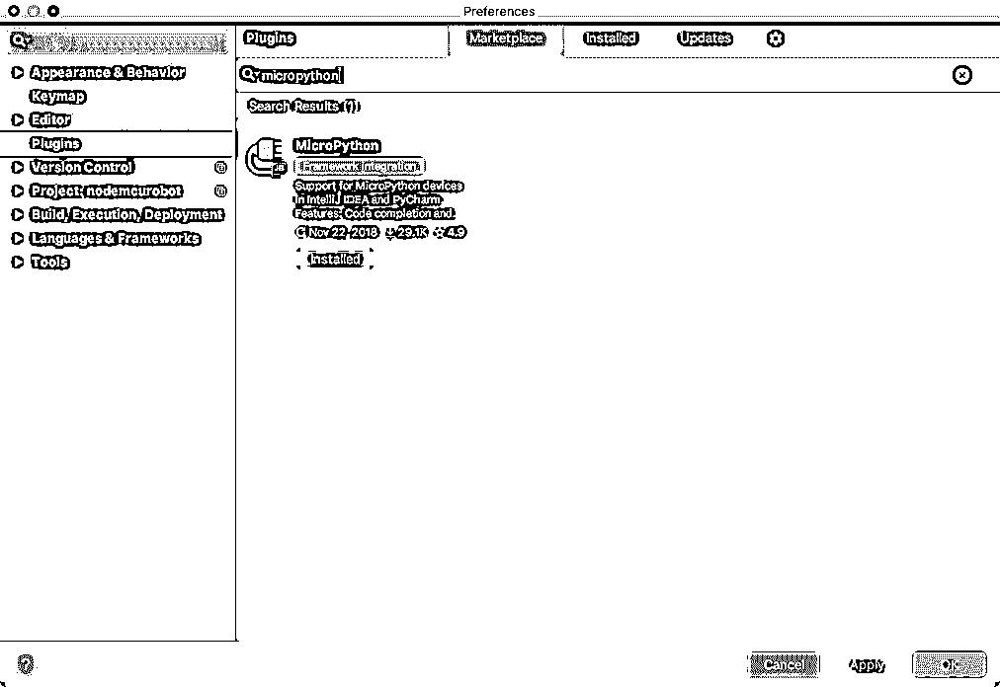
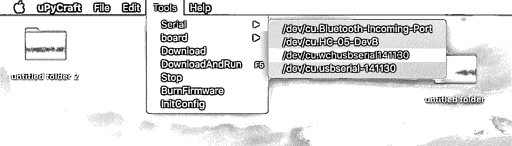
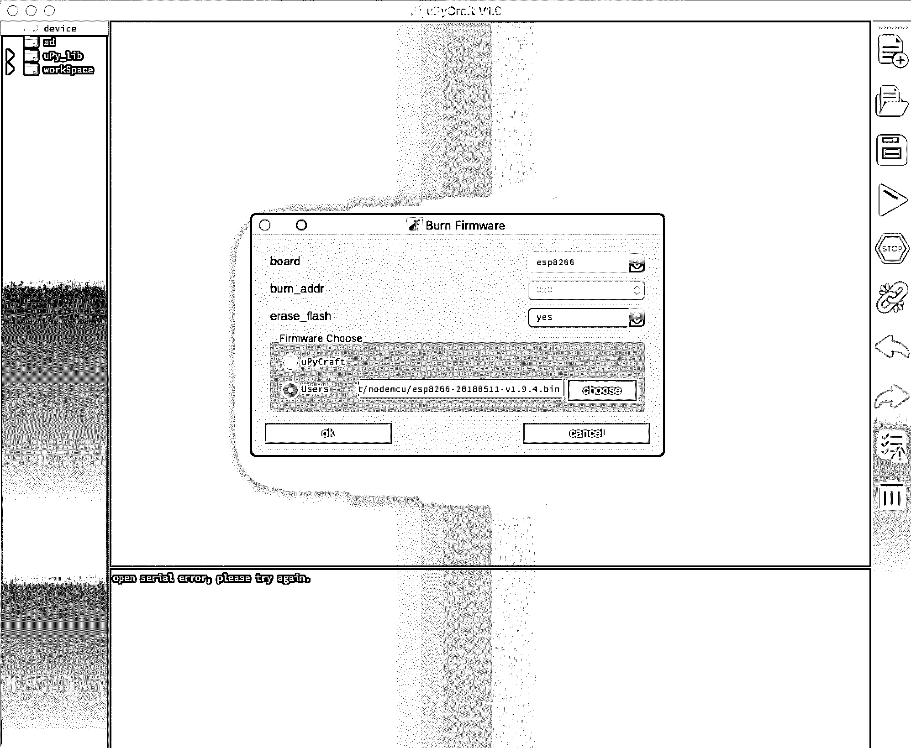
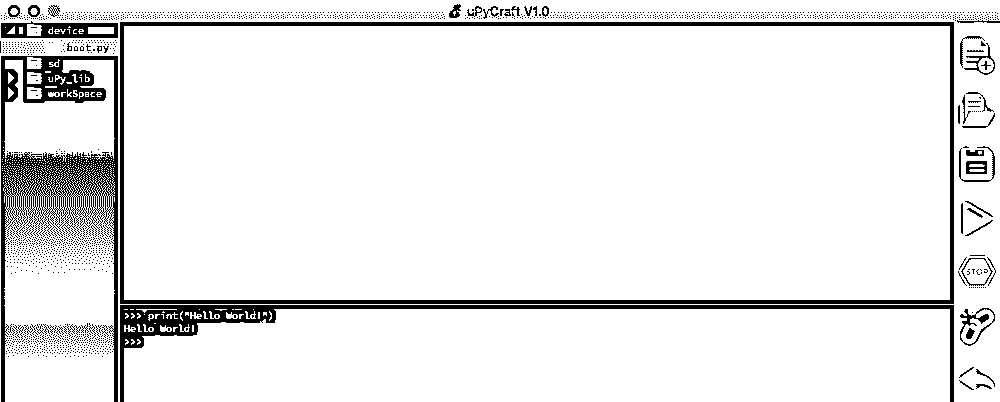
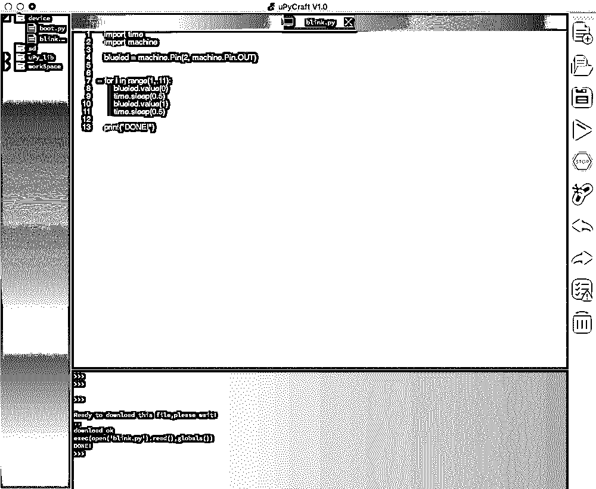
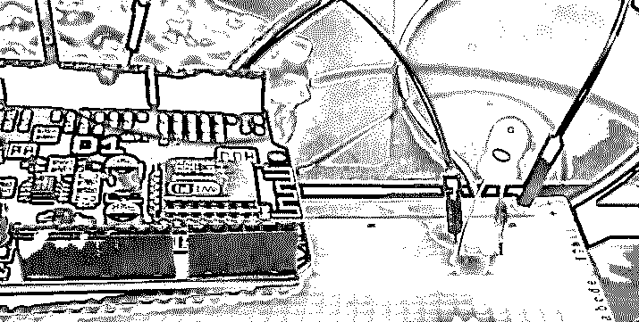
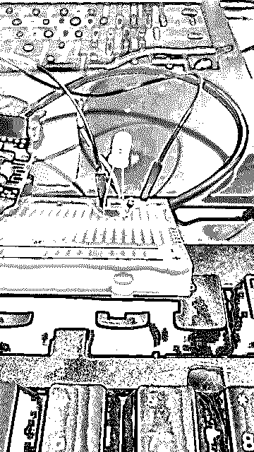

# MicroPython:Python 硬件编程入门

> 原文：<https://realpython.com/micropython/>

*立即观看**本教程有真实 Python 团队创建的相关视频课程。和文字教程一起看，加深理解:[**MicroPython 入门**](/courses/getting-started-micropython/)

你对物联网、家庭自动化和互联设备感兴趣吗？你有没有想过造一个爆能枪，一把激光剑，甚至是你自己的机器人会是什么样子？如果是这样，那么你很幸运！MicroPython 可以帮助你做所有这些事情，甚至更多。

在本教程中，您将了解到:

*   MicroPython 的历史
*   MicroPython 和其他编程语言的**差异**
*   您将用来构建设备的**硬件**
*   **处理**来设置、编码和部署您自己的 MicroPython 项目

**免费奖励:** [掌握 Python 的 5 个想法](https://realpython.com/bonus/python-mastery-course/)，这是一个面向 Python 开发者的免费课程，向您展示将 Python 技能提升到下一个水平所需的路线图和心态。

## Python 一切都来了

Python 近年来人气暴涨。如今，从开发操作系统到统计分析，甚至在桌面软件中，它都被广泛使用。但是很长一段时间以来，Python 在一个领域的使用明显缺失。使用微控制器的开发人员还没有采用这种语言。

2013 年，当达米恩·乔治在 Kickstarter 上发起了一项活动时，这一切都改变了。达米恩是剑桥大学的一名本科生，他是一名狂热的机器人程序员。他想把 Python 世界从以千兆字节为单位工作的机器转移到千字节。他的 Kickstarter 活动是为了支持他的开发，同时将他的概念证明转化为一个完整的实现。

许多开发人员抓住了这个机会，不仅在微控制器上使用 Python，还获得了 Damien 自己的参考硬件的早期版本，这是专门为该任务构建的！事实上，在竞选结束时，达米恩已经超过了他的 15000 英镑的目标。多亏了 1900 多名支持者，他的支持人数接近 10 万。

[*Remove ads*](/account/join/)

### 超越桌面的 python

最后，Python 已经脱离了台式机和服务器，进入了传感器、执行器、电机、LCD 显示器、按钮和电路的世界。虽然这带来了许多挑战，但也有大量的机会。台式机和服务器硬件需要千兆赫的处理器、千兆字节的内存和兆兆字节的存储。他们还需要成熟的操作系统、设备驱动程序和真正的多任务处理。

然而在微控制器的世界里， **MicroPython** 就是操作系统。本质上，它位于处理器之上，时钟速度可以追溯到 20 世纪 80 年代和 90 年代。MicroPython 对于处理代码执行、IO、存储、引导等所有错综复杂的问题毫无帮助。如果你想与硬件接口，那么你需要所有的代码来实现它。

然而不知何故，Damien 设法将一个强大、高性能、紧凑的 Python 实现压缩到这些微型计算机中。这开启了一个全新的潜力世界。如果你有兴趣了解更多关于 [CPython](https://realpython.com/cpython-source-code-guide/) 和 MicroPython 的区别，那么你可以在[官方 GitHub repo](https://github.com/micropython/micropython/wiki/Differences) 上查看完整的分析。

### 作为爱好和职业道路的电子产品

MicroPython 得到了各种 Pythonistas 社区的支持，他们非常希望看到这个项目成功。除了测试和支持代码库本身，开发人员还贡献了教程、代码库和硬件移植，使得这个项目远远超出了 Damien 一个人所能完成的。

多年来， **MicroPython** 吸引了来自其他平台的专业人士和爱好者，他们看到了这种语言的潜力和便利。这些开发者可能来自更成熟的平台，如 [Arduino](https://realpython.com/arduino-python/) 或 PIC。许多人开始意识到使用 MicroPython 以及同时指定 Python 和 MicroPython 的好处，尤其是对于快速原型开发和更快的上市时间。

那么，MicroPython 为严肃的任务关键型工作做好准备了吗？欧洲航天局 ESA 好像也这么认为！他们帮助资助 Damien 在 MicroPython 上的工作，因为他们想在太空中使用 Python。你会看到越来越多的业余爱好者和学习者进入学术界，并从那里进入电子专业世界。到那时，MicroPython 将真正起飞。

### Python 和 STEM

STEM 科目已经被置于教育显微镜下好几年了，这导致了针对课堂的项目和产品的爆炸式增长。Python 和 MicroPython 对教师和学生来说都很合适。基本语法和捆绑的解释器使这些语言成为有效的学习环境。不需要[开发环境](https://realpython.com/effective-python-environment/)的事实只是一个额外的好处！

几年前，BBC 启动了它的 **Micro:Bit** 项目，让更多的孩子接触办公室风格应用之外的计算。他们的目标是让微控制器板进入英国每个学生的手中。Damien 通过他的邻居获得了其中的一块电路板，并很快运行了他的代码。成千上万的教室突然有了在课堂上运行 Python 的选项！

最近， [Edublocks](https://edublocks.org/) 采用了 Micro:Bit，实现了类似 Scratch 的拖放 Python 体验。这让更多的孩子第一次体验了微控制器和机器人编程。捐赠支持了项目的持续发展。

## 物理计算

说到 MicroPython，**物理计算**是什么意思？通常，您的项目将包含三个要素:

1.  **输入:**按钮、信号、互联网事件或传感器读数接收数据。
2.  **处理:**微控制器处理输入并更新输出。
3.  **输出:**这可以以电机旋转、LED 点亮、计数器改变、消息发送或一些类似事件的形式发送。

这些元件通常由电线连接，并由某种电源供电。

### 什么是微控制器？

您可能知道微控制器很小，功能不如台式机或服务器机架上的计算机强大。您可能不知道的是，微控制器就在您身边，为您的设备增加了智能和控制。从家用电器和家庭安全系统到心脏起搏器，再到暖通空调系统等等，它们都被嵌入其中。

微控制器日复一日可靠地在一个紧凑的封装中做相对简单的事情。它们将 CPU、内存和 IO 压缩到一个通用芯片中，而不是需要一整板的芯片来协同执行任务。他们运行的代码被称为[固件](https://en.wikipedia.org/wiki/Firmware)，在执行前被闪存或烧录到可写内存中。

虽然那些伴随早期微型计算机(如 ZX81 和 Commodore Vic20)长大的人可能会发现这些芯片难以置信的强大，但从技术上讲，你的智能手表可以提供更多的功能。尽管如此，微控制器仍然非常有用，即使它们的处理能力和存储能力有限。这些小家伙可以做很多事情！

[*Remove ads*](/account/join/)

### 为什么选择 MicroPython？

如果这些微控制器在 MicroPython 出现之前就已经大量出现，那么与传统实践相比，MicroPython 给你带来了什么好处呢？

首先，这种语言比其他语言更容易被初学者理解，同时对于工业用例来说仍然足够强大。你可以从学习基础知识到做真正的工作，而且要快。

其次，Python 允许快速反馈。这是因为您可以交互地输入命令，并使用 [REPL](https://realpython.com/interacting-with-python/) 获得响应。你甚至可以调整你的代码并马上运行它，而不是重复通过**代码-编译-上传-执行**循环。

最后，大量的 Python 代码和经验意味着作为一名 Python 程序员，你可以更快更容易地做一些事情。例如，我发现 Python [请求](https://realpython.com/python-requests/)库、字符串处理和用于处理 [JSON](https://realpython.com/python-json/) 的工具在 MicroPython 世界中比 [C++](https://realpython.com/build-python-c-extension-module/) 更容易使用。

### C++呢？

C++快速、简洁，并且随处可用。有大量的 C++程序员，以及一个丰富的 Arduino 和 PIC 开发人员社区随时准备帮助你。因此，C++难道不是更好的选择吗？

在我看来，MicroPython 在**易用性和便利性**上胜过 C++。C++语法并不容易马上理解。更重要的是，代码需要编译，然后传输到你的板上，才能得到一个结果，所以你需要一个编译器在手边。

现在，很明显，工具正在变得更好，但是 MicroPython 仍然有优势。虽然 C++可能有速度优势，但对于大多数目的来说，MicroPython 已经足够快了。另外，如果你真的需要 C++，那么你甚至可以从 MicroPython 调用你的 C++代码！

### 汇编程序呢？

对于原始性能，没有比汇编程序更好的了。然而，这也不排除 MicroPython。

同样，MicroPython 往往足够快。如果您确实需要最低级别的能力，那么您可以将**内联汇编器**添加到您的 MicroPython 项目中。

### 基础的呢？

如果你在过去打开一台旧的微型计算机，那么它们几乎肯定会启动基本的 T1。至少，他们手头会有一套基本的方言。这种语言成为整整一代人的编程入门。这包括埃隆·马斯克，他显然是在 Vic 20 上学会了编码。

如今，BASIC 的光芒已经有些黯淡。Python 和其他基于块的语言已经在教育领域取代了它，而且它几乎没有在科技行业留下痕迹。Python 拥有 BASIC 的所有优点，没有任何限制。

### 树莓派怎么样？

运行 Python 的 Raspberry Pi 也大量出现在教育领域。由于其通用 IO 引脚，它在电子和物理计算领域找到了一席之地。[树莓派](https://realpython.com/python-raspberry-pi/)也是一款成熟的通用 Linux 台式电脑。它拥有强大的处理器能力、内存和存储容量，甚至还有一个 GPU。

然而，最后一个方面实际上可以成为不选择 Pi 而使用微控制器板的理由！运行桌面应用程序和多媒体的能力非常棒，尤其是当您的项目可能需要这种原始能力时。例如，[人工智能](https://realpython.com/python-ai-neural-network/)、视频流和[数据库](https://realpython.com/tutorials/databases/)项目可能就是这种情况。

但是当您的用例需要**实时处理**时，这可能会导致问题。如果您需要非常精确的计时，那么您不希望您的代码在赶上几十个都想同时执行的不同进程时等待。

如果您想要模拟输入，那么 Pi 将需要额外的硬件。相比之下，大多数能够运行 MicroPython 的微控制器至少有一个模拟输入，甚至可能更多。此外，Pi 不太稳定，而且可能更贵。正因为如此，在你的项目中留下一个微控制器可能比一个完整的 Pi 更有经济意义。

不必非选其一。也许将 Raspberry Pi 与微控制器配对是您项目的最佳解决方案。例如，您可以使用 Pi 提供处理能力，使用微控制器与硬件接口。

[*Remove ads*](/account/join/)

## MicroPython 硬件

如果您有兴趣尝试一下 MicroPython，那太好了！你需要一些兼容的硬件来安装 MicroPython。幸运的是，有许多选择，从负担得起的到优质产品。每个钱包和用例都有适合的东西，所以请花些时间选择适合您的解决方案。

### 专为 Python 打造

启动 MicroPython 的 Kickstarter 也推出了其相关硬件。MicroPython Pyboard 现在升级到了 1.1 版。

**Pyboard** 是规格最齐全的电路板之一。它基于 STM32，具有大量 GPIO。还有一个 SD 插槽，一个加速度计和 RTC，容量为 168 MHzf。如果你能在库存中找到它，那么它将花费你大约 40 美元。

### ESP8266 或 ESP32

价格范围的另一端是基于 **ESP8266** 的主板。这些板只有一个模拟输入，并且没有 Pyboard 那么多引脚。然而，他们有 WiFi 功能。你可以在 10 美元或更少的支持试验板的板(如 NodeMCU)中找到它们。

ESP32 是 ESP8266 的老大哥。它增加了功率和功能，同时将蓝牙添加到功能集中，只需少量的额外成本。这些板的最好版本之一是 M5 堆栈。这个装置配有一个 peizo 扬声器、一个电池、一个读卡器和一个彩色屏幕。

### BBC 微:位

**Micro:Bit** 是一款基于 Nordic nRF51822 微控制器的紧凑型电路板。它内置蓝牙 LE 和温度感应，外加一个加速度计、几个动作按钮和一个 5x5 LED 网格。

如果你在英国，那么你可能已经有一块这样的板了。它们被分发给小学生，希望能激励新一代的编码员。许多受 Micro:Bit 启发的主板开始出现，所以它一定会越来越受欢迎！

### Adafruit 和 CircuitPython 驱动的电路板

在 MicroPython 开始加快步伐后不久，Adafruit 就推出了一个他们称之为 **CircuitPython** 的分支。然而，两者之间有一些主要的区别。

一个是 CircuitPython 提供了对 Adafruit 系列硬件的支持。另一个区别是，大多数 Adafruit 实现的特点是板看起来像一个 USB 连接的驱动器。在这些情况下，添加代码就像把它拖到磁盘上一样简单。

Adafruit premium 系列中功能最丰富的主板是 **CircuitPlayground Express** ，带有可选的 Crickit 附加组件。当您将这两块板结合在一起时，您将拥有引脚、传感器、电机驱动器、RGB LEDs 等等。如果您正在寻找一个一体化的解决方案，那么这是一个检查。

不幸的是，Adafruit 已经放弃了与 ESP8266 的兼容性，即使是他们自己的基于 ESP8266 的羽毛板。相反，他们选择在未来的版本中将 ESP32 纯粹作为 WiFi 协处理器。

## MicroPython 工作流

如果您熟悉 Arduino 或 PIC 编程，那么您可能希望首先讨论编译器、开发环境和工具链。然而，MicroPython 乍一看有点不同。

### REPL

与 Python 一样，MicroPython 的语言可能是硬件自带的，您可以选择交互式地使用它。有两种方法可以获得交互式会话:

1.  使用串行终端连接:这通常是通过命令行来完成的，或者可能是一个 [IDE](https://realpython.com/python-ides-code-editors-guide/) 。
2.  **使用 WebREPL:** 这是带 WiFi 的主板的一个选项。

例如，要在 Mac 上获得串行 REPL，您可以运行附带的终端程序**屏幕**并指定您的设备和波特率:

```py
$ screen /dev/tty.wchusbserial1430 115200
```

您可以通过列出连接的串行连接来找到您的设备:

```py
$ ls /dev/tty.*
```

这个过程类似于您在 Linux 终端中所做的。

在 Windows 上，PuTTY 是一款流行的终端应用。还有一个叫 Tera Term。无论哪种方式，只需连接到连接设备时出现的 COM 端口，并选择 115，200 作为波特率。

一旦建立了 REPL 连接，就可以像在 Python 交互式会话中一样输入命令。在 MicroPython 中，这个接口也是您可能想做简单的 OS 风格工作的地方，比如删除文件或创建文件夹。

[*Remove ads*](/account/join/)

### 命令行工具

Dave Hyland 的 [RShell](https://github.com/dhylands/rshell) 是一个功能完善的工具集，用于处理您的 MicroPython 项目。

还有另一个与 MicroPython 板交互的很棒的命令行工具叫做 [Ampy](https://github.com/pycampers/ampy) 。这最初是由 Adafruit 开发的，但现在由一名社区成员接手，因为 Adafruit 只专注于他们自己的硬件。

### MicroPython IDEs

有一个 [PyCharm](https://realpython.com/pycharm-guide/) 插件可以为你的 IDE 添加 MicroPython 支持。它就在插件市场上:

[](https://files.realpython.com/media/cgarrett-pycharm.9b973afe4a0b_50.fad69bc81cf0.png)

对于 Micro:Bit 和 CircuitPython 板，目前最好的编辑器是 Nicholas Tollervey 的 Mu 编辑器。否则，继续关注 [uPyCraft](https://github.com/DFRobot/uPyCraft) ，它看起来很有前途，而且已经相当有用了。

一旦连接了正确的串行端口并选择了设备类型，您就可以浏览设备了:

[](https://files.realpython.com/media/cgarrett-serial.f89da8d4ced9.png)

您的设备类型可以是 ESP8266、ESP32 或 Micro:Bit。现在你可以在 REPL 互动了！

## 在您的主板上设置 MicroPython

选择 uPyCraft 有一个好处，那就是可以轻松地将 MicroPython 固件刻录到您的主板上，而无需使用命令行工具。您可以选择 uPyCraft 默认固件或您已下载的固件:

[](https://files.realpython.com/media/cgarrett-burn.21466ad58f24.png)

BBC Micro:Bit 显示为磁盘驱动器。当你使用 Mu 或基于网络的编辑器时，它们会产生你可以直接放到那个磁盘上的文件。如果你使用的是带有 uPyCraft 的 ESP8266 或 ESP32 板，那么你也可以安装带有 [pip](https://realpython.com/what-is-pip/) 的 Python [ESPTool](https://pypi.org/project/esptool/) 并使用它设置你的板的固件。

其他主板可能会安装 MicroPython 或 CircuitPython，甚至使用拖放式安装程序。然而，这些类型的板可能会损坏或进入无限循环。请务必花时间查看您的主板文档，了解如何更换固件。

## 创建和部署您的代码

为了执行您的代码，在大多数情况下，您将创建`.py`文本文件，并在您的 MicroPython 设备上执行它们。这个过程类似于您对 CPython 所做的。您可以通过以下两种方式之一将文件传输到您的板上:

1.  使用你的 IDE。这可以是 Mu，uPyCraft，或者类似的东西。
2.  使用命令行工具。这可以是 RShell，Ampy，或者类似的。

当运行 MicroPython 的设备启动时，它们会寻找一个名为`boot.py`的文件。如果找到该文件，设备将自动执行它。您也可以在 REPL 提示符下执行`.py`文件:

```py
exec(open('my-program.py').read())
```

事实上，这与运行编辑好的 Python 时 uPyCraft 所做的事情类似。它将文件传输到您的主板，然后通过 REPL 执行它。

[*Remove ads*](/account/join/)

### 编写您的 MicroPython 代码

你将以一句传统的“你好，世界！”项目。通过连接到正确的串行端口，并输入以下内容，您可以在 REPL 中完成此操作:

```py
 print("Hello World!")
```

您应该会看到以下输出:

[](https://files.realpython.com/media/cgarrett-hello-world.72df27958646.png)

您已经确认您的设置正在工作。

### 创建数字输出

现在，让我们改变输出类型。使用以下代码，您可以使板载 LED 闪烁:

```py
import time
import machine
blueled = machine.Pin(2, machine.Pin.OUT)

# Blink 10 times
for i in range(1,11):
    blueled.value(0)
    time.sleep(0.5)
    blueled.value(1)
    time.sleep(0.5)

print("DONE!")
```

你导入`time`，它让你插入[时间延迟](https://realpython.com/python-sleep/)。您还可以导入`machine`，这是一个可以让您轻松访问主板上的 IO 引脚的模块。您使用这个模块来设置一个名为`blueled`的对象，您将它定义为`Pin 2`。(在其他板上，可能是`Pin 16`)。然后，将其设置为输出引脚。您应该会看到以下输出:

[](https://files.realpython.com/media/cgarrett-blink.9d73b7f0baf6.png)

您可能会注意到，在 ESP8266 上，LED 在关闭时会亮起，当给定一个正值时会熄灭。奇怪，但却是真的！

**注意:**大多数主板都有一个或多个内置 led。如需更多资讯，请查阅您特定主机板的文件。

如果您没有内置 LED，或者您想要点亮主板上没有的 LED，该怎么办？你需要一个大小合适的电阻，比如 220 欧姆的电阻。你需要将它连接到地和 LED 的短腿。LED 的正极长腿将连接到 GPIO 引脚 2。在 Wemos D1 Uno 板上，GPIO 2 在板的正面被称为数字引脚 9。下面有 GPIO 号。

如果是外接 LED，当值为 **1** 或上的**时，它将亮起:**

[](https://files.realpython.com/media/cgarrett-breadboard.64bea4571a27_1_25.ea853721bf5a.jpg)

你可以看到大头针已经亮了。

### 褪色的发光二极管

在前面的例子中，您使用了一个 [`for`回路](https://realpython.com/courses/python-for-loop/)，但是您的硬件实际上可以使 LED 本身闪烁。为此，将引脚输出设置为`PWM`，代表**脉宽调制(PWM)** 。

这允许你创建一个信号**开**和**关**脉冲。当你在一秒钟内快速打开和关闭 LED 灯很多次时，由于我们眼睛的工作方式，LED 灯似乎被设定到了一定的亮度。下面是您的代码的样子:

```py
from machine import Pin
from machine import PWM
import time

# Set our pin 2 to PWM
pwm = PWM(Pin(2))

# Brightness between 0 and 1023
pwm.duty(700)

# Frequency in Hertz
pwm.freq(1)
```

在这个新代码中，您以赫兹为单位设置亮度和闪烁频率，然后让硬件接管。

您也可以使用 PWM 来淡入和淡出 LED:

```py
from machine import Pin
from machine import PWM
import time

# Set our pin 2 to PWM
pwm = PWM(Pin(2))

# Frequency = 100hz
pwm.freq(100)

while 1:
  # Brightness between 0 and 1023
  for brightness in range (0, 1023, 100):
    pwm.duty(brightness)
    print(brightness)
    time.sleep(0.1)

  # Brightness between 1023 and 0
  for brightness in range (1023, 0, -100):
    pwm.duty(brightness)
    print(brightness)
    time.sleep(0.1)
```

这段代码产生了一种令人愉悦的柔和效果:

[](https://files.realpython.com/media/cgarrett-fade.a0c680ab7ea4.gif)

如果您使用板载 LED，则灯可能会先熄灭，然后再亮起。

[*Remove ads*](/account/join/)

## 结论

对你来说，编程机器人、微控制器、电子设备和其他硬件从来没有这么容易。传统上，要对这些设备进行编程，您必须使用汇编或 C++等低级语言，并牺牲许多功能。随着 MicroPython 的引入，这一切都改变了，这是 Python 3 的一个版本，被塞进了更小的物理计算设备的小容量中！

在本教程中，您将深入 MicroPython 和电子硬件的世界。您已经了解了 MicroPython 的历史以及它与其他平台的比较。您还完成了 MicroPython 工作流，将代码部署到您自己的板上，并带来了真实世界的效果。

MicroPython 正在继续增长。社区中的开发人员总是在添加新的代码、工具、项目和教程。作为一名 MicroPython 开发人员，这是最激动人心的时刻！

*立即观看**本教程有真实 Python 团队创建的相关视频课程。和文字教程一起看，加深理解:[**MicroPython 入门**](/courses/getting-started-micropython/)********