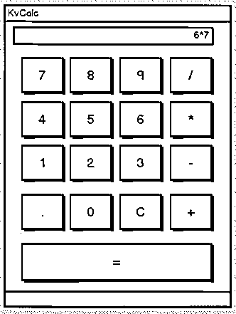

# 使用 Kivy Python 框架构建移动应用程序

> 原文：<https://realpython.com/mobile-app-kivy-python/>

如今，开发人员极有可能从事移动或 web 应用程序的开发。Python 没有内置的移动开发功能，但有一些包可以用来创建移动应用程序，比如 Kivy、 [PyQt](https://riverbankcomputing.com/software/pyqt/intro) ，甚至是 Beeware 的[托加](https://toga.readthedocs.io/en/latest/)库。

这些库都是 Python 移动领域的主要参与者。然而，如果你选择用 Kivy 创建移动应用程序，你会看到一些好处。不仅您的应用程序在所有平台上看起来都一样，而且您也不需要在每次更改后都编译代码。此外，您将能够使用 Python 清晰的语法来构建您的应用程序。

**在本教程中，您将学习如何:**

*   使用 Kivy 小部件
*   布局用户界面
*   添加事件
*   使用 KV 语言
*   创建计算器应用程序
*   为 iOS、Android、Windows 和 macOS 打包您的应用

本教程假设您熟悉面向对象编程。如果你不是，那么看看 Python 3 中的[面向对象编程(OOP)。](https://realpython.com/python3-object-oriented-programming/)

我们开始吧！

**免费下载:** [从 Python 技巧中获取一个示例章节:这本书](https://realpython.com/bonus/python-tricks-sample-pdf/)用简单的例子向您展示了 Python 的最佳实践，您可以立即应用它来编写更漂亮的+Python 代码。

## 了解 Kivy 框架

Kivy 于 2011 年初首次发布。这个跨平台的 Python 框架可以部署到 Windows、Mac、Linux 和 Raspberry Pi 上。除了常规的键盘和鼠标输入，它还支持[多点触摸](https://en.wikipedia.org/wiki/Multi-touch)事件。Kivy 甚至支持图形的 GPU 加速，因为它们是使用 OpenGL ES2 构建的。该项目使用 MIT 许可证，所以你可以免费使用这个库和商业软件。

当你用 Kivy 创建一个应用程序时，你正在创建一个[自然用户界面](https://en.wikipedia.org/wiki/Natural_user_interface)或 **NUI** 。自然用户界面背后的想法是，用户可以很容易地学会如何使用你的软件，几乎不需要任何指导。

Kivy 并不试图使用本地控件或小部件。它所有的部件都是定制的。这意味着 Kivy 应用程序在所有平台上都是一样的。然而，这也意味着你的应用程序的外观和感觉将不同于你的用户的原生应用程序。这可能是优点也可能是缺点，取决于你的听众。

[*Remove ads*](/account/join/)

## 安装 Kivy

Kivy 有许多依赖项，所以建议您将它安装到 Python 虚拟环境中。可以使用 Python 内置的 [`venv`](https://docs.python.org/3/library/venv.html) 库，也可以使用 [`virtualenv`](https://virtualenv.pypa.io/en/latest/) 包。如果你以前从未使用过 Python 虚拟环境，那么看看 [Python 虚拟环境:入门](https://realpython.com/python-virtual-environments-a-primer/)。

以下是创建 Python 虚拟环境的方法:

```py
$ python3 -m venv my_kivy_project
```

这会将您的 Python 3 可执行文件复制到一个名为`my_kivy_project`的文件夹中，并在该目录中添加一些其他的子文件夹。

要使用您的虚拟环境，您需要激活它。在 Mac 和 Linux 上，您可以在`my_kivy_project`文件夹中执行以下命令:

```py
$ source bin/activate
```

Windows 的命令类似，但是激活脚本的位置在`Scripts`文件夹中，而不是在`bin`文件夹中。

现在您已经有了一个激活的 Python 虚拟环境，您可以运行 [`pip`](https://realpython.com/what-is-pip/) 来安装 Kivy。在 Linux 和 Mac 上，您将运行以下命令:

```py
$ python -m pip install kivy
```

在 Windows 上，安装稍微复杂一些。查看官方文档了解如何在 Windows 上安装 [Kivy。(Mac 用户也可以下载一个`dmg`文件，这样安装 Kivy。)](https://kivy.org/doc/stable/installation/installation-windows.html#install-win-dist)

如果你在你的平台上安装 Kivy 时遇到任何问题，那么请看 Kivy 下载页面，获取更多的[说明](https://kivy.org/#download)。

## 使用 Kivy Widgets

一个**小部件**是一个用户将与之交互的屏幕控件。所有图形用户界面工具包都带有一组小部件。您可能使用过的一些常见小部件包括按钮、组合框和选项卡。Kivy 的框架中内置了许多小部件。

### 跑着一句“你好，Kivy！”程序

要了解 Kivy 是如何工作的，请看下面的“你好，世界！”应用:

```py
from kivy.app import App
from kivy.uix.label import Label

class MainApp(App):
    def build(self):
        label = Label(text='Hello from Kivy',
                      size_hint=(.5, .5),
                      pos_hint={'center_x': .5, 'center_y': .5})

        return label

if __name__ == '__main__':
    app = MainApp()
    app.run()
```

每个 Kivy 应用程序都需要子类化`App`并覆盖`build()`。这是您放置 UI 代码或调用定义 UI 代码的其他函数的地方。在本例中，您创建了一个`Label`小部件，并传入了它的`text`、`size_hint`和`pos_hint`。最后两个参数不是必需的。

`size_hint`告诉 Kivy 创建小工具时要使用的比例。它需要两个数字:

1.  第一个数字是`x`大小提示，指的是控件的**宽度**。
2.  第二个数字是`y`大小提示，指的是控件的**高度**。

这两个数字都可以是 0 到 1 之间的任意值。两个提示的默认值都是 1。您也可以使用`pos_hint`来定位小部件。在上面的代码块中，您告诉 Kivy 将小部件在 x 和 y 轴上居中。

为了让应用程序运行，您实例化您的`MainApp`类，然后调用`run()`。执行此操作时，您应该会在屏幕上看到以下内容:

[](https://files.realpython.com/media/01_mdriscoll_hello_kivy.879d11e41080.png)

Kivy 也向`stdout`输出大量文本:

```py
[INFO   ] [Logger      ] Record log in /home/mdriscoll/.kivy/logs/kivy_19-06-07_2.txt
[INFO   ] [Kivy        ] v1.11.0
[INFO   ] [Kivy        ] Installed at "/home/mdriscoll/code/test/lib/python3.6/site-packages/kivy/__init__.py"
[INFO   ] [Python      ] v3.6.7 (default, Oct 22 2018, 11:32:17)
[GCC 8.2.0]
[INFO   ] [Python      ] Interpreter at "/home/mdriscoll/code/test/bin/python"
[INFO   ] [Factory     ] 184 symbols loaded
[INFO   ] [Image       ] Providers: img_tex, img_dds, img_sdl2, img_gif (img_pil, img_ffpyplayer ignored)
[INFO   ] [Text        ] Provider: sdl2(['text_pango'] ignored)
[INFO   ] [Window      ] Provider: sdl2(['window_egl_rpi'] ignored)
[INFO   ] [GL          ] Using the "OpenGL" graphics system
[INFO   ] [GL          ] Backend used <sdl2>
[INFO   ] [GL          ] OpenGL version <b'4.6.0 NVIDIA 390.116'>
[INFO   ] [GL          ] OpenGL vendor <b'NVIDIA Corporation'>
[INFO   ] [GL          ] OpenGL renderer <b'NVS 310/PCIe/SSE2'>
[INFO   ] [GL          ] OpenGL parsed version: 4, 6
[INFO   ] [GL          ] Shading version <b'4.60 NVIDIA'>
[INFO   ] [GL          ] Texture max size <16384>
[INFO   ] [GL          ] Texture max units <32>
[INFO   ] [Window      ] auto add sdl2 input provider
[INFO   ] [Window      ] virtual keyboard not allowed, single mode, not docked
[INFO   ] [Base        ] Start application main loop
[INFO   ] [GL          ] NPOT texture support is available
```

这对调试应用程序很有用。

接下来，您将尝试添加一个`Image`小部件，看看它与`Label`有何不同。

[*Remove ads*](/account/join/)

### 显示图像

Kivy 有几个不同的与图像相关的小部件可供选择。您可以使用`Image`从硬盘加载本地图像，或者使用`AsyncImage`从 URL 加载图像。对于这个例子，您将坚持使用标准的`Image`类:

```py
from kivy.app import App
from kivy.uix.image import Image

class MainApp(App):
    def build(self):
        img = Image(source='/path/to/real_python.png',
                    size_hint=(1, .5),
                    pos_hint={'center_x':.5, 'center_y':.5})

        return img

if __name__ == '__main__':
    app = MainApp()
    app.run()
```

在这段代码中，您从`kivy.uix.image`子包中导入`Image`。`Image`类有很多不同的参数，但是您想要使用的是`source`。这告诉 Kivy 加载哪个图像。在这里，您向图像传递一个完全限定的路径。代码的其余部分与您在前面的示例中看到的一样。

当您运行这段代码时，您会看到如下内容:

[](https://files.realpython.com/media/02_mdriscoll_hello_image.607fbd03a04d.png)

前一个示例中的文本已被替换为图像。

现在，您将学习如何在应用程序中添加和排列多个小部件。

## 布局用户界面

您使用的每个 GUI 框架都有自己的排列小部件的方法。例如，在 [wxPython](https://realpython.com/python-gui-with-wxpython/) 中，你将使用 sizers，而在 [Tkinter](https://realpython.com/python-gui-tkinter/) 中，你将使用布局或几何管理器。对于 Kivy，你将使用**布局**。有几种不同类型的布局可供您使用。以下是一些最常见的:

*   `BoxLayout`
*   `FloatLayout`
*   `GridLayout`

你可以在 Kivy 的[文档](https://kivy.org/doc/stable/api-kivy.uix.layout.html)中搜索可用布局的完整列表。您也可以在`kivy.uix`中查找实际的源代码。

用这段代码试试`BoxLayout`:

```py
import kivy
import random

from kivy.app import App
from kivy.uix.button import Button
from kivy.uix.boxlayout import BoxLayout

red = [1,0,0,1]
green = [0,1,0,1]
blue =  [0,0,1,1]
purple = [1,0,1,1]

class HBoxLayoutExample(App):
    def build(self):
        layout = BoxLayout(padding=10)
        colors = [red, green, blue, purple]

        for i in range(5):
            btn = Button(text="Button #%s" % (i+1),
                         background_color=random.choice(colors)
                         )

            layout.add_widget(btn)
        return layout

if __name__ == "__main__":
    app = HBoxLayoutExample()
    app.run()
```

在这里，您从`kivy.uix.boxlayout`导入`BoxLayout`并实例化它。然后你创建一个颜色列表，这些颜色本身就是红-蓝-绿(RGB) 颜色的列表。最后，循环 5 的 [`range`](https://realpython.com/python-range/) ，为每次迭代创建一个按钮`btn`。为了让事情变得有趣一点，你设置按钮的`background_color`为随机颜色。然后用`layout.add_widget(btn)`将按钮添加到布局中。

当您运行这段代码时，您会看到类似这样的内容:

[](https://files.realpython.com/media/kivy_hboxlayout.a8ac0394109e.png)

有 5 个随机颜色的按钮，每一个代表你的 [`for`](https://realpython.com/courses/python-for-loop/) 循环的一次迭代。

创建布局时，您应该知道一些参数:

*   **`padding` :** 你可以用三种方式之一指定布局和其子布局之间的`padding`(以像素为单位):
    1.  **一个四参数列表:**`padding_left``padding_top``padding_right``padding_bottom`
    2.  **双参数列表:** [ `padding_horizontal`，`padding_vertical` ]
    3.  **一元论:** `padding=10`
*   **`spacing` :** 你可以用这个参数在子部件之间添加空间。
*   **`orientation` :** 您可以将`BoxLayout`的默认`orientation`由水平改为垂直。

[*Remove ads*](/account/join/)

## 添加事件

像大多数 GUI 工具包一样，Kivy 主要是基于事件的。该框架响应用户按键、鼠标事件和触摸事件。Kivy 有一个**时钟**的概念，你可以用它来安排未来某个时间的函数调用。

Kivy 还有 [`Properties`](https://kivy.org/doc/stable/api-kivy.properties.html) 的概念，与 [`EventDispatcher`](https://kivy.org/doc/stable/api-kivy.event.html#kivy.event.EventDispatcher) 配合使用。属性帮助您进行验证检查。它们还允许您在小部件改变大小或位置时触发事件。

让我们将一个**按钮事件**添加到前面的按钮代码中:

```py
from kivy.app import App
from kivy.uix.button import Button

class MainApp(App):
    def build(self):
        button = Button(text='Hello from Kivy',
                        size_hint=(.5, .5),
                        pos_hint={'center_x': .5, 'center_y': .5})
        button.bind(on_press=self.on_press_button)
         return button

    def on_press_button(self, instance):
 print('You pressed the button!')   if __name__ == '__main__':
    app = MainApp()
    app.run()
```

在这段代码中，您调用`button.bind()`并将`on_press`事件链接到`MainApp.on_press_button()`。这个方法隐式地接受小部件`instance`，它是`button`对象本身。最后，每当用户按下按钮时，一条消息将打印到`stdout`。

## 使用 KV 语言

Kivy 还提供了一种叫做 **KV** 的设计语言，你可以在你的 Kivy 应用程序中使用它。KV 语言让您将界面设计从应用程序的逻辑中分离出来。这遵循了[关注点分离](http://en.wikipedia.org/wiki/Separation_of_concerns)原则，并且是[模型-视图-控制器](https://realpython.com/the-model-view-controller-mvc-paradigm-summarized-with-legos/)架构模式的一部分。您可以更新前面的示例以使用 KV 语言:

```py
from kivy.app import App
from kivy.uix.button import Button

class ButtonApp(App):
    def build(self):
        return Button()

    def on_press_button(self):
        print('You pressed the button!')

if __name__ == '__main__':
    app = ButtonApp()
    app.run()
```

乍一看，这段代码可能看起来有点奇怪，因为它创建了一个`Button`，但没有设置它的任何属性，也没有将它绑定到任何事件。这里发生的事情是，Kivy 将自动查找与小写的类同名的文件，没有类名的`App`部分。

在这种情况下，类名是`ButtonApp`，所以 Kivy 会寻找一个名为`button.kv`的文件。如果该文件存在并且格式正确，那么 Kivy 将使用它来加载 UI。继续创建该文件，并添加以下代码:

```py
 1<Button>:
 2    text: 'Press me'
 3    size_hint: (.5, .5)
 4    pos_hint: {'center_x': .5, 'center_y': .5}
 5    on_press: app.on_press_button()
```

下面是每一行的作用:

*   **行 1** 匹配 Python 代码中的`Button`调用。它告诉 Kivy 在实例化的对象中查找按钮定义。
*   **第 2 行**设置按钮的`text`。
*   **第三行**用`size_hint`设定宽度和高度。
*   **第 4 行**用`pos_hint`设定按钮的位置。
*   **第 5 行**设置`on_press`事件处理程序。要告诉 Kivy 事件处理程序在哪里，可以使用`app.on_press_button()`。这里，Kivy knows 将在`Application`类中查找一个名为`.on_press_button()`的方法。

您可以在一个或多个 KV 语言文件中设置所有的小部件和布局。KV 语言还支持在 KV 中导入 Python 模块、创建动态类等等。要了解全部细节，请查看 Kivy 的 KV 语言指南。

现在您已经准备好创建一个真正的应用程序了！

## 创建一个 Kivy 应用程序

学习新技能的最好方法之一是创造有用的东西。记住这一点，您将使用 Kivy 构建一个支持以下操作的计算器:

*   添加
*   减法
*   增加
*   分开

对于这个应用程序，您需要某种布局的一系列按钮。你还需要在你的应用程序顶部有一个盒子来显示方程式和它们的结果。这是你的计算器的草图:

[](https://files.realpython.com/media/kvcalc_mock.637f132ddd19.png)

现在您已经有了 UI 的目标，您可以继续编写代码了:

```py
 1from kivy.app import App
 2from kivy.uix.boxlayout import BoxLayout
 3from kivy.uix.button import Button
 4from kivy.uix.textinput import TextInput
 5
 6class MainApp(App):
 7    def build(self):
 8        self.operators = ["/", "*", "+", "-"]
 9        self.last_was_operator = None
10        self.last_button = None
11        main_layout = BoxLayout(orientation="vertical")
12        self.solution = TextInput(
13            multiline=False, readonly=True, halign="right", font_size=55
14        )
15        main_layout.add_widget(self.solution)
16        buttons = [
17            ["7", "8", "9", "/"],
18            ["4", "5", "6", "*"],
19            ["1", "2", "3", "-"],
20            [".", "0", "C", "+"],
21        ]
22        for row in buttons:
23            h_layout = BoxLayout()
24            for label in row:
25                button = Button(
26                    text=label,
27                    pos_hint={"center_x": 0.5, "center_y": 0.5},
28                )
29                button.bind(on_press=self.on_button_press)
30                h_layout.add_widget(button)
31            main_layout.add_widget(h_layout)
32
33        equals_button = Button(
34            text="=", pos_hint={"center_x": 0.5, "center_y": 0.5}
35        )
36        equals_button.bind(on_press=self.on_solution)
37        main_layout.add_widget(equals_button)
38
39        return main_layout
```

下面是您的计算器代码的工作方式:

*   **在第 8 到 10 行**中，您创建了一个`operators`列表和几个方便的值，`last_was_operator`和`last_button`，稍后您将会用到它们。
*   **在第 11 行到第 15 行**中，您创建了一个顶层布局`main_layout`并向其中添加了一个只读的`TextInput`小部件。
*   **在第 16 到 21 行**中，你创建了一个嵌套列表，包含了计算器的大部分`buttons`。
*   **在第 22 行**，你在那些`buttons`上开始一个`for`循环。对于每个嵌套列表，您将执行以下操作:
    *   **在第 23 行**中，你创建了一个水平方向的`BoxLayout`。
    *   **在第 24 行**，你在嵌套列表中的条目上开始另一个`for`循环。
    *   **在第 25 到 39 行**中，您为该行创建按钮，将它们绑定到事件处理程序，并将这些按钮添加到第 23 行的水平`BoxLayout`中。
    *   **在第 31 行**，你把这个布局添加到`main_layout`。
*   **在第 33 到 37 行**中，您创建了等号按钮(`=`)，将其绑定到一个事件处理程序，并将其添加到`main_layout`。

下一步是创建`.on_button_press()`事件处理程序。下面是这段代码的样子:

```py
41def on_button_press(self, instance):
42    current = self.solution.text
43    button_text = instance.text
44
45    if button_text == "C":
46        # Clear the solution widget
47        self.solution.text = ""
48    else:
49        if current and (
50            self.last_was_operator and button_text in self.operators):
51            # Don't add two operators right after each other
52            return
53        elif current == "" and button_text in self.operators:
54            # First character cannot be an operator
55            return
56        else:
57            new_text = current + button_text
58            self.solution.text = new_text
59    self.last_button = button_text
60    self.last_was_operator = self.last_button in self.operators
```

您的应用程序中的大多数小部件都会调用`.on_button_press()`。它是这样工作的:

*   **第 41 行**使用`instance`参数，这样你就可以访问哪个小部件调用了这个函数。

*   **第 42 和 43 行**提取并存储`solution`和`text`按钮的值。

*   **第 45 到 47 行**查看哪个按钮被按下了。如果用户按了`C`，那么你会清除`solution`。否则，转到`else`语句。

*   **第 49 行**检查解决方案是否有任何预先存在的值。

*   **第 50 到 52 行**检查最后按下的按钮是否是操作按钮。如果是，那么`solution`不会被更新。这是为了防止用户连续遇到两个操作符。例如，`1 */`不是一个有效的语句。

*   **第 53 到 55 行**检查第一个字符是否是一个操作符。如果是，那么`solution`不会被更新，因为第一个值不能是操作符值。

*   **第 56 到 58 行**下降到`else`子句。如果前面的条件都不满足，那么更新`solution`。

*   **第 59 行**将`last_button`设置为最后按下的按钮的标签。

*   **第 60 行**根据是否是操作符将`last_was_operator`设置为`True`或`False`。

要写的最后一位代码是`.on_solution()`:

```py
62def on_solution(self, instance):
63    text = self.solution.text
64    if text:
65        solution = str(eval(self.solution.text))
66        self.solution.text = solution
```

再次从`solution`中获取当前文本，并使用 [Python 内置的`eval()`](https://realpython.com/python-eval-function/) 来执行它。如果用户创建了一个类似于`1+2`的公式，那么`eval()`将运行你的代码并返回结果。最后，将结果设置为`solution`小部件的新值。

**注意:** `eval()`有点[危险](https://nedbatchelder.com/blog/201206/eval_really_is_dangerous.html)因为它可以运行任意代码。因为这个事实，大多数开发人员避免使用它。然而，因为您只允许整数、操作符和句点作为`eval()`的输入，所以在这个上下文中使用是安全的。

当您运行这段代码时，您的应用程序在台式计算机上将如下所示:

[](https://files.realpython.com/media/kvcalc.20e9d0008d8f.png)

要查看该示例的完整代码，请展开下面的代码块。


这是计算器的完整代码:

```py
from kivy.app import App
from kivy.uix.boxlayout import BoxLayout
from kivy.uix.button import Button
from kivy.uix.textinput import TextInput

class MainApp(App):
    def build(self):
        self.operators = ["/", "*", "+", "-"]
        self.last_was_operator = None
        self.last_button = None
        main_layout = BoxLayout(orientation="vertical")
        self.solution = TextInput(
            multiline=False, readonly=True, halign="right", font_size=55
        )
        main_layout.add_widget(self.solution)
        buttons = [
            ["7", "8", "9", "/"],
            ["4", "5", "6", "*"],
            ["1", "2", "3", "-"],
            [".", "0", "C", "+"],
        ]
        for row in buttons:
            h_layout = BoxLayout()
            for label in row:
                button = Button(
                    text=label,
                    pos_hint={"center_x": 0.5, "center_y": 0.5},
                )
                button.bind(on_press=self.on_button_press)
                h_layout.add_widget(button)
            main_layout.add_widget(h_layout)

        equals_button = Button(
            text="=", pos_hint={"center_x": 0.5, "center_y": 0.5}
        )
        equals_button.bind(on_press=self.on_solution)
        main_layout.add_widget(equals_button)

        return main_layout

    def on_button_press(self, instance):
        current = self.solution.text
        button_text = instance.text

        if button_text == "C":
            # Clear the solution widget
            self.solution.text = ""
        else:
            if current and (
                self.last_was_operator and button_text in self.operators):
                # Don't add two operators right after each other
                return
            elif current == "" and button_text in self.operators:
                # First character cannot be an operator
                return
            else:
                new_text = current + button_text
                self.solution.text = new_text
        self.last_button = button_text
        self.last_was_operator = self.last_button in self.operators

    def on_solution(self, instance):
        text = self.solution.text
        if text:
            solution = str(eval(self.solution.text))
            self.solution.text = solution

if __name__ == "__main__":
    app = MainApp()
    app.run()
```

是时候部署您的应用程序了！

[*Remove ads*](/account/join/)

## 为 Android 打包您的应用程序

现在，您已经完成了应用程序的代码，您可以与其他人共享它了。一个很好的方法是将你的代码转换成可以在你的 Android 手机上运行的应用程序。为了实现这一点，首先你需要安装一个名为`buildozer`的带有`pip`的包:

```py
$ pip install buildozer
```

然后，创建一个新文件夹，并在终端中导航到该文件夹。一旦到达那里，您将需要运行以下命令:

```py
$ buildozer init
```

这将创建一个`buildozer.spec`文件，您将使用它来配置您的构建。对于此示例，您可以编辑等级库文件的前几行，如下所示:

```py
[app]

# (str) Title of your application
title = KvCalc

# (str) Package name
package.name = kvcalc

# (str) Package domain (needed for android/ios packaging)
package.domain = org.kvcalc
```

请随意浏览文件的其余部分，看看还有什么可以更改的。

此时，您几乎已经准备好构建您的应用程序了，但是首先，您需要安装`buildozer`的[依赖项](https://buildozer.readthedocs.io/en/latest/installation.html#targeting-android)。安装完成后，将您的计算器应用程序复制到新文件夹中，并将其重命名为`main.py`。这是`buildozer`要求的。如果没有正确命名文件，那么构建将会失败。

现在，您可以运行以下命令:

```py
$ buildozer -v android debug
```

构建步骤需要很长时间！在我的机器上，需要 15 到 20 分钟。根据你的硬件，它可能需要更长的时间，所以在你等待的时候，请随意喝杯咖啡或者去跑步。会在构建过程中下载任何它需要的 Android SDK。如果一切都按计划进行，那么在你的`bin`文件夹中你将会有一个名为`kvcalc-0.1-debug.apk`的文件。

下一步是将你的 Android 手机连接到电脑上，并将`apk`文件复制到电脑上。然后可以打开手机上的文件浏览器，点击`apk`文件。Android 应该会问你是否愿意安装该应用程序。您可能会看到一条警告，因为该应用程序是从 Google Play 之外下载的，但您仍然可以安装它。

下面是我的三星 S9 上运行的计算器:

[](https://files.realpython.com/media/KvCalc2.c7cedde01dcf.jpg)

`buildozer`工具有几个你可以使用的命令。查看[文档](https://buildozer.readthedocs.io/en/latest/index.html)，看看你还能做些什么。

如果你需要更精细的控制，你也可以使用`python-for-android`来打包应用。你不会在这里讨论这个，但是如果你感兴趣，看看这个项目的[快速启动](https://python-for-android.readthedocs.io/en/latest/quickstart/)。

## 为 iOS 打包您的应用

为 iOS 构建应用程序的说明比 Android 要复杂一些。为了获得最新的信息，你应该总是使用 Kivy 的官方打包文档。您需要运行以下命令，然后才能在 Mac 上打包您的 iOS 应用程序:

```py
$ brew install autoconf automake libtool pkg-config
$ brew link libtool
$ sudo easy_install pip
$ sudo pip install Cython==0.29.10
```

一旦这些都成功安装，您将需要使用以下命令编译发行版:

```py
$ git clone git://github.com/kivy/kivy-ios
$ cd kivy-ios
$ ./toolchain.py build python3 kivy
```

如果你得到一个错误，说`iphonesimulator`找不到，那么看看这个 [StackOverflow 回答](https://stackoverflow.com/questions/39564420/i-get-xcrun-error-sdk-iphonesimulator-cannot-be-located-when-running-the-t)的方法来解决这个问题。然后再次尝试运行上述命令。

如果您遇到 SSL 错误，那么您可能没有 Python 的 OpenSSL 设置。这个命令应该可以解决这个问题:

```py
$ cd /Applications/Python\ 3.7/
$ ./Install\ Certificates.command
```

现在返回并尝试再次运行`toolchain`命令。

一旦您成功运行了所有前面的命令，您就可以使用`toolchain`脚本创建您的 Xcode 项目了。在创建 Xcode 项目之前，您的主应用程序的入口点*必须被命名为*。下面是您将运行的命令:

```py
./toolchain.py create <title> <app_directory>
```

应该有一个名为`title`的目录，其中包含您的 Xcode 项目。现在，您可以在 Xcode 中打开该项目，并从那里开始工作。请注意，如果你想将你的应用提交到 App Store，那么你必须在[developer.apple.com](https://developer.apple.com/)创建一个开发者账户，并支付年费。

[*Remove ads*](/account/join/)

## 为 Windows 打包您的应用程序

您可以使用 PyInstaller 为 Windows 打包您的 Kivy 应用程序。如果您以前从未使用过它，那么请查看使用 PyInstaller 轻松分发 Python 应用程序的[。](https://realpython.com/pyinstaller-python/)

您可以使用`pip`安装 PyInstaller:

```py
$ pip install pyinstaller
```

以下命令将打包您的应用程序:

```py
$ pyinstaller main.py -w
```

此命令将创建一个 Windows 可执行文件和几个其他文件。`-w`参数告诉 PyInstaller 这是一个窗口应用程序，而不是命令行应用程序。如果您想让 PyInstaller 创建一个可执行文件，那么除了`-w`之外，您还可以传入`--onefile`参数。

## 为 macOS 打包您的应用程序

您可以使用 [PyInstaller](https://www.pyinstaller.org/) 来创建 Mac 可执行文件，就像您为 Windows 所做的那样。唯一的要求是在 Mac 上运行这个命令:

```py
$ pyinstaller main.py -w --onefile
```

这将在`dist`文件夹中创建一个可执行文件。可执行文件将与您传递给 PyInstaller 的 Python 文件同名。如果你想减小可执行文件的大小，或者在你的应用程序中使用 GStreamer，那么查看 Kivy 的 macOS 的[打包页面以获得更多信息。](https://kivy.org/doc/stable/guide/packaging-osx.html)

## 结论

Kivy 是一个非常有趣的 GUI 框架，可以用来在 iOS 和 Android 上创建桌面用户界面和移动应用程序。Kivy 应用程序看起来不会像任何平台上的本地应用程序。如果您希望您的应用程序在外观和感觉上与竞争对手不同，这可能是一个优势！

在本教程中，您学习了 Kivy 的基础知识，包括如何添加小部件、挂接事件、布局多个小部件以及使用 KV 语言。然后，您创建了您的第一个 Kivy 应用程序，并学习了如何在其他平台上分发它，包括移动平台！

有许多关于 Kivy 的小部件和概念您在这里没有涉及到，所以一定要查看 Kivy 的[网站](https://kivy.org)以获得教程、示例应用程序和更多内容。

## 延伸阅读

要了解更多关于 Kivy 的信息，请查看以下资源:

*   [Kivy 编程指南](https://kivy.org/doc/stable/guide/basic.html)
*   [基维包装文档](https://kivy.org/doc/stable/guide/packaging.html)
*   [使用 Python 构建桌面 GUI 应用](https://likegeeks.com/kivy-tutorial/)

要了解如何使用另一个 Python GUI 框架创建桌面应用程序，请查看[如何使用 wxPython](https://realpython.com/python-gui-with-wxpython/) 构建 Python GUI 应用程序。*****