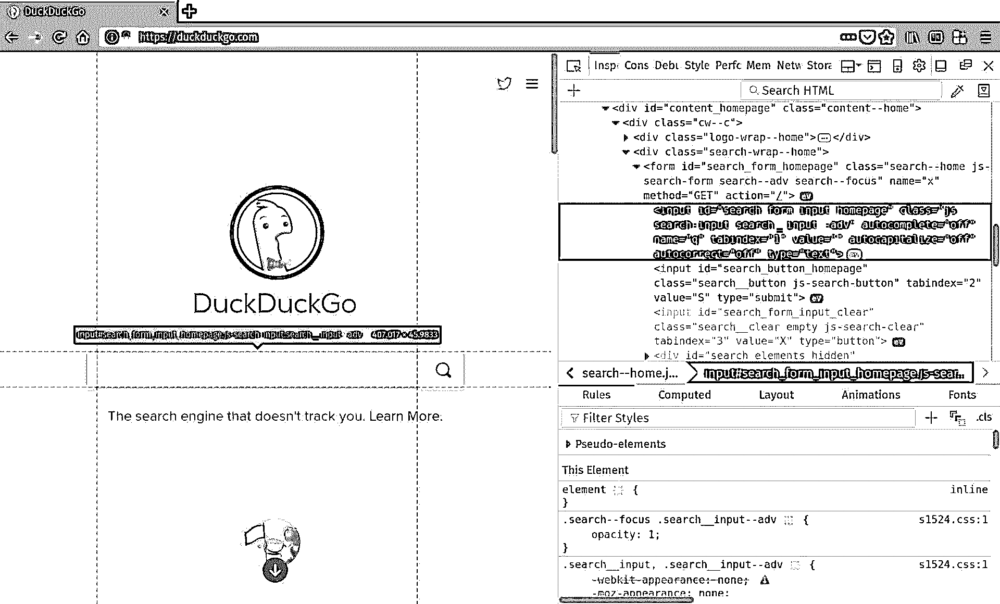
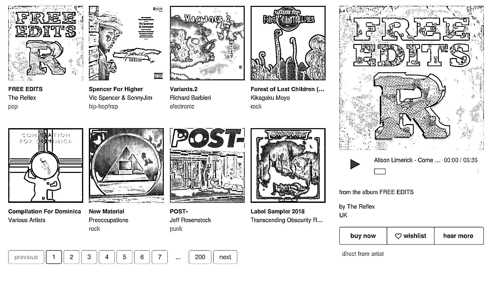

# 用 Python 和 Selenium 实现现代 Web 自动化

> 原文：<https://realpython.com/modern-web-automation-with-python-and-selenium/>

在本教程中，您将学习高级 Python web 自动化技术:在“无头”浏览器中使用 Selenium，将抓取的数据导出为 CSV 文件，并将抓取代码包装在 Python 类中。

## 动机:追踪聆听习惯

假设你已经在 [bandcamp](https://bandcamp.com) 听了一段时间的音乐，你发现自己希望能记起几个月前听过的一首歌。

当然，你可以挖掘你的浏览器历史，检查每一首歌，但这可能是一个痛苦…你所记得的是你几个月前听过这首歌，而且是在电子流派中。

“如果我有一份我的收听历史记录，那岂不是很棒，”你对自己说。我只要查一下两个月前的电子歌曲，就一定能找到。”

**今天，您将构建一个名为`BandLeader`的基本 Python 类，它连接到 bandcamp.com 的，从首页的“发现”部分流式传输音乐，并跟踪您的收听历史。**

收听历史将保存到磁盘上的 [CSV](https://en.wikipedia.org/wiki/Comma-separated_values) 文件中。然后，您可以在您最喜欢的电子表格应用程序中甚至使用 Python 来研究该 CSV 文件。

如果您对 Python 中的 [web 抓取有一些经验，那么您应该熟悉如何发出 HTTP 请求和使用 Python API 来导航 DOM。今天你会做更多同样的事情，除了一点不同。](https://realpython.com/python-web-scraping-practical-introduction/)

今天，您将使用一个以无头模式运行的成熟浏览器来处理 HTTP 请求。

一个[无头浏览器](https://en.wikipedia.org/wiki/Headless_browser)只是一个普通的网络浏览器，除了它不包含可见的 UI 元素。正如您所料，它不仅仅可以发出请求:它还可以呈现 HTML(尽管您看不到它)，保存会话信息，甚至通过运行 [JavaScript](https://realpython.com/python-vs-javascript/) 代码来执行异步网络通信。

如果你想自动化现代网络，无头浏览器是必不可少的。

**免费奖励:** [点击此处下载一个“Python + Selenium”项目框架，其中包含完整的源代码](#)，您可以使用它作为自己的 Python web 抓取和自动化应用程序的基础。

[*Remove ads*](/account/join/)

## 设置

在编写一行 Python 代码之前，你的第一步是为你最喜欢的浏览器安装一个受 [Selenium](http://www.seleniumhq.org/docs/) 支持的 [WebDriver](https://en.wikipedia.org/wiki/Selenium_(software)#Selenium_WebDriver) 。接下来，你将使用 [Firefox](https://www.mozilla.org/en-US/firefox/new/) ，但是 [Chrome](https://www.google.com/chrome/index.html) 也可以轻松工作。

假设路径`~/.local/bin`在您的执行 [`PATH`](https://realpython.com/add-python-to-path/) 中，下面是您如何在 Linux 机器上安装名为`geckodriver`的 Firefox WebDriver:

```py
$ wget https://github.com/mozilla/geckodriver/releases/download/v0.19.1/geckodriver-v0.19.1-linux64.tar.gz
$ tar xvfz geckodriver-v0.19.1-linux64.tar.gz
$ mv geckodriver ~/.local/bin
```

接下来，你安装[硒](http://seleniumhq.github.io/selenium/docs/api/py/)包，使用`pip`或你喜欢的任何东西。如果你为这个项目制作了一个[虚拟环境](https://realpython.com/python-virtual-environments-a-primer/)，你只需输入:

```py
$ pip install selenium
```

**注意:**如果你在本教程的过程中感到迷茫，完整的代码演示可以在 GitHub 上的[找到。](https://github.com/realpython/python-web-scraping-examples)

现在是试驾的时候了。

## 试驾无头浏览器

为了测试一切是否正常，你决定通过 [DuckDuckGo](https://duckduckgo.com) 尝试一个基本的网络搜索。您启动首选的 Python 解释器，并键入以下内容:

>>>

```py
>>> from selenium.webdriver import Firefox
>>> from selenium.webdriver.firefox.options import Options
>>> opts = Options()
>>> opts.set_headless()
>>> assert opts.headless  # Operating in headless mode
>>> browser = Firefox(options=opts)
>>> browser.get('https://duckduckgo.com')
```

到目前为止，您已经创建了一个无头 Firefox 浏览器并导航到了`https://duckduckgo.com`。您创建了一个`Options`实例，并在将它传递给`Firefox`构造函数时用它来激活无头模式。这类似于在命令行键入`firefox -headless`。

[](https://files.realpython.com/media/web-scraping-duckduckgo.f7bc7a5e2918.jpg)

既然已经加载了页面，就可以使用新创建的`browser`对象上定义的方法来查询 DOM。但是您如何知道要查询什么呢？

最好的方法是打开您的 web 浏览器，并使用其开发工具来检查页面内容。现在，您希望获得搜索表单，以便提交查询。通过检查 DuckDuckGo 的主页，您发现搜索表单`<input>`元素有一个`id`属性`"search_form_input_homepage"`。这正是你所需要的:

>>>

```py
>>> search_form = browser.find_element_by_id('search_form_input_homepage')
>>> search_form.send_keys('real python')
>>> search_form.submit()
```

您找到了搜索表单，使用`send_keys`方法填写表单，然后使用`submit`方法执行对`"Real Python"`的搜索。您可以查看最上面的结果:

>>>

```py
>>> results = browser.find_elements_by_class_name('result')
>>> print(results[0].text)

Real Python - Real Python
Get Real Python and get your hands dirty quickly so you spend more time making real applications. Real Python teaches Python and web development from the ground up ...
https://realpython.com
```

一切似乎都在运转。为了防止不可见的无头浏览器实例堆积在您的计算机上，您在退出 Python 会话之前关闭浏览器对象:

>>>

```py
>>> browser.close()
>>> quit()
```

[*Remove ads*](/account/join/)

## 在音乐中摇摆

您已经测试过可以使用 Python 驱动一个无头浏览器。现在您可以使用它了:

1.  你想玩音乐。
2.  你想浏览和探索音乐。
3.  你想知道正在播放什么音乐。

首先，你导航到 https://bandcamp.com，并开始在你的浏览器的开发工具中摸索。您会发现屏幕底部有一个闪亮的大播放按钮，其属性包含值`"playbutton"`。你检查它是否工作:

[](https://files.realpython.com/media/web-scraping-bandcamp-discovery-section.84a10034f564.jpg)>>>

```py
>>> opts = Option()
>>> opts.set_headless()
>>> browser = Firefox(options=opts)
>>> browser.get('https://bandcamp.com')
>>> browser.find_element_by_class('playbutton').click()
```

你应该听音乐！让它继续播放，回到你的网络浏览器。播放按钮旁边是探索区。再次检查这个部分，发现每个当前可见的可用轨道都有一个值为`"discover-item"`的`class`，并且每个项目看起来都是可点击的。在 Python 中，您可以检查:

>>>

```py
>>> tracks = browser.find_elements_by_class_name('discover-item')
>>> len(tracks)  # 8
>>> tracks[3].click()
```

应该在放新的曲目！这是使用 Python 探索 bandcamp 的第一步！你花了几分钟点击 Python 环境中的各种曲目，但很快就厌倦了仅有八首歌曲的贫乏库。

## 探索目录

回头看看你的浏览器，你会看到探索 bandcamp 的音乐探索部分的所有曲目的按钮。现在，这感觉很熟悉:每个按钮都有一个`"item-page"`的`class`值。最后一个按钮是“下一首”按钮，将显示目录中的下八首曲目。你去工作:

>>>

```py
>>> next_button = [e for e in browser.find_elements_by_class_name('item-page')
 if e.text.lower().find('next') > -1]
>>> next_button.click()
```

太好了！现在你想看看新的轨迹，所以你想，“我就像几分钟前一样重新填充我的`tracks`变量。”但这就是事情开始变得棘手的地方。

首先，bandcamp 设计他们的网站是为了让人们喜欢使用，而不是让 Python 脚本以编程方式访问。当你调用`next_button.click()`时，真正的 web 浏览器通过执行一些 JavaScript 代码来响应。

如果你在你的浏览器中尝试一下，你会发现随着歌曲目录的滚动，一段时间过去了，动画效果变得很流畅。如果你试图在动画结束前重新填充你的`tracks`变量，你可能得不到所有的轨迹，并且你可能得到一些你不想要的轨迹。

有什么解决办法？您可以只睡一会儿，或者，如果您只是在 Python shell 中运行这一切，您可能甚至不会注意到。毕竟，你打字也需要时间。

另一个小问题是只有通过实验才能发现。您尝试再次运行相同的代码:

>>>

```py
>>> tracks = browser.find_elements_by_class_name('discover-item')
>>> assert(len(tracks) == 8)
AssertionError
...
```

但是你注意到一些奇怪的事情。`len(tracks)`不等于`8`，尽管应该只显示下一批`8`。再深入一点，你会发现你的列表中包含了一些之前显示过的曲目。要仅获取在浏览器中实际可见的轨道，您需要稍微过滤结果。

在尝试了一些事情之后，您决定仅当页面上的`x`坐标落在包含元素的边界框内时才保留一个轨迹。目录的容器的`class`值为`"discover-results"`。以下是您的操作步骤:

>>>

```py
>>> discover_section = self.browser.find_element_by_class_name('discover-results')
>>> left_x = discover_section.location['x']
>>> right_x = left_x + discover_section.size['width']
>>> discover_items = browser.find_element_by_class_name('discover_items')
>>> tracks = [t for t in discover_items
 if t.location['x'] >= left_x and t.location['x'] < right_x]
>>> assert len(tracks) == 8
```

[*Remove ads*](/account/join/)

## 构建一个类

如果您厌倦了在 Python 环境中一遍又一遍地重复输入相同的命令，那么您应该将一些命令转储到一个模块中。用于 bandcamp 操作的基本类应该执行以下操作:

1.  初始化一个无头浏览器并导航到 bandcamp
2.  保留一个可用曲目列表
3.  支持查找更多曲目
4.  播放、暂停和跳过曲目

下面是基本代码，一气呵成:

```py
from selenium.webdriver import Firefox
from selenium.webdriver.firefox.options import Options
from time import sleep, ctime
from collections import namedtuple
from threading import Thread
from os.path import isfile
import csv

BANDCAMP_FRONTPAGE='https://bandcamp.com/'

class BandLeader():
    def __init__(self):
        # Create a headless browser
        opts = Options()
        opts.set_headless()     
        self.browser = Firefox(options=opts)
        self.browser.get(BANDCAMP_FRONTPAGE)

        # Track list related state
        self._current_track_number = 1
        self.track_list = []
        self.tracks()

    def tracks(self):
        '''
 Query the page to populate a list of available tracks.
 '''

        # Sleep to give the browser time to render and finish any animations
        sleep(1)

        # Get the container for the visible track list
        discover_section = self.browser.find_element_by_class_name('discover-results')
        left_x = discover_section.location['x']
        right_x = left_x + discover_section.size['width']

        # Filter the items in the list to include only those we can click
        discover_items = self.browser.find_elements_by_class_name('discover-item')
        self.track_list = [t for t in discover_items
                           if t.location['x'] >= left_x and t.location['x'] < right_x]

        # Print the available tracks to the screen
        for (i,track) in enumerate(self.track_list):
            print('[{}]'.format(i+1))
            lines = track.text.split('\n')
            print('Album  : {}'.format(lines[0]))
            print('Artist : {}'.format(lines[1]))
            if len(lines) > 2:
                print('Genre  : {}'.format(lines[2]))

    def catalogue_pages(self):
        '''
 Print the available pages in the catalogue that are presently
 accessible.
 '''
        print('PAGES')
        for e in self.browser.find_elements_by_class_name('item-page'):
            print(e.text)
        print('')

    def more_tracks(self,page='next'):
        '''
 Advances the catalogue and repopulates the track list. We can pass in a number
 to advance any of the available pages.
 '''

        next_btn = [e for e in self.browser.find_elements_by_class_name('item-page')
                    if e.text.lower().strip() == str(page)]

        if next_btn:
            next_btn[0].click()
            self.tracks()

    def play(self,track=None):
        '''
 Play a track. If no track number is supplied, the presently selected track
 will play.
 '''

       if track is None:
            self.browser.find_element_by_class_name('playbutton').click()
       elif type(track) is int and track <= len(self.track_list) and track >= 1:
            self._current_track_number = track
            self.track_list[self._current_track_number - 1].click()

    def play_next(self):
        '''
 Plays the next available track
 '''
        if self._current_track_number < len(self.track_list):
            self.play(self._current_track_number+1)
        else:
            self.more_tracks()
            self.play(1)

    def pause(self):
        '''
 Pauses the playback
 '''
        self.play()
```

相当整洁。您可以将它导入到您的 Python 环境中，并以编程方式运行 bandcamp！但是等等，你开始这整件事不就是因为你想记录你的收听历史吗？

## 收集结构化数据

你最后的任务是记录你实际听过的歌曲。你会怎么做？什么是真正的聆听呢？如果你在仔细阅读目录，在每首歌上停留几秒钟，这些歌曲中的每一首都算数吗？大概不会。你要留出一些“探索”时间来考虑你的数据收集。

您现在的目标是:

1.  收集关于当前播放曲目的结构化信息
2.  保存曲目的“数据库”
3.  将“数据库”保存到磁盘和从磁盘恢复

您决定使用一个名为[的元组](https://dbader.org/blog/writing-clean-python-with-namedtuples)来存储您跟踪的信息。命名元组适用于表示没有功能约束的属性束，有点像数据库记录:

```py
TrackRec = namedtuple('TrackRec', [
    'title', 
    'artist',
    'artist_url', 
    'album',
    'album_url', 
    'timestamp'  # When you played it
])
```

为了收集这些信息，您需要向`BandLeader`类添加一个方法。使用浏览器的开发工具，您可以找到合适的 HTML 元素和属性来选择您需要的所有信息。此外，如果当时正在播放音乐，您只需要获得当前播放曲目的信息。幸运的是，每当音乐播放时，页面播放器会向 play 按钮添加一个`"playing"`类，当音乐停止时，页面播放器会移除它。

考虑到这些因素，您编写了几个方法:

```py
 def is_playing(self):
        '''
 Returns `True` if a track is presently playing
 '''
        playbtn = self.browser.find_element_by_class_name('playbutton')
        return playbtn.get_attribute('class').find('playing') > -1

    def currently_playing(self):
        '''
 Returns the record for the currently playing track,
 or None if nothing is playing
 '''
        try:
            if self.is_playing():
                title = self.browser.find_element_by_class_name('title').text
                album_detail = self.browser.find_element_by_css_selector('.detail-album > a')
                album_title = album_detail.text
                album_url = album_detail.get_attribute('href').split('?')[0]
                artist_detail = self.browser.find_element_by_css_selector('.detail-artist > a')
                artist = artist_detail.text
                artist_url = artist_detail.get_attribute('href').split('?')[0]
                return TrackRec(title, artist, artist_url, album_title, album_url, ctime())

        except Exception as e:
            print('there was an error: {}'.format(e))

        return None
```

为了更好地测量，您还修改了`play()`方法来跟踪当前播放的曲目:

```py
 def play(self, track=None):
        '''
 Play a track. If no track number is supplied, the presently selected track
 will play.
 '''

        if track is None:
            self.browser.find_element_by_class_name('playbutton').click()
        elif type(track) is int and track <= len(self.track_list) and track >= 1:
            self._current_track_number = track
            self.track_list[self._current_track_number - 1].click()

        sleep(0.5)
        if self.is_playing():
            self._current_track_record = self.currently_playing()
```

接下来，你必须保持某种数据库。虽然从长远来看，它可能无法很好地扩展，但是你可以用一个简单的列表走得更远。您将`self.database = []`添加到`BandCamp`的`__init__()`方法中。因为您希望在将`TrackRec`对象输入数据库之前留出时间，所以您决定使用 Python 的[线程工具](https://docs.python.org/3.6/library/threading.html#threading.Thread)来运行一个单独的进程，在后台维护数据库。

您将为将在单独线程中运行的`BandLeader`实例提供一个`_maintain()`方法。新方法将定期检查`self._current_track_record`的值，如果它是新的，就将其添加到数据库中。

当通过向`__init__()`添加一些代码来实例化类时，您将启动线程:

```py
 # The new init
    def __init__(self):
        # Create a headless browser
        opts = Options()
        opts.set_headless()     
        self.browser = Firefox(options=opts)
        self.browser.get(BANDCAMP_FRONTPAGE)

        # Track list related state
        self._current_track_number = 1
        self.track_list = []
        self.tracks()

        # State for the database
        self.database = []
        self._current_track_record = None

        # The database maintenance thread
        self.thread = Thread(target=self._maintain)
        self.thread.daemon = True    # Kills the thread with the main process dies
        self.thread.start()

        self.tracks()

    def _maintain(self):
        while True:
            self._update_db()
            sleep(20)          # Check every 20 seconds

    def _update_db(self):
        try:
            check = (self._current_track_record is not None
                     and (len(self.database) == 0
                          or self.database[-1] != self._current_track_record)
                     and self.is_playing())
            if check:
                self.database.append(self._current_track_record)

        except Exception as e:
            print('error while updating the db: {}'.format(e)
```

如果你从未使用过 Python 中的多线程编程，你应该好好研究一下！对于你现在的目的，你可以把 thread 想象成一个在 Python 主进程(你直接与之交互的那个)后台运行的循环。每隔 20 秒，循环检查一些事情，看看数据库是否需要更新，如果需要，追加一条新记录。相当酷。

最后一步是保存数据库并从保存的状态中恢复。使用 [csv](https://docs.python.org/3.6/library/csv.html) 包，您可以确保您的数据库驻留在一个高度可移植的格式中，并且即使您放弃了您精彩的`BandLeader`类，它仍然是可用的！

应该再次修改`__init__()`方法，这一次接受您想要保存数据库的文件路径。如果这个数据库可用，您想要加载它，并且每当它被更新时，您想要定期保存它。更新如下所示:

```py
 def __init__(self,csvpath=None):
        self.database_path=csvpath
        self.database = []      

        # Load database from disk if possible
        if isfile(self.database_path):
            with open(self.database_path, newline='') as dbfile:
                dbreader = csv.reader(dbfile)
                next(dbreader)   # To ignore the header line
                self.database = [TrackRec._make(rec) for rec in dbreader]

        # .... The rest of the __init__ method is unchanged ....

    # A new save_db() method
    def save_db(self):
        with open(self.database_path,'w',newline='') as dbfile:
            dbwriter = csv.writer(dbfile)
            dbwriter.writerow(list(TrackRec._fields))
            for entry in self.database:
                dbwriter.writerow(list(entry))

    # Finally, add a call to save_db() to your database maintenance method
    def _update_db(self):
        try:
            check = (self._current_track_record is not None
                     and self._current_track_record is not None
                     and (len(self.database) == 0
                          or self.database[-1] != self._current_track_record)
                     and self.is_playing())
            if check:
                self.database.append(self._current_track_record)
                self.save_db()

        except Exception as e:
            print('error while updating the db: {}'.format(e)
```

*瞧啊*！你可以听音乐，并记录下你所听到的！太神奇了。

关于上面的一些有趣的事情是，[使用`namedtuple`](https://dbader.org/blog/writing-clean-python-with-namedtuples) 真的开始有回报了。当转换成 CSV 格式或从 CSV 格式转换时，您可以利用 CSV 文件中行的顺序来填充`TrackRec`对象中的行。同样，您可以通过引用`TrackRec._fields`属性来创建 CSV 文件的标题行。这是使用元组最终对列数据有意义的原因之一。

[*Remove ads*](/account/join/)

## 接下来是什么，你学到了什么？

你可以做得更多！这里有一些快速的想法，可以利用 Python + Selenium 这个温和的超级功能:

*   您可以扩展`BandLeader`类来导航到相册页面并播放您在那里找到的曲目。
*   您可能会决定根据您最喜爱或最常听到的曲目来创建播放列表。
*   也许你想添加一个自动播放功能。
*   也许你想通过日期、标题或艺术家来查询歌曲，并以这种方式建立播放列表。

**免费奖励:** [点击此处下载一个“Python + Selenium”项目框架，其中包含完整的源代码](#)，您可以使用它作为自己的 Python web 抓取和自动化应用程序的基础。

你已经知道 Python 可以做 web 浏览器能做的一切，甚至更多。您可以轻松地编写脚本来控制运行在云中的虚拟浏览器实例。你可以创建机器人与真实用户互动或盲目填写表格！向前迈进，实现自动化！****