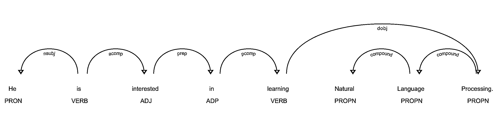
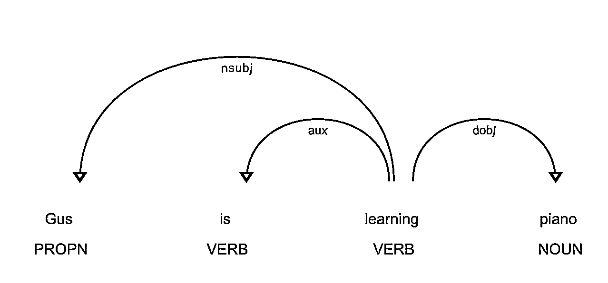
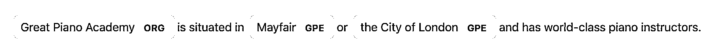

# Python 中基于空间的自然语言处理

> 原文：<https://realpython.com/natural-language-processing-spacy-python/>

spaCy 是一个免费的开源库，用于 Python 中的**自然语言处理** (NLP)，具有很多内置功能。在 NLP 中处理和分析数据变得越来越流行。非结构化文本数据是大规模产生的，处理非结构化数据并从中获得洞察力非常重要。为此，您需要用计算机可以理解的格式来表示数据。NLP 可以帮你做到这一点。

在本教程中，您将学习:

*   NLP 中的基本术语和概念是什么
*   如何在空间中实现这些概念
*   如何定制和扩展 spaCy 中的内置功能
*   如何对文本进行基本的统计分析
*   如何创建管道来处理非结构化文本
*   如何解析句子并从中提取有意义的见解

**免费下载:** [从 Python 技巧中获取一个示例章节:这本书](https://realpython.com/bonus/python-tricks-sample-pdf/)用简单的例子向您展示了 Python 的最佳实践，您可以立即应用它来编写更漂亮的+Python 代码。

## 什么是 NLP 和 spaCy？

自然语言处理(NLP)是人工智能(T2)的一个子领域，涉及计算机和人类语言之间的互动。NLP 是计算机从人类语言中分析、理解和推导含义的过程。

NLP 可以帮助您从非结构化文本中提取见解，并且有几个使用案例，例如:

*   [自动总结](https://en.wikipedia.org/wiki/Automatic_summarization)
*   [命名实体识别](https://en.wikipedia.org/wiki/Named-entity_recognition)
*   [问答系统](https://en.wikipedia.org/wiki/Question_answering)
*   [情感分析](https://realpython.com/sentiment-analysis-python/)

spaCy 是 Python 中 NLP 的免费开源库。它是用 [Cython](https://cython.org/) 编写的，旨在构建信息提取或自然语言理解系统。它是为生产使用而构建的，提供了一个简洁且用户友好的 API。

[*Remove ads*](/account/join/)

## 安装

在本节中，您将安装 spaCy，然后下载英语语言的数据和模型。

### 如何安装 spaCy

spaCy 可以使用**`pip`**(Python 包管理器)安装。你可以使用一个**虚拟环境**来避免依赖系统范围的软件包。要了解关于虚拟环境和`pip`的更多信息，请查看[什么是 Pip？新 Pythonistas](https://realpython.com/what-is-pip/) 和 [Python 虚拟环境指南:初级读本](https://realpython.com/python-virtual-environments-a-primer/)。

创建新的虚拟环境:

```py
$ python3 -m venv env
```

激活此虚拟环境并安装空间:

```py
$ source ./env/bin/activate
$ pip install spacy
```

### 如何下载模型和数据

spaCy 有[种不同类型](https://spaCy.io/models)的车型。英语的默认模式是`en_core_web_sm`。

激活在上一步中创建的虚拟环境，并下载英语语言的模型和数据:

```py
$ python -m spacy download en_core_web_sm
```

通过加载验证下载是否成功:

>>>

```py
>>> import spacy
>>> nlp = spacy.load('en_core_web_sm')
```

如果`nlp`对象被创建，那么这意味着 spaCy 被安装并且模型和数据被成功下载。

## 使用空间

在这一节中，您将对给定的输入字符串和文本文件使用 spaCy。在空间中加载语言模型实例:

>>>

```py
>>> import spacy
>>> nlp = spacy.load('en_core_web_sm')
```

这里，`nlp`对象是一个语言模型实例。你可以假设，在整个教程中，`nlp`指的是由`en_core_web_sm`加载的语言模型。现在，您可以使用 spaCy 来读取字符串或文本文件。

### 如何读取一个字符串

您可以使用 spaCy 为给定的输入字符串创建一个已处理的 [Doc](https://spaCy.io/api/doc) 对象，这是一个用于访问语言注释的容器:

>>>

```py
>>> introduction_text = ('This tutorial is about Natural'
...     ' Language Processing in Spacy.')
>>> introduction_doc = nlp(introduction_text)
>>> # Extract tokens for the given doc
>>> print ([token.text for token in introduction_doc])
['This', 'tutorial', 'is', 'about', 'Natural', 'Language',
'Processing', 'in', 'Spacy', '.']
```

在上面的例子中，注意文本是如何被转换成 spaCy 能够理解的对象的。您可以使用这种方法将任何文本转换成经过处理的`Doc`对象，并推导出属性，这将在接下来的章节中介绍。

[*Remove ads*](/account/join/)

### 如何读取文本文件

在本节中，您将为一个文本文件创建一个已处理的 [Doc](https://spaCy.io/api/doc) 对象:

>>>

```py
>>> file_name = 'introduction.txt'
>>> introduction_file_text = open(file_name).read()
>>> introduction_file_doc = nlp(introduction_file_text)
>>> # Extract tokens for the given doc
>>> print ([token.text for token in introduction_file_doc])
['This', 'tutorial', 'is', 'about', 'Natural', 'Language',
'Processing', 'in', 'Spacy', '.', '\n']
```

这就是你如何将一个文本文件转换成一个处理过的`Doc`对象。

**注:**

你可以假设:

*   [变量](https://realpython.com/python-variables/)以后缀 **`_text`** 结尾的名字是 **[Unicode](https://realpython.com/python-encodings-guide/) 字符串对象**。
*   以后缀 **`_doc`** 结尾的变量名是 **spaCy 的语言模型对象**。

## 句子检测

**句子检测**是在给定文本中定位句子的开头和结尾的过程。这允许你把一篇文章分成有语言意义的单元。当您处理文本时，您将使用这些单元来执行任务，如**词性标注**和**实体提取**。

在 spaCy 中，`sents`属性用于提取句子。以下是如何提取句子总数和给定输入文本的句子:

>>>

```py
>>> about_text = ('Gus Proto is a Python developer currently'
...               ' working for a London-based Fintech'
...               ' company. He is interested in learning'
...               ' Natural Language Processing.')
>>> about_doc = nlp(about_text)
>>> sentences = list(about_doc.sents)
>>> len(sentences)
2
>>> for sentence in sentences:
...     print (sentence)
...
'Gus Proto is a Python developer currently working for a
London-based Fintech company.'
'He is interested in learning Natural Language Processing.'
```

在上面的例子中，spaCy 使用句号(`.`)作为句子分隔符，能够正确地识别英语句子。您还可以自定义句子检测，以检测自定义分隔符上的句子。

下面是一个示例，其中省略号(`...`)用作分隔符:

>>>

```py
>>> def set_custom_boundaries(doc):
...     # Adds support to use `...` as the delimiter for sentence detection
...     for token in doc[:-1]:
...         if token.text == '...':
...             doc[token.i+1].is_sent_start = True
...     return doc
...
>>> ellipsis_text = ('Gus, can you, ... never mind, I forgot'
...                  ' what I was saying. So, do you think'
...                  ' we should ...')
>>> # Load a new model instance
>>> custom_nlp = spacy.load('en_core_web_sm')
>>> custom_nlp.add_pipe(set_custom_boundaries, before='parser')
>>> custom_ellipsis_doc = custom_nlp(ellipsis_text)
>>> custom_ellipsis_sentences = list(custom_ellipsis_doc.sents)
>>> for sentence in custom_ellipsis_sentences:
...     print(sentence)
...
Gus, can you, ...
never mind, I forgot what I was saying.
So, do you think we should ...
>>> # Sentence Detection with no customization
>>> ellipsis_doc = nlp(ellipsis_text)
>>> ellipsis_sentences = list(ellipsis_doc.sents)
>>> for sentence in ellipsis_sentences:
...     print(sentence)
...
Gus, can you, ... never mind, I forgot what I was saying.
So, do you think we should ...
```

注意`custom_ellipsis_sentences`包含三个句子，而`ellipsis_sentences`包含两个句子。这些句子仍然是通过`sents`属性获得的，如您之前所见。

## 空间中的标记化

**标记化**是句子检测之后的下一步。它可以让你识别文本中的基本单位。这些基本单位被称为**令牌**。标记化很有用，因为它将文本分解成有意义的单元。这些单元用于进一步分析，如词性标注。

在 spaCy 中，可以通过迭代`Doc`对象来打印令牌:

>>>

```py
>>> for token in about_doc:
...     print (token, token.idx)
...
Gus 0
Proto 4
is 10
a 13
Python 15
developer 22
currently 32
working 42
for 50
a 54
London 56
- 62
based 63
Fintech 69
company 77
. 84
He 86
is 89
interested 92
in 103
learning 106
Natural 115
Language 123
Processing 132
. 142
```

注意 spaCy 是如何保存令牌的起始索引的。这对于就地单词替换很有用。spaCy 为`Token`类提供了[各种属性](https://spacy.io/api/token#attributes):

>>>

```py
>>> for token in about_doc:
...     print (token, token.idx, token.text_with_ws,
...            token.is_alpha, token.is_punct, token.is_space,
...            token.shape_, token.is_stop)
...
Gus 0 Gus  True False False Xxx False
Proto 4 Proto  True False False Xxxxx False
is 10 is  True False False xx True
a 13 a  True False False x True
Python 15 Python  True False False Xxxxx False
developer 22 developer  True False False xxxx False
currently 32 currently  True False False xxxx False
working 42 working  True False False xxxx False
for 50 for  True False False xxx True
a 54 a  True False False x True
London 56 London True False False Xxxxx False
- 62 - False True False - False
based 63 based  True False False xxxx False
Fintech 69 Fintech  True False False Xxxxx False
company 77 company True False False xxxx False
. 84 .  False True False . False
He 86 He  True False False Xx True
is 89 is  True False False xx True
interested 92 interested  True False False xxxx False
in 103 in  True False False xx True
learning 106 learning  True False False xxxx False
Natural 115 Natural  True False False Xxxxx False
Language 123 Language  True False False Xxxxx False
Processing 132 Processing True False False Xxxxx False
. 142 . False True False . False
```

在此示例中，访问了一些常见的必需属性:

*   **`text_with_ws`** 打印带有尾随空格的令牌文本(如果有)。
*   **`is_alpha`** 检测令牌是否由字母字符组成。
*   **`is_punct`** 检测令牌是否为标点符号。
*   **`is_space`** 检测令牌是否为空格。
*   **`shape_`** 打印出字的形状。
*   **`is_stop`** 检测令牌是否为停用词。

**注:**你将在下一节了解更多关于**的停用词**。

您还可以自定义标记化过程，以检测自定义字符上的标记。这通常用于带连字符的单词，即用连字符连接的单词。例如，“伦敦”是一个连字符单词。

spaCy 允许您通过更新`nlp`对象上的`tokenizer`属性来自定义标记化:

>>>

```py
>>> import re
>>> import spacy
>>> from spacy.tokenizer import Tokenizer
>>> custom_nlp = spacy.load('en_core_web_sm')
>>> prefix_re = spacy.util.compile_prefix_regex(custom_nlp.Defaults.prefixes)
>>> suffix_re = spacy.util.compile_suffix_regex(custom_nlp.Defaults.suffixes)
>>> infix_re = re.compile(r'''[-~]''')
>>> def customize_tokenizer(nlp):
...     # Adds support to use `-` as the delimiter for tokenization
...     return Tokenizer(nlp.vocab, prefix_search=prefix_re.search,
...                      suffix_search=suffix_re.search,
...                      infix_finditer=infix_re.finditer,
...                      token_match=None
...                      )
...

>>> custom_nlp.tokenizer = customize_tokenizer(custom_nlp)
>>> custom_tokenizer_about_doc = custom_nlp(about_text)
>>> print([token.text for token in custom_tokenizer_about_doc])
['Gus', 'Proto', 'is', 'a', 'Python', 'developer', 'currently',
'working', 'for', 'a', 'London', '-', 'based', 'Fintech',
'company', '.', 'He', 'is', 'interested', 'in', 'learning',
'Natural', 'Language', 'Processing', '.']
```

为了便于定制，您可以将各种参数传递给`Tokenizer`类:

*   **`nlp.vocab`** 是特殊情况的存储容器，用于处理缩写、表情符号等情况。
*   **`prefix_search`** 是用来处理前面标点符号的函数，比如开括号。
*   **`infix_finditer`** 是用来处理非空格分隔符的函数，比如连字符。
*   **`suffix_search`** 是用来处理后续标点符号的函数，比如右括号。
*   **`token_match`** 是一个可选的[布尔](https://realpython.com/python-boolean/)函数，用于匹配不应被拆分的字符串。它覆盖了之前的规则，对于像 URL 或[数字](https://realpython.com/python-numbers/)这样的实体非常有用。

**注意:** spaCy 已经将带连字符的单词检测为单独的标记。上面的代码只是一个示例，展示了如何定制令牌化。它可以用于任何其他字符。

[*Remove ads*](/account/join/)

## 停止字

**停用词**是语言中最常见的词。在英语中，一些停用词的例子有`the`、`are`、`but`和`they`。大多数句子需要包含停用词才能成为有意义的完整句子。

通常，停用词会被删除，因为它们不重要，会扭曲词频分析。spaCy 有一个英语停用词列表:

>>>

```py
>>> import spacy
>>> spacy_stopwords = spacy.lang.en.stop_words.STOP_WORDS
>>> len(spacy_stopwords)
326
>>> for stop_word in list(spacy_stopwords)[:10]:
...     print(stop_word)
...
using
becomes
had
itself
once
often
is
herein
who
too
```

您可以从输入文本中删除停用词:

>>>

```py
>>> for token in about_doc:
...     if not token.is_stop:
...         print (token)
...
Gus
Proto
Python
developer
currently
working
London
-
based
Fintech
company
.
interested
learning
Natural
Language
Processing
.
```

像`is`、`a`、`for`、`the`和`in`这样的停用词不会打印在上面的输出中。您还可以创建不包含停用字词的令牌列表:

>>>

```py
>>> about_no_stopword_doc = [token for token in about_doc if not token.is_stop]
>>> print (about_no_stopword_doc)
[Gus, Proto, Python, developer, currently, working, London,
-, based, Fintech, company, ., interested, learning, Natural,
Language, Processing, .]
```

可以用空格连接，组成一个没有停用词的句子。

## 引理化

**词汇化**是减少一个单词的屈折形式，同时仍然确保减少的形式属于该语言的过程。这种简化形式或词根被称为**引理**。

比如*组织*、*组织*、*组织*都是*组织*的形式。这里，*组织*是引理。一个单词的屈折可以让你表达不同的语法类别，如时态(*组织的* vs *组织的*)、数字(*串* vs *串*)等等。词汇化是必要的，因为它有助于减少一个单词的屈折形式，以便可以将它们作为一个项目进行分析。它还可以帮助你使文本正常化。

spaCy 在`Token`类上有属性`lemma_`。该属性具有记号的词汇化形式:

>>>

```py
>>> conference_help_text = ('Gus is helping organize a developer'
...     'conference on Applications of Natural Language'
...     ' Processing. He keeps organizing local Python meetups'
...     ' and several internal talks at his workplace.')
>>> conference_help_doc = nlp(conference_help_text)
>>> for token in conference_help_doc:
...     print (token, token.lemma_)
...
Gus Gus
is be
helping help
organize organize
a a
developer developer
conference conference
on on
Applications Applications
of of
Natural Natural
Language Language
Processing Processing
. .
He -PRON-
keeps keep
organizing organize
local local
Python Python
meetups meetup
and and
several several
internal internal
talks talk
at at
his -PRON-
workplace workplace
. .
```

在这个例子中，`organizing`简化为它的引理形式`organize`。如果不对文本进行词汇化，那么`organize`和`organizing`将被视为不同的标记，尽管它们的意思相似。词汇化有助于避免意思相似的重复单词。

## 词频

现在，您可以将给定的文本转换成标记，并对其执行统计分析。这种分析可以为您提供关于单词模式的各种见解，例如文本中的常见单词或独特单词:

>>>

```py
>>> from collections import Counter
>>> complete_text = ('Gus Proto is a Python developer currently'
...     'working for a London-based Fintech company. He is'
...     ' interested in learning Natural Language Processing.'
...     ' There is a developer conference happening on 21 July'
...     ' 2019 in London. It is titled "Applications of Natural'
...     ' Language Processing". There is a helpline number '
...     ' available at +1-1234567891\. Gus is helping organize it.'
...     ' He keeps organizing local Python meetups and several'
...     ' internal talks at his workplace. Gus is also presenting'
...     ' a talk. The talk will introduce the reader about "Use'
...     ' cases of Natural Language Processing in Fintech".'
...     ' Apart from his work, he is very passionate about music.'
...     ' Gus is learning to play the Piano. He has enrolled '
...     ' himself in the weekend batch of Great Piano Academy.'
...     ' Great Piano Academy is situated in Mayfair or the City'
...     ' of London and has world-class piano instructors.')
...
>>> complete_doc = nlp(complete_text)
>>> # Remove stop words and punctuation symbols
>>> words = [token.text for token in complete_doc
...          if not token.is_stop and not token.is_punct]
>>> word_freq = Counter(words)
>>> # 5 commonly occurring words with their frequencies
>>> common_words = word_freq.most_common(5)
>>> print (common_words)
[('Gus', 4), ('London', 3), ('Natural', 3), ('Language', 3), ('Processing', 3)]
>>> # Unique words
>>> unique_words = [word for (word, freq) in word_freq.items() if freq == 1]
>>> print (unique_words)
['Proto', 'currently', 'working', 'based', 'company',
'interested', 'conference', 'happening', '21', 'July',
'2019', 'titled', 'Applications', 'helpline', 'number',
'available', '+1', '1234567891', 'helping', 'organize',
'keeps', 'organizing', 'local', 'meetups', 'internal',
'talks', 'workplace', 'presenting', 'introduce', 'reader',
'Use', 'cases', 'Apart', 'work', 'passionate', 'music', 'play',
'enrolled', 'weekend', 'batch', 'situated', 'Mayfair', 'City',
'world', 'class', 'piano', 'instructors']
```

通过查看常用词，你可以看到文本整体上大概是关于`Gus`、`London`或者`Natural Language Processing`的。通过这种方式，您可以获取任何非结构化文本并执行统计分析，以了解它的内容。

这是另一个带有停用词的相同文本的例子:

>>>

```py
>>> words_all = [token.text for token in complete_doc if not token.is_punct]
>>> word_freq_all = Counter(words_all)
>>> # 5 commonly occurring words with their frequencies
>>> common_words_all = word_freq_all.most_common(5)
>>> print (common_words_all)
[('is', 10), ('a', 5), ('in', 5), ('Gus', 4), ('of', 4)]
```

五个最常见的单词中有四个是停用词，它不能告诉你关于文本的太多信息。如果你在进行词频分析时考虑停用词，那么你将无法从输入文本中获得有意义的见解。这就是为什么删除停用词如此重要。

[*Remove ads*](/account/join/)

## 词性标注

**词性**或**词性**是一个语法角色，解释一个特定的单词在句子中是如何使用的。有八个词类:

1.  名词
2.  代词
3.  形容词
4.  动词
5.  副词
6.  介词
7.  结合
8.  感叹词

**词性标注**是根据单词在句子中的用法，给每个单词分配一个**词性标签**的过程。POS 标签对于给每个单词分配一个句法类别很有用，比如**名词**或**动词**。

在 spaCy 中，POS 标签作为属性出现在`Token`对象上:

>>>

```py
>>> for token in about_doc:
...     print (token, token.tag_, token.pos_, spacy.explain(token.tag_))
...
Gus NNP PROPN noun, proper singular
Proto NNP PROPN noun, proper singular
is VBZ VERB verb, 3rd person singular present
a DT DET determiner
Python NNP PROPN noun, proper singular
developer NN NOUN noun, singular or mass
currently RB ADV adverb
working VBG VERB verb, gerund or present participle
for IN ADP conjunction, subordinating or preposition
a DT DET determiner
London NNP PROPN noun, proper singular
- HYPH PUNCT punctuation mark, hyphen
based VBN VERB verb, past participle
Fintech NNP PROPN noun, proper singular
company NN NOUN noun, singular or mass
. . PUNCT punctuation mark, sentence closer
He PRP PRON pronoun, personal
is VBZ VERB verb, 3rd person singular present
interested JJ ADJ adjective
in IN ADP conjunction, subordinating or preposition
learning VBG VERB verb, gerund or present participle
Natural NNP PROPN noun, proper singular
Language NNP PROPN noun, proper singular
Processing NNP PROPN noun, proper singular
. . PUNCT punctuation mark, sentence closer
```

这里，访问了`Token`类的两个属性:

1.  **`tag_`** 列举了精细的词类。
2.  **`pos_`** 列出了粗粒度的词类。

`spacy.explain`给出特定 POS 标签的详细描述。spaCy 提供了一个[完整的标签列表](https://spaCy.io/api/annotation#pos-tagging)以及对每个标签的解释。

使用 POS 标签，您可以提取特定类别的单词:

>>>

```py
>>> nouns = []
>>> adjectives = []
>>> for token in about_doc:
...     if token.pos_ == 'NOUN':
...         nouns.append(token)
...     if token.pos_ == 'ADJ':
...         adjectives.append(token)
...
>>> nouns
[developer, company]
>>> adjectives
[interested]
```

您可以使用它来获得洞察力，删除最常见的名词，或者查看特定名词使用了哪些形容词。

## 可视化:使用显示

spaCy 自带一个名为 **displaCy** 的内置可视化工具。你可以用它在浏览器或笔记本中可视化**依赖解析**或**命名实体**。

您可以使用 displaCy 查找令牌的 POS 标签:

>>>

```py
>>> from spacy import displacy
>>> about_interest_text = ('He is interested in learning'
...     ' Natural Language Processing.')
>>> about_interest_doc = nlp(about_interest_text)
>>> displacy.serve(about_interest_doc, style='dep')
```

上面的代码将旋转一个简单的 web 服务器。您可以通过在浏览器中打开`http://127.0.0.1:5000`来查看可视化效果:

[](https://files.realpython.com/media/displacy_pos_tags.45059f2bf851.png)

<figcaption class="figure-caption text-center">displaCy: Part of Speech Tagging Demo</figcaption>

在上图中，每个代币都被分配了一个写在代币正下方的 POS 标签。

**注意:**以下是在 Jupyter 笔记本中使用 displaCy 的方法:

>>>

```py
>>> displacy.render(about_interest_doc, style='dep', jupyter=True)
```

[*Remove ads*](/account/join/)

## 预处理功能

您可以创建一个**预处理函数**，它将文本作为输入，并应用以下操作:

*   小写文本
*   对每个令牌进行词汇化
*   删除标点符号
*   删除停用词

预处理功能将文本转换成可分析的格式。对于大多数 NLP 任务来说，这是必要的。这里有一个例子:

>>>

```py
>>> def is_token_allowed(token):
...     '''
...         Only allow valid tokens which are not stop words
...         and punctuation symbols.
...     '''
...     if (not token or not token.string.strip() or
...         token.is_stop or token.is_punct):
...         return False
...     return True
...
>>> def preprocess_token(token):
...     # Reduce token to its lowercase lemma form
...     return token.lemma_.strip().lower()
...
>>> complete_filtered_tokens = [preprocess_token(token)
...     for token in complete_doc if is_token_allowed(token)]
>>> complete_filtered_tokens
['gus', 'proto', 'python', 'developer', 'currently', 'work',
'london', 'base', 'fintech', 'company', 'interested', 'learn',
'natural', 'language', 'processing', 'developer', 'conference',
'happen', '21', 'july', '2019', 'london', 'title',
'applications', 'natural', 'language', 'processing', 'helpline',
'number', 'available', '+1', '1234567891', 'gus', 'help',
'organize', 'keep', 'organize', 'local', 'python', 'meetup',
'internal', 'talk', 'workplace', 'gus', 'present', 'talk', 'talk',
'introduce', 'reader', 'use', 'case', 'natural', 'language',
'processing', 'fintech', 'apart', 'work', 'passionate', 'music',
'gus', 'learn', 'play', 'piano', 'enrol', 'weekend', 'batch',
'great', 'piano', 'academy', 'great', 'piano', 'academy',
'situate', 'mayfair', 'city', 'london', 'world', 'class',
'piano', 'instructor']
```

请注意，`complete_filtered_tokens`不包含任何停用词或标点符号，而是由字母化的小写符号组成。

## 使用空间的基于规则的匹配

**基于规则的匹配**是从非结构化文本中提取信息的步骤之一。它用于根据模式(如小写)和语法特征(如词性)识别和提取记号和短语。

基于规则的匹配可以使用[正则表达式](https://realpython.com/regex-python/)从非结构化文本中提取实体(比如电话号码)。从正则表达式不考虑文本的词法和语法属性的意义上来说，它不同于使用正则表达式提取文本。

使用基于规则的匹配，您可以提取名和姓，它们总是**专有名词**:

>>>

```py
>>> from spacy.matcher import Matcher
>>> matcher = Matcher(nlp.vocab)
>>> def extract_full_name(nlp_doc):
...     pattern = [{'POS': 'PROPN'}, {'POS': 'PROPN'}]
...     matcher.add('FULL_NAME', None, pattern)
...     matches = matcher(nlp_doc)
...     for match_id, start, end in matches:
...         span = nlp_doc[start:end]
...         return span.text
...
>>> extract_full_name(about_doc)
'Gus Proto'
```

在这个例子中，`pattern`是定义要匹配的标记组合的对象列表。里面的两个 POS 标签都是`PROPN`(专有名词)。因此，`pattern`由两个对象组成，其中两个令牌的 POS 标签都应该是`PROPN`。然后使用`FULL_NAME`和`match_id`将该模式添加到`Matcher`。最后，通过它们的开始和结束索引获得匹配。

您还可以使用基于规则的匹配来提取电话号码:

>>>

```py
>>> from spacy.matcher import Matcher
>>> matcher = Matcher(nlp.vocab)
>>> conference_org_text = ('There is a developer conference'
...     'happening on 21 July 2019 in London. It is titled'
...     ' "Applications of Natural Language Processing".'
...     ' There is a helpline number available'
...     ' at (123) 456-789')
...
>>> def extract_phone_number(nlp_doc):
...     pattern = [{'ORTH': '('}, {'SHAPE': 'ddd'},
...                {'ORTH': ')'}, {'SHAPE': 'ddd'},
...                {'ORTH': '-', 'OP': '?'},
...                {'SHAPE': 'ddd'}]
...     matcher.add('PHONE_NUMBER', None, pattern)
...     matches = matcher(nlp_doc)
...     for match_id, start, end in matches:
...         span = nlp_doc[start:end]
...         return span.text
...
>>> conference_org_doc = nlp(conference_org_text)
>>> extract_phone_number(conference_org_doc)
'(123) 456-789'
```

在本例中，只有模式被更新，以匹配上例中的电话号码。这里还使用了令牌的一些属性:

*   **`ORTH`** 给出令牌的确切文本。
*   **`SHAPE`** 变换记号字符串以显示正投影特征。
*   **`OP`** 定义了运算符。使用`?`作为值意味着模式是可选的，意味着它可以匹配 0 或 1 次。

**注意:**为了简单起见，电话号码被假定为一种特殊的格式:`(123) 456-789`。您可以根据您的使用情况对此进行更改。

基于规则的匹配帮助您根据词汇模式(如小写)和语法特征(如词性)识别和提取标记和短语。

## 使用空间进行依存解析

**依存解析**是提取句子的依存解析来表示其语法结构的过程。定义了**中心词**和其**从属词**之间的从属关系。句首没有依存关系，被称为句子的**词根。**动词**通常是句首。所有其他单词都与中心词相关联。**

依赖关系可以映射到有向图表示中:

*   单词是节点。
*   语法关系是边。

依存分析有助于您了解单词在文本中的作用以及不同单词之间的关系。它也用于**浅层解析**和命名实体识别。

下面是如何使用依存解析来查看单词之间的关系:

>>>

```py
>>> piano_text = 'Gus is learning piano'
>>> piano_doc = nlp(piano_text)
>>> for token in piano_doc:
...     print (token.text, token.tag_, token.head.text, token.dep_)
...
Gus NNP learning nsubj
is VBZ learning aux
learning VBG learning ROOT
piano NN learning dobj
```

在这个例子中，句子包含三种关系:

1.  **`nsubj`** 是这个词的主语。它的中心词是动词。
2.  **`aux`** 是助词。它的中心词是动词。
3.  **`dobj`** 是动词的直接宾语。它的中心词是动词。

有一个详细的[关系列表](https://nlp.stanford.edu/software/dependencies_manual.pdf)和描述。您可以使用 displaCy 来可视化依赖关系树:

>>>

```py
>>> displacy.serve(piano_doc, style='dep')
```

这段代码将生成一个可视化效果，可以通过在浏览器中打开`http://127.0.0.1:5000`来访问:

[](https://files.realpython.com/media/displacy_dependency_parse.de72f9b1d115.png)

<figcaption class="figure-caption text-center">displaCy: Dependency Parse Demo</figcaption>

这张图片向您展示了句子的主语是专有名词`Gus`，并且它与`piano`有着`learn`的关系。

[*Remove ads*](/account/join/)

## 导航树和子树

依存解析树具有一棵[树](https://en.wikipedia.org/wiki/Tree_(data_structure))的所有属性。该树包含关于句子结构和语法的信息，并且可以以不同的方式被遍历以提取关系。

spaCy 提供了像`children`、`lefts`、`rights`和`subtree`这样的属性来导航解析树:

>>>

```py
>>> one_line_about_text = ('Gus Proto is a Python developer'
...     ' currently working for a London-based Fintech company')
>>> one_line_about_doc = nlp(one_line_about_text)
>>> # Extract children of `developer`
>>> print([token.text for token in one_line_about_doc[5].children])
['a', 'Python', 'working']
>>> # Extract previous neighboring node of `developer`
>>> print (one_line_about_doc[5].nbor(-1))
Python
>>> # Extract next neighboring node of `developer`
>>> print (one_line_about_doc[5].nbor())
currently
>>> # Extract all tokens on the left of `developer`
>>> print([token.text for token in one_line_about_doc[5].lefts])
['a', 'Python']
>>> # Extract tokens on the right of `developer`
>>> print([token.text for token in one_line_about_doc[5].rights])
['working']
>>> # Print subtree of `developer`
>>> print (list(one_line_about_doc[5].subtree))
[a, Python, developer, currently, working, for, a, London, -,
based, Fintech, company]
```

您可以构造一个函数，该函数将子树作为参数，并通过合并字符串中的单词来返回字符串:

>>>

```py
>>> def flatten_tree(tree):
...     return ''.join([token.text_with_ws for token in list(tree)]).strip()
...
>>> # Print flattened subtree of `developer`
>>> print (flatten_tree(one_line_about_doc[5].subtree))
a Python developer currently working for a London-based Fintech company
```

您可以使用这个函数打印一个子树中的所有标记。

## 浅层解析

**浅层解析**，或**分块**，是从非结构化文本中提取短语的过程。分块根据词类标签将相邻的单词组合成短语。有一些标准的众所周知的词块，如名词短语、动词短语和介词短语。

### 名词短语检测

名词短语是以名词为中心的短语。它也可以包括其他种类的单词，如形容词、序数、限定词。名词短语有助于解释句子的上下文。它们帮助你推断出在句子中谈论的是什么。

空间在`Doc`对象上有属性`noun_chunks`。你可以用它来提取名词短语:

>>>

```py
>>> conference_text = ('There is a developer conference'
...     ' happening on 21 July 2019 in London.')
>>> conference_doc = nlp(conference_text)
>>> # Extract Noun Phrases
>>> for chunk in conference_doc.noun_chunks:
...     print (chunk)
...
a developer conference
21 July
London
```

通过查看名词短语，你可以获得关于你的文章的信息。例如，`a developer conference`表示文本提到一个会议，而日期`21 July`让您知道会议安排在`21 July`。你可以弄清楚会议是在过去还是在未来。`London`告诉你会议在`London`举行。

### 动词短语检测

**动词短语**是由至少一个动词组成的句法单位。这个动词后面可以跟其他词块，比如名词短语。动词短语有助于理解名词所涉及的动作。

spaCy 没有提取动词短语的内置功能，所以您需要一个名为 [`textacy`](https://chartbeat-labs.github.io/textacy/) 的库:

**注:**

您可以使用`pip`来安装`textacy`:

```py
$ pip install textacy
```

现在您已经安装了`textacy`，您可以使用它根据语法规则提取动词短语:

>>>

```py
>>> import textacy
>>> about_talk_text = ('The talk will introduce reader about Use'
...                    ' cases of Natural Language Processing in'
...                    ' Fintech')
>>> pattern = r'(<VERB>?<ADV>*<VERB>+)'
>>> about_talk_doc = textacy.make_spacy_doc(about_talk_text,
...                                         lang='en_core_web_sm')
>>> verb_phrases = textacy.extract.pos_regex_matches(about_talk_doc, pattern)
>>> # Print all Verb Phrase
>>> for chunk in verb_phrases:
...     print(chunk.text)
...
will introduce
>>> # Extract Noun Phrase to explain what nouns are involved
>>> for chunk in about_talk_doc.noun_chunks:
...     print (chunk)
...
The talk
reader
Use cases
Natural Language Processing
Fintech
```

在这个例子中，动词短语`introduce`表示将介绍某事。通过查看名词短语，可以看到有一个`talk`将`Natural Language Processing`或`Fintech`的`reader`变为`use cases`。

上面的代码使用 POS 标签的正则表达式模式提取所有动词短语[。您可以根据您的用例调整动词短语的模式。](https://chartbeat-labs.github.io/textacy/api_reference/information_extraction.html?highlight=pos#textacy.extract.pos_regex_matches)

**注意:**在前面的例子中，您还可以进行依存解析来查看单词之间的[关系](https://nlp.stanford.edu/software/dependencies_manual.pdf)是什么。

[*Remove ads*](/account/join/)

## 命名实体识别

**命名实体识别** (NER)是在非结构化文本中定位**命名实体**，然后将它们分类到预定义的类别中的过程，例如人名、组织、位置、货币值、百分比、时间表达式等等。

你可以使用 **NER** 来了解更多关于你的文本的意思。例如，您可以使用它来填充一组文档的标签，以改进关键字搜索。您还可以使用它将客户支持票据分类到相关的类别中。

spaCy 在`Doc`对象上有属性`ents`。您可以使用它来提取命名实体:

>>>

```py
>>> piano_class_text = ('Great Piano Academy is situated'
...     ' in Mayfair or the City of London and has'
...     ' world-class piano instructors.')
>>> piano_class_doc = nlp(piano_class_text)
>>> for ent in piano_class_doc.ents:
...     print(ent.text, ent.start_char, ent.end_char,
...           ent.label_, spacy.explain(ent.label_))
...
Great Piano Academy 0 19 ORG Companies, agencies, institutions, etc.
Mayfair 35 42 GPE Countries, cities, states
the City of London 46 64 GPE Countries, cities, states
```

在上面的例子中，`ent`是一个具有各种属性的 [`Span`](https://spacy.io/api/span) 对象:

*   **`text`** 给出了实体的 Unicode 文本表示。
*   **`start_char`** 表示实体开始的字符偏移量。
*   **`end_char`** 表示实体末端的字符偏移量。
*   **`label_`** 给出了实体的标签。

`spacy.explain`给出关于实体标签的描述性细节。spaCy 模型有一个预先训练好的[实体类列表](https://spaCy.io/api/annotation#named-entities)。您可以使用 displaCy 来可视化这些实体:

>>>

```py
>>> displacy.serve(piano_class_doc, style='ent')
```

如果您在浏览器中打开`http://127.0.0.1:5000`，那么您可以看到可视化效果:

[](https://files.realpython.com/media/displacy_ner.1fba6869638f.png)

<figcaption class="figure-caption text-center">displaCy: Named Entity Recognition Demo</figcaption>

你可以使用 NER 来编辑文本中的人名。例如，您可能希望这样做，以便隐藏在调查中收集的个人信息。您可以使用 spaCy 来做到这一点:

>>>

```py
>>> survey_text = ('Out of 5 people surveyed, James Robert,'
...                ' Julie Fuller and Benjamin Brooks like'
...                ' apples. Kelly Cox and Matthew Evans'
...                ' like oranges.')
...
>>> def replace_person_names(token):
...     if token.ent_iob != 0 and token.ent_type_ == 'PERSON':
...         return '[REDACTED] '
...     return token.string
...
>>> def redact_names(nlp_doc):
...     for ent in nlp_doc.ents:
...         ent.merge()
...     tokens = map(replace_person_names, nlp_doc)
...     return ''.join(tokens)
...
>>> survey_doc = nlp(survey_text)
>>> redact_names(survey_doc)
'Out of 5 people surveyed, [REDACTED] , [REDACTED] and'
' [REDACTED] like apples. [REDACTED] and [REDACTED]'
' like oranges.'
```

在本例中，`replace_person_names()`使用了`ent_iob`。它使用[内-外-始(IOB)标记](https://en.wikipedia.org/wiki/Inside%E2%80%93outside%E2%80%93beginning_(tagging))给出命名实体标记的 IOB 代码。这里，它可以假定一个非零值，因为零意味着没有设置实体标签。

## 结论

spaCy 是一个强大的高级库，由于其速度、易用性、准确性和可扩展性，它在 NLP 应用程序中越来越受欢迎。恭喜你！你现在知道了:

*   NLP 中的基本术语和概念是什么
*   如何在空间中实现这些概念
*   如何定制和扩展 spaCy 中的内置功能
*   如何对文本进行基本的统计分析
*   如何创建管道来处理非结构化文本
*   如何解析句子并从中提取有意义的见解*******