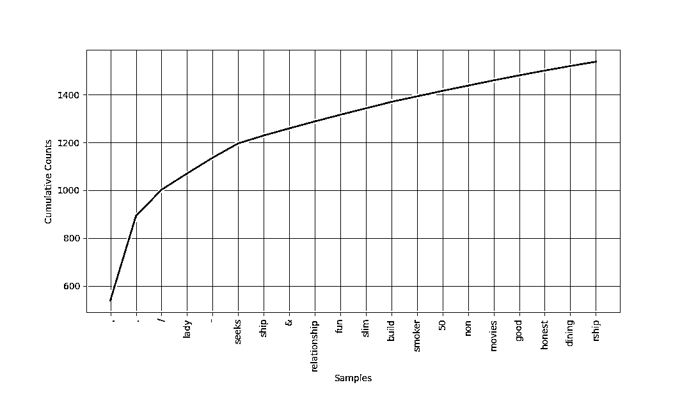

# 用 Python 的 NLTK 包进行自然语言处理

> 原文：<https://realpython.com/nltk-nlp-python/>

自然语言处理(NLP)是一个专注于让计算机程序能够使用自然人类语言的领域。 **NLTK** ，或者[自然语言工具包](https://www.nltk.org/)，是一个可以用于 NLP 的 Python 包。

您可能正在分析的许多数据是[非结构化数据](https://en.wikipedia.org/wiki/Unstructured_data)，并且包含人类可读的文本。在以编程方式分析数据之前，首先需要对其进行预处理。在本教程中，您将第一次看到使用 NLTK 可以完成的各种**文本预处理**任务，以便为在未来的项目中应用它们做好准备。你还将看到如何做一些基本的**文本分析**和创建**可视化**。

如果你熟悉使用 Python 的[基础，并且想尝试一些 NLP，那么你来对地方了。](https://realpython.com/products/python-basics-book/)

**本教程结束时，你将知道如何:**

*   **查找文本**进行分析
*   **预处理**您的文本以供分析
*   **分析**你的文字
*   基于您的分析创建**可视化效果**

我们去抓蟒蛇吧！

**免费下载:** [从《Python 基础:Python 3 实用入门》中获取一个示例章节](https://realpython.com/bonus/python-basics-sample-download/)，看看如何通过 Python 3.8 的最新完整课程从初级到中级学习 Python。

## Python 的 NLTK 入门

你需要做的第一件事是确保你已经安装了 Python。对于本教程，您将使用 Python 3.9。如果你还没有安装 Python，那么看看 [Python 3 安装&安装指南](https://realpython.com/installing-python/)开始吧。

一旦你解决了这个问题，你的下一步就是用 [`pip`](https://realpython.com/what-is-pip/) 来[安装 NLTK](https://www.nltk.org/install.html) 。最佳做法是将其安装在虚拟环境中。要了解更多关于虚拟环境的信息，请查看 [Python 虚拟环境:初级读本](https://realpython.com/python-virtual-environments-a-primer/)。

对于本教程，您将安装 3.5 版:

```py
$ python -m pip install nltk==3.5
```

为了给[命名实体识别](https://realpython.com/nltk-nlp-python/#using-named-entity-recognition-ner)创建可视化效果，你还需要安装 [NumPy](https://realpython.com/numpy-tutorial/) 和 [Matplotlib](https://realpython.com/python-matplotlib-guide/) :

```py
$ python -m pip install numpy matplotlib
```

如果你想知道更多关于`pip`是如何工作的，那么你可以看看[什么是 Pip？新蟒蛇指南](https://realpython.com/what-is-pip/)。你也可以看看关于[安装 NLTK 数据](https://www.nltk.org/data)的官方页面。

[*Remove ads*](/account/join/)

## 标记化

通过**标记**，你可以方便地按单词或句子拆分文本。这将允许您处理较小的文本片段，即使在文本其余部分的上下文之外，这些片段仍然相对连贯和有意义。这是你将非结构化数据转化为结构化数据的第一步，结构化数据更容易分析。

当你分析文本时，你会按单词和句子进行分词。以下是这两种类型的标记化带来的好处:

*   **以词来表征:**词就像自然语言的原子。它们是最小的意义单位，但它本身仍然有意义。按单词标记文本可以让您识别出现频率特别高的单词。例如，如果你正在分析一组招聘广告，那么你可能会发现“Python”这个词经常出现。这可能意味着对 Python 知识的高度需求，但是您需要更深入地了解更多。

*   **按句子分词:**当你按句子分词时，你可以分析那些单词是如何相互关联的，并看到更多的上下文。是不是因为招聘经理不喜欢 Python，所以“Python”这个词周围出现了很多负面词汇？来自[爬虫学](https://en.wikipedia.org/wiki/Herpetology)领域的术语是否比软件开发领域的多，这表明你可能正在处理一种完全不同于你预期的 [python](https://en.wikipedia.org/wiki/Pythonidae) ？

下面是如何[导入](https://realpython.com/absolute-vs-relative-python-imports/)NLTK 的相关部分，以便您可以按单词和句子进行标记:

>>>

```py
>>> from nltk.tokenize import sent_tokenize, word_tokenize
```

现在您已经导入了您需要的内容，您可以创建一个[字符串](https://realpython.com/python-strings/)来进行标记化。你可以引用一下 [*沙丘*](https://en.wikipedia.org/wiki/Dune_(novel)) 中的一句话:

>>>

```py
>>> example_string = """
... Muad'Dib learned rapidly because his first training was in how to learn.
... And the first lesson of all was the basic trust that he could learn.
... It's shocking to find how many people do not believe they can learn,
... and how many more believe learning to be difficult."""
```

您可以使用`sent_tokenize()`将`example_string`拆分成句子:

>>>

```py
>>> sent_tokenize(example_string)
["Muad'Dib learned rapidly because his first training was in how to learn.",
'And the first lesson of all was the basic trust that he could learn.',
"It's shocking to find how many people do not believe they can learn, and how many more believe learning to be difficult."]
```

按句子对`example_string`进行记号化会给你一个包含三个句子字符串的[列表](https://realpython.com/python-lists-tuples/):

1.  `"Muad'Dib learned rapidly because his first training was in how to learn."`
2.  `'And the first lesson of all was the basic trust that he could learn.'`
3.  `"It's shocking to find how many people do not believe they can learn, and how many more believe learning to be difficult."`

现在尝试用单词来标记`example_string`:

>>>

```py
>>> word_tokenize(example_string)
["Muad'Dib",
 'learned',
 'rapidly',
 'because',
 'his',
 'first',
 'training',
 'was',
 'in',
 'how',
 'to',
 'learn',
 '.',
 'And',
 'the',
 'first',
 'lesson',
 'of',
 'all',
 'was',
 'the',
 'basic',
 'trust',
 'that',
 'he',
 'could',
 'learn',
 '.',
 'It',
 "'s",
 'shocking',
 'to',
 'find',
 'how',
 'many',
 'people',
 'do',
 'not',
 'believe',
 'they',
 'can',
 'learn',
 ',',
 'and',
 'how',
 'many',
 'more',
 'believe',
 'learning',
 'to',
 'be',
 'difficult',
 '.']
```

您得到了 NLTK 认为是单词的字符串列表，例如:

*   `"Muad'Dib"`
*   `'training'`
*   `'how'`

但是下列字符串也被认为是单词:

*   `"'s"`
*   `','`
*   `'.'`

看看`"It's"`是如何在撇号处被分开给你`'It'`和`"'s"`，而`"Muad'Dib"`却是完整的？这是因为 NLTK 知道`'It'`和`"'s"`(“是”的缩写)是两个不同的单词，所以它将它们分开计数。但是`"Muad'Dib"`不像`"It's"`那样是一个公认的缩写，所以它不是作为两个独立的单词来读的，而是保持原样。

## 过滤停用词

**停用词**是你想忽略的词，所以你在处理的时候会把它们过滤掉。像`'in'`、`'is'`和`'an'`这样非常常见的词经常被用作停用词，因为它们本身并不会给文本增加很多意义。

下面是如何导入 NLTK 的相关部分以便过滤掉停用词:

>>>

```py
>>> nltk.download("stopwords")
>>> from nltk.corpus import stopwords
>>> from nltk.tokenize import word_tokenize
```

这里有一段来自 Worf 的[语录，你可以过滤一下:](https://www.youtube.com/watch?v=ri5S4Hcq0nY)

>>>

```py
>>> worf_quote = "Sir, I protest. I am not a merry man!"
```

现在用 word 对`worf_quote`进行标记，并将结果列表存储在`words_in_quote`中:

>>>

```py
>>> words_in_quote = word_tokenize(worf_quote)
>>> words_in_quote
['Sir', ',', 'protest', '.', 'merry', 'man', '!']
```

您在`worf_quote`中有一个单词列表，所以下一步是创建一个停用单词的[集合](https://realpython.com/python-sets/)来过滤`words_in_quote`。对于这个例子，你需要关注`"english"`中的停用词:

>>>

```py
>>> stop_words = set(stopwords.words("english"))
```

接下来，创建一个空列表来保存通过过滤器的单词:

>>>

```py
>>> filtered_list = []
```

您创建了一个空列表`filtered_list`，用来保存`words_in_quote`中所有非停用词的单词。现在你可以用`stop_words`来过滤`words_in_quote`:

>>>

```py
>>> for word in words_in_quote:
...    if word.casefold() not in stop_words:
...         filtered_list.append(word)
```

你用一个 [`for`循环](https://realpython.com/python-for-loop/)对`words_in_quote`进行迭代，并将所有非停用词的单词添加到`filtered_list`。您在`word`上使用了 [`.casefold()`](https://docs.python.org/3/library/stdtypes.html#str.casefold) ，因此您可以忽略`word`中的字母是大写还是小写。这是值得做的，因为`stopwords.words('english')`只包含小写版本的停用词。

或者，你可以使用[列表理解](https://realpython.com/list-comprehension-python/)来列出你文本中所有非停用词的单词:

>>>

```py
>>> filtered_list = [
...     word for word in words_in_quote if word.casefold() not in stop_words
... ]
```

当你使用列表理解时，你不会创建一个空列表，然后在它的末尾添加条目。相反，您可以同时定义列表及其内容。使用列表理解通常被认为是更为复杂的。

来看看最后出现在`filtered_list`的话:

>>>

```py
>>> filtered_list
['Sir', ',', 'protest', '.', 'merry', 'man', '!']
```

你过滤掉了几个像`'am'`、`'a'`这样的词，但是你也过滤掉了`'not'`，这确实影响了句子的整体意思。(Worf 对此不会高兴的。)

像`'I'`和`'not'`这样的词可能看起来太重要而不能过滤掉，取决于你想做什么样的分析，它们可能是。原因如下:

*   **`'I'`** 是代词，是语境词而不是实词:

    *   **内容词**给你关于文章主题的信息或者作者对这些主题的看法。

    *   上下文单词给你关于写作风格的信息。你可以观察作者使用上下文词汇的模式，以量化他们的写作风格。一旦你量化了他们的写作风格，你就可以分析一个未知作者写的文本，看看它有多接近特定的写作风格，这样你就可以试着确定作者是谁。

*   **`'not'`** 从技术上来说是[副词](https://www.merriam-webster.com/dictionary/not)，但仍然被列入了 [NLTK 的英语](https://www.nltk.org/nltk_data/)停用词列表。如果你想编辑停用词列表来排除`'not'`或者进行其他修改，那么你可以[下载](https://www.nltk.org/nltk_data/)。

因此，`'I'`和`'not'`可能是一个句子的重要部分，但这取决于你想从这个句子中学到什么。

[*Remove ads*](/account/join/)

## 词干

**词干化**是一项文本处理任务，在这项任务中，你将单词简化为它们的[词根](https://simple.wikipedia.org/wiki/Root_(linguistics))，词根是单词的核心部分。例如，单词“helping”和“helper”共用词根“help”。词干分析可以让你专注于一个单词的基本意思，而不是它用法的所有细节。NLTK 有[多个词干分析器](http://www.nltk.org/howto/stem.html)，但是你将使用[波特词干分析器](https://www.nltk.org/_modules/nltk/stem/porter.html)。

下面是如何导入 NLTK 的相关部分以便开始词干处理:

>>>

```py
>>> from nltk.stem import PorterStemmer
>>> from nltk.tokenize import word_tokenize
```

现在您已经完成了导入，您可以用`PorterStemmer()`创建一个词干分析器:

>>>

```py
>>> stemmer = PorterStemmer()
```

下一步是为你创建一个字符串。这里有一个你可以用的:

>>>

```py
>>> string_for_stemming = """
... The crew of the USS Discovery discovered many discoveries.
... Discovering is what explorers do."""
```

在对该字符串中的单词进行词干处理之前，您需要分隔该字符串中的所有单词:

>>>

```py
>>> words = word_tokenize(string_for_stemming)
```

现在您已经有了字符串中所有标记化单词的列表，看看`words`中有什么:

>>>

```py
>>> words
['The',
 'crew',
 'of',
 'the',
 'USS',
 'Discovery',
 'discovered',
 'many',
 'discoveries',
 '.',
 'Discovering',
 'is',
 'what',
 'explorers',
 'do',
 '.']
```

通过在列表理解中使用`stemmer.stem()`来创建`words`中单词的词干版本列表:

>>>

```py
>>> stemmed_words = [stemmer.stem(word) for word in words]
```

看看`stemmed_words`里有什么:

>>>

```py
>>> stemmed_words
['the',
 'crew',
 'of',
 'the',
 'uss',
 'discoveri',
 'discov',
 'mani',
 'discoveri',
 '.',
 'discov',
 'is',
 'what',
 'explor',
 'do',
 '.']
```

以下是所有以`'discov'`或`'Discov'`开头的单词的情况:

| 原始单词 | 词干版本 |
| --- | --- |
| `'Discovery'` | `'discoveri'` |
| `'discovered'` | `'discov'` |
| `'discoveries'` | `'discoveri'` |
| `'Discovering'` | `'discov'` |

这些结果看起来有点不一致。为什么`'Discovery'`会给你`'discoveri'`而`'Discovering'`会给你`'discov'`？

欠调和过调是词干可能出错的两种方式:

1.  当两个相关的单词应该简化为同一个词干，但却不是时，就会发生理解错误。这是一个[假阴性](https://en.wikipedia.org/wiki/False_positives_and_false_negatives#False_negative_error)。
2.  当两个不相关的单词被简化为同一个词干时，就会发生越界。这是一个[误报](https://en.wikipedia.org/wiki/False_positives_and_false_negatives#False_negative_error)。

[波特词干算法](https://tartarus.org/martin/PorterStemmer/)可以追溯到 1979 年，所以它有点老了。**雪球词干器**，也被称为 **Porter2** ，是对原版的改进，也可以通过 NLTK 获得，所以你可以在自己的项目中使用它。同样值得注意的是，Porter 词干分析器的目的不是生成完整的单词，而是查找单词的变体形式。

幸运的是，您有一些其他的方法将单词简化到它们的核心意思，比如 lemmatizing，您将在本教程的后面看到。但首先，我们需要涵盖词类。

[*Remove ads*](/account/join/)

## 标注词性

**词性**是一个语法术语，指的是当你在句子中一起使用这些词时，它们所扮演的角色。词性标注，或**词性标注**，是根据词性给文本中的单词加标签的任务。

在英语中，有八种词性:

| 词性 | 作用 | 例子 |
| --- | --- | --- |
| 名词 | 是一个人、一个地方或一件事物 | 波兰百吉饼山 |
| 代词 | 代替名词 | 你，她，我们 |
| 形容词 | 给出关于名词的信息 | 高效、多风、多彩 |
| 动词 | 是一种行为或存在的状态 | 学习，是，去 |
| 副词 | 给出一个动词、一个形容词或另一个副词的信息 | 高效，总是，非常 |
| 介词 | 给出一个名词或代词如何与另一个词连接的信息 | 从，大约，在 |
| 结合 | 连接另外两个单词或短语 | 所以，因为，而且 |
| 感叹词 | 是一个感叹词 | 耶，噢，哇 |

一些资料还将类别**冠词**(如“a”或“the”)包括在词类列表中，但其他资料认为它们是形容词。NLTK 使用单词**限定词**来指代文章。

下面是如何导入 NLTK 的相关部分以便标记词性:

>>>

```py
>>> from nltk.tokenize import word_tokenize
```

现在创建一些文本来标记。你可以用这个[卡尔·萨根的名言](https://www.youtube.com/watch?v=5_vVGPy4-rc):

>>>

```py
>>> sagan_quote = """
... If you wish to make an apple pie from scratch,
... you must first invent the universe."""
```

使用`word_tokenize`来分隔字符串中的单词，并将它们存储在一个列表中:

>>>

```py
>>> words_in_sagan_quote = word_tokenize(sagan_quote)
```

现在在你的新单词列表上调用`nltk.pos_tag()`:

>>>

```py
>>> import nltk
>>> nltk.pos_tag(words_in_sagan_quote)
[('If', 'IN'),
 ('you', 'PRP'),
 ('wish', 'VBP'),
 ('to', 'TO'),
 ('make', 'VB'),
 ('an', 'DT'),
 ('apple', 'NN'),
 ('pie', 'NN'),
 ('from', 'IN'),
 ('scratch', 'NN'),
 (',', ','),
 ('you', 'PRP'),
 ('must', 'MD'),
 ('first', 'VB'),
 ('invent', 'VB'),
 ('the', 'DT'),
 ('universe', 'NN'),
 ('.', '.')]
```

引用中的所有单词现在都在一个单独的[元组](https://realpython.com/python-lists-tuples/)中，用一个标签表示它们的词性。但是标签是什么意思呢？以下是获取标签及其含义列表的方法:

>>>

```py
>>> nltk.help.upenn_tagset()
```

这个列表很长，但是请随意展开下面的框来查看。


以下是 POS 标签及其含义的列表:

>>>

```py
>>> nltk.help.upenn_tagset()
$: dollar
 $ -$ --$ A$ C$ HK$ M$ NZ$ S$ U.S.$ US$
'': closing quotation mark
 ' ''
(: opening parenthesis
 ( [ {
): closing parenthesis
 ) ] }
,: comma
 ,
--: dash
 --
.: sentence terminator
 . ! ?
:: colon or ellipsis
 : ; ...
CC: conjunction, coordinating
 & 'n and both but either et for less minus neither nor or plus so
 therefore times v. versus vs. whether yet
CD: numeral, cardinal
 mid-1890 nine-thirty forty-two one-tenth ten million 0.5 one forty-
 seven 1987 twenty '79 zero two 78-degrees eighty-four IX '60s .025
 fifteen 271,124 dozen quintillion DM2,000 ...
DT: determiner
 all an another any both del each either every half la many much nary
 neither no some such that the them these this those
EX: existential there
 there
FW: foreign word
 gemeinschaft hund ich jeux habeas Haementeria Herr K'ang-si vous
 lutihaw alai je jour objets salutaris fille quibusdam pas trop Monte
 terram fiche oui corporis ...
IN: preposition or conjunction, subordinating
 astride among uppon whether out inside pro despite on by throughout
 below within for towards near behind atop around if like until below
 next into if beside ...
JJ: adjective or numeral, ordinal
 third ill-mannered pre-war regrettable oiled calamitous first separable
 ectoplasmic battery-powered participatory fourth still-to-be-named
 multilingual multi-disciplinary ...
JJR: adjective, comparative
 bleaker braver breezier briefer brighter brisker broader bumper busier
 calmer cheaper choosier cleaner clearer closer colder commoner costlier
 cozier creamier crunchier cuter ...
JJS: adjective, superlative
 calmest cheapest choicest classiest cleanest clearest closest commonest
 corniest costliest crassest creepiest crudest cutest darkest deadliest
 dearest deepest densest dinkiest ...
LS: list item marker
 A A. B B. C C. D E F First G H I J K One SP-44001 SP-44002 SP-44005
 SP-44007 Second Third Three Two * a b c d first five four one six three
 two
MD: modal auxiliary
 can cannot could couldn't dare may might must need ought shall should
 shouldn't will would
NN: noun, common, singular or mass
 common-carrier cabbage knuckle-duster Casino afghan shed thermostat
 investment slide humour falloff slick wind hyena override subhumanity
 machinist ...
NNP: noun, proper, singular
 Motown Venneboerger Czestochwa Ranzer Conchita Trumplane Christos
 Oceanside Escobar Kreisler Sawyer Cougar Yvette Ervin ODI Darryl CTCA
 Shannon A.K.C. Meltex Liverpool ...
NNPS: noun, proper, plural
 Americans Americas Amharas Amityvilles Amusements Anarcho-Syndicalists
 Andalusians Andes Andruses Angels Animals Anthony Antilles Antiques
 Apache Apaches Apocrypha ...
NNS: noun, common, plural
 undergraduates scotches bric-a-brac products bodyguards facets coasts
 divestitures storehouses designs clubs fragrances averages
 subjectivists apprehensions muses factory-jobs ...
PDT: pre-determiner
 all both half many quite such sure this
POS: genitive marker
 ' 's
PRP: pronoun, personal
 hers herself him himself hisself it itself me myself one oneself ours
 ourselves ownself self she thee theirs them themselves they thou thy us
PRP$: pronoun, possessive
 her his mine my our ours their thy your
RB: adverb
 occasionally unabatingly maddeningly adventurously professedly
 stirringly prominently technologically magisterially predominately
 swiftly fiscally pitilessly ...
RBR: adverb, comparative
 further gloomier grander graver greater grimmer harder harsher
 healthier heavier higher however larger later leaner lengthier less-
 perfectly lesser lonelier longer louder lower more ...
RBS: adverb, superlative
 best biggest bluntest earliest farthest first furthest hardest
 heartiest highest largest least less most nearest second tightest worst
RP: particle
 aboard about across along apart around aside at away back before behind
 by crop down ever fast for forth from go high i.e. in into just later
 low more off on open out over per pie raising start teeth that through
 under unto up up-pp upon whole with you
SYM: symbol
 % & ' '' ''. ) ). * + ,. < = > @ A[fj] U.S U.S.S.R * ** ***
TO: "to" as preposition or infinitive marker
 to
UH: interjection
 Goodbye Goody Gosh Wow Jeepers Jee-sus Hubba Hey Kee-reist Oops amen
 huh howdy uh dammit whammo shucks heck anyways whodunnit honey golly
 man baby diddle hush sonuvabitch ...
VB: verb, base form
 ask assemble assess assign assume atone attention avoid bake balkanize
 bank begin behold believe bend benefit bevel beware bless boil bomb
 boost brace break bring broil brush build ...
VBD: verb, past tense
 dipped pleaded swiped regummed soaked tidied convened halted registered
 cushioned exacted snubbed strode aimed adopted belied figgered
 speculated wore appreciated contemplated ...
VBG: verb, present participle or gerund
 telegraphing stirring focusing angering judging stalling lactating
 hankerin' alleging veering capping approaching traveling besieging
 encrypting interrupting erasing wincing ...
VBN: verb, past participle
 multihulled dilapidated aerosolized chaired languished panelized used
 experimented flourished imitated reunifed factored condensed sheared
 unsettled primed dubbed desired ...
VBP: verb, present tense, not 3rd person singular
 predominate wrap resort sue twist spill cure lengthen brush terminate
 appear tend stray glisten obtain comprise detest tease attract
 emphasize mold postpone sever return wag ...
VBZ: verb, present tense, 3rd person singular
 bases reconstructs marks mixes displeases seals carps weaves snatches
 slumps stretches authorizes smolders pictures emerges stockpiles
 seduces fizzes uses bolsters slaps speaks pleads ...
WDT: WH-determiner
 that what whatever which whichever
WP: WH-pronoun
 that what whatever whatsoever which who whom whosoever
WP$: WH-pronoun, possessive
 whose
WRB: Wh-adverb
 how however whence whenever where whereby whereever wherein whereof why
``: opening quotation mark
```

这需要理解很多，但幸运的是，有一些模式可以帮助你记住什么是什么。

这里有一个总结，您可以使用它来开始使用 NLTK 的 POS 标签:

| 以下列开头的标签 | 处理 |
| --- | --- |
| `JJ` | 形容词 |
| `NN` | 名词 |
| `RB` | 副词 |
| `PRP` | 代词 |
| `VB` | 动词 |

现在您已经知道了 POS 标签的含义，您可以看到您的标签相当成功:

*   `'pie'`被标记为`NN`,因为它是单数名词。
*   `'you'`被加上了`PRP`的标签，因为它是一个人称代词。
*   `'invent'`被标记为`VB`,因为它是动词的基本形式。

但是 NLTK 如何处理基本上是乱码的文本中的词性标注呢？《贾巴沃克》是一首[的无厘头诗](https://en.wikipedia.org/wiki/Nonsense_verse)，从技术上来说没有太多意义，但仍然以一种能向说英语的人传达某种意义的方式来写。

制作一个字符串来保存这首诗的摘录:

>>>

```py
>>> jabberwocky_excerpt = """
... 'Twas brillig, and the slithy toves did gyre and gimble in the wabe:
... all mimsy were the borogoves, and the mome raths outgrabe."""
```

使用`word_tokenize`来分隔摘录中的单词，并将它们存储在列表中:

>>>

```py
>>> words_in_excerpt = word_tokenize(jabberwocky_excerpt)
```

在您的新单词列表中调用`nltk.pos_tag()`:

>>>

```py
>>> nltk.pos_tag(words_in_excerpt)
[("'T", 'NN'),
 ('was', 'VBD'),
 ('brillig', 'VBN'),
 (',', ','),
 ('and', 'CC'),
 ('the', 'DT'),
 ('slithy', 'JJ'),
 ('toves', 'NNS'),
 ('did', 'VBD'),
 ('gyre', 'NN'),
 ('and', 'CC'),
 ('gimble', 'JJ'),
 ('in', 'IN'),
 ('the', 'DT'),
 ('wabe', 'NN'),
 (':', ':'),
 ('all', 'DT'),
 ('mimsy', 'NNS'),
 ('were', 'VBD'),
 ('the', 'DT'),
 ('borogoves', 'NNS'),
 (',', ','),
 ('and', 'CC'),
 ('the', 'DT'),
 ('mome', 'JJ'),
 ('raths', 'NNS'),
 ('outgrabe', 'RB'),
 ('.', '.')]
```

像`'and'`和`'the'`这样被接受的英语单词分别被正确地标记为连接词和限定词。胡言乱语的单词`'slithy'`被标记为形容词，这也是一个说英语的人从这首诗的上下文中可能会想到的。好样的，NLTK！

[*Remove ads*](/account/join/)

## 引理化

现在您已经熟悉了词类，可以回到词汇化了。像词干一样，**词汇化**将单词简化到它们的核心意思，但它会给你一个完整的英语单词，而不是像`'discoveri'`一样只是一个单词的片段。

**注:**一个**引理**是一个词，代表一整组词，这组词称为一个**义素**。

例如，如果您要在字典中查找[单词“blending”，那么您需要查找“blend”的条目，但是您会在该条目中找到“blending”。](https://www.merriam-webster.com/dictionary/blending)

在这个例子中，“blend”是**词条**，而“blending”是**词素**的一部分。所以，当你把一个词词条化时，你是在把它简化成它的词条。

下面是如何导入 NLTK 的相关部分，以便开始 lemmatizing:

>>>

```py
>>> from nltk.stem import WordNetLemmatizer
```

创建一个要使用的 lemmatizer:

>>>

```py
>>> lemmatizer = WordNetLemmatizer()
```

让我们从一个复数名词的词汇化开始:

>>>

```py
>>> lemmatizer.lemmatize("scarves")
'scarf'
```

`"scarves"`给了你`'scarf'`，所以这已经比你用波特梗器`'scarv'`得到的要复杂一点了。接下来，创建一个包含多个单词的字符串进行词汇化:

>>>

```py
>>> string_for_lemmatizing = "The friends of DeSoto love scarves."
```

现在按单词标记字符串:

>>>

```py
>>> words = word_tokenize(string_for_lemmatizing)
```

这是你的单词列表:

>>>

```py
>>> words
['The',
 'friends',
 'of',
 'DeSoto',
 'love'
 'scarves',
 '.']
```

创建一个列表，包含`words`中已被词条化的所有单词:

>>>

```py
>>> lemmatized_words = [lemmatizer.lemmatize(word) for word in words]
```

这是你得到的列表:

>>>

```py
>>> lemmatized_words
['The',
 'friend',
 'of',
 'DeSoto',
 'love',
 'scarf',
 '.'
```

看起来没错。复数`'friends'`和`'scarves'`变成了单数`'friend'`和`'scarf'`。

但是如果你把一个看起来和它的引理很不一样的单词进行引理化会发生什么呢？尝试将`"worst"`词汇化:

>>>

```py
>>> lemmatizer.lemmatize("worst")
'worst'
```

您得到结果`'worst'`，因为`lemmatizer.lemmatize()`假设 [`"worst"`是一个名词](https://www.merriam-webster.com/dictionary/worst)。你可以明确表示你希望`"worst"`是一个形容词:

>>>

```py
>>> lemmatizer.lemmatize("worst", pos="a")
'bad'
```

`pos`的默认参数是名词的`'n'`，但是您通过添加参数`pos="a"`确保了将`"worst"`视为形容词。结果，你得到了`'bad'`，它看起来和你原来的单词非常不同，和你词干化后得到的完全不同。这是因为`"worst"`是形容词`'bad'`的[最高级](https://www.merriam-webster.com/dictionary/superlative)形式，词汇化减少了最高级以及[对其词汇的比较级](https://www.merriam-webster.com/dictionary/comparative)。

既然您已经知道了如何使用 NLTK 来标记词性，那么您可以尝试在对单词进行词条化之前对其进行标记，以避免混淆[同形异义词](https://en.wikipedia.org/wiki/Homograph)，或者拼写相同但含义不同且可能是不同词性的单词。

[*Remove ads*](/account/join/)

## 分块

虽然分词可以让你识别单词和句子，但是分块可以让你识别 T2 短语。

**注意:****短语**是一个单词或一组单词，作为一个单独的单元来执行语法功能。**名词短语**是围绕一个名词构建的。

以下是一些例子:

*   “一颗行星”
*   “倾斜的星球”
*   “一颗快速倾斜的行星”

组块利用词性标签对单词进行分组，并将组块标签应用于这些组。组块不重叠，所以一个单词的一个实例一次只能在一个组块中。

下面是如何导入 NLTK 的相关部分以便分块:

>>>

```py
>>> from nltk.tokenize import word_tokenize
```

在进行组块之前，您需要确保文本中的词性已被标记，因此创建一个用于词性标记的字符串。你可以引用《指环王》[](https://en.wikipedia.org/wiki/The_Lord_of_the_Rings)*中的这句话:*

*>>>

```py
>>> lotr_quote = "It's a dangerous business, Frodo, going out your door."
```

现在按单词标记字符串:

>>>

```py
>>> words_in_lotr_quote = word_tokenize(lotr_quote)
>>> words_in_lotr_quote
['It',
 "'s",
 'a',
 'dangerous',
 'business',
 ',',
 'Frodo',
 ',',
 'going',
 'out',
 'your',
 'door',
 '.']
```

现在你已经得到了`lotr_quote`中所有单词的列表。

下一步是按词性标记这些单词:

>>>

```py
>>> nltk.download("averaged_perceptron_tagger")
>>> lotr_pos_tags = nltk.pos_tag(words_in_lotr_quote)
>>> lotr_pos_tags
[('It', 'PRP'),
 ("'s", 'VBZ'),
 ('a', 'DT'),
 ('dangerous', 'JJ'),
 ('business', 'NN'),
 (',', ','),
 ('Frodo', 'NNP'),
 (',', ','),
 ('going', 'VBG'),
 ('out', 'RP'),
 ('your', 'PRP$'),
 ('door', 'NN'),
 ('.', '.')]
```

您已经得到了一个引用中所有单词的元组列表，以及它们的 POS 标签。为了组块，你首先需要定义一个组块语法。

**注意:****组块语法**是关于句子应该如何被组块的规则的组合。它经常使用[正则表达式](https://realpython.com/regex-python/)，或者**正则表达式**。

对于本教程，你不需要知道正则表达式是如何工作的，但如果你想处理文本，它们将来肯定会派上用场。

使用一个正则表达式规则创建块语法:

>>>

```py
>>> grammar = "NP: {<DT>?<JJ>*<NN>}"
```

`NP`代表名词短语。你可以在*自然语言处理的[第 7 章](https://www.nltk.org/book/ch07.html#noun-phrase-chunking)中了解更多关于**名词短语分块**的信息——使用自然语言工具包*分析文本。

根据您创建的规则，您的组块:

1.  从可选(`?`)限定词(`'DT'`)开始
2.  可以有任意数量(`*`)的形容词(`JJ`)
3.  以名词(`<NN>`)结尾

使用以下语法创建一个**块解析器**:

>>>

```py
>>> chunk_parser = nltk.RegexpParser(grammar)
```

现在试着引用你的话:

>>>

```py
>>> tree = chunk_parser.parse(lotr_pos_tags)
```

下面是这棵树的可视化展示:

>>>

```py
>>> tree.draw()
```

这是视觉表现的样子:

[](https://files.realpython.com/media/lotr_tree.7588d4620a3d.jpg)

你有两个名词短语:

1.  **`'a dangerous business'`** 有限定词、形容词和名词。
2.  **`'door'`** 只是一个名词。

现在你知道了组块，是时候看看 chinking 了。

[*Remove ads*](/account/join/)

## 叮当声

Chinking 与 chunking 一起使用，但是当 chunking 用于包含模式时， **chinking** 用于排除模式。

让我们重复使用你在分块部分使用的引用。您已经有一个元组列表，其中包含引用中的每个单词及其词性标记:

>>>

```py
>>> lotr_pos_tags
[('It', 'PRP'),
 ("'s", 'VBZ'),
 ('a', 'DT'),
 ('dangerous', 'JJ'),
 ('business', 'NN'),
 (',', ','),
 ('Frodo', 'NNP'),
 (',', ','),
 ('going', 'VBG'),
 ('out', 'RP'),
 ('your', 'PRP$'),
 ('door', 'NN'),
 ('.', '.')]
```

下一步是创建一个语法来确定你想要在你的组块中包含和排除什么。这一次，您将使用不止一行，因为您将有不止一条规则。因为你使用了不止一行的语法，你将使用三重引号(`"""`):

>>>

```py
>>> grammar = """
... Chunk: {<.*>+}
...        }<JJ>{"""
```

你语法的第一条规则是`{<.*>+}`。这条规则有向内的花括号(`{}`)，因为它用来决定你想在你的块中包含什么样的模式。在这种情况下，你想包括一切:`<.*>+`。

你语法的第二条规则是`}<JJ>{`。这条规则有面向外的花括号(`}{`)，因为它用于确定您想要在块中排除哪些模式。在这种情况下，你要排除形容词:`<JJ>`。

使用以下语法创建块解析器:

>>>

```py
>>> chunk_parser = nltk.RegexpParser(grammar)
```

现在把你的句子用你指定的缝隙拼起来:

>>>

```py
>>> tree = chunk_parser.parse(lotr_pos_tags)
```

结果你得到了这棵树:

>>>

```py
>>> tree
Tree('S', [Tree('Chunk', [('It', 'PRP'), ("'s", 'VBZ'), ('a', 'DT')]), ('dangerous', 'JJ'), Tree('Chunk', [('business', 'NN'), (',', ','), ('Frodo', 'NNP'), (',', ','), ('going', 'VBG'), ('out', 'RP'), ('your', 'PRP$'), ('door', 'NN'), ('.', '.')])])
```

在这种情况下，`('dangerous', 'JJ')`被排除在组块之外，因为它是一个形容词(`JJ`)。但是，如果你再次得到一个图形表示，那就更容易看到了:

>>>

```py
>>> tree.draw()
```

你得到了这个`tree`的可视化表示:

[](https://files.realpython.com/media/chinking.f731be30df2b.jpg)

这里，你已经把形容词`'dangerous'`从你的组块中排除了，剩下两个包含其他所有东西的组块。第一个块包含出现在被排除的形容词之前的所有文本。第二个块包含形容词之后被排除的所有内容。

既然你已经知道如何从你的组块中排除模式，是时候研究命名实体识别(NER)了。

[*Remove ads*](/account/join/)

## 使用命名实体识别(NER)

**命名实体**是指特定地点、人员、组织等的名词短语。通过**命名实体识别**，你可以在你的文本中找到命名实体，并确定它们是哪种命名实体。

下面是来自 [NLTK 书籍](https://www.nltk.org/book/ch07.html#sec-ner)的命名实体类型列表:

| newtype(新类型) | 例子 |
| --- | --- |
| 组织 | 世卫组织佐治亚太平洋公司 |
| 人 | 艾迪·邦特，奥巴马总统 |
| 位置 | 珠穆朗玛峰，墨累河 |
| 日期 | 2008 年 6 月 29 日 |
| 时间 | 凌晨两点五十，下午一点半 |
| 钱 | 1.75 亿加元，10.40 英镑 |
| 百分比 | 百分之二十，18.75 % |
| 设备 | 巨石阵华盛顿纪念碑 |
| GPE | 东南亚，中洛锡安 |

您可以使用`nltk.ne_chunk()`来识别命名实体。让我们再次使用`lotr_pos_tags`来测试一下:

>>>

```py
>>> nltk.download("maxent_ne_chunker")
>>> nltk.download("words")
>>> tree = nltk.ne_chunk(lotr_pos_tags)
```

现在来看看视觉表现:

>>>

```py
>>> tree.draw()
```

以下是您得到的结果:

[](https://files.realpython.com/media/frodo_person.56bb306284f6.jpg)

看看`Frodo`是怎么被贴上`PERSON`标签的？如果您只想知道命名实体是什么，但不想知道它们是哪种命名实体，您也可以选择使用参数`binary=True`:

>>>

```py
>>> tree = nltk.ne_chunk(lotr_pos_tags, binary=True)
>>> tree.draw()
```

现在你所看到的是`Frodo`是一个`NE`:

[](https://files.realpython.com/media/frodo_ne.83c55460f7f6.jpg)

这就是你如何识别命名实体！但是您可以更进一步，直接从文本中提取命名实体。创建从中提取命名实体的字符串。你可以用这句话引自[](https://en.wikipedia.org/wiki/The_War_of_the_Worlds)*:*

*>>>

```py
>>> quote = """
... Men like Schiaparelli watched the red planet—it is odd, by-the-bye, that
... for countless centuries Mars has been the star of war—but failed to
... interpret the fluctuating appearances of the markings they mapped so well.
... All that time the Martians must have been getting ready.
... ... During the opposition of 1894 a great light was seen on the illuminated
... part of the disk, first at the Lick Observatory, then by Perrotin of Nice,
... and then by other observers. English readers heard of it first in the
... issue of Nature dated August 2."""
```

现在创建一个函数来提取命名实体:

>>>

```py
>>> def extract_ne(quote):
...     words = word_tokenize(quote, language=language)
...     tags = nltk.pos_tag(words)
...     tree = nltk.ne_chunk(tags, binary=True)
...     return set(
...         " ".join(i[0] for i in t)
...         for t in tree
...         if hasattr(t, "label") and t.label() == "NE"
...     )
```

使用这个函数，您可以收集所有命名的实体，没有重复。为了做到这一点，您按单词进行标记，对这些单词应用词性标记，然后根据这些标记提取命名实体。因为您包含了`binary=True`，您将获得的命名实体将不会被更具体地标记。你只会知道它们是被命名的实体。

看看你提取的信息:

>>>

```py
>>> extract_ne(quote)
{'Lick Observatory', 'Mars', 'Nature', 'Perrotin', 'Schiaparelli'}
```

你错过了尼斯这个城市，可能是因为 NLTK 把它解释成了一个普通的英语形容词，但是你仍然得到了下面这个:

*   **某机构:** `'Lick Observatory'`
*   **一颗星球:** `'Mars'`
*   **某刊物:** `'Nature'`
*   **人:** `'Perrotin'`，`'Schiaparelli'`

那是一些相当不错的品种！

[*Remove ads*](/account/join/)

## 获取要分析的文本

现在，您已经用小的示例文本完成了一些文本处理任务，您已经准备好一次分析一堆文本了。一组文本被称为**语料库**。NLTK 提供了几个**语料库**，涵盖了从[古腾堡项目](https://www.gutenberg.org/)主办的小说到美国总统就职演说的一切。

为了分析 NLTK 中的文本，您首先需要导入它们。这需要`nltk.download("book")`，这是一个相当大的下载:

>>>

```py
>>> nltk.download("book")
>>> from nltk.book import *
*** Introductory Examples for the NLTK Book ***
Loading text1, ..., text9 and sent1, ..., sent9
Type the name of the text or sentence to view it.
Type: 'texts()' or 'sents()' to list the materials.
text1: Moby Dick by Herman Melville 1851
text2: Sense and Sensibility by Jane Austen 1811
text3: The Book of Genesis
text4: Inaugural Address Corpus
text5: Chat Corpus
text6: Monty Python and the Holy Grail
text7: Wall Street Journal
text8: Personals Corpus
text9: The Man Who Was Thursday by G . K . Chesterton 1908
```

您现在可以访问一些线性文本(如*理智与情感*和*巨蟒和圣杯*)以及一些文本组(如聊天语料库和个人语料库)。人类的本性是迷人的，所以让我们看看我们能通过仔细查看个人语料库发现什么！

这个语料库是一个[征友广告](https://en.wikipedia.org/wiki/Personal_advertisement)的集合，它是在线约会的早期版本。如果你想结识某人，那么你可以在报纸上登广告，然后等待其他读者回复你。

如果你想学习如何获取其他文本进行分析，那么你可以查看*的第三章用 Python 自然语言处理——用自然语言工具包*分析文本。

## 使用索引

当你使用**索引**时，你可以看到一个单词的每次使用，以及它的直接上下文。这可以让你窥见一个单词在句子中是如何使用的，以及有哪些单词与它一起使用。

让我们看看这些寻找爱情的好人有什么话要说！个人语料库名为`text8`，因此我们将使用参数`"man"`对其调用`.concordance()`:

>>>

```py
>>> text8.concordance("man")
Displaying 14 of 14 matches:
 to hearing from you all . ABLE young man seeks , sexy older women . Phone for
ble relationship . GENUINE ATTRACTIVE MAN 40 y . o ., no ties , secure , 5 ft .
ship , and quality times . VIETNAMESE MAN Single , never married , financially
ip . WELL DRESSED emotionally healthy man 37 like to meet full figured woman fo
 nth subs LIKE TO BE MISTRESS of YOUR MAN like to be treated well . Bold DTE no
eeks lady in similar position MARRIED MAN 50 , attrac . fit , seeks lady 40 - 5
eks nice girl 25 - 30 serious rship . Man 46 attractive fit , assertive , and k
 40 - 50 sought by Aussie mid 40s b / man f / ship r / ship LOVE to meet widowe
discreet times . Sth E Subs . MARRIED MAN 42yo 6ft , fit , seeks Lady for discr
woman , seeks professional , employed man , with interests in theatre , dining
 tall and of large build seeks a good man . I am a nonsmoker , social drinker ,
lead to relationship . SEEKING HONEST MAN I am 41 y . o ., 5 ft . 4 , med . bui
 quiet times . Seeks 35 - 45 , honest man with good SOH & similar interests , f
 genuine , caring , honest and normal man for fship , poss rship . S / S , S /
```

有趣的是，这 14 个匹配中的最后 3 个与寻找一个诚实的人有关，具体来说:

1.  `SEEKING HONEST MAN`
2.  `Seeks 35 - 45 , honest man with good SOH & similar interests`
3.  `genuine , caring , honest and normal man for fship , poss rship`

让我们看看单词`"woman"`是否有类似的模式:

>>>

```py
>>> text8.concordance("woman")
Displaying 11 of 11 matches:
at home . Seeking an honest , caring woman , slim or med . build , who enjoys t
thy man 37 like to meet full figured woman for relationship . 48 slim , shy , S
rry . MALE 58 years old . Is there a Woman who would like to spend 1 weekend a
 other interests . Seeking Christian Woman for fship , view to rship . SWM 45 D
ALE 60 - burly beared seeks intimate woman for outings n / s s / d F / ston / P
ington . SCORPIO 47 seeks passionate woman for discreet intimate encounters SEX
le dad . 42 , East sub . 5 " 9 seeks woman 30 + for f / ship relationship TALL
personal trainer looking for married woman age open for fun MARRIED Dark guy 37
rinker , seeking slim - medium build woman who is happy in life , age open . AC
. O . TERTIARY Educated professional woman , seeks professional , employed man
 real romantic , age 50 - 65 y . o . WOMAN OF SUBSTANCE 56 , 59 kg ., 50 , fit
```

诚实的问题只在第一场比赛中出现:

```py
Seeking an honest , caring woman , slim or med . build
```

搜索一个带有索引的语料库不会给你完整的图像，但是偷看一眼，看看是否有什么突出的东西仍然是有趣的。

## 制作散布图

你可以使用**离差图**来查看某个特定单词出现的次数和出现的位置。到目前为止，我们已经寻找了`"man"`和`"woman"`，但是看看这些单词相对于它们的同义词使用了多少会很有趣:

>>>

```py
>>> text8.dispersion_plot(
...     ["woman", "lady", "girl", "gal", "man", "gentleman", "boy", "guy"]
... )
```

这是你得到的离差图:

[](https://files.realpython.com/media/dispersion-plot.609e2e61b885.png)

每条垂直的蓝线代表一个单词的一个实例。每一行水平的蓝线代表整个语料库。该图表明:

*   `"lady"`比`"woman"`或`"girl"`用得多。没有`"gal"`的实例。
*   `"man"`和`"guy"`被使用的次数相似，比`"gentleman"`或`"boy"`更常见。

当您想要查看单词在文本或语料库中出现的位置时，可以使用离差图。如果您正在分析单个文本，这可以帮助您查看哪些单词出现在彼此附近。如果你正在分析一个按时间顺序组织的文本语料库，它可以帮助你看到哪些单词在一段时间内使用得多或少。

停留在言情这个主题上，看看给*理智与情感*也就是`text2`做一个分散剧情能发现什么。简·奥斯汀的小说讲了很多人的家，所以用几个家的名字做一个分散情节:

>>>

```py
>>> text2.dispersion_plot(["Allenham", "Whitwell", "Cleveland", "Combe"])
```

这是你得到的图:

[](https://files.realpython.com/media/homes-dispersion-plot.c89fcb3954ec.png)

显然，在小说的前三分之一中，艾伦汉姆被提到了很多，但之后就没怎么出现了。另一方面，克利夫兰在前三分之二几乎没有出现，但在后三分之一出现了不少。这种分布反映了[玛丽安](https://en.wikipedia.org/wiki/Marianne_Dashwood)和[威洛比](https://en.wikipedia.org/wiki/John_Willoughby)之间关系的变化:

*   艾伦汉姆是威洛比的恩人的家，当玛丽安第一次对他感兴趣时，他经常出现。
*   克利夫兰是玛丽安去伦敦看望威洛比并遇到麻烦后住的地方。

离差图只是文本数据的一种可视化形式。下一个你要看的是频率分布。

[*Remove ads*](/account/join/)

## 进行频率分布

有了**频率分布**，你可以检查哪些单词在你的文本中出现的频率最高。你需要从`import`开始:

>>>

```py
>>> from nltk import FreqDist
```

[`FreqDist`](https://github.com/nltk/nltk/blob/1805fe870635afb7ef16d4ff5373e1c3d97c9107/nltk/probability.py#L61) 是`collections.Counter`的子类。以下是如何创建整个个人广告语料库的频率分布:

>>>

```py
>>> frequency_distribution = FreqDist(text8)
>>> print(frequency_distribution)
<FreqDist with 1108 samples and 4867 outcomes>
```

由于`1108`样本和`4867`结果是大量的信息，开始缩小范围。下面是如何查看`20`语料库中最常见的单词:

>>>

```py
>>> frequency_distribution.most_common(20)
[(',', 539),
 ('.', 353),
 ('/', 110),
 ('for', 99),
 ('and', 74),
 ('to', 74),
 ('lady', 68),
 ('-', 66),
 ('seeks', 60),
 ('a', 52),
 ('with', 44),
 ('S', 36),
 ('ship', 33),
 ('&', 30),
 ('relationship', 29),
 ('fun', 28),
 ('in', 27),
 ('slim', 27),
 ('build', 27),
 ('o', 26)]
```

你的词频分布中有很多停用词，但是你可以像之前做的那样删除它们。创建`text8`中所有非停用词的列表:

>>>

```py
>>> meaningful_words = [
...     word for word in text8 if word.casefold() not in stop_words
... ]
```

既然你已经有了语料库中所有非停用词的列表，那么做一个频率分布图:

>>>

```py
>>> frequency_distribution = FreqDist(meaningful_words)
```

看一看`20`最常见的单词:

>>>

```py
>>> frequency_distribution.most_common(20)
[(',', 539),
 ('.', 353),
 ('/', 110),
 ('lady', 68),
 ('-', 66),
 ('seeks', 60),
 ('ship', 33),
 ('&', 30),
 ('relationship', 29),
 ('fun', 28),
 ('slim', 27),
 ('build', 27),
 ('smoker', 23),
 ('50', 23),
 ('non', 22),
 ('movies', 22),
 ('good', 21),
 ('honest', 20),
 ('dining', 19),
 ('rship', 18)]
```

你可以把这个列表变成一个图表:

>>>

```py
>>> frequency_distribution.plot(20, cumulative=True)
```

这是你得到的图表:

[](https://files.realpython.com/media/freq-dist.1812fe36b438.png)

一些最常见的单词是:

*   `'lady'`
*   `'seeks'`
*   `'ship'`
*   `'relationship'`
*   `'fun'`
*   `'slim'`
*   `'build'`
*   `'smoker'`
*   `'50'`
*   `'non'`
*   `'movies'`
*   `'good'`
*   `'honest'`

从你已经了解到的写这些征友广告的人的情况来看，他们似乎对诚实感兴趣，并且经常使用这个词。此外，`'slim'`和`'build'`都出现了相同的次数。当你学习[索引](https://realpython.com/nltk-nlp-python/#using-a-concordance)时，你看到了`slim`和`build`在彼此附近使用，所以这两个词可能在这个语料库中经常一起使用。这就给我们带来了搭配！

[*Remove ads*](/account/join/)

## 寻找搭配

搭配是一系列经常出现的单词。如果你对英语中的常见搭配感兴趣，那么你可以查看一下[*《BBI 英语单词组合词典》*](https://realpython.com/asins/902723261X/) 。这是一个方便的参考，你可以用它来帮助你确保你的写作是地道的。以下是一些使用单词“tree”的搭配示例:

*   语法树
*   系谱图
*   决策图表

要查看语料库中经常出现的成对单词，您需要对其调用`.collocations()`:

>>>

```py
>>> text8.collocations()
would like; medium build; social drinker; quiet nights; non smoker;
long term; age open; Would like; easy going; financially secure; fun
times; similar interests; Age open; weekends away; poss rship; well
presented; never married; single mum; permanent relationship; slim
build
```

`slim build`确实出现了，还有`medium build`和其他几个单词组合。虽然不再在沙滩上散步了！

但是，如果您在对语料库中的单词进行词汇化之后寻找搭配，会发生什么情况呢？你会不会发现一些你第一次没有发现的单词组合，因为它们出现的版本略有不同？

如果你按照前面的指令，那么你已经有了一个`lemmatizer`，但是你不能在任何[数据类型](https://realpython.com/python-data-types/)上调用`collocations()`，所以你需要做一些准备工作。首先创建一个列表，列出`text8`中所有单词的词条化版本:

>>>

```py
>>> lemmatized_words = [lemmatizer.lemmatize(word) for word in text8]
```

但是为了让你能够完成到目前为止看到的语言处理任务，你需要用这个列表制作一个 [NLTK 文本](https://www.nltk.org/api/nltk.html#nltk.text.Text):

>>>

```py
>>> new_text = nltk.Text(lemmatized_words)
```

以下是如何查看你的`new_text`中的搭配:

>>>

```py
>>> new_text.collocations()
medium build; social drinker; non smoker; long term; would like; age
open; easy going; financially secure; Would like; quiet night; Age
open; well presented; never married; single mum; permanent
relationship; slim build; year old; similar interest; fun time; Photo
pls
```

与你之前的搭配列表相比，这个新列表少了一些:

*   `weekends away`
*   `poss rship`

`quiet nights`的概念仍然出现在词汇化版本`quiet night`中。你最近对搭配的搜索也带来了一些新的搭配:

*   **`year old`** 暗示用户经常提及年龄。
*   **`photo pls`** 表明用户经常请求一张或多张照片。

这就是你如何找到常见的单词组合，看看人们在谈论什么，他们是如何谈论它的！

## 结论

祝贺你迈出了与 NLP 的第一步！一个全新的非结构化数据世界正在向你敞开，等待你去探索。现在你已经了解了文本分析任务的基本知识，你可以出去找一些文本来分析，看看你能从文本本身以及写它们的人和它们所涉及的主题中学到什么。

**现在你知道如何:**

*   **查找文本**进行分析
*   **预处理**您的文本以供分析
*   **分析**你的文字
*   基于您的分析创建**可视化效果**

下一步，您可以使用 NLTK 来分析一个文本，看看其中表达的情绪是积极的还是消极的。要了解更多关于情绪分析的信息，请查看[情绪分析:Python 的 NLTK 库的第一步](https://realpython.com/python-nltk-sentiment-analysis/)。如果您想更深入地了解 **NLTK** 的具体细节，那么您可以使用 Python 通过 [*进行自然语言处理——使用自然语言工具包*](https://www.nltk.org/book/) 分析文本。

现在出去给自己找一些文本来分析！************