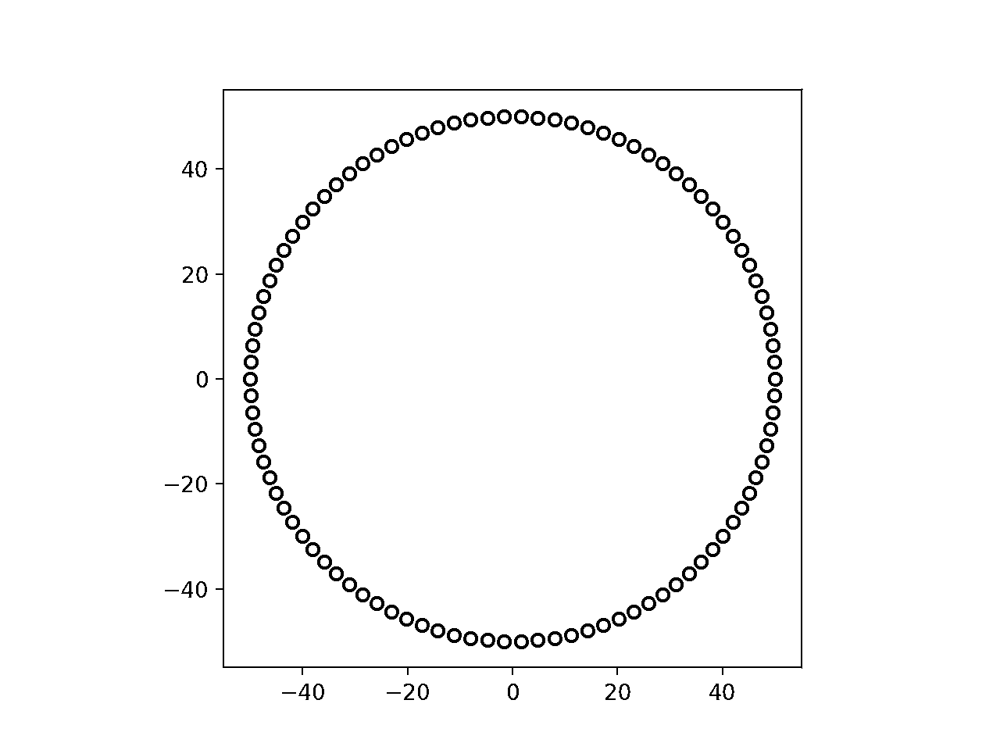

# np.linspace():创建均匀或非均匀间隔的数组

> 原文：<https://realpython.com/np-linspace-numpy/>

当你使用 [NumPy](https://realpython.com/numpy-array-programming/) 处理数值应用时，你经常需要创建一个[数字](https://realpython.com/python-numbers/)的数组。在许多情况下，您希望数字的间距均匀，但有时也可能需要间距不均匀的数字。在这两种情况下你都可以使用的一个关键工具是 **`np.linspace()`** 。

就其基本形式而言，`np.linspace()`使用起来似乎相对简单。然而，它是数值编程工具箱的重要组成部分。它不仅功能多样，而且功能强大。在本教程中，您将了解如何有效地使用这个函数。

**在本教程中，您将学习如何:**

*   创建一个均匀或非均匀间隔的**数字范围**
*   决定何时使用 **`np.linspace()`** 代替替代工具
*   使用必需和可选的**输入参数**
*   创建二维或多维数组
*   以离散形式表示数学函数

本教程假设您已经熟悉 NumPy 和 [`ndarray`](https://numpy.org/doc/stable/reference/generated/numpy.ndarray.html) 数据类型的基础知识。首先，您将学习在 Python 中创建一系列数字的各种方法。然后你将仔细看看使用`np.linspace()`的所有方法，以及如何在你的程序中有效地使用它。

**免费奖励:** [点击此处获取免费的 NumPy 资源指南](#)，它会为您指出提高 NumPy 技能的最佳教程、视频和书籍。

## 创建具有均匀间距的数字范围

在 Python 中，有几种方法可以创建一系列**均匀分布的数字**。`np.linspace()`允许您这样做，并自定义范围以满足您的特定需求，但这不是创建数字范围的唯一方法。在下一节中，您将学习如何使用`np.linspace()`,然后将其与创建等间距数字范围的其他方法进行比较。

[*Remove ads*](/account/join/)

### 使用`np.linspace()`

`np.linspace()`有两个必需的参数， **`start`** 和 **`stop`** ，可以用来设置范围的开始和结束:

>>>

```py
>>> import numpy as np
>>> np.linspace(1, 10)
array([ 1\.        ,  1.18367347,  1.36734694,  1.55102041,  1.73469388,
 1.91836735,  2.10204082,  2.28571429,  2.46938776,  2.65306122,
 2.83673469,  3.02040816,  3.20408163,  3.3877551 ,  3.57142857,
 3.75510204,  3.93877551,  4.12244898,  4.30612245,  4.48979592,
 4.67346939,  4.85714286,  5.04081633,  5.2244898 ,  5.40816327,
 5.59183673,  5.7755102 ,  5.95918367,  6.14285714,  6.32653061,
 6.51020408,  6.69387755,  6.87755102,  7.06122449,  7.24489796,
 7.42857143,  7.6122449 ,  7.79591837,  7.97959184,  8.16326531,
 8.34693878,  8.53061224,  8.71428571,  8.89795918,  9.08163265,
 9.26530612,  9.44897959,  9.63265306,  9.81632653, 10\.        ])
```

这段代码返回一个 [`ndarray`](https://numpy.org/doc/stable/reference/generated/numpy.ndarray.html) ，在`start`和`stop`值之间有相等的间隔。这是一个**向量空间**，也叫[线性空间](https://en.wikipedia.org/wiki/Linear_space_(geometry))，这也是`linspace`这个名字的由来。

注意，值`10`包含在输出数组中。默认情况下，该函数返回一个**闭合范围**，其中包含端点。这与您对 Python 的期望相反，在 Python 中通常不包括范围的结束。打破常规并不是疏忽。稍后您会看到，这通常是您在使用该函数时想要的。

上例中的数组长度为`50`，这是默认的数字。在大多数情况下，您需要在数组中设置自己的值的数量。您可以通过可选参数 **`num`** 来实现:

>>>

```py
>>> np.linspace(1, 10, num=10)
array([ 1.,  2.,  3.,  4.,  5.,  6.,  7.,  8.,  9., 10.])
```

这个实例中的输出数组包含了在`1`和`10`之间等间距的值`10`，也就是从`1`到`10`的数字。这是另一个例子:

>>>

```py
>>> np.linspace(-10, 10, 25)
array([-10\.        ,  -9.16666667,  -8.33333333,  -7.5       ,
 -6.66666667,  -5.83333333,  -5\.        ,  -4.16666667,
 -3.33333333,  -2.5       ,  -1.66666667,  -0.83333333,
 0\.        ,   0.83333333,   1.66666667,   2.5       ,
 3.33333333,   4.16666667,   5\.        ,   5.83333333,
 6.66666667,   7.5       ,   8.33333333,   9.16666667,
 10\.        ])
```

在上面的例子中，您创建了一个线性空间，其值在`-10`和`10`之间。您使用`num`参数作为**位置参数**，而没有在函数调用中明确提及它的名称。这是你最常使用的形式。

### 使用`range()`和列表理解

让我们后退一步，看看还有哪些工具可以用来创建一个均匀分布的数字范围。Python 提供的最直接的选项是内置的 [`range()`](https://realpython.com/python-range/) 。函数调用`range(10)`返回一个对象，该对象产生从`0`到`9`的序列，这是一个均匀间隔的数字范围。

对于许多数值应用来说，`range()`仅限于整数这一事实限制太多。在上面显示的例子中，只有`np.linspace(1, 10, 10)`可以用`range()`完成:

>>>

```py
>>> list(range(1, 11))
[1, 2, 3, 4, 5, 6, 7, 8, 9, 10]
```

当`range()`返回的值被显式转换成[列表](https://realpython.com/python-lists-tuples/)时，与 NumPy 版本返回的值相同，除了它们是整数而不是浮点数。

您仍然可以使用`range()`和[列表理解](https://realpython.com/list-comprehension-python/)来创建非整数范围:

>>>

```py
>>> step = 20 / 24  # Divide the range into 24 intervals
>>> [-10 + step*interval for interval in range(25)]
[-10.0, -9.166666666666666, -8.333333333333334, -7.5,
 -6.666666666666666, -5.833333333333333, -5.0, -4.166666666666666,
 -3.333333333333333, -2.5, -1.666666666666666, -0.8333333333333321,
 0.0, 0.8333333333333339, 1.6666666666666679, 2.5,
 3.333333333333334, 4.166666666666668, 5.0, 5.833333333333334,
 6.666666666666668, 7.5, 8.333333333333336, 9.166666666666668, 10.0]
```

列表中的值与`np.linspace(-10, 10, 25)`输出的数组中的值相同。然而，与使用`np.linspace()`相比，即使使用列表理解也是相当笨拙和不优雅的。您首先需要计算出所需的时间间隔，然后在一个循环中使用该时间间隔。

在大多数应用程序中，您仍然需要将列表转换为 NumPy 数组，因为使用 NumPy 数组执行元素级计算不太复杂。

在决定使用 NumPy 工具还是核心 Python 时，你可能需要考虑的另一点是执行速度。您可以展开下面的部分，查看使用 list 与使用 NumPy 数组相比的性能。


通过创建对两个序列中的所有元素执行相同算术运算的函数，可以比较使用 NumPy 的方法和使用 list comprehensions 的方法。在下面的示例中，您将从`-10`到`10`的范围划分为`500`个样本，这与`499`个间隔相同:

>>>

```py
 1>>> import timeit
 2>>> import numpy as np
 3>>> numbers_array = np.linspace(-10, 10, 500)
 4>>> step = 20 / 499
 5>>> numbers_list = [-10 + step*interval for interval in range(500)]
 6>>> def test_np():
 7...     return (numbers_array + 2.5) ** 2
 8...
 9>>> def test_list():
10...     return [(number + 2.5) ** 2 for number in numbers_list]
11...
12>>> list(test_np()) == test_list()
13True
14>>> timeit.timeit("test_np()", globals=globals(), number=100000)
150.3116540400000076
16>>> timeit.timeit("test_list()", globals=globals(), number=100000)
175.478577034000011
```

函数`test_np()`和`test_list()`对序列执行相同的操作。您可以通过检查两个函数的输出是否相同来确认这一点，如上面代码片段中的第 12 行所示。使用 [`timeit`](https://realpython.com/python-timer/#estimating-running-time-with-timeit) 模块对两个版本的执行进行计时表明，使用列表要比使用 NumPy 数组慢得多。

在某些情况下，使用 NumPy 工具而不是核心 Python 可以提高效率。在需要对大量数据进行大量计算的应用程序中，这种效率的提高是非常显著的。

[*Remove ads*](/account/join/)

### 使用`np.arange()`

NumPy 有自己版本的内置`range()`。它叫做 [`np.arange()`](https://numpy.org/devdocs/reference/generated/numpy.arange.html) ，与`range()`不同，它不仅仅局限于整数。您可以以与`range()`类似的方式使用`np.arange()`，使用`start`、`stop`和`step`作为输入参数:

>>>

```py
>>> list(range(2, 30, 2))
[2, 4, 6, 8, 10, 12, 14, 16, 18, 20, 22, 24, 26, 28]

>>> np.arange(2, 30, 2)
array([ 2,  4,  6,  8, 10, 12, 14, 16, 18, 20, 22, 24, 26, 28])
```

输出值是一样的，虽然`range()`返回的是 range 对象，可以转换成列表显示所有的值，而`np.arange()`返回的是数组。

`np.arange()`返回的数组使用了一个**半开区间**，不包括范围的端点。这种行为类似于`range()`，但不同于`np.linspace()`。这些差异最初可能有点令人困惑，但是随着您开始更频繁地使用这些函数，您会习惯它们的。

您甚至可以在`np.arange()`中使用非整数:

>>>

```py
>>> np.arange(2.34, 31.97, 2)
array([ 2.34,  4.34,  6.34,  8.34, 10.34, 12.34, 14.34, 16.34, 18.34,
 20.34, 22.34, 24.34, 26.34, 28.34, 30.34])
```

输出是一个从`start`值开始的数组，每个数字之间的间隔正好等于输入参数中使用的`step`大小。最后一个数字是该系列中的最大数字，小于用于范围的`end`的数字。

`step`参数也可以是浮点数，尽管在这种情况下你需要小心，因为输出可能不总是你想要的:

>>>

```py
>>> np.arange(1.034, 3.104, 0.34)
array([1.034, 1.374, 1.714, 2.054, 2.394, 2.734, 3.074])

>>> np.arange(1.034, 3.104, 0.345)
array([1.034, 1.379, 1.724, 2.069, 2.414, 2.759, 3.104])
```

在第一个例子中，一切似乎都很好。然而，你可能已经注意到，在第二个例子中，当`step`是 0.345 时，输出中的最后一个值等于`stop`值，即使`np.arange()`使用半开区间。`np.arange()`的文档对此有一个警告:

> 当使用非整数步长(如 0.1)时，结果通常不一致。对于这些情况，最好使用`numpy.linspace`。[(来源)](https://numpy.org/doc/stable/reference/generated/numpy.arange.html)

下面是决定使用这两个函数中的哪一个的经验法则:

*   **当范围的`start`和`end`点的精确值是应用中的重要属性时，使用`np.linspace()`** 。
*   **当`step`值之间的大小比较重要时使用`np.arange()`** 。

在本教程中，您将再次使用`np.arange()`。要了解更多信息，请查看 [NumPy arange():如何使用 np.arange()](https://realpython.com/how-to-use-numpy-arange/) 。

## 从`np.linspace()` 定制输出

将`np.linspace()`与`start`、`stop`和`num`参数一起使用是使用该函数最常见的方式，对于许多应用程序来说，您不需要考虑这种方法以外的内容。但是，您可以进一步定制您的输出。

在这一节中，您将学习如何定制所创建的范围，确定数组中项的[数据类型](https://realpython.com/python-data-types/)，以及控制端点的行为。

### `start`、`stop`和`num`参数

虽然`start`和`stop`是唯一必需的参数，但是通常还会用到第三个参数`num`。参数`start`和`stop`是您希望创建的范围的开始和结束，而`num`是一个整数，它决定了输出数组将有多少个元素。

根据您正在开发的应用程序，您可能会认为`num`是您正在创建的数组的**采样**，或**分辨率**。再看几个例子:

>>>

```py
>>> np.linspace(-5, 5, 10)
array([-5\.        , -3.88888889, -2.77777778, -1.66666667, -0.55555556,
 0.55555556,  1.66666667,  2.77777778,  3.88888889,  5\.        ])

>>> np.linspace(-5, 5, 100)
array([-5\.        , -4.8989899 , -4.7979798 , -4.6969697 , -4.5959596 ,
 -4.49494949, -4.39393939, -4.29292929, -4.19191919, -4.09090909,
 -3.98989899, -3.88888889, -3.78787879, -3.68686869, -3.58585859,
 -3.48484848, -3.38383838, -3.28282828, -3.18181818, -3.08080808,
 -2.97979798, -2.87878788, -2.77777778, -2.67676768, -2.57575758,
 -2.47474747, -2.37373737, -2.27272727, -2.17171717, -2.07070707,
 -1.96969697, -1.86868687, -1.76767677, -1.66666667, -1.56565657,
 -1.46464646, -1.36363636, -1.26262626, -1.16161616, -1.06060606,
 -0.95959596, -0.85858586, -0.75757576, -0.65656566, -0.55555556,
 -0.45454545, -0.35353535, -0.25252525, -0.15151515, -0.05050505,
 0.05050505,  0.15151515,  0.25252525,  0.35353535,  0.45454545,
 0.55555556,  0.65656566,  0.75757576,  0.85858586,  0.95959596,
 1.06060606,  1.16161616,  1.26262626,  1.36363636,  1.46464646,
 1.56565657,  1.66666667,  1.76767677,  1.86868687,  1.96969697,
 2.07070707,  2.17171717,  2.27272727,  2.37373737,  2.47474747,
 2.57575758,  2.67676768,  2.77777778,  2.87878788,  2.97979798,
 3.08080808,  3.18181818,  3.28282828,  3.38383838,  3.48484848,
 3.58585859,  3.68686869,  3.78787879,  3.88888889,  3.98989899,
 4.09090909,  4.19191919,  4.29292929,  4.39393939,  4.49494949,
 4.5959596 ,  4.6969697 ,  4.7979798 ,  4.8989899 ,  5\.        ])
```

这两个数组都代表-5 和 5 之间的范围，但采样或分辨率不同。如果您愿意，可以使用命名参数:

>>>

```py
>>> np.linspace(start=-5, stop=5, num=10)
array([-5\.        , -3.88888889, -2.77777778, -1.66666667, -0.55555556,
 0.55555556,  1.66666667,  2.77777778,  3.88888889,  5\.        ])
```

命名参数的使用使代码更具可读性。然而，在许多广泛使用`np.linspace()`的应用程序中，您会经常看到它的使用没有命名前三个参数。

您可以使用非整数来定义范围:

>>>

```py
>>> np.linspace(-5.2, 7.7, 30)
array([-5.2       , -4.75517241, -4.31034483, -3.86551724, -3.42068966,
 -2.97586207, -2.53103448, -2.0862069 , -1.64137931, -1.19655172,
 -0.75172414, -0.30689655,  0.13793103,  0.58275862,  1.02758621,
 1.47241379,  1.91724138,  2.36206897,  2.80689655,  3.25172414,
 3.69655172,  4.14137931,  4.5862069 ,  5.03103448,  5.47586207,
 5.92068966,  6.36551724,  6.81034483,  7.25517241,  7.7       ])
```

该数组现在由`30`个等距数字组成，起始和终止于用作`start`和`stop`参数自变量的精确值。您现在知道如何使用三个主要的输入参数:

1.  `start`
2.  `stop`
3.  `num`

通常，这个函数只使用这三个输入参数。然而，正如您将在下一节中看到的，您可以进一步修改输出。

[*Remove ads*](/account/join/)

### 改变输出类型的`dtype`参数

NumPy 数组的元素都属于同一数据类型。`np.linspace()`通常返回浮点数组。您可以通过检查输出来了解这一点，或者更好的方法是查看数组的`.dtype`属性:

>>>

```py
>>> numbers = np.linspace(-10, 10, 20)
>>> numbers
array([-10\.        ,  -8.94736842,  -7.89473684,  -6.84210526,
 -5.78947368,  -4.73684211,  -3.68421053,  -2.63157895,
 -1.57894737,  -0.52631579,   0.52631579,   1.57894737,
 2.63157895,   3.68421053,   4.73684211,   5.78947368,
 6.84210526,   7.89473684,   8.94736842,  10\.        ])

>>> numbers.dtype
dtype('float64')
```

数组中的数字是浮点数。即使在以下情况下也是如此:

>>>

```py
>>> numbers = np.linspace(-10, 10, 11)
>>> numbers
array([-10.,  -8.,  -6.,  -4.,  -2.,   0.,   2.,   4.,   6.,   8.,  10.])

>>> numbers.dtype
dtype('float64')
```

尽管所有的元素都是整数，但它们仍然以尾随句点显示，以表明它们是浮点数。你可以通过查看`numbers.dtype`的值来确认。

您可以使用可选的`dtype`输入参数来改变输出数组中元素的数据类型:

>>>

```py
>>> numbers = np.linspace(-10, 10, 11, dtype=int)
>>> numbers
array([-10,  -8,  -6,  -4,  -2,   0,   2,   4,   6,   8,  10])

>>> numbers.dtype
dtype('int64')
```

尽管参数声明了`dtype=int`，但 NumPy 将其解释为`int64`，这是 NumPy 中的一种数据类型。您可以通过检查`numbers`的一个元素的类型来确认这一点:

>>>

```py
>>> type(numbers[0])
<class 'numpy.int64'>
```

这表明 NumPy 使用自己版本的基本数据类型。您可以直接使用 NumPy 数据类型作为`dtype`参数的参数:

```py
numbers = np.linspace(-10, 10, 11, dtype=np.int64)
```

这产生了相同的输出结果，但通过显式声明 NumPy 数据类型避免了歧义。

选择特定的数据类型时，需要小心确保线性空间仍然有效:

>>>

```py
>>> np.linspace(-5, 5, 20, dtype=np.int64)
array([-5, -4, -3, -3, -2, -2, -1, -1,  0,  0,  0,  0,  1,  1,  2,  2,  3,
 3,  4,  5])
```

NumPy 通过以通常的方式舍入来强制值为类型`np.int64`，但是结果不再是线性空间。这不太可能是你想要的结果。你可以在官方文档中阅读更多关于 NumPy 中数据类型的内容。

### `endpoint`和`retstep`参数

默认情况下，`np.linspace()`使用封闭区间`[start, stop]`，其中包含端点。这通常是您使用该功能的理想方式。但是，如果你需要创建一个半开放区间的线性空间`[start, stop)`，那么你可以设置可选的[布尔](https://realpython.com/python-boolean/)参数`endpoint`为`False`:

>>>

```py
>>> np.linspace(-5, 5, 20, endpoint=False)
array([-5\. , -4.5, -4\. , -3.5, -3\. , -2.5, -2\. , -1.5, -1\. , -0.5,  0\. ,
 0.5,  1\. ,  1.5,  2\. ,  2.5,  3\. ,  3.5,  4\. ,  4.5])
```

此选项允许您将函数与不包含范围端点的 Python 约定一起使用。

该函数还可以输出它计算的样本之间的间隔大小。如果你需要元素间步长的值，那么你可以设置布尔参数`retstep`到`True`:

>>>

```py
>>> numbers, step = np.linspace(-5, 5, 20, retstep=True)
>>> numbers
array([-5\.        , -4.47368421, -3.94736842, -3.42105263, -2.89473684,
 -2.36842105, -1.84210526, -1.31578947, -0.78947368, -0.26315789,
 0.26315789,  0.78947368,  1.31578947,  1.84210526,  2.36842105,
 2.89473684,  3.42105263,  3.94736842,  4.47368421,  5\.        ])

>>> step
0.5263157894736842
```

这种情况下的返回值是一个元组，数组作为第一个元素，大小为`step`的浮点数作为第二个元素。

[*Remove ads*](/account/join/)

### 高维数组的非标量值

您也可以对`start`和`stop`使用非标量值。这返回了一个**高维数组**:

>>>

```py
>>> output = np.linspace(start=[2, 5, 9], stop=[100, 130, 160], num=10)
>>> output
array([[  2\.        ,   5\.        ,   9\.        ],
 [ 12.88888889,  18.88888889,  25.77777778],
 [ 23.77777778,  32.77777778,  42.55555556],
 [ 34.66666667,  46.66666667,  59.33333333],
 [ 45.55555556,  60.55555556,  76.11111111],
 [ 56.44444444,  74.44444444,  92.88888889],
 [ 67.33333333,  88.33333333, 109.66666667],
 [ 78.22222222, 102.22222222, 126.44444444],
 [ 89.11111111, 116.11111111, 143.22222222],
 [100\.        , 130\.        , 160\.        ]])

>>> output.shape
(10, 3)
```

`start`和`stop`都是长度相同的列表。每个列表的第一项`2`和`100`是第一个向量的`start`和`stop`点，其具有由`num`参数确定的`10`样本。这同样适用于每个列表的第二个元素和第三个元素。输出是一个十行三列的二维 NumPy 数组。

您可以通过检查二维数组中的一行和一个元素来进一步研究该数组:

>>>

```py
>>> output[0]
array([2., 5., 9.])

>>> output[0][2]
9.0
```

第一个结果代表数组的第一行。第二个结果显示第一行第三列中的元素。

通过将可选参数`axis`设置为`1`，可以返回该数组的[转置](https://en.wikipedia.org/wiki/Transpose)版本:

>>>

```py
>>> output = np.linspace(start=[2, 5, 9],
...                      stop=[100, 130, 160],
...                      num=10,
...                      axis=1)
>>> output
array([[  2\.        ,  12.88888889,  23.77777778,  34.66666667,
 45.55555556,  56.44444444,  67.33333333,  78.22222222,
 89.11111111, 100\.        ],
 [  5\.        ,  18.88888889,  32.77777778,  46.66666667,
 60.55555556,  74.44444444,  88.33333333, 102.22222222,
 116.11111111, 130\.        ],
 [  9\.        ,  25.77777778,  42.55555556,  59.33333333,
 76.11111111,  92.88888889, 109.66666667, 126.44444444,
 143.22222222, 160\.        ]])

>>> output.shape
(3, 10)
```

相对于之前的例子，输出数组现在具有交换的行数和列数，在之前的例子中没有显式设置参数`axis`，而是使用默认值`0`。

### 输入参数和返回值的汇总

函数声明很好地总结了您可以使用的选项:

```py
linspace(start,
         stop,
         num=50,
         endpoint=True,
         retstep=False,
         dtype=None,
         axis=0
         )
```

您可以在[文档](https://numpy.org/doc/stable/reference/generated/numpy.linspace.html)中找到全部细节。下面列出了输入参数需要记住的要点:

| 参数 | 描述 | 缺省值 |
| --- | --- | --- |
| `start`和`stop` | 这些必需的参数定义了范围的开始和结束。通常这些是标量值，或者是`int`或者是`float`，但是也可以是任何类似数组的对象。 | - |
| `num` | 此参数定义数组中的点数，通常称为采样或分辨率。 | `50` |
| `endpoint` | 如果该参数设置为`False`，则该函数将该区间视为半开区间，并从输出数组中排除端点。 | `True` |
| `retstep` | 如果该参数被设置为`True`，那么该函数返回数组和一个`float`，其步长为线性空间的每个元素之间的步长。否则，只返回数组。 | `False` |
| `dtype` | 此参数可用于设置输出数组中元素的数据类型。 | - |
| `axis` | 该参数仅用于无标度`start`和`stop`值。它决定了存储结果的轴。 | - |

调用该函数返回的输出如下所示:

*   包含向量空间的类型为`ndarray`的数组
*   如果`retstep`设置为`True`，步长为`float`

当您开始尝试使用`np.linspace()`以及定制其输出的不同方式时，您可以将本节作为参考。

### 示例:食品生产传送带

假设一家生产包装食品的公司在其食品生产工厂中有一个传送带系统。沿着传送带的位置由一个数字表示，该数字代表从起点开始的传送路径的长度。有 27 个温度传感器沿传送带的关键部分等间距安装。第一个传感器位于传送带上的位置 17.5，最后一个位于 46.2。

温度传感器阵列输出的数据可以作为 Python 中的列表读取。这是一个以摄氏度为单位的温度读数示例:

```py
temperatures = [17.6, 18.9, 18.0, 18.9, 16.7, 14.3, 13.7, 13.8, 13.6, 15.7,
                18.6, 17.5, 18.4, 18.0, 17.2, 16.9, 16.8, 17.0, 15.9, 17.2,
                17.7, 16.9, 17.2, 17.8, 17.5, 16.9, 17.2]
```

工厂经理需要看到这些温度与它们在传送带上的位置之间的关系，以确保在传送带的这一关键延伸段上的每一点温度都保持在公差范围内。

你需要[导入](https://realpython.com/python-import/) [`matplotlib`](https://realpython.com/python-matplotlib-guide/) 来绘制温度:

```py
import matplotlib.pyplot as plt

temperatures = [17.6, 18.9, 18.0, 18.9, 16.7, 14.3, 13.7, 13.8, 13.6, 15.7,
                18.6, 17.5, 18.4, 18.0, 17.2, 16.9, 16.8, 17.0, 15.9, 17.2,
                17.7, 16.9, 17.2, 17.8, 17.5, 16.9, 17.2]

plt.plot(temperatures)
plt.title("Temperatures along critical stretch (ºC)")
plt.ylabel("Temperature (ºC)")
plt.xlabel("List index")
plt.show()
```

绘制`temperatures`列表中的值，并设置标题和轴标签。这给出了下面的图:

[](https://files.realpython.com/media/food_belt_plot_1.7251bef2e2c8.png)

该图显示了相对于传感器列表索引绘制的温度。这对于工厂经理来说没有用，他想知道相对于皮带标准参考位置的温度。

为了创建与已知参考位置相匹配的温度指数，您将使用三位信息:

1.  有 27 个温度传感器。
2.  第一个在 17.5 位置。
3.  最后一个在 46.2 位置。

这是使用`np.linspace()`的理想场景:

>>>

```py
>>> import numpy as np
>>> position = np.linspace(17.5, 46.2, 27)
>>> position
array([17.5       , 18.60384615, 19.70769231, 20.81153846, 21.91538462,
 23.01923077, 24.12307692, 25.22692308, 26.33076923, 27.43461538,
 28.53846154, 29.64230769, 30.74615385, 31.85      , 32.95384615,
 34.05769231, 35.16153846, 36.26538462, 37.36923077, 38.47307692,
 39.57692308, 40.68076923, 41.78461538, 42.88846154, 43.99230769,
 45.09615385, 46.2       ])
```

线性空间`position`显示了传送带上所有温度传感器的准确位置。现在，您可以根据`position`数组绘制温度:

```py
plt.plot(position, temperatures)
plt.title("Temperatures along critical stretch (ºC)")
plt.ylabel("Temperature (ºC)")
plt.xlabel("Position on conveyor belt")
plt.show()
```

与上面代码中的前一个例子的不同之处在于，您使用了`position`数组作为`plt.plot()`中的第一个参数。这给出了下面的图:

[](https://files.realpython.com/media/food_belt_plot_2.29c78d4ad9ae.png)

该图现在显示了正确的 x 轴，它代表测量每个温度的位置。本例显示了一个典型案例，其中`np.linspace()`是理想的解决方案。

[*Remove ads*](/account/join/)

## 表示数学函数

科学、工程、金融和其他领域的许多领域都依赖于数学函数。这些往往是[连续变量](https://en.wikipedia.org/wiki/Continuous_or_discrete_variable)的函数。如果你想通过计算来研究这些过程，那么你需要用一个**离散表示法**来近似这些数学函数。在这个过程中，你需要的一个关键工具是创造一个线性空间的能力。

### 带`np.linspace()`的数学函数

在本节中，您将学习如何用 Python 表示一个数学函数并绘制它。考虑以下函数:

[](https://files.realpython.com/media/equation_1.d46ade450fa4.png)

这个数学函数是从连续实数线的映射。即使设置了限制，比如说-5 ≤ *x* ≤ 5，仍然有无限多的 *x* 的值。为了表示上面的函数，首先需要创建一个实数线的离散版本:

```py
import numpy as np

x_ = np.linspace(-5, 5, 5)
```

在本教程中，符号 *x* 用于表示实数线上定义的连续数学变量，而`x_`用于表示其计算的离散近似值。带下划线的版本也用于代表数组的 [Python 变量](https://realpython.com/python-variables/)。

因为`x_`是一个 NumPy 数组，你可以像数学上那样计算代数运算，并且[不需要循环](https://realpython.com/numpy-array-programming/):

```py
y_ = 4 * (x_**3) + 2 * (x_**2) + 5 * x_
```

新数组`y_`是连续变量`y`的离散版本。最后一步是想象它:

```py
import matplotlib.pyplot as plt

plt.plot(x_, y_)
plt.show()
```

这创建了一个`y_`对`x_`的图，如下所示:

[](https://files.realpython.com/media/equation_plot_1.9c213edb37a0.png)

注意这个剧情好像不是很顺利。创建的线性空间只有`5`个点。这不足以恰当地表示数学函数。该函数是**欠采样**。将分辨率加倍可能效果更好:

```py
x_ = np.linspace(-5, 5, 10)
y_ = 4 * (x_**3) + 2 * (x_**2) + 5 * x_
plt.plot(x_, y_)
plt.show()
```

这给出了下面的图:

[](https://files.realpython.com/media/equation_plot_2.6e12d69faf22.png)

这更好，你可以更有信心，这是一个公平的函数表示。然而，情节仍然不像你在数学课本上看到的那样顺利。采样频率更高时，曲线变得更加平滑:

```py
x_ = np.linspace(-5, 5, 100)
y_ = 4 * (x_**3) + 2 * (x_**2) + 5 * x_
plt.plot(x_, y_)
plt.show()
```

这给出了下面的图:

[](https://files.realpython.com/media/equation_plot_3.d82b068539b1.png)

您可以选择更高的采样，但这是有代价的。更大的数组需要更多的内存，计算也需要更多的时间。

[*Remove ads*](/account/join/)

### 例子:叠加行波

在本节中，您将创建两个具有不同属性的不同波，然后将它们叠加并创建一个动画来显示它们如何传播。

波可以用下面的函数来表示:

[](https://files.realpython.com/media/wave_equation.a9382be2b123.png)

本教程不是关于波的物理学，所以我将保持物理学非常简短！波遵循由以下五项定义的正弦函数:

*   位置( *x* )
*   时间( *t*
*   波的振幅( *A*
*   波长( *λ*
*   波的速度( *v*

在下一节中，您将学习如何处理二维函数，但是对于这个示例，您将采用不同的方法。您可以首先创建一个线性空间来表示 *x* :

```py
import numpy as np

x_ = np.linspace(-10, 10, 10)
```

一旦定义了常数，就可以创建波形了。您可以从定义常数开始:

```py
amplitude = 2
wavelength = 5
velocity = 2

time = 0  # You can set time to 0 for now
```

该函数包括时间( *t* )，但最初您将关注变量 *x* 。现在设置`time = 0`意味着你仍然可以在你的代码中写完整的方程，即使你还没有使用时间。现在，您可以创建数组来表示波浪:

```py
wave = amplitude * np.sin((2*np.pi/wavelength) * (x_ - velocity*time))
```

创建的数组是描述波的方程的离散版本。现在你可以绘制`wave`:

```py
import matplotlib.pyplot as plt

plt.plot(x_, wave)
plt.show()
```

`wave`的图如下所示:

[](https://files.realpython.com/media/wave_plot_1.e38979cf619c.png)

这看起来不像正弦波，但你之前看到过这个问题。用于`x_`的线性空间的分辨率不够。您可以通过增加采样来解决这个问题:

```py
x_ = np.linspace(-10, 10, 100)

wave = amplitude * np.sin((2*np.pi/wavelength) * (x_ - velocity*time))

plt.plot(x_, wave)
plt.show()
```

`wave`的这个图现在显示了一个平滑的波:

[](https://files.realpython.com/media/wave_plot_2.e863c2741a30.png)

现在你准备叠加两个波。你所需要做的就是创建两个不同的波，并将它们相加。这也是一个重构代码的好时机:

```py
import matplotlib.pyplot as plt
import numpy as np

# Parameters for discretizing the mathematical function
sampling = 100
x_range = -10, 10
n_waves = 2

# Parameters are tuples with a value for each wave (2 in this case)
amplitudes = 1.7, 0.8
wavelengths = 4, 7.5
velocities = 2, 1.5

time = 0  # You can set time to 0 for now

x_ = np.linspace(x_range[0], x_range[1], sampling)

# Create 2 (or more) waves using a list comprehension and superimpose
waves = [amplitudes[idx] * np.sin((2*np.pi/wavelengths[idx]) *
                                  (x_ - velocities[idx]*time))
         for idx in range(n_waves)]
superimposed_wave = sum(waves)

# Plot both waves separately to see what they look like
plt.subplot(2, 1, 1)
plt.plot(x_, waves[0])
plt.plot(x_, waves[1])

# Plot the superimposed wave
plt.subplot(2, 1, 2)
plt.plot(x_, superimposed_wave)

plt.show()
```

这段代码创建了两个不同的波，并将它们加在一起，显示了波的叠加:

[](https://files.realpython.com/media/superimposed_waves.95cd00bcd618.png)

在上面的图中，你可以看到两个波是分开绘制的。下图显示了当它们被加在一起时，波的叠加。您现在的最后一项任务是通过绘制不同时间值 *t* 的叠加波来启动这些波:

```py
for time in np.arange(0, 40, 0.2):
    # Create 2 (or more) waves using a list comprehension and superimpose
    waves = [amplitudes[idx] *
             np.sin((2*np.pi/wavelengths[idx]) *
                    (x_ - velocities[idx]*time))
             for idx in range(n_waves)]
    superimposed_wave = sum(waves)

    plt.clf()  # Clear last figure
    plt.plot(x_, superimposed_wave)
    plt.ylim(-3, 3)  # Fix the limits on the y-axis
    plt.pause(0.1)  # Insert short pause to create animation
```

这将产生以下输出:

[https://player.vimeo.com/video/479141813?background=1](https://player.vimeo.com/video/479141813?background=1)

您可以用不同参数的 wave 来尝试上面的代码，甚至可以添加第三个或第四个 wave。现在，您可以选择自己喜欢的函数进行实验，并尝试用 Python 来表示它们。

[*Remove ads*](/account/join/)

### 二维数学函数

在前面的示例中，您通过将一个变量表示为空间坐标，一个变量表示为时间坐标，解决了具有两个变量的函数的问题。这是有意义的，因为两个坐标实际上是一个空间坐标和一个时间坐标。

不过，这种方法并不总是有效。这是一个包含两个变量的函数:

[](https://files.realpython.com/media/Gaussian_2D.414e1c61a4ac.png)

这是二维简化的[高斯函数](https://en.wikipedia.org/wiki/Gaussian_function)，所有参数都有单位值。为了表示这一点，你需要创建两个线性空间，一个用于 *x* ，一个用于 *y* 。在这种情况下，它们可以是相同的，但不一定总是这样:

```py
import numpy as np

x_ = np.linspace(-5, 5, 100)
y_ = np.linspace(-5, 5, 100)
```

这些向量都是一维的，但是所需的数组必须是二维的，因为它需要表示两个变量的函数。NumPy 有一个很有用的函数叫做 [`np.meshgrid()`](https://numpy.org/doc/stable/reference/generated/numpy.meshgrid.html) ，你可以结合`np.linspace()`使用，把一维向量转换成二维矩阵。这些矩阵表示二维坐标:

>>>

```py
>>> X, Y = np.meshgrid(x_, y_)
>>> x_.shape, y_.shape
((100,), (100,))
>>> X.shape, Y.shape
((100, 100), (100, 100))
```

你已经把向量转换成了二维数组。现在，您可以使用这些数组来创建二维函数:

```py
gaussian = np.exp(-((X**2) / 2 + (Y**2) / 2))
```

您可以使用`matplotlib`以二维或三维方式显示该矩阵:

```py
import matplotlib.pyplot as plt
from mpl_toolkits.mplot3d import Axes3D

fig = plt.figure()

ax = fig.add_subplot(121)
# Show matrix in two dimensions
ax.matshow(gaussian, cmap="jet")

ax = fig.add_subplot(122, projection="3d")
# Show three-dimensional surface
ax.plot_surface(X, Y, gaussian, cmap="jet")
plt.show()
```

二维和三维表示如下所示:

[](https://files.realpython.com/media/Gaussian_images.4101973a2fbd.png)

这种方法可以用于任何二元函数。如果你想创建一个二进制的盘形遮罩，那么你可以使用[比较运算符](https://realpython.com/python-boolean/#comparison-operators)来表示这个函数:

```py
 1import matplotlib.pyplot as plt
 2import numpy as np
 3
 4x_ = np.linspace(-10, 10, 1000)
 5y_ = np.linspace(-10, 10, 1000)
 6
 7X, Y = np.meshgrid(x_, y_)
 8
 9radius = 8
10disk_mask = (X ** 2) + (Y ** 2) < radius ** 2
11
12plt.matshow(disk_mask, cmap="gray", extent=[-10, 10, -10, 10])
13plt.show()
```

在第 10 行，您使用元素比较生成数组`disk_mask`。这给出了下面的图:

[](https://files.realpython.com/media/mask_img.eac06be8dc86.png)

数组`disk_mask`的值`True`(或`1`)是落在圆的等式内的`x_`和`y_`的所有值。否则，它的值为`False`(或`0`)。

现在，您已经拥有了在一维和二维计算中表示数学函数的工具，使用`np.linspace()`创建表示函数变量所需的线性空间。你也可以将同样的概念扩展到更高的维度。

[*Remove ads*](/account/join/)

## 创建间距不均匀的数字范围

您已经看到了如何创建和使用均匀分布的数字。然而，有时候你可能需要一个非线性排列的数组。每个值之间的步长可能需要是对数的或者遵循一些其他模式。在最后一节中，您将了解创建这种类型的阵列有哪些选择。

### 对数空间

函数`np.logspace()`创建一个对数空间，其中创建的数字在[对数刻度](https://en.wikipedia.org/wiki/Logarithm)上均匀分布。

一旦你掌握了`np.linspace()`，你就可以使用 [`np.logspace()`](https://numpy.org/doc/stable/reference/generated/numpy.logspace.html) 了，因为这两个函数的输入参数和返回输出非常相似。`np.logspace()`中缺少的一个参数是`retstep`，因为没有一个单一的值来表示连续数字之间的阶跃变化。

`np.logspace()`有一个额外的输入参数`base`，默认值为`10`。另一个关键区别是`start`和`stop`代表对数起点和终点。数组中第一个值是`base` <sup>`start`</sup> ，最后一个值是`base` <sup>`stop`</sup> :

>>>

```py
>>> import numpy as np
>>> np.logspace(0, 4, 5)
array([1.e+00, 1.e+01, 1.e+02, 1.e+03, 1.e+04])
```

这就创建了一个对数空间，其中的`5`元素从`10` <sup>`0`</sup> 到`10` <sup>`4`</sup> ，或者从`1`到`10000`。输出数组以科学记数法显示数字`1`、`10`、`100`、`1000`和`10000`。尽管以 10 为底是默认值，但您可以创建任何底的对数空间:

>>>

```py
>>> np.logspace(1, 10, 20, base=np.e)
array([2.71828183e+00, 4.36528819e+00, 7.01021535e+00, 1.12577033e+01,
 1.80787433e+01, 2.90326498e+01, 4.66235260e+01, 7.48727102e+01,
 1.20238069e+02, 1.93090288e+02, 3.10083652e+02, 4.97963268e+02,
 7.99679103e+02, 1.28420450e+03, 2.06230372e+03, 3.31185309e+03,
 5.31850415e+03, 8.54098465e+03, 1.37159654e+04, 2.20264658e+04])
```

这个例子展示了一个以[为基数*e*T3】的对数空间。在下一节中，您将看到如何创建其他非对数的非线性范围。](https://en.wikipedia.org/wiki/Natural_logarithm)

### 其他非线性范围

您现在可以创建线性和对数空间。您可能还需要遵循其他非线性区间的一系列数字。你可以通过**变换**一个线性空间来实现。

首先创建一个线性空间:

>>>

```py
>>> import numpy as np
>>> x_ = np.linspace(1, 10, 10)
>>> x_
array([ 1.,  2.,  3.,  4.,  5.,  6.,  7.,  8.,  9., 10.])
```

你现在可以把它转换成一个在 *x* <sup>2</sup> 上呈线性的数字范围:

>>>

```py
>>> x_ = x_ ** 2
>>> x_
array([  1.,   4.,   9.,  16.,  25.,  36.,  49.,  64.,  81., 100.])
```

这可能看起来很熟悉。这与您在本教程前面用来表示数学函数的方法相同。事实上，这是完全一样的。当您查看一个具体的示例时，在下一节中将会更清楚地理解为什么您有时会认为这是在创建一个非均匀分布的数组。

### 示例:模拟一颗轨道行星

在本节中，您将创建一个行星绕其太阳运行的模拟。为了稍微简化模拟，你可以假设行星的轨道是圆形而不是椭圆形。

描述圆的等式是 *x* 和 *y* 的函数，并且取决于半径 *R* :

[](https://files.realpython.com/media/circle_eqn_1.fb9bf172e814.png)

因此，如果行星的*x*-位置被设定，相应的*y*-位置将通过重新排列上面的等式给出:

[](https://files.realpython.com/media/circle_eqn_2.1444a14e7ecb.png)

因此，可以将行星放置在一组坐标( *x* 、 *y* )上，只要上面的等式给出了 *y* ，行星就会保持在轨道上。它的位置将在一个圆的圆周上。

你现在已经精通了`np.linspace()`，所以第一次尝试可以使用你已经知道的方法:

```py
import numpy as np

sampling = 50
R = 50

x_ = R * np.linspace(-1, 1, sampling)
```

变量 *x* 沿着水平线从左到右跨越圆的直径，意思是从- *R* 到+ *R* 。现在你可以算出 *y* :

```py
y_ = np.sqrt(R ** 2 - x_ ** 2)
```

数组`y_`是连续变量 *y* 的离散版本，描述了一个圆。您可以使用[散点图](https://realpython.com/visualizing-python-plt-scatter/)来绘制这些点:

```py
import matplotlib.pyplot as plt

plt.scatter(x_, y_)
plt.axis("square")
plt.show()
```

为了确保二维绘图显示正确的模式，您将轴设置为`"square"`，这确保了每个像素都有一个正方形的纵横比:

[](https://files.realpython.com/media/planet_semi_circle_dots.d321cb0f19ff.png)

所有的点都很好地符合一个圆的圆周，这应该是在圆形轨道上的行星的情况。

但是行星不只是绕着半圆形的轨道运行。问题是圆的另一半的 *x* 的值是相同的。顶部半圆和底部半圆共享相同的 *x* 值，但不共享相同的 *y* 值。

你可以通过回顾上面的等式来解决这个问题，这个等式根据 *x* 给出了 *y* 。这个方程有一个正解和一个负解。当 *x* 从右边的+ *R* 摆回到左边的- *R* 时，可以得到 *y* 的负解:

```py
# x_return and y_return are the x_ and y_ values as the
# planet moves from right to left
x_return = x_[len(x_)-2:0:-1]
y_return = -np.sqrt(R ** 2 - x_return ** 2)

x_ = np.concatenate((x_, x_return))
y_ = np.concatenate((y_, y_return))
```

数组`x_return`与`x_`相反，但没有端点。否则，当您连接`x_`和`x_return`时，端点将会重复。数组`y_return`是`y_`的负解。因此，您可以覆盖`x_`成为`x_`和`x_return`的串联:

>>>

```py
>>> x_
array([-50\.        , -47.95918367, -45.91836735, -43.87755102,
 -41.83673469, -39.79591837, -37.75510204, -35.71428571,
 -33.67346939, -31.63265306, -29.59183673, -27.55102041,
 -25.51020408, -23.46938776, -21.42857143, -19.3877551 ,
 -17.34693878, -15.30612245, -13.26530612, -11.2244898 ,
 -9.18367347,  -7.14285714,  -5.10204082,  -3.06122449,
 -1.02040816,   1.02040816,   3.06122449,   5.10204082,
 7.14285714,   9.18367347,  11.2244898 ,  13.26530612,
 15.30612245,  17.34693878,  19.3877551 ,  21.42857143,
 23.46938776,  25.51020408,  27.55102041,  29.59183673,
 31.63265306,  33.67346939,  35.71428571,  37.75510204,
 39.79591837,  41.83673469,  43.87755102,  45.91836735,
 47.95918367,  50\.        ,  47.95918367,  45.91836735,
 43.87755102,  41.83673469,  39.79591837,  37.75510204,
 35.71428571,  33.67346939,  31.63265306,  29.59183673,
 27.55102041,  25.51020408,  23.46938776,  21.42857143,
 19.3877551 ,  17.34693878,  15.30612245,  13.26530612,
 11.2244898 ,   9.18367347,   7.14285714,   5.10204082,
 3.06122449,   1.02040816,  -1.02040816,  -3.06122449,
 -5.10204082,  -7.14285714,  -9.18367347, -11.2244898 ,
 -13.26530612, -15.30612245, -17.34693878, -19.3877551 ,
 -21.42857143, -23.46938776, -25.51020408, -27.55102041,
 -29.59183673, -31.63265306, -33.67346939, -35.71428571,
 -37.75510204, -39.79591837, -41.83673469, -43.87755102,
 -45.91836735, -47.95918367])
```

`x_`内的值从`-50`通过`0`到`50`，然后通过`0`回到`-50`。您也可以[打印](https://realpython.com/python-print/) `y_`来确认它对应于前半段的 *y* 的正值和后半段的 *y* 的负值。`x_`和`y_`的散点图将证实行星现在处于一个完整的圆形轨道上:

```py
plt.scatter(x_, y_)
plt.axis("square")
plt.show()
```

这给出了下面的图:

[](https://files.realpython.com/media/planet_full_circle_dots.a39274b3d560.png)

你可能已经能够在这个散点图中发现问题，但是你过一会儿再回来。现在，你可以使用上面的`x_`和`y_`向量来创建一个移动星球的模拟。

为此，您需要导入 [`matplotlib.animation`](https://matplotlib.org/3.3.1/api/animation_api.html) :

```py
import matplotlib.animation

# Create a figure and axis handle, set axis to
# an equal aspect (square), and turn the axes off
fig, ax = plt.subplots()
ax.set_aspect("equal")
ax.set_axis_off()

# Images are generated and stored in a list to animate later
images = []
for x_coord, y_coord in zip(x_, y_):
    # Scatter plot each point using a dot of size 250 and color red
    img = ax.scatter(x_coord, y_coord, s=250, c="r")
    # Let's also put a large yellow sun in the middle
    img2 = ax.scatter(0, 0, s=1000, c="y")
    images.append([img, img2])

# The animation can now be created using ArtistAnimation
animation = matplotlib.animation.ArtistAnimation(fig,
                                                 images,
                                                 interval=2.5,
                                                 blit=True
                                                 )
plt.show()
```

这将产生以下输出:

[](https://files.realpython.com/media/sg-planet-orbiting-incorrect-small.dbf23ba6b6f9.gif)

不幸的是，行星不会以这种方式运行。你可以看到行星在轨道的左右两侧穿过 x 轴时加速，在顶部和底部穿过 y 轴时减速。

再看一下显示轨道周围所有行星位置的散点图，看看为什么会发生这种情况。这些点在轨道的顶部和底部靠得更近，但在左右两边却相隔很远。你需要在轨道圆周上均匀分布的点，但是你所拥有的是基于均匀分布的`x_`向量的点。

为了解决这个问题，你需要创建一个由`x_`值组成的数组，这个数组不是线性的，但是它产生了沿着轨道圆周的线性点。当一个点平滑地绕着圆形轨道移动时，它在 x 轴上的[投影(共)正弦地移动](https://en.wikipedia.org/wiki/Circular_motion#Uniform_circular_motion)，所以你可以通过改变`x_`来修正这个问题，这样它在`cos(x_)`上是线性的:

```py
x_ = R * np.cos(np.linspace(-np.pi, 0, sampling))
x_return = x_[len(x_)-2: 0: -1]

y_ = np.sqrt(R ** 2 - x_ ** 2)
y_return = -np.sqrt(R ** 2 - x_return ** 2)

x_ = np.concatenate((x_, x_return))
y_ = np.concatenate((y_, y_return))

plt.scatter(x_, y_)
plt.axis("square")
plt.show()
```

第一行将线性空间转换成非线性空间。`x_`的每个值之间的间隔并不相等，而是根据余弦函数而变化。这给出了下面的图:

[](https://files.realpython.com/media/planet_full_circle_even_dots.c5207ed2cedf.png)

这些点现在均匀分布在圆形轨道的圆周上。最后一步是使用与前面相同的代码重新创建动画。这也是通过增加您在开始时定义的`sampling`变量的值来增加分辨率的好时机:

```py
sampling = 250

# ...

fig, ax = plt.subplots()
ax.set_aspect("equal")
ax.set_axis_off()

images = []
for x_coord, y_coord in zip(x_, y_):
    img = ax.scatter(x_coord, y_coord, s=250, c="r")
    img2 = ax.scatter(0, 0, s=1000, c="y")
    images.append([img, img2])

animation = matplotlib.animation.ArtistAnimation(fig,
                                                 images,
                                                 interval=2.5,
                                                 blit=True
                                                 )
plt.show()
```

这将产生以下输出:

[](https://files.realpython.com/media/sg-planet-orbiting-small.5da8ffa0fb90.gif)

要查看生成此动画的代码的完整版本，您可以展开下面的部分。


完整的最终模拟版本，包括将模拟保存到`.gif`中，可从以下网址获得:

```py
 1import matplotlib.animation
 2import matplotlib.pyplot as plt
 3import numpy as np
 4
 5sampling = 250
 6R = 50
 7
 8# Create vector x_ that is linear on cos(x_)
 9# First create x_ from left to right (-R to +R)
10x_ = R * np.cos(np.linspace(-np.pi, 0, sampling))
11# And then x_ returns from right to left (+R to R)
12x_return = x_[len(x_)-2: 0: -1]
13
14# Calculate y_ using the positive solution when x_ is increasing
15y_ = np.sqrt(R ** 2 - x_ ** 2)
16# And the negative solution when x_ is decreasing
17y_return = -np.sqrt(R ** 2 - x_return ** 2)
18
19x_ = np.concatenate((x_, x_return))
20y_ = np.concatenate((y_, y_return))
21
22# Create animation
23fig, ax = plt.subplots()
24ax.set_aspect("equal")
25ax.set_axis_off()
26
27images = []
28for x_coord, y_coord in zip(x_, y_):
29    img = ax.scatter(x_coord, y_coord, s=250, c="r")
30    img2 = ax.scatter(0, 0, s=1000, c="y")
31    images.append([img, img2])
32
33animation = matplotlib.animation.ArtistAnimation(fig,
34                                                 images,
35                                                 interval=2.5,
36                                                 blit=True
37                                                 )
38plt.show()
39
40# Export to .gif
41writer = matplotlib.animation.PillowWriter(fps=30)
42animation.save("orbiting_planet_simulation.gif", writer=writer)
```

您刚刚创建了一个行星绕恒星运行的动画。你必须让行星的位置在圆周上均匀分布，从而让行星在圆周上做直线运动。现在你可以创建任何非均匀间隔的数字范围，只要你能用数学方法表达它。

[*Remove ads*](/account/join/)

## 结论

在 Python 中创建一系列数字表面上看起来并不复杂，但是正如您在本教程中看到的，您可以以多种方式使用`np.linspace()`。如果没有 NumPy 的优势及其创建均匀或非均匀间隔的数字范围的能力，科学、工程、数学、金融、经济和类似领域中的许多数字应用程序将更难实现。

知道如何使用`np.linspace()`，并且知道如何很好地使用它，将使你能够有效地完成数值编程应用。

**在本教程中，您已经学会了如何:**

*   创建一个均匀或非均匀间隔的**数字范围**
*   决定何时使用 **`np.linspace()`** 代替替代工具
*   使用必需和可选的**输入参数**
*   创建二维或多维数组
*   以离散形式表示数学函数

有了从完成本教程中学到的知识，你就可以开始使用`np.linspace()`成功地开发你的数值编程应用程序了。*********