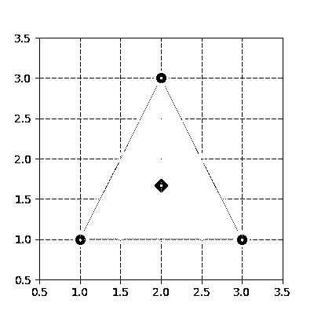

# 看，马，没有 For 循环:用 NumPy 进行数组编程

> 原文：<https://realpython.com/numpy-array-programming/>

有时人们会说，与低级语言如 [C++](https://realpython.com/python-vs-cpp/) 相比，Python 以运行时间为代价提高了开发时间。幸运的是，有一些方法可以在不牺牲易用性的情况下加快 Python 中操作的运行时间。适合快速数值运算的一个选项是 NumPy，它理所当然地将自己标榜为使用 Python 进行科学计算的基础包。

当然，很少有人会将耗时 50 微秒(五千万分之一秒)的东西归类为“慢”。然而，计算机可能不敢苟同。运行时间为 50 微秒(50 μs)的操作属于*微性能*的范畴，它可以粗略地定义为运行时间在 1 微秒和 1 毫秒之间的操作。

为什么速度很重要？微性能值得监控的原因是，运行时的微小差异会随着函数调用的重复而放大:50 μs 的增量开销，重复超过 100 万次函数调用，转化为 50 秒的增量运行时。

说到计算，有三个概念赋予了 NumPy 强大的功能:

*   …向量化…
*   广播
*   索引

在本教程中，您将一步一步地看到如何利用矢量化和广播的优势，这样您就可以最大限度地使用 NumPy。虽然您将在实践中使用一些索引，但 NumPy 的完整索引示意图是它们自己的特色，它扩展了 Python 的[切片语法](https://docs.python.org/3/reference/expressions.html?highlight=slice#slicings)。如果你想阅读更多关于 NumPy 索引的内容，喝点咖啡，去 NumPy 文档中的[索引](https://docs.scipy.org/doc/numpy/reference/arrays.indexing.html)部分。

**免费奖励:** [点击此处获取免费的 NumPy 资源指南](#)，它会为您指出提高 NumPy 技能的最佳教程、视频和书籍。

## 进入状态:NumPy 数组简介

NumPy 的基本对象是它的`ndarray`(或`numpy.array`)，一个 *n 维数组*，它也以某种形式出现在面向数组的语言中，如 Fortran 90、R 和 [MATLAB](https://realpython.com/matlab-vs-python/) ，以及前辈 APL 和 j

让我们从形成一个包含 36 个元素的三维数组开始:

>>>

```py
>>> import numpy as np

>>> arr = np.arange(36).reshape(3, 4, 3)
>>> arr
array([[[ 0,  1,  2],
 [ 3,  4,  5],
 [ 6,  7,  8],
 [ 9, 10, 11]],

 [[12, 13, 14],
 [15, 16, 17],
 [18, 19, 20],
 [21, 22, 23]],

 [[24, 25, 26],
 [27, 28, 29],
 [30, 31, 32],
 [33, 34, 35]]])
```

在二维空间中描绘高维数组可能很困难。思考数组形状的一种直观方式是简单地“从左向右阅读”`arr`是一个 *3 乘 4 乘 3 的*阵列:

>>>

```py
>>> arr.shape
(3, 4, 3)
```

视觉上，`arr`可以被认为是一个由**三个 4x3 网格**(或一个矩形棱柱)组成的容器，看起来像这样:

[](https://files.realpython.com/media/arr3d.7442cd4e11c6.jpg)

更高维的数组可能更难描述，但是它们仍然遵循“数组中的数组”的模式。

在哪里可以看到二维以上的数据？

*   [*面板数据*](https://en.wikipedia.org/wiki/Panel_data) 可以用三维表示。随着时间的推移，跟踪一群人的属性的数据可以被构造为`(respondents, dates, attributes)`。1979 年的全国青年纵向调查对 12686 名受访者进行了长达 27 年的跟踪调查。假设每个人每年有大约 500 个直接询问或导出的数据点，这些数据将形成总计 177，604，000 个数据点的形状`(12686, 27, 500)`。
*   *多幅图像的彩色图像数据*通常以四维存储。每个图像都是一个三维数组`(height, width, channels)`，其中的通道通常是红色、绿色和蓝色(RGB)值。一个图像集合就是`(image_number, height, width, channels)`。一千张 256x256 的 RGB 图像会有形状`(1000, 256, 256, 3)`。(扩展表示法是 RGBA，其中 A–alpha–表示不透明度。)

有关高维数据的真实世界示例的更多详细信息，请参见弗朗索瓦·乔莱(Franç ois Chollet)的《用 Python 进行深度学习 》的第 2 章。

[*Remove ads*](/account/join/)

## 什么是矢量化？

矢量化是 NumPy 中的一项强大功能，可以将操作表示为在整个数组上进行，而不是在单个元素上进行。韦斯·麦金尼给出了一个简明的定义:

> 这种用数组表达式替换显式循环的做法通常被称为矢量化。一般来说，矢量化数组操作通常比纯 Python 操作快一两个(或更多)数量级，在任何类型的数值计算中都有最大的影响。[ [来源](https://www.safaribooksonline.com/library/view/python-for-data/9781449323592/ch04.html)

当在 Python 中循环数组或任何数据结构时，会涉及大量开销。NumPy 中的向量化操作将内部循环委托给高度优化的 [C](https://realpython.com/c-for-python-programmers/) 和 Fortran 函数，使 Python 代码更简洁、更快速。

### 数数:简单如 1、2、3…

作为一个例子，考虑一个一维向量`True`和`False`，您要对其计数序列中“假到真”转换的数量:

>>>

```py
>>> np.random.seed(444)

>>> x = np.random.choice([False, True], size=100000)
>>> x
array([ True, False,  True, ...,  True, False,  True])
```

使用 Python [for 循环](https://realpython.com/python-for-loop/)，一种方法是成对评估序列中每个元素的[真值](https://docs.python.org/3/library/stdtypes.html#truth-value-testing)以及紧随其后的元素:

>>>

```py
>>> def count_transitions(x) -> int:
...     count = 0
...     for i, j in zip(x[:-1], x[1:]):
...         if j and not i:
...             count += 1
...     return count
...
>>> count_transitions(x)
24984
```

在矢量化形式中，没有显式的 for 循环或对单个元素的直接引用:

>>>

```py
>>> np.count_nonzero(x[:-1] < x[1:])
24984
```

这两个等价的函数在性能上比较如何？在这个特殊的例子中，矢量化的 NumPy 调用胜出大约 70 倍:

>>>

```py
>>> from timeit import timeit
>>> setup = 'from __main__ import count_transitions, x; import numpy as np'
>>> num = 1000
>>> t1 = timeit('count_transitions(x)', setup=setup, number=num)
>>> t2 = timeit('np.count_nonzero(x[:-1] < x[1:])', setup=setup, number=num)
>>> print('Speed difference: {:0.1f}x'.format(t1 / t2))
Speed difference: 71.0x
```

**技术细节**:另一个术语是 [*矢量处理器*](https://blogs.msdn.microsoft.com/nativeconcurrency/2012/04/12/what-is-vectorization/) ，和一台电脑的硬件有关。当我在这里谈到*矢量化*时，我指的是用数组表达式替换显式 for 循环的概念，在这种情况下，可以用低级语言在内部计算。

### 低买高卖

这里有另一个例子来吊你的胃口。考虑下面这个经典的[技术面试](https://realpython.com/python-coding-interview-tips/)问题:

> 给定一只股票的价格历史作为一个序列，并假设只允许你进行一次购买和一次出售，可以获得的最大利润是多少？例如，给定`prices = (20, 18, 14, 17, 20, 21, 15)`，从 14 买入到 21 卖出，最大利润是 7。

(致各位财务人:不行，不允许卖空。)

有一个时间复杂度为 n 的平方[的解决方案](https://en.wikipedia.org/wiki/Time_complexity)，它包括获取两个价格的每个组合，其中第二个价格“在第一个价格之后”,并确定最大差异。

然而，也有一个 O(n)的解决方案，它只需遍历序列一次，并找出每个价格和运行最小值之间的*差。事情是这样的:*

>>>

```py
>>> def profit(prices):
...     max_px = 0
...     min_px = prices[0]
...     for px in prices[1:]:
...         min_px = min(min_px, px)
...         max_px = max(px - min_px, max_px)
...     return max_px

>>> prices = (20, 18, 14, 17, 20, 21, 15)
>>> profit(prices)
7
```

这在 NumPy 能做到吗？你打赌。但首先，让我们建立一个准现实的例子:

>>>

```py
# Create mostly NaN array with a few 'turning points' (local min/max).
>>> prices = np.full(100, fill_value=np.nan)
>>> prices[[0, 25, 60, -1]] = [80., 30., 75., 50.]

# Linearly interpolate the missing values and add some noise.
>>> x = np.arange(len(prices))
>>> is_valid = ~np.isnan(prices)
>>> prices = np.interp(x=x, xp=x[is_valid], fp=prices[is_valid])
>>> prices += np.random.randn(len(prices)) * 2
```

下面是使用 [matplotlib](https://realpython.com/python-matplotlib-guide/) 后的样子。格言是低买(绿色)高卖(红色):

>>>

```py
>>> import matplotlib.pyplot as plt

# Warning! This isn't a fully correct solution, but it works for now.
# If the absolute min came after the absolute max, you'd have trouble.
>>> mn = np.argmin(prices)
>>> mx = mn + np.argmax(prices[mn:])
>>> kwargs = {'markersize': 12, 'linestyle': ''}

>>> fig, ax = plt.subplots()
>>> ax.plot(prices)
>>> ax.set_title('Price History')
>>> ax.set_xlabel('Time')
>>> ax.set_ylabel('Price')
>>> ax.plot(mn, prices[mn], color='green', **kwargs)
>>> ax.plot(mx, prices[mx], color='red', **kwargs)
```

[](https://files.realpython.com/media/prices.664958f44799.png)

NumPy 实现是什么样子的？虽然没有直接的`np.cummin()`，但是 NumPy 的[通用函数](https://docs.scipy.org/doc/numpy/reference/ufuncs.html#available-ufuncs) (ufuncs)都有一个`accumulate()`方法，正如它的名字所暗示的:

>>>

```py
>>> cummin = np.minimum.accumulate
```

扩展纯 Python 示例的逻辑，您可以找到*每个价格和运行最小值(元素方面)*之间的差异，然后取这个序列的最大值:

>>>

```py
>>> def profit_with_numpy(prices):
...     """Price minus cumulative minimum price, element-wise."""
...     prices = np.asarray(prices)
...     return np.max(prices - cummin(prices))

>>> profit_with_numpy(prices)
44.2487532293278
>>> np.allclose(profit_with_numpy(prices), profit(prices))
True
```

这两个*理论时间复杂度*相同的操作在实际运行时如何比较？首先，我们来看一个更长的序列。(这一点不一定需要是股价的时间序列。)

>>>

```py
>>> seq = np.random.randint(0, 100, size=100000)
>>> seq
array([ 3, 23,  8, 67, 52, 12, 54, 72, 41, 10, ..., 46,  8, 90, 95, 93,
 28, 24, 88, 24, 49])
```

现在，做一个有点不公平的比较:

>>>

```py
>>> setup = ('from __main__ import profit_with_numpy, profit, seq;'
...          ' import numpy as np')
>>> num = 250
>>> pytime = timeit('profit(seq)', setup=setup, number=num)
>>> nptime = timeit('profit_with_numpy(seq)', setup=setup, number=num)
>>> print('Speed difference: {:0.1f}x'.format(pytime / nptime))
Speed difference: 76.0x
```

以上，将`profit_with_numpy()`视为伪代码(不考虑 NumPy 的底层机制)，实际上有三次通过一个序列:

*   具有 O(n)时间复杂度
*   `prices - cummin(prices)`是 O(n)
*   `max(...)`是 O(n)

这就简化为 O(n)，因为 O(3n)简化为 O(n)——当 *n* 接近无穷大时， *n* 起“支配作用”。

因此，这两个函数具有等价的*最坏情况时间复杂度*。(不过，顺便提一下，NumPy 函数的空间复杂度要高得多。)但这可能是这里最不重要的一点。一个教训是，虽然理论时间复杂性是一个重要的考虑因素，但运行时机制也可以发挥很大的作用。NumPy 不仅可以委托给 C，而且通过一些元素操作和线性代数，它还可以利用多线程中的计算。但是这里有很多因素在起作用，包括使用的底层库(BLAS/LAPACK/Atlas)，这些细节完全是另一篇文章的内容。

[*Remove ads*](/account/join/)

## 间奏曲:理解轴符号

在 NumPy 中，*轴*指的是多维数组的一个维度:

>>>

```py
>>> arr = np.array([[1, 2, 3],
...                 [10, 20, 30]])
>>> arr.sum(axis=0)
array([11, 22, 33])
>>> arr.sum(axis=1)
array([ 6, 60])
```

关于轴的术语和描述它们的方式可能有点不直观。在关于 [Pandas](https://realpython.com/pandas-python-explore-dataset/) (一个建立在 NumPy 之上的库)的文档中，您可能会经常看到类似这样的内容:

> `axis : {'index' (0), 'columns' (1)}`

你可能会争辩说，基于这种描述，上面的结果应该是“相反的”然而，关键是`axis`指的是轴*，沿着这个轴*调用函数。Jake VanderPlas 很好地阐述了这一点:

> 这里指定轴的方式可能会让来自其他语言的用户感到困惑。axis 关键字指定将折叠的数组的维度，而不是将返回的维度。因此，指定`axis=0`意味着第一个轴将被折叠:对于二维数组，这意味着每列中的值将被聚合。来源

换句话说，对数组`axis=0`求和通过*列方式的*计算来折叠数组的行。

记住这个区别，让我们继续探讨广播的概念。

## 广播

广播是另一个重要的数字抽象。您已经看到两个 NumPy 数组(大小相等)之间的操作是按元素方式操作的*:*

*>>>

```py
>>> a = np.array([1.5, 2.5, 3.5])
>>> b = np.array([10., 5., 1.])
>>> a / b
array([0.15, 0.5 , 3.5 ])
```

但是，大小不等的数组呢？这就是广播的用武之地:

> 术语 **broadcasting** 描述了 NumPy 如何在算术运算中处理不同形状的数组。在某些约束条件下，较小的阵列在较大的阵列中“广播”,以便它们具有兼容的形状。广播提供了一种向量化数组操作的方法，因此循环在 C 而不是 Python 中发生。[ [来源](https://docs.scipy.org/doc/numpy/user/basics.broadcasting.html)

当使用两个以上的阵列时，实现广播的方式会变得乏味。然而，如果只有两个阵列，那么它们被广播的能力可以用两个简短的规则来描述:

> 当操作两个数组时，NumPy 按元素比较它们的形状。它从**拖尾尺寸**开始，一路向前。在以下情况下，两个尺寸是兼容的:
> 
> 1.  他们是平等的，或者
> 2.  其中一个是 1

这就是全部了。

让我们来看一个例子，我们想要减去数组中每个列平均值，元素方面:

>>>

```py
>>> sample = np.random.normal(loc=[2., 20.], scale=[1., 3.5],
...                           size=(3, 2))
>>> sample
array([[ 1.816 , 23.703 ],
 [ 2.8395, 12.2607],
 [ 3.5901, 24.2115]])
```

在统计术语中，`sample`由两个样本(列)组成，这两个样本分别从两个总体中独立抽取，均值分别为 2 和 20。列平均值应该接近总体平均值(尽管是粗略的，因为样本很小):

>>>

```py
>>> mu = sample.mean(axis=0)
>>> mu
array([ 2.7486, 20.0584])
```

现在，减去列方式的平均值是简单的，因为广播规则检查:

>>>

```py
>>> print('sample:', sample.shape, '| means:', mu.shape)
sample: (3, 2) | means: (2,)

>>> sample - mu
array([[-0.9325,  3.6446],
 [ 0.091 , -7.7977],
 [ 0.8416,  4.1531]])
```

这是一个减去列方式的示例，其中一个较小的数组被“拉伸”,以便从较大数组的每一行中减去它:

[](https://files.realpython.com/media/broadcasting.084a0e28dea8.jpg)

**技术细节**:较小的数组或标量在内存中不是字面意义上的拉伸:重复的是计算本身。

这扩展到[标准化](https://en.wikipedia.org/wiki/Standard_score)每一列，使每个单元格成为相对于其各自列的 z 分数:

>>>

```py
>>> (sample - sample.mean(axis=0)) / sample.std(axis=0)
array([[-1.2825,  0.6605],
 [ 0.1251, -1.4132],
 [ 1.1574,  0.7527]])
```

然而，如果出于某种原因，你想减去行方向的最小值呢？你会遇到一点麻烦:

>>>

```py
>>> sample - sample.min(axis=1)
ValueError: operands could not be broadcast together with shapes (3,2) (3,)
```

这里的问题是，当前形式的较小数组不能被“拉伸”到与`sample`形状兼容。您实际上需要扩展它的维度来满足上面的广播规则:

>>>

```py
>>> sample.min(axis=1)[:, None]  # 3 minimums across 3 rows
array([[1.816 ],
 [2.8395],
 [3.5901]])

>>> sample - sample.min(axis=1)[:, None]
array([[ 0\.    , 21.887 ],
 [ 0\.    ,  9.4212],
 [ 0\.    , 20.6214]])
```

**注意** : `[:, None]`是一种扩展数组维数的方法，创建一个长度为 1 的轴。 [`np.newaxis`](https://docs.scipy.org/doc/numpy/reference/arrays.indexing.html#numpy.newaxis) 是`None`的别名。

还有一些明显更复杂的情况。这里有一个更严格的定义，说明何时可以一起广播任意数量的任意形状的数组:

> 如果以下规则产生有效结果，则一组数组被称为“可广播”到相同的 NumPy 形状，这意味着**以下情况之一为真**:
> 
> 1.  这些阵列都有完全相同的形状。
>     
>     
> 2.  这些数组都有相同的维数，每个维的长度要么是相同的长度，要么是 1。
>     
>     
> 3.  维度太少的数组可以在它们的 NumPy 形状前加上长度为 1 的维度，以满足属性#2。
>     
>     
> 
> [ [来源](https://docs.scipy.org/doc/numpy/reference/ufuncs.html#broadcasting)

这个比较容易一步一步走过去。假设您有以下四个数组:

>>>

```py
>>> a = np.sin(np.arange(10)[:, None])
>>> b = np.random.randn(1, 10)
>>> c = np.full_like(a, 10)
>>> d = 8
```

在检查形状之前，NumPy 首先用一个元素将标量转换为数组:

>>>

```py
>>> arrays = [np.atleast_1d(arr) for arr in (a, b, c, d)]
>>> for arr in arrays:
...     print(arr.shape)
...
(10, 1)
(1, 10)
(10, 1)
(1,)
```

现在我们可以检查标准#1。如果所有数组都具有相同的形状，那么它们的形状中的一个`set`将被压缩成一个元素，因为`set()`构造函数有效地从其输入中删除了重复的项目。这一标准显然没有达到:

>>>

```py
>>> len(set(arr.shape for arr in arrays)) == 1
False
```

标准#2 的第一部分也失败了，这意味着整个标准都失败了:

>>>

```py
>>> len(set((arr.ndim) for arr in arrays)) == 1
False
```

最后一个标准有点复杂:

> 维度太少的数组可以在形状前添加长度为 1 的维度，以满足属性#2。

为此，您可以首先确定最高维数组的维数，然后在每个 NumPy `shape`元组前加上 1，直到所有数组的维数相等:

>>>

```py
>>> maxdim = max(arr.ndim for arr in arrays)  # Maximum dimensionality
>>> shapes = np.array([(1,) * (maxdim - arr.ndim) + arr.shape
...                    for arr in arrays])
>>> shapes
array([[10,  1],
 [ 1, 10],
 [10,  1],
 [ 1,  1]])
```

最后，您需要测试每个维度的长度是一个公共长度还是 1 个 T2。这样做的技巧是首先在等于 1 的地方屏蔽 NumPy“形状元组”的数组。然后，您可以检查峰间(`np.ptp()`)列间差异是否都为零:

>>>

```py
>>> masked = np.ma.masked_where(shapes == 1, shapes)
>>> np.all(masked.ptp(axis=0) == 0)  # ptp: max - min
True
```

该逻辑封装在一个函数中，如下所示:

>>>

```py
>>> def can_broadcast(*arrays) -> bool:
...     arrays = [np.atleast_1d(arr) for arr in arrays]
...     if len(set(arr.shape for arr in arrays)) == 1:
...         return True
...     if len(set((arr.ndim) for arr in arrays)) == 1:
...         return True
...     maxdim = max(arr.ndim for arr in arrays)
...     shapes = np.array([(1,) * (maxdim - arr.ndim) + arr.shape
...                        for arr in arrays])
...     masked = np.ma.masked_where(shapes == 1, shapes)
...     return np.all(masked.ptp(axis=0) == 0)
...
>>> can_broadcast(a, b, c, d)
True
```

幸运的是，您可以采取一种快捷方式，使用`np.broadcast()`进行这种健全性检查，尽管它并没有明确地为此目的而设计:

>>>

```py
>>> def can_broadcast(*arrays) -> bool:
...     try:
...         np.broadcast(*arrays)
...         return True
...     except ValueError:
...         return False
...
>>> can_broadcast(a, b, c, d)
True
```

对于那些有兴趣深入了解的人来说， [`PyArray_Broadcast`](https://github.com/numpy/numpy/blob/7dcee7a469ad1bbfef1cd8980dc18bf5869c5391/numpy/core/src/multiarray/iterators.c#L1274) 是封装广播规则的底层 C 函数。

[*Remove ads*](/account/join/)

## 数组编程实践:示例

在下面的 3 个例子中，您将把矢量化和广播应用到一些现实应用中。

### 聚类算法

机器学习是一个可以经常利用矢量化和广播的领域。假设您有一个三角形的顶点(每行是一个 *x，y* 坐标):

>>>

```py
>>> tri = np.array([[1, 1],
...                 [3, 1],
...                 [2, 3]])
```

这个“簇”的[形心](https://en.wikipedia.org/wiki/Centroid)是一个 *(x，y)* 坐标，它是每一列的算术平均值:

>>>

```py
>>> centroid = tri.mean(axis=0)
>>> centroid
array([2\.    , 1.6667])
```

形象化这一点很有帮助:

>>>

```py
>>> trishape = plt.Polygon(tri, edgecolor='r', alpha=0.2, lw=5)
>>> _, ax = plt.subplots(figsize=(4, 4))
>>> ax.add_patch(trishape)
>>> ax.set_ylim([.5, 3.5])
>>> ax.set_xlim([.5, 3.5])
>>> ax.scatter(*centroid, color='g', marker='D', s=70)
>>> ax.scatter(*tri.T, color='b',  s=70)
```

[](https://files.realpython.com/media/tri.521228ffdca0.png)

许多[聚类算法](http://scikit-learn.org/stable/modules/clustering.html)利用了一系列点到原点或相对于质心的欧几里德距离。

在笛卡尔坐标中，点 *p* 和 *q* 之间的欧氏距离为:

[](https://files.realpython.com/media/euclid.ffdfd280d315.png)

[ [来源:维基百科](https://en.wikipedia.org/wiki/Euclidean_distance#Definition)

因此，对于上面的`tri`中的坐标集，每个点到原点(0，0)的欧几里德距离为:

>>>

```py
>>> np.sum(tri**2, axis=1) ** 0.5  # Or: np.sqrt(np.sum(np.square(tri), 1))
array([1.4142, 3.1623, 3.6056])
```

你可能认识到我们实际上只是在寻找欧几里得范数:

>>>

```py
>>> np.linalg.norm(tri, axis=1)
array([1.4142, 3.1623, 3.6056])
```

除了参考原点，您还可以找到每个点相对于三角形质心的范数:

>>>

```py
>>> np.linalg.norm(tri - centroid, axis=1)
array([1.2019, 1.2019, 1.3333])
```

最后，让我们更进一步:假设你有一个二维数组`X`和一个二维数组多个 *(x，y)* “建议的”质心。像 [K-Means 聚类](https://realpython.com/k-means-clustering-python/)这样的算法是通过随机分配初始的“建议”质心，然后将每个数据点重新分配到其最近的质心来工作的。从那里，计算新的质心，一旦重新生成的标签(质心的编码)在迭代之间不变，算法就收敛于一个解。这个迭代过程的一部分需要计算每个点从每个质心到*的欧几里德距离:*

>>>

```py
>>> X = np.repeat([[5, 5], [10, 10]], [5, 5], axis=0)
>>> X = X + np.random.randn(*X.shape)  # 2 distinct "blobs"
>>> centroids = np.array([[5, 5], [10, 10]])

>>> X
array([[ 3.3955,  3.682 ],
 [ 5.9224,  5.785 ],
 [ 5.9087,  4.5986],
 [ 6.5796,  3.8713],
 [ 3.8488,  6.7029],
 [10.1698,  9.2887],
 [10.1789,  9.8801],
 [ 7.8885,  8.7014],
 [ 8.6206,  8.2016],
 [ 8.851 , 10.0091]])

>>> centroids
array([[ 5,  5],
 [10, 10]])
```

换句话说，我们想回答这个问题，`X`内的每个点属于的哪个质心？我们需要做一些整形来实现这里的广播，以便计算`X`中的每个点*和`centroids`中的每个点*之间的欧几里德距离:

>>>

```py
>>> centroids[:, None]
array([[[ 5,  5]],

 [[10, 10]]])

>>> centroids[:, None].shape
(2, 1, 2)
```

这使我们能够使用行的**组合乘积从另一个数组中干净地减去一个数组:**

>>>

```py
>>> np.linalg.norm(X - centroids[:, None], axis=2).round(2)
array([[2.08, 1.21, 0.99, 1.94, 2.06, 6.72, 7.12, 4.7 , 4.83, 6.32],
 [9.14, 5.86, 6.78, 7.02, 6.98, 0.73, 0.22, 2.48, 2.27, 1.15]])
```

换句话说，`X - centroids[:, None]`的 NumPy 形状是`(2, 10, 2)`，本质上表示两个堆叠的数组，每个都是`X`的大小。接下来，我们想要每个最近质心的*标签*(索引号)，从上面的数组中找到第 0 轴上的最小距离:

>>>

```py
>>> np.argmin(np.linalg.norm(X - centroids[:, None], axis=2), axis=0)
array([0, 0, 0, 0, 0, 1, 1, 1, 1, 1])
```

你可以用函数的形式把所有这些放在一起:

>>>

```py
>>> def get_labels(X, centroids) -> np.ndarray:
...     return np.argmin(np.linalg.norm(X - centroids[:, None], axis=2),
...                      axis=0)
>>> labels = get_labels(X, centroids)
```

让我们直观地检查一下，用颜色映射来绘制两个集群及其分配的标签:

>>>

```py
>>> c1, c2 = ['#bc13fe', '#be0119']  # https://xkcd.com/color/rgb/
>>> llim, ulim  = np.trunc([X.min() * 0.9, X.max() * 1.1])

>>> _, ax = plt.subplots(figsize=(5, 5))
>>> ax.scatter(*X.T, c=np.where(labels, c2, c1), alpha=0.4, s=80)
>>> ax.scatter(*centroids.T, c=[c1, c2], marker='s', s=95,
...            edgecolor='yellow')
>>> ax.set_ylim([llim, ulim])
>>> ax.set_xlim([llim, ulim])
>>> ax.set_title('One K-Means Iteration: Predicted Classes')
```

[](https://files.realpython.com/media/classes.cdaa3e38d62f.png)[*Remove ads*](/account/join/)

### 摊销表

矢量化在金融领域也有应用。

给定年化利率、付款频率(每年的次数)、初始贷款余额和贷款期限，您可以以矢量化的方式创建一个包含每月贷款余额和付款的分期偿还表。让我们先设置一些标量常数:

>>>

```py
>>> freq = 12     # 12 months per year
>>> rate = .0675  # 6.75% annualized
>>> nper = 30     # 30 years
>>> pv = 200000   # Loan face value

>>> rate /= freq  # Monthly basis
>>> nper *= freq  # 360 months
```

NumPy 预装了一些[财务函数](https://docs.scipy.org/doc/numpy/reference/routines.financial.html)，与它们的 [Excel 表兄弟](http://www.tvmcalcs.com/index.php/calculators/apps/excel_loan_amortization)不同，它们能够产生向量输出。

债务人(或承租人)每月支付由本金和利息组成的固定金额。随着未偿还贷款余额的下降，总付款的利息部分也随之下降。

>>>

```py
>>> periods = np.arange(1, nper + 1, dtype=int)
>>> principal = np.ppmt(rate, periods, nper, pv)
>>> interest = np.ipmt(rate, periods, nper, pv)
>>> pmt = principal + interest  # Or: pmt = np.pmt(rate, nper, pv)
```

接下来，您需要计算每月的余额，包括该月付款前后的余额，可以定义为原始余额的[未来值减去年金的未来值](http://financeformulas.net/Remaining_Balance_Formula.html)(一系列付款)，使用贴现因子 *d* :

[](https://files.realpython.com/media/fv.7346eb669ac7.png)

从功能上看，这看起来像:

>>>

```py
>>> def balance(pv, rate, nper, pmt) -> np.ndarray:
...     d = (1 + rate) ** nper  # Discount factor
...     return pv * d - pmt * (d - 1) / rate
```

最后，你可以用一个[熊猫数据框架](https://realpython.com/pandas-dataframe/)把它放到一个表格中。小心这里的标志。`PMT`从债务人的角度来看是一种流出。

>>>

```py
>>> import pandas as pd

>>> cols = ['beg_bal', 'prin', 'interest', 'end_bal']
>>> data = [balance(pv, rate, periods - 1, -pmt),
...         principal,
...         interest,
...         balance(pv, rate, periods, -pmt)]

>>> table = pd.DataFrame(data, columns=periods, index=cols).T
>>> table.index.name = 'month'

>>> with pd.option_context('display.max_rows', 6):
...     # Note: Using floats for $$ in production-level code = bad
...     print(table.round(2))
...
 beg_bal     prin  interest    end_bal
month
1      200000.00  -172.20  -1125.00  199827.80
2      199827.80  -173.16  -1124.03  199654.64
3      199654.64  -174.14  -1123.06  199480.50
...          ...      ...       ...        ...
358      3848.22 -1275.55    -21.65    2572.67
359      2572.67 -1282.72    -14.47    1289.94
360      1289.94 -1289.94     -7.26      -0.00
```

在第 30 年末，贷款还清:

>>>

```py
>>> final_month = periods[-1]
>>> np.allclose(table.loc[final_month, 'end_bal'], 0)
True
```

**注意**:虽然在脚本环境中使用浮点数表示金钱对于概念说明是有用的，但是在生产环境中使用 Python 浮点数进行财务计算可能会[导致您的计算](https://docs.python.org/3/tutorial/floatingpoint.html)在某些情况下少一两便士。

### 图像特征提取

最后一个例子，我们将使用美国列克星敦号航空母舰(CV-2)1941 年 10 月的[图像](https://www.history.navy.mil/our-collections/photography/numerical-list-of-images/nara-series/80-g/80-G-410000/80-G-416362.html)，其残骸于 2018 年 3 月在澳大利亚海岸被发现。首先，我们可以将图像映射到其像素值的 NumPy 数组中:

>>>

```py
>>> from skimage import io

>>> url = ('https://www.history.navy.mil/bin/imageDownload?image=/'
...        'content/dam/nhhc/our-collections/photograpimg/'
...        '80-G-410000/80-G-416362&rendition=cq5dam.thumbnail.319.319.png')
>>> img = io.imread(url, as_grey=True)

>>> fig, ax = plt.subplots()
>>> ax.imshow(img, cmap='gray')
>>> ax.grid(False)
```

[](https://files.realpython.com/media/lex.77b7efabdb0c.png)

为简单起见，图像以灰度加载，产生 64 位浮点的 2d 阵列，而不是三维的 *MxNx4* RGBA 阵列，较低的值表示较暗的点:

>>>

```py
>>> img.shape
(254, 319)

>>> img.min(), img.max()
(0.027450980392156862, 1.0)

>>> img[0, :10]  # First ten cells of the first row
array([0.8078, 0.7961, 0.7804, 0.7882, 0.7961, 0.8078, 0.8039, 0.7922,
 0.7961, 0.7961])
>>> img[-1, -10:]  # Last ten cells of the last row
array([0.0784, 0.0784, 0.0706, 0.0706, 0.0745, 0.0706, 0.0745, 0.0784,
 0.0784, 0.0824])
```

一种通常用作图像分析中间步骤的技术是*小块提取*。顾名思义，这包括从较大的阵列中提取较小的重叠子阵列，并且可以在有利于“去噪”或模糊图像的情况下使用。

这个概念也延伸到其他领域。例如，你可以做一些类似的事情，用多个特征(变量)来“滚动”一个时间序列的窗口。它甚至对构建康威的生活游戏很有用。(尽管，[与 *3x3* 内核的卷积](https://docs.scipy.org/doc/scipy/reference/generated/scipy.signal.convolve.html)是一种更直接的方法。)

这里，我们将找到`img`内每个重叠的 10x10 面片的*平均值。举个小例子，`img`左上角的第一个 *3x3* 贴片阵列会是:*

>>>

```py
>>> img[:3, :3]
array([[0.8078, 0.7961, 0.7804],
 [0.8039, 0.8157, 0.8078],
 [0.7882, 0.8   , 0.7961]])

>>> img[:3, :3].mean()
0.7995642701525054
```

创建滑动补丁的纯 Python 方法涉及到嵌套的 for 循环。您需要考虑最右边的补丁的起始索引将在索引`n - 3 + 1`处，其中`n`是数组的宽度。换句话说，如果您从一个名为`arr`的 10x10 数组中提取 3x3 的补丁，那么最后一个补丁将来自`arr[7:10, 7:10]`。还要记住，Python 的 [`range()`](https://realpython.com/python-range/) 不包括它的`stop`参数:

>>>

```py
>>> size = 10
>>> m, n = img.shape
>>> mm, nn = m - size + 1, n - size + 1
>>>
>>> patch_means = np.empty((mm, nn))
>>> for i in range(mm):
...     for j in range(nn):
...         patch_means[i, j] = img[i: i+size, j: j+size].mean()

>>> fig, ax = plt.subplots()
>>> ax.imshow(patch_means, cmap='gray')
>>> ax.grid(False)
```

[](https://files.realpython.com/media/lexblur.0f886a01be97.png)

通过这个循环，您可以执行许多 Python 调用。

NumPy 的`stride_tricks`是一种可扩展到更大的 RGB 或 RGBA 图像的替代方案。

有指导意义的第一步是，在给定补丁大小和图像形状的情况下，想象一个更高维的补丁阵列会是什么样子。我们有一个形状为`(254, 319)`的二维数组`img`和一个`(10, 10)`二维面片。这意味着我们的输出形状(在取每个“内部” *10x10* 数组的平均值之前)将是:

>>>

```py
>>> shape = (img.shape[0] - size + 1, img.shape[1] - size + 1, size, size)
>>> shape
(245, 310, 10, 10)
```

您还需要指定新数组的**步数**。数组的步长是一个字节元组，当沿着数组移动时要在每个维度上跳跃。`img`中的每个像素是一个 64 位(8 字节)浮点数，这意味着图像的总大小是 *254 x 319 x 8 = 648，208* 字节。

>>>

```py
>>> img.dtype
dtype('float64')

>>> img.nbytes
648208
```

在内部，`img`作为一个 648，208 字节的连续块保存在内存中。因此，`strides`是一种类似“元数据”的属性，它告诉我们需要向前跳转多少字节才能沿着每个轴移动到下一个位置*。我们沿着行以 8 字节的块移动，但是需要遍历*8 x 319 = 2552*字节来从一行“向下”移动到另一行。*

>>>

```py
>>> img.strides
(2552, 8)
```

在我们的例子中，生成的面片的步幅将只重复两次`img`的步幅:

>>>

```py
>>> strides = 2 * img.strides
>>> strides
(2552, 8, 2552, 8)
```

现在，让我们把这些片段和 NumPy 的 [`stride_tricks`](https://docs.scipy.org/doc/numpy/reference/generated/numpy.lib.stride_tricks.as_strided.html) 放在一起:

>>>

```py
>>> from numpy.lib import stride_tricks

>>> patches = stride_tricks.as_strided(img, shape=shape, strides=strides)
>>> patches.shape
(245, 310, 10, 10)
```

这里是第一个 *10x10* 补丁:

>>>

```py
>>> patches[0, 0].round(2)
array([[0.81, 0.8 , 0.78, 0.79, 0.8 , 0.81, 0.8 , 0.79, 0.8 , 0.8 ],
 [0.8 , 0.82, 0.81, 0.79, 0.79, 0.79, 0.78, 0.81, 0.81, 0.8 ],
 [0.79, 0.8 , 0.8 , 0.79, 0.8 , 0.8 , 0.82, 0.83, 0.79, 0.81],
 [0.8 , 0.79, 0.81, 0.81, 0.8 , 0.8 , 0.78, 0.76, 0.8 , 0.79],
 [0.78, 0.8 , 0.8 , 0.78, 0.8 , 0.79, 0.78, 0.78, 0.79, 0.79],
 [0.8 , 0.8 , 0.78, 0.78, 0.78, 0.8 , 0.8 , 0.8 , 0.81, 0.79],
 [0.78, 0.77, 0.78, 0.76, 0.77, 0.8 , 0.8 , 0.77, 0.8 , 0.8 ],
 [0.79, 0.76, 0.77, 0.78, 0.77, 0.77, 0.79, 0.78, 0.77, 0.76],
 [0.78, 0.75, 0.76, 0.76, 0.73, 0.75, 0.78, 0.76, 0.77, 0.77],
 [0.78, 0.79, 0.78, 0.78, 0.78, 0.78, 0.77, 0.76, 0.77, 0.77]])
```

最后一步很棘手。为了获得每个内部 *10x10* 数组的矢量化平均值，我们需要仔细考虑我们现在拥有的维度。结果应该会折叠最后两个维度，这样我们就只剩下一个 *245x310* 数组。

一种(次优的)方法是首先对`patches`进行整形，将内部 2d 数组展平为长度为 100 的向量，然后计算最终轴上的平均值:

>>>

```py
>>> veclen = size ** 2
>>> patches.reshape(*patches.shape[:2], veclen).mean(axis=-1).shape
(245, 310)
```

但是，您也可以将`axis`指定为一个元组，计算最后两个轴的平均值，这应该比整形更有效:

>>>

```py
>>> patches.mean(axis=(-1, -2)).shape
(245, 310)
```

让我们通过比较等式和循环版本来确保这一点。确实如此:

>>>

```py
>>> strided_means = patches.mean(axis=(-1, -2))
>>> np.allclose(patch_means, strided_means)
True
```

如果大步的概念让你流口水，不要担心:Scikit-Learn 已经将整个过程很好地嵌入到它的`feature_extraction`模块中。

[*Remove ads*](/account/join/)

## 一个离别的想法:不要过度优化

在本文中，我们讨论了如何利用 NumPy 中的数组编程来优化运行时。当您处理大型数据集时，注意微性能非常重要。

然而，在某些情况下，避免原生 Python for-loop 是不可能的。正如 Donald Knuth [建议](http://web.archive.org/web/20130731202547/http://pplab.snu.ac.kr/courses/adv_pl05/papers/p261-knuth.pdf)的那样，“过早优化是万恶之源。”程序员可能会错误地预测他们的代码中哪里会出现瓶颈，花费几个小时试图完全矢量化一个操作，这将导致运行时相对无足轻重的改进。

到处撒点 for-loops 没什么不好。通常，在更高的抽象层次上考虑优化整个脚本的流程和结构会更有成效。

## 更多资源

**免费奖励:** [点击此处获取免费的 NumPy 资源指南](#)，它会为您指出提高 NumPy 技能的最佳教程、视频和书籍。

NumPy 文档:

*   [NumPy 是什么？](https://docs.scipy.org/doc/numpy/user/whatisnumpy.html)
*   [广播](https://docs.scipy.org/doc/numpy/user/basics.broadcasting.html)
*   [通用功能](https://docs.scipy.org/doc/numpy/reference/ufuncs.html)
*   [MATLAB 用户的 NumPy】](https://docs.scipy.org/doc/numpy/user/numpy-for-matlab-users.html)
*   完整的[编号参考](https://docs.scipy.org/doc/numpy/reference/index.html)索引

书籍:

*   特拉维斯·奥列芬特的 NumPy 指南，第二版。 (Travis 是 NumPy 的主要创建者)
*   Jake VanderPlas 的 [Python 数据科学手册](https://realpython.com/asins/1491912057/)第 2 章(“NumPy 简介”)
*   Wes McKinney 的 [Python for Data Analysis 第二版第 4 章(“NumPy 基础”)和第 12 章(“高级 NumPy”)。](https://realpython.com/asins/B075X4LT6K/)
*   第 2 章(“神经网络的数学构建模块”)，来自 Franç ois Chollet 的[用 Python 进行深度学习](https://realpython.com/asins/1617294438/)
*   罗伯特·约翰逊的[数值 Python](https://realpython.com/asins/1484205545/)
*   伊万·伊德里斯: [Numpy 初学者指南，第 3 版。](https://realpython.com/asins/1785281968/)

其他资源:

*   维基百科:[数组编程](https://en.wikipedia.org/wiki/Array_programming)
*   科学讲义:[基础](http://www.scipy-lectures.org/intro/numpy/index.html)和[高级](http://www.scipy-lectures.org/advanced/advanced_numpy/index.html)数字
*   EricsBroadcastingDoc:[NumPy 中的数组广播](http://scipy.github.io/old-wiki/pages/EricsBroadcastingDoc)
*   SciPy Cookbook: [视图与 NumPy 中的副本](http://scipy-cookbook.readthedocs.io/items/ViewsVsCopies.html)
*   尼古拉斯·罗杰尔:[从 Python 到 Numpy](http://www.labri.fr/perso/nrougier/from-python-to-numpy/) 和 [100 NumPy 练习](http://www.labri.fr/perso/nrougier/teaching/numpy.100/index.html)
*   张量流文档:[广播语义](https://www.tensorflow.org/performance/xla/broadcasting)
*   第一个文件:[广播](http://deeplearning.net/software/theano/tutorial/broadcasting.html)
*   伊莱·本德斯基:[在 Numpy 广播阵列](https://eli.thegreenplace.net/2015/broadcasting-arrays-in-numpy/)******