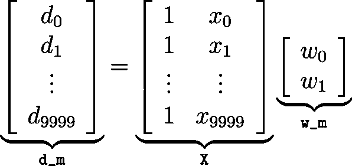

# 纯 Python 与 NumPy 和 TensorFlow 的性能比较

> 原文：<https://realpython.com/numpy-tensorflow-performance/>

Python 有一种设计哲学，强调允许程序员用更少的代码行易读地表达概念。这种理念使得该语言适合于[多种多样的用例](https://realpython.com/world-class-companies-using-python/):简单的 web 脚本，大型 web 应用程序(如 YouTube)，其他平台的脚本语言(如 Blender 和 Autodesk 的 Maya)，以及几个领域的科学应用程序，如天文学、气象学、物理学和数据科学。

使用 [Python 列表](https://realpython.com/python-lists-tuples/)实现标量和矩阵计算在技术上是可能的。然而，这可能很笨拙，与适合数值计算的语言相比，性能很差，如 [MATLAB](https://realpython.com/matlab-vs-python/) 或 Fortran，甚至一些通用语言，如 [C](https://realpython.com/c-for-python-programmers/) 或 [C++](https://realpython.com/python-vs-cpp/) 。

为了避免这一缺陷，出现了几个库，它们在保持 Python 易用性的同时，还能以高效的方式执行数值计算。值得一提的两个这样的库是 *NumPy* (为 Python 带来高效数值计算的先驱库之一)和 *TensorFlow* (最近推出的一个更专注于深度学习算法的库)。

*   NumPy 提供了对大型多维数组和矩阵的支持，以及对这些元素进行操作的数学函数集合。该项目依赖于以其他语言(如 Fortran)实现的众所周知的包来执行高效的计算，为用户带来 Python 的表现力和类似于 MATLAB 或 Fortran 的性能。
*   TensorFlow 是一个用于数值计算的开源库，最初由谷歌大脑团队的研究人员和工程师开发。该库的主要重点是提供一个易于使用的 API 来实现实用的机器学习算法，并将其部署为在 CPU、GPU 或集群上运行。

但是这些方案如何比较呢？用 NumPy 而不是纯 Python 实现时，应用程序的运行速度会快多少？TensorFlow 呢？本文的目的是开始探索通过使用这些库可以实现的改进。

为了比较这三种方法的性能，您将使用原生 Python、NumPy 和 [TensorFlow](https://realpython.com/pytorch-vs-tensorflow/) 构建一个基本的回归。

**获得通知:**不要错过本教程的后续— [点击这里加入真正的 Python 时事通讯](https://realpython.com/bonus/newsletter-dont-miss-updates/)你会知道下一期什么时候出来。

## 工程测试数据

为了测试库的性能，您将考虑一个简单的双参数[线性回归](https://realpython.com/linear-regression-in-python/)问题。该模型有两个参数:截距项`w_0`和单个系数`w_1`。

给定 N 对输入`x`和期望输出`d`，想法是使用线性模型`y = w_0 + w_1 * x`对输出和输入之间的关系建模，其中模型`y`的输出大约等于每对`(x, d)`的期望输出`d`。

**技术细节**:截距项`w_0`，技术上只是一个类似`w_1`的系数，但可以解释为一个系数乘以一个 1 的向量的元素。

要生成问题的训练集，请使用以下程序:

```py
import numpy as np

np.random.seed(444)

N = 10000
sigma = 0.1
noise = sigma * np.random.randn(N)
x = np.linspace(0, 2, N)
d = 3 + 2 * x + noise
d.shape = (N, 1)

# We need to prepend a column vector of 1s to `x`.
X = np.column_stack((np.ones(N, dtype=x.dtype), x))
print(X.shape)
(10000, 2)
```

该程序创建了一组 10，000 个输入`x`，线性分布在从 0 到 2 的区间内。然后它创建一组期望的输出`d = 3 + 2 * x + noise`，其中`noise`取自具有零均值和标准差`sigma = 0.1`的[高斯](https://en.wikipedia.org/wiki/Normal_distribution)(正态)分布。

通过以这种方式创建`x`和`d`，您有效地规定了`w_0`和`w_1`的最优解分别是 3 和 2。

```py
Xplus = np.linalg.pinv(X)
w_opt = Xplus @ d
print(w_opt)
[[2.99536719]
 [2.00288672]]
```

有几种方法来估计参数`w_0`和`w_1`以将线性模型拟合到训练集。最常用的方法之一是普通最小二乘法，这是一种众所周知的估计`w_0`和`w_1`的解决方案，用于最小化误差`e`的平方，误差由每个训练样本的`y - d`的总和给出。

一种简单计算普通最小二乘解的方法是使用矩阵的 [Moore-Penrose 伪逆](https://docs.scipy.org/doc/numpy/reference/generated/numpy.linalg.pinv.html)。这种方法源于这样一个事实，即你有`X`和`d`，并试图在方程`d = X @ w_m`中求解`w_m`。(`@`符号表示矩阵乘法，从 [PEP 465 和 Python 3.5+](https://docs.python.org/3/whatsnew/3.5.html#pep-465-a-dedicated-infix-operator-for-matrix-multiplication) 开始，NumPy 和原生 Python 都支持矩阵乘法。)

[](https://files.realpython.com/media/matrix.7db7274c350a.png)

使用这种方法，我们可以使用`w_opt = Xplus @ d`来估计`w_m`，其中`Xplus`由`X`的伪逆给出，可以使用`numpy.linalg.pinv`来计算，得到`w_0 = 2.9978`和`w_1 = 2.0016`，这与`w_0 = 3`和`w_1 = 2`的预期值非常接近。

**注意**:使用`w_opt = np.linalg.inv(X.T @ X) @ X.T @ d`会产生相同的解决方案。更多信息，参见[多元回归模型的矩阵公式](https://onlinecourses.science.psu.edu/stat501/node/382)。

虽然可以使用这种确定性方法来估计线性模型的系数，但对于其他一些模型，如神经网络，这是不可能的。在这些情况下，迭代算法用于估计模型参数的解。

最常用的算法之一是[梯度下降](https://en.wikipedia.org/wiki/Gradient_descent)，它在高层次上包括更新参数系数，直到我们收敛到最小化损失(或*成本*)。也就是说，我们有一些成本函数(通常是[均方误差—MSE](https://en.wikipedia.org/wiki/Mean_squared_error) ，我们计算它相对于网络系数的梯度(在这种情况下，参数`w_0`和`w_1`)，考虑步长`mu`。通过多次(在许多时期)执行这种更新，系数收敛到最小化成本函数的解。

在接下来的部分中，您将在 pure Python、NumPy 和 TensorFlow 中构建和使用[梯度下降算法](https://realpython.com/gradient-descent-algorithm-python/)。为了比较这三种方法的性能，我们将在英特尔酷睿 i7 4790K 4.0 GHz CPU 上进行运行时比较。

[*Remove ads*](/account/join/)

## 纯 Python 中的渐变下降

让我们从纯 Python 方法开始，作为与其他方法进行比较的基线。下面的 Python 函数使用[梯度下降](https://en.wikipedia.org/wiki/Gradient_descent)来估计参数`w_0`和`w_1`:

```py
import itertools as it

def py_descent(x, d, mu, N_epochs):
    N = len(x)
    f = 2 / N

    # "Empty" predictions, errors, weights, gradients.
    y = [0] * N
    w = [0, 0]
    grad = [0, 0]

    for _ in it.repeat(None, N_epochs):
        # Can't use a generator because we need to
        # access its elements twice.
        err = tuple(i - j for i, j in zip(d, y))
        grad[0] = f * sum(err)
        grad[1] = f * sum(i * j for i, j in zip(err, x))
        w = [i + mu * j for i, j in zip(w, grad)]
        y = (w[0] + w[1] * i for i in x)
    return w
```

以上，一切都是用 [Python list comprehensions](https://dbader.org/blog/list-dict-set-comprehensions-in-python) 、[切片语法](https://docs.python.org/3/reference/expressions.html?highlight=slice#slicings)，以及内置的`sum()`和 [`zip()`](https://realpython.com/python-zip-function/) 函数完成的。在运行每个时期之前，为`y`、`w`和`grad`初始化零的“空”容器。

**技术细节** : `py_descent`上面确实用了 [`itertools.repeat()`](https://realpython.com/python-itertools/) 而不是`for _ in range(N_epochs)`。前者比后者快，因为`repeat()`不需要为每个循环制造一个不同的整数。它只需要将引用计数更新为`None`。timeit 模块[包含一个示例](https://github.com/python/cpython/blob/306559e6ca15b86eb230609f484f48132b7ca383/Lib/timeit.py#L174)。

现在，用这个来找一个解决方案:

```py
import time

x_list = x.tolist()
d_list = d.squeeze().tolist()  # Need 1d lists

# `mu` is a step size, or scaling factor.
mu = 0.001
N_epochs = 10000

t0 = time.time()
py_w = py_descent(x_list, d_list, mu, N_epochs)
t1 = time.time()

print(py_w)
[2.959859852416156, 2.0329649630002757]

print('Solve time: {:.2f} seconds'.format(round(t1 - t0, 2)))
Solve time: 18.65 seconds
```

步长为`mu = 0.001`和 10，000 个历元，我们可以得到一个相当精确的`w_0`和`w_1`的估计值。在 for 循环内部，计算关于参数的梯度，并依次用于更新权重，向相反方向移动，以便最小化 MSE 成本函数。

在更新后的每个时期，计算模型的输出。使用列表理解来执行向量运算。我们也可以就地更新`y`，但是这对性能没有好处。

使用 [`time`库](https://docs.python.org/3/library/time.html#time.time)测量算法的运行时间。估计`w_0 = 2.9598`和`w_1 = 2.0329`需要 18.65 秒。虽然`timeit`库可以通过运行多个循环和禁用[垃圾收集](https://docs.python.org/3/library/timeit.html#timeit.Timer.timeit)来提供更精确的运行时间估计，但是在这种情况下，只查看一次使用`time`的运行就足够了，您很快就会看到这一点。

## 使用 NumPy

NumPy 增加了对大型多维数组和矩阵的支持，以及对它们进行操作的数学函数集合。依靠底层实现的 [BLAS](http://www.netlib.org/blas/) 和 [LAPACK](http://www.netlib.org/lapack/) 项目，操作被优化为以闪电般的速度运行。

使用 [NumPy](https://realpython.com/tutorials/numpy/) ，考虑以下程序来估计回归的参数:

```py
def np_descent(x, d, mu, N_epochs):
    d = d.squeeze()
    N = len(x)
    f = 2 / N

    y = np.zeros(N)
    err = np.zeros(N)
    w = np.zeros(2)
    grad = np.empty(2)

    for _ in it.repeat(None, N_epochs):
        np.subtract(d, y, out=err)
        grad[:] = f * np.sum(err), f * (err @ x)
        w = w + mu * grad
        y = w[0] + w[1] * x
    return w

np_w = np_descent(x, d, mu, N_epochs)
print(np_w)
[2.95985985 2.03296496]
```

上面的代码块利用了 NumPy 数组(`ndarrays` ) )的[矢量化运算。唯一明确的 for 循环是外部循环，训练例程本身在外部循环上重复。这里没有列表理解，因为 NumPy 的`ndarray`类型重载了算术运算符，以优化的方式执行数组计算。](https://realpython.com/numpy-array-programming/)

您可能会注意到，有几种替代方法可以解决这个问题。例如，您可以简单地使用`f * err @ X`，其中`X`是包含一个列向量的 2d 数组，而不是我们的 1d `x`。

然而，这实际上并不那么有效，因为它需要一整列 1 与另一个向量(`err`)的点积，我们知道结果将只是`np.sum(err)`。同样，在这种特定情况下，`w[0] + w[1] * x`比`w * X`浪费更少的计算。

我们来看一下时序对比。正如您将在下面看到的，这里需要 [timeit](https://docs.python.org/3.6/library/timeit.html) 模块来获得更精确的运行时图像，因为我们现在讨论的是几分之一秒的运行时，而不是几秒钟的运行时:

```py
import timeit

setup = ("from __main__ import x, d, mu, N_epochs, np_descent;"
         "import numpy as np")
repeat = 5
number = 5  # Number of loops within each repeat

np_times = timeit.repeat('np_descent(x, d, mu, N_epochs)', setup=setup,
                         repeat=repeat, number=number)
```

[`timeit.repeat()`](https://docs.python.org/3/library/timeit.html#timeit.repeat) 返回一个列表。每个元素是执行语句的 *n 个*循环所花费的总时间。要获得运行时间的单个估计值，您可以从重复列表的下限中获取单个调用的平均时间:

```py
print(min(np_times) / number)
0.31947448799983247
```

[*Remove ads*](/account/join/)

## 使用张量流

TensorFlow 是一个用于数值计算的开源库，最初由在[谷歌大脑](https://en.wikipedia.org/wiki/Google_Brain)团队工作的研究人员和工程师开发。

TensorFlow 使用其 Python API，将例程实现为要执行的计算的图形。图中的节点表示数学运算，图边表示它们之间通信的多维数据数组(也称为张量)。

在运行时，TensorFlow 获取计算图表，并使用优化的 C++代码高效地运行它。通过分析计算图表，TensorFlow 能够识别可以并行运行的操作。这种架构允许使用单个 API 将计算部署到台式机、服务器或移动设备中的一个或多个 CPU 或 GPU。

使用 TensorFlow，考虑以下程序来估计回归的参数:

```py
import tensorflow as tf

def tf_descent(X_tf, d_tf, mu, N_epochs):
    N = X_tf.get_shape().as_list()[0]
    f = 2 / N

    w = tf.Variable(tf.zeros((2, 1)), name="w_tf")
    y = tf.matmul(X_tf, w, name="y_tf")
    e = y - d_tf
    grad = f * tf.matmul(tf.transpose(X_tf), e)

    training_op = tf.assign(w, w - mu * grad)
    init = tf.global_variables_initializer()

    with tf.Session() as sess:
        init.run()
        for epoch in range(N_epochs):
            sess.run(training_op)
        opt = w.eval()
    return opt

X_tf = tf.constant(X, dtype=tf.float32, name="X_tf")
d_tf = tf.constant(d, dtype=tf.float32, name="d_tf")

tf_w = tf_descent(X_tf, d_tf, mu, N_epochs)
print(tf_w)
[[2.9598553]
 [2.032969 ]]
```

当您使用 TensorFlow 时，必须将数据加载到一个称为`Tensor`的特殊数据类型中。张量镜像 NumPy 数组的方式比它们不相似的方式更多。

```py
type(X_tf)
<class 'tensorflow.python.framework.ops.Tensor'>
```

在从训练数据创建张量之后，计算的图形被定义为:

*   首先，使用一个变量张量`w`来存储回归参数，这些参数将在每次迭代中更新。
*   使用`w`和`X_tf`，使用矩阵乘积计算输出`y`，用`tf.matmul()`实现。
*   误差被计算并存储在`e`张量中。
*   使用矩阵方法，通过将`X_tf`的转置乘以`e`来计算梯度。
*   最后，用`tf.assign()`函数实现回归参数的更新。它创建一个实现批量梯度下降的节点，将下一步张量`w`更新为`w - mu * grad`。

值得注意的是，在`training_op`创建之前，代码不执行任何计算。它只是创建了要执行的计算的图表。事实上，甚至变量都还没有初始化。为了执行计算，有必要创建一个会话，并使用它来初始化变量和运行算法，以评估回归的参数。

有一些不同的方法来初始化变量和创建会话来执行计算。在这个程序中，行`init = tf.global_variables_initializer()`在图中创建一个节点，当它运行时将初始化变量。会话在`with`块中创建，`init.run()`用于实际初始化变量。在`with`模块内，`training_op`运行所需的历元数，评估回归参数，其最终值存储在`opt`中。

下面是 NumPy 实现中使用的相同代码定时结构:

```py
setup = ("from __main__ import X_tf, d_tf, mu, N_epochs, tf_descent;"
         "import tensorflow as tf")

tf_times = timeit.repeat("tf_descent(X_tf, d_tf, mu, N_epochs)", setup=setup,
                         repeat=repeat, number=number)

print(min(tf_times) / number)
1.1982891103994917
```

估计`w_0 = 2.9598553`和`w_1 = 2.032969`用了 1.20 秒。值得注意的是，计算是在 CPU 上执行的，在 GPU 上运行时性能可能会有所提高。

最后，您还可以定义一个 MSE 成本函数，并将其传递给 TensorFlow 的`gradients()`函数，该函数执行自动微分，找到 MSE 相对于权重的梯度向量:

```py
mse = tf.reduce_mean(tf.square(e), name="mse")
grad = tf.gradients(mse, w)[0]
```

但是，这种情况下的时间差异可以忽略不计。

## 结论

本文的目的是对估计线性回归问题系数的简单迭代算法的纯 Python、NumPy 和 TensorFlow 实现的性能进行初步比较。

下表总结了运行算法所用时间的结果:

| 履行 | 经过时间 |
| --- | --- |
| 带列表理解的纯 Python | 18.65 秒 |
| NumPy | 0.32 秒 |
| TensorFlow on CPU | 1.20 秒 |

虽然 NumPy 和 TensorFlow 解决方案很有竞争力(在 CPU 上)，但纯 Python 实现远远排在第三位。虽然 Python 是一种健壮的通用编程语言，但它面向数值计算的库将在数组的大批量操作中胜出。

虽然在这种情况下，NumPy 示例被证明比 TensorFlow 快一点，但重要的是要注意 TensorFlow 确实在更复杂的情况下表现出色。对于我们相对初级的回归问题，使用 TensorFlow 可以说相当于“用大锤砸坚果”，正如俗话所说。

使用 TensorFlow，可以在数百或数千个多 GPU 服务器上构建和训练复杂的神经网络。在以后的文章中，我们将介绍使用 TensorFlow 在 GPU 中运行这个示例的设置，并比较结果。

**获得通知:**不要错过本教程的后续— [点击这里加入真正的 Python 时事通讯](https://realpython.com/bonus/newsletter-dont-miss-updates/)你会知道下一期什么时候出来。

[*Remove ads*](/account/join/)

## 参考文献

*   [NumPy](http://www.numpy.org/) 和 [TensorFlow](https://www.tensorflow.org/) 主页
*   Aurélien Géron: [使用 Scikit-Learn 和 TensorFlow 进行动手机器学习](https://realpython.com/asins/1491962291/)
*   [看 Ma，无 For 循环:用 NumPy 进行数组编程](https://realpython.com/numpy-array-programming/)
*   真正的 Python 上的 NumPy 教程***