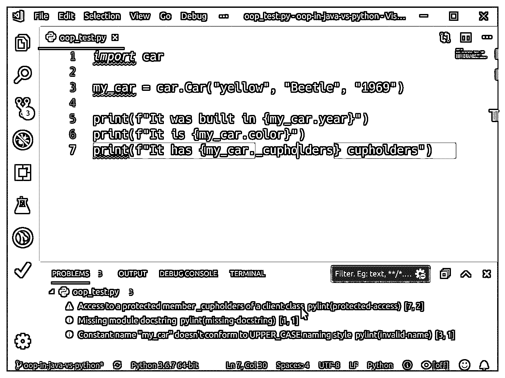

# Python 与 Java 中的面向对象编程

> 原文：<https://realpython.com/oop-in-python-vs-java/>

*立即观看**本教程有真实 Python 团队创建的相关视频课程。和书面教程一起看，加深理解: [**Python vs Java:面向对象编程**](/courses/python-vs-java-object-oriented-programming/)

转向 Python 的 Java 程序员经常会纠结于 Python 的面向对象编程(OOP)方法。Python 和 Java 处理对象、变量类型和其他语言功能的方法非常不同。这会使两种语言之间的切换变得非常混乱。

本文比较了 Python 和 Java 对面向对象编程的支持。最后，您将能够将您的面向对象编程知识应用到 Python 中，理解如何将您对 Java 对象的理解重新解释到 Python 中，并以 Python 的方式使用对象。

**通过这篇文章，你将:**

*   用 Java 和 Python 构建一个基本类
*   探索 Python 和 Java 中对象属性的工作方式
*   比较和对比 Java 方法和 Python 函数
*   发现两种语言中的继承和多态机制
*   对比 Python 和 Java 研究反射
*   在两种语言的完整类实现中应用所有内容

本文不是面向对象编程的入门。相反，它比较了 Python 和 Java 的面向对象特性和原理。读者应该对 Java 有很好的了解，并且熟悉编码 Python。如果你对面向对象编程不熟悉，那么看看 Python 中的[面向对象编程(OOP)介绍。所有 Python 示例都适用于 Python 3.6 或更高版本。](https://realpython.com/courses/intro-object-oriented-programming-oop-python/)

**下载示例代码:** [单击此处下载本文中 Java 和 Python 对象的注释示例对象定义和源代码](https://realpython.com/bonus/oop-python-vs-java/)。

## Python 与 Java 中的示例类

首先，您将用 Python 和 Java 实现同一个小类来说明它们之间的区别。随着文章的进展，您将对它们进行修改。

首先，假设您在 Java 中有下面的`Car`类定义:

```py
 1public  class Car  { 2  private  String  color; 3  private  String  model; 4  private  int  year; 5
 6  public  Car(String  color,  String  model,  int  year)  { 7  this.color  =  color; 8  this.model  =  model; 9  this.year  =  year; 10  } 11
12  public  String  getColor()  { 13  return  color; 14  } 15
16  public  String  getModel()  { 17  return  model; 18  } 19
20  public  int  getYear()  { 21  return  year; 22  } 23}
```

Java 类在与类同名的文件中定义。因此，您必须将这个类保存在一个名为`Car.java`的文件中。每个文件中只能定义一个类。

一个类似的小`Car`类用 Python 编写如下:

```py
 1class Car:
 2    def __init__(self, color, model, year):
 3        self.color = color
 4        self.model = model
 5        self.year = year
```

在 Python 中，你可以随时随地在任何文件中声明一个类。将该类保存在文件`car.py`中。

使用这些类作为基础，您可以探索类和对象的基本组件。

[*Remove ads*](/account/join/)

## 对象属性

所有面向对象的语言都有某种方式来存储关于对象的数据。在 Java 和 Python 中，数据存储在**属性**中，这些属性是与特定对象相关联的变量。

Python 和 Java 之间最显著的区别之一是它们如何定义和管理类和对象属性。其中一些差异来自语言的限制，而另一些则来自最佳实践。

### 声明和初始化

在 Java 中，在类体中，在任何方法之外，用一个明确的类型来声明属性。您必须在使用类属性之前定义它们:

```py
 1public  class Car  { 2  private  String  color;  3  private  String  model;  4  private  int  year;
```

在 Python 中，在类`__init__()`中声明和定义属性，这相当于 Java 的构造函数:

```py
 1def __init__(self, color, model, year):
 2    self.color = color
 3    self.model = model
 4    self.year = year
```

通过在变量名前加前缀`self`，您告诉 Python 这些是属性。该类的每个实例都有一个副本。Python 中的所有变量都是[松散类型的](https://realpython.com/python-type-checking/#duck-typing)，这些属性也不例外。

您也可以在`.__init__()`之外创建实例变量，但这不是最佳实践，因为它们的范围经常令人困惑。如果使用不当，在`.__init__()`之外创建的实例变量会导致难以发现的细微错误。例如，您可以向一个`Car`对象添加一个新属性`.wheels`，如下所示:

>>>

```py
 1>>> import car
 2>>> my_car = car.Car("yellow", "beetle", 1967)
 3>>> print(f"My car is {my_car.color}")
 4My car is yellow
 5
 6>>> my_car.wheels = 5 7>>> print(f"Wheels: {my_car.wheels}")
 8Wheels: 5
```

但是，如果您忘记了第 6 行的`my_car.wheels = 5`，那么 Python 会显示一个错误:

>>>

```py
 1>>> import car
 2>>> my_car = car.Car("yellow", "beetle", 1967)
 3>>> print(f"My car is {my_car.color}")
 4My car is yellow
 5
 6>>> print(f"Wheels: {my_car.wheels}")
 7Traceback (most recent call last): 8  File "<stdin>", line 1, in <module> 9AttributeError: 'Car' object has no attribute 'wheels'
```

在 Python 中，当你在方法之外声明一个变量时，它被当作一个类变量。按如下方式更新`Car`类:

```py
 1class Car:
 2
 3    wheels = 0 4
 5    def __init__(self, color, model, year):
 6        self.color = color
 7        self.model = model
 8        self.year = year
```

这改变了您使用变量`wheels`的方式。不是使用对象来引用它，而是使用类名来引用它:

>>>

```py
 1>>> import car
 2>>> my_car = car.Car("yellow", "beetle", 1967)
 3>>> print(f"My car is {my_car.color}")
 4My car is yellow
 5
 6>>> print(f"It has {car.Car.wheels} wheels")
 7It has 0 wheels
 8
 9>>> print(f"It has {my_car.wheels} wheels")
10It has 0 wheels
```

**注意:**在 Python 中，使用以下语法引用类变量:

1.  包含该类的文件名，不带扩展名`.py`
2.  一个点
3.  类别的名称
4.  一个点
5.  变量的名称

因为您在文件`car.py`中保存了`Car`类，所以您将第 6 行的类变量`wheels`称为`car.Car.wheels`。

可以参考`my_car.wheels`或者`car.Car.wheels`，但是要小心。改变实例变量`my_car.wheels`的值不会改变类变量`car.Car.wheels`的值:

>>>

```py
 1>>> from car import *
 2>>> my_car = car.Car("yellow", "Beetle", "1966")
 3>>> my_other_car = car.Car("red", "corvette", "1999")
 4
 5>>> print(f"My car is {my_car.color}")
 6My car is yellow
 7>>> print(f"It has {my_car.wheels} wheels")
 8It has 0 wheels
 9
10>>> print(f"My other car is {my_other_car.color}")
11My other car is red
12>>> print(f"It has {my_other_car.wheels} wheels")
13It has 0 wheels
14
15>>> # Change the class variable value
16... car.Car.wheels = 4 17
18>>> print(f"My car has {my_car.wheels} wheels")
19My car has 4 wheels
20>>> print(f"My other car has {my_other_car.wheels} wheels")
21My other car has 4 wheels
22
23>>> # Change the instance variable value for my_car
24... my_car.wheels = 5 25
26>>> print(f"My car has {my_car.wheels} wheels")
27My car has 5 wheels
28>>> print(f"My other car has {my_other_car.wheels} wheels")
29My other car has 4 wheels
```

您在第 2 行和第 3 行定义了两个`Car`对象:

1.  `my_car`
2.  `my_other_car`

一开始，两者都是零轮。当您在第 16 行使用`car.Car.wheels = 4`设置类变量时，两个对象现在都有四个轮子。然而，当您在第 24 行使用`my_car.wheels = 5`设置实例变量时，只有该对象受到影响。

这意味着现在有两个不同的`wheels`属性副本:

1.  适用于所有`Car`对象的类变量
2.  仅适用于`my_car`对象的特定实例变量

无意中引用错误的对象并引入微妙的错误并不困难。

Java 的类属性的等价物是一个`static`属性:

```py
public  class Car  { private  String  color; private  String  model; private  int  year; private  static  int  wheels;  
  public  Car(String  color,  String  model,  int  year)  { this.color  =  color; this.model  =  model; this.year  =  year; } public  static  int  getWheels()  {  return  wheels;  }    public  static  void  setWheels(int  count)  {  wheels  =  count;  }  }
```

通常，您使用 Java 类名来引用静态变量。您可以通过 Python 这样的类实例引用静态变量，但这不是最佳实践。

你的 Java 类越来越长了。Java 比 Python 更冗长的原因之一是公共和私有方法和属性的概念。

[*Remove ads*](/account/join/)

### 公有和私有

Java 通过区分**公共**数据和**私有**数据来控制对方法和属性的访问。

在 Java 中，属性被声明为`private`，或者`protected`，如果子类需要直接访问它们的话。这限制了从类外部的代码对这些属性的访问。为了提供对`private`属性的访问，您声明了以受控方式设置和检索数据的`public`方法(稍后将详细介绍)。

回想一下上面的 Java 类，变量`color`被声明为`private`。因此，这段 Java 代码将在突出显示的一行显示一个编译错误:

```py
Car  myCar  =  new  Car("blue",  "Ford",  1972); // Paint the car myCar.color  =  "red";
```

如果您没有指定访问级别，那么属性默认为**包保护**，这限制了对同一个包中的类的访问。如果您想让代码工作，您必须将属性标记为`public`。

然而，在 Java 中声明公共属性并不被认为是最佳实践。您应该将属性声明为`private`，并使用`public`访问方法，如代码中所示的`.getColor()`和`.getModel()`。

Python 不像 Java 那样有相同的`private`或`protected`数据概念。Python 中的一切都是`public`。这段代码与您现有的 Python 类配合得很好:

>>>

```py
>>> my_car = car.Car("blue", "Ford", 1972)

>>> # Paint the car
... my_car.color = "red"
```

取代了`private`，Python 有了一个**非公共**实例变量的概念。任何以下划线字符开头的变量都被定义为非公共变量。这种命名约定使得访问变量更加困难，但这只是一种命名约定，您仍然可以直接访问变量。

将下面一行添加到 Python `Car`类中:

```py
class Car:

    wheels = 0

    def __init__(self, color, model, year):
        self.color = color
        self.model = model
        self.year = year
 self._cupholders = 6
```

您可以直接访问`._cupholders`变量:

>>>

```py
>>> import car
>>> my_car = car.Car("yellow", "Beetle", "1969")
>>> print(f"It was built in {my_car.year}")
It was built in 1969
>>> my_car.year = 1966
>>> print(f"It was built in {my_car.year}")
It was built in 1966
>>> print(f"It has {my_car._cupholders} cupholders.") It has 6 cupholders.
```

Python 允许你访问`._cupholders`，但是像 [VS Code](https://realpython.com/courses/python-development-visual-studio-code-setup-guide/) 这样的 ide 可能会通过支持 PEP 8 的 linters 发出警告。关于 PEP 8 的更多信息，请阅读[如何用 PEP 8](https://realpython.com/python-pep8/) 编写漂亮的 Python 代码。

下面是 VS 代码中的代码，其中突出显示了一条警告:

[](https://files.realpython.com/media/oop_linting_vscode.b7a1cd7fd5ca.png)

Python 进一步认识到在变量前使用双下划线字符来隐藏 Python 中的属性。当 Python 看到双下划线变量时，它会在内部更改变量名，使其难以直接访问。这种机制[避免了事故](https://www.python.org/dev/peps/pep-0008/#method-names-and-instance-variables)，但仍然不会使数据无法访问。

为了展示这种机制的作用，再次更改 Python `Car`类:

```py
class Car:

    wheels = 0

    def __init__(self, color, model, year):
        self.color = color
        self.model = model
        self.year = year
 self.__cupholders = 6
```

现在，当您试图访问`.__cupholders`变量时，您会看到以下错误:

>>>

```py
>>> import car
>>> my_car = car.Car("yellow", "Beetle", "1969")
>>> print(f"It was built in {my_car.year}")
It was built in 1969
>>> my_car.year = 1966
>>> print(f"It was built in {my_car.year}")
It was built in 1966
>>> print(f"It has {my_car.__cupholders} cupholders.") Traceback (most recent call last):
 File "<stdin>", line 1, in <module> AttributeError: 'Car' object has no attribute '__cupholders'
```

那么为什么`.__cupholders`属性不存在呢？

当 Python 看到带有双下划线的属性时，它会通过在属性的原始名称前加上下划线，然后加上类名来更改属性。要直接使用该属性，您还需要更改您使用的名称:

>>>

```py
>>> print(f"It has {my_car._Car__cupholders} cupholders") It has 6 cupholders
```

当您使用双下划线向用户隐藏属性时，Python 会以一种有据可查的方式更改名称。这意味着有决心的开发人员仍然可以直接访问该属性。

因此，如果您的 Java 属性被声明为`private`，并且您的 Python 属性以双下划线开头，那么您如何提供和控制对它们存储的数据的访问呢？

[*Remove ads*](/account/join/)

### 访问控制

在 Java 中，使用[设置器和获取器](https://realpython.com/python-getter-setter/)来访问`private`属性。要允许用户为他们的汽车喷漆，请将以下代码添加到 Java 类中:

```py
public  String  getColor()  { return  color; } public  void  setColor(String  color)  { this.color  =  color; }
```

由于`.getColor()`和`.setColor()`是`public`，任何人都可以调用它们来改变或检索汽车的颜色。Java 使用通过`public`**getter**和**setter**访问的`private`属性的最佳实践是 Java 代码比 Python 更冗长的原因之一。

正如您在上面看到的，您可以在 Python 中直接访问属性。因为一切都是`public`的，所以你可以随时随地访问任何东西。您可以通过引用属性值的名称来直接设置和获取属性值。您甚至可以在 Python 中删除属性，这在 Java 中是不可能的:

>>>

```py
>>> my_car = Car("yellow", "beetle", 1969)
>>> print(f"My car was built in {my_car.year}")
My car was built in 1969
>>> my_car.year = 1966
>>> print(f"It was built in {my_car.year}")
It was built in 1966
>>> del my_car.year
>>> print(f"It was built in {my_car.year}")
Traceback (most recent call last):
  File "<stdin>", line 1, in <module>
AttributeError: 'Car' object has no attribute 'year'
```

但是，有时您可能希望控制对属性的访问。在这种情况下，您可以使用 Python 属性。

在 Python 中， [properties](https://realpython.com/python-property/) 使用 Python decorator 语法提供对类属性的可控访问。(你可以在视频课程 [Python Decorators 101](https://realpython.com/courses/python-decorators-101/) 中了解装饰师。)属性允许在 Python 类中声明类似于 Java getter 和 setter 方法的函数，另外还允许您删除属性。

通过向您的`Car`类添加一个属性，您可以看到属性是如何工作的:

```py
 1class Car:
 2    def __init__(self, color, model, year):
 3        self.color = color
 4        self.model = model
 5        self.year = year
 6        self._voltage = 12 7
 8    @property 9    def voltage(self): 10        return self._voltage 11 12    @voltage.setter 13    def voltage(self, volts): 14        print("Warning: this can cause problems!") 15        self._voltage = volts 16 17    @voltage.deleter 18    def voltage(self): 19        print("Warning: the radio will stop working!") 20        del self._voltage
```

在这里，你将`Car`的概念扩展到包括电动汽车。您声明了`._voltage`属性来保持第 6 行上的电池电压。

为了提供受控访问，您[定义了一个名为`voltage()`的函数](https://realpython.com/defining-your-own-python-function/)来返回第 9 行和第 10 行的私有值。通过使用`@property`装饰，您将它标记为一个任何人都可以直接访问的 getter。

类似地，您在第 13 到 15 行定义了一个 setter 函数，也称为`voltage()`。但是，你用`@voltage.setter`来修饰这个函数。最后，使用`@voltage.deleter`在第 18 到 20 行修饰第三个`voltage()`，它允许属性的受控删除。

修饰函数的名称都是相同的，表明它们控制对同一属性的访问。函数名也成为您用来访问该值的属性名。下面是这些属性在实践中的工作方式:

>>>

```py
 1>>> from car import *
 2>>> my_car = Car("yellow", "beetle", 1969)
 3
 4>>> print(f"My car uses {my_car.voltage} volts") 5My car uses 12 volts
 6
 7>>> my_car.voltage = 6 8Warning: this can cause problems!
 9
10>>> print(f"My car now uses {my_car.voltage} volts") 11My car now uses 6 volts
12
13>>> del my_car.voltage 14Warning: the radio will stop working!
```

请注意，您在上面突出显示的行中使用了`.voltage`，而不是`._voltage`。这告诉 Python 使用您定义的属性函数:

*   当你在第 4 行打印出`my_car.voltage`的值时，Python 调用用`@property`修饰的`.voltage()`。
*   当你给第 7 行的`my_car.voltage`赋值时，Python 调用用`@voltage.setter`修饰的`.voltage()`。
*   当你删除第 13 行的`my_car.voltage`时，Python 调用用`@voltage.deleter`修饰的`.voltage()`。

`@property`、`@.setter`和`@.deleter`装饰使得控制对属性的访问成为可能，而不需要用户使用不同的方法。您甚至可以通过省略`@.setter`和`@.deleter`修饰函数来使属性看起来是只读属性。

### `self`和`this`

在 Java 中，类通过`this`引用来引用自己:

```py
public  void  setColor(String  color)  { this.color  =  color; }
```

`this`在 Java 代码中是隐式的:通常不需要编写它，除非同名的两个变量可能会混淆。

您可以这样编写同一个 setter:

```py
public  void  setColor(String  newColor)  { color  =  newColor; }
```

因为`Car`有一个名为`.color`的属性，并且作用域中没有另一个同名的变量，所以引用那个名称是有效的。在第一个例子中，我们使用了`this`来区分名为`color`的属性和参数。

在 Python 中，[关键字](https://realpython.com/python-keywords/) `self`也有类似的用途。这是你引用成员变量的方式，但与 Java 的`this`不同，如果你想创建或引用一个成员属性，它是*必需的*:

```py
class Car:
    def __init__(self, color, model, year):
 self.color = color self.model = model self.year = year self._voltage = 12 
    @property
    def voltage(self):
 return self._voltage
```

Python 需要上面代码中的每个`self`。每一个都创建或引用属性。如果忽略它们，Python 将创建一个局部变量，而不是属性。

在 Python 和 Java 中使用`self`和`this`的不同之处在于这两种语言之间的潜在差异以及它们命名变量和属性的方式。

[*Remove ads*](/account/join/)

## 方法和功能

Python 和 Java 的区别，简单来说，就是 Python 有函数，而 Java 没有。

在 Python 中，下面的代码非常好(也非常常见):

>>>

```py
>>> def say_hi():
...     print("Hi!")
... 
>>> say_hi()
Hi!
```

你可以从任何可见的地方调用`say_hi()`。这个函数没有对`self`的引用，说明它是一个全局函数，不是一个类函数。它不能改变或存储任何类中的任何数据，但可以使用局部和全局变量。

相比之下，你写的每一行 Java 代码都属于一个类。函数不能存在于类之外，根据定义，所有的 Java 函数都是方法。在 Java 中，最接近纯函数的方法是使用静态方法:

```py
public  class Utils  { static  void  SayHi()  { System.out.println("Hi!"); } }
```

`Utils.SayHi()`可以从任何地方调用，而无需首先创建`Utils`的实例。因为您可以在不创建对象的情况下调用`SayHi()`，所以`this`引用不存在。然而，这仍然不是一个像`say_hi()`在 Python 中那样的函数。

## 遗传和多态性

[继承](https://en.wikipedia.org/wiki/Inheritance_(object-oriented_programming))和[多态](https://en.wikipedia.org/wiki/Polymorphism_(computer_science))是面向对象编程中的两个基本概念。

[继承](https://realpython.com/inheritance-composition-python/)允许对象从其他对象派生属性和功能，创建从更一般的对象到更具体的对象的层次结构。例如，`Car`和`Boat`都是`Vehicles`的具体类型。对象可以从单个父对象或多个父对象继承它们的行为，并且当它们这样做时被称为子对象。

[多态](https://en.wikipedia.org/wiki/Polymorphism_(computer_science))允许两个或更多的对象行为相似，这使得它们可以互换使用。例如，如果一个方法或函数知道如何绘制一个`Vehicle`对象，那么它也可以绘制一个`Car`或`Boat`对象，因为它们从`Vehicle`继承它们的数据和行为。

这些基本的 OOP 概念在 Python 和 Java 中的实现非常不同。

### 继承

Python 支持多重继承，或者创建从多个父类继承行为的类。

要了解这是如何工作的，可以将`Car`类分成两类，一类用于车辆，另一类用于用电设备:

```py
class Vehicle:
 def __init__(self, color, model): self.color = color self.model = model   class Device:
 def __init__(self): self._voltage = 12   class Car(Vehicle, Device):
 def __init__(self, color, model, year): Vehicle.__init__(self, color, model) Device.__init__(self)        self.year = year

    @property
    def voltage(self):
        return self._voltage

    @voltage.setter
    def voltage(self, volts):
        print("Warning: this can cause problems!")
        self._voltage = volts

    @voltage.deleter
    def voltage(self):
        print("Warning: the radio will stop working!")
        del self._voltage
```

一个`Vehicle`被定义为具有`.color`和`.model`属性。然后，一个`Device`被定义为具有一个`._voltage`属性。因为最初的`Car`对象有这三个属性，它可以被重新定义来继承`Vehicle`和`Device`类。`color`、`model`和`_voltage`属性将成为新`Car`类的一部分。

在`Car`的`.__init__()`中，您调用两个父类的`.__init__()`方法，以确保一切都被正确初始化。完成后，您可以将任何其他功能添加到您的`Car`中。在这种情况下，添加一个特定于`Car`对象的`.year`属性，以及`.voltage`的 getter 和 setter 方法。

在功能上，新的`Car`类的行为一如既往。像以前一样创建和使用`Car`对象:

>>>

```py
>>> from car import *
>>> my_car = Car("yellow", "beetle", 1969)

>>> print(f"My car is {my_car.color}")
My car is yellow

>>> print(f"My car uses {my_car.voltage} volts")
My car uses 12 volts

>>> my_car.voltage = 6
Warning: this can cause problems!

>>> print(f"My car now uses {my_car.voltage} volts")
My car now uses 6 volts
```

另一方面，Java 只支持单一继承，这意味着 Java 中的类只能从单个父类继承数据和行为。然而，Java 对象可以从许多不同的[接口](https://docs.oracle.com/javase/tutorial/java/concepts/interface.html)继承行为。接口提供了一组对象必须实现的相关方法，并允许多个子类具有相似的行为。

为了看到这一点，将 Java `Car`类分成一个父类和一个`interface`:

```py
public  class Vehicle  {    private  String  color;  private  String  model;    public  Vehicle(String  color,  String  model)  {  this.color  =  color;  this.model  =  model;  }    public  String  getColor()  {  return  color;  }    public  String  getModel()  {  return  model;  }  }    public  interface Device  {  int  getVoltage();  }    public  class Car  extends  Vehicle  implements  Device  {  
  private  int  voltage; private  int  year; public  Car(String  color,  String  model,  int  year)  { super(color,  model);   this.year  =  year; this.voltage  =  12; } @Override  public  int  getVoltage()  {  return  voltage;  }  
  public  int  getYear()  { return  year; } }
```

请记住，每个`class`和`interface`都需要存在于自己的文件中。

正如使用 Python 一样，您创建了一个名为`Vehicle`的新类来保存更一般的车辆相关数据和功能。然而，要添加`Device`功能，您需要创建一个`interface`。该`interface`定义了返回`Device`电压的单一方法。

重新定义`Car`类需要你用`extend`继承`Vehicle`，用`implements`实现`Device`接口。在构造函数中，使用内置的 [`super()`](https://realpython.com/python-super/) 调用父类构造函数。由于只有一个父类，所以只能引用`Vehicle`构造函数。为了实现`interface`，您使用`@Override`注释编写`getVoltage()`。

与 Python 从`Device`获得代码重用不同，Java 要求你在实现`interface`的每个类中实现相同的功能。接口只定义方法——它们不能定义实例数据或实现细节。

那么为什么 Java 会出现这种情况呢？这都归结于类型。

[*Remove ads*](/account/join/)

### 类型和多态性

Java 严格的类型检查是其`interface`设计的驱动力。

Java 中的每一个`class`和`interface`都是一个类型。因此，如果两个 Java 对象实现了相同的`interface`，那么它们被认为是与那个`interface`相同的类型。这种机制允许不同的类可以互换使用，这就是多态的定义。

您可以通过创建一个需要一个`Device`来收费的`.charge()`来为您的 Java 对象实现设备收费。任何实现了`Device`接口的对象都可以传递给`.charge()`。这也意味着没有实现`Device`的类会产生编译错误。

在名为`Rhino.java`的文件中创建以下类:

```py
public  class Rhino  { }
```

现在您可以创建一个新的`Main.java`来实现`.charge()`并探索`Car`和`Rhino`对象的不同之处:

```py
public  class Main{ public  static  void  charge(Device  device)  { device.getVoltage(); } public  static  void  main(String[]  args)  throws  Exception  { Car  car  =  new  Car("yellow",  "beetle",  1969); Rhino  rhino  =  new  Rhino(); charge(car); charge(rhino); } }
```

下面是您在尝试构建这段代码时应该看到的内容:

```py
Information:2019-02-02 15:20 - Compilation completed with 
    1 error and 0 warnings in 4 s 395 ms
Main.java
Error:(43, 11) java: incompatible types: Rhino cannot be converted to Device
```

由于`Rhino`类没有实现`Device`接口，所以它不能被传入`.charge()`。

与 Java 严格的变量类型相反，Python 使用了一个叫做**鸭子类型**的概念，用基本术语来说就是如果一个变量“像鸭子一样走路，像鸭子一样嘎嘎叫，那么它就是一只鸭子。”Python 不是通过类型来识别对象，而是检查它们的行为。你可以在[Python 类型检查终极指南](https://realpython.com/python-type-checking)中了解更多关于 Python 类型系统和 duck 类型的知识。

您可以通过为您的 Python `Device`类实现类似的设备充电功能来探索 duck typing:

>>>

```py
>>> def charge(device):
...     if hasattr(device, '_voltage'):
...         print(f"Charging a {device._voltage} volt device")
...     else:
...         print(f"I can't charge a {device.__class__.__name__}")
... 
>>> class Phone(Device):
...     pass
... 
>>> class Rhino:
...     pass
... 
>>> my_car = Car("yellow", "Beetle", "1966")
>>> my_phone = Phone()
>>> my_rhino = Rhino()

>>> charge(my_car)
Charging a 12 volt device
>>> charge(my_phone)
Charging a 12 volt device
>>> charge(my_rhino)
I can't charge a Rhino
```

`charge()`必须检查它所传递的对象中是否存在`._voltage`属性。由于`Device`类定义了这个属性，任何从它继承的类(比如`Car`和`Phone`)都将拥有这个属性，因此将显示它们正在正确地收费。不从`Device`继承的职业(比如`Rhino`)可能没有这个属性，也将无法冲锋(这很好，因为冲锋犀牛可能很危险)。

### 默认方法

所有的 Java 类都是从`Object`类继承而来，它包含一组其他类继承的方法。子类可以覆盖它们或者保留默认值。`Object`类定义了以下方法:

```py
class Object  { boolean  equals(Object  obj)  {  ...  }  
  int  hashCode()  {  ...  }  
  String  toString()  {  ...  }  
}
```

默认情况下， [`equals()`](https://docs.oracle.com/javase/8/docs/api/java/lang/Object.html#equals-java.lang.Object-) 会将当前`Object`的地址与传入的第二个`Object`的地址进行比较， [`hashcode()`](https://docs.oracle.com/javase/8/docs/api/java/lang/Object.html#hashCode--) 会计算一个唯一标识符，该标识符也使用当前`Object`的地址。在 Java 中，这些方法被用在许多不同的上下文中。例如，实用程序类，如基于值对对象进行排序的集合，需要这两者。

[`toString()`](https://docs.oracle.com/javase/8/docs/api/java/lang/Object.html#toString--) 返回一个`Object`的`String`表示。默认情况下，这是类名和地址。当一个`Object`被传递给一个需要`String`参数的方法时，这个方法被自动调用，比如`System.out.println()`:

```py
Car  car  =  new  Car("yellow",  "Beetle",  1969); System.out.println(car);
```

运行这段代码将使用默认的`.toString()`来显示`car`对象:

```py
Car@61bbe9ba
```

不是很有用吧？您可以通过覆盖默认的`.toString()`来改进这一点。将这个方法添加到 Java `Car`类中:

```py
public  String  toString()  { return  "Car: "  +  getColor()  +  " : "  +  getModel()  +  " : "  +  getYear(); }
```

现在，当您运行相同的示例代码时，您将看到以下内容:

```py
Car: yellow : Beetle : 1969
```

Python 通过一组常见的 [dunder(双下划线的缩写)方法](https://dbader.org/blog/python-dunder-methods)提供了类似的功能。每个 Python 类都继承了这些方法，您可以覆盖它们来修改它们的行为。

对于对象的字符串表示，Python 提供了`__repr__()`和`__str__()`，你可以在[Python OOP 字符串转换中了解到:`__repr__` vs `__str__`](https://realpython.com/courses/pythonic-oop-string-conversion-__repr__-vs-__str__/) 。对象的明确表示由`__repr__()`返回，而`__str__()`返回人类可读的表示。这些大致类似于 Java 中的`.hashcode()`和`.toString()`。

像 Java 一样，Python 提供了这些 dunder 方法的默认实现:

>>>

```py
>>> my_car = Car("yellow", "Beetle", "1966")

>>> print(repr(my_car))
<car.Car object at 0x7fe4ca154f98>
>>> print(str(my_car))
<car.Car object at 0x7fe4ca154f98>
```

您可以通过覆盖`.__str__()`来改进这个输出，将它添加到您的 Python `Car`类中:

```py
def __str__(self):
    return f'Car {self.color} : {self.model} : {self.year}'
```

这给了你一个更好的结果:

>>>

```py
>>> my_car = Car("yellow", "Beetle", "1966")

>>> print(repr(my_car))
<car.Car object at 0x7f09e9a7b630>
>>> print(str(my_car))
Car yellow : Beetle : 1966
```

重写 dunder 方法给了我们一个更易读的表示。您可能也想覆盖`.__repr__()`,因为它通常对调试很有用。

Python 提供了更多的方法。使用 dunder 方法，您可以定义对象在迭代、比较、添加或使对象可直接调用等过程中的行为。

[*Remove ads*](/account/join/)

### 运算符重载

操作符重载指的是在对用户定义的对象进行操作时重新定义 Python 操作符的工作方式。Python 的 dunder 方法允许你实现操作符重载，这是 Java 根本不能提供的。

使用以下额外的 dunder 方法修改 Python `Car`类:

```py
class Car:
    def __init__(self, color, model, year):
        self.color = color
        self.model = model
        self.year = year

    def __str__(self):
        return f'Car {self.color} : {self.model} : {self.year}'

 def __eq__(self, other): return self.year == other.year   def __lt__(self, other): return self.year < other.year   def __add__(self, other): return Car(self.color + other.color, self.model + other.model, int(self.year) + int(other.year))
```

下表显示了这些 dunder 方法和它们所代表的 Python 运算符之间的关系:

| 邓德方法 | 操作员 | 目的 |
| --- | --- | --- |
| `__eq__` | `==` | 这些`Car`物体有相同的年份吗？ |
| `__lt__` | `<` | 哪个`Car`是较早的型号？ |
| `__add__` | `+` | 以无意义的方式添加两个`Car`对象 |

当 Python 看到一个包含对象的表达式时，它会调用与表达式中的操作符相对应的任何已定义的 dunder 方法。下面的代码在几个`Car`对象上使用了这些新的重载算术运算符:

>>>

```py
>>> my_car = Car("yellow", "Beetle", "1966")
>>> your_car = Car("red", "Corvette", "1967")

>>> print (my_car < your_car)
True
>>> print (my_car > your_car)
False
>>> print (my_car == your_car)
False
>>> print (my_car + your_car)
Car yellowred : BeetleCorvette : 3933
```

使用方法可以重载更多的操作符。它们提供了一种丰富对象行为的方式，这是 Java 的通用基类默认方法所没有的。

## 反射

[反射](https://en.wikipedia.org/wiki/Reflection_(computer_programming))指从对象或类内部检查对象或类。Java 和 Python 都提供了探索和检查类中属性和方法的方法。

### 检查对象的类型

两种语言都有测试或检查对象类型的方法。

在 Python 中，使用`type()`来显示变量的类型，使用`isinstance()`来确定给定变量是特定类的实例还是子类:

>>>

```py
>>> my_car = Car("yellow", "Beetle", "1966")

>>> print(type(my_car))
<class 'car.Car'>
>>> print(isinstance(my_car, Car))
True
>>> print(isinstance(my_car, Device))
True
```

在 Java 中，使用`.getClass()`查询对象的类型，并使用`instanceof`操作符检查特定的类:

```py
Car  car  =  new  Car("yellow",  "beetle",  1969); System.out.println(car.getClass()); System.out.println(car  instanceof  Car);
```

该代码输出以下内容:

```py
class com.realpython.Car
true
```

### 检查物体的属性

在 Python 中，可以使用`dir()`查看任何对象中包含的每个属性和函数(包括所有的 dunder 方法)。要获得给定属性或函数的具体细节，可以使用`getattr()`:

>>>

```py
>>> print(dir(my_car))
['_Car__cupholders', '__add__', '__class__', '__delattr__', '__dict__', 
 '__dir__', '__doc__', '__eq__', '__format__', '__ge__', '__getattribute__',
 '__gt__', '__hash__', '__init__', '__init_subclass__', '__le__', '__lt__',
 '__module__', '__ne__', '__new__', '__reduce__', '__reduce_ex__', '__repr__',
 '__setattr__', '__sizeof__', '__str__', '__subclasshook__', '__weakref__',
 '_voltage', 'color', 'model', 'voltage', 'wheels', 'year']

>>> print(getattr(my_car, "__format__"))
<built-in method __format__ of Car object at 0x7fb4c10f5438>
```

Java 也有类似的功能，但是这种语言的访问控制和类型安全使得检索起来更加复杂。

`.getFields()`检索所有可公开访问的属性列表。然而，由于`Car`的属性都不是`public`，这段代码返回一个空数组:

```py
Field[]  fields  =  car.getClass().getFields();
```

Java 将属性和方法视为独立的实体，因此使用`.getDeclaredMethods()`来检索`public`方法。由于`public`属性将有一个相应的`.get`方法，发现一个类是否包含特定属性的一种方法可能如下所示:

*   使用`.getDeclaredMethods()`生成所有方法的数组。
*   循环所有返回的方法:
    *   对于发现的每个方法，如果该方法:
        *   以单词`get`开头或接受零参数
        *   并且不返回`void`
        *   并且包括属性的名称
    *   否则，返回 false。

这里有一个简单的例子:

```py
 1public  static  boolean  getProperty(String  name,  Object  object)  throws  Exception  { 2
 3  Method[]  declaredMethods  =  object.getClass().getDeclaredMethods(); 4  for  (Method  method  :  declaredMethods)  { 5  if  (isGetter(method)  &&  
 6  method.getName().toUpperCase().contains(name.toUpperCase()))  { 7  return  true; 8  } 9  } 10  return  false; 11} 12
13// Helper function to get if the method is a getter method 14public  static  boolean  isGetter(Method  method)  { 15  if  ((method.getName().startsWith("get")  ||  
16  method.getParameterCount()  ==  0  )  &&  
17  !method.getReturnType().equals(void.class))  { 18  return  true; 19  } 20  return  false; 21}
```

`getProperty()`是你的切入点。用一个属性和一个对象的名称调用它。如果找到了属性，它返回`true`，如果没有，则返回`false`。

[*Remove ads*](/account/join/)

### 通过反射调用方法

Java 和 Python 都提供了通过反射调用方法的机制。

在上面的 Java 示例中，如果找到属性，您可以直接调用该方法，而不是简单地返回`true`。回想一下，`getDeclaredMethods()`返回一个由`Method`对象组成的数组。`Method`对象本身有一个名为`.invoke()`的方法，该方法将调用`Method`。当在上面的第 7 行找到正确的方法时，您可以返回`method.invoke(object)`而不是返回`true`。

Python 中也有这种功能。然而，由于 Python 并不区分函数和属性，所以您必须专门寻找符合`callable`的条目:

>>>

```py
>>> for method_name in dir(my_car):
...     if callable(getattr(my_car, method_name)): ...         print(method_name)
... 
__add__
__class__
__delattr__
__dir__
__eq__
__format__
__ge__
__getattribute__
__gt__
__init__
__init_subclass__
__le__
__lt__
__ne__
__new__
__reduce__
__reduce_ex__
__repr__
__setattr__
__sizeof__
__str__
__subclasshook__
```

Python 方法比 Java 中的方法更容易管理和调用。添加`()`操作符(以及任何必需的参数)是您需要做的全部工作。

下面的代码将找到一个对象的`.__str__()`并通过反射调用它:

>>>

```py
>>> for method_name in dir(my_car):
...     attr = getattr(my_car, method_name)
...     if callable(attr):
...         if method_name == '__str__':
...             print(attr()) ... 
Car yellow : Beetle : 1966
```

这里，检查由`dir()`返回的每个属性。使用`getattr()`获得实际的属性对象，并使用`callable()`检查它是否是一个可调用的函数。如果是，你再检查一下它的名字是不是`__str__()`，然后调用它。

## 结论

在本文的整个过程中，您了解了 Python 和 Java 中面向对象原则的不同之处。当你阅读时，你会:

*   用 Java 和 Python 构建了一个基本类
*   探索了 Python 和 Java 中对象属性的工作方式
*   比较和对比了 Java 方法和 Python 函数
*   发现了两种语言中的继承和多态机制
*   研究了 Python 和 Java 之间的反射
*   在两种语言的完整类实现中应用了所有内容

如果你想学习更多关于 Python 中 OOP 的知识，一定要阅读 Python 3 中的[面向对象编程(OOP)。](https://realpython.com/python3-object-oriented-programming/)

理解 Python 和 Java 在处理对象时的区别，以及每种语言的语法选择，将有助于您应用最佳实践，并使您的下一个项目更加顺利。

为了并排比较一些具体的例子，您可以点击下面的框来下载我们的示例代码，以获得 Java `Car`、`Device`和`Vehicle`类的完整注释对象定义，以及 Python `Car`和`Vehicle`类的完整注释定义:

**下载示例代码:** [单击此处下载本文中 Java 和 Python 对象的注释示例对象定义和源代码](https://realpython.com/bonus/oop-python-vs-java/)。

*立即观看**本教程有真实 Python 团队创建的相关视频课程。和书面教程一起看，加深理解: [**Python vs Java:面向对象编程**](/courses/python-vs-java-object-oriented-programming/)*********