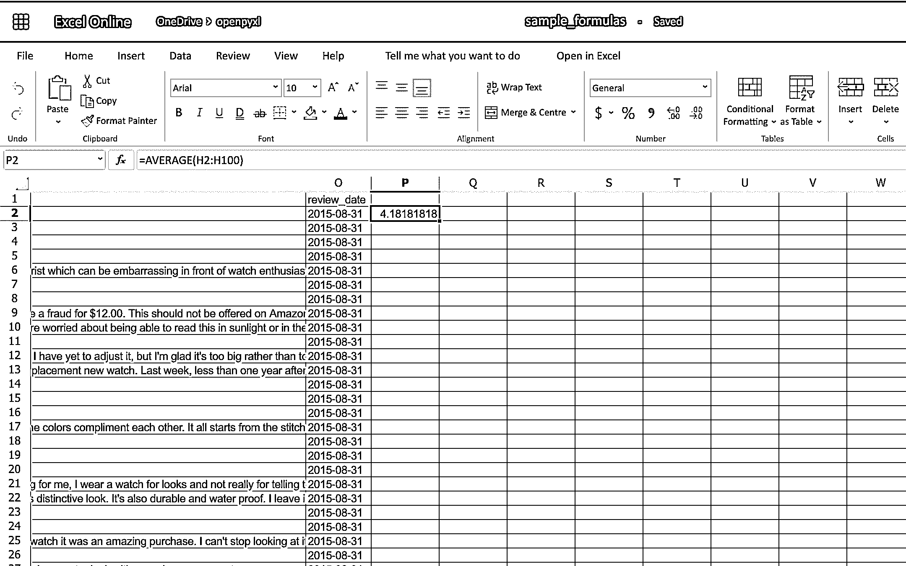

# 使用 openpyxl 的 Python Excel 电子表格指南

> 原文：<https://realpython.com/openpyxl-excel-spreadsheets-python/>

*立即观看**本教程有真实 Python 团队创建的相关视频课程。和文字教程一起看，加深理解: [**用 openpyxl**](/courses/editing-excel-python-openpyxl/) 用 Python 编辑 Excel 电子表格

Excel 电子表格是你在某些时候可能不得不处理的事情之一。要么是因为你的老板喜欢它们，要么是因为营销需要它们，你可能不得不学习如何使用电子表格，这时知道`openpyxl`就派上用场了！

电子表格是一种非常直观和用户友好的方式来操作大型数据集，无需任何先前的技术背景。这就是为什么它们至今仍被广泛使用的原因。

**在本文中，您将学习如何使用 openpyxl 来:**

*   自信地操作 Excel 电子表格
*   从电子表格中提取信息
*   创建简单或更复杂的电子表格，包括添加样式、图表等

这篇文章是为中级开发人员写的，他们对 Python 数据结构有很好的了解，比如[字典](https://realpython.com/python-dicts/)和[列表](https://realpython.com/python-lists-tuples/)，但也对 [OOP](https://realpython.com/python3-object-oriented-programming/) 和更多中级主题感到舒适。

**下载数据集:** [单击此处下载您将在本教程中学习的 openpyxl 练习的数据集。](https://realpython.com/bonus/openpyxl-sample-dataset/)

## 开始之前

如果您曾经被要求从数据库或日志文件中提取一些数据到 Excel 电子表格中，或者如果您经常必须将 Excel 电子表格转换成一些更有用的编程形式，那么本教程非常适合您。让我们跳进`openpyxl`大篷车吧！

[*Remove ads*](/account/join/)

### 实际使用案例

首先，在现实场景中，什么时候需要使用像`openpyxl`这样的包？您将在下面看到几个例子，但实际上，有数百种可能的场景，这些知识可以派上用场。

#### 将新产品导入数据库

你在一家网店公司负责技术，你的老板不想花钱买一个又酷又贵的 CMS 系统。

每次他们想在网上商店添加新产品时，他们都会带着一个有几百行的 Excel 电子表格来找您，对于每一行，您都有产品名称、描述、价格等等。

现在，要导入数据，您必须迭代每个电子表格行，并将每个产品添加到在线商店。

#### 将数据库数据导出到电子表格

假设您有一个记录所有用户信息的数据库表，包括姓名、电话号码、电子邮件地址等等。

现在，营销团队希望联系所有用户，给他们一些折扣或促销。然而，他们没有访问数据库的权限，或者他们不知道如何使用 SQL 轻松提取这些信息。

你能帮上什么忙？嗯，您可以使用`openpyxl`创建一个快速脚本，遍历每一条用户记录，并将所有重要信息放入 Excel 电子表格中。

这会让你在公司的下一次生日聚会上多得一块蛋糕！

#### 向现有电子表格追加信息

您可能还需要打开一个电子表格，读取其中的信息，并根据一些业务逻辑向其中添加更多的数据。

例如，再次使用在线商店场景，假设您获得一个包含用户列表的 Excel 电子表格，您需要将他们在您的商店中消费的总金额追加到每一行。

这些数据在数据库中，为了做到这一点，您必须读取电子表格，遍历每一行，从数据库中获取总支出，然后写回电子表格。

对`openpyxl`来说不成问题！

### 学习一些基本的 Excel 术语

以下是您在使用 Excel 电子表格时会看到的基本术语的快速列表:

| 学期 | 说明 |
| --- | --- |
| 电子表格或工作簿 | 一个**电子表格**是你正在创建或使用的主要文件。 |
| 工作表或工作表 | 一个**表**用于在同一个电子表格中分割不同种类的内容。一个**电子表格**可以有一个或多个**表格**。 |
| 圆柱 | A **列**是一条垂直线，用大写字母表示: *A* 。 |
| 排 | 一个**行**是一条水平线，用一个数字表示: *1* 。 |
| 细胞 | 一个**单元格**是由**列**和**行**组合而成，由一个大写字母和一个数字表示: *A1* 。 |

### openpyxl 入门

现在你已经意识到了像`openpyxl`这样的工具的好处，让我们开始安装这个包。对于本教程，您应该使用 Python 3.7 和 openpyxl 2.6.2。要安装该软件包，您可以执行以下操作:

```py
$ pip install openpyxl
```

安装软件包后，您应该能够使用以下代码创建一个超级简单的电子表格:

```py
from openpyxl import Workbook

workbook = Workbook()
sheet = workbook.active

sheet["A1"] = "hello"
sheet["B1"] = "world!"

workbook.save(filename="hello_world.xlsx")
```

上面的代码应该在您用来运行代码的文件夹中创建一个名为`hello_world.xlsx`的文件。如果您用 Excel 打开该文件，您应该会看到如下内容:

[](https://files.realpython.com/media/Screenshot_2019-06-24_16.54.45.e646867e4dbb.png)

*Woohoo* ，你的第一个电子表格创建完成了！

[*Remove ads*](/account/join/)

## 使用 openpyxl 读取 Excel 电子表格

让我们从一个人可以对电子表格做的最基本的事情开始:阅读它。

您将从阅读电子表格的简单方法过渡到阅读数据并将其转换为更有用的 Python 结构的更复杂的例子。

### 本教程的数据集

在深入研究一些代码示例之前，您应该**下载这个样本数据集**，并将其存储为`sample.xlsx`:

**下载数据集:** [单击此处下载您将在本教程中学习的 openpyxl 练习的数据集。](https://realpython.com/bonus/openpyxl-sample-dataset/)

这是您将在本教程中使用的数据集之一，它是一个电子表格，包含来自亚马逊在线产品评论的真实数据样本。这个数据集只是亚马逊提供的一小部分，但是对于测试来说，已经足够了。

### 阅读 Excel 电子表格的简单方法

最后，让我们开始阅读一些电子表格！首先，打开我们的示例电子表格:

>>>

```py
>>> from openpyxl import load_workbook
>>> workbook = load_workbook(filename="sample.xlsx")
>>> workbook.sheetnames
['Sheet 1']

>>> sheet = workbook.active
>>> sheet
<Worksheet "Sheet 1">

>>> sheet.title
'Sheet 1'
```

在上面的代码中，您首先使用`load_workbook()`打开电子表格`sample.xlsx`，然后您可以使用`workbook.sheetnames`查看您可以使用的所有工作表。之后，`workbook.active`选择第一个可用的板材，在这种情况下，您可以看到它自动选择了**板材 1** 。使用这些方法是打开电子表格的默认方式，在本教程中您会多次看到。

现在，打开电子表格后，您可以像这样轻松地从中检索数据:

>>>

```py
>>> sheet["A1"]
<Cell 'Sheet 1'.A1>

>>> sheet["A1"].value
'marketplace'

>>> sheet["F10"].value
"G-Shock Men's Grey Sport Watch"
```

要返回单元格的实际值，需要做`.value`。否则，您将得到主`Cell`对象。您还可以使用方法`.cell()`来检索使用索引符号的单元格。记住添加`.value`来获得实际值，而不是一个`Cell`对象:

>>>

```py
>>> sheet.cell(row=10, column=6)
<Cell 'Sheet 1'.F10>

>>> sheet.cell(row=10, column=6).value
"G-Shock Men's Grey Sport Watch"
```

您可以看到，无论您决定采用哪种方式，返回的结果都是相同的。然而，在本教程中，您将主要使用第一种方法:`["A1"]`。

**注意:**尽管在 Python 中你习惯了零索引符号，但在电子表格中，你将总是使用一个索引符号，其中第一行或第一列总是有索引`1`。

以上向您展示了打开电子表格的最快方法。但是，您可以传递附加参数来更改电子表格的加载方式。

#### 附加阅读选项

有几个参数可以传递给`load_workbook()`来改变电子表格的加载方式。最重要的是下面两个[布尔](https://realpython.com/python-boolean/):

1.  **read_only** 以只读模式加载电子表格，允许你打开非常大的 Excel 文件。
2.  **data_only** 忽略加载公式，只加载结果值。

[*Remove ads*](/account/join/)

### 从电子表格导入数据

既然您已经学习了加载电子表格的基本知识，那么是时候进入有趣的部分了:**电子表格中值的迭代和实际使用**。

在这一节中，您将学习遍历数据的所有不同方法，以及如何将数据转换成有用的东西，更重要的是，如何以 Pythonic 的方式来实现。

#### 遍历数据

根据您的需要，有几种不同的方法可以遍历数据。

您可以使用列和行的组合对数据进行切片:

>>>

```py
>>> sheet["A1:C2"]
((<Cell 'Sheet 1'.A1>, <Cell 'Sheet 1'.B1>, <Cell 'Sheet 1'.C1>),
 (<Cell 'Sheet 1'.A2>, <Cell 'Sheet 1'.B2>, <Cell 'Sheet 1'.C2>))
```

您可以获取行或列的范围:

>>>

```py
>>> # Get all cells from column A
>>> sheet["A"]
(<Cell 'Sheet 1'.A1>,
 <Cell 'Sheet 1'.A2>,
 ...
 <Cell 'Sheet 1'.A99>,
 <Cell 'Sheet 1'.A100>)

>>> # Get all cells for a range of columns
>>> sheet["A:B"]
((<Cell 'Sheet 1'.A1>,
 <Cell 'Sheet 1'.A2>,
 ...
 <Cell 'Sheet 1'.A99>,
 <Cell 'Sheet 1'.A100>),
 (<Cell 'Sheet 1'.B1>,
 <Cell 'Sheet 1'.B2>,
 ...
 <Cell 'Sheet 1'.B99>,
 <Cell 'Sheet 1'.B100>))

>>> # Get all cells from row 5
>>> sheet[5]
(<Cell 'Sheet 1'.A5>,
 <Cell 'Sheet 1'.B5>,
 ...
 <Cell 'Sheet 1'.N5>,
 <Cell 'Sheet 1'.O5>)

>>> # Get all cells for a range of rows
>>> sheet[5:6]
((<Cell 'Sheet 1'.A5>,
 <Cell 'Sheet 1'.B5>,
 ...
 <Cell 'Sheet 1'.N5>,
 <Cell 'Sheet 1'.O5>),
 (<Cell 'Sheet 1'.A6>,
 <Cell 'Sheet 1'.B6>,
 ...
 <Cell 'Sheet 1'.N6>,
 <Cell 'Sheet 1'.O6>))
```

你会注意到上面所有的例子都返回了一个`tuple`。如果您想回忆一下如何在 Python 中处理`tuples`，请查看关于 Python 中的[列表和元组的文章。](https://realpython.com/python-lists-tuples/#python-tuples)

使用普通 Python [生成器](https://realpython.com/introduction-to-python-generators/)处理数据也有多种方式。实现这一目标的主要方法有:

*   `.iter_rows()`
*   `.iter_cols()`

这两种方法都可以接收以下参数:

*   `min_row`
*   `max_row`
*   `min_col`
*   `max_col`

这些参数用于设置迭代的边界:

>>>

```py
>>> for row in sheet.iter_rows(min_row=1,
...                            max_row=2,
...                            min_col=1,
...                            max_col=3):
...     print(row)
(<Cell 'Sheet 1'.A1>, <Cell 'Sheet 1'.B1>, <Cell 'Sheet 1'.C1>)
(<Cell 'Sheet 1'.A2>, <Cell 'Sheet 1'.B2>, <Cell 'Sheet 1'.C2>)

>>> for column in sheet.iter_cols(min_row=1,
...                               max_row=2,
...                               min_col=1,
...                               max_col=3):
...     print(column)
(<Cell 'Sheet 1'.A1>, <Cell 'Sheet 1'.A2>)
(<Cell 'Sheet 1'.B1>, <Cell 'Sheet 1'.B2>)
(<Cell 'Sheet 1'.C1>, <Cell 'Sheet 1'.C2>)
```

您会注意到，在第一个示例中，当使用`.iter_rows()`遍历行时，您会在选中的每一行中获得一个`tuple`元素。而当使用`.iter_cols()`并遍历列时，每列将得到一个`tuple`。

可以传递给这两个方法的另一个参数是布尔值`values_only`。当设置为`True`时，返回单元格的值，而不是`Cell`对象:

>>>

```py
>>> for value in sheet.iter_rows(min_row=1,
...                              max_row=2,
...                              min_col=1,
...                              max_col=3,
...                              values_only=True):
...     print(value)
('marketplace', 'customer_id', 'review_id')
('US', 3653882, 'R3O9SGZBVQBV76')
```

如果您想遍历整个数据集，那么您也可以直接使用属性`.rows`或`.columns`，这是使用不带任何参数的`.iter_rows()`和`.iter_cols()`的快捷方式:

>>>

```py
>>> for row in sheet.rows:
...     print(row)
(<Cell 'Sheet 1'.A1>, <Cell 'Sheet 1'.B1>, <Cell 'Sheet 1'.C1>
...
<Cell 'Sheet 1'.M100>, <Cell 'Sheet 1'.N100>, <Cell 'Sheet 1'.O100>)
```

当你遍历整个数据集时，这些快捷方式非常有用。

#### 使用 Python 的默认数据结构操作数据

既然您已经了解了遍历工作簿中数据的基本知识，那么让我们看看将数据转换成 Python 结构的聪明方法。

正如您之前看到的，所有迭代的结果都以`tuples`的形式出现。然而，由于一个`tuple`只不过是一个[不可变的](https://realpython.com/courses/immutability-python/) `list`，你可以很容易地访问它的数据并将其转换成其他结构。

例如，假设您想从`sample.xlsx`电子表格中提取产品信息并放入一个字典中，其中每个键都是一个产品 ID。

一种简单的方法是遍历所有的行，选择与产品信息相关的列，然后将其存储在一个字典中。让我们把它编码出来！

首先，看看标题，看看你最关心的信息是什么:

>>>

```py
>>> for value in sheet.iter_rows(min_row=1,
...                              max_row=1,
...                              values_only=True):
...     print(value)
('marketplace', 'customer_id', 'review_id', 'product_id', ...)
```

这段代码返回电子表格中所有列名的列表。首先，获取带有名称的列:

*   `product_id`
*   `product_parent`
*   `product_title`
*   `product_category`

幸运的是，您需要的列彼此相邻，因此您可以使用`min_column`和`max_column`轻松获得您想要的数据:

>>>

```py
>>> for value in sheet.iter_rows(min_row=2,
...                              min_col=4,
...                              max_col=7,
...                              values_only=True):
...     print(value)
('B00FALQ1ZC', 937001370, 'Invicta Women\'s 15150 "Angel" 18k Yellow...)
('B00D3RGO20', 484010722, "Kenneth Cole New York Women's KC4944...)
...
```

不错！现在，您已经知道如何获得您需要的所有重要产品信息，让我们将这些数据放入字典中:

```py
import json
from openpyxl import load_workbook

workbook = load_workbook(filename="sample.xlsx")
sheet = workbook.active

products = {}

# Using the values_only because you want to return the cells' values
for row in sheet.iter_rows(min_row=2,
                           min_col=4,
                           max_col=7,
                           values_only=True):
    product_id = row[0]
    product = {
        "parent": row[1],
        "title": row[2],
        "category": row[3]
    }
    products[product_id] = product

# Using json here to be able to format the output for displaying later
print(json.dumps(products))
```

上面的代码返回一个类似如下的 JSON:

```py
{ "B00FALQ1ZC":  { "parent":  937001370, "title":  "Invicta Women's 15150 ...", "category":  "Watches" }, "B00D3RGO20":  { "parent":  484010722, "title":  "Kenneth Cole New York ...", "category":  "Watches" } }
```

在这里，您可以看到输出被调整为只有 2 个产品，但是如果您照原样运行脚本，那么您应该得到 98 个产品。

#### 将数据转换成 Python 类

为了结束本教程的阅读部分，让我们深入 Python 类，看看如何改进上面的例子，更好地组织数据。

为此，您将使用 Python 3.7 中新的 Python [数据类](https://realpython.com/python-data-classes/)。如果您使用的是旧版本的 Python，那么您可以使用默认的[类](https://realpython.com/python3-object-oriented-programming/#classes-in-python)来代替。

因此，首先，让我们看看您拥有的数据，并决定您想要存储什么以及如何存储。

正如你在开始看到的，这些数据来自亚马逊，是产品评论的列表。你可以在亚马逊上查看所有列的[列表及其含义](https://s3.amazonaws.com/amazon-reviews-pds/tsv/index.txt)。

您可以从可用数据中提取两个重要元素:

1.  制品
2.  复习

一个**产品**具有:

*   身份证明
*   标题
*   父母
*   种类

**评审**还有几个字段:

*   身份证明
*   客户 ID
*   明星
*   头条新闻
*   身体
*   日期

您可以忽略一些审查字段，使事情变得简单一些。

因此，这两个类的简单实现可以写在一个单独的文件`classes.py`中:

```py
import datetime
from dataclasses import dataclass

@dataclass
class Product:
    id: str
    parent: str
    title: str
    category: str

@dataclass
class Review:
    id: str
    customer_id: str
    stars: int
    headline: str
    body: str
    date: datetime.datetime
```

定义了数据类之后，您需要将电子表格中的数据转换成这些新的结构。

在进行转换之前，值得再次查看我们的标题，并在列和您需要的字段之间创建映射:

>>>

```py
>>> for value in sheet.iter_rows(min_row=1,
...                              max_row=1,
...                              values_only=True):
...     print(value)
('marketplace', 'customer_id', 'review_id', 'product_id', ...)

>>> # Or an alternative
>>> for cell in sheet[1]:
...     print(cell.value)
marketplace
customer_id
review_id
product_id
product_parent
...
```

让我们创建一个文件`mapping.py`,其中有一个电子表格上所有字段名称及其列位置(零索引)的列表:

```py
# Product fields
PRODUCT_ID = 3
PRODUCT_PARENT = 4
PRODUCT_TITLE = 5
PRODUCT_CATEGORY = 6

# Review fields
REVIEW_ID = 2
REVIEW_CUSTOMER = 1
REVIEW_STARS = 7
REVIEW_HEADLINE = 12
REVIEW_BODY = 13
REVIEW_DATE = 14
```

你不一定要做上面的映射。这更多是为了解析行数据时的可读性，这样就不会有很多神奇的数字。

最后，让我们看看将电子表格数据解析成产品和评论对象列表所需的代码:

```py
from datetime import datetime
from openpyxl import load_workbook
from classes import Product, Review
from mapping import PRODUCT_ID, PRODUCT_PARENT, PRODUCT_TITLE, \
    PRODUCT_CATEGORY, REVIEW_DATE, REVIEW_ID, REVIEW_CUSTOMER, \
    REVIEW_STARS, REVIEW_HEADLINE, REVIEW_BODY

# Using the read_only method since you're not gonna be editing the spreadsheet
workbook = load_workbook(filename="sample.xlsx", read_only=True)
sheet = workbook.active

products = []
reviews = []

# Using the values_only because you just want to return the cell value
for row in sheet.iter_rows(min_row=2, values_only=True):
    product = Product(id=row[PRODUCT_ID],
                      parent=row[PRODUCT_PARENT],
                      title=row[PRODUCT_TITLE],
                      category=row[PRODUCT_CATEGORY])
    products.append(product)

    # You need to parse the date from the spreadsheet into a datetime format
    spread_date = row[REVIEW_DATE]
    parsed_date = datetime.strptime(spread_date, "%Y-%m-%d")

    review = Review(id=row[REVIEW_ID],
                    customer_id=row[REVIEW_CUSTOMER],
                    stars=row[REVIEW_STARS],
                    headline=row[REVIEW_HEADLINE],
                    body=row[REVIEW_BODY],
                    date=parsed_date)
    reviews.append(review)

print(products[0])
print(reviews[0])
```

运行上面的代码后，您应该会得到如下输出:

```py
Product(id='B00FALQ1ZC', parent=937001370, ...)
Review(id='R3O9SGZBVQBV76', customer_id=3653882, ...)
```

就是这样！现在你应该有了一个非常简单和易于理解的类格式的数据，并且你可以开始考虑把它存储在一个[数据库](https://realpython.com/tutorials/databases/)或者你喜欢的任何其他类型的数据存储中。

使用这种 OOP 策略来解析电子表格使得以后处理数据更加简单。

[*Remove ads*](/account/join/)

### 追加新数据

在开始创建非常复杂的电子表格之前，快速浏览一下如何向现有电子表格追加数据的示例。

回到您创建的第一个示例电子表格(`hello_world.xlsx`)，尝试打开它并向其中追加一些数据，如下所示:

```py
from openpyxl import load_workbook

# Start by opening the spreadsheet and selecting the main sheet
workbook = load_workbook(filename="hello_world.xlsx")
sheet = workbook.active

# Write what you want into a specific cell
sheet["C1"] = "writing ;)"

# Save the spreadsheet
workbook.save(filename="hello_world_append.xlsx")
```

*Et voilà* ，如果您打开新的`hello_world_append.xlsx`电子表格，您将看到以下变化:

[](https://files.realpython.com/media/Screenshot_2019-06-24_17.44.22.e4f18e5abc42.png)

注意附加的*文字；)*上`C1`号牢房。

## 用 openpyxl 编写 Excel 电子表格

您可以向电子表格中写入许多不同的内容，从简单的文本或数值到复杂的公式、图表甚至图像。

让我们开始创建一些电子表格吧！

### 创建简单的电子表格

之前，你看到了一个如何写“Hello world！”转换成电子表格，所以你可以这样开始:

```py
 1from openpyxl import Workbook
 2
 3filename = "hello_world.xlsx"
 4
 5workbook = Workbook() 6sheet = workbook.active
 7
 8sheet["A1"] = "hello" 9sheet["B1"] = "world!" 10
11workbook.save(filename=filename)
```

上面代码中突出显示的行是编写时最重要的行。在代码中，您可以看到:

*   第 5 行显示了如何创建一个新的空白工作簿。
*   **第 8 行和第 9 行**向您展示了如何向特定的单元格添加数据。
*   第 11 行告诉你完成后如何保存电子表格。

尽管上面的这些行可能很简单，但当事情变得有点复杂时，最好还是了解它们。

**注意:**在接下来的一些例子中，你会用到`hello_world.xlsx`电子表格，所以把它放在手边。

对于接下来的代码示例，您可以做的一件事是将以下方法添加到 Python 文件或控制台中:

>>>

```py
>>> def print_rows():
...     for row in sheet.iter_rows(values_only=True):
...         print(row)
```

只需调用`print_rows()`就可以更容易地打印所有的电子表格值。

[*Remove ads*](/account/join/)

### 基本电子表格操作

在进入更高级的主题之前，了解如何管理电子表格中最简单的元素是有好处的。

#### 添加和更新单元格值

您已经学习了如何向电子表格中添加值，如下所示:

>>>

```py
>>> sheet["A1"] = "value"
```

还有另一种方法，首先选择一个单元格，然后更改其值:

>>>

```py
>>> cell = sheet["A1"]
>>> cell
<Cell 'Sheet'.A1>

>>> cell.value
'hello'

>>> cell.value = "hey"
>>> cell.value
'hey'
```

新值只有在您调用`workbook.save()`后才会存储到电子表格中。

添加值时，`openpyxl`会创建一个单元格，如果该单元格以前不存在:

>>>

```py
>>> # Before, our spreadsheet has only 1 row
>>> print_rows()
('hello', 'world!')

>>> # Try adding a value to row 10
>>> sheet["B10"] = "test"
>>> print_rows()
('hello', 'world!')
(None, None)
(None, None)
(None, None)
(None, None)
(None, None)
(None, None)
(None, None)
(None, None)
(None, 'test')
```

正如您所看到的，当试图向单元格`B10`添加一个值时，您最终得到了一个有 10 行的元组，这样您就可以让那个*测试*值。

#### 管理行和列

操作电子表格时，最常见的事情之一就是添加或删除行和列。`openpyxl`包允许您通过使用以下方法以一种非常简单的方式来完成这项工作:

*   `.insert_rows()`
*   `.delete_rows()`
*   `.insert_cols()`
*   `.delete_cols()`

这些方法中的每一个都可以接收两个参数:

1.  `idx`
2.  `amount`

再次使用我们的基本`hello_world.xlsx`示例，让我们看看这些方法是如何工作的:

>>>

```py
>>> print_rows()
('hello', 'world!')

>>> # Insert a column before the existing column 1 ("A")
>>> sheet.insert_cols(idx=1)
>>> print_rows()
(None, 'hello', 'world!')

>>> # Insert 5 columns between column 2 ("B") and 3 ("C")
>>> sheet.insert_cols(idx=3, amount=5)
>>> print_rows()
(None, 'hello', None, None, None, None, None, 'world!')

>>> # Delete the created columns
>>> sheet.delete_cols(idx=3, amount=5)
>>> sheet.delete_cols(idx=1)
>>> print_rows()
('hello', 'world!')

>>> # Insert a new row in the beginning
>>> sheet.insert_rows(idx=1)
>>> print_rows()
(None, None)
('hello', 'world!')

>>> # Insert 3 new rows in the beginning
>>> sheet.insert_rows(idx=1, amount=3)
>>> print_rows()
(None, None)
(None, None)
(None, None)
(None, None)
('hello', 'world!')

>>> # Delete the first 4 rows
>>> sheet.delete_rows(idx=1, amount=4)
>>> print_rows()
('hello', 'world!')
```

你唯一需要记住的是，当插入新数据(行或列)时，插入发生在参数`idx`的之前**。**

所以，如果你做了`insert_rows(1)`，它会在现有的第一行之前插入一个新行**。**

对于列也是如此:当您调用`insert_cols(2)`时，它会在已经存在的第二列(`B`)的之前的**右侧插入一个新列。**

然而，当删除行或列时，`.delete_...`从作为参数传递的索引开始删除数据**。**

例如，当执行`delete_rows(2)`时，它删除第`2`行，当执行`delete_cols(3)`时，它删除第三列(`C`)。

#### 管理表单

工作表管理也是您可能需要知道的事情之一，尽管您可能不经常使用它。

如果您回顾本教程中的代码示例，您会注意到下面这段重复出现的代码:

```py
sheet = workbook.active
```

这是从电子表格中选择默认工作表的方法。但是，如果您正在打开一个有多个工作表的电子表格，那么您总是可以选择一个特定的工作表，如下所示:

>>>

```py
>>> # Let's say you have two sheets: "Products" and "Company Sales"
>>> workbook.sheetnames
['Products', 'Company Sales']

>>> # You can select a sheet using its title
>>> products_sheet = workbook["Products"]
>>> sales_sheet = workbook["Company Sales"]
```

您也可以非常容易地更改工作表标题:

>>>

```py
>>> workbook.sheetnames
['Products', 'Company Sales']

>>> products_sheet = workbook["Products"]
>>> products_sheet.title = "New Products"

>>> workbook.sheetnames
['New Products', 'Company Sales']
```

如果您想创建或删除工作表，您也可以使用`.create_sheet()`和`.remove()`来完成:

>>>

```py
>>> workbook.sheetnames
['Products', 'Company Sales']

>>> operations_sheet = workbook.create_sheet("Operations")
>>> workbook.sheetnames
['Products', 'Company Sales', 'Operations']

>>> # You can also define the position to create the sheet at
>>> hr_sheet = workbook.create_sheet("HR", 0)
>>> workbook.sheetnames
['HR', 'Products', 'Company Sales', 'Operations']

>>> # To remove them, just pass the sheet as an argument to the .remove()
>>> workbook.remove(operations_sheet)
>>> workbook.sheetnames
['HR', 'Products', 'Company Sales']

>>> workbook.remove(hr_sheet)
>>> workbook.sheetnames
['Products', 'Company Sales']
```

您可以做的另一件事是使用`copy_worksheet()`复制一个工作表:

>>>

```py
>>> workbook.sheetnames
['Products', 'Company Sales']

>>> products_sheet = workbook["Products"]
>>> workbook.copy_worksheet(products_sheet)
<Worksheet "Products Copy">

>>> workbook.sheetnames
['Products', 'Company Sales', 'Products Copy']
```

如果在保存上述代码后打开电子表格，您会注意到工作表 *Products Copy* 是工作表 *Products* 的副本。

#### 冻结行和列

在处理大型电子表格时，您可能希望冻结一些行或列，这样当您向右或向下滚动时，它们仍然可见。

冻结数据可让您关注重要的行或列，无论您在电子表格中滚动到哪里。

同样，`openpyxl`也有办法通过使用工作表的`freeze_panes`属性来实现这一点。对于这个例子，回到我们的`sample.xlsx`电子表格，尝试做以下事情:

>>>

```py
>>> workbook = load_workbook(filename="sample.xlsx")
>>> sheet = workbook.active
>>> sheet.freeze_panes = "C2"
>>> workbook.save("sample_frozen.xlsx")
```

如果在您最喜欢的电子表格编辑器中打开`sample_frozen.xlsx`电子表格，您会注意到行`1`和列`A`和`B`被冻结，无论您在电子表格中的哪个位置导航，它们总是可见的。

这个特性很方便，例如，可以将标题保持在可见的范围内，这样您就总能知道每一列代表什么。

下面是它在编辑器中的样子:

[](https://files.realpython.com/media/Screenshot_2019-06-24_18.12.20.55694a0781f8.png)

注意你在电子表格的末尾，然而，你可以看到行`1`和列`A`和`B`。

#### 添加过滤器

您可以使用`openpyxl`向您的电子表格添加过滤器和排序。但是，当您打开电子表格时，数据不会根据这些排序和过滤器重新排列。

乍一看，这似乎是一个非常无用的特性，但是当您以编程方式创建一个将被其他人发送和使用的电子表格时，至少创建过滤器并允许人们随后使用它仍然是很好的。

下面的代码举例说明了如何向我们现有的`sample.xlsx`电子表格添加一些过滤器:

>>>

```py
>>> # Check the used spreadsheet space using the attribute "dimensions"
>>> sheet.dimensions
'A1:O100'

>>> sheet.auto_filter.ref = "A1:O100"
>>> workbook.save(filename="sample_with_filters.xlsx")
```

现在，在编辑器中打开电子表格时，您应该会看到创建的过滤器:

[](https://files.realpython.com/media/Screenshot_2019-06-24_18.20.35.5fdbfe805194.png)

如果您确切地知道要对电子表格的哪一部分应用过滤器，您就不必使用`sheet.dimensions`。

[*Remove ads*](/account/join/)

### 添加公式

公式(或**公式**)是电子表格最强大的功能之一。

它们赋予你将特定的数学方程应用于一系列单元格的能力。使用带`openpyxl`的公式就像编辑单元格的值一样简单。

可以看到`openpyxl`支持的公式列表:

>>>

```py
>>> from openpyxl.utils import FORMULAE
>>> FORMULAE
frozenset({'ABS',
 'ACCRINT',
 'ACCRINTM',
 'ACOS',
 'ACOSH',
 'AMORDEGRC',
 'AMORLINC',
 'AND',
 ...
 'YEARFRAC',
 'YIELD',
 'YIELDDISC',
 'YIELDMAT',
 'ZTEST'})
```

让我们给我们的`sample.xlsx`电子表格添加一些公式。

从简单的事情开始，让我们检查一下电子表格中 99 条评论的平均星级:

>>>

```py
>>> # Star rating is column "H"
>>> sheet["P2"] = "=AVERAGE(H2:H100)"
>>> workbook.save(filename="sample_formulas.xlsx")
```

如果您现在打开电子表格并转到单元格`P2`，您应该看到它的值是:*4.1881818181818*。在编辑器中查看一下:

[](https://files.realpython.com/media/Screenshot_2019-06-24_18.33.09.7c2633f706cc.png)

您可以使用相同的方法将任何公式添加到电子表格中。例如，让我们统计一下有帮助投票的评论的数量:

>>>

```py
>>> # The helpful votes are counted on column "I"
>>> sheet["P3"] = '=COUNTIF(I2:I100, ">0")'
>>> workbook.save(filename="sample_formulas.xlsx")
```

您应该在您的`P3`电子表格单元格中得到数字`21`，如下所示:

[](https://files.realpython.com/media/Screenshot_2019-06-24_18.35.24.e26e97b0c9c0.png)

您必须确保公式中的字符串总是在双引号中，所以您要么像上面的例子一样在公式周围使用单引号，要么您必须在公式中对双引号进行转义:`"=COUNTIF(I2:I100, \">0\")"`。

使用上面尝试的相同过程，您可以将大量其他公式添加到电子表格中。自己试试吧！

### 添加样式

尽管设计电子表格的样式可能不是你每天都要做的事情，但是知道如何去做还是很有好处的。

使用`openpyxl`，您可以对电子表格应用多种样式选项，包括字体、边框、颜色等等。看看`openpyxl` [文档](https://openpyxl.readthedocs.io/en/stable/styles.html)了解更多。

您也可以选择将样式直接应用到单元格，或者创建一个模板并重复使用它来将样式应用到多个单元格。

让我们从简单的单元格样式开始，再次使用我们的`sample.xlsx`作为基本电子表格:

>>>

```py
>>> # Import necessary style classes
>>> from openpyxl.styles import Font, Color, Alignment, Border, Side

>>> # Create a few styles
>>> bold_font = Font(bold=True)
>>> big_red_text = Font(color="00FF0000", size=20)
>>> center_aligned_text = Alignment(horizontal="center")
>>> double_border_side = Side(border_style="double")
>>> square_border = Border(top=double_border_side,
...                        right=double_border_side,
...                        bottom=double_border_side,
...                        left=double_border_side)

>>> # Style some cells!
>>> sheet["A2"].font = bold_font
>>> sheet["A3"].font = big_red_text
>>> sheet["A4"].alignment = center_aligned_text
>>> sheet["A5"].border = square_border
>>> workbook.save(filename="sample_styles.xlsx")
```

如果您现在打开电子表格，您应该会在列`A`的前 5 个单元格中看到许多不同的样式:

[](https://files.realpython.com/media/Screenshot_2019-06-24_18.43.15.e3aeb3fb06e3.png)

给你。你有:

*   **A2** 以粗体显示文本
*   **A3** 文字为红色，字体较大
*   **A4** 文本居中
*   **A5** 文本周围有方形边框

**注意:**对于颜色，也可以通过`Font(color="C70E0F")`使用十六进制代码。

您也可以通过简单地将样式同时添加到单元格来组合样式:

>>>

```py
>>> # Reusing the same styles from the example above
>>> sheet["A6"].alignment = center_aligned_text
>>> sheet["A6"].font = big_red_text
>>> sheet["A6"].border = square_border
>>> workbook.save(filename="sample_styles.xlsx")
```

看看这里的单元格`A6`:

[](https://files.realpython.com/media/Screenshot_2019-06-24_18.46.04.314517930065.png)

当你想对一个或几个单元格应用多种样式时，你可以使用一个`NamedStyle`类来代替，它就像一个你可以反复使用的样式模板。看看下面的例子:

>>>

```py
>>> from openpyxl.styles import NamedStyle

>>> # Let's create a style template for the header row
>>> header = NamedStyle(name="header")
>>> header.font = Font(bold=True)
>>> header.border = Border(bottom=Side(border_style="thin"))
>>> header.alignment = Alignment(horizontal="center", vertical="center")

>>> # Now let's apply this to all first row (header) cells
>>> header_row = sheet[1]
>>> for cell in header_row:
...     cell.style = header

>>> workbook.save(filename="sample_styles.xlsx")
```

如果您现在打开电子表格，您应该看到它的第一行是粗体的，文本居中对齐，并且有一个小的底部边框！请看下面:

[](https://files.realpython.com/media/Screenshot_2019-06-24_18.48.33.4bc57d1b24d5.png)

正如你在上面看到的，当涉及到样式的时候，有很多选项，这取决于用例，所以请随意查看`openpyxl` [文档](https://openpyxl.readthedocs.io/en/stable/styles.html)，看看你还能做什么。

[*Remove ads*](/account/join/)

### 条件格式

当向电子表格添加样式时，这个特性是我个人最喜欢的特性之一。

这是一种更强大的样式化方法，因为它根据电子表格中数据的变化动态地应用样式。

简而言之，**条件格式**允许你根据特定的条件指定一个应用于单元格(或单元格范围)的样式列表。

例如，一个广泛使用的案例是有一个资产负债表，其中所有的负总额是红色的，而正总额是绿色的。这种格式使得区分好周期和坏周期更加有效。

事不宜迟，让我们挑选我们最喜欢的电子表格—`sample.xlsx`—并添加一些条件格式。

你可以从添加一个简单的开始，为所有低于 3 星的评论添加红色背景:

>>>

```py
>>> from openpyxl.styles import PatternFill
>>> from openpyxl.styles.differential import DifferentialStyle
>>> from openpyxl.formatting.rule import Rule

>>> red_background = PatternFill(fgColor="00FF0000")
>>> diff_style = DifferentialStyle(fill=red_background)
>>> rule = Rule(type="expression", dxf=diff_style)
>>> rule.formula = ["$H1<3"]
>>> sheet.conditional_formatting.add("A1:O100", rule)
>>> workbook.save("sample_conditional_formatting.xlsx")
```

现在，您会看到所有星级低于 3 的评论都以红色背景标记:

[](https://files.realpython.com/media/Screenshot_2019-06-24_18.55.41.17f234a186c6.png)

就代码而言，这里唯一的新东西是对象`DifferentialStyle`和`Rule`:

*   **`DifferentialStyle`** 与上面提到的`NamedStyle`非常相似，它用于聚合多种样式，如字体、边框、对齐等。
*   **`Rule`** 负责选择单元格，如果单元格符合规则逻辑，则应用样式。

使用一个`Rule`对象，您可以创建许多条件格式场景。

然而，为了简单起见，`openpyxl`包提供了 3 种内置格式，使得创建一些常见的条件格式模式更加容易。这些内置功能包括:

*   `ColorScale`
*   `IconSet`
*   `DataBar`

**ColorScale** 让您能够创建颜色渐变:

>>>

```py
>>> from openpyxl.formatting.rule import ColorScaleRule
>>> color_scale_rule = ColorScaleRule(start_type="min",
...                                   start_color="00FF0000",  # Red
...                                   end_type="max",
...                                   end_color="0000FF00")  # Green

>>> # Again, let's add this gradient to the star ratings, column "H"
>>> sheet.conditional_formatting.add("H2:H100", color_scale_rule)
>>> workbook.save(filename="sample_conditional_formatting_color_scale.xlsx")
```

现在，根据星级评定，您应该在列`H`上看到从红色到绿色的颜色渐变:

[](https://files.realpython.com/media/Screenshot_2019-06-24_19.00.57.26756963c1e9.png)

您也可以添加第三种颜色并制作两种渐变:

>>>

```py
>>> from openpyxl.formatting.rule import ColorScaleRule
>>> color_scale_rule = ColorScaleRule(start_type="num",
...                                   start_value=1,
...                                   start_color="00FF0000",  # Red
...                                   mid_type="num",
...                                   mid_value=3,
...                                   mid_color="00FFFF00",  # Yellow
...                                   end_type="num",
...                                   end_value=5,
...                                   end_color="0000FF00")  # Green

>>> # Again, let's add this gradient to the star ratings, column "H"
>>> sheet.conditional_formatting.add("H2:H100", color_scale_rule)
>>> workbook.save(filename="sample_conditional_formatting_color_scale_3.xlsx")
```

这一次，您会注意到 1 到 3 之间的星级有一个从红色到黄色的渐变，3 到 5 之间的星级有一个从黄色到绿色的渐变:

[](https://files.realpython.com/media/Screenshot_2019-06-24_19.03.30.0de9a2ff9866.png)

**图标集**允许您根据其值向单元格添加图标:

>>>

```py
>>> from openpyxl.formatting.rule import IconSetRule

>>> icon_set_rule = IconSetRule("5Arrows", "num", [1, 2, 3, 4, 5])
>>> sheet.conditional_formatting.add("H2:H100", icon_set_rule)
>>> workbook.save("sample_conditional_formatting_icon_set.xlsx")
```

您会在星级旁边看到一个彩色箭头。当单元格的值为 1 时，此箭头为红色并指向下方，随着评分的提高，箭头开始指向上方并变为绿色:

[](https://files.realpython.com/media/Screenshot_2019-06-24_19.07.29.23e75ff46771.png)

除了箭头之外，`openpyxl`包中还有一个[完整列表](https://openpyxl.readthedocs.io/en/stable/formatting.html#iconset),列出了你可以使用的其他图标。

最后，**数据栏**允许你创建进度条:

>>>

```py
>>> from openpyxl.formatting.rule import DataBarRule

>>> data_bar_rule = DataBarRule(start_type="num",
...                             start_value=1,
...                             end_type="num",
...                             end_value="5",
...                             color="0000FF00")  # Green
>>> sheet.conditional_formatting.add("H2:H100", data_bar_rule)
>>> workbook.save("sample_conditional_formatting_data_bar.xlsx")
```

现在，您会看到一个绿色进度条，随着星级越来越接近数字 5，进度条会越来越满:

[](https://files.realpython.com/media/Screenshot_2019-06-24_19.09.10.ebbe032c088d.png)

如您所见，使用条件格式可以做很多很酷的事情。

在这里，你只看到了几个你可以用它实现的例子，但是查看`openpyxl` [文档](https://openpyxl.readthedocs.io/en/stable/formatting.html)可以看到一堆其他的选项。

[*Remove ads*](/account/join/)

### 添加图像

尽管图像在电子表格中并不常见，但能够添加它们还是很酷的。也许你可以用它来打造品牌或使电子表格更加个性化。

为了能够使用`openpyxl`将图像加载到电子表格中，您必须安装`Pillow`:

```py
$ pip install Pillow
```

除此之外，你还需要一张图片。对于这个例子，您可以抓取下面的*真正的 Python* 标志，并使用在线转换器如[cloudconvert.com](https://cloudconvert.com/webp-to-png)将其从`.webp`转换为`.png`，将最终文件保存为`logo.png`，并将其复制到运行示例的根文件夹中:

[](https://files.realpython.com/media/real-python-secondary-logo-round-optimized.59e4a237633e.png)

之后，这是您需要将该图像导入到`hello_word.xlsx`电子表格中的代码:

```py
from openpyxl import load_workbook
from openpyxl.drawing.image import Image

# Let's use the hello_world spreadsheet since it has less data
workbook = load_workbook(filename="hello_world.xlsx")
sheet = workbook.active

logo = Image("logo.png")

# A bit of resizing to not fill the whole spreadsheet with the logo
logo.height = 150
logo.width = 150

sheet.add_image(logo, "A3")
workbook.save(filename="hello_world_logo.xlsx")
```

您的电子表格上有图像！这是:

[](https://files.realpython.com/media/Screenshot_2019-06-24_20.05.30.2a69f2a77f68.png)

图像的左上角位于您选择的单元格上，在本例中为`A3`。

### 添加漂亮的图表

电子表格的另一个强大功能是创建各种各样的图表。

图表是快速可视化和理解大量数据的好方法。有许多不同的图表类型:条形图、饼图、折线图等等。支持他们中的许多人。

这里，您将只看到几个图表示例，因为每种图表类型背后的理论都是相同的:

**注意:**`openpyxl`目前不支持的图表类型有漏斗图、甘特图、排列图、树形图、瀑布图、地图和旭日图。

对于您想要构建的任何图表，您都需要定义图表类型:`BarChart`、`LineChart`等等，以及用于图表的数据，这被称为`Reference`。

在构建图表之前，您需要定义您希望在图表中显示哪些数据。有时，您可以按原样使用数据集，但其他时候您需要对数据进行一些处理以获得额外的信息。

让我们先用一些示例数据构建一个新的工作簿:

```py
 1from openpyxl import Workbook
 2from openpyxl.chart import BarChart, Reference
 3
 4workbook = Workbook()
 5sheet = workbook.active
 6
 7# Let's create some sample sales data
 8rows = [
 9    ["Product", "Online", "Store"],
10    [1, 30, 45],
11    [2, 40, 30],
12    [3, 40, 25],
13    [4, 50, 30],
14    [5, 30, 25],
15    [6, 25, 35],
16    [7, 20, 40],
17]
18
19for row in rows:
20    sheet.append(row)
```

现在，您将开始创建一个显示每种产品总销售额的**条形图**:

```py
22chart = BarChart()
23data = Reference(worksheet=sheet,
24                 min_row=1,
25                 max_row=8,
26                 min_col=2,
27                 max_col=3)
28
29chart.add_data(data, titles_from_data=True)
30sheet.add_chart(chart, "E2")
31
32workbook.save("chart.xlsx")
```

这就是了。下面，您可以看到一个非常直观的条形图，显示了**在线**产品销售和**店内**产品销售之间的差异:

[](https://files.realpython.com/media/Screenshot_2019-06-24_20.59.43.7eac35127b97.png)

与图像一样，图表的左上角位于您添加图表的单元格上。在你的情况下，它是在细胞`E2`。

**注意:**根据您使用的是 Microsoft Excel 还是开源软件(LibreOffice 或 OpenOffice)，图表可能会略有不同。

尝试创建一个**折线图**，稍微改变一下数据:

```py
 1import random
 2from openpyxl import Workbook
 3from openpyxl.chart import LineChart, Reference
 4
 5workbook = Workbook()
 6sheet = workbook.active
 7
 8# Let's create some sample sales data
 9rows = [
10    ["", "January", "February", "March", "April",
11    "May", "June", "July", "August", "September",
12     "October", "November", "December"],
13    [1, ],
14    [2, ],
15    [3, ],
16]
17
18for row in rows:
19    sheet.append(row)
20
21for row in sheet.iter_rows(min_row=2,
22                           max_row=4,
23                           min_col=2,
24                           max_col=13):
25    for cell in row:
26        cell.value = random.randrange(5, 100)
```

使用上面的代码，您将能够生成一些关于 3 种不同产品全年销售的随机数据。

完成后，您可以使用以下代码非常容易地创建一个折线图:

```py
28chart = LineChart()
29data = Reference(worksheet=sheet,
30                 min_row=2,
31                 max_row=4,
32                 min_col=1,
33                 max_col=13)
34
35chart.add_data(data, from_rows=True, titles_from_data=True)
36sheet.add_chart(chart, "C6")
37
38workbook.save("line_chart.xlsx")
```

下面是上面这段代码的结果:

[](https://files.realpython.com/media/Screenshot_2019-06-24_21.06.42.e4e52ab1b433.png)

这里需要记住的一点是，在添加数据时，您使用了`from_rows=True`。此参数使图表逐行绘制，而不是逐列绘制。

在示例数据中，您可以看到每个产品都有一个包含 12 个值的行(每月一列)。这就是你用`from_rows`的原因。如果您没有通过该参数，默认情况下，图表会尝试按列绘制，您将获得逐月的销售额比较。

与上述参数变化有关的另一个区别是，我们的`Reference`现在从第一列`min_col=1`开始，而不是从第二列开始。这种改变是必要的，因为图表现在希望第一列有标题。

关于图表的样式，您还可以更改一些其他的东西。例如，您可以向图表添加特定类别:

```py
cats = Reference(worksheet=sheet,
                 min_row=1,
                 max_row=1,
                 min_col=2,
                 max_col=13)
chart.set_categories(cats)
```

在保存工作簿之前添加这段代码，您应该会看到月份名称而不是数字:

[](https://files.realpython.com/media/Screenshot_2019-06-24_21.08.05.8867e2cced85.png)

就代码而言，这是一个最小的变化。但就电子表格的可读性而言，这使得人们更容易打开电子表格并立即理解图表。

提高图表可读性的另一个方法是添加一个轴。您可以使用属性`x_axis`和`y_axis`来实现:

```py
chart.x_axis.title = "Months"
chart.y_axis.title = "Sales (per unit)"
```

这将生成如下所示的电子表格:

[](https://files.realpython.com/media/Screenshot_2019-06-24_21.09.46.ce55f629b073.png)

正如你所看到的，像上面这样的小变化使得阅读你的图表变得更加容易和快捷。

还有一种方法是使用 Excel 的默认属性`ChartStyle`来设置图表的样式。在这种情况下，您必须在 1 到 48 之间选择一个数字。根据您的选择，图表的颜色也会发生变化:

```py
# You can play with this by choosing any number between 1 and 48
chart.style = 24
```

使用上面选择的样式，所有线条都有一些橙色阴影:

[](https://files.realpython.com/media/Screenshot_2019-06-24_21.16.31.7df18bbe94cb.png)

没有清晰的文档说明每个样式编号是什么样子，但是这个电子表格有一些可用样式的例子。


下面是用于生成包含类别、轴标题和样式的折线图的完整代码:

```py
import random
from openpyxl import Workbook
from openpyxl.chart import LineChart, Reference

workbook = Workbook()
sheet = workbook.active

# Let's create some sample sales data
rows = [
    ["", "January", "February", "March", "April",
    "May", "June", "July", "August", "September",
     "October", "November", "December"],
    [1, ],
    [2, ],
    [3, ],
]

for row in rows:
    sheet.append(row)

for row in sheet.iter_rows(min_row=2,
                           max_row=4,
                           min_col=2,
                           max_col=13):
    for cell in row:
        cell.value = random.randrange(5, 100)

# Create a LineChart and add the main data
chart = LineChart()
data = Reference(worksheet=sheet,
                           min_row=2,
                           max_row=4,
                           min_col=1,
                           max_col=13)
chart.add_data(data, titles_from_data=True, from_rows=True)

# Add categories to the chart
cats = Reference(worksheet=sheet,
                 min_row=1,
                 max_row=1,
                 min_col=2,
                 max_col=13)
chart.set_categories(cats)

# Rename the X and Y Axis
chart.x_axis.title = "Months"
chart.y_axis.title = "Sales (per unit)"

# Apply a specific Style
chart.style = 24

# Save!
sheet.add_chart(chart, "C6")
workbook.save("line_chart.xlsx")
```

您可以应用更多的图表类型和定制，所以如果您需要一些特定的格式，请务必查看关于它的[包文档](https://openpyxl.readthedocs.io/en/stable/charts/introduction.html)。

[*Remove ads*](/account/join/)

### 将 Python 类转换为 Excel 电子表格

您已经看到了如何将 Excel 电子表格的数据转换成 Python 类，但是现在让我们做相反的事情。

让我们假设您有一个数据库，并且正在使用一些对象关系映射(ORM)将 DB 对象映射到 Python 类。现在，您希望将这些相同的对象导出到电子表格中。

让我们假设下面的[数据类](https://realpython.com/python-data-classes/)代表来自您的产品销售数据库的数据:

```py
from dataclasses import dataclass
from typing import List

@dataclass
class Sale:
    quantity: int

@dataclass
class Product:
    id: str
    name: str
    sales: List[Sale]
```

现在，让我们生成一些随机数据，假设上述类存储在一个`db_classes.py`文件中:

```py
 1import random
 2
 3# Ignore these for now. You'll use them in a sec ;)
 4from openpyxl import Workbook
 5from openpyxl.chart import LineChart, Reference
 6
 7from db_classes import Product, Sale
 8
 9products = []
10
11# Let's create 5 products
12for idx in range(1, 6):
13    sales = []
14
15    # Create 5 months of sales
16    for _ in range(5):
17        sale = Sale(quantity=random.randrange(5, 100))
18        sales.append(sale)
19
20    product = Product(id=str(idx),
21                      name="Product %s" % idx,
22                      sales=sales)
23    products.append(product)
```

通过运行这段代码，您应该会得到 5 个产品 5 个月的销售额，每个月的销售额是随机的。

现在，要将其转换成电子表格，您需要迭代数据并将其追加到电子表格中:

```py
25workbook = Workbook()
26sheet = workbook.active
27
28# Append column names first
29sheet.append(["Product ID", "Product Name", "Month 1",
30              "Month 2", "Month 3", "Month 4", "Month 5"])
31
32# Append the data
33for product in products:
34    data = [product.id, product.name]
35    for sale in product.sales:
36        data.append(sale.quantity)
37    sheet.append(data)
```

就是这样。这应该允许您用来自数据库的一些数据创建一个电子表格。

但是，为什么不使用您最近获得的一些很酷的知识来添加一个图表，以便更直观地显示数据呢？

好吧，那么你可以这样做:

```py
38chart = LineChart()
39data = Reference(worksheet=sheet,
40                 min_row=2,
41                 max_row=6,
42                 min_col=2,
43                 max_col=7)
44
45chart.add_data(data, titles_from_data=True, from_rows=True)
46sheet.add_chart(chart, "B8")
47
48cats = Reference(worksheet=sheet,
49                 min_row=1,
50                 max_row=1,
51                 min_col=3,
52                 max_col=7)
53chart.set_categories(cats)
54
55chart.x_axis.title = "Months"
56chart.y_axis.title = "Sales (per unit)"
57
58workbook.save(filename="oop_sample.xlsx")
```

现在我们正在谈话！这是一个从数据库对象生成的电子表格，带有图表和所有内容:

[](https://files.realpython.com/media/Screenshot_2019-06-24_21.26.23.1f355e76586d.png)

这是总结图表新知识的好方法！

### 奖励:和熊猫一起工作

尽管你可以使用 [Pandas 来处理 Excel 文件](https://realpython.com/working-with-large-excel-files-in-pandas/)，但是有一些事情你要么不能用 Pandas 来完成，要么直接使用`openpyxl`会更好。

例如，使用`openpyxl`的一些优点是能够容易地用样式、条件格式等定制你的电子表格。

但是你猜怎么着，你不用担心挑选。事实上，`openpyxl`支持将数据从[熊猫数据框架](https://realpython.com/pandas-dataframe/)转换到工作簿，或者相反，将`openpyxl`工作簿转换到熊猫数据框架。

**注意:**如果你是熊猫新手，请提前查看我们关于熊猫数据框的[课程。](https://realpython.com/courses/pandas-dataframes-101/)

首先，记得安装`pandas`包:

```py
$ pip install pandas
```

然后，让我们创建一个示例数据帧:

```py
 1import pandas as pd
 2
 3data = {
 4    "Product Name": ["Product 1", "Product 2"],
 5    "Sales Month 1": [10, 20],
 6    "Sales Month 2": [5, 35],
 7}
 8df = pd.DataFrame(data)
```

现在您已经有了一些数据，您可以使用`.dataframe_to_rows()`将其从数据帧转换成工作表:

```py
10from openpyxl import Workbook
11from openpyxl.utils.dataframe import dataframe_to_rows
12
13workbook = Workbook()
14sheet = workbook.active
15
16for row in dataframe_to_rows(df, index=False, header=True):
17    sheet.append(row)
18
19workbook.save("pandas.xlsx")
```

您应该会看到如下所示的电子表格:

[](https://files.realpython.com/media/Screenshot_2019-06-24_21.42.15.0a4208db25f0.png)

如果您想添加[数据帧的索引](https://realpython.com/python-data-cleaning-numpy-pandas/#changing-the-index-of-a-dataframe)，您可以更改`index=True`，它会将每一行的索引添加到您的电子表格中。

另一方面，如果您想将电子表格转换成数据帧，也可以用一种非常简单的方式来完成，如下所示:

```py
import pandas as pd
from openpyxl import load_workbook

workbook = load_workbook(filename="sample.xlsx")
sheet = workbook.active

values = sheet.values
df = pd.DataFrame(values)
```

或者，例如，如果您想要添加正确的标题并将审阅 ID 用作索引，您也可以这样做:

```py
import pandas as pd
from openpyxl import load_workbook
from mapping import REVIEW_ID

workbook = load_workbook(filename="sample.xlsx")
sheet = workbook.active

data = sheet.values

# Set the first row as the columns for the DataFrame
cols = next(data)
data = list(data)

# Set the field "review_id" as the indexes for each row
idx = [row[REVIEW_ID] for row in data]

df = pd.DataFrame(data, index=idx, columns=cols)
```

使用索引和列可以让您轻松地访问数据框架中的数据:

>>>

```py
>>> df.columns
Index(['marketplace', 'customer_id', 'review_id', 'product_id',
 'product_parent', 'product_title', 'product_category', 'star_rating',
 'helpful_votes', 'total_votes', 'vine', 'verified_purchase',
 'review_headline', 'review_body', 'review_date'],
 dtype='object')

>>> # Get first 10 reviews' star rating
>>> df["star_rating"][:10]
R3O9SGZBVQBV76    5
RKH8BNC3L5DLF     5
R2HLE8WKZSU3NL    2
R31U3UH5AZ42LL    5
R2SV659OUJ945Y    4
RA51CP8TR5A2L     5
RB2Q7DLDN6TH6     5
R2RHFJV0UYBK3Y    1
R2Z6JOQ94LFHEP    5
RX27XIIWY5JPB     4
Name: star_rating, dtype: int64

>>> # Grab review with id "R2EQL1V1L6E0C9", using the index
>>> df.loc["R2EQL1V1L6E0C9"]
marketplace               US
customer_id         15305006
review_id     R2EQL1V1L6E0C9
product_id        B004LURNO6
product_parent     892860326
review_headline   Five Stars
review_body          Love it
review_date       2015-08-31
Name: R2EQL1V1L6E0C9, dtype: object
```

好了，不管你是想用`openpyxl`美化你的熊猫数据集还是用熊猫做一些核心代数，你现在知道如何在两个包之间切换。

[*Remove ads*](/account/join/)

## 结论

*唷*，经过这么长时间的阅读，你现在知道如何用 Python 处理电子表格了！您可以依靠值得信赖的伙伴`openpyxl`:

*   以 Pythonic 的方式从电子表格中提取有价值的信息
*   无论复杂程度如何，都可以创建自己的电子表格
*   向您的电子表格添加很酷的功能，如条件格式或图表

你还可以用`openpyxl`做一些本教程中没有提到的事情，但是你可以随时查看这个包的官方[文档网站](https://openpyxl.readthedocs.io/en/stable/index.html)来了解更多。你甚至可以冒险检查它的[源代码](https://bitbucket.org/openpyxl/openpyxl/src/default/)，并进一步改进这个包。

如果你有任何问题，或者如果你想了解更多，请在下面留下你的评论。

**下载数据集:** [单击此处下载您将在本教程中学习的 openpyxl 练习的数据集。](https://realpython.com/bonus/openpyxl-sample-dataset/)

*立即观看**本教程有真实 Python 团队创建的相关视频课程。和文字教程一起看，加深理解: [**用 openpyxl**](/courses/editing-excel-python-openpyxl/) 用 Python 编辑 Excel 电子表格************