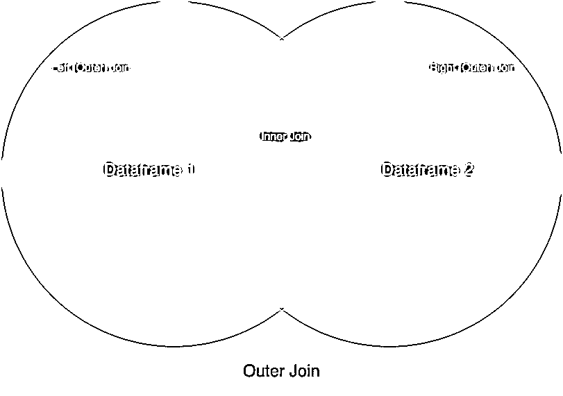
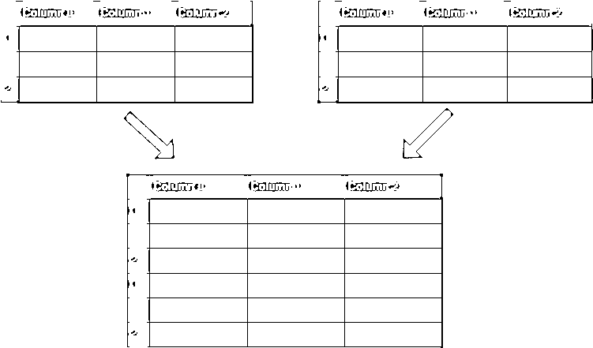
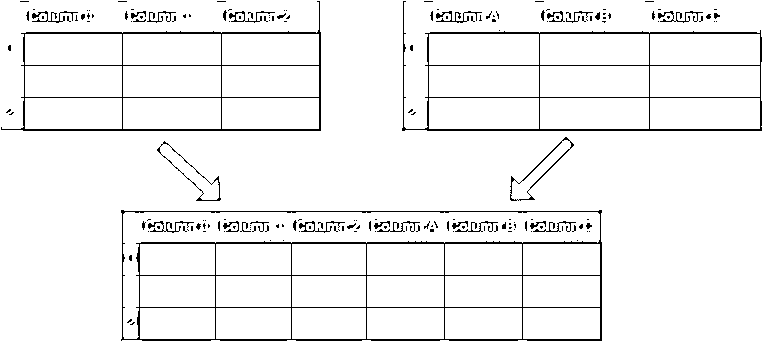

# 用 merge()合并 Pandas 中的数据。join()和 concat()

> 原文：<https://realpython.com/pandas-merge-join-and-concat/>

*立即观看**本教程有真实 Python 团队创建的相关视频课程。配合文字教程一起看，加深理解: [**用 concat()和 merge()**](/courses/data-pandas-concat-and-merge/) 结合熊猫中的数据

pandas 中的`Series`和`DataFrame`对象是探索和分析数据的强大工具。他们的力量部分来自于组合独立数据集的多方面方法。使用 pandas，您可以**合并**、**连接**和**连接**您的数据集，允许您在分析数据时统一和更好地理解数据。

**在本教程中，您将学习如何以及何时将 pandas 中的数据与**相结合

*   **`merge()`** 用于组合公共列或索引上的数据
*   **`.join()`** 用于组合关键列或索引上的数据
*   **`concat()`** 用于组合跨行或列的数据帧

如果你有一些在[熊猫](https://realpython.com/pandas-python-explore-dataset/)中使用 [`DataFrame`](https://realpython.com/pandas-dataframe/) 和`Series`对象的经验，并准备学习如何组合它们，那么本教程将帮助你做到这一点。如果你觉得有点生疏，那么在继续之前，你可以[看一下数据帧](https://realpython.com/courses/pandas-dataframe-working-with-data/)的快速复习。

您可以使用交互式 Jupyter 笔记本和数据文件按照本教程中的示例进行操作，这些文件可从以下链接获得:

**下载笔记本和数据集:** [点击此处获取 Jupyter 笔记本和 CSV 数据集，您将使用](https://realpython.com/bonus/pandas-merge-join-concat/)了解 Pandas merge()，。本教程中的 join()和 concat()。

**注意:**你将在下面学到的技术通常适用于`DataFrame`和`Series`对象。但是为了简单明了，示例将使用术语**数据集**来指代既可以是数据帧也可以是序列的对象。

## 熊猫`merge()`:组合公共列或索引上的数据

你要学习的第一个技巧是`merge()`。您可以随时使用`merge()`来实现类似于数据库的[连接](https://en.wikipedia.org/wiki/Join_(SQL))操作的功能。这是您将学习的三种操作中最灵活的一种。

当您想要基于一个或多个键组合数据对象时，就像您在关系数据库中所做的那样，`merge()`是您需要的工具。更具体地说，当您想要组合共享数据的行时，`merge()`是最有用的。

与`merge()`既可以实现**多对一**，也可以实现**多对多**的联结。在多对一连接中，一个数据集的合并列中将有许多重复相同值的行。例如，这些值可以是 1、1、3、5 和 5。同时，另一个数据集中的合并列不会有重复的值。以 1、3、5 为例。

正如您可能已经猜到的那样，在多对多联接中，两个合并列都有重复的值。这些合并更加复杂，会产生连接行的[笛卡尔积](https://en.wikipedia.org/wiki/Cartesian_product)。

这意味着，在合并之后，您将拥有在键列中共享相同值的行的每个组合。您将在下面的[示例](#examples)中看到这一点。

让`merge()`如此灵活的是定义合并行为的选项的数量。虽然这个列表看起来令人望而生畏，但通过练习，您将能够熟练地合并所有类型的数据集。

当您使用`merge()`时，您将提供两个必需的参数:

1.  `left`数据帧
2.  `right`数据帧

之后，您可以提供一些可选参数来定义数据集的合并方式:

*   **`how`** 定义了要进行何种合并。默认为`'inner'`，但其他可能的选项包括`'outer'`、`'left'`和`'right'`。

*   **`on`** 告诉`merge()`您想要加入哪些列或索引，也称为**键列**或**键索引**。这是可选的。如果没有指定，并且`left_index`和`right_index`(下面有介绍)是`False`，那么共享名称的两个数据帧中的列将被用作连接键。如果您使用`on`，那么您指定的列或索引必须出现在两个对象中。

*   **`left_on`** 和 **`right_on`** 指定只存在于要合并的`left`或`right`对象中的列或索引。两者都默认为 [`None`](https://realpython.com/null-in-python/) 。

*   **`left_index`** 和 **`right_index`** 都默认为`False`，但是如果要使用要合并的左边或右边对象的索引，那么可以将相关参数设置为`True`。

*   **`suffixes`** 是一个字符串元组，附加到不是合并键的相同列名上。这允许您跟踪同名列的来源。

这些是传递给`merge()`的一些最重要的参数。完整的名单见[熊猫文档](https://pandas.pydata.org/pandas-docs/stable/user_guide/merging.html#database-style-dataframe-or-named-series-joining-merging)。

**注意:**在本教程中，您将看到示例总是使用`on`来指定要连接的列。这是合并数据的最安全的方法，因为您和任何阅读您代码的人都知道在调用`merge()`时会发生什么。如果没有用`on`指定合并列，那么 pandas 将使用任何与合并键同名的列。

[*Remove ads*](/account/join/)

### 如何使用`merge()`

在进入如何使用`merge()`的细节之前，您应该首先理解各种形式的连接:

*   `inner`
*   `outer`
*   `left`
*   `right`

**注意:**即使你正在学习合并，你也会看到`inner`、`outer`、`left`和`right`也被称为连接操作。对于本教程，您可以将术语 **merge** 和 **join** 视为等价。

您将在下面详细了解这些不同的连接，但首先来看看它们的可视化表示:

[](https://files.realpython.com/media/join_diagram.93e6ef63afbe.png)

<figcaption class="figure-caption text-center">Visual Representation of Join Types</figcaption>

在此图中，两个圆圈是您的两个数据集，标签指向您希望看到的数据集的哪个或哪些部分。虽然这个图表没有涵盖所有的细微差别，但它可以成为视觉学习者的方便指南。

如果您有一个 [SQL](https://realpython.com/python-sql-libraries/) 背景，那么您可能会从`JOIN`语法中认出合并操作名称。除了`inner`，所有这些技术都是**外连接**的类型。使用外部连接，您将基于左对象、右对象或两者中的所有键来合并数据。对于只存在于一个对象中的键，另一个对象中不匹配的列将用`NaN`填充，它代表*而不是数字*。

你也可以在[编码恐怖](https://blog.codinghorror.com/a-visual-explanation-of-sql-joins/)上看到 SQL 上下文中各种连接的可视化解释。现在来看看不同的连接。

### 示例

许多熊猫教程提供了非常简单的数据框架来说明他们试图解释的概念。这种方法可能会令人困惑，因为您无法将数据与任何具体的东西联系起来。因此，在本教程中，您将使用两个真实世界的数据集作为要合并的数据帧:

1.  加州的气候正常值(温度)
2.  加州气候正常值(降水)

您可以探索这些数据集，并使用交互式 Jupyter 笔记本和气候数据 CSV 了解以下示例:

**下载笔记本和数据集:** [点击此处获取 Jupyter 笔记本和 CSV 数据集，您将使用](https://realpython.com/bonus/pandas-merge-join-concat/)了解 Pandas merge()，。本教程中的 join()和 concat()。

如果你想学习如何使用 Jupyter 笔记本，那么请查看 [Jupyter 笔记本:简介](https://realpython.com/jupyter-notebook-introduction/)。

这两个数据集来自美国国家海洋和大气管理局(NOAA)，并来自 NOAA [公共数据仓库](https://www.ncdc.noaa.gov/cdo-web/)。首先，将数据集加载到单独的数据框架中:

>>>

```py
>>> import pandas as pd
>>> climate_temp = pd.read_csv("climate_temp.csv")
>>> climate_precip = pd.read_csv("climate_precip.csv")
```

在上面的代码中，您使用 pandas 的 [`read_csv()`](https://pandas.pydata.org/pandas-docs/stable/reference/api/pandas.read_csv.html) 将您的 CSV 源文件方便地加载到`DataFrame`对象中。然后，您可以使用 [`.head()`](https://pandas.pydata.org/pandas-docs/stable/reference/api/pandas.DataFrame.head.html) 查看已加载数据帧的标题和前几行:

>>>

```py
>>> climate_temp.head()
 STATION            STATION_NAME  ... DLY-HTDD-BASE60 DLY-HTDD-NORMAL
0  GHCND:USC00049099  TWENTYNINE PALMS CA US  ...              10              15
1  GHCND:USC00049099  TWENTYNINE PALMS CA US  ...              10              15
2  GHCND:USC00049099  TWENTYNINE PALMS CA US  ...              10              15
3  GHCND:USC00049099  TWENTYNINE PALMS CA US  ...              10              15
4  GHCND:USC00049099  TWENTYNINE PALMS CA US  ...              10              15

>>> climate_precip.head()
 STATION  ... DLY-SNOW-PCTALL-GE050TI
0  GHCND:USC00049099  ...                   -9999
1  GHCND:USC00049099  ...                   -9999
2  GHCND:USC00049099  ...                   -9999
3  GHCND:USC00049099  ...                       0
4  GHCND:USC00049099  ...                       0
```

这里，您使用了`.head()`来获取每个数据帧的前五行。请务必亲自尝试，无论是使用交互式 Jupyter 笔记本还是在您的控制台上，这样您就可以更深入地探索数据。

接下来，快速查看两个数据帧的尺寸:

>>>

```py
>>> climate_temp.shape
(127020, 21)
>>> climate_precip.shape
(151110, 29)
```

注意， [`.shape`](https://pandas.pydata.org/pandas-docs/stable/reference/api/pandas.DataFrame.shape.html) 是`DataFrame`对象的一个属性，它告诉你数据帧的尺寸。对于`climate_temp`,`.shape`的输出表示数据帧有 127020 行和 21 列。

#### 内部连接

在这个例子中，您将使用带有默认参数的`merge()`，这将导致一个内部连接。请记住，在内部连接中，您会丢失在其他数据帧的**键列**中没有匹配的行。

将两个数据集加载到`DataFrame`对象中后，您将选择降水数据集的一小部分，然后使用普通的`merge()`调用进行内部连接。这将产生一个更小、更集中的数据集:

>>>

```py
>>> precip_one_station = climate_precip.query("STATION == 'GHCND:USC00045721'")
>>> precip_one_station.head()
 STATION  ... DLY-SNOW-PCTALL-GE050TI
1460  GHCND:USC00045721  ...                   -9999
1461  GHCND:USC00045721  ...                   -9999
1462  GHCND:USC00045721  ...                   -9999
1463  GHCND:USC00045721  ...                   -9999
1464  GHCND:USC00045721  ...                   -9999
```

这里，您已经从`climate_precip`数据帧创建了一个名为`precip_one_station`的新数据帧，只选择了`STATION`字段为`"GHCND:USC00045721"`的行。

如果您检查`shape`属性，那么您会看到它有 365 行。当您进行合并时，您认为在合并的数据帧中会有多少行？请记住，您将进行内部联接:

>>>

```py
>>> inner_merged = pd.merge(precip_one_station, climate_temp)
>>> inner_merged.head()
 STATION            STATION_NAME  ...  DLY-HTDD-BASE60  DLY-HTDD-NORMAL
0  GHCND:USC00045721  MITCHELL CAVERNS CA US  ...               14               19
1  GHCND:USC00045721  MITCHELL CAVERNS CA US  ...               14               19
2  GHCND:USC00045721  MITCHELL CAVERNS CA US  ...               14               19
3  GHCND:USC00045721  MITCHELL CAVERNS CA US  ...               14               19
4  GHCND:USC00045721  MITCHELL CAVERNS CA US  ...               14               19

>>> inner_merged.shape
(365, 47)
```

如果你猜的是 365 行，那么你答对了！这是因为`merge()`默认为内部连接，内部连接将只丢弃那些不匹配的行。因为您的所有行都匹配，所以没有丢失。您还应该注意到现在有了更多的列:确切地说是 47 列。

使用`merge()`，您还可以控制要加入的列。假设您想要合并整个数据集，但是只在`Station`和`Date`上，因为两者的组合将为每一行产生一个唯一的值。为此，您可以使用`on`参数:

>>>

```py
>>> inner_merged_total = pd.merge(
...     climate_temp, climate_precip, on=["STATION", "DATE"]
... )
>>> inner_merged_total.shape
(123005, 48)
```

可以用字符串指定单个键列，也可以用列表指定多个键列。这导致具有 123，005 行和 48 列的数据帧。

为什么是 48 列而不是 47 列？因为您指定了要合并的关键列，pandas 不会尝试合并所有可合并的列。这可能导致“重复”的列名，这些列名可能有也可能没有不同的值。

“Duplicate”用引号括起来，因为列名不会完全匹配。默认情况下，它们会被附加上`_x`和`_y`。您还可以使用`suffixes`参数来控制追加到列名的内容。

为了避免意外，以下所有示例都将使用`on`参数来指定要连接的一列或多列。

#### 外部连接

这里，您将使用`how`参数指定一个外部连接。请记住上图中的内容，在外部连接中，也称为**完全外部连接**，两个数据帧中的所有行都将出现在新的数据帧中。

如果一行在基于键列的其他数据框架中没有匹配项，那么您不会像使用内部连接那样丢失该行。相反，该行将在合并的数据帧中，并在适当的地方填入`NaN`值。

一个例子很好地说明了这一点:

>>>

```py
>>> outer_merged = pd.merge(
...     precip_one_station, climate_temp, how="outer", on=["STATION", "DATE"]
... )
>>> outer_merged.shape
(127020, 48)
```

如果您记得从什么时候开始检查`climate_temp`的`.shape`属性，那么您会看到`outer_merged`中的行数是相同的。使用外部连接，您可以期望拥有与更大的数据帧相同的行数。这是因为在外部连接中不会丢失任何行，即使它们在其他数据帧中没有匹配项。

#### 左连接

在本例中，您将使用参数`how`指定一个左连接，也称为**左外连接**。使用左外连接将使新合并的数据帧包含左数据帧中的所有行，同时丢弃右数据帧中与左数据帧的键列不匹配的行。

你可以认为这是一个半外半内的合并。下面的例子向您展示了这一点:

>>>

```py
>>> left_merged = pd.merge(
...     climate_temp, precip_one_station, how="left", on=["STATION", "DATE"]
... )
>>> left_merged.shape
(127020, 48)
```

`left_merged`有 127，020 行，与左侧数据帧`climate_temp`中的行数相匹配。为了证明这仅适用于左侧数据帧，运行相同的代码，但是改变`precip_one_station`和`climate_temp`的位置:

>>>

```py
>>> left_merged_reversed = pd.merge(
...     precip_one_station, climate_temp, how="left", on=["STATION", "DATE"]
... )
>>> left_merged_reversed.shape
(365, 48)
```

这导致数据帧有 365 行，与`precip_one_station`中的行数相匹配。

#### 右连接

右连接，或者说**右外部连接**，是左连接的镜像版本。通过这种连接，将保留右侧数据帧中的所有行，而左侧数据帧中与右侧数据帧的键列不匹配的行将被丢弃。

为了演示左右连接如何互为镜像，在下面的示例中，您将从上面重新创建`left_merged`数据帧，只是这次使用了右连接:

>>>

```py
>>> right_merged = pd.merge(
...     precip_one_station, climate_temp, how="right", on=["STATION", "DATE"]
... )
>>> right_merged.shape
(127020, 48)
```

这里，您只需翻转输入数据帧的位置并指定一个右连接。当你检查`right_merged`时，你可能会注意到它与`left_merged`并不完全相同。两者之间的唯一区别是列的顺序:第一个输入的列总是新形成的数据帧中的第一列。

`merge()`是熊猫数据组合工具中最复杂的。它也是构建其他工具的基础。它的复杂性是其最大的优势，允许您以任何方式组合数据集，并对您的数据产生新的见解。

另一方面，这种复杂性使得在没有直观掌握[集合论](https://en.wikipedia.org/wiki/Set_theory)和数据库操作的情况下`merge()`很难使用。在这一节中，您已经了解了各种数据合并技术，以及多对一和多对多合并，它们最终都来自集合论。关于集合理论的更多信息，请查看 Python 中的[集合。](https://realpython.com/python-sets/)

现在，你将会看到`.join()`，它是`merge()`的简化版本。

[*Remove ads*](/account/join/)

## 熊猫`.join()`:组合列或索引上的数据

当`merge()`是一个**模块函数**时，`.join()`是一个 **[实例方法](https://realpython.com/instance-class-and-static-methods-demystified/)** 存在于你的数据框架中。这使您可以只指定一个数据帧，该数据帧将加入您调用`.join()`的数据帧。

在幕后，`.join()`使用了`merge()`，但是它提供了一种比完全指定的`merge()`调用更有效的方式来连接数据帧。在深入了解您可用的选项之前，先看一下这个简短的示例:

>>>

```py
>>> precip_one_station.join(
...     climate_temp, lsuffix="_left", rsuffix="_right"
... ).shape
(365, 50)
```

在索引可见的情况下，您可以看到这里发生了一个左连接，`precip_one_station`是左边的数据帧。你可能会注意到这个例子提供了参数`lsuffix`和`rsuffix`。因为`.join()`在索引上连接，并且不直接合并数据帧，所以所有列——甚至那些具有匹配名称的列——都保留在结果数据帧中。

现在颠倒一下前面的例子，在更大的数据帧上调用`.join()`:

>>>

```py
>>> climate_temp.join(
...     precip_one_station, lsuffix="_left", rsuffix="_right"
... ).shape
(127020, 50)
```

请注意，数据帧变大了，但是较小的数据帧`precip_one_station`中不存在的数据被填充了`NaN`值。

### 如何使用`.join()`

默认情况下，`.join()`将尝试对索引执行左连接。如果您想像使用`merge()`那样连接列，那么您需要将列设置为索引。

和`merge()`一样，`.join()`也有一些参数，可以让您的连接更加灵活。然而，对于`.join()`，参数列表相对较短:

*   **`other`** 是唯一必需的参数。它定义了要连接的其他数据帧。您还可以在这里指定一个数据帧列表，允许您在单个`.join()`调用中组合多个数据集。

*   **`on`** 为左边的数据帧指定一个可选的列或索引名(在前面的例子中为`climate_temp`)以加入`other`数据帧的索引。如果设置为默认的`None`，那么您将得到一个索引对索引的连接。

*   **`how`** 与`merge()`中的`how`选项相同。不同之处在于它是基于索引的，除非您也用`on`指定列。

*   **`lsuffix`****`rsuffix`**类似于`merge()`中的`suffixes`。它们指定了添加到任何重叠列的后缀，但是在传递一列`other`数据帧时无效。

*   可以启用 **`sort`** 通过连接键对结果数据帧进行排序。

### 示例

在这一节中，您将看到展示几个不同的`.join()`用例的例子。有些将是对`merge()`呼叫的简化。其他的功能将使`.join()`区别于更冗长的`merge()`呼叫。

因为您已经看到了一个简短的`.join()`呼叫，所以在第一个示例中，您将尝试使用`.join()`重新创建一个`merge()`呼叫。这需要什么？花点时间思考一个可能的解决方案，然后看看下面建议的解决方案:

>>>

```py
>>> inner_merged_total = pd.merge(
...     climate_temp, climate_precip, on=["STATION", "DATE"]
... )
>>> inner_merged_total.shape
(123005, 48)

>>> inner_joined_total = climate_temp.join(
...     climate_precip.set_index(["STATION", "DATE"]),
...     on=["STATION", "DATE"],
...     how="inner",
...     lsuffix="_x",
...     rsuffix="_y",
... )
>>> inner_joined_total.shape
(123005, 48)
```

因为`.join()`对索引起作用，所以如果您想从以前的数据库中重新创建`merge()`,那么您必须在您指定的连接列上设置索引。在本例中，您使用了`.set_index()`来设置连接中键列的索引。注意`.join()`默认情况下做左连接，所以你需要显式地使用`how`做内连接。

有了这个，`merge()`和`.join()`的联系应该就比较清楚了。

下面你会看到一个几乎是空的`.join()`呼叫。因为有重叠的列，您需要用`lsuffix`、`rsuffix`或两者指定一个后缀，但是这个例子将演示`.join()`更典型的行为:

>>>

```py
>>> climate_temp.join(climate_precip, lsuffix="_left").shape
(127020, 50)
```

这个例子应该会让人想起你之前在`.join()`的介绍中看到的。调用是相同的，导致左连接产生一个数据帧，其行数与`climate_temp`相同。

在本节中，您已经了解了`.join()`及其参数和用途。您还了解了`.join()`在幕后是如何工作的，并且您用`.join()`重新创建了一个`merge()`呼叫，以便更好地理解这两种技术之间的联系。

[*Remove ads*](/account/join/)

## 熊猫`concat()`:组合跨行或列的数据

串联与您在上面看到的合并技术有点不同。通过合并，您可以期望得到的数据集将来自父数据集的行混合在一起，通常基于一些共性。根据合并的类型，您也可能会丢失在其他数据集中没有匹配项的行。

通过串联，你的数据集只是沿着一个**轴**拼接在一起——或者是**行轴**或者是**列轴**。从视觉上看，沿行不带参数的串联如下所示:

[](https://files.realpython.com/media/concat_axis0.2ec65b5f72bc.png)

要在代码中实现这一点，您将使用`concat()`并向它传递一个想要连接的数据帧列表。此任务的代码如下所示:

```py
concatenated = pandas.concat([df1, df2])
```

**注意:**这个例子假设你的列名是相同的。如果您的列名在沿着行(轴 0)连接时是不同的，那么默认情况下这些列也将被添加，并且`NaN`值将被适当地填充。

如果您想沿着列执行连接呢？首先，看一下这个操作的可视化表示:

[](https://files.realpython.com/media/concat_col.a8eec2b4e84f.png)

为此，您将像上面一样使用一个`concat()`调用，但是您还需要传递值为`1`或`"columns"`的`axis`参数:

```py
concatenated = pandas.concat([df1, df2], axis="columns")
```

**注意:**这个例子假设你的索引在数据集之间是相同的。如果它们在沿着列(轴 1)连接时是不同的，那么默认情况下，额外的索引(行)也将被添加，并且`NaN`值将被适当地填充。

您将在下一节了解更多关于`concat()`的参数。

### 如何使用`concat()`

如您所见，串联是组合数据集的一种更简单的方式。它通常用于形成一个更大的集合，以对其执行额外的操作。

**注意:**当您调用`concat()`时，您正在连接的所有数据的副本就被制作出来了。您应该小心使用多个`concat()`调用，因为大量的副本可能会对性能产生负面影响。或者，您可以将可选的`copy`参数设置为`False`

连接数据集时，您可以指定连接所沿的轴。但是另一个轴会发生什么呢？

没什么。默认情况下，串联产生一个**集合联合**，其中所有的数据都被保留。您已经看到了用`merge()`和`.join()`作为外部连接，您可以用`join`参数指定这一点。

如果你使用这个参数，那么默认是`outer`，但是你也有`inner`选项，它将执行一个内部连接，或者**集合交集**。

与您之前看到的其他内部连接一样，当您使用`concat()`进行内部连接时，可能会丢失一些数据。只有在轴标签匹配的地方，才能保留行或列。

**注意:**记住，`join`参数只指定如何处理你*没有*连接的轴。

既然您已经了解了`join`参数，下面是`concat()`采用的一些其他参数:

*   **`objs`** 接受要连接的`Series`或`DataFrame`对象的任意序列，通常是一个列表。还可以提供一个[字典](https://realpython.com/courses/dictionaries-python/)。在这种情况下，这些键将用于构建一个分层索引。

*   **`axis`** 表示您要连接的轴。默认值是`0`，它沿着索引或行轴连接。或者，`1`的值将沿着列垂直连接。您也可以使用字符串值`"index"`或`"columns"`。

*   **`join`** 类似于其他技术中的`how`参数，但它只接受值`inner`或`outer`。默认值是`outer`，它保存数据，而`inner`将删除在其他数据集中没有匹配的数据。

*   **`ignore_index`** 取一个[布尔](https://realpython.com/python-boolean/) `True`或`False`值。默认为`False`。如果`True`，那么新的组合数据集将不会保留在`axis`参数中指定的轴上的原始索引值。这让您拥有全新的索引值。

*   **`keys`** 允许你构造一个层次索引。一个常见的用例是在保留原始索引的同时创建一个新索引，这样就可以知道哪些行来自哪个原始数据集。

*   **`copy`** 指定是否要复制源数据。默认值为`True`。如果该值被设置为`False`，那么熊猫将不会复制源数据。

这个列表并不详尽。您可以在 [pandas 文档](https://pandas.pydata.org/pandas-docs/stable/reference/api/pandas.concat.html#pandas.concat)中找到完整的最新参数列表。

[*Remove ads*](/account/join/)

### 示例

首先，您将使用本教程中一直在使用的数据帧沿着默认轴进行基本的连接:

>>>

```py
>>> double_precip = pd.concat([precip_one_station, precip_one_station])
>>> double_precip.shape
(730, 29)
```

这个设计非常简单。这里，您创建了一个数据帧，它是前面创建的一个小数据帧的两倍。需要注意的一点是，这些指数是重复的。如果您想要一个新的从 0 开始的索引，那么您可以使用`ignore_index`参数:

>>>

```py
>>> reindexed = pd.concat(
...     [precip_one_station, precip_one_station], ignore_index=True
... )
>>> reindexed.index
RangeIndex(start=0, stop=730, step=1)
```

如前所述，如果您沿着轴 0(行)连接，但是在轴 1(列)中有不匹配的标签，那么这些列将被添加并用`NaN`值填充。这将导致外部连接:

>>>

```py
>>> outer_joined = pd.concat([climate_precip, climate_temp])
>>> outer_joined.shape
(278130, 47)
```

对于这两个数据帧，因为您只是沿着行连接，所以很少有列具有相同的名称。这意味着您将看到许多带有`NaN`值的列。

要删除缺少数据的列，可以使用带有值`"inner"`的`join`参数进行内部连接:

>>>

```py
>>> inner_joined = pd.concat([climate_temp, climate_precip], join="inner")
>>> inner_joined.shape
(278130, 3)
```

使用内部连接，您将只剩下原始数据帧共有的那些列:`STATION`、`STATION_NAME`和`DATE`。

您也可以通过设置`axis`参数来翻转它:

>>>

```py
>>> inner_joined_cols = pd.concat(
...     [climate_temp, climate_precip], axis="columns", join="inner"
... )
>>> inner_joined_cols.shape
(127020, 50)
```

现在，您只拥有两个数据帧中所有列的数据的行。行数与较小数据帧的行数相对应并非巧合。

串联的另一个有用技巧是使用`keys`参数来创建层次轴标签。如果希望保留原始数据集的索引或列名，但又希望添加新的索引或列名，这将非常有用:

>>>

```py
>>> hierarchical_keys = pd.concat(
...     [climate_temp, climate_precip], keys=["temp", "precip"]
... )
>>> hierarchical_keys.index
MultiIndex([(  'temp',      0),
 (  'temp',      1),
 ...
 ('precip', 151108),
 ('precip', 151109)],
 length=278130)
```

如果您检查原始数据帧，那么您可以验证更高级别的轴标签`temp`和`precip`是否被添加到适当的行。

## 结论

现在，您已经了解了在 pandas 中组合数据的三种最重要的技术:

1.  **`merge()`** 用于组合公共列或索引上的数据
2.  **`.join()`** 用于组合关键列或索引上的数据
3.  **`concat()`** 用于组合跨行或列的数据帧

除了学习如何使用这些技术之外，您还通过试验连接数据集的不同方式学习了集合逻辑。此外，您了解了上述每种技术的最常见参数，以及可以传递哪些参数来定制它们的输出。

您看到了这些技术在从 NOAA 获得的真实数据集上的应用，它不仅向您展示了如何组合您的数据，还展示了这样做与熊猫内置技术的好处。如果您还没有下载项目文件，可以从以下位置获得:

**下载笔记本和数据集:** [点击此处获取 Jupyter 笔记本和 CSV 数据集，您将使用](https://realpython.com/bonus/pandas-merge-join-concat/)了解 Pandas merge()，。本教程中的 join()和 concat()。

你学到新东西了吗？通过组合复杂的数据集找出解决问题的创造性方法？请在下面的评论中告诉我们！

*立即观看**本教程有真实 Python 团队创建的相关视频课程。配合文字教程一起看，加深理解: [**用 concat()和 merge()**](/courses/data-pandas-concat-and-merge/) 结合熊猫中的数据******