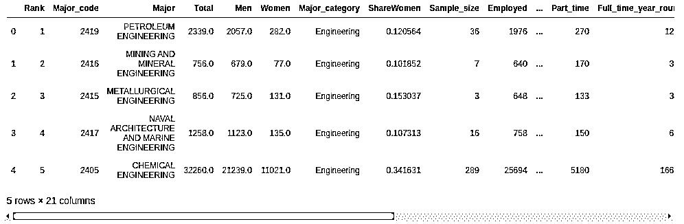
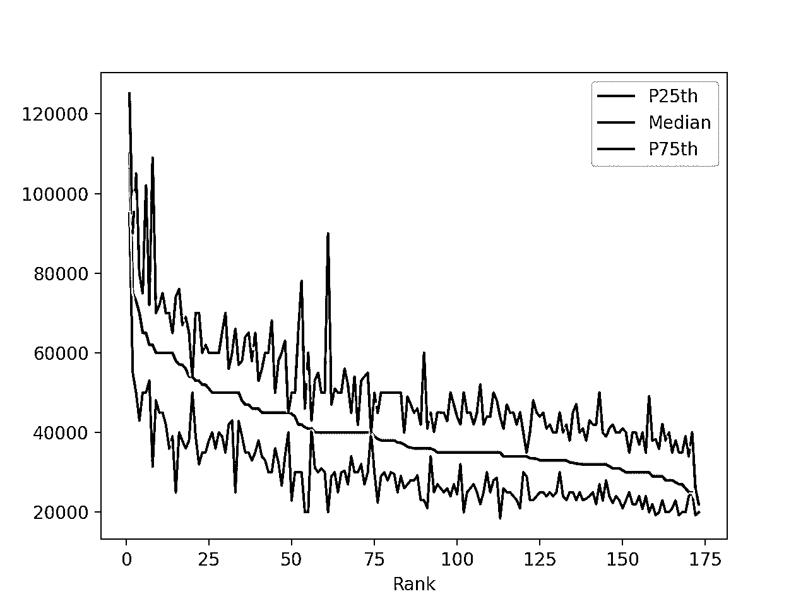
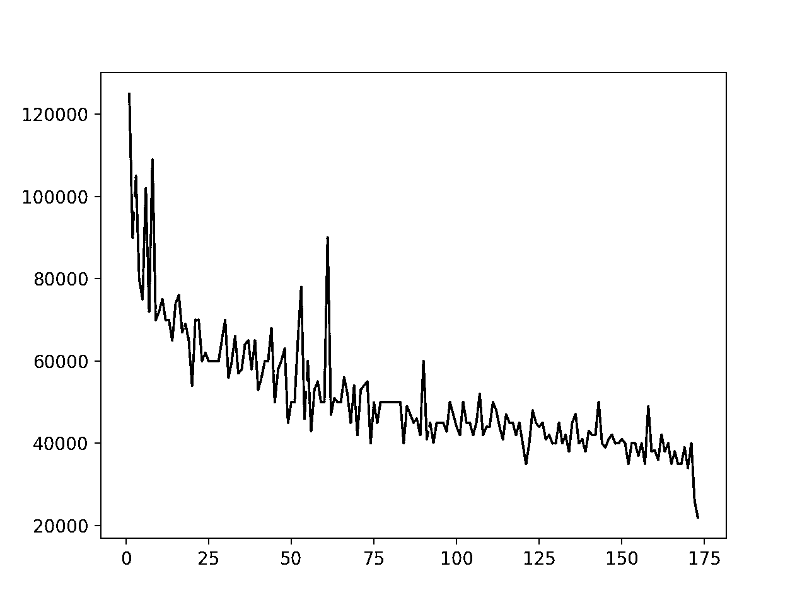
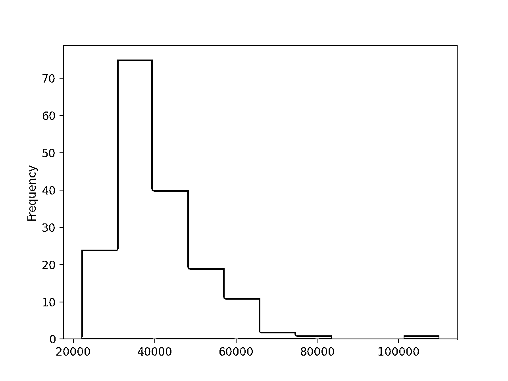
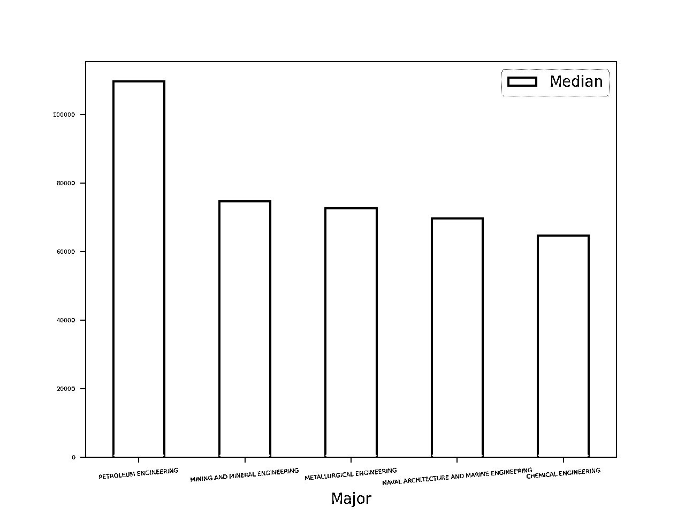
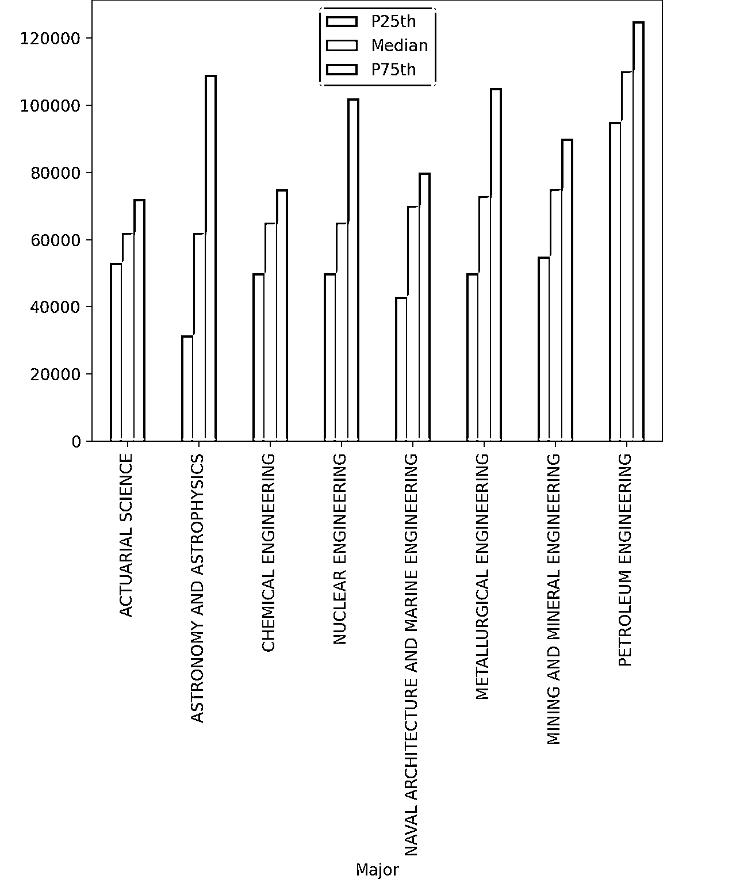
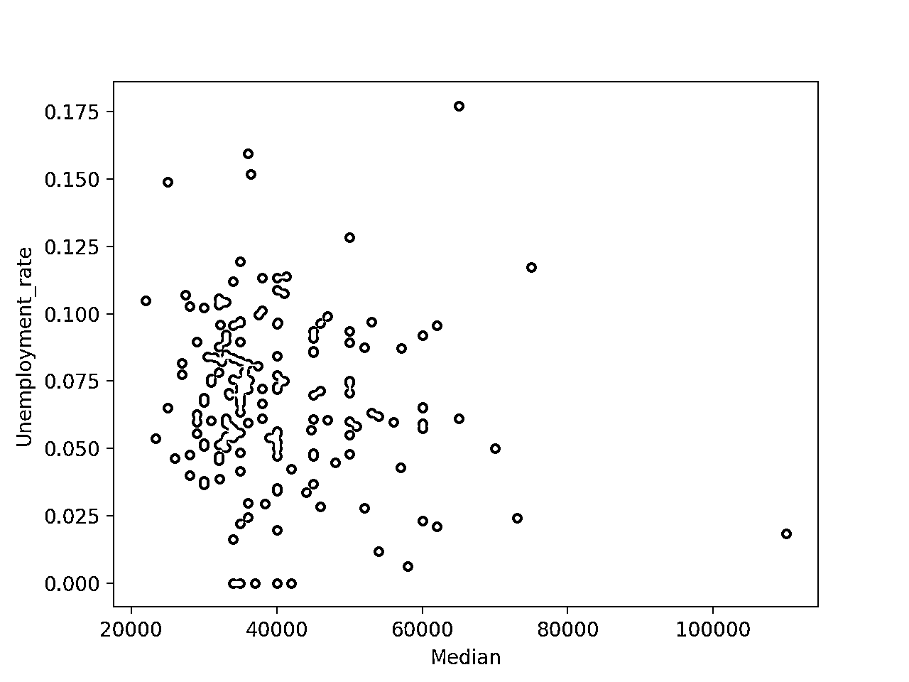
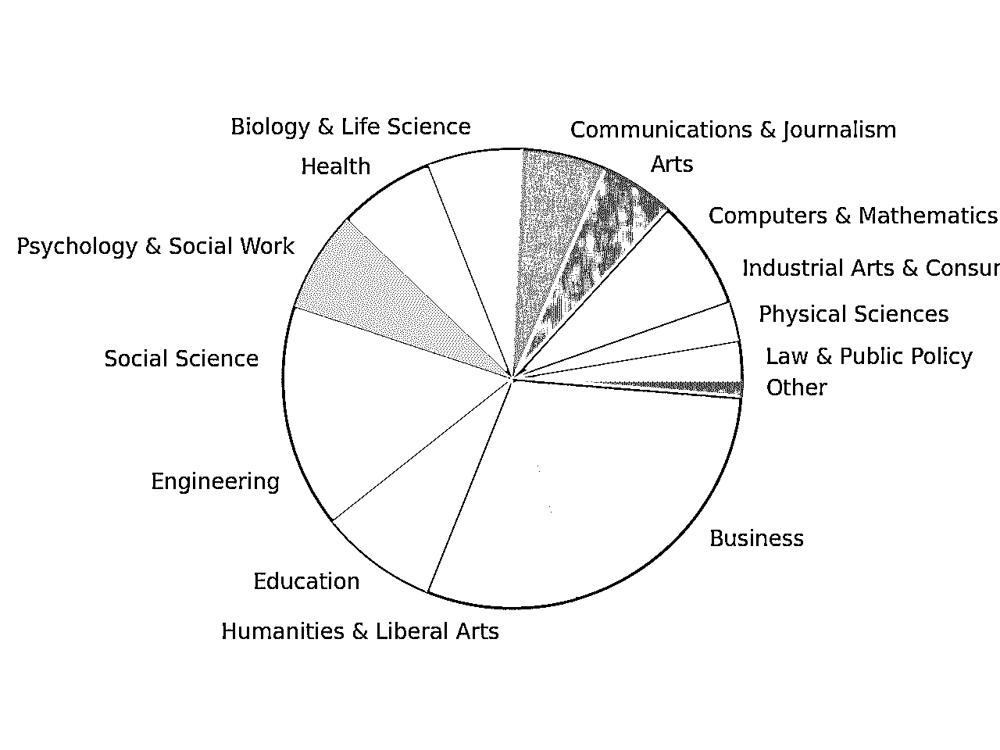
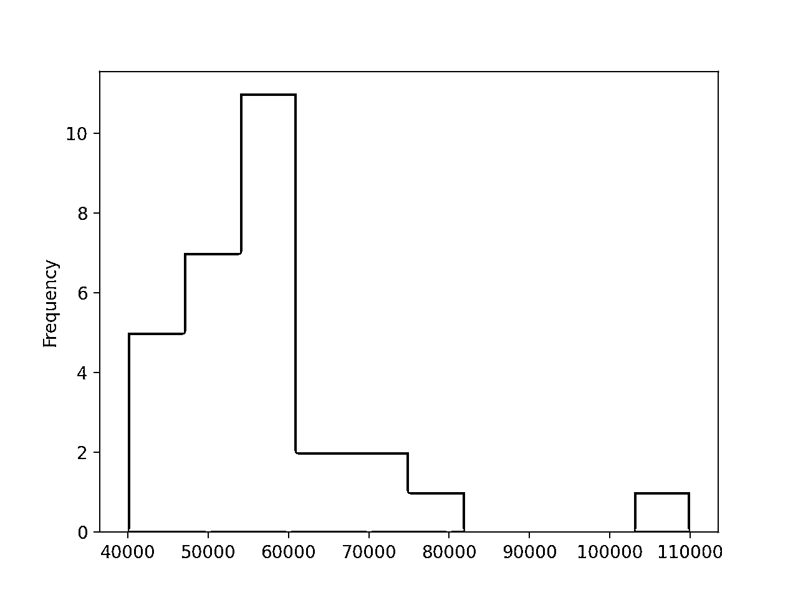

# 熊猫绘图:Python 数据可视化初学者

> 原文：<https://realpython.com/pandas-plot-python/>

*立即观看**本教程有真实 Python 团队创建的相关视频课程。配合文字教程一起看，加深理解: [**与熊猫的剧情:Python 数据可视化基础知识**](/courses/plot-pandas-data-visualization/)

无论你只是开始了解一个数据集还是准备发表你的发现，**可视化**是一个必不可少的工具。Python 流行的数据分析库，[熊猫](https://pandas.pydata.org/about/)，提供了几个不同的选项来用`.plot()`可视化你的数据。即使你刚刚开始你的熊猫之旅，你也将很快创建基本的情节，这些情节将对你的数据产生有价值的见解。

在本教程中，您将学习:

*   什么是不同类型的**熊猫地块**以及何时使用它们
*   如何使用**直方图**获得数据集的概览
*   如何发现与**散点图**的相关性
*   如何分析不同的**类别**及其**比率**

**免费奖励:** [点击此处获取 Conda 备忘单](https://realpython.com/bonus/conda-cheatsheet/)，其中包含管理您的 Python 环境和包的便捷使用示例。

## 设置您的环境

您可以在 [Jupyter 笔记本](https://realpython.com/jupyter-notebook-introduction/)中最好地跟随本教程中的代码。这样，你将立即看到你的情节，并能够发挥他们左右。

您还需要一个包含熊猫的 Python 工作环境。如果你还没有，那么你有几个选择:

*   如果你有更大的计划，那么下载 Anaconda 发行版。它很大(大约 500 MB)，但您将为大多数数据科学工作做好准备。

*   如果你喜欢极简的设置，那么看看[在 Windows](https://realpython.com/python-windows-machine-learning-setup/) 上为机器学习设置 Python 中关于安装 Miniconda 的部分。

*   如果你想坚持使用 [`pip`](https://realpython.com/what-is-pip/) ，那么用`pip install pandas matplotlib`安装本教程讨论的库。你也可以用`pip install jupyterlab`抢 Jupyter 笔记本。

*   如果你不想做任何设置，那么就跟随在线 [Jupyter 笔记本试用](https://jupyter.org/try)。

设置好环境后，您就可以下载数据集了。在本教程中，您将分析来自[美国社区调查 2010–2012 公共使用微数据样本](https://www.census.gov/newsroom/press-releases/2014/cb14-tps12.html)的大学专业数据。它是在[fivethirtyeeight](https://fivethirtyeight.com/)网站上发布的[选择大学专业的经济指南](https://fivethirtyeight.com/features/the-economic-guide-to-picking-a-college-major/)的基础。

首先，通过将下载 URL 传递给`pandas.read_csv()`来下载数据:

>>>

```py
In [1]: import pandas as pd

In [2]: download_url = (
 ...:    "https://raw.githubusercontent.com/fivethirtyeight/"
 ...:    "data/master/college-majors/recent-grads.csv"
 ...: )

In [3]: df = pd.read_csv(download_url)

In [4]: type(df)
Out[4]: pandas.core.frame.DataFrame
```

通过调用`read_csv()`，您创建了一个[数据帧](https://pandas.pydata.org/pandas-docs/stable/reference/frame.html)，这是 pandas 中使用的主要数据结构。

**注意:**即使您不熟悉数据帧，也可以跟随本教程。但是如果你有兴趣学习更多关于使用熊猫和数据框架的知识，那么你可以查看[使用熊猫和 Python 来探索你的数据集](https://realpython.com/pandas-python-explore-dataset/)和[熊猫数据框架:让使用数据变得愉快](https://realpython.com/pandas-dataframe/)。

现在你有了一个数据框架，你可以看看数据。首先，您应该配置`display.max.columns`选项以确保 pandas 不隐藏任何列。然后可以用 [`.head()`](https://pandas.pydata.org/docs/reference/api/pandas.DataFrame.head.html) 查看前几行数据:

>>>

```py
In [5]: pd.set_option("display.max.columns", None)

In [6]: df.head()
```

您已经使用`.head()`显示了数据帧`df`的前五行。您的输出应该如下所示:

[](https://files.realpython.com/media/majors_df_head.31039ff82599.png)

`.head()`显示的默认行数是 5，但是您可以指定任意行数作为参数。例如，要显示前十行，您可以使用`df.head(10)`。

[*Remove ads*](/account/join/)

## 创建你的第一个熊猫地块

您的数据集包含一些与每个专业的毕业生收入相关的列:

*   **`"Median"`** 是全职、全年工作者的收入中值。
*   **`"P25th"`** 是收益的第 25 个百分位数。
*   **`"P75th"`** 是收入的第 75 百分位。
*   **`"Rank"`** 是按收入中位数排列的少校军衔。

让我们从显示这些列的图开始。首先，你需要用`%matplotlib` [魔法命令](https://ipython.readthedocs.io/en/stable/interactive/tutorial.html#magics-explained)设置你的 Jupyter 笔记本来显示剧情:

>>>

```py
In [7]: %matplotlib
Using matplotlib backend: MacOSX
```

`%matplotlib` magic 命令用 [Matplotlib](https://realpython.com/python-matplotlib-guide/) 设置你的 Jupyter 笔记本显示图形。默认情况下使用标准的 Matplotlib 图形后端，您的绘图将显示在一个单独的窗口中。

**注意:**您可以通过向`%matplotlib` magic 命令传递一个参数来更改 Matplotlib 后端。

例如，`inline`后端很受 Jupyter 笔记本的欢迎，因为它在笔记本本身中显示绘图，就在创建绘图的单元格下面:

>>>

```py
In [7]: %matplotlib inline
```

还有许多其他后端可用。有关更多信息，请查看 IPython 文档中的[丰富输出教程](https://ipython.readthedocs.io/en/stable/interactive/plotting.html)。

现在你已经准备好制作你的第一个情节了！你可以用 [`.plot()`](https://pandas.pydata.org/pandas-docs/stable/reference/api/pandas.DataFrame.plot.html) 这样做:

>>>

```py
In [8]: df.plot(x="Rank", y=["P25th", "Median", "P75th"])
Out[8]: <AxesSubplot:xlabel='Rank'>
```

`.plot()`返回一个折线图，其中包含数据帧中每一行的数据。x 轴值代表每个机构的排名，`"P25th"`、`"Median"`和`"P75th"`值绘制在 y 轴上。

**注意:**如果您没有使用 Jupyter 笔记本或 IPython shell，那么您需要使用来自`matplotlib`的`pyplot`接口来显示图表。

下面是如何在标准 Python shell 中显示图形:

>>>

```py
>>> import matplotlib.pyplot as plt
>>> df.plot(x="Rank", y=["P25th", "Median", "P75th"])
>>> plt.show()
```

注意，在调用`plt.show()`显示绘图之前，必须首先从 Matplotlib 导入`pyplot`模块。

默认情况下，`.plot()`生成的图形显示在一个单独的窗口中，如下所示:

[](https://files.realpython.com/media/fig-1.d24c69699df7.jpg)

查看该图，您可以做出以下观察:

*   收入中位数随着排名的下降而下降。这是意料之中的，因为排名是由收入中位数决定的。

*   一些专业在第 25 和第 75 个百分点之间有很大的差距。拥有这些学位的人的收入可能远低于或高于中值收入。

*   其他专业在第 25 和第 75 个百分点之间的差距非常小。拥有这些学位的人的工资非常接近收入的中位数。

你的第一个图已经暗示了在数据中还有更多要发现的！有些专业的收益范围很广，有些专业的收益范围相当窄。为了发现这些差异，您将使用几种其他类型的图。

**注意:**关于中位数、百分位数和其他统计数据的介绍，请查看 [Python 统计基础:如何描述您的数据](https://realpython.com/python-statistics/)。

`.plot()`有几个可选参数。最值得注意的是，`kind`参数接受 11 个不同的字符串值，并决定您将创建哪种绘图:

1.  **`"area"`** 是针对小区地块的。
2.  **`"bar"`** 是针对垂直条形图的。
3.  **`"barh"`** 是针对水平条形图的。
4.  **`"box"`** 是为方框图。
5.  **`"hexbin"`** 是为赫克宾出谋划策。
6.  **`"hist"`** 为直方图。
7.  **`"kde"`** 是对内核密度的估计图表。
8.  **`"density"`** 是`"kde"`的别名。
9.  **`"line"`** 是为折线图。
10.  **`"pie"`** 是为饼状图。
11.  **`"scatter"`** 是为散点图。

默认值为`"line"`。像上面创建的折线图一样，可以很好地概述您的数据。您可以使用它们来检测总体趋势。它们很少提供复杂的洞察力，但它们可以给你一些线索，告诉你应该往哪里放大。

如果您没有为`.plot()`提供参数，那么它会创建一个线图，x 轴上是索引，y 轴上是所有的数字列。虽然对于只有几列的数据集来说，这是一个有用的默认设置，但是对于 college majors 数据集及其几个数值列来说，它看起来相当混乱。

**注意:**作为将[字符串](https://realpython.com/python-strings/)传递给`.plot()`的`kind`参数的替代方法，`DataFrame`对象有几种方法可以用来创建上述各种类型的图:

1.  [T2`.area()`](https://pandas.pydata.org/pandas-docs/stable/reference/api/pandas.DataFrame.plot.area.html)
2.  [T2`.bar()`](https://pandas.pydata.org/pandas-docs/stable/reference/api/pandas.DataFrame.plot.bar.html)
3.  [T2`.barh()`](https://pandas.pydata.org/pandas-docs/stable/reference/api/pandas.DataFrame.plot.barh.html)
4.  [T2`.box()`](https://pandas.pydata.org/pandas-docs/stable/reference/api/pandas.DataFrame.plot.box.html)
5.  [T2`.hexbin()`](https://pandas.pydata.org/pandas-docs/stable/reference/api/pandas.DataFrame.plot.hexbin.html)
6.  [T2`.hist()`](https://pandas.pydata.org/pandas-docs/stable/reference/api/pandas.DataFrame.plot.hist.html)
7.  [T2`.kde()`](https://pandas.pydata.org/pandas-docs/stable/reference/api/pandas.DataFrame.plot.kde.html)
8.  [T2`.density()`](https://pandas.pydata.org/pandas-docs/stable/reference/api/pandas.DataFrame.plot.density.html)
9.  [T2`.line()`](https://pandas.pydata.org/pandas-docs/stable/reference/api/pandas.DataFrame.plot.line.html)
10.  [T2`.pie()`](https://pandas.pydata.org/pandas-docs/stable/reference/api/pandas.DataFrame.plot.pie.html)
11.  [T2`.scatter()`](https://pandas.pydata.org/pandas-docs/stable/reference/api/pandas.DataFrame.plot.scatter.html)

在本教程中，您将使用`.plot()`接口并将字符串传递给`kind`参数。我们鼓励你也尝试一下上面提到的方法。

现在你已经创建了你的第一个熊猫图，让我们仔细看看`.plot()`是如何工作的。

[*Remove ads*](/account/join/)

## 看看引擎盖下面:Matplotlib

当您在一个`DataFrame`对象上调用`.plot()`时，Matplotlib 会在幕后创建绘图。

要验证这一点，请尝试两个代码片段。首先，使用 Matplotlib 创建一个使用两列数据帧的绘图:

>>>

```py
In [9]: import matplotlib.pyplot as plt

In [10]: plt.plot(df["Rank"], df["P75th"])
Out[10]: [<matplotlib.lines.Line2D at 0x7f859928fbb0>]
```

首先，导入`matplotlib.pyplot`模块，并将其重命名为`plt`。然后调用`plot()`，将`DataFrame`对象的`"Rank"`列作为第一个参数传递，将`"P75th"`列作为第二个参数传递。

结果是一个线形图，它在 y 轴上绘制了第 75 个百分位数，在 x 轴上绘制了排名:

[](https://files.realpython.com/media/fig-2.9d5649b432cc.png)

您可以使用`DataFrame`对象的`.plot()`方法创建完全相同的图形:

>>>

```py
In [11]: df.plot(x="Rank", y="P75th")
Out[11]: <AxesSubplot:xlabel='Rank'>
```

`.plot()`是`pyplot.plot()`的**包装器**，结果是一个与您用 Matplotlib 生成的图形相同的图形:

[](https://files.realpython.com/media/fig-2.9d5649b432cc.png)

您可以使用`pyplot.plot()`和`df.plot()`从`DataFrame`对象的列中生成相同的图形。然而，如果你已经有了一个`DataFrame`实例，那么`df.plot()`会提供比`pyplot.plot()`更清晰的语法。

**注意:**如果你已经熟悉 Matplotlib，那么你可能会对`.plot()`的`kwargs`参数感兴趣。您可以向它传递一个包含关键字参数的[字典](https://realpython.com/python-dicts/)，然后这些关键字参数将被传递到 Matplotlib 绘图后端。

有关 Matplotlib 的更多信息，请查看使用 Matplotlib 的 [Python 绘图。](https://realpython.com/courses/python-plotting-matplotlib/)

现在你知道了`DataFrame`对象的`.plot()`方法是 Matplotlib 的`pyplot.plot()`的包装器，让我们深入了解你可以创建的不同类型的图以及如何创建它们。

## 调查您的数据

接下来的图将为您提供数据集特定列的概述。首先，您将看到一个直方图属性的分布。然后，您将了解一些检查异常值的工具。

### 分布和直方图

`DataFrame`并不是熊猫中唯一一个使用`.plot()`方法的职业。正如在熊猫身上经常发生的那样， [`Series`](https://pandas.pydata.org/pandas-docs/stable/reference/api/pandas.Series.html) 对象提供了类似的功能。

您可以将数据帧的每一列作为一个`Series`对象。下面是一个使用从大学专业数据创建的数据框的`"Median"`列的示例:

>>>

```py
In [12]: median_column = df["Median"]

In [13]: type(median_column)
Out[13]: pandas.core.series.Series
```

现在您有了一个`Series`对象，您可以为它创建一个图。一个[直方图](https://en.wikipedia.org/wiki/Histogram)是一个很好的方法来可视化数据集中的值是如何分布的。直方图将值分组到**箱**中，并显示其值在特定箱中的数据点的计数。

让我们为`"Median"`列创建一个直方图:

>>>

```py
In [14]: median_column.plot(kind="hist")
Out[14]: <AxesSubplot:ylabel='Frequency'>
```

您在`median_column`系列上调用`.plot()`，并将字符串`"hist"`传递给`kind`参数。这就是全部了！

当你调用`.plot()`时，你会看到下图:

[](https://files.realpython.com/media/fig-4.12d697849ee4.png)

直方图显示数据被分成 10 个区间，范围从$20，000 到$120，000，每个区间的**宽度**为$10，000。直方图的形状与[正态分布](https://en.wikipedia.org/wiki/Normal_distribution)不同，后者呈对称的钟形，中间有一个峰值。

**注:**关于直方图的更多信息，请查看 [Python 直方图绘制:NumPy，Matplotlib，Pandas & Seaborn](https://realpython.com/python-histograms/) 。

然而，中间数据的直方图在低于 40，000 美元时在左边达到峰值。**尾巴**向右延伸很远，表明确实有专业可以期望更高收入的领域。

[*Remove ads*](/account/join/)

### 离群值

你发现分布右边那个孤独的小箱子了吗？好像一个数据点都有自己的类别。这个领域的专业不仅与平均水平相比，而且与亚军相比，他们的工资都很高。虽然这不是它的主要目的，但直方图可以帮助您检测这样的异常值。让我们更深入地研究一下异常值:

*   这个离群值代表了哪些专业？
*   它的边缘有多大？

与第一个概述相反，您只想比较几个数据点，但是您想看到关于它们的更多细节。对于这一点，条形图是一个很好的工具。首先，选择收入中位数最高的五个专业。您需要两步:

1.  要按`"Median"`列排序，使用 [`.sort_values()`](https://pandas.pydata.org/pandas-docs/stable/reference/api/pandas.DataFrame.sort_values.html) ，并提供您要排序的列的名称以及方向`ascending=False`。
2.  要获得列表中的前五项，请使用`.head()`。

让我们创建一个名为`top_5`的新数据帧:

>>>

```py
In [15]: top_5 = df.sort_values(by="Median", ascending=False).head()
```

现在你有一个更小的数据框架，只包含前五名最赚钱的专业。下一步，您可以创建一个条形图，仅显示工资中位数最高的五个专业:

>>>

```py
In [16]: top_5.plot(x="Major", y="Median", kind="bar", rot=5, fontsize=4)
Out[16]: <AxesSubplot:xlabel='Major'>
```

请注意，您使用了`rot`和`fontsize`参数来旋转和调整 x 轴标签的大小，以便它们可见。您将看到一个包含 5 个条形的图:

[](https://files.realpython.com/media/fig-5.8883d4f651a1.png)

这张图显示，石油工程专业学生的工资中位数比其他专业高出 2 万多美元。第二名到第四名专业的收入彼此相对接近。

如果您有一个数据点的值比其他数据点的值高得多或低得多，那么您可能需要进一步调查。例如，您可以查看包含相关数据的列。

我们来调查一下所有薪资中位数在 6 万美元以上的专业。首先你需要用口罩`df[df["Median"] > 60000]`过滤这些专业。然后，您可以创建另一个条形图，显示所有三个收入栏:

>>>

```py
In [17]: top_medians = df[df["Median"] > 60000].sort_values("Median")

In [18]: top_medians.plot(x="Major", y=["P25th", "Median", "P75th"], kind="bar")
Out[18]: <AxesSubplot:xlabel='Major'>
```

您应该会看到每个专业有三个小节的图，如下所示:

[](https://files.realpython.com/media/fig-6.8f6827dcb332.png)

第 25 和第 75 百分位证实了你在上面看到的:石油工程专业是目前收入最高的应届毕业生。

为什么您会对这个数据集中的异常值如此感兴趣？如果你是一个正在考虑选择哪个专业的大学生，你至少有一个非常明显的理由。但是从分析的角度来看，离群值也非常有趣。它们不仅可以显示资金充裕的行业，也可以显示无效数据。

任何数量的错误或疏忽都可能导致无效数据，包括传感器故障、手动数据输入过程中的错误，或者五岁儿童参加了针对十岁及以上儿童的焦点小组。调查异常值是[数据清理](https://realpython.com/python-data-cleaning-numpy-pandas/)的重要步骤。

即使数据是正确的，你可能会认为它与其他数据有很大的不同，它产生的噪音大于益处。让我们假设你分析一个小出版商的销售数据。您按地区对收入进行分组，并将它们与上一年的同一个月进行比较。然后出乎意料地，出版商拿到了一本全国畅销书。

这个愉快的事件让你的报告变得毫无意义。包括畅销书的数据在内，各地的销售额都在上升。在没有异常值的情况下执行相同的分析会提供更多有价值的信息，让你看到在纽约你的销售数字有了显著的提高，但是在迈阿密却变得更糟。

[*Remove ads*](/account/join/)

## 检查相关性

通常，您希望查看数据集的两列是否连接。如果你选择一个收入中位数较高的专业，你失业的几率是否也较低？首先，用这两列创建一个散点图:

>>>

```py
In [19]: df.plot(x="Median", y="Unemployment_rate", kind="scatter")
Out[19]: <AxesSubplot:xlabel='Median', ylabel='Unemployment_rate'>
```

您应该会看到一个看起来很随意的图，就像这样:

[](https://files.realpython.com/media/fig-7.7e4c46ccb7e8.png)

快速浏览一下这个数字可以发现，收入和失业率之间没有明显的相关性。

虽然散点图是获得可能的相关性的第一印象的极好工具，但它肯定不是联系的决定性证据。对于不同列之间的相关性的概述，可以使用 [`.corr()`](https://pandas.pydata.org/pandas-docs/stable/reference/api/pandas.DataFrame.corr.html) 。如果你怀疑两个值之间的相关性，那么你有[几个工具](https://realpython.com/numpy-scipy-pandas-correlation-python/)来验证你的直觉和测量相关性有多强。

但是请记住，即使两个值之间存在相关性，也并不意味着一个值的变化会导致另一个值的变化。换句话说，[关联并不意味着因果关系](https://en.wikipedia.org/wiki/Correlation_does_not_imply_causation)。

## 分析分类数据

为了处理更大块的信息，人类大脑有意识和无意识地将数据分类。这种技术通常是有用的，但它远非完美无缺。

有时候，我们会把一些东西归入一个范畴，但经过进一步的检验，它们并不完全相似。在本节中，您将了解一些用于检查类别和验证给定分类是否有意义的工具。

许多数据集已经包含一些显式或隐式的分类。在当前示例中，173 个专业分为 16 个类别。

### 分组

类别的一个基本用法是[分组](https://realpython.com/pandas-groupby/)和聚合。您可以使用`.groupby()`来确定大学专业数据集中每个类别的受欢迎程度:

>>>

```py
In [20]: cat_totals = df.groupby("Major_category")["Total"].sum().sort_values()

In [21]: cat_totals
Out[21]:
Major_category
Interdisciplinary                        12296.0
Agriculture & Natural Resources          75620.0
Law & Public Policy                     179107.0
Physical Sciences                       185479.0
Industrial Arts & Consumer Services     229792.0
Computers & Mathematics                 299008.0
Arts                                    357130.0
Communications & Journalism             392601.0
Biology & Life Science                  453862.0
Health                                  463230.0
Psychology & Social Work                481007.0
Social Science                          529966.0
Engineering                             537583.0
Education                               559129.0
Humanities & Liberal Arts               713468.0
Business                               1302376.0
Name: Total, dtype: float64
```

用 [`.groupby()`](https://pandas.pydata.org/pandas-docs/stable/reference/api/pandas.DataFrame.groupby.html) ，你创建一个`DataFrameGroupBy`对象。用 [`.sum()`](https://pandas.pydata.org/pandas-docs/stable/reference/api/pandas.core.groupby.GroupBy.sum.html) ，你创建一个系列。

让我们画一个水平条形图，显示`cat_totals`中的所有类别总数:

>>>

```py
In [22]: cat_totals.plot(kind="barh", fontsize=4)
Out[22]: <AxesSubplot:ylabel='Major_category'>
```

您应该会看到每个类别都有一个水平条的图:

[](https://files.realpython.com/media/fig-8.d10a3566d92b.png)

正如你的图所示，商业是迄今为止最受欢迎的主要类别。虽然人文学科和文科是明显的第二名，但其他领域的受欢迎程度更相似。

**注意:**包含分类数据的列不仅能为分析和可视化提供有价值的见解，它还提供了一个[提高代码性能的机会](https://realpython.com/python-pandas-tricks/#5-use-categorical-data-to-save-on-time-and-space)。

[*Remove ads*](/account/join/)

### 确定比率

如果你想看到你的类别之间的区别，垂直和水平条形图通常是一个不错的选择。如果你对比率感兴趣，那么饼图是一个很好的工具。然而，由于`cat_totals`包含一些更小的类别，用`cat_totals.plot(kind="pie")`创建一个饼图将产生几个带有重叠标签的小切片。

为了解决这个问题，您可以将较小的类别合并到一个组中。将总数低于 100，000 的所有类别合并到一个名为`"Other"`的类别中，然后创建一个饼图:

>>>

```py
In [23]: small_cat_totals = cat_totals[cat_totals < 100_000]

In [24]: big_cat_totals = cat_totals[cat_totals > 100_000]

In [25]: # Adding a new item "Other" with the sum of the small categories

In [26]: small_sums = pd.Series([small_cat_totals.sum()], index=["Other"])

In [27]: big_cat_totals = big_cat_totals.append(small_sums)

In [28]: big_cat_totals.plot(kind="pie", label="")
Out[28]: <AxesSubplot:>
```

请注意，您包含了参数`label=""`。默认情况下，pandas 会添加一个带有列名的标签。这通常是有道理的，但在这种情况下，它只会增加噪音。

现在，您应该会看到这样的饼图:

[](https://files.realpython.com/media/fig-9.b0c6fb23f702.png)

这个类别仍然只占很小一部分。这是一个好迹象，表明合并这些小类别是正确的选择。

### 放大类别

有时您还想验证某个分类是否有意义。一个类别的成员是否比数据集中的其他成员更相似？同样，发行版是获得第一手概述的好工具。通常，我们期望一个类别的分布类似于[正态分布](https://en.wikipedia.org/wiki/Normal_distribution)，但是范围更小。

创建一个直方图，显示工程专业学生收入中位数的分布:

>>>

```py
In [29]: df[df["Major_category"] == "Engineering"]["Median"].plot(kind="hist")
Out[29]: <AxesSubplot:ylabel='Frequency'>
```

你会得到一个直方图，你可以从一开始就与所有专业的直方图进行比较:

[](https://files.realpython.com/media/fig-10.519dacb94a49.png)

主要收入中位数的范围稍微小一些，从 40，000 美元开始。该分布更接近正常，尽管其峰值仍在左侧。所以，即使你已经决定在工程类中选择一个专业，深入研究并更彻底地分析你的选择也是明智的。

## 结论

在本教程中，您已经学习了如何使用 Python 和 pandas 库开始可视化数据集。您已经看到了一些基本图如何让您深入了解数据并指导您的分析。

**在本教程中，您学习了如何:**

*   通过**直方图**了解数据集的分布概况
*   发现与**散点图**的相关性
*   用**条形图**分析类别，用**饼图**分析它们的比率
*   确定哪个图最适合你当前的任务

使用`.plot()`和一个小的数据框架，您发现了提供数据图片的多种可能性。现在，您已经准备好在这些知识的基础上探索更复杂的可视化。

如果你有任何问题或意见，请写在下面的评论区。

[*Remove ads*](/account/join/)

## 延伸阅读

虽然 pandas 和 Matplotlib 使您的数据可视化变得非常简单，但创建更复杂、更美丽或更吸引人的图还有无限的可能性。

一个很好的起点是 pandas DataFrame 文档的[绘图部分](https://pandas.pydata.org/pandas-docs/stable/reference/frame.html#plotting)。它包含了一个很好的概述和一些详细的描述，描述了您可以在数据框中使用的许多参数。

如果你想更好地理解熊猫绘图的基础，那么就多了解一下 Matplotlib。虽然文档有时会让人不知所措，但 Matplotlib 的剖析在介绍一些高级特性方面做得非常出色。

如果你想用交互式可视化给你的观众留下深刻印象，并鼓励他们自己探索数据，那么让散景成为你的下一站。你可以在[使用散景的 Python 交互式数据可视化](https://realpython.com/python-data-visualization-bokeh/)中找到散景特性的概述。你也可以用 [`pandas-bokeh`库](https://pypi.org/project/pandas-bokeh/)配置熊猫使用散景而不是 Matplotlib

如果您想为统计分析或科学论文创建可视化效果，请查看 [Seaborn](http://seaborn.pydata.org/) 。你可以在 [Python 直方图绘制](https://realpython.com/courses/python-histograms/)中找到关于 Seaborn 的[小课。](https://realpython.com/lessons/plotting-seaborn/)

*立即观看**本教程有真实 Python 团队创建的相关视频课程。配合文字教程一起看，加深理解: [**与熊猫的剧情:Python 数据可视化基础知识**](/courses/plot-pandas-data-visualization/)********