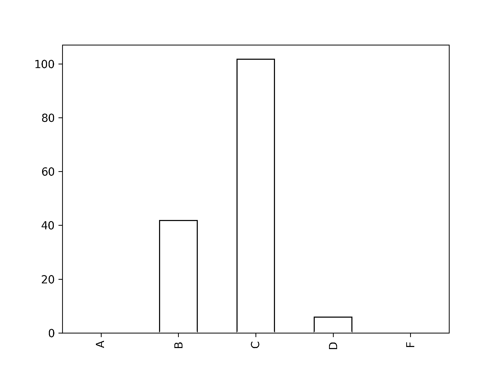
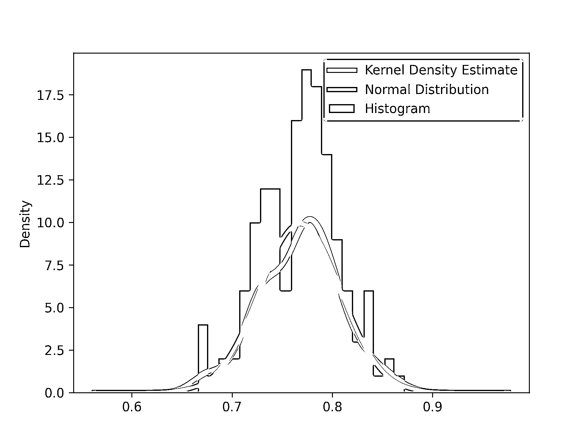

# 熊猫项目:用蟒蛇和熊猫制作一本年级册

> 原文：<https://realpython.com/pandas-project-gradebook/>

*立即观看**本教程有真实 Python 团队创建的相关视频课程。配合文字教程一起看，加深理解: [**用 Python 制作成绩册**](/courses/gradebook-using-pandas-python/)

所有老师的共同工作之一是评估学生。无论你使用考试、家庭作业、测验还是项目，你通常都必须在期末将学生的分数转化为一个**字母等级**。这通常涉及到你可能在电子表格中进行的一系列计算。相反，你可以考虑使用 Python 和[熊猫](https://realpython.com/pandas-python-explore-dataset/)。

使用电子表格的一个问题是，当你在公式中出错时，很难被发现。也许你选错了栏目，把小测验放在了应该考试的地方。也许你找到了两个错误值中的最大值。为了解决这个问题，您可以使用 **Python 和 pandas** 来完成所有的计算，并更快地找到和修复这些错误。

**在本教程中，你将学习如何**:

*   **加载**和**合并**来自多个数据源的数据
*   **筛选熊猫数据框中的**和**组**数据
*   **计算熊猫数据框中**和**地块**的等级

单击下面的链接下载熊猫项目的代码，并按照下面的链接创建你的成绩册脚本:

**获取源代码:** [点击此处获取源代码，您将在本教程中使用](https://realpython.com/bonus/pandas-gradebook-project/)制作一本有熊猫的年级册。

**构建它:**在本教程中，您将**从头到尾构建一个完整的项目**。如果你想了解更多关于熊猫的知识，那就去看看[熊猫学习之路](https://realpython.com/learning-paths/pandas-data-science/)。

## 演示:您将构建什么

在这个 pandas 项目中，您将创建一个 Python 脚本来加载您的成绩数据并为您的学生计算字母成绩。请观看这段视频，了解该脚本的运行演示:

[https://player.vimeo.com/video/435136619](https://player.vimeo.com/video/435136619)

您的脚本将从命令行或 IDE 运行，并将生成 CSV 输出文件，以便您可以将分数粘贴到学校的评分系统中。你还将绘制一些图表，看看你的分数是如何分布的。

[*Remove ads*](/account/join/)

## 项目概述

这个熊猫项目包括四个主要步骤:

1.  **探索你将在项目中使用的数据**,以确定计算最终成绩所需的格式和数据。
2.  **将数据**加载到 pandas DataFrames 中，确保将所有数据源中同一学生的成绩联系起来。
3.  **计算最终成绩**并保存为 CSV 文件。
4.  绘制成绩分布图并探索学生之间的成绩差异。

完成这些步骤后，您将拥有一个可以计算成绩的 Python 脚本。你的成绩将会是一种你可以上传到你学校的学生管理系统的格式。

## 背景阅读

如果你有一点和熊猫一起工作的经验，你会从这个熊猫项目中得到最大的收获。如果您需要复习，这些教程和课程将帮助您快速完成这个项目:

*   [熊猫数据框架:让数据工作变得愉快](https://realpython.com/pandas-dataframe/)
*   [基本熊猫数据结构](https://realpython.com/lessons/basic-pandas-data-structures/)
*   [熊猫:如何读写文件](https://realpython.com/pandas-read-write-files/#read-a-csv-file)
*   [阅读熊猫 CSVs】](https://realpython.com/lessons/reading-csvs-pandas/)
*   [将熊猫中的数据与`merge()`、`.join()`、`concat()`、](https://realpython.com/pandas-merge-join-and-concat/)组合

不要太担心记住那些教程中的所有细节。在这个熊猫项目中，你会看到这些主题的实际应用。现在让我们来看看您将在这个项目中使用的数据！

## 探索熊猫项目的数据

像大多数老师一样，您可能在本学期使用了各种服务来管理您的班级，包括:

*   学校的学生管理系统
*   一种管理家庭作业和考试的分配和评分的服务
*   管理分配和评分测验的服务

出于这个项目的目的，您将使用样本数据来表示您可能从这些系统中得到什么。数据位于逗号分隔值(CSV)文件中。这里显示了一些数据示例。首先，有一个包含班级花名册信息的文件。这将来自您的学生管理系统:

| 身份证明 | 名字 | NetID | 电子邮件地址 | 部分 |
| --- | --- | --- | --- | --- |
| One million two hundred and thirty-four thousand five hundred and sixty-seven | 伍迪·小巴雷拉 | WXB12345 | WOODY.BARRERA_JR@UNIV.EDU | one |
| Two million three hundred and forty-five thousand six hundred and seventy-eight | 马莱卡·兰伯特 | MXL12345 | 马拉卡。兰波特@UNIV.EDU | Two |
| Three million four hundred and fifty-six thousand seven hundred and eighty-nine | □中 | TXJ12345 | TRACI.JOYCE@UNIV.EDU | one |
| Four million five hundred and sixty-seven thousand eight hundred and ninety | “弗劳尔，约翰·格雷格” | JGF12345 | JOHN.G.2.FLOWER@UNIV.EDU | three |

该表显示了每个学生的 ID 号、姓名、NetID 和电子邮件地址以及他们所属的班级。在这个学期，你教了一个在不同时间上课的班级，每个课时都有不同的节数。

接下来，您有一个包含作业和考试分数的文件。这份来自作业和考试评分服务，与花名册的栏目安排略有不同:

| （同 suddenionosphericdisturbance）电离层的突然骚扰 | 西方人名的第一个字 | 姓 | 家庭作业 1 | 家庭作业 1 -最高分 | 作业 1 -提交时间 | … |
| --- | --- | --- | --- | --- | --- | --- |
| jgf12345 | 格雷格 | 花 | sixty-nine | Eighty | 2019-08-29 08:56:02-07:00 | … |
| mxl12345 | 新飞象过河 | 朗伯 | Sixty-three | Eighty | 2019-08-29 08:56:02-07:00 | … |
| txj12345 | 特拉奇 | 乔伊斯 |  | Eighty | 2019-08-29 08:56:02-07:00 | … |
| wxb12345 | 木质的 | 斗牛场栅栏 | Fifty-five | Eighty | 2019-08-29 08:56:02-07:00 | … |

在此表中，每个学生都有一个 SID、名和姓。此外，你的每项家庭作业和考试都有三个报告值:

1.  学生获得的**分数**
2.  该任务的最高分
3.  学生提交作业的时间

最后，您有包含测验分数信息的文件。这些文件是分开的，因此每个数据文件中存储一个测验，并且这些文件中的信息不同于花名册和家庭作业文件:

| 姓 | 西方人名的第一个字 | 电子邮件 | 级别 |
| --- | --- | --- | --- |
| 斗牛场栅栏 | 木质的 | woody.barrera_jr@univ.edu | four |
| 花 | 约翰 | john.g.2.flower@univ.edu | eight |
| 乔伊斯 | 特拉奇 | traci.joyce@univ.edu | eight |
| 朗伯 | 新飞象过河 | 马来西亚 lambert@univ.edu | eight |

在测验表中，每个学生都有姓氏、名字、电子邮件和测验分数。请注意，最大可能的测验分数没有存储在此表中。稍后您将看到如何提供这些信息。

检查这些数据时，您可能会注意到几个特征:

*   **每张桌子都有学生名字的不同表示**。例如，在花名册表中，名字采用带引号的形式`"Last Name, First Name"`，这样 [CSV 解析器](https://realpython.com/python-csv/)就不会将逗号解释为新列。然而，在家庭作业表中，名和姓各有自己的列。

*   **每个学生可能在不同的数据源中使用不同的名字**。例如，测验表格不包括伍迪·巴雷拉名字中的后缀`Jr.`。另一个例子是，约翰·弗劳尔更喜欢别人叫他的中名格雷格，所以他调整了作业表中的显示。

*   **每个学生的电子邮件地址没有相同的元素**。学生的基本电子邮件地址是`first.last@univ.edu`。但是，如果该表单的电子邮件已经被其他学生拥有，则电子邮件地址将被修改为唯一的。这意味着你不能仅仅从学生的名字来预测他们的电子邮件地址。

*   **每列可以使用唯一的名称，即使它有相同的数据**。例如，所有学生都有一个形式为`abc12345`的标识符。花名册表称这个为他们的 NetID，而作业表称这个为他们的 SID。测验表格根本没有这些信息。类似地，一些表格使用列标题`Email address`，而其他表格只使用`Email`。

*   **每个表格对数据的排序不同**。在花名册表中，数据按`ID`列排序。在作业表中，数据按名字的第一个字母排序。在测验表格中，数据以随机顺序排序。

*   **表格中的每一行或每一列都可能有缺失数据**。例如，Traci Joyce 没有提交她的作业 1，所以她在作业表中的行是空白的。

所有这些特征以及更多的特征都存在于你将在现实世界中看到的数据中。在这个 pandas 项目的其余部分，您将看到如何处理这些特性，并确保它们不会干扰您的分析。

[*Remove ads*](/account/join/)

## 决定数据的最终格式

现在您已经看到了原始数据格式，可以考虑数据的最终格式了。最后，你需要根据每个学生的原始分数来计算他们的字母等级。最终数据表中的每一行都将包含单个学生的所有数据。行数将等于您所在班级的学生数。

这些列将代表每个家庭作业分数、测验分数和考试分数。您还将存储每个学生的一些信息，包括他们的姓名和唯一标识符。最后，你将把你的每一个计算结果和最终的字母等级存储在不同的列中。

这是您的决赛桌示例:

| 标识符 | 名字 | 家庭作业 | 盘问 | 考试 | 最终得分 | 最终成绩 |
| --- | --- | --- | --- | --- | --- | --- |
| 学生 1 | 最后，第一 | # | # | # | # | 视频（同 audio frequency） |
| 学生 2 | 最后，第一 | # | # | # | # | 视频（同 audio frequency） |
| … | … | … | … | … | … | … |

表中的每一行存储一个学生的所有数据。第一列是学生的唯一标识符，第二列是学生的姓名。然后，一系列列存储作业、测验、考试和期末成绩。最后一栏是期末成绩。

现在您已经看到了数据的最终形状，您可以开始处理数据了。第一步是加载数据！

## 用熊猫加载数据

用 Python 处理表格数据的最好的包之一是 [pandas](https://pandas.pydata.org/) ！您将利用 pandas 中的许多功能，特别是合并数据集和对数据执行数学运算。

本节中显示的代码样本收集在`01-loading-the-data.py`文件中。您可以通过单击下面的链接下载源代码:

**获取源代码:** [点击此处获取源代码，您将在本教程中使用](https://realpython.com/bonus/pandas-gradebook-project/)制作一本有熊猫的年级册。

创建一个名为`gradebook.py`的 Python 脚本。您还需要创建一个名为`data`的文件夹，用于存储您的成绩簿脚本的输入数据文件。

然后，在`gradebook.py`中，开始添加一个解释文件用途的模块级[文档串](https://realpython.com/documenting-python-code/#documenting-your-python-code-base-using-docstrings)。你现在还可以[导入](https://realpython.com/absolute-vs-relative-python-imports/#a-quick-recap-on-imports)几个库:

```py
"""Calculate student grades by combining data from many sources.

Using pandas, this script combines data from the:

* Roster
* Homework & Exam grades
* Quiz grades

to calculate final grades for a class.
"""
from pathlib import Path
import pandas as pd
```

在这段代码中，您包括一个描述脚本用途的 docstring。然后你导入`pathlib.Path`和`pandas`。

### 加载花名册文件

现在您已经准备好加载数据了，从花名册开始:

```py
HERE = Path(__file__).parent
DATA_FOLDER = HERE / "data"

roster = pd.read_csv(
    DATA_FOLDER / "roster.csv",
    converters={"NetID": str.lower, "Email Address": str.lower},
    usecols=["Section", "Email Address", "NetID"],
    index_col="NetID",
)
```

在这段代码中，您创建了两个常量，`HERE`和`DATA_FOLDER`，来跟踪当前正在执行的文件的位置以及存储数据的文件夹。这些常量使用 [`pathlib`模块](https://realpython.com/python-pathlib/)来方便引用不同的文件夹。

然后你[使用](https://realpython.com/lessons/reading-csvs-pandas) [`pd.read_csv()`](https://pandas.pydata.org/pandas-docs/stable/reference/api/pandas.read_csv.html) 读取花名册文件。为了帮助以后处理数据，您使用 [`index_col`](https://realpython.com/pandas-read-write-files/#read-a-csv-file) 设置一个索引，并使用 [`usecols`](https://realpython.com/pandas-read-write-files/#choose-columns) 仅包含有用的列。

为了确保以后可以比较字符串，您还传递了`converters`参数来将列转换为小写。这将简化您稍后要做的字符串比较。

您可以在下面的`roster`数据框中看到一些数据:

| NetID | 电子邮件地址 | 部分 |
| --- | --- | --- |
| wxb12345 | woody.barrera_jr@univ.edu | one |
| mxl12345 | 马来西亚 lambert@univ.edu | Two |
| txj12345 | traci.joyce@univ.edu | one |
| jgf12345 | john.g.2.flower@univ.edu | three |

这些是来自`roster`的前四行，它们与您在[上一节](#exploring-the-data-for-this-pandas-project)中查看的花名册表中的行相匹配。然而，`NetID`和`Email Address`列都被转换成小写字符串，因为您将这两列的`str.lower`传递给了`converters`。您还省略了`Name`和`ID`列。

[*Remove ads*](/account/join/)

### 加载作业和考试文件

接下来，您可以加载作业和考试成绩 CSV 文件。请记住，除了所有的成绩之外，该文件还包括名字和姓氏以及 SID 列。您希望忽略包含提交时间的列:

```py
hw_exam_grades = pd.read_csv(
    DATA_FOLDER / "hw_exam_grades.csv",
    converters={"SID": str.lower},
    usecols=lambda x: "Submission" not in x,
    index_col="SID",
)
```

在这段代码中，您再次使用`converters`参数将`SID`和`Email Address`列中的数据转换成小写。虽然这些列中的数据初看起来是小写的，但最佳实践是确保所有数据都是一致的。您还需要指定`SID`作为索引列，以匹配`roster` [数据帧](https://realpython.com/pandas-dataframe/)。

在这个 CSV 文件中，有许多包含作业提交时间的列，您不会在任何进一步的分析中使用它们。但是，您想要保留的其他列太多了，以至于要显式地列出所有这些列是很乏味的。

为了解决这个问题，`usecols`也接受使用一个参数(列名)调用的函数。如果函数返回`True`，则包含该列。否则，该列将被排除。用您在这里传递的 [`lambda`函数](https://realpython.com/python-lambda/)，如果字符串`"Submission"`出现在列名中，那么该列将被排除。

这里有一个`hw_exam_grades`数据帧的例子，让你对数据加载后的样子有个大概的了解:

| （同 suddenionosphericdisturbance）电离层的突然骚扰 | … | 家庭作业 1 | 家庭作业 1 -最高分 | 家庭作业 2 | … |
| --- | --- | --- | --- | --- | --- |
| jgf12345 | … | sixty-nine | Eighty | fifty-two | … |
| mxl12345 | … | Sixty-three | Eighty | Fifty-seven | … |
| txj12345 | … | 圆盘烤饼 | Eighty | Seventy-seven | … |
| wxb12345 | … | Fifty-five | Eighty | Sixty-two | … |

这些是你在[上一节](#exploring-the-data-for-this-pandas-project)中看到的作业和考试成绩 CSV 文件中的示例学生行。请注意，`Homework 1`列中缺少的 Traci Joyce (SID `txj12345`)数据被读取为`nan`或[而非数字](https://en.wikipedia.org/wiki/NaN)值。您将在后面的[章节](#filling-in-nan-values)中看到如何处理这种数据。省略号(`...`)表示示例中没有显示的数据列，这些数据列是从真实数据中加载的。

### 加载测验文件

最后，您需要从测验中加载数据。你需要阅读五个小测验，这些数据最有用的形式是一个单一的数据框架，而不是五个独立的数据框架。最终的数据格式如下所示:

| 电子邮件 | 测验 5 | 测验 2 | 测验 4 | 测验 1 | 测验 3 |
| --- | --- | --- | --- | --- | --- |
| woody.barrera_jr@univ.edu | Ten | Ten | seven | four | Eleven |
| john.g.2.flower@univ.edu | five | eight | Thirteen | eight | eight |
| traci.joyce@univ.edu | four | six | nine | eight | Fourteen |
| 马来西亚 lambert@univ.edu | six | Ten | Thirteen | eight | Ten |

这个数据帧以`Email`列作为索引，每个测验都在单独的一列中。注意，测验是无序的，但是当你[计算最终成绩](#calculating-the-quiz-score)时，你会发现顺序并不重要。您可以使用此代码加载测验文件:

```py
quiz_grades = pd.DataFrame()
for file_path in DATA_FOLDER.glob("quiz_*_grades.csv"):
    quiz_name = " ".join(file_path.stem.title().split("_")[:2])
    quiz = pd.read_csv(
        file_path,
        converters={"Email": str.lower},
        index_col=["Email"],
        usecols=["Email", "Grade"],
    ).rename(columns={"Grade": quiz_name})
    quiz_grades = pd.concat([quiz_grades, quiz], axis=1)
```

在这段代码中，您创建了一个名为`quiz_grades`的空数据帧。您需要空数据框架的原因与您需要在使用 [`list.append()`](https://docs.python.org/3/tutorial/datastructures.html#more-on-lists) 之前创建一个空列表的原因相同。

您使用 [`Path.glob()`](https://docs.python.org/3/library/pathlib.html#pathlib.Path.glob) 找到所有的测验 CSV 文件，并用 pandas 加载它们，确保将电子邮件地址转换为小写。您还将每个测验的索引列设置为学生的电子邮件地址，`pd.concat()`使用这些地址来排列每个学生的数据。

请注意，您将`axis=1`传递给了`pd.concat()`。这使得 pandas 连接列而不是行，将每个新的测验添加到组合数据帧的新列中。

最后，使用 [`DataFrame.rename()`](https://pandas.pydata.org/pandas-docs/stable/reference/api/pandas.DataFrame.rename.html) 将成绩列的名称从`Grade`更改为特定于每个测验的名称。

## 合并等级数据帧

现在您已经加载了所有的数据，您可以组合来自三个数据帧的数据，`roster`、`hw_exam_grades`和`quiz_grades`。这使你可以使用一个数据框架进行所有的计算，并在最后以另一种格式保存完整的成绩册。

本节中对`gradebook.py`的所有修改都收集在`02-merging-dataframes.py`文件中。您可以通过单击下面的链接下载源代码:

**获取源代码:** [点击此处获取源代码，您将在本教程中使用](https://realpython.com/bonus/pandas-gradebook-project/)制作一本有熊猫的年级册。

您将分两步[合并](https://realpython.com/pandas-merge-join-and-concat/)数据:

1.  **将** `roster`和`hw_exam_grades`合并成一个新的数据帧，称为`final_data`。
2.  **将** `final_data`和`quiz_grades`合并在一起。

您将在每个数据帧中使用不同的列作为**合并键**，这就是 pandas 如何决定将哪些行放在一起。这个过程是必要的，因为每个数据源为每个学生使用不同的唯一标识符。

[*Remove ads*](/account/join/)

### 合并花名册和作业成绩

在`roster`和`hw_exam_grades`中，NetID 或 SID 列作为给定学生的唯一标识符。当在 pandas 中合并或连接数据帧时，拥有一个[索引](https://pandas.pydata.org/pandas-docs/stable/reference/api/pandas.Index.html)是最有用的。当你[加载测验文件](#loading-the-quiz-files)时，你已经看到了这有多有用。

请记住，在加载花名册和作业分数时，您将参数`index_col`传递给了`pd.read_csv()`。现在，您可以将这两个数据帧合并在一起:

```py
final_data = pd.merge(
    roster, hw_exam_grades, left_index=True, right_index=True,
)
```

在这段代码中，您使用 [`pd.merge()`](https://pandas.pydata.org/pandas-docs/stable/reference/api/pandas.merge.html) 来组合`roster`和`hw_exam_grades`数据帧。

以下是四个示例学生的合并数据框架示例:

| NetID | 电子邮件地址 | … | 家庭作业 1 | … |
| --- | --- | --- | --- | --- |
| wxb12345 | woody.barrera_jr@univ.edu | … | Fifty-five | … |
| mxl12345 | 马来西亚 lambert@univ.edu | … | Sixty-three | … |
| txj12345 | traci.joyce@univ.edu | … | 圆盘烤饼 | … |
| jgf12345 | john.g.2.flower@univ.edu | … | sixty-nine | … |

正如您之前看到的，省略号表示示例中没有显示的列，但它们存在于实际的数据帧中。示例表显示具有相同 NetID 或 SID 的学生已被合并在一起，因此他们的电子邮件地址和家庭作业 1 成绩与您之前看到的表相匹配。

### 合并测验成绩

当您为`quiz_grades`加载数据时，您使用电子邮件地址作为每个学生的唯一标识符。这与分别使用 NetID 和 SID 的`hw_exam_grades`和`roster`不同。

要将`quiz_grades`合并到`final_data`，可以使用来自`quiz_grades`的索引和来自`final_data`的`Email Address`列:

```py
final_data = pd.merge(
    final_data, quiz_grades, left_on="Email Address", right_index=True
)
```

在这段代码中，您使用`pd.merge()`的`left_on`参数来告诉 pandas 在合并中使用`final_data`中的`Email Address`列。您还可以使用`right_index`来告诉 pandas 在合并中使用来自`quiz_grades`的索引。

以下是一个合并数据框架的示例，显示了四个示例学生:

| NetID | 电子邮件地址 | … | 家庭作业 1 | … | 测验 3 |
| --- | --- | --- | --- | --- | --- |
| wxb12345 | woody.barrera_jr@univ.edu | … | Fifty-five | … | Eleven |
| mxl12345 | 马来西亚 lambert@univ.edu | … | Sixty-three | … | Ten |
| txj12345 | traci.joyce@univ.edu | … | 圆盘烤饼 | … | Fourteen |
| jgf12345 | john.g.2.flower@univ.edu | … | sixty-nine | … | eight |

请记住，省略号意味着示例表中缺少列，但是合并后的数据帧中会出现这些列。您可以仔细检查前面的表，以验证数字是否与正确的学生对齐。

### 填写`nan`值

现在，您的所有数据都合并到一个数据帧中。在你继续计算分数之前，你需要再做一点数据清理。

在上表中，您可以看到 Traci Joyce 的作业 1 仍然有一个`nan`值。你不能在计算中使用`nan`值，因为它们不是一个数字！您可以使用`DataFrame.fillna()`给`final_data`中的所有`nan`值分配一个数字:

```py
final_data = final_data.fillna(0)
```

在这段代码中，您使用`DataFrame.fillna()`用值`0`填充`final_data`中的所有`nan`值。这是一个合适的解决方案，因为 Traci Joyce 的“家庭作业 1”列中的`nan`值表示缺少分数，这意味着她可能没有交作业。

以下是修改后的数据框架示例，显示了四个示例学生:

| NetID | … | 西方人名的第一个字 | 姓 | 家庭作业 1 | … |
| --- | --- | --- | --- | --- | --- |
| wxb12345 | … | 木质的 | 斗牛场栅栏 | Fifty-five | … |
| mxl12345 | … | 新飞象过河 | 朗伯 | Sixty-three | … |
| txj12345 | … | 特拉奇 | 乔伊斯 | Zero | … |
| jgf12345 | … | 约翰 | 花 | sixty-nine | … |

正如您在该表中看到的，Traci Joyce 的家庭作业 1 分数现在是`0`而不是`nan`，但是其他学生的分数没有变化。

[*Remove ads*](/account/join/)

## 用熊猫数据框计算等级

你在课堂上有三类作业:

1.  考试
2.  家庭作业
3.  盘问

这些类别中的每一个都被分配了一个**权重**给学生的最终分数。对于本学期的课程，您分配了以下权重:

| 种类 | 期末成绩百分比 | 重量 |
| --- | --- | --- |
| 考试 1 分数 | five | `0.05` |
| 考试 2 分数 | Ten | `0.10` |
| 考试 3 分数 | Fifteen | `0.15` |
| 测验分数 | Thirty | `0.30` |
| 家庭作业分数 | Forty | `0.40` |

最终得分可以通过将权重乘以每个类别的总得分并对所有这些值求和来计算。最后的分数将会被转换成最后的字母等级。

本节中对`gradebook.py`的所有修改都收集在`03-calculating-grades.py`文件中。您可以通过单击下面的链接下载源代码:

**获取源代码:** [点击此处获取源代码，您将在本教程中使用](https://realpython.com/bonus/pandas-gradebook-project/)制作一本有熊猫的年级册。

这意味着您必须计算每个类别的总数。每个类别的总分是一个从 0 到 1 的浮点数，表示学生相对于最高分获得了多少分。你将依次处理每个任务类别。

### 计算考试总成绩

你将首先计算考试的分数。由于每项考试都有唯一的权重，因此您可以单独计算每项考试的总分。使用一个 [`for`循环](https://realpython.com/python-for-loop/)最有意义，您可以在下面的代码中看到:

```py
n_exams = 3
for n in range(1, n_exams + 1):
    final_data[f"Exam {n} Score"] = (
        final_data[f"Exam {n}"] / final_data[f"Exam {n} - Max Points"]
    )
```

在这段代码中，您将`n_exams`设置为等于`3`，因为您在学期中有三次考试。然后，通过将原始分数除以该考试的最高分，循环计算每场考试的分数。

以下是四个示例学生的考试数据示例:

| NetID | 考试 1 分数 | 考试 2 分数 | 考试 3 分数 |
| --- | --- | --- | --- |
| wxb12345 | Zero point eight six | Zero point six two | Zero point nine |
| mxl12345 | Zero point six | Zero point nine one | Zero point nine three |
| txj12345 | One | Zero point eight four | Zero point six four |
| jgf12345 | Zero point seven two | Zero point eight three | Zero point seven seven |

在这张表中，每个学生在每项考试中的得分都在 0.0 到 1.0 之间。在脚本的最后，你将把这些分数乘以权重，以确定最终分数的比例。

### 计算作业分数

接下来，你需要计算作业分数。每份家庭作业的最高分从 50 到 100 不等。这意味着有两种方法来计算家庭作业分数:

1.  **按总分:**分别将原始分和最高分相加，然后取比值。
2.  **按平均分:**将每个原始分数除以其各自的最高分，然后取这些比值之和，再将总数除以作业数。

第一种方法给表现稳定的学生较高的分数，而第二种方法则偏爱那些在值得更多分数的作业中表现出色的学生。为了帮助学生，你要给他们这两个分数中的最大值。

计算这些分数需要几个步骤:

1.  收集列有家庭作业的数据。
2.  计算总分。
3.  计算平均分。
4.  确定哪个分数更大，并将在最终分数计算中使用。

首先，你需要收集所有列的家庭作业数据。你可以使用 [`DataFrame.filter()`](https://pandas.pydata.org/pandas-docs/stable/reference/api/pandas.DataFrame.filter.html) 来做到这一点:

```py
homework_scores = final_data.filter(regex=r"^Homework \d\d?$", axis=1)
homework_max_points = final_data.filter(regex=r"^Homework \d\d? -", axis=1)
```

在这段代码中，您使用了一个[正则表达式](https://realpython.com/regex-python/) (regex)来过滤`final_data`。如果列名与正则表达式不匹配，则该列不会包含在结果数据帧中。

传递给`DataFrame.filter()`的另一个参数是`axis`。DataFrame 的许多方法既可以按行操作，也可以按列操作，您可以使用`axis`参数在这两种方法之间切换。使用默认参数`axis=0`，pandas 将在索引中查找与您传递的正则表达式相匹配的行。因为您想找到所有与正则表达式匹配的*列*，所以您传递了`axis=1`。

既然已经从数据框架中收集了所需的列，就可以用它们进行计算了。首先，将这两个值分别相加，然后将它们相除，计算出家庭作业的总分数:

```py
sum_of_hw_scores = homework_scores.sum(axis=1)
sum_of_hw_max = homework_max_points.sum(axis=1)
final_data["Total Homework"] = sum_of_hw_scores / sum_of_hw_max
```

在这段代码中，您使用了 [`DataFrame.sum()`](https://pandas.pydata.org/pandas-docs/stable/reference/api/pandas.DataFrame.sum.html) 并传递了`axis`参数。默认情况下，`.sum()`会将每列中所有行的值相加。但是，您需要每一行中所有列的总和，因为每一行代表一个学生。`axis=1`的论点告诉熊猫要这样做。

然后在`final_data`中给两个和的比率指定一个新列`Total Homework`。

以下是四个示例学生的计算结果示例:

| NetID | 家庭作业分数总和 | 最高分数总和 | 总作业 |
| --- | --- | --- | --- |
| wxb12345 | Five hundred and ninety-eight | Seven hundred and forty | 0.808108 |
| mxl12345 | Six hundred and twelve | Seven hundred and forty | 0.827027 |
| txj12345 | Five hundred and eighty-one | Seven hundred and forty | 0.785135 |
| jgf12345 | Five hundred and seventy | Seven hundred and forty | 0.770270 |

在此表中，您可以看到每个学生的家庭作业分数总和、最高分数总和以及家庭作业总分数。

另一种计算方法是将每份作业的分数除以其最高分，将这些值相加，然后将总数除以作业的数量。为此，您可以使用一个`for`循环遍历每一列。然而，pandas 可以让您更加高效，因为它将匹配列和索引标签，并且只对匹配的标签执行数学运算。

要实现这一点，您需要更改`homework_max_points`的列名以匹配`homework_scores`中的名称。你可以使用 [`DataFrame.set_axis()`](https://pandas.pydata.org/pandas-docs/stable/reference/api/pandas.DataFrame.set_axis.html) 来完成:

```py
hw_max_renamed = homework_max_points.set_axis(homework_scores.columns, axis=1)
```

在这段代码中，您创建了一个新的数据帧`hw_max_renamed`，并将列`axis`设置为与`homework_scores`中的列同名。现在，您可以使用此数据框架进行更多计算:

```py
average_hw_scores = (homework_scores / hw_max_renamed).sum(axis=1)
```

在这段代码中，您通过将每个作业分数除以其各自的最高分来计算`average_hw_scores`。然后你用`DataFrame.sum()`和参数`axis=1`把每一行所有家庭作业的比率加在一起。

因为每份作业的最大值是 1.0，这个总和的最大值等于家庭作业的总数。然而，你需要一个从 0 到 1 的数字来计算最终分数。

这意味着您需要将`average_hw_scores`除以分配的数量，您可以使用以下代码来完成:

```py
final_data["Average Homework"] = average_hw_scores / homework_scores.shape[1]
```

在这段代码中，您使用 [`DataFrame.shape`](https://pandas.pydata.org/pandas-docs/stable/reference/api/pandas.DataFrame.shape.html) 从`homework_scores`中获取赋值数。像一个 [NumPy 数组](https://realpython.com/numpy-array-programming/#getting-into-shape-intro-to-numpy-arrays)，`DataFrame.shape`返回一个`(n_rows, n_columns)`的元组。从 tuple 中取第二个值得到了`homework_scores`中的列数，它等于赋值的个数。

然后将除法的结果分配给`final_data`中名为`Average Homework`的新列。

以下是四个示例学生的示例计算结果:

| NetID | 平均家庭作业分数总和 | 普通作业 |
| --- | --- | --- |
| wxb12345 | 7.99405 | 0.799405 |
| mxl12345 | 8.18944 | 0.818944 |
| txj12345 | 7.85940 | 0.785940 |
| jgf12345 | 7.65710 | 0.765710 |

在这个表中，注意到`Sum of Average Homework Scores`可以从 0 到 10 变化，但是`Average Homework`列从 0 到 1 变化。接下来，第二列将用于与`Total Homework`进行比较。

现在你已经计算了两次家庭作业的分数，你可以取最大值用于最终成绩的计算:

```py
final_data["Homework Score"] = final_data[
    ["Total Homework", "Average Homework"]
].max(axis=1)
```

在这段代码中，选择刚刚创建的两列`Total Homework`和`Average Homework`，并将最大值赋给一个名为`Homework Score`的新列。请注意，您用`axis=1`为每个学生取最大值。

以下是四个示例学生的计算结果示例:

| NetID | 总作业 | 普通作业 | 家庭作业分数 |
| --- | --- | --- | --- |
| wxb12345 | 0.808108 | 0.799405 | 0.808108 |
| mxl12345 | 0.827027 | 0.818944 | 0.827027 |
| txj12345 | 0.785135 | 0.785940 | 0.785940 |
| jgf12345 | 0.770270 | 0.765710 | 0.770270 |

在该表中，您可以比较`Total Homework`、`Average Homework`和最终`Homework Score`列。你可以看到`Homework Score`总是反映出`Total Homework`或`Average Homework`中较大的一个。

[*Remove ads*](/account/join/)

### 计算测验分数

接下来，您需要计算测验分数。测验也有不同的最高分数，所以你需要做和家庭作业一样的程序。唯一的区别是测验数据表中没有指定每个测验的最高分数，所以您需要创建一个 pandas [系列](https://realpython.com/lessons/basic-pandas-data-structures/)来保存该信息:

```py
quiz_scores = final_data.filter(regex=r"^Quiz \d$", axis=1)
quiz_max_points = pd.Series(
    {"Quiz 1": 11, "Quiz 2": 15, "Quiz 3": 17, "Quiz 4": 14, "Quiz 5": 12}
)

sum_of_quiz_scores = quiz_scores.sum(axis=1)
sum_of_quiz_max = quiz_max_points.sum()
final_data["Total Quizzes"] = sum_of_quiz_scores / sum_of_quiz_max

average_quiz_scores = (quiz_scores / quiz_max_points).sum(axis=1)
final_data["Average Quizzes"] = average_quiz_scores / quiz_scores.shape[1]

final_data["Quiz Score"] = final_data[
    ["Total Quizzes", "Average Quizzes"]
].max(axis=1)
```

这些代码的大部分与[最后一节](#calculating-the-homework-scores)中的作业代码非常相似。与家庭作业案例的主要区别在于，您使用字典作为输入为`quiz_max_points`创建了一个熊猫[系列](https://pandas.pydata.org/pandas-docs/stable/reference/api/pandas.Series.html)。字典的键成为索引标签，字典值成为系列值。

因为`quiz_max_points`中的索引标签与`quiz_scores`同名，所以测验中不需要使用`DataFrame.set_axis()`。熊猫 [**还广播**](https://realpython.com/numpy-array-programming/#broadcasting) 一个系列的形状，使其与数据帧相匹配。

以下是测验的计算结果示例:

| NetID | 测验总数 | 平均测验 | 测验分数 |
| --- | --- | --- | --- |
| wxb12345 | 0.608696 | 0.602139 | 0.608696 |
| mxl12345 | 0.681159 | 0.682149 | 0.682149 |
| txj12345 | 0.594203 | 0.585399 | 0.594203 |
| jgf12345 | 0.608696 | 0.615286 | 0.615286 |

在这个表中，`Quiz Score`始终是`Total Quizzes`或`Average Quizzes`中较大的一个，正如所料。

### 计算字母等级

现在你已经完成了期末成绩所需的所有计算。考试、作业和测验的分数都在 0 到 1 之间。接下来，你需要将每个分数乘以它的权重来确定最终的分数。然后，您可以将该值映射到字母等级的范围内，从 A 到 f。

与最高测验分数类似，您将使用熊猫系列来存储权重。这样，您可以自动乘以来自`final_data`的正确列。使用以下代码创建您的权重:

```py
weightings = pd.Series(
    {
        "Exam 1 Score": 0.05,
        "Exam 2 Score": 0.1,
        "Exam 3 Score": 0.15,
        "Quiz Score": 0.30,
        "Homework Score": 0.4,
    }
)
```

在这段代码中，您为类的每个组件赋予一个权重。正如你之前看到的，`Exam 1`占 5%，`Exam 2`占 10%，`Exam 3`占 15%，测验占 30%，`Homework`占总成绩的 40%。

接下来，您可以将这些百分比与之前计算的分数相结合，以确定最终分数:

```py
final_data["Final Score"] = (final_data[weightings.index] * weightings).sum(
    axis=1
)
final_data["Ceiling Score"] = np.ceil(final_data["Final Score"] * 100)
```

在这段代码中，您选择了与`weightings`中的索引同名的`final_data`列。您需要这样做，因为`final_data`中的其他一些列具有类型`str`，所以如果您试图将`weightings`乘以所有的`final_data`，熊猫将会抛出一个`TypeError`。

接下来，对每个有`DataFrame.sum(axis=1)`的学生的这些列求和，并将结果分配给一个名为`Final Score`的新列。该列中每个学生的值是一个介于 0 和 1 之间的浮点数。

最后，作为一名真正的好老师，你要把每个学生的分数加起来。你将每个学生的`Final Score`乘以`100`，将其放在从 0 到 100 的范围内，然后使用 [`numpy.ceil()`](https://docs.scipy.org/doc/numpy/reference/generated/numpy.ceil.html) 将每个分数四舍五入到下一个最高的整数。您将这个值分配给一个名为`Ceiling Score`的新列。

**注意:**你必须将`import numpy as np`添加到你的脚本的顶部来使用`np.ceil()`。

以下是四个示例学生的这些列的示例计算结果:

| NetID | 最终得分 | 最高分数 |
| --- | --- | --- |
| wxb12345 | 0.745852 | Seventy-five |
| mxl12345 | 0.795956 | Eighty |
| txj12345 | 0.722637 | Seventy-three |
| jgf12345 | 0.727194 | Seventy-three |

最后要做的是将每个学生的最高分数映射到一个字母等级上。在你的学校，你可以使用这些字母等级:

*   **A**:90 分以上
*   **B**:80-90 分
*   **C**:70-80 分
*   **D**:60-70 分
*   **F**:60 分以下

由于每个字母等级都必须映射到一个分数范围，所以不能简单地使用字典进行映射。幸运的是，pandas 有 [`Series.map()`](https://pandas.pydata.org/pandas-docs/stable/reference/api/pandas.Series.map.html) ，它允许您对一个序列中的值应用任意函数。如果你使用不同于字母评分的评分标准，你也可以做类似的事情。

你可以这样写一个合适的函数:

```py
grades = {
    90: "A",
    80: "B",
    70: "C",
    60: "D",
    0: "F",
}

def grade_mapping(value):
    for key, letter in grades.items():
        if value >= key:
            return letter
```

在这段代码中，您将创建一个字典，存储每个字母等级的下限和字母之间的映射。然后定义`grade_mapping()`，它将最高分数系列中某一行的值作为参数。您循环遍历`grades`中的条目，将`value`与字典中的`key`进行比较。如果`value`大于`key`，则该学生属于该等级，您返回相应的字母等级。

**注意:**该函数仅在成绩按降序排列时有效，这依赖于所维护的字典的顺序。如果你使用的 Python 版本早于 3.6，那么你需要使用一个 [`OrderedDict`](https://realpython.com/python-ordereddict/) 来代替。

定义了`grade_mapping()`之后，您可以使用`Series.map()`来查找字母等级:

```py
letter_grades = final_data["Ceiling Score"].map(grade_mapping)
final_data["Final Grade"] = pd.Categorical(
    letter_grades, categories=grades.values(), ordered=True
)
```

在这段代码中，您通过将`grade_mapping()`映射到来自`final_data`的`Ceiling Score`列来创建一个名为`letter_grades`的新系列。因为字母等级有五种选择，所以它是一种[分类数据类型](https://pandas.pydata.org/pandas-docs/stable/user_guide/categorical.html)是有意义的。一旦将分数映射到字母，就可以用 pandas [`Categorical`](https://pandas.pydata.org/pandas-docs/stable/reference/api/pandas.Categorical.html) 类创建一个分类列。

要创建分类列，需要传递字母 grades 和两个关键字参数:

1.  **`categories`** 是从`grades`传过来的值。`grades`中的值是类中可能的字母等级。
2.  **`ordered`** 被传递`True`来告诉熊猫类别是有序的。这将有助于以后对该列进行排序。

您创建的分类列被分配给`final_data`中一个名为`Final Grade`的新列。

以下是四个示例学生的最终成绩:

| NetID | 最终得分 | 最高分数 | 最终成绩 |
| --- | --- | --- | --- |
| wxb12345 | 0.745852 | Seventy-five | C |
| mxl12345 | 0.795956 | Eighty | B |
| txj12345 | 0.722637 | Seventy-three | C |
| jgf12345 | 0.727194 | Seventy-three | C |

在四个示例学生中，一人得了 B，三人得了 c，这与他们的最高分数和您创建的字母等级映射相匹配。

[*Remove ads*](/account/join/)

## 数据分组

现在您已经计算了每个学生的分数，您可能需要将它们输入到学生管理系统中。这学期，你要教同一个班级的几个部分，如花名册表中的`Section`栏所示。

本节中对`gradebook.py`的所有修改都收集在`04-grouping-the-data.py`文件中。您可以通过单击下面的链接下载源代码:

**获取源代码:** [点击此处获取源代码，您将在本教程中使用](https://realpython.com/bonus/pandas-gradebook-project/)制作一本有熊猫的年级册。

要将分数输入到学生管理系统中，您需要将学生分成各个部分，并按他们的姓氏进行排序。幸运的是，熊猫也把你包括在内了。

熊猫对数据帧中的数据有强大的[分组](https://realpython.com/pandas-groupby/)和[排序](https://realpython.com/pandas-dataframe/#sorting-a-pandas-dataframe)能力。您需要根据学生的学号对数据进行分组，并根据他们的姓名对分组结果进行排序。您可以使用以下代码来实现:

```py
for section, table in final_data.groupby("Section"):
    section_file = DATA_FOLDER / f"Section {section} Grades.csv"
    num_students = table.shape[0]
    print(
        f"In Section {section} there are {num_students} students saved to "
        f"file {section_file}."
    )
    table.sort_values(by=["Last Name", "First Name"]).to_csv(section_file)
```

在这段代码中，使用`final_data`上的 [`DataFrame.groupby()`](https://pandas.pydata.org/pandas-docs/stable/reference/api/pandas.DataFrame.groupby.html) 按照`Section`列进行分组，使用 [`DataFrame.sort_values()`](https://pandas.pydata.org/pandas-docs/stable/reference/api/pandas.DataFrame.sort_values.html) 对分组后的结果进行排序。最后，将排序后的数据保存到一个 CSV 文件中，以便上传到学生管理系统。这样，你这学期的成绩就完成了，你可以休息放松了！

## 绘制汇总统计数据

不过，在你挂上夏季白板之前，你可能想多了解一下这个班的整体表现。使用 pandas 和 [Matplotlib](https://realpython.com/python-matplotlib-guide/) ，您可以为该类绘制一些汇总统计数据。

本节中对`gradebook.py`所做的所有修改都收集在`05-plotting-summary-statistics.py`文件中。您可以通过单击下面的链接下载源代码:

**获取源代码:** [点击此处获取源代码，您将在本教程中使用](https://realpython.com/bonus/pandas-gradebook-project/)制作一本有熊猫的年级册。

首先，您可能希望看到班级中字母等级的分布。您可以使用以下代码来实现:

```py
grade_counts = final_data["Final Grade"].value_counts().sort_index()
grade_counts.plot.bar()
plt.show()
```

在这段代码中，使用`final_data`中`Final Grade`列上的 [`Series.value_counts()`](https://pandas.pydata.org/pandas-docs/stable/reference/api/pandas.Series.value_counts.html) 来计算每个字母出现的次数。默认情况下，值计数按从最多到最少的顺序排列，但如果按字母级别顺序排列会更有用。您使用 [`Series.sort_index()`](https://pandas.pydata.org/pandas-docs/stable/reference/api/pandas.Series.sort_index.html) 将等级排序为您在定义`Categorical`列时指定的顺序。

然后，利用 pandas 的能力，使用 Matplotlib 生成一个带有 [`DataFrame.plot.bar()`](https://pandas.pydata.org/pandas-docs/stable/reference/api/pandas.DataFrame.plot.bar.html) 的等级计数柱状图。由于这是一个脚本，你需要用`plt.show()`告诉 Matplotlib 给你看剧情，打开一个交互式的图形窗口。

**注意:**你需要在你的脚本顶部添加`import matplotlib.pyplot as plt`来实现这个功能。

您的数字应该类似于下图:

[](https://files.realpython.com/media/pandas-gradebook-letter-grades.367bce014f70.png)

该图中条形的高度代表水平轴上显示的获得每个字母等级的学生人数。你的大多数学生都得了 C 字母成绩。

接下来，您可能希望看到学生数字分数的直方图。熊猫可以使用 Matplotlib 和`DataFrame.plot.hist()`来自动完成:

```py
final_data["Final Score"].plot.hist(bins=20, label="Histogram")
```

在这段代码中，您使用 [`DataFrame.plot.hist()`](https://pandas.pydata.org/pandas-docs/stable/reference/api/pandas.DataFrame.plot.hist.html) 来绘制最终分数的直方图。当绘图完成时，任何关键字参数都被传递给 Matplotlib。

直方图是估计数据分布的一种方法，但是您可能也对更复杂的方法感兴趣。pandas 能够使用 [SciPy 库](https://realpython.com/python-scipy-cluster-optimize/)和 [`DataFrame.plot.density()`](https://pandas.pydata.org/pandas-docs/stable/reference/api/pandas.DataFrame.plot.density.html) 计算内核密度估计值。您也可以猜测数据将呈正态分布，并使用数据的平均值和标准差手动计算正态分布。您可以试试这段代码，看看它是如何工作的:

```py
final_data["Final Score"].plot.density(
    linewidth=4, label="Kernel Density Estimate"
)

final_mean = final_data["Final Score"].mean()
final_std = final_data["Final Score"].std()
x = np.linspace(final_mean - 5 * final_std, final_mean + 5 * final_std, 200)
normal_dist = scipy.stats.norm.pdf(x, loc=final_mean, scale=final_std)
plt.plot(x, normal_dist, label="Normal Distribution", linewidth=4)
plt.legend()
plt.show()
```

在这段代码中，首先使用`DataFrame.plot.density()`来绘制数据的内核密度估计值。您可以调整该地块的线宽和标签，以便于查看。

接下来，使用 [`DataFrame.mean()`](https://pandas.pydata.org/pandas-docs/stable/reference/api/pandas.DataFrame.mean.html) 和 [`DataFrame.std()`](https://pandas.pydata.org/pandas-docs/stable/reference/api/pandas.DataFrame.std.html) 计算`Final Score`数据的平均值和标准差。使用 [`np.linspace()`](https://realpython.com/np-linspace-numpy/) 生成一组 x 值，从`-5`到`+5`偏离平均值的标准偏差。然后，您通过插入标准正态分布的公式来计算`normal_dist`中的正态分布。

**注意:**你需要在你的脚本顶部添加`import scipy.stats`来实现这个功能。

最后，绘制`x` vs `normal_dist`，调整线宽并添加标签。一旦显示了该图，您应该会得到如下所示的结果:

[](https://files.realpython.com/media/pandas-gradebook-grade-histogram.fbb571482e93.png)

在该图中，垂直轴显示了特定箱中的等级密度。峰值出现在 0.78 的坡度附近。核密度估计和正态分布都很好地匹配了数据。

[*Remove ads*](/account/join/)

## 结论

现在你知道了如何用熊猫来创建一个成绩簿脚本，这样你就可以停止使用电子表格软件了。这将有助于你避免错误，并在未来更快地计算你的最终成绩。

**在本教程中，您学习了:**

*   如何**加载**、**清理**、**合并**数据到熊猫数据帧中
*   如何用数据帧和数列计算出
*   如何将**值从一个集合映射到另一个集合**
*   如何使用 pandas 和 Matplotlib 绘制汇总统计数据

此外，您还了解了如何将数据分组并保存文件以上传到学生管理系统。现在你已经准备好为下学期创建你的熊猫成绩册了！

点击下面的链接下载这个熊猫项目的代码，并学习如何建立一个没有电子表格的成绩册:

**获取源代码:** [点击此处获取源代码，您将在本教程中使用](https://realpython.com/bonus/pandas-gradebook-project/)制作一本有熊猫的年级册。

*立即观看**本教程有真实 Python 团队创建的相关视频课程。配合文字教程一起看，加深理解: [**用 Python 制作成绩册**](/courses/gradebook-using-pandas-python/)**********