# 使用 Pandas 和 Python 探索数据集

> 原文：<https://realpython.com/pandas-python-explore-dataset/>

*立即观看**本教程有真实 Python 团队创建的相关视频课程。与书面教程一起观看，以加深您的理解: [**用熊猫**](/courses/explore-dataset-with-pandas/) 探索您的数据集

您是否有一个充满有趣见解的大型数据集，但您不确定从哪里开始探索它？你的老板有没有要求你从中生成一些统计数据，但是这些数据并不容易提取出来？这些正是**熊猫**和 Python 可以帮助你的用例！使用这些工具，您将能够将大型数据集分割成易于管理的部分，并从这些信息中获得洞察力。

**在本教程中，您将学习如何:**

*   **计算关于您数据的**个指标
*   **执行**基本查询和聚合
*   **发现**并处理不正确的数据、不一致和缺失值
*   **用图表可视化**您的数据

您还将了解 Pandas 和 Python 使用的主要数据结构之间的差异。要继续学习，您可以通过下面的链接获得本教程中的所有示例代码:

**获取 Jupyter 笔记本:** [点击此处获取 Jupyter 笔记本，您将在本教程中使用](https://realpython.com/bonus/pandas-intro/)探索与熊猫有关的数据。

## 设置您的环境

在开始学习本教程之前，您需要做一些事情。首先是熟悉 Python 的内置数据结构，尤其是[列表](https://realpython.com/python-lists-tuples/)和[字典](https://realpython.com/python-dicts/)。更多信息，请查看 Python 中的[列表和元组以及 Python](https://realpython.com/courses/lists-tuples-python/) 中的[字典。](https://realpython.com/courses/dictionaries-python/)

你需要的第二样东西是一个工作的 Python 环境。您可以在任何安装了 Python 3 的终端中跟随。如果你想看到更好的输出，特别是对于你将要处理的大型 NBA 数据集，那么你可能想运行 [Jupyter 笔记本](https://realpython.com/courses/using-jupyter-notebooks/)中的例子。

**注意:**如果你根本没有安装 Python，那就去看看 [Python 3 安装&安装指南](https://realpython.com/installing-python/)。你也可以用[试用版 Jupyter 笔记本](https://jupyter.org/try)在线跟进。

你需要的最后一样东西是 [Pandas](https://pandas.pydata.org/) 和其他 Python 库，你可以用 [pip](https://realpython.com/what-is-pip/) 安装它们:

```py
$ python3 -m pip install requests pandas matplotlib
```

您也可以使用 [Conda](https://docs.conda.io/en/latest/) 软件包管理器:

```py
$ conda install requests pandas matplotlib
```

如果您使用的是 Anaconda 发行版，那么您就可以开始了！Anaconda 已经安装了 Pandas Python 库。

**注:**你听说过 Python 世界里有多个**包管理器**而有些不知该选哪个吗？`pip`和`conda`都是绝佳的选择，而且各有千秋。

如果你打算将 Python 主要用于[数据科学](https://realpython.com/tutorials/data-science/)工作，那么`conda`可能是更好的选择。在`conda`生态系统中，您有两个主要选择:

1.  如果您想要快速建立并运行一个稳定的数据科学环境，并且不介意下载 500 MB 的数据，那么请查看 [Anaconda 发行版](https://www.anaconda.com/distribution/)。
2.  如果你喜欢更简单的设置，那么看看[在 Windows](https://realpython.com/python-windows-machine-learning-setup/#installing-the-miniconda-python-distribution) 上为机器学习设置 Python 中关于安装 Miniconda 的部分。

本教程中的例子已经通过了 Python 3.7 和 Pandas 0.25.0 的测试，但是它们也可以在旧版本中运行。点击下面的链接，你可以在 [Jupyter 笔记本](https://realpython.com/jupyter-notebook-introduction/)中找到本教程中的所有代码示例:

**获取 Jupyter 笔记本:** [点击此处获取 Jupyter 笔记本，您将在本教程中使用](https://realpython.com/bonus/pandas-intro/)探索与熊猫有关的数据。

我们开始吧！

[*Remove ads*](/account/join/)

## 使用 Pandas Python 库

现在你已经安装了熊猫，是时候看看数据集了。在本教程中，您将分析由 [FiveThirtyEight](https://fivethirtyeight.com/) 提供的 17MB [CSV 文件](https://realpython.com/courses/reading-and-writing-csv-files/)中的 NBA 结果。创建一个脚本`download_nba_all_elo.py`来下载数据:

```py
import requests

download_url = "https://raw.githubusercontent.com/fivethirtyeight/data/master/nba-elo/nbaallelo.csv"
target_csv_path = "nba_all_elo.csv"

response = requests.get(download_url)
response.raise_for_status()    # Check that the request was successful
with open(target_csv_path, "wb") as f:
    f.write(response.content)
print("Download ready.")
```

当您执行该脚本时，它会将文件`nba_all_elo.csv`保存在您当前的工作目录中。

**注意:**您也可以使用网络浏览器下载 CSV 文件。

然而，拥有下载脚本有几个优点:

*   你可以说出你的数据是从哪里得到的。
*   随时可以重复下载！如果数据经常刷新，这将非常方便。
*   你不需要与你的同事分享 17MB 的 CSV 文件。通常情况下，分享下载脚本就足够了。

现在，您可以使用 Pandas Python 库来查看您的数据:

>>>

```py
>>> import pandas as pd
>>> nba = pd.read_csv("nba_all_elo.csv")
>>> type(nba)
<class 'pandas.core.frame.DataFrame'>
```

这里，您遵循在 Python 中使用别名`pd`导入熊猫的惯例。然后，您使用`.read_csv()`读入您的数据集，并将其作为 [`DataFrame`对象](https://realpython.com/pandas-dataframe/)存储在[变量](https://realpython.com/python-variables/) `nba`中。

**注意:**你的数据不是 CSV 格式的吗？别担心！Pandas Python 库提供了几个类似的函数，如`read_json()`、`read_html()`和`read_sql_table()`。要了解如何使用这些文件格式，请查看使用熊猫读写文件的[或查阅](https://realpython.com/pandas-read-write-files/)[文档](https://pandas.pydata.org/pandas-docs/stable/reference/io.html)。

您可以看到`nba`包含了多少数据:

>>>

```py
>>> len(nba)
126314
>>> nba.shape
(126314, 23)
```

您使用 Python 内置函数`len()`来确定行数。您还可以使用`DataFrame`的`.shape`属性来查看它的**维度**。结果是一个包含行数和列数的元组。

现在您知道在您的数据集中有 126，314 行和 23 列。但是你怎么能确定数据集真的包含篮球统计数据呢？可以用`.head()`看看前五行:

>>>

```py
>>> nba.head()
```

如果您使用 Jupyter 笔记本进行操作，您将会看到如下结果:

[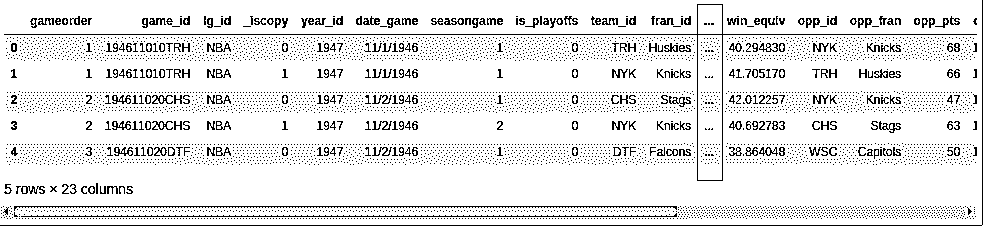](https://files.realpython.com/media/head.7c86dafd4141.png)

除非您的屏幕非常大，否则您的输出可能不会显示所有 23 列。在中间的某个地方，您会看到一列省略号(`...`)表示丢失的数据。如果您在终端中工作，那么这可能比换行更具可读性。然而，Jupyter 笔记本可以让你滚动。您可以将 Pandas 配置为显示所有 23 列，如下所示:

>>>

```py
>>> pd.set_option("display.max.columns", None)
```

虽然查看所有列很实用，但您可能不需要六位小数！改成两个:

>>>

```py
>>> pd.set_option("display.precision", 2)
```

为了验证您已经成功地更改了选项，您可以再次执行`.head()`，或者您可以使用`.tail()`来显示最后五行:

>>>

```py
>>> nba.tail()
```

现在，您应该看到所有的列，并且您的数据应该显示两位小数:

[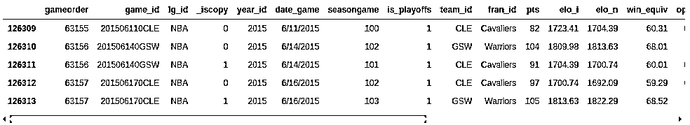](https://files.realpython.com/media/tail.0dc48c8c2803.png)

你可以通过一个小练习发现`.head()`和`.tail()`的一些进一步的可能性。你能不能[打印](https://realpython.com/python-print/)你的`DataFrame`的最后三行？展开下面的代码块以查看解决方案:


下面是如何打印`nba`的最后三行:

>>>

```py
>>> nba.tail(3)
```

您的输出应该如下所示:

[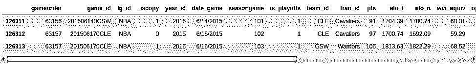](https://files.realpython.com/media/tail_3.52cf0045b5ff.png)

使用上面设置的选项，您可以看到数据集的最后三行。

与 Python 标准库类似，Pandas 中的函数也带有几个可选参数。每当你碰到一个看起来相关但与你的用例略有不同的例子时，查看一下官方文档。通过调整一些可选参数，您很有可能找到解决方案！

[*Remove ads*](/account/join/)

## 了解您的数据

您已经使用 Pandas Python 库导入了一个 CSV 文件，并初步查看了数据集的内容。到目前为止，您只看到了数据集的大小及其第一行和最后几行。接下来，你将学习如何更系统地检查你的数据。

### 显示数据类型

了解你的数据的第一步是发现它包含的不同的数据类型。虽然您可以将任何内容放入列表中，但是`DataFrame`的列包含特定数据类型的值。当您比较 Pandas 和 Python 数据结构时，您会发现这种行为使 Pandas 快得多！

您可以使用`.info()`显示所有列及其数据类型:

>>>

```py
>>> nba.info()
```

这将产生以下输出:

[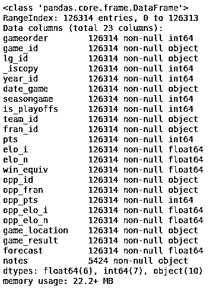](https://files.realpython.com/media/info.80fdd50f4ff7.png)

您将看到数据集中所有列的列表以及每列包含的数据类型。在这里，您可以看到数据类型`int64`、`float64`和`object`。熊猫使用 [NumPy](https://realpython.com/numpy-array-programming/) 库来处理这些类型。稍后，您将遇到更复杂的`categorical`数据类型，这是 Pandas Python 库自己实现的。

`object`数据类型是一种特殊的类型。根据[*Pandas Cookbook*](https://realpython.com/asins/B06W2LXLQK/),`object`数据类型是“Pandas 不识别为任何其他特定类型的列的总称”实际上，这通常意味着列中的所有值都是字符串。

尽管您可以在`object`数据类型中存储任意的 Python 对象，但是您应该意识到这样做的缺点。一个`object`列中奇怪的值会损害[熊猫的性能](https://realpython.com/fast-flexible-pandas/)以及它与其他库的互操作性。更多信息，请查看官方[入门指南](https://pandas.pydata.org/pandas-docs/stable/getting_started/basics.html#basics-dtypes)。

### 显示基本统计数据

现在，您已经了解了数据集中的数据类型，是时候了解每一列包含的值了。您可以使用`.describe()`来完成此操作:

>>>

```py
>>> nba.describe()
```

此函数显示所有数字列的一些基本描述性统计信息:

[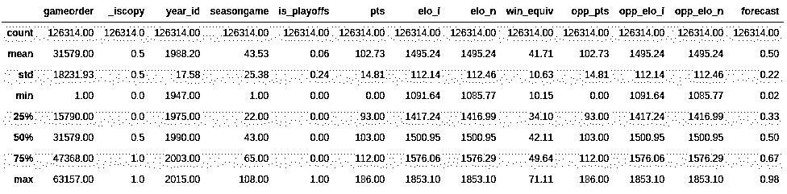](https://files.realpython.com/media/describe.0be00956e704.png)

`.describe()`默认情况下只分析数字列，但是如果使用`include`参数，您可以提供其他数据类型:

>>>

```py
>>> import numpy as np
>>> nba.describe(include=object)
```

`.describe()`不会尝试计算`object`列的平均值或标准偏差，因为它们大多包含文本字符串。但是，它仍然会显示一些描述性统计数据:

[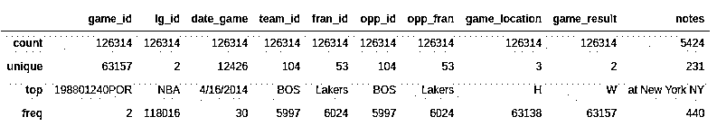](https://files.realpython.com/media/describe_object.2ec0a6039517.png)

看一下`team_id`和`fran_id`列。您的数据集包含 104 个不同的球队 id，但只有 53 个不同的球队 id。此外，最常见的球队 ID 是`BOS`，但最常见的球队 ID 是`Lakers`。这怎么可能呢？要回答这个问题，您需要更深入地研究您的数据集。

[*Remove ads*](/account/join/)

### 探索您的数据集

**探索性数据分析**可以帮助你回答关于数据集的问题。例如，您可以检查特定值在列中出现的频率:

>>>

```py
>>> nba["team_id"].value_counts()
BOS    5997
NYK    5769
LAL    5078
...
SDS      11
>>> nba["fran_id"].value_counts()
Name: team_id, Length: 104, dtype: int64
Lakers          6024
Celtics         5997
Knicks          5769
...
Huskies           60
Name: fran_id, dtype: int64
```

一支名为`"Lakers"`的球队似乎打了 6024 场比赛，但其中只有 5078 场是由洛杉矶湖人队打的。找出另一个`"Lakers"`团队是谁:

>>>

```py
>>> nba.loc[nba["fran_id"] == "Lakers", "team_id"].value_counts()
LAL    5078
MNL     946
Name: team_id, dtype: int64
```

的确，明尼阿波利斯湖人(`"MNL"`)打了 946 场比赛。你甚至可以知道他们什么时候玩这些游戏。为此，您将首先定义一个将`date_game`的值转换为`datetime`数据类型的列。然后，您可以使用`min`和`max`聚合函数来查找明尼阿波利斯湖人队的第一场和最后一场比赛:

>>>

```py
>>> nba["date_played"] = pd.to_datetime(nba["date_game"])
>>> nba.loc[nba["team_id"] == "MNL", "date_played"].min()
Timestamp('1948-11-04 00:00:00')
>>> nba.loc[nba['team_id'] == 'MNL', 'date_played'].max()
Timestamp('1960-03-26 00:00:00')
>>> nba.loc[nba["team_id"] == "MNL", "date_played"].agg(("min", "max"))
min   1948-11-04
max   1960-03-26
Name: date_played, dtype: datetime64[ns]
```

看起来明尼阿波利斯湖人队在 1948 年到 1960 年间打过比赛。这就解释了为什么你可能认不出这个团队！

你也发现了为什么波士顿凯尔特人队`"BOS"`在数据集中打了最多的比赛。让我们也分析一下他们的历史。找出波士顿凯尔特人队在该数据集中包含的所有比赛中得了多少分。展开以下解决方案的代码块:


类似于`.min()`和`.max()`聚合函数，也可以使用`.sum()`:

>>>

```py
>>> nba.loc[nba["team_id"] == "BOS", "pts"].sum()
626484
```

波士顿凯尔特人队总共得了 626，484 分。

你已经尝到了熊猫的厉害。在接下来的几节中，您将对刚才使用的技术进行扩展，但是首先，您将放大并了解这个强大的数据结构是如何工作的。

## 了解熊猫的数据结构

虽然`DataFrame`提供的功能看起来很直观，但是底层的概念有点难以理解。出于这个原因，您将搁置庞大的 NBA `DataFrame`并从头开始构建一些较小的熊猫对象。

### 了解系列对象

Python 最基本的数据结构是[列表](https://realpython.com/courses/lists-tuples-python/)，这也是了解 **`pandas.Series`** 对象的一个很好的起点。基于列表创建一个新的`Series`对象:

>>>

```py
>>> revenues = pd.Series([5555, 7000, 1980])
>>> revenues
0    5555
1    7000
2    1980
dtype: int64
```

您已经使用列表`[5555, 7000, 1980]`创建了一个名为`revenues`的`Series`对象。一个`Series`对象包装了两个组件:

1.  一系列**值**
2.  一系列的**标识符**，这是索引

您可以分别使用`.values`和`.index`访问这些组件:

>>>

```py
>>> revenues.values
array([5555, 7000, 1980])
>>> revenues.index
RangeIndex(start=0, stop=3, step=1)
```

`revenues.values`返回`Series`中的值，而`revenues.index`返回位置索引。

**注意:**如果你熟悉 [NumPy](https://realpython.com/how-to-use-numpy-arange/) ，那么你可能会有兴趣注意到一个`Series`对象的值实际上是 n 维数组:

>>>

```py
>>> type(revenues.values)
<class 'numpy.ndarray'>
```

如果你不熟悉 NumPy，那就不用担心了！您可以单独使用 Pandas Python 库来探索数据集的细节。然而，如果你对熊猫在幕后做什么感到好奇，那么看看[看看 Ma，No For-Loops:NumPy 的数组编程](https://realpython.com/numpy-array-programming/)。

虽然熊猫建立在 NumPy 的基础上，但一个显著的不同是它们的**索引**。就像 NumPy 数组一样，Pandas `Series`也有一个隐式定义的整数索引。这个隐式索引指示元素在`Series`中的位置。

然而，`Series`也可以有任意类型的索引。您可以将这个显式索引视为特定行的标签:

>>>

```py
>>> city_revenues = pd.Series(
...     [4200, 8000, 6500],
...     index=["Amsterdam", "Toronto", "Tokyo"]
... )
>>> city_revenues
Amsterdam    4200
Toronto      8000
Tokyo        6500
dtype: int64
```

这里，索引是由字符串表示的城市名称列表。您可能已经注意到 Python 字典也使用字符串索引，这是一个需要记住的方便的类比！您可以使用上面的代码块来区分两种类型的`Series`:

1.  **`revenues` :** 这个`Series`的行为就像一个 Python 列表，因为它只有一个位置索引。
2.  **`city_revenues` :** 这个`Series`就像一个 Python 字典，因为它既有位置索引又有标签索引。

下面是如何从 Python 字典中构造一个带有标签索引的`Series`:

>>>

```py
>>> city_employee_count = pd.Series({"Amsterdam": 5, "Tokyo": 8})
>>> city_employee_count
Amsterdam    5
Tokyo        8
dtype: int64
```

字典键成为索引，字典值是`Series`值。

就像字典一样，`Series`也支持`.keys()`和`in` [关键字](https://realpython.com/python-keywords/):

>>>

```py
>>> city_employee_count.keys()
Index(['Amsterdam', 'Tokyo'], dtype='object')
>>> "Tokyo" in city_employee_count
True
>>> "New York" in city_employee_count
False
```

您可以使用这些方法快速回答有关数据集的问题。

[*Remove ads*](/account/join/)

### 理解数据帧对象

虽然一个`Series`是一个非常强大的数据结构，但它有其局限性。例如，每个键只能存储一个属性。正如您在拥有 23 列的`nba`数据集上看到的，Pandas Python 库通过其 **`DataFrame`** 提供了更多。这个数据结构是一系列共享相同索引的`Series`对象。

如果您遵循了`Series`示例，那么您应该已经有了两个以城市为键的`Series`对象:

1.  `city_revenues`
2.  `city_employee_count`

通过在构造函数中提供一个字典，可以将这些对象组合成一个`DataFrame`。字典键将成为列名，值应该包含`Series`对象:

>>>

```py
>>> city_data = pd.DataFrame({
...     "revenue": city_revenues,
...     "employee_count": city_employee_count
... })
>>> city_data
 revenue  employee_count
Amsterdam     4200             5.0
Tokyo         6500             8.0
Toronto       8000             NaN
```

请注意 Pandas 如何用`NaN`替换多伦多缺少的`employee_count`值。

新的`DataFrame`指数是两个`Series`指数的联合:

>>>

```py
>>> city_data.index
Index(['Amsterdam', 'Tokyo', 'Toronto'], dtype='object')
```

与`Series`一样，`DataFrame`也将其值存储在 NumPy 数组中:

>>>

```py
>>> city_data.values
array([[4.2e+03, 5.0e+00],
 [6.5e+03, 8.0e+00],
 [8.0e+03,     nan]])
```

你也可以将一个`DataFrame`的两个维度称为**轴**:

>>>

```py
>>> city_data.axes
[Index(['Amsterdam', 'Tokyo', 'Toronto'], dtype='object'),
 Index(['revenue', 'employee_count'], dtype='object')]
>>> city_data.axes[0]
 Index(['Amsterdam', 'Tokyo', 'Toronto'], dtype='object')
>>> city_data.axes[1]
 Index(['revenue', 'employee_count'], dtype='object')
```

标有 0 的轴是**行索引**，标有 1 的轴是**列索引**。了解这个术语很重要，因为您会遇到几个接受`axis`参数的`DataFrame`方法。

一个`DataFrame`也是一个类似字典的数据结构，所以它也支持`.keys()`和`in`关键字。然而，对于一个`DataFrame`来说，这些与索引无关，而是与列有关:

>>>

```py
>>> city_data.keys()
Index(['revenue', 'employee_count'], dtype='object')
>>> "Amsterdam" in city_data
False
>>> "revenue" in city_data
True
```

你可以在更大的 NBA 数据集上看到这些概念。它包含一个名为`"points"`的列，还是被称为`"pts"`？要回答这个问题，请显示`nba`数据集的索引和轴，然后展开解决方案下面的代码块:


因为您在读取 CSV 文件时没有指定索引列，Pandas 为`DataFrame`分配了一个`RangeIndex`:

>>>

```py
>>> nba.index
RangeIndex(start=0, stop=126314, step=1)
```

`nba`像所有的`DataFrame`物体一样，有两个轴:

>>>

```py
>>> nba.axes
[RangeIndex(start=0, stop=126314, step=1),
 Index(['gameorder', 'game_id', 'lg_id', '_iscopy', 'year_id', 'date_game',
 'seasongame', 'is_playoffs', 'team_id', 'fran_id', 'pts', 'elo_i',
 'elo_n', 'win_equiv', 'opp_id', 'opp_fran', 'opp_pts', 'opp_elo_i',
 'opp_elo_n', 'game_location', 'game_result', 'forecast', 'notes'],
 dtype='object')]
```

您可以使用`.keys()`检查列是否存在:

>>>

```py
>>> "points" in nba.keys()
False
>>> "pts" in nba.keys()
True
```

列叫`"pts"`，不叫`"points"`。

当您使用这些方法来回答有关数据集的问题时，请务必记住您是在使用`Series`还是`DataFrame`来进行工作，以便您的解释是准确的。

## 访问系列元素

在上一节中，您已经基于 Python 列表创建了一个 Pandas `Series`,并比较了两种数据结构。您已经看到了`Series`对象在几个方面与列表和字典相似。另一个相似之处是，您也可以对`Series`使用**索引操作符** ( `[]`)。

您还将学习如何使用两个熊猫专用的**访问方法**:

1.  `.loc`
2.  `.iloc`

您将看到这些数据访问方法比索引操作符更具可读性。

[*Remove ads*](/account/join/)

### 使用索引操作符

回想一下，a `Series`有两个索引:

1.  **一个位置或隐式索引**，它总是一个`RangeIndex`
2.  **标签或显式索引**，可以包含任何可散列对象

接下来，重新访问`city_revenues`对象:

>>>

```py
>>> city_revenues
Amsterdam    4200
Toronto      8000
Tokyo        6500
dtype: int64
```

您可以通过标签和位置索引方便地访问`Series`中的值:

>>>

```py
>>> city_revenues["Toronto"]
8000
>>> city_revenues[1]
8000
```

您也可以使用负的索引和切片，就像对列表一样:

>>>

```py
>>> city_revenues[-1]
6500
>>> city_revenues[1:]
Toronto    8000
Tokyo      6500
dtype: int64
>>> city_revenues["Toronto":]
Toronto    8000
Tokyo      6500
dtype: int64
```

如果您想了解更多关于索引操作符的可能性，请查看 Python 中的[列表和元组。](https://realpython.com/python-lists-tuples/)

### 使用`.loc`和`.iloc`

索引操作符(`[]`)很方便，但是有一个警告。如果标签也是数字呢？假设您必须像这样处理一个`Series`对象:

>>>

```py
>>> colors = pd.Series(
...     ["red", "purple", "blue", "green", "yellow"],
...     index=[1, 2, 3, 5, 8]
... )
>>> colors
1       red
2    purple
3      blue
5     green
8    yellow
dtype: object
```

`colors[1]`会有什么回报？对于位置索引，`colors[1]`是`"purple"`。然而，如果你去的标签索引，那么`colors[1]`是指`"red"`。

好消息是，你不用去想它！相反，为了避免混淆，Pandas Python 库提供了两种**数据访问方法**:

1.  **`.loc`** 指**标注的指标**。
2.  **`.iloc`** 指**位置指数**。

这些数据访问方法可读性更强:

>>>

```py
>>> colors.loc[1]
'red'
>>> colors.iloc[1]
'purple'
```

`colors.loc[1]`返回`"red"`，标签为`1`的元素。`colors.iloc[1]`返回`"purple"`，索引为`1`的元素。

下图显示了`.loc`和`.iloc`所指的元素:

[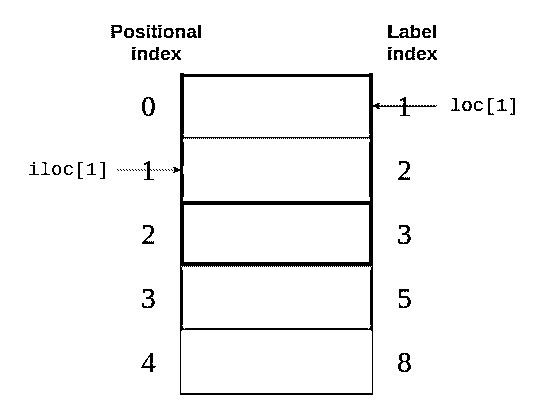](https://files.realpython.com/media/iloc_vs_loc_80_border20.d5280f475f4e.png)

同样，`.loc`指向图像右侧的标签索引。同时，`.iloc`指向图片左侧的位置索引。

记住`.loc`和`.iloc`之间的区别比计算出索引操作符将返回什么更容易。即使你熟悉索引操作符的所有特性，假设每个阅读你的代码的人都已经理解了那些规则也是危险的！

**注意:**除了用数字标签混淆`Series`之外，Python 索引操作符还有一些**性能缺陷**。在交互式会话中使用它进行特别分析完全没问题，但是对于生产代码来说，`.loc`和`.iloc`数据访问方法更好。要了解更多细节，请查看 Pandas 用户指南中关于[索引和选择数据](https://pandas.pydata.org/pandas-docs/stable/user_guide/indexing.html)的部分。

`.loc`和`.iloc`也支持索引操作符的特性，比如切片。然而，这些数据访问方法有一个重要的区别。`.iloc`不包含关闭元素，`.loc`包含关闭元素。看一下这个代码块:

>>>

```py
>>> # Return the elements with the implicit index: 1, 2
>>> colors.iloc[1:3]
2    purple
3      blue
dtype: object
```

如果您将这段代码与上面的图像进行比较，那么您可以看到`colors.iloc[1:3]`返回了具有`1`和`2`的**位置索引**的元素。位置索引为`3`的关闭项目`"green"`被排除。

另一方面，`.loc`包括结束元素:

>>>

```py
>>> # Return the elements with the explicit index between 3 and 8
>>> colors.loc[3:8]
3      blue
5     green
8    yellow
dtype: object
```

这个代码块表示返回所有标签索引在`3`和`8`之间**的元素。这里，结束项`"yellow"`的标签索引为`8`，并且包含在输出中。**

您也可以将一个负的位置索引传递给`.iloc`:

>>>

```py
>>> colors.iloc[-2]
'green'
```

你从`Series`的结尾开始，返回第二个元素。

**注意:**曾经有一个`.ix`索引器，它试图根据索引的数据类型来猜测它应该应用位置索引还是标签索引。因为它引起了很多混乱，所以从 Pandas 0 . 20 . 0 版本开始就被弃用了。

强烈建议您**不要使用`.ix`** 进行索引。相反，始终使用`.loc`进行标签索引，使用`.iloc`进行位置索引。更多详情，请查看[熊猫用户指南](https://pandas.pydata.org/pandas-docs/stable/user_guide/indexing.html#ix-indexer-is-deprecated)。

您可以使用上面的代码块来区分两种`Series`行为:

1.  你可以在`Series`上使用`.iloc`，类似于在**列表**上使用`[]`。
2.  你可以在`Series`上使用`.loc`，类似于在**字典**上使用`[]`。

在访问`Series`对象的元素时，一定要记住这些区别。

[*Remove ads*](/account/join/)

## 访问数据帧元素

由于`DataFrame`由`Series`对象组成，您可以使用完全相同的工具来访问它的元素。关键的区别在于`DataFrame`的额外**尺寸**。您将对列使用索引操作符，对行使用访问方法`.loc`和`.iloc`。

### 使用索引操作符

如果您认为`DataFrame`是一个值为`Series`的字典，那么您可以使用索引操作符访问它的列:

>>>

```py
>>> city_data["revenue"]
Amsterdam    4200
Tokyo        6500
Toronto      8000
Name: revenue, dtype: int64
>>> type(city_data["revenue"])
pandas.core.series.Series
```

这里，您使用索引操作符来选择标记为`"revenue"`的列。

如果列名是一个字符串，那么您也可以使用带点符号的属性样式访问:

>>>

```py
>>> city_data.revenue
Amsterdam    4200
Tokyo        6500
Toronto      8000
Name: revenue, dtype: int64
```

`city_data["revenue"]`和`city_data.revenue`返回相同的输出。

有一种情况，用点符号访问`DataFrame`元素可能不起作用或者可能导致意外。这是当一个列名与一个`DataFrame`属性或方法名一致时:

>>>

```py
>>> toys = pd.DataFrame([
...     {"name": "ball", "shape": "sphere"},
...     {"name": "Rubik's cube", "shape": "cube"}
... ])
>>> toys["shape"]
0    sphere
1      cube
Name: shape, dtype: object
>>> toys.shape
(2, 2)
```

索引操作`toys["shape"]`返回正确的数据，但是属性样式操作`toys.shape`仍然返回`DataFrame`的形状。您应该只在交互式会话或读取操作中使用属性样式的访问。您不应该将它用于生产代码或操作数据(例如定义新列)。

### 使用`.loc`和`.iloc`

与`Series`类似，a `DataFrame`也提供了`.loc`和`.iloc` **数据访问方法**。记住，`.loc`使用标签，`.iloc`使用位置索引:

>>>

```py
>>> city_data.loc["Amsterdam"]
revenue           4200.0
employee_count       5.0
Name: Amsterdam, dtype: float64
>>> city_data.loc["Tokyo": "Toronto"]
 revenue employee_count
Tokyo   6500    8.0
Toronto 8000    NaN
>>> city_data.iloc[1]
revenue           6500.0
employee_count       8.0
Name: Tokyo, dtype: float64
```

每行代码从`city_data`中选择不同的行:

1.  **`city_data.loc["Amsterdam"]`** 选择标签索引为`"Amsterdam"`的行。
2.  **`city_data.loc["Tokyo": "Toronto"]`** 选择标签索引从`"Tokyo"`到`"Toronto"`的行。记住，`.loc`是包容的。
3.  **`city_data.iloc[1]`** 选择位置索引为`1`的行，即`"Tokyo"`。

好了，你已经在小型数据结构上使用了`.loc`和`.iloc`。现在，是时候用更大的东西来练习了！使用数据访问方法显示`nba`数据集的倒数第二行。然后，展开下面的代码块以查看解决方案:


倒数第二行是具有`-2`的**位置索引**的行。可以用`.iloc`显示:

>>>

```py
>>> nba.iloc[-2]
gameorder                      63157
game_id                 201506170CLE
lg_id                            NBA
_iscopy                            0
year_id                         2015
date_game                  6/16/2015
seasongame                       102
is_playoffs                        1
team_id                          CLE
fran_id                    Cavaliers
pts                               97
elo_i                        1700.74
elo_n                        1692.09
win_equiv                      59.29
opp_id                           GSW
opp_fran                    Warriors
opp_pts                          105
opp_elo_i                    1813.63
opp_elo_n                    1822.29
game_location                      H
game_result                        L
forecast                        0.48
notes                            NaN
date_played      2015-06-16 00:00:00
Name: 126312, dtype: object
```

您将看到输出是一个`Series`对象。

对于一个`DataFrame`，数据访问方法`.loc`和`.iloc`也接受第二个参数。第一个参数根据索引选择行，第二个参数选择列。您可以一起使用这些参数来从您的`DataFrame`中选择行和列的**子集**:

>>>

```py
>>> city_data.loc["Amsterdam": "Tokyo", "revenue"]
Amsterdam    4200
Tokyo        6500
Name: revenue, dtype: int64
```

请注意，您用逗号(`,`)分隔参数。第一个参数`"Amsterdam" : "Tokyo,"`表示选择这两个标签之间的所有行。第二个参数跟在逗号后面，表示选择`"revenue"`列。

现在是时候看看同一个构造在更大的`nba`数据集上的表现了。选择标签`5555`和`5559`之间的所有游戏。您只对球队的名称和分数感兴趣，所以也要选择那些元素。展开下面的代码块以查看解决方案:


首先，定义要查看的行，然后列出相关的列:

>>>

```py
>>> nba.loc[5555:5559, ["fran_id", "opp_fran", "pts", "opp_pts"]]
```

使用`.loc`作为标签索引，用逗号(`,`)分隔两个参数。

您应该会看到相当大的数据集中的一小部分:

[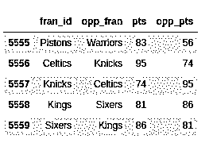](https://files.realpython.com/media/scores_5555_5559.ac34be4fb1c1.png)

输出更容易阅读！

使用像`.loc`和`.iloc`这样的数据访问方法，您可以选择正确的`DataFrame`子集来帮助您回答有关数据集的问题。

[*Remove ads*](/account/join/)

## 查询您的数据集

您已经看到了如何根据索引访问大型数据集的子集。现在，您将基于数据集的列中的值选择行，以**查询**您的数据。例如，您可以创建一个新的`DataFrame`，仅包含 2010 年以后玩过的游戏:

>>>

```py
>>> current_decade = nba[nba["year_id"] > 2010]
>>> current_decade.shape
(12658, 24)
```

您现在有 24 列，但是新的`DataFrame`只包含那些`"year_id"`列中的值大于`2010`的行。

您也可以选择特定字段不为空的行:

>>>

```py
>>> games_with_notes = nba[nba["notes"].notnull()]
>>> games_with_notes.shape
(5424, 24)
```

如果您希望避免列中缺少任何值，这可能会很有帮助。也可以用`.notna()`来达到同样的目的。

您甚至可以将`object`数据类型的值作为`str`来访问，并对它们执行[字符串方法](https://realpython.com/courses/splitting-concatenating-and-joining-strings-python/):

>>>

```py
>>> ers = nba[nba["fran_id"].str.endswith("ers")]
>>> ers.shape
(27797, 24)
```

您使用`.str.endswith()`来过滤您的数据集，并找到主队名称以`"ers"`结尾的所有游戏。

您可以组合多个条件并查询您的数据集。要做到这一点，一定要将它们放在括号中，并使用逻辑[操作符](https://realpython.com/python-operators-expressions/) `|`和`&`来分隔它们。

**注:**操作员`and`、`or`、`&&`、`||`在此不工作。如果你对其中的原因感到好奇，那么看看 Pandas Python 库如何在 [Python Pandas: Tricks &特性中使用布尔操作符，你可能不知道](https://realpython.com/python-pandas-tricks/#8-understand-how-pandas-uses-boolean-operators)。

搜索一下两队得分都超过 100 分的巴尔的摩比赛。为了每个游戏只看一次，您需要排除重复的游戏:

>>>

```py
>>> nba[
...     (nba["_iscopy"] == 0) &
...     (nba["pts"] > 100) &
...     (nba["opp_pts"] > 100) &
...     (nba["team_id"] == "BLB")
... ]
```

这里，您使用`nba["_iscopy"] == 0`来只包含不是副本的条目。

您的输出应该包含五个重要的游戏:

[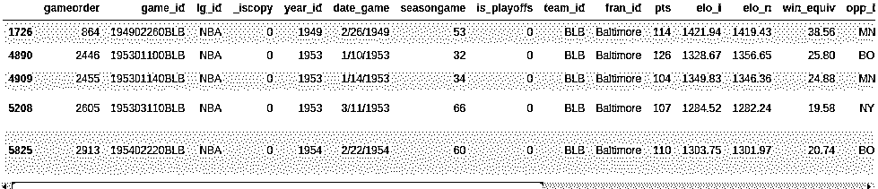](https://files.realpython.com/media/BLB_both_over_100_points.6fc6b6ff2d3b.png)

尝试使用多个条件构建另一个查询。1992 年春天，来自洛杉矶的两支球队都必须在另一个球场打一场主场比赛。查询您的数据集以找到这两个游戏。两个队都有一个以`"LA"`开头的 ID。展开下面的代码块以查看解决方案:


您可以使用`.str`来查找以`"LA"`开头的团队 id，并且您可以假设这样一个不寻常的游戏会有一些注释:

>>>

```py
>>> nba[
...     (nba["_iscopy"] == 0) &
...     (nba["team_id"].str.startswith("LA")) &
...     (nba["year_id"]==1992) &
...     (nba["notes"].notnull())
... ]
```

您的输出应该显示 1992 年 5 月 3 日的两场比赛:

[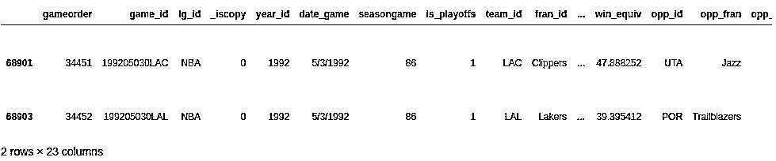](https://files.realpython.com/media/LA_on_tour.2fb2e541cfa5.png)

不错的发现！

当您知道如何使用多个条件查询数据集时，您将能够回答有关数据集的更具体的问题。

[*Remove ads*](/account/join/)

## 分组和汇总您的数据

您可能还想了解数据集的其他特征，如一组元素的总和、平均值或平均值。幸运的是，Pandas Python 库提供了**分组和聚合函数**来帮助您完成这项任务。

一个`Series`有二十多种不同的计算描述性统计的方法。以下是一些例子:

>>>

```py
>>> city_revenues.sum()
18700
>>> city_revenues.max()
8000
```

第一种方法返回`city_revenues`的总和，而第二种方法返回最大值。你还可以使用其他方法，比如`.min()`和`.mean()`。

记住，`DataFrame`的列实际上是一个`Series`对象。因此，您可以在`nba`的列上使用这些相同的功能:

>>>

```py
>>> points = nba["pts"]
>>> type(points)
<class 'pandas.core.series.Series'>
>>> points.sum()
12976235
```

一个`DataFrame`可以有多个列，这为聚合引入了新的可能性，比如**分组**:

>>>

```py
>>> nba.groupby("fran_id", sort=False)["pts"].sum()
fran_id
Huskies           3995
Knicks          582497
Stags            20398
Falcons           3797
Capitols         22387
...
```

默认情况下，Pandas 在调用`.groupby()`时对组密钥进行排序。如果不想排序，那就过`sort=False`。这个参数可以提高性能。

您也可以按多列分组:

>>>

```py
>>> nba[
...     (nba["fran_id"] == "Spurs") &
...     (nba["year_id"] > 2010)
... ].groupby(["year_id", "game_result"])["game_id"].count()
year_id  game_result
2011     L              25
 W              63
2012     L              20
 W              60
2013     L              30
 W              73
2014     L              27
 W              78
2015     L              31
 W              58
Name: game_id, dtype: int64
```

你可以通过练习来练习这些基础知识。看看金州勇士 2014-15 赛季(`year_id: 2015`)。他们在常规赛和季后赛中取得了多少胜败？展开以下解决方案的代码块:


首先，您可以按`"is_playoffs"`字段分组，然后按结果分组:

>>>

```py
>>> nba[
...     (nba["fran_id"] == "Warriors") &
...     (nba["year_id"] == 2015)
... ].groupby(["is_playoffs", "game_result"])["game_id"].count()
is_playoffs  game_result
0            L              15
 W              67
1            L               5
 W              16
```

`is_playoffs=0`显示常规赛结果，`is_playoffs=1`显示季后赛结果。

在上面的例子中，您仅仅触及了 Pandas Python 库中可用的聚合函数的皮毛。要查看如何使用它们的更多示例，请查看 [Pandas GroupBy:您的 Python 数据分组指南](https://realpython.com/pandas-groupby/)。

## 操作列

你需要知道如何在数据分析过程的不同阶段**操作**数据集的列。作为最初的[数据清理](https://realpython.com/python-data-cleaning-numpy-pandas/)阶段的一部分，您可以添加和删除列，或者在以后基于您的分析见解添加和删除列。

创建原始`DataFrame`的副本，以便使用:

>>>

```py
>>> df = nba.copy()
>>> df.shape
(126314, 24)
```

您可以基于现有列定义新列:

>>>

```py
>>> df["difference"] = df.pts - df.opp_pts
>>> df.shape
(126314, 25)
```

这里，您使用了`"pts"`和`"opp_pts"`列来创建一个名为`"difference"`的新列。这个新列与旧列具有相同的功能:

>>>

```py
>>> df["difference"].max()
68
```

这里，您使用了一个聚合函数`.max()`来查找新列的最大值。

您还可以重命名数据集的列。看来`"game_result"`和`"game_location"`太啰嗦了，现在就去重命名吧:

>>>

```py
>>> renamed_df = df.rename(
...     columns={"game_result": "result", "game_location": "location"}
... )
>>> renamed_df.info()
<class 'pandas.core.frame.DataFrame'>
RangeIndex: 126314 entries, 0 to 126313
Data columns (total 25 columns):
 #   Column       Non-Null Count   Dtype
---  ------       --------------   -----
 0   gameorder    126314 non-null  int64
 ... 
 19  location     126314 non-null  object
 20  result       126314 non-null  object
 21  forecast     126314 non-null  float64
 22  notes        5424 non-null    object
 23  date_played  126314 non-null  datetime64[ns]
 24  difference   126314 non-null  int64
dtypes: datetime64[ns](1), float64(6), int64(8), object(10)
memory usage: 24.1+ MB
```

注意这里有一个新的对象，`renamed_df`。像其他几种数据操作方法一样，`.rename()`默认返回一个新的`DataFrame`。如果你想直接操纵原来的`DataFrame`，那么`.rename()`还提供了一个`inplace`参数，你可以设置为`True`。

数据集可能包含不需要的列。例如， [Elo ratings](https://fivethirtyeight.com/features/how-we-calculate-nba-elo-ratings/) 对某些人来说可能是一个迷人的概念，但在本教程中您不会分析它们。您可以删除与 Elo 相关的四列:

>>>

```py
>>> df.shape
(126314, 25)
>>> elo_columns = ["elo_i", "elo_n", "opp_elo_i", "opp_elo_n"]
>>> df.drop(elo_columns, inplace=True, axis=1)
>>> df.shape
(126314, 21)
```

请记住，您在前面的示例中添加了新列`"difference"`，使列总数达到 25。当您删除四个 Elo 列时，列的总数将下降到 21。

[*Remove ads*](/account/join/)

## 指定数据类型

当您创建一个新的`DataFrame`时，无论是通过调用一个构造函数还是读取一个 CSV 文件，Pandas 都会根据它的值为每一列分配一个**数据类型**。虽然它做得很好，但并不完美。如果您预先为列选择了正确的数据类型，那么您可以显著提高代码的性能。

再看一下`nba`数据集的列:

>>>

```py
>>> df.info()
```

您将看到与之前相同的输出:

[](https://files.realpython.com/media/info.80fdd50f4ff7.png)

您的列中有十列的数据类型为`object`。这些`object`列中的大多数包含任意文本，但是也有一些数据类型**转换**的候选者。例如，看一看`date_game`一栏:

>>>

```py
>>> df["date_game"] = pd.to_datetime(df["date_game"])
```

这里，您使用`.to_datetime()`将所有游戏日期指定为`datetime`对象。

其他列包含的文本更加结构化。`game_location`列只能有三个不同的值:

>>>

```py
>>> df["game_location"].nunique()
3
>>> df["game_location"].value_counts()
A    63138
H    63138
N       38
Name: game_location, dtype: int64
```

对于这样的列，您会在关系数据库中使用哪种数据类型？您可能不会使用`varchar`类型，而是使用`enum`。Pandas 出于同样的目的提供了`categorical`数据类型:

>>>

```py
>>> df["game_location"] = pd.Categorical(df["game_location"])
>>> df["game_location"].dtype
CategoricalDtype(categories=['A', 'H', 'N'], ordered=False)
```

**`categorical`数据**相对于非结构化文本有一些优势。当您指定`categorical`数据类型时，您使验证变得更容易并节省了大量内存，因为 Pandas 将只在内部使用唯一的值。总值与唯一值的比率越高，节省的空间就越多。

再次运行`df.info()`。您应该看到，将`game_location`数据类型从`object`更改为`categorical`减少了内存使用。

**注意:**`categorical`数据类型还允许您通过`.cat`访问器访问其他方法。要了解更多，请查看[官方文件](https://pandas.pydata.org/pandas-docs/stable/user_guide/categorical.html)。

您经常会遇到包含太多文本列的数据集。数据科学家必须具备的一项基本技能是，能够发现哪些列可以转换为更高性能的数据类型。

现在花点时间练习一下。在`nba`数据集中找到另一个具有通用数据类型的列，并将其转换为更具体的类型。您可以展开下面的代码块来查看一个可能的解决方案:


`game_result`只能取两个不同的值:

>>>

```py
>>> df["game_result"].nunique()
2
>>> df["game_result"].value_counts()
L    63157
W    63157
```

为了提高性能，您可以将它转换成一个`categorical`列:

>>>

```py
>>> df["game_result"] = pd.Categorical(df["game_result"])
```

您可以使用`df.info()`来检查内存使用情况。

当您处理更大规模的数据集时，节省内存变得尤为重要。在您继续探索数据集时，请务必牢记**性能**。

[*Remove ads*](/account/join/)

## 清洗数据

你可能会惊讶地发现这一部分在教程中这么晚！通常，在进行更复杂的分析之前，您会仔细检查您的数据集以解决任何问题。但是，在本教程中，您将依靠在前面章节中学习的技术来清理数据集。

### 缺失值

您是否想过为什么`.info()`显示一列包含多少个非空值？原因是这是至关重要的信息。**空值**通常表示数据收集过程中存在问题。他们可以让几种分析技术变得困难甚至不可能，就像不同类型的[机器学习](https://realpython.com/tutorials/machine-learning/)。

当你用`nba.info()`检查`nba`数据集时，你会发现它非常整洁。只有列`notes`的大部分行包含空值:

[](https://files.realpython.com/media/info.80fdd50f4ff7.png)

该输出显示`notes`列只有 5424 个非空值。这意味着数据集的 120，000 多行在该列中具有空值。

有时，处理包含缺失值的记录的最简单方法是忽略它们。您可以使用`.dropna()`删除所有缺失值的行:

>>>

```py
>>> rows_without_missing_data = nba.dropna()
>>> rows_without_missing_data.shape
(5424, 24)
```

当然，这种数据清理对你的`nba`数据集没有意义，因为一个游戏缺少笔记不是问题。但是，如果您的数据集包含一百万条有效记录和一百条相关数据缺失的记录，那么丢弃不完整的记录可能是一个合理的解决方案。

如果有问题的列与您的分析无关，您也可以删除它们。为此，再次使用`.dropna()`并提供`axis=1`参数:

>>>

```py
>>> data_without_missing_columns = nba.dropna(axis=1)
>>> data_without_missing_columns.shape
(126314, 23)
```

现在，得到的`DataFrame`包含所有 126，314 个游戏，但不包括有时为空的`notes`列。

如果您的用例有一个有意义的默认值，那么您也可以用它来替换缺失的值:

>>>

```py
>>> data_with_default_notes = nba.copy()
>>> data_with_default_notes["notes"].fillna(
...     value="no notes at all",
...     inplace=True
... )
>>> data_with_default_notes["notes"].describe()
count              126314
unique                232
top       no notes at all
freq               120890
Name: notes, dtype: object
```

在这里，用字符串`"no notes at all"`填充空的`notes`行。

### 无效值

**无效值**可能比缺失值更危险。通常，您可以按预期执行数据分析，但是您得到的结果是奇特的。如果您的数据集很大或使用手动输入，这一点尤其重要。无效值通常更难检测，但是您可以使用查询和聚合实现一些健全性检查。

您可以做的一件事是验证数据的范围。对于这一点，`.describe()`相当得心应手。回想一下，它会返回以下输出:

[](https://files.realpython.com/media/describe.0be00956e704.png)

`year_id`在 1947 年和 2015 年之间变化。这听起来似乎合理。

那`pts`呢？最低怎么可能是`0`？让我们来看看这些游戏:

>>>

```py
>>> nba[nba["pts"] == 0]
```

此查询返回单行:

[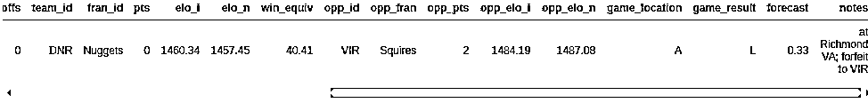](https://files.realpython.com/media/0_to_2_game.820df65c4193.png)

似乎比赛被取消了。根据您的分析，您可能希望将其从数据集中移除。

### 不一致的值

有时一个值本身是完全真实的，但是它与其他列中的值不匹配。您可以定义一些互斥的查询条件，并验证这些条件不会同时出现。

在 NBA 数据集中，字段`pts`、`opp_pts`和`game_result`的值应该相互一致。您可以使用`.empty`属性对此进行检查:

>>>

```py
>>> nba[(nba["pts"] > nba["opp_pts"]) & (nba["game_result"] != 'W')].empty
True
>>> nba[(nba["pts"] < nba["opp_pts"]) & (nba["game_result"] != 'L')].empty
True
```

幸运的是，这两个查询都返回一个空的`DataFrame`。

无论何时处理原始数据集，都要做好应对意外的准备，尤其是当它们是从不同的来源或通过复杂的渠道收集时。您可能会看到一些行，其中某个团队得分高于对手，但仍然没有获胜——至少根据您的数据集是这样的！为了避免这种情况，请确保您将进一步的[数据清理技术](https://realpython.com/python-data-cleaning-numpy-pandas/)添加到您的 Pandas 和 Python 武器库中。

## 组合多个数据集

在上一节中，您已经学习了如何清理混乱的数据集。真实世界数据的另一个方面是，它通常来自多个部分。在这一节中，您将学习如何获取这些片段并**将它们组合**成一个数据集，以备分析。

[在前面的](#understanding-dataframe-objects)中，你根据它们的索引将两个`Series`对象合并成一个`DataFrame`。现在，您将更进一步，使用`.concat()`将`city_data`与另一个`DataFrame`组合起来。假设您已经收集了另外两个城市的一些数据:

>>>

```py
>>> further_city_data = pd.DataFrame(
...     {"revenue": [7000, 3400], "employee_count":[2, 2]},
...     index=["New York", "Barcelona"]
... )
```

第二个`DataFrame`包含城市`"New York"`和`"Barcelona"`的信息。

您可以使用`.concat()`将这些城市添加到`city_data`:

>>>

```py
>>> all_city_data = pd.concat([city_data, further_city_data], sort=False)
>>> all_city_data
Amsterdam   4200    5.0
Tokyo       6500    8.0
Toronto     8000    NaN
New York    7000    2.0
Barcelona   3400    2.0
```

现在，新变量`all_city_data`包含了来自两个`DataFrame`对象的值。

**注:**从 Pandas 0 . 25 . 0 版本开始，`sort`参数的默认值为`True`，但很快会改为`False`。为这个参数提供一个显式值是一个很好的实践，以确保您的代码在不同的 Pandas 和 Python 版本中工作一致。更多信息，请查阅[熊猫用户指南](https://pandas.pydata.org/pandas-docs/stable/user_guide/merging.html#concatenating-objects)。

默认情况下，`concat()`沿`axis=0`组合。换句话说，它追加行。您还可以通过提供参数`axis=1`来使用它添加列:

>>>

```py
>>> city_countries = pd.DataFrame({
...     "country": ["Holland", "Japan", "Holland", "Canada", "Spain"],
...     "capital": [1, 1, 0, 0, 0]},
...     index=["Amsterdam", "Tokyo", "Rotterdam", "Toronto", "Barcelona"]
... )
>>> cities = pd.concat([all_city_data, city_countries], axis=1, sort=False)
>>> cities
 revenue  employee_count  country  capital
Amsterdam   4200.0             5.0  Holland      1.0
Tokyo       6500.0             8.0    Japan      1.0
Toronto     8000.0             NaN   Canada      0.0
New York    7000.0             2.0      NaN      NaN
Barcelona   3400.0             2.0    Spain      0.0
Rotterdam      NaN             NaN  Holland      0.0
```

注意熊猫是如何为缺失的值添加`NaN`的。如果您只想合并出现在两个`DataFrame`对象中的城市，那么您可以将`join`参数设置为`inner`:

>>>

```py
>>> pd.concat([all_city_data, city_countries], axis=1, join="inner")
 revenue  employee_count  country  capital
Amsterdam     4200             5.0  Holland        1
Tokyo         6500             8.0    Japan        1
Toronto       8000             NaN   Canada        0
Barcelona     3400             2.0    Spain        0
```

虽然根据索引组合数据是最直接的方法，但这不是唯一的可能性。您可以[使用`.merge()`来实现一个连接操作](https://realpython.com/pandas-merge-join-and-concat/)，类似于 SQL:

>>>

```py
>>> countries = pd.DataFrame({
...     "population_millions": [17, 127, 37],
...     "continent": ["Europe", "Asia", "North America"]
... }, index= ["Holland", "Japan", "Canada"])
>>> pd.merge(cities, countries, left_on="country", right_index=True)
```

这里，您将参数`left_on="country"`传递给`.merge()`,以指示您想要连接哪一列。结果是一个更大的`DataFrame`，不仅包含城市数据，还包含各个国家的人口和大陆:

[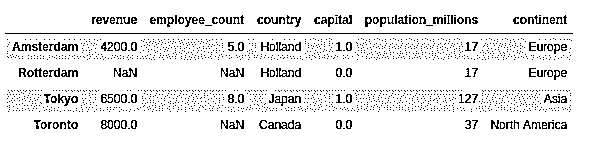](https://files.realpython.com/media/merge.2725ee7f0ea9.png)

注意，结果只包含国家已知的城市，并出现在连接的`DataFrame`中。

`.merge()`默认情况下执行内部连接。如果您想在结果中包含所有城市，那么您需要提供`how`参数:

>>>

```py
>>> pd.merge(
...     cities,
...     countries,
...     left_on="country",
...     right_index=True,
...     how="left"
... )
```

通过此`left`加入，您将看到所有城市，包括没有国家数据的城市:

[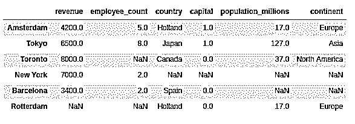](https://files.realpython.com/media/merge_left_join.ef63a7b2ad3f.png)

欢迎回来，纽约和巴塞罗那！

## 可视化你的熊猫数据帧

数据可视化是在 Jupyter 笔记本上比在终端上运行得更好的东西之一，所以开始运行吧。如果你需要帮助开始，那么看看 [Jupyter 笔记本:介绍](https://realpython.com/jupyter-notebook-introduction/)。您还可以通过单击下面的链接来访问包含本教程中的示例的 Jupyter 笔记本:

**获取 Jupyter 笔记本:** [点击此处获取 Jupyter 笔记本，您将在本教程中使用](https://realpython.com/bonus/pandas-intro/)探索与熊猫有关的数据。

包含此行以直接在笔记本中显示绘图:

>>>

```py
>>> %matplotlib inline
```

`Series`和`DataFrame`对象都有一个 [`.plot()`方法](https://realpython.com/pandas-plot-python/)，是对`matplotlib.pyplot.plot()`的包装。默认情况下，它会创建一个**线图**。想象一下尼克斯整个赛季得了多少分:

>>>

```py
>>> nba[nba["fran_id"] == "Knicks"].groupby("year_id")["pts"].sum().plot()
```

该图显示了 2000 年和 2010 年的一个线形图，其中有几个峰值和两个显著的谷值:

[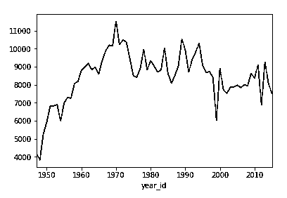](https://files.realpython.com/media/Knicks_points_sum_plot.ff35174b2854.png)

您还可以创建其他类型的图，如**条形图**:

>>>

```py
>>> nba["fran_id"].value_counts().head(10).plot(kind="bar")
```

这将显示玩得最多的游戏系列:

[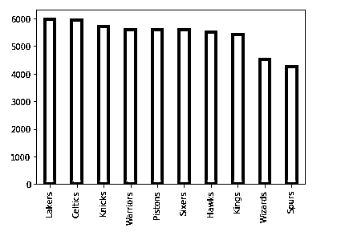](https://files.realpython.com/media/top10_franchises_bar_plot.2c8c4e458aa3.png)

湖人以微弱优势领先凯尔特人，还有六支球队的比赛次数超过 5000 次。

现在尝试一个更复杂的练习。2013 年，迈阿密热火队夺冠。创建一个饼图，显示他们在该赛季中的输赢。然后，展开代码块查看解决方案:


首先，你定义一个标准，只包括热火队 2013 年的比赛。然后，用与上面相同的方式创建一个情节:

>>>

```py
>>> nba[
...     (nba["fran_id"] == "Heat") &
...     (nba["year_id"] == 2013)
... ]["game_result"].value_counts().plot(kind="pie")
```

这是冠军馅饼的样子:

[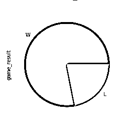](https://files.realpython.com/media/Heat_2013_pie_plot.6bc590d29b90.png)

盈利的份额明显大于亏损的份额！

有时，数字本身就能说明问题，但图表通常对传达你的见解很有帮助。要了解有关可视化数据的更多信息，请查看使用散景的 Python 中的[交互式数据可视化](https://realpython.com/python-data-visualization-bokeh/)。

## 结论

在本教程中，您已经学习了如何使用 Pandas Python 库开始探索数据集。您看到了如何访问特定的行和列来驯服最大的数据集。说到驯服，您还看到了多种准备和清理数据的技术，包括指定列的数据类型、处理缺失值等等。您甚至已经基于这些创建了查询、聚合和绘图。

**现在你可以:**

*   使用`Series`和`DataFrame`对象
*   使用`.loc`、`.iloc`和索引操作符对数据进行子集化
*   通过查询、分组和聚合回答问题
*   处理缺失、无效和不一致的数据
*   在 Jupyter 笔记本中可视化数据集

这次使用 NBA 统计数据的旅程仅仅触及了您可以用 Pandas Python 库做的事情的表面。你可以用[熊猫把戏](https://realpython.com/python-pandas-tricks/)启动你的项目，学习用 Python 加速[熊猫](https://realpython.com/fast-flexible-pandas/)的技术，甚至可以深入了解[熊猫如何在幕后工作](https://realpython.com/asins/B06W2LXLQK/)。还有更多功能等待您去发现，所以赶快去处理这些数据集吧！

您可以通过单击下面的链接获得您在本教程中看到的所有代码示例:

**获取 Jupyter 笔记本:** [点击此处获取 Jupyter 笔记本，您将在本教程中使用](https://realpython.com/bonus/pandas-intro/)探索与熊猫有关的数据。

*立即观看**本教程有真实 Python 团队创建的相关视频课程。与书面教程一起观看，以加深您的理解: [**用熊猫**](/courses/explore-dataset-with-pandas/) 探索您的数据集************