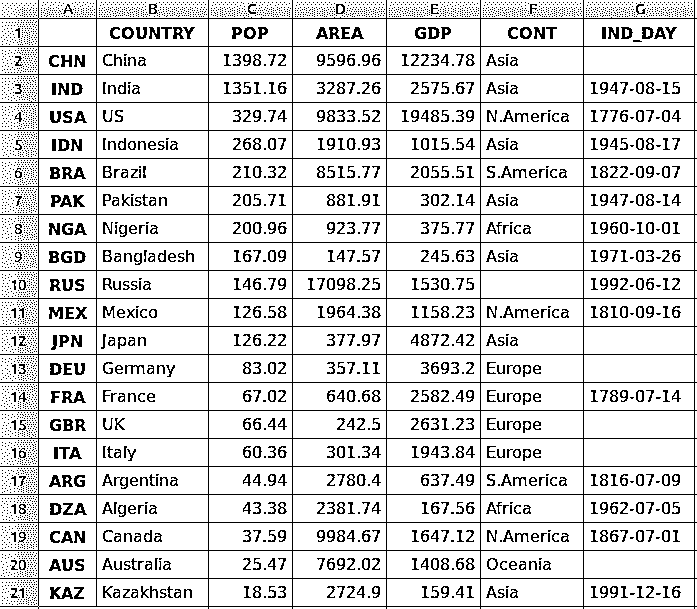
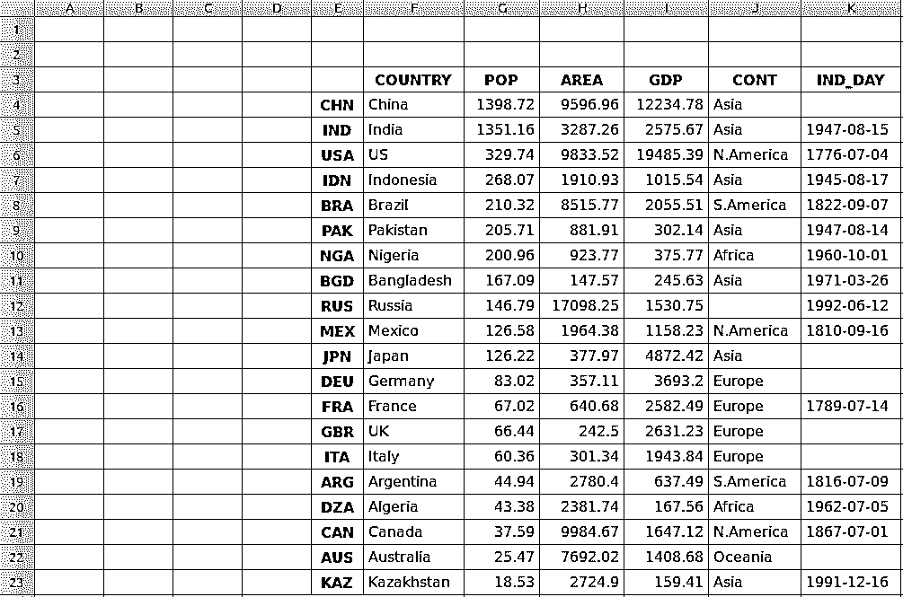
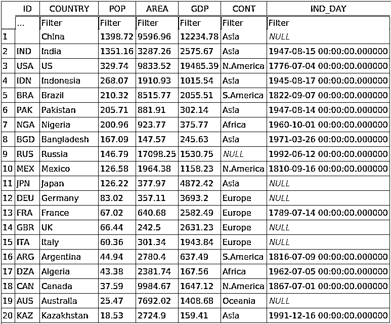

# 熊猫:如何读写文件

> 原文：<https://realpython.com/pandas-read-write-files/>

*立即观看**本教程有真实 Python 团队创建的相关视频课程。和文字教程一起看，加深理解: [**和熊猫一起读写文件**](/courses/reading-writing-files-pandas/)

**[Pandas](https://pandas.pydata.org/)** 是一个强大而灵活的 Python 包，允许您处理带标签的数据和时间序列数据。它还提供了[统计](https://realpython.com/python-statistics/)方法，支持绘图等等。Pandas 的一个重要特性是它能够读写 Excel、CSV 和许多其他类型的文件。像 Pandas [`read_csv()`](https://pandas.pydata.org/pandas-docs/stable/reference/api/pandas.read_csv.html) 方法这样的函数使您能够有效地处理文件。您可以使用它们将数据和标签从 Pandas 对象保存到一个文件中，并在以后作为 Pandas `Series`或 [`DataFrame`](https://realpython.com/pandas-dataframe/) 实例加载它们。

在本教程中，您将学习:

*   熊猫 IO 工具 API 是什么
*   如何**从文件中读取数据**
*   如何使用各种**文件格式**
*   如何高效地使用**大数据**

让我们开始读写文件吧！

**免费奖励:** [掌握 Python 的 5 个想法](https://realpython.com/bonus/python-mastery-course/)，这是一个面向 Python 开发者的免费课程，向您展示将 Python 技能提升到下一个水平所需的路线图和心态。

## 安装熊猫

本教程中的代码是用 CPython 3.7.4 和 Pandas 0.25.1 执行的。确保您的机器上有最新版本的 Python 和 Pandas 将是有益的。对于本教程，您可能想要创建一个新的[虚拟环境](https://realpython.com/python-virtual-environments-a-primer/)并安装[依赖项](https://realpython.com/courses/managing-python-dependencies/)。

首先，你需要熊猫图书馆。您可能已经安装了它。如果没有，那么可以用 [pip](https://realpython.com/what-is-pip/) 安装:

```py
$ pip install pandas
```

一旦安装过程完成，你应该有熊猫安装和准备。

**[Anaconda](https://www.anaconda.com/)** 是一个优秀的 Python 发行版，自带 Python，很多有用的包比如 Pandas，还有一个名为 [Conda](https://docs.conda.io/en/latest/) 的包和环境管理器。要了解关于 Anaconda 的更多信息，请查看[在 Windows](https://realpython.com/python-windows-machine-learning-setup/) 上为机器学习设置 Python。

如果您的虚拟环境中没有熊猫，那么您可以使用 Conda 安装它:

```py
$ conda install pandas
```

Conda 功能强大，因为它管理依赖项及其版本。要了解更多关于使用 Conda 的信息，你可以查看官方文档。

[*Remove ads*](/account/join/)

## 准备数据

在本教程中，您将使用 20 个国家的相关数据。以下是您将使用的数据和来源的概述:

*   **国家**用国名来表示。每个国家在人口、面积或国内生产总值(GDP)方面都排在前 10 名。数据集的行标签是在 ISO 3166-1[中定义的三个字母的国家代码。数据集的列标签是`COUNTRY`。](https://en.wikipedia.org/wiki/ISO_3166-1_alpha-3)

*   **人口**以百万为单位表示。这些数据来自维基百科上按人口统计的国家和属地列表。数据集的列标签是`POP`。

*   **面积**以千平方公里表示。数据来自维基百科上按地区列出的国家和属地列表。数据集的列标签是`AREA`。

*   **根据联合国 2017 年的数据，国内生产总值**以百万美元为单位。你可以在维基百科的名义 GDP 国家列表中找到这些数据。数据集的列标签是`GDP`。

*   **洲**是指非洲、亚洲、大洋洲、欧洲、北美洲或南美洲。你也可以在维基百科上找到这些信息。数据集的列标签是`CONT`。

*   独立日是纪念一个国家独立的日子。数据来自维基百科上的国家独立日列表。日期以 [ISO 8601](https://en.wikipedia.org/wiki/ISO_8601) 格式显示。前四个数字代表年份，接下来的两个数字代表月份，最后两个数字代表月份中的某一天。数据集的列标签是`IND_DAY`。

数据以表格的形式显示如下:

|  | **国家** | **砰然一声** | **区域** | **GDP** | **续** | **IND_DAY** |
| --- | --- | --- | --- | --- | --- | --- |
| **中国** | 中国 | One thousand three hundred and ninety-eight point seven two | Nine thousand five hundred and ninety-six point nine six | Twelve thousand two hundred and thirty-four point seven eight | 亚洲 |  |
| **插入** | 印度 | One thousand three hundred and fifty-one point one six | Three thousand two hundred and eighty-seven point two six | Two thousand five hundred and seventy-five point six seven | 亚洲 | 1947-08-15 |
| **美国** | 美国 | Three hundred and twenty-nine point seven four | Nine thousand eight hundred and thirty-three point five two | Nineteen thousand four hundred and eighty-five point three nine | 名词（noun 的缩写）美国 | 1776-07-04 |
| **IDN** | 印度尼西亚 | Two hundred and sixty-eight point zero seven | One thousand nine hundred and ten point nine three | One thousand and fifteen point five four | 亚洲 | 1945-08-17 |
| **胸罩** | 巴西 | Two hundred and ten point three two | Eight thousand five hundred and fifteen point seven seven | Two thousand and fifty-five point five one | 南美国 | 1822-09-07 |
| **接** | 巴基斯坦 | Two hundred and five point seven one | Eight hundred and eighty-one point nine one | Three hundred and two point one four | 亚洲 | 1947-08-14 |
| 就为了使用一个差不多 1231 分布的电子游戏描述一个样子 | 尼日利亚 | Two hundred point nine six | Nine hundred and twenty-three point seven seven | Three hundred and seventy-five point seven seven | 非洲 | 1960-10-01 |
| **BGD** | 孟加拉国 | One hundred and sixty-seven point zero nine | One hundred and forty-seven point five seven | Two hundred and forty-five point six three | 亚洲 | 1971-03-26 |
| **RUS** | 俄罗斯 | One hundred and forty-six point seven nine | Seventeen thousand and ninety-eight point two five | One thousand five hundred and thirty point seven five |  | 1992-06-12 |
| 墨西哥 | 墨西哥 | One hundred and twenty-six point five eight | One thousand nine hundred and sixty-four point three eight | One thousand one hundred and fifty-eight point two three | 名词（noun 的缩写）美国 | 1810-09-16 |
| **JPN** | 日本 | One hundred and twenty-six point two two | Three hundred and seventy-seven point nine seven | Four thousand eight hundred and seventy-two point four two | 亚洲 |  |
| **DEU** | 德国 | Eighty-three point zero two | Three hundred and fifty-seven point one one | Three thousand six hundred and ninety-three point two | 欧洲 |  |
| **FRA** | 法国 | Sixty-seven point zero two | Six hundred and forty point six eight | Two thousand five hundred and eighty-two point four nine | 欧洲 | 1789-07-14 |
| **GBR** | 英国 | Sixty-six point four four | Two hundred and forty-two point five | Two thousand six hundred and thirty-one point two three | 欧洲 |  |
| **ITA** | 意大利 | Sixty point three six | Three hundred and one point three four | One thousand nine hundred and forty-three point eight four | 欧洲 |  |
| **生气** | 阿根廷 | Forty-four point nine four | Two thousand seven hundred and eighty point four | Six hundred and thirty-seven point four nine | 南美国 | 1816-07-09 |
| **DZA** | 阿尔及利亚 | Forty-three point three eight | Two thousand three hundred and eighty-one point seven four | One hundred and sixty-seven point five six | 非洲 | 1962-07-05 |
| **能** | 加拿大 | Thirty-seven point five nine | Nine thousand nine hundred and eighty-four point six seven | One thousand six hundred and forty-seven point one two | 名词（noun 的缩写）美国 | 1867-07-01 |
| **澳大利亚** | 澳大利亚 | Twenty-five point four seven | Seven thousand six hundred and ninety-two point zero two | One thousand four hundred and eight point six eight | 大洋洲 |  |
| **卡兹** | 哈萨克斯坦共和国 | Eighteen point five three | Two thousand seven hundred and twenty-four point nine | One hundred and fifty-nine point four one | 亚洲 | 1991-12-16 |

您可能会注意到有些数据丢失了。例如，没有指定俄罗斯的大陆，因为它横跨欧洲和亚洲。还有几个缺失的独立日，因为[数据源](https://en.wikipedia.org/wiki/List_of_national_independence_days)省略了它们。

您可以使用嵌套的[字典](https://realpython.com/python-dicts/)在 Python 中组织这些数据:

```py
data = {
    'CHN': {'COUNTRY': 'China', 'POP': 1_398.72, 'AREA': 9_596.96,
            'GDP': 12_234.78, 'CONT': 'Asia'},
    'IND': {'COUNTRY': 'India', 'POP': 1_351.16, 'AREA': 3_287.26,
            'GDP': 2_575.67, 'CONT': 'Asia', 'IND_DAY': '1947-08-15'},
    'USA': {'COUNTRY': 'US', 'POP': 329.74, 'AREA': 9_833.52,
            'GDP': 19_485.39, 'CONT': 'N.America',
            'IND_DAY': '1776-07-04'},
    'IDN': {'COUNTRY': 'Indonesia', 'POP': 268.07, 'AREA': 1_910.93,
            'GDP': 1_015.54, 'CONT': 'Asia', 'IND_DAY': '1945-08-17'},
    'BRA': {'COUNTRY': 'Brazil', 'POP': 210.32, 'AREA': 8_515.77,
            'GDP': 2_055.51, 'CONT': 'S.America', 'IND_DAY': '1822-09-07'},
    'PAK': {'COUNTRY': 'Pakistan', 'POP': 205.71, 'AREA': 881.91,
            'GDP': 302.14, 'CONT': 'Asia', 'IND_DAY': '1947-08-14'},
    'NGA': {'COUNTRY': 'Nigeria', 'POP': 200.96, 'AREA': 923.77,
            'GDP': 375.77, 'CONT': 'Africa', 'IND_DAY': '1960-10-01'},
    'BGD': {'COUNTRY': 'Bangladesh', 'POP': 167.09, 'AREA': 147.57,
            'GDP': 245.63, 'CONT': 'Asia', 'IND_DAY': '1971-03-26'},
    'RUS': {'COUNTRY': 'Russia', 'POP': 146.79, 'AREA': 17_098.25,
            'GDP': 1_530.75, 'IND_DAY': '1992-06-12'},
    'MEX': {'COUNTRY': 'Mexico', 'POP': 126.58, 'AREA': 1_964.38,
            'GDP': 1_158.23, 'CONT': 'N.America', 'IND_DAY': '1810-09-16'},
    'JPN': {'COUNTRY': 'Japan', 'POP': 126.22, 'AREA': 377.97,
            'GDP': 4_872.42, 'CONT': 'Asia'},
    'DEU': {'COUNTRY': 'Germany', 'POP': 83.02, 'AREA': 357.11,
            'GDP': 3_693.20, 'CONT': 'Europe'},
    'FRA': {'COUNTRY': 'France', 'POP': 67.02, 'AREA': 640.68,
            'GDP': 2_582.49, 'CONT': 'Europe', 'IND_DAY': '1789-07-14'},
    'GBR': {'COUNTRY': 'UK', 'POP': 66.44, 'AREA': 242.50,
            'GDP': 2_631.23, 'CONT': 'Europe'},
    'ITA': {'COUNTRY': 'Italy', 'POP': 60.36, 'AREA': 301.34,
            'GDP': 1_943.84, 'CONT': 'Europe'},
    'ARG': {'COUNTRY': 'Argentina', 'POP': 44.94, 'AREA': 2_780.40,
            'GDP': 637.49, 'CONT': 'S.America', 'IND_DAY': '1816-07-09'},
    'DZA': {'COUNTRY': 'Algeria', 'POP': 43.38, 'AREA': 2_381.74,
            'GDP': 167.56, 'CONT': 'Africa', 'IND_DAY': '1962-07-05'},
    'CAN': {'COUNTRY': 'Canada', 'POP': 37.59, 'AREA': 9_984.67,
            'GDP': 1_647.12, 'CONT': 'N.America', 'IND_DAY': '1867-07-01'},
    'AUS': {'COUNTRY': 'Australia', 'POP': 25.47, 'AREA': 7_692.02,
            'GDP': 1_408.68, 'CONT': 'Oceania'},
    'KAZ': {'COUNTRY': 'Kazakhstan', 'POP': 18.53, 'AREA': 2_724.90,
            'GDP': 159.41, 'CONT': 'Asia', 'IND_DAY': '1991-12-16'}
}

columns = ('COUNTRY', 'POP', 'AREA', 'GDP', 'CONT', 'IND_DAY')
```

表中的每一行都被写成一个内部字典，它的键是列名，值是相应的数据。这些字典随后被收集为外部`data`字典中的值。`data`的对应键是三个字母的国家代码。

你可以用这个`data`来创建一个熊猫 [`DataFrame`](https://pandas.pydata.org/pandas-docs/stable/reference/frame.html) 的实例。首先，你需要进口熊猫:

>>>

```py
>>> import pandas as pd
```

现在你已经导入了熊猫，你可以使用 [`DataFrame`构造函数](https://pandas.pydata.org/pandas-docs/stable/reference/api/pandas.DataFrame.html)和`data`来创建一个`DataFrame`对象。

`data`以国家代码对应列的方式组织。您可以使用属性 [`.T`](https://pandas.pydata.org/pandas-docs/stable/reference/api/pandas.DataFrame.T.html) 反转`DataFrame`的行和列:

>>>

```py
>>> df = pd.DataFrame(data=data).T
>>> df
 COUNTRY      POP     AREA      GDP       CONT     IND_DAY
CHN       China  1398.72  9596.96  12234.8       Asia         NaN
IND       India  1351.16  3287.26  2575.67       Asia  1947-08-15
USA          US   329.74  9833.52  19485.4  N.America  1776-07-04
IDN   Indonesia   268.07  1910.93  1015.54       Asia  1945-08-17
BRA      Brazil   210.32  8515.77  2055.51  S.America  1822-09-07
PAK    Pakistan   205.71   881.91   302.14       Asia  1947-08-14
NGA     Nigeria   200.96   923.77   375.77     Africa  1960-10-01
BGD  Bangladesh   167.09   147.57   245.63       Asia  1971-03-26
RUS      Russia   146.79  17098.2  1530.75        NaN  1992-06-12
MEX      Mexico   126.58  1964.38  1158.23  N.America  1810-09-16
JPN       Japan   126.22   377.97  4872.42       Asia         NaN
DEU     Germany    83.02   357.11   3693.2     Europe         NaN
FRA      France    67.02   640.68  2582.49     Europe  1789-07-14
GBR          UK    66.44    242.5  2631.23     Europe         NaN
ITA       Italy    60.36   301.34  1943.84     Europe         NaN
ARG   Argentina    44.94   2780.4   637.49  S.America  1816-07-09
DZA     Algeria    43.38  2381.74   167.56     Africa  1962-07-05
CAN      Canada    37.59  9984.67  1647.12  N.America  1867-07-01
AUS   Australia    25.47  7692.02  1408.68    Oceania         NaN
KAZ  Kazakhstan    18.53   2724.9   159.41       Asia  1991-12-16
```

现在您已经用每个国家的数据填充了您的`DataFrame`对象。

**注意:**你可以用 [`.transpose()`](https://pandas.pydata.org/pandas-docs/stable/reference/api/pandas.DataFrame.transpose.html) 代替`.T`来反转你的数据集的行和列。如果您使用`.transpose()`，那么您可以设置可选参数`copy`来指定您是否想要复制底层数据。默认行为是`False`。

than 3.6 之前的版本不保证字典中键的顺序。为了确保旧版本的 Python 和 Pandas 保持列的顺序，您可以指定`index=columns`:

>>>

```py
>>> df = pd.DataFrame(data=data, index=columns).T
```

现在您已经准备好了数据，您已经准备好开始处理文件了！

## 使用熊猫`read_csv()`和`.to_csv()`功能

一个[逗号分隔值(CSV)](https://en.wikipedia.org/wiki/Comma-separated_values) 文件是一个带有`.csv`扩展名的纯文本文件，用于保存表格数据。这是存储大量数据的最流行的文件格式之一。CSV 文件的每一行代表一个表格行。默认情况下，同一行中的值用逗号分隔，但是您可以将分隔符更改为分号、制表符、空格或其他字符。

[*Remove ads*](/account/join/)

### 写一个 CSV 文件

您可以使用 [`.to_csv()`](https://pandas.pydata.org/pandas-docs/stable/reference/api/pandas.DataFrame.to_csv.html) 将您的熊猫`DataFrame`保存为 CSV 文件:

>>>

```py
>>> df.to_csv('data.csv')
```

就是这样！您已经在当前工作目录中创建了文件`data.csv`。您可以展开下面的代码块来查看 CSV 文件的外观:


```py
,COUNTRY,POP,AREA,GDP,CONT,IND_DAY
CHN,China,1398.72,9596.96,12234.78,Asia,
IND,India,1351.16,3287.26,2575.67,Asia,1947-08-15
USA,US,329.74,9833.52,19485.39,N.America,1776-07-04
IDN,Indonesia,268.07,1910.93,1015.54,Asia,1945-08-17
BRA,Brazil,210.32,8515.77,2055.51,S.America,1822-09-07
PAK,Pakistan,205.71,881.91,302.14,Asia,1947-08-14
NGA,Nigeria,200.96,923.77,375.77,Africa,1960-10-01
BGD,Bangladesh,167.09,147.57,245.63,Asia,1971-03-26
RUS,Russia,146.79,17098.25,1530.75,,1992-06-12
MEX,Mexico,126.58,1964.38,1158.23,N.America,1810-09-16
JPN,Japan,126.22,377.97,4872.42,Asia,
DEU,Germany,83.02,357.11,3693.2,Europe,
FRA,France,67.02,640.68,2582.49,Europe,1789-07-14
GBR,UK,66.44,242.5,2631.23,Europe,
ITA,Italy,60.36,301.34,1943.84,Europe,
ARG,Argentina,44.94,2780.4,637.49,S.America,1816-07-09
DZA,Algeria,43.38,2381.74,167.56,Africa,1962-07-05
CAN,Canada,37.59,9984.67,1647.12,N.America,1867-07-01
AUS,Australia,25.47,7692.02,1408.68,Oceania,
KAZ,Kazakhstan,18.53,2724.9,159.41,Asia,1991-12-16
```

该文本文件包含用**逗号**分隔的数据。第一列包含行标签。在某些情况下，你会发现它们无关紧要。如果不想保留它们，那么可以将参数`index=False`传递给`.to_csv()`。

### 读取 CSV 文件

一旦您的数据保存在 CSV 文件中，您可能会希望不时地加载和使用它。你可以用熊猫 [`read_csv()`](https://pandas.pydata.org/pandas-docs/stable/reference/api/pandas.read_csv.html) 功能来实现:

>>>

```py
>>> df = pd.read_csv('data.csv', index_col=0)
>>> df
 COUNTRY      POP      AREA       GDP       CONT     IND_DAY
CHN       China  1398.72   9596.96  12234.78       Asia         NaN
IND       India  1351.16   3287.26   2575.67       Asia  1947-08-15
USA          US   329.74   9833.52  19485.39  N.America  1776-07-04
IDN   Indonesia   268.07   1910.93   1015.54       Asia  1945-08-17
BRA      Brazil   210.32   8515.77   2055.51  S.America  1822-09-07
PAK    Pakistan   205.71    881.91    302.14       Asia  1947-08-14
NGA     Nigeria   200.96    923.77    375.77     Africa  1960-10-01
BGD  Bangladesh   167.09    147.57    245.63       Asia  1971-03-26
RUS      Russia   146.79  17098.25   1530.75        NaN  1992-06-12
MEX      Mexico   126.58   1964.38   1158.23  N.America  1810-09-16
JPN       Japan   126.22    377.97   4872.42       Asia         NaN
DEU     Germany    83.02    357.11   3693.20     Europe         NaN
FRA      France    67.02    640.68   2582.49     Europe  1789-07-14
GBR          UK    66.44    242.50   2631.23     Europe         NaN
ITA       Italy    60.36    301.34   1943.84     Europe         NaN
ARG   Argentina    44.94   2780.40    637.49  S.America  1816-07-09
DZA     Algeria    43.38   2381.74    167.56     Africa  1962-07-05
CAN      Canada    37.59   9984.67   1647.12  N.America  1867-07-01
AUS   Australia    25.47   7692.02   1408.68    Oceania         NaN
KAZ  Kazakhstan    18.53   2724.90    159.41       Asia  1991-12-16
```

在这种情况下，Pandas `read_csv()`函数返回一个新的`DataFrame`,其中包含来自文件`data.csv`的数据和标签，该文件由第一个参数指定。这个字符串可以是任何有效的路径，包括[URL](https://en.wikipedia.org/wiki/URL)。

参数`index_col`指定包含行标签的 CSV 文件中的列。将从零开始的列索引分配给该参数。当 CSV 文件包含行标签时，您应该确定`index_col`的值，以避免将它们作为数据加载。

稍后在本教程中，你会学到更多关于使用带 CSV 文件[的熊猫的知识。您还可以查看用 Python](#csv-files) 读写 CSV 文件的[，看看如何用内置的 Python 库](https://realpython.com/python-csv/) [csv](https://docs.python.org/3/library/csv.html) 处理 CSV 文件。

## 使用熊猫读写 Excel 文件

[微软 Excel](https://products.office.com/en/excel) 可能是使用最广泛的电子表格软件。旧版本使用二进制 [`.xls`](https://en.wikipedia.org/wiki/Microsoft_Excel#File_formats) 文件，而 Excel 2007 引入了新的基于 XML 的 [`.xlsx`](https://en.wikipedia.org/wiki/Microsoft_Office_XML_formats) 文件。可以在熊猫读写 Excel 文件，类似于 CSV 文件。但是，您需要首先安装以下 Python 包:

*   [xlwt](https://xlwt.readthedocs.io/en/latest/) 写入`.xls`文件
*   [openpyxl](https://openpyxl.readthedocs.io/en/stable/) 或 [XlsxWriter](https://xlsxwriter.readthedocs.io/) 写入`.xlsx`文件
*   [xlrd](https://xlrd.readthedocs.io/en/latest/) 读取 Excel 文件

您可以使用一条命令使用 [pip](https://realpython.com/what-is-pip/) 安装它们:

```py
$ pip install xlwt openpyxl xlsxwriter xlrd
```

您也可以使用 Conda:

```py
$ conda install xlwt openpyxl xlsxwriter xlrd
```

请注意，你不必安装*所有*这些软件包。比如你不需要同时拥有 [openpyxl](https://realpython.com/openpyxl-excel-spreadsheets-python/) 和 XlsxWriter。如果你打算只处理`.xls`文件，那么你不需要任何文件！然而，如果你打算只处理`.xlsx`文件，那么你至少需要其中一个，而不是`xlwt`。花一些时间来决定哪些包适合您的项目。

[*Remove ads*](/account/join/)

### 写一个 Excel 文件

一旦你安装了这些软件包，你可以用 [`.to_excel()`](https://pandas.pydata.org/pandas-docs/stable/reference/api/pandas.DataFrame.to_excel.html) 将你的`DataFrame`保存在一个 Excel 文件中:

>>>

```py
>>> df.to_excel('data.xlsx')
```

参数`'data.xlsx'`表示目标文件，也可以表示其路径。上面的语句应该会在您当前的工作目录中创建文件`data.xlsx`。该文件应该如下所示:

[](https://files.realpython.com/media/excel.ca33ad30becb.png)

文件的第一列包含行的标签，而其他列存储数据。

### 读取 Excel 文件

您可以使用 [`read_excel()`](https://pandas.pydata.org/pandas-docs/stable/reference/api/pandas.read_excel.html) 从 Excel 文件中加载数据:

>>>

```py
>>> df = pd.read_excel('data.xlsx', index_col=0)
>>> df
 COUNTRY      POP      AREA       GDP       CONT     IND_DAY
CHN       China  1398.72   9596.96  12234.78       Asia         NaN
IND       India  1351.16   3287.26   2575.67       Asia  1947-08-15
USA          US   329.74   9833.52  19485.39  N.America  1776-07-04
IDN   Indonesia   268.07   1910.93   1015.54       Asia  1945-08-17
BRA      Brazil   210.32   8515.77   2055.51  S.America  1822-09-07
PAK    Pakistan   205.71    881.91    302.14       Asia  1947-08-14
NGA     Nigeria   200.96    923.77    375.77     Africa  1960-10-01
BGD  Bangladesh   167.09    147.57    245.63       Asia  1971-03-26
RUS      Russia   146.79  17098.25   1530.75        NaN  1992-06-12
MEX      Mexico   126.58   1964.38   1158.23  N.America  1810-09-16
JPN       Japan   126.22    377.97   4872.42       Asia         NaN
DEU     Germany    83.02    357.11   3693.20     Europe         NaN
FRA      France    67.02    640.68   2582.49     Europe  1789-07-14
GBR          UK    66.44    242.50   2631.23     Europe         NaN
ITA       Italy    60.36    301.34   1943.84     Europe         NaN
ARG   Argentina    44.94   2780.40    637.49  S.America  1816-07-09
DZA     Algeria    43.38   2381.74    167.56     Africa  1962-07-05
CAN      Canada    37.59   9984.67   1647.12  N.America  1867-07-01
AUS   Australia    25.47   7692.02   1408.68    Oceania         NaN
KAZ  Kazakhstan    18.53   2724.90    159.41       Asia  1991-12-16
```

`read_excel()`返回一个新的`DataFrame`，它包含来自`data.xlsx`的值。您也可以将`read_excel()`与 [OpenDocument 电子表格](http://www.opendocumentformat.org/aboutODF/)或`.ods`文件一起使用。

在本教程的后面，你会学到更多关于使用 Excel 文件[的知识。你也可以看看](#excel-files)[用 Pandas 读取 Python](https://realpython.com/working-with-large-excel-files-in-pandas/) 中的大型 Excel 文件。

## 了解熊猫 IO API

**[熊猫 IO 工具](https://pandas.pydata.org/pandas-docs/stable/user_guide/io.html)** 是允许你将`Series`和`DataFrame`对象的内容保存到剪贴板、对象或各种类型的文件中的 API。它还支持从剪贴板、对象或文件加载数据。

### 写文件

`Series`和`DataFrame`对象拥有能够将数据和标签写入剪贴板或文件的方法。它们以 **`.to_<file-type>()`** 的模式命名，其中`<file-type>`是目标文件的类型。

你已经了解了`.to_csv()`和`.to_excel()`，但是还有其他的，包括:

*   `.to_json()`
*   `.to_html()`
*   `.to_sql()`
*   `.to_pickle()`

还有更多的文件类型可以写入，所以这个列表并不详尽。

**注意:**要找到类似的方法，请查阅与 [`Series`](https://pandas.pydata.org/pandas-docs/stable/reference/series.html#serialization-io-conversion) 和 [`DataFrame`](https://pandas.pydata.org/pandas-docs/stable/reference/frame.html#serialization-io-conversion) 对象相关的序列化、IO 和转换的官方文档。

这些方法具有指定保存数据和标签的目标文件路径的参数。这在某些情况下是强制性的，在其他情况下是可选的。如果这个选项可用，而您选择忽略它，那么这些方法将返回带有`DataFrame`实例内容的对象(如字符串或 iterables)。

可选参数`compression`决定如何压缩带有数据和标签的文件。稍后在你会了解到更多。还有一些其他的参数，但是它们主要是特定于一个或几个方法的。这里就不赘述了。

[*Remove ads*](/account/join/)

### 读取文件

用于读取文件内容的 Pandas 函数使用模式 **`.read_<file-type>()`** 命名，其中`<file-type>`表示要读取的文件类型。你已经看到了熊猫`read_csv()`和`read_excel()`的功能。以下是其他一些例子:

*   `read_json()`
*   `read_html()`
*   `read_sql()`
*   `read_pickle()`

这些函数有一个指定目标文件路径的参数。它可以是本地计算机上或 URL 中表示路径的任何有效字符串。根据文件类型，其他对象也是可以接受的。

可选参数`compression`决定了用于压缩文件的解压缩类型。稍后你会在本教程中了解到这一点。还有其他参数，但它们是特定于一个或几个函数的。这里就不赘述了。

## 使用不同的文件类型

熊猫图书馆提供了广泛的可能性来保存你的数据到文件和从文件加载数据。在本节中，您将了解有关使用 CSV 和 Excel 文件的更多信息。您还将看到如何使用其他类型的文件，比如 JSON、web 页面、数据库和 Python pickle 文件。

### CSV 文件

你已经学会了[如何读写 CSV 文件](#using-the-pandas-read_csv-and-to_csv-functions)。现在让我们更深入地了解一下细节。当您使用`.to_csv()`保存您的`DataFrame`时，您可以为参数`path_or_buf`提供一个参数来指定目标文件的路径、名称和扩展名。

`path_or_buf`是`.to_csv()`将得到的第一个参数。它可以是代表包含文件名及其扩展名的有效文件路径的任何字符串。你已经在[之前的例子](#using-the-pandas-read_csv-and-to_csv-functions)中看到了这一点。然而，如果你省略了`path_or_buf`，那么`.to_csv()`不会创建任何文件。相反，它将返回相应的字符串:

>>>

```py
>>> df = pd.DataFrame(data=data).T
>>> s = df.to_csv()
>>> print(s)
,COUNTRY,POP,AREA,GDP,CONT,IND_DAY
CHN,China,1398.72,9596.96,12234.78,Asia,
IND,India,1351.16,3287.26,2575.67,Asia,1947-08-15
USA,US,329.74,9833.52,19485.39,N.America,1776-07-04
IDN,Indonesia,268.07,1910.93,1015.54,Asia,1945-08-17
BRA,Brazil,210.32,8515.77,2055.51,S.America,1822-09-07
PAK,Pakistan,205.71,881.91,302.14,Asia,1947-08-14
NGA,Nigeria,200.96,923.77,375.77,Africa,1960-10-01
BGD,Bangladesh,167.09,147.57,245.63,Asia,1971-03-26
RUS,Russia,146.79,17098.25,1530.75,,1992-06-12
MEX,Mexico,126.58,1964.38,1158.23,N.America,1810-09-16
JPN,Japan,126.22,377.97,4872.42,Asia,
DEU,Germany,83.02,357.11,3693.2,Europe,
FRA,France,67.02,640.68,2582.49,Europe,1789-07-14
GBR,UK,66.44,242.5,2631.23,Europe,
ITA,Italy,60.36,301.34,1943.84,Europe,
ARG,Argentina,44.94,2780.4,637.49,S.America,1816-07-09
DZA,Algeria,43.38,2381.74,167.56,Africa,1962-07-05
CAN,Canada,37.59,9984.67,1647.12,N.America,1867-07-01
AUS,Australia,25.47,7692.02,1408.68,Oceania,
KAZ,Kazakhstan,18.53,2724.9,159.41,Asia,1991-12-16
```

现在你有了字符串`s`而不是 CSV 文件。在你的`DataFrame`对象中也有一些**缺失值**。例如，俄罗斯的大陆和几个国家(中国、日本等)的独立日不可用。在数据科学和机器学习中，必须小心处理缺失值。熊猫擅长这里！默认情况下，Pandas 使用 [NaN 值](https://en.wikipedia.org/wiki/NaN)来替换丢失的值。

**注意:** [`nan`](https://en.wikipedia.org/wiki/NaN) ，代表“不是数字”，是 Python 中一个特定的浮点值。

您可以使用以下任何函数获得一个`nan`值:

*   [T2`float('nan')`](https://docs.python.org/3/library/functions.html#float)
*   [T2`math.nan`](https://docs.python.org/3/library/math.html#math.nan)
*   [T2`numpy.nan`](https://docs.scipy.org/doc/numpy/reference/constants.html#numpy.nan)

`df`中对应俄罗斯的洲是`nan`:

>>>

```py
>>> df.loc['RUS', 'CONT']
nan
```

此示例使用 [`.loc[]`](https://pandas.pydata.org/pandas-docs/stable/reference/api/pandas.DataFrame.loc.html) 来获取具有指定行和列名称的数据。

当您将`DataFrame`保存到 CSV 文件时，空字符串(`''`)将代表丢失的数据。你可以在你的文件`data.csv`和字符串`s`中看到这一点。如果你想改变这种行为，那么使用可选参数`na_rep`:

>>>

```py
>>> df.to_csv('new-data.csv', na_rep='(missing)')
```

这段代码生成文件`new-data.csv`，其中丢失的值不再是空字符串。您可以展开下面的代码块来查看该文件的外观:


```py
,COUNTRY,POP,AREA,GDP,CONT,IND_DAY
CHN,China,1398.72,9596.96,12234.78,Asia,(missing)
IND,India,1351.16,3287.26,2575.67,Asia,1947-08-15
USA,US,329.74,9833.52,19485.39,N.America,1776-07-04
IDN,Indonesia,268.07,1910.93,1015.54,Asia,1945-08-17
BRA,Brazil,210.32,8515.77,2055.51,S.America,1822-09-07
PAK,Pakistan,205.71,881.91,302.14,Asia,1947-08-14
NGA,Nigeria,200.96,923.77,375.77,Africa,1960-10-01
BGD,Bangladesh,167.09,147.57,245.63,Asia,1971-03-26
RUS,Russia,146.79,17098.25,1530.75,(missing),1992-06-12
MEX,Mexico,126.58,1964.38,1158.23,N.America,1810-09-16
JPN,Japan,126.22,377.97,4872.42,Asia,(missing)
DEU,Germany,83.02,357.11,3693.2,Europe,(missing)
FRA,France,67.02,640.68,2582.49,Europe,1789-07-14
GBR,UK,66.44,242.5,2631.23,Europe,(missing)
ITA,Italy,60.36,301.34,1943.84,Europe,(missing)
ARG,Argentina,44.94,2780.4,637.49,S.America,1816-07-09
DZA,Algeria,43.38,2381.74,167.56,Africa,1962-07-05
CAN,Canada,37.59,9984.67,1647.12,N.America,1867-07-01
AUS,Australia,25.47,7692.02,1408.68,Oceania,(missing)
KAZ,Kazakhstan,18.53,2724.9,159.41,Asia,1991-12-16
```

现在，文件中的字符串`'(missing)'`对应于来自`df`的`nan`值。

当 Pandas 读取文件时，默认情况下，它会将空字符串(`''`)和其他一些值视为缺失值:

*   `'nan'`
*   `'-nan'`
*   `'NA'`
*   `'N/A'`
*   `'NaN'`
*   `'null'`

如果你不想要这种行为，那么你可以将`keep_default_na=False`传递给熊猫`read_csv()`函数。要为缺失值指定其他标签，请使用参数`na_values`:

>>>

```py
>>> pd.read_csv('new-data.csv', index_col=0, na_values='(missing)')
 COUNTRY      POP      AREA       GDP       CONT     IND_DAY
CHN       China  1398.72   9596.96  12234.78       Asia         NaN
IND       India  1351.16   3287.26   2575.67       Asia  1947-08-15
USA          US   329.74   9833.52  19485.39  N.America  1776-07-04
IDN   Indonesia   268.07   1910.93   1015.54       Asia  1945-08-17
BRA      Brazil   210.32   8515.77   2055.51  S.America  1822-09-07
PAK    Pakistan   205.71    881.91    302.14       Asia  1947-08-14
NGA     Nigeria   200.96    923.77    375.77     Africa  1960-10-01
BGD  Bangladesh   167.09    147.57    245.63       Asia  1971-03-26
RUS      Russia   146.79  17098.25   1530.75        NaN  1992-06-12
MEX      Mexico   126.58   1964.38   1158.23  N.America  1810-09-16
JPN       Japan   126.22    377.97   4872.42       Asia         NaN
DEU     Germany    83.02    357.11   3693.20     Europe         NaN
FRA      France    67.02    640.68   2582.49     Europe  1789-07-14
GBR          UK    66.44    242.50   2631.23     Europe         NaN
ITA       Italy    60.36    301.34   1943.84     Europe         NaN
ARG   Argentina    44.94   2780.40    637.49  S.America  1816-07-09
DZA     Algeria    43.38   2381.74    167.56     Africa  1962-07-05
CAN      Canada    37.59   9984.67   1647.12  N.America  1867-07-01
AUS   Australia    25.47   7692.02   1408.68    Oceania         NaN
KAZ  Kazakhstan    18.53   2724.90    159.41       Asia  1991-12-16
```

这里，您已经将字符串`'(missing)'`标记为新的缺失数据标签，Pandas 在读取文件时用`nan`替换它。

当你从一个文件中加载数据时，Pandas 默认为每一列的值分配[数据类型](https://docs.scipy.org/doc/numpy/user/basics.types.html)。您可以使用 [`.dtypes`](https://pandas.pydata.org/pandas-docs/stable/reference/api/pandas.DataFrame.dtypes.html) 检查这些类型:

>>>

```py
>>> df = pd.read_csv('data.csv', index_col=0)
>>> df.dtypes
COUNTRY     object
POP        float64
AREA       float64
GDP        float64
CONT        object
IND_DAY     object
dtype: object
```

带有字符串和日期的列(`'COUNTRY'`、`'CONT'`和`'IND_DAY'`)的数据类型为`object`。同时，数字列包含 64 位浮点数(`float64`)。

您可以使用参数`dtype`来指定所需的数据类型，使用`parse_dates`来强制使用[日期时间](https://docs.scipy.org/doc/numpy/reference/arrays.datetime.html):

>>>

```py
>>> dtypes = {'POP': 'float32', 'AREA': 'float32', 'GDP': 'float32'}
>>> df = pd.read_csv('data.csv', index_col=0, dtype=dtypes,
...                  parse_dates=['IND_DAY'])
>>> df.dtypes
COUNTRY            object
POP               float32
AREA              float32
GDP               float32
CONT               object
IND_DAY    datetime64[ns]
dtype: object
>>> df['IND_DAY']
CHN          NaT
IND   1947-08-15
USA   1776-07-04
IDN   1945-08-17
BRA   1822-09-07
PAK   1947-08-14
NGA   1960-10-01
BGD   1971-03-26
RUS   1992-06-12
MEX   1810-09-16
JPN          NaT
DEU          NaT
FRA   1789-07-14
GBR          NaT
ITA          NaT
ARG   1816-07-09
DZA   1962-07-05
CAN   1867-07-01
AUS          NaT
KAZ   1991-12-16
Name: IND_DAY, dtype: datetime64[ns]
```

现在，您有了用`dtype`指定的 32 位浮点数(`float32`)。这些与最初的 64 位数字略有不同，因为精度**更小**。最后一列中的值被视为日期，数据类型为`datetime64`。这就是为什么该列中的`NaN`值被替换为`NaT`。

现在你有了真实的日期，你可以用你喜欢的格式保存它们:

>>>

```py
>>> df = pd.read_csv('data.csv', index_col=0, parse_dates=['IND_DAY'])
>>> df.to_csv('formatted-data.csv', date_format='%B %d, %Y')
```

这里，您已经将参数`date_format`指定为`'%B %d, %Y'`。您可以展开下面的代码块来查看结果文件:


```py
,COUNTRY,POP,AREA,GDP,CONT,IND_DAY
CHN,China,1398.72,9596.96,12234.78,Asia,
IND,India,1351.16,3287.26,2575.67,Asia,"August 15, 1947"
USA,US,329.74,9833.52,19485.39,N.America,"July 04, 1776"
IDN,Indonesia,268.07,1910.93,1015.54,Asia,"August 17, 1945"
BRA,Brazil,210.32,8515.77,2055.51,S.America,"September 07, 1822"
PAK,Pakistan,205.71,881.91,302.14,Asia,"August 14, 1947"
NGA,Nigeria,200.96,923.77,375.77,Africa,"October 01, 1960"
BGD,Bangladesh,167.09,147.57,245.63,Asia,"March 26, 1971"
RUS,Russia,146.79,17098.25,1530.75,,"June 12, 1992"
MEX,Mexico,126.58,1964.38,1158.23,N.America,"September 16, 1810"
JPN,Japan,126.22,377.97,4872.42,Asia,
DEU,Germany,83.02,357.11,3693.2,Europe,
FRA,France,67.02,640.68,2582.49,Europe,"July 14, 1789"
GBR,UK,66.44,242.5,2631.23,Europe,
ITA,Italy,60.36,301.34,1943.84,Europe,
ARG,Argentina,44.94,2780.4,637.49,S.America,"July 09, 1816"
DZA,Algeria,43.38,2381.74,167.56,Africa,"July 05, 1962"
CAN,Canada,37.59,9984.67,1647.12,N.America,"July 01, 1867"
AUS,Australia,25.47,7692.02,1408.68,Oceania,
KAZ,Kazakhstan,18.53,2724.9,159.41,Asia,"December 16, 1991"
```

日期的格式现在不同了。格式`'%B %d, %Y'`意味着日期将首先显示月份的全名，然后是日期，后面是逗号，最后是完整的年份。

还有其他几个可选参数可以与`.to_csv()`一起使用:

*   **`sep`** 表示数值分隔符。
*   **`decimal`** 表示小数分隔符。
*   **`encoding`** 设置文件编码。
*   **`header`** 指定是否要在文件中写入列标签。

下面是如何传递`sep`和`header`的参数:

>>>

```py
>>> s = df.to_csv(sep=';', header=False)
>>> print(s)
CHN;China;1398.72;9596.96;12234.78;Asia;
IND;India;1351.16;3287.26;2575.67;Asia;1947-08-15
USA;US;329.74;9833.52;19485.39;N.America;1776-07-04
IDN;Indonesia;268.07;1910.93;1015.54;Asia;1945-08-17
BRA;Brazil;210.32;8515.77;2055.51;S.America;1822-09-07
PAK;Pakistan;205.71;881.91;302.14;Asia;1947-08-14
NGA;Nigeria;200.96;923.77;375.77;Africa;1960-10-01
BGD;Bangladesh;167.09;147.57;245.63;Asia;1971-03-26
RUS;Russia;146.79;17098.25;1530.75;;1992-06-12
MEX;Mexico;126.58;1964.38;1158.23;N.America;1810-09-16
JPN;Japan;126.22;377.97;4872.42;Asia;
DEU;Germany;83.02;357.11;3693.2;Europe;
FRA;France;67.02;640.68;2582.49;Europe;1789-07-14
GBR;UK;66.44;242.5;2631.23;Europe;
ITA;Italy;60.36;301.34;1943.84;Europe;
ARG;Argentina;44.94;2780.4;637.49;S.America;1816-07-09
DZA;Algeria;43.38;2381.74;167.56;Africa;1962-07-05
CAN;Canada;37.59;9984.67;1647.12;N.America;1867-07-01
AUS;Australia;25.47;7692.02;1408.68;Oceania;
KAZ;Kazakhstan;18.53;2724.9;159.41;Asia;1991-12-16
```

数据用分号(`';'`)分隔，因为您已经指定了`sep=';'`。此外，因为您通过了`header=False`，所以您看到的数据没有列名的标题行。

Pandas `read_csv()`函数有许多额外的选项，用于管理缺失数据、处理日期和时间、引用、编码、处理错误等等。例如，如果您有一个只有一个数据列的文件，并且想要得到一个`Series`对象而不是一个`DataFrame`，那么您可以将`squeeze=True`传递给`read_csv()`。稍后您将在中学习[关于数据压缩和解压缩，以及如何跳过行和列。](#working-with-big-data)

[*Remove ads*](/account/join/)

### JSON 文件

[JSON](https://realpython.com/python-json/) 代表 JavaScript 对象符号。JSON 文件是用于数据交换的明文文件，人类可以很容易地阅读它们。它们遵循[ISO/T4【IEC 21778:2017】和](https://www.iso.org/standard/71616.html) [ECMA-404](https://www.ecma-international.org/publications/standards/Ecma-404.htm) 标准，并使用`.json`扩展。Python 和 Pandas 可以很好地处理 JSON 文件，因为 Python 的 [json](https://docs.python.org/3/library/json.html) 库为它们提供了内置支持。

您可以使用 [`.to_json()`](https://pandas.pydata.org/pandas-docs/stable/reference/api/pandas.DataFrame.to_json.html) 将`DataFrame`中的数据保存到 JSON 文件中。首先再次创建一个`DataFrame`对象。使用保存国家数据的字典`data`，然后应用`.to_json()`:

>>>

```py
>>> df = pd.DataFrame(data=data).T
>>> df.to_json('data-columns.json')
```

这段代码生成了文件`data-columns.json`。您可以展开下面的代码块来查看该文件的外观:


```py
{"COUNTRY":{"CHN":"China","IND":"India","USA":"US","IDN":"Indonesia","BRA":"Brazil","PAK":"Pakistan","NGA":"Nigeria","BGD":"Bangladesh","RUS":"Russia","MEX":"Mexico","JPN":"Japan","DEU":"Germany","FRA":"France","GBR":"UK","ITA":"Italy","ARG":"Argentina","DZA":"Algeria","CAN":"Canada","AUS":"Australia","KAZ":"Kazakhstan"},"POP":{"CHN":1398.72,"IND":1351.16,"USA":329.74,"IDN":268.07,"BRA":210.32,"PAK":205.71,"NGA":200.96,"BGD":167.09,"RUS":146.79,"MEX":126.58,"JPN":126.22,"DEU":83.02,"FRA":67.02,"GBR":66.44,"ITA":60.36,"ARG":44.94,"DZA":43.38,"CAN":37.59,"AUS":25.47,"KAZ":18.53},"AREA":{"CHN":9596.96,"IND":3287.26,"USA":9833.52,"IDN":1910.93,"BRA":8515.77,"PAK":881.91,"NGA":923.77,"BGD":147.57,"RUS":17098.25,"MEX":1964.38,"JPN":377.97,"DEU":357.11,"FRA":640.68,"GBR":242.5,"ITA":301.34,"ARG":2780.4,"DZA":2381.74,"CAN":9984.67,"AUS":7692.02,"KAZ":2724.9},"GDP":{"CHN":12234.78,"IND":2575.67,"USA":19485.39,"IDN":1015.54,"BRA":2055.51,"PAK":302.14,"NGA":375.77,"BGD":245.63,"RUS":1530.75,"MEX":1158.23,"JPN":4872.42,"DEU":3693.2,"FRA":2582.49,"GBR":2631.23,"ITA":1943.84,"ARG":637.49,"DZA":167.56,"CAN":1647.12,"AUS":1408.68,"KAZ":159.41},"CONT":{"CHN":"Asia","IND":"Asia","USA":"N.America","IDN":"Asia","BRA":"S.America","PAK":"Asia","NGA":"Africa","BGD":"Asia","RUS":null,"MEX":"N.America","JPN":"Asia","DEU":"Europe","FRA":"Europe","GBR":"Europe","ITA":"Europe","ARG":"S.America","DZA":"Africa","CAN":"N.America","AUS":"Oceania","KAZ":"Asia"},"IND_DAY":{"CHN":null,"IND":"1947-08-15","USA":"1776-07-04","IDN":"1945-08-17","BRA":"1822-09-07","PAK":"1947-08-14","NGA":"1960-10-01","BGD":"1971-03-26","RUS":"1992-06-12","MEX":"1810-09-16","JPN":null,"DEU":null,"FRA":"1789-07-14","GBR":null,"ITA":null,"ARG":"1816-07-09","DZA":"1962-07-05","CAN":"1867-07-01","AUS":null,"KAZ":"1991-12-16"}}
```

`data-columns.json`有一个大字典，列标签作为键，相应的内部字典作为值。

如果您为可选参数`orient`传递一个参数，您可以获得不同的文件结构:

>>>

```py
>>> df.to_json('data-index.json', orient='index')
```

`orient`参数默认为`'columns'`。在这里，你已经把它设置为`index`。

你应该得到一个新文件`data-index.json`。您可以展开下面的代码块来查看更改:


```py
{"CHN":{"COUNTRY":"China","POP":1398.72,"AREA":9596.96,"GDP":12234.78,"CONT":"Asia","IND_DAY":null},"IND":{"COUNTRY":"India","POP":1351.16,"AREA":3287.26,"GDP":2575.67,"CONT":"Asia","IND_DAY":"1947-08-15"},"USA":{"COUNTRY":"US","POP":329.74,"AREA":9833.52,"GDP":19485.39,"CONT":"N.America","IND_DAY":"1776-07-04"},"IDN":{"COUNTRY":"Indonesia","POP":268.07,"AREA":1910.93,"GDP":1015.54,"CONT":"Asia","IND_DAY":"1945-08-17"},"BRA":{"COUNTRY":"Brazil","POP":210.32,"AREA":8515.77,"GDP":2055.51,"CONT":"S.America","IND_DAY":"1822-09-07"},"PAK":{"COUNTRY":"Pakistan","POP":205.71,"AREA":881.91,"GDP":302.14,"CONT":"Asia","IND_DAY":"1947-08-14"},"NGA":{"COUNTRY":"Nigeria","POP":200.96,"AREA":923.77,"GDP":375.77,"CONT":"Africa","IND_DAY":"1960-10-01"},"BGD":{"COUNTRY":"Bangladesh","POP":167.09,"AREA":147.57,"GDP":245.63,"CONT":"Asia","IND_DAY":"1971-03-26"},"RUS":{"COUNTRY":"Russia","POP":146.79,"AREA":17098.25,"GDP":1530.75,"CONT":null,"IND_DAY":"1992-06-12"},"MEX":{"COUNTRY":"Mexico","POP":126.58,"AREA":1964.38,"GDP":1158.23,"CONT":"N.America","IND_DAY":"1810-09-16"},"JPN":{"COUNTRY":"Japan","POP":126.22,"AREA":377.97,"GDP":4872.42,"CONT":"Asia","IND_DAY":null},"DEU":{"COUNTRY":"Germany","POP":83.02,"AREA":357.11,"GDP":3693.2,"CONT":"Europe","IND_DAY":null},"FRA":{"COUNTRY":"France","POP":67.02,"AREA":640.68,"GDP":2582.49,"CONT":"Europe","IND_DAY":"1789-07-14"},"GBR":{"COUNTRY":"UK","POP":66.44,"AREA":242.5,"GDP":2631.23,"CONT":"Europe","IND_DAY":null},"ITA":{"COUNTRY":"Italy","POP":60.36,"AREA":301.34,"GDP":1943.84,"CONT":"Europe","IND_DAY":null},"ARG":{"COUNTRY":"Argentina","POP":44.94,"AREA":2780.4,"GDP":637.49,"CONT":"S.America","IND_DAY":"1816-07-09"},"DZA":{"COUNTRY":"Algeria","POP":43.38,"AREA":2381.74,"GDP":167.56,"CONT":"Africa","IND_DAY":"1962-07-05"},"CAN":{"COUNTRY":"Canada","POP":37.59,"AREA":9984.67,"GDP":1647.12,"CONT":"N.America","IND_DAY":"1867-07-01"},"AUS":{"COUNTRY":"Australia","POP":25.47,"AREA":7692.02,"GDP":1408.68,"CONT":"Oceania","IND_DAY":null},"KAZ":{"COUNTRY":"Kazakhstan","POP":18.53,"AREA":2724.9,"GDP":159.41,"CONT":"Asia","IND_DAY":"1991-12-16"}}
```

`data-index.json`也有一个大字典，但是这次行标签是键，内部字典是值。

`orient`多了几个选项。其中一个是`'records'`:

>>>

```py
>>> df.to_json('data-records.json', orient='records')
```

这段代码应该会生成文件`data-records.json`。您可以展开下面的代码块来查看内容:


```py
[{"COUNTRY":"China","POP":1398.72,"AREA":9596.96,"GDP":12234.78,"CONT":"Asia","IND_DAY":null},{"COUNTRY":"India","POP":1351.16,"AREA":3287.26,"GDP":2575.67,"CONT":"Asia","IND_DAY":"1947-08-15"},{"COUNTRY":"US","POP":329.74,"AREA":9833.52,"GDP":19485.39,"CONT":"N.America","IND_DAY":"1776-07-04"},{"COUNTRY":"Indonesia","POP":268.07,"AREA":1910.93,"GDP":1015.54,"CONT":"Asia","IND_DAY":"1945-08-17"},{"COUNTRY":"Brazil","POP":210.32,"AREA":8515.77,"GDP":2055.51,"CONT":"S.America","IND_DAY":"1822-09-07"},{"COUNTRY":"Pakistan","POP":205.71,"AREA":881.91,"GDP":302.14,"CONT":"Asia","IND_DAY":"1947-08-14"},{"COUNTRY":"Nigeria","POP":200.96,"AREA":923.77,"GDP":375.77,"CONT":"Africa","IND_DAY":"1960-10-01"},{"COUNTRY":"Bangladesh","POP":167.09,"AREA":147.57,"GDP":245.63,"CONT":"Asia","IND_DAY":"1971-03-26"},{"COUNTRY":"Russia","POP":146.79,"AREA":17098.25,"GDP":1530.75,"CONT":null,"IND_DAY":"1992-06-12"},{"COUNTRY":"Mexico","POP":126.58,"AREA":1964.38,"GDP":1158.23,"CONT":"N.America","IND_DAY":"1810-09-16"},{"COUNTRY":"Japan","POP":126.22,"AREA":377.97,"GDP":4872.42,"CONT":"Asia","IND_DAY":null},{"COUNTRY":"Germany","POP":83.02,"AREA":357.11,"GDP":3693.2,"CONT":"Europe","IND_DAY":null},{"COUNTRY":"France","POP":67.02,"AREA":640.68,"GDP":2582.49,"CONT":"Europe","IND_DAY":"1789-07-14"},{"COUNTRY":"UK","POP":66.44,"AREA":242.5,"GDP":2631.23,"CONT":"Europe","IND_DAY":null},{"COUNTRY":"Italy","POP":60.36,"AREA":301.34,"GDP":1943.84,"CONT":"Europe","IND_DAY":null},{"COUNTRY":"Argentina","POP":44.94,"AREA":2780.4,"GDP":637.49,"CONT":"S.America","IND_DAY":"1816-07-09"},{"COUNTRY":"Algeria","POP":43.38,"AREA":2381.74,"GDP":167.56,"CONT":"Africa","IND_DAY":"1962-07-05"},{"COUNTRY":"Canada","POP":37.59,"AREA":9984.67,"GDP":1647.12,"CONT":"N.America","IND_DAY":"1867-07-01"},{"COUNTRY":"Australia","POP":25.47,"AREA":7692.02,"GDP":1408.68,"CONT":"Oceania","IND_DAY":null},{"COUNTRY":"Kazakhstan","POP":18.53,"AREA":2724.9,"GDP":159.41,"CONT":"Asia","IND_DAY":"1991-12-16"}]
```

`data-records.json`保存一个列表，每行有一个字典。行标签*不是*写的。

您可以使用`orient='split'`获得另一个有趣的文件结构:

>>>

```py
>>> df.to_json('data-split.json', orient='split')
```

结果文件是`data-split.json`。您可以展开下面的代码块来查看该文件的外观:


```py
{"columns":["COUNTRY","POP","AREA","GDP","CONT","IND_DAY"],"index":["CHN","IND","USA","IDN","BRA","PAK","NGA","BGD","RUS","MEX","JPN","DEU","FRA","GBR","ITA","ARG","DZA","CAN","AUS","KAZ"],"data":[["China",1398.72,9596.96,12234.78,"Asia",null],["India",1351.16,3287.26,2575.67,"Asia","1947-08-15"],["US",329.74,9833.52,19485.39,"N.America","1776-07-04"],["Indonesia",268.07,1910.93,1015.54,"Asia","1945-08-17"],["Brazil",210.32,8515.77,2055.51,"S.America","1822-09-07"],["Pakistan",205.71,881.91,302.14,"Asia","1947-08-14"],["Nigeria",200.96,923.77,375.77,"Africa","1960-10-01"],["Bangladesh",167.09,147.57,245.63,"Asia","1971-03-26"],["Russia",146.79,17098.25,1530.75,null,"1992-06-12"],["Mexico",126.58,1964.38,1158.23,"N.America","1810-09-16"],["Japan",126.22,377.97,4872.42,"Asia",null],["Germany",83.02,357.11,3693.2,"Europe",null],["France",67.02,640.68,2582.49,"Europe","1789-07-14"],["UK",66.44,242.5,2631.23,"Europe",null],["Italy",60.36,301.34,1943.84,"Europe",null],["Argentina",44.94,2780.4,637.49,"S.America","1816-07-09"],["Algeria",43.38,2381.74,167.56,"Africa","1962-07-05"],["Canada",37.59,9984.67,1647.12,"N.America","1867-07-01"],["Australia",25.47,7692.02,1408.68,"Oceania",null],["Kazakhstan",18.53,2724.9,159.41,"Asia","1991-12-16"]]}
```

`data-split.json`包含一个包含以下列表的字典:

*   **列的名称**
*   **行的标签**
*   **内部列表**(二维序列)保存数据值

如果您没有为定义文件路径的可选参数`path_or_buf`提供值，那么`.to_json()`将返回一个 JSON 字符串，而不是将结果写入文件。这种行为与`.to_csv()`是一致的。

您还可以使用其他可选参数。例如，您可以设置`index=False`来放弃保存行标签。你可以用`double_precision`控制精度，用`date_format`和`date_unit`控制日期。当数据中包含时间序列时，最后两个参数尤为重要:

>>>

```py
>>> df = pd.DataFrame(data=data).T
>>> df['IND_DAY'] = pd.to_datetime(df['IND_DAY'])
>>> df.dtypes
COUNTRY            object
POP                object
AREA               object
GDP                object
CONT               object
IND_DAY    datetime64[ns]
dtype: object

>>> df.to_json('data-time.json')
```

在本例中，您已经从字典`data`中创建了`DataFrame`，并使用 [`to_datetime()`](https://pandas.pydata.org/pandas-docs/stable/reference/api/pandas.to_datetime.html) 将最后一列中的值转换为`datetime64`。您可以展开下面的代码块来查看结果文件:


```py
{"COUNTRY":{"CHN":"China","IND":"India","USA":"US","IDN":"Indonesia","BRA":"Brazil","PAK":"Pakistan","NGA":"Nigeria","BGD":"Bangladesh","RUS":"Russia","MEX":"Mexico","JPN":"Japan","DEU":"Germany","FRA":"France","GBR":"UK","ITA":"Italy","ARG":"Argentina","DZA":"Algeria","CAN":"Canada","AUS":"Australia","KAZ":"Kazakhstan"},"POP":{"CHN":1398.72,"IND":1351.16,"USA":329.74,"IDN":268.07,"BRA":210.32,"PAK":205.71,"NGA":200.96,"BGD":167.09,"RUS":146.79,"MEX":126.58,"JPN":126.22,"DEU":83.02,"FRA":67.02,"GBR":66.44,"ITA":60.36,"ARG":44.94,"DZA":43.38,"CAN":37.59,"AUS":25.47,"KAZ":18.53},"AREA":{"CHN":9596.96,"IND":3287.26,"USA":9833.52,"IDN":1910.93,"BRA":8515.77,"PAK":881.91,"NGA":923.77,"BGD":147.57,"RUS":17098.25,"MEX":1964.38,"JPN":377.97,"DEU":357.11,"FRA":640.68,"GBR":242.5,"ITA":301.34,"ARG":2780.4,"DZA":2381.74,"CAN":9984.67,"AUS":7692.02,"KAZ":2724.9},"GDP":{"CHN":12234.78,"IND":2575.67,"USA":19485.39,"IDN":1015.54,"BRA":2055.51,"PAK":302.14,"NGA":375.77,"BGD":245.63,"RUS":1530.75,"MEX":1158.23,"JPN":4872.42,"DEU":3693.2,"FRA":2582.49,"GBR":2631.23,"ITA":1943.84,"ARG":637.49,"DZA":167.56,"CAN":1647.12,"AUS":1408.68,"KAZ":159.41},"CONT":{"CHN":"Asia","IND":"Asia","USA":"N.America","IDN":"Asia","BRA":"S.America","PAK":"Asia","NGA":"Africa","BGD":"Asia","RUS":null,"MEX":"N.America","JPN":"Asia","DEU":"Europe","FRA":"Europe","GBR":"Europe","ITA":"Europe","ARG":"S.America","DZA":"Africa","CAN":"N.America","AUS":"Oceania","KAZ":"Asia"},"IND_DAY":{"CHN":null,"IND":-706320000000,"USA":-6106060800000,"IDN":-769219200000,"BRA":-4648924800000,"PAK":-706406400000,"NGA":-291945600000,"BGD":38793600000,"RUS":708307200000,"MEX":-5026838400000,"JPN":null,"DEU":null,"FRA":-5694969600000,"GBR":null,"ITA":null,"ARG":-4843411200000,"DZA":-236476800000,"CAN":-3234729600000,"AUS":null,"KAZ":692841600000}}
```

在这个文件中，你用大整数代替独立日的日期。这是因为当`orient`不是`'table'`时，可选参数`date_format`的默认值是`'epoch'`。这个默认行为将日期表示为相对于 1970 年 1 月 1 日午夜的[纪元](https://www.epochconverter.com/)。

然而，如果您通过了`date_format='iso'`，那么您将获得 ISO 8601 格式的日期。此外，`date_unit`决定了时间的单位:

>>>

```py
>>> df = pd.DataFrame(data=data).T
>>> df['IND_DAY'] = pd.to_datetime(df['IND_DAY'])
>>> df.to_json('new-data-time.json', date_format='iso', date_unit='s')
```

这段代码生成以下 JSON 文件:


```py
{"COUNTRY":{"CHN":"China","IND":"India","USA":"US","IDN":"Indonesia","BRA":"Brazil","PAK":"Pakistan","NGA":"Nigeria","BGD":"Bangladesh","RUS":"Russia","MEX":"Mexico","JPN":"Japan","DEU":"Germany","FRA":"France","GBR":"UK","ITA":"Italy","ARG":"Argentina","DZA":"Algeria","CAN":"Canada","AUS":"Australia","KAZ":"Kazakhstan"},"POP":{"CHN":1398.72,"IND":1351.16,"USA":329.74,"IDN":268.07,"BRA":210.32,"PAK":205.71,"NGA":200.96,"BGD":167.09,"RUS":146.79,"MEX":126.58,"JPN":126.22,"DEU":83.02,"FRA":67.02,"GBR":66.44,"ITA":60.36,"ARG":44.94,"DZA":43.38,"CAN":37.59,"AUS":25.47,"KAZ":18.53},"AREA":{"CHN":9596.96,"IND":3287.26,"USA":9833.52,"IDN":1910.93,"BRA":8515.77,"PAK":881.91,"NGA":923.77,"BGD":147.57,"RUS":17098.25,"MEX":1964.38,"JPN":377.97,"DEU":357.11,"FRA":640.68,"GBR":242.5,"ITA":301.34,"ARG":2780.4,"DZA":2381.74,"CAN":9984.67,"AUS":7692.02,"KAZ":2724.9},"GDP":{"CHN":12234.78,"IND":2575.67,"USA":19485.39,"IDN":1015.54,"BRA":2055.51,"PAK":302.14,"NGA":375.77,"BGD":245.63,"RUS":1530.75,"MEX":1158.23,"JPN":4872.42,"DEU":3693.2,"FRA":2582.49,"GBR":2631.23,"ITA":1943.84,"ARG":637.49,"DZA":167.56,"CAN":1647.12,"AUS":1408.68,"KAZ":159.41},"CONT":{"CHN":"Asia","IND":"Asia","USA":"N.America","IDN":"Asia","BRA":"S.America","PAK":"Asia","NGA":"Africa","BGD":"Asia","RUS":null,"MEX":"N.America","JPN":"Asia","DEU":"Europe","FRA":"Europe","GBR":"Europe","ITA":"Europe","ARG":"S.America","DZA":"Africa","CAN":"N.America","AUS":"Oceania","KAZ":"Asia"},"IND_DAY":{"CHN":null,"IND":"1947-08-15T00:00:00Z","USA":"1776-07-04T00:00:00Z","IDN":"1945-08-17T00:00:00Z","BRA":"1822-09-07T00:00:00Z","PAK":"1947-08-14T00:00:00Z","NGA":"1960-10-01T00:00:00Z","BGD":"1971-03-26T00:00:00Z","RUS":"1992-06-12T00:00:00Z","MEX":"1810-09-16T00:00:00Z","JPN":null,"DEU":null,"FRA":"1789-07-14T00:00:00Z","GBR":null,"ITA":null,"ARG":"1816-07-09T00:00:00Z","DZA":"1962-07-05T00:00:00Z","CAN":"1867-07-01T00:00:00Z","AUS":null,"KAZ":"1991-12-16T00:00:00Z"}}
```

结果文件中的日期采用 ISO 8601 格式。

您可以使用 [`read_json()`](https://pandas.pydata.org/pandas-docs/stable/reference/api/pandas.read_json.html) 从 JSON 文件中加载数据:

>>>

```py
>>> df = pd.read_json('data-index.json', orient='index',
...                   convert_dates=['IND_DAY'])
```

当您使用参数`convert_dates`来读取 CSV 文件时，它的用途与`parse_dates`类似。可选参数`orient`非常重要，因为它指定了熊猫如何理解文件的结构。

您还可以使用其他可选参数:

*   **用`encoding`设置编码**。
*   **用`convert_dates`和`keep_default_dates`操作日期**。
*   **用`dtype`和`precise_float`冲击精度**。
*   **用`numpy=True`将数值数据**直接解码到 [NumPy 数组](https://realpython.com/numpy-array-programming/)中。

注意，当使用 JSON 格式存储数据时，可能会丢失行和列的顺序。

[*Remove ads*](/account/join/)

### HTML 文件

一个 [HTML](https://html.spec.whatwg.org/multipage/) 是一个纯文本文件，它使用超文本标记语言来帮助浏览器呈现网页。HTML 文件的扩展名是`.html`和`.htm`。你需要安装一个 html 解析器库，比如 [lxml](https://lxml.de/) 或者 [html5lib](https://github.com/html5lib/html5lib-python) 来处理 HTML 文件:

```py
$pip install lxml html5lib
```

您也可以使用 Conda 安装相同的软件包:

```py
$ conda install lxml html5lib
```

一旦你有了这些库，你可以用 [`.to_html()`](https://pandas.pydata.org/pandas-docs/stable/reference/api/pandas.DataFrame.to_html.html) 将`DataFrame`的内容保存为 HTML 文件:

>>>

```py
df = pd.DataFrame(data=data).T
df.to_html('data.html')
```

这段代码生成一个文件`data.html`。您可以展开下面的代码块来查看该文件的外观:


```py
<table border="1" class="dataframe">
  <thead>
    <tr style="text-align: right;">
      <th></th>
      <th>COUNTRY</th>
      <th>POP</th>
      <th>AREA</th>
      <th>GDP</th>
      <th>CONT</th>
      <th>IND_DAY</th>
    </tr>
  </thead>
  <tbody>
    <tr>
      <th>CHN</th>
      <td>China</td>
      <td>1398.72</td>
      <td>9596.96</td>
      <td>12234.8</td>
      <td>Asia</td>
      <td>NaN</td>
    </tr>
    <tr>
      <th>IND</th>
      <td>India</td>
      <td>1351.16</td>
      <td>3287.26</td>
      <td>2575.67</td>
      <td>Asia</td>
      <td>1947-08-15</td>
    </tr>
    <tr>
      <th>USA</th>
      <td>US</td>
      <td>329.74</td>
      <td>9833.52</td>
      <td>19485.4</td>
      <td>N.America</td>
      <td>1776-07-04</td>
    </tr>
    <tr>
      <th>IDN</th>
      <td>Indonesia</td>
      <td>268.07</td>
      <td>1910.93</td>
      <td>1015.54</td>
      <td>Asia</td>
      <td>1945-08-17</td>
    </tr>
    <tr>
      <th>BRA</th>
      <td>Brazil</td>
      <td>210.32</td>
      <td>8515.77</td>
      <td>2055.51</td>
      <td>S.America</td>
      <td>1822-09-07</td>
    </tr>
    <tr>
      <th>PAK</th>
      <td>Pakistan</td>
      <td>205.71</td>
      <td>881.91</td>
      <td>302.14</td>
      <td>Asia</td>
      <td>1947-08-14</td>
    </tr>
    <tr>
      <th>NGA</th>
      <td>Nigeria</td>
      <td>200.96</td>
      <td>923.77</td>
      <td>375.77</td>
      <td>Africa</td>
      <td>1960-10-01</td>
    </tr>
    <tr>
      <th>BGD</th>
      <td>Bangladesh</td>
      <td>167.09</td>
      <td>147.57</td>
      <td>245.63</td>
      <td>Asia</td>
      <td>1971-03-26</td>
    </tr>
    <tr>
      <th>RUS</th>
      <td>Russia</td>
      <td>146.79</td>
      <td>17098.2</td>
      <td>1530.75</td>
      <td>NaN</td>
      <td>1992-06-12</td>
    </tr>
    <tr>
      <th>MEX</th>
      <td>Mexico</td>
      <td>126.58</td>
      <td>1964.38</td>
      <td>1158.23</td>
      <td>N.America</td>
      <td>1810-09-16</td>
    </tr>
    <tr>
      <th>JPN</th>
      <td>Japan</td>
      <td>126.22</td>
      <td>377.97</td>
      <td>4872.42</td>
      <td>Asia</td>
      <td>NaN</td>
    </tr>
    <tr>
      <th>DEU</th>
      <td>Germany</td>
      <td>83.02</td>
      <td>357.11</td>
      <td>3693.2</td>
      <td>Europe</td>
      <td>NaN</td>
    </tr>
    <tr>
      <th>FRA</th>
      <td>France</td>
      <td>67.02</td>
      <td>640.68</td>
      <td>2582.49</td>
      <td>Europe</td>
      <td>1789-07-14</td>
    </tr>
    <tr>
      <th>GBR</th>
      <td>UK</td>
      <td>66.44</td>
      <td>242.5</td>
      <td>2631.23</td>
      <td>Europe</td>
      <td>NaN</td>
    </tr>
    <tr>
      <th>ITA</th>
      <td>Italy</td>
      <td>60.36</td>
      <td>301.34</td>
      <td>1943.84</td>
      <td>Europe</td>
      <td>NaN</td>
    </tr>
    <tr>
      <th>ARG</th>
      <td>Argentina</td>
      <td>44.94</td>
      <td>2780.4</td>
      <td>637.49</td>
      <td>S.America</td>
      <td>1816-07-09</td>
    </tr>
    <tr>
      <th>DZA</th>
      <td>Algeria</td>
      <td>43.38</td>
      <td>2381.74</td>
      <td>167.56</td>
      <td>Africa</td>
      <td>1962-07-05</td>
    </tr>
    <tr>
      <th>CAN</th>
      <td>Canada</td>
      <td>37.59</td>
      <td>9984.67</td>
      <td>1647.12</td>
      <td>N.America</td>
      <td>1867-07-01</td>
    </tr>
    <tr>
      <th>AUS</th>
      <td>Australia</td>
      <td>25.47</td>
      <td>7692.02</td>
      <td>1408.68</td>
      <td>Oceania</td>
      <td>NaN</td>
    </tr>
    <tr>
      <th>KAZ</th>
      <td>Kazakhstan</td>
      <td>18.53</td>
      <td>2724.9</td>
      <td>159.41</td>
      <td>Asia</td>
      <td>1991-12-16</td>
    </tr>
  </tbody>
</table>
```

这个文件很好地显示了`DataFrame`的内容。但是，请注意，您并没有获得整个网页。您已经以 HTML 格式输出了对应于`df`的数据。

如果您不提供可选参数`buf`，则`.to_html()`不会创建文件，该参数表示要写入的缓冲区。如果您忽略这个参数，那么您的代码将返回一个字符串，就像处理`.to_csv()`和`.to_json()`一样。

以下是一些其他可选参数:

*   **`header`** 决定了是否保存列名。
*   **`index`** 决定是否保存行标签。
*   **`classes`** 赋值[层叠样式表【CSS】](https://developer.mozilla.org/en-US/docs/Web/CSS)类。
*   **`render_links`** 指定是否将 URL 转换为 HTML 链接。
*   **`table_id`** 将 CSS `id`分配给`table`标签。
*   **`escape`** 决定是否将字符`<`、`>`和`&`转换为 HTML 安全字符串。

您可以使用类似这样的参数来指定结果文件或字符串的不同方面。

您可以使用 [`read_html()`](https://pandas.pydata.org/pandas-docs/stable/reference/api/pandas.read_html.html) 从合适的 HTML 文件创建一个`DataFrame`对象，它将返回一个`DataFrame`实例或它们的列表:

>>>

```py
>>> df = pd.read_html('data.html', index_col=0, parse_dates=['IND_DAY'])
```

这与您在读取 CSV 文件时所做的非常相似。还有一些参数可以帮助您处理日期、缺失值、精度、编码、HTML 解析器等等。

### Excel 文件

你已经学会了[如何用熊猫](#using-pandas-to-write-and-read-excel-files)读写 Excel 文件。然而，还有几个选项值得考虑。首先，当您使用`.to_excel()`时，您可以用可选参数`sheet_name`指定目标工作表的名称:

>>>

```py
>>> df = pd.DataFrame(data=data).T
>>> df.to_excel('data.xlsx', sheet_name='COUNTRIES')
```

在这里，您创建了一个文件`data.xlsx`，其中包含一个名为`COUNTRIES`的工作表，用于存储数据。字符串`'data.xlsx'`是参数`excel_writer`的自变量，它定义了 Excel 文件的名称或路径。

可选参数`startrow`和`startcol`都默认为`0`,并指示应该开始写入数据的左上角单元:

>>>

```py
>>> df.to_excel('data-shifted.xlsx', sheet_name='COUNTRIES',
...             startrow=2, startcol=4)
```

这里，您指定表格应该从第三行第五列开始。您还使用了基于零的索引，因此第三行用`2`表示，第五列用`4`表示。

现在产生的工作表如下所示:

[](https://files.realpython.com/media/excel-shifted.404aac55d957.png)

如您所见，表格从第三行`2`和第五列`E`开始。

`.read_excel()`还有一个可选参数`sheet_name`,它指定在加载数据时读取哪些工作表。它可以采用下列值之一:

*   **工作表的从零开始的索引**
*   **工作表的名称**
*   **读取多张纸的索引或名称列表**
*   **值`None`** 读取所有工作表

下面是如何在代码中使用该参数:

>>>

```py
>>> df = pd.read_excel('data.xlsx', sheet_name=0, index_col=0,
...                    parse_dates=['IND_DAY'])
>>> df = pd.read_excel('data.xlsx', sheet_name='COUNTRIES', index_col=0,
...                    parse_dates=['IND_DAY'])
```

上面的两个语句创建了相同的`DataFrame`，因为`sheet_name`参数具有相同的值。在这两种情况下，`sheet_name=0`和`sheet_name='COUNTRIES'`指的是同一个工作表。参数`parse_dates=['IND_DAY']`告诉熊猫尽量将该列中的值视为日期或时间。

还有其他可选参数可以与`.read_excel()`和`.to_excel()`一起使用，以确定 Excel 引擎、编码、处理缺失值和无穷大的方式、写入列名和行标签的方法等等。

[*Remove ads*](/account/join/)

### SQL 文件

熊猫 IO 工具还可以读写[数据库](https://realpython.com/tutorials/databases/)。在下一个例子中，您将把数据写入一个名为`data.db`的数据库。首先，你需要一个 [SQLAlchemy](https://www.sqlalchemy.org/) 包。想了解更多，可以阅读[官方 ORM 教程](https://docs.sqlalchemy.org/en/13/orm/tutorial.html)。您还需要数据库驱动程序。Python 有一个内置的 [SQLite](https://www.sqlite.org/index.html) 的驱动。

您可以使用 pip 安装 SQLAlchemy:

```py
$ pip install sqlalchemy
```

也可以用康达安装:

```py
$ conda install sqlalchemy
```

一旦安装了 SQLAlchemy，导入`create_engine()`并创建一个数据库引擎:

>>>

```py
>>> from sqlalchemy import create_engine
>>> engine = create_engine('sqlite:///data.db', echo=False)
```

现在一切都设置好了，下一步是创建一个`DataFrame`对象。方便指定数据类型，应用 [`.to_sql()`](https://pandas.pydata.org/pandas-docs/stable/reference/api/pandas.DataFrame.to_sql.html) 。

>>>

```py
>>> dtypes = {'POP': 'float64', 'AREA': 'float64', 'GDP': 'float64',
...           'IND_DAY': 'datetime64'}
>>> df = pd.DataFrame(data=data).T.astype(dtype=dtypes)
>>> df.dtypes
COUNTRY            object
POP               float64
AREA              float64
GDP               float64
CONT               object
IND_DAY    datetime64[ns]
dtype: object
```

[`.astype()`](https://pandas.pydata.org/pandas-docs/stable/reference/api/pandas.DataFrame.astype.html) 是一种非常方便的方法，可以用来一次设置多个数据类型。

一旦你创建了你的`DataFrame`，你可以用 [`.to_sql()`](https://pandas.pydata.org/pandas-docs/stable/reference/api/pandas.DataFrame.to_sql.html) 将它保存到数据库中:

>>>

```py
>>> df.to_sql('data.db', con=engine, index_label='ID')
```

参数`con`用于指定您想要使用的数据库连接或引擎。可选参数`index_label`指定如何调用带有行标签的数据库列。你会经常看到它取值为`ID`、`Id`或`id`。

您应该得到数据库`data.db`,其中有一个表，如下所示:

[](https://files.realpython.com/media/db.8b0ba5d7a2f5.png)

第一列包含行标签。为了省略将它们写入数据库，将`index=False`传递给`.to_sql()`。其他列对应于`DataFrame`的列。

还有几个可选参数。例如，可以使用`schema`来指定数据库模式，使用`dtype`来确定数据库列的类型。您还可以使用`if_exists`，它告诉您如果已经存在一个具有相同名称和路径的数据库，该怎么办:

*   **`if_exists='fail'`** 引出了 [ValueError](https://docs.python.org/3/library/exceptions.html#ValueError) 并且是默认的。
*   **`if_exists='replace'`** 删除表格并插入新值。
*   **`if_exists='append'`** 向表格中插入新值。

您可以使用 [`read_sql()`](https://pandas.pydata.org/pandas-docs/stable/reference/api/pandas.read_sql.html) 从数据库中加载数据:

>>>

```py
>>> df = pd.read_sql('data.db', con=engine, index_col='ID')
>>> df
 COUNTRY      POP      AREA       GDP       CONT    IND_DAY
ID
CHN       China  1398.72   9596.96  12234.78       Asia        NaT
IND       India  1351.16   3287.26   2575.67       Asia 1947-08-15
USA          US   329.74   9833.52  19485.39  N.America 1776-07-04
IDN   Indonesia   268.07   1910.93   1015.54       Asia 1945-08-17
BRA      Brazil   210.32   8515.77   2055.51  S.America 1822-09-07
PAK    Pakistan   205.71    881.91    302.14       Asia 1947-08-14
NGA     Nigeria   200.96    923.77    375.77     Africa 1960-10-01
BGD  Bangladesh   167.09    147.57    245.63       Asia 1971-03-26
RUS      Russia   146.79  17098.25   1530.75       None 1992-06-12
MEX      Mexico   126.58   1964.38   1158.23  N.America 1810-09-16
JPN       Japan   126.22    377.97   4872.42       Asia        NaT
DEU     Germany    83.02    357.11   3693.20     Europe        NaT
FRA      France    67.02    640.68   2582.49     Europe 1789-07-14
GBR          UK    66.44    242.50   2631.23     Europe        NaT
ITA       Italy    60.36    301.34   1943.84     Europe        NaT
ARG   Argentina    44.94   2780.40    637.49  S.America 1816-07-09
DZA     Algeria    43.38   2381.74    167.56     Africa 1962-07-05
CAN      Canada    37.59   9984.67   1647.12  N.America 1867-07-01
AUS   Australia    25.47   7692.02   1408.68    Oceania        NaT
KAZ  Kazakhstan    18.53   2724.90    159.41       Asia 1991-12-16
```

参数`index_col`指定带有行标签的列的名称。请注意，这会在以`ID`开头的标题后插入一个额外的行。您可以使用以下代码行来修复此问题:

>>>

```py
>>> df.index.name = None
>>> df
 COUNTRY      POP      AREA       GDP       CONT    IND_DAY
CHN       China  1398.72   9596.96  12234.78       Asia        NaT
IND       India  1351.16   3287.26   2575.67       Asia 1947-08-15
USA          US   329.74   9833.52  19485.39  N.America 1776-07-04
IDN   Indonesia   268.07   1910.93   1015.54       Asia 1945-08-17
BRA      Brazil   210.32   8515.77   2055.51  S.America 1822-09-07
PAK    Pakistan   205.71    881.91    302.14       Asia 1947-08-14
NGA     Nigeria   200.96    923.77    375.77     Africa 1960-10-01
BGD  Bangladesh   167.09    147.57    245.63       Asia 1971-03-26
RUS      Russia   146.79  17098.25   1530.75       None 1992-06-12
MEX      Mexico   126.58   1964.38   1158.23  N.America 1810-09-16
JPN       Japan   126.22    377.97   4872.42       Asia        NaT
DEU     Germany    83.02    357.11   3693.20     Europe        NaT
FRA      France    67.02    640.68   2582.49     Europe 1789-07-14
GBR          UK    66.44    242.50   2631.23     Europe        NaT
ITA       Italy    60.36    301.34   1943.84     Europe        NaT
ARG   Argentina    44.94   2780.40    637.49  S.America 1816-07-09
DZA     Algeria    43.38   2381.74    167.56     Africa 1962-07-05
CAN      Canada    37.59   9984.67   1647.12  N.America 1867-07-01
AUS   Australia    25.47   7692.02   1408.68    Oceania        NaT
KAZ  Kazakhstan    18.53   2724.90    159.41       Asia 1991-12-16
```

现在你有了和以前一样的`DataFrame`对象。

请注意，俄罗斯的大陆现在是`None`而不是`nan`。如果你想用`nan`来填充缺失的值，那么你可以用 [`.fillna()`](https://pandas.pydata.org/pandas-docs/stable/reference/api/pandas.DataFrame.fillna.html) :

>>>

```py
>>> df.fillna(value=float('nan'), inplace=True)
```

`.fillna()`用传递给`value`的值替换所有丢失的值。在这里，您通过了`float('nan')`，它说用`nan`填充所有缺失的值。

还要注意，您不必将`parse_dates=['IND_DAY']`传递给`read_sql()`。这是因为您的数据库能够检测到最后一列包含日期。然而，如果你愿意，你可以通过`parse_dates`。你会得到同样的结果。

您还可以使用其他函数来读取数据库，如 [`read_sql_table()`](https://pandas.pydata.org/pandas-docs/stable/reference/api/pandas.read_sql_table.html) 和 [`read_sql_query()`](https://pandas.pydata.org/pandas-docs/stable/reference/api/pandas.read_sql_query.html) 。请随意试用它们！

[*Remove ads*](/account/join/)

### 泡菜文件

[酸洗](https://realpython.com/python-pickle-module/)是将 Python 对象转换成[字节流](https://en.wikipedia.org/wiki/Bitstream)的行为。拆线是相反的过程。 [Python pickle 文件](https://docs.python.org/3/library/pickle.html)是保存 Python 对象的数据和层次的二进制文件。它们通常有扩展名`.pickle`或`.pkl`。

您可以使用 [`.to_pickle()`](https://pandas.pydata.org/pandas-docs/stable/reference/api/pandas.DataFrame.to_pickle.html) 将您的`DataFrame`保存在一个 pickle 文件中:

>>>

```py
>>> dtypes = {'POP': 'float64', 'AREA': 'float64', 'GDP': 'float64',
...           'IND_DAY': 'datetime64'}
>>> df = pd.DataFrame(data=data).T.astype(dtype=dtypes)
>>> df.to_pickle('data.pickle')
```

就像处理数据库一样，首先指定数据类型可能会很方便。然后，您创建一个文件`data.pickle`来包含您的数据。您还可以向可选参数`protocol`传递一个整数值，该参数指定 pickler 的[协议](https://docs.python.org/3/library/pickle.html#module-interface)。

可以用 [`read_pickle()`](https://pandas.pydata.org/pandas-docs/stable/reference/api/pandas.read_pickle.html) 从 pickle 文件中获取数据:

>>>

```py
>>> df = pd.read_pickle('data.pickle')
>>> df
 COUNTRY      POP      AREA       GDP       CONT    IND_DAY
CHN       China  1398.72   9596.96  12234.78       Asia        NaT
IND       India  1351.16   3287.26   2575.67       Asia 1947-08-15
USA          US   329.74   9833.52  19485.39  N.America 1776-07-04
IDN   Indonesia   268.07   1910.93   1015.54       Asia 1945-08-17
BRA      Brazil   210.32   8515.77   2055.51  S.America 1822-09-07
PAK    Pakistan   205.71    881.91    302.14       Asia 1947-08-14
NGA     Nigeria   200.96    923.77    375.77     Africa 1960-10-01
BGD  Bangladesh   167.09    147.57    245.63       Asia 1971-03-26
RUS      Russia   146.79  17098.25   1530.75        NaN 1992-06-12
MEX      Mexico   126.58   1964.38   1158.23  N.America 1810-09-16
JPN       Japan   126.22    377.97   4872.42       Asia        NaT
DEU     Germany    83.02    357.11   3693.20     Europe        NaT
FRA      France    67.02    640.68   2582.49     Europe 1789-07-14
GBR          UK    66.44    242.50   2631.23     Europe        NaT
ITA       Italy    60.36    301.34   1943.84     Europe        NaT
ARG   Argentina    44.94   2780.40    637.49  S.America 1816-07-09
DZA     Algeria    43.38   2381.74    167.56     Africa 1962-07-05
CAN      Canada    37.59   9984.67   1647.12  N.America 1867-07-01
AUS   Australia    25.47   7692.02   1408.68    Oceania        NaT
KAZ  Kazakhstan    18.53   2724.90    159.41       Asia 1991-12-16
```

`read_pickle()`返回存储数据的`DataFrame`。您还可以检查数据类型:

>>>

```py
>>> df.dtypes
COUNTRY            object
POP               float64
AREA              float64
GDP               float64
CONT               object
IND_DAY    datetime64[ns]
dtype: object
```

这些与您在使用`.to_pickle()`之前指定的相同。

作为一个警告，你应该始终小心从不可信的来源加载泡菜。这可能很危险！当你解压一个不可信的文件时，它可以在你的机器上执行任意代码，远程访问你的计算机，或者以其他方式[利用你的设备](https://blog.nelhage.com/2011/03/exploiting-pickle/)。

## 使用大数据

如果您的文件太大，无法保存或处理，那么有几种方法可以减少所需的磁盘空间:

*   压缩您的文件
*   **仅选择**您想要的列
*   省略不需要的行
*   **强制**使用不太精确的数据类型
*   将数据分割成块

您将依次了解这些技术。

### 压缩和解压缩文件

您可以像创建常规文件一样创建一个[归档文件](https://en.wikipedia.org/wiki/Archive_file)，并添加一个对应于所需压缩类型的后缀:

*   `'.gz'`
*   `'.bz2'`
*   `'.zip'`
*   `'.xz'`

熊猫可以自己推断压缩类型:

>>>

```py
>>> df = pd.DataFrame(data=data).T
>>> df.to_csv('data.csv.zip')
```

在这里，您创建一个压缩的`.csv`文件作为[档案](https://realpython.com/working-with-files-in-python/#archiving)。常规`.csv`文件的大小是 1048 字节，而压缩文件只有 766 字节。

你可以像往常一样用熊猫`read_csv()`功能打开这个压缩文件:

>>>

```py
>>> df = pd.read_csv('data.csv.zip', index_col=0,
...                  parse_dates=['IND_DAY'])
>>> df
 COUNTRY      POP      AREA       GDP       CONT    IND_DAY
CHN       China  1398.72   9596.96  12234.78       Asia        NaT
IND       India  1351.16   3287.26   2575.67       Asia 1947-08-15
USA          US   329.74   9833.52  19485.39  N.America 1776-07-04
IDN   Indonesia   268.07   1910.93   1015.54       Asia 1945-08-17
BRA      Brazil   210.32   8515.77   2055.51  S.America 1822-09-07
PAK    Pakistan   205.71    881.91    302.14       Asia 1947-08-14
NGA     Nigeria   200.96    923.77    375.77     Africa 1960-10-01
BGD  Bangladesh   167.09    147.57    245.63       Asia 1971-03-26
RUS      Russia   146.79  17098.25   1530.75        NaN 1992-06-12
MEX      Mexico   126.58   1964.38   1158.23  N.America 1810-09-16
JPN       Japan   126.22    377.97   4872.42       Asia        NaT
DEU     Germany    83.02    357.11   3693.20     Europe        NaT
FRA      France    67.02    640.68   2582.49     Europe 1789-07-14
GBR          UK    66.44    242.50   2631.23     Europe        NaT
ITA       Italy    60.36    301.34   1943.84     Europe        NaT
ARG   Argentina    44.94   2780.40    637.49  S.America 1816-07-09
DZA     Algeria    43.38   2381.74    167.56     Africa 1962-07-05
CAN      Canada    37.59   9984.67   1647.12  N.America 1867-07-01
AUS   Australia    25.47   7692.02   1408.68    Oceania        NaT
KAZ  Kazakhstan    18.53   2724.90    159.41       Asia 1991-12-16
```

`read_csv()`在将文件读入`DataFrame`之前对其进行解压缩。

您可以使用可选参数`compression`指定压缩类型，该参数可以采用以下任何值:

*   `'infer'`
*   `'gzip'`
*   `'bz2'`
*   `'zip'`
*   `'xz'`
*   `None`

默认值`compression='infer'`表示 Pandas 应该从文件扩展名中推断出压缩类型。

以下是压缩 pickle 文件的方法:

>>>

```py
>>> df = pd.DataFrame(data=data).T
>>> df.to_pickle('data.pickle.compress', compression='gzip')
```

您应该得到文件`data.pickle.compress`,以便以后解压缩和读取:

>>>

```py
>>> df = pd.read_pickle('data.pickle.compress', compression='gzip')
```

`df`再次对应于数据与之前相同的`DataFrame`。

您也可以尝试其他压缩方法。如果你使用的是 pickle 文件，那么记住`.zip`格式只支持读取。

[*Remove ads*](/account/join/)

### 选择列

Pandas `read_csv()`和`read_excel()`函数有可选参数`usecols`，您可以使用它来指定您想要从文件中加载的列。您可以将列名列表作为相应的参数传递:

>>>

```py
>>> df = pd.read_csv('data.csv', usecols=['COUNTRY', 'AREA'])
>>> df
 COUNTRY      AREA
0        China   9596.96
1        India   3287.26
2           US   9833.52
3    Indonesia   1910.93
4       Brazil   8515.77
5     Pakistan    881.91
6      Nigeria    923.77
7   Bangladesh    147.57
8       Russia  17098.25
9       Mexico   1964.38
10       Japan    377.97
11     Germany    357.11
12      France    640.68
13          UK    242.50
14       Italy    301.34
15   Argentina   2780.40
16     Algeria   2381.74
17      Canada   9984.67
18   Australia   7692.02
19  Kazakhstan   2724.90
```

现在您有了一个包含比以前更少数据的`DataFrame`。这里只有国家和地区的名称。

除了列名，您还可以传递它们的索引:

>>>

```py
>>> df = pd.read_csv('data.csv',index_col=0, usecols=[0, 1, 3])
>>> df
 COUNTRY      AREA
CHN       China   9596.96
IND       India   3287.26
USA          US   9833.52
IDN   Indonesia   1910.93
BRA      Brazil   8515.77
PAK    Pakistan    881.91
NGA     Nigeria    923.77
BGD  Bangladesh    147.57
RUS      Russia  17098.25
MEX      Mexico   1964.38
JPN       Japan    377.97
DEU     Germany    357.11
FRA      France    640.68
GBR          UK    242.50
ITA       Italy    301.34
ARG   Argentina   2780.40
DZA     Algeria   2381.74
CAN      Canada   9984.67
AUS   Australia   7692.02
KAZ  Kazakhstan   2724.90
```

展开下面的代码块，将这些结果与文件`'data.csv'`进行比较:


```py
,COUNTRY,POP,AREA,GDP,CONT,IND_DAY
CHN,China,1398.72,9596.96,12234.78,Asia,
IND,India,1351.16,3287.26,2575.67,Asia,1947-08-15
USA,US,329.74,9833.52,19485.39,N.America,1776-07-04
IDN,Indonesia,268.07,1910.93,1015.54,Asia,1945-08-17
BRA,Brazil,210.32,8515.77,2055.51,S.America,1822-09-07
PAK,Pakistan,205.71,881.91,302.14,Asia,1947-08-14
NGA,Nigeria,200.96,923.77,375.77,Africa,1960-10-01
BGD,Bangladesh,167.09,147.57,245.63,Asia,1971-03-26
RUS,Russia,146.79,17098.25,1530.75,,1992-06-12
MEX,Mexico,126.58,1964.38,1158.23,N.America,1810-09-16
JPN,Japan,126.22,377.97,4872.42,Asia,
DEU,Germany,83.02,357.11,3693.2,Europe,
FRA,France,67.02,640.68,2582.49,Europe,1789-07-14
GBR,UK,66.44,242.5,2631.23,Europe,
ITA,Italy,60.36,301.34,1943.84,Europe,
ARG,Argentina,44.94,2780.4,637.49,S.America,1816-07-09
DZA,Algeria,43.38,2381.74,167.56,Africa,1962-07-05
CAN,Canada,37.59,9984.67,1647.12,N.America,1867-07-01
AUS,Australia,25.47,7692.02,1408.68,Oceania,
KAZ,Kazakhstan,18.53,2724.9,159.41,Asia,1991-12-16
```

您可以看到以下列:

*   在**索引`0`** 处的列包含行标签。
*   **索引`1`** 处的列包含国家名称。
*   在**索引`3`** 处的列包含区域。

类似地，`read_sql()`有一个可选参数`columns`,它接受一列要读取的列名:

>>>

```py
>>> df = pd.read_sql('data.db', con=engine, index_col='ID',
...                  columns=['COUNTRY', 'AREA'])
>>> df.index.name = None
>>> df
 COUNTRY      AREA
CHN       China   9596.96
IND       India   3287.26
USA          US   9833.52
IDN   Indonesia   1910.93
BRA      Brazil   8515.77
PAK    Pakistan    881.91
NGA     Nigeria    923.77
BGD  Bangladesh    147.57
RUS      Russia  17098.25
MEX      Mexico   1964.38
JPN       Japan    377.97
DEU     Germany    357.11
FRA      France    640.68
GBR          UK    242.50
ITA       Italy    301.34
ARG   Argentina   2780.40
DZA     Algeria   2381.74
CAN      Canada   9984.67
AUS   Australia   7692.02
KAZ  Kazakhstan   2724.90
```

同样，`DataFrame`只包含带有国家和地区名称的列。如果`columns`是`None`或者被省略，那么所有的列都将被读取，就像你在之前看到的[。默认行为是`columns=None`。](#sql-files)

### 省略行

当你为数据处理或机器学习测试一个算法时，你通常不需要整个数据集。只加载数据的一个子集来加速这个过程是很方便的。Pandas `read_csv()`和`read_excel()`函数有一些可选参数，允许您选择想要加载的行:

*   **`skiprows` :** 如果是整数，则为文件开头要跳过的行数，如果是类似列表的对象，则为要跳过的行的从零开始的索引
*   **`skipfooter` :** 文件末尾要跳过的行数
*   **`nrows` :** 要读取的行数

下面是如何跳过从零开始的奇数索引行，保留偶数索引行:

>>>

```py
>>> df = pd.read_csv('data.csv', index_col=0, skiprows=range(1, 20, 2))
>>> df
 COUNTRY      POP     AREA      GDP       CONT     IND_DAY
IND       India  1351.16  3287.26  2575.67       Asia  1947-08-15
IDN   Indonesia   268.07  1910.93  1015.54       Asia  1945-08-17
PAK    Pakistan   205.71   881.91   302.14       Asia  1947-08-14
BGD  Bangladesh   167.09   147.57   245.63       Asia  1971-03-26
MEX      Mexico   126.58  1964.38  1158.23  N.America  1810-09-16
DEU     Germany    83.02   357.11  3693.20     Europe         NaN
GBR          UK    66.44   242.50  2631.23     Europe         NaN
ARG   Argentina    44.94  2780.40   637.49  S.America  1816-07-09
CAN      Canada    37.59  9984.67  1647.12  N.America  1867-07-01
KAZ  Kazakhstan    18.53  2724.90   159.41       Asia  1991-12-16
```

在本例中，`skiprows`是`range(1, 20, 2)`，对应于值`1`、`3`、…、`19`。Python 内置类 [`range`](https://docs.python.org/3/library/stdtypes.html#range) 的实例的行为类似于序列。文件`data.csv`的第一行是标题行。它有索引`0`，所以 Pandas 加载它。索引为`1`的第二行对应标签`CHN`，熊猫跳过。加载具有索引`2`和标签`IND`的第三行，依此类推。

如果你想随机选择行，那么`skiprows`可以是一个带有[伪随机数](https://realpython.com/python-random/)的列表或 NumPy 数组，可以通过[纯 Python](https://docs.python.org/3/library/random.html) 或 [NumPy](https://docs.scipy.org/doc/numpy/reference/random/index.html) 获得。

[*Remove ads*](/account/join/)

### 强制不太精确的数据类型

如果您可以接受不太精确的数据类型，那么您可能会节省大量内存！首先，再次用`.dtypes`获取数据类型:

>>>

```py
>>> df = pd.read_csv('data.csv', index_col=0, parse_dates=['IND_DAY'])
>>> df.dtypes
COUNTRY            object
POP               float64
AREA              float64
GDP               float64
CONT               object
IND_DAY    datetime64[ns]
dtype: object
```

带有浮点数的列是 64 位浮点数。这种类型的每个数字`float64`消耗 64 位或 8 个字节。每列有 20 个数字，需要 160 个字节。你可以用 [`.memory_usage()`](https://pandas.pydata.org/pandas-docs/stable/reference/api/pandas.DataFrame.memory_usage.html) 来验证这一点:

>>>

```py
>>> df.memory_usage()
Index      160
COUNTRY    160
POP        160
AREA       160
GDP        160
CONT       160
IND_DAY    160
dtype: int64
```

`.memory_usage()`返回一个`Series`的实例，每一列的内存使用量以字节为单位。您可以方便地将它与`.loc[]`和 [`.sum()`](https://pandas.pydata.org/pandas-docs/stable/reference/api/pandas.Series.sum.html) 组合起来，得到一组列的内存:

>>>

```py
>>> df.loc[:, ['POP', 'AREA', 'GDP']].memory_usage(index=False).sum()
480
```

这个例子展示了如何组合数字列`'POP'`、`'AREA'`和`'GDP'`来获得它们的总内存需求。参数`index=False`从结果`Series`对象中排除行标签的数据。对于这三列，您将需要 480 字节。

也可以用 [`.to_numpy()`](https://pandas.pydata.org/pandas-docs/stable/reference/api/pandas.DataFrame.to_numpy.html#pandas.DataFrame.to_numpy) 或 [`.values`](https://pandas.pydata.org/pandas-docs/stable/reference/api/pandas.DataFrame.values.html) 提取 NumPy 数组形式的数据值。然后，使用 [`.nbytes`](https://docs.scipy.org/doc/numpy/reference/generated/numpy.ndarray.nbytes.html) 属性来获取数组中各项所消耗的总字节数:

>>>

```py
>>> df.loc[:, ['POP', 'AREA', 'GDP']].to_numpy().nbytes
480
```

结果是同样的 480 字节。那么，如何节省内存呢？

在这种情况下，您可以指定您的数字列`'POP'`、`'AREA'`和`'GDP'`应该具有类型`float32`。使用可选参数`dtype`来完成此操作:

>>>

```py
>>> dtypes = {'POP': 'float32', 'AREA': 'float32', 'GDP': 'float32'}
>>> df = pd.read_csv('data.csv', index_col=0, dtype=dtypes,
...                  parse_dates=['IND_DAY'])
```

字典`dtypes`为每一列指定所需的数据类型。它作为对应于参数`dtype`的自变量传递给熊猫`read_csv()`函数。

现在，您可以验证每个数字列需要 80 个字节，或者每个项目需要 4 个字节:

>>>

```py
>>> df.dtypes
COUNTRY            object
POP               float32
AREA              float32
GDP               float32
CONT               object
IND_DAY    datetime64[ns]
dtype: object
>>> df.memory_usage()
Index      160
COUNTRY    160
POP         80
AREA        80
GDP         80
CONT       160
IND_DAY    160
dtype: int64
>>> df.loc[:, ['POP', 'AREA', 'GDP']].memory_usage(index=False).sum()
240
>>> df.loc[:, ['POP', 'AREA', 'GDP']].to_numpy().nbytes
240
```

每个值都是 32 位或 4 字节的浮点数。三个数字列各包含 20 个项目。当使用类型`float32`时，总共需要 240 字节的内存。这是使用`float64`所需的 480 字节大小的一半。

除了节省内存之外，在某些情况下，通过使用`float32`而不是`float64`,可以显著减少处理数据所需的时间。

### 使用块来遍历文件

处理非常大的数据集的另一种方法是将数据分成更小的**块**，一次处理一个块。如果使用`read_csv()`、`read_json()`或`read_sql()`，则可以指定可选参数`chunksize`:

>>>

```py
>>> data_chunk = pd.read_csv('data.csv', index_col=0, chunksize=8)
>>> type(data_chunk)
<class 'pandas.io.parsers.TextFileReader'>
>>> hasattr(data_chunk, '__iter__')
True
>>> hasattr(data_chunk, '__next__')
True
```

`chunksize`默认为`None`，可以取整数值，表示单个块中的项目数。当`chunksize`是一个整数时，`read_csv()`返回一个 iterable，您可以在 [`for`循环](https://realpython.com/courses/python-for-loop/)中使用该 iterable，以便在每次迭代中只获取和处理数据集的一部分:

>>>

```py
>>> for df_chunk in pd.read_csv('data.csv', index_col=0, chunksize=8):
...     print(df_chunk, end='\n\n')
...     print('memory:', df_chunk.memory_usage().sum(), 'bytes',
...           end='\n\n\n')
...
 COUNTRY      POP     AREA       GDP       CONT     IND_DAY
CHN       China  1398.72  9596.96  12234.78       Asia         NaN
IND       India  1351.16  3287.26   2575.67       Asia  1947-08-15
USA          US   329.74  9833.52  19485.39  N.America  1776-07-04
IDN   Indonesia   268.07  1910.93   1015.54       Asia  1945-08-17
BRA      Brazil   210.32  8515.77   2055.51  S.America  1822-09-07
PAK    Pakistan   205.71   881.91    302.14       Asia  1947-08-14
NGA     Nigeria   200.96   923.77    375.77     Africa  1960-10-01
BGD  Bangladesh   167.09   147.57    245.63       Asia  1971-03-26

memory: 448 bytes

 COUNTRY     POP      AREA      GDP       CONT     IND_DAY
RUS     Russia  146.79  17098.25  1530.75        NaN  1992-06-12
MEX     Mexico  126.58   1964.38  1158.23  N.America  1810-09-16
JPN      Japan  126.22    377.97  4872.42       Asia         NaN
DEU    Germany   83.02    357.11  3693.20     Europe         NaN
FRA     France   67.02    640.68  2582.49     Europe  1789-07-14
GBR         UK   66.44    242.50  2631.23     Europe         NaN
ITA      Italy   60.36    301.34  1943.84     Europe         NaN
ARG  Argentina   44.94   2780.40   637.49  S.America  1816-07-09

memory: 448 bytes

 COUNTRY    POP     AREA      GDP       CONT     IND_DAY
DZA     Algeria  43.38  2381.74   167.56     Africa  1962-07-05
CAN      Canada  37.59  9984.67  1647.12  N.America  1867-07-01
AUS   Australia  25.47  7692.02  1408.68    Oceania         NaN
KAZ  Kazakhstan  18.53  2724.90   159.41       Asia  1991-12-16

memory: 224 bytes
```

在这个例子中，`chunksize`是`8`。`for`循环的第一次迭代只返回数据集前八行的`DataFrame`。第二次迭代返回下八行的另一个`DataFrame`。第三次也是最后一次迭代返回剩余的四行。

**注意:**你也可以通过`iterator=True`来强制熊猫`read_csv()`函数返回一个迭代器对象，而不是一个`DataFrame`对象。

在每次迭代中，您获得并处理行数等于`chunksize`的`DataFrame`。在最后一次迭代中，行数可能比`chunksize`的值少。您可以使用该功能来控制处理数据所需的内存量，并保持该内存量合理较小。

## 结论

你现在知道如何**保存**来自熊猫`DataFrame`对象的数据和标签到不同类型的文件。您还知道如何**从文件中加载**数据并创建`DataFrame`对象。

您已经使用 Pandas `read_csv()`和`.to_csv()`方法来读写 CSV 文件。您还使用了类似的方法来读写 Excel、JSON、HTML、SQL 和 pickle 文件。这些功能非常方便，应用非常广泛。它们允许您在单个函数或方法调用中保存或加载数据。

您还了解了在处理大型数据文件时如何节省时间、内存和磁盘空间:

*   **压缩**或**解压**文件
*   **选择**您想要加载的行和列
*   **使用**不太精确的数据类型
*   **将**数据分割成块，并逐个处理

您已经掌握了机器学习和数据科学过程中的重要一步！如果你有任何问题或意见，请写在下面的评论区。

*立即观看**本教程有真实 Python 团队创建的相关视频课程。和文字教程一起看，加深理解: [**和熊猫一起读写文件**](/courses/reading-writing-files-pandas/)************