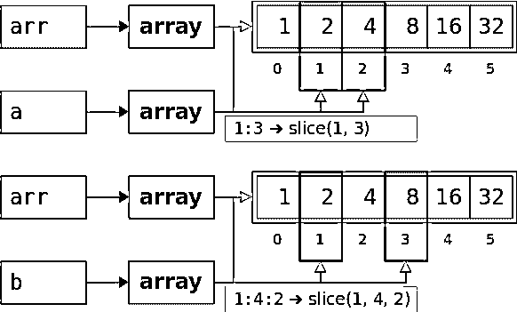

# 熊猫中的设置与拷贝警告:视图与拷贝

> 原文：<https://realpython.com/pandas-settingwithcopywarning/>

[**NumPy**](https://numpy.org/) 和 [**Pandas**](https://pandas.pydata.org/) 是非常全面、高效、灵活的数据操作 Python 工具。这两个库的熟练用户需要理解的一个重要概念是，数据是如何被引用为**浅层副本** ( **视图**)和**深层副本**(或者仅仅是**副本**)。Pandas 有时会发出一个`SettingWithCopyWarning`来警告用户对视图和副本的潜在不当使用。

在这篇文章中，你将了解到:

*   什么**视图**和**副本**在 NumPy 和熊猫
*   如何在 NumPy 和 Pandas 中正确使用视图和副本
*   为什么`SettingWithCopyWarning`发生在熊猫身上
*   如何避免在熊猫身上受伤

你首先会看到一个简短的解释什么是`SettingWithCopyWarning`以及如何避免它。您可能会发现这已经足够满足您的需求，但是您还可以更深入地了解 NumPy 和 Pandas 的细节，以了解更多关于副本和视图的信息。

**免费奖励:** [点击此处获取免费的 NumPy 资源指南](#)，它会为您指出提高 NumPy 技能的最佳教程、视频和书籍。

## 先决条件

为了遵循本文中的例子，您将需要 [Python 3.7](https://docs.python.org/3.7/) 或 [3.8](https://docs.python.org/3.8/) ，以及库 [NumPy](https://realpython.com/search?q=numpy) 和 [Pandas](https://realpython.com/search?q=pandas) 。本文是为 NumPy 1 . 18 . 1 版和 Pandas 1 . 0 . 3 版编写的。你可以用`pip`[安装它们:](https://packaging.python.org/tutorials/installing-packages/)

```py
$ python -m pip install -U "numpy==1.18.*" "pandas==1.0.*"
```

如果你喜欢 Anaconda T1 或 T2 Miniconda T3 发行版，你可以使用 T4 conda T5 软件包管理系统。要了解关于这种方法的更多信息，请查看[在 Windows 上为机器学习设置 Python](https://realpython.com/python-windows-machine-learning-setup/)。现在，在您的[环境](https://realpython.com/python-windows-machine-learning-setup/#understanding-conda-environments)中安装 NumPy 和 Pandas 就足够了:

```py
$ conda install numpy=1.18.* pandas=1.0.*
```

现在您已经安装了 NumPy 和 Pandas，您可以导入它们并检查它们的版本:

>>>

```py
>>> import numpy as np
>>> import pandas as pd

>>> np.__version__
'1.18.1'
>>> pd.__version__
'1.0.3'
```

就是这样。您已经具备了这篇文章的所有先决条件。您的版本可能略有不同，但下面的信息仍然适用。

**注:**本文要求你先有一些熊猫知识。对于后面的部分，您还需要一些 NumPy 知识。

要更新您的数字技能，您可以查看以下资源:

*   [NumPy 快速入门教程](https://numpy.org/doc/stable/user/quickstart.html)
*   [看 Ma，无 For 循环:用 NumPy 进行数组编程](https://realpython.com/numpy-array-programming/)
*   [使用 Matplotlib 进行 Python 绘图](https://realpython.com/lessons/numpy-review-optional/)

为了提醒自己关于熊猫的事情，你可以阅读以下内容:

*   [距离熊猫还有 10 分钟](https://pandas.pydata.org/pandas-docs/stable/getting_started/10min.html)
*   [熊猫数据帧 101](https://realpython.com/courses/pandas-dataframes-101/)
*   [熊猫数据框架:让数据工作变得愉快](https://realpython.com/pandas-dataframe/)
*   [使用熊猫和 Python 探索您的数据集](https://realpython.com/pandas-python-explore-dataset/)
*   [蟒蛇熊猫:诡计&你可能不知道的特点](https://realpython.com/python-pandas-tricks/)

现在你已经准备好开始学习视图、副本和`SettingWithCopyWarning`！

[*Remove ads*](/account/join/)

## `SettingWithCopyWarning`的一个例子

如果你和熊猫一起工作，你很可能已经看过一次行动。这很烦人，有时很难理解。然而，它的发布是有原因的。

关于`SettingWithCopyWarning`你应该知道的第一件事是，它是*而不是*一个[错误](https://docs.python.org/3/tutorial/errors.html)。这是一个[警告](https://docs.python.org/3/library/warnings.html)。它警告您，您可能已经做了一些会在代码中导致不想要的行为的事情。

让我们看一个例子。你将从[创建一个熊猫数据帧](https://realpython.com/pandas-dataframe/#creating-a-pandas-dataframe)开始:

>>>

```py
>>> data = {"x": 2**np.arange(5),
...         "y": 3**np.arange(5),
...         "z": np.array([45, 98, 24, 11, 64])}

>>> index = ["a", "b", "c", "d", "e"]

>>> df = pd.DataFrame(data=data, index=index)
>>> df
 x   y   z
a   1   1  45
b   2   3  98
c   4   9  24
d   8  27  11
e  16  81  64
```

这个例子创建了一个由[变量](https://realpython.com/python-variables/) `data`引用的[字典](https://realpython.com/python-dicts/)，它包含:

*   键`"x"`、`"y"`和`"z"`，它们将是数据帧的列标签
*   三个 [NumPy 数组](https://numpy.org/doc/stable/reference/arrays.ndarray.html)，保存数据帧的数据

用例程 [`numpy.arange()`](https://numpy.org/doc/stable/reference/generated/numpy.arange.html) 创建前两个数组，用 [`numpy.array()`](https://numpy.org/doc/stable/reference/generated/numpy.array.html) 创建最后一个数组。要了解更多关于`arange()`的信息，请查看 [NumPy arange():如何使用 np.arange()](https://realpython.com/how-to-use-numpy-arange/) 。

附加在变量`index`上的[列表](https://realpython.com/python-lists-tuples/)包含了[字符串](https://realpython.com/python-strings/) `"a"`、`"b"`、`"c"`、`"d"`和`"e"`，它们将成为数据帧的行标签。

最后，初始化包含来自`data`和`index`的信息的[数据帧](https://pandas.pydata.org/pandas-docs/stable/reference/api/pandas.DataFrame.html) `df`。你可以这样想象:

[](https://files.realpython.com/media/fig-01.923689cf9afe.png)

下面是数据帧中包含的主要信息的分类:

*   **紫色方框:**数据
*   **蓝色框:**列标签
*   **红框:**行标签

数据帧存储附加信息或元数据，包括其形状、数据类型等。

现在您已经有了一个数据框架，让我们试着获取一个`SettingWithCopyWarning`。您将从列`z`中取出所有小于 50 的值，并用零替换它们。你可以从创建一个遮罩开始，或者用[熊猫布尔运算符](https://realpython.com/lessons/how-pandas-uses-boolean-operators/)创建一个[滤镜](https://realpython.com/pandas-dataframe/#filtering-data):

>>>

```py
>>> mask = df["z"] < 50
>>> mask
a     True
b    False
c     True
d     True
e    False
Name: z, dtype: bool

>>> df[mask]
 x   y   z
a  1   1  45
c  4   9  24
d  8  27  11
```

`mask`是[熊猫系列](https://pandas.pydata.org/pandas-docs/stable/reference/api/pandas.Series.html)的实例，具有布尔数据和来自`df`的索引:

*   **`True`** 表示`df`中`z`的值小于`50`的行。
*   **`False`** 表示`df`中`z`的值为*而非*小于`50`的行。

`df[mask]`返回来自`df`的数据帧，其中`mask`为`True`。在这种情况下，您会得到行`a`、`c`和`d`。

如果您试图通过使用`mask`提取行`a`、`c`和`d`来改变`df`，您将得到一个`SettingWithCopyWarning`，而`df`将保持不变:

>>>

```py
>>> df[mask]["z"] = 0
__main__:1: SettingWithCopyWarning:
A value is trying to be set on a copy of a slice from a DataFrame.
Try using .loc[row_indexer,col_indexer] = value instead

See the caveats in the documentation: https://pandas.pydata.org/pandas-docs/stable/user_guide/indexing.html#returning-a-view-versus-a-copy

>>> df
 x   y   z
a   1   1  45
b   2   3  98
c   4   9  24
d   8  27  11
e  16  81  64
```

如您所见，向列`z`分配零失败。这张图片展示了整个过程:

[](https://files.realpython.com/media/fig-02.494ca4d6f8c3.png)

下面是上面代码示例中发生的情况:

*   **`df[mask]`** 返回一个全新的数据帧(用紫色标出)。该数据帧保存了来自`df`的数据的副本，这些数据对应于来自`mask`的`True`值(以绿色突出显示)。
*   **`df[mask]["z"] = 0`** 将新数据帧的列`z`修改为零，保持`df`不变。

通常情况下，你不会想要这样的！你想要修改`df`而不是一些没有被任何变量引用的中间数据结构。这就是为什么熊猫会发出一个`SettingWithCopyWarning`警告你这个可能的错误。

在这种情况下，修改`df`的正确方法是应用[访问器](https://realpython.com/pandas-dataframe/#accessing-and-modifying-data) [`.loc[]`](https://pandas.pydata.org/pandas-docs/stable/reference/api/pandas.DataFrame.loc.html) 、 [`.iloc[]`](https://pandas.pydata.org/pandas-docs/stable/reference/api/pandas.DataFrame.iloc.html) 、 [`.at[]`](https://pandas.pydata.org/pandas-docs/stable/reference/api/pandas.DataFrame.at.html) 或 [`.iat[]`](https://pandas.pydata.org/pandas-docs/stable/reference/api/pandas.DataFrame.iat.html) 中的一个:

>>>

```py
>>> df = pd.DataFrame(data=data, index=index)

>>> df.loc[mask, "z"] = 0
>>> df
 x   y   z
a   1   1   0
b   2   3  98
c   4   9   0
d   8  27   0
e  16  81  64
```

这种方法使您能够向为 DataFrame 赋值的单个方法提供两个参数`mask`和`"z"`。

解决此问题的另一种方法是更改评估顺序:

>>>

```py
>>> df = pd.DataFrame(data=data, index=index)

>>> df["z"]
a    45
b    98
c    24
d    11
e    64
Name: z, dtype: int64

>>> df["z"][mask] = 0
>>> df
 x   y   z
a   1   1   0
b   2   3  98
c   4   9   0
d   8  27   0
e  16  81  64
```

这个管用！您修改了`df`。这个过程是这样的:

[](https://files.realpython.com/media/fig-03.8a314d168d47.png)

这是图像的分解:

*   **`df["z"]`** 返回一个`Series`对象(用紫色标出)，该对象指向与`df`中的`z`列相同的*数据*，而不是其副本。
*   **`df["z"][mask] = 0`** 通过使用**链式赋值**将屏蔽值(以绿色突出显示)设置为零来修改此`Series`对象。
*   **`df`** 也被修改，因为`Series`对象`df["z"]`持有与`df`相同的数据。

您已经看到`df[mask]`包含数据的副本，而`df["z"]`指向与`df`相同的数据。熊猫用来决定你是否复制的规则非常复杂。幸运的是，有一些简单的方法可以给数据帧赋值并避免`SettingWithCopyWarning`。

调用访问器通常被认为是比链式赋值更好的实践，原因如下:

1.  当你使用单一方法时，修改`df`的意图对熊猫来说更加清晰。
2.  代码对读者来说更清晰。
3.  访问器往往具有更好的性能，尽管在大多数情况下您不会注意到这一点。

然而，使用访问器有时是不够的。他们也可能返回副本，在这种情况下，您可以获得一个`SettingWithCopyWarning`:

>>>

```py
>>> df = pd.DataFrame(data=data, index=index)

>>> df.loc[mask]["z"] = 0
__main__:1: SettingWithCopyWarning:
A value is trying to be set on a copy of a slice from a DataFrame.
Try using .loc[row_indexer,col_indexer] = value instead

See the caveats in the documentation: https://pandas.pydata.org/pandas-docs/stable/user_guide/indexing.html#returning-a-view-versus-a-copy
>>> df
 x   y   z
a   1   1  45
b   2   3  98
c   4   9  24
d   8  27  11
e  16  81  64
```

在这个例子中，和上一个例子一样，您使用了访问器`.loc[]`。赋值失败是因为`df.loc[mask]`返回一个新的数据帧，其中包含来自`df`的数据副本。然后`df.loc[mask]["z"] = 0`修改新的数据帧，而不是`df`。

一般来说，为了避免熊猫出现`SettingWithCopyWarning`，你应该做以下事情:

*   **避免像`df["z"][mask] = 0`和`df.loc[mask]["z"] = 0`那样结合两个或更多步进操作的链式分配**。
*   **只需像`df.loc[mask, "z"] = 0`一样进行一次步进操作，即可应用单次分配**。这可能涉及(也可能不涉及)访问器的使用，但它们肯定非常有用，而且通常是首选。

有了这些知识，你可以在大多数情况下成功地避免`SettingWithCopyWarning`和任何不想要的行为。但是，如果你想更深入地了解 NumPy、Pandas、views、copies 以及与`SettingWithCopyWarning`相关的问题，那么请继续阅读本文的其余部分。

[*Remove ads*](/account/join/)

## NumPy 和 Pandas 中的视图和副本

理解视图和副本是了解 NumPy 和 Pandas 如何操作数据的重要部分。它还可以帮助您避免错误和性能瓶颈。有时数据从内存的一部分复制到另一部分，但在其他情况下，两个或多个对象可以共享相同的数据，从而节省时间和内存。

### 了解 NumPy 中的视图和副本

让我们从创建一个 [NumPy 数组](https://numpy.org/doc/stable/reference/generated/numpy.ndarray.html)开始:

>>>

```py
>>> arr = np.array([1, 2, 4, 8, 16, 32])
>>> arr
array([ 1,  2,  4,  8, 16, 32])
```

现在已经有了`arr`，可以用它来创建其他数组。我们先把`arr` ( `2`和`8`)的第二个和第四个元素提取出来作为一个新数组。有几种方法可以做到这一点:

>>>

```py
>>> arr[1:4:2]
array([2, 8])

>>> arr[[1, 3]]
array([2, 8]))
```

如果您不熟悉数组索引，也不用担心。稍后你会学到更多关于这些和其他陈述的内容。现在，重要的是要注意这两个语句都返回`array([2, 8])`。然而，他们在表面下有不同的行为:

>>>

```py
>>> arr[1:4:2].base
array([ 1,  2,  4,  8, 16, 32])
>>> arr[1:4:2].flags.owndata
False

>>> arr[[1, 3]].base
>>> arr[[1, 3]].flags.owndata
True
```

乍一看，这似乎很奇怪。不同之处在于，`arr[1:4:2]`返回一个**浅拷贝**，而`arr[[1, 3]]`返回一个**深拷贝**。理解这种差异不仅对处理`SettingWithCopyWarning`至关重要，对用 NumPy 和 Pandas 处理大数据也是如此。

在下面几节中，您将了解更多关于 NumPy 和 Pandas 中的浅拷贝和深拷贝。

#### 数字视图

一个**浅拷贝**或**视图**是一个没有自己数据的 NumPy 数组。它查看原始数组中包含的数据。您可以使用 [`.view()`](https://numpy.org/doc/stable/reference/generated/numpy.ndarray.view.html) 创建一个数组视图:

>>>

```py
>>> view_of_arr = arr.view()
>>> view_of_arr
array([ 1,  2,  4,  8, 16, 32])

>>> view_of_arr.base
array([ 1,  2,  4,  8, 16, 32])

>>> view_of_arr.base is arr
True
```

您已经获得了数组`view_of_arr`，这是原始数组`arr`的一个视图或简单副本。`view_of_arr`的属性 [`.base`](https://numpy.org/doc/stable/reference/generated/numpy.ndarray.base.html) 就是`arr`本身。换句话说，`view_of_arr`不拥有任何数据——它使用属于`arr`的数据。您也可以使用属性 [`.flags`](https://numpy.org/doc/stable/reference/generated/numpy.ndarray.flags.html) 来验证这一点:

>>>

```py
>>> view_of_arr.flags.owndata
False
```

如你所见，`view_of_arr.flags.owndata`就是`False`。这意味着`view_of_arr`并不拥有数据，而是使用它的`.base`来获取数据:

[](https://files.realpython.com/media/fig-04.8f5b35e398f4.png)

上图显示`arr`和`view_of_arr`指向相同的数据值。

#### 份数

NumPy 数组的**深度副本**，有时也称为**副本**，是一个独立的 NumPy 数组，拥有自己的数据。深层副本的数据是通过将原始数组的元素复制到新数组中获得的。原件和副本是两个独立的实例。您可以使用 [`.copy()`](https://numpy.org/doc/stable/reference/generated/numpy.ndarray.copy.html) 创建数组的副本:

>>>

```py
>>> copy_of_arr = arr.copy()
>>> copy_of_arr
array([ 1,  2,  4,  8, 16, 32])

>>> copy_of_arr.base is None
True

>>> copy_of_arr.flags.owndata
True
```

如你所见，`copy_of_arr`没有`.base`。更准确的说，`copy_of_arr.base`的值是 [`None`](https://realpython.com/null-in-python/) 。属性`.flags.owndata`是`True`。这意味着`copy_of_arr`拥有数据:

[](https://files.realpython.com/media/fig-05.b2935843218e.png)

上图显示了`arr`和`copy_of_arr`包含数据值的不同实例。

#### 视图和副本之间的差异

视图和副本之间有两个非常重要的区别:

1.  视图不需要额外的数据存储，但是副本需要。
2.  修改原始阵列会影响其视图，反之亦然。然而，修改原始数组将*而不是*影响它的副本。

为了说明视图和副本之间的第一个区别，让我们比较一下`arr`、`view_of_arr`和`copy_of_arr`的大小。属性 [`.nbytes`](https://numpy.org/doc/stable/reference/generated/numpy.ndarray.nbytes.html) 返回数组元素消耗的内存:

>>>

```py
>>> arr.nbytes
48
>>> view_of_arr.nbytes
48
>>> copy_of_arr.nbytes
48
```

所有数组的内存量都是一样的:48 字节。每个数组查看 6 个 8 字节(64 位)的整数元素。总共有 48 个字节。

但是，如果您使用 [`sys.getsizeof()`](https://docs.python.org/3/library/sys.html#sys.getsizeof) 来获得直接归属于每个数组的内存量，那么您会看到不同之处:

>>>

```py
>>> from sys import getsizeof

>>> getsizeof(arr)
144
>>> getsizeof(view_of_arr)
96
>>> getsizeof(copy_of_arr)
144
```

`arr`和`copy_of_arr`各保存 144 字节。正如您之前看到的，总共 144 个字节中有 48 个字节是用于数据元素的。剩余的 96 个字节用于其他属性。`view_of_arr`只保存这 96 个字节，因为它没有自己的数据元素。

为了说明视图和副本之间的第二个区别，您可以修改原始数组的任何元素:

>>>

```py
>>> arr[1] = 64
>>> arr
array([ 1,  64,   4,   8,  16,  32])

>>> view_of_arr
array([ 1,  64,   4,   8,  16,  32])

>>> copy_of_arr
array([ 1,  2,  4,  8, 16, 32])
```

如您所见，视图也发生了变化，但副本保持不变。下图显示了该代码:

[](https://files.realpython.com/media/fig-06.568dfcf1521d.png)

视图被修改是因为它查看了`arr`的元素，而它的`.base`是原始数组。副本是不变的，因为它不与原始文件共享数据，所以对原始文件的更改根本不会影响它。

[*Remove ads*](/account/join/)

### 了解 Pandas 中的视图和副本

Pandas 还区分了视图和副本。您可以使用 [`.copy()`](https://pandas.pydata.org/pandas-docs/stable/reference/api/pandas.DataFrame.copy.html) 创建数据帧的视图或副本。参数`deep`决定您是想要查看(`deep=False`)还是复制(`deep=True`)。`deep`默认为`True`，所以你可以省略它得到一个副本:

>>>

```py
>>> df = pd.DataFrame(data=data, index=index)
>>> df
 x   y   z
a   1   1  45
b   2   3  98
c   4   9  24
d   8  27  11
e  16  81  64

>>> view_of_df = df.copy(deep=False)
>>> view_of_df
 x   y   z
a   1   1  45
b   2   3  98
c   4   9  24
d   8  27  11
e  16  81  64

>>> copy_of_df = df.copy()
>>> copy_of_df
 x   y   z
a   1   1  45
b   2   3  98
c   4   9  24
d   8  27  11
e  16  81  64
```

起初，`df`的视图和副本看起来是一样的。但是，如果您比较它们的数字表示，那么您可能会注意到这种微妙的差异:

>>>

```py
>>> view_of_df.to_numpy().base is df.to_numpy().base
True
>>> copy_of_df.to_numpy().base is df.to_numpy().base
False
```

这里， [`.to_numpy()`](https://pandas.pydata.org/pandas-docs/stable/reference/api/pandas.DataFrame.to_numpy.html) 返回保存数据帧数据的 NumPy 数组。你可以看到`df`和`view_of_df`有相同的`.base`，共享相同的数据。另一方面，`copy_of_df`包含不同的数据。

可以通过修改`df`来验证这一点:

>>>

```py
>>> df["z"] = 0
>>> df
 x   y  z
a   1   1  0
b   2   3  0
c   4   9  0
d   8  27  0
e  16  81  0

>>> view_of_df
 x   y  z
a   1   1  0
b   2   3  0
c   4   9  0
d   8  27  0
e  16  81  0

>>> copy_of_df
 x   y   z
a   1   1  45
b   2   3  98
c   4   9  24
d   8  27  11
e  16  81  64
```

您已经为`df`中的列`z`的所有元素赋了零。这导致了`view_of_df`的变化，但是`copy_of_df`保持不变。

行和列标签也表现出相同的行为:

>>>

```py
>>> view_of_df.index is df.index
True
>>> view_of_df.columns is df.columns
True

>>> copy_of_df.index is df.index
False
>>> copy_of_df.columns is df.columns
False
```

`df`和`view_of_df`共享相同的行和列标签，而`copy_of_df`有单独的索引实例。请记住，您不能修改`.index`和`.columns`的特定元素。它们是**不可变的**对象。

## 熊猫和熊猫的指数和切片

NumPy 中的基本[索引和切片类似于](https://numpy.org/doc/stable/user/quickstart.html#indexing-slicing-and-iterating)[列表和元组](https://realpython.com/python-lists-tuples/#list-elements-can-be-accessed-by-index)的[索引和切片](https://realpython.com/lessons/indexing-and-slicing/)。但是，NumPy 和 Pandas 都提供了额外的选项来引用对象及其部件并为其赋值。

NumPy 数组和 [Pandas 对象](https://pandas.pydata.org/pandas-docs/stable/getting_started/dsintro.html) ( `DataFrame`和`Series`)实现了[的特殊方法](https://diveintopython3.net/special-method-names.html#acts-like-dict)，这些方法能够以类似于[容器](https://docs.python.org/3/reference/datamodel.html#emulating-container-types)的方式引用、赋值和删除值:

*   [`.__getitem__()`](https://docs.python.org/3/reference/datamodel.html#object.__getitem__) 引用值。
*   [`.__setitem__()`](https://docs.python.org/3/reference/datamodel.html#object.__setitem__) 赋值。
*   [`.__delitem__()`](https://docs.python.org/3/reference/datamodel.html#object.__delitem__) 删除数值。

当您在类似 Python 容器的对象中引用、分配或删除数据时，通常会调用这些方法:

*   **`var = obj[key]`** 相当于`var = obj.__getitem__(key)`。
*   **`obj[key] = value`** 相当于`obj.__setitem__(key, value)`。
*   **`del obj[key]`** 相当于`obj.__delitem__(key)`。

参数`key`代表索引，可以是[整数](https://realpython.com/lessons/integers/)、[切片](https://docs.python.org/3/library/functions.html#slice)、元组、列表、NumPy 数组等等。

### NumPy 中的索引:副本和视图

在索引数组时，NumPy 有一套与副本和视图相关的严格规则。您获得的是原始数据的视图还是副本取决于您用来索引数组的方法:切片、整数索引或布尔索引。

#### 一维数组

切片是 Python 中一种众所周知的操作，用于从数组、列表或元组中获取特定数据。当您对 NumPy 数组进行切片时，您会看到数组的视图:

>>>

```py
>>> arr = np.array([1, 2, 4, 8, 16, 32])

>>> a = arr[1:3]
>>> a
array([2, 4])
>>> a.base
array([ 1,  2,  4,  8, 16, 32])
>>> a.base is arr
True
>>> a.flags.owndata
False

>>> b = arr[1:4:2]
>>> b
array([2, 8])
>>> b.base
array([ 1,  2,  4,  8, 16, 32])
>>> b.base is arr
True
>>> b.flags.owndata
False
```

您已经创建了原始数组`arr`，并将其分割成两个更小的数组`a`和`b`。`a`和`b`都以`arr`为基准，都没有自己的数据。相反，他们看的是`arr`的数据:

[](https://files.realpython.com/media/fig-07.e944c8736991.png)

上图中的绿色指数是通过切片获得的。`a`和`b`都查看绿色矩形中`arr`的对应元素。

**注意:**当你有一个很大的原始数组，只需要其中的一小部分时，可以切片后调用`.copy()`，用`del`语句删除指向原始的变量。这样，您可以保留副本并从内存中删除原始数组。

虽然切片会返回一个视图，但是在其他情况下，从一个数组创建另一个数组实际上会产生一个副本。

用整数列表索引数组会返回原始数组的副本。副本包含原始数组中的元素，这些元素的索引出现在列表中:

>>>

```py
>>> c = arr[[1, 3]]
>>> c
array([2, 8])
>>> c.base is None
True
>>> c.flags.owndata
True
```

结果数组`c`包含来自`arr`的元素，索引为`1`和`3`。这些元素具有值`2`和`8`。在这种情况下，`c`是`arr`的副本，它的`.base`是`None`，它有自己的数据:

[](https://files.realpython.com/media/fig-08.c2a65031a90d.png)

具有所选索引`1`和`3`的`arr`的元素被复制到新数组`c`中。复印完成后，`arr`和`c`是独立的。

还可以用掩码数组或列表来索引 NumPy 数组。遮罩是与原始形状相同的布尔数组或列表。您将得到一个原始数组的副本，它只包含与掩码的`True`值相对应的元素:

>>>

```py
>>> mask = [False, True, False, True, False, False]
>>> d = arr[mask]
>>> d
array([2, 8])
>>> d.base is None
True
>>> d.flags.owndata
True
```

列表`mask`在第二和第四位置具有`True`值。这就是为什么数组`d`只包含来自`arr`的第二个和第四个位置的元素。和`c`的情况一样，`d`是副本，它的`.base`是`None`，它有自己的数据:

[](https://files.realpython.com/media/fig-09.75e65f7fc3c6.png)

绿色矩形中的`arr`元素对应于来自`mask`的`True`值。这些元素被复制到新数组`d`中。复制后，`arr`和`d`是独立的。

**注意:**可以用另一个 NumPy 的整数数组[代替一个 list，但是*不是*一个 tuple](https://numpy.org/doc/stable/user/basics.indexing.html#dealing-with-variable-numbers-of-indices-within-programs) 。

概括一下，这里是您到目前为止创建的引用`arr`的变量:

```py
# `arr` is the original array:
arr = np.array([1, 2, 4, 8, 16, 32])

# `a` and `b` are views created through slicing:
a = arr[1:3]
b = arr[1:4:2]

# `c` and `d` are copies created through integer and Boolean indexing:
c = arr[[1, 3]]
d = arr[[False, True, False, True, False, False]]
```

记住，这些例子展示了如何在数组中引用数据。引用数据在切片数组时返回视图，在使用索引和掩码数组时返回副本。另一方面，*赋值*总是修改数组的原始数据。

现在您已经有了所有这些数组，让我们看看当您改变原始数组时会发生什么:

>>>

```py
>>> arr[1] = 64
>>> arr
array([  1, 64,   4,   8,  16,  32])
>>> a
array([64,   4])
>>> b
array([64,   8])
>>> c
array([2, 8])
>>> d
array([2, 8])
```

您已经将`arr`的第二个值从`2`更改为`64`。值`2`也出现在派生数组`a`、`b`、`c`和`d`中。然而，只有视图`a`和`b`被修改:

[](https://files.realpython.com/media/fig-10.1de666b64a20.png)

视图`a`和`b`查看`arr`的数据，包括它的第二个元素。这就是你看到变化的原因。副本`c`和`d`保持不变，因为它们与`arr`没有公共数据。它们独立于`arr`。

#### 数字中的链式索引

这个带有`a`和`b`的行为看起来和之前熊猫的例子有什么相似之处吗？有可能，因为**链式索引**的概念也适用于 NumPy:

>>>

```py
>>> arr = np.array([1, 2, 4, 8, 16, 32])
>>> arr[1:4:2][0] = 64
>>> arr
array([ 1, 64,  4,  8, 16, 32])

>>> arr = np.array([1, 2, 4, 8, 16, 32])
>>> arr[[1, 3]][0] = 64
>>> arr
array([ 1,  2,  4,  8, 16, 32])
```

这个例子说明了在 NumPy 中使用链式索引时副本和视图之间的区别。

在第一种情况下，`arr[1:4:2]`返回一个视图，该视图引用了`arr`的数据，并包含元素`2`和`8`。语句`arr[1:4:2][0] = 64`将这些元素中的第一个修改为`64`。这个变化在`arr`和`arr[1:4:2]`返回的视图中都是可见的。

在第二种情况下，`arr[[1, 3]]`返回一个副本，其中也包含元素`2`和`8`。但是这些与`arr`中的元素不同。它们是新的。`arr[[1, 3]][0] = 64`修改`arr[[1, 3]]`返回的副本，保持`arr`不变。

这与熊猫产生`SettingWithCopyWarning`的行为本质上是一样的，但这种警告在 NumPy 中并不存在。

#### 多维数组

引用多维数组遵循相同的原则:

*   分割数组会返回视图。
*   使用索引和掩码数组返回副本。

将索引和掩码数组与切片相结合也是可能的。在这种情况下，你会得到副本。

这里有几个例子:

>>>

```py
>>> arr = np.array([[  1,   2,    4,    8],
...                 [ 16,  32,   64,  128],
...                 [256, 512, 1024, 2048]])
>>> arr
array([[   1,    2,    4,    8],
 [  16,   32,   64,  128],
 [ 256,  512, 1024, 2048]])

>>> a = arr[:, 1:3]  # Take columns 1 and 2
>>> a
array([[   2,    4],
 [  32,   64],
 [ 512, 1024]])
>>> a.base
array([[   1,    2,    4,    8],
 [  16,   32,   64,  128],
 [ 256,  512, 1024, 2048]])
>>> a.base is arr
True

>>> b = arr[:, 1:4:2]  # Take columns 1 and 3
>>> b
array([[   2,    8],
 [  32,  128],
 [ 512, 2048]])
>>> b.base
array([[   1,    2,    4,    8],
 [  16,   32,   64,  128],
 [ 256,  512, 1024, 2048]])
>>> b.base is arr
True

>>> c = arr[:, [1, 3]]  # Take columns 1 and 3
>>> c
array([[   2,    8],
 [  32,  128],
 [ 512, 2048]])
>>> c.base
array([[   2,   32,  512],
 [   8,  128, 2048]])
>>> c.base is arr
False

>>> d = arr[:, [False, True, False, True]]  # Take columns 1 and 3
>>> d
array([[   2,    8],
 [  32,  128],
 [ 512, 2048]])
>>> d.base
array([[   2,   32,  512],
 [   8,  128, 2048]])
>>> d.base is arr
False
```

在这个例子中，你从二维数组`arr`开始。对行应用切片。使用冒号语法(`:`)，相当于`slice(None)`，意味着您想要获取所有行。

当您使用列的切片`1:3`和`1:4:2`时，会返回视图`a`和`b`。然而，当你应用列表`[1, 3]`和遮罩`[False, True, False, True]`时，你会得到副本`c`和`d`。

`a`和`b`的`.base`都是`arr`本身。`c`和`d`都有自己与`arr`无关的基地。

与一维数组一样，当您修改原始数组时，视图会发生变化，因为它们看到的是相同的数据，但副本保持不变:

>>>

```py
>>> arr[0, 1] = 100
>>> arr
array([[   1,  100,    4,    8],
 [  16,   32,   64,  128],
 [ 256,  512, 1024, 2048]])

>>> a
array([[ 100,    4],
 [  32,   64],
 [ 512, 1024]])

>>> b
array([[ 100,    8],
 [  32,  128],
 [ 512, 2048]])

>>> c
array([[   2,    8],
 [  32,  128],
 [ 512, 2048]])

>>> d
array([[   2,    8],
 [  32,  128],
 [ 512, 2048]])
```

您将`arr`中的值`2`更改为`100`，并修改了视图`a`和`b`中的相应元素。副本`c`和`d`不能这样修改。

要了解更多关于索引 NumPy 数组的信息，可以查看[官方快速入门教程](https://numpy.org/doc/stable/user/quickstart.html)和[索引教程](https://numpy.org/doc/stable/user/basics.indexing.html)。

[*Remove ads*](/account/join/)

### 熊猫的索引:拷贝和浏览

您已经了解了如何在 NumPy 中使用不同的索引选项来引用实际数据(一个视图，或浅层副本)或新复制的数据(深层副本，或只是副本)。NumPy 对此有一套严格的规则。

Pandas 非常依赖 NumPy 阵列，但也提供了额外的功能和灵活性。正因为如此，返回视图和副本的规则更加复杂，也不那么简单。它们取决于数据的布局、数据类型和其他细节。事实上，Pandas 通常不保证视图或副本是否会被引用。

**注:**熊猫的索引是一个非常广泛的话题。正确使用[熊猫数据结构](https://pandas.pydata.org/pandas-docs/stable/getting_started/dsintro.html)是必不可少的。您可以使用多种技术:

*   [字典式的](https://realpython.com/python-dicts/#defining-a-dictionary)符号
*   类属性(点)符号
*   存取器`.loc[]`、`.iloc[]`、`.at[]`和`.iat`

更多信息，请查看官方文档和[熊猫数据框架:让数据工作变得愉快](https://realpython.com/pandas-dataframe/)。

在这一节中，您将看到两个熊猫与 NumPy 行为相似的例子。首先，您可以看到用一个切片访问`df`的前三行会返回一个视图:

>>>

```py
>>> df = pd.DataFrame(data=data, index=index)

>>> df["a":"c"]
 x  y   z
a  1  1  45
b  2  3  98
c  4  9  24

>>> df["a":"c"].to_numpy().base
array([[ 1,  2,  4,  8, 16],
 [ 1,  3,  9, 27, 81],
 [45, 98, 24, 11, 64]])

>>> df["a":"c"].to_numpy().base is df.to_numpy().base
True
```

该视图查看与`df`相同的数据。

另一方面，用标签列表访问`df`的前两列会返回一个副本:

>>>

```py
>>> df = pd.DataFrame(data=data, index=index)

>>> df[["x", "y"]]
 x   y
a   1   1
b   2   3
c   4   9
d   8  27
e  16  81

>>> df[["x", "y"]].to_numpy().base
array([[ 1,  2,  4,  8, 16],
 [ 1,  3,  9, 27, 81]])

>>> df[["x", "y"]].to_numpy().base is df.to_numpy().base
False
```

副本的`.base`与`df`不同。

在下一节中，您将找到与索引数据帧和返回视图和副本相关的更多细节。你会看到一些情况，熊猫的行为变得更加复杂，与 NumPy 不同。

## 在 Pandas 中使用视图和副本

正如您已经了解的，当您试图修改数据的副本而不是原始数据时，Pandas 可以发出一个`SettingWithCopyWarning`。这通常遵循链式索引。

在本节中，您将看到一些产生`SettingWithCopyWarning`的特定案例。您将确定原因并学习如何通过正确使用视图、副本和访问器来避免它们。

### 链式索引`SettingWithCopyWarning`和

在第一个例子中，你已经看到了`SettingWithCopyWarning`如何与链式索引一起工作。让我们详细说明一下。

您已经创建了对应于`df["z"] < 50`的数据帧和遮罩`Series`对象:

>>>

```py
>>> df = pd.DataFrame(data=data, index=index)
>>> df
 x   y   z
a   1   1  45
b   2   3  98
c   4   9  24
d   8  27  11
e  16  81  64

>>> mask = df["z"] < 50
>>> mask
a     True
b    False
c     True
d     True
e    False
Name: z, dtype: bool
```

你已经知道赋值`df[mask]["z"] = 0`失败了。在这种情况下，您会得到一个`SettingWithCopyWarning`:

>>>

```py
>>> df[mask]["z"] = 0
__main__:1: SettingWithCopyWarning:
A value is trying to be set on a copy of a slice from a DataFrame.
Try using .loc[row_indexer,col_indexer] = value instead

See the caveats in the documentation: https://pandas.pydata.org/pandas-docs/stable/user_guide/indexing.html#returning-a-view-versus-a-copy

>>> df
 x   y   z
a   1   1  45
b   2   3  98
c   4   9  24
d   8  27  11
e  16  81  64
```

赋值失败，因为`df[mask]`返回一个副本。更准确地说，分配是在副本上进行的，而`df`不受影响。

你也看到了在熊猫身上，[评估顺序很重要](https://pandas.pydata.org/docs/user_guide/indexing.html#evaluation-order-matters)。在某些情况下，您可以切换操作顺序以使代码正常工作:

>>>

```py
>>> df["z"][mask] = 0
>>> df
 x   y   z
a   1   1   0
b   2   3  98
c   4   9   0
d   8  27   0
e  16  81  64
```

`df["z"][mask] = 0`成功，你得到没有`SettingWithCopyWarning`的修改后的`df`。

建议使用访问器，但是使用它们也会遇到麻烦:

>>>

```py
>>> df = pd.DataFrame(data=data, index=index)
>>> df.loc[mask]["z"] = 0
__main__:1: SettingWithCopyWarning:
A value is trying to be set on a copy of a slice from a DataFrame.
Try using .loc[row_indexer,col_indexer] = value instead

See the caveats in the documentation: https://pandas.pydata.org/pandas-docs/stable/user_guide/indexing.html#returning-a-view-versus-a-copy
>>> df
 x   y   z
a   1   1  45
b   2   3  98
c   4   9  24
d   8  27  11
e  16  81  64
```

在这种情况下，`df.loc[mask]`返回一个副本，赋值失败，Pandas 正确地发出警告。

在某些情况下，Pandas 未能发现问题，并且副本上的作业在没有`SettingWithCopyWarning`的情况下通过:

>>>

```py
>>> df = pd.DataFrame(data=data, index=index)
>>> df.loc[["a", "c", "e"]]["z"] = 0  # Assignment fails, no warning
>>> df
 x   y   z
a   1   1  45
b   2   3  98
c   4   9  24
d   8  27  11
e  16  81  64
```

在这里，您不会收到一个`SettingWithCopyWarning`并且`df`不会被更改，因为`df.loc[["a", "c", "e"]]`使用一个索引列表并返回一个副本，而不是一个视图。

在某些情况下，代码是有效的，但 Pandas 还是会发出警告:

>>>

```py
>>> df = pd.DataFrame(data=data, index=index)
>>> df[:3]["z"] = 0  # Assignment succeeds, with warning
__main__:1: SettingWithCopyWarning:
A value is trying to be set on a copy of a slice from a DataFrame.
Try using .loc[row_indexer,col_indexer] = value instead

See the caveats in the documentation: https://pandas.pydata.org/pandas-docs/stable/user_guide/indexing.html#returning-a-view-versus-a-copy

>>> df
 x   y   z
a   1   1   0
b   2   3   0
c   4   9   0
d   8  27  11
e  16  81  64

>>> df = pd.DataFrame(data=data, index=index)
>>> df.loc["a":"c"]["z"] = 0  # Assignment succeeds, with warning
__main__:1: SettingWithCopyWarning:
A value is trying to be set on a copy of a slice from a DataFrame.
Try using .loc[row_indexer,col_indexer] = value instead

See the caveats in the documentation: https://pandas.pydata.org/pandas-docs/stable/user_guide/indexing.html#returning-a-view-versus-a-copy
>>> df
 x   y   z
a   1   1   0
b   2   3   0
c   4   9   0
d   8  27  11
e  16  81  64
```

在这两种情况下，选择带有切片的前三行并获取视图。视图和`df`上的分配都成功。但是你还是收到一个`SettingWithCopyWarning`。

执行此类操作的推荐方式是避免链式索引。访问器在这方面很有帮助:

>>>

```py
>>> df = pd.DataFrame(data=data, index=index)
>>> df.loc[mask, "z"] = 0
>>> df
 x   y   z
a   1   1   0
b   2   3  98
c   4   9   0
d   8  27   0
e  16  81  64
```

这种方法使用一个方法调用，没有链式索引，代码和您的意图都更加清晰。另外，这是一种稍微更有效的分配数据的方式。

[*Remove ads*](/account/join/)

### 数据类型对视图、副本和`SettingWithCopyWarning` 的影响

在 Pandas 中，创建视图和创建副本之间的区别也取决于所使用的数据类型。在决定是返回视图还是副本时，Pandas 处理单一数据类型的数据帧与处理多种数据类型的数据帧的方式不同。

让我们关注本例中的数据类型:

>>>

```py
>>> df = pd.DataFrame(data=data, index=index)

>>> df
 x   y   z
a   1   1  45
b   2   3  98
c   4   9  24
d   8  27  11
e  16  81  64

>>> df.dtypes
x    int64
y    int64
z    int64
dtype: object
```

您已经创建了包含所有整数列的数据框架。这三列都有相同的数据类型，这一点很重要！在这种情况下，您可以选择带有切片的行并获得视图:

>>>

```py
>>> df["b":"d"]["z"] = 0
__main__:1: SettingWithCopyWarning:
A value is trying to be set on a copy of a slice from a DataFrame.
Try using .loc[row_indexer,col_indexer] = value instead

See the caveats in the documentation: https://pandas.pydata.org/pandas-docs/stable/user_guide/indexing.html#returning-a-view-versus-a-copy

>>> df
 x   y   z
a   1   1  45
b   2   3   0
c   4   9   0
d   8  27   0
e  16  81  64
```

这反映了到目前为止您在本文中看到的行为。`df["b":"d"]`返回一个视图并允许你修改原始数据。这就是赋值`df["b":"d"]["z"] = 0`成功的原因。请注意，在这种情况下，无论是否成功更改为`df`，您都会获得一个`SettingWithCopyWarning`。

如果您的数据帧包含不同类型的列，那么您可能会得到一个副本而不是一个视图，在这种情况下，相同的赋值将失败:

>>>

```py
>>> df = pd.DataFrame(data=data, index=index).astype(dtype={"z": float})
>>> df
 x   y     z
a   1   1  45.0
b   2   3  98.0
c   4   9  24.0
d   8  27  11.0
e  16  81  64.0

>>> df.dtypes
x      int64
y      int64
z    float64
dtype: object

>>> df["b":"d"]["z"] = 0
__main__:1: SettingWithCopyWarning:
A value is trying to be set on a copy of a slice from a DataFrame.
Try using .loc[row_indexer,col_indexer] = value instead

See the caveats in the documentation: https://pandas.pydata.org/pandas-docs/stable/user_guide/indexing.html#returning-a-view-versus-a-copy

>>> df
 x   y     z
a   1   1  45.0
b   2   3  98.0
c   4   9  24.0
d   8  27  11.0
e  16  81  64.0
```

在这种情况下，您使用了[。astype()](https://pandas.pydata.org/pandas-docs/stable/reference/api/pandas.DataFrame.astype.html) 创建一个有两个整数列和一个浮点列的 DataFrame。与前面的例子相反，`df["b":"d"]`现在返回一个副本，所以赋值`df["b":"d"]["z"] = 0`失败，`df`保持不变。

当有疑问时，避免混淆，在整个代码中使用`.loc[]`、`.iloc[]`、`.at[]`和`.iat[]`访问方法！

### 分层索引`SettingWithCopyWarning`和

**分级索引**或[多索引](https://pandas.pydata.org/pandas-docs/stable/user_guide/advanced.html)，是 Pandas 的一个特性，它使您能够根据层次结构在多个级别上组织行或列索引。这是一个强大的功能，增加了熊猫的灵活性，并使数据能够在两个以上的维度上工作。

使用元组作为行或列标签来创建分层索引:

>>>

```py
>>> df = pd.DataFrame(
...     data={("powers", "x"): 2**np.arange(5),
...           ("powers", "y"): 3**np.arange(5),
...           ("random", "z"): np.array([45, 98, 24, 11, 64])},
...     index=["a", "b", "c", "d", "e"]
... )

>>> df
 powers     random
 x   y      z
a      1   1     45
b      2   3     98
c      4   9     24
d      8  27     11
e     16  81     64
```

现在您有了具有两级列索引的数据框架`df`:

1.  **第一级**包含标签`powers`和`random`。
2.  **第二级**有标签`x`和`y`，分别属于`powers`和`z`，属于`random`。

表达式`df["powers"]`将返回一个 DataFrame，其中包含`powers`下面的所有列，即列`x`和`y`。如果你只想得到列`x`，那么你可以同时通过`powers`和`x`。正确的做法是使用表达式`df["powers", "x"]`:

>>>

```py
>>> df["powers"]
 x   y
a   1   1
b   2   3
c   4   9
d   8  27
e  16  81

>>> df["powers", "x"]
a     1
b     2
c     4
d     8
e    16
Name: (powers, x), dtype: int64

>>> df["powers", "x"] = 0
>>> df
 powers     random
 x   y      z
a      0   1     45
b      0   3     98
c      0   9     24
d      0  27     11
e      0  81     64
```

在多级列索引的情况下，这是获取和设置列的一种方式。您还可以对多索引数据帧使用访问器来获取或修改数据:

>>>

```py
>>> df = pd.DataFrame(
...     data={("powers", "x"): 2**np.arange(5),
...           ("powers", "y"): 3**np.arange(5),
...           ("random", "z"): np.array([45, 98, 24, 11, 64])},
...     index=["a", "b", "c", "d", "e"]
... )

>>> df.loc[["a", "b"], "powers"]
 x  y
a  1  1
b  2  3
```

上面的例子使用了`.loc[]`来返回一个 DataFrame，其中包含行`a`和`b`以及列`x`和`y`，它们位于`powers`的下面。您可以类似地获得特定的列(或行):

>>>

```py
>>> df.loc[["a", "b"], ("powers", "x")]
a    1
b    2
Name: (powers, x), dtype: int64
```

在这个例子中，您指定您想要行`a`和`b`与列`x`的交集，该列在`powers`的下面。要获得一个单独的列，可以传递索引元组`("powers", "x")`并获得一个`Series`对象作为结果。

您可以使用这种方法修改具有分层索引的数据帧的元素:

>>>

```py
>>> df.loc[["a", "b"], ("powers", "x")] = 0
>>> df
 powers     random
 x   y      z
a      0   1     45
b      0   3     98
c      4   9     24
d      8  27     11
e     16  81     64
```

在上面的例子中，您避免了带访问器(`df.loc[["a", "b"], ("powers", "x")]`)和不带访问器(`df["powers", "x"]`)的链式索引。

正如您之前看到的，链式索引会导致一个`SettingWithCopyWarning`:

>>>

```py
>>> df = pd.DataFrame(
...     data={("powers", "x"): 2**np.arange(5),
...           ("powers", "y"): 3**np.arange(5),
...           ("random", "z"): np.array([45, 98, 24, 11, 64])},
...     index=["a", "b", "c", "d", "e"]
... )

>>> df
 powers     random
 x   y      z
a      1   1     45
b      2   3     98
c      4   9     24
d      8  27     11
e     16  81     64

>>> df["powers"]
 x   y
a   1   1
b   2   3
c   4   9
d   8  27
e  16  81

>>> df["powers"]["x"] = 0
__main__:1: SettingWithCopyWarning:
A value is trying to be set on a copy of a slice from a DataFrame.
Try using .loc[row_indexer,col_indexer] = value instead

See the caveats in the documentation: https://pandas.pydata.org/pandas-docs/stable/user_guide/indexing.html#returning-a-view-versus-a-copy

>>> df
 powers     random
 x   y      z
a      0   1     45
b      0   3     98
c      0   9     24
d      0  27     11
e      0  81     64
```

这里，`df["powers"]`返回一个带有列`x`和`y`的数据帧。这只是一个指向来自`df`的数据的视图，所以赋值成功并且`df`被修改。但是熊猫还是发出了`SettingWithCopyWarning`。

如果您重复相同的代码，但是在`df`的列中使用不同的数据类型，那么您将得到不同的行为:

>>>

```py
>>> df = pd.DataFrame(
...     data={("powers", "x"): 2**np.arange(5),
...           ("powers", "y"): 3**np.arange(5),
...           ("random", "z"): np.array([45, 98, 24, 11, 64], dtype=float)},
...     index=["a", "b", "c", "d", "e"]
... )

>>> df
 powers     random
 x   y      z
a      1   1   45.0
b      2   3   98.0
c      4   9   24.0
d      8  27   11.0
e     16  81   64.0

>>> df["powers"]
 x   y
a   1   1
b   2   3
c   4   9
d   8  27
e  16  81

>>> df["powers"]["x"] = 0
__main__:1: SettingWithCopyWarning:
A value is trying to be set on a copy of a slice from a DataFrame.
Try using .loc[row_indexer,col_indexer] = value instead

See the caveats in the documentation: https://pandas.pydata.org/pandas-docs/stable/user_guide/indexing.html#returning-a-view-versus-a-copy

>>> df
 powers     random
 x   y      z
a      1   1   45.0
b      2   3   98.0
c      4   9   24.0
d      8  27   11.0
e     16  81   64.0
```

这次，`df`的数据类型不止一种，所以`df["powers"]`返回一个副本，`df["powers"]["x"] = 0`在这个副本上做了更改，`df`保持不变，给你一个`SettingWithCopyWarning`。

修改`df`的推荐方法是避免链式赋值。您已经了解到访问器非常方便，但是并不总是需要它们:

>>>

```py
>>> df = pd.DataFrame(
...     data={("powers", "x"): 2**np.arange(5),
...           ("powers", "y"): 3**np.arange(5),
...           ("random", "z"): np.array([45, 98, 24, 11, 64], dtype=float)},
...     index=["a", "b", "c", "d", "e"]
... )

>>> df["powers", "x"] = 0
>>> df
 powers     random
 x   y      z
a      0   1     45
b      0   3     98
c      0   9     24
d      0  27     11
e      0  81     64

>>> df = pd.DataFrame(
...     data={("powers", "x"): 2**np.arange(5),
...           ("powers", "y"): 3**np.arange(5),
...           ("random", "z"): np.array([45, 98, 24, 11, 64], dtype=float)},
...     index=["a", "b", "c", "d", "e"]
... )

>>> df.loc[:, ("powers", "x")] = 0
>>> df
 powers     random
 x   y      z
a      0   1   45.0
b      0   3   98.0
c      0   9   24.0
d      0  27   11.0
e      0  81   64.0
```

在这两种情况下，您都可以获得没有`SettingWithCopyWarning`的修改后的数据帧`df`。

[*Remove ads*](/account/join/)

## 改变默认的`SettingWithCopyWarning`行为

`SettingWithCopyWarning`是一个警告，不是一个错误。您的代码在发布时仍然会执行，即使它可能不会像预期的那样工作。

要改变这种行为，可以用 [`pandas.set_option()`](https://pandas.pydata.org/pandas-docs/stable/reference/api/pandas.set_option.html) 修改熊猫`mode.chained_assignment`选项。您可以使用以下设置:

*   **`pd.set_option("mode.chained_assignment", "raise")`** 引出一个`SettingWithCopyException`。
*   **`pd.set_option("mode.chained_assignment", "warn")`** 发出一个`SettingWithCopyWarning`。这是默认行为。
*   **`pd.set_option("mode.chained_assignment", None)`** 抑制警告和错误。

例如，这段代码将引发一个`SettingWithCopyException`，而不是发出一个`SettingWithCopyWarning`:

>>>

```py
>>> df = pd.DataFrame(
...     data={("powers", "x"): 2**np.arange(5),
...           ("powers", "y"): 3**np.arange(5),
...           ("random", "z"): np.array([45, 98, 24, 11, 64], dtype=float)},
...     index=["a", "b", "c", "d", "e"]
... )

>>> pd.set_option("mode.chained_assignment", "raise")

>>> df["powers"]["x"] = 0
```

除了修改默认行为，您还可以使用 [`get_option()`](https://pandas.pydata.org/pandas-docs/stable/reference/api/pandas.get_option.html) 来检索与`mode.chained_assignment`相关的当前设置:

>>>

```py
>>> pd.get_option("mode.chained_assignment")
'raise'
```

在这种情况下，您得到了`"raise"`，因为您用`set_option()`改变了行为。正常情况下，`pd.get_option("mode.chained_assignment")`返回`"warn"`。

虽然您可以抑制它，但是请记住,`SettingWithCopyWarning`在通知您不正确的代码时非常有用。

## 结论

在本文中，您了解了 NumPy 和 Pandas 中的视图和副本，以及它们的行为有何不同。您还看到了什么是`SettingWithCopyWarning`以及如何避免它所指向的细微错误。

**具体来说，您已经了解了以下内容:**

*   NumPy 和 Pandas 中基于索引的赋值可以返回**视图**或**副本**。
*   视图和副本都是有用的，但是它们有不同的行为。
*   必须特别注意避免在副本上设置不需要的值。
*   Pandas 中的访问器对于正确分配和引用数据是非常有用的对象。

理解视图和副本是正确使用 NumPy 和 Pandas 的重要要求，尤其是在处理大数据时。现在，您已经对这些概念有了坚实的理解，您已经准备好深入数据科学这个激动人心的世界了！

如果你有任何问题或意见，请写在下面的评论区。******